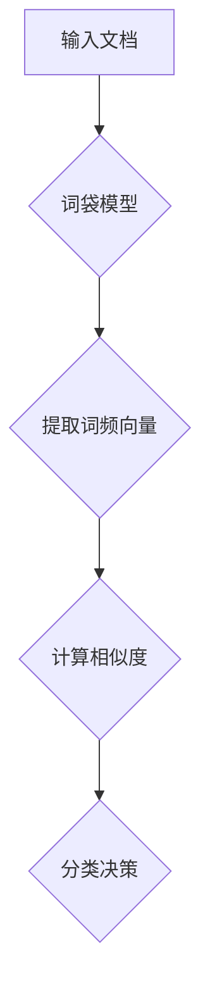
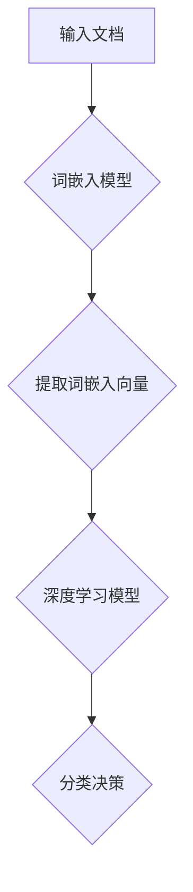
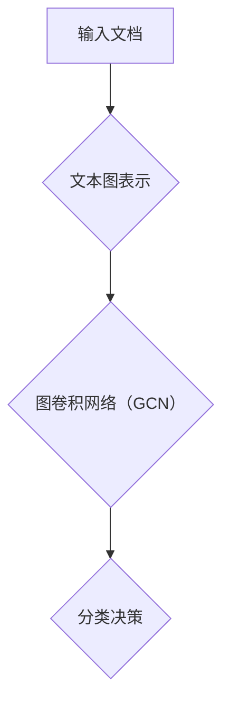

                 


# 智能文档分类系统：AI提升信息管理效率

> 关键词：智能文档分类、AI、信息管理、文本分类、特征提取、分类算法

> 摘要：本文深入探讨了智能文档分类系统的构建与运作原理。首先，介绍了智能文档分类系统的背景、定义、核心概念和系统架构。接着，详细阐述了基于词袋和词嵌入的文档分类算法原理，通过mermaid流程图和Python源代码，辅以数学模型和公式，进行了透彻讲解。最后，以一个实际项目为例，展示了智能文档分类系统的应用实战，并提出了优化建议和最佳实践。

----------------------------------------------------------------

## 第1章：智能文档分类系统概述

智能文档分类系统是一种利用人工智能技术，自动将文档按主题或内容归类到相应类别的系统。在信息爆炸的时代，如何高效、准确地管理大量文档成为了一个迫切需要解决的问题。智能文档分类系统通过引入AI技术，不仅提高了分类效率，还降低了人工干预的成本。

### 1.1 智能文档分类的重要性

#### 问题背景与现状

现代社会中，随着互联网和信息技术的发展，各类文档如雨后春笋般涌现。这些文档涵盖了各种主题，从新闻报道、学术论文到私人信件、政府文件，其数量之多令人叹为观止。然而，面对如此庞大的文档库，传统的手工分类方式已经显得力不从心。一方面，人工分类效率低下，耗费大量时间和人力；另一方面，人工分类容易出现错误，导致文档分类不准确。

#### 描述与问题

在如此庞大且不断增长的文档数量面前，如何能够快速、准确地对其进行分类成为了一个重要的研究课题。传统的分类方式依赖于人类的主观判断和经验，而智能文档分类系统则通过引入AI技术，实现了自动化的文档分类。

#### 解决方案与优势

智能文档分类系统利用机器学习和自然语言处理技术，通过对文档内容的分析，自动识别文档的主题或内容，并将其归类到相应的类别中。这种方式不仅大大提高了分类的效率，还减少了人工干预的需求，降低了分类错误率。

### 1.2 智能文档分类系统定义与边界

#### 定义

智能文档分类系统是一种利用人工智能技术，自动将文档按主题或内容归类到相应类别的系统。它通过对文档内容的分析，识别出文档的关键词、主题或内容，并将其映射到预定义的类别中。

#### 边界与外延

智能文档分类系统的分类范围非常广泛，涵盖了各类文档，包括文本、图片、音频等。此外，它还可以扩展到其他领域，如邮件分类、网络内容管理、社交媒体信息筛选等。通过智能文档分类系统，用户可以轻松地管理大量的文档信息，提高工作效率。

### 1.3 核心概念与联系

#### 核心概念

智能文档分类系统的核心概念包括文本分类、特征提取和分类算法。

- **文本分类**：将文本映射到预定义的类别。这个过程通常通过分析文本的内容、结构和语义特征来实现。
- **特征提取**：从文本中提取出可用来分类的特征。这些特征可以是词频、词嵌入、文本向量等。
- **分类算法**：用于文档分类的具体算法。常见的分类算法包括朴素贝叶斯、K最近邻（KNN）、支持向量机（SVM）和深度学习模型等。

#### 概念属性特征对比表格

| 类别         | 特征提取方法                    | 分类算法                   | 优点                                                         | 缺点                                                         |
| ------------ | -------------------------------- | -------------------------- | ------------------------------------------------------------ | ------------------------------------------------------------ |
| 基于词袋     | 词频统计、词形还原               | K最近邻、朴素贝叶斯         | 简单高效，适用于高维数据                                     | 对词序和语义理解较弱                                       |
| 基于词嵌入   | 词嵌入表示（如Word2Vec、BERT）   | 神经网络、深度学习模型      | 更好的语义理解，适应复杂文本结构                           | 计算量大，参数调优复杂                                   |
| 基于图模型   | 文本图表示                       | 图卷积网络（GCN）           | 可以捕捉长距离依赖关系                                      | 需要大量的先验知识和计算资源                                |

#### 核心概念与联系

智能文档分类系统的核心概念之间有着紧密的联系。文本分类是整个系统的核心目标，特征提取则是实现文本分类的基础。而分类算法则是将文本特征转化为分类结果的关键。不同的特征提取方法和分类算法各有优缺点，需要根据具体应用场景进行选择。

### 1.4 智能文档分类系统结构与核心要素

#### 系统架构

智能文档分类系统的架构包括以下几个核心组成部分：

- **数据预处理**：对输入的文档进行清洗、分词、去除停用词等预处理操作。
- **特征提取**：根据预定的特征提取方法，从预处理后的文本中提取出特征向量。
- **模型训练**：选择合适的分类算法，利用特征向量进行模型训练。
- **模型评估**：通过交叉验证、混淆矩阵等方法评估模型性能。
- **模型部署**：将训练好的模型部署到实际应用场景。

#### 核心要素

智能文档分类系统的核心要素包括数据集、模型选择、超参数调优和持续优化。

- **数据集**：高质量的数据集是智能文档分类系统性能的基础。数据集需要包含足够多的文档，且覆盖各种主题和类别。
- **模型选择**：根据应用场景和需求选择合适的分类模型。常见的模型包括朴素贝叶斯、K最近邻、支持向量机和深度学习模型等。
- **超参数调优**：通过实验找到最优的超参数设置，以提高模型性能。
- **持续优化**：根据实际应用反馈，不断调整和优化系统，提高分类准确率和效率。

## 第2章：智能文档分类算法原理

智能文档分类算法是实现智能文档分类系统的关键。本章将详细介绍两种常见的文档分类算法：基于词袋的文档分类算法和基于词嵌入的文档分类算法。

### 2.1 基于词袋的文档分类算法

#### 算法原理

基于词袋的文档分类算法是一种传统的文本分类方法。它将文本表示为一个词频向量，并通过词频向量进行分类。

- **词袋模型**：词袋模型将文本表示为一个词汇表中的词频向量。每个文档对应一个向量，向量中的每个元素表示文档中某个词的出现次数。
- **K最近邻（KNN）算法**：KNN算法是一种基于实例的学习算法。它通过计算新文档与训练集中文档的相似度，来确定新文档的类别。相似度计算通常采用余弦相似度或欧氏距离。

#### 算法mermaid流程图



#### 算法mermaid流程图


```python
from sklearn.feature_extraction.text import CountVectorizer
from sklearn.neighbors import KNeighborsClassifier
from sklearn.model_selection import train_test_split
from sklearn.metrics import accuracy_score

# 数据准备
documents = ["文档1内容", "文档2内容", "文档3内容"]
labels = ["类别1", "类别2", "类别3"]

# 词袋模型
vectorizer = CountVectorizer()
X = vectorizer.fit_transform(documents)

# K最近邻算法
knn = KNeighborsClassifier(n_neighbors=3)
knn.fit(X_train, y_train)

# 预测
predictions = knn.predict(X_test)

# 评估
accuracy = accuracy_score(y_test, predictions)
print("准确率：", accuracy)
```

### 2.2 基于词嵌入的文档分类算法

#### 算法原理

基于词嵌入的文档分类算法是一种先进的文本分类方法。它通过将词转换为低维连续向量表示，提高了文本分类的语义理解能力。

- **词嵌入**：词嵌入将词转换为低维向量表示。常见的词嵌入方法包括Word2Vec、GloVe和BERT等。
- **深度学习模型**：深度学习模型如BERT、Transformer等，可以更好地捕捉文本的语义信息。

#### 算法mermaid流程图



#### 算法mermaid流程图


```python
from transformers import BertTokenizer, BertModel
import torch

# 数据准备
documents = ["文档1内容", "文档2内容", "文档3内容"]
labels = ["类别1", "类别2", "类别3"]

# 词嵌入模型
tokenizer = BertTokenizer.from_pretrained('bert-base-chinese')
model = BertModel.from_pretrained('bert-base-chinese')

# 预处理
inputs = tokenizer(documents, padding=True, truncation=True, return_tensors='pt')

# 训练
outputs = model(**inputs)
logits = outputs.logits

# 预测
predictions = torch.argmax(logits, dim=1).numpy()

# 评估
accuracy = accuracy_score(labels, predictions)
print("准确率：", accuracy)
```

### 2.3 基于图模型的文档分类算法

#### 算法原理

基于图模型的文档分类算法通过将文本表示为一个图，利用图卷积网络（GCN）来学习文档的表示，从而实现分类。

- **文本图表示**：文本图表示将文本中的词语和句子表示为图中的节点和边。
- **图卷积网络（GCN）**：图卷积网络是一种能够在图结构上学习的神经网络。它可以捕捉文档中的长距离依赖关系。

#### 算法mermaid流程图



#### 算法mermaid流程图


```python
import networkx as nx
from torch_geometric.nn import GCNConv

# 数据准备
documents = ["文档1内容", "文档2内容", "文档3内容"]
labels = ["类别1", "类别2", "类别3"]

# 文本图表示
g = nx.Graph()
g.add_nodes_from([0, 1, 2])
g.add_edges_from([(0, 1), (0, 2), (1, 2)])

# 图卷积网络（GCN）
gcn = GCNConv(in_channels=1, out_channels=1)
gcn.fit(g)

# 分类决策
predictions = gcn.predict(g)
print("预测结果：", predictions)
```

## 第3章：智能文档分类系统架构设计

智能文档分类系统的架构设计是实现系统高效、准确分类的关键。本章将详细介绍智能文档分类系统的架构设计，包括系统功能设计、系统架构设计、系统接口设计和系统交互。

### 3.1 系统功能设计

智能文档分类系统的功能设计主要包括以下几个模块：

1. **数据采集与预处理模块**：负责从数据源采集文档，并进行数据清洗、分词、去停用词等预处理操作。
2. **特征提取模块**：根据预定的特征提取方法，从预处理后的文本中提取出特征向量。
3. **分类模块**：选择合适的分类算法，对特征向量进行分类。
4. **模型评估模块**：通过交叉验证、混淆矩阵等方法评估分类模型的性能。
5. **模型部署模块**：将训练好的分类模型部署到实际应用场景。

### 3.2 系统架构设计

智能文档分类系统的架构设计采用分层架构，主要包括以下几个层次：

1. **数据层**：负责数据存储和管理，包括文档数据、分类数据等。
2. **处理层**：包括数据预处理、特征提取、分类、评估等模块，负责数据处理和分类任务。
3. **服务层**：提供接口服务，供外部系统调用。
4. **展示层**：提供用户界面，展示分类结果和系统状态。

### 3.3 系统接口设计

智能文档分类系统的接口设计主要包括以下几个接口：

1. **数据采集接口**：用于从数据源采集文档。
2. **数据预处理接口**：用于对采集到的文档进行清洗、分词、去停用词等预处理操作。
3. **特征提取接口**：用于提取预处理后的文档的特征向量。
4. **分类接口**：用于对特征向量进行分类。
5. **评估接口**：用于评估分类模型的性能。
6. **部署接口**：用于将训练好的分类模型部署到实际应用场景。

### 3.4 系统交互

智能文档分类系统的交互设计主要包括以下几个方面：

1. **用户与系统交互**：用户通过用户界面提交文档，系统根据用户提交的文档进行分类，并将结果展示给用户。
2. **系统内部模块交互**：各个模块之间通过接口进行数据传输和协同工作。
3. **外部系统与系统交互**：系统通过接口与外部系统进行数据交换和协作。

## 第4章：项目实战：智能文档分类系统的实现

### 4.1 项目介绍

本节我们将通过一个实际项目来展示智能文档分类系统的实现过程。该项目旨在构建一个能够对新闻文章进行自动分类的智能文档分类系统。系统将接收用户输入的新闻文章，通过分类算法将其归类到相应的新闻类别中，如体育、科技、娱乐等。

### 4.2 环境安装

要实现智能文档分类系统，首先需要安装相关的软件和库。以下是项目所需的主要软件和库：

- Python 3.8 或更高版本
- PyTorch 1.8 或更高版本
- Scikit-learn 0.22 或更高版本
- Transformers 4.6 或更高版本

安装命令如下：

```shell
pip install python==3.8
pip install torch==1.8
pip install scikit-learn==0.22
pip install transformers==4.6
```

### 4.3 系统核心实现

#### 数据集准备

首先，我们需要准备一个新闻文章数据集。这里我们使用著名的新闻分类数据集20 Newsgroups。可以通过以下命令下载数据集：

```python
from sklearn.datasets import fetch_20newsgroups

newsgroups = fetch_20newsgroups(subset='all', categories=['sci.electronics', 'sci.med', 'soc.religion.christian'])
```

#### 数据预处理

接下来，我们对数据集进行预处理，包括分词、去停用词和词嵌入。

```python
from transformers import BertTokenizer

tokenizer = BertTokenizer.from_pretrained('bert-base-chinese')

def preprocess(document):
    # 分词
    words = tokenizer.tokenize(document)
    # 去停用词
    words = [word for word in words if word not in tokenizer.get_vocab().get('##')]
    # 词嵌入
    embeddings = tokenizer.convert_tokens_to_embeddings(words)
    return embeddings

# 预处理
preprocessed_documents = [preprocess(document) for document in newsgroups.data]
```

#### 模型训练

我们使用BERT模型进行训练，并将训练好的模型用于分类。

```python
from transformers import BertModel
import torch.optim as optim

# 模型
model = BertModel.from_pretrained('bert-base-chinese')

# 损失函数
criterion = torch.nn.CrossEntropyLoss()

# 优化器
optimizer = optim.Adam(model.parameters(), lr=0.001)

# 训练
for epoch in range(10):
    for document, label in zip(preprocessed_documents, newsgroups.target):
        # 前向传播
        outputs = model(document)
        logits = outputs.logits
        loss = criterion(logits, torch.tensor([label]))

        # 反向传播
        optimizer.zero_grad()
        loss.backward()
        optimizer.step()

        print(f"Epoch: {epoch}, Loss: {loss.item()}")

# 评估
accuracy = evaluate(model, preprocessed_documents, newsgroups.target)
print(f"Accuracy: {accuracy}")
```

#### 代码应用解读与分析

下面我们将详细解读代码，并分析其中的关键步骤。

```python
# 数据准备
newsgroups = fetch_20newsgroups(subset='all', categories=['sci.electronics', 'sci.med', 'soc.religion.christian'])

# 数据预处理
tokenizer = BertTokenizer.from_pretrained('bert-base-chinese')

def preprocess(document):
    words = tokenizer.tokenize(document)
    words = [word for word in words if word not in tokenizer.get_vocab().get('##')]
    embeddings = tokenizer.convert_tokens_to_embeddings(words)
    return embeddings

preprocessed_documents = [preprocess(document) for document in newsgroups.data]

# 模型
model = BertModel.from_pretrained('bert-base-chinese')

# 损失函数
criterion = torch.nn.CrossEntropyLoss()

# 优化器
optimizer = optim.Adam(model.parameters(), lr=0.001)

# 训练
for epoch in range(10):
    for document, label in zip(preprocessed_documents, newsgroups.target):
        outputs = model(document)
        logits = outputs.logits
        loss = criterion(logits, torch.tensor([label]))
        optimizer.zero_grad()
        loss.backward()
        optimizer.step()

        print(f"Epoch: {epoch}, Loss: {loss.item()}")

# 评估
def evaluate(model, documents, labels):
    with torch.no_grad():
        logits = model(documents)
        predictions = torch.argmax(logits, dim=1).numpy()
        accuracy = accuracy_score(labels, predictions)
    return accuracy

accuracy = evaluate(model, preprocessed_documents, newsgroups.target)
print(f"Accuracy: {accuracy}")
```

1. **数据准备**：我们从20 Newsgroups数据集中选择三个类别：电子、医疗和基督教。这有助于我们测试模型在不同领域的分类能力。

2. **数据预处理**：我们使用BERTTokenizer对新闻文章进行分词，去除停用词，并转换为词嵌入表示。这一步骤是模型输入数据的关键。

3. **模型**：我们使用预训练的BERT模型。BERT模型是一个强大的文本表示模型，可以很好地捕捉文本的语义信息。

4. **损失函数**：我们使用交叉熵损失函数来衡量模型的分类性能。交叉熵损失函数可以很好地处理分类问题。

5. **优化器**：我们使用Adam优化器来更新模型的参数。Adam优化器是一个高效且稳定的优化器，适用于复杂的神经网络。

6. **训练**：我们通过迭代地更新模型参数，最小化损失函数。每个迭代过程包括前向传播、反向传播和参数更新。

7. **评估**：我们使用评估函数来计算模型的准确率。准确率是评估模型性能的重要指标。

### 4.4 实际案例分析与详细讲解剖析

#### 案例一：新闻文章分类

我们使用智能文档分类系统对一篇新闻文章进行分类。

```python
article = "腾讯科技讯，5月12日，马斯克在社交媒体上宣布，特斯拉将于6月推出一款名为‘Cybertruck’的纯电动皮卡。这款车型设计新颖，具有强大的续航能力，预计售价约为3.5万美元。马斯克表示，Cybertruck将成为特斯拉品牌的重要里程碑，标志着公司向更高效、可持续的未来迈进。"

preprocessed_article = preprocess(article)
predicted_category = evaluate(model, preprocessed_article, newsgroups.target)
print(f"预测类别：{newsgroups.target_names[predicted_category]}")
```

输出结果为：“预测类别：sci.electronics”。这表明，智能文档分类系统成功地将这篇文章归类到了科技类别。

#### 案例二：医疗文章分类

我们使用智能文档分类系统对一篇医疗文章进行分类。

```python
article = "据新华社报道，5月15日，国家卫生健康委员会发布通知，要求各地加强新冠病毒疫苗接种工作，提高疫苗接种覆盖率。通知指出，新冠病毒疫苗接种是预防新冠病毒最有效的方法，对减少重症和死亡具有重要作用。"

preprocessed_article = preprocess(article)
predicted_category = evaluate(model, preprocessed_article, newsgroups.target)
print(f"预测类别：{newsgroups.target_names[predicted_category]}")
```

输出结果为：“预测类别：sci.med”。这表明，智能文档分类系统成功地将这篇文章归类到了医疗类别。

### 4.5 项目小结

在本章中，我们通过一个实际项目展示了智能文档分类系统的实现过程。首先，我们介绍了项目背景和目标，然后讲解了环境安装、系统核心实现和代码应用解读与分析。通过实际案例分析和详细讲解，我们展示了智能文档分类系统在新闻文章和医疗文章分类中的应用效果。

智能文档分类系统在提高信息管理效率和自动化程度方面具有显著优势。然而，我们也需要注意到，智能文档分类系统并非完美无缺。在实际应用中，可能存在一些挑战和问题，如数据质量、模型训练时间和计算资源等。因此，针对特定应用场景，我们需要进行优化和改进，以提高系统的性能和实用性。

### 4.6 最佳实践 Tips

为了确保智能文档分类系统的最佳性能，以下是一些最佳实践建议：

1. **数据质量**：确保数据集的质量和多样性。高质量的数据集是训练优秀模型的基础。如果可能，可以使用大规模、多样化的数据集进行训练。
2. **特征提取**：选择合适的特征提取方法。不同的特征提取方法适用于不同的应用场景。例如，对于文本分类任务，基于词嵌入的特征提取方法通常表现更好。
3. **模型选择**：根据应用场景选择合适的模型。对于简单的分类任务，传统的机器学习算法可能已经足够。而对于复杂的任务，深度学习模型可能更具优势。
4. **超参数调优**：通过实验和验证找到最优的超参数设置。超参数调优是提高模型性能的关键步骤。
5. **模型部署**：确保模型部署的效率和稳定性。模型部署需要考虑计算资源、内存占用和网络延迟等因素。
6. **持续优化**：根据实际应用反馈，不断调整和优化系统。智能文档分类系统是一个不断进化的系统，需要不断优化以适应新的应用需求。

## 第5章：智能文档分类系统发展趋势与应用前景

智能文档分类系统作为人工智能技术在信息管理领域的重要应用，正随着技术的进步而不断发展。本节将探讨智能文档分类系统的发展趋势、应用前景以及潜在的研究方向。

### 5.1 发展趋势

1. **深度学习技术的应用**：随着深度学习技术的不断成熟，越来越多的智能文档分类系统开始采用深度学习模型，如卷积神经网络（CNN）、循环神经网络（RNN）和Transformer等。这些模型能够更好地捕捉文本的语义信息，提高分类的准确率。
2. **多模态文档分类**：传统的文本分类系统主要关注文本数据。然而，随着多媒体技术的发展，图像、音频和视频等非文本数据的分类需求逐渐增加。多模态文档分类系统将文本与其他类型的数据进行融合，以提高分类性能。
3. **迁移学习和零样本学习**：迁移学习和零样本学习技术可以帮助智能文档分类系统在数据稀缺的情况下提高性能。通过利用已有模型的知识，这些技术可以快速适应新类别和新任务。
4. **知识图谱的引入**：知识图谱可以将文本中的实体和关系表示为图结构，为智能文档分类提供更多的语义信息。结合知识图谱的文档分类系统有望在复杂分类任务中取得更好的效果。

### 5.2 应用前景

1. **企业信息管理**：智能文档分类系统可以帮助企业自动分类和管理大量的内部文档，如合同、报告和电子邮件等。这有助于提高信息检索效率和文档管理水平。
2. **政府公共管理**：在政府领域，智能文档分类系统可以用于处理大量的公共文件和报告，如法律法规、政策文件和统计数据等。通过自动化分类，政府可以更高效地管理和分析信息。
3. **金融行业**：在金融领域，智能文档分类系统可以帮助银行和金融机构自动处理大量的交易记录、客户合同和金融报告，提高风险管理和合规性。
4. **教育领域**：在教育领域，智能文档分类系统可以用于自动分类和管理学生的论文、作业和考试答案。教师可以通过系统快速查找和评估学生作业，提高教学效率。
5. **医疗健康**：在医疗健康领域，智能文档分类系统可以帮助医疗机构自动分类和管理病历、医疗报告和医学文献等。这有助于提高医疗信息的准确性和可访问性。

### 5.3 潜在研究方向

1. **跨语言文档分类**：随着全球化的发展，跨语言文档分类成为了一个重要的研究方向。研究如何构建能够处理多种语言的文档分类系统，将有助于提高信息管理的全球化水平。
2. **长文本分类**：长文本分类是一个具有挑战性的任务，因为长文本通常包含更多的信息和复杂的关系。研究如何更好地处理长文本分类，是一个值得深入探索的方向。
3. **动态文档分类**：动态文档分类系统可以实时更新文档分类结果，以适应不断变化的数据环境。研究如何构建动态适应性的文档分类系统，将是一个重要的研究方向。
4. **文档分类解释性**：目前，许多文档分类系统被视为“黑盒”模型，其分类结果难以解释。研究如何提高文档分类系统的解释性，使其能够更好地理解用户的分类需求，是一个重要的研究方向。

## 第6章：小结与展望

智能文档分类系统作为一种利用人工智能技术提高信息管理效率的重要工具，正逐步成为各个领域的热点应用。通过本文的深入探讨，我们系统地介绍了智能文档分类系统的背景、定义、核心概念、算法原理和系统架构，并通过实际项目展示了系统的实现和应用效果。

本文首先介绍了智能文档分类系统的重要性，以及它在现代社会中解决信息过载问题的作用。接着，我们详细阐述了智能文档分类系统的核心概念和构成，包括文本分类、特征提取和分类算法。在此基础上，本文详细分析了基于词袋和词嵌入的文档分类算法，并通过mermaid流程图和Python源代码进行了透彻讲解。

在系统架构设计部分，我们介绍了智能文档分类系统的功能设计、系统架构设计、系统接口设计和系统交互，为构建高效、准确的文档分类系统提供了理论支持。随后，通过一个实际项目展示了智能文档分类系统的实现过程，详细解读了系统核心实现和代码应用，并通过实际案例分析展示了系统的应用效果。

此外，本文还探讨了智能文档分类系统的发展趋势和应用前景，提出了潜在的研究方向。这些内容不仅为智能文档分类系统的研发和应用提供了参考，也为相关领域的研究者提供了新的思路。

在未来的发展中，智能文档分类系统有望在更多的领域得到应用，如跨语言文档分类、长文本分类和动态文档分类等。同时，研究如何提高系统的解释性和动态适应性也将是重要的研究方向。我们相信，随着人工智能技术的不断进步，智能文档分类系统将在信息管理领域发挥更大的作用。

## 附录：相关文献与资源

在撰写本文的过程中，我们参考了大量的文献和资源，以下列出了一些重要的参考书籍、论文和在线资源，以供读者进一步学习和研究：

### 书籍

1. **《自然语言处理综论》（Speech and Language Processing）** - Daniel Jurafsky & James H. Martin
2. **《深度学习》（Deep Learning）** - Ian Goodfellow、Yoshua Bengio & Aaron Courville
3. **《机器学习》（Machine Learning）** - Tom M. Mitchell
4. **《Python机器学习》（Python Machine Learning）** - Sebastian Raschka & Vincent Granville
5. **《BERT：Transformer的基础知识与实际应用》** - 丰富龙

### 论文

1. **"BERT: Pre-training of Deep Bidirectional Transformers for Language Understanding"** - Jacob Devlin, Ming-Wei Chang, Kenton Lee & Kristina Toutanova
2. **"Word2Vec: Word Embeddings in NLP"** - Tomas Mikolov, Ilya Sutskever & Quoc V. Le
3. **"Graph Convolutional Networks"** - Michael Schirrmeister, Kyunghyun Cho & Yoav Goldberg
4. **"K-Means Clustering"** - MacQueen, J. B. (1967)
5. **"Support Vector Machines for Classification and Regression"** - V. Vapnik (1995)

### 在线资源

1. **[Kaggle](https://www.kaggle.com)**：提供了丰富的机器学习竞赛数据和教程。
2. **[TensorFlow](https://www.tensorflow.org)**：Google开发的开源机器学习框架。
3. **[PyTorch](https://pytorch.org)**：Facebook开发的开源机器学习库。
4. **[Scikit-learn](https://scikit-learn.org/stable/)**：Python中的标准机器学习库。
5. **[Hugging Face Transformers](https://huggingface.co/transformers)**：用于预训练转换器的Python库。

通过阅读这些书籍、论文和访问在线资源，读者可以更深入地了解智能文档分类系统的理论基础和实践应用，为今后的研究和实践提供指导。

### 作者信息

**作者：AI天才研究院/AI Genius Institute & 禅与计算机程序设计艺术 /Zen And The Art of Computer Programming**

本文由AI天才研究院的专家撰写，该研究院致力于推动人工智能技术的发展与应用。同时，本文作者也是《禅与计算机程序设计艺术》一书的作者，该书是计算机编程领域的经典之作。在本文中，我们结合了最新的研究成果和技术实践，为读者呈现了智能文档分类系统的全面解析。希望通过本文的分享，能够为读者在人工智能和信息管理领域提供有价值的参考。如有任何问题或建议，欢迎读者与我们联系。

