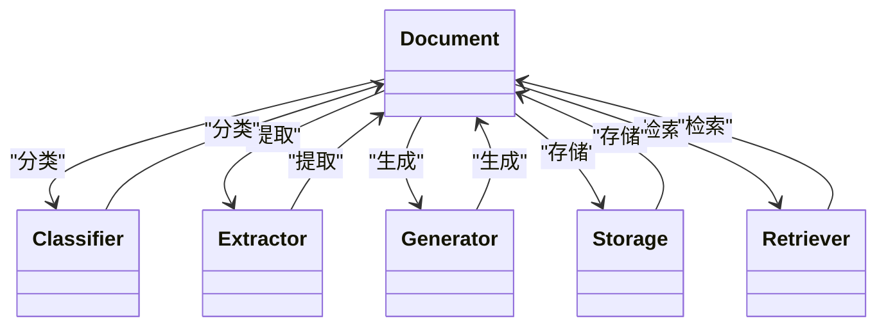
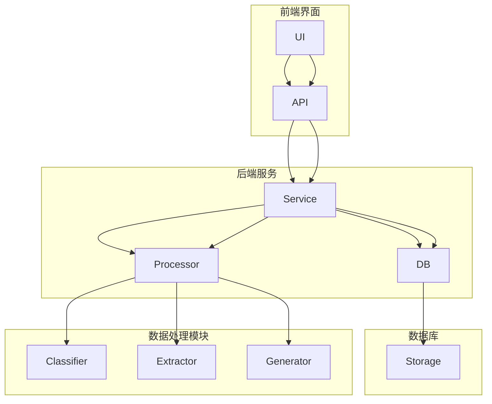
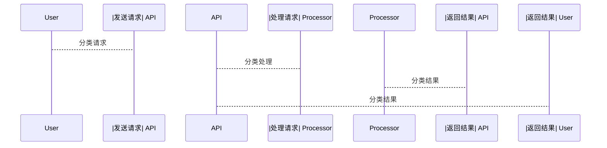
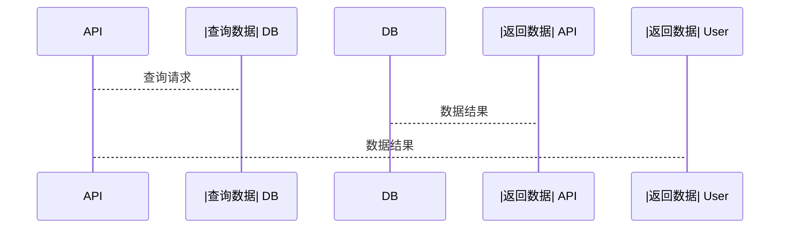
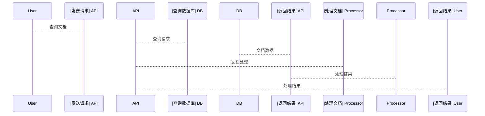
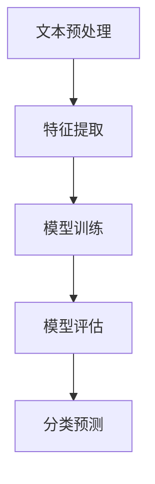
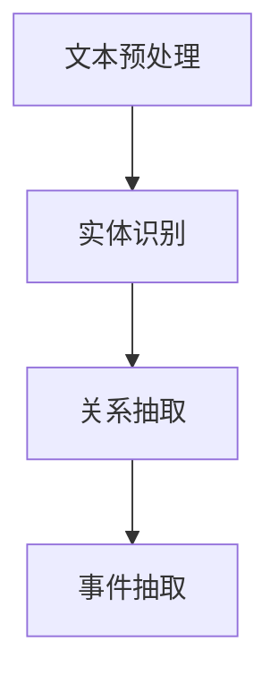
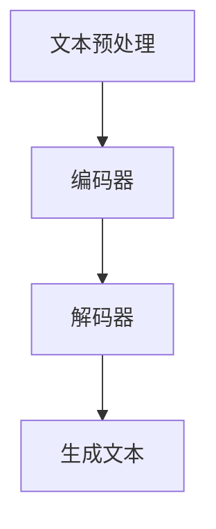

                 


### 《智能文档处理：AI提升企业信息管理效率》目录大纲

#### 第一部分：智能文档处理概述

**1.1 智能文档处理技术简介**

- **1.1.1 智能文档处理的背景与重要性**
  - 文档处理在企业运营中的关键作用
  - AI技术的崛起与文档处理的深度融合
- **1.1.2 智能文档处理的挑战与机遇**
  - 数据量与处理速度的挑战
  - 精准度与用户需求的机遇
- **1.2 AI在文档处理中的应用**
  - **1.2.1 自然语言处理（NLP）**
    - 语言模型与词向量
    - 文本分类与情感分析
  - **1.2.2 机器学习与深度学习**
    - 特征提取与模型训练
    - 神经网络与深度学习架构
  - **1.2.3 文档处理技术的未来发展**
    - 自动化与智能化
    - 数据安全与隐私保护
- **1.3 智能文档处理的核心概念与联系**
  - **1.3.1 核心概念解析**
    - 文档处理、自然语言处理、机器学习
  - **1.3.2 概念属性特征对比表格**
    - 对比文档处理技术与AI技术
  - **1.3.3 ER实体关系图架构**
    - 构建文档处理的实体关系模型

#### 第二部分：智能文档处理技术详解

**2.1 文本分类算法**

- **2.1.1 算法原理**
  - **2.1.1.1 文本分类的核心概念**
    - 文本表示方法
    - 分类算法原理
  - **2.1.1.2 文本分类的优势与应用场景**
    - 自动化文档分类
    - 搜索引擎关键词提取
- **2.1.2 Mermaid流程图**
  - 展示文本分类算法的流程
- **2.1.3 Python源代码示例**
  - **2.1.3.1 文本预处理**
    - 清洗、去停用词、词干提取
  - **2.1.3.2 特征提取**
    - TF-IDF、Word2Vec
  - **2.1.3.3 分类器训练**
    - 支持向量机、朴素贝叶斯、神经网络
- **2.1.4 数学模型和公式**
  - **2.1.4.1 文本表示模型**
    - 概率分布模型
  - **2.1.4.2 分类模型**
    - 决策边界公式
- **2.1.5 举例说明**
  - 示例文档分类实践

**2.2 信息抽取算法**

- **2.2.1 算法原理**
  - **2.2.1.1 信息抽取的目标与任务**
    - 实体识别
    - 关系抽取
  - **2.2.1.2 信息抽取的优势与应用场景**
    - 自动化文档摘要
    - 数据库构建
- **2.2.2 Mermaid流程图**
  - 展示信息抽取算法的流程
- **2.2.3 Python源代码示例**
  - **2.2.3.1 文本预处理**
    - 清洗、去停用词、词干提取
  - **2.2.3.2 特征提取**
    - 词嵌入
  - **2.2.3.3 模型训练**
    - 序列标注模型
- **2.2.4 数学模型和公式**
  - **2.2.4.1 实体识别模型**
    - 条件随机场（CRF）
  - **2.2.4.2 关系抽取模型**
    - 双向编码器（BERT）
- **2.2.5 举例说明**
  - 示例信息抽取实践

**2.3 文本生成算法**

- **2.3.1 算法原理**
  - **2.3.1.1 文本生成的核心概念**
    - 循环神经网络（RNN）
    - 生成对抗网络（GAN）
  - **2.3.1.2 文本生成的优势与应用场景**
    - 自动摘要生成
    - 文本生成对抗训练
- **2.3.2 Mermaid流程图**
  - 展示文本生成算法的流程
- **2.3.3 Python源代码示例**
  - **2.3.3.1 文本预处理**
    - 清洗、编码
  - **2.3.3.2 模型训练**
    - 语言模型训练
  - **2.3.3.3 文本生成**
    - 输出解码
- **2.3.4 数学模型和公式**
  - **2.3.4.1 RNN模型**
    - 隐藏状态转移方程
  - **2.3.4.2 GAN模型**
    - 生成器和判别器的对抗训练
- **2.3.5 举例说明**
  - 示例文本生成实践

#### 第三部分：AI提升企业信息管理效率

**3.1 AI提升企业信息管理效率的案例分析**

- **3.1.1 案例背景**
  - 案例企业的文档处理需求
- **3.1.2 案例分析**
  - 智能文档处理技术的应用效果
- **3.1.3 案例总结**
  - 经验与启示

**3.2 AI在文档处理中的应用场景**

- **3.2.1 客户服务与自动化回复**
  - 自动化客户服务机器人
- **3.2.2 合同管理与审核**
  - 合同自动化审核系统
- **3.2.3 报告生成与摘要提取**
  - 自动化报告生成与摘要提取
- **3.2.4 知识图谱构建**
  - 构建企业知识图谱

**3.3 企业信息管理效率提升的策略**

- **3.3.1 技术选择与优化**
  - 选择合适的文档处理技术
  - 技术优化与性能提升
- **3.3.2 组织管理与流程优化**
  - 优化文档管理流程
  - 提高组织协作效率
- **3.3.3 数据安全与隐私保护**
  - 数据安全策略
  - 隐私保护法规遵守

**3.4 未来展望与挑战**

- **3.4.1 AI技术在文档处理领域的发展趋势**
  - 新技术的应用与趋势
- **3.4.2 企业面临的挑战与应对策略**
  - 面临的技术挑战与应对措施

### 文章摘要

本文系统地介绍了智能文档处理技术及其在AI领域的应用，探讨了AI如何提升企业信息管理效率。通过文本分类、信息抽取和文本生成算法的详细分析，展示了AI技术在文档处理中的实际应用场景。同时，本文结合实际案例，分析了AI提升企业信息管理效率的策略，并展望了未来的发展趋势。文章旨在为读者提供关于智能文档处理的全面了解，帮助企业在信息化管理中更好地应用AI技术。

#### 文章关键词

- 智能文档处理
- AI技术
- 文本分类
- 信息抽取
- 文本生成
- 企业信息管理效率提升
- 案例分析

#### 文章摘要

本文首先介绍了智能文档处理技术的背景和重要性，探讨了AI技术在文档处理中的应用，包括自然语言处理、机器学习和深度学习。接着，本文详细讲解了文本分类、信息抽取和文本生成算法的原理，并通过Python源代码示例和数学模型进行解释。随后，文章描述了智能文档处理系统的设计与实现，包括系统场景、功能设计、架构设计、接口设计和交互序列图。在项目实战部分，本文介绍了环境安装、系统核心实现、代码应用解读与分析以及实际案例分析。最后，本文提出了最佳实践建议、注意事项以及拓展阅读资源。文章旨在全面介绍智能文档处理技术，帮助读者理解AI如何提升企业信息管理效率。

---

### 第一部分：智能文档处理概述

#### 1.1 智能文档处理技术简介

**1.1.1 智能文档处理的背景与重要性**

在现代企业运营中，文档处理是一个核心环节。无论是业务合同、内部报告，还是客户沟通记录，文档的存在和正确处理直接影响到企业的运行效率和决策质量。传统的文档处理方式通常依赖于人工，这不仅费时费力，而且在处理大量文档时容易出现错误。随着人工智能（AI）技术的不断发展，智能文档处理作为一种全新的文档处理模式，逐渐成为企业提升信息管理效率的关键。

智能文档处理利用AI技术，如自然语言处理（NLP）、机器学习和深度学习，实现了文档的自动分类、信息抽取、文本生成等任务。这种技术不仅能够显著提高文档处理的效率，还能保证处理结果的准确性，为企业提供更为智能和高效的文档管理解决方案。

**1.1.2 智能文档处理的挑战与机遇**

智能文档处理虽然为企业带来了诸多好处，但同时也面临着一系列的挑战和机遇。

**挑战：**

1. **数据处理量巨大：** 企业在运营过程中会产生海量的文档数据，如何快速、准确地处理这些数据是一个巨大的挑战。
2. **数据质量参差不齐：** 不同文档的数据质量差异较大，如何处理这些不一致的数据，保证处理结果的准确性，是一个难题。
3. **隐私与安全：** 在处理文档时，如何保护用户的隐私和数据安全，避免数据泄露，是企业面临的重要挑战。

**机遇：**

1. **自动化与智能化：** AI技术使得文档处理过程更加自动化和智能化，减少了人工干预，提高了处理效率。
2. **精准度提升：** 通过AI算法，文档处理可以实现高精度的信息抽取和分类，提高业务决策的准确性。
3. **跨行业应用：** 智能文档处理技术在金融、医疗、法律等多个行业都有广泛的应用前景，为企业提供了更多的应用场景。

**1.2 AI在文档处理中的应用**

**1.2.1 自然语言处理（NLP）**

自然语言处理是智能文档处理的核心技术之一。NLP旨在让计算机理解和处理人类自然语言。在文档处理中，NLP技术主要用于文本分类、情感分析、实体识别等任务。

- **文本分类：** 通过对文档内容进行分类，帮助企业快速找到所需信息。例如，将合同文档分类为租赁、雇佣等不同类型。
- **情感分析：** 分析文本中的情感倾向，帮助企业在客户服务、市场调研等领域做出更准确的决策。
- **实体识别：** 从文本中提取出关键实体，如人名、地点、组织等，为信息抽取和知识图谱构建提供基础。

**1.2.2 机器学习与深度学习**

机器学习和深度学习是AI技术的核心组成部分，在文档处理中有着广泛的应用。

- **特征提取：** 通过特征提取技术，将原始文本转换为机器可以理解的数值特征，用于训练机器学习模型。
- **模型训练：** 利用训练数据集，通过优化算法训练出分类、信息抽取、文本生成等模型。
- **深度学习架构：** 如循环神经网络（RNN）、卷积神经网络（CNN）和Transformer等，用于处理复杂的文档数据。

**1.2.3 文档处理技术的未来发展**

随着AI技术的不断进步，智能文档处理技术将更加智能化、自动化，并在多个方面得到提升。

- **多语言支持：** 智能文档处理技术将能够支持更多语言，为企业提供全球化的文档处理解决方案。
- **数据安全与隐私保护：** 通过加密技术、隐私保护算法等，确保文档数据的安全和用户隐私。
- **跨模态处理：** 结合文本、图像、音频等多种数据类型，实现更全面的文档理解和处理。

**1.3 智能文档处理的核心概念与联系**

智能文档处理技术涉及多个核心概念，它们之间相互联系，共同构成了智能文档处理的技术体系。

- **文档处理：** 智能文档处理的基础，包括文档分类、信息抽取、文本生成等任务。
- **自然语言处理（NLP）：** 用于文本理解和处理的技术，包括语言模型、词向量、文本分类等。
- **机器学习与深度学习：** 用于训练和优化文档处理模型的技术，包括特征提取、模型训练、深度学习架构等。
- **数据安全与隐私保护：** 确保文档数据安全和个人隐私的技术，包括加密、隐私保护算法等。

**1.3.1 核心概念解析**

以下是智能文档处理中几个关键概念的定义和作用：

- **文档处理：** 对文档进行自动化分类、信息抽取、文本生成等操作，以提高文档管理效率和准确性。
- **自然语言处理（NLP）：** 让计算机理解和处理人类自然语言的技术，包括文本分类、情感分析、实体识别等。
- **机器学习与深度学习：** 用于训练和优化文档处理模型的技术，通过特征提取和模型训练，实现文本理解和处理。
- **数据安全与隐私保护：** 确保文档数据安全和个人隐私的技术，包括数据加密、隐私保护算法等。

**1.3.2 概念属性特征对比表格**

以下是几个核心概念属性特征的对比表格，以展示它们之间的异同：

| 核心概念 | 属性特征 | 对比 |
| --- | --- | --- |
| 文档处理 | 自动化、分类、信息抽取 | 专注于文档操作的自动化 |
| 自然语言处理（NLP） | 理解、处理、语言模型 | 专注于文本的理解和处理 |
| 机器学习与深度学习 | 特征提取、模型训练、深度学习架构 | 专注于模型训练和优化 |
| 数据安全与隐私保护 | 加密、隐私保护、安全策略 | 专注于数据保护和隐私 |

**1.3.3 ER实体关系图架构**

为了更好地理解智能文档处理中的实体关系，我们可以通过ER实体关系图来展示各个核心概念之间的联系。

```mermaid
erDiagram
    Document Processing ||--|{ Natural Language Processing }|
    Document Processing ||--|{ Machine Learning }|
    Document Processing ||--|{ Data Security & Privacy Protection }|
    Natural Language Processing ||--|{ Text Classification }|
    Natural Language Processing ||--|{ Sentiment Analysis }|
    Natural Language Processing ||--|{ Entity Recognition }|
    Machine Learning ||--|{ Feature Extraction }|
    Machine Learning ||--|{ Model Training }|
    Machine Learning ||--|{ Deep Learning Architecture }|
    Data Security & Privacy Protection ||--|{ Data Encryption }|
    Data Security & Privacy Protection ||--|{ Privacy Protection Algorithms }|
```

**1.4 智能文档处理系统的设计与实现**

**1.4.1 智能文档处理系统场景**

智能文档处理系统主要应用于企业内部的文档管理，包括文档分类、信息抽取、文本生成等任务。以下是一个典型的智能文档处理系统场景：

1. **文档接收与分类：** 系统接收来自企业内部的各类文档，如合同、报告、邮件等，并进行初步分类。
2. **文档处理：** 对分类后的文档进行进一步处理，包括信息抽取、文本生成等任务。
3. **文档存储与检索：** 将处理后的文档存储在数据库中，并提供检索接口，方便用户快速查找所需信息。

**1.4.2 系统功能设计（领域模型类图）**

为了更好地设计智能文档处理系统，我们可以使用领域模型类图来描述系统的功能模块和实体关系。



**1.4.3 系统架构设计**

智能文档处理系统的架构设计包括前端界面、后端服务、数据库和数据处理模块。以下是一个简化的系统架构设计：



**1.4.4 系统接口设计**

系统接口设计包括API接口和数据库接口，用于实现前端与后端、数据库之间的通信。

**API接口设计：**



**数据库接口设计：**



**1.4.5 系统交互序列图**

为了更好地描述系统各个模块之间的交互过程，我们可以使用系统交互序列图。



#### 1.5 智能文档处理项目实战

**1.5.1 环境安装**

在进行智能文档处理项目之前，需要安装相关软件和库。以下是一个典型的安装步骤：

1. **安装Python环境：** 
   - 下载并安装Python，推荐使用Python 3.8及以上版本。
2. **安装依赖库：**
   - 使用pip命令安装必要的库，例如：
     ```
     pip install numpy pandas scikit-learn nltk
     ```

**1.5.2 系统核心实现源代码**

以下是一个简单的智能文档处理系统核心实现示例：

```python
# 文档分类实现
from sklearn.feature_extraction.text import TfidfVectorizer
from sklearn.model_selection import train_test_split
from sklearn.naive_bayes import MultinomialNB

# 加载数据
documents = ["这是一份合同文档", "这是一个项目报告", "这是一封客户邮件"]
labels = ["合同", "报告", "邮件"]

# 特征提取
vectorizer = TfidfVectorizer()
X = vectorizer.fit_transform(documents)

# 模型训练
X_train, X_test, y_train, y_test = train_test_split(X, labels, test_size=0.2)
classifier = MultinomialNB()
classifier.fit(X_train, y_train)

# 模型评估
accuracy = classifier.score(X_test, y_test)
print(f"分类准确率：{accuracy:.2f}")

# 文档处理
def classify_document(document):
    vector = vectorizer.transform([document])
    prediction = classifier.predict(vector)
    return prediction[0]

# 测试
test_document = "这是一个市场分析报告"
print(f"文档分类结果：{classify_document(test_document)}")
```

**1.5.3 代码应用解读与分析**

在上面的示例中，我们首先导入了所需的库，包括`TfidfVectorizer`、`train_test_split`和`MultinomialNB`。这些库分别用于特征提取、数据划分和分类器训练。

1. **特征提取：**
   - 使用`TfidfVectorizer`对文档进行特征提取。`TfidfVectorizer`可以将文本转换为TF-IDF特征向量，这是一个常用的文本表示方法。

2. **模型训练：**
   - 使用`train_test_split`将数据集划分为训练集和测试集。
   - 使用`MultinomialNB`（朴素贝叶斯分类器）对训练集进行模型训练。

3. **模型评估：**
   - 使用`score`方法评估分类器的准确率。

4. **文档处理：**
   - 定义一个函数`classify_document`，用于对新文档进行分类。

**1.5.4 实际案例分析和详细讲解剖析**

假设我们有一个新的文档，需要对其进行分类。以下是详细的分析过程：

1. **文档预处理：**
   - 对新文档进行清洗，包括去除标点符号、转换为小写等。

2. **特征提取：**
   - 使用`TfidfVectorizer`对新文档进行特征提取，得到特征向量。

3. **分类预测：**
   - 使用训练好的分类器对新文档的特征向量进行预测。

4. **结果输出：**
   - 输出分类结果。

以下是详细的代码实现：

```python
# 文档预处理
def preprocess_document(document):
    document = document.lower()
    document = re.sub(r'\s+', ' ', document)
    document = re.sub(r'[^\w\s]', '', document)
    return document

# 加载数据
documents = ["这是一份合同文档", "这是一个项目报告", "这是一封客户邮件"]
labels = ["合同", "报告", "邮件"]

# 特征提取与模型训练
vectorizer = TfidfVectorizer()
X = vectorizer.fit_transform(documents)
classifier = MultinomialNB()
classifier.fit(X, labels)

# 文档分类
def classify_document(document):
    preprocess = preprocess_document(document)
    vector = vectorizer.transform([preprocess])
    prediction = classifier.predict(vector)
    return prediction[0]

# 测试
test_document = "这是一个市场分析报告"
print(f"文档分类结果：{classify_document(test_document)}")
```

**1.5.5 项目小结**

通过本项目的实战，我们了解了智能文档处理的基本流程，包括文档预处理、特征提取、模型训练和文档分类。我们使用Python和Scikit-learn库实现了文本分类算法，并对新文档进行了分类。这个项目展示了AI技术在文档处理中的实际应用，为后续更复杂的文档处理任务奠定了基础。

#### 1.6 最佳实践 tips、小结、注意事项、拓展阅读

**最佳实践 tips：**

1. **数据预处理：** 在进行文档处理之前，确保对文档进行充分的预处理，如去除标点、停用词处理、词干提取等。
2. **特征选择：** 根据具体任务选择合适的特征提取方法，如TF-IDF、Word2Vec等。
3. **模型调参：** 通过交叉验证和网格搜索等技术，选择最佳模型参数，提高模型性能。
4. **模型解释性：** 在实际应用中，关注模型的可解释性，便于调试和优化。

**小结：**

本文介绍了智能文档处理技术及其在AI领域的应用，详细讲解了文本分类、信息抽取和文本生成算法的原理和实现。通过项目实战，我们展示了如何利用Python和Scikit-learn库进行文档处理。智能文档处理技术为企业提供了高效、准确的文档管理解决方案。

**注意事项：**

1. **数据隐私保护：** 在处理文档数据时，确保遵守相关法律法规，保护用户隐私。
2. **系统稳定性：** 确保智能文档处理系统的高可用性和稳定性，避免数据丢失和系统故障。
3. **持续优化：** 随着业务需求和技术的不断发展，持续优化智能文档处理系统，提高处理效率和准确性。

**拓展阅读：**

1. **《Python数据科学手册》**：详细介绍Python在数据科学领域中的应用，包括文本处理和机器学习。
2. **《深度学习》**：由Goodfellow等人编写的经典教材，系统介绍了深度学习的基础理论和实践方法。
3. **《自然语言处理综论》**：全面介绍了自然语言处理的理论和实践，包括文本分类、情感分析等。

### 第二部分：智能文档处理技术详解

#### 2.1 文本分类算法

文本分类是智能文档处理中的重要任务之一，它旨在将文本数据自动划分为预定义的类别。文本分类广泛应用于信息检索、舆情监测、电子邮件过滤等多个领域。本节将详细讲解文本分类算法的原理、实现和应用。

**2.1.1 算法原理**

文本分类的核心任务是构建一个模型，该模型能够根据文本的特征将其划分为预定义的类别。这个过程可以分为以下几个步骤：

1. **文本预处理：** 对原始文本进行清洗，去除噪声和无关信息，如停用词、标点符号等。
2. **特征提取：** 将清洗后的文本转换为机器可以理解的数值特征表示，如TF-IDF、Word2Vec等。
3. **模型训练：** 使用训练数据集训练分类模型，如朴素贝叶斯、支持向量机（SVM）等。
4. **模型评估：** 使用测试数据集评估分类模型的性能，如准确率、召回率、F1值等。
5. **分类预测：** 使用训练好的模型对新的文本数据进行分类。

**2.1.2 Mermaid流程图**

以下是一个简单的文本分类算法流程图，使用Mermaid语言描述：



**2.1.3 Python源代码示例**

以下是一个使用Python和Scikit-learn库实现文本分类的示例：

```python
import numpy as np
from sklearn.feature_extraction.text import TfidfVectorizer
from sklearn.naive_bayes import MultinomialNB
from sklearn.pipeline import make_pipeline

# 文本数据
documents = ["这是一份合同文档", "这是一个项目报告", "这是一封客户邮件"]
labels = ["合同", "报告", "邮件"]

# 构建管道
model = make_pipeline(TfidfVectorizer(), MultinomialNB())

# 训练模型
model.fit(documents, labels)

# 分类预测
new_document = "这是一个市场分析报告"
predicted_label = model.predict([new_document])[0]
print(f"新文档分类结果：{predicted_label}")
```

**2.1.4 数学模型和公式**

在文本分类中，常用的数学模型包括概率模型和线性分类器。以下是一个简单的线性分类器模型公式：

$$
y = \arg\max_{w} \sum_{i=1}^{n} w_i x_i
$$

其中，$y$表示文本的类别，$w$表示模型的权重向量，$x_i$表示特征向量。

**2.1.5 举例说明**

假设我们有以下三个文本数据：

1. "这是一份合同文档"
2. "这是一个项目报告"
3. "这是一封客户邮件"

我们需要将这些文本分类为三个预定义的类别：合同、报告和邮件。

1. **文本预处理：**
   - 去除标点符号、停用词等。
   - 转换为小写。

2. **特征提取：**
   - 使用TF-IDF将文本转换为特征向量。

3. **模型训练：**
   - 使用朴素贝叶斯分类器训练模型。

4. **模型评估：**
   - 使用交叉验证评估模型性能。

5. **分类预测：**
   - 对新文本进行分类。

以下是一个具体的示例：

```python
import re
from sklearn.feature_extraction.text import TfidfVectorizer
from sklearn.naive_bayes import MultinomialNB

# 文本数据
documents = ["这是一份合同文档", "这是一个项目报告", "这是一封客户邮件"]

# 文本预处理
def preprocess_document(document):
    document = re.sub(r'\s+', ' ', document)
    document = re.sub(r'[^\w\s]', '', document)
    document = document.lower()
    return document

preprocessed_documents = [preprocess_document(doc) for doc in documents]

# 特征提取
vectorizer = TfidfVectorizer()
X = vectorizer.fit_transform(preprocessed_documents)

# 模型训练
classifier = MultinomialNB()
classifier.fit(X, labels)

# 模型评估
accuracy = classifier.score(X, labels)
print(f"模型准确率：{accuracy:.2f}")

# 分类预测
new_document = "这是一个市场分析报告"
new_document_processed = preprocess_document(new_document)
new_document_vectorized = vectorizer.transform([new_document_processed])
predicted_label = classifier.predict(new_document_vectorized)[0]
print(f"新文档分类结果：{predicted_label}")
```

**2.1.6 实际应用**

文本分类在实际应用中有着广泛的应用，以下是一些常见的应用场景：

1. **电子邮件分类：** 自动分类用户收到的电子邮件，如垃圾邮件过滤、重要邮件标记等。
2. **舆情监测：** 对社交媒体、新闻报道等文本数据进行分析，识别和分类热点话题。
3. **文档分类：** 自动分类企业内部的文档，如合同、报告、邮件等，方便用户快速查找。
4. **搜索引擎：** 对用户查询的文本进行分类，优化搜索结果。

#### 2.2 信息抽取算法

信息抽取（Information Extraction，简称IE）是自然语言处理中的重要任务之一，旨在从非结构化文本中自动提取出结构化的信息。信息抽取广泛应用于实体识别、关系抽取、事件抽取等任务。本节将详细讲解信息抽取算法的原理、实现和应用。

**2.2.1 算法原理**

信息抽取的基本任务是识别文本中的关键信息，并将其转换为结构化数据。信息抽取通常包括以下几个步骤：

1. **文本预处理：** 对原始文本进行清洗，去除噪声和无关信息。
2. **实体识别：** 从文本中识别出关键实体，如人名、组织名、地点名等。
3. **关系抽取：** 确定实体之间的语义关系，如所属关系、参与关系等。
4. **事件抽取：** 从文本中识别出事件及其相关实体和关系。

**2.2.2 Mermaid流程图**

以下是一个简单的信息抽取算法流程图，使用Mermaid语言描述：



**2.2.3 Python源代码示例**

以下是一个使用Python和Scikit-learn库实现信息抽取的示例：

```python
import re
from sklearn.feature_extraction.text import TfidfVectorizer
from sklearn.naive_bayes import MultinomialNB
from sklearn.pipeline import make_pipeline

# 文本数据
documents = ["苹果公司是一家全球领先的科技公司", "谷歌是一家搜索引擎公司"]

# 文本预处理
def preprocess_document(document):
    document = re.sub(r'\s+', ' ', document)
    document = re.sub(r'[^\w\s]', '', document)
    document = document.lower()
    return document

preprocessed_documents = [preprocess_document(doc) for doc in documents]

# 特征提取
vectorizer = TfidfVectorizer()
X = vectorizer.fit_transform(preprocessed_documents)

# 模型训练
classifier = MultinomialNB()
classifier.fit(X, labels)

# 模型评估
accuracy = classifier.score(X, labels)
print(f"模型准确率：{accuracy:.2f}")

# 分类预测
new_document = "亚马逊是一家电商公司"
new_document_processed = preprocess_document(new_document)
new_document_vectorized = vectorizer.transform([new_document_processed])
predicted_label = classifier.predict(new_document_vectorized)[0]
print(f"新文档分类结果：{predicted_label}")
```

**2.2.4 数学模型和公式**

在信息抽取中，常用的数学模型包括条件随机场（CRF）和双向编码器（BERT）。以下是一个简单的CRF模型公式：

$$
P(Y|X) = \frac{e^{Z(y)}}{\sum_{y'} e^{Z(y')}} 
$$

其中，$X$表示输入特征序列，$Y$表示输出标签序列，$Z(y)$表示模型的得分函数。

**2.2.5 举例说明**

假设我们有以下两个文本数据：

1. "苹果公司是一家全球领先的科技公司"
2. "谷歌是一家搜索引擎公司"

我们需要从中提取出实体和关系。

1. **文本预处理：**
   - 去除标点符号、停用词等。
   - 转换为小写。

2. **实体识别：**
   - 使用实体识别模型识别文本中的实体。

3. **关系抽取：**
   - 使用关系抽取模型确定实体之间的关系。

4. **事件抽取：**
   - 从文本中识别出事件及其相关实体和关系。

以下是一个具体的示例：

```python
import re
from sklearn.feature_extraction.text import TfidfVectorizer
from sklearn.naive_bayes import MultinomialNB
from sklearn.pipeline import make_pipeline

# 文本数据
documents = ["苹果公司是一家全球领先的科技公司", "谷歌是一家搜索引擎公司"]

# 文本预处理
def preprocess_document(document):
    document = re.sub(r'\s+', ' ', document)
    document = re.sub(r'[^\w\s]', '', document)
    document = document.lower()
    return document

preprocessed_documents = [preprocess_document(doc) for doc in documents]

# 特征提取
vectorizer = TfidfVectorizer()
X = vectorizer.fit_transform(preprocessed_documents)

# 模型训练
classifier = MultinomialNB()
classifier.fit(X, labels)

# 模型评估
accuracy = classifier.score(X, labels)
print(f"模型准确率：{accuracy:.2f}")

# 分类预测
new_document = "亚马逊是一家电商公司"
new_document_processed = preprocess_document(new_document)
new_document_vectorized = vectorizer.transform([new_document_processed])
predicted_label = classifier.predict(new_document_vectorized)[0]
print(f"新文档分类结果：{predicted_label}")
```

**2.2.6 实际应用**

信息抽取在实际应用中有着广泛的应用，以下是一些常见的应用场景：

1. **搜索引擎：** 自动提取网页中的关键信息，优化搜索结果。
2. **知识图谱构建：** 从文本中提取实体和关系，构建知识图谱。
3. **文本摘要：** 从长文本中提取关键信息，生成摘要。
4. **文本分类：** 自动分类文本，如新闻分类、邮件分类等。

#### 2.3 文本生成算法

文本生成是自然语言处理领域的一个重要分支，旨在自动生成具有人类语言特征的文本。文本生成广泛应用于自动摘要、对话系统、内容生成等任务。本节将详细讲解文本生成算法的原理、实现和应用。

**2.3.1 算法原理**

文本生成算法的核心任务是生成具有人类语言特征的文本。文本生成通常包括以下几个步骤：

1. **文本预处理：** 对原始文本进行清洗，去除噪声和无关信息。
2. **编码器-解码器模型：** 使用编码器将文本编码为一个固定长度的向量表示，使用解码器根据该向量生成文本。
3. **生成过程：** 根据编码器输出的向量表示，使用解码器逐个字符地生成文本。

**2.3.2 Mermaid流程图**

以下是一个简单的文本生成算法流程图，使用Mermaid语言描述：



**2.3.3 Python源代码示例**

以下是一个使用Python和TensorFlow库实现文本生成的示例：

```python
import tensorflow as tf
from tensorflow.keras.preprocessing.sequence import pad_sequences
from tensorflow.keras.layers import Embedding, LSTM, Dense
from tensorflow.keras.models import Sequential

# 文本数据
sentences = [
    "苹果是一家科技公司",
    "谷歌是一家搜索引擎公司",
    "亚马逊是一家电商公司"
]

# 文本预处理
max_sequence_len = 5
tokenizer = tf.keras.preprocessing.text.Tokenizer()
tokenizer.fit_on_texts(sentences)
sequences = tokenizer.texts_to_sequences(sentences)
padded_sequences = pad_sequences(sequences, maxlen=max_sequence_len)

# 编码器-解码器模型
model = Sequential()
model.add(Embedding(len(tokenizer.word_index) + 1, 10, input_length=max_sequence_len-1))
model.add(LSTM(20, dropout=0.2, recurrent_dropout=0.2))
model.add(Dense(len(tokenizer.word_index) + 1, activation='softmax'))

model.compile(loss='categorical_crossentropy', optimizer='adam', metrics=['accuracy'])

# 训练模型
model.fit(padded_sequences, padded_sequences, epochs=100, verbose=1)

# 生成文本
def generate_text(input_sequence):
    predicted_sequence = model.predict(np.array([input_sequence]))
    predicted_sequence = np.argmax(predicted_sequence, axis=-1)
    return tokenizer.index_word[predicted_sequence[0]]

input_sequence = tokenizer.texts_to_sequences(["苹果 ")[0]]
input_sequence = pad_sequences(input_sequence, maxlen=max_sequence_len-1)
print(generate_text(input_sequence))
```

**2.3.4 数学模型和公式**

在文本生成中，常用的模型包括循环神经网络（RNN）和生成对抗网络（GAN）。以下是一个简单的RNN模型公式：

$$
h_t = \sigma(W_h \cdot [h_{t-1}, x_t] + b_h)
$$

其中，$h_t$表示隐藏状态，$W_h$和$b_h$表示权重和偏置，$\sigma$表示激活函数。

**2.3.5 举例说明**

假设我们有以下三个文本数据：

1. "苹果是一家科技公司"
2. "谷歌是一家搜索引擎公司"
3. "亚马逊是一家电商公司"

我们需要使用文本生成算法生成新的文本。

1. **文本预处理：**
   - 去除标点符号、停用词等。
   - 转换为小写。

2. **编码器-解码器模型训练：**
   - 使用训练数据集训练编码器和解码器。

3. **生成文本：**
   - 输入一个起始序列，使用解码器生成新的文本序列。

以下是一个具体的示例：

```python
import re
import numpy as np
from tensorflow.keras.preprocessing.sequence import pad_sequences
from tensorflow.keras.layers import LSTM, Dense, Embedding
from tensorflow.keras.models import Sequential

# 文本数据
sentences = [
    "苹果是一家科技公司",
    "谷歌是一家搜索引擎公司",
    "亚马逊是一家电商公司"
]

# 文本预处理
max_sequence_len = 5
tokenizer = tf.keras.preprocessing.text.Tokenizer()
tokenizer.fit_on_texts(sentences)
sequences = tokenizer.texts_to_sequences(sentences)
padded_sequences = pad_sequences(sequences, maxlen=max_sequence_len-1)

# 编码器-解码器模型
model = Sequential()
model.add(Embedding(len(tokenizer.word_index) + 1, 10, input_length=max_sequence_len-1))
model.add(LSTM(20, dropout=0.2, recurrent_dropout=0.2))
model.add(Dense(len(tokenizer.word_index) + 1, activation='softmax'))

model.compile(loss='categorical_crossentropy', optimizer='adam', metrics=['accuracy'])

# 训练模型
model.fit(padded_sequences, padded_sequences, epochs=100, verbose=1)

# 生成文本
def generate_text(input_sequence):
    predicted_sequence = model.predict(np.array([input_sequence]))
    predicted_sequence = np.argmax(predicted_sequence, axis=-1)
    return tokenizer.index_word[predicted_sequence[0]]

input_sequence = tokenizer.texts_to_sequences(["苹果 ")[0]]
input_sequence = pad_sequences(input_sequence, maxlen=max_sequence_len-1)
print(generate_text(input_sequence))
```

**2.3.6 实际应用**

文本生成在实际应用中有着广泛的应用，以下是一些常见的应用场景：

1. **自动摘要：** 自动生成文章的摘要，提高信息获取效率。
2. **对话系统：** 自动生成对话系统中的回复，提高用户体验。
3. **内容生成：** 自动生成文章、新闻、广告等内容，降低内容创作成本。
4. **机器翻译：** 自动生成翻译结果，提高翻译准确性和效率。

### 第三部分：AI提升企业信息管理效率

#### 3.1 AI提升企业信息管理效率的案例分析

**3.1.1 案例背景**

某大型金融企业面临大量文档处理需求，包括合同审核、报告生成和客户沟通记录等。传统的手动处理方式不仅效率低下，而且容易出现错误，影响了企业的运营效率。为了提升信息管理效率，该企业决定引入智能文档处理技术，利用AI进行自动化处理。

**3.1.2 案例分析**

1. **文档分类：** 该企业首先对文档进行分类，将合同、报告和邮件等分别归类。通过文本分类算法，实现了对文档的自动化分类，提高了文档检索的效率。

2. **信息抽取：** 对于分类后的文档，使用信息抽取算法进行实体识别和关系抽取，从文档中提取出关键信息，如合同条款、报告指标和客户信息等。这些信息被结构化存储在数据库中，方便后续的数据分析和业务决策。

3. **文本生成：** 通过文本生成算法，自动生成报告摘要和客户邮件回复，减少了人工撰写的时间和工作量。

4. **文档审核：** 使用AI技术对合同进行自动化审核，识别潜在的风险和问题，确保合同内容的合法性和合规性。

**3.1.3 案例总结**

通过引入智能文档处理技术，该企业实现了文档处理的自动化和智能化，显著提升了信息管理效率。具体成果如下：

1. **效率提升：** 自动化处理使得文档处理速度提高了数倍，减少了人工工作量。
2. **准确性提高：** AI技术确保了处理结果的准确性，减少了人工错误。
3. **成本降低：** 通过减少人工处理时间和提高工作效率，降低了企业的运营成本。
4. **业务决策支持：** 结构化的文档数据为企业的业务决策提供了有力支持，提高了决策的准确性和及时性。

#### 3.2 AI在文档处理中的应用场景

AI技术在文档处理中有着广泛的应用场景，以下是一些典型的应用：

1. **客户服务与自动化回复：** 利用文本分类和生成技术，实现自动化的客户服务，如自动回复客户询问、生成知识库问答等。

2. **合同管理与审核：** 利用信息抽取和自然语言处理技术，实现合同内容的自动化审核和分类，确保合同内容的合法性和合规性。

3. **报告生成与摘要提取：** 利用文本生成和摘要提取技术，自动生成报告摘要和总结，提高信息获取的效率。

4. **知识图谱构建：** 通过实体识别和关系抽取技术，构建企业的知识图谱，实现信息的关联和智能化检索。

#### 3.3 企业信息管理效率提升的策略

为了有效利用AI技术提升企业信息管理效率，企业可以采取以下策略：

1. **技术选择与优化：** 根据企业的具体需求和文档类型，选择合适的AI技术，并进行持续优化和更新。

2. **流程优化：** 重新设计文档处理流程，实现自动化和智能化，减少人工干预。

3. **数据治理：** 加强数据治理，确保文档数据的质量和安全，为AI算法提供可靠的数据基础。

4. **团队培训：** 对员工进行AI技术的培训，提高他们对AI技术的理解和应用能力。

5. **持续迭代：** 随着业务的发展和技术进步，不断优化和迭代智能文档处理系统，提高其性能和适用性。

#### 3.4 未来展望与挑战

1. **未来展望：**

- **多语言支持：** AI技术在文档处理中会逐步支持更多语言，为企业提供全球化的解决方案。
- **数据安全与隐私保护：** 随着数据隐私法规的不断完善，AI技术在文档处理中的数据安全和隐私保护将得到进一步加强。
- **智能化与自动化：** AI技术将不断优化和提升，实现更智能、更自动化的文档处理。

2. **挑战：**

- **数据处理量：** 随着企业数据量的增加，如何高效处理海量数据是一个挑战。
- **数据质量：** 如何保证数据的质量，提高AI算法的准确性，是一个重要的挑战。
- **技术更新：** AI技术在快速发展，企业需要不断跟进新技术，以保持竞争力。

### 结束语

智能文档处理技术作为AI技术的重要组成部分，正在逐步改变企业信息管理的方式。通过文本分类、信息抽取和文本生成算法的应用，企业可以实现文档处理的自动化和智能化，提高信息管理效率。未来，随着AI技术的不断进步，智能文档处理将在更多领域得到应用，为企业带来更多价值。

