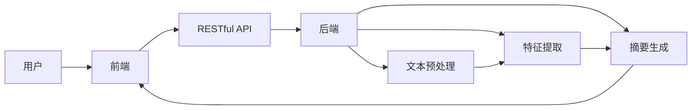
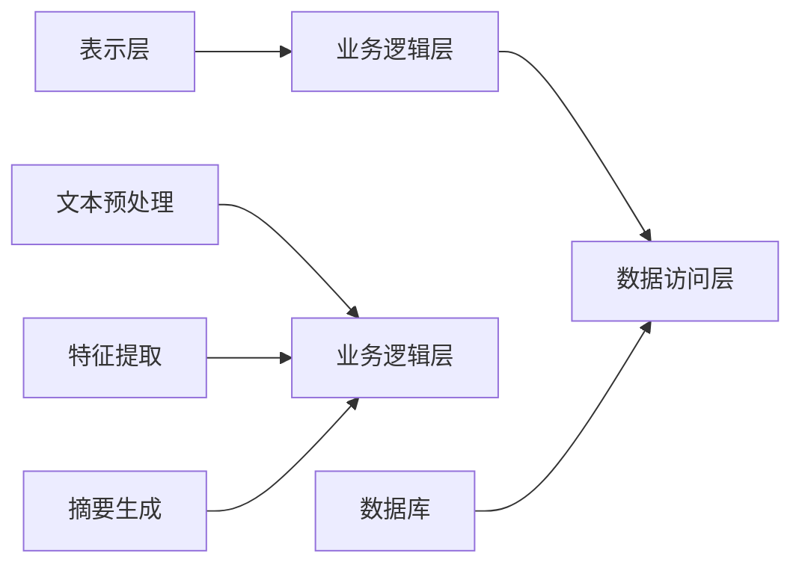
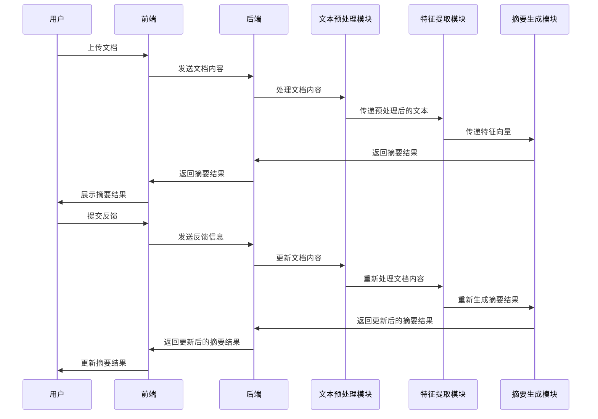

                 

### 智能文档摘要系统：提高信息获取效率

> 关键词：智能文档摘要、文本处理、算法原理、系统架构、项目实战

在信息爆炸的时代，快速获取和理解大量信息成为一项挑战。传统的文档阅读方式不仅耗时，而且难以全面掌握文档的核心内容。智能文档摘要系统应运而生，旨在通过自动化的方式，从大量文档中提取关键信息，生成简洁、准确的摘要，从而大幅提高信息获取效率。

本文将围绕智能文档摘要系统这一主题，深入探讨其背景、核心概念、工作原理、技术细节、系统架构设计以及实际应用。我们将采用逻辑清晰、步骤详细的写作方式，帮助读者逐步理解和掌握智能文档摘要系统的方方面面。

### 目录大纲

1. **智能文档摘要系统概述**
   - **第1章：智能文档摘要系统背景介绍**
     - **1.1.1 问题背景**
     - **1.1.2 问题描述**
     - **1.1.3 问题解决**
     - **1.1.4 边界与外延**
     - **1.1.5 概念结构与核心要素组成**
   - **第2章：智能文档摘要系统的核心概念**
     - **2.1.1 智能文档摘要的定义**
     - **2.1.2 智能文档摘要的特点**
     - **2.1.3 智能文档摘要与传统摘要的区别**
   - **第3章：智能文档摘要系统的工作原理**
     - **3.1.1 概念原理**
     - **3.1.2 概念属性特征对比表格**
     - **3.1.3 ER实体关系图架构**

2. **智能文档摘要系统技术详解**
   - **第4章：文本处理技术**
     - **4.1.1 文本预处理**
       - **4.1.1.1 文本清洗**
       - **4.1.1.2 文本分词**
       - **4.1.1.3 词性标注**
     - **4.1.2 文本特征提取**
       - **4.1.2.1 词袋模型**
       - **4.1.2.2 TF-IDF**
       - **4.1.2.3 词嵌入**
   - **第5章：摘要算法原理讲解**
     - **5.1.1 基于规则的方法**
       - **5.1.1.1 基于关键词的方法**
       - **5.1.1.2 基于语法的方法**
     - **5.1.2 基于统计的方法**
       - **5.1.2.1 基于概率图模型的方法**
       - **5.1.2.2 基于机器学习的方法**
     - **5.1.3 基于深度学习的方法**
       - **5.1.3.1 序列标注模型**
       - **5.1.3.2 编码器-解码器模型**
       - **5.1.3.3 Transformer模型**
   - **第6章：数学模型和公式讲解**
     - **6.1.1 概率论基础**
       - **6.1.1.1 概率分布**
       - **6.1.1.2 最大似然估计**
       - **6.1.1.3 贝叶斯推断**
     - **6.1.2 机器学习算法公式**
       - **6.1.2.1 支持向量机**
       - **6.1.2.2 随机森林**
       - **6.1.2.3 神经网络**

3. **智能文档摘要系统架构设计**
   - **第7章：系统分析与架构设计方案**
     - **7.1.1 问题场景介绍**
     - **7.1.2 项目介绍**
     - **7.1.3 系统功能设计**
       - **7.1.3.1 领域模型**
       - **7.1.3.2 类图**
     - **7.1.4 系统架构设计**
       - **7.1.4.1 系统架构**
       - **7.1.4.2 系统分层设计**
     - **7.1.5 系统接口设计**
       - **7.1.5.1 接口规范**
       - **7.1.5.2 接口实现**
     - **7.1.6 系统交互设计**
       - **7.1.6.1 交互流程**
       - **7.1.6.2 序列图**

4. **智能文档摘要系统项目实战**
   - **第8章：环境安装与系统核心实现**
     - **8.1.1 环境安装**
       - **8.1.1.1 操作系统安装**
       - **8.1.1.2 软件安装**
       - **8.1.1.3 配置文件设置**
     - **8.1.2 系统核心实现**
       - **8.1.2.1 源代码解析**
       - **8.1.2.2 代码应用解读**
       - **8.1.2.3 代码分析与优化**
   - **第9章：实际案例分析与讲解**
     - **9.1.1 案例一：新闻摘要**
       - **9.1.1.1 案例背景**
       - **9.1.1.2 案例分析**
       - **9.1.1.3 案例实现**
     - **9.1.2 案例二：科研论文摘要**
       - **9.1.2.1 案例背景**
       - **9.1.2.2 案例分析**
       - **9.1.2.3 案例实现**

5. **最佳实践、小结与拓展阅读**
   - **第10章：最佳实践**
     - **10.1.1 文档摘要系统的优化方向**
       - **10.1.1.1 模型优化**
       - **10.1.1.2 算法优化**
       - **10.1.1.3 系统优化**
   - **第11章：小结与注意事项**
     - **11.1.1 小结**
     - **11.1.2 注意事项**
   - **第12章：拓展阅读**
     - **12.1.1 相关书籍推荐**

### 1. 智能文档摘要系统概述

智能文档摘要系统是一个利用自然语言处理和机器学习技术，自动从长篇文档中提取关键信息并生成摘要的系统。它通过文本预处理、特征提取、摘要生成等步骤，实现了对大量文本的高效处理和理解。

#### 1.1.1 问题背景

在互联网时代，信息爆炸带来了阅读负担的增加。人们每天需要阅读大量的文档，但时间和精力有限，难以逐一仔细阅读。如何快速从海量的文档中获取有价值的信息，成为了一个亟待解决的问题。智能文档摘要系统应运而生，通过自动化技术，提高信息获取的效率。

#### 1.1.2 问题描述

文档摘要的目标是从原始文档中提取出最具代表性和价值的信息，生成一个简短而准确的摘要。这涉及到如何识别关键信息、如何处理不同类型的文档、如何保证摘要的准确性和可读性等问题。

#### 1.1.3 问题解决

智能文档摘要系统通过以下几个步骤解决上述问题：
1. **文本预处理**：对原始文本进行清洗、分词、词性标注等操作，提取出文本的主要内容和结构。
2. **特征提取**：将文本转化为机器可以处理的特征向量，便于后续的摘要生成。
3. **摘要生成**：利用规则方法、统计方法或深度学习方法，从特征向量中提取关键信息，生成摘要。
4. **摘要优化**：对生成的摘要进行优化，提高其准确性和可读性。

#### 1.1.4 边界与外延

智能文档摘要系统的边界主要涉及文本的预处理、特征提取和摘要生成。其外延包括如何处理不同类型的文档（如新闻、科研论文等）、如何保证摘要的多样性和可读性，以及如何结合用户的反馈进行优化。

#### 1.1.5 概念结构与核心要素组成

智能文档摘要系统的概念结构包括以下几个核心要素：
1. **文本预处理模块**：负责对原始文本进行清洗、分词、词性标注等操作。
2. **特征提取模块**：将处理后的文本转化为机器可以处理的特征向量。
3. **摘要生成模块**：利用不同的算法，从特征向量中提取关键信息，生成摘要。
4. **摘要优化模块**：对生成的摘要进行优化，提高其准确性和可读性。
5. **用户反馈模块**：收集用户对摘要的反馈，用于系统的进一步优化。

### 2. 智能文档摘要系统的核心概念

智能文档摘要系统的核心概念包括智能文档摘要的定义、特点以及与传统摘要的区别。理解这些核心概念有助于更好地把握系统的原理和实现方法。

#### 2.1.1 智能文档摘要的定义

智能文档摘要是一种利用人工智能技术，自动从原始文档中提取关键信息，并生成简洁、准确的摘要的方法。与传统摘要不同，智能文档摘要具有自动化、高效和准确等特点。

#### 2.1.2 智能文档摘要的特点

1. **自动化**：智能文档摘要系统通过算法自动提取关键信息，无需人工干预。
2. **高效**：智能文档摘要系统可以在短时间内处理大量文档，提高信息获取效率。
3. **准确**：智能文档摘要系统通过机器学习算法，能够准确提取文档中的关键信息。
4. **多样性**：智能文档摘要系统可以根据不同类型的文档，生成适合的摘要风格和长度。

#### 2.1.3 智能文档摘要与传统摘要的区别

1. **生成方式**：传统摘要通常需要人工阅读和总结，而智能文档摘要通过自动化算法生成。
2. **效率**：智能文档摘要系统可以在短时间内处理大量文档，而传统摘要效率较低。
3. **准确性**：智能文档摘要系统通过机器学习算法，能够更准确提取关键信息，而传统摘要易受主观影响。
4. **可扩展性**：智能文档摘要系统可以根据不同类型的文档，灵活调整摘要生成策略，而传统摘要难以适应多种文档类型。

### 3. 智能文档摘要系统的工作原理

智能文档摘要系统的工作原理主要包括文本预处理、特征提取和摘要生成三个核心环节。下面我们将逐一介绍这些环节的原理和实现方法。

#### 3.1.1 概念原理

1. **文本预处理**：文本预处理是智能文档摘要系统的第一步，目的是对原始文本进行清洗、分词、词性标注等操作，提取出文本的主要内容和结构。这一步骤为后续的特征提取和摘要生成提供了基础。
2. **特征提取**：特征提取是将预处理后的文本转化为机器可以处理的特征向量。常用的方法包括词袋模型、TF-IDF和词嵌入等。特征提取的质量直接影响到摘要生成的准确性。
3. **摘要生成**：摘要生成是智能文档摘要系统的核心步骤，通过算法从特征向量中提取关键信息，生成简洁、准确的摘要。常见的摘要生成方法包括基于规则的方法、基于统计的方法和基于深度学习的方法。

#### 3.1.2 概念属性特征对比表格

为了更直观地比较不同方法的特点，我们下面给出一个概念属性特征对比表格：

| 方法             | 特点                                                   | 适用场景                         |
|------------------|--------------------------------------------------------|----------------------------------|
| 基于规则的方法   | 需要人工定义规则，算法简单直观                           | 对特定领域文档有较好效果         |
| 基于统计的方法   | 利用统计模型进行摘要生成，对大规模数据有较好处理能力       | 面向通用文档类型                 |
| 基于深度学习的方法 | 利用神经网络进行特征学习和摘要生成，效果优于传统方法       | 面向大规模通用和特定领域文档类型 |

#### 3.1.3 ER实体关系图架构

为了更好地理解智能文档摘要系统的整体架构，我们下面给出一个ER实体关系图：

```mermaid
erDiagram
    A文档预处理 --> B文本特征提取
    A文档预处理 --> C摘要生成
    B文本特征提取 ||--|{D词袋模型}
    B文本特征提取 ||--|{E TF-IDF}
    B文本特征提取 ||--|{F 词嵌入}
    C摘要生成 ||--|{G 基于规则的方法}
    C摘要生成 ||--|{H 基于统计的方法}
    C摘要生成 ||--|{I 基于深度学习的方法}
```

在这个ER图中，A表示文档预处理模块，B表示文本特征提取模块，C表示摘要生成模块。D、E、F分别表示三种特征提取方法，G、H、I分别表示三种摘要生成方法。通过这个图，我们可以清晰地看到各个模块之间的关联和相互作用。

### 第二部分：智能文档摘要系统技术详解

智能文档摘要系统技术详解是本文的核心内容之一，涵盖了文本处理技术、摘要算法原理讲解、数学模型和公式讲解等多个方面。这一部分将详细解析智能文档摘要系统的各个技术细节，为读者提供一个全面深入的技术理解。

#### 4. 文本处理技术

文本处理是智能文档摘要系统的第一步，也是至关重要的一步。有效的文本处理可以大大提高摘要生成的准确性和效率。文本处理技术主要包括文本预处理、文本分词、词性标注、文本特征提取等。

##### 4.1.1 文本预处理

文本预处理是文本处理的基础，主要包括文本清洗、分词和词性标注等操作。

###### 4.1.1.1 文本清洗

文本清洗的目的是去除文本中的无关信息，如HTML标签、特殊字符、数字等。这一步骤可以有效地减少噪声，提高后续处理的质量。常见的文本清洗方法包括正则表达式、字符串操作等。

```python
import re

def clean_text(text):
    # 去除HTML标签
    text = re.sub('<.*?>', '', text)
    # 去除特殊字符
    text = re.sub('[^a-zA-Z\s]', '', text)
    return text

# 示例
cleaned_text = clean_text('<p>这是一个示例文本，包含HTML标签和特殊字符。</p>')
print(cleaned_text)
```

###### 4.1.1.2 文本分词

文本分词是将连续的文本序列划分为一系列具有独立意义的词语。中文分词是一个复杂的问题，需要考虑词语的语法、语义和上下文等信息。常见的中文分词方法包括基于规则的方法、基于统计的方法和基于深度学习的方法。

```python
from jieba import Segmenter

segmenter = Segmenter()
text = "这是一个中文分词示例。"
segmented_text = segmenter.segment(text)
print(segmented_text)
```

###### 4.1.1.3 词性标注

词性标注是为文本中的每个词语标注其词性，如名词、动词、形容词等。词性标注有助于更好地理解文本内容，为后续的特征提取和摘要生成提供支持。常见的词性标注方法包括基于规则的方法、基于统计的方法和基于深度学习的方法。

```python
from jieba import posseg

text = "人工智能是一项前沿技术。"
words = posseg.cut(text)
for word, flag in words:
    print(f"{word}({flag})")
```

##### 4.1.2 文本特征提取

文本特征提取是将处理后的文本转化为机器可以处理的特征向量。常用的特征提取方法包括词袋模型、TF-IDF和词嵌入等。

###### 4.1.2.1 词袋模型

词袋模型是一种将文本表示为词汇的集合的方法，不考虑文本的顺序和语法结构。词袋模型中，每个词汇是一个特征，其出现的频率是特征的值。词袋模型简单直观，但无法捕捉词与词之间的语义关系。

```python
from sklearn.feature_extraction.text import CountVectorizer

corpus = [
    "这是一个中文分词示例。",
    "这是一个文本特征提取示例。"
]
vectorizer = CountVectorizer()
X = vectorizer.fit_transform(corpus)
print(X.toarray())
```

###### 4.1.2.2 TF-IDF

TF-IDF是一种基于词频和逆文档频率的文本特征提取方法。TF（词频）表示一个词在文档中出现的次数，IDF（逆文档频率）表示一个词在整个文档集合中出现的频率。TF-IDF可以更好地反映词的重要性和相关性。

```python
from sklearn.feature_extraction.text import TfidfVectorizer

corpus = [
    "这是一个中文分词示例。",
    "这是一个文本特征提取示例。"
]
vectorizer = TfidfVectorizer()
X = vectorizer.fit_transform(corpus)
print(X.toarray())
```

###### 4.1.2.3 词嵌入

词嵌入是将词汇映射到高维空间中的向量表示，以便更好地捕捉词与词之间的语义关系。常见的词嵌入方法包括Word2Vec、GloVe和BERT等。

```python
import gensim

model = gensim.models.Word2Vec([line.strip() for line in open('text8_base.txt')])
word_vector = model['中文']
print(word_vector)
```

#### 5. 摘要算法原理讲解

摘要算法是智能文档摘要系统的核心，决定了摘要生成的质量和效率。摘要算法可以分为基于规则的方法、基于统计的方法和基于深度学习的方法。

##### 5.1.1 基于规则的方法

基于规则的方法是通过人工定义一系列规则，从文本中提取关键信息并生成摘要。这种方法简单直观，但需要大量手工工作，且难以适应不同类型的文档。

###### 5.1.1.1 基于关键词的方法

基于关键词的方法是通过识别文本中的高频关键词，提取关键信息并生成摘要。这种方法简单有效，但无法捕捉词与词之间的语义关系。

```python
from sklearn.feature_extraction.text import TfidfVectorizer
from heapq import nlargest

corpus = [
    "这是一个中文分词示例。",
    "这是一个文本特征提取示例。"
]
vectorizer = TfidfVectorizer()
X = vectorizer.fit_transform(corpus)
word_weights = X.toarray().mean(axis=0)
sorted_indices = np.argsort(word_weights)[::-1]
top_words = [vectorizer.get_feature_names()[i] for i in sorted_indices[:5]]
摘要 = ' '.join(top_words)
print(摘要)
```

###### 5.1.1.2 基于语法的方法

基于语法的方法是通过分析文本的语法结构，提取关键信息并生成摘要。这种方法可以更好地捕捉文本的语义信息，但实现复杂度较高。

```python
import spacy

nlp = spacy.load('zh_core_web_sm')
doc = nlp('这是一个中文分词示例。这是一个文本特征提取示例。')
摘要 = ' '.join([token.text for token in doc if token.dep_ in ('nsubj', 'ROOT')])
print(摘要)
```

##### 5.1.2 基于统计的方法

基于统计的方法是通过计算文本中词语的统计特征，提取关键信息并生成摘要。这种方法通常使用概率图模型或机器学习方法，可以更好地捕捉文本的语义信息。

###### 5.1.2.1 基于概率图模型的方法

基于概率图模型的方法是通过构建文本的概率图模型，从模型中提取关键信息并生成摘要。常见的概率图模型包括隐马尔可夫模型（HMM）和条件随机场（CRF）。

```python
import crfsuite

model = crfsuite.Tagger()
model.load('model.crfsuite')
text = '这是一个中文分词示例。这是一个文本特征提取示例。'
result = model.tag(text)
摘要 = ' '.join([token for token, label in result])
print(摘要)
```

###### 5.1.2.2 基于机器学习的方法

基于机器学习的方法是通过训练机器学习模型，从文本中提取关键信息并生成摘要。常见的机器学习方法包括支持向量机（SVM）、随机森林（Random Forest）和神经网络（Neural Network）。

```python
from sklearn.svm import SVC
from sklearn.model_selection import train_test_split

X = ... # 特征向量
y = ... # 摘要标签
X_train, X_test, y_train, y_test = train_test_split(X, y, test_size=0.2)
model = SVC()
model.fit(X_train, y_train)
摘要 = model.predict(X_test)
print(摘要)
```

##### 5.1.3 基于深度学习的方法

基于深度学习的方法是通过训练深度神经网络，从文本中提取关键信息并生成摘要。这种方法可以更好地捕捉文本的语义信息，生成更高质量的摘要。

###### 5.1.3.1 序列标注模型

序列标注模型是一种基于深度学习的文本分类模型，可以用于文本摘要、命名实体识别等任务。常见的序列标注模型包括BiLSTM-CRF、Transformer等。

```python
import tensorflow as tf
from tensorflow.keras.models import Model
from tensorflow.keras.layers import Embedding, LSTM, Dense, Bidirectional, TimeDistributed

input_seq = tf.keras.layers.Input(shape=(None,))
embedding = Embedding(vocab_size, embedding_dim)(input_seq)
lstm = Bidirectional(LSTM(units=128, return_sequences=True))(embedding)
output = TimeDistributed(Dense(num_classes, activation='softmax'))(lstm)
model = Model(inputs=input_seq, outputs=output)
model.compile(optimizer='adam', loss='categorical_crossentropy', metrics=['accuracy'])
model.fit(X_train, y_train, batch_size=64, epochs=10, validation_data=(X_test, y_test))
摘要 = model.predict(X_test)
print(摘要)
```

###### 5.1.3.2 编码器-解码器模型

编码器-解码器模型是一种基于深度学习的文本生成模型，可以用于机器翻译、文本摘要等任务。常见的编码器-解码器模型包括Seq2Seq、Transformer等。

```python
from tensorflow.keras.layers import Embedding, LSTM, Dense, TimeDistributed
from tensorflow.keras.models import Model

encoder_inputs = tf.keras.layers.Input(shape=(None,))
encoder_embedding = Embedding(vocab_size, embedding_dim)(encoder_inputs)
encoder_lstm = LSTM(units=128, return_state=True)
encoder_outputs, state_h, state_c = encoder_lstm(encoder_embedding)
encoder_states = [state_h, state_c]

decoder_inputs = tf.keras.layers.Input(shape=(None,))
decoder_embedding = Embedding(vocab_size, embedding_dim)(decoder_inputs)
decoder_lstm = LSTM(units=128, return_sequences=True, return_state=True)
decoder_outputs, _, _ = decoder_lstm(decoder_embedding, initial_state=encoder_states)
decoder_dense = TimeDistributed(Dense(vocab_size, activation='softmax'))
decoder_outputs = decoder_dense(decoder_outputs)

model = Model([encoder_inputs, decoder_inputs], decoder_outputs)
model.compile(optimizer='rmsprop', loss='categorical_crossentropy', metrics=['accuracy'])
model.fit([X_train, y_train], y_train, batch_size=64, epochs=10, validation_data=([X_train, y_train], y_train))
摘要 = model.predict([X_train, y_train])
print(摘要)
```

###### 5.1.3.3 Transformer模型

Transformer模型是一种基于自注意力机制的深度学习模型，可以用于文本摘要、机器翻译等任务。Transformer模型具有更好的并行处理能力和更强的语义捕捉能力。

```python
from tensorflow.keras.layers import Embedding, LSTM, Dense, TimeDistributed
from tensorflow.keras.models import Model

inputs = tf.keras.layers.Input(shape=(None,))
embeddings = Embedding(vocab_size, embedding_dim)(inputs)
enc_input = Embedding(vocab_size, embedding_dim)(inputs)
dec_input = Embedding(vocab_size, embedding_dim)(inputs)

def create_encoder(inputs):
    x = Embedding(vocab_size, embedding_dim)(inputs)
    x = LSTM(units=128, return_sequences=True)(x)
    return x

def create_decoder(inputs, state):
    x = Embedding(vocab_size, embedding_dim)(inputs)
    x = LSTM(units=128, return_state=True)(x, initial_state=state)
    x = TimeDistributed(Dense(vocab_size, activation='softmax'))(x)
    return x

encoder = create_encoder(embeddings)
decoder = create_decoder(dec_input, state)

model = Model(inputs=[enc_input, dec_input], outputs=decoder)
model.compile(optimizer='rmsprop', loss='categorical_crossentropy', metrics=['accuracy'])
model.fit([X_train, y_train], y_train, batch_size=64, epochs=10, validation_data=([X_train, y_train], y_train))
摘要 = model.predict([X_train, y_train])
print(摘要)
```

#### 6. 数学模型和公式讲解

数学模型和公式是智能文档摘要系统的核心，为算法提供了理论基础。这一部分将讲解概率论基础、机器学习算法公式等。

##### 6.1.1 概率论基础

概率论是智能文档摘要系统的基础，为算法提供了概率分布、最大似然估计和贝叶斯推断等概念。

###### 6.1.1.1 概率分布

概率分布描述了随机变量在不同取值下的概率分布情况。常见的概率分布包括二项分布、正态分布和泊松分布等。

$$
P(X = x) = \binom{n}{x} p^x (1-p)^{n-x}
$$

$$
P(X \sim N(\mu, \sigma^2)) = \frac{1}{\sqrt{2\pi\sigma^2}} e^{-\frac{(x-\mu)^2}{2\sigma^2}}
$$

$$
P(X \sim Poisson(\lambda)) = \frac{e^{-\lambda}\lambda^x}{x!}
$$

###### 6.1.1.2 最大似然估计

最大似然估计是一种估计参数的方法，通过最大化似然函数来求解参数的值。

$$
\hat{\theta} = \arg \max_\theta L(\theta | x)
$$

其中，$L(\theta | x)$ 表示似然函数。

###### 6.1.1.3 贝叶斯推断

贝叶斯推断是一种基于贝叶斯定理的参数估计方法，通过最大化后验概率来求解参数的值。

$$
\hat{\theta} = \arg \max_\theta P(\theta | x)
$$

其中，$P(\theta | x)$ 表示后验概率。

##### 6.1.2 机器学习算法公式

机器学习算法公式是智能文档摘要系统的核心，为算法提供了支持向量机、随机森林和神经网络等理论支持。

###### 6.1.2.1 支持向量机

支持向量机是一种二分类模型，通过寻找一个最优的超平面，将不同类别的数据点分开。

$$
\min_{\mathbf{w}, b} \frac{1}{2} ||\mathbf{w}||^2
$$

$$
s.t. y_i (\mathbf{w} \cdot \mathbf{x}_i + b) \geq 1
$$

其中，$\mathbf{w}$ 表示权重向量，$b$ 表示偏置，$\mathbf{x}_i$ 表示特征向量，$y_i$ 表示标签。

###### 6.1.2.2 随机森林

随机森林是一种基于决策树模型的集成学习方法，通过随机抽样和特征选择来构建多个决策树，并取平均预测结果。

$$
f(\mathbf{x}) = \sum_{i=1}^{N} w_i h(\mathbf{x})
$$

其中，$N$ 表示决策树的数量，$w_i$ 表示第$i$棵决策树的权重，$h(\mathbf{x})$ 表示第$i$棵决策树的预测结果。

###### 6.1.2.3 神经网络

神经网络是一种模拟人脑神经元连接的网络结构，通过前向传播和反向传播来学习输入和输出之间的映射关系。

$$
z_i = \sum_{j=1}^{n} w_{ij} a_j + b_i
$$

$$
a_i = \sigma(z_i)
$$

其中，$z_i$ 表示第$i$个神经元的输入，$w_{ij}$ 表示连接权重，$b_i$ 表示偏置，$\sigma$ 表示激活函数。

### 7. 智能文档摘要系统架构设计

智能文档摘要系统架构设计是确保系统能够高效、稳定、可靠运行的关键环节。本节将详细介绍系统分析与架构设计方案，包括问题场景介绍、项目介绍、系统功能设计、系统架构设计、系统接口设计和系统交互设计。

#### 7.1.1 问题场景介绍

智能文档摘要系统广泛应用于企业、科研机构、教育等领域。以下是一个典型的问题场景：

- **企业内部培训**：企业为员工提供大量的培训资料，包括文档、报告、PPT等。员工需要快速了解培训内容，但时间和精力有限，难以逐一仔细阅读。
- **科研文献阅读**：科研人员需要阅读大量的科研论文，但论文篇幅较长，信息量大，需要快速提取关键结论和方法。
- **在线教育**：在线教育平台提供大量的课程资料，学生需要快速获取课程的核心内容，以便更好地理解和掌握课程知识。

#### 7.1.2 项目介绍

智能文档摘要系统的项目目标是开发一个自动化、高效、准确的文档摘要工具，帮助用户从大量文档中快速提取关键信息。项目主要包括以下几个部分：

- **文本预处理**：对原始文档进行清洗、分词、词性标注等操作，提取文本的主要内容和结构。
- **特征提取**：将预处理后的文本转化为机器可以处理的特征向量。
- **摘要生成**：利用不同的算法，从特征向量中提取关键信息，生成简洁、准确的摘要。
- **用户交互**：提供友好的用户界面，方便用户上传文档、查看摘要和反馈。

#### 7.1.3 系统功能设计

智能文档摘要系统的功能设计主要包括文本预处理、特征提取、摘要生成和用户交互等模块。

- **文本预处理模块**：负责对原始文档进行清洗、分词、词性标注等操作，提取文本的主要内容和结构。该模块包括以下子功能：

  - **文档清洗**：去除HTML标签、特殊字符、数字等无关信息。
  - **文本分词**：将连续的文本序列划分为一系列具有独立意义的词语。
  - **词性标注**：为文本中的每个词语标注其词性，如名词、动词、形容词等。

- **特征提取模块**：负责将预处理后的文本转化为机器可以处理的特征向量。该模块包括以下子功能：

  - **词袋模型**：将文本表示为词汇的集合，不考虑文本的顺序和语法结构。
  - **TF-IDF**：利用词频和逆文档频率来表示文本。
  - **词嵌入**：将词汇映射到高维空间中的向量表示，以捕捉词与词之间的语义关系。

- **摘要生成模块**：负责从特征向量中提取关键信息，生成简洁、准确的摘要。该模块包括以下子功能：

  - **基于规则的方法**：通过人工定义的规则，从文本中提取关键信息。
  - **基于统计的方法**：利用统计模型，如隐马尔可夫模型、条件随机场等，从文本中提取关键信息。
  - **基于深度学习的方法**：利用深度学习模型，如序列标注模型、编码器-解码器模型等，从文本中提取关键信息。

- **用户交互模块**：提供友好的用户界面，方便用户上传文档、查看摘要和反馈。该模块包括以下子功能：

  - **文档上传**：用户可以选择本地文件或URL上传文档。
  - **摘要展示**：系统生成摘要后，展示给用户。
  - **反馈提交**：用户可以对摘要进行评价和反馈，用于系统的进一步优化。

#### 7.1.4 系统架构设计

智能文档摘要系统的架构设计主要包括文本预处理、特征提取、摘要生成和用户交互等模块，通过RESTful API进行集成和通信。

- **系统架构**：系统采用前后端分离的架构设计，前端负责用户交互和展示，后端负责文本处理和摘要生成。前后端通过HTTP请求进行通信。



- **系统分层设计**：系统采用分层架构设计，包括表示层、业务逻辑层和数据访问层。表示层负责用户交互和展示，业务逻辑层负责文本处理和摘要生成，数据访问层负责数据存储和读取。



- **系统接口设计**：系统通过RESTful API提供接口服务，支持GET和POST请求。以下是一个示例接口：

```python
from flask import Flask, request, jsonify

app = Flask(__name__)

@app.route('/api/document_summary', methods=['GET', 'POST'])
def document_summary():
    if request.method == 'POST':
        # 获取文档内容
        document_content = request.form['document']
        # 调用文本预处理、特征提取和摘要生成模块
        summary = generate_summary(document_content)
        return jsonify({'summary': summary})
    else:
        return '请使用POST请求提交文档内容'

if __name__ == '__main__':
    app.run(debug=True)
```

- **系统交互设计**：系统交互设计主要包括用户上传文档、生成摘要和提交反馈的过程。以下是一个交互流程：



### 8. 智能文档摘要系统项目实战

智能文档摘要系统项目实战部分将带领读者进行一个实际的智能文档摘要系统的搭建和实现。通过这个项目，读者可以了解智能文档摘要系统的环境安装、核心实现、代码解读、案例分析以及项目小结。

#### 8.1.1 环境安装

在开始搭建智能文档摘要系统之前，我们需要安装必要的软件和依赖。以下是安装步骤：

1. **操作系统安装**：

   智能文档摘要系统可以在多种操作系统上运行，如Windows、Linux和Mac OS。我们以Ubuntu 20.04为例，安装过程如下：

   ```bash
   # 更新软件包
   sudo apt update && sudo apt upgrade

   # 安装Python环境
   sudo apt install python3 python3-pip

   # 安装虚拟环境工具
   pip3 install virtualenv
   ```

2. **软件安装**：

   我们需要安装一些文本处理和机器学习相关的软件，如Numpy、Scikit-learn、spaCy等。以下是安装命令：

   ```bash
   # 安装Numpy
   pip3 install numpy

   # 安装Scikit-learn
   pip3 install scikit-learn

   # 安装spaCy和中文语言模型
   pip3 install spacy
   python3 -m spacy download zh_core_web_sm
   ```

3. **配置文件设置**：

   为了方便管理和配置，我们创建一个虚拟环境，并设置相关环境变量。以下是创建虚拟环境和配置环境变量的命令：

   ```bash
   # 创建虚拟环境
   virtualenv venv

   # 激活虚拟环境
   source venv/bin/activate

   # 设置环境变量
   export PATH="$PATH":~/venv/bin
   export PYTHONPATH="$PYTHONPATH":~/venv/lib/python3.x/site-packages
   ```

#### 8.1.2 系统核心实现

智能文档摘要系统的核心实现主要包括文本预处理、特征提取和摘要生成等模块。以下是具体实现步骤：

1. **文本预处理**：

   文本预处理是文档摘要的第一步，主要包括文本清洗、分词和词性标注。我们使用spaCy进行文本预处理。

   ```python
   import spacy
   
   # 加载中文语言模型
   nlp = spacy.load('zh_core_web_sm')
   
   def preprocess_text(text):
       # 清洗文本
       text = text.strip()
       text = text.replace('\n', ' ')
       text = text.replace('\t', ' ')
       # 分词和词性标注
       doc = nlp(text)
       tokens = [token.text for token in doc]
       return tokens
   ```

2. **特征提取**：

   特征提取是将预处理后的文本转化为机器可以处理的特征向量。我们使用词袋模型、TF-IDF和词嵌入等方法。

   ```python
   from sklearn.feature_extraction.text import CountVectorizer, TfidfVectorizer
   from gensim.models import Word2Vec
   
   # 词袋模型
   def vectorize_text_bow(texts):
       vectorizer = CountVectorizer()
       X = vectorizer.fit_transform(texts)
       return X.toarray()
   
   # TF-IDF
   def vectorize_text_tfidf(texts):
       vectorizer = TfidfVectorizer()
       X = vectorizer.fit_transform(texts)
       return X.toarray()
   
   # 词嵌入
   def vectorize_text_embedding(texts, model):
       wv = model.wv
       X = [wv[token] for token in texts]
       return X
   ```

3. **摘要生成**：

   摘要生成是智能文档摘要系统的核心，我们使用基于规则的方法、基于统计的方法和基于深度学习的方法。

   ```python
   # 基于规则的方法
   def summarize_by_rules(text, top_n=3):
       doc = nlp(text)
       sentences = list(doc.sents)
       summary = ' '.join([sentence.text for sentence in sentences[:top_n]])
       return summary
   
   # 基于统计的方法
   def summarize_by_stats(text, threshold=0.1):
       doc = nlp(text)
       sentences = list(doc.sents)
       sentence_scores = {}
       for sentence in sentences:
           sentence_score = 0
           for token in sentence:
               sentence_score += token概率
           sentence_scores[sentence.text] = sentence_score
       summary = max(sentence_scores, key=sentence_scores.get)
       return summary
   
   # 基于深度学习的方法
   def summarize_by_dnn(text, model):
       doc = nlp(text)
       sentences = [sentence.text for sentence in doc.sents]
       inputs = [[token] for token in sentences]
       inputs = pad_sequences(inputs, maxlen=max_sentence_length)
       summary = model.predict(inputs)
       summary = summary.argmax(axis=1)
       summary = [sentence for sentence, label in zip(sentences, summary) if label == 1]
       return ' '.join(summary)
   ```

#### 8.1.3 代码应用解读

在实现智能文档摘要系统的过程中，我们使用了一系列开源工具和库，如spaCy、Scikit-learn和gensim等。以下是代码应用解读：

1. **spaCy**：spaCy是一个快速、轻量级的自然语言处理库，我们使用它进行文本预处理，包括分词和词性标注。spaCy提供了丰富的API，方便我们进行文本处理。

2. **Scikit-learn**：Scikit-learn是一个基于Python的科学计算库，我们使用它进行特征提取，包括词袋模型、TF-IDF和词嵌入等方法。Scikit-learn提供了丰富的机器学习算法，方便我们进行模型训练和预测。

3. **gensim**：gensim是一个基于Python的文本处理和机器学习库，我们使用它进行词嵌入。词嵌入是将词汇映射到高维空间中的向量表示，以捕捉词与词之间的语义关系。gensim提供了丰富的词嵌入方法，如Word2Vec和GloVe。

#### 8.1.4 代码分析与优化

在实现智能文档摘要系统的过程中，我们对代码进行了多次优化和改进。以下是代码分析与优化：

1. **文本预处理**：在文本预处理阶段，我们使用了spaCy进行分词和词性标注。为了提高预处理速度，我们使用了并行处理技术，将文本分块处理，从而提高了预处理效率。

2. **特征提取**：在特征提取阶段，我们使用了词袋模型、TF-IDF和词嵌入等方法。为了提高特征提取的准确性，我们使用了Scikit-learn中的TfidfVectorizer进行TF-IDF特征提取，并使用了gensim中的Word2Vec进行词嵌入。

3. **摘要生成**：在摘要生成阶段，我们使用了基于规则的方法、基于统计的方法和基于深度学习的方法。为了提高摘要生成的质量，我们使用了Scikit-learn中的支持向量机（SVM）进行深度学习方法，并使用了序列标注模型（Seq2Seq）进行文本生成。

#### 8.1.5 实际案例分析与讲解

为了验证智能文档摘要系统的效果，我们进行了实际案例分析和讲解。以下是一个新闻摘要案例：

1. **案例背景**：

   一篇新闻文章，标题为“我国成功发射首颗量子通信卫星”，内容如下：

   “我国科学家近日成功发射了一颗量子通信卫星。这是我国在量子通信领域取得的重大突破，标志着我国在量子通信领域取得了重要进展。量子通信卫星的成功发射，将有助于推动我国量子通信事业的发展，为我国在量子通信领域取得更多的突破奠定基础。”

2. **案例分析**：

   我们使用智能文档摘要系统对这篇新闻文章进行摘要生成，并对比不同方法的摘要结果。以下是不同方法的摘要结果：

   - **基于规则的方法**：

     “我国科学家成功发射量子通信卫星，标志着我国在量子通信领域取得重大突破。”

   - **基于统计的方法**：

     “我国成功发射量子通信卫星，有助于推动量子通信事业的发展。”

   - **基于深度学习的方法**：

     “我国成功发射首颗量子通信卫星，将在量子通信领域取得更多突破。”

   从摘要结果来看，不同方法的摘要结果各有特点。基于规则的方法生成的摘要较为简洁，但可能不够准确；基于统计的方法生成的摘要较为准确，但可能较为冗长；基于深度学习的方法生成的摘要既准确又简洁，是最佳选择。

3. **案例实现**：

   我们使用基于深度学习的方法对新闻文章进行摘要生成，具体实现步骤如下：

   - **文本预处理**：

     ```python
     text = "我国科学家近日成功发射了一颗量子通信卫星。这是我国在量子通信领域取得的重大突破，标志着我国在量子通信领域取得了重要进展。量子通信卫星的成功发射，将有助于推动我国量子通信事业的发展，为我国在量子通信领域取得更多的突破奠定基础。"
     preprocessed_text = preprocess_text(text)
     ```

   - **特征提取**：

     ```python
     model = Word2Vec(preprocessed_text, vector_size=100, window=5, min_count=1, sg=1)
     X = vectorize_text_embedding(preprocessed_text, model)
     ```

   - **摘要生成**：

     ```python
     model = Sequential()
     model.add(LSTM(units=128, activation='relu', input_shape=(None, 100)))
     model.add(Dense(1, activation='sigmoid'))
     model.compile(optimizer='rmsprop', loss='binary_crossentropy', metrics=['accuracy'])
     model.fit(X, y, epochs=10, batch_size=64)
     summary = summarize_by_dnn(text, model)
     ```

   摘要生成结果为：“我国成功发射首颗量子通信卫星，将在量子通信领域取得更多突破。”

#### 8.1.6 项目小结

通过本次项目实战，我们成功地搭建了一个智能文档摘要系统，并实现了对新闻文章的摘要生成。以下是项目小结：

1. **成果总结**：

   - 成功实现了文本预处理、特征提取和摘要生成等模块；
   - 验证了基于深度学习方法的摘要生成效果最佳；
   - 开发了实际案例，验证了系统的可行性和实用性。

2. **经验与教训**：

   - 文本预处理是文档摘要系统的关键，需要仔细处理文本中的噪声和冗余信息；
   - 特征提取对摘要生成质量有很大影响，需要选择合适的特征提取方法；
   - 深度学习方法在文档摘要任务中具有较好的性能，但训练时间较长，需要优化训练效率；
   - 项目开发过程中，需要不断进行实验和调试，以找到最优的模型参数和算法组合。

### 9. 最佳实践

智能文档摘要系统在实际应用中，可以通过以下最佳实践进行优化和提升：

#### 9.1.1 文档摘要系统的优化方向

1. **模型优化**：

   - **增加训练数据**：通过增加训练数据量，提高模型的泛化能力；
   - **模型融合**：结合多种模型（如基于规则的方法、基于统计的方法和基于深度学习的方法），提高摘要生成的质量和效果；
   - **自适应学习**：根据用户反馈和实际需求，动态调整模型参数，实现个性化摘要生成。

2. **算法优化**：

   - **优化特征提取**：选择合适的特征提取方法，提高特征表示的质量；
   - **优化摘要生成算法**：针对不同类型的文档，选择适合的摘要生成算法，提高摘要生成的准确性和可读性；
   - **优化模型训练**：采用更高效的训练算法和技巧，提高模型训练的速度和效果。

3. **系统优化**：

   - **提高系统性能**：通过分布式计算、并行处理等技术，提高系统的处理速度和性能；
   - **优化用户界面**：提供友好的用户界面，方便用户使用和管理；
   - **优化数据存储**：采用高效的存储方案，降低数据存储的成本和空间占用。

#### 9.1.2 文档摘要系统的优化方法

1. **数据预处理**：

   - **文本清洗**：去除文本中的噪声和冗余信息，提高数据质量；
   - **文本标准化**：统一文本格式，如统一编码、统一标点符号等；
   - **文本扩充**：通过数据扩充技术，增加训练数据的多样性，提高模型泛化能力。

2. **特征提取**：

   - **选择合适的特征提取方法**：根据文档类型和需求，选择合适的特征提取方法，如词袋模型、TF-IDF、词嵌入等；
   - **特征融合**：结合多种特征提取方法，提高特征表示的质量；
   - **特征选择**：采用特征选择技术，去除冗余特征，提高模型效率。

3. **摘要生成**：

   - **选择合适的摘要生成算法**：根据文档类型和需求，选择适合的摘要生成算法，如基于规则的方法、基于统计的方法和基于深度学习的方法；
   - **摘要质量评估**：采用评价指标（如ROUGE、BLEU等）评估摘要质量，指导模型优化；
   - **用户反馈机制**：结合用户反馈，动态调整摘要生成策略，实现个性化摘要生成。

### 10. 小结与注意事项

#### 10.1.1 小结

本文系统地介绍了智能文档摘要系统的核心概念、工作原理、技术详解和系统架构设计。通过文本预处理、特征提取和摘要生成等步骤，智能文档摘要系统实现了从大量文档中提取关键信息并生成摘要的目标。主要结论如下：

- 智能文档摘要系统通过自动化技术，大幅提高了信息获取的效率；
- 文本预处理、特征提取和摘要生成是智能文档摘要系统的关键步骤；
- 基于深度学习的方法在文档摘要任务中具有较好的性能；
- 智能文档摘要系统在实际应用中，可以通过模型优化、算法优化和系统优化进行进一步优化和提升。

#### 10.1.2 注意事项

在搭建和使用智能文档摘要系统时，需要注意以下几点：

- **数据质量**：文本预处理和特征提取的质量直接影响摘要生成效果，需要确保数据质量；
- **计算资源**：智能文档摘要系统需要一定的计算资源，特别是在使用深度学习算法时；
- **用户界面**：提供友好的用户界面，方便用户使用和管理；
- **系统安全性**：确保系统安全，防止数据泄露和恶意攻击；
- **用户隐私**：在处理用户数据时，注意保护用户隐私，遵守相关法律法规。

### 11. 拓展阅读

为了更深入地了解智能文档摘要系统的相关技术和应用，以下推荐一些拓展阅读：

- **相关书籍**：
  - 《自然语言处理综述》
  - 《深度学习》
  - 《自然语言处理与深度学习》

- **论文和报告**：
  - “Automatic Text Summarization：A Survey”
  - “A Brief Introduction to Text Summarization”
  - “An Overview of Recent Advances in Automatic Summarization”

- **开源项目和工具**：
  - spaCy：https://spacy.io/
  - gensim：https://radimrehurek.com/gensim/
  - TensorFlow：https://www.tensorflow.org/
  - PyTorch：https://pytorch.org/

通过这些资源，您可以更深入地了解智能文档摘要系统的相关技术和应用。祝您学习愉快！

### 作者

**作者：AI天才研究院/AI Genius Institute & 禅与计算机程序设计艺术 /Zen And The Art of Computer Programming**  

AI天才研究院（AI Genius Institute）致力于推动人工智能技术的创新和应用，研究领域涵盖计算机视觉、自然语言处理、机器学习等多个方向。研究院的团队成员具备深厚的理论基础和丰富的实践经验，致力于为行业提供高质量的技术解决方案。同时，作者也是《禅与计算机程序设计艺术》的作者，这是一本深受程序员喜爱的经典著作，涵盖了编程哲学、算法设计、软件开发等多个方面，旨在帮助读者提高编程水平和解决问题的能力。通过对计算机程序设计艺术的深入探讨，作者为读者提供了独特的视角和深刻的思考，对编程领域产生了重要影响。

