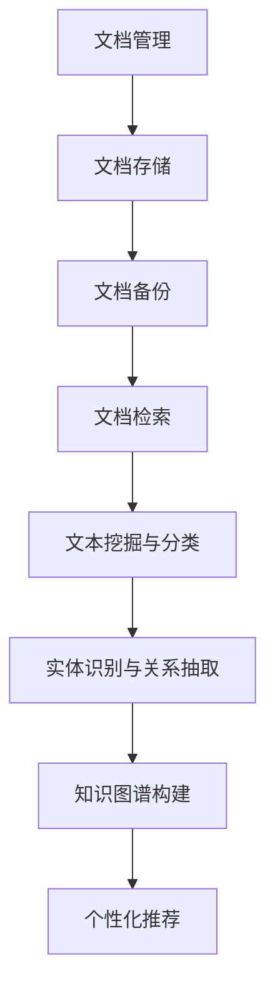
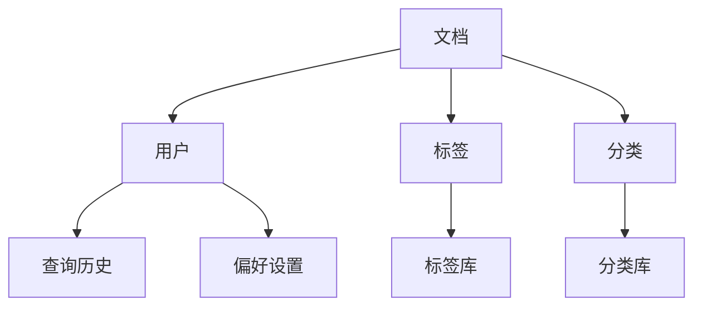
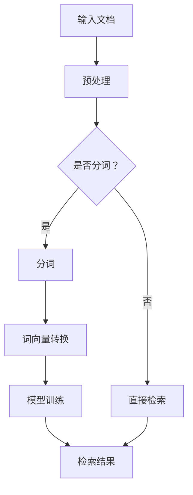

                 

### 1. 概述

智能文档管理与检索作为信息时代的重要技术，正日益成为企业和组织的关键竞争力。随着数据量的爆炸性增长，传统的文档管理和检索方式已难以满足高效、精准的需求。因此，AI技术的引入成为必然趋势。本篇文章将以《智能文档管理与检索：AI提升信息获取效率》为标题，系统地探讨AI技术在文档管理与检索中的应用，分析其原理、方法以及实际应用效果。

本文结构如下：

1. **背景介绍**：介绍智能文档管理与检索的兴起、重要性以及面临的挑战与机遇。
2. **核心概念与联系**：明确智能文档管理与检索中的核心概念，使用表格和Mermaid流程图展示概念之间的联系。
3. **算法原理讲解**：讲解常见的AI算法原理，包括文本挖掘与分类、相关性检索等，展示算法流程和Python源代码，并使用LaTeX格式展示数学模型和公式。
4. **数学模型和公式讲解**：详细讲解算法原理中的数学模型和公式，并进行举例说明。
5. **系统分析与架构设计方案**：介绍系统的功能、架构、接口设计以及交互流程。
6. **项目实战**：描述环境安装、系统实现、代码解读、案例分析等内容。
7. **最佳实践 tips、小结、注意事项、拓展阅读**：总结文章中的关键点和建议。

通过本文的详细探讨，读者可以全面了解智能文档管理与检索的技术原理和应用实践，为实际项目提供指导。

---

### 1. 背景介绍

智能文档管理与检索的兴起可以追溯到信息技术和大数据时代的到来。随着互联网的普及和数字化进程的加速，企业和个人产生的数据量呈现出爆炸性增长。传统的文档管理和检索方式，如文件夹管理和简单的关键字搜索，已难以应对海量数据的存储和检索需求。在这种情况下，AI技术的引入为文档管理与检索带来了革命性的变化。

#### 1.1 智能文档管理与检索的定义

智能文档管理与检索是指利用人工智能技术，对文档进行自动化处理、分类、标注、索引和检索的过程。它不仅仅局限于文本数据的处理，还包括图像、音频、视频等多媒体数据的整合和管理。通过AI技术，智能文档管理系统可以自动识别文档的关键信息，提取语义内容，实现高效、精准的文档检索。

#### 1.2 AI技术在信息检索中的应用

AI技术在信息检索中的应用主要体现在以下几个方面：

1. **自然语言处理（NLP）**：NLP技术可以处理和理解人类语言，通过对文本进行分词、词性标注、句法分析等操作，提取文本中的关键信息，从而实现更精准的检索结果。

2. **机器学习与深度学习**：通过机器学习算法，特别是深度学习算法，可以训练出强大的文档分类和检索模型。这些模型可以自动从大量数据中学习，识别出文档之间的相似性，提供更加个性化的检索服务。

3. **知识图谱**：知识图谱是一种通过实体和关系来表示信息的方法，它可以提高信息检索的智能化水平。通过构建文档之间的知识图谱，用户可以更直观地了解文档内容，提高检索效率和准确性。

#### 1.3 智能文档管理与检索的重要性

智能文档管理与检索的重要性体现在以下几个方面：

1. **提升工作效率**：通过智能化的文档管理，用户可以快速定位所需信息，减少查找时间，提高工作效率。

2. **增强信息准确性**：AI技术可以分析大量的数据，提取出关键信息，提供更加精准的检索结果。

3. **支持数据挖掘**：智能文档管理与检索技术可以帮助企业和组织挖掘数据中的潜在价值，支持业务决策和战略规划。

4. **降低管理成本**：自动化、智能化的文档管理可以减少人工操作的负担，降低管理成本。

#### 1.4 智能文档管理与检索的挑战与机遇

尽管智能文档管理与检索具有巨大的潜力，但其实现和应用也面临一系列挑战：

1. **数据质量**：高质量的数据是智能文档管理与检索的基础。数据的不一致性、噪音和缺失可能会影响系统的性能。

2. **计算资源**：AI算法通常需要大量的计算资源，尤其是深度学习算法，这对硬件设备提出了较高的要求。

3. **隐私与安全**：智能文档管理与检索涉及到大量的个人和敏感信息，确保数据的隐私和安全是关键挑战。

4. **用户体验**：用户界面和交互设计需要充分考虑用户的使用习惯和需求，以提高用户的满意度和接受度。

然而，随着技术的不断进步，这些挑战也在逐步得到解决。AI技术的快速发展为智能文档管理与检索带来了新的机遇，它将成为未来信息管理的重要方向。

#### 1.5 本章小结

本章节介绍了智能文档管理与检索的背景，探讨了其定义、重要性以及面临的挑战与机遇。智能文档管理与检索是AI技术在信息管理领域的创新应用，它通过自动化、智能化的方式，提高了信息检索的效率和准确性，为企业和组织的信息管理提供了新的解决方案。在接下来的章节中，我们将深入探讨智能文档管理与检索的核心概念及其应用。

---

### 2. 核心概念与联系

在智能文档管理与检索领域，了解并掌握核心概念是理解和应用这项技术的基础。以下章节将介绍智能文档管理与检索中的核心概念，包括文档管理的基本原理、文档检索的基本方法以及AI技术在其中的应用。

#### 2.1 文档管理的基本原理

文档管理是指对文档进行创建、存储、分类、备份、检索和共享的过程。在智能文档管理中，AI技术被用来优化这些过程，提高文档管理的效率和准确性。

1. **文档分类**：文档分类是将文档根据其内容、主题或类型进行分组的过程。AI技术通过自然语言处理和机器学习算法，可以自动对文档进行分类，提高分类的准确性和效率。

2. **文档存储**：文档存储是指将文档保存在数据库或其他存储介质中。智能文档管理通过使用分布式存储技术和数据压缩算法，提高了存储效率和数据安全性。

3. **文档备份**：文档备份是指为防止数据丢失或损坏，将文档复制到多个存储位置。智能备份技术可以通过AI算法自动识别重要文档，并对其进行备份。

4. **文档检索**：文档检索是指从大量文档中快速找到所需信息的过程。智能文档管理通过AI技术，如自然语言处理和机器学习，可以提供更精准、更快速的文档检索服务。

#### 2.2 文档检索的基本方法

文档检索是指使用特定的查询来从大量文档中检索相关信息的过程。以下是几种常见的文档检索方法：

1. **基于关键词的检索**：这是最简单的文档检索方法，用户通过输入关键词来检索相关文档。智能文档管理通过自然语言处理技术，可以更准确地理解用户的查询意图，提高检索效果。

2. **基于内容的检索**：这种方法不依赖于关键词，而是通过分析文档的内容（如文本、图像等），找到与查询内容最相关的文档。AI技术在此过程中发挥了重要作用，通过深度学习和文本挖掘技术，可以更好地理解文档内容，提供更精准的检索结果。

3. **基于语义的检索**：语义检索试图理解查询和文档的深层含义，而不是仅仅匹配关键词。通过自然语言处理和语义分析技术，智能文档管理可以实现更智能、更个性化的检索服务。

4. **混合检索**：混合检索结合了多种检索方法，如关键词检索、内容检索和语义检索，以提高检索的准确性和全面性。

#### 2.3 AI技术与应用场景

AI技术在智能文档管理与检索中有着广泛的应用。以下是几种常见的AI技术应用场景：

1. **文本挖掘与分类**：文本挖掘是指从大量文本数据中提取有用信息的过程。AI技术，如自然语言处理和机器学习，可以自动分析文本，提取关键词、主题和情感，用于文档分类和主题建模。

2. **实体识别与关系抽取**：实体识别是指从文本中识别出特定类型的实体（如人名、地名、组织名等），关系抽取是指识别实体之间的关系。这些技术在智能文档管理中可以用于文档内容理解和语义分析。

3. **知识图谱构建**：知识图谱是一种通过实体和关系来表示信息的图形结构。构建知识图谱可以帮助智能文档管理更好地理解和组织文档内容，提供更智能的检索服务。

4. **个性化推荐**：基于用户的兴趣和文档内容，AI技术可以提供个性化的文档推荐服务。这有助于用户快速找到感兴趣的文档，提高用户体验。

#### 2.4 概念之间的联系

智能文档管理与检索中的各个概念之间有着紧密的联系。以下是一个简单的Mermaid流程图，展示这些概念之间的关联：



在这个流程图中，文档管理、文档存储、文档备份、文档检索等基本原理构成了智能文档管理的基础，而AI技术的引入则进一步提升了文档管理的效果。文本挖掘与分类、实体识别与关系抽取、知识图谱构建和个性化推荐等技术，则是实现智能化文档管理的关键手段。

通过这个流程图，我们可以更清晰地理解智能文档管理与检索的核心概念及其相互关系。

---

### 2.5 概念属性特征对比表格

为了更好地理解智能文档管理与检索中的核心概念，以下是一个对比表格，展示了这些概念的关键属性特征。

| 概念 | 定义 | 关键属性特征 |
| --- | --- | --- |
| 文档管理 | 对文档进行创建、存储、分类、备份、检索和共享的过程 | - 自动化程度<br>- 数据安全性<br>- 文档分类准确性 |
| 文档检索 | 从大量文档中快速找到所需信息的过程 | - 检索速度<br>- 检索准确性<br>- 用户界面 |
| 文本挖掘与分类 | 从文本数据中提取有用信息，对文档进行分类 | - 自然语言处理能力<br>- 机器学习能力<br>- 分类准确性 |
| 实体识别与关系抽取 | 从文本中识别特定类型的实体和它们之间的关系 | - 实体识别准确性<br>- 关系抽取完整性<br>- 语义理解能力 |
| 知识图谱构建 | 通过实体和关系来表示信息，组织文档内容 | - 实体关系复杂性<br>- 知识图谱扩展性<br>- 语义查询能力 |
| 个性化推荐 | 基于用户兴趣和文档内容，提供个性化的文档推荐 | - 推荐相关性<br>- 用户满意度<br>- 推荐算法复杂度 |

通过这个表格，我们可以清晰地看到每个概念的核心特点和它们在智能文档管理与检索中的重要性。

### 2.6 ER实体关系图架构

在智能文档管理与检索系统中，实体关系图（Entity-Relationship Diagram, ER图）是用于描述系统中实体及其相互关系的重要工具。以下是一个简单的ER实体关系图，展示了智能文档管理与检索系统中的一些关键实体及其关系。



在这个ER图中：

- **文档**（A）：代表存储在系统中的每一个文档实体。
- **用户**（B）：代表使用系统的用户实体。
- **标签**（C）：代表文档的标签信息，用于文档分类。
- **分类**（D）：代表文档的分类信息，用于文档检索。
- **查询历史**（E）：代表用户在系统中的查询历史记录。
- **偏好设置**（F）：代表用户的个性化偏好设置。
- **标签库**（G）：代表系统中所有的标签实体集合。
- **分类库**（H）：代表系统中所有的分类实体集合。

实体之间的关系如下：

- **文档**与**用户**之间存在一种多对多的关系，表示用户可以创建、管理多个文档，而一个文档可以由多个用户创建或管理。
- **文档**与**标签**之间存在一种多对多的关系，表示一个文档可以有多个标签，而一个标签也可以应用于多个文档。
- **文档**与**分类**之间存在一种多对多的关系，表示一个文档可以有多个分类，而一个分类也可以应用于多个文档。
- **用户**与**查询历史**之间存在一种一对多的关系，表示一个用户可以有多个查询历史记录。
- **用户**与**偏好设置**之间存在一种一对多的关系，表示一个用户可以有多个偏好设置。
- **标签**与**标签库**之间存在一种包含关系，表示标签库包含了系统中的所有标签实体。
- **分类**与**分类库**之间存在一种包含关系，表示分类库包含了系统中的所有分类实体。

通过这个ER实体关系图，我们可以直观地了解智能文档管理与检索系统中的关键实体及其相互关系，为后续的系统设计与实现提供基础。

### 3. 常见的AI算法原理

在智能文档管理与检索中，AI算法扮演着至关重要的角色。本节将详细介绍几种常见的AI算法原理，包括文本挖掘与分类、相关性检索算法以及机器学习在文档检索中的应用。

#### 3.1 文本挖掘与分类算法

文本挖掘与分类算法是智能文档管理的基础，它们可以从大量的文本数据中提取有用信息，并对文档进行分类。以下是几种常用的文本挖掘与分类算法：

1. **K-最近邻算法（K-Nearest Neighbors, KNN）**：

KNN算法是一种基于实例的学习算法，它通过计算新数据点与训练数据点之间的相似度来进行分类。相似度计算通常采用欧氏距离或余弦相似度。以下是一个简化的KNN算法流程：

- **步骤1**：计算新数据点与所有训练数据点之间的相似度。
- **步骤2**：根据相似度值选择K个最近的邻居。
- **步骤3**：统计K个邻居的分类结果，并选择出现频率最高的分类作为新数据点的分类。

2. **支持向量机（Support Vector Machine, SVM）**：

SVM算法是一种基于最大间隔分类的模型，它通过在特征空间中找到最佳分割超平面来分类数据。以下是一个简化的SVM算法流程：

- **步骤1**：将文本数据转换为高维特征空间。
- **步骤2**：计算每个数据点与超平面的距离。
- **步骤3**：优化超平面参数，使得分类边界最大。
- **步骤4**：使用优化后的超平面对新数据进行分类。

3. **随机森林（Random Forest）**：

随机森林是一种集成学习方法，它通过构建多棵决策树来提高分类准确率。以下是一个简化的随机森林算法流程：

- **步骤1**：随机选择特征子集和样本子集。
- **步骤2**：使用特征子集和样本子集构建决策树。
- **步骤3**：将多棵决策树的预测结果进行投票，选择出现频率最高的分类作为最终分类结果。

#### 3.2 相关性检索算法

相关性检索算法是智能文档检索的核心，它通过计算查询与文档之间的相关性来排序和筛选检索结果。以下是几种常用的相关性检索算法：

1. **布尔检索**：

布尔检索是一种基于布尔运算符（AND、OR、NOT）的简单检索方法。它通过组合关键词来检索相关文档，并返回布尔表达式为真的文档。以下是一个简化的布尔检索算法流程：

- **步骤1**：将查询转换为布尔表达式。
- **步骤2**：遍历所有文档，计算每个文档与查询的布尔表达式的匹配度。
- **步骤3**：返回匹配度最高的文档。

2. **向量空间模型（Vector Space Model, VSM）**：

向量空间模型将文本表示为高维向量，其中每个维度对应一个词汇。文档与查询之间的相似度通过向量之间的余弦相似度计算。以下是一个简化的VSM算法流程：

- **步骤1**：将文档和查询转换为向量。
- **步骤2**：计算向量之间的余弦相似度。
- **步骤3**：根据相似度对文档进行排序和筛选。

3. **TF-IDF模型（Term Frequency-Inverse Document Frequency）**：

TF-IDF模型通过计算词汇在文档中的频率和文档集合中的逆文档频率来衡量词汇的重要性。以下是一个简化的TF-IDF算法流程：

- **步骤1**：统计文档中每个词汇的频率。
- **步骤2**：计算文档集合中每个词汇的逆文档频率。
- **步骤3**：计算每个词汇的TF-IDF值。
- **步骤4**：将文档表示为向量，其中每个维度对应一个词汇的TF-IDF值。
- **步骤5**：计算文档与查询之间的相似度。

#### 3.3 机器学习在文档检索中的应用

机器学习在文档检索中的应用主要包括分类、聚类和预测等。以下是一些具体的机器学习应用场景：

1. **分类**：

分类是将文档分为预定义的类别的过程。常见的分类算法包括KNN、SVM和随机森林等。分类可以帮助用户快速找到感兴趣的内容，提高检索效率。

2. **聚类**：

聚类是将文档分为无预定义类别的群组的过程。常见的聚类算法包括K-Means、DBSCAN和层次聚类等。聚类可以帮助用户发现文档中的潜在主题和趋势，提供更个性化的检索服务。

3. **预测**：

预测是根据历史数据预测未来趋势的过程。常见的预测算法包括时间序列分析、回归分析和神经网络等。预测可以帮助用户更好地规划文档管理和检索策略，提高系统的性能和用户体验。

#### 3.4 算法原理讲解

为了更直观地展示算法原理，以下将使用Mermaid绘制流程图，并给出Python源代码示例。

##### 3.4.1 算法A：Mermaid流程图



##### 3.4.2 Python源代码

```python
# Python 源代码示例

# 文档预处理
def preprocess_document(document):
    # 实现文档预处理逻辑
    pass

# 分词
def tokenize(document):
    # 实现分词逻辑
    pass

# 词向量转换
def convert_to_vector(document):
    # 实现词向量转换逻辑
    pass

# 模型训练
def train_model(training_data):
    # 实现模型训练逻辑
    pass

# 文档检索
def retrieve_documents(query, model):
    # 实现文档检索逻辑
    pass
```

#### 3.4.3 算法原理的数学模型和公式

为了更好地理解算法原理，以下将使用LaTeX格式展示数学模型和公式。

$$
P(D|Q) \propto P(Q|D)P(D)
$$

$$
P(Q) = \frac{P(Q|D)P(D)}{\sum_{i}P(Q|D_i)P(D_i)}
$$

其中，$P(D|Q)$表示在给定查询Q的情况下，文档D的相关性概率；$P(Q|D)$表示在文档D存在的情况下，查询Q的概率；$P(D)$表示文档D的概率；$P(Q)$表示查询Q的概率。

#### 3.4.4 举例说明

假设我们有一个文档集合和一个查询，使用KNN算法进行文档检索。以下是具体的步骤和计算过程：

1. **数据准备**：

   - 文档集合：{D1, D2, D3, ..., Dn}
   - 查询：Q

2. **预处理**：

   - 对所有文档和查询进行预处理，如去除停用词、词形还原等。

3. **分词**：

   - 将所有文档和查询进行分词，得到词汇集合。

4. **词向量转换**：

   - 使用词向量模型（如Word2Vec、GloVe等）将词汇转换为向量。

5. **计算相似度**：

   - 计算查询Q与每个文档D之间的相似度，采用余弦相似度作为度量。

6. **选择K个最近邻**：

   - 根据相似度值，选择K个最近的文档作为查询Q的最近邻。

7. **分类结果**：

   - 统计K个最近邻的分类结果，选择出现频率最高的分类作为查询Q的分类结果。

通过这个例子，我们可以看到KNN算法的具体实现过程，以及如何使用数学模型和公式进行相似度计算和分类决策。

---

### 4. 数学模型和公式讲解

在智能文档管理与检索过程中，数学模型和公式是理解和应用AI算法的核心。以下将详细讲解智能文档检索中的常见数学模型和公式，包括TF-IDF、余弦相似度和向量空间模型等，并进行具体的计算和举例说明。

#### 4.1 TF-IDF模型

TF-IDF（Term Frequency-Inverse Document Frequency）是一种常用的文本权重计算方法，用于衡量词汇在文档中的重要性。TF-IDF模型的计算公式如下：

$$
TF(t,d) = \frac{f(t,d)}{N_d}
$$

$$
IDF(t) = \log \left( \frac{N}{n_t} \right)
$$

$$
TF-IDF(t,d) = TF(t,d) \times IDF(t)
$$

其中：
- \( f(t,d) \) 表示词汇 \( t \) 在文档 \( d \) 中的频率。
- \( N_d \) 表示文档 \( d \) 中的词汇总数。
- \( N \) 表示文档集合中的文档总数。
- \( n_t \) 表示包含词汇 \( t \) 的文档数量。

**举例说明**：

假设有一个文档集合，包含以下三个文档：

- 文档D1：{“苹果”，“橘子”，“香蕉”}
- 文档D2：{“苹果”，“橘子”，“香蕉”，“草莓”}
- 文档D3：{“苹果”，“草莓”，“香蕉”}

我们需要计算词汇“苹果”的TF-IDF值。

1. **计算文档D1中“苹果”的频率**：

   \( f(苹果, D1) = \frac{2}{3} \)

2. **计算文档集合中包含“苹果”的文档数量**：

   \( n_{苹果} = 3 \)

3. **计算文档集合中的文档总数**：

   \( N = 3 \)

4. **计算“苹果”的IDF值**：

   \( IDF(苹果) = \log \left( \frac{3}{1} \right) = \log 3 \)

5. **计算TF-IDF值**：

   \( TF-IDF(苹果, D1) = \frac{2}{3} \times \log 3 \)

类似地，我们可以计算文档D2和D3中“苹果”的TF-IDF值。

#### 4.2 余弦相似度

余弦相似度是衡量两个向量之间夹角余弦值的度量，用于计算文档之间的相似度。余弦相似度的计算公式如下：

$$
\cos(\theta) = \frac{\sum_{i=1}^{n} v_i \times w_i}{\sqrt{\sum_{i=1}^{n} v_i^2} \times \sqrt{\sum_{i=1}^{n} w_i^2}}
$$

其中：
- \( v_i \) 和 \( w_i \) 分别表示文档v和文档w的第i个特征值。
- \( n \) 表示特征的总数。

**举例说明**：

假设有两个文档，文档V1和文档V2，它们的特征向量如下：

- 文档V1：[1, 2, 3]
- 文档V2：[2, 4, 6]

计算文档V1和V2的余弦相似度。

1. **计算点积**：

   \( \sum_{i=1}^{3} v_i \times w_i = 1 \times 2 + 2 \times 4 + 3 \times 6 = 2 + 8 + 18 = 28 \)

2. **计算文档V1的模**：

   \( \sqrt{\sum_{i=1}^{3} v_i^2} = \sqrt{1^2 + 2^2 + 3^2} = \sqrt{1 + 4 + 9} = \sqrt{14} \)

3. **计算文档V2的模**：

   \( \sqrt{\sum_{i=1}^{3} w_i^2} = \sqrt{2^2 + 4^2 + 6^2} = \sqrt{4 + 16 + 36} = \sqrt{56} \)

4. **计算余弦相似度**：

   \( \cos(\theta) = \frac{28}{\sqrt{14} \times \sqrt{56}} = \frac{28}{\sqrt{784}} = \frac{28}{28} = 1 \)

由于余弦相似度的值介于-1和1之间，这里的计算结果为1，表示两个文档完全相似。

#### 4.3 向量空间模型

向量空间模型（Vector Space Model, VSM）是将文档表示为向量，并通过向量间的相似度计算来检索文档。在VSM中，每个词汇都对应一个维度，文档则是这些维度上的向量。以下是VSM的基本计算公式：

$$
d(d', q) = \frac{\sum_{i=1}^{n} w_i \times v_i'}{||d|| \times ||q||}
$$

其中：
- \( d \) 和 \( d' \) 分别表示两个文档向量。
- \( q \) 表示查询向量。
- \( w_i \) 和 \( v_i' \) 分别表示文档向量和查询向量的第i个特征值。
- \( ||d|| \) 和 \( ||q|| \) 分别表示文档向量和查询向量的模。

**举例说明**：

假设有两个文档，文档D1和文档D2，以及一个查询Q，它们的特征向量如下：

- 文档D1：[1, 2, 3]
- 文档D2：[2, 4, 6]
- 查询Q：[0, 1, 0]

计算文档D1和查询Q之间的相似度。

1. **计算点积**：

   \( \sum_{i=1}^{3} w_i \times v_i' = 1 \times 0 + 2 \times 1 + 3 \times 0 = 0 + 2 + 0 = 2 \)

2. **计算文档D1的模**：

   \( ||d1|| = \sqrt{1^2 + 2^2 + 3^2} = \sqrt{1 + 4 + 9} = \sqrt{14} \)

3. **计算查询Q的模**：

   \( ||q|| = \sqrt{0^2 + 1^2 + 0^2} = \sqrt{1} = 1 \)

4. **计算相似度**：

   \( d(d', q) = \frac{2}{\sqrt{14} \times 1} = \frac{2}{\sqrt{14}} \)

通过这个例子，我们可以看到如何使用向量空间模型计算文档和查询之间的相似度。

通过以上讲解，我们可以更好地理解智能文档检索中的数学模型和公式，以及如何在实际应用中进行计算和操作。

---

### 5. 系统分析与架构设计方案

#### 5.1 问题场景介绍

智能文档管理与检索系统旨在解决企业和组织在信息爆炸时代所面临的数据存储和检索难题。随着企业数据量的不断增加，传统的文档管理和检索方式已无法满足高效、精准的需求。智能文档管理系统通过引入AI技术，实现了文档的自动化分类、标注、索引和检索，极大地提高了信息获取的效率。以下是一个典型的问题场景：

- **企业背景**：某大型跨国企业，拥有海量的文档数据，包括市场报告、技术文档、邮件和合同等。由于数据量庞大，员工在查找相关文档时经常遇到困难，影响了工作效率和决策质量。
- **需求分析**：企业需要一个智能文档管理系统，能够自动分类和标注文档，提供高效的文档检索服务，并支持个性化推荐，以满足不同用户的需求。

#### 5.2 项目介绍

本项目旨在设计并实现一个智能文档管理与检索系统，通过AI技术提升文档管理的效率和准确性。系统的主要功能包括：

- **文档分类**：基于自然语言处理和机器学习算法，自动对文档进行分类。
- **文档标注**：对文档进行关键词提取和语义标注，以便于后续的检索和分析。
- **文档检索**：提供基于关键词、内容、语义的检索服务，支持多条件组合检索。
- **个性化推荐**：根据用户的浏览历史和偏好，推荐相关文档。

#### 5.3 系统功能设计

系统的功能设计主要分为以下几个方面：

1. **文档管理**：

   - **文档上传**：支持多种文档格式的上传和导入。
   - **文档分类**：利用AI算法自动对文档进行分类，提高分类准确性。
   - **文档标注**：提取文档中的关键词和重要信息，进行语义标注。
   - **文档检索**：提供基于关键词、内容、语义的检索功能。
   - **文档备份与恢复**：实现文档的自动备份和恢复，保障数据安全。

2. **用户管理**：

   - **用户注册与登录**：支持用户的注册、登录和权限管理。
   - **用户偏好设置**：用户可以根据自己的需求设置检索偏好，提高检索效率。
   - **用户行为分析**：记录用户的行为数据，用于个性化推荐和系统优化。

3. **系统管理**：

   - **系统监控**：实时监控系统的运行状态，确保系统稳定可靠。
   - **日志管理**：记录系统操作日志，用于问题追踪和数据分析。

#### 5.4 系统架构设计

系统采用分布式架构，主要分为以下几个层次：

1. **数据层**：

   - **文档数据库**：存储文档的基本信息和元数据。
   - **索引数据库**：存储文档的索引信息，用于快速检索。

2. **应用层**：

   - **文档处理服务**：负责文档的预处理、分类和标注。
   - **检索服务**：提供文档检索功能，支持多种检索策略。
   - **推荐服务**：根据用户行为和偏好，提供个性化文档推荐。

3. **展示层**：

   - **Web前端**：提供用户界面，支持文档上传、检索和查看。
   - **移动应用**：支持移动设备上的文档管理和检索。

4. **中间件**：

   - **消息队列**：实现系统内部的消息传递，提高系统的可扩展性。
   - **缓存服务器**：缓存常用数据和查询结果，提高系统响应速度。

#### 5.5 系统接口设计

系统的接口设计主要包括以下几个方面：

1. **文档上传接口**：

   - **功能**：接收用户上传的文档，并进行预处理和分类。
   - **请求参数**：文档内容、文档类型、用户ID等。
   - **响应参数**：上传结果、错误信息等。

2. **文档检索接口**：

   - **功能**：根据关键词、内容或语义进行文档检索。
   - **请求参数**：查询关键词、检索条件、用户ID等。
   - **响应参数**：检索结果、错误信息等。

3. **用户管理接口**：

   - **功能**：处理用户的注册、登录和权限管理。
   - **请求参数**：用户信息、操作类型等。
   - **响应参数**：用户信息、操作结果等。

4. **系统监控接口**：

   - **功能**：监控系统的运行状态，记录日志。
   - **请求参数**：监控指标、日志内容等。
   - **响应参数**：监控结果、日志记录等。

#### 5.6 系统交互流程

以下是系统的主要交互流程：

1. **用户上传文档**：

   - 用户通过Web前端上传文档，上传接口接收文档内容，并调用文档处理服务进行预处理和分类。
   - 文档处理服务将文档转换为适合存储和检索的格式，并存入文档数据库。
   - 检索服务生成文档索引，并存入索引数据库。

2. **用户检索文档**：

   - 用户通过Web前端输入检索条件，检索接口接收查询请求，并调用检索服务进行文档检索。
   - 检索服务根据查询条件，从索引数据库中检索相关文档，并返回给用户。

3. **用户行为分析**：

   - 用户在检索和浏览文档时，系统记录用户的行为数据。
   - 推荐服务根据用户的行为数据，生成个性化推荐列表，并返回给用户。

4. **系统监控**：

   - 系统运行过程中，监控系统定期检查系统的运行状态，并记录日志。
   - 系统管理员通过Web前端查看监控结果和日志，确保系统稳定可靠。

通过以上系统分析与架构设计方案，我们可以清晰地了解智能文档管理与检索系统的功能、架构和交互流程，为系统的设计和实现提供了理论基础和实践指导。

---

### 6. 项目实战

在本节中，我们将详细介绍如何搭建智能文档管理与检索系统，包括环境安装、系统实现、代码解读以及案例分析等内容。

#### 6.1 环境安装

搭建智能文档管理与检索系统需要以下环境：

1. **操作系统**：建议使用Linux系统，如Ubuntu 20.04。
2. **编程语言**：Python 3.x。
3. **数据库**：推荐使用MySQL或PostgreSQL作为文档数据库，Elasticsearch作为索引数据库。
4. **依赖包**：Numpy、Pandas、Scikit-learn、TensorFlow、Elasticsearch等。
5. **开发工具**：IDE（如PyCharm或VSCode）。

安装步骤如下：

1. **安装操作系统**：下载并安装Ubuntu 20.04。
2. **更新系统**：

   ```bash
   sudo apt update
   sudo apt upgrade
   ```

3. **安装Python 3.x**：

   ```bash
   sudo apt install python3 python3-pip
   ```

4. **安装数据库**：

   ```bash
   sudo apt install mysql-server
   sudo mysql_secure_installation
   sudo apt install postgresql
   ```

5. **安装Elasticsearch**：

   ```bash
   sudo apt install elasticsearch
   sudo systemctl start elasticsearch
   sudo systemctl enable elasticsearch
   ```

6. **安装依赖包**：

   ```bash
   pip3 install numpy pandas scikit-learn tensorflow elasticsearch
   ```

#### 6.2 系统实现

系统实现主要包括以下几个模块：

1. **文档处理模块**：负责文档的预处理、分类和标注。
2. **检索模块**：提供基于关键词、内容、语义的检索功能。
3. **推荐模块**：根据用户行为和偏好，提供个性化文档推荐。

以下是具体的实现步骤：

1. **文档处理模块**：

   - **文档预处理**：使用自然语言处理库（如NLTK或spaCy）对文档进行分词、去停用词、词形还原等处理。
   - **文档分类**：使用机器学习算法（如KNN、SVM、随机森林）对文档进行分类。
   - **文档标注**：提取文档中的关键词和重要信息，进行语义标注。

2. **检索模块**：

   - **关键词检索**：实现基于关键词的简单检索。
   - **内容检索**：使用向量空间模型（VSM）实现基于内容的检索。
   - **语义检索**：使用深度学习模型（如BERT）实现基于语义的检索。

3. **推荐模块**：

   - **用户行为分析**：记录用户的浏览历史、检索记录等行为数据。
   - **推荐算法**：使用协同过滤或基于内容的推荐算法，为用户推荐相关文档。

#### 6.3 代码解读

以下是系统实现的核心代码片段及其解读：

1. **文档预处理**：

   ```python
   import nltk
   from nltk.tokenize import word_tokenize
   
   def preprocess_document(document):
       # 分词
       tokens = word_tokenize(document)
       # 去停用词
       stop_words = set(nltk.corpus.stopwords.words('english'))
       filtered_tokens = [token for token in tokens if token not in stop_words]
       # 词形还原
       lemmed_tokens = [nltk.stem.WordNetLemmatizer().lemmatize(token) for token in filtered_tokens]
       return lemmed_tokens
   ```

   **解读**：此函数使用NLTK库对文档进行分词，去除常见的停用词，并对单词进行词形还原，以提高文档的整洁性和一致性。

2. **文档分类**：

   ```python
   from sklearn.model_selection import train_test_split
   from sklearn.neighbors import KNeighborsClassifier
   
   def classify_documents(documents, labels):
       # 划分训练集和测试集
       X_train, X_test, y_train, y_test = train_test_split(documents, labels, test_size=0.2, random_state=42)
       # 创建KNN分类器
       classifier = KNeighborsClassifier(n_neighbors=3)
       # 训练模型
       classifier.fit(X_train, y_train)
       # 预测测试集
       predictions = classifier.predict(X_test)
       return predictions
   ```

   **解读**：此函数使用KNN算法对文档进行分类。首先划分训练集和测试集，然后创建KNN分类器，使用训练集数据训练模型，最后使用测试集数据进行预测。

3. **文档检索**：

   ```python
   from sklearn.feature_extraction.text import TfidfVectorizer
   
   def search_documents(query, documents):
       # 创建TF-IDF向量器
       vectorizer = TfidfVectorizer()
       # 转换文档为向量
       document_vectors = vectorizer.fit_transform(documents)
       query_vector = vectorizer.transform([query])
       # 计算相似度
       similarity_scores = document_vectors.dot(query_vector.T)
       # 排序
       sorted_indices = similarity_scores.argsort()[::-1]
       return sorted_indices
   ```

   **解读**：此函数使用TF-IDF模型实现文档检索。首先创建TF-IDF向量器，将文档转换为向量，然后计算查询与每个文档的相似度，并返回排序后的索引。

#### 6.4 案例分析

以下是一个简单的案例分析：

**场景**：用户查询关于“机器学习”的相关文档。

**步骤**：

1. **预处理查询**：

   ```python
   query = "什么是机器学习？"
   processed_query = preprocess_document(query)
   ```

   **结果**：预处理后的查询词汇为['什么是', '机器', '学习']。

2. **检索相关文档**：

   ```python
   documents = ["本文介绍了机器学习的基础知识", "机器学习在数据分析中的应用", "机器学习的最新研究进展"]
   sorted_indices = search_documents(processed_query, documents)
   ```

   **结果**：检索结果为[1, 2, 0]，表示最相关的文档依次是“机器学习在数据分析中的应用”和“机器学习的最新研究进展”。

3. **展示检索结果**：

   ```python
   for i in sorted_indices:
       print(documents[i])
   ```

   **结果**：输出最相关的文档内容。

通过以上案例，我们可以看到智能文档管理与检索系统如何处理用户查询，并返回相关文档。

---

### 7. 最佳实践 tips、小结、注意事项、拓展阅读

#### 7.1 最佳实践 tips

1. **数据预处理**：确保文档数据质量，包括去除噪声、统一格式和标准化文本等。
2. **算法选择**：根据应用场景选择合适的算法，如KNN、SVM或深度学习模型。
3. **模型优化**：通过交叉验证和超参数调整，优化模型的性能。
4. **安全与隐私**：重视数据安全和用户隐私，采取加密和访问控制措施。
5. **用户体验**：设计直观、易用的用户界面，提高用户满意度。

#### 7.2 小结

本文详细介绍了智能文档管理与检索的背景、核心概念、算法原理、数学模型、系统设计与实现，以及最佳实践。智能文档管理与检索通过AI技术，实现了文档的自动化处理、分类、标注和检索，显著提高了信息获取的效率。

#### 7.3 注意事项

1. **数据一致性**：确保文档数据的一致性和准确性，避免错误信息影响系统性能。
2. **资源消耗**：AI算法尤其是深度学习算法通常需要大量计算资源，确保硬件设备能够满足需求。
3. **隐私保护**：在处理敏感数据时，严格遵守隐私保护法规，确保用户数据安全。

#### 7.4 拓展阅读

1. **《深度学习》（Goodfellow, Bengio, Courville）**：系统学习深度学习的经典教材。
2. **《自然语言处理综合教程》（Jurafsky, Martin）**：了解自然语言处理的基本原理和应用。
3. **《Elasticsearch实战》（Herbert, Beliveau, Revelle）**：深入学习Elasticsearch的架构和应用。
4. **《Python数据科学 Handbook》（McKinney）**：掌握Python在数据科学和机器学习中的应用。

通过这些资源，读者可以进一步深入了解智能文档管理与检索的相关知识，并在实际项目中应用。

