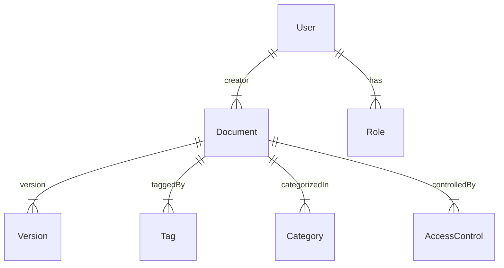

                 

# 智能文档管理系统：AI增强信息检索效率

## 关键词
- 智能文档管理系统
- AI增强信息检索
- 自然语言处理
- 机器学习
- 深度学习

## 摘要
随着信息的爆炸式增长，如何高效地管理和检索文档成为企业面临的巨大挑战。智能文档管理系统通过集成先进的AI技术，如自然语言处理、机器学习和深度学习，显著提升了文档检索的效率，改善了用户体验。本文将详细探讨智能文档管理系统的背景、核心概念、AI技术应用、系统设计与实现，以及其核心功能和AI增强的信息检索技术，旨在为读者提供全面而深入的技术解析。

## 第1章 问题背景与智能文档管理系统简介

### 1.1 问题背景

在当今的信息时代，信息的爆炸式增长使得传统文档管理方式面临着诸多挑战。首先，信息过载问题愈发严重，人们每天接收到的信息量远远超过了他们能够处理和存储的能力。其次，文档数量庞大，分类和存储变得复杂，传统文档管理系统往往无法有效管理大量文档，导致信息查找困难、效率低下。此外，文档的安全性和版本控制也是一个棘手的问题。

为了应对这些挑战，企业需要一种新的文档管理解决方案，能够提高信息检索的效率，改善用户体验，并确保文档的安全和一致性。智能文档管理系统正是在这种背景下应运而生。

#### 引言：智能文档管理系统的需求背景

信息爆炸和信息过载是当前社会的主要特征之一。据统计，全球每年产生的数据量正以惊人的速度增长，预计到2025年，全球数据总量将超过180ZB（泽字节）。在这个大数据时代，如何有效地管理和检索这些海量数据成为一个亟待解决的问题。文档作为一种常见的数据形式，其管理和检索的效率直接影响到企业的运营效率和信息利用效率。

#### 问题描述

传统文档管理系统在应对信息爆炸和过载问题上存在以下不足：

1. **效率低下**：传统文档管理系统往往依赖于手动分类和检索，操作繁琐，效率低下。用户需要花费大量时间在寻找和整理文档上，无法高效地利用信息。

2. **查找困难**：随着文档数量的增加，传统系统在检索速度上逐渐下降，特别是在海量文档场景下，用户常常无法快速找到所需文档。

3. **安全性和版本控制**：传统文档管理系统在安全性和版本控制方面也存在缺陷，容易导致数据泄露和版本混乱，影响企业的正常运营。

4. **用户体验差**：传统系统的用户界面和交互设计较为单一，难以满足不同用户的需求，用户体验较差。

#### 问题解决

智能文档管理系统的出现为上述问题提供了一种新的解决方案。通过集成先进的AI技术，智能文档管理系统在以下几个方面取得了显著成效：

1. **高效信息检索**：智能文档管理系统利用自然语言处理、机器学习和深度学习技术，实现了快速、准确的文档检索，大大提高了检索效率。

2. **智能分类与标签**：系统可以根据文档内容自动分类和打标签，帮助用户快速找到所需文档。

3. **版本控制和安全**：智能文档管理系统提供了强大的版本控制和权限管理功能，确保文档的安全性和一致性。

4. **个性化用户体验**：系统可以根据用户的行为和偏好，提供个性化的文档推荐和服务，提升用户体验。

#### 边界与外延

智能文档管理系统虽然具有许多优势，但也存在一些限制和应用边界。首先，系统的性能和效率受到数据质量和AI模型性能的限制。其次，系统的部署和维护需要一定的技术能力和资源投入。此外，智能文档管理系统在处理敏感信息和隐私保护方面也需要特别关注。

### 1.2 智能文档管理系统的定义

智能文档管理系统（Intelligent Document Management System，IDMS）是一种结合人工智能技术，用于高效管理和检索文档的系统。它不仅具备传统文档管理系统的基本功能，如文档存储、分类、检索、共享等，还引入了智能化的功能，如自动分类、关键词提取、语义搜索、文本摘要等。

#### 定义

智能文档管理系统（IDMS）是一种集成人工智能技术的文档管理系统，旨在通过自动化和智能化手段提高文档管理的效率和质量。它利用自然语言处理、机器学习和深度学习等技术，实现对文档内容的理解和分析，从而提供高效的文档检索、分类、标签、版本控制和权限管理等功能。

#### 核心要素组成

智能文档管理系统由以下几个核心要素组成：

1. **文档存储**：系统提供了高效的文档存储方案，能够处理各种类型的文档，如文本、图片、音频和视频等。

2. **自然语言处理**：系统集成了自然语言处理（NLP）技术，能够对文档内容进行解析、分类和标注，从而实现文档的自动化处理。

3. **机器学习与深度学习**：系统利用机器学习和深度学习技术，对文档内容进行建模和分析，从而提供智能化的检索和推荐功能。

4. **用户界面**：系统提供了一个直观、易用的用户界面，用户可以通过简单的操作完成文档的创建、编辑、分类、检索和共享等任务。

5. **安全与权限管理**：系统提供了严格的安全和权限管理机制，确保文档的安全性和隐私保护。

### 1.3 智能文档管理系统的发展历程

智能文档管理系统的发展历程可以追溯到20世纪末。最初，文档管理系统主要依赖于传统的数据库技术和文件管理系统，以实现文档的存储和检索。随着互联网和计算机技术的飞速发展，文档管理系统逐渐引入了更先进的搜索和索引技术，如全文检索和关键词搜索。

#### 早期阶段

在早期阶段，智能文档管理系统主要以基于规则的方法为主，如关键字匹配、关键词提取和分类规则等。这些方法在一定程度上提高了文档检索的效率，但仍然存在局限性，无法满足复杂的信息检索需求。

#### 技术演进

随着人工智能技术的兴起，智能文档管理系统开始引入自然语言处理、机器学习和深度学习等技术。这些技术的应用使得文档管理系统具备了更高的智能化水平，能够实现对文档内容的深入理解和分析，从而提供更精准的检索和推荐服务。

#### 当前应用

当前，智能文档管理系统已经成为企业信息管理的重要组成部分。许多企业通过引入智能文档管理系统，实现了文档的高效管理和检索，提高了信息利用效率和工作效率。

### 1.4 智能文档管理系统的重要性

智能文档管理系统在提高信息检索效率、改善用户体验等方面具有重要意义。

#### 提高信息检索效率

智能文档管理系统通过引入AI技术，实现了高效的文档检索。首先，系统可以对文档内容进行深度分析，提取关键词和主题信息，从而构建高质量的索引。其次，系统可以利用自然语言处理和机器学习技术，对用户的检索请求进行理解和分析，提供精准的检索结果。此外，智能文档管理系统还可以根据用户的历史行为和偏好，进行个性化推荐，提高检索的效率。

#### 改善用户体验

智能文档管理系统提供了直观、易用的用户界面，用户可以通过简单的操作完成文档的创建、编辑、分类、检索和共享等任务。系统还提供了丰富的交互功能，如文档摘要、关键词提取、语义搜索等，为用户提供了便捷的信息获取方式。此外，智能文档管理系统还支持移动设备和云端访问，用户可以随时随地访问和管理文档，提高了工作效率。

### 1.5 智能文档管理系统与传统文档管理系统的对比

#### 功能对比

传统文档管理系统主要提供文档存储、检索、分类和共享等功能，而智能文档管理系统在此基础上，引入了自然语言处理、机器学习和深度学习技术，实现了更高级的文档理解和分析能力。例如，智能文档管理系统可以自动分类和标注文档，提取关键词和摘要，提供语义搜索和个性化推荐等功能。

#### 效率对比

智能文档管理系统通过自动化和智能化手段，显著提高了文档管理的效率。例如，系统可以自动处理文档的创建、分类和索引，减少了人工操作的负担。此外，智能文档管理系统还可以根据用户的检索请求，快速提供精准的检索结果，提高了信息检索的效率。

#### 用户体验对比

智能文档管理系统提供了更丰富的交互功能，如文档摘要、关键词提取、语义搜索等，为用户提供了便捷的信息获取方式。此外，系统还支持移动设备和云端访问，用户可以随时随地访问和管理文档，提高了用户体验。

### 1.6 智能文档管理系统在行业中的应用

智能文档管理系统在各个行业中得到了广泛应用，以下是一些典型应用案例：

1. **企业内部管理**：企业通过智能文档管理系统，实现了文档的高效管理和检索，提高了工作效率和信息利用效率。

2. **金融行业**：金融机构通过智能文档管理系统，实现了金融文档的自动化分类、索引和检索，提高了业务处理效率。

3. **教育行业**：教育机构通过智能文档管理系统，实现了教学文档的智能分类、推荐和共享，提高了教学效果和资源利用率。

4. **医疗行业**：医疗机构通过智能文档管理系统，实现了病历资料的自动化管理、检索和共享，提高了医疗服务的质量和效率。

### 1.7 智能文档管理系统的挑战与未来发展方向

尽管智能文档管理系统具有许多优势，但在实际应用中仍面临一些挑战。首先，系统的性能和效率受到数据质量和AI模型性能的限制。其次，系统的部署和维护需要一定的技术能力和资源投入。此外，智能文档管理系统在处理敏感信息和隐私保护方面也需要特别关注。

未来，智能文档管理系统的发展方向包括：

1. **更高效的自然语言处理技术**：通过引入更先进的自然语言处理技术，提高文档理解和分析的能力。

2. **更智能的机器学习与深度学习算法**：通过优化机器学习与深度学习算法，提高系统的性能和效率。

3. **跨平台和跨终端的支持**：实现智能文档管理系统在多种平台和终端设备上的无缝支持，提高用户体验。

4. **更安全的数据管理和隐私保护机制**：通过引入更先进的数据管理和隐私保护技术，确保文档的安全和隐私。

## 第2章 AI技术在智能文档管理系统中的应用

### 2.1 AI技术概述

人工智能（Artificial Intelligence，AI）是计算机科学的一个分支，旨在研究、开发和应用使计算机系统能够模拟、延伸和扩展人类的智能行为的技术。AI技术的发展历程可以追溯到20世纪50年代，当时以图灵测试为标志的“强AI”概念被提出。随着计算机性能的提升和大数据、深度学习等技术的发展，AI逐渐从理论研究走向实际应用，成为现代科技的重要推动力。

#### AI的定义

AI是指通过计算机程序和算法实现人类智能活动的技术。它包括多个子领域，如机器学习、深度学习、自然语言处理、计算机视觉等。AI系统可以通过学习数据模式、执行复杂任务和进行决策，从而模拟人类的认知能力。

#### AI的发展趋势

当前，AI技术的发展呈现出以下几个趋势：

1. **深度学习**：深度学习是AI领域的重要进展，通过多层神经网络实现数据的自动特征提取和模式识别。深度学习在计算机视觉、语音识别、自然语言处理等领域取得了显著成果。

2. **强化学习**：强化学习通过奖励机制训练智能体，使其在特定环境中进行决策。强化学习在游戏、自动驾驶、机器人等领域展示了巨大潜力。

3. **跨学科融合**：AI与生物学、心理学、神经科学等领域的交叉研究，推动了认知建模、情感计算等新领域的发展。

4. **边缘计算**：边缘计算将计算能力从云端转移到网络边缘，实现实时数据处理和智能决策，为物联网、智能城市等应用提供了技术支持。

5. **伦理和责任**：随着AI技术的广泛应用，伦理和责任问题日益突出。确保AI系统的透明性、可解释性和公平性成为AI发展的关键挑战。

### 2.2 自然语言处理（NLP）技术

自然语言处理（Natural Language Processing，NLP）是AI的一个重要分支，旨在使计算机能够理解、处理和生成人类语言。NLP技术在智能文档管理系统中扮演着关键角色，通过文本分析和理解，提升文档检索、分类和摘要等功能的智能化水平。

#### 2.2.1 NLP的基本概念

NLP的基本概念包括：

1. **文本预处理**：文本预处理是NLP的首要步骤，包括分词、去停用词、词形还原等。这些步骤有助于简化文本数据，便于后续分析。

2. **词性标注**：词性标注是指为文本中的每个词分配一个词性标签（如名词、动词、形容词等），以便于理解句子的结构和语义。

3. **实体识别**：实体识别是识别文本中的命名实体（如人名、地名、组织名等），以便于进一步分析和应用。

4. **情感分析**：情感分析通过检测文本中的情感倾向，实现对用户评论、社交媒体内容等的情感判断。

5. **语义理解**：语义理解旨在理解文本的深层含义和关系，实现更为精确的文本分析和处理。

#### 2.2.1.1 问题描述

在文档管理中，NLP技术主要用于以下几个问题：

1. **文本理解和分析**：如何理解文档中的语言信息，提取关键信息。
2. **文本分类**：如何对大量文档进行分类，以便于管理和检索。
3. **关键词提取**：如何从文档中提取关键词，以优化检索效果。

#### 2.2.1.2 NLP的应用场景

NLP技术在智能文档管理系统中有着广泛的应用场景，包括：

1. **文档索引和搜索**：通过NLP技术，系统可以生成高质量的索引，实现快速、准确的文档搜索。
2. **文档摘要和提取**：系统可以自动提取文档的关键信息，生成摘要或提取关键内容。
3. **内容审核和分类**：系统可以对文档内容进行自动审核，识别敏感内容，并对文档进行分类管理。

#### 2.2.1.3 NLP的核心技术

NLP的核心技术包括：

1. **分词和词性标注**：分词是将文本分割为词或短语的步骤，词性标注则是为每个词分配词性标签。
2. **命名实体识别**：命名实体识别旨在识别文本中的特定实体，如人名、地名、组织名等。
3. **依存句法分析**：依存句法分析用于理解句子的结构和依赖关系，有助于深入理解文本语义。
4. **语义角色标注**：语义角色标注为每个词分配其在句子中的功能角色，如主语、谓语、宾语等。

#### 2.2.2 NLP与智能文档管理系统的结合

NLP技术与智能文档管理系统的结合，使得文档管理更加智能化和高效。以下是如何将NLP技术整合到文档管理系统中的方法：

1. **集成NLP库**：使用现有的NLP库（如NLTK、spaCy、Stanford NLP等）来处理文本数据，提取关键词、进行词性标注和实体识别等。
2. **构建自定义模型**：针对特定应用场景，构建自定义的NLP模型，以实现更精准的文本理解和分析。
3. **实时更新和优化**：根据用户反馈和系统运行数据，不断优化NLP模型，提高系统的性能和准确性。

#### 2.2.2.2 挑战与解决方案

NLP技术在文档管理中面临以下挑战：

1. **数据质量**：NLP模型的性能依赖于数据质量，包括数据的多样性、覆盖度和准确性。
2. **模型解释性**：许多NLP模型是黑盒子，难以解释其决策过程，这对模型的可靠性和信任度提出了挑战。
3. **跨语言处理**：不同语言的语法和语义差异，使得NLP技术的跨语言应用复杂。

解决方案包括：

1. **数据清洗和预处理**：对文本数据进行全面清洗和预处理，确保数据质量。
2. **可解释性研究**：开发可解释的NLP模型，提高模型的透明度和可解释性。
3. **多语言支持**：构建多语言NLP模型，支持多种语言的处理。

### 2.3 机器学习与深度学习技术

#### 2.3.1 机器学习基础

机器学习（Machine Learning，ML）是AI的核心技术之一，它通过构建和训练模型，使计算机能够从数据中自动学习并做出预测或决策。机器学习的基本流程包括数据收集、数据预处理、模型选择、模型训练和模型评估。

1. **数据收集**：收集用于训练和测试的数据集，这些数据集需要覆盖不同的情况和场景。
2. **数据预处理**：对收集到的数据进行清洗、归一化、降维等处理，以便于模型训练。
3. **模型选择**：根据问题的性质和数据的特点，选择合适的机器学习模型，如线性回归、决策树、支持向量机、神经网络等。
4. **模型训练**：使用训练数据集对模型进行训练，模型通过学习数据中的模式，调整内部参数以优化性能。
5. **模型评估**：使用测试数据集评估模型的性能，通过指标如准确率、召回率、F1值等，衡量模型的性能。

#### 2.3.1.1 问题建模

在智能文档管理系统中，机器学习技术主要用于以下问题建模：

1. **文档分类**：将文档分为不同的类别，如项目文档、财务文档、营销文档等。
2. **文档标签生成**：为文档生成关键词或标签，以优化检索和分类效果。
3. **用户行为预测**：根据用户的历史行为，预测用户的下一步操作或需求。

#### 2.3.1.2 模型训练与评估

模型训练与评估是机器学习的关键步骤。以下是具体的训练和评估方法：

1. **训练方法**：
   - **监督学习**：使用标注的数据集训练模型，模型在训练过程中不断优化参数。
   - **无监督学习**：在没有标注数据的情况下，模型通过自身的探索和学习发现数据中的模式。
   - **半监督学习**：结合有标注数据和未标注数据，通过少量的标注数据指导模型学习。

2. **评估方法**：
   - **准确率**：模型预测正确的样本占总样本的比例。
   - **召回率**：模型预测正确的正样本占所有正样本的比例。
   - **F1值**：准确率和召回率的调和平均值，综合考虑模型预测的精确度和覆盖率。
   - **ROC曲线**：通过不同阈值评估模型性能，曲线下面积（AUC）越大，模型性能越好。

#### 2.3.2 深度学习在文档管理系统中的应用

深度学习（Deep Learning，DL）是机器学习的一个分支，通过多层神经网络实现数据的自动特征提取和模式识别。深度学习在图像识别、语音识别、自然语言处理等领域取得了突破性进展。

1. **卷积神经网络（CNN）**：CNN通过卷积层、池化层和全连接层等结构，实现图像的自动特征提取。
2. **递归神经网络（RNN）**：RNN通过循环结构，处理序列数据，如文本和语音。
3. **长短期记忆网络（LSTM）**：LSTM是RNN的一种变体，能够有效解决长序列依赖问题。
4. **生成对抗网络（GAN）**：GAN通过生成器和判别器相互竞争，生成高质量的数据。

在文档管理系统中，深度学习技术可以应用于：

1. **文本分类**：使用深度学习模型对大量文本数据进行自动分类。
2. **文本摘要**：通过生成模型提取文本的关键信息，生成摘要。
3. **情感分析**：使用深度学习模型分析文本中的情感倾向。

#### 2.3.2.2 深度学习模型优化

深度学习模型优化是提高系统性能和效率的重要步骤。以下是一些常用的优化方法：

1. **超参数调优**：通过调整学习率、批量大小、正则化参数等超参数，优化模型性能。
2. **模型剪枝**：通过剪枝冗余的神经网络结构，减小模型规模，提高运行效率。
3. **量化**：将模型参数从浮点数转换为低精度整数，减少模型大小和计算资源消耗。
4. **迁移学习**：利用预训练的模型进行迁移学习，利用已有模型的特征提取能力，加速新任务的训练过程。

## 第3章 智能文档管理系统的设计与实现

### 3.1 系统需求分析

智能文档管理系统的设计与实现首先需要明确系统的需求。这些需求可以分为功能需求和非功能需求两部分。

#### 功能需求

1. **文档存储与管理**：系统能够存储不同类型的文档，如文本、图片、音频和视频等。同时，系统能够对文档进行分类、标签、权限管理等操作。
2. **文档检索与搜索**：系统能够提供高效、准确的文档检索功能，支持关键词搜索、全文检索和语义搜索等。
3. **文档编辑与协作**：用户能够在线编辑文档，支持多人协作，实时更新和保存文档内容。
4. **文档分类与推荐**：系统可以根据文档内容和用户行为，自动对文档进行分类，并为用户推荐相关文档。
5. **文档版本控制**：系统能够对文档的版本进行控制，支持文档的历史版本查看和版本回退功能。

#### 非功能需求

1. **性能需求**：系统能够快速响应用户的请求，支持并发访问和大规模数据处理。
2. **安全性**：系统能够保护文档的安全，防止未授权访问和数据泄露。
3. **可靠性**：系统需要具备高可用性，能够稳定运行，确保数据的完整性和一致性。
4. **可扩展性**：系统设计应具备良好的可扩展性，能够支持未来的功能扩展和性能优化。
5. **用户体验**：系统界面设计应简洁直观，提供良好的用户交互体验。

### 3.2 系统架构设计

智能文档管理系统的架构设计是确保系统高效、稳定运行的关键。以下是系统架构的概述、模块划分和各模块功能。

#### 系统架构概述

智能文档管理系统采用分层架构，分为表示层、业务逻辑层和数据层。

1. **表示层**：负责用户界面和用户交互，提供友好的操作界面，支持用户对文档的创建、编辑、检索和共享等操作。
2. **业务逻辑层**：负责处理业务逻辑，包括文档存储、检索、分类、版本控制和权限管理等功能。业务逻辑层是系统的核心，通过调用底层的数据层接口实现各项功能。
3. **数据层**：负责数据存储和管理，包括文档存储、索引和备份等。数据层使用关系型数据库和全文搜索引擎等技术，确保数据的持久化和高效检索。

#### 模块划分

智能文档管理系统可以分为以下几个模块：

1. **用户管理模块**：负责用户的注册、登录、权限管理和用户行为分析。
2. **文档管理模块**：负责文档的存储、检索、编辑和协作等功能。
3. **搜索与索引模块**：负责文档的索引构建、搜索算法和搜索结果排序。
4. **分类与推荐模块**：负责文档的分类、标签生成和用户偏好分析，提供个性化推荐服务。
5. **版本控制模块**：负责文档的版本管理，支持历史版本查看和版本回退。
6. **权限管理模块**：负责文档的权限分配和访问控制，确保文档的安全性。

#### 各模块功能

1. **用户管理模块**：实现用户的注册、登录和权限管理，用户可以通过用户界面进行操作，系统根据用户的角色和权限限制访问权限。
2. **文档管理模块**：实现文档的创建、编辑、删除和共享功能。用户可以在用户界面上传和编辑文档，系统将文档存储到数据库中，并提供文档的版本控制和协作功能。
3. **搜索与索引模块**：构建文档的索引结构，实现快速、准确的文档检索。系统使用全文搜索引擎，支持关键词搜索、全文检索和语义搜索等功能，并提供搜索结果的排序和过滤功能。
4. **分类与推荐模块**：分析文档内容和用户行为，自动对文档进行分类和打标签，提供个性化推荐服务。系统利用自然语言处理技术，对文档内容进行解析，提取关键词和主题信息，并根据用户的历史行为和偏好，推荐相关文档。
5. **版本控制模块**：实现文档的版本管理，支持历史版本查看和版本回退。系统记录每个版本的文档内容，用户可以通过用户界面查看历史版本，并选择回退到特定版本。
6. **权限管理模块**：实现文档的权限分配和访问控制。系统根据用户的角色和权限，限制用户的访问权限，确保文档的安全性。

### 3.3 数据模型设计

智能文档管理系统的数据模型设计是确保系统高效、稳定运行的基础。以下是数据模型的设计，包括数据存储结构和策略，以及数据模型的ER图。

#### 数据存储结构与策略

1. **文档存储结构**：系统采用关系型数据库存储文档信息，每个文档存储在数据库的一个表中，表结构包括文档ID、文档标题、文档内容、文档类型、创建时间和更新时间等字段。

2. **索引存储结构**：系统使用全文搜索引擎（如Elasticsearch）构建文档索引，索引存储在搜索引擎的集群中，支持快速、准确的文档检索。

3. **数据备份与恢复策略**：系统采用定期备份和增量备份策略，确保数据的完整性和安全性。备份的数据存储在异地服务器中，以便在发生故障时进行恢复。

#### 数据模型ER图

使用Mermaid工具绘制数据模型的ER图如下：



ER图中的实体包括用户（User）、文档（Document）、版本（Version）、标签（Tag）、分类（Category）、角色（Role）和访问控制（AccessControl）。实体之间的关系包括创建者关系（creator）、版本关系（version）、标签关系（taggedBy）、分类关系（categorizedIn）、角色关系（has）和访问控制关系（controlledBy）。

### 3.4 系统接口设计

系统接口设计是确保智能文档管理系统各模块之间能够高效、可靠地交互的关键。以下是系统接口规范和API设计，以及接口实现。

#### 接口规范

1. **用户管理接口**：提供用户注册、登录、权限管理和用户行为分析等功能。
2. **文档管理接口**：提供文档创建、编辑、删除、共享和版本控制等功能。
3. **搜索与索引接口**：提供文档检索、索引构建和搜索结果排序等功能。
4. **分类与推荐接口**：提供文档分类、标签生成和用户偏好分析等功能。
5. **权限管理接口**：提供文档权限分配和访问控制等功能。

#### API设计

以下是具体的API设计：

1. **用户管理接口**
   - **注册用户**：POST /users/register
   - **登录用户**：POST /users/login
   - **获取用户权限**：GET /users/{userId}/roles
   - **更新用户权限**：PUT /users/{userId}/roles
   - **分析用户行为**：GET /users/{userId}/behaviors

2. **文档管理接口**
   - **创建文档**：POST /documents
   - **获取文档**：GET /documents/{documentId}
   - **编辑文档**：PUT /documents/{documentId}
   - **删除文档**：DELETE /documents/{documentId}
   - **共享文档**：POST /documents/{documentId}/share
   - **获取文档版本**：GET /documents/{documentId}/versions
   - **回退版本**：PUT /documents/{documentId}/versions/{versionId}

3. **搜索与索引接口**
   - **构建索引**：POST /search/index
   - **搜索文档**：GET /search/documents
   - **获取搜索结果**：GET /search/documents/{query}

4. **分类与推荐接口**
   - **分类文档**：POST /documents/{documentId}/category
   - **生成标签**：POST /documents/{documentId}/tags
   - **推荐文档**：GET /documents/recommendations

5. **权限管理接口**
   - **分配权限**：POST /documents/{documentId}/accessControl
   - **更新权限**：PUT /documents/{documentId}/accessControl
   - **获取访问控制**：GET /documents/{documentId}/accessControl

#### 接口实现

以下是接口实现的示例：

```python
# 用户管理接口实现
@app.route('/users/register', methods=['POST'])
def register_user():
    # 获取用户注册信息
    username = request.form['username']
    password = request.form['password']
    # 验证用户信息
    if verify_user(username, password):
        # 注册用户
        user_id = create_user(username, password)
        return jsonify({'user_id': user_id})
    else:
        return jsonify({'error': 'Invalid username or password'}), 401

# 文档管理接口实现
@app.route('/documents', methods=['POST'])
def create_document():
    # 获取文档信息
    title = request.form['title']
    content = request.form['content']
    # 创建文档
    document_id = create_document(title, content)
    return jsonify({'document_id': document_id})

@app.route('/documents/<int:document_id>', methods=['GET'])
def get_document(document_id):
    # 获取文档信息
    document = get_document_by_id(document_id)
    return jsonify(document)

# 搜索与索引接口实现
@app.route('/search/documents', methods=['GET'])
def search_documents():
    # 获取搜索参数
    query = request.args.get('query')
    # 搜索文档
    results = search_documents_by_query(query)
    return jsonify(results)

# 分类与推荐接口实现
@app.route('/documents/<int:document_id>/category', methods=['POST'])
def categorize_document(document_id):
    # 获取分类信息
    category = request.form['category']
    # 分类文档
    categorize_document_by_id(document_id, category)
    return jsonify({'status': 'success'})

# 权限管理接口实现
@app.route('/documents/<int:document_id>/accessControl', methods=['POST'])
def assign_access_control(document_id):
    # 获取访问控制信息
    user_id = request.form['user_id']
    role = request.form['role']
    # 分配权限
    assign_access_control_to_document(document_id, user_id, role)
    return jsonify({'status': 'success'})
```

### 3.5 系统实现与测试

系统实现与测试是确保智能文档管理系统功能完整、性能稳定的重要环节。以下是系统核心代码实现、测试方法和测试用例设计。

#### 系统核心代码实现

以下是系统核心功能的代码实现示例：

```python
# 用户管理模块
class UserManager:
    def register_user(self, username, password):
        # 注册用户
        user_id = self.create_user(username, password)
        return user_id

    def login_user(self, username, password):
        # 登录用户
        if self.verify_user(username, password):
            return True
        else:
            return False

    def get_user_roles(self, user_id):
        # 获取用户角色
        roles = self.get_user_roles_by_id(user_id)
        return roles

    def update_user_roles(self, user_id, roles):
        # 更新用户角色
        self.update_user_roles_by_id(user_id, roles)

    def analyze_user_behaviors(self, user_id):
        # 分析用户行为
        behaviors = self.get_user_behaviors(user_id)
        return behaviors

# 文档管理模块
class DocumentManager:
    def create_document(self, title, content):
        # 创建文档
        document_id = self.generate_document_id()
        self.save_document(document_id, title, content)
        return document_id

    def get_document(self, document_id):
        # 获取文档
        document = self.fetch_document(document_id)
        return document

    def update_document(self, document_id, title, content):
        # 更新文档
        self.update_document_content(document_id, title, content)

    def delete_document(self, document_id):
        # 删除文档
        self.delete_document_by_id(document_id)

    def share_document(self, document_id, user_id):
        # 共享文档
        self.share_document_with_user(document_id, user_id)

    def get_document_versions(self, document_id):
        # 获取文档版本
        versions = self.fetch_document_versions(document_id)
        return versions

    def revert_document_version(self, document_id, version_id):
        # 回退版本
        self.revert_document_to_version(document_id, version_id)

# 搜索与索引模块
class SearchManager:
    def build_index(self, documents):
        # 构建索引
        self.index_documents(documents)

    def search_documents(self, query):
        # 搜索文档
        results = self.query_documents(query)
        return results

    def sort_search_results(self, results):
        # 排序搜索结果
        sorted_results = self.sort_by_relevance(results)
        return sorted_results

# 分类与推荐模块
class Categorizer:
    def categorize_document(self, document_id, category):
        # 分类文档
        self.apply_category_to_document(document_id, category)

    def generate_document_tags(self, document_id):
        # 生成标签
        tags = self.extract_tags_from_document(document_id)
        return tags

    def recommend_documents(self, user_id):
        # 推荐文档
        recommendations = self.generate_recommendations_for_user(user_id)
        return recommendations

# 权限管理模块
class AccessControlManager:
    def assign_access_control(self, document_id, user_id, role):
        # 分配权限
        self.assign_role_to_document(document_id, user_id, role)

    def update_access_control(self, document_id, user_id, role):
        # 更新权限
        self.update_role_for_document(document_id, user_id, role)

    def get_access_control(self, document_id):
        # 获取访问控制
        access_control = self.fetch_access_control_for_document(document_id)
        return access_control
```

#### 测试方法和测试用例设计

测试方法和测试用例设计是确保系统功能正确、可靠的关键步骤。以下是具体的测试方法和测试用例设计：

1. **功能测试**：针对每个功能模块，设计具体的测试用例，验证功能的正确性。例如，测试用户注册、登录、文档创建、编辑、删除等功能。

2. **性能测试**：通过模拟高并发场景，测试系统的性能和响应时间，确保系统在压力下能够稳定运行。

3. **安全性测试**：测试系统的安全漏洞，包括用户认证、权限管理和数据加密等方面，确保系统的安全性。

4. **兼容性测试**：测试系统在不同操作系统、浏览器和设备上的兼容性，确保系统能够在不同环境下正常运行。

以下是具体的测试用例设计：

| 用例编号 | 用例名称 | 测试目的 | 测试步骤 | 预期结果 |
|----------|----------|----------|----------|----------|
| TC01     | 用户注册 | 验证用户注册功能 | 1. 输入有效的用户名和密码<br>2. 提交注册请求<br>3. 系统返回用户ID | 系统成功注册用户并返回用户ID |
| TC02     | 用户登录 | 验证用户登录功能 | 1. 输入正确的用户名和密码<br>2. 提交登录请求<br>3. 系统返回登录状态 | 系统成功登录用户并返回登录状态 |
| TC03     | 文档创建 | 验证文档创建功能 | 1. 输入文档标题和内容<br>2. 提交创建请求<br>3. 系统返回文档ID | 系统成功创建文档并返回文档ID |
| TC04     | 文档编辑 | 验证文档编辑功能 | 1. 获取文档ID<br>2. 提交编辑请求<br>3. 系统返回更新状态 | 系统成功编辑文档并返回更新状态 |
| TC05     | 文档删除 | 验证文档删除功能 | 1. 获取文档ID<br>2. 提交删除请求<br>3. 系统返回删除状态 | 系统成功删除文档并返回删除状态 |
| TC06     | 文档搜索 | 验证文档搜索功能 | 1. 输入关键词<br>2. 提交搜索请求<br>3. 系统返回搜索结果 | 系统成功返回与关键词匹配的文档列表 |
| TC07     | 文档分类 | 验证文档分类功能 | 1. 获取文档ID<br>2. 提交分类请求<br>3. 系统返回分类状态 | 系统成功对文档进行分类并返回分类状态 |
| TC08     | 文档推荐 | 验证文档推荐功能 | 1. 输入用户ID<br>2. 提交推荐请求<br>3. 系统返回推荐结果 | 系统成功为用户推荐相关文档并返回推荐结果 |
| TC09     | 用户权限管理 | 验证用户权限管理功能 | 1. 获取用户ID<br>2. 提交权限分配请求<br>3. 系统返回权限分配状态 | 系统成功分配用户权限并返回权限分配状态 |

## 第4章 智能文档管理系统的核心功能

### 4.1 文档检索

文档检索是智能文档管理系统的核心功能之一，旨在帮助用户快速、准确地找到所需文档。以下是文档检索的主要算法和优化策略。

#### 4.1.1 检索算法

1. **布尔检索**：布尔检索是最简单的检索算法之一，通过逻辑运算符（如AND、OR、NOT）组合关键词，实现复杂查询。布尔检索的优点是实现简单，缺点是查询表达能力有限。

2. **向量空间模型（VSM）**：向量空间模型将文档和查询表示为向量，通过计算向量之间的相似度来检索相关文档。VSM的常见相似度计算方法包括余弦相似度和欧氏距离。

3. **基于概率的检索算法**：基于概率的检索算法利用文档和查询的统计特征，计算文档与查询的相关概率，选择概率最高的文档作为检索结果。常见的算法有贝叶斯检索和语言模型检索。

4. **语义搜索**：语义搜索利用自然语言处理技术，深入理解文档和查询的语义内容，实现更为精准的检索。语义搜索可以通过知识图谱、语义角色标注等技术，提升检索效果。

#### 4.1.2 检索优化

1. **索引优化**：索引优化是提升检索性能的关键步骤。通过使用倒排索引、压缩索引等技术，减小索引空间，提高检索速度。

2. **查询重写**：查询重写通过对查询进行改写，生成等价但更为高效的查询。常见的查询重写方法包括同义词替换、词干提取和词性标注。

3. **缓存策略**：缓存策略通过存储频繁查询的结果，提高查询响应速度。缓存策略可以根据查询频率和结果新鲜度进行优化。

4. **分布式检索**：在处理海量文档时，分布式检索通过将检索任务分解到多个节点，并行处理，提高检索性能。常见的分布式检索系统有Elasticsearch和Solr。

### 4.2 文档分类

文档分类是将大量文档自动划分为不同类别的过程，有助于管理和检索文档。以下是文档分类的常见算法和性能评估方法。

#### 4.2.1 分类算法

1. **基于规则的方法**：基于规则的方法通过定义一系列分类规则，对文档进行分类。常见的规则方法包括朴素贝叶斯分类、决策树和关联规则挖掘。

2. **基于统计的方法**：基于统计的方法利用文档的统计特征，如词频、文档频率等，进行分类。常见的统计方法有K最近邻（KNN）和支持向量机（SVM）。

3. **基于机器学习的方法**：基于机器学习的方法通过训练分类模型，对文档进行分类。常见的机器学习方法包括朴素贝叶斯、决策树、随机森林和深度学习等。

4. **基于深度学习的方法**：基于深度学习的方法利用深度神经网络，自动提取文档的特征并进行分类。常见的深度学习方法有卷积神经网络（CNN）和递归神经网络（RNN）。

#### 4.2.2 分类性能评估

分类性能评估是衡量分类算法效果的重要步骤。以下是常用的评估指标：

1. **准确率（Accuracy）**：准确率是指分类正确的文档数量占总文档数量的比例。准确率越高，表示分类效果越好。

2. **召回率（Recall）**：召回率是指分类正确的文档数量与实际正类文档数量的比例。召回率越高，表示分类算法能够更全面地识别正类文档。

3. **精确率（Precision）**：精确率是指分类正确的文档数量与分类为正类的文档总数量的比例。精确率越高，表示分类算法对正类文档的识别越准确。

4. **F1值（F1-score）**：F1值是精确率和召回率的调和平均值，综合考虑了分类的精确度和覆盖率。

5. **混淆矩阵（Confusion Matrix）**：混淆矩阵用于展示分类算法对各类别文档的分类结果。通过分析混淆矩阵，可以了解分类算法在不同类别上的性能。

### 4.3 文档摘要与提取

文档摘要与提取是智能文档管理系统的重要功能，旨在简化文档内容，帮助用户快速获取关键信息。以下是文档摘要与提取的方法。

#### 4.3.1 摘要生成

1. **基于抽取的方法**：基于抽取的方法从文档中提取关键句子或段落，生成摘要。常见的抽取方法包括统计方法、规则方法和基于机器学习的方法。

2. **基于生成的方法**：基于生成的方法利用生成模型，生成新的文档摘要。常见的生成方法包括序列生成模型（如RNN、Transformer）和生成对抗网络（GAN）。

3. **混合方法**：混合方法结合抽取和生成方法，利用抽取方法生成初步摘要，再通过生成方法优化摘要质量。

#### 4.3.2 提取关键信息

1. **关键词提取**：关键词提取是从文档中提取最能代表文档主题的词语。常见的关键词提取方法包括TF-IDF、LDA和TextRank等。

2. **实体识别**：实体识别是识别文档中的命名实体，如人名、地名、组织名等。常见的实体识别方法包括基于规则的方法、统计方法和深度学习方法。

3. **关系抽取**：关系抽取是识别实体之间的语义关系，如因果关系、所属关系等。常见的关系抽取方法包括基于规则的方法和基于机器学习的方法。

## 第5章 AI增强的信息检索技术

### 5.1 语义搜索

语义搜索是一种基于语义理解的信息检索技术，通过深入理解用户查询和文档内容，提供更为精准和个性化的检索结果。以下是语义搜索的概念、原理和实现方法。

#### 5.1.1 语义搜索的概念

语义搜索旨在通过理解用户查询和文档的语义内容，提供与用户意图最为匹配的检索结果。与传统的基于关键词的检索不同，语义搜索能够捕捉到查询和文档之间的深层次语义关系，从而提高检索的准确性和用户体验。

#### 5.1.2 语义搜索的原理

语义搜索的原理主要包括以下几个方面：

1. **查询理解**：将用户输入的查询文本转换为语义表示，提取查询的关键词、实体和关系。

2. **文档理解**：对文档内容进行语义分析，提取文档的主题、关键词、实体和关系。

3. **查询与文档匹配**：通过比较查询和文档的语义表示，计算查询与文档之间的相似度，选择最匹配的文档作为检索结果。

4. **结果排序**：根据查询与文档的相似度，对检索结果进行排序，展示最为相关的文档。

#### 5.1.3 语义搜索的实现方法

1. **基于词向量的方法**：词向量是一种将词语转换为高维向量表示的方法，通过计算词向量之间的相似度，实现语义搜索。常见的词向量模型包括Word2Vec、GloVe和BERT等。

2. **基于语义角色标注的方法**：语义角色标注是识别文本中的语义角色（如主语、谓语、宾语等），通过分析语义角色之间的关系，实现语义搜索。

3. **基于知识图谱的方法**：知识图谱是一种将实体、关系和属性组织为图的表示方法，通过查询和匹配知识图谱中的实体和关系，实现语义搜索。

4. **基于深度学习的方法**：深度学习通过构建复杂的神经网络模型，实现对文本的深度语义分析，实现语义搜索。常见的深度学习模型包括Transformer、BERT和GPT等。

#### 5.1.4 语义搜索的优势

语义搜索相比传统关键词搜索具有以下优势：

1. **更精准的检索结果**：语义搜索能够捕捉到查询和文档之间的深层次语义关系，提供更准确的检索结果。

2. **更好的用户体验**：语义搜索可以根据用户的查询意图，提供个性化的检索结果，提升用户体验。

3. **更广泛的适用性**：语义搜索可以应用于各种类型的信息检索任务，如文档检索、图像检索、语音检索等。

### 5.2 上下文感知的搜索

上下文感知的搜索是一种结合用户上下文信息，提供更加个性化、相关性的检索结果的方法。以下是上下文感知的搜索的概念、原理和实现方法。

#### 5.2.1 上下文感知搜索的概念

上下文感知搜索是指利用用户在特定场景或任务中的上下文信息，如位置、时间、历史行为等，优化信息检索的结果。上下文感知搜索旨在提供与当前上下文最为匹配的信息，提高检索的准确性和用户体验。

#### 5.2.2 上下文感知搜索的原理

上下文感知搜索的原理主要包括以下几个方面：

1. **上下文信息提取**：从用户的查询和行为中提取上下文信息，如关键词、位置、时间等。

2. **上下文建模**：将提取的上下文信息转换为模型表示，如向量、图等。

3. **查询扩展**：结合上下文信息，扩展查询文本，提高查询的精确性和相关性。

4. **结果排序**：根据查询和上下文的匹配度，对检索结果进行排序，展示与当前上下文最为相关的文档。

#### 5.2.3 上下文感知搜索的实现方法

1. **基于规则的方法**：基于规则的方法通过定义一系列上下文规则，对查询和结果进行扩展和排序。常见的方法包括时间规则、位置规则和历史行为规则等。

2. **基于机器学习的方法**：基于机器学习的方法通过训练模型，自动学习上下文信息对查询和结果的影响，实现上下文感知搜索。常见的机器学习方法包括朴素贝叶斯、支持向量机和深度学习等。

3. **基于深度学习的方法**：深度学习通过构建复杂的神经网络模型，实现对上下文信息的理解和建模，实现上下文感知搜索。常见的深度学习模型包括循环神经网络（RNN）、变换器（Transformer）和BERT等。

#### 5.2.4 上下文感知搜索的优势

上下文感知搜索相比传统的信息检索具有以下优势：

1. **更好的个性化**：上下文感知搜索可以根据用户的上下文信息，提供个性化的检索结果，满足用户特定的需求。

2. **更高的相关性**：上下文感知搜索结合用户的上下文信息，提高查询与结果的相关性，提供更为精准的检索结果。

3. **更丰富的应用场景**：上下文感知搜索可以应用于各种需要考虑上下文信息的场景，如移动搜索、智能助手、推荐系统等。

### 5.3 情感分析

情感分析是自然语言处理的一个重要应用领域，旨在分析文本中的情感倾向和情感极性。以下是情感分析的概念、应用场景和实现方法。

#### 5.3.1 情感分析的概念

情感分析是指通过自然语言处理技术，对文本中的情感进行识别和分类。情感分析通常分为正面情感、负面情感和中性情感三种分类，也可以进行更为细致的情感极性分析，如愤怒、喜悦、悲伤等。

#### 5.3.2 情感分析的应用场景

情感分析在多个应用场景中具有广泛的应用：

1. **社交媒体分析**：分析社交媒体平台上的用户评论、微博、帖子等，了解用户对产品、服务或事件的情感倾向。

2. **市场调研**：通过分析用户反馈和意见，帮助企业了解消费者需求和偏好，指导产品开发和市场策略。

3. **舆情监控**：监测新闻媒体、论坛、博客等渠道的舆情动态，及时了解社会热点和公众意见。

4. **客服与支持**：分析用户提出的问题和反馈，识别情感倾向，提供更加个性化的服务和支持。

#### 5.3.3 情感分析的实现方法

1. **基于规则的方法**：基于规则的方法通过定义一系列情感分类规则，对文本进行情感分类。常见的方法包括词典方法、基于关键词的规则和基于文本结构的规则等。

2. **基于统计的方法**：基于统计的方法通过统计文本特征（如词频、词性、句法结构等），进行情感分类。常见的方法包括朴素贝叶斯、支持向量机和逻辑回归等。

3. **基于机器学习的方法**：基于机器学习的方法通过训练分类模型，对文本进行情感分类。常见的机器学习方法包括朴素贝叶斯、决策树、随机森林和深度学习等。

4. **基于深度学习的方法**：深度学习通过构建复杂的神经网络模型，实现对文本的深度语义分析，进行情感分类。常见的深度学习模型包括卷积神经网络（CNN）、循环神经网络（RNN）和变换器（Transformer）等。

#### 5.3.4 情感分析的优势

情感分析相比传统的文本分析具有以下优势：

1. **更精细的情感分类**：情感分析能够识别更为细致的情感极性，提供更丰富的情感信息。

2. **更高的准确性**：基于机器学习和深度学习的方法能够自动学习文本特征，提高情感分类的准确性。

3. **更广泛的应用**：情感分析可以应用于多种场景，如社交媒体分析、市场调研、舆情监控和客服支持等。

### 5.4 自动摘要

自动摘要是从大量文本中自动生成简洁、概括的摘要信息，帮助用户快速了解文本的主要内容。以下是自动摘要的概念、生成方法和技术挑战。

#### 5.4.1 自动摘要的概念

自动摘要分为抽取式摘要和生成式摘要两种类型：

1. **抽取式摘要**：抽取式摘要从文本中直接抽取关键句子或段落，生成摘要。常见的方法包括基于关键词的抽取、基于文本分类的抽取和基于句法分析的抽取等。

2. **生成式摘要**：生成式摘要通过生成模型，生成新的摘要文本。常见的方法包括序列生成模型（如RNN、Transformer）和生成对抗网络（GAN）等。

#### 5.4.2 自动摘要的生成方法

1. **基于关键词的方法**：基于关键词的方法通过提取文本中的高频关键词，生成摘要。常见的方法包括TF-IDF和TextRank等。

2. **基于文本分类的方法**：基于文本分类的方法通过将文本分类为不同的主题，为每个主题生成相应的摘要。常见的方法包括朴素贝叶斯、决策树和支持向量机等。

3. **基于句法分析的方法**：基于句法分析的方法通过分析文本的句法结构，提取关键句子，生成摘要。常见的方法包括基于依存句法分析和基于转换器的句法分析等。

4. **生成式模型**：生成式模型通过训练生成模型，生成新的摘要文本。常见的方法包括基于序列生成模型的摘要生成和基于生成对抗网络的摘要生成等。

#### 5.4.3 自动摘要的技术挑战

自动摘要面临以下技术挑战：

1. **文本理解**：自动摘要需要对文本进行深入理解，提取关键信息，这需要复杂的自然语言处理技术。

2. **摘要质量**：摘要的质量直接影响用户体验。如何生成高质量、可读性强的摘要是一个挑战。

3. **计算效率**：自动摘要需要处理大量文本，计算效率是一个重要的考量因素。

4. **多语言支持**：自动摘要需要支持多种语言，不同语言的文本处理方法可能有所不同。

### 5.5 文本相似度计算

文本相似度计算是评估两个文本之间相似程度的重要技术，广泛应用于信息检索、文本分类、文本匹配等领域。以下是文本相似度计算的概念、方法和技术挑战。

#### 5.5.1 文本相似度计算的概念

文本相似度计算是指通过计算两个文本之间的相似度，评估它们的内容相关性。文本相似度计算的方法可以分为基于特征的相似度计算和基于模型的相似度计算。

1. **基于特征的相似度计算**：基于特征的相似度计算通过提取文本的特征向量，计算特征向量之间的相似度。常见的特征提取方法包括词频、词嵌入、TF-IDF等。

2. **基于模型的相似度计算**：基于模型的相似度计算通过构建文本表示模型，计算模型表示之间的相似度。常见的模型表示方法包括词向量、图嵌入、变换器等。

#### 5.5.2 文本相似度计算的方法

1. **词频计算**：词频计算是文本相似度计算的基础方法，通过统计文本中的词频，计算词频向量之间的余弦相似度。词频计算简单高效，但在处理语义差异时存在局限性。

2. **TF-IDF计算**：TF-IDF计算是一种基于词频的相似度计算方法，通过计算文本中词的TF-IDF值，计算TF-IDF向量之间的余弦相似度。TF-IDF方法能够考虑词的重要性，提高了文本相似度计算的效果。

3. **词嵌入计算**：词嵌入是将文本中的词语转换为高维向量表示的方法，通过计算词嵌入向量之间的余弦相似度，评估文本的相似度。常见的词嵌入方法包括Word2Vec、GloVe和BERT等。

4. **图嵌入计算**：图嵌入是将文本表示为一个图结构，通过计算图之间的相似度，评估文本的相似度。常见的图嵌入方法包括节点嵌入和图嵌入等。

5. **变换器计算**：变换器是一种基于深度学习的文本表示模型，通过变换器的输出，计算文本之间的相似度。常见的变换器模型包括BERT、GPT和T5等。

#### 5.5.3 文本相似度计算的技术挑战

文本相似度计算面临以下技术挑战：

1. **语义理解**：文本相似度计算需要对文本进行深入理解，捕捉文本的语义信息，提高相似度计算的准确性。

2. **多语言支持**：文本相似度计算需要支持多种语言，不同语言的文本处理方法可能有所不同。

3. **实时计算**：文本相似度计算需要在实时场景下进行，处理大规模的文本数据，提高计算效率。

4. **计算资源**：文本相似度计算需要大量的计算资源，特别是在处理高维向量时，计算复杂度较高。

## 总结与展望

智能文档管理系统通过集成先进的AI技术，如自然语言处理、机器学习和深度学习，实现了文档管理的智能化和高效化。本文从问题背景、核心概念、AI技术应用、系统设计与实现等方面，全面解析了智能文档管理系统的优势和应用场景。

未来，智能文档管理系统的发展趋势将包括：

1. **更高效的自然语言处理技术**：通过引入更先进的NLP技术，提高文档理解和分析的能力。

2. **更智能的机器学习与深度学习算法**：通过优化机器学习与深度学习算法，提高系统的性能和效率。

3. **跨平台和跨终端的支持**：实现智能文档管理系统在多种平台和终端设备上的无缝支持，提高用户体验。

4. **更安全的数据管理和隐私保护机制**：通过引入更先进的数据管理和隐私保护技术，确保文档的安全和隐私。

智能文档管理系统在提高信息检索效率、改善用户体验、优化文档管理等方面具有重要意义。随着AI技术的不断进步，智能文档管理系统有望在更多行业和应用场景中发挥更大的作用。

### 注意事项

1. **数据质量**：智能文档管理系统对数据质量要求较高，确保数据的一致性和准确性对于系统性能至关重要。

2. **安全与隐私**：在处理敏感数据时，需严格遵循数据保护法规，采取有效的安全措施和隐私保护机制。

3. **系统维护与升级**：定期对系统进行维护和升级，确保系统的稳定性和安全性。

### 拓展阅读

1. **《深度学习》（Goodfellow, I., Bengio, Y., Courville, A.）**：详细介绍深度学习的基础知识和应用。

2. **《自然语言处理综论》（Jurafsky, D., Martin, J. H.）**：全面讲解自然语言处理的基本概念和技术。

3. **《Python机器学习》（Sebastian Raschka）**：详细介绍机器学习在Python中的应用。

4. **《人工智能：一种现代方法》（Stuart Russell, Peter Norvig）**：全面探讨人工智能的基础理论和应用。

作者：AI天才研究院/AI Genius Institute & 禅与计算机程序设计艺术 /Zen And The Art of Computer Programming

