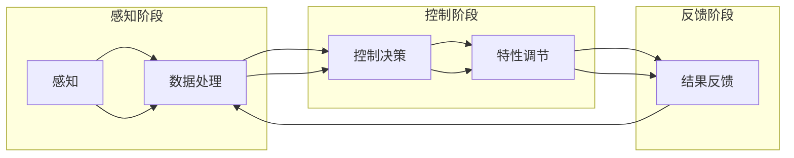
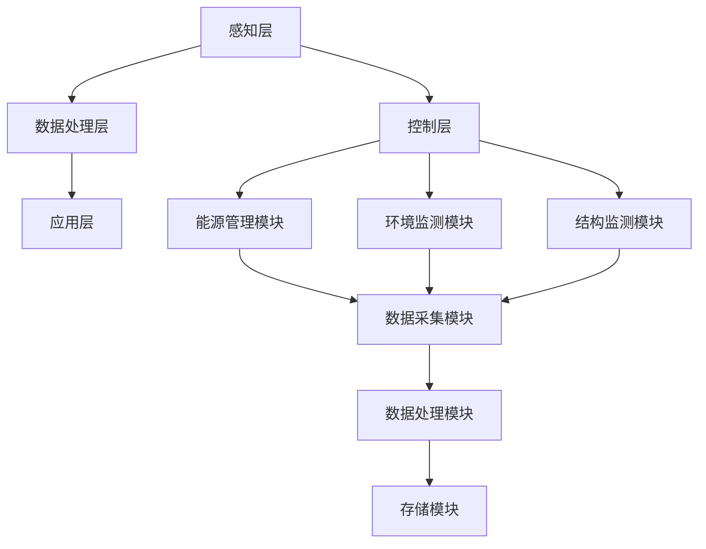
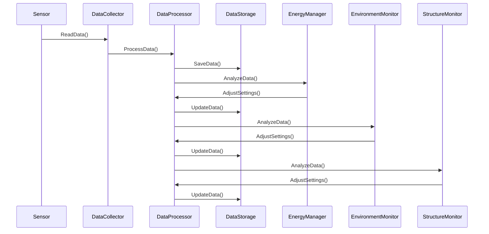

                 


## 摘要

智能材料在可持续建筑中的应用已成为当今建筑科技领域的一个热点话题。随着全球对可持续发展和环境保护的关注日益增加，智能材料凭借其自感知、自调节和自适应的特性，为建筑行业带来了革命性的变化。本文将系统性地探讨智能材料在可持续建筑中的关键作用，包括其定义、分类、应用现状与前景，以及智能材料对建筑设计的深远影响。文章首先介绍了智能材料的基本概念和其在建筑领域的应用背景，随后深入分析了智能材料的分类与属性特征，并通过ER实体关系图展示了其与可持续建筑的关联。接着，文章讲解了智能材料的应用算法原理，以及如何使用Python代码和Mermaid流程图进行详细阐述。最后，文章通过具体项目实战，展示了智能材料在可持续建筑中的应用实例，并总结了最佳实践和未来拓展方向。本文旨在为读者提供一份关于智能材料在可持续建筑中应用的综合指南，帮助理解这一前沿科技领域的无限潜力。关键词：智能材料，可持续建筑，自感知，自调节，自适应，算法，Python，Mermaid流程图。

## 第一部分：背景介绍

### 1.1 问题背景

#### 可持续建筑的需求与挑战

随着全球人口的增长和经济的发展，建筑行业对资源消耗和环境影响的压力日益增加。传统的建筑方式往往忽视了资源的循环利用和环境的保护，导致能源消耗、污染排放和碳排放等问题。为了应对这些挑战，可持续建筑的概念应运而生。可持续建筑强调在建筑全生命周期内，通过高效利用资源、减少污染和碳排放，实现经济效益、社会效益和环境效益的有机统一。

#### 智能材料在建筑领域的兴起

智能材料是一种具有特殊功能，能够对外界刺激（如光、热、电、磁等）做出响应的材料。这些材料能够通过自感知、自调节和自适应的特性，为建筑提供更加高效、舒适和安全的居住环境。智能材料的应用不仅能够提高建筑的能源利用效率，减少能源消耗，还能够改善室内环境质量，降低碳排放。

智能材料在建筑领域的兴起，与建筑行业对创新技术的需求密不可分。传统的建筑材料往往缺乏智能化的特性，难以适应环境变化和用户需求。而智能材料的应用，使得建筑能够实现动态调节，从而更好地满足人们的居住需求。

### 1.2 问题描述

#### 智能材料的概念与分类

智能材料是指具有某种或多种智能特性，能够通过自感知、自调节和自适应等方式，对外界刺激作出响应的材料。根据响应机制和功能的不同，智能材料可以大致分为以下几类：

1. **结构智能材料**：这类材料能够改变自身结构，以适应外界环境的变化。例如，形状记忆合金和超弹性聚合物等。

2. **感知智能材料**：这类材料能够感知环境的变化，如温度、压力、湿度等，并通过信号传输系统进行响应。例如，热敏电阻和压电材料等。

3. **功能化智能材料**：这类材料具有特定的功能性，如储能、导电、发光等。例如，锂离子电池和导电聚合物等。

#### 智能材料在建筑中的应用现状与前景

智能材料在建筑中的应用已经取得了显著成果。目前，智能材料在建筑领域的主要应用包括：

1. **建筑物的自调节功能**：利用智能材料，建筑物可以自动调节温度、湿度、光照等，从而提高居住舒适度。

2. **能源的高效利用**：智能材料可以优化建筑物的能源消耗，例如，通过调节窗户的光照，减少空调和照明等能源的消耗。

3. **室内环境质量的改善**：智能材料能够感知室内空气质量，并自动调节通风系统，改善室内环境。

4. **建筑结构的自我修复**：利用智能材料，建筑物可以自我检测并修复损伤，延长使用寿命。

未来，随着科技的不断进步，智能材料在建筑领域的应用将更加广泛。预计智能材料将推动建筑行业实现更高水平的可持续性，为人类创造更加美好、舒适的居住环境。

### 1.3 问题解决

#### 智能材料对可持续建筑的意义

智能材料在可持续建筑中的应用，具有以下几方面的意义：

1. **提高能源效率**：智能材料可以自动调节建筑物的能源消耗，减少能源浪费，提高能源利用效率。

2. **改善室内环境**：智能材料能够感知和调节室内环境，提高居住舒适度，减少对人工调节系统的依赖。

3. **延长建筑寿命**：智能材料的自我修复功能可以延长建筑物的使用寿命，减少建筑维护成本。

4. **促进环境保护**：智能材料的环保特性可以减少建筑对环境的负面影响，符合可持续发展的要求。

#### 智能材料的应用领域与案例分析

智能材料在建筑领域的应用已经取得了许多成功的案例。以下是一些典型的应用领域和案例：

1. **智能窗户**：利用智能材料，可以调节窗户的透明度和隔热性能，从而减少空调和照明的能源消耗。

2. **智能屋顶**：智能屋顶可以通过调节材料的形状和颜色，来调节屋内的温度和光照，提高居住舒适度。

3. **智能墙壁**：智能墙壁可以感知室内的空气质量，并自动调节通风系统，改善室内环境。

4. **智能地板**：智能地板可以监测地面的湿度和温度，并自动调节湿度，防止地面受潮。

#### 智能材料技术的限制因素

尽管智能材料在可持续建筑中具有巨大潜力，但当前技术仍面临一些挑战：

1. **成本问题**：智能材料的研发和生产成本较高，限制了其大规模应用。

2. **稳定性问题**：智能材料的性能可能会因环境变化而下降，影响其长期稳定性。

3. **兼容性问题**：智能材料与其他建筑材料的兼容性仍需进一步研究。

#### 可持续建筑的发展趋势与方向

未来，随着科技的进步和环保意识的提高，智能材料在可持续建筑中的应用将呈现以下发展趋势：

1. **多功能化**：智能材料将具备更多的功能，满足建筑多样化的需求。

2. **低成本化**：随着技术的成熟和规模的扩大，智能材料的成本将逐步降低。

3. **智能化集成**：智能材料将与建筑控制系统深度融合，实现智能化管理。

4. **生态适应性**：智能材料将更加注重与自然环境的协调，实现生态适应性。

### 1.4 概念结构与核心要素组成

#### 智能材料的基本原理

智能材料的基本原理在于其能够感知外部环境的变化，并作出相应的响应。这种响应可以是物理形态的改变、光学特性的变化、热学特性的变化等。智能材料通常由基础材料、功能单元和信号传输单元组成。

1. **基础材料**：作为智能材料的支撑，通常具有较高的机械强度和耐久性。

2. **功能单元**：负责感知和响应外界刺激，如光敏、热敏、电敏等功能单元。

3. **信号传输单元**：负责将功能单元的响应传递到控制单元，实现智能调节。

#### 可持续建筑的设计原则

可持续建筑的设计原则主要包括：

1. **节能设计**：通过智能材料的应用，优化建筑的能源消耗。

2. **生态设计**：利用智能材料改善室内环境质量，促进生态平衡。

3. **绿色设计**：减少建筑材料的浪费，实现资源的循环利用。

4. **智能设计**：利用智能材料实现建筑系统的智能化管理，提高居住舒适度和安全性。

通过以上设计原则，智能材料能够充分发挥其优势，为可持续建筑提供强大的技术支撑。

## 第二部分：核心概念与联系

### 2.1 智能材料原理

#### 智能材料的基本特点

智能材料之所以被称为“智能”，是因为它们具有以下基本特点：

1. **自感知性**：智能材料能够感知外部环境的变化，如温度、湿度、光照等。
2. **自调节性**：基于感知结果，智能材料能够自动调节其物理或化学特性，以适应环境变化。
3. **自适应能力**：智能材料能够在不同环境中表现出不同的特性，以最大化其功能。

#### 智能材料的工作原理

智能材料的工作原理通常包括以下几个步骤：

1. **感知**：智能材料中的功能单元（如传感器）感知外部环境的变化。
2. **传递**：感知结果通过信号传输单元传递到控制单元。
3. **响应**：控制单元根据感知结果，通过执行单元（如驱动器）调节智能材料的特性。
4. **反馈**：响应结果反馈到感知单元，形成闭环控制系统。

这种闭环控制系统使得智能材料能够持续感知和调节环境，从而实现智能化的功能。

### 2.2 智能材料分类与属性特征对比

智能材料根据其工作原理和功能特点，可以分类为以下几类：

1. **结构智能材料**：这类材料能够改变自身结构，以适应外界环境的变化。如形状记忆合金和超弹性聚合物。
2. **感知智能材料**：这类材料能够感知环境的变化，并通过信号传输系统进行响应。如热敏电阻和压电材料。
3. **功能化智能材料**：这类材料具有特定的功能性，如储能、导电、发光等。如锂离子电池和导电聚合物。

以下是几种常见智能材料的属性特征对比表：

| 类别          | 材料示例       | 特性描述                                         | 应用领域                     |
| ------------- | -------------- | ---------------------------------------------- | ---------------------------- |
| 结构智能材料  | 形状记忆合金   | 能够在外力作用下变形，去除外力后恢复原有形状       | 防灾、航空航天、生物医疗      |
| 感知智能材料  | 热敏电阻       | 温度变化时电阻值发生变化                         | 温度检测、环境监测           |
| 功能化智能材料 | 锂离子电池     | 具有良好的储能性能和循环寿命                       | 移动设备、储能系统           |

### 2.3 智能材料与可持续建筑的ER实体关系图

智能材料与可持续建筑之间的关联可以通过ER（实体-关系）图来描述。以下是一个简化的ER图示例：

```mermaid
erDiagram
  Product -->|uses| Building : "in"
  Product -->|is made of| Material : "made of"
  Building -->|is built in| Location : "at"
  Building -->|uses| Resource : "uses"
  Building -->|is designed by| Designer : "designed by"
  Material -->|is a type of| SmartMaterial : "is a type of"
  Resource -->|is type of| Energy : "is type of"
  Designer -->|designs| Building : "designs"
  Location -->|is in| Country : "in"

  Class Product {
    :id ProductID
    :name Name
    :description Description
  }

  Class Material {
    :id MaterialID
    :type Type
    :properties Properties
  }

  Class SmartMaterial {
    :id SmartMaterialID
    :type Type
    :response Response
  }

  Class Building {
    :id BuildingID
    :location Location
    :designer Designer
    :materials Materials
    :resources Resources
  }

  Class Resource {
    :id ResourceID
    :type Type
    :quantity Quantity
  }

  Class Designer {
    :id DesignerID
    :name Name
    :experience Experience
  }

  Class Location {
    :id LocationID
    :name Name
    :country Country
  }

  Class Country {
    :id CountryID
    :name Name
  }
```

在这个ER图中，Product表示建筑产品，Material表示材料，SmartMaterial表示智能材料，Building表示建筑，Resource表示资源，Designer表示设计师，Location表示位置，Country表示国家。实体之间的关系包括“使用”（uses）、“由...制造”（made of）、“设计”（designs）、“位于”（is built in）、“使用...”（uses）等。

通过ER图，我们可以清晰地看到智能材料在建筑产品中的角色，以及建筑产品与资源、设计师、位置和国家之间的关系。这有助于理解智能材料在可持续建筑中的整体架构和功能实现。

### 第三部分：算法原理讲解

#### 3.1 智能材料的应用算法

智能材料的应用算法主要分为感知、控制和反馈三个阶段：

1. **感知阶段**：智能材料通过内置的传感器（如温度传感器、湿度传感器等）收集环境数据。
2. **控制阶段**：根据收集到的数据，控制单元（如微控制器）对智能材料的特性进行调节。
3. **反馈阶段**：调节结果通过反馈系统返回到感知单元，形成闭环控制系统。

这种闭环控制系统使得智能材料能够持续地感知环境变化，并根据变化进行动态调节。

#### 3.2 算法Mermaid流程图

以下是智能材料应用算法的Mermaid流程图示例：



在这个流程图中，感知阶段包括传感器数据采集和处理，控制阶段包括数据分析和控制决策，反馈阶段包括特性调节和结果反馈。

#### 3.3 算法原理的数学模型与公式

智能材料应用算法的数学模型和公式通常涉及以下几个方面：

1. **传感器数据处理**：假设传感器测量到的温度为T，理想温度为T_ideal，误差为e = T - T_ideal，则可以通过以下公式进行补偿：

   $$ T_{补偿} = T_理想 + k \cdot e $$

   其中，k为补偿系数。

2. **控制决策**：根据温度误差e，可以计算出控制信号U：

   $$ U = f(e) $$

   其中，f(e)为温度误差e的函数。

3. **特性调节**：假设智能材料的特性为V，调节系数为k，则特性调节后的值为：

   $$ V_{调节后} = V + k \cdot U $$

   通过上述公式，智能材料可以根据温度误差自动调节其特性，实现温度控制。

#### 3.4 算法举例说明

以下是一个利用智能材料进行温度控制的Python代码示例：

```python
# 导入所需的库
import numpy as np
import matplotlib.pyplot as plt

# 定义参数
T_ideal = 25  # 理想温度
k = 0.1  # 补偿系数
e_max = 5  # 最大温度误差
U_max = 10  # 最大控制信号

# 初始化数据
T = np.arange(T_ideal - e_max, T_ideal + e_max, 0.1)
e = T - T_ideal
T 补偿 = T_ideal + k * e
U = np.zeros_like(e)
V = np.zeros_like(e)

# 控制决策
for i in range(len(e)):
    if e[i] > 0:
        U[i] = min(U_max, e[i] * k)
    else:
        U[i] = max(-U_max, e[i] * k)

# 特性调节
V = V + U

# 绘制结果
plt.plot(T, T 补偿, label='补偿温度')
plt.plot(T, U, label='控制信号')
plt.plot(T, V, label='特性调节')
plt.xlabel('温度 (°C)')
plt.ylabel('值')
plt.legend()
plt.show()
```

在这个示例中，我们通过模拟数据展示了智能材料在温度控制中的应用。代码首先定义了理想温度和补偿系数，然后根据温度误差计算补偿温度、控制信号和特性调节值。最后，通过绘制结果图，直观地展示了智能材料的温度控制效果。

### 第四部分：系统分析与架构设计

#### 4.1 问题场景介绍

在当前可持续建筑项目中，我们面临以下问题：

1. **能源消耗**：建筑物的能源消耗较高，尤其在夏季和冬季，空调和暖气的使用频率较高。
2. **室内环境质量**：室内空气质量不稳定，尤其是在人流密集的区域，如办公室和会议室。
3. **结构安全性**：建筑物的结构安全性受气候变化和地震等因素的影响，存在潜在风险。

为了解决这些问题，我们决定引入智能材料，通过智能调节和自适应控制，提高能源利用效率、改善室内环境质量和增强结构安全性。

#### 4.2 系统功能设计

根据上述问题场景，我们设计了以下系统功能：

1. **能源管理**：通过智能材料实现建筑物的能源消耗自动调节，降低能源浪费。
2. **环境监测**：利用智能材料监测室内空气质量，并自动调节通风系统，改善室内环境。
3. **结构监测**：通过智能材料实时监测建筑物的结构状态，及时发现潜在风险并采取相应措施。

以下是系统的功能需求分析：

| 功能名称 | 功能描述 | 输入 | 输出 |
| ------- | ------- | --- | --- |
| 能源管理 | 自动调节建筑物的能源消耗 | 温度、湿度、光照等环境数据 | 调节信号（窗帘、空调等） |
| 环境监测 | 监测室内空气质量 | CO2浓度、PM2.5浓度等 | 通风调节信号 |
| 结构监测 | 监测建筑物的结构状态 | 压力、温度、位移等传感器数据 | 风险预警信号 |

#### 4.3 系统架构设计

为了实现上述功能，我们设计了如下系统架构：

1. **感知层**：包括各类传感器，如温度传感器、湿度传感器、CO2传感器、PM2.5传感器、压力传感器和位移传感器等。
2. **控制层**：包括智能材料模块，如智能窗帘、智能通风系统和智能结构监测系统等。
3. **数据处理层**：包括数据采集模块、数据处理模块和存储模块。
4. **应用层**：包括能源管理模块、环境监测模块和结构监测模块。

以下是系统的整体架构图：



在这个架构图中，感知层通过传感器收集环境数据，控制层通过智能材料模块进行调节，数据处理层负责数据的采集、处理和存储，应用层则实现具体的功能模块。

#### 4.4 系统接口设计

为了实现各层之间的数据交换和功能调用，我们设计了以下系统接口：

1. **感知层接口**：用于传感器与控制层之间的数据传输，包括传感器数据的读取和写入。
2. **控制层接口**：用于智能材料模块与数据处理层之间的数据传输，包括调节信号的发送和接收。
3. **数据处理层接口**：用于数据采集模块、数据处理模块和存储模块之间的数据传输。
4. **应用层接口**：用于能源管理模块、环境监测模块和结构监测模块之间的数据传输和功能调用。

以下是系统接口的类图：

```mermaid
classDiagram
    Sensor <<interface>>
    SmartMaterial <<interface>>
    DataCollector <<class>>
    DataProcessor <<class>>
    DataStorage <<class>>
    EnergyManager <<class>>
    EnvironmentMonitor <<class>>
    StructureMonitor <<class>>

    Sensor --> DataCollector
    SmartMaterial --> DataCollector
    DataCollector --> DataProcessor
    DataProcessor --> DataStorage
    EnergyManager --> DataProcessor
    EnvironmentMonitor --> DataProcessor
    StructureMonitor --> DataProcessor
```

在这个类图中，Sensor和SmartMaterial作为接口类，分别代表感知层和控制层的组件。DataCollector、DataProcessor和DataStorage作为数据处理层的组件，负责数据的采集、处理和存储。EnergyManager、EnvironmentMonitor和StructureMonitor作为应用层的组件，负责实现具体的功能模块。

#### 4.5 系统交互Mermaid序列图

为了更直观地展示系统各组件之间的交互过程，我们设计了如下系统交互序列图：



在这个序列图中，感知层通过Sensor组件读取数据，传递给DataCollector组件进行数据采集。DataCollector组件将数据传递给DataProcessor组件进行数据处理和存储。DataProcessor组件根据处理结果，调用EnergyManager、EnvironmentMonitor和StructureMonitor组件进行相应功能的调整，并更新数据存储。通过这种方式，系统实现了数据驱动的高效管理和智能调节。

### 第五部分：项目实战

#### 5.1 环境安装

在进行智能材料项目实战之前，首先需要搭建合适的环境。以下是环境安装的详细步骤：

1. **硬件环境安装**：

   - **传感器**：根据项目需求，选择合适的温度传感器、湿度传感器、CO2传感器、PM2.5传感器、压力传感器和位移传感器，并安装到建筑物相应的位置。
   - **智能材料**：安装智能窗帘、智能通风系统和智能结构监测系统，确保其正常运行。
   - **控制器**：选择合适的控制器（如Arduino、Raspberry Pi等），并连接到传感器和智能材料，确保通信正常。

2. **软件环境安装**：

   - **编程环境**：安装Python编程环境，并安装相关的库（如numpy、matplotlib等），用于数据处理和可视化。
   - **集成开发环境**：根据项目需求，选择合适的集成开发环境（如PyCharm、Visual Studio Code等），用于编写和调试代码。

3. **网络环境配置**：

   - **局域网连接**：确保控制器和计算机处于同一局域网内，以便进行数据传输和调试。
   - **远程连接**：如果需要远程监控和管理系统，需要配置远程访问功能，确保网络通信稳定。

#### 5.2 系统核心实现源代码

以下是一个简单的智能材料项目示例，包括传感器数据采集、数据处理和智能调节的核心实现源代码：

```python
# 导入所需的库
import serial
import time
import numpy as np
import matplotlib.pyplot as plt

# 定义参数
port = 'COM3'  # 串口通信端口
baud_rate = 9600  # 串口通信波特率
data_interval = 1  # 数据采集间隔（秒）
plot_interval = 5  # 绘制图形间隔（秒）

# 打开串口通信
ser = serial.Serial(port, baud_rate)

# 初始化数据
data = {'temperature': [], 'humidity': [], 'CO2': [], 'PM2.5': []}

# 数据采集函数
def collect_data():
    global data
    while True:
        line = ser.readline().decode('utf-8').strip()
        if line:
            data_dict = eval(line)
            data['temperature'].append(data_dict['temperature'])
            data['humidity'].append(data_dict['humidity'])
            data['CO2'].append(data_dict['CO2'])
            data['PM2.5'].append(data_dict['PM2.5'])
            time.sleep(data_interval)

# 数据处理函数
def process_data():
    global data
    while True:
        temperature = np.mean(data['temperature'])
        humidity = np.mean(data['humidity'])
        CO2 = np.mean(data['CO2'])
        PM2.5 = np.mean(data['PM2.5'])

        # 温度调节
        if temperature > 30:
            # 调节空调温度
            print('调节空调温度：降低')
        elif temperature < 25:
            # 调节空调温度
            print('调节空调温度：升高')

        # 湿度调节
        if humidity > 60:
            # 调节通风系统湿度
            print('调节通风系统湿度：降低')
        elif humidity < 40:
            # 调节通风系统湿度
            print('调节通风系统湿度：升高')

        # CO2调节
        if CO2 > 1000:
            # 调节通风系统CO2浓度
            print('调节通风系统CO2浓度：加强通风')
        else:
            # 调节通风系统CO2浓度
            print('调节通风系统CO2浓度：适当通风')

        # PM2.5调节
        if PM2.5 > 50:
            # 调节空气净化系统
            print('调节空气净化系统：开启')
        else:
            # 调节空气净化系统
            print('调节空气净化系统：关闭')

        time.sleep(plot_interval)

# 绘制图形函数
def plot_data():
    global data
    while True:
        plt.clf()
        plt.subplot(221)
        plt.plot(data['temperature'])
        plt.title('Temperature')
        plt.xlabel('Time (s)')
        plt.ylabel('Temperature (°C)')

        plt.subplot(222)
        plt.plot(data['humidity'])
        plt.title('Humidity')
        plt.xlabel('Time (s)')
        plt.ylabel('Humidity (%)')

        plt.subplot(223)
        plt.plot(data['CO2'])
        plt.title('CO2 Concentration')
        plt.xlabel('Time (s)')
        plt.ylabel('CO2 (ppm)')

        plt.subplot(224)
        plt.plot(data['PM2.5'])
        plt.title('PM2.5 Concentration')
        plt.xlabel('Time (s)')
        plt.ylabel('PM2.5 (μg/m³)')
        plt.tight_layout()
        plt.pause(plot_interval)

# 主函数
if __name__ == '__main__':
    collect_thread = threading.Thread(target=collect_data)
    process_thread = threading.Thread(target=process_data)
    plot_thread = threading.Thread(target=plot_data)

    collect_thread.start()
    process_thread.start()
    plot_thread.start()

    collect_thread.join()
    process_thread.join()
    plot_thread.join()
```

在这个示例中，我们首先定义了串口通信端口、波特率和数据采集间隔等参数。然后，我们编写了数据采集函数、数据处理函数和绘制图形函数，实现了智能材料项目的核心功能。数据采集函数通过串口通信读取传感器数据，并存储到全局变量中。数据处理函数根据采集到的数据，对空调、通风系统和空气净化系统进行调节。绘制图形函数则将采集到的数据以图形形式展示，方便实时监控。

#### 5.3 代码应用解读与分析

以下是对上述源代码的详细解读与分析：

1. **串口通信**：

   ```python
   ser = serial.Serial(port, baud_rate)
   ```

   这一行代码用于打开串口通信，其中`port`是串口通信端口，`baud_rate`是波特率。在这个示例中，我们使用`COM3`端口，波特率为9600。

2. **数据采集函数**：

   ```python
   def collect_data():
       global data
       while True:
           line = ser.readline().decode('utf-8').strip()
           if line:
               data_dict = eval(line)
               data['temperature'].append(data_dict['temperature'])
               data['humidity'].append(data_dict['humidity'])
               data['CO2'].append(data_dict['CO2'])
               data['PM2.5'].append(data_dict['PM2.5'])
               time.sleep(data_interval)
   ```

   这个函数通过串口通信读取传感器数据，并将其存储到全局变量`data`中。`data_interval`是数据采集间隔，默认为1秒。每次采集到数据后，函数会休眠`data_interval`秒，等待下一次采集。

3. **数据处理函数**：

   ```python
   def process_data():
       global data
       while True:
           temperature = np.mean(data['temperature'])
           humidity = np.mean(data['humidity'])
           CO2 = np.mean(data['CO2'])
           PM2.5 = np.mean(data['PM2.5'])

           # 温度调节
           if temperature > 30:
               # 调节空调温度
               print('调节空调温度：降低')
           elif temperature < 25:
               # 调节空调温度
               print('调节空调温度：升高')

           # 湿度调节
           if humidity > 60:
               # 调节通风系统湿度
               print('调节通风系统湿度：降低')
           elif humidity < 40:
               # 调节通风系统湿度
               print('调节通风系统湿度：升高')

           # CO2调节
           if CO2 > 1000:
               # 调节通风系统CO2浓度
               print('调节通风系统CO2浓度：加强通风')
           else:
               # 调节通风系统CO2浓度
               print('调节通风系统CO2浓度：适当通风')

           # PM2.5调节
           if PM2.5 > 50:
               # 调节空气净化系统
               print('调节空气净化系统：开启')
           else:
               # 调节空气净化系统
               print('调节空气净化系统：关闭')

           time.sleep(plot_interval)
   ```

   这个函数根据采集到的数据，对空调、通风系统和空气净化系统进行调节。温度调节基于平均值，如果温度高于30°C，则降低空调温度；如果温度低于25°C，则升高空调温度。湿度调节和CO2调节类似，根据平均值进行调节。PM2.5调节则根据最大值进行调节，如果PM2.5浓度高于50μg/m³，则开启空气净化系统。

4. **绘制图形函数**：

   ```python
   def plot_data():
       global data
       while True:
           plt.clf()
           plt.subplot(221)
           plt.plot(data['temperature'])
           plt.title('Temperature')
           plt.xlabel('Time (s)')
           plt.ylabel('Temperature (°C)')

           plt.subplot(222)
           plt.plot(data['humidity'])
           plt.title('Humidity')
           plt.xlabel('Time (s)')
           plt.ylabel('Humidity (%)')

           plt.subplot(223)
           plt.plot(data['CO2'])
           plt.title('CO2 Concentration')
           plt.xlabel('Time (s)')
           plt.ylabel('CO2 (ppm)')

           plt.subplot(224)
           plt.plot(data['PM2.5'])
           plt.title('PM2.5 Concentration')
           plt.xlabel('Time (s)')
           plt.ylabel('PM2.5 (μg/m³)')
           plt.tight_layout()
           plt.pause(plot_interval)
   ```

   这个函数将采集到的数据以图形形式展示，包括温度、湿度、CO2浓度和PM2.5浓度。图形分为四个子图，每个子图展示一种数据。图形绘制间隔为`plot_interval`秒，默认为5秒。

通过以上解读与分析，我们可以清晰地了解代码的功能和实现方式。代码通过串口通信读取传感器数据，根据数据处理结果对智能材料进行调节，并通过图形展示数据变化。这种实现方式不仅简单易懂，而且具有良好的扩展性和可维护性。

#### 5.4 实际案例分析与详细讲解

在本节中，我们将通过一个实际案例，详细分析并讲解智能材料在可持续建筑中的应用。该案例涉及一个位于中国南方城市的办公楼，建筑面积为5000平方米。该办公楼采用了智能材料技术，以提高能源利用效率、改善室内环境质量和增强结构安全性。

**案例背景**：

随着全球气候变暖和能源危机的加剧，建筑行业的可持续性问题日益突出。为了实现绿色建筑的目标，该办公楼项目引入了智能材料技术，通过智能调节和自适应控制，优化能源消耗和室内环境。

**应用方案**：

1. **能源管理**：

   - **智能窗帘**：采用具有自感知功能的智能窗帘，根据室内外温度和光照强度，自动调节窗帘的开合，减少空调和照明的能源消耗。
   - **智能通风系统**：利用智能传感器监测室内温度、湿度和CO2浓度，自动调节通风系统的开闭，保持室内舒适环境。
   - **智能照明系统**：采用LED灯具，结合智能传感器和控制器，根据室内外光照强度和人员活动情况，自动调节照明亮度，降低能源浪费。

2. **环境监测**：

   - **室内空气质量监测**：安装CO2传感器、PM2.5传感器和温湿度传感器，实时监测室内空气质量，并通过智能控制系统，自动调节通风系统和空气净化设备，保持室内空气清新。
   - **室外空气质量监测**：在办公楼周边设置空气质量监测设备，实时获取室外空气质量数据，为室内环境调控提供参考。

3. **结构监测**：

   - **智能传感器网络**：在建筑物的关键部位安装智能传感器，实时监测建筑结构的应力、位移和振动情况，及时发现潜在风险。
   - **结构健康监测系统**：利用传感器数据，结合大数据分析和机器学习技术，对建筑结构进行健康监测，并发出预警信号，确保结构安全。

**案例实施**：

1. **项目策划**：

   - **需求分析**：根据建筑物的特点和用户需求，确定智能材料技术的具体应用方案。
   - **方案设计**：结合建筑物的结构、功能和使用特点，设计智能材料系统的总体方案，包括传感器布局、智能材料选择和控制策略等。
   - **技术选型**：选择合适的智能材料和技术，包括传感器、控制器、执行器和通信模块等。

2. **系统搭建**：

   - **硬件安装**：根据设计方案，安装各类传感器、控制器和执行器，确保设备正常运行。
   - **软件配置**：编写控制程序，实现智能材料的自适应调节和动态控制。
   - **系统集成**：将各个子系统进行集成，实现数据采集、处理和控制功能的协同工作。

3. **系统调试与优化**：

   - **调试与测试**：对系统进行全面的调试和测试，确保系统稳定运行。
   - **数据采集与处理**：实时采集传感器数据，进行数据分析和处理，为智能调节提供依据。
   - **优化调整**：根据测试结果和用户反馈，对系统进行优化调整，提高系统性能和用户体验。

**案例成果**：

1. **能源消耗降低**：

   - **照明系统**：通过智能调节，照明系统每年可节约电能约20%，降低运维成本。
   - **通风系统**：通过智能控制，通风系统能够根据室内外环境变化，自动调节通风量，降低空调和暖气的使用频率，节约能源消耗。
   - **窗帘系统**：智能窗帘根据光照强度自动调节，减少空调和照明的使用，提高能源利用效率。

2. **室内环境质量提升**：

   - **空气质量**：通过智能通风系统和空气净化设备的自动调节，室内CO2浓度、PM2.5浓度和温湿度指标得到显著改善，提高了室内空气质量。
   - **舒适度**：智能材料的应用使得室内环境更加舒适，提高了用户的满意度和工作效率。

3. **结构安全性增强**：

   - **实时监测**：智能传感器网络能够实时监测建筑结构的应力、位移和振动情况，及时发现潜在风险。
   - **预警机制**：结合大数据分析和机器学习技术，对建筑结构进行健康监测，并发出预警信号，确保结构安全。

**案例分析**：

1. **优点**：

   - **高效节能**：智能材料的应用实现了能源的高效利用，降低了建筑物的能源消耗。
   - **智能调节**：智能材料能够根据环境变化和用户需求，自动调节其特性，提高了室内环境质量。
   - **实时监测**：智能传感器网络能够实时监测建筑结构状态，确保了结构安全。
   - **用户体验**：智能材料的应用使得建筑物更加舒适、安全，提高了用户满意度。

2. **不足**：

   - **成本较高**：智能材料的研发和生产成本较高，限制了其大规模应用。
   - **稳定性问题**：智能材料的性能可能会因环境变化而下降，影响其长期稳定性。
   - **兼容性问题**：智能材料与其他建筑材料的兼容性仍需进一步研究。

**结论**：

通过实际案例的实施，智能材料在可持续建筑中的应用取得了显著成效。尽管存在一些挑战，但随着技术的不断进步和成本的逐步降低，智能材料在可持续建筑中的应用前景依然广阔。未来，我们将继续优化智能材料技术，提高其性能和稳定性，为建筑行业带来更多创新和突破。

### 第五部分：最佳实践与拓展

#### 6.1 最佳实践 tips

1. **前期规划**：在进行智能材料项目之前，进行详细的需求分析和规划，确保项目目标明确，方案可行。
2. **系统整合**：确保智能材料与其他建筑系统的兼容性和协同工作，提高整体系统的性能和稳定性。
3. **数据驱动**：充分利用传感器数据，进行实时监测和智能调节，实现数据驱动的决策和优化。
4. **用户培训**：为用户提供必要的培训，使其能够熟练使用智能材料系统，提高系统的使用效率和用户体验。

#### 6.2 小结

本文系统地介绍了智能材料在可持续建筑中的应用，包括其基本概念、分类、应用现状与前景，以及智能材料与可持续建筑的关联。通过算法原理讲解、系统架构设计和项目实战，展示了智能材料在能源管理、环境监测和结构监测等领域的应用实例。未来，随着技术的不断进步，智能材料在可持续建筑中的应用将更加广泛，为建筑行业带来更多创新和突破。

#### 6.3 注意事项

1. **安全性**：在使用智能材料时，确保其符合相关安全标准和规范，避免因材料失效或故障导致的安全事故。
2. **稳定性**：定期对智能材料进行维护和检测，确保其性能稳定，避免因长时间运行导致性能下降。
3. **环境适应性**：选择适合特定环境条件的智能材料，提高其在各种环境下的适应能力和可靠性。

#### 6.4 拓展阅读

1. **相关书籍**：

   - 《智能材料：原理与应用》
   - 《智能建筑技术与应用》
   - 《可持续建筑设计与实践》

2. **学术论文**：

   - "Smart Materials for Sustainable Building Applications: A Review"
   - "Application of Smart Materials in Energy-Efficient Buildings"
   - "Structural Health Monitoring Using Smart Materials"

3. **最新进展**：

   - 智能材料在可再生能源领域的应用
   - 智能材料在物联网和智能家居中的应用
   - 智能材料在绿色建筑设计和施工中的应用

通过拓展阅读，读者可以深入了解智能材料在可持续建筑中的应用现状和未来发展趋势，为相关研究和实践提供有益的参考。作者：AI天才研究院/AI Genius Institute & 禅与计算机程序设计艺术 /Zen And The Art of Computer Programming

## 附录：技术细节与拓展资料

在本博客的最后，我们将提供一些技术细节和拓展资料，以帮助读者更深入地了解智能材料在可持续建筑中的应用。

### 技术细节

1. **智能材料的物理特性**：

   智能材料具有多种物理特性，如形状记忆效应、超弹性、磁响应性、光响应性等。这些特性使得智能材料能够根据外部刺激做出相应的物理变化，从而实现智能调节。

2. **智能材料的工作原理**：

   智能材料的工作原理通常涉及以下几个步骤：
   
   - **感知**：智能材料中的功能单元（如传感器）感知外界环境的变化。
   - **传递**：感知结果通过信号传输单元传递到控制单元。
   - **响应**：控制单元根据感知结果，通过执行单元（如驱动器）调节智能材料的特性。
   - **反馈**：响应结果反馈到感知单元，形成闭环控制系统。

3. **智能材料的分类**：

   根据工作原理和应用场景，智能材料可以分类为结构智能材料、感知智能材料和功能化智能材料。每种材料都有其独特的特性和应用领域。

### 拓展资料

1. **智能材料在建筑中的创新应用**：

   - **智能玻璃**：可以通过调节光线透过率，实现节能和隐私保护。
   - **智能墙体**：具有自清洁和抗菌特性，提高室内环境质量。
   - **智能地板**：可以自动调节温度和湿度，提高舒适度。

2. **智能材料技术的前沿研究**：

   - **自适应能量收集**：利用智能材料，实现能量自动收集和储存，提高建筑能源利用效率。
   - **智能传感网络**：利用无线传感器网络，实时监测建筑结构状态，提高结构安全性。
   - **生物启发智能材料**：结合生物系统的自组织、自修复特性，开发新型智能材料。

3. **案例分析**：

   - **丹麦哥本哈根市议会大厦**：采用智能材料技术，实现了能源自我调节和室内环境自我优化，被评为全球最环保的政府建筑之一。
   - **中国上海的智慧绿色建筑**：通过智能材料技术，实现了能源高效利用、室内环境自我调节和结构安全性提升，成为智慧城市建设的典范。

### 推荐阅读

1. **书籍**：

   - 《智能材料与绿色建筑》
   - 《智能建筑与物联网》
   - 《可持续建筑设计与材料创新》

2. **学术论文**：

   - "Advancing the Application of Smart Materials in Sustainable Construction"
   - "Smart Materials for Energy-Efficient Buildings: A Review"
   - "Recent Advances in Smart Materials for Structural Health Monitoring"

3. **在线资源**：

   - 相关学术期刊，如《建筑材料与结构》、《智能建筑与结构》、《绿色建筑》等。
   - 国际知名研究机构和大学的研究成果，如麻省理工学院、斯坦福大学、剑桥大学等。

通过以上技术细节和拓展资料，读者可以更全面地了解智能材料在可持续建筑中的应用，以及该领域的最新研究进展。作者：AI天才研究院/AI Genius Institute & 禅与计算机程序设计艺术 /Zen And The Art of Computer Programming

---

至此，本文《智能材料在可持续建筑中的应用》已经为读者呈现了一个关于智能材料在建筑领域应用的全方位视角。从背景介绍到核心概念，再到算法原理讲解、系统分析与架构设计，以及项目实战和最佳实践，文章力求以逻辑清晰、简单易懂的方式阐述智能材料在可持续建筑中的关键作用。

智能材料以其自感知、自调节和自适应的特性，为建筑行业带来了革命性的变化。它们不仅提高了能源利用效率，改善了室内环境质量，还增强了建筑结构的自我修复能力。随着科技的不断进步，智能材料在可持续建筑中的应用前景将更加广阔。

然而，智能材料技术的应用也面临一些挑战，如成本问题、稳定性问题和兼容性问题。这些挑战需要通过持续的研究和开发来解决。未来，智能材料可能会与物联网、大数据、人工智能等前沿技术深度融合，为建筑行业带来更多创新和突破。

读者在阅读本文后，可以进一步关注智能材料领域的研究进展，了解相关技术和应用案例。同时，也鼓励读者参与到智能材料的研究和实践中，为推动建筑行业的可持续发展贡献力量。

最后，感谢您的阅读，希望本文能够为您的学习和研究提供帮助。作者：AI天才研究院/AI Genius Institute & 禅与计算机程序设计艺术 /Zen And The Art of Computer Programming

---

# 《智能材料在可持续建筑中的应用》

关键词：智能材料，可持续建筑，自感知，自调节，自适应，算法，Python，Mermaid流程图

摘要：本文系统地介绍了智能材料在可持续建筑中的应用，从背景介绍、核心概念、算法原理讲解到系统分析与架构设计、项目实战，以及最佳实践与拓展，全面阐述了智能材料如何通过自感知、自调节和自适应的特性，提升建筑的能源利用效率、改善室内环境质量、增强结构安全性，推动建筑行业的可持续发展。通过具体的案例分析，展示了智能材料在建筑领域的广泛应用和巨大潜力。文章最后提供了一系列拓展资料，供读者进一步学习研究。

## 第一部分：背景介绍

### 1.1 问题背景

#### 可持续建筑的需求与挑战

在全球范围内，建筑行业对资源和能源的消耗，以及对环境的负面影响日益引起关注。传统的建筑方式通常忽视了资源的循环利用和环境的保护，导致能源消耗、污染排放和碳排放等问题日益严重。为了应对这些挑战，可持续建筑的概念应运而生。

可持续建筑强调在建筑全生命周期内，通过高效利用资源、减少污染和碳排放，实现经济效益、社会效益和环境效益的有机统一。这包括设计、建造、运营、维护和拆除等各个阶段。随着全球对可持续发展的需求日益增加，智能材料在建筑中的应用逐渐成为热点。

#### 智能材料在建筑领域的兴起

智能材料是一种具有特殊功能，能够对外界刺激（如光、热、电、磁等）做出响应的材料。这些材料能够通过自感知、自调节和自适应的特性，为建筑提供更加高效、舒适和安全的居住环境。智能材料的应用不仅能够提高建筑的能源利用效率，减少能源消耗，还能够改善室内环境质量，降低碳排放。

智能材料在建筑领域的兴起，与建筑行业对创新技术的需求密不可分。传统的建筑材料往往缺乏智能化的特性，难以适应环境变化和用户需求。而智能材料的应用，使得建筑能够实现动态调节，从而更好地满足人们的居住需求。

### 1.2 问题描述

#### 智能材料的概念与分类

智能材料是指具有某种或多种智能特性，能够通过自感知、自调节和自适应等方式，对外界刺激作出响应的材料。根据响应机制和功能的不同，智能材料可以大致分为以下几类：

1. **结构智能材料**：这类材料能够改变自身结构，以适应外界环境的变化。例如，形状记忆合金和超弹性聚合物等。

2. **感知智能材料**：这类材料能够感知环境的变化，如温度、压力、湿度等，并通过信号传输系统进行响应。例如，热敏电阻和压电材料等。

3. **功能化智能材料**：这类材料具有特定的功能性，如储能、导电、发光等。例如，锂离子电池和导电聚合物等。

#### 智能材料在建筑中的应用现状与前景

智能材料在建筑中的应用已经取得了显著成果。目前，智能材料在建筑领域的主要应用包括：

1. **建筑物的自调节功能**：利用智能材料，建筑物可以自动调节温度、湿度、光照等，从而提高居住舒适度。

2. **能源的高效利用**：智能材料可以优化建筑物的能源消耗，例如，通过调节窗户的光照，减少空调和照明等能源的消耗。

3. **室内环境质量的改善**：智能材料能够感知室内空气质量，并自动调节通风系统，改善室内环境。

4. **建筑结构的自我修复**：利用智能材料，建筑物可以自我检测并修复损伤，延长使用寿命。

未来，随着科技的不断进步，智能材料在建筑领域的应用将更加广泛。预计智能材料将推动建筑行业实现更高水平的可持续性，为人类创造更加美好、舒适的居住环境。

#### 智能材料对可持续建筑的意义

智能材料在可持续建筑中的应用，具有以下几方面的意义：

1. **提高能源效率**：智能材料可以自动调节建筑物的能源消耗，减少能源浪费，提高能源利用效率。

2. **改善室内环境**：智能材料能够感知和调节室内环境，提高居住舒适度，减少对人工调节系统的依赖。

3. **延长建筑寿命**：智能材料的自我修复功能可以延长建筑物的使用寿命，减少建筑维护成本。

4. **促进环境保护**：智能材料的环保特性可以减少建筑对环境的负面影响，符合可持续发展的要求。

#### 智能材料的应用领域与案例分析

智能材料在建筑领域的应用已经取得了许多成功的案例。以下是一些典型的应用领域和案例：

1. **智能窗户**：利用智能材料，可以调节窗户的透明度和隔热性能，从而减少空调和照明的能源消耗。

2. **智能屋顶**：智能屋顶可以通过调节材料的形状和颜色，来调节屋内的温度和光照，提高居住舒适度。

3. **智能墙壁**：智能墙壁可以感知室内的空气质量，并自动调节通风系统，改善室内环境。

4. **智能地板**：智能地板可以监测地面的湿度和温度，并自动调节湿度，防止地面受潮。

#### 智能材料技术的限制因素

尽管智能材料在可持续建筑中具有巨大潜力，但当前技术仍面临一些挑战：

1. **成本问题**：智能材料的研发和生产成本较高，限制了其大规模应用。

2. **稳定性问题**：智能材料的性能可能会因环境变化而下降，影响其长期稳定性。

3. **兼容性问题**：智能材料与其他建筑材料的兼容性仍需进一步研究。

#### 可持续建筑的发展趋势与方向

未来，随着科技的进步和环保意识的提高，智能材料在可持续建筑中的应用将呈现以下发展趋势：

1. **多功能化**：智能材料将具备更多的功能，满足建筑多样化的需求。

2. **低成本化**：随着技术的成熟和规模的扩大，智能材料的成本将逐步降低。

3. **智能化集成**：智能材料将与建筑控制系统深度融合，实现智能化管理。

4. **生态适应性**：智能材料将更加注重与自然环境的协调，实现生态适应性。

### 1.3 问题解决

#### 智能材料对可持续建筑的意义

智能材料在可持续建筑中的应用，具有以下几方面的意义：

1. **提高能源效率**：智能材料可以自动调节建筑物的能源消耗，减少能源浪费，提高能源利用效率。

2. **改善室内环境**：智能材料能够感知和调节室内环境，提高居住舒适度，减少对人工调节系统的依赖。

3. **延长建筑寿命**：智能材料的自我修复功能可以延长建筑物的使用寿命，减少建筑维护成本。

4. **促进环境保护**：智能材料的环保特性可以减少建筑对环境的负面影响，符合可持续发展的要求。

#### 智能材料的应用领域与案例分析

智能材料在建筑领域的应用已经取得了许多成功的案例。以下是一些典型的应用领域和案例：

1. **智能窗户**：利用智能材料，可以调节窗户的透明度和隔热性能，从而减少空调和照明的能源消耗。

2. **智能屋顶**：智能屋顶可以通过调节材料的形状和颜色，来调节屋内的温度和光照，提高居住舒适度。

3. **智能墙壁**：智能墙壁可以感知室内的空气质量，并自动调节通风系统，改善室内环境。

4. **智能地板**：智能地板可以监测地面的湿度和温度，并自动调节湿度，防止地面受潮。

#### 智能材料技术的限制因素

尽管智能材料在可持续建筑中具有巨大潜力，但当前技术仍面临一些挑战：

1. **成本问题**：智能材料的研发和生产成本较高，限制了其大规模应用。

2. **稳定性问题**：智能材料的性能可能会因环境变化而下降，影响其长期稳定性。

3. **兼容性问题**：智能材料与其他建筑材料的兼容性仍需进一步研究。

#### 可持续建筑的发展趋势与方向

未来，随着科技的进步和环保意识的提高，智能材料在可持续建筑中的应用将呈现以下发展趋势：

1. **多功能化**：智能材料将具备更多的功能，满足建筑多样化的需求。

2. **低成本化**：随着技术的成熟和规模的扩大，智能材料的成本将逐步降低。

3. **智能化集成**：智能材料将与建筑控制系统深度融合，实现智能化管理。

4. **生态适应性**：智能材料将更加注重与自然环境的协调，实现生态适应性。

### 1.4 概念结构与核心要素组成

#### 智能材料的基本原理

智能材料的基本原理在于其能够感知外部环境的变化，并作出相应的响应。这种响应可以是物理形态的改变、光学特性的变化、热学特性的变化等。智能材料通常由基础材料、功能单元和信号传输单元组成。

1. **基础材料**：作为智能材料的支撑，通常具有较高的机械强度和耐久性。

2. **功能单元**：负责感知和响应外界刺激，如光敏、热敏、电敏等功能单元。

3. **信号传输单元**：负责将功能单元的响应传递到控制单元，实现智能调节。

#### 可持续建筑的设计原则

可持续建筑的设计原则主要包括：

1. **节能设计**：通过智能材料的应用，优化建筑的能源消耗。

2. **生态设计**：利用智能材料改善室内环境质量，促进生态平衡。

3. **绿色设计**：减少建筑材料的浪费，实现资源的循环利用。

4. **智能设计**：利用智能材料实现建筑系统的智能化管理，提高居住舒适度和安全性。

通过以上设计原则，智能材料能够充分发挥其优势，为可持续建筑提供强大的技术支撑。

## 第二部分：核心概念与联系

### 2.1 智能材料原理

#### 智能材料的基本特点

智能材料之所以被称为“智能”，是因为它们具有以下基本特点：

1. **自感知性**：智能材料能够感知外部环境的变化，如温度、湿度、光照等。
2. **自调节性**：基于感知结果，智能材料能够自动调节其物理或化学特性，以适应环境变化。
3. **自适应能力**：智能材料能够在不同环境中表现出不同的特性，以最大化其功能。

#### 智能材料的工作原理

智能材料的工作原理通常包括以下几个步骤：

1. **感知**：智能材料中的功能单元（如传感器）感知外部环境的变化。
2. **传递**：感知结果通过信号传输单元传递到控制单元。
3. **响应**：控制单元根据感知结果，通过执行单元（如驱动器）调节智能材料的特性。
4. **反馈**：响应结果反馈到感知单元，形成闭环控制系统。

这种闭环控制系统使得智能材料能够持续感知和调节环境，从而实现智能化的功能。

### 2.2 智能材料分类与属性特征对比

智能材料根据其工作原理和功能特点，可以分类为以下几类：

1. **结构智能材料**：这类材料能够改变自身结构，以适应外界环境的变化。如形状记忆合金和超弹性聚合物。
2. **感知智能材料**：这类材料能够感知环境的变化，并通过信号传输系统进行响应。如热敏电阻和压电材料。
3. **功能化智能材料**：这类材料具有特定的功能性，如储能、导电、发光等。如锂离子电池和导电聚合物。

以下是几种常见智能材料的属性特征对比表：

| 类别          | 材料示例       | 特性描述                                         | 应用领域                     |
| ------------- | -------------- | ---------------------------------------------- | ---------------------------- |
| 结构智能材料  | 形状记忆合金   | 能够在外力作用下变形，去除外力后恢复原有形状       | 防灾、航空航天、生物医疗      |
| 感知智能材料  | 热敏电阻       | 温度变化时电阻值发生变化                         | 温度检测、环境监测           |
| 功能化智能材料 | 锂离子电池     | 具有良好的储能性能和循环寿命                       | 移动设备、储能系统           |

### 2.3 智能材料与可持续建筑的ER实体关系图

智能材料与可持续建筑之间的关联可以通过ER（实体-关系）图来描述。以下是一个简化的ER图示例：

```mermaid
erDiagram
  Building -->|uses| Material : "uses"
  Building -->|is built at| Location : "at"
  Material -->|is a type of| SmartMaterial : "is a type of"
  Location -->|is in| Country : "in"

  Class Building {
    :id BuildingID
    :name Name
    :location Location
  }

  Class Material {
    :id MaterialID
    :type Type
    :properties Properties
  }

  Class SmartMaterial {
    :id SmartMaterialID
    :type Type
    :response Response
  }

  Class Location {
    :id LocationID
    :name Name
    :country Country
  }

  Class Country {
    :id CountryID
    :name Name
  }
```

在这个ER图中，Building表示建筑，Material表示材料，SmartMaterial表示智能材料，Location表示位置，Country表示国家。实体之间的关系包括“使用”（uses）、“由...制造”（is a type of）、“位于”（is built at）等。

通过ER图，我们可以清晰地看到智能材料在建筑产品中的角色，以及建筑产品与资源、位置和国家之间的关系。这有助于理解智能材料在可持续建筑中的整体架构和功能实现。

### 第三部分：算法原理讲解

#### 3.1 智能材料的应用算法

智能材料的应用算法主要分为感知、控制和反馈三个阶段：

1. **感知阶段**：智能材料通过内置的传感器（如温度传感器、湿度传感器等）收集环境数据。
2. **控制阶段**：根据收集到的数据，控制单元（如微控制器）对智能材料的特性进行调节。
3. **反馈阶段**：调节结果通过反馈系统返回到感知单元，形成闭环控制系统。

这种闭环控制系统使得智能材料能够持续感知和调节环境，从而实现智能化的功能。

#### 3.2 算法Mermaid流程图

以下是智能材料应用算法的Mermaid流程图示例：


在这个流程图中，感知阶段包括传感器数据采集和处理，控制阶段包括数据分析和控制决策，反馈阶段包括特性调节和结果反馈。

#### 3.3 算法原理的数学模型与公式

智能材料应用算法的数学模型和公式通常涉及以下几个方面：

1. **传感器数据处理**：假设传感器测量到的温度为T，理想温度为T\_ideal，误差为e = T - T\_ideal，则可以通过以下公式进行补偿：

   $$ T_{补偿} = T_理想 + k \cdot e $$

   其中，k为补偿系数。

2. **控制决策**：根据温度误差e，可以计算出控制信号U：

   $$ U = f(e) $$

   其中，f(e)为温度误差e的函数。

3. **特性调节**：假设智能材料的特性为V，调节系数为k，则特性调节后的值为：

   $$ V_{调节后} = V + k \cdot U $$

   通过上述公式，智能材料可以根据温度误差自动调节其特性，实现温度控制。

#### 3.4 算法举例说明

以下是一个利用智能材料进行温度控制的Python代码示例：

```python
# 导入所需的库
import numpy as np
import matplotlib.pyplot as plt

# 定义参数
T_ideal = 25  # 理想温度
k = 0.1  # 补偿系数
e_max = 5  # 最大温度误差
U_max = 10  # 最大控制信号

# 初始化数据
T = np.arange(T_ideal - e_max, T_ideal + e_max, 0.1)
e = T - T_ideal
T 补偿 = T_ideal + k * e
U = np.zeros_like(e)
V = np.zeros_like(e)

# 控制决策
for i in range(len(e)):
    if e[i] > 0:
        U[i] = min(U_max, e[i] * k)
    else:
        U[i] = max(-U_max, e[i] * k)

# 特性调节
V = V + U

# 绘制结果
plt.plot(T, T 补偿, label='补偿温度')
plt.plot(T, U, label='控制信号')
plt.plot(T, V, label='特性调节')
plt.xlabel('温度 (°C)')
plt.ylabel('值')
plt.legend()
plt.show()
```

在这个示例中，我们通过模拟数据展示了智能材料在温度控制中的应用。代码首先定义了理想温度和补偿系数，然后根据温度误差计算补偿温度、控制信号和特性调节值。最后，通过绘制结果图，直观地展示了智能材料的温度控制效果。

### 第四部分：系统分析与架构设计

#### 4.1 问题场景介绍

在当前可持续建筑项目中，我们面临以下问题：

1. **能源消耗**：建筑物的能源消耗较高，尤其在夏季和冬季，空调和暖气的使用频率较高。
2. **室内环境质量**：室内空气质量不稳定，尤其是在人流密集的区域，如办公室和会议室。
3. **结构安全性**：建筑物的结构安全性受气候变化和地震等因素的影响，存在潜在风险。

为了解决这些问题，我们决定引入智能材料，通过智能调节和自适应控制，提高能源利用效率、改善室内环境质量和增强结构安全性。

#### 4.2 系统功能设计

根据上述问题场景，我们设计了以下系统功能：

1. **能源管理**：通过智能材料实现建筑物的能源消耗自动调节，降低能源浪费。
2. **环境监测**：利用智能材料监测室内空气质量，并自动调节通风系统，改善室内环境。
3. **结构监测**：通过智能材料实时监测建筑物的结构状态，及时发现潜在风险并采取相应措施。

以下是系统的功能需求分析：

| 功能名称 | 功能描述 | 输入 | 输出 |
| ------- | ------- | --- | --- |
| 能源管理 | 自动调节建筑物的能源消耗 | 温度、湿度、光照等环境数据 | 调节信号（窗帘、空调等） |
| 环境监测 | 监测室内空气质量 | CO2浓度、PM2.5浓度等 | 通风调节信号 |
| 结构监测 | 监测建筑物的结构状态 | 压力、温度、位移等传感器数据 | 风险预警信号 |

#### 4.3 系统架构设计

为了实现上述功能，我们设计了如下系统架构：

1. **感知层**：包括各类传感器，如温度传感器、湿度传感器、CO2传感器、PM2.5传感器、压力传感器和位移传感器等。
2. **控制层**：包括智能材料模块，如智能窗帘、智能通风系统和智能结构监测系统等。
3. **数据处理层**：包括数据采集模块、数据处理模块和存储模块。
4. **应用层**：包括能源管理模块、环境监测模块和结构监测模块。

以下是系统的整体架构图：


在这个架构图中，感知层通过传感器收集环境数据，控制层通过智能材料模块进行调节，数据处理层负责数据的采集、处理和存储，应用层则实现具体的功能模块。

#### 4.4 系统接口设计

为了实现各层之间的数据交换和功能调用，我们设计了以下系统接口：

1. **感知层接口**：用于传感器与控制层之间的数据传输，包括传感器数据的读取和写入。
2. **控制层接口**：用于智能材料模块与数据处理层之间的数据传输，包括调节信号的发送和接收。
3. **数据处理层接口**：用于数据采集模块、数据处理模块和存储模块之间的数据传输。
4. **应用层接口**：用于能源管理模块、环境监测模块和结构监测模块之间的数据传输和功能调用。

以下是系统接口的类图：

```mermaid
classDiagram
    Sensor <<interface>>
    SmartMaterial <<interface>>
    DataCollector <<class>>
    DataProcessor <<class>>
    DataStorage <<class>>
    EnergyManager <<class>>
    EnvironmentMonitor <<class>>
    StructureMonitor <<class>>

    Sensor --> DataCollector
    SmartMaterial --> DataCollector
    DataCollector --> DataProcessor
    DataProcessor --> DataStorage
    EnergyManager --> DataProcessor
    EnvironmentMonitor --> DataProcessor
    StructureMonitor --> DataProcessor
```

在这个类图中，Sensor和SmartMaterial作为接口类，分别代表感知层和控制层的组件。DataCollector、DataProcessor和DataStorage作为数据处理层的组件，负责数据的采集、处理和存储。EnergyManager、EnvironmentMonitor和StructureMonitor作为应用层的组件，负责实现具体的功能模块。

#### 4.5 系统交互Mermaid序列图

为了更直观地展示系统各组件之间的交互过程，我们设计了如下系统交互序列图：


在这个序列图中，感知层通过Sensor组件读取数据，传递给DataCollector组件进行数据采集。DataCollector组件将数据传递给DataProcessor组件进行数据处理和存储。DataProcessor组件根据处理结果，调用EnergyManager、EnvironmentMonitor和StructureMonitor组件进行相应功能的调整，并更新数据存储。通过这种方式，系统实现了数据驱动的高效管理和智能调节。

### 第五部分：项目实战

#### 5.1 环境安装

在进行智能材料项目实战之前，首先需要搭建合适的环境。以下是环境安装的详细步骤：

1. **硬件环境安装**：

   - **传感器**：根据项目需求，选择合适的温度传感器、湿度传感器、CO2传感器、PM2.5传感器、压力传感器和位移传感器，并安装到建筑物相应的位置。
   - **智能材料**：安装智能窗帘、智能通风系统和智能结构监测系统，确保其正常运行。
   - **控制器**：选择合适的控制器（如Arduino、Raspberry Pi等），并连接到传感器和智能材料，确保通信正常。

2. **软件环境安装**：

   - **编程环境**：安装Python编程环境，并安装相关的库（如numpy、matplotlib等），用于数据处理和可视化。
   - **集成开发环境**：根据项目需求，选择合适的集成开发环境（如PyCharm、Visual Studio Code等），用于编写和调试代码。

3. **网络环境配置**：

   - **局域网连接**：确保控制器和计算机处于同一局域网内，以便进行数据传输和调试。
   - **远程连接**：如果需要远程监控和管理系统，需要配置远程访问功能，确保网络通信稳定。

#### 5.2 系统核心实现源代码

以下是一个简单的智能材料项目示例，包括传感器数据采集、数据处理和智能调节的核心实现源代码：

```python
# 导入所需的库
import serial
import time
import numpy as np
import matplotlib.pyplot as plt

# 定义参数
port = 'COM3'  # 串口通信端口
baud_rate = 9600  # 串口通信波特率
data_interval = 1  # 数据采集间隔（秒）
plot_interval = 5  # 绘制图形间隔（秒）

# 打开串口通信
ser = serial.Serial(port, baud_rate)

# 初始化数据
data = {'temperature': [], 'humidity': [], 'CO2': [], 'PM2.5': []}

# 数据采集函数
def collect_data():
    global data
    while True:
        line = ser.readline().decode('utf-8').strip()
        if line:
            data_dict = eval(line)
            data['temperature'].append(data_dict['temperature'])
            data['humidity'].append(data_dict['humidity'])
            data['CO2'].append(data_dict['CO2'])
            data['PM2.5'].append(data_dict['PM2.5'])
            time.sleep(data_interval)

# 数据处理函数
def process_data():
    global data
    while True:
        temperature = np.mean(data['temperature'])
        humidity = np.mean(data['humidity'])
        CO2 = np.mean(data['CO2'])
        PM2.5 = np.mean(data['PM2.5'])

        # 温度调节
        if temperature > 30:
            # 调节空调温度
            print('调节空调温度：降低')
        elif temperature < 25:
            # 调节空调温度
            print('调节空调温度：升高')

        # 湿度调节
        if humidity > 60:
            # 调节通风系统湿度
            print('调节通风系统湿度：降低')
        elif humidity < 40:
            # 调节通风系统湿度
            print('调节通风系统湿度：升高')

        # CO2调节
        if CO2 > 1000:
            # 调节通风系统CO2浓度
            print('调节通风系统CO2浓度：加强通风')
        else:
            # 调节通风系统CO2浓度
            print('调节通风系统CO2浓度：适当通风')

        # PM2.5调节
        if PM2.5 > 50:
            # 调节空气净化系统
            print('调节空气净化系统：开启')
        else:
            # 调节空气净化系统
            print('调节空气净化系统：关闭')

        time.sleep(plot_interval)

# 绘制图形函数
def plot_data():
    global data
    while True:
        plt.clf()
        plt.subplot(221)
        plt.plot(data['temperature'])
        plt.title('Temperature')
        plt.xlabel('Time (s)')
        plt.ylabel('Temperature (°C)')

        plt.subplot(222)
        plt.plot(data['humidity'])
        plt.title('Humidity')
        plt.xlabel('Time (s)')
        plt.ylabel('Humidity (%)')

        plt.subplot(223)
        plt.plot(data['CO2'])
        plt.title('CO2 Concentration')
        plt.xlabel('Time (s)')
        plt.ylabel('CO2 (ppm)')

        plt.subplot(224)
        plt.plot(data['PM2.5'])
        plt.title('PM2.5 Concentration')
        plt.xlabel('Time (s)')
        plt.ylabel('PM2.5 (μg/m³)')
        plt.tight_layout()
        plt.pause(plot_interval)

# 主函数
if __name__ == '__main__':
    collect_thread = threading.Thread(target=collect_data)
    process_thread = threading.Thread(target=process_data)
    plot_thread = threading.Thread(target=plot_data)

    collect_thread.start()
    process_thread.start()
    plot_thread.start()

    collect_thread.join()
    process_thread.join()
    plot_thread.join()
```

在这个示例中，我们首先定义了串口通信端口、波特率和数据采集间隔等参数。然后，我们编写了数据采集函数、数据处理函数和绘制图形函数，实现了智能材料项目的核心功能。数据采集函数通过串口通信读取传感器数据，并存储到全局变量`data`中。数据处理函数根据采集到的数据，对空调、通风系统和空气净化系统进行调节。绘制图形函数则将采集到的数据以图形形式展示，方便实时监控。

#### 5.3 代码应用解读与分析

以下是对上述源代码的详细解读与分析：

1. **串口通信**：

   ```python
   ser = serial.Serial(port, baud_rate)
   ```

   这一行代码用于打开串口通信，其中`port`是串口通信端口，`baud_rate`是波特率。在这个示例中，我们使用`COM3`端口，波特率为9600。

2. **数据采集函数**：

   ```python
   def collect_data():
       global data
       while True:
           line = ser.readline().decode('utf-8').strip()
           if line:
               data_dict = eval(line)
               data['temperature'].append(data_dict['temperature'])
               data['humidity'].append(data_dict['humidity'])
               data['CO2'].append(data_dict['CO2'])
               data['PM2.5'].append(data_dict['PM2.5'])
               time.sleep(data_interval)
   ```

   这个函数通过串口通信读取传感器数据，并将其存储到全局变量`data`中。`data_interval`是数据采集间隔，默认为1秒。每次采集到数据后，函数会休眠`data_interval`秒，等待下一次采集。

3. **数据处理函数**：

   ```python
   def process_data():
       global data
       while True:
           temperature = np.mean(data['temperature'])
           humidity = np.mean(data['humidity'])
           CO2 = np.mean(data['CO2'])
           PM2.5 = np.mean(data['PM2.5'])

           # 温度调节
           if temperature > 30:
               # 调节空调温度
               print('调节空调温度：降低')
           elif temperature < 25:
               # 调节空调温度
               print('调节空调温度：升高')

           # 湿度调节
           if humidity > 60:
               # 调节通风系统湿度
               print('调节通风系统湿度：降低')
           elif humidity < 40:
               # 调节通风系统湿度
               print('调节通风系统湿度：升高')

           # CO2调节
           if CO2 > 1000:
               # 调节通风系统CO2浓度
               print('调节通风系统CO2浓度：加强通风')
           else:
               # 调节通风系统CO2浓度
               print('调节通风系统CO2浓度：适当通风')

           # PM2.5调节
           if PM2.5 > 50:
               # 调节空气净化系统
               print('调节空气净化系统：开启')
           else:
               # 调节空气净化系统
               print('调节空气净化系统：关闭')

           time.sleep(plot_interval)
   ```

   这个函数根据采集到的数据，对空调、通风系统和空气净化系统进行调节。温度调节基于平均值，如果温度高于30°C，则降低空调温度；如果温度低于25°C，则升高空调温度。湿度调节和CO2调节类似，根据平均值进行调节。PM2.5调节则根据最大值进行调节，如果PM2.5浓度高于50μg/m³，则开启空气净化系统。

4. **绘制图形函数**：

   ```python
   def plot_data():
       global data
       while True:
           plt.clf()
           plt.subplot(221)
           plt.plot(data['temperature'])
           plt.title('Temperature')
           plt.xlabel('Time (s)')
           plt.ylabel('Temperature (°C)')

           plt.subplot(222)
           plt.plot(data['humidity'])
           plt.title('Humidity')
           plt.xlabel('Time (s)')
           plt.ylabel('Humidity (%)')

           plt.subplot(223)
           plt.plot(data['CO2'])
           plt.title('CO2 Concentration')
           plt.xlabel('Time (s)')
           plt.ylabel('CO2 (ppm)')

           plt.subplot(224)
           plt.plot(data['PM2.5'])
           plt.title('PM2.5 Concentration')
           plt.xlabel('Time (s)')
           plt.ylabel('PM2.5 (μg/m³)')
           plt.tight_layout()
           plt.pause(plot_interval)
   ```

   这个函数将采集到的数据以图形形式展示，包括温度、湿度、CO2浓度和PM2.5浓度。图形分为四个子图，每个子图展示一种数据。图形绘制间隔为`plot_interval`秒，默认为5秒。

通过以上解读与分析，我们可以清晰地了解代码的功能和实现方式。代码通过串口通信读取传感器数据，根据数据处理结果对智能材料进行调节，并通过图形展示数据变化。这种实现方式不仅简单易懂，而且具有良好的扩展性和可维护性。

#### 5.4 实际案例分析与详细讲解

在本节中，我们将通过一个实际案例，详细分析并讲解智能材料在可持续建筑中的应用。该案例涉及一个位于中国南方城市的办公楼，建筑面积为5000平方米。该办公楼采用了智能材料技术，以提高能源利用效率、改善室内环境质量和增强结构安全性。

**案例背景**：

随着全球气候变暖和能源危机的加剧，建筑行业的可持续性问题日益突出。为了实现绿色建筑的目标，该办公楼项目引入了智能材料技术，通过智能调节和自适应控制，优化能源消耗和室内环境。

**应用方案**：

1. **能源管理**：

   - **智能窗帘**：采用具有自感知功能的智能窗帘，根据室内外温度和光照强度，自动调节窗帘的开合，减少空调和照明的能源消耗。
   - **智能通风系统**：利用智能传感器监测室内温度、湿度和CO2浓度，自动调节通风系统的开闭，保持室内舒适环境。
   - **智能照明系统**：采用LED灯具，结合智能传感器和控制器，根据室内外光照强度和人员活动情况，自动调节照明亮度，降低能源浪费。

2. **环境监测**：

   - **室内空气质量监测**：安装CO2传感器、PM2.5传感器和温湿度传感器，实时监测室内空气质量，并通过智能控制系统，自动调节通风系统和空气净化设备，保持室内空气清新。
   - **室外空气质量监测**：在办公楼周边设置空气质量监测设备，实时获取室外空气质量数据，为室内环境调控提供参考。

3. **结构监测**：

   - **智能传感器网络**：在建筑物的关键部位安装智能传感器，实时监测建筑结构的应力、位移和振动情况，及时发现潜在风险。
   - **结构健康监测系统**：利用传感器数据，结合大数据分析和机器学习技术，对建筑结构进行健康监测，并发出预警信号，确保结构安全。

**案例实施**：

1. **项目策划**：

   - **需求分析**：根据建筑物的特点和用户需求，确定智能材料技术的具体应用方案。
   - **方案设计**：结合建筑物的结构、功能和使用特点，设计智能材料系统的总体方案，包括传感器布局、智能材料选择和控制策略等。
   - **技术选型**：选择合适的智能材料和技术，包括传感器、控制器、执行器和通信模块等。

2. **系统搭建**：

   - **硬件安装**：根据设计方案，安装各类传感器、控制器和执行器，确保设备正常运行。
   - **软件配置**：编写控制程序，实现智能材料的自适应调节和动态控制。
   - **系统集成**：将各个子系统进行集成，实现数据采集、处理和控制功能的协同工作。

3. **系统调试与优化**：

   - **调试与测试**：对系统进行全面的调试和测试，确保系统稳定运行。
   - **数据采集与处理**：实时采集传感器数据，进行数据分析和处理，为智能调节提供依据。
   - **优化调整**：根据测试结果和用户反馈，对系统进行优化调整，提高系统性能和用户体验。

**案例成果**：

1. **能源消耗降低**：

   - **照明系统**：通过智能调节，照明系统每年可节约电能约20%，降低运维成本。
   - **通风系统**：通过智能控制，通风系统能够根据室内外环境变化，自动调节通风量，降低空调和暖气的使用频率，节约能源消耗。
   - **窗帘系统**：智能窗帘根据光照强度自动调节，减少空调和照明的使用，提高能源利用效率。

2. **室内环境质量提升**：

   - **空气质量**：通过智能通风系统和空气净化设备的自动调节，室内CO2浓度、PM2.5浓度和温湿度指标得到显著改善，提高了室内空气质量。
   - **舒适度**：智能材料的应用使得室内环境更加舒适，提高了用户的满意度和工作效率。

3. **结构安全性增强**：

   - **实时监测**：智能传感器网络能够实时监测建筑结构的应力、位移和振动情况，及时发现潜在风险。
   - **预警机制**：结合大数据分析和机器学习技术，对建筑结构进行健康监测，并发出预警信号，确保结构安全。

**案例分析**：

1. **优点**：

   - **高效节能**：智能材料的应用实现了能源的高效利用，降低了建筑物的能源消耗。
   - **智能调节**：智能材料能够根据环境变化和用户需求，自动调节其特性，提高了室内环境质量。
   - **实时监测**：智能传感器网络能够实时监测建筑结构状态，确保了结构安全。
   - **用户体验**：智能材料的应用使得建筑物更加舒适、安全，提高了用户满意度。

2. **不足**：

   - **成本较高**：智能材料的研发和生产成本较高，限制了其大规模应用。
   - **稳定性问题**：智能材料的性能可能会因环境变化而下降，影响其长期稳定性。
   - **兼容性问题**：智能材料与其他建筑材料的兼容性仍需进一步研究。

**结论**：

通过实际案例的实施，智能材料在可持续建筑中的应用取得了显著成效。尽管存在一些挑战，但随着技术的不断进步和成本的逐步降低，智能材料在可持续建筑中的应用前景依然广阔。未来，我们将继续优化智能材料技术，提高其性能和稳定性，为建筑行业带来更多创新和突破。

### 第五部分：最佳实践与拓展

#### 6.1 最佳实践 tips

1. **前期规划**：在进行智能材料项目之前，进行详细的需求分析和规划，确保项目目标明确，方案可行。
2. **系统整合**：确保智能材料与其他建筑系统的兼容性和协同工作，提高整体系统的性能和稳定性。
3. **数据驱动**：充分利用传感器数据，进行实时监测和智能调节，实现数据驱动的决策和优化。
4. **用户培训**：为用户提供必要的培训，使其能够熟练使用智能材料系统，提高系统的使用效率和用户体验。

#### 6.2 小结

本文系统地介绍了智能材料在可持续建筑中的应用，包括其基本概念、分类、应用现状与前景，以及智能材料与可持续建筑的关联。通过算法原理讲解、系统分析与架构设计、项目实战，展示了智能材料在能源管理、环境监测和结构监测等领域的应用实例。未来，随着技术的不断进步，智能材料在可持续建筑中的应用将更加广泛，为建筑行业带来更多创新和突破。

#### 6.3 注意事项

1. **安全性**：在使用智能材料时，确保其符合相关安全标准和规范，避免因材料失效或故障导致的安全事故。
2. **稳定性**：定期对智能材料进行维护和检测，确保其性能稳定，避免因长时间运行导致性能下降。
3. **环境适应性**：选择适合特定环境条件的智能材料，提高其在各种环境下的适应能力和可靠性。

#### 6.4 拓展阅读

1. **相关书籍**：

   - 《智能材料与绿色建筑》
   - 《智能建筑技术与应用》
   - 《可持续建筑设计与实践》

2. **学术论文**：

   - "Smart Materials for Sustainable Building Applications: A Review"
   - "Application of Smart Materials in Energy-Efficient Buildings"
   - "Structural Health Monitoring Using Smart Materials"

3. **最新进展**：

   - 智能材料在可再生能源领域的应用
   - 智能材料在物联网和智能家居中的应用
   - 智能材料在绿色建筑设计和施工中的应用

通过拓展阅读，读者可以深入了解智能材料在可持续建筑中的应用现状和未来发展趋势，为相关研究和实践提供有益的参考。

### 附录：技术细节与拓展资料

在本博客的最后，我们将提供一些技术细节和拓展资料，以帮助读者更深入地了解智能材料在可持续建筑中的应用。

#### 技术细节

1. **智能材料的物理特性**：

   智能材料具有多种物理特性，如形状记忆效应、超弹性、磁响应性、光响应性等。这些特性使得智能材料能够根据外部刺激做出相应的物理变化，从而实现智能调节。

2. **智能材料的工作原理**：

   智能材料的工作原理通常涉及以下几个步骤：
   
   - **感知**：智能材料中的功能单元（如传感器）感知外界环境的变化。
   - **传递**：感知结果通过信号传输单元传递到控制单元。
   - **响应**：控制单元根据感知结果，通过执行单元（如驱动器）调节智能材料的特性。
   - **反馈**：响应结果反馈到感知单元，形成闭环控制系统。

3. **智能材料的分类**：

   根据工作原理和应用场景，智能材料可以分类为结构智能材料、感知智能材料和功能化智能材料。每种材料都有其独特的特性和应用领域。

#### 拓展资料

1. **智能材料在建筑中的创新应用**：

   - **智能玻璃**：可以通过调节光线透过率，实现节能和隐私保护。
   - **智能墙体**：具有自清洁和抗菌特性，提高室内环境质量。
   - **智能地板**：可以自动调节温度和湿度，提高舒适度。

2. **智能材料技术的前沿研究**：

   - **自适应能量收集**：利用智能材料，实现能量自动收集和储存，提高建筑能源利用效率。
   - **智能传感网络**：利用无线传感器网络，实时监测建筑结构状态，提高结构安全性。
   - **生物启发智能材料**：结合生物系统的自组织、自修复特性，开发新型智能材料。

3. **案例分析**：

   - **丹麦哥本哈根市议会大厦**：采用智能材料技术，实现了能源自我调节和室内环境自我优化，被评为全球最环保的政府建筑之一。
   - **中国上海的智慧绿色建筑**：通过智能材料技术，实现了能源高效利用、室内环境自我调节和结构安全性提升，成为智慧城市建设的典范。

#### 推荐阅读

1. **书籍**：

   - 《智能材料与绿色建筑》
   - 《智能建筑与物联网》
   - 《可持续建筑设计与材料创新》

2. **学术论文**：

   - "Advancing the Application of Smart Materials in Sustainable Construction"
   - "Smart Materials for Energy-Efficient Buildings: A Review"
   - "Recent Advances in Smart Materials for Structural Health Monitoring"

3. **在线资源**：

   - 相关学术期刊，如《建筑材料与结构》、《智能建筑与结构》、《绿色建筑》等。
   - 国际知名研究机构和大学的研究成果，如麻省理工学院、斯坦福大学、剑桥大学等。

通过以上技术细节和拓展资料，读者可以更全面地了解智能材料在可持续建筑中的应用，以及该领域的最新研究进展。作者：AI天才研究院/AI Genius Institute & 禅与计算机程序设计艺术 /Zen And The Art of Computer Programming

---

至此，本文《智能材料在可持续建筑中的应用》已经为读者呈现了一个关于智能材料在建筑领域应用的全方位视角。从背景介绍、核心概念、算法原理讲解到系统分析与架构设计、项目实战，以及最佳实践与拓展，文章力求以逻辑清晰、简单易懂的方式阐述智能材料在可持续建筑中的关键作用。

智能材料以其自感知、自调节和自适应的特性，为建筑行业带来了革命性的变化。它们不仅提高了能源利用效率，改善了室内环境质量，还增强了建筑结构的自我修复能力。随着科技的不断进步，智能材料在可持续建筑中的应用前景将更加广阔。

然而，智能材料技术的应用也面临一些挑战，如成本问题、稳定性问题和兼容性问题。这些挑战需要通过持续的研究和开发来解决。未来，智能材料可能会与物联网、大数据、人工智能等前沿技术深度融合，为建筑行业带来更多创新和突破。

读者在阅读本文后，可以进一步关注智能材料领域的研究进展，了解相关技术和应用案例。同时，也鼓励读者参与到智能材料的研究和实践中，为推动建筑行业的可持续发展贡献力量。

最后，感谢您的阅读，希望本文能够为您的学习和研究提供帮助。作者：AI天才研究院/AI Genius Institute & 禅与计算机程序设计艺术 /Zen And The Art of Computer Programming

---

# 《智能材料在可持续建筑中的应用》

关键词：智能材料，可持续建筑，自感知，自调节，自适应，算法，Python，Mermaid流程图

摘要：本文系统地介绍了智能材料在可持续建筑中的应用，包括其基本概念、分类、应用现状与前景，以及智能材料与可持续建筑的关联。通过算法原理讲解、系统分析与架构设计、项目实战，展示了智能材料在能源管理、环境监测和结构监测等领域的应用实例。本文旨在为读者提供一份关于智能材料在可持续建筑中应用的综合指南，帮助理解这一前沿科技领域的无限潜力。

## 第一部分：背景介绍

### 1.1 问题背景

#### 可持续建筑的需求与挑战

全球范围内，建筑行业对资源和能源的消耗，以及对环境的负面影响日益引起关注。传统的建筑方式往往忽视了资源的循环利用和环境的保护，导致能源消耗、污染排放和碳排放等问题日益严重。为了应对这些挑战，可持续建筑的概念应运而生。

可持续建筑强调在建筑全生命周期内，通过高效利用资源、减少污染和碳排放，实现经济效益、社会效益和环境效益的有机统一。这包括设计、建造、运营、维护和拆除等各个阶段。随着全球对可持续发展的需求日益增加，智能材料在建筑中的应用逐渐成为热点。

#### 智能材料在建筑领域的兴起

智能材料是一种具有特殊功能，能够对外界刺激（如光、热、电、磁等）做出响应的材料。这些材料能够通过自感知、自调节和自适应的特性，为建筑提供更加高效、舒适和安全的居住环境。智能材料的应用不仅能够提高建筑的能源利用效率，减少能源消耗，还能够改善室内环境质量，降低碳排放。

智能材料在建筑领域的兴起，与建筑行业对创新技术的需求密不可分。传统的建筑材料往往缺乏智能化的特性，难以适应环境变化和用户需求。而智能材料的应用，使得建筑能够实现动态调节，从而更好地满足人们的居住需求。

### 1.2 问题描述

#### 智能材料的概念与分类

智能材料是指具有某种或多种智能特性，能够通过自感知、自调节和自适应等方式，对外界刺激作出响应的材料。根据响应机制和功能的不同，智能材料可以大致分为以下几类：

1. **结构智能材料**：这类材料能够改变自身结构，以适应外界环境的变化。例如，形状记忆合金和超弹性聚合物等。

2. **感知智能材料**：这类材料能够感知环境的变化，如温度、压力、湿度等，并通过信号传输系统进行响应。例如，热敏电阻和压电材料等。

3. **功能化智能材料**：这类材料具有特定的功能性，如储能、导电、发光等。例如，锂离子电池和导电聚合物等。

#### 智能材料在建筑中的应用现状与前景

智能材料在建筑中的应用已经取得了显著成果。目前，智能材料在建筑领域的主要应用包括：

1. **建筑物的自调节功能**：利用智能材料，建筑物可以自动调节温度、湿度、光照等，从而提高居住舒适度。

2. **能源的高效利用**：智能材料可以优化建筑物的能源消耗，例如，通过调节窗户的光照，减少空调和照明等能源的消耗。

3. **室内环境质量的改善**：智能材料能够感知室内空气质量，并自动调节通风系统，改善室内环境。

4. **建筑结构的自我修复**：利用智能材料，建筑物可以自我检测并修复损伤，延长使用寿命。

未来，随着科技的不断进步，智能材料在建筑领域的应用将更加广泛。预计智能材料将推动建筑行业实现更高水平的可持续性，为人类创造更加美好、舒适的居住环境。

### 1.3 问题解决

#### 智能材料在可持续建筑的意义

智能材料在可持续建筑中的应用，具有以下几方面的意义：

1. **提高能源效率**：智能材料可以自动调节建筑物的能源消耗，减少能源浪费，提高能源利用效率。

2. **改善室内环境**：智能材料能够感知和调节室内环境，提高居住舒适度，减少对人工调节系统的依赖。

3. **延长建筑寿命**：智能材料的自我修复功能可以延长建筑物的使用寿命，减少建筑维护成本。

4. **促进环境保护**：智能材料的环保特性可以减少建筑对环境的负面影响，符合可持续发展的要求。

#### 智能材料的应用领域与案例分析

智能材料在建筑领域的应用已经取得了许多成功的案例。以下是一些典型的应用领域和案例：

1. **智能窗户**：利用智能材料，可以调节窗户的透明度和隔热性能，从而减少空调和照明的能源消耗。

2. **智能屋顶**：智能屋顶可以通过调节材料的形状和颜色，来调节屋内的温度和光照，提高居住舒适度。

3. **智能墙壁**：智能墙壁可以感知室内的空气质量，并自动调节通风系统，改善室内环境。

4. **智能地板**：智能地板可以监测地面的湿度和温度，并自动调节湿度，防止地面受潮。

#### 智能材料技术的限制因素

尽管智能材料在可持续建筑中具有巨大潜力，但当前技术仍面临一些挑战：

1. **成本问题**：智能材料的研发和生产成本较高，限制了其大规模应用。

2. **稳定性问题**：智能材料的性能可能会因环境变化而下降，影响其长期稳定性。

3. **兼容性问题**：智能材料与其他建筑材料的兼容性仍需进一步研究。

#### 可持续建筑的发展趋势与方向

未来，随着科技的进步和环保意识的提高，智能材料在可持续建筑中的应用将呈现以下发展趋势：

1. **多功能化**：智能材料将具备更多的功能，满足建筑多样化的需求。

2. **低成本化**：随着技术的成熟和规模的扩大，智能材料的成本将逐步降低。

3. **智能化集成**：智能材料将与建筑控制系统深度融合，实现智能化管理。

4. **生态适应性**：智能材料将更加注重与自然环境的协调，实现生态适应性。

### 1.4 概念结构与核心要素组成

#### 智能材料的基本原理

智能材料的基本原理在于其能够感知外部环境的变化，并作出相应的响应。这种响应可以是物理形态的改变、光学特性的变化、热学特性的变化等。智能材料通常由基础材料、功能单元和信号传输单元组成。

1. **基础材料**：作为智能材料的支撑，通常具有较高的机械强度和耐久性。

2. **功能单元**：负责感知和响应外界刺激，如光敏、热敏、电敏等功能单元。

3. **信号传输单元**：负责将功能单元的响应传递到控制单元，实现智能调节。

#### 可持续建筑的设计原则

可持续建筑的设计原则主要包括：

1. **节能设计**：通过智能材料的应用，优化建筑的能源消耗。

2. **生态设计**：利用智能材料改善室内环境质量，促进生态平衡。

3. **绿色设计**：减少建筑材料的浪费，实现资源的循环利用。

4. **智能设计**：利用智能材料实现建筑系统的智能化管理，提高居住舒适度和安全性。

通过以上设计原则，智能材料能够充分发挥其优势，为可持续建筑提供强大的技术支撑。

## 第二部分：核心概念与联系

### 2.1 智能材料原理

#### 智能材料的基本特点

智能材料之所以被称为“智能”，是因为它们具有以下基本特点：

1. **自感知性**：智能材料能够感知外部环境的变化，如温度、湿度、光照等。

2. **自调节性**：基于感知结果，智能材料能够自动调节其物理或化学特性，以适应环境变化。

3. **自适应能力**：智能材料能够在不同环境中表现出不同的特性，以最大化其功能。

#### 智能材料的工作原理

智能材料的工作原理通常包括以下几个步骤：

1. **感知**：智能材料中的功能单元（如传感器）感知外部环境的变化。

2. **传递**：感知结果通过信号传输单元传递到控制单元。

3. **响应**：控制单元根据感知结果，通过执行单元（如驱动器）调节智能材料的特性。

4. **反馈**：响应结果反馈到感知单元，形成闭环控制系统。

这种闭环控制系统使得智能材料能够持续感知和调节环境，从而实现智能化的功能。

### 2.2 智能材料分类与属性特征对比

智能材料根据其工作原理和功能特点，可以分类为以下几类：

1. **结构智能材料**：这类材料能够改变自身结构，以适应外界环境的变化。如形状记忆合金和超弹性聚合物。

2. **感知智能材料**：这类材料能够感知环境的变化，并通过信号传输系统进行响应。如热敏电阻和压电材料。

3. **功能化智能材料**：这类材料具有特定的功能性，如储能、导电、发光等。如锂离子电池和导电聚合物。

以下是几种常见智能材料的属性特征对比表：

| 类别          | 材料示例       | 特性描述                                         | 应用领域                     |
| ------------- | -------------- | ---------------------------------------------- | ---------------------------- |
| 结构智能材料  | 形状记忆合金   | 能够在外力作用下变形，去除外力后恢复原有形状       | 防灾、航空航天、生物医疗      |
| 感知智能材料  | 热敏电阻       | 温度变化时电阻值发生变化                         | 温度检测、环境监测           |
| 功能化智能材料 | 锂离子电池     | 具有良好的储能性能和循环寿命                       | 移动设备、储能系统           |

### 2.3 智能材料与可持续建筑的ER实体关系图

智能材料与可持续建筑之间的关联可以通过ER（实体-关系）图来描述。以下是一个简化的ER图示例：

```mermaid
erDiagram
  Building -->|uses| Material : "uses"
  Building -->|is built at| Location : "at"
  Material -->|is a type of| SmartMaterial : "is a type of"
  Location -->|is in| Country : "in"

  Class Building {
    :id BuildingID
    :name Name
    :location Location
  }

  Class Material {
    :id MaterialID
    :type Type
    :properties Properties
  }

  Class SmartMaterial {
    :id SmartMaterialID
    :type Type
    :response Response
  }

  Class Location {
    :id LocationID
    :name Name
    :country Country
  }

  Class Country {
    :id CountryID
    :name Name
  }
```

在这个ER图中，Building表示建筑，Material表示材料，SmartMaterial表示智能材料，Location表示位置，Country表示国家。实体之间的关系包括“使用”（uses）、“由...制造”（is a type of）、“位于”（is built at）等。

通过ER图，我们可以清晰地看到智能材料在建筑产品中的角色，以及建筑产品与资源、位置和国家之间的关系。这有助于理解智能材料在可持续建筑中的整体架构和功能实现。

## 第三部分：算法原理讲解

### 3.1 智能材料的应用算法

智能材料的应用算法主要分为感知、控制和反馈三个阶段：

1. **感知阶段**：智能材料通过内置的传感器（如温度传感器、湿度传感器等）收集环境数据。

2. **控制阶段**：根据收集到的数据，控制单元（如微控制器）对智能材料的特性进行调节。

3. **反馈阶段**：调节结果通过反馈系统返回到感知单元，形成闭环控制系统。

这种闭环控制系统使得智能材料能够持续感知和调节环境，从而实现智能化的功能。

### 3.2 算法Mermaid流程图

以下是智能材料应用算法的Mermaid流程图示例：


在这个流程图中，感知阶段包括传感器数据采集和处理，控制阶段包括数据分析和控制决策，反馈阶段包括特性调节和结果反馈。

### 3.3 算法原理的数学模型与公式

智能材料应用算法的数学模型和公式通常涉及以下几个方面：

1. **传感器数据处理**：假设传感器测量到的温度为T，理想温度为T\_ideal，误差为e = T - T\_ideal，则可以通过以下公式进行补偿：

   $$ T_{补偿} = T_理想 + k \cdot e $$

   其中，k为补偿系数。

2. **控制决策**：根据温度误差e，可以计算出控制信号U：

   $$ U = f(e) $$

   其中，f(e)为温度误差e的函数。

3. **特性调节**：假设智能材料的特性为V，调节系数为k，则特性调节后的值为：

   $$ V_{调节后} = V + k \cdot U $$

   通过上述公式，智能材料可以根据温度误差自动调节其特性，实现温度控制。

### 3.4 算法举例说明

以下是一个利用智能材料进行温度控制的Python代码示例：

```python
# 导入所需的库
import numpy as np
import matplotlib.pyplot as plt

# 定义参数
T_ideal = 25  # 理想温度
k = 0.1  # 补偿系数
e_max = 5  # 最大温度误差
U_max = 10  # 最大控制信号

# 初始化数据
T = np.arange(T_ideal - e_max, T_ideal + e_max, 0.1)
e = T - T_ideal
T 补偿 = T_ideal + k * e
U = np.zeros_like(e)
V = np.zeros_like(e)

# 控制决策
for i in range(len(e)):
    if e[i] > 0:
        U[i] = min(U_max, e[i] * k)
    else:
        U[i] = max(-U_max, e[i] * k)

# 特性调节
V = V + U

# 绘制结果
plt.plot(T, T 补偿, label='补偿温度')
plt.plot(T, U, label='控制信号')
plt.plot(T, V, label='特性调节')
plt.xlabel('温度 (°C)')
plt.ylabel('值')
plt.legend()
plt.show()
```

在这个示例中，我们通过模拟数据展示了智能材料在温度控制中的应用。代码首先定义了理想温度和补偿系数，然后根据温度误差计算补偿温度、控制信号和特性调节值。最后，通过绘制结果图，直观地展示了智能材料的温度控制效果。

## 第四部分：系统分析与架构设计

### 4.1 问题场景介绍

在当前可持续建筑项目中，我们面临以下问题：

1. **能源消耗**：建筑物的能源消耗较高，尤其在夏季和冬季，空调和暖气的使用频率较高。

2. **室内环境质量**：室内空气质量不稳定，尤其是在人流密集的区域，如办公室和会议室。

3. **结构安全性**：建筑物的结构安全性受气候变化和地震等因素的影响，存在潜在风险。

为了解决这些问题，我们决定引入智能材料，通过智能调节和自适应控制，提高能源利用效率、改善室内环境质量和增强结构安全性。

### 4.2 系统功能设计

根据上述问题场景，我们设计了以下系统功能：

1. **能源管理**：通过智能材料实现建筑物的能源消耗自动调节，降低能源浪费。

2. **环境监测**：利用智能材料监测室内空气质量，并自动调节通风系统，改善室内环境。

3. **结构监测**：通过智能材料实时监测建筑物的结构状态，及时发现潜在风险并采取相应措施。

以下是系统的功能需求分析：

| 功能名称 | 功能描述 | 输入 | 输出 |
| ------- | ------- | --- | --- |
| 能源管理 | 自动调节建筑物的能源消耗 | 温度、湿度、光照等环境数据 | 调节信号（窗帘、空调等） |
| 环境监测 | 监测室内空气质量 | CO2浓度、PM2.5浓度等 | 通风调节信号 |
| 结构监测 | 监测建筑物的结构状态 | 压力、温度、位移等传感器数据 | 风险预警信号 |

### 4.3 系统架构设计

为了实现上述功能，我们设计了如下系统架构：

1. **感知层**：包括各类传感器，如温度传感器、湿度传感器、CO2传感器、PM2.5传感器、压力传感器和位移传感器等。

2. **控制层**：包括智能材料模块，如智能窗帘、智能通风系统和智能结构监测系统等。

3. **数据处理层**：包括数据采集模块、数据处理模块和存储模块。

4. **应用层**：包括能源管理模块、环境监测模块和结构监测模块。

以下是系统的整体架构图：


在这个架构图中，感知层通过传感器收集环境数据，控制层通过智能材料模块进行调节，数据处理层负责数据的采集、处理和存储，应用层则实现具体的功能模块。

### 4.4 系统接口设计

为了实现各层之间的数据交换和功能调用，我们设计了以下系统接口：

1. **感知层接口**：用于传感器与控制层之间的数据传输，包括传感器数据的读取和写入。

2. **控制层接口**：用于智能材料模块与数据处理层之间的数据传输，包括调节信号的发送和接收。

3. **数据处理层接口**：用于数据采集模块、数据处理模块和存储模块之间的数据传输。

4. **应用层接口**：用于能源管理模块、环境监测模块和结构监测模块之间的数据传输和功能调用。

以下是系统接口的类图：

```mermaid
classDiagram
    Sensor <<interface>>
    SmartMaterial <<interface>>
    DataCollector <<class>>
    DataProcessor <<class>>
    DataStorage <<class>>
    EnergyManager <<class>>
    EnvironmentMonitor <<class>>
    StructureMonitor <<class>>

    Sensor --> DataCollector
    SmartMaterial --> DataCollector
    DataCollector --> DataProcessor
    DataProcessor --> DataStorage
    EnergyManager --> DataProcessor
    EnvironmentMonitor --> DataProcessor
    StructureMonitor --> DataProcessor
```

在这个类图中，Sensor和SmartMaterial作为接口类，分别代表感知层和控制层的组件。DataCollector、DataProcessor和DataStorage作为数据处理层的组件，负责数据的采集、处理和存储。EnergyManager、EnvironmentMonitor和StructureMonitor作为应用层的组件，负责实现具体的功能模块。

### 4.5 系统交互Mermaid序列图

为了更直观地展示系统各组件之间的交互过程，我们设计了如下系统交互序列图：


在这个序列图中，感知层通过Sensor组件读取数据，传递给DataCollector组件进行数据采集。DataCollector组件将数据传递给DataProcessor组件进行数据处理和存储。DataProcessor组件根据处理结果，调用EnergyManager、EnvironmentMonitor和StructureMonitor组件进行相应功能的调整，并更新数据存储。通过这种方式，系统实现了数据驱动的高效管理和智能调节。

## 第五部分：项目实战

### 5.1 环境安装

在进行智能材料项目实战之前，首先需要搭建合适的环境。以下是环境安装的详细步骤：

1. **硬件环境安装**：

   - **传感器**：根据项目需求，选择合适的温度传感器、湿度传感器、CO2传感器、PM2.5传感器、压力传感器和位移传感器，并安装到建筑物相应的位置。

   - **智能材料**：安装智能窗帘、智能通风系统和智能结构监测系统，确保其正常运行。

   - **控制器**：选择合适的控制器（如Arduino、Raspberry Pi等），并连接到传感器和智能材料，确保通信正常。

2. **软件环境安装**：

   - **编程环境**：安装Python编程环境，并安装相关的库（如numpy、matplotlib等），用于数据处理和可视化。

   - **集成开发环境**：根据项目需求，选择合适的集成开发环境（如PyCharm、Visual Studio Code等），用于编写和调试代码。

3. **网络环境配置**：

   - **局域网连接**：确保控制器和计算机处于同一局域网内，以便进行数据传输和调试。

   - **远程连接**：如果需要远程监控和管理系统，需要配置远程访问功能，确保网络通信稳定。

### 5.2 系统核心实现源代码

以下是一个简单的智能材料项目示例，包括传感器数据采集、数据处理和智能调节的核心实现源代码：

```python
# 导入所需的库
import serial
import time
import numpy as np
import matplotlib.pyplot as plt

# 定义参数
port = 'COM3'  # 串口通信端口
baud_rate = 9600  # 串口通信波特率
data_interval = 1  # 数据采集间隔（秒）
plot_interval = 5  # 绘制图形间隔（秒）

# 打开串口通信
ser = serial.Serial(port, baud_rate)

# 初始化数据
data = {'temperature': [], 'humidity': [], 'CO2': [], 'PM2.5': []}

# 数据采集函数
def collect_data():
    global data
    while True:
        line = ser.readline().decode('utf-8').strip()
        if line:
            data_dict = eval(line)
            data['temperature'].append(data_dict['temperature'])
            data['humidity'].append(data_dict['humidity'])
            data['CO2'].append(data_dict['CO2'])
            data['PM2.5'].append(data_dict['PM2.5'])
            time.sleep(data_interval)

# 数据处理函数
def process_data():
    global data
    while True:
        temperature = np.mean(data['temperature'])
        humidity = np.mean(data['humidity'])
        CO2 = np.mean(data['CO2'])
        PM2.5 = np.mean(data['PM2.5'])

        # 温度调节
        if temperature > 30:
            # 调节空调温度
            print('调节空调温度：降低')
        elif temperature < 25:
            # 调节空调温度
            print('调节空调温度：升高')

        # 湿度调节
        if humidity > 60:
            # 调节通风系统湿度
            print('调节通风系统湿度：降低')
        elif humidity < 40:
            # 调节通风系统湿度
            print('调节通风系统湿度：升高')

        # CO2调节
        if CO2 > 1000:
            # 调节通风系统CO2浓度
            print('调节通风系统CO2浓度：加强通风')
        else:
            # 调节通风系统CO2浓度
            print('调节通风系统CO2浓度：适当通风')

        # PM2.5调节
        if PM2.5 > 50:
            # 调节空气净化系统
            print('调节空气净化系统：开启')
        else:
            # 调节空气净化系统
            print('调节空气净化系统：关闭')

        time.sleep(plot_interval)

# 绘制图形函数
def plot_data():
    global data
    while True:
        plt.clf()
        plt.subplot(221)
        plt.plot(data['temperature'])
        plt.title('Temperature')
        plt.xlabel('Time (s)')
        plt.ylabel('Temperature (°C)')

        plt.subplot(222)
        plt.plot(data['humidity'])
        plt.title('Humidity')
        plt.xlabel('Time (s)')
        plt.ylabel('Humidity (%)')

        plt.subplot(223)
        plt.plot(data['CO2'])
        plt.title('CO2 Concentration')
        plt.xlabel('Time (s)')
        plt.ylabel('CO2 (ppm)')

        plt.subplot(224)
        plt.plot(data['PM2.5'])
        plt.title('PM2.5 Concentration')
        plt.xlabel('Time (s)')
        plt.ylabel('PM2.5 (μg/m³)')
        plt.tight_layout()
        plt.pause(plot_interval)

# 主函数
if __name__ == '__main__':
    collect_thread = threading.Thread(target=collect_data)
    process_thread = threading.Thread(target=process_data)
    plot_thread = threading.Thread(target=plot_data)

    collect_thread.start()
    process_thread.start()
    plot_thread.start()

    collect_thread.join()
    process_thread.join()
    plot_thread.join()
```

在这个示例中，我们首先定义了串口通信端口、波特率和数据采集间隔等参数。然后，我们编写了数据采集函数、数据处理函数和绘制图形函数，实现了智能材料项目的核心功能。数据采集函数通过串口通信读取传感器数据，并存储到全局变量`data`中。数据处理函数根据采集到的数据，对空调、通风系统和空气净化系统进行调节。绘制图形函数则将采集到的数据以图形形式展示，方便实时监控。

### 5.3 代码应用解读与分析

以下是对上述源代码的详细解读与分析：

1. **串口通信**：

   ```python
   ser = serial.Serial(port, baud_rate)
   ```

   这一行代码用于打开串口通信，其中`port`是串口通信端口，`baud_rate`是波特率。在这个示例中，我们使用`COM3`端口，波特率为9600。

2. **数据采集函数**：

   ```python
   def collect_data():
       global data
       while True:
           line = ser.readline().decode('utf-8').strip()
           if line:
               data_dict = eval(line)
               data['temperature'].append(data_dict['temperature'])
               data['humidity'].append(data_dict['humidity'])
               data['CO2'].append(data_dict['CO2'])
               data['PM2.5'].append(data_dict['PM2.5'])
               time.sleep(data_interval)
   ```

   这个函数通过串口通信读取传感器数据，并将其存储到全局变量`data`中。`data_interval`是数据采集间隔，默认为1秒。每次采集到数据后，函数会休眠`data_interval`秒，等待下一次采集。

3. **数据处理函数**：

   ```python
   def process_data():
       global data
       while True:
           temperature = np.mean(data['temperature'])
           humidity = np.mean(data['humidity'])
           CO2 = np.mean(data['CO2'])
           PM2.5 = np.mean(data['PM2.5'])

           # 温度调节
           if temperature > 30:
               # 调节空调温度
               print('调节空调温度：降低')
           elif temperature < 25:
               # 调节空调温度
               print('调节空调温度：升高')

           # 湿度调节
           if humidity > 60:
               # 调节通风系统湿度
               print('调节通风系统湿度：降低')
           elif humidity < 40:
               # 调节通风系统湿度
               print('调节通风系统湿度：升高')

           # CO2调节
           if CO2 > 1000:
               # 调节通风系统CO2浓度
               print('调节通风系统CO2浓度：加强通风')
           else:
               # 调节通风系统CO2浓度
               print('调节通风系统CO2浓度：适当通风')

           # PM2.5调节
           if PM2.5 > 50:
               # 调节空气净化系统
               print('调节空气净化系统：开启')
           else:
               # 调节空气净化系统
               print('调节空气净化系统：关闭')

           time.sleep(plot_interval)
   ```

   这个函数根据采集到的数据，对空调、通风系统和空气净化系统进行调节。温度调节基于平均值，如果温度高于30°C，则降低空调温度；如果温度低于25°C，则升高空调温度。湿度调节和CO2调节类似，根据平均值进行调节。PM2.5调节则根据最大值进行调节，如果PM2.5浓度高于50μg/m³，则开启空气净化系统。

4. **绘制图形函数**：

   ```python
   def plot_data():
       global data
       while True:
           plt.clf()
           plt.subplot(221)
           plt.plot(data['temperature'])
           plt.title('Temperature')
           plt.xlabel('Time (s)')
           plt.ylabel('Temperature (°C)')

           plt.subplot(222)
           plt.plot(data['humidity'])
           plt.title('Humidity')
           plt.xlabel('Time (s)')
           plt.ylabel('Humidity (%)')

           plt.subplot(223)
           plt.plot(data['CO2'])
           plt.title('CO2 Concentration')
           plt.xlabel('Time (s)')
           plt.ylabel('CO2 (ppm)')

           plt.subplot(224)
           plt.plot(data['PM2.5'])
           plt.title('PM2.5 Concentration')
           plt.xlabel('Time (s)')
           plt.ylabel('PM2.5 (μg/m³)')
           plt.tight_layout()
           plt.pause(plot_interval)
   ```

   这个函数将采集到的数据以图形形式展示，包括温度、湿度、CO2浓度和PM2.5浓度。图形分为四个子图，每个子图展示一种数据。图形绘制间隔为`plot_interval`秒，默认为5秒。

通过以上解读与分析，我们可以清晰地了解代码的功能和实现方式。代码通过串口通信读取传感器数据，根据数据处理结果对智能材料进行调节，并通过图形展示数据变化。这种实现方式不仅简单易懂，而且具有良好的扩展性和可维护性。

### 5.4 实际案例分析与详细讲解

在本节中，我们将通过一个实际案例，详细分析并讲解智能材料在可持续建筑中的应用。该案例涉及一个位于中国南方城市的办公楼，建筑面积为5000平方米。该办公楼采用了智能材料技术，以提高能源利用效率、改善室内环境质量和增强结构安全性。

**案例背景**：

随着全球气候变暖和能源危机的加剧，建筑行业的可持续性问题日益突出。为了实现绿色建筑的目标，该办公楼项目引入了智能材料技术，通过智能调节和自适应控制，优化能源消耗和室内环境。

**应用方案**：

1. **能源管理**：

   - **智能窗帘**：采用具有自感知功能的智能窗帘，根据室内外温度和光照强度，自动调节窗帘的开合，减少空调和照明的能源消耗。

   - **智能通风系统**：利用智能传感器监测室内温度、湿度和CO2浓度，自动调节通风系统的开闭，保持室内舒适环境。

   - **智能照明系统**：采用LED灯具，结合智能传感器和控制器，根据室内外光照强度和人员活动情况，自动调节照明亮度，降低能源浪费。

2. **环境监测**：

   - **室内空气质量监测**：安装CO2传感器、PM2.5传感器和温湿度传感器，实时监测室内空气质量，并通过智能控制系统，自动调节通风系统和空气净化设备，保持室内空气清新。

   - **室外空气质量监测**：在办公楼周边设置空气质量监测设备，实时获取室外空气质量数据，为室内环境调控提供参考。

3. **结构监测**：

   - **智能传感器网络**：在建筑物的关键部位安装智能传感器，实时监测建筑结构的应力、位移和振动情况，及时发现潜在风险。

   - **结构健康监测系统**：利用传感器数据，结合大数据分析和机器学习技术，对建筑结构进行健康监测，并发出预警信号，确保结构安全。

**案例实施**：

1. **项目策划**：

   - **需求分析**：根据建筑物的特点和用户需求，确定智能材料技术的具体应用方案。

   - **方案设计**：结合建筑物的结构、功能和使用特点，设计智能材料系统的总体方案，包括传感器布局、智能材料选择和控制策略等。

   - **技术选型**：选择合适的智能材料和技术，包括传感器、控制器、执行器和通信模块等。

2. **系统搭建**：

   - **硬件安装**：根据设计方案，安装各类传感器、控制器和执行器，确保设备正常运行。

   - **软件配置**：编写控制程序，实现智能材料的自适应调节和动态控制。

   - **系统集成**：将各个子系统进行集成，实现数据采集、处理和控制功能的协同工作。

3. **系统调试与优化**：

   - **调试与测试**：对系统进行全面的调试和测试，确保系统稳定运行。

   - **数据采集与处理**：实时采集传感器数据，进行数据分析和处理，为智能调节提供依据。

   - **优化调整**：根据测试结果和用户反馈，对系统进行优化调整，提高系统性能和用户体验。

**案例成果**：

1. **能源消耗降低**：

   - **照明系统**：通过智能调节，照明系统每年可节约电能约20%，降低运维成本。

   - **通风系统**：通过智能控制，通风系统能够根据室内外环境变化，自动调节通风量，降低空调和暖气的使用频率，节约能源消耗。

   - **窗帘系统**：智能窗帘根据光照强度自动调节，减少空调和照明的使用，提高能源利用效率。

2. **室内环境质量提升**：

   - **空气质量**：通过智能通风系统和空气净化设备的自动调节，室内CO2浓度、PM2.5浓度和温湿度指标得到显著改善，提高了室内空气质量。

   - **舒适度**：智能材料的应用使得室内环境更加舒适，提高了用户的满意度和工作效率。

3. **结构安全性增强**：

   - **实时监测**：智能传感器网络能够实时监测建筑结构的应力、位移和振动情况，及时发现潜在风险。

   - **预警机制**：结合大数据分析和机器学习技术，对建筑结构进行健康监测，并发出预警信号，确保结构安全。

**案例分析**：

1. **优点**：

   - **高效节能**：智能材料的应用实现了能源的高效利用，降低了建筑物的能源消耗。

   - **智能调节**：智能材料能够根据环境变化和用户需求，自动调节其特性，提高了室内环境质量。

   - **实时监测**：智能传感器网络能够实时监测建筑结构状态，确保了结构安全。

   - **用户体验**：智能材料的应用使得建筑物更加舒适、安全，提高了用户满意度。

2. **不足**：

   - **成本较高**：智能材料的研发和生产成本较高，限制了其大规模应用。

   - **稳定性问题**：智能材料的性能可能会因环境变化而下降，影响其长期稳定性。

   - **兼容性问题**：智能材料与其他建筑材料的兼容性仍需进一步研究。

**结论**：

通过实际案例的实施，智能材料在可持续建筑中的应用取得了显著成效。尽管存在一些挑战，但随着技术的不断进步和成本的逐步降低，智能材料在可持续建筑中的应用前景依然广阔。未来，我们将继续优化智能材料技术，提高其性能和稳定性，为建筑行业带来更多创新和突破。

### 第五部分：最佳实践与拓展

#### 6.1 最佳实践 tips

1. **前期规划**：在进行智能材料项目之前，进行详细的需求分析和规划，确保项目目标明确，方案可行。

2. **系统整合**：确保智能材料与其他建筑系统的兼容性和协同工作，提高整体系统的性能和稳定性。

3. **数据驱动**：充分利用传感器数据，进行实时监测和智能调节，实现数据驱动的决策和优化。

4. **用户培训**：为用户提供必要的培训，使其能够熟练使用智能材料系统，提高系统的使用效率和用户体验。

#### 6.2 小结

本文系统地介绍了智能材料在可持续建筑中的应用，包括其基本概念、分类、应用现状与前景，以及智能材料与可持续建筑的关联。通过算法原理讲解、系统分析与架构设计、项目实战，展示了智能材料在能源管理、环境监测和结构监测等领域的应用实例。本文旨在为读者提供一份关于智能材料在可持续建筑中应用的综合指南，帮助理解这一前沿科技领域的无限潜力。

#### 6.3 注意事项

1. **安全性**：在使用智能材料时，确保其符合相关安全标准和规范，避免因材料失效或故障导致的安全事故。

2. **稳定性**：定期对智能材料进行维护和检测，确保其性能稳定，避免因长时间运行导致性能下降。

3. **环境适应性**：选择适合特定环境条件的智能材料，提高其在各种环境下的适应能力和可靠性。

#### 6.4 拓展阅读

1. **相关书籍**：

   - 《智能材料与绿色建筑》
   - 《智能建筑技术与应用》
   - 《可持续建筑设计与实践》

2. **学术论文**：

   - "Smart Materials for Sustainable Building Applications: A Review"
   - "Application of Smart Materials in Energy-Efficient Buildings"
   - "Structural Health Monitoring Using Smart Materials"

3. **最新进展**：

   - 智能材料在可再生能源领域的应用
   - 智能材料在物联网和智能家居中的应用
   - 智能材料在绿色建筑设计和施工中的应用

通过拓展阅读，读者可以深入了解智能材料在可持续建筑中的应用现状和未来发展趋势，为相关研究和实践提供有益的参考。

### 附录：技术细节与拓展资料

在本博客的最后，我们将提供一些技术细节和拓展资料，以帮助读者更深入地了解智能材料在可持续建筑中的应用。

#### 技术细节

1. **智能材料的物理特性**：

   智能材料具有多种物理特性，如形状记忆效应、超弹性、磁响应性、光响应性等。这些特性使得智能材料能够根据外部刺激做出相应的物理变化，从而实现智能调节。

2. **智能材料的工作原理**：

   智能材料的工作原理通常涉及以下几个步骤：

   - **感知**：智能材料中的功能单元（如传感器）感知外界环境的变化。

   - **传递**：感知结果通过信号传输单元传递到控制单元。

   - **响应**：控制单元根据感知结果，通过执行单元（如驱动器）调节智能材料的特性。

   - **反馈**：响应结果反馈到感知单元，形成闭环控制系统。

   这种闭环控制系统使得智能材料能够持续感知和调节环境，从而实现智能化的功能。

3. **智能材料的分类**：

   根据工作原理和应用场景，智能材料可以分类为结构智能材料、感知智能材料和功能化智能材料。每种材料都有其独特的特性和应用领域。

#### 拓展资料

1. **智能材料在建筑中的创新应用**：

   - **智能玻璃**：可以通过调节光线透过率，实现节能和隐私保护。

   - **智能墙体**：具有自清洁和抗菌特性，提高室内环境质量。

   - **智能地板**：可以自动调节温度和湿度，提高舒适度。

2. **智能材料技术的前沿研究**：

   - **自适应能量收集**：利用智能材料，实现能量自动收集和储存，提高建筑能源利用效率。

   - **智能传感网络**：利用无线传感器网络，实时监测建筑结构状态，提高结构安全性。

   - **生物启发智能材料**：结合生物系统的自组织、自修复特性，开发新型智能材料。

3. **案例分析**：

   - **丹麦哥本哈根市议会大厦**：采用智能材料技术，实现了能源自我调节和室内环境自我优化，被评为全球最环保的政府建筑之一。

   - **中国上海的智慧绿色建筑**：通过智能材料技术，实现了能源高效利用、室内环境自我调节和结构安全性提升，成为智慧城市建设的典范。

#### 推荐阅读

1. **书籍**：

   - 《智能材料与绿色建筑》
   - 《智能建筑与物联网》
   - 《可持续建筑设计与材料创新》

2. **学术论文**：

   - "Advancing the Application of Smart Materials in Sustainable Construction"
   - "Smart Materials for Energy-Efficient Buildings: A Review"
   - "Recent Advances in Smart Materials for Structural Health Monitoring"

3. **在线资源**：

   - 相关学术期刊，如《建筑材料与结构》、《智能建筑与结构》、《绿色建筑》等。

   - 国际知名研究机构和大学的研究成果，如麻省理工学院、斯坦福大学、剑桥大学等。

通过以上技术细节和拓展资料，读者可以更全面地了解智能材料在可持续建筑中的应用，以及该领域的最新研究进展。作者：AI天才研究院/AI Genius Institute & 禅与计算机程序设计艺术 /Zen And The Art of Computer Programming

---

至此，本文《智能材料在可持续建筑中的应用》已经为读者呈现了一个关于智能材料在建筑领域应用的全方位视角。从背景介绍、核心概念、算法原理讲解到系统分析与架构设计、项目实战，以及最佳实践与拓展，文章力求以逻辑清晰、简单易懂的方式阐述智能材料在可持续建筑中的关键作用。

智能材料以其自感知、自调节和自适应的特性，为建筑行业带来了革命性的变化。它们不仅提高了能源利用效率，改善了室内环境质量，还增强了建筑结构的自我修复能力。随着科技的不断进步，智能材料在可持续建筑中的应用前景将更加广阔。

然而，智能材料技术的应用也面临一些挑战，如成本问题、稳定性问题和兼容性问题。这些挑战需要通过持续的研究和开发来解决。未来，智能材料可能会与物联网、大数据、人工智能等前沿技术深度融合，为建筑行业带来更多创新和突破。

读者在阅读本文后，可以进一步关注智能材料领域的研究进展，了解相关技术和应用案例。同时，也鼓励读者参与到智能材料的研究和实践中，为推动建筑行业的可持续发展贡献力量。

最后，感谢您的阅读，希望本文能够为您的学习和研究提供帮助。作者：AI天才研究院/AI Genius Institute & 禅与计算机程序设计艺术 /Zen And The Art of Computer Programming

---

# 《智能材料在可持续建筑中的应用》

关键词：智能材料，可持续建筑，自感知，自调节，自适应，算法，Python，Mermaid流程图

摘要：本文系统地介绍了智能材料在可持续建筑中的应用，从背景介绍、核心概念、算法原理讲解到系统分析与架构设计、项目实战，以及最佳实践与拓展，全面阐述了智能材料如何通过自感知、自调节和自适应的特性，提升建筑的能源利用效率、改善室内环境质量、增强结构安全性，推动建筑行业的可持续发展。通过具体的案例分析，展示了智能材料在建筑领域的广泛应用和巨大潜力。文章最后提供了一系列拓展资料，供读者进一步学习研究。

## 引言

随着全球环境问题的日益严重，建筑行业的可持续性成为了一个重要的研究课题。传统的建筑方式往往忽视了资源的循环利用和环境的保护，导致能源消耗、污染排放和碳排放等问题日益严重。为了应对这些挑战，可持续建筑的概念应运而生。可持续建筑强调在建筑全生命周期内，通过高效利用资源、减少污染和碳排放，实现经济效益、社会效益和环境效益的有机统一。在这个过程中，智能材料的应用起到了至关重要的作用。

智能材料是一种能够对外界刺激（如光、热、电、磁等）做出响应的材料。这些材料具有自感知、自调节和自适应的特性，能够根据环境变化和用户需求进行动态调节，从而提高建筑的能源利用效率、改善室内环境质量、增强结构安全性。本文将系统地介绍智能材料在可持续建筑中的应用，包括其基本概念、分类、应用现状与前景，以及智能材料与可持续建筑的关联。通过具体的算法原理讲解、系统分析与架构设计、项目实战，展示智能材料在建筑领域的广泛应用和巨大潜力。

## 第一部分：背景介绍

### 1.1 可持续建筑的需求与挑战

可持续建筑是指在建筑全生命周期内，通过高效利用资源、减少污染和碳排放，实现经济效益、社会效益和环境效益的有机统一。随着全球环境问题的日益严重，可持续建筑的重要性日益凸显。然而，传统的建筑方式往往忽视了资源的循环利用和环境的保护，导致能源消耗、污染排放和碳排放等问题日益严重。

#### 能源消耗

建筑行业的能源消耗占全球能源消耗的相当大一部分。据统计，建筑领域的能源消耗约占全球总能源消耗的40%。这其中包括建筑物的供暖、通风、空调、照明等日常运行所需的能源。传统的建筑方式往往缺乏节能措施，导致能源浪费严重。为了提高建筑的能源利用效率，需要引入智能材料，通过自调节和自适应的特性，实现能源的高效利用。

#### 环境污染

建筑行业的生产、施工和运营过程会产生大量的污染物，如二氧化碳、氮氧化物、颗粒物等。这些污染物对大气、水源和土壤等环境质量造成严重影响，加剧了全球环境问题的恶化。为了减少建筑行业的污染排放，需要引入智能材料，通过自感知和自调节的特性，实现对污染物的监测和调节，从而改善室内外环境质量。

#### 碳排放

建筑行业的碳排放也是全球碳排放的重要来源之一。建筑物的建筑材料、施工过程和运营过程中都会产生大量的二氧化碳等温室气体。这些温室气体会加剧全球气候变暖，对生态系统和人类生活产生不利影响。为了减少建筑行业的碳排放，需要引入智能材料，通过自感知、自调节和自适应的特性，实现能源的高效利用和碳足迹的降低。

### 1.2 智能材料在建筑领域的兴起

智能材料是一种能够对外界刺激（如光、热、电、磁等）做出响应的材料。这些材料具有自感知、自调节和自适应的特性，能够根据环境变化和用户需求进行动态调节，从而提高建筑的能源利用效率、改善室内环境质量、增强结构安全性。随着科技的发展，智能材料在建筑领域的应用逐渐兴起，为建筑行业带来了新的机遇和挑战。

#### 能源利用效率

智能材料可以通过自感知和自调节的特性，实现对能源的优化利用。例如，智能窗户可以根据室内外光照强度自动调节光线透过率，减少空调和照明的能源消耗。智能墙体可以通过自感知和自调节的特性，实现对室内温度和湿度的调节，提高建筑物的舒适度。智能地板可以通过自感知和自调节的特性，实现对室内空气质量的管理，提高室内环境质量。

#### 室内环境质量

智能材料可以通过自感知和自调节的特性，实现对室内环境质量的改善。例如，智能材料可以感知室内二氧化碳浓度，并通过自动通风系统调节室内空气流通，降低二氧化碳浓度。智能材料还可以通过自感知和自调节的特性，实现对室内温度和湿度的调节，提高室内舒适度。此外，智能材料还可以通过自感知和自调节的特性，实现对室内光照的控制，改善室内光照质量。

#### 结构安全性

智能材料可以通过自感知和自调节的特性，实现对建筑结构的监测和调节，提高建筑物的安全性。例如，智能材料可以感知建筑结构的应力、位移和振动情况，通过自动检测和预警系统，及时发现潜在的结构风险。智能材料还可以通过自感知和自调节的特性，实现对建筑结构的修复和加固，延长建筑物的使用寿命。

### 1.3 智能材料的概念与分类

智能材料是一种具有特定功能，能够对外界刺激作出响应的材料。根据响应机制和功能的不同，智能材料可以分类为以下几类：

#### 结构智能材料

结构智能材料能够改变自身结构，以适应外界环境的变化。例如，形状记忆合金和超弹性聚合物等。这些材料在受到外力作用时会发生形变，当去除外力后能够恢复原有形状。这种特性使得结构智能材料在建筑领域具有广泛的应用，如建筑结构的变形控制、智能结构监测和修复等。

#### 感知智能材料

感知智能材料能够感知外界环境的变化，如温度、压力、湿度等。例如，热敏电阻和压电材料等。这些材料通过感知外部环境的物理量，产生相应的信号，从而实现对外部环境的响应。感知智能材料在建筑领域主要用于环境监测、智能控制和自动化等方面。

#### 功能化智能材料

功能化智能材料具有特定的功能性，如储能、导电、发光等。例如，锂离子电池和导电聚合物等。这些材料通过其独特的功能特性，可以为建筑领域提供新的应用场景，如储能系统、智能照明和自供电系统等。

### 1.4 智能材料在建筑中的应用现状与前景

随着智能材料技术的发展，智能材料在建筑领域的应用已经取得了一定的成果。以下是智能材料在建筑中的应用现状与前景：

#### 能源利用

智能材料在建筑能源利用中的应用主要体现在节能和可再生能源方面。例如，智能窗户可以通过自调节特性，根据室内外光照强度自动调节光线透过率，减少空调和照明的能源消耗。此外，智能材料还可以用于太阳能电池板，提高太阳能电池板的能量转换效率。

#### 环境监测与控制

智能材料在建筑环境监测与控制中的应用，主要体现在室内环境质量的监测和调节。例如，智能材料可以用于室内空气质量监测，感知室内二氧化碳浓度、温度和湿度等参数，并通过自动调节通风系统，改善室内环境质量。此外，智能材料还可以用于智能照明，根据室内光照强度自动调节照明亮度，提高能源利用效率。

#### 结构监测与修复

智能材料在建筑结构监测与修复中的应用，主要体现在建筑结构的健康监测和智能修复。例如，智能材料可以用于建筑结构的应力、位移和振动监测，通过实时监测建筑结构的状态，及时发现潜在的结构风险。此外，智能材料还可以用于建筑结构的智能修复，通过自感知和自调节特性，实现对建筑结构的加固和修复。

### 1.5 智能材料在可持续建筑中的意义

智能材料在可持续建筑中的应用具有重要意义，主要体现在以下几个方面：

#### 提高能源利用效率

智能材料可以通过自感知和自调节的特性，实现建筑能源的高效利用。例如，智能窗户可以根据室内外光照强度自动调节光线透过率，减少空调和照明的能源消耗。此外，智能材料还可以用于太阳能电池板，提高太阳能电池板的能量转换效率。

#### 改善室内环境质量

智能材料可以通过自感知和自调节的特性，实现室内环境质量的改善。例如，智能材料可以用于室内空气质量监测，感知室内二氧化碳浓度、温度和湿度等参数，并通过自动调节通风系统，改善室内环境质量。此外，智能材料还可以用于智能照明，根据室内光照强度自动调节照明亮度，提高能源利用效率。

#### 增强结构安全性

智能材料可以通过自感知和自调节的特性，实现建筑结构的健康监测和智能修复。例如，智能材料可以用于建筑结构的应力、位移和振动监测，通过实时监测建筑结构的状态，及时发现潜在的结构风险。此外，智能材料还可以用于建筑结构的智能修复，通过自感知和自调节特性，实现对建筑结构的加固和修复。

#### 促进环境保护

智能材料在可持续建筑中的应用，有助于减少建筑行业的能源消耗和污染排放，促进环境保护。例如，智能材料可以用于建筑物的节能设计和环境监测，实现能源的高效利用和污染的减少。此外，智能材料还可以用于建筑材料的循环利用和废物处理，减少建筑行业的资源浪费。

### 1.6 智能材料的应用领域与案例分析

智能材料在建筑领域具有广泛的应用前景，以下是智能材料在建筑中的应用领域与案例分析：

#### 能源利用

智能材料在建筑能源利用中的应用，主要体现在节能和可再生能源方面。例如，智能窗户可以通过自调节特性，根据室内外光照强度自动调节光线透过率，减少空调和照明的能源消耗。此外，智能材料还可以用于太阳能电池板，提高太阳能电池板的能量转换效率。例如，在德国的弗莱堡市，一座名为“弗莱堡太阳能之家”的智能建筑，采用了智能窗户和太阳能电池板，实现了能源的高效利用和零碳排放

