                 

### 文章标题

智能标签和传感器的未来应用

> 关键词：智能标签、传感器、物联网、数据管理、应用场景

> 摘要：本文将深入探讨智能标签和传感器的未来应用，从核心概念、应用场景、数据管理到开发集成和未来趋势，逐一分析。通过实际案例的剖析，展示这些技术在各个领域中的实际应用，旨在为读者提供全面的技术视角和前沿的思考。

----------------------------------------------------------------

## 第一部分：智能标签和传感器的概述

智能标签和传感器是物联网（IoT）的核心组成部分，它们在数据采集、传输和处理中扮演着至关重要的角色。以下章节将详细介绍这些技术的核心概念、分类及其应用场景。

### 第1章：智能标签和传感器的核心概念

#### 1.1.1 问题背景与核心概念

随着物联网技术的飞速发展，智能标签和传感器正逐步渗透到各个行业，成为数字化转型的重要驱动力。智能标签通常是一种微型电子设备，可以附着在物体上，用于标识和追踪，而传感器则是用于检测和测量物理环境中的各种参数，如温度、湿度、压力、位置等。

#### 1.1.2 传感器的分类与特性

传感器可以根据其检测的物理量进行分类，主要包括物理传感器、化学传感器和生物传感器。物理传感器通过物理现象进行测量，如温度传感器和光传感器；化学传感器则通过化学变化来检测特定物质，如气体传感器和化学传感器；生物传感器利用生物识别技术来检测生物分子，如DNA传感器和酶传感器。

每种传感器都有其特定的特性，包括灵敏度、精度、响应时间、稳定性和功耗等。例如，温度传感器需要高灵敏度和快速响应，而环境监测传感器则更关注稳定性和长期运行能力。

#### 1.1.3 智能标签的技术发展

智能标签技术经历了从RFID（无线射频识别）到蓝牙低能耗（BLE）和NFC（近场通信）的发展。RFID标签通过无线电波进行数据传输，适用于长距离和大规模应用；BLE标签则通过蓝牙协议进行短距离通信，具有低功耗和高灵活性；NFC标签则适用于短距离的快速通信，如移动支付。

### 第2章：智能标签和传感器的应用场景

智能标签和传感器的应用场景广泛，涵盖了工业制造、零售业、健康医疗和智能家居等领域。

#### 2.1.1 工业制造中的应用

在工业制造中，智能标签和传感器被广泛应用于自动化生产线监控、设备状态监测与维护。通过传感器收集设备运行数据，可以实现实时监控和预防性维护，提高生产效率和设备利用率。

#### 2.1.2 零售业中的应用

在零售业中，智能标签和传感器被用于库存管理、智能货架和顾客行为分析。智能货架通过传感器监测商品的销售情况，实时更新库存信息，而顾客行为分析则可以帮助零售商更好地了解消费者需求，优化商品陈列和促销策略。

#### 2.1.3 健康医疗中的应用

在健康医疗领域，智能标签和传感器被用于患者监控、医疗设备监测和健康数据分析。通过传感器监测患者生命体征，可以实现远程医疗和实时监控，提高医疗服务的质量和效率。

#### 2.1.4 智能家居中的应用

在智能家居中，智能标签和传感器被用于安全监控、智能家居设备互联和能源管理。通过传感器监测家庭环境，可以实现智能安防、自动调节家居设备和优化能源消耗。

## 第二部分：智能标签和传感器的数据管理

智能标签和传感器的数据管理是确保其有效应用的关键环节。以下章节将探讨数据收集与传输、数据存储与处理以及数据安全与隐私保护。

### 第3章：智能标签和传感器的数据管理

#### 3.1.1 数据收集与传输

数据收集是智能标签和传感器的首要任务。传感器通过采集环境数据，如温度、湿度、压力等，生成原始数据。这些数据需要通过无线传输协议，如Wi-Fi、蓝牙、NFC等，发送到中央处理系统。

#### 3.1.2 数据存储与处理

收集到的数据需要在中央处理系统中进行存储和处理。常用的数据存储方案包括关系型数据库和非关系型数据库。数据处理技术包括数据清洗、数据分析和数据挖掘，以提取有价值的信息。

#### 3.1.3 数据安全与隐私保护

数据安全与隐私保护是智能标签和传感器应用中不可忽视的问题。为了确保数据安全，可以采用加密技术、访问控制和安全协议等措施。隐私保护策略包括匿名化和去标识化，以保护个人隐私。

## 第三部分：智能标签和传感器的集成与开发

智能标签和传感器的集成与开发是实现其应用价值的关键步骤。以下章节将介绍集成架构设计、开发流程与工具以及开发实例。

### 第4章：智能标签和传感器的集成与开发

#### 4.1.1 集成架构设计

智能标签和传感器的集成架构需要考虑系统的可扩展性、可靠性和安全性。常见的集成方案包括边缘计算和云计算相结合的方式，以实现数据的实时处理和存储。

#### 4.1.2 开发流程与工具

智能标签和传感器的开发需要遵循一定的流程和规范。开发工具包括编程语言、开发环境和集成开发环境（IDE），如Python、JavaScript、Arduino IDE等。

#### 4.1.3 开发实例

以智能家居为例，介绍一个简单的智能标签应用开发实例，包括环境安装、系统核心实现源代码和应用解读与分析。

## 第四部分：智能标签和传感器的未来趋势

智能标签和传感器的未来趋势将继续受到技术进步和市场需求的影响。以下章节将探讨其技术发展趋势、行业发展趋势和社会影响。

### 第5章：智能标签和传感器的未来趋势

#### 5.1.1 技术发展趋势

新兴技术的应用前景，如人工智能、区块链和5G等，将推动智能标签和传感器的技术进步。例如，区块链可以提供更安全的数据管理解决方案，而5G则将提高数据传输速度和稳定性。

#### 5.1.2 行业发展趋势

随着物联网的普及，智能标签和传感器在各个行业的应用将越来越广泛。市场规模也将不断扩大，预计到2030年将达到数千亿美元。

#### 5.1.3 社会影响

智能标签和传感器的普及将对社会生活产生深远影响，包括提高生活质量、优化资源利用和促进可持续发展等。

## 第五部分：案例分析

通过实际案例的分析，可以更好地理解智能标签和传感器的应用和价值。以下章节将介绍三个典型案例：智能家居、智能工厂和智慧医疗。

### 第6章：案例分析

#### 6.1.1 案例一：智能家居

介绍智能家居案例的背景、应用场景、解决方案和效果评估。

#### 6.1.2 案例二：智能工厂

介绍智能工厂案例的背景、应用场景、解决方案和效果评估。

#### 6.1.3 案例三：智慧医疗

介绍智慧医疗案例的背景、应用场景、解决方案和效果评估。

## 第六部分：总结与展望

在本文的最后，我们将对智能标签和传感器的技术发展现状和当前应用领域进行总结，并展望其未来发展趋势和研究方向。

### 第7章：总结与展望

#### 7.1.1 总结

总结智能标签和传感器的技术发展现状，以及在工业制造、零售业、健康医疗和智能家居等领域的应用。

#### 7.1.2 展望

展望智能标签和传感器的未来发展趋势，包括技术突破、行业需求和市场前景，以及推荐的研究方向。

---

### 作者信息

作者：AI天才研究院/AI Genius Institute & 禅与计算机程序设计艺术 /Zen And The Art of Computer Programming

本文通过对智能标签和传感器的核心概念、应用场景、数据管理、开发集成、未来趋势及实际案例的分析，展示了这些技术在不同领域中的广泛应用和巨大潜力。随着技术的不断进步和应用的深入，智能标签和传感器将在未来发挥更加重要的作用，推动物联网技术的发展和智能化社会的建设。

----------------------------------------------------------------

## 第一部分：智能标签和传感器的概述

### 第1章：智能标签和传感器的核心概念

#### 1.1.1 问题背景与核心概念

随着物联网（IoT）技术的飞速发展，智能标签和传感器已经成为物联网系统的核心组成部分。它们在数据采集、传输和处理中发挥着至关重要的作用，从而实现了对物理环境的实时监控和智能响应。智能标签是一种微型电子设备，通常用于标识和追踪物体，而传感器则是用于检测和测量物理环境中的各种参数，如温度、湿度、压力、位置等。

**核心概念：**

- **智能标签：** 一种集成了存储和通信功能的微型电子标签，可以附着在物体上，用于标识和追踪。
- **传感器：** 一种能够检测和测量物理环境中的各种参数的设备，通常用于数据采集。

**工作方式：**

- **智能标签：** 智能标签通过无线通信技术（如RFID、BLE、NFC等）与读取器进行通信，实现数据传输和标识功能。
- **传感器：** 传感器通过物理或化学现象将环境参数转换为电信号，然后通过数据传输协议（如I2C、SPI、UART等）将数据发送到处理单元。

**在物联网中的作用：**

- **数据采集：** 传感器收集环境数据，如温度、湿度、压力等，智能标签则可以收集物体位置、状态等信息。
- **数据传输：** 传感器和智能标签通过无线传输技术将数据发送到中央处理系统，实现数据的实时监控和远程访问。
- **智能响应：** 通过对收集的数据进行实时分析和处理，物联网系统可以实现对物理环境的智能响应和控制。

#### 1.1.2 传感器的分类与特性

传感器根据其检测的物理量进行分类，主要包括以下几类：

1. **物理传感器：** 通过物理现象进行测量，如温度传感器、光传感器、压力传感器等。
2. **化学传感器：** 通过化学变化来检测特定物质，如气体传感器、化学传感器等。
3. **生物传感器：** 利用生物识别技术来检测生物分子，如DNA传感器、酶传感器等。

每种传感器都有其特定的特性，包括灵敏度、精度、响应时间、稳定性和功耗等。以下是一个传感器特性对比表格：

| 传感器类型 | 灵敏度 | 精度 | 响应时间 | 稳定性 | 功耗 |
| :------: | :----: | :--: | :------: | :----: | :--: |
| 温度传感器 | 高     | 中   | 快       | 高     | 低   |
| 光传感器   | 中     | 高   | 快       | 中     | 低   |
| 压力传感器 | 高     | 高   | 中       | 高     | 中   |
| 气体传感器 | 中     | 中   | 慢       | 低     | 高   |

#### 1.1.3 智能标签的技术发展

智能标签技术经历了从RFID到蓝牙低能耗（BLE）和NFC的发展。每种技术都有其特定的应用场景和优势。

- **RFID（无线射频识别）：** 通过无线电波进行数据传输，适用于长距离和大规模应用。
- **BLE（蓝牙低能耗）：** 通过蓝牙协议进行短距离通信，具有低功耗和高灵活性。
- **NFC（近场通信）：** 适用于短距离的快速通信，如移动支付。

以下是一个智能标签技术发展历程的ER实体关系图：

```mermaid
erDiagram
  ID | Name      | Description
  --------------------------------
  1  | RFID      | 早期的智能标签技术，通过无线电波进行数据传输
  2  | BLE       | 蓝牙低能耗技术，具有低功耗和高灵活性
  3  | NFC       | 近场通信技术，适用于短距离的快速通信
  RFID ||--||> BLE
  RFID ||--||> NFC
```

## 第2章：智能标签和传感器的应用场景

### 第2章：智能标签和传感器的应用场景

智能标签和传感器在各个行业中的应用场景广泛，它们通过实时数据采集和智能分析，为各行业的数字化转型提供了强有力的支持。以下章节将详细介绍智能标签和传感器在工业制造、零售业、健康医疗和智能家居中的应用场景。

#### 2.1.1 工业制造中的应用

在工业制造领域，智能标签和传感器被广泛应用于自动化生产线监控、设备状态监测与维护。这些技术的引入不仅提高了生产效率，还大大减少了设备的故障率和停机时间。

- **自动化生产线监控：** 智能标签可以附着在生产线上的各个设备上，实时监控设备的运行状态，如温度、湿度、振动等参数。当设备运行异常时，传感器可以及时发出警报，便于工作人员迅速采取措施。
  
- **设备状态监测与维护：** 通过安装在设备上的传感器，可以实时监测设备的运行状态和性能指标。例如，机器的振动传感器可以检测机器是否处于正常工作状态，而当振动超过一定阈值时，系统会自动发出维护预警，减少意外故障的发生。

以下是一个工业制造中智能标签和传感器应用的mermaid流程图：

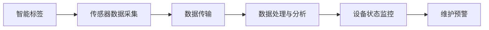

#### 2.1.2 零售业中的应用

在零售业中，智能标签和传感器被广泛应用于库存管理、智能货架和顾客行为分析，这些应用不仅提高了零售业务的效率，还大大提升了顾客体验。

- **库存管理：** 智能标签可以附着在商品上，通过无线传输技术将商品信息实时上传到中央系统。零售商可以实时监控库存情况，及时补充缺货商品，避免库存过剩或短缺。
  
- **智能货架：** 智能货架通过传感器监测商品的销售情况和库存状态。当商品缺货或销售量较高时，系统会自动提示补货或促销策略。同时，智能货架还可以通过RFID或NFC标签与顾客手机进行交互，提供个性化推荐和促销信息。

以下是一个零售业中智能标签和传感器应用的mermaid流程图：

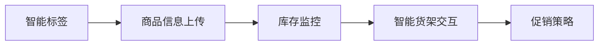

#### 2.1.3 健康医疗中的应用

在健康医疗领域，智能标签和传感器被广泛应用于患者监控、医疗设备监测和健康数据分析，这些应用大大提升了医疗服务的质量和效率。

- **患者监控：** 通过佩戴在患者身上的传感器，可以实时监测患者的生命体征，如心率、血压、体温等。这些数据可以通过无线传输技术实时传输到医生的手持设备或计算机系统中，便于医生进行远程监控和诊断。
  
- **医疗设备监测：** 医疗设备如心电监护仪、呼吸机等通过内置的传感器实时监测患者的生理参数，并将数据传输到中央系统。医生可以通过实时数据了解患者的状况，及时调整治疗方案。

以下是一个健康医疗中智能标签和传感器应用的mermaid流程图：

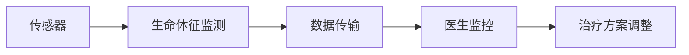

#### 2.1.4 智能家居中的应用

在智能家居领域，智能标签和传感器被广泛应用于安全监控、智能家居设备互联和能源管理，这些应用使得家居生活更加智能化和便捷化。

- **安全监控：** 智能标签和传感器可以安装在家庭的安全关键区域，如门窗、阳台等，实时监测家庭的入侵情况。当有异常入侵时，系统会自动发出警报，并通过手机应用通知家庭成员。
  
- **智能家居设备互联：** 通过智能标签和传感器，家庭中的各种设备可以实现互联，如灯光、空调、门锁等。家庭成员可以通过手机或语音助手控制家居设备的开关和调节，实现智能化家居体验。

以下是一个智能家居中智能标签和传感器应用的mermaid流程图：

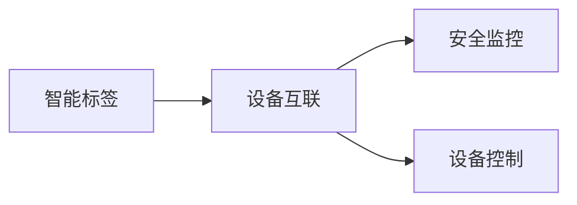

## 第3章：智能标签和传感器的数据管理

### 第3章：智能标签和传感器的数据管理

智能标签和传感器的数据管理是确保其有效应用的关键环节。数据管理涉及数据收集、传输、存储和处理等多个方面。以下章节将详细介绍这些环节的具体内容，包括数据收集方式、数据传输协议、数据存储方案以及数据处理技术。

#### 3.1.1 数据收集与传输

数据收集是智能标签和传感器的首要任务。传感器通过各种方式收集环境数据或物体信息，如温度、湿度、位置、振动等。以下是一些常见的数据收集方式：

- **直接采集：** 传感器直接采集环境数据，如温度传感器测量温度，光线传感器测量亮度等。
- **间接采集：** 通过其他传感器或设备间接获取数据，如通过摄像头获取图像数据，然后通过图像识别技术提取相关信息。

数据传输是将收集到的数据发送到中央处理系统或云平台的过程。常见的传输协议包括：

- **无线传输：** 如Wi-Fi、蓝牙（BLE）、NFC等，适用于远距离或短距离的数据传输。
- **有线传输：** 如以太网、USB等，适用于近距离的数据传输。

以下是一个数据收集与传输的mermaid流程图：

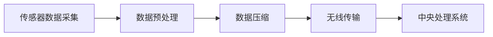

#### 3.1.2 数据存储与处理

数据存储是将收集到的数据持久化保存的过程。智能标签和传感器的数据存储方案通常包括：

- **本地存储：** 在传感器或边缘设备上存储数据，适用于数据量较小且不需要远程访问的场景。
- **云存储：** 将数据存储在远程服务器上，适用于数据量较大且需要远程访问和共享的场景。

以下是一个数据存储与处理的mermaid流程图：

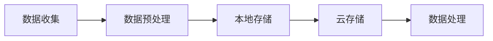

数据处理技术包括：

- **数据清洗：** 清除数据中的噪声和错误，确保数据质量。
- **数据转换：** 将数据转换为适合分析的形式，如将温度数据转换为数字格式。
- **数据分析：** 通过统计方法、机器学习等技术对数据进行分析，提取有价值的信息。

以下是一个数据处理技术的mermaid流程图：

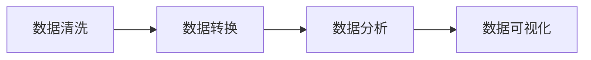

#### 3.1.3 数据安全与隐私保护

数据安全与隐私保护是智能标签和传感器应用中不可忽视的问题。为了确保数据安全，可以采用以下措施：

- **加密：** 使用加密算法对数据进行加密，防止数据在传输和存储过程中被窃取。
- **访问控制：** 实施严格的访问控制策略，确保只有授权用户可以访问敏感数据。
- **匿名化：** 对个人数据进行匿名化处理，防止个人信息泄露。

以下是一个数据安全与隐私保护的mermaid流程图：

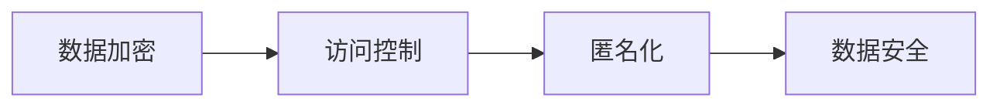

## 第4章：智能标签和传感器的集成与开发

### 第4章：智能标签和传感器的集成与开发

智能标签和传感器的集成与开发是实现其应用价值的关键步骤。集成与开发过程需要考虑系统的整体架构、开发流程和工具的选择，以及具体的开发实例。以下章节将详细探讨这些方面。

#### 4.1.1 集成架构设计

智能标签和传感器的集成架构设计需要考虑系统的可扩展性、可靠性和安全性。以下是一个典型的集成架构设计：

- **边缘计算节点：** 在靠近传感器和数据源的地方部署边缘计算节点，用于实时数据处理和初步分析。
- **云计算平台：** 部署在远程的数据中心，用于存储、处理和分析大规模数据。
- **数据传输网络：** 确保传感器数据能够高效、安全地传输到边缘计算节点和云计算平台。

以下是一个集成架构设计的mermaid架构图：

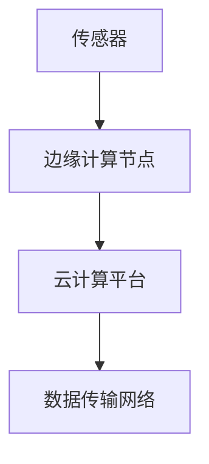

#### 4.1.2 开发流程与工具

智能标签和传感器的开发需要遵循一定的流程和规范。以下是一个典型的开发流程：

1. **需求分析：** 明确智能标签和传感器的具体应用场景和功能需求。
2. **系统设计：** 设计系统的整体架构和各个模块的接口。
3. **编码实现：** 根据系统设计编写传感器和标签的软件代码。
4. **测试与调试：** 对开发的系统进行功能测试和性能调试。
5. **部署与维护：** 部署系统到实际应用场景，并进行定期维护。

开发工具包括：

- **编程语言：** Python、Java、C++等，用于编写传感器和标签的软件代码。
- **开发环境：** IntelliJ IDEA、Eclipse、VSCode等，提供代码编辑、调试和构建功能。
- **集成开发环境（IDE）：** Arduino IDE、PlatformIO等，专门用于物联网设备的开发。

以下是一个开发流程的mermaid流程图：

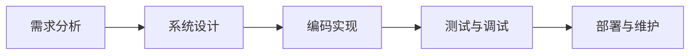

#### 4.1.3 开发实例

以下是一个简单的智能标签应用开发实例，该实例使用Arduino IDE和Python进行开发。

**环境安装：**

1. 安装Arduino IDE：从官方网站下载并安装Arduino IDE。
2. 安装Python和PySerial库：在Windows或Linux系统中安装Python，并通过pip命令安装PySerial库。

**系统核心实现：**

1. **传感器端（Arduino）：**

```cpp
// 传感器端代码（Arduino）
#include <SoftwareSerial.h>

// 定义传感器引脚
const int rxPin = 2;
const int txPin = 3;

SoftwareSerial mySerial(rxPin, txPin); // 创建软件串口对象

void setup() {
  mySerial.begin(9600); // 初始化串口通信
  Serial.begin(9600); // 初始化硬件串口
}

void loop() {
  if (mySerial.available()) {
    int sensorValue = mySerial.read(); // 读取传感器数据
    Serial.print("Sensor Value: ");
    Serial.println(sensorValue);
    delay(1000);
  }
}
```

2. **数据处理端（Python）：**

```python
# 数据处理端代码（Python）
import serial
import time

# 定义串口参数
ser = serial.Serial('/dev/ttyACM0', 9600)

while True:
    if ser.inWaiting():
        data = ser.readline()
        print("Received Data: ", data.decode())
    time.sleep(1)
```

**代码应用解读与分析：**

该实例中，Arduino板通过SoftwareSerial库连接传感器，并将传感器数据通过串口发送到计算机。Python脚本通过PySerial库读取串口数据，并打印出来。

该实例展示了智能标签和传感器的基本开发流程，包括环境安装、代码编写和调试。

## 第5章：智能标签和传感器的未来趋势

### 第5章：智能标签和传感器的未来趋势

智能标签和传感器的未来发展趋势将继续受到技术进步和市场需求的影响。随着物联网技术的不断成熟，智能标签和传感器的应用将更加广泛，带来更多的创新和变革。

#### 5.1.1 技术发展趋势

1. **更小、更智能、更高效：** 随着微电子技术的发展，智能标签和传感器的体积将越来越小，同时功能将更加智能和高效。例如，微机电系统（MEMS）技术的进步将使传感器更小巧、更灵敏，并且具有更高的精度。

2. **更广泛的应用场景：** 智能标签和传感器将在更多行业和应用场景中发挥作用。例如，在农业领域，智能标签和传感器可以用于精准农业，监测土壤湿度、温度和作物生长情况；在环保领域，传感器可以用于空气质量监测、水质检测等。

3. **集成化与网络化：** 智能标签和传感器将更加集成化，与云计算、大数据、人工智能等技术的结合将更加紧密。物联网技术的不断发展将推动智能标签和传感器形成更加紧密的网络，实现实时数据共享和协同工作。

4. **智能化数据分析：** 随着人工智能技术的进步，智能标签和传感器收集的数据将能够通过智能算法进行更深入的分析，提供更加精准的决策支持。例如，通过机器学习算法，可以对传感器数据进行预测分析，提前预警潜在问题。

#### 5.1.2 行业发展趋势

1. **工业4.0与智能制造：** 智能标签和传感器在工业制造领域的应用将更加深入，推动工业4.0和智能制造的发展。通过物联网技术，工厂可以实现设备的智能监控、生产过程的自动化和数据的实时分析，提高生产效率和质量。

2. **智慧城市与智能交通：** 智能标签和传感器在智慧城市建设中将发挥重要作用，用于城市安防、交通管理、环境监测等方面。智能交通系统将利用传感器实时监测交通流量，优化交通信号控制，减少拥堵，提高交通效率。

3. **智能家居与健康医疗：** 智能标签和传感器在智能家居和健康医疗领域的应用将越来越普及。智能家居系统将实现家庭设备的高效管理和自动化控制，提升生活便利性；健康医疗系统将利用传感器实时监测患者健康数据，实现远程医疗和个性化健康管理。

#### 5.1.3 社会影响

智能标签和传感器的普及将对社会生活产生深远影响：

1. **提高生活质量：** 智能标签和传感器将使人们的生活更加便利和舒适，例如智能家居系统可以自动调节室内温度、灯光和音乐，为人们提供个性化的生活体验。

2. **优化资源利用：** 通过实时数据采集和分析，智能标签和传感器可以帮助企业和个人优化资源利用，降低能耗和成本。例如，智能农业系统可以精准控制灌溉和施肥，提高农业产出，减少水资源浪费。

3. **促进可持续发展：** 智能标签和传感器在环保领域的应用将有助于监测环境污染，评估资源消耗，推动可持续发展。例如，智能空气质量监测系统可以实时监测空气质量，为环保决策提供科学依据。

4. **增强安全性：** 智能标签和传感器在安防领域的应用将提高公共安全和家庭安全。例如，智能安防系统可以通过传感器实时监测家庭环境，及时发现异常情况并报警。

总之，智能标签和传感器的未来发展趋势将继续沿着技术进步和市场需求的方向发展，不断推动物联网技术的发展和智能化社会的建设。

## 第6章：案例分析

### 第6章：案例分析

通过对实际案例的深入分析，我们可以更直观地理解智能标签和传感器的应用场景、解决方案和效果评估。以下将分别介绍智能家居、智能工厂和智慧医疗三个领域的实际案例。

#### 6.1.1 案例一：智能家居

**案例背景：**

随着智能家居市场的快速扩展，越来越多的家庭开始安装智能设备，如智能灯泡、智能门锁、智能温控器等。这些设备的连接和协同工作需要智能标签和传感器的支持。

**应用场景：**

1. **智能灯泡：** 用户可以通过手机APP远程控制家中的智能灯泡，调节亮度和颜色。
2. **智能门锁：** 用户可以通过手机或指纹解锁，提高家庭安全性。
3. **智能温控器：** 根据室内外温度和用户习惯，智能调节室内温度，节省能源。

**解决方案：**

- **智能标签：** 每个智能设备上安装RFID标签，用于设备识别和状态监控。
- **传感器：** 在家中安装温度、湿度传感器，用于环境监控。
- **网关：** 连接各个智能设备，实现数据传输和协同控制。

**效果评估：**

- **用户体验：** 用户可以通过手机APP方便地控制家中设备，提升生活便利性。
- **能源节省：** 通过智能温控器和智能灯泡，实现能耗的优化，降低家庭能源消耗。
- **安全性提升：** 智能门锁和安防传感器提高家庭安全性，减少家庭安全隐患。

以下是一个智能家居案例的mermaid流程图：

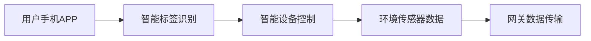

#### 6.1.2 案例二：智能工厂

**案例背景：**

智能工厂是工业4.0的核心概念之一，通过智能标签和传感器实现设备的自动化监控和维护。

**应用场景：**

1. **设备状态监测：** 通过传感器实时监测设备的运行状态，如温度、振动、压力等。
2. **库存管理：** 通过RFID标签实时监控原材料和成品的库存情况。
3. **生产计划优化：** 根据实时数据调整生产计划，提高生产效率。

**解决方案：**

- **传感器：** 安装在各种设备上，用于实时监控设备状态。
- **RFID标签：** 附着在原材料和成品上，用于库存管理。
- **工业网关：** 实现设备数据的收集和传输。

**效果评估：**

- **设备维护效率：** 通过实时监控和预测维护，减少设备故障和停机时间。
- **库存准确性：** 通过RFID标签实现实时库存监控，减少库存错误和浪费。
- **生产效率提升：** 通过实时数据和智能分析，优化生产计划，提高生产效率。

以下是一个智能工厂案例的mermaid流程图：

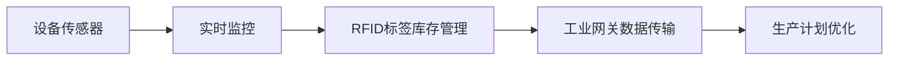

#### 6.1.3 案例三：智慧医疗

**案例背景：**

智慧医疗利用智能标签和传感器实现患者的远程监控和医疗设备的智能化管理。

**应用场景：**

1. **患者监控：** 通过传感器实时监测患者的生命体征，如心率、血压、体温等。
2. **医疗设备管理：** 通过智能标签监控医疗设备的运行状态和位置。
3. **远程诊断：** 医生可以通过远程监控数据对患者进行诊断和治疗。

**解决方案：**

- **智能标签：** 安装在医疗设备和患者身上，用于设备识别和状态监控。
- **传感器：** 用于监测患者的生命体征，并将数据传输到医生终端。
- **云平台：** 用于存储和处理大量医疗数据，提供远程诊断服务。

**效果评估：**

- **患者监护：** 通过实时数据监测，提高患者监护的准确性和及时性，减少医疗事故。
- **设备管理：** 通过智能标签实现设备的实时监控和远程管理，提高设备使用效率。
- **远程诊断：** 通过远程数据传输和云平台支持，医生可以更方便地进行诊断和治疗，提高医疗服务质量。

以下是一个智慧医疗案例的mermaid流程图：

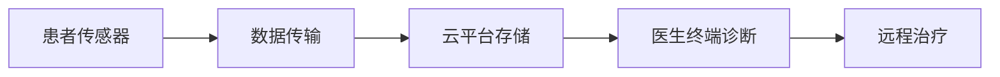

通过以上三个实际案例的分析，我们可以看到智能标签和传感器在智能家居、智能工厂和智慧医疗等领域的广泛应用和巨大潜力。随着技术的不断进步和应用场景的拓展，智能标签和传感器将在未来发挥更加重要的作用，推动物联网技术的发展和智能化社会的建设。

## 第7章：总结与展望

### 第7章：总结与展望

随着物联网技术的不断发展，智能标签和传感器在各个领域中的应用越来越广泛。通过对智能标签和传感器的核心概念、应用场景、数据管理、开发集成和未来趋势的深入分析，我们可以得出以下总结和展望。

#### 总结

1. **核心概念：** 智能标签和传感器是物联网系统的核心组件，分别用于标识和追踪物体以及检测和测量环境参数。
2. **应用场景：** 智能标签和传感器在工业制造、零售业、健康医疗和智能家居等领域具有广泛的应用，显著提升了各行业的运营效率和服务质量。
3. **数据管理：** 智能标签和传感器通过高效的数据收集、传输、存储和处理技术，实现了对物理环境的实时监控和智能响应。
4. **开发集成：** 智能标签和传感器的集成与开发需要考虑系统的整体架构、开发流程和工具的选择，确保系统的可扩展性、可靠性和安全性。
5. **未来趋势：** 智能标签和传感器将继续朝着更小、更智能、更高效的方向发展，并在更多行业和应用场景中发挥重要作用。

#### 展望

1. **技术发展：** 随着微电子技术、人工智能和5G等技术的进步，智能标签和传感器将变得更加小巧、智能和高效，应用场景将更加丰富。
2. **市场需求：** 随着物联网的普及，智能标签和传感器在工业、医疗、交通、农业等领域的市场需求将不断增长，市场规模将大幅提升。
3. **社会影响：** 智能标签和传感器将深刻改变人们的生活方式，提高生活质量，优化资源利用，推动可持续发展。

#### 推荐研究方向

1. **智能标签和传感器的低功耗设计：** 研究如何通过新型材料和结构设计，实现更低功耗的智能标签和传感器。
2. **边缘计算与智能分析：** 研究如何利用边缘计算技术，在本地设备上进行实时数据处理和分析，提高系统的响应速度和安全性。
3. **数据隐私与安全：** 研究如何在智能标签和传感器的数据管理中确保数据隐私和安全，防止数据泄露和滥用。
4. **跨行业应用研究：** 研究智能标签和传感器在不同行业中的跨行业应用，探索其在特定领域中的最佳实践和解决方案。

通过不断的研究和创新，智能标签和传感器将在未来发挥更加重要的作用，为构建智能化社会和实现可持续发展做出更大贡献。

