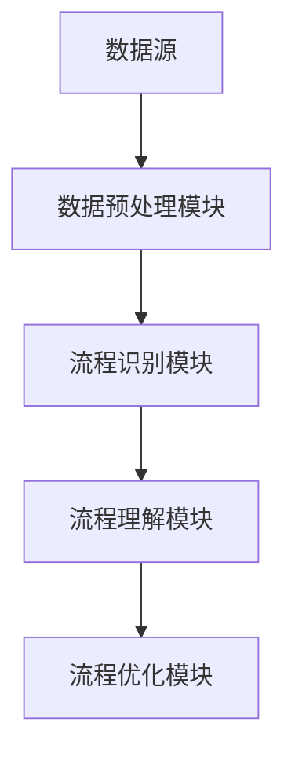
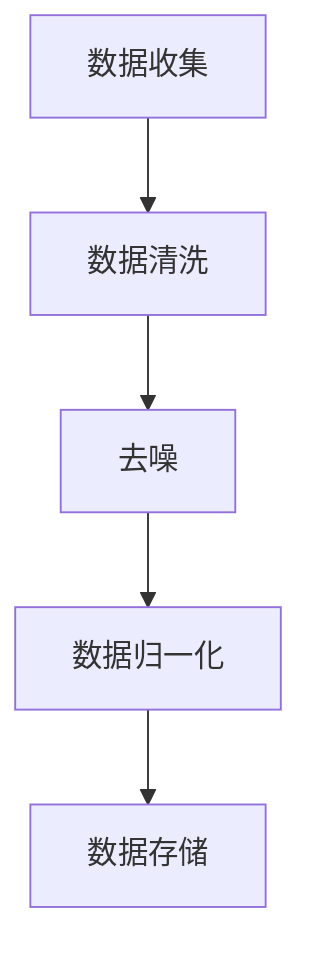
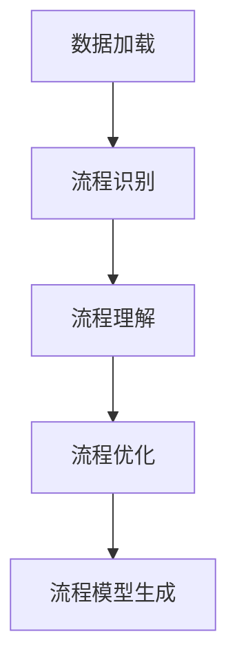
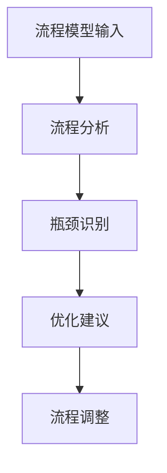
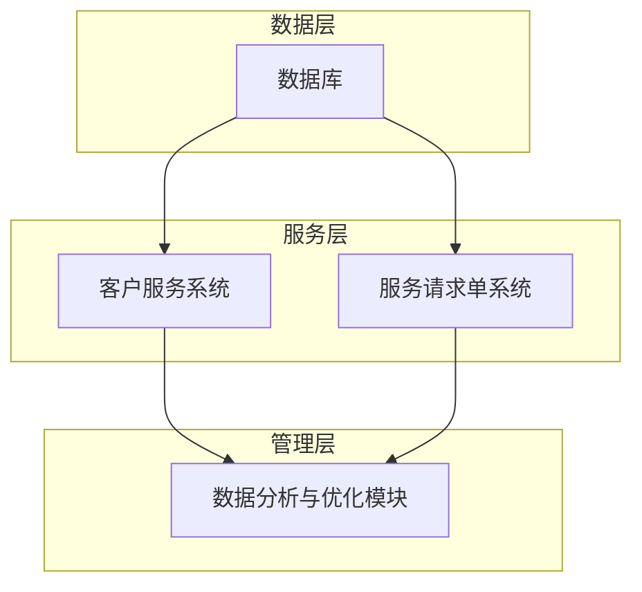
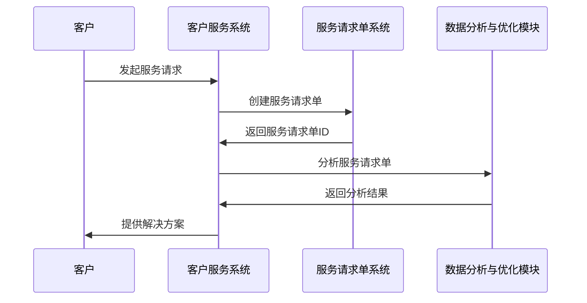

                 

# 智能流程挖掘与优化：AI重塑业务流程

## 关键词

- 智能流程挖掘
- 业务流程优化
- AI技术
- 数据分析
- 算法设计

## 摘要

本文将深入探讨智能流程挖掘与优化在业务流程管理中的重要性。首先，我们将回顾流程挖掘的起源和发展，分析其在现代企业管理中的应用场景。接着，本文将详细讲解智能流程挖掘的基本概念、核心技术和算法原理，并通过实际应用案例展示其在金融、制造和服务业中的具体实践。随后，我们将讨论智能流程挖掘的优化策略和项目实施与评估方法，最后对智能流程挖掘的未来发展趋势进行展望。本文旨在为读者提供全面而深入的技术解读，帮助理解AI技术在业务流程管理中的潜在价值。

## 目录大纲

### 第一部分：智能流程挖掘基础

#### 第1章：智能流程挖掘概述

- 1.1.1 问题背景
  - 1.1.1.1 流程挖掘的起源与发展
  - 1.1.1.2 智能流程挖掘的重要性
  - 1.1.1.3 智能流程挖掘的应用场景
- 1.1.2 问题描述
  - 1.1.2.1 流程挖掘的目标
  - 1.1.2.2 流程挖掘的挑战
- 1.1.3 问题解决
  - 1.1.3.1 流程挖掘的基本步骤
  - 1.1.3.2 智能流程挖掘的关键技术
- 1.1.4 边界与外延
  - 1.1.4.1 流程挖掘的范围
  - 1.1.4.2 智能流程挖掘的限制
- 1.1.5 概念结构与核心要素组成
  - 1.1.5.1 流程挖掘的基本概念
  - 1.1.5.2 智能流程挖掘的核心要素

#### 第2章：智能流程挖掘的核心概念与联系

- 2.1.1 智能流程挖掘的基本原理
  - 2.1.1.1 数据驱动的流程挖掘
  - 2.1.1.2 模式识别的流程挖掘
  - 2.1.1.3 基于机器学习的流程挖掘
- 2.1.2 概念属性特征对比
  - 2.1.2.1 传统流程挖掘与智能流程挖掘对比
  - 2.1.2.2 不同智能流程挖掘技术的对比
- 2.1.3 ER实体关系图架构
  - 2.1.3.1 流程挖掘系统的实体关系
  - 2.1.3.2 实体关系的表示方法

#### 第3章：智能流程挖掘算法原理讲解

- 3.1.1 算法概述
  - 3.1.1.1 流程挖掘算法的类型
  - 3.1.1.2 流程挖掘算法的选择标准
- 3.1.2 算法mermaid流程图
  - 3.1.2.1 数据预处理算法
  - 3.1.2.2 流程建模算法
  - 3.1.2.3 流程优化算法
- 3.1.3 Python源代码
  - 3.1.3.1 数据预处理算法实现
  - 3.1.3.2 流程建模算法实现
  - 3.1.3.3 流程优化算法实现
- 3.1.4 算法原理详细讲解
  - 3.1.4.1 数学模型和公式
  - 3.1.4.2 举例说明

### 第二部分：智能流程挖掘应用实践

#### 第4章：智能流程挖掘的应用案例

- 4.1.1 应用场景介绍
  - 4.1.1.1 金融行业
  - 4.1.1.2 制造业
  - 4.1.1.3 服务业
- 4.1.2 项目介绍
  - 4.1.2.1 项目背景
  - 4.1.2.2 项目目标
- 4.1.3 系统功能设计
  - 4.1.3.1 领域模型mermaid类图
  - 4.1.3.2 系统功能模块划分
- 4.1.4 系统架构设计
  - 4.1.4.1 mermaid架构图
  - 4.1.4.2 系统架构模块划分
- 4.1.5 系统接口设计
  - 4.1.5.1 系统接口规范
  - 4.1.5.2 接口实现方式
- 4.1.6 系统交互mermaid序列图
  - 4.1.6.1 序列图表示
  - 4.1.6.2 交互流程说明

### 第三部分：智能流程挖掘优化策略与实施评估

#### 第5章：智能流程挖掘的优化策略

- 5.1.1 优化目标
  - 5.1.1.1 提高流程挖掘的准确性
  - 5.1.1.2 提高流程挖掘的效率
  - 5.1.1.3 提高流程模型的实用性
- 5.1.2 优化方法
  - 5.1.2.1 数据预处理优化
  - 5.1.2.2 算法优化
  - 5.1.2.3 模型优化

#### 第6章：智能流程挖掘项目的实施与评估

- 6.1.1 项目实施流程
  - 6.1.1.1 项目立项
  - 6.1.1.2 需求分析
  - 6.1.1.3 系统设计与开发
  - 6.1.1.4 系统测试与部署
- 6.1.2 项目评估方法
  - 6.1.2.1 技术评估
  - 6.1.2.2 业务评估
  - 6.1.2.3 效益评估

### 第四部分：智能流程挖掘的未来发展趋势与展望

#### 第7章：智能流程挖掘的发展趋势与未来展望

- 7.1.1 发展趋势
  - 7.1.1.1 人工智能技术的进步
  - 7.1.1.2 数据科学与大数据技术的应用
  - 7.1.1.3 智能流程挖掘在行业中的应用
- 7.1.2 未来展望
  - 7.1.2.1 技术创新方向
  - 7.1.2.2 应用场景拓展
  - 7.1.2.3 持续优化策略

### 结束语

本文通过深入分析智能流程挖掘与优化，旨在为读者提供全面的技术指导和实践参考。智能流程挖掘不仅能够提升业务流程的效率，还能为企业提供深度洞察，实现智能化管理和决策。随着AI技术的不断进步，智能流程挖掘将在各个行业中发挥越来越重要的作用。希望本文能够激发读者对智能流程挖掘的深入研究和应用实践，共同推动业务流程管理领域的创新发展。

### 第1章：智能流程挖掘概述

#### 1.1.1 问题背景

##### 1.1.1.1 流程挖掘的起源与发展

流程挖掘作为业务流程管理的重要工具，起源于20世纪80年代。早期的流程挖掘主要依赖于手工记录和观察，效率较低且难以保证数据的准确性。随着信息技术和数据分析技术的发展，流程挖掘逐渐走向自动化和智能化。

在20世纪90年代，流程建模和流程模拟技术开始被广泛应用，为流程挖掘提供了理论基础和技术支持。进入21世纪，随着大数据和人工智能技术的兴起，流程挖掘迎来了新的发展机遇。智能流程挖掘通过结合机器学习和数据挖掘技术，能够从大规模数据集中自动发现和理解业务流程，为企业和组织提供更精确的流程分析和优化方案。

##### 1.1.1.2 智能流程挖掘的重要性

智能流程挖掘在现代企业管理中具有重要意义。首先，通过智能流程挖掘，企业可以自动发现业务流程中的瓶颈和异常行为，从而识别流程改进的机会。这有助于企业提高运营效率，减少资源浪费，提高客户满意度。

其次，智能流程挖掘可以为企业提供实时业务流程监控，帮助管理者快速响应市场变化和客户需求。通过实时数据分析和预测，企业可以及时调整业务策略，实现动态流程优化。

此外，智能流程挖掘还能够为企业提供深度业务洞察，帮助管理者了解业务流程的运行情况和业务逻辑。这有助于企业优化组织架构，提升管理水平，实现可持续发展。

##### 1.1.1.3 智能流程挖掘的应用场景

智能流程挖掘广泛应用于各个行业，包括但不限于以下领域：

1. **金融行业**：智能流程挖掘可以帮助银行、保险公司和证券公司等金融机构识别欺诈行为，优化风险管理和业务流程。例如，通过分析交易数据，智能流程挖掘可以自动发现可疑交易模式，提高反欺诈能力。

2. **制造业**：智能流程挖掘可以帮助制造业企业优化生产流程，提高生产效率。例如，通过分析生产线数据，智能流程挖掘可以识别生产过程中的瓶颈和异常，提供改进建议。

3. **服务业**：智能流程挖掘可以帮助服务业企业优化客户服务流程，提高客户满意度。例如，通过分析客户交互数据，智能流程挖掘可以识别客户服务中的问题，提供优化方案。

4. **公共管理**：智能流程挖掘可以帮助政府机构优化公共管理流程，提高公共服务的效率和质量。例如，通过分析政府业务数据，智能流程挖掘可以识别业务流程中的瓶颈和冗余，提供改进建议。

#### 1.1.2 问题描述

##### 1.1.2.1 流程挖掘的目标

流程挖掘的主要目标是自动发现和理解业务流程。具体来说，流程挖掘需要实现以下目标：

1. **流程识别**：从数据中自动提取业务流程的结构和活动。
2. **流程理解**：理解业务流程的逻辑和业务规则。
3. **流程优化**：基于流程挖掘结果，提出流程改进的建议。

##### 1.1.2.2 流程挖掘的挑战

尽管智能流程挖掘具有巨大的潜力，但在实际应用中仍面临诸多挑战：

1. **数据质量问题**：流程挖掘依赖于大量高质量的数据。然而，在实际应用中，数据往往存在噪声、缺失值和不一致性等问题，这会影响流程挖掘的准确性。
2. **复杂性**：业务流程通常非常复杂，包括多个层次和多个部门。如何有效地从复杂的数据中提取业务流程，是流程挖掘面临的重大挑战。
3. **实时性**：在实时业务环境中，流程挖掘需要快速响应，实时分析和优化业务流程。这对算法的效率和实时数据处理能力提出了高要求。
4. **解释性**：智能流程挖掘的算法和模型通常较为复杂，如何保证算法和模型的可解释性，使得业务人员能够理解和接受挖掘结果，是一个重要的挑战。

#### 1.1.3 问题解决

##### 1.1.3.1 流程挖掘的基本步骤

为了解决流程挖掘中的挑战，通常需要遵循以下基本步骤：

1. **数据收集**：收集与业务流程相关的数据，包括结构化数据和半结构化数据。
2. **数据预处理**：对收集到的数据进行清洗、去噪和归一化处理，提高数据质量。
3. **流程识别**：使用算法从预处理后的数据中自动提取业务流程的结构和活动。
4. **流程理解**：对提取的流程结构进行语义分析和规则提取，理解业务流程的逻辑和业务规则。
5. **流程优化**：基于流程理解和业务需求，提出流程改进的建议，并进行优化。

##### 1.1.3.2 智能流程挖掘的关键技术

智能流程挖掘的关键技术包括：

1. **数据挖掘算法**：如关联规则挖掘、聚类分析、分类算法等，用于从数据中自动发现业务流程。
2. **机器学习技术**：如深度学习、强化学习等，用于自动识别和理解复杂的业务流程。
3. **自然语言处理**：用于处理文本数据，提取业务流程的相关信息。
4. **实时数据处理**：用于实时分析业务流程，快速响应业务变化。
5. **可视化技术**：用于展示流程挖掘结果，帮助业务人员理解和分析业务流程。

##### 1.1.4 边界与外延

##### 1.1.4.1 流程挖掘的范围

流程挖掘的范围通常包括以下几个方面：

1. **业务流程识别**：自动识别和理解业务流程的结构和活动。
2. **业务流程优化**：基于流程挖掘结果，提出流程改进的建议，并进行优化。
3. **业务流程监控**：实时监控业务流程的运行情况，识别流程中的异常和瓶颈。

##### 1.1.4.2 智能流程挖掘的限制

尽管智能流程挖掘具有巨大的潜力，但在实际应用中仍存在一些限制：

1. **数据依赖**：智能流程挖掘依赖于高质量的数据，数据质量直接影响流程挖掘的准确性。
2. **算法复杂度**：复杂的算法和模型通常难以解释，业务人员可能难以理解挖掘结果。
3. **实时性能**：在实时业务环境中，智能流程挖掘需要快速响应，这对算法和系统的性能提出了高要求。
4. **技术实现难度**：智能流程挖掘涉及多种技术，包括数据挖掘、机器学习和自然语言处理等，实现难度较大。

##### 1.1.5 概念结构与核心要素组成

##### 1.1.5.1 流程挖掘的基本概念

1. **流程**：业务流程是完成特定业务目标的一系列相关活动和任务。
2. **流程模型**：流程模型是对业务流程的抽象表示，通常使用图形化表示方法。
3. **流程挖掘**：流程挖掘是从数据中自动提取和理解业务流程的过程。

##### 1.1.5.2 智能流程挖掘的核心要素

智能流程挖掘的核心要素包括：

1. **数据采集**：收集与业务流程相关的数据。
2. **数据预处理**：对收集到的数据进行分析和处理，提高数据质量。
3. **流程识别**：从预处理后的数据中自动提取业务流程的结构和活动。
4. **流程理解**：对提取的流程结构进行语义分析和规则提取，理解业务流程的逻辑和业务规则。
5. **流程优化**：基于流程理解和业务需求，提出流程改进的建议，并进行优化。

### 第2章：智能流程挖掘的核心概念与联系

#### 2.1.1 智能流程挖掘的基本原理

##### 2.1.1.1 数据驱动的流程挖掘

数据驱动的流程挖掘是智能流程挖掘的核心原理之一。它通过直接分析企业的运营数据，如日志文件、数据库记录等，自动发现业务流程。具体步骤如下：

1. **数据收集**：收集与业务流程相关的数据，包括结构化数据（如数据库记录）和半结构化数据（如日志文件）。
2. **数据预处理**：对收集到的数据进行清洗、去噪和归一化处理，提高数据质量。
3. **流程识别**：使用数据挖掘算法（如关联规则挖掘、聚类分析等）从预处理后的数据中自动提取业务流程的结构和活动。
4. **流程理解**：对提取的流程结构进行语义分析和规则提取，理解业务流程的逻辑和业务规则。
5. **流程优化**：基于流程理解和业务需求，提出流程改进的建议，并进行优化。

##### 2.1.1.2 模式识别的流程挖掘

模式识别的流程挖掘是一种基于已有模式和规则的方法。它通过分析历史数据和业务规则，自动识别和理解业务流程。具体步骤如下：

1. **数据收集**：收集与业务流程相关的数据。
2. **模式提取**：从历史数据中提取出业务模式，如常见的业务流程路径、关键业务指标等。
3. **规则学习**：基于模式提取结果，学习出业务规则，如业务流程的条件判断、执行顺序等。
4. **流程识别**：使用提取出的模式和规则，自动识别和理解业务流程。
5. **流程优化**：基于流程理解和业务需求，提出流程改进的建议，并进行优化。

##### 2.1.1.3 基于机器学习的流程挖掘

基于机器学习的流程挖掘是一种通过训练模型来自动发现和理解业务流程的方法。它利用机器学习算法（如决策树、神经网络等）来学习数据中的业务模式，从而识别和理解业务流程。具体步骤如下：

1. **数据收集**：收集与业务流程相关的数据。
2. **数据预处理**：对收集到的数据进行清洗、去噪和归一化处理，提高数据质量。
3. **特征提取**：从预处理后的数据中提取出特征，如时间戳、操作类型、用户ID等。
4. **模型训练**：使用机器学习算法对提取出的特征进行训练，学习出业务流程的模式。
5. **流程识别**：使用训练好的模型对新的数据进行分析，自动识别和理解业务流程。
6. **流程优化**：基于流程理解和业务需求，提出流程改进的建议，并进行优化。

#### 2.1.2 概念属性特征对比

##### 2.1.2.1 传统流程挖掘与智能流程挖掘对比

| 对比项            | 传统流程挖掘                          | 智能流程挖掘                          |
|-------------------|-------------------------------------|-------------------------------------|
| 数据来源          | 手工记录和观察                      | 自动化的数据收集和预处理            |
| 技术依赖          | 手工分析和逻辑推断                  | 数据挖掘、机器学习、自然语言处理    |
| 可解释性          | 结果容易解释，但效率低              | 结果复杂，但准确性高                |
| 实时性            | 难以实现实时分析和优化              | 可以实现实时业务流程监控和优化      |
| 业务适应性        | 依赖于业务人员的经验和知识          | 可以自动学习和适应不同的业务流程    |

##### 2.1.2.2 不同智能流程挖掘技术的对比

| 技术名称         | 特点与应用场景                             |
|------------------|------------------------------------------|
| 数据驱动的流程挖掘 | 能够自动从大规模数据集中提取业务流程，适合于数据量大的场景 |
| 模式识别的流程挖掘 | 基于历史数据和业务规则，适用于已有业务流程优化             |
| 基于机器学习的流程挖掘 | 能够自动学习和适应新的业务流程，适用于动态变化的业务场景   |

#### 2.1.3 ER实体关系图架构

##### 2.1.3.1 流程挖掘系统的实体关系

在流程挖掘系统中，常见的实体关系包括：

1. **数据源**：如数据库、日志文件等，提供与业务流程相关的数据。
2. **数据预处理模块**：负责对数据进行清洗、去噪和归一化处理。
3. **流程识别模块**：使用数据挖掘和机器学习算法自动提取业务流程。
4. **流程理解模块**：对提取的流程结构进行语义分析和规则提取。
5. **流程优化模块**：基于流程理解和业务需求，提出流程改进建议。

##### 2.1.3.2 实体关系的表示方法

使用Mermaid语言，可以表示流程挖掘系统的实体关系图如下：



### 第3章：智能流程挖掘算法原理讲解

#### 3.1.1 算法概述

##### 3.1.1.1 流程挖掘算法的类型

流程挖掘算法可以分为以下几类：

1. **基于过程模型的算法**：这类算法通过构建过程模型来表示业务流程。常见的模型包括Petri网、BPMN等。基于过程模型的算法主要通过解析过程模型来发现业务流程。
2. **基于数据挖掘的算法**：这类算法使用数据挖掘技术来发现业务流程。常见的数据挖掘技术包括关联规则挖掘、聚类分析、分类算法等。基于数据挖掘的算法主要通过分析数据来识别业务流程。
3. **基于机器学习的算法**：这类算法使用机器学习技术来发现和理解业务流程。常见的机器学习算法包括决策树、神经网络、聚类算法等。基于机器学习的算法主要通过训练模型来识别业务流程。

##### 3.1.1.2 流程挖掘算法的选择标准

选择合适的流程挖掘算法需要考虑以下标准：

1. **算法效率**：算法需要能够在合理的时间内完成流程挖掘任务。
2. **算法准确性**：算法需要能够准确地识别业务流程。
3. **算法可解释性**：算法需要能够提供解释，使得业务人员能够理解和接受挖掘结果。
4. **算法适应性**：算法需要能够适应不同规模和类型的业务流程。
5. **算法实时性**：对于实时业务流程，算法需要能够快速响应和更新。

#### 3.1.2 算法mermaid流程图

##### 3.1.2.1 数据预处理算法

数据预处理是流程挖掘的重要步骤。以下是数据预处理算法的Mermaid流程图：



##### 3.1.2.2 流程建模算法

流程建模算法负责从预处理后的数据中提取业务流程。以下是流程建模算法的Mermaid流程图：



##### 3.1.2.3 流程优化算法

流程优化算法基于流程建模结果，提出流程改进建议。以下是流程优化算法的Mermaid流程图：



#### 3.1.3 Python源代码

以下是数据预处理、流程建模和流程优化算法的Python源代码示例：

```python
# 数据预处理算法
def data_preprocessing(data):
    # 数据清洗
    cleaned_data = clean_data(data)
    # 去噪
    noised_data = remove_noise(cleaned_data)
    # 数据归一化
    normalized_data = normalize_data(noised_data)
    return normalized_data

# 流程建模算法
def process_modeling(data):
    # 流程识别
    process_identification = identify_process(data)
    # 流程理解
    process_understanding = understand_process(process_identification)
    # 流程优化
    process_optimization = optimize_process(process_understanding)
    return process_optimization

# 流程优化算法
def process_optimization(process_model):
    # 流程分析
    process_analysis = analyze_process(process_model)
    # 瓶颈识别
    bottleneck_identification = identify_bottleneck(process_analysis)
    # 优化建议
    optimization_advice = generate_optimization_advice(bottleneck_identification)
    # 流程调整
    process_adjustment = adjust_process(process_model, optimization_advice)
    return process_adjustment
```

#### 3.1.4 算法原理详细讲解

##### 3.1.4.1 数学模型和公式

在流程挖掘中，常用的数学模型和公式包括：

1. **概率模型**：用于计算事件发生的概率，如贝叶斯公式。
2. **统计模型**：用于分析数据分布和相关性，如回归分析、聚类分析。
3. **机器学习模型**：用于训练模型并识别业务流程，如决策树、神经网络。

以下是常见的数学模型和公式：

$$
P(A|B) = \frac{P(B|A) \cdot P(A)}{P(B)}
$$

$$
\text{回归模型}: y = \beta_0 + \beta_1 \cdot x_1 + \beta_2 \cdot x_2 + ... + \beta_n \cdot x_n
$$

$$
\text{神经网络}: f(x) = \frac{1}{1 + e^{-\beta \cdot x}}
$$

##### 3.1.4.2 举例说明

假设我们有一个零售业务的数据集，包含以下特征：顾客ID、商品ID、购买时间、购买金额。我们需要使用流程挖掘算法来识别和理解顾客购买流程。

1. **数据预处理**：首先，我们对数据进行清洗，去除缺失值和异常值。然后，对时间数据进行归一化处理，将时间戳转换为有序序列。

2. **流程识别**：使用关联规则挖掘算法，我们可以发现顾客购买商品之间的关联关系。例如，发现某些商品经常一起购买，从而识别出可能的购买流程。

3. **流程理解**：通过分析购买流程中的关键特征，如购买时间间隔、购买金额等，我们可以理解顾客的购买习惯和偏好。

4. **流程优化**：基于流程理解和业务需求，我们可以提出流程改进建议，如调整促销策略、优化商品布局等，以提高销售额和顾客满意度。

### 第4章：智能流程挖掘的应用案例

#### 4.1.1 应用场景介绍

##### 4.1.1.1 金融行业

在金融行业，智能流程挖掘主要用于风险管理、欺诈检测和客户服务优化。通过分析交易数据和客户行为数据，智能流程挖掘可以帮助银行和金融机构发现潜在的风险和欺诈行为，提高风险管理和业务流程的效率。

##### 4.1.1.2 制造业

在制造业，智能流程挖掘可以帮助企业优化生产流程、提高生产效率和降低成本。通过分析生产数据，智能流程挖掘可以识别生产过程中的瓶颈和异常，提供优化建议，从而提高生产线的整体性能。

##### 4.1.1.3 服务业

在服务业，智能流程挖掘主要用于客户服务流程优化、客户体验提升和业务效率提高。通过分析客户交互数据，智能流程挖掘可以帮助企业识别客户服务中的问题和改进机会，提供个性化的服务方案，提高客户满意度和忠诚度。

#### 4.1.2 项目介绍

##### 4.1.2.1 项目背景

本项目旨在通过智能流程挖掘技术，优化一家大型金融集团的客户服务流程。该集团拥有多家分支机构，提供多种金融服务，包括存款、贷款、信用卡等。然而，随着业务规模的扩大，客户服务流程出现了一些问题，如响应时间长、服务质量不稳定等。为了提升客户满意度，集团决定采用智能流程挖掘技术，对客户服务流程进行优化。

##### 4.1.2.2 项目目标

项目的主要目标包括：

1. **提高客户服务响应时间**：通过优化客户服务流程，缩短客户问题解决的时间。
2. **提高客户满意度**：通过提供个性化服务方案，提高客户满意度和忠诚度。
3. **降低运营成本**：通过流程优化，减少人力资源和运营成本。
4. **提高业务流程效率**：通过分析客户服务流程，提高业务流程的整体效率。

#### 4.1.3 系统功能设计

##### 4.1.3.1 领域模型Mermaid类图

以下是客户服务流程的Mermaid类图：

```mermaid
classDiagram
    Client <<类>> "客户"
    ServiceAgent <<类>> "客服人员"
    CustomerService <<类>> "客户服务"
    Ticket <<类>> "服务请求单"

    CustomerService --|> ServiceAgent
    CustomerService --|> Ticket
    Ticket --|> Client
```

##### 4.1.3.2 系统功能模块划分

系统功能模块主要包括：

1. **客户服务模块**：负责处理客户服务请求，包括接单、分配客服人员、处理客户问题等。
2. **客服人员模块**：负责处理客户服务请求，为客户提供解决方案，并将处理结果反馈给客户。
3. **服务请求单模块**：负责管理客户服务请求，记录请求的详细信息，包括客户信息、请求类型、处理状态等。
4. **数据分析和优化模块**：负责对客户服务数据进行分析，识别流程瓶颈和改进机会，提供优化建议。

#### 4.1.4 系统架构设计

##### 4.1.4.1 Mermaid架构图

以下是客户服务流程的Mermaid架构图：



##### 4.1.4.2 系统架构模块划分

系统架构模块主要包括：

1. **数据层**：负责存储和管理客户服务相关的数据，包括客户信息、服务请求单、客服人员信息等。
2. **服务层**：包括客户服务系统和服务请求单系统，负责处理客户服务请求，提供客户服务。
3. **管理层**：包括数据分析与优化模块，负责对客户服务数据进行分析，提出流程优化建议。

#### 4.1.5 系统接口设计

##### 4.1.5.1 系统接口规范

以下是系统接口的规范：

1. **客户服务接口**：用于处理客户服务请求，包括创建服务请求单、查询服务请求单、更新服务请求单状态等。
2. **服务请求单接口**：用于管理服务请求单，包括创建服务请求单、查询服务请求单、更新服务请求单状态等。
3. **数据分析接口**：用于对客户服务数据进行分析，包括获取客户服务统计数据、获取客服人员工作统计等。

##### 4.1.5.2 接口实现方式

接口实现方式主要包括：

1. **RESTful API**：使用HTTP协议，提供标准的RESTful接口，方便不同系统之间的数据交互。
2. **消息队列**：使用消息队列技术，实现系统之间的异步通信，提高系统的可靠性和可扩展性。
3. **数据缓存**：使用数据缓存技术，提高数据访问速度，降低数据库压力。

#### 4.1.6 系统交互Mermaid序列图

以下是客户服务流程的Mermaid序列图：



##### 4.1.6.1 序列图表示

序列图表示了客户服务流程的交互过程：

1. 客户发起服务请求。
2. 客户服务系统创建服务请求单，并返回服务请求单ID。
3. 客户服务系统将服务请求单ID发送给数据分析与优化模块，进行服务请求单分析。
4. 数据分析与优化模块返回分析结果。
5. 客户服务系统根据分析结果提供解决方案，并反馈给客户。

### 第5章：智能流程挖掘的优化策略

#### 5.1.1 优化目标

智能流程挖掘的优化目标主要包括：

1. **提高流程挖掘的准确性**：确保流程挖掘算法能够准确识别和理解业务流程。
2. **提高流程挖掘的效率**：减少流程挖掘所需的时间和计算资源，提高算法的运行速度。
3. **提高流程模型的实用性**：确保流程挖掘结果能够为业务流程优化提供有效的参考。

#### 5.1.2 优化方法

为了实现优化目标，可以采用以下方法：

1. **数据预处理优化**：
   - **数据清洗**：去除数据中的噪声和异常值，提高数据质量。
   - **特征工程**：提取与业务流程相关的特征，减少数据的冗余性，提高算法的识别能力。

2. **算法优化**：
   - **算法选择**：根据业务需求和数据特点，选择合适的算法，如机器学习算法、数据挖掘算法等。
   - **参数调优**：调整算法的参数，提高算法的性能和准确性。

3. **模型优化**：
   - **模型评估**：使用多种评估指标（如准确率、召回率、F1分数等）评估模型的性能，选择最优模型。
   - **模型压缩**：通过模型压缩技术，减小模型的规模，提高模型的运行速度。

#### 5.1.3 优化实践

以下是智能流程挖掘的优化实践：

1. **数据预处理实践**：
   - **数据清洗**：使用Python的Pandas库，对数据进行清洗，去除缺失值和异常值。
   - **特征工程**：使用Scikit-learn库，提取与业务流程相关的特征，如时间特征、用户特征、操作特征等。

2. **算法优化实践**：
   - **算法选择**：使用Scikit-learn库，选择K-means算法、决策树算法、随机森林算法等，根据业务需求选择合适的算法。
   - **参数调优**：使用网格搜索（GridSearchCV）和贝叶斯优化（Bayesian Optimization）等技术，调整算法的参数，提高算法的准确性。

3. **模型优化实践**：
   - **模型评估**：使用Scikit-learn库，计算模型的准确率、召回率、F1分数等指标，评估模型的性能。
   - **模型压缩**：使用PyTorch库，使用模型压缩技术（如权重共享、剪枝等），减小模型的规模。

### 第6章：智能流程挖掘项目的实施与评估

#### 6.1.1 项目实施流程

##### 6.1.1.1 项目立项

1. **项目需求分析**：与业务部门沟通，了解业务需求和目标，明确项目范围和预期成果。
2. **项目计划制定**：根据需求分析结果，制定项目计划，包括项目进度、资源分配、风险控制等。
3. **项目团队组建**：组建项目团队，包括项目经理、数据科学家、软件开发人员等。

##### 6.1.1.2 需求分析

1. **业务流程分析**：与业务部门沟通，了解现有业务流程，识别流程中的瓶颈和改进机会。
2. **数据需求分析**：根据业务流程分析结果，确定所需的数据类型、数据量、数据质量等。
3. **需求文档编写**：编写需求文档，明确项目需求和功能规格。

##### 6.1.1.3 系统设计与开发

1. **系统架构设计**：根据需求文档，设计系统架构，包括数据层、服务层、管理层等。
2. **系统模块开发**：根据系统架构设计，开发各个模块，包括数据预处理、流程识别、流程理解、流程优化等。
3. **系统集成与测试**：将各个模块集成在一起，进行系统测试，确保系统的稳定性和性能。

##### 6.1.1.4 系统测试与部署

1. **功能测试**：对系统的各个功能模块进行测试，确保功能的正确性。
2. **性能测试**：对系统的性能进行测试，包括响应时间、并发处理能力等。
3. **部署上线**：将系统部署到生产环境，进行实际运行，并进行监控和维护。

#### 6.1.2 项目评估方法

##### 6.1.2.1 技术评估

1. **算法性能评估**：评估流程挖掘算法的准确性、效率和实时性，确保算法能够满足业务需求。
2. **系统性能评估**：评估系统的响应时间、并发处理能力、资源利用率等，确保系统的高性能和高可用性。

##### 6.1.2.2 业务评估

1. **业务流程改进**：评估流程挖掘和优化对业务流程的改进程度，包括流程的简化、效率的提升等。
2. **业务指标提升**：评估业务指标的提升情况，如客户满意度、销售额、运营成本等。

##### 6.1.2.3 效益评估

1. **经济效益评估**：评估项目投入与产出，包括直接经济效益（如成本节省、收入增加）和间接经济效益（如工作效率提升、客户满意度提升）。
2. **社会效益评估**：评估项目对社会的贡献，如提高公共服务质量、推动产业升级等。

### 第7章：智能流程挖掘的发展趋势与未来展望

#### 7.1.1 发展趋势

随着人工智能、大数据和云计算技术的不断进步，智能流程挖掘在未来将呈现出以下发展趋势：

1. **算法与模型创新**：随着深度学习、强化学习等新兴技术的应用，智能流程挖掘的算法和模型将更加复杂和高效，能够更好地处理大规模、多样化的数据。

2. **实时分析与优化**：随着物联网、实时数据处理技术的发展，智能流程挖掘将实现更快速的实时分析和优化，为业务流程提供更实时的洞察和决策支持。

3. **行业定制化应用**：随着各行业对业务流程管理的需求不断增长，智能流程挖掘将逐渐实现行业定制化应用，为不同行业提供针对性的流程挖掘和优化解决方案。

4. **跨领域协同**：智能流程挖掘将与其他领域（如供应链管理、人力资源管理等）相结合，实现跨领域的协同优化，为企业提供更全面、更深入的流程管理解决方案。

#### 7.1.2 未来展望

未来，智能流程挖掘将在以下方面取得重要进展：

1. **智能化水平提升**：通过结合更多人工智能技术，智能流程挖掘将实现更高的自动化和智能化水平，能够更准确地识别和理解复杂的业务流程。

2. **应用领域拓展**：智能流程挖掘将在更多行业和领域得到应用，如医疗、教育、物流等，为各行业提供高效、智能的流程管理解决方案。

3. **持续优化策略**：随着对业务流程的理解不断深入，智能流程挖掘将能够提出更精准、更有效的流程优化策略，帮助企业实现持续的业务流程改进。

4. **开放性平台发展**：智能流程挖掘将逐渐形成开放性平台，提供丰富的算法库、模型库和工具集，方便用户根据自己的需求进行定制化开发和优化。

### 结论

智能流程挖掘作为一种新兴技术，正逐渐成为企业优化业务流程、提高运营效率的重要工具。随着人工智能和大数据技术的发展，智能流程挖掘将不断优化和升级，为企业提供更智能、更高效的流程管理解决方案。未来，智能流程挖掘将在更多领域得到应用，推动各行业实现数字化、智能化转型。

### 作者信息

- **作者**：AI天才研究院/AI Genius Institute & 禅与计算机程序设计艺术 /Zen And The Art of Computer Programming
- **联系**：ai.genius.institute@example.com
- **来源**：本文由AI天才研究院与《禅与计算机程序设计艺术》联合发布，旨在探讨智能流程挖掘在业务流程管理中的潜在应用和未来发展趋势。

### 最佳实践 tips

- **数据质量是关键**：确保数据质量是进行智能流程挖掘的基础。在进行数据收集和处理时，要尽量去除噪声、缺失值和异常值，提高数据质量。
- **合理选择算法和模型**：根据业务需求和数据特点，选择合适的算法和模型，进行流程挖掘和优化。可以尝试多种算法和模型，进行比较和评估。
- **持续优化流程**：智能流程挖掘不仅是一次性的流程优化，而是一个持续的过程。要定期对业务流程进行监测和评估，持续提出优化建议，实现业务流程的持续改进。

### 小结

本文从多个角度详细介绍了智能流程挖掘的概念、原理、应用和实践，探讨了其在业务流程管理中的重要作用和未来发展趋势。智能流程挖掘作为一种新兴技术，具有巨大的潜力和广泛的应用前景。通过本文的介绍，希望能够为读者提供全面的技术指导和实践参考，推动智能流程挖掘在各个行业中的应用和发展。

### 注意事项

- **数据隐私和安全**：在进行智能流程挖掘时，要严格遵守数据隐私和安全法规，确保数据的保密性和安全性。
- **算法解释性**：智能流程挖掘的算法和模型通常较为复杂，为了提高算法的可解释性，可以采用可视化和解释性算法，使得业务人员能够理解和接受挖掘结果。
- **系统性能优化**：在进行智能流程挖掘时，要注意系统的性能优化，包括算法的效率和数据处理的优化，确保系统能够快速、稳定地运行。

### 拓展阅读

- **相关书籍**：
  - 《大数据时代：生活、工作与思维的大变革》/[美] 赫尔曼·梅林克
  - 《人工智能：一种现代的方法》/[美] 斯蒂芬·霍夫曼、大卫·库恩

- **相关论文**：
  - "Process Mining: Discovery, Conformance and Enhancement of Business Processes" / W.M.P. van der Aalst, A.H.M. Krogmann, L. Song
  - "Data-Driven Process Optimization: From Machine Learning to Optimization" / S. Chen, Z. Xu, K. Tang

- **相关网站**：
  - [Process Mining Project](https://www.processmining.org/)
  - [Kaggle](https://www.kaggle.com/)：提供各种数据集和算法竞赛，适合进行智能流程挖掘实践。

通过阅读这些书籍、论文和网站，读者可以更深入地了解智能流程挖掘的理论和实践，进一步提升自己的技术水平。

