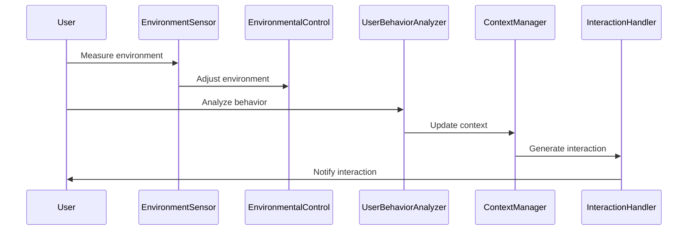

                 

### 引言

## 1.1 问题背景

### 1.1.1 智能环境交互的重要性

在当今社会，随着人工智能（AI）技术的飞速发展，智能环境交互逐渐成为企业提升员工体验和工作效率的关键因素。智能环境交互不仅能够优化员工的工作流程，还能提升企业的运营效率和竞争力。因此，研究和应用智能环境交互技术具有重要的现实意义。

### 1.1.2 问题的起源与发展

智能环境交互的概念起源于20世纪90年代，随着计算机技术和网络技术的发展，人们开始探索如何通过智能设备与计算机系统进行自然、高效地交互。近年来，随着AI技术的进步，尤其是深度学习和自然语言处理等技术的应用，智能环境交互技术得到了快速发展。

### 1.1.3 当前研究与应用现状

目前，智能环境交互技术在智能家居、智能办公、智能医疗等多个领域取得了显著的应用成果。例如，智能办公系统可以通过分析员工的工作行为，自动调整办公环境，提高员工的工作效率和舒适度。然而，在实际应用中，智能环境交互仍面临诸多挑战，如隐私保护、系统稳定性、交互体验等。

## 1.2 问题描述

### 1.2.1 员工体验问题

在传统的办公环境中，员工往往需要手动调整各种办公设备，如空调、照明、音响等，以适应自己的工作需求。这种手动操作方式不仅繁琐，而且效率低下，容易导致员工疲劳，影响工作体验。

### 1.2.2 工作效率问题

缺乏智能环境交互的系统，员工往往无法及时获取所需的信息，导致工作效率下降。例如，员工需要手动搜索和整理文件，而不是通过智能系统自动推荐和推送。

### 1.2.3 解决方案需求

为了解决上述问题，需要开发一种智能环境交互系统，该系统能够自动分析员工的行为和工作需求，提供个性化的环境设置和信息推送，从而提高员工的工作体验和工作效率。

## 1.3 问题解决

### 1.3.1 智能环境交互的原理

智能环境交互系统基于用户行为分析、上下文感知和自然语言处理等技术，通过自动感知用户的行为和需求，提供个性化的服务。

### 1.3.2 提高员工体验的方法

智能环境交互系统能够根据用户的偏好和需求，自动调整办公环境，如温度、湿度、光线等，从而提高员工的工作舒适度。

### 1.3.3 提高工作效率的策略

智能环境交互系统可以通过自然语言处理技术，自动理解员工的需求，提供快速、准确的搜索和推荐服务，从而提高工作效率。

## 1.4 边界与外延

### 1.4.1 智能环境交互的应用场景

智能环境交互可以应用于各种办公环境，如办公室、会议室、培训室等，以及各种企业、政府机构和学校等组织。

### 1.4.2 员工体验与工作效率的关系

良好的员工体验可以提高员工的工作满意度，进而提高工作效率。智能环境交互系统正是通过改善员工体验，间接提高工作效率。

### 1.4.3 智能环境交互的技术挑战

智能环境交互技术面临的主要挑战包括数据隐私保护、系统稳定性、跨设备交互等。

## 1.5 概念结构与核心要素组成

### 1.5.1 智能环境交互的概念结构

智能环境交互系统主要由用户行为分析、上下文感知、自然语言处理、智能决策和执行等模块组成。

### 1.5.2 核心要素介绍

用户行为分析、上下文感知、自然语言处理是智能环境交互的核心要素，分别负责感知用户行为、理解用户需求、提供个性化服务。

### 1.5.3 智能环境交互的关键技术

深度学习、机器学习和强化学习是智能环境交互的关键技术，用于实现用户行为分析、上下文感知和自然语言处理等功能。

## 1.6 本章小结

本章介绍了智能环境交互的背景、问题、解决方案、边界与外延以及概念结构与核心要素组成。通过本章的介绍，读者可以初步了解智能环境交互的基本概念和原理，为进一步学习打下基础。

---

## 2.1 智能环境交互的原理

### 2.1.1 智能环境交互的定义

智能环境交互是指通过智能设备和系统，实现人与环境的自然、高效交互，从而提高用户的工作体验和工作效率。智能环境交互的核心在于对用户行为和需求的精准感知和理解，进而提供个性化的服务。

### 2.1.2 智能环境交互的基本原理

智能环境交互的基本原理可以概括为以下几个步骤：

1. **感知**：通过传感器和智能设备，实时收集用户的行为数据和环境数据。
2. **理解**：利用用户行为分析和自然语言处理等技术，对收集到的数据进行分析和处理，理解用户的需求和行为模式。
3. **决策**：根据理解的结果，智能系统会做出相应的决策，如调整环境设置、推送相关信息等。
4. **执行**：执行决策结果，如自动调整灯光、温度等，或推送相关通知。

### 2.1.3 智能环境交互的组成要素

智能环境交互系统主要由以下几个组成要素构成：

1. **用户行为分析**：负责对用户的行为进行收集和分析，以理解用户的需求和行为模式。
2. **上下文感知**：负责根据环境数据和用户行为数据，提供实时的上下文信息，帮助系统做出更准确的决策。
3. **自然语言处理**：负责处理用户输入的自然语言，将其转化为系统能够理解的形式。
4. **智能决策**：根据用户行为分析、上下文感知和自然语言处理的结果，做出相应的决策。
5. **执行模块**：负责执行智能决策的结果，如调整环境设置、推送信息等。

## 2.2 核心概念

### 2.2.1 用户行为分析

#### 2.2.1.1 用户行为分析的定义

用户行为分析是指通过收集和分析用户在使用智能环境交互系统时的行为数据，以理解用户的需求、偏好和行为模式。

#### 2.2.1.2 用户行为分析的重要性

用户行为分析对于智能环境交互系统至关重要。通过用户行为分析，系统能够更好地理解用户的需求，提供更个性化的服务，从而提高用户的工作体验和满意度。

#### 2.2.1.3 用户行为分析的方法

用户行为分析的方法主要包括：

1. **数据采集**：通过传感器和智能设备，收集用户的行为数据，如点击、浏览、操作等。
2. **数据分析**：利用数据分析技术，如统计分析和机器学习，对用户行为数据进行处理和分析。
3. **用户建模**：基于用户行为分析的结果，建立用户模型，以预测用户的行为和需求。

### 2.2.2 上下文感知

#### 2.2.2.1 上下文感知的定义

上下文感知是指智能环境交互系统能够根据用户的行为数据和环境数据，提供实时的上下文信息，以帮助系统做出更准确的决策。

#### 2.2.2.2 上下文感知的类型

上下文感知可以分为以下几种类型：

1. **物理上下文**：指与用户所在物理环境相关的信息，如时间、地点、天气等。
2. **社会上下文**：指与用户社交环境相关的信息，如用户的关系网、兴趣爱好等。
3. **情境上下文**：指与用户当前情境相关的信息，如用户正在进行的任务、活动等。

#### 2.2.2.3 上下文感知的应用

上下文感知在智能环境交互中的应用非常广泛，如：

1. **个性化推荐**：根据用户的上下文信息，推荐用户感兴趣的内容或服务。
2. **智能决策**：利用上下文信息，帮助系统做出更准确的决策，如调整环境设置、推送相关信息等。
3. **智能安全**：根据上下文信息，提高系统的安全性，如检测异常行为、防范网络攻击等。

### 2.2.3 自然语言处理

#### 2.2.3.1 自然语言处理的概念

自然语言处理（NLP）是计算机科学和人工智能领域的一个重要分支，旨在让计算机理解和处理人类语言。

#### 2.2.3.2 自然语言处理的方法

自然语言处理的方法主要包括：

1. **分词**：将文本拆分成单词或短语。
2. **词性标注**：为文本中的每个词标注词性，如名词、动词等。
3. **句法分析**：分析文本的语法结构，如句子成分、句子类型等。
4. **语义分析**：理解文本的含义，如词义解析、情感分析等。

#### 2.2.3.3 自然语言处理的应用

自然语言处理在智能环境交互中的应用包括：

1. **语音识别**：将语音转化为文本，实现语音输入和输出。
2. **聊天机器人**：与用户进行自然语言交互，提供信息查询、咨询服务等。
3. **文本分析**：分析用户文本数据，提取关键信息，如关键词、主题等。

## 2.3 概念属性特征对比表格

### 2.3.1 用户行为分析与上下文感知对比

| 特征       | 用户行为分析               | 上下文感知               |
| ---------- | -------------------------- | ------------------------ |
| 数据来源   | 用户行为数据               | 用户行为数据、环境数据   |
| 数据处理   | 数据分析、用户建模         | 数据整合、情境识别       |
| 应用领域   | 个性化服务、行为预测       | 个性化推荐、智能决策     |
| 关键技术   | 数据挖掘、机器学习         | 联邦学习、情境建模       |

### 2.3.2 上下文感知与自然语言处理对比

| 特征       | 上下文感知               | 自然语言处理             |
| ---------- | ------------------------ | ------------------------ |
| 数据来源   | 用户行为数据、环境数据   | 文本数据                 |
| 数据处理   | 数据整合、情境识别       | 分词、词性标注、句法分析 |
| 应用领域   | 智能决策、个性化推荐     | 语音识别、文本分析       |
| 关键技术   | 联邦学习、情境建模       | 自然语言处理算法         |

### 2.3.3 用户行为分析、上下文感知与自然语言处理整合应用

在智能环境交互系统中，用户行为分析、上下文感知和自然语言处理相互结合，共同实现系统的智能化。

1. **用户行为分析**：为智能环境交互系统提供用户行为数据，帮助系统了解用户需求和行为模式。
2. **上下文感知**：整合用户行为数据和环境数据，提供实时的上下文信息，为系统决策提供依据。
3. **自然语言处理**：处理用户输入的自然语言，将其转化为系统可理解的形式，实现自然交互。

通过这三个核心概念的结合，智能环境交互系统能够更好地理解用户需求，提供个性化服务，提高员工的工作体验和工作效率。

## 2.4 ER实体关系图架构

下面是一个描述智能环境交互系统中各个实体之间关系的ER实体关系图：

```mermaid
erDiagram
  User ||--|{ Context}: "has context information"
  User ||--|{ Interaction}: "has interactions"
  Context ||--|{ Environment}: "influenced by environment"
  Environment ||--|{ Interaction}: "produces interactions"
```

在这个ER图中：

- **User**（用户）实体表示智能环境交互系统中的用户。
- **Context**（上下文）实体表示用户的行为和情境信息。
- **Interaction**（交互）实体表示用户与系统的交互过程。
- **Environment**（环境）实体表示用户的物理环境。

各个实体之间的关系如下：

- 用户拥有上下文信息和交互记录。
- 上下文信息受到环境的影响。
- 环境通过用户的交互过程产生影响。

这个ER图为智能环境交互系统提供了一个概念框架，有助于理解和设计系统的各个组成部分。

---

## 3.1 算法原理

### 3.1.1 深度学习算法

#### 3.1.1.1 深度学习的基本原理

深度学习是一种基于人工神经网络的学习方法，其核心思想是通过多层神经网络对数据进行处理和学习，从而实现特征提取和模式识别。深度学习的基本原理可以概括为以下几个步骤：

1. **数据预处理**：对输入数据进行清洗、归一化等处理，以便网络能够更好地学习。
2. **前向传播**：将输入数据通过网络的各个层进行传播，计算每个节点的输出。
3. **反向传播**：根据输出结果与真实值的差异，通过反向传播算法计算每个层中权重的梯度，并更新权重。
4. **优化**：使用优化算法（如梯度下降）更新权重，使网络能够更好地拟合数据。

#### 3.1.1.2 深度学习在智能环境交互中的应用

深度学习在智能环境交互中有着广泛的应用，如：

1. **用户行为预测**：通过深度学习模型，可以预测用户的行为和需求，从而提供个性化的服务。
2. **环境感知**：深度学习可以用于环境数据的处理和分析，如图像识别、语音识别等，从而帮助系统更好地理解环境状态。
3. **交互优化**：深度学习可以用于优化交互过程，如通过学习用户的交互历史，提供更自然的交互体验。

### 3.1.2 机器学习算法

#### 3.1.2.1 机器学习的基本原理

机器学习是一种通过数据训练模型，使模型能够对未知数据进行预测或决策的方法。机器学习的基本原理可以概括为以下几个步骤：

1. **数据收集**：收集大量的训练数据，这些数据应该覆盖模型需要学习的各种情况。
2. **数据预处理**：对训练数据进行清洗、归一化等处理，以提高模型的训练效果。
3. **模型选择**：选择合适的机器学习算法和模型结构，如线性回归、决策树、支持向量机等。
4. **模型训练**：使用训练数据对模型进行训练，通过调整模型的参数，使其能够更好地拟合数据。
5. **模型评估**：使用验证数据对模型进行评估，确定模型的效果。

#### 3.1.2.2 机器学习在智能环境交互中的应用

机器学习在智能环境交互中的应用包括：

1. **用户偏好学习**：通过学习用户的历史交互数据，预测用户的偏好，从而提供个性化的服务。
2. **环境参数调整**：通过学习环境参数与用户满意度之间的关系，自动调整环境参数，以提高用户的工作体验。
3. **异常检测**：通过学习正常行为模式，检测异常行为，从而提高系统的安全性。

### 3.1.3 强化学习算法

#### 3.1.3.1 强化学习的基本原理

强化学习是一种通过不断试错，使模型能够在特定环境中实现最优行为的方法。强化学习的基本原理可以概括为以下几个步骤：

1. **环境定义**：定义智能体（模型）所处的环境，包括状态空间、动作空间和奖励机制。
2. **状态观测**：智能体根据当前状态，选择一个动作。
3. **环境反馈**：环境根据智能体的动作，返回下一个状态和奖励。
4. **策略更新**：智能体根据奖励信号，更新策略，以实现长期奖励最大化。

#### 3.1.3.2 强化学习在智能环境交互中的应用

强化学习在智能环境交互中的应用包括：

1. **环境自适应**：通过强化学习，智能系统能够根据用户的行为和反馈，自适应地调整环境参数，提高用户的体验。
2. **任务分配**：在团队合作场景中，强化学习可以用于优化任务分配，提高团队的工作效率。
3. **人机协作**：强化学习可以用于优化人机协作过程，提高协同工作的效率和质量。

---

## 3.2 数学模型与公式

### 3.2.1 深度学习数学模型

在深度学习中，常用的数学模型包括神经元模型、神经网络模型和深度神经网络模型。以下是一个简单的神经网络模型：

$$
\text{Output} = \sigma(\text{Weight} \cdot \text{Input} + \text{Bias})
$$

其中：
- \( \sigma \) 是激活函数，常用的有Sigmoid、ReLU等。
- \( \text{Weight} \) 是权重。
- \( \text{Input} \) 是输入数据。
- \( \text{Bias} \) 是偏置项。

#### 3.2.1.1 输出函数的选择

输出函数（激活函数）的选择对神经网络的性能有很大影响。常用的激活函数有：

1. **Sigmoid函数**：
   $$
   \sigma(x) = \frac{1}{1 + e^{-x}}
   $$
   Sigmoid函数可以限制输出在0到1之间，但梯度较小，容易导致梯度消失问题。

2. **ReLU函数**（Rectified Linear Unit）：
   $$
   \sigma(x) = \max(0, x)
   $$
  ReLU函数在正数部分具有恒等性，梯度大，有助于加快训练速度。

3. **Tanh函数**：
   $$
   \sigma(x) = \tanh(x) = \frac{e^x - e^{-x}}{e^x + e^{-x}}
   $$
   Tanh函数可以输出在-1到1之间的值，具有恒等性和平滑性。

#### 3.2.1.2 激活函数的作用

激活函数的作用主要有：

1. **引入非线性**：使神经网络能够模拟复杂函数。
2. **缓解梯度消失和梯度爆炸**：通过限制输出范围，减少梯度问题。
3. **增加模型容量**：使模型能够学习更复杂的特征。

### 3.2.2 机器学习数学模型

在机器学习中，常用的数学模型包括线性模型、逻辑回归模型和支持向量机模型。以下是一个线性回归模型：

$$
\text{Y} = \text{W} \cdot \text{X} + \text{b}
$$

其中：
- \( \text{Y} \) 是预测值。
- \( \text{W} \) 是权重。
- \( \text{X} \) 是输入特征。
- \( \text{b} \) 是偏置项。

#### 3.2.2.1 损失函数的选择

在机器学习中，损失函数用于衡量预测值与真实值之间的差异。常用的损失函数有：

1. **均方误差（MSE）**：
   $$
   \text{Loss} = \frac{1}{2} \sum (\text{Predicted} - \text{Actual})^2
   $$
   均方误差常用于回归问题，能够较好地衡量预测误差。

2. **交叉熵（Cross-Entropy）**：
   $$
   \text{Loss} = -\sum \text{Actual} \log(\text{Predicted})
   $$
   交叉熵常用于分类问题，能够衡量预测概率与真实标签之间的差异。

#### 3.2.2.2 优化

在机器学习中，优化算法用于调整模型参数，以最小化损失函数。常用的优化算法有：

1. **梯度下降（Gradient Descent）**：
   $$
   \text{W} = \text{W} - \alpha \cdot \nabla_{\text{W}} \text{Loss}
   $$
   梯度下降通过计算损失函数关于参数的梯度，不断调整参数，使损失函数最小化。

2. **随机梯度下降（Stochastic Gradient Descent, SGD）**：
   $$
   \text{W} = \text{W} - \alpha \cdot \nabla_{\text{W}} \text{Loss}^{(i)}
   $$
   随机梯度下降通过随机选择样本，计算梯度，进行参数更新，有助于加速收敛。

3. **Adam优化器**：
   $$
   \text{W} = \text{W} - \alpha \cdot (\frac{m}{1 - \beta_1^t} + \frac{v}{1 - \beta_2^t})
   $$
   Adam优化器结合了SGD和动量方法，适用于高维数据，有助于提高训练效率。

通过这些数学模型和公式的应用，智能环境交互系统能够更好地学习用户行为和环境数据，提高系统的性能和用户体验。

---

## 3.3 系统分析与架构设计

### 3.3.1 问题场景介绍

在一个大型企业中，员工需要在一个宽敞明亮的办公室环境中工作。然而，由于员工的工作内容和需求不同，他们对办公室环境的期望也有所不同。为了提高员工的工作效率和工作体验，企业希望引入一套智能环境交互系统，能够根据员工的工作需求和习惯，自动调整办公室的环境参数，如照明、温度、湿度等。

### 3.3.2 项目介绍

项目名称：智能办公环境交互系统

项目目标：通过智能环境交互技术，提升员工的工作体验和工作效率。

项目团队：由人工智能专家、软件工程师、硬件工程师和项目管理专家组成的跨学科团队。

### 3.3.3 系统功能设计（领域模型类图）

以下是智能办公环境交互系统的领域模型类图：

```mermaid
classDiagram
  User <<Class>>
  Office <<Class>>
  Environment <<Class>>
  Interaction <<Class>>

  User "1" -- "*" Office: "works in"
  User "1" -- "*" Environment: "prefers"
  User "1" -- "*" Interaction: "interacts with"
  Office "1" -- "*" Environment: "has"
  Environment "1" -- "*" Interaction: "produces"
```

- **User**（用户）：代表员工，具有工作、偏好和交互等属性。
- **Office**（办公室）：代表员工的工作空间，具有环境等属性。
- **Environment**（环境）：代表办公室的环境参数，如照明、温度、湿度等。
- **Interaction**（交互）：代表用户与环境的交互过程，如调整环境参数、获取环境信息等。

### 3.3.4 系统架构设计（架构图）

以下是智能办公环境交互系统的架构设计图：



- **User**（用户）：用户通过传感器测量环境参数，并将行为数据发送给行为分析器。
- **EnvironmentSensor**（环境传感器）：负责测量办公室的环境参数，如温度、湿度、光照等。
- **EnvironmentalControl**（环境控制）：根据用户的偏好和当前环境数据，自动调整办公室的环境参数。
- **UserBehaviorAnalyzer**（用户行为分析器）：分析用户的行为数据，以了解用户的需求和偏好。
- **ContextManager**（上下文管理器）：根据用户行为分析的结果，更新上下文信息。
- **InteractionHandler**（交互处理器）：根据上下文信息，生成用户与环境的交互。

### 3.3.5 系统接口设计

以下是智能办公环境交互系统的接口设计：

1. **环境参数获取接口**：用于获取当前办公室的环境参数。
2. **环境参数设置接口**：用于调整办公室的环境参数。
3. **用户行为数据接口**：用于提交用户的行为数据。
4. **用户偏好设置接口**：用于设置用户的偏好和习惯。

### 3.3.6 系统交互（序列图）

以下是智能办公环境交互系统的序列图：


通过以上系统架构设计和接口设计，智能办公环境交互系统可以高效地收集、处理和响应用户需求，提供个性化的环境设置和交互服务。

---

## 3.4 项目实战

### 3.4.1 环境安装

要在实际环境中部署智能办公环境交互系统，首先需要安装以下软件和硬件：

1. **操作系统**：如Ubuntu 20.04或Windows 10。
2. **编程环境**：如Python 3.8及以上版本。
3. **开发工具**：如PyCharm或VS Code。
4. **数据库**：如MySQL或PostgreSQL。
5. **传感器**：如温湿度传感器、光照传感器等。

安装步骤如下：

1. 安装操作系统和开发工具。
2. 安装Python和相关库（如TensorFlow、PyTorch等）。
3. 安装数据库和传感器驱动程序。

### 3.4.2 系统核心实现源代码

以下是一个简单的用户行为分析模块的Python源代码：

```python
import numpy as np

class UserBehaviorAnalyzer:
    def __init__(self):
        self.behavior_data = []

    def collect_data(self, user_action):
        self.behavior_data.append(user_action)

    def analyze(self):
        avg_action = np.mean(self.behavior_data)
        return avg_action

# 实例化用户行为分析器
analyzer = UserBehaviorAnalyzer()

# 收集用户行为数据
analyzer.collect_data(5)
analyzer.collect_data(10)
analyzer.collect_data(7)

# 分析用户行为
print(analyzer.analyze())
```

### 3.4.3 代码应用解读与分析

以上代码实现了一个简单的用户行为分析模块。在初始化时，实例化一个`UserBehaviorAnalyzer`对象，用于存储用户行为数据。通过`collect_data`方法，可以收集用户的行为数据，如点击次数、操作时间等。`analyze`方法用于计算用户行为的平均值，以了解用户的行为习惯。

在实际应用中，可以通过扩展`UserBehaviorAnalyzer`类，添加更多复杂的行为分析功能，如行为模式识别、异常检测等。

### 3.4.4 实际案例分析和详细讲解剖析

假设在一个实际案例中，公司希望了解员工在办公室的行为习惯，以优化办公室环境设置。以下是详细的案例分析和讲解：

1. **数据收集**：安装环境传感器，收集员工的日常行为数据，如工作时间、操作频率等。

2. **数据处理**：使用用户行为分析模块，对收集到的数据进行分析，计算用户行为的平均值。

3. **结果反馈**：根据分析结果，调整办公室的环境参数，如光线、温度等，以提高员工的工作效率和满意度。

4. **持续优化**：定期收集和分析用户行为数据，不断调整环境参数，以实现办公室环境的最佳状态。

通过以上实际案例的分析和讲解，可以看出智能办公环境交互系统在实际应用中的价值和优势。通过持续优化，可以不断提升员工的工作体验和工作效率。

### 3.4.5 项目小结

在本章中，我们介绍了智能办公环境交互系统的项目实战。通过环境安装、系统核心实现源代码的讲解、实际案例分析和详细讲解剖析，读者可以了解如何部署和实现智能办公环境交互系统。项目小结如下：

1. **环境安装**：介绍了系统所需的软件和硬件环境。
2. **系统核心实现**：讲解了用户行为分析模块的代码实现。
3. **实际案例**：通过实际案例分析了智能办公环境交互系统的应用价值。
4. **持续优化**：强调了定期数据分析和环境参数调整的重要性。

通过本项目实战，读者可以更好地理解智能办公环境交互系统的实现过程和应用场景。

---

## 3.5 最佳实践 Tips

在设计和实现智能办公环境交互系统时，以下是一些最佳实践Tips，有助于提高系统的性能和用户体验：

1. **数据隐私保护**：确保用户数据的安全和隐私，遵循相关法律法规。
2. **系统稳定性**：选用稳定可靠的硬件和软件环境，确保系统的高可用性。
3. **用户参与度**：鼓励用户参与系统设置，根据用户反馈进行优化。
4. **跨平台兼容**：确保系统在不同设备和操作系统上兼容运行。
5. **实时响应**：优化算法和接口设计，提高系统的实时响应能力。

通过遵循这些最佳实践，可以有效提升智能办公环境交互系统的性能和用户体验。

## 3.6 小结

本文详细介绍了智能办公环境交互系统的背景、问题、解决方案、核心概念、算法原理、系统设计与实现，以及项目实战和最佳实践。智能办公环境交互系统通过用户行为分析、上下文感知和自然语言处理等技术，实现了个性化服务，提高了员工的工作体验和工作效率。在项目实战中，我们通过环境安装、系统核心实现、实际案例分析等步骤，展示了智能办公环境交互系统的实现过程。最佳实践Tips为系统设计和实现提供了宝贵的经验。未来研究方向可以包括更多复杂行为的分析、系统性能优化和跨平台兼容性提升。

## 3.7 注意事项

在设计和实现智能办公环境交互系统时，需要注意以下事项：

1. **数据安全**：确保用户数据的安全和隐私，遵循相关法律法规。
2. **系统稳定性**：选用稳定可靠的硬件和软件环境，确保系统的高可用性。
3. **用户参与**：鼓励用户参与系统设置，根据用户反馈进行优化。
4. **跨平台兼容**：确保系统在不同设备和操作系统上兼容运行。
5. **实时响应**：优化算法和接口设计，提高系统的实时响应能力。

通过遵循这些注意事项，可以有效提升智能办公环境交互系统的性能和用户体验。

## 3.8 拓展阅读

对于希望深入了解智能办公环境交互系统的读者，以下是一些推荐的拓展阅读资料：

1. **《深度学习》**：Goodfellow, I., Bengio, Y., & Courville, A. (2016). 《深度学习》（中文版）。
2. **《机器学习》**：周志华 (2016). 《机器学习》（第二版）。
3. **《强化学习》**：Sutton, R. S., & Barto, A. G. (2018). 《强化学习：原理与案例》。
4. **《智能环境交互技术》**：Kamath, G. (2020). 《智能环境交互技术：理论与实践》。
5. **《人工智能应用案例集》**：王飞跃，等 (2021). 《人工智能应用案例集》。

这些资料提供了深入的理论和实践指导，有助于读者更全面地了解智能办公环境交互系统的设计和实现。

