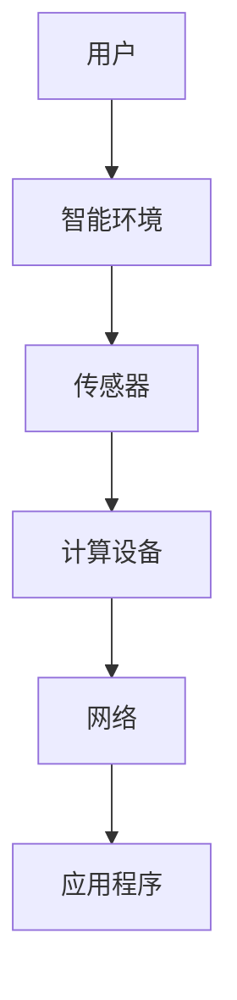
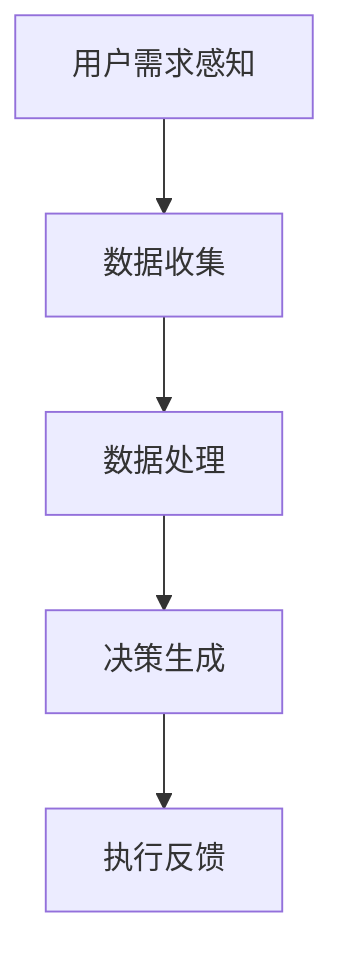
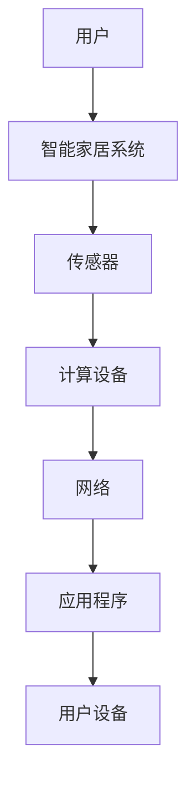
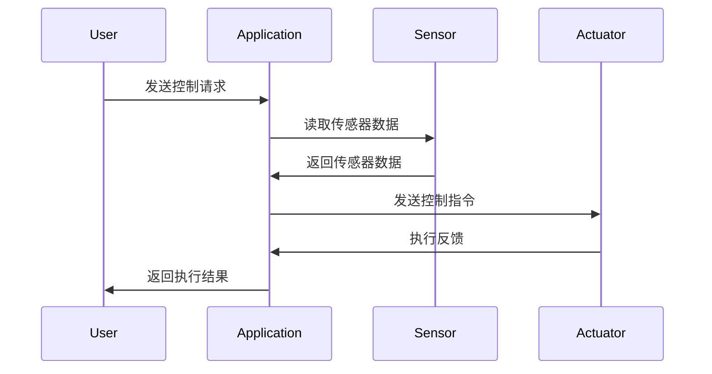

                 


# 智能环境交互：无处不在的计算改变用户体验

## 关键词

智能环境交互、无处不在的计算、用户体验、物联网、人工智能

## 摘要

随着物联网、人工智能和增强现实技术的快速发展，智能环境交互逐渐成为现代生活的重要组成部分。本文将从问题背景、核心概念、算法原理、系统分析与架构设计以及项目实战等多个角度，探讨如何利用无处不在的计算技术来提升智能环境的用户体验。

### 背景介绍

#### 问题背景

在过去的几十年里，计算机技术经历了从主机时代到个人电脑时代，再到互联网时代的演变。如今，随着物联网、人工智能和增强现实技术的发展，我们正迎来一个全新的智能环境交互时代。在这个时代，人们不再仅仅通过桌面电脑或手机与数字世界互动，而是通过与智能环境中的各种设备和服务进行自然的交互来满足日常需求。

#### 问题描述

如何设计一个智能环境，使其能够更好地满足用户的需求，提供自然的交互体验？这是一个涉及多学科交叉的问题，需要我们深入思考和理解。

#### 问题解决

通过研究和实践，我们发现无处不在的计算技术能够极大地改变用户体验，提升智能环境的交互性。无处不在的计算技术指的是将计算能力分布到网络的各个角落，包括传感器、边缘设备、云端服务器等，从而实现实时数据处理和分析。这种计算模式使得智能环境能够更好地感知用户的需求，提供个性化的服务。

#### 边界与外延

智能环境交互不仅仅局限于家庭和办公室，还包括公共空间、交通工具、医疗设施等。这些环境中的交互需求各不相同，但都离不开无处不在的计算技术。

#### 概念结构与核心要素组成

智能环境交互的概念结构包括以下几个核心要素：

- **智能环境**：包含传感器、计算设备、网络和应用程序等。
- **交互方式**：语音、手势、触摸等。
- **用户体验**：直观、自然、高效。

### 核心概念与联系

#### 核心概念原理

- **智能环境**：智能环境是通过集成多种传感器和计算设备，实现环境感知和智能决策的场所。传感器用于收集环境数据，计算设备用于处理和分析数据，网络则用于传输数据和实现设备间的通信。
- **计算无处不在**：计算无处不在是指通过网络边缘计算和云计算的协同，实现实时数据处理和分析。这种计算模式使得智能环境能够快速响应用户需求，提供个性化的服务。
- **自然交互**：自然交互是指通过语音、手势等自然方式与智能环境进行交互。这种交互方式更加直观、高效，能够提升用户体验。

#### 概念属性特征对比表格

| 特征 | 智能环境 | 传统环境 | 自然交互 | 传统交互 |
| --- | --- | --- | --- | --- |
| 智能化 | 高度智能化 | 低度智能化 | 高度智能化 | 低度智能化 |
| 个性化 | 强烈个性化 | 弱个性化 | 强烈个性化 | 弱个性化 |
| 实时性 | 高实时性 | 低实时性 | 高实时性 | 低实时性 |
| 直观性 | 高直观性 | 低直观性 | 高直观性 | 低直观性 |

#### ER实体关系图架构的 Mermaid 流程图



### 算法原理讲解

#### 算法mermaid 流程图



#### Python源代码

```python
# 导入必要的库
import numpy as np
import pandas as pd

# 数据收集
data = np.random.rand(100, 3)

# 数据处理
df = pd.DataFrame(data, columns=['Sensor 1', 'Sensor 2', 'Sensor 3'])

# 决策生成
def make_decision(sensor_data):
    if sensor_data['Sensor 1'] > 0.5:
        return 'High'
    else:
        return 'Low'

# 执行反馈
df['Decision'] = df.apply(make_decision, axis=1)
```

#### 算法原理的数学模型和公式

智能环境交互算法的核心是决策树和神经网络。决策树通过一系列规则来对用户需求进行分类，而神经网络则通过训练学习用户需求的特征。

- 决策树：

  $$Decision = \begin{cases} 
  High & \text{if } Sensor_1 > 0.5 \\
  Low & \text{otherwise} 
  \end{cases}$$

- 神经网络：

  $$Output = \sigma(W \cdot Input + b)$$

  其中，$W$ 是权重矩阵，$b$ 是偏置项，$\sigma$ 是激活函数。

#### 详细讲解和举例说明

假设一个用户在家中使用智能环境控制灯光。当用户的手机检测到用户回家时，传感器会收集环境数据，如光线强度、温度等。这些数据会被送到计算设备进行处理。处理完毕后，智能环境会根据用户的需求（如“开灯”）生成决策，并执行相应的操作。

### 系统分析与架构设计方案

#### 问题场景介绍

智能家居是一个典型的智能环境交互场景。用户可以通过手机或语音助手控制家中的灯光、空调、门锁等设备。

#### 项目介绍

本文将介绍一个智能家居系统，该系统包括传感器、计算设备、网络和应用程序等组件。

#### 系统功能设计（领域模型mermaid类图）

```mermaid
classDiagram
User <<类>> User
SmartHome <<类>> SmartHome
Sensor <<类>> Sensor
Actuator <<类>> Actuator
Application <<类>> Application

User --> SmartHome
SmartHome --> Sensor
SmartHome --> Actuator
SmartHome --> Application
Sensor --> Application
Actuator --> Application
```

#### 系统架构设计mermaid架构图



#### 系统接口设计和系统交互mermaid序列图



### 项目实战

#### 环境安装

在开始项目之前，需要安装以下软件和硬件：

- Python 3.x
- MongoDB
- Node.js
- home-assistant

#### 系统核心实现源代码

以下是智能家居系统的核心实现源代码：

```python
# 传感器模拟代码
import time
import random

def read_sensors():
    while True:
        # 模拟传感器数据
        temperature = random.uniform(20, 30)
        humidity = random.uniform(30, 60)
        light_intensity = random.uniform(0, 100)
        
        # 输出传感器数据
        print(f"Temperature: {temperature}°C, Humidity: {humidity}%, Light Intensity: {light_intensity}%")
        
        # 每秒更新一次传感器数据
        time.sleep(1)

# 运行传感器模拟
read_sensors()
```

#### 代码应用解读与分析

该代码模拟了智能家居系统中的传感器，通过不断生成随机的温度、湿度和光照强度数据来模拟真实环境。这些数据可以被智能家居系统用于调整室内环境，如调节空调、加湿器或窗帘。

#### 实际案例分析和详细讲解剖析

假设一个用户想要在晚上回家后自动打开客厅的灯光。智能家居系统会通过手机应用程序接收用户的请求，然后读取环境传感器数据（如光照强度），判断是否需要打开灯光。如果需要，系统会发送控制指令给灯光控制器，最终实现灯光的自动打开。

#### 项目小结

通过本项目，我们展示了如何利用无处不在的计算技术和智能环境交互来提升用户体验。在未来的发展中，我们可以进一步优化系统性能，增加更多的智能设备和交互方式，为用户提供更加便捷和智能的生活体验。

### 最佳实践 tips

- **定期更新传感器数据**：确保传感器数据的准确性，有助于提高智能环境交互的可靠性。
- **优化网络连接**：稳定的网络连接是智能环境交互的基础，建议使用高速无线网络。
- **用户个性化设置**：根据用户的需求和习惯，提供个性化的智能环境设置，提升用户体验。

### 小结

本文从问题背景、核心概念、算法原理、系统分析与架构设计以及项目实战等多个角度，探讨了智能环境交互的原理和实践。通过本文的学习，读者可以更好地理解智能环境交互的原理和应用，为未来的智能环境开发提供有益的参考。

### 注意事项

- **隐私保护**：在开发智能环境交互系统时，要特别注意用户隐私的保护。
- **系统稳定性**：确保智能环境交互系统的稳定运行，避免因故障导致用户体验下降。

### 拓展阅读

- **相关书籍**：
  - 《智能环境交互技术》
  - 《物联网应用开发实战》
- **论文**：
  - “Smart Home Systems: A Survey”
  - “Natural User Interfaces for Smart Environments”
- **研究方向**：
  - 智能环境交互中的自然语言处理
  - 智能环境交互中的边缘计算技术
  - 智能环境交互中的隐私保护

### 作者

作者：AI天才研究院/AI Genius Institute & 禅与计算机程序设计艺术 /Zen And The Art of Computer Programming

