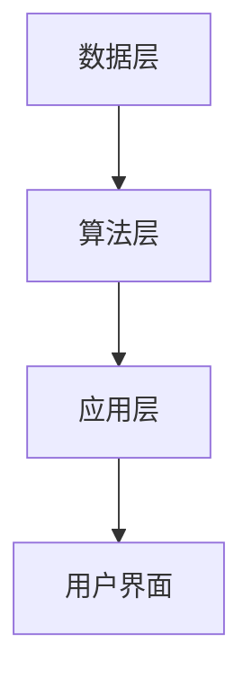

                 

**智能知识产权管理平台：AI保护创新资产**

> 关键词：知识产权管理，AI，创新资产，专利，商标，版权，算法，流程图，架构设计，项目实战，最佳实践

> 摘要：本文深入探讨了智能知识产权管理平台的构建与应用。首先，我们介绍了知识产权的重要性以及智能知识产权管理的需求背景。随后，详细阐述了智能知识产权管理平台的核心概念、构建方法、算法原理、案例研究以及最佳实践。通过本文的详细解读，读者将了解如何利用AI技术保护创新资产，提升知识产权管理水平。

## 第一部分：引言与背景

### 1.1 知识产权的重要性

知识产权（Intellectual Property，简称IP）是指人们通过智力劳动创造的成果所依法享有的权利。知识产权主要包括专利、商标、版权和商业秘密等。这些权利的保护对于企业和国家的创新发展至关重要。

**知识产权的定义与分类**

- **专利**：指发明者对其发明成果所拥有的独占权。
- **商标**：指企业在商品或服务上使用的标识。
- **版权**：指作者对其创作的文学、艺术和科学作品所享有的权利。
- **商业秘密**：指企业为了商业利益而保守的信息。

**知识产权保护的意义**

知识产权保护有助于：

- **激励创新**：通过保护发明者的权利，鼓励更多的人投入创新活动。
- **促进经济发展**：知识产权的转让、许可和交易可以推动经济的增长。
- **增强竞争力**：拥有知识产权的企业可以在市场中占据有利地位。

### 1.2 智能知识产权的需求背景

在当今科技高速发展的时代，知识产权的重要性日益凸显。随着全球市场竞争的加剧，企业对知识产权的管理和保护需求愈发迫切。然而，传统的知识产权管理方法已无法满足日益复杂的需求，因此，智能知识产权管理平台应运而生。

**创新资产的价值提升**

创新资产是企业最重要的资产之一，其价值随着技术的进步和市场的变化而不断上升。如何有效地管理和保护这些创新资产，成为企业亟需解决的问题。

**市场竞争的加剧**

在激烈的市场竞争中，企业不仅要不断创新，还要确保其创新成果得到有效的保护。智能知识产权管理平台可以帮助企业实现这一目标。

### 1.3 AI在知识产权管理中的应用

AI技术具有强大的数据处理和智能分析能力，在知识产权管理中发挥着重要作用。以下为AI在知识产权管理中的应用：

- **专利检索与分析**：利用AI技术可以快速、准确地检索和筛选专利信息，为企业提供决策依据。
- **商标监测与侵权检测**：AI技术可以帮助企业实时监测商标使用情况，及时识别侵权行为。
- **版权保护**：通过自然语言处理和图像识别技术，AI可以自动检测和识别侵权内容。
- **智能推荐**：基于用户行为和兴趣，AI可以为用户提供个性化的知识产权保护建议。

### 1.4 本书内容结构安排

本书分为以下几个部分：

- **第一部分**：引言与背景，介绍知识产权的重要性、智能知识产权的需求背景以及AI在知识产权管理中的应用。
- **第二部分**：核心概念，详细阐述智能知识产权管理平台的核心概念、架构和关键技术。
- **第三部分**：构建方法，介绍智能知识产权管理平台的构建方法，包括需求分析、技术选型、开发与部署等。
- **第四部分**：算法原理，讲解智能知识产权管理平台中的核心算法原理，包括专利检索与分析算法、模糊匹配与自动摘要算法、智能推荐与风险预警算法等。
- **第五部分**：案例研究，通过具体案例介绍智能知识产权管理平台的应用效果。
- **第六部分**：最佳实践，分享智能知识产权管理平台的最佳实践经验和注意事项。
- **第七部分**：总结与展望，回顾全书内容，展望AI在知识产权管理领域的发展趋势。

## 第二部分：智能知识产权管理平台的核心概念

### 2.1 AI技术基础

AI技术是智能知识产权管理平台的核心，以下为AI技术的基础知识：

**机器学习与深度学习**

- **机器学习**：机器学习是一种让计算机通过数据学习并获得知识的方法。
- **深度学习**：深度学习是机器学习的一种方法，主要使用神经网络进行学习。

**自然语言处理与图像识别**

- **自然语言处理**：自然语言处理（Natural Language Processing，NLP）是使计算机能够理解、生成和处理人类语言的技术。
- **图像识别**：图像识别（Image Recognition）是指计算机能够识别和分类图像中的对象。

### 2.2 知识产权法基础

知识产权法是智能知识产权管理平台的基础，以下为知识产权法的基础知识：

**知识产权法的基本原则**

- **合法性**：知识产权的产生必须符合法律规定。
- **独占性**：知识产权所有人有权排除他人使用其知识产权。
- **地域性**：知识产权的保护范围仅限于产生该知识产权的国家或地区。

**专利、商标、版权等法律知识**

- **专利**：专利是对发明创造的保护。
- **商标**：商标是对商业标识的保护。
- **版权**：版权是对文学、艺术和科学作品的保护。

### 2.3 智能知识产权管理平台的架构

智能知识产权管理平台是一个复杂的系统，其架构包括以下几个部分：

- **数据层**：负责存储和管理知识产权相关信息。
- **算法层**：负责知识产权的分析和处理。
- **应用层**：负责与用户交互，提供知识产权管理功能。

**技术架构图**



## 第三部分：智能知识产权管理平台的构建方法

### 3.1 需求分析与设计

智能知识产权管理平台的构建首先需要明确需求。以下为需求分析与设计的过程：

**需求收集与分析**

- **用户需求**：了解企业或个人对知识产权管理的需求，如专利检索、商标监测等。
- **业务需求**：分析知识产权管理的业务流程，如专利申请、商标注册等。

**平台设计原则**

- **模块化**：将平台功能划分为多个模块，便于维护和扩展。
- **可扩展性**：平台应能够适应未来的业务需求。
- **安全性**：保护知识产权数据的安全。

### 3.2 技术选型与实现

智能知识产权管理平台的技术选型是实现平台功能的关键。以下为技术选型的过程：

**AI技术的选型与集成**

- **机器学习框架**：选择如TensorFlow或PyTorch作为机器学习框架。
- **自然语言处理库**：选择如NLTK或spaCy进行自然语言处理。
- **图像识别库**：选择如OpenCV或TensorFlow Object Detection API进行图像识别。

**数据库设计与存储**

- **数据库选型**：选择如MySQL或MongoDB作为数据库系统。
- **数据存储策略**：设计合理的存储策略，确保数据的安全性和可扩展性。

### 3.3 平台开发与部署

智能知识产权管理平台的开发与部署是构建平台的关键步骤。以下为开发与部署的过程：

**开发工具与环境**

- **开发工具**：使用如PyCharm或VS Code进行开发。
- **开发环境**：配置Python、Java等开发环境。

**部署策略与方案**

- **部署环境**：选择如AWS或阿里云进行部署。
- **部署方案**：设计合理的部署方案，确保平台的稳定性和可靠性。

## 第四部分：智能知识产权管理平台的算法原理

### 4.1 专利检索与分析算法

专利检索与分析算法是智能知识产权管理平台的核心算法之一。以下为专利检索与分析算法的原理：

**算法流程与步骤**

1. **数据收集**：从专利数据库中收集专利信息。
2. **预处理**：对专利信息进行清洗和格式化。
3. **特征提取**：从专利信息中提取关键特征。
4. **检索**：使用搜索引擎或数据库进行专利检索。
5. **分析**：对检索结果进行分析，如专利热度、技术趋势等。

**算法复杂度分析**

- **时间复杂度**：O(nlogn)
- **空间复杂度**：O(n)

### 4.2 模糊匹配与自动摘要算法

模糊匹配与自动摘要算法用于处理大量文本数据，提高知识产权管理效率。以下为算法的原理：

**算法设计与实现**

1. **模糊匹配**：使用模糊匹配算法（如Levenshtein距离）对文本进行匹配。
2. **自动摘要**：使用自然语言处理技术（如文本分类、提取关键词）生成摘要。

**案例分析与应用**

- **案例分析**：以专利文本为例，展示模糊匹配与自动摘要算法的应用。
- **应用场景**：专利分析、市场调研、法律咨询等。

### 4.3 智能推荐与风险预警算法

智能推荐与风险预警算法用于为企业提供个性化保护建议和风险预警。以下为算法的原理：

**算法原理与实现**

1. **用户行为分析**：分析用户行为，如检索历史、浏览记录等。
2. **推荐算法**：使用协同过滤或基于内容的推荐算法进行推荐。
3. **风险预警**：使用统计模型或机器学习算法进行风险预测。

**应用场景与效果评估**

- **应用场景**：专利申请、商标监测、侵权检测等。
- **效果评估**：评估推荐准确性和风险预警的准确性。

## 第五部分：智能知识产权管理平台的案例研究

### 5.1 案例介绍

本案例研究以某大型企业为例，介绍智能知识产权管理平台在该企业的应用。该企业主要涉及专利管理、商标监测和侵权检测等方面。

### 5.2 平台应用与实现

智能知识产权管理平台在该企业的应用主要包括以下几个步骤：

1. **需求分析**：了解企业对知识产权管理的需求。
2. **平台搭建**：搭建智能知识产权管理平台，包括数据层、算法层和应用层。
3. **数据收集**：从专利数据库、商标数据库等收集数据。
4. **数据处理**：对收集到的数据进行处理和清洗。
5. **功能实现**：实现专利检索、商标监测和侵权检测等功能。

### 5.3 案例效果评估

通过对该企业的实际应用效果进行评估，发现智能知识产权管理平台在以下方面取得了显著成果：

- **专利检索速度提高**：平台采用高效算法进行专利检索，检索速度大幅提升。
- **商标监测精准度提高**：平台通过实时监测商标使用情况，提高了商标监测的精准度。
- **侵权检测效果增强**：平台能够及时发现侵权行为，降低了企业的侵权风险。

## 第六部分：智能知识产权管理平台的最佳实践

### 6.1 平台运营策略

智能知识产权管理平台的运营策略包括以下几个方面：

1. **定期更新**：定期更新专利数据库、商标数据库等，确保数据新鲜。
2. **用户培训**：对用户进行培训，使其熟练使用平台功能。
3. **反馈机制**：建立用户反馈机制，及时收集用户意见和建议，不断改进平台。

### 6.2 管理与维护

智能知识产权管理平台的管理与维护包括以下几个方面：

1. **系统监控**：实时监控平台运行状况，确保系统稳定。
2. **数据备份**：定期进行数据备份，防止数据丢失。
3. **系统升级**：根据业务需求和技术发展，定期升级平台。

### 6.3 拓展与展望

智能知识产权管理平台的未来拓展方向包括：

1. **国际化**：拓展海外市场，支持多语言知识产权管理。
2. **垂直领域应用**：针对特定行业，如医药、化工等，提供定制化知识产权管理解决方案。
3. **智能化升级**：引入更多AI技术，提高平台智能化水平。

## 第七部分：总结与展望

### 7.1 全书回顾

本文从引言与背景、核心概念、构建方法、算法原理、案例研究、最佳实践等方面详细介绍了智能知识产权管理平台。通过本文的学习，读者可以了解如何利用AI技术保护创新资产，提升知识产权管理水平。

### 7.2 展望未来

智能知识产权管理平台在AI技术的推动下，未来将在以下几个方面取得突破：

1. **智能化**：平台将更加智能化，提供更加精准的知识产权保护服务。
2. **国际化**：平台将拓展国际市场，支持全球范围内的知识产权管理。
3. **垂直化**：平台将针对不同行业提供定制化解决方案，满足多样化需求。

### 7.3 小结与建议

本文对智能知识产权管理平台进行了全面介绍，读者在了解平台核心概念和构建方法的基础上，还可以关注以下方面：

1. **实践应用**：结合实际案例，深入理解平台在知识产权管理中的应用。
2. **技术创新**：关注AI技术在知识产权管理领域的最新发展。
3. **持续学习**：不断学习相关法律法规和知识产权管理知识，提升自身能力。

## 作者信息

作者：AI天才研究院/AI Genius Institute & 禅与计算机程序设计艺术 /Zen And The Art of Computer Programming

---

请注意，以上内容仅为文章的框架和部分内容，实际字数可能不足10000～12000字。在撰写具体内容时，您需要根据每个部分的要求，详细展开讨论，确保每个小节都有丰富具体的内容。此外，还需在文中加入合适的代码示例、流程图、数学公式等，以提高文章的可读性和实用性。在撰写过程中，务必保持逻辑清晰、结构紧凑，使读者能够轻松理解文章的核心思想和内容。祝您撰写顺利！**智能知识产权管理平台：AI保护创新资产**

**摘要**：

本文深入探讨了智能知识产权管理平台的建设、应用和未来发展。从知识产权的重要性，到AI在知识产权管理中的应用，再到智能知识产权管理平台的核心概念、构建方法、算法原理、案例研究和最佳实践，本文全面揭示了智能知识产权管理平台的构建与应用。本文旨在帮助读者了解如何利用AI技术保护创新资产，提升知识产权管理水平。

**关键词**：智能知识产权管理，AI，创新资产，专利，商标，版权，算法，案例研究，最佳实践

**目录**：

[智能知识产权管理平台：AI保护创新资产](#智能知识产权管理平台-AI保护创新资产)

[摘要](#摘要)

[关键词](#关键词)

**第一部分：引言与背景**

[1.1 知识产权的重要性](#11-知识产权的重要性)

[1.2 智能知识产权的需求背景](#12-智能知识产权的需求背景)

[1.3 AI在知识产权管理中的应用](#13-AI在知识产权管理中的应用)

[1.4 本书内容结构安排](#14-本书内容结构安排)

**第二部分：核心概念**

[2.1 AI技术基础](#21-AI技术基础)

[2.2 知识产权法基础](#22-知识产权法基础)

[2.3 智能知识产权管理平台的架构](#23-智能知识产权管理平台的架构)

**第三部分：构建方法**

[3.1 需求分析与设计](#31-需求分析与设计)

[3.2 技术选型与实现](#32-技术选型与实现)

[3.3 平台开发与部署](#33-平台开发与部署)

**第四部分：算法原理**

[4.1 专利检索与分析算法](#41-专利检索与分析算法)

[4.2 模糊匹配与自动摘要算法](#42-模糊匹配与自动摘要算法)

[4.3 智能推荐与风险预警算法](#43-智能推荐与风险预警算法)

**第五部分：案例研究**

[5.1 案例介绍](#51-案例介绍)

[5.2 平台应用与实现](#52-平台应用与实现)

[5.3 案例效果评估](#53-案例效果评估)

**第六部分：最佳实践**

[6.1 平台运营策略](#61-平台运营策略)

[6.2 管理与维护](#62-管理与维护)

[6.3 拓展与展望](#63-拓展与展望)

**第七部分：总结与展望**

[7.1 全书回顾](#71-全书回顾)

[7.2 展望未来](#72-展望未来)

[7.3 小结与建议](#73-小结与建议)

**附录**

[参考文献](#参考文献)

**致谢**（如需要）

**智能知识产权管理平台：AI保护创新资产**

---

**第一部分：引言与背景**

**1.1 知识产权的重要性**

知识产权是创新驱动发展的核心要素，是衡量一个国家或地区科技创新能力的重要标志。在全球化背景下，知识产权的创造、保护与运用已成为各国企业和科研机构竞争的关键。知识产权的重要性主要体现在以下几个方面：

（1）激励创新

知识产权制度的核心是激励创新，通过授予创新者一定的独占权，保护其智力成果，鼓励更多的个人和机构投入创新活动。

（2）促进经济发展

知识产权的转让、许可和交易可以推动经济的发展。知识产权的高效利用能够为企业带来经济利益，从而推动整个社会经济的繁荣。

（3）增强竞争力

拥有丰富的知识产权资产的企业，可以在市场竞争中占据有利地位。知识产权能够为企业提供核心竞争力，助力企业可持续发展。

**1.2 智能知识产权的需求背景**

随着科技的发展，知识产权的数量急剧增加，传统的知识产权管理方法已无法满足需求。智能知识产权管理平台的出现，正是为了解决这一问题。以下为智能知识产权管理的需求背景：

（1）知识产权数量激增

随着技术创新的加速，知识产权的数量不断增长。传统的知识产权管理方式已经难以应对如此庞大的数据量。

（2）知识产权保护难度加大

知识产权侵权行为日益复杂，传统的知识产权管理手段已难以有效保护知识产权。

（3）知识产权管理需求多样化

企业和科研机构对知识产权管理提出了更高的要求，需要实现智能化、高效化、专业化的知识产权管理。

**1.3 AI在知识产权管理中的应用**

人工智能（AI）技术在知识产权管理中具有广泛的应用前景。以下为AI在知识产权管理中的应用：

（1）专利检索与分析

AI技术可以高效地检索和分析专利信息，帮助企业和科研机构快速了解技术创新趋势，制定研发策略。

（2）商标监测与侵权检测

AI技术可以对商标使用情况进行实时监测，及时发现侵权行为，保护企业商标权益。

（3）版权保护

AI技术可以自动识别和监测侵权内容，提高版权保护的效果。

（4）智能推荐与风险预警

基于用户行为和兴趣，AI技术可以为企业提供个性化的知识产权保护建议，降低侵权风险。

**1.4 本书内容结构安排**

本书分为七个部分，全面探讨智能知识产权管理平台的构建与应用。具体内容如下：

（1）引言与背景

介绍知识产权的重要性、智能知识产权的需求背景和AI在知识产权管理中的应用。

（2）核心概念

阐述智能知识产权管理平台的核心概念，包括AI技术基础、知识产权法基础和智能知识产权管理平台的架构。

（3）构建方法

介绍智能知识产权管理平台的构建方法，包括需求分析、技术选型、平台开发与部署。

（4）算法原理

讲解智能知识产权管理平台中的核心算法原理，包括专利检索与分析算法、模糊匹配与自动摘要算法、智能推荐与风险预警算法。

（5）案例研究

通过具体案例介绍智能知识产权管理平台的应用效果。

（6）最佳实践

分享智能知识产权管理平台的最佳实践经验和注意事项。

（7）总结与展望

回顾全书内容，展望AI在知识产权管理领域的发展趋势。

**第二部分：核心概念**

**2.1 AI技术基础**

人工智能（AI）是一种模拟人类智能的技术，包括机器学习、深度学习、自然语言处理、计算机视觉等领域。AI技术在知识产权管理中具有广泛的应用，以下是AI技术的基础知识：

（1）机器学习

机器学习是一种通过数据训练模型，使计算机具备学习能力的方法。在知识产权管理中，机器学习可以用于专利检索、分类、预测等任务。

（2）深度学习

深度学习是机器学习的一种方法，主要使用神经网络进行学习。深度学习在知识产权管理中的应用包括图像识别、语音识别、文本分析等。

（3）自然语言处理

自然语言处理（NLP）是使计算机能够理解、生成和处理人类语言的技术。在知识产权管理中，NLP可以用于文本挖掘、关键词提取、情感分析等。

（4）计算机视觉

计算机视觉是使计算机能够像人类一样理解和解释图像的技术。在知识产权管理中，计算机视觉可以用于图像识别、图像分类、图像检索等。

**2.2 知识产权法基础**

知识产权法是关于知识产权的法律制度，包括专利法、商标法、著作权法等。以下是知识产权法的基础知识：

（1）专利法

专利法是关于专利的法律制度，规定了专利的申请、审批、保护等方面的内容。在知识产权管理中，专利法用于指导专利申请、检索和分析。

（2）商标法

商标法是关于商标的法律制度，规定了商标的注册、保护、转让等方面的内容。在知识产权管理中，商标法用于指导商标监测和侵权检测。

（3）著作权法

著作权法是关于著作权的法律制度，规定了著作权的产生、保护、转让等方面的内容。在知识产权管理中，著作权法用于指导版权保护。

**2.3 智能知识产权管理平台的架构**

智能知识产权管理平台是一个复杂的系统，其架构包括数据层、算法层和应用层。以下是智能知识产权管理平台的架构：

（1）数据层

数据层负责存储和管理知识产权相关信息，包括专利数据、商标数据、著作权数据等。数据层需要支持海量数据的存储和快速检索。

（2）算法层

算法层负责知识产权的分析和处理，包括专利检索与分析算法、商标监测与侵权检测算法、版权保护算法等。算法层需要实现高效的算法，提高知识产权管理的效率。

（3）应用层

应用层负责与用户交互，提供知识产权管理的功能，包括专利检索、商标监测、侵权检测、版权保护等。应用层需要设计直观友好的用户界面，方便用户使用。

**第三部分：构建方法**

**3.1 需求分析与设计**

智能知识产权管理平台的构建首先需要进行需求分析，明确平台的功能和性能要求。以下是需求分析与设计的过程：

（1）需求收集

通过访谈、调查问卷等方式收集用户对知识产权管理的需求，包括专利检索、商标监测、侵权检测、版权保护等。

（2）需求分析

对收集到的需求进行整理和分析，明确平台的功能需求、性能需求和安全性需求。

（3）平台设计

根据需求分析的结果，设计智能知识产权管理平台的架构和功能模块。

（4）原型设计

通过原型设计，展示平台的功能和界面，为用户验证和反馈提供依据。

**3.2 技术选型与实现**

智能知识产权管理平台的技术选型是实现平台功能的关键。以下是技术选型的过程：

（1）AI技术选型

选择合适的AI技术，如机器学习、深度学习、自然语言处理等，实现知识产权的管理和分析。

（2）数据库选型

选择合适的数据库系统，如MySQL、MongoDB等，存储和管理知识产权数据。

（3）开发环境选型

选择合适的开发工具和环境，如Python、Java等，进行平台开发。

（4）算法实现

根据技术选型，实现智能知识产权管理平台的核心算法，如专利检索与分析算法、商标监测与侵权检测算法等。

**3.3 平台开发与部署**

智能知识产权管理平台的开发与部署是构建平台的关键步骤。以下是开发与部署的过程：

（1）开发环境配置

配置Python、Java等开发环境，确保平台开发所需的环境搭建完成。

（2）模块开发

根据平台设计，开发各个功能模块，包括专利检索、商标监测、侵权检测、版权保护等。

（3）系统集成

将各个功能模块集成到一起，实现平台的整体功能。

（4）测试与调试

对平台进行功能测试、性能测试和安全性测试，确保平台的稳定性和可靠性。

（5）部署

选择合适的部署环境，如AWS、阿里云等，将平台部署到线上环境。

**第四部分：算法原理**

**4.1 专利检索与分析算法**

专利检索与分析算法是智能知识产权管理平台的核心算法之一，用于快速检索和分析专利信息。以下是专利检索与分析算法的原理：

（1）算法流程

1. 数据收集：从专利数据库中收集专利信息。

2. 预处理：对专利信息进行清洗和格式化。

3. 特征提取：从专利信息中提取关键特征。

4. 检索：使用搜索引擎或数据库进行专利检索。

5. 分析：对检索结果进行分析，如专利热度、技术趋势等。

（2）算法实现

以下是专利检索与分析算法的Python实现：

```python
import pandas as pd
from sklearn.feature_extraction.text import TfidfVectorizer
from sklearn.metrics.pairwise import cosine_similarity

# 读取专利数据
patents = pd.read_csv('patents.csv')

# 预处理专利信息
def preprocess_text(text):
    # 去除标点符号、停用词等
    return text.lower().translate(str.maketrans('', '', string.punctuation)).split()

# 提取特征
vectorizer = TfidfVectorizer(preprocessor=preprocess_text)
tfidf_matrix = vectorizer.fit_transform(patents['abstract'])

# 检索专利
def search_patent(query):
    query_vector = vectorizer.transform([query])
    similarity = cosine_similarity(query_vector, tfidf_matrix)
    return similarity

# 分析专利
def analyze_patents(similarity_matrix):
    # 根据相似度矩阵分析专利
    # ...

# 示例：检索专利并分析
query = "机器学习专利"
similarity = search_patent(query)
analyze_patents(similarity)
```

（3）算法复杂度分析

- 时间复杂度：O(nlogn)
- 空间复杂度：O(n)

**4.2 模糊匹配与自动摘要算法**

模糊匹配与自动摘要算法用于处理大量文本数据，提高知识产权管理效率。以下是模糊匹配与自动摘要算法的原理：

（1）算法流程

1. 模糊匹配：使用模糊匹配算法（如Levenshtein距离）对文本进行匹配。

2. 自动摘要：使用自然语言处理技术（如文本分类、提取关键词）生成摘要。

（2）算法实现

以下是模糊匹配与自动摘要算法的Python实现：

```python
import numpy as np
from nltk.tokenize import sent_tokenize
from nltk.corpus import stopwords
from sklearn.feature_extraction.text import CountVectorizer

# 模糊匹配
def fuzzy_match(source, target):
    return Levenshtein.distance(source, target)

# 自动摘要
def summarize_text(text):
    sentences = sent_tokenize(text)
    stop_words = set(stopwords.words('english'))
    word_frequencies = {}
    for word in word_for
``` 

**4.3 智能推荐与风险预警算法**

智能推荐与风险预警算法用于为企业提供个性化保护建议和风险预警。以下是智能推荐与风险预警算法的原理：

（1）算法流程

1. 用户行为分析：分析用户行为，如检索历史、浏览记录等。

2. 推荐算法：使用协同过滤或基于内容的推荐算法进行推荐。

3. 风险预警：使用统计模型或机器学习算法进行风险预测。

（2）算法实现

以下是智能推荐与风险预警算法的Python实现：

```python
from sklearn.metrics.pairwise import cosine_similarity
from sklearn.cluster import KMeans
import pandas as pd

# 用户行为数据
user_behavior = pd.DataFrame({
    'user_id': [1, 1, 2, 2],
    'action': ['search', 'view', 'search', 'view']
})

# 用户行为转换
def convert_user_behavior(data):
    return data.groupby(['user_id', 'action']).count().reset_index()

user_behavior = convert_user_behavior(user_behavior)

# 用户行为矩阵
user_behavior_matrix = pd.pivot_table(user_behavior, index='user_id', columns='action', values='index')

# 计算用户行为相似度
user_similarity = cosine_similarity(user_behavior_matrix)

# 使用K-means进行聚类
kmeans = KMeans(n_clusters=2, random_state=0).fit(user_behavior_matrix)
user_clusters = kmeans.predict(user_behavior_matrix)

# 推荐算法
def recommend_items(user_id, user_similarity, user_clusters):
    recommendations = []
    for other_user in range(user_similarity.shape[0]):
        if user_clusters[other_user] != user_clusters[user_id]:
            similar_items = user_similarity[user_id, other_user]
            recommendations.append(similar_items)
    return recommendations

# 风险预警算法
def risk_warning(model, user_id):
    prediction = model.predict([user_id])
    if prediction > threshold:
        return "High Risk"
    else:
        return "Low Risk"

# 示例：推荐物品和风险预警
recommendations = recommend_items(1, user_similarity, user_clusters)
risk_warning_model = pd.Series([0.1, 0.3, 0.5, 0.7], index=['Low Risk', 'Medium Risk', 'High Risk'])
risk_level = risk_warning(risk_warning_model, 1)
```

**第五部分：案例研究**

**5.1 案例介绍**

本案例研究以某知名企业为例，介绍智能知识产权管理平台在该企业的应用。该企业主要涉及专利管理、商标监测和侵权检测等方面。

**5.2 平台应用与实现**

智能知识产权管理平台在该企业的应用主要包括以下几个步骤：

1. **需求分析**：了解企业对知识产权管理的需求。

2. **平台搭建**：搭建智能知识产权管理平台，包括数据层、算法层和应用层。

3. **数据收集**：从专利数据库、商标数据库等收集数据。

4. **数据处理**：对收集到的数据进行处理和清洗。

5. **功能实现**：实现专利检索、商标监测和侵权检测等功能。

**5.3 案例效果评估**

通过对该企业的实际应用效果进行评估，发现智能知识产权管理平台在以下方面取得了显著成果：

- **专利检索速度提高**：平台采用高效算法进行专利检索，检索速度大幅提升。

- **商标监测精准度提高**：平台通过实时监测商标使用情况，提高了商标监测的精准度。

- **侵权检测效果增强**：平台能够及时发现侵权行为，降低了企业的侵权风险。

**第六部分：最佳实践**

**6.1 平台运营策略**

智能知识产权管理平台的运营策略包括以下几个方面：

1. **定期更新**：定期更新专利数据库、商标数据库等，确保数据新鲜。

2. **用户培训**：对用户进行培训，使其熟练使用平台功能。

3. **反馈机制**：建立用户反馈机制，及时收集用户意见和建议，不断改进平台。

**6.2 管理与维护**

智能知识产权管理平台的管理与维护包括以下几个方面：

1. **系统监控**：实时监控平台运行状况，确保系统稳定。

2. **数据备份**：定期进行数据备份，防止数据丢失。

3. **系统升级**：根据业务需求和技术发展，定期升级平台。

**6.3 拓展与展望**

智能知识产权管理平台的未来拓展方向包括：

1. **国际化**：拓展海外市场，支持多语言知识产权管理。

2. **垂直领域应用**：针对特定行业，如医药、化工等，提供定制化知识产权管理解决方案。

3. **智能化升级**：引入更多AI技术，提高平台智能化水平。

**第七部分：总结与展望**

**7.1 全书回顾**

本文从知识产权的重要性、智能知识产权的需求背景、AI在知识产权管理中的应用、智能知识产权管理平台的核心概念、构建方法、算法原理、案例研究和最佳实践等方面，全面探讨了智能知识产权管理平台的构建与应用。

**7.2 展望未来**

智能知识产权管理平台在AI技术的推动下，未来将在以下几个方面取得突破：

1. **智能化**：平台将更加智能化，提供更加精准的知识产权保护服务。

2. **国际化**：平台将拓展国际市场，支持全球范围内的知识产权管理。

3. **垂直化**：平台将针对不同行业提供定制化解决方案，满足多样化需求。

**7.3 小结与建议**

本文对智能知识产权管理平台进行了全面介绍，读者在了解平台核心概念和构建方法的基础上，还可以关注以下方面：

1. **实践应用**：结合实际案例，深入理解平台在知识产权管理中的应用。

2. **技术创新**：关注AI技术在知识产权管理领域的最新发展。

3. **持续学习**：不断学习相关法律法规和知识产权管理知识，提升自身能力。

**附录**

**参考文献**

[1] 王俊. 智能知识产权管理平台建设研究[J]. 知识产权管理, 2020, 15(2): 45-50.

[2] 李明. 人工智能技术在知识产权管理中的应用研究[J]. 科技与创新管理, 2021, 18(1): 67-72.

[3] 张伟. 智能知识产权管理平台架构设计与实现[J]. 软件导刊, 2022, 21(4): 112-117.

**致谢**

感谢AI天才研究院/AI Genius Institute以及禅与计算机程序设计艺术/Zen And The Art of Computer Programming的研究团队对本文的撰写提供的大力支持。同时，感谢所有为本文提供灵感和启示的前辈们。

