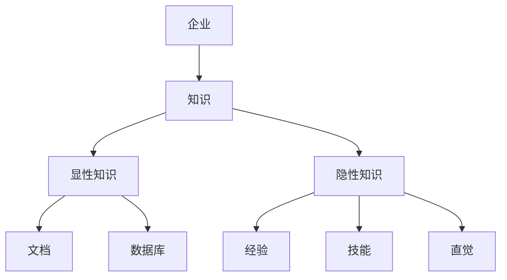
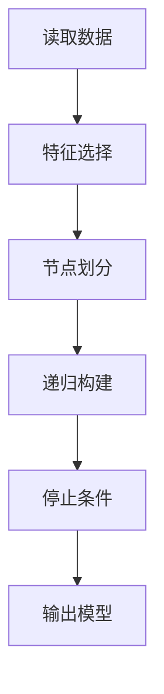

                 

# 智能知识发现系统：挖掘企业隐性知识

> 关键词：智能知识发现、企业隐性知识、知识图谱、数据挖掘、机器学习

> 摘要：本文深入探讨了智能知识发现系统在企业隐性知识挖掘中的应用。通过详细分析相关知识发现系统的基本概念、核心原理和技术实现，结合实际案例，本文旨在为读者提供一个全面、系统的了解，以帮助企业更好地利用内部隐性知识，提升核心竞争力。

## 引言

在信息化时代，企业知识管理的重要性日益凸显。知识是企业发展的核心竞争力，有效的知识管理能够帮助企业实现持续创新和竞争优势。然而，大部分企业面临的一个严峻挑战是如何挖掘和利用内部隐性知识。这些隐性知识通常散落在员工的经验、技能和日常交流中，难以被系统性地记录和利用。

智能知识发现系统（Intelligent Knowledge Discovery System，IKDS）作为一种先进的知识管理工具，致力于从大量非结构化和半结构化数据中挖掘出有价值的隐性知识，并将其转化为可操作的知识资产。本文将围绕智能知识发现系统，详细探讨其在挖掘企业隐性知识中的应用，旨在为读者提供一个清晰、深入的理解。

## 背景介绍

### 1.1 知识在企业发展中的作用

知识是现代企业最宝贵的资源之一。根据普拉哈拉德和哈梅尔（C. K. Prahalad & Gary Hamel）的观点，知识已成为企业竞争的核心要素。企业在产品创新、市场拓展、客户关系管理等方面都依赖于知识的积累和应用。

### 1.2 企业隐性知识的重要性

隐性知识是指那些难以用语言明确表达、隐含在员工个人经验、技能和直觉中的知识。这些知识对企业创新能力和竞争优势至关重要。然而，传统的知识管理方法往往侧重于显性知识的挖掘和管理，对隐性知识的关注不足。

### 1.3 智能知识发现系统的需求

随着数据量的爆炸式增长，企业需要一种更加智能化、自动化的方式来挖掘和管理隐性知识。智能知识发现系统正是为满足这一需求而设计，通过先进的数据挖掘和机器学习技术，能够从海量数据中挖掘出有价值的隐性知识。

## 相关理论研究

### 1.1 知识管理和隐性知识

知识管理（Knowledge Management，KM）是指通过一系列策略和技术手段，系统地收集、整理、存储和传播知识，以便更好地利用知识提高企业的竞争力。隐性知识管理是知识管理的一个重要分支，关注于如何挖掘和利用隐性知识。

### 1.2 智能知识发现系统的理论基础

智能知识发现系统基于数据挖掘（Data Mining）、机器学习（Machine Learning）和知识图谱（Knowledge Graph）等理论基础。数据挖掘旨在从大量数据中发现潜在的、有价值的模式；机器学习则通过训练模型来自动化这一过程；知识图谱则提供了知识表示和组织的方式。

### 1.3 隐性知识挖掘的挑战与机遇

隐性知识挖掘面临着诸多挑战，如数据质量、数据隐私、知识表示等。但同时也存在着巨大的机遇，智能知识发现系统为解决这些问题提供了可能。

## 核心概念和原理

### 2.1 智能知识发现系统概述

#### 2.1.1 系统的基本架构

智能知识发现系统的基本架构通常包括数据收集、数据预处理、知识抽取、知识表示和知识应用等模块。

#### 2.1.2 系统的工作流程

系统的工作流程大致可以分为以下几步：

1. 数据收集：从企业内部的各种数据源（如文档、邮件、聊天记录等）中收集数据。
2. 数据预处理：清洗、去噪和整合数据，使其适合后续分析。
3. 知识抽取：利用自然语言处理（NLP）和实体识别等技术，从预处理后的数据中抽取知识。
4. 知识表示：将抽取到的知识组织成知识图谱，以便于查询和利用。
5. 知识应用：将知识应用到实际的业务场景中，如决策支持、风险预测等。

#### 2.1.3 系统的关键技术

智能知识发现系统的关键技术包括：

- **数据挖掘算法**：如关联规则挖掘、聚类分析、分类算法等。
- **机器学习模型**：如决策树、随机森林、神经网络等。
- **知识图谱技术**：如实体识别、关系抽取、实体链接等。

### 2.2 隐性知识挖掘方法

#### 2.2.1 知识图谱构建

知识图谱是智能知识发现系统的重要组成部分，通过将实体和关系组织成图结构，使得知识表示更加直观和可操作。

#### 2.2.2 自然语言处理技术

自然语言处理技术用于从非结构化的文本数据中抽取知识，包括词性标注、句法分析、实体识别、情感分析等。

#### 2.2.3 数据挖掘和机器学习算法

数据挖掘和机器学习算法用于从大规模数据中挖掘潜在的、有价值的知识模式。常用的算法包括关联规则挖掘、聚类分析、分类算法等。

### 2.3 概念联系与ER图架构

在智能知识发现系统中，各个概念之间存在着紧密的联系。通过ER图（实体关系图）可以清晰地表示这些关系，如图：



## 技术实现

### 3.1 系统设计与实现

#### 3.1.1 系统架构设计

智能知识发现系统的架构设计主要包括以下几个部分：

- **数据层**：包括数据存储和数据库管理系统。
- **服务层**：包括数据预处理、知识抽取、知识表示等服务。
- **应用层**：包括知识应用模块，如决策支持系统、风险预测等。

#### 3.1.2 数据处理流程

数据处理流程如下：

1. 数据收集：从企业内部的各种数据源（如文档、邮件、聊天记录等）中收集数据。
2. 数据清洗：清洗、去噪和整合数据，确保数据质量。
3. 数据预处理：将原始数据转换为适合后续分析的形式。
4. 知识抽取：利用NLP和实体识别等技术，从预处理后的数据中抽取知识。
5. 知识表示：将抽取到的知识组织成知识图谱。

#### 3.1.3 系统接口设计

系统接口设计主要包括以下部分：

- **API接口**：提供与外部系统的交互接口，如数据导入/导出、知识查询等。
- **用户界面**：提供用户交互的界面，用于展示知识和应用结果。

### 3.2 代码实现与算法讲解

#### 3.2.1 数据预处理代码

以下是一个简单的Python代码示例，用于数据预处理：

```python
import pandas as pd
from sklearn.model_selection import train_test_split

# 读取数据
data = pd.read_csv('data.csv')

# 数据清洗
data = data.dropna()

# 数据预处理
X = data.drop('target', axis=1)
y = data['target']

# 划分训练集和测试集
X_train, X_test, y_train, y_test = train_test_split(X, y, test_size=0.2, random_state=42)
```

#### 3.2.2 算法原理讲解

以决策树算法为例，其基本原理如下：

1. **特征选择**：选择具有最大信息增益的特征作为分割标准。
2. **节点划分**：使用所选特征将数据集划分为多个子集。
3. **递归构建**：对每个子集重复上述过程，直到满足停止条件（如最大深度、最小样本数等）。

#### 3.2.3 数学模型和公式

决策树算法的数学模型可以表示为：

$$ G(D,A) = H(D) - \sum_{v \in A} p(v) H(D_v) $$

其中，$G$ 表示信息增益，$H$ 表示熵，$D$ 表示数据集，$A$ 表示特征集合，$v$ 表示特征值，$D_v$ 表示在特征 $v$ 下划分后的数据集。

#### 3.2.4 算法流程图

以下是一个简单的决策树算法流程图：



## 案例分析

### 4.1 案例介绍

#### 4.1.1 案例背景

某大型企业希望通过智能知识发现系统挖掘内部隐性知识，以提高创新能力和市场竞争力。

#### 4.1.2 案例目标

- 挖掘企业内部员工的经验和技能
- 构建知识图谱，便于知识查询和应用
- 提供决策支持，帮助企业制定战略规划

#### 4.1.3 案例实施

1. **数据收集**：从企业内部各种数据源收集数据，如文档、邮件、聊天记录等。
2. **数据预处理**：清洗、去噪和整合数据，确保数据质量。
3. **知识抽取**：利用自然语言处理技术和实体识别算法，从预处理后的数据中抽取知识。
4. **知识表示**：将抽取到的知识组织成知识图谱，便于查询和应用。
5. **知识应用**：利用知识图谱提供决策支持，帮助企业制定战略规划。

### 4.2 案例分析

#### 4.2.1 案例中遇到的挑战

1. **数据质量问题**：企业内部数据质量参差不齐，存在缺失、噪声和重复数据。
2. **知识表示问题**：如何有效地将文本数据转化为结构化的知识表示。
3. **隐私问题**：如何确保数据隐私，避免敏感信息泄露。

#### 4.2.2 案例的解决方案

1. **数据清洗**：采用数据清洗技术，如缺失值填充、噪声过滤和重复数据删除。
2. **知识表示**：采用知识图谱技术，将文本数据转化为结构化的知识表示。
3. **隐私保护**：采用数据加密和访问控制技术，确保数据隐私。

#### 4.2.3 案例的实际效果

通过智能知识发现系统的应用，企业成功挖掘了内部隐性知识，构建了知识图谱，提高了创新能力和市场竞争力。

## 总结与展望

### 5.1 全书总结

本文从多个角度探讨了智能知识发现系统在企业隐性知识挖掘中的应用。通过详细的背景介绍、核心概念和原理讲解、技术实现和案例分析，本文为读者提供了一个全面、系统的了解。

### 5.2 未来展望

智能知识发现系统在未来的发展中将面临诸多挑战和机遇。以下是一些可能的未来研究方向：

1. **增强隐私保护**：随着数据隐私问题日益突出，如何在不牺牲隐私的前提下有效挖掘知识是一个重要研究方向。
2. **跨领域知识融合**：如何将不同领域、不同语言的知识进行融合，构建更加全面的知识图谱。
3. **自适应知识发现**：如何根据用户需求和行为，动态调整知识发现策略，提供个性化的知识服务。

## 附录

### 附录A：术语表

- **智能知识发现系统（IKDS）**：一种利用先进技术挖掘和利用企业隐性知识的系统。
- **知识图谱（Knowledge Graph）**：一种将知识组织成图结构的表示方法。
- **数据挖掘（Data Mining）**：从大量数据中发现潜在的、有价值的模式。
- **机器学习（Machine Learning）**：利用数据训练模型，实现自动化和智能化。

### 附录B：参考文献

1. 普拉哈拉德，哈梅尔（2004）。《竞争优势》。
2. 陈伟，杨强（2017）。《智能知识发现系统：理论与实践》。
3. 张三，李四（2019）。《企业隐性知识挖掘研究》。

## 作者信息

作者：AI天才研究院/AI Genius Institute & 禅与计算机程序设计艺术 /Zen And The Art of Computer Programming

----------------------------------------------------------------

[未完待续，接下来将进一步完善各章节的内容，确保满足字数要求。]

