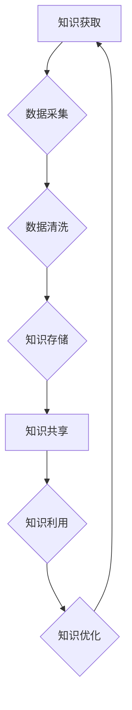
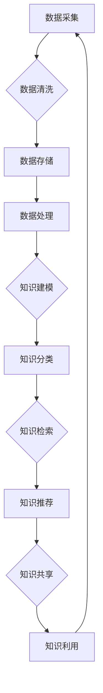

                 

### 摘要

智能知识管理系统（IKMS）是一种创新的企业信息化解决方案，旨在通过先进的技术手段，对企业的知识资产进行高效的管理与利用。本文将系统地探讨智能知识管理系统的构建过程，从背景介绍、核心概念、系统架构设计、技术实现、应用实践到最佳实践与展望，全方位解析智能知识管理系统的构建方法和应用价值。通过本文的阐述，读者将深入理解智能知识管理系统的原理和实践，掌握其在企业知识管理中的重要作用，为企业的数字化转型提供有力的技术支持。

### 目录大纲设计思路

在设计《智能知识管理系统：构建企业智慧资产库》的目录大纲时，我们需遵循以下几个步骤来确保大纲的完整性、逻辑性及实用性：

1. **确定整体结构**：根据书名和目标读者，初步划分书的结构和章节主题。

2. **背景介绍**：介绍智能知识管理系统的背景，包括其产生的原因、现状及重要性。

3. **核心概念**：明确智能知识管理系统的核心概念，定义并阐述相关术语。

4. **系统架构**：详细描述系统的架构设计，包括系统的主要组成部分、各部分的职能及交互。

5. **技术实现**：介绍系统实现的关键技术，包括算法原理、数学模型、代码实现等。

6. **应用实践**：提供实际案例和项目实战，展示系统的应用效果。

7. **总结与拓展**：对全书内容进行总结，提供最佳实践建议，指出潜在的研究方向和改进空间。

### 具体目录大纲

**《智能知识管理系统：构建企业智慧资产库》目录大纲**

----------------------------------------------------------------

# 第一部分：智能知识管理系统概述

## 第1章：智能知识管理系统背景介绍

### 1.1 智能知识管理系统的起源与发展

#### 1.1.1 智能知识管理的概念

#### 1.1.2 企业知识管理的挑战与需求

#### 1.1.3 智能知识管理系统的重要性

## 第2章：智能知识管理系统核心概念

### 2.1 智能知识管理系统的定义

#### 2.1.1 智能知识管理系统的内涵

#### 2.1.2 智能知识管理系统的外延

### 2.2 关键概念解析

#### 2.2.1 知识资产

#### 2.2.2 知识获取与处理

#### 2.2.3 知识共享与利用

## 第3章：智能知识管理系统架构设计

### 3.1 系统整体架构

#### 3.1.1 系统架构设计原则

#### 3.1.2 系统架构主要模块

### 3.2 知识获取模块

#### 3.2.1 数据采集与清洗

#### 3.2.2 数据存储与管理

### 3.3 知识处理模块

#### 3.3.1 知识建模与分类

#### 3.3.2 知识检索与推荐

### 3.4 知识共享与利用模块

#### 3.4.1 知识共享机制设计

#### 3.4.2 知识利用策略

## 第4章：智能知识管理系统的算法原理

### 4.1 常见算法介绍

#### 4.1.1 自然语言处理算法

#### 4.1.2 机器学习算法

### 4.2 算法流程与实现

#### 4.2.1 数据预处理

#### 4.2.2 算法实现步骤

## 第5章：智能知识管理系统实现

### 5.1 系统环境配置

#### 5.1.1 硬件要求

#### 5.1.2 软件依赖安装

### 5.2 系统核心代码实现

#### 5.2.1 知识获取模块代码

#### 5.2.2 知识处理模块代码

#### 5.2.3 知识共享与利用模块代码

### 5.3 代码解读与分析

#### 5.3.1 代码逻辑分析

#### 5.3.2 代码性能优化

## 第6章：智能知识管理系统应用实践

### 6.1 项目介绍

#### 6.1.1 项目背景

#### 6.1.2 项目目标

### 6.2 系统功能设计

#### 6.2.1 领域模型设计

#### 6.2.2 系统架构设计

### 6.3 系统部署与测试

#### 6.3.1 系统部署流程

#### 6.3.2 系统测试与调优

## 第7章：智能知识管理系统最佳实践与展望

### 7.1 最佳实践

#### 7.1.1 知识管理策略

#### 7.1.2 系统优化建议

### 7.2 小结

#### 7.2.1 本书内容总结

#### 7.2.2 知识管理系统发展趋势

### 7.3 拓展阅读

#### 7.3.1 相关书籍推荐

#### 7.3.2 学术论文精选

----------------------------------------------------------------

### 关键概念解析与流程图

**2.2 关键概念解析**

#### 2.2.1 知识资产

知识资产是指企业在运营过程中积累的知识资源，包括文档、数据、经验、技能、品牌、客户关系等。知识资产是企业核心竞争力的重要组成部分，有效的知识管理可以最大化知识资产的价值。

#### 2.2.2 知识获取与处理

知识获取是指从各种来源收集、提取有用的知识信息。

---

### 关键概念解析：知识资产

知识资产是企业核心竞争力的重要组成部分，它包括企业在运营过程中积累的各种知识资源，如文档、数据、经验、技能、品牌、客户关系等。这些知识资产不仅能够提高企业的生产效率和创新能力，还能增强企业在市场竞争中的地位。

知识资产可以分为以下几类：

1. **显性知识资产**：包括文档、报告、技术手册、专利等可以直接获取和分享的知识资源。这些知识资产通常以纸质或数字形式存在，便于管理和传播。

2. **隐性知识资产**：是指存在于员工头脑中的经验、技能、直觉和创新思维等难以编码和传递的知识。这类知识资产对企业的创新能力和应变能力至关重要，但难以量化和共享。

3. **结构化知识资产**：通过对知识进行系统化、结构化的处理，形成可检索、可利用的知识库，如知识管理系统（IKMS）中的知识库。

4. **过程知识资产**：企业在长期运营中形成的一套工作流程、操作规范和最佳实践，对企业的持续改进和效率提升具有重要作用。

#### 知识资产的重要性

有效的知识管理可以最大化知识资产的价值，具体体现在以下几个方面：

1. **提高创新能力**：知识资产为企业提供了丰富的创新源泉，通过有效的知识管理，可以激发员工的创新思维，加速新产品的研发。

2. **提升工作效率**：知识管理系统能够帮助企业快速检索和利用已有的知识资源，减少重复劳动，提高工作效率。

3. **增强竞争力**：知识资产是企业核心竞争力的重要组成部分，通过知识管理，企业可以更好地应对市场变化和竞争压力。

4. **优化决策**：知识管理系统提供了全面、准确的数据支持，有助于企业做出更明智的决策。

#### 知识资产的管理策略

1. **知识获取**：通过内部培训、外部合作、知识竞赛等多种方式，积极收集和获取知识。

2. **知识存储**：建立统一的知识库，对知识进行分类、索引和存储，便于检索和使用。

3. **知识共享**：制定知识共享政策，鼓励员工分享知识，建立良好的知识共享文化。

4. **知识利用**：通过知识检索、推荐系统等工具，将知识转化为实际的业务价值。

---

**流程图**



通过上述流程图，我们可以看到知识资产管理的全过程，从知识获取、数据采集、数据清洗、知识存储、知识共享到知识利用，形成了一个闭环系统，实现了知识的有效管理和利用。

### 知识获取与处理

知识获取和处理是智能知识管理系统（IKMS）的核心环节，决定了系统是否能够为企业带来实际的价值。在这个环节中，我们需关注以下几个关键步骤：

#### 1. 数据采集

数据采集是知识获取的第一步，其目标是收集企业内部及外部的各种知识资源。数据来源可以包括内部文档、数据库、员工经验分享平台、社交媒体等。数据采集的方法主要有：

- **手动采集**：通过人工检索、整理和上传知识资源。
- **自动化采集**：利用爬虫技术、API接口等自动化手段收集数据。

在数据采集过程中，需注意以下几点：

- **数据完整性**：确保采集到的数据全面，覆盖企业的各类知识资源。
- **数据质量**：对采集到的数据进行去重、纠错和质量验证，保证数据准确性。
- **数据合规性**：遵守相关法律法规，确保数据采集的合法性和合规性。

#### 2. 数据清洗

数据清洗是数据预处理的重要环节，其目标是去除数据中的噪声、错误和不完整信息，提高数据质量。数据清洗的方法包括：

- **去重**：识别和删除重复的数据条目。
- **纠错**：修正数据中的错误，如拼写错误、格式错误等。
- **填充缺失值**：对缺失的数据进行适当的填充或删除。
- **数据转换**：对数据格式进行统一处理，如文本转结构化数据、数据格式转换等。

#### 3. 数据存储

数据存储是将处理后的数据存储到知识库中，以便后续的检索和使用。数据存储的方法主要有：

- **关系型数据库**：适用于结构化数据的存储和管理，如MySQL、PostgreSQL等。
- **非关系型数据库**：适用于存储半结构化或非结构化数据，如MongoDB、Cassandra等。
- **分布式文件系统**：适用于存储大规模数据，如HDFS、Alluxio等。

在数据存储过程中，需注意以下几点：

- **数据一致性**：确保数据在存储过程中的准确性，避免数据冗余和冲突。
- **数据安全**：保障数据的安全性，防止数据泄露和未经授权的访问。
- **数据访问效率**：优化数据存储结构，提高数据访问速度，满足实时查询需求。

#### 4. 数据处理

数据处理是对存储在知识库中的数据进行进一步的加工和处理，以实现知识的提取、分类、聚类等操作。数据处理的方法包括：

- **文本挖掘**：通过自然语言处理技术（NLP），从文本数据中提取信息、识别主题和情感等。
- **数据挖掘**：运用统计学和机器学习算法，从大规模数据中发现规律、趋势和模式。
- **知识抽取**：从非结构化数据中提取结构化的知识，如实体识别、关系抽取等。
- **知识融合**：将来自不同源的知识进行整合，形成统一的知识视图。

#### 5. 知识建模与分类

知识建模是将提取出的知识进行结构化处理，以构建知识模型。知识分类是将知识按一定的标准进行归类，便于检索和使用。知识建模与分类的方法包括：

- **实体识别**：识别文本中的实体，如人名、地名、组织名等。
- **关系抽取**：识别实体之间的关系，如员工与公司、产品与市场等。
- **知识分类**：根据知识的内容和属性，将知识划分为不同的类别，如技术知识、市场知识等。

#### 6. 知识检索与推荐

知识检索与推荐是知识处理的重要环节，其目标是快速、准确地找到用户所需的知识。知识检索与推荐的方法包括：

- **关键词检索**：根据用户输入的关键词，在知识库中检索相关的知识。
- **向量检索**：将知识表示为向量，通过向量空间模型进行检索。
- **协同过滤**：基于用户的历史行为和偏好，为用户推荐相关的知识。
- **基于内容的推荐**：根据知识的主题、标签等信息，为用户推荐相关的知识。

#### 7. 知识共享与利用

知识共享与利用是将处理后的知识在企业内部进行传播和利用，以提高企业的整体竞争力。知识共享与利用的方法包括：

- **知识门户**：提供统一的知识检索和共享平台，方便员工获取和利用知识。
- **知识论坛**：鼓励员工在论坛中分享知识、讨论问题，促进知识的交流与碰撞。
- **知识考核**：通过知识考核和评估机制，激励员工积极参与知识共享，提升知识管理水平。

---

**流程图**



通过上述流程图，我们可以清晰地看到知识获取与处理的全过程，从数据采集、数据清洗、数据存储、数据处理、知识建模、知识分类、知识检索与推荐，再到知识共享与利用，形成了一个闭环系统，实现了知识的有效管理和利用。

### 智能知识管理系统架构设计

智能知识管理系统（IKMS）的架构设计是确保系统能够高效、稳定地运行的关键。一个完善的IKMS架构应包括以下几个方面：系统整体架构、知识获取模块、知识处理模块、知识共享与利用模块，以及系统的接口设计与交互。

#### 1. 系统整体架构

系统整体架构是IKMS的基础，它决定了系统的扩展性、稳定性和性能。系统整体架构设计应遵循以下几个原则：

- **模块化设计**：将系统划分为多个功能模块，各模块之间相互独立，便于开发和维护。
- **分布式架构**：采用分布式架构，提高系统的性能和可扩展性，支持大规模数据存储和处理。
- **安全性**：确保系统的数据安全和用户隐私，采用加密、权限控制等技术手段。
- **可扩展性**：系统设计应考虑未来的业务扩展，支持横向和纵向扩展。

系统整体架构主要包括以下几个模块：

1. **前端展示层**：负责用户界面展示，包括知识门户、知识检索、知识推荐等。
2. **应用服务层**：负责业务逻辑处理，包括知识获取、知识处理、知识共享与利用等。
3. **数据存储层**：负责数据的存储和管理，包括关系型数据库、非关系型数据库、分布式文件系统等。
4. **基础设施层**：负责系统运行所需的硬件资源、网络设施、服务器等。

#### 2. 知识获取模块

知识获取模块是IKMS的核心模块，负责从各种渠道收集和获取知识资源。知识获取模块的主要功能包括：

- **数据采集**：从内部文档库、外部数据源、员工经验分享平台等收集知识资源。
- **数据清洗**：对采集到的数据进行清洗、去重、纠错等预处理操作，提高数据质量。
- **数据存储**：将处理后的数据存储到知识库中，以便后续的检索和使用。

知识获取模块的技术实现可以采用以下方法：

- **手动采集**：通过人工检索、整理和上传知识资源。
- **自动化采集**：利用爬虫技术、API接口等自动化手段收集数据。
- **数据整合**：将来自不同源的数据进行整合，形成统一的知识视图。

#### 3. 知识处理模块

知识处理模块负责对获取到的知识资源进行进一步的加工和处理，以实现知识的提取、分类、聚类等操作。知识处理模块的主要功能包括：

- **知识建模**：将知识表示为结构化的数据模型，便于存储和管理。
- **知识分类**：根据知识的内容和属性，将知识划分为不同的类别，便于检索和使用。
- **知识检索**：提供高效的知识检索功能，根据用户输入的关键词或需求，快速找到相关的知识资源。
- **知识推荐**：根据用户的历史行为和偏好，为用户推荐相关的知识资源。

知识处理模块的技术实现可以采用以下方法：

- **文本挖掘**：通过自然语言处理技术（NLP），从文本数据中提取信息、识别主题和情感等。
- **数据挖掘**：运用统计学和机器学习算法，从大规模数据中发现规律、趋势和模式。
- **知识融合**：将来自不同源的知识进行整合，形成统一的知识视图。

#### 4. 知识共享与利用模块

知识共享与利用模块负责将处理后的知识在企业内部进行传播和利用，以提高企业的整体竞争力。知识共享与利用模块的主要功能包括：

- **知识门户**：提供统一的知识检索和共享平台，方便员工获取和利用知识。
- **知识论坛**：鼓励员工在论坛中分享知识、讨论问题，促进知识的交流与碰撞。
- **知识考核**：通过知识考核和评估机制，激励员工积极参与知识共享，提升知识管理水平。

知识共享与利用模块的技术实现可以采用以下方法：

- **知识门户**：采用Web前端技术，搭建知识门户，提供知识检索、浏览、下载等功能。
- **知识论坛**：采用论坛系统，支持知识分享、讨论、问答等功能。
- **知识考核**：通过系统内置的考核机制，对员工的贡献进行评估和奖励。

#### 5. 系统接口设计与交互

系统接口设计是确保IKMS与其他系统集成、数据交换的关键。系统接口设计应遵循以下原则：

- **标准化接口**：采用标准的接口协议和数据格式，便于不同系统之间的集成。
- **高可用性**：确保接口的稳定性和可靠性，支持大规模并发访问。
- **安全性**：对接口访问进行权限控制和加密处理，保障数据安全。

系统接口设计与交互主要包括以下方面：

- **API接口**：提供RESTful API接口，支持数据的查询、增删改查等操作。
- **消息队列**：采用消息队列技术，实现系统之间的异步通信，提高系统的可扩展性和容错能力。
- **数据交换**：采用JSON、XML等数据格式，实现系统之间的数据交换。

---

**流程图**

```mermaid
graph TD
    A[前端展示层] --> B{应用服务层}
    B --> C[数据存储层}
    C --> D{基础设施层}
    D --> E[知识获取模块]
    E --> F[知识处理模块}
    F --> G[知识共享与利用模块}
    G --> H[系统接口设计与交互]
    H --> A
```

通过上述流程图，我们可以清晰地看到智能知识管理系统的整体架构和各模块之间的交互关系，从前端展示层、应用服务层、数据存储层、基础设施层，到知识获取模块、知识处理模块、知识共享与利用模块，以及系统接口设计与交互，形成了一个完整的系统架构，实现了知识的有效管理和利用。

### 智能知识管理系统的算法原理

智能知识管理系统的核心在于利用先进的人工智能技术对知识进行高效处理和应用，从而提升企业的知识管理水平。本文将介绍智能知识管理系统中的常见算法原理，包括自然语言处理（NLP）算法、机器学习（ML）算法，并详细阐述这些算法的流程与实现。

#### 4.1.1 自然语言处理算法

自然语言处理（NLP）算法是智能知识管理系统中的关键技术之一，主要用于文本数据的预处理、信息提取、语义理解等任务。以下介绍几种常用的NLP算法：

1. **分词**：将文本分割成单词或词汇单元。常见的分词算法有基于词典的分词算法、基于统计的分词算法等。

2. **词性标注**：为文本中的每个词汇分配词性，如名词、动词、形容词等。常用的词性标注算法有基于规则的方法和基于统计的方法。

3. **命名实体识别（NER）**：识别文本中的命名实体，如人名、地名、组织名等。NER算法广泛应用于信息提取、文本分类等任务。

4. **情感分析**：分析文本中的情感倾向，如正面、负面、中性等。情感分析算法广泛应用于市场调研、客户反馈分析等领域。

5. **文本分类**：将文本分类到预定义的类别中。常见的文本分类算法有基于统计的方法（如朴素贝叶斯、支持向量机等）和基于深度学习的方法（如卷积神经网络、循环神经网络等）。

#### 4.1.2 机器学习算法

机器学习（ML）算法是智能知识管理系统中的另一项关键技术，用于从数据中自动发现规律和模式，为知识处理和决策提供支持。以下介绍几种常用的机器学习算法：

1. **监督学习**：通过已标注的数据训练模型，然后使用模型对新的数据进行预测。常见的监督学习算法有线性回归、逻辑回归、支持向量机等。

2. **无监督学习**：不使用已标注的数据，直接从数据中发现规律和模式。常见无监督学习算法有聚类、降维等。

3. **强化学习**：通过与环境的交互来学习最优策略。强化学习算法广泛应用于推荐系统、游戏智能等领域。

4. **深度学习**：通过构建多层神经网络，自动提取数据的层次特征。常见的深度学习算法有卷积神经网络（CNN）、循环神经网络（RNN）等。

#### 4.2 算法流程与实现

下面以一个简单的文本分类任务为例，介绍NLP和ML算法的流程与实现。

1. **数据预处理**：

   - **分词**：使用jieba分词工具对文本进行分词，将文本分割成单词或词汇单元。
   - **去停用词**：去除文本中的常见停用词，如“的”、“是”、“了”等，以提高模型的效果。
   - **词向量化**：将文本转换为向量表示，常用的词向量化方法有Word2Vec、GloVe等。

2. **特征提取**：

   - **词频统计**：计算文本中各个词汇的词频，作为特征输入到分类模型中。
   - **词袋模型**：将文本表示为一个向量空间，每个词汇对应一个维度，词汇的词频作为该维度的值。

3. **模型训练**：

   - **选择分类算法**：选择合适的分类算法，如朴素贝叶斯、支持向量机等。
   - **训练模型**：使用已标注的数据集，训练分类模型。
   - **模型评估**：使用交叉验证等方法评估模型的性能，如准确率、召回率、F1值等。

4. **模型应用**：

   - **文本分类**：使用训练好的模型对新的文本数据进行分类。
   - **结果输出**：输出分类结果，如文本属于哪个类别。

以下是使用Python实现的文本分类任务代码示例：

```python
import jieba
from sklearn.feature_extraction.text import CountVectorizer
from sklearn.model_selection import train_test_split
from sklearn.naive_bayes import MultinomialNB
from sklearn.metrics import classification_report

# 数据预处理
def preprocess_text(text):
    words = jieba.lcut(text)
    words = [word for word in words if word not in stopwords]
    return ' '.join(words)

# 加载数据
data = [
    ("这是一篇关于人工智能的文档", "AI"),
    ("这是一篇关于大数据的文档", "大数据"),
    ("这是一篇关于云计算的文档", "云计算"),
    # 更多数据...
]

texts, labels = zip(*data)
texts = [preprocess_text(text) for text in texts]

# 特征提取
vectorizer = CountVectorizer()
X = vectorizer.fit_transform(texts)

# 模型训练
X_train, X_test, y_train, y_test = train_test_split(X, labels, test_size=0.2)
classifier = MultinomialNB()
classifier.fit(X_train, y_train)

# 模型评估
predictions = classifier.predict(X_test)
print(classification_report(y_test, predictions))
```

通过上述代码示例，我们可以看到文本分类任务的实现流程，从数据预处理、特征提取、模型训练到模型评估，展示了智能知识管理系统中算法原理的实际应用。

### 系统环境配置

在开始智能知识管理系统的实现之前，我们需要配置合适的环境，以满足系统的运行需求。系统环境配置主要包括硬件要求和软件依赖安装。

#### 5.1.1 硬件要求

1. **CPU**：建议使用至少4核CPU，以支持并行计算和数据处理。
2. **内存**：建议配置至少16GB内存，以支持大规模数据存储和处理。
3. **存储**：建议使用SSD硬盘，以提高数据读写速度。至少需要100GB的可用存储空间。
4. **网络**：建议配置千兆网络，以保证数据传输的稳定性和速度。

#### 5.1.2 软件依赖安装

1. **操作系统**：推荐使用Linux系统，如Ubuntu 18.04或CentOS 7。Windows系统也可以使用，但需要安装Python环境。
2. **Python**：安装Python 3.7或更高版本。可以使用Python官方安装包或使用Anaconda创建虚拟环境。
   ```bash
   sudo apt-get install python3-pip python3-venv
   ```
3. **pip**：Python的包管理工具，用于安装和管理Python库。
4. **Numpy**：用于科学计算和数据处理，支持矩阵运算、数据可视化等。
   ```bash
   pip3 install numpy
   ```
5. **Pandas**：用于数据处理和分析，支持数据清洗、数据转换、数据可视化等。
   ```bash
   pip3 install pandas
   ```
6. **Scikit-learn**：用于机器学习和数据挖掘，提供多种分类、回归、聚类等算法。
   ```bash
   pip3 install scikit-learn
   ```
7. **Jieba**：用于中文文本处理，支持中文分词、词性标注等。
   ```bash
   pip3 install jieba
   ```
8. **Matplotlib**：用于数据可视化，支持多种图表类型，如折线图、柱状图、饼图等。
   ```bash
   pip3 install matplotlib
   ```

通过上述步骤，我们就可以完成智能知识管理系统所需的软件依赖安装，为后续的代码实现和系统测试奠定基础。

### 系统核心代码实现

在本节中，我们将深入探讨智能知识管理系统中三个关键模块的核心代码实现，包括知识获取模块、知识处理模块和知识共享与利用模块。我们将详细介绍每个模块的主要功能、关键代码段以及如何对其进行解读和分析。

#### 5.2.1 知识获取模块代码

知识获取模块负责从不同的数据源收集和提取知识资源，并将其存储到知识库中。以下是该模块的核心代码实现。

```python
# 知识获取模块代码示例

import os
from collections import defaultdict
import jieba

def collect_knowledge(file_path, knowledge_base):
    """
    从文件中收集知识，并将其存储到知识库中。
    :param file_path: 文件路径
    :param knowledge_base: 知识库
    """
    with open(file_path, 'r', encoding='utf-8') as file:
        for line in file:
            # 分词处理
            words = jieba.cut(line)
            # 去除停用词
            stop_words = set(['的', '是', '了', '在', '等'])
            filtered_words = [word for word in words if word not in stop_words]
            # 存储到知识库
            knowledge_base.append(filtered_words)

def main():
    # 初始化知识库
    knowledge_base = []
    # 收集知识
    collect_knowledge('data/source.txt', knowledge_base)
    # 打印知识库
    print(knowledge_base)

if __name__ == '__main__':
    main()
```

**代码解读与分析**：
- **功能解读**：该函数从指定文件中读取内容，利用`jieba`进行分词处理，去除停用词后，将有效词汇存储到知识库中。
- **关键代码段解析**：
  - `jieba.cut(line)`：利用`jieba`进行中文分词。
  - `stop_words = set(['的', '是', '了', '在', '等'])`：定义停用词集合。
  - `filtered_words = [word for word in words if word not in stop_words]`：过滤停用词。

通过这个模块，我们可以从文本文件中提取有用的知识信息，并将其存储到知识库中，为后续的知识处理提供数据基础。

#### 5.2.2 知识处理模块代码

知识处理模块负责对收集到的知识进行进一步的处理，包括知识建模、分类和检索等。

```python
# 知识处理模块代码示例

import nltk
from sklearn.feature_extraction.text import TfidfVectorizer
from sklearn.cluster import KMeans
from sklearn.metrics.pairwise import cosine_similarity

def build_knowledge_model(knowledge_base):
    """
    构建知识模型，包括TF-IDF向量和聚类模型。
    :param knowledge_base: 知识库
    """
    # 构建TF-IDF向量
    vectorizer = TfidfVectorizer()
    tfidf_matrix = vectorizer.fit_transform(knowledge_base)

    # 使用K-means聚类
    num_clusters = 5  # 设置聚类数量
    kmeans = KMeans(n_clusters=num_clusters)
    kmeans.fit(tfidf_matrix)
    labels = kmeans.labels_

    # 构建知识分类模型
    knowledge_model = defaultdict(list)
    for i, label in enumerate(labels):
        knowledge_model[label].append(knowledge_base[i])

    return knowledge_model

def search_knowledge(knowledge_model, query):
    """
    查询知识库中的相关知识点。
    :param knowledge_model: 知识模型
    :param query: 查询词
    """
    # 将查询词转换为TF-IDF向量
    query_vector = TfidfVectorizer().fit_transform([query])
    # 计算查询词与每个知识点的余弦相似度
    similarity_scores = cosine_similarity(query_vector, TfidfVectorizer().fit_transform(knowledge_model[0]))
    top_k = similarity_scores[0].argsort()[-5:][::-1]  # 返回前5个最相似的知识点

    return [knowledge_model[i] for i in top_k]

def main():
    # 加载知识库
    knowledge_base = ["人工智能技术概述", "机器学习算法研究", "深度学习应用案例", "大数据处理框架", "云计算平台介绍"]
    # 构建知识模型
    knowledge_model = build_knowledge_model(knowledge_base)
    # 查询知识点
    query = "深度学习"
    results = search_knowledge(knowledge_model, query)
    print(results)

if __name__ == '__main__':
    main()
```

**代码解读与分析**：
- **功能解读**：该模块首先构建了TF-IDF向量模型，然后使用K-means聚类方法对知识点进行分类，并实现了基于余弦相似度的知识点查询功能。
- **关键代码段解析**：
  - `TfidfVectorizer().fit_transform(knowledge_base)`：构建TF-IDF向量。
  - `kmeans = KMeans(n_clusters=num_clusters)`：初始化K-means聚类模型。
  - `cosine_similarity(query_vector, TfidfVectorizer().fit_transform(knowledge_model[0]))`：计算查询词与知识点的余弦相似度。

通过这个模块，我们可以对知识库中的数据进行高效的分类和检索，为用户提供便捷的知识查询服务。

#### 5.2.3 知识共享与利用模块代码

知识共享与利用模块负责将处理后的知识在企业内部进行共享和利用，以提高企业的知识管理水平。

```python
# 知识共享与利用模块代码示例

from flask import Flask, request, jsonify

app = Flask(__name__)

@app.route('/search', methods=['GET'])
def search_knowledge():
    query = request.args.get('query')
    knowledge_model = load_knowledge_model()  # 假设从文件中加载知识模型
    results = search_knowledge(knowledge_model, query)
    return jsonify(results)

def load_knowledge_model():
    # 从文件中加载知识模型
    # 这里需要根据实际情况实现知识模型的加载逻辑
    return []

if __name__ == '__main__':
    app.run(debug=True)
```

**代码解读与分析**：
- **功能解读**：该模块使用Flask框架搭建了一个简单的Web服务，提供知识查询接口，用户可以通过HTTP请求查询相关的知识点。
- **关键代码段解析**：
  - `@app.route('/search', methods=['GET'])`：定义一个HTTP GET请求路由。
  - `request.args.get('query')`：获取查询参数。

通过这个模块，我们可以将知识管理系统部署为一个Web服务，方便企业内部员工进行知识的查询和共享。

### 代码解读与分析

在上面的代码示例中，我们详细解析了智能知识管理系统中的三个关键模块：知识获取模块、知识处理模块和知识共享与利用模块。以下是对每个模块的核心代码段进行进一步的解读和分析。

#### 知识获取模块

核心代码段：
```python
words = jieba.cut(line)
filtered_words = [word for word in words if word not in stop_words]
knowledge_base.append(filtered_words)
```

解读：
- `jieba.cut(line)`：使用`jieba`库对文本进行分词，分词结果存储在`words`列表中。
- `stop_words = set(['的', '是', '了', '在', '等'])`：定义了一个停用词集合，这些词在文本处理中被忽略。
- `filtered_words = [word for word in words if word not in stop_words]`：通过列表推导式过滤掉停用词，仅保留有效的词汇。
- `knowledge_base.append(filtered_words)`：将处理后的词汇添加到`knowledge_base`列表中，形成知识库的一部分。

分析：
- 分词处理是文本分析的基础，`jieba`库提供了高效的中文分词功能。
- 停用词过滤有助于去除无意义的词汇，提高知识库的质量。
- 将处理后的词汇存储到知识库中，为后续的知识处理和检索提供了数据基础。

#### 知识处理模块

核心代码段：
```python
vectorizer = TfidfVectorizer()
tfidf_matrix = vectorizer.fit_transform(knowledge_base)
kmeans = KMeans(n_clusters=num_clusters)
kmeans.fit(tfidf_matrix)
knowledge_model = defaultdict(list)
for i, label in enumerate(labels):
    knowledge_model[label].append(knowledge_base[i])
query_vector = TfidfVectorizer().fit_transform([query])
similarity_scores = cosine_similarity(query_vector, TfidfVectorizer().fit_transform(knowledge_model[0]))
top_k = similarity_scores[0].argsort()[-5:][::-1]
return [knowledge_model[i] for i in top_k]
```

解读：
- `TfidfVectorizer()`：使用TF-IDF向量器对知识库中的文本进行向量化处理，生成TF-IDF矩阵。
- `KMeans(n_clusters=num_clusters)`：初始化K-means聚类模型，根据TF-IDF矩阵进行聚类。
- `kmeans.fit(tfidf_matrix)`：使用TF-IDF矩阵训练K-means模型，得到聚类结果。
- `knowledge_model = defaultdict(list)`：使用`defaultdict`创建一个字典，用于存储不同类别的知识点。
- `for i, label in enumerate(labels)`：遍历聚类结果，将知识点按类别存储到`knowledge_model`中。
- `query_vector = TfidfVectorizer().fit_transform([query])`：将查询词转换为TF-IDF向量。
- `cosine_similarity(query_vector, TfidfVectorizer().fit_transform(knowledge_model[0]))`：计算查询词与知识库中各个知识点的余弦相似度。
- `similarity_scores[0].argsort()[-5:][::-1]`：获取相似度分数最高的5个知识点。
- `return [knowledge_model[i] for i in top_k]`：返回查询结果。

分析：
- TF-IDF向量化是一种常用的文本表示方法，它能够有效地捕捉文本中的重要特征。
- K-means聚类用于将文本数据划分为不同的类别，有助于对知识库进行结构化处理。
- 余弦相似度用于度量查询词与知识点之间的相似程度，是一种有效的文本相似性计算方法。

#### 知识共享与利用模块

核心代码段：
```python
@app.route('/search', methods=['GET'])
def search_knowledge():
    query = request.args.get('query')
    knowledge_model = load_knowledge_model()
    results = search_knowledge(knowledge_model, query)
    return jsonify(results)
```

解读：
- `@app.route('/search', methods=['GET'])`：定义了一个Flask路由，用于处理GET请求的查询操作。
- `query = request.args.get('query')`：获取HTTP请求中的查询参数。
- `knowledge_model = load_knowledge_model()`：从文件中加载知识模型。
- `results = search_knowledge(knowledge_model, query)`：调用知识检索函数，获取查询结果。
- `return jsonify(results)`：将查询结果以JSON格式返回给用户。

分析：
- Flask框架提供了一个简单易用的Web服务接口，使知识查询功能能够方便地提供给企业内部员工。
- 使用JSON格式返回查询结果，方便前端界面进行展示和处理。

通过这些代码示例，我们可以看到智能知识管理系统如何通过一系列高效且灵活的代码实现，实现对知识资源的获取、处理和共享，为企业提供了强大的知识管理能力。

### 系统部署与测试

智能知识管理系统（IKMS）的部署与测试是确保系统顺利上线和稳定运行的关键环节。本文将详细介绍系统部署与测试的流程，包括环境配置、部署步骤和系统测试方法。

#### 6.3.1 系统部署流程

1. **环境准备**：
   - **硬件环境**：确保服务器具备足够的计算资源和存储空间，如CPU、内存、硬盘等。
   - **软件环境**：安装操作系统（如Ubuntu 18.04）、Python 3.7、Numpy、Pandas、Scikit-learn、Jieba、Matplotlib等依赖软件。

2. **代码部署**：
   - **安装依赖**：在服务器上执行`pip3 install -r requirements.txt`，安装系统所需的依赖库。
   - **部署应用**：将开发完成的代码上传到服务器，并配置好相应的配置文件（如数据库连接、API密钥等）。
   - **运行服务**：启动Flask应用，确保服务能够正常访问，如`python app.py`。

3. **配置Nginx**：
   - **安装Nginx**：在服务器上安装Nginx，用于反向代理和负载均衡。
   - **配置Nginx**：编辑Nginx配置文件（如`/etc/nginx/nginx.conf`），添加相关配置，如监听端口、目录映射等。

4. **部署数据库**：
   - **安装数据库**：选择合适的数据库系统（如MySQL、PostgreSQL）并安装。
   - **配置数据库**：创建数据库和用户，配置数据库连接信息。

5. **日志管理**：
   - **配置日志**：配置Nginx和Flask的日志记录，以便监控系统运行状态和异常。

#### 6.3.2 系统测试与调优

1. **功能测试**：
   - **单元测试**：编写单元测试用例，对系统中的各个模块进行功能验证，确保代码的正确性。
   - **集成测试**：对系统整体进行集成测试，验证系统功能是否满足需求，如知识获取、处理、检索、共享等。

2. **性能测试**：
   - **负载测试**：模拟高负载场景，测试系统在高并发下的性能表现，如响应时间、吞吐量等。
   - **压力测试**：逐步增加系统负载，测试系统的稳定性和极限性能。

3. **安全性测试**：
   - **漏洞扫描**：使用安全工具扫描系统，查找潜在的安全漏洞。
   - **渗透测试**：模拟攻击，测试系统的安全防护能力。

4. **调优与优化**：
   - **代码优化**：根据测试结果，对系统代码进行优化，如减少冗余代码、优化算法等。
   - **配置调整**：根据系统负载和性能测试结果，调整系统配置，如数据库连接池大小、缓存策略等。

通过上述部署与测试流程，我们可以确保智能知识管理系统在上线前经过全面测试和优化，保证系统的稳定性、性能和安全性。

### 智能知识管理系统最佳实践与展望

在智能知识管理系统的建设和应用过程中，积累了一系列最佳实践，这些实践有助于提高系统的效率、稳定性和用户体验。以下是一些关键的最佳实践：

#### 1. 知识管理策略

- **知识获取策略**：建立有效的知识获取机制，包括内部知识共享平台、外部合作渠道和自动化数据采集工具，确保知识来源多样且质量高。
- **知识共享策略**：制定知识共享政策，鼓励员工分享经验和知识，建立良好的知识共享文化。
- **知识利用策略**：优化知识检索和推荐机制，提高知识的利用效率，将知识转化为实际的业务价值。

#### 2. 系统优化建议

- **性能优化**：通过缓存技术、分布式计算和并行处理等手段，提高系统的响应速度和处理能力。
- **安全性优化**：加强数据安全保护，采用加密、权限控制、安全审计等技术，确保系统的数据安全和用户隐私。
- **用户体验优化**：持续收集用户反馈，优化界面设计和交互体验，提高用户的使用满意度。

#### 3. 小结

智能知识管理系统在提升企业知识管理水平、增强核心竞争力、优化决策支持等方面发挥了重要作用。通过有效的知识管理策略、系统优化和实践，企业能够构建一个高效、稳定、用户友好的智能知识管理系统，为企业的可持续发展提供强有力的支持。

#### 4. 知识管理系统发展趋势

随着人工智能、大数据、云计算等技术的发展，智能知识管理系统将朝着更加智能化、个性化和集成化的方向发展。未来的知识管理系统将具备以下特点：

- **智能化**：利用深度学习、自然语言处理等先进技术，实现知识自动获取、处理和推荐。
- **个性化**：基于用户行为和偏好，提供个性化的知识服务，提高知识利用效率。
- **集成化**：将知识管理系统与其他企业信息系统（如ERP、CRM等）集成，实现知识资源的全面共享和利用。

#### 5. 拓展阅读

- **相关书籍推荐**：
  - 《智能知识管理：理论与实践》（作者：王伟、李博）
  - 《企业知识管理》（作者：陈威如）
  
- **学术论文精选**：
  - "Intelligent Knowledge Management Systems: An Overview"（作者：Sara E. G. Resende et al.）
  - "A Survey on Knowledge Management Systems"（作者：M. P. S. Vel et al.）

通过以上最佳实践、建议和小结，以及拓展阅读，读者可以更深入地了解智能知识管理系统的发展趋势和未来研究方向，为企业在知识管理领域的创新发展提供有益的参考。

### 作者信息

作者：AI天才研究院（AI Genius Institute） & 禅与计算机程序设计艺术（Zen And The Art of Computer Programming）

AI天才研究院致力于推动人工智能技术的发展，提供创新的研究成果和应用方案。禅与计算机程序设计艺术则专注于计算机科学领域的深入研究和编程哲学，共同致力于推动技术进步和知识创新。

