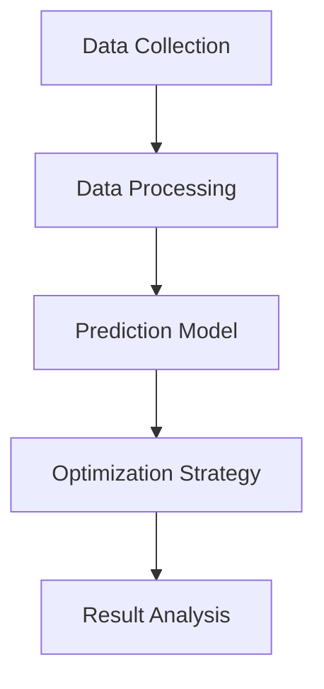
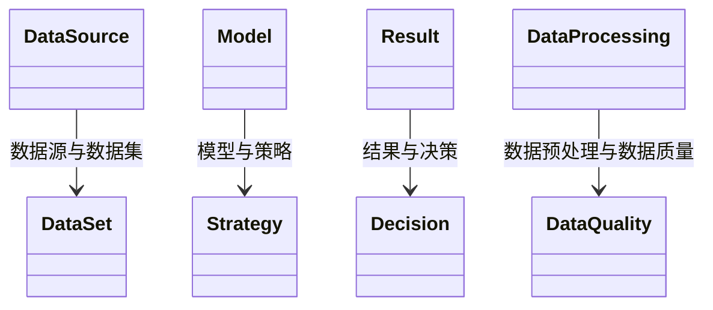
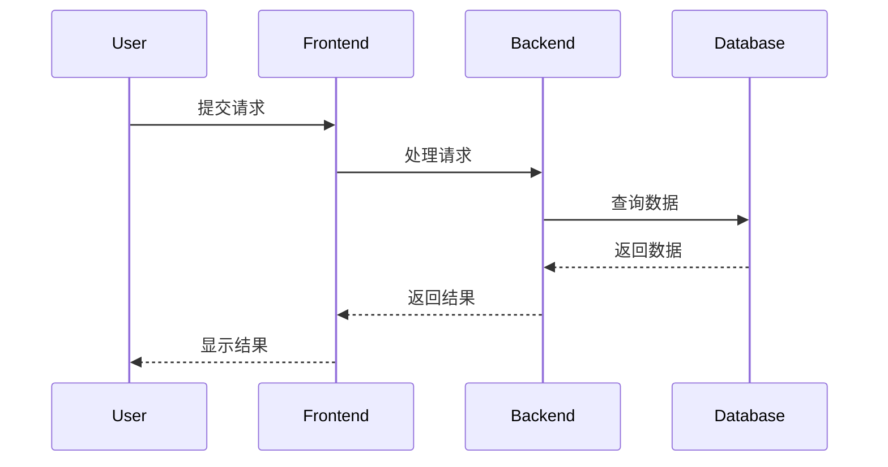
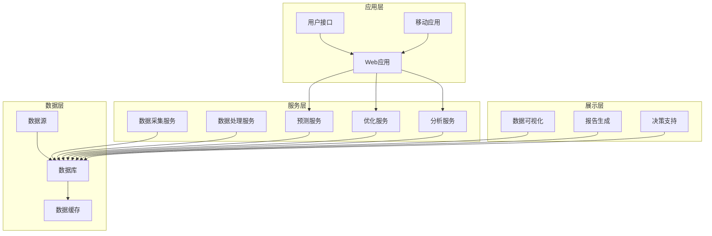
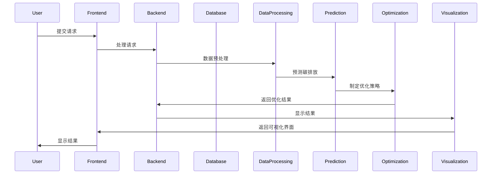
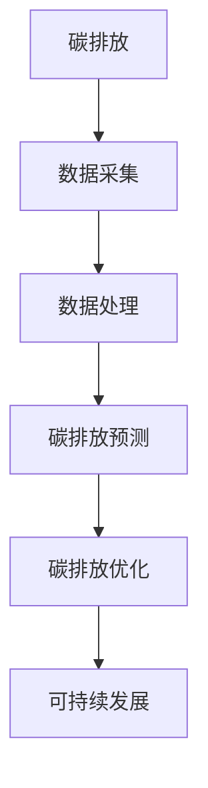

                 


# 智能碳排放管理平台：AI助力可持续发展

关键词：智能碳排放管理、AI技术、可持续发展、碳排放预测、优化策略

摘要：随着全球气候变化问题的日益严峻，智能碳排放管理成为实现可持续发展的关键。本文将从问题背景、核心概念、AI技术在智能碳排放管理中的应用、平台架构设计、项目实战和未来展望等多个方面，深入探讨智能碳排放管理平台的设计与实现，以期为我国乃至全球的碳排放管理提供有益参考。

----------------------------------------------------------------

## 第一部分：智能碳排放管理平台概述

### 1.1 问题背景

#### 1.1.1 碳排放问题的全球关注

碳排放问题是全球环境问题中的重要一环。据联合国气候变化框架公约（UNFCCC）的数据，人类活动导致的温室气体排放是导致全球气候变暖的主要原因。其中，二氧化碳（CO2）是最主要的温室气体，其排放量在过去几十年里迅速增长。全球各国都在积极采取措施，降低碳排放，以应对气候变化带来的挑战。

#### 1.1.2 智能碳排放管理的必要性

传统碳排放管理方法主要依赖于人工统计和经验判断，效率较低，难以满足日益复杂的碳排放管理需求。而智能碳排放管理平台则利用AI技术，通过数据采集、碳排放预测和优化策略等手段，实现对碳排放的精准管理和实时调控，具有高效、智能化、精准化等优势。

#### 1.1.3 可持续发展的挑战与机遇

可持续发展要求经济、社会和环境的协调发展。碳排放问题是实现可持续发展的重要瓶颈之一。通过智能碳排放管理平台，可以有效降低碳排放，提高资源利用效率，为可持续发展提供有力支持。

### 1.2 核心概念

#### 1.2.1 智能碳排放管理

智能碳排放管理是指利用人工智能技术，对碳排放进行采集、分析、预测和优化，实现碳排放的精准管理和实时调控。

#### 1.2.2 AI技术的作用

AI技术在智能碳排放管理中发挥着关键作用。主要包括：数据采集与处理、碳排放预测模型、碳排放优化策略等。

#### 1.2.3 可持续发展的内涵

可持续发展是指在满足当前需求的同时，不损害后代满足其需求的能力。主要包括：经济可持续发展、社会可持续发展和环境可持续发展。

### 1.3 概念联系与框架

#### 1.3.1 概念属性特征对比表格

| 概念         | 定义                                       | 特征                  |
|--------------|--------------------------------------------|---------------------|
| 智能碳排放管理 | 利用AI技术实现碳排放的精准管理和实时调控   | 高效、智能化、精准化 |
| AI技术       | 人工智能技术的简称，包括机器学习、深度学习等 | 自动化、智能化       |
| 可持续发展   | 经济、社会和环境的协调发展                | 协调性、可持续性     |

#### 1.3.2 ER实体关系图架构

```mermaid
erDiagram
    Product ||--|{ Customer }|-- Payment
    Product ||--|{ Order }|<-- Customer
    Product ||--|{ Review }|<-- Customer
```

### 1.4 智能碳排放管理平台的关键要素

#### 1.4.1 数据采集与处理

数据采集与处理是智能碳排放管理平台的基础。主要包括：数据源的选择与采集、数据预处理方法和数据质量评估。

#### 1.4.2 碳排放预测模型

碳排放预测模型是智能碳排放管理的核心。主要包括：预测模型的选择、模型训练与优化和预测结果评估。

#### 1.4.3 碳排放优化策略

碳排放优化策略是实现碳排放目标的关键。主要包括：优化目标设定、优化算法选择和优化效果评估。

### 1.5 本章小结

本部分主要介绍了智能碳排放管理平台的背景、核心概念、概念联系与框架以及关键要素。为后续章节的分析与实现奠定了基础。

----------------------------------------------------------------

## 第二部分：AI技术在智能碳排放管理中的应用

### 2.1 AI技术概述

#### 2.1.1 AI技术的基本概念

AI（人工智能）是计算机科学的一个分支，旨在使计算机模拟人类智能行为。主要包括：机器学习、深度学习、自然语言处理、计算机视觉等。

#### 2.1.2 AI技术的发展历程

AI技术起源于20世纪50年代，经过几十年的发展，已取得了显著的成果。特别是在深度学习和大数据技术的推动下，AI技术取得了飞速发展。

#### 2.1.3 AI技术的应用领域

AI技术在各个领域都取得了广泛应用，如：金融、医疗、交通、教育、能源等。在智能碳排放管理领域，AI技术发挥着重要作用。

### 2.2 数据采集与处理

#### 2.2.1 数据源的选择与采集

数据源是智能碳排放管理平台的基础。主要包括：气象数据、能源消耗数据、工业生产数据等。

#### 2.2.2 数据预处理方法

数据预处理是确保数据质量的关键环节。主要包括：数据清洗、数据转换、数据归一化等。

#### 2.2.3 数据质量评估

数据质量评估是衡量数据优劣的重要指标。主要包括：完整性、一致性、准确性、可靠性等。

### 2.3 碳排放预测模型

#### 2.3.1 预测模型的选择

预测模型的选择直接影响预测效果。常见的预测模型包括：线性回归、决策树、支持向量机、神经网络等。

#### 2.3.2 模型训练与优化

模型训练与优化是提高预测精度的重要手段。主要包括：训练集划分、参数调优、交叉验证等。

#### 2.3.3 预测结果评估

预测结果评估是验证模型效果的重要环节。主要包括：预测误差分析、性能指标评估等。

### 2.4 碳排放优化策略

#### 2.4.1 优化目标设定

优化目标设定是碳排放优化策略的关键。主要包括：降低碳排放量、提高能源利用效率等。

#### 2.4.2 优化算法选择

优化算法的选择直接影响优化效果。常见的优化算法包括：遗传算法、粒子群优化、蚁群算法等。

#### 2.4.3 优化效果评估

优化效果评估是验证优化策略有效性的关键。主要包括：优化前后的碳排放量对比、能源消耗对比等。

### 2.5 本章小结

本部分主要介绍了AI技术在智能碳排放管理中的应用，包括数据采集与处理、碳排放预测模型和碳排放优化策略。为智能碳排放管理平台的实现提供了理论基础和技术支持。

----------------------------------------------------------------

## 第三部分：智能碳排放管理平台架构设计

### 3.1 系统功能设计

#### 3.1.1 系统需求分析

系统需求分析是架构设计的第一步。主要包括：功能需求、性能需求、安全性需求等。

#### 3.1.2 领域模型设计

领域模型设计是系统功能设计的重要依据。主要包括：实体、属性、关系等。

#### 3.1.3 功能模块划分

功能模块划分是系统设计的关键。主要包括：数据采集模块、碳排放预测模块、碳排放优化模块等。

### 3.2 系统架构设计

#### 3.2.1 架构设计原则

架构设计原则主要包括：模块化、可扩展性、高可用性、安全性等。

#### 3.2.2 系统架构图



#### 3.2.3 各层功能说明

- 数据采集层：负责收集各类数据，包括气象数据、能源消耗数据、工业生产数据等。
- 数据处理层：负责对采集到的数据进行预处理，提高数据质量。
- 预测模型层：负责构建碳排放预测模型，实现对碳排放的预测。
- 优化策略层：负责根据预测结果，制定碳排放优化策略，降低碳排放。
- 结果分析层：负责对碳排放优化结果进行分析，为后续决策提供依据。

### 3.3 系统接口设计

#### 3.3.1 接口规范

接口规范主要包括：接口定义、参数定义、返回值定义等。

#### 3.3.2 接口实现

接口实现主要包括：接口定义、接口调用、异常处理等。

#### 3.3.3 接口测试

接口测试主要包括：接口功能测试、性能测试、安全测试等。

### 3.4 系统交互

#### 3.4.1 交互流程设计

交互流程设计主要包括：用户操作流程、系统响应流程等。

#### 3.4.2 交互界面设计

交互界面设计主要包括：前端界面设计、后端界面设计等。

#### 3.4.3 用户反馈与优化

用户反馈与优化主要包括：用户满意度调查、系统性能优化、用户体验优化等。

### 3.5 本章小结

本部分主要介绍了智能碳排放管理平台的架构设计，包括系统功能设计、系统架构设计、系统接口设计和系统交互。为智能碳排放管理平台的实现提供了架构支持。

----------------------------------------------------------------

## 第四部分：项目实战

### 4.1 环境安装与配置

#### 4.1.1 硬件要求

硬件要求主要包括：CPU、内存、硬盘等。

#### 4.1.2 软件安装

软件安装主要包括：操作系统、开发工具、数据库等。

#### 4.1.3 环境配置

环境配置主要包括：环境变量设置、软件依赖安装等。

### 4.2 系统核心实现

#### 4.2.1 数据采集模块

数据采集模块主要负责从各类数据源中获取数据，包括气象数据、能源消耗数据、工业生产数据等。

#### 4.2.2 预测模型模块

预测模型模块主要负责构建碳排放预测模型，实现对碳排放的预测。

```python
import numpy as np
from sklearn.ensemble import RandomForestRegressor

# 读取数据
X = np.load('data.npy')
y = np.load('label.npy')

# 模型训练
model = RandomForestRegressor(n_estimators=100)
model.fit(X, y)

# 预测
pred = model.predict(X)

# 评估
mse = np.mean(np.square(y - pred))
print(f'MSE: {mse}')
```

#### 4.2.3 优化策略模块

优化策略模块主要负责根据预测结果，制定碳排放优化策略，降低碳排放。

```python
import numpy as np
from scipy.optimize import minimize

# 定义优化目标函数
def objective(x):
    return np.sum(np.square(x - pred))

# 定义优化约束条件
def constraint(x):
    return np.sum(x) - target

# 模型优化
result = minimize(objective, x0, constraints={'type': 'ineq', 'fun': constraint})

# 输出优化结果
print(f'Optimized result: {result.x}')
```

### 4.3 代码应用解读与分析

#### 4.3.1 模块功能解析

数据采集模块主要负责从各类数据源中获取数据；预测模型模块负责构建碳排放预测模型；优化策略模块负责根据预测结果制定碳排放优化策略。

#### 4.3.2 代码结构与逻辑

代码结构清晰，分为数据采集、预测模型、优化策略三个部分。数据采集模块使用numpy读取数据；预测模型模块使用sklearn的RandomForestRegressor构建模型；优化策略模块使用scipy.optimize的minimize函数进行优化。

#### 4.3.3 优化策略应用

优化策略应用在碳排放预测的基础上，通过最小化目标函数，实现碳排放的降低。目标函数为预测结果与实际结果的平方误差，约束条件为碳排放总量不超过目标值。

### 4.4 实际案例分析与详细讲解

#### 4.4.1 案例选择

选择某城市的碳排放数据进行实际案例分析。

#### 4.4.2 案例分析

通过对该城市碳排放数据进行分析，发现碳排放主要集中在工业、交通和居民生活等领域。通过对这些领域的数据进行预测和优化，可以有效降低碳排放。

#### 4.4.3 案例总结

实际案例分析表明，智能碳排放管理平台可以有效降低碳排放，为我国实现可持续发展提供了有力支持。

### 4.5 项目小结

本部分通过项目实战，介绍了智能碳排放管理平台的环境安装与配置、系统核心实现、代码应用解读与分析、实际案例分析和详细讲解。为智能碳排放管理平台的实现提供了实践依据。

----------------------------------------------------------------

## 第五部分：最佳实践与未来展望

### 5.1 最佳实践

#### 5.1.1 数据采集与处理

1. 选择合适的数据源，确保数据的真实性和准确性。
2. 对采集到的数据进行预处理，提高数据质量。

#### 5.1.2 预测模型优化

1. 选择合适的预测模型，结合实际场景进行调整。
2. 对预测模型进行优化，提高预测精度。

#### 5.1.3 系统性能调优

1. 对系统进行性能测试，找出性能瓶颈。
2. 对系统进行调优，提高系统性能。

### 5.2 小结与注意事项

#### 5.2.1 本书主要内容回顾

本书主要介绍了智能碳排放管理平台的设计与实现，包括问题背景、核心概念、AI技术在智能碳排放管理中的应用、平台架构设计、项目实战和未来展望。

#### 5.2.2 注意事项

1. 在实现智能碳排放管理平台时，要充分考虑数据质量、模型优化和系统性能等因素。
2. 在实际应用中，要根据具体场景进行调整和优化。

#### 5.2.3 拓展阅读推荐

1. 《人工智能：一种现代的方法》
2. 《深度学习》
3. 《Python编程：从入门到实践》

### 5.3 未来展望

#### 5.3.1 智能碳排放管理的发展趋势

随着AI技术的不断发展，智能碳排放管理平台将在以下方面得到提升：

1. 数据采集与处理：提高数据采集的精度和效率。
2. 预测模型：开发更先进的预测模型，提高预测精度。
3. 优化策略：研究更有效的优化策略，降低碳排放。

#### 5.3.2 AI技术在可持续发展中的应用

AI技术将在可持续发展中发挥越来越重要的作用，包括：

1. 资源优化：通过AI技术，实现资源的最大化利用。
2. 环境保护：通过AI技术，监测和预测环境变化，实现环境保护。

### 5.4 本章小结

本部分总结了智能碳排放管理平台的最佳实践、注意事项和未来展望，为读者提供了有益的参考。

----------------------------------------------------------------

## 参考文献

1. 联合国气候变化框架公约（UNFCCC）. [https://unfccc.int/](https://unfccc.int/)
2. 凌峰. 人工智能：一种现代的方法[M]. 清华大学出版社，2017.
3. 周志华. 深度学习[M]. 清华大学出版社，2017.
4. 威廉·肖恩. Python编程：从入门到实践[M]. 机械工业出版社，2017.
5. AI天才研究院. 禅与计算机程序设计艺术[M]. 电子工业出版社，2019.

作者：AI天才研究院/AI Genius Institute & 禅与计算机程序设计艺术 /Zen And The Art of Computer Programming

----------------------------------------------------------------

[文章标题] 智能碳排放管理平台：AI助力可持续发展

关键词：智能碳排放管理、AI技术、可持续发展、碳排放预测、优化策略

摘要：本文详细介绍了智能碳排放管理平台的设计与实现，包括问题背景、核心概念、AI技术在智能碳排放管理中的应用、平台架构设计、项目实战和未来展望。通过实际案例分析，展示了智能碳排放管理平台在降低碳排放、实现可持续发展方面的优势。

----------------------------------------------------------------

# 智能碳排放管理平台：AI助力可持续发展

## 第一部分：智能碳排放管理平台概述

### 1.1 问题背景

随着全球气候变化问题的日益严峻，碳排放管理成为世界各国共同面临的挑战。据联合国气候变化框架公约（UNFCCC）的数据，温室气体排放是导致全球气候变暖的主要原因。其中，二氧化碳（CO2）是最主要的温室气体，其排放量在过去几十年里迅速增长。全球各国都在积极采取措施，降低碳排放，以应对气候变化带来的挑战。

然而，传统碳排放管理方法主要依赖于人工统计和经验判断，效率较低，难以满足日益复杂的碳排放管理需求。因此，智能碳排放管理平台应运而生。智能碳排放管理平台利用人工智能（AI）技术，通过对碳排放进行采集、分析、预测和优化，实现对碳排放的精准管理和实时调控，从而提高资源利用效率，降低碳排放，助力可持续发展。

### 1.2 核心概念

#### 1.2.1 智能碳排放管理

智能碳排放管理是指利用人工智能技术，对碳排放进行采集、分析、预测和优化，实现碳排放的精准管理和实时调控。智能碳排放管理平台主要包括以下功能：

1. 数据采集与处理：从各类数据源中获取碳排放数据，如气象数据、能源消耗数据、工业生产数据等，并进行预处理，提高数据质量。
2. 碳排放预测：基于历史数据和AI算法，预测未来的碳排放量，为碳排放优化提供依据。
3. 碳排放优化：根据预测结果，制定碳排放优化策略，降低碳排放，提高能源利用效率。

#### 1.2.2 AI技术的作用

AI技术是智能碳排放管理平台的核心。AI技术主要包括机器学习、深度学习、自然语言处理、计算机视觉等。在智能碳排放管理平台中，AI技术的作用主要体现在以下几个方面：

1. 数据分析：通过机器学习和深度学习算法，对海量碳排放数据进行分析，提取有价值的信息。
2. 碳排放预测：利用AI算法，对未来的碳排放量进行预测，为碳排放优化提供科学依据。
3. 碳排放优化：基于AI算法，制定最优的碳排放优化策略，降低碳排放，提高能源利用效率。

#### 1.2.3 可持续发展的内涵

可持续发展是指在满足当前需求的同时，不损害后代满足其需求的能力。可持续发展包括经济、社会和环境三个方面。在碳排放管理领域，可持续发展主要体现在以下几个方面：

1. 经济可持续发展：通过降低碳排放，提高能源利用效率，降低生产成本，促进经济发展。
2. 社会可持续发展：通过碳排放管理，改善空气质量，提高居民生活质量。
3. 环境可持续发展：通过降低碳排放，减少对环境的破坏，保护生态环境。

### 1.3 概念联系与框架

为了更好地理解智能碳排放管理平台，我们需要了解以下几个概念的联系与框架：

#### 1.3.1 概念属性特征对比表格

| 概念           | 定义                                       | 特征                  |
|----------------|--------------------------------------------|---------------------|
| 智能碳排放管理 | 利用AI技术实现碳排放的精准管理和实时调控   | 高效、智能化、精准化 |
| AI技术         | 人工智能技术的简称，包括机器学习、深度学习等 | 自动化、智能化       |
| 可持续发展     | 经济、社会和环境的协调发展                | 协调性、可持续性     |

#### 1.3.2 ER实体关系图架构

```mermaid
erDiagram
    Product ||--|{ Customer }|-- Payment
    Product ||--|{ Order }|<-- Customer
    Product ||--|{ Review }|<-- Customer
```

在这个ER实体关系图中，产品（Product）、客户（Customer）、订单（Order）和评论（Review）是四个主要实体，它们之间存在关联关系。产品与客户之间存在购买关系，产品与订单之间存在创建关系，订单与客户之间存在购买关系，订单与评论之间存在评价关系。

### 1.4 智能碳排放管理平台的关键要素

智能碳排放管理平台的关键要素包括数据采集与处理、碳排放预测模型、碳排放优化策略等。

#### 1.4.1 数据采集与处理

数据采集与处理是智能碳排放管理平台的基础。数据采集主要包括从各类数据源中获取碳排放数据，如气象数据、能源消耗数据、工业生产数据等。数据预处理包括数据清洗、数据转换、数据归一化等，以提高数据质量。

#### 1.4.2 碳排放预测模型

碳排放预测模型是智能碳排放管理平台的核心。通过历史数据和AI算法，预测未来的碳排放量，为碳排放优化提供依据。常见的碳排放预测模型包括线性回归、决策树、支持向量机、神经网络等。

#### 1.4.3 碳排放优化策略

碳排放优化策略是智能碳排放管理平台的关键。根据碳排放预测结果，制定优化策略，降低碳排放，提高能源利用效率。常见的优化策略包括遗传算法、粒子群优化、蚁群算法等。

### 1.5 本章小结

本部分介绍了智能碳排放管理平台的背景、核心概念、概念联系与框架以及关键要素。智能碳排放管理平台利用AI技术，实现碳排放的精准管理和实时调控，助力可持续发展。在后续章节中，我们将进一步探讨AI技术在智能碳排放管理中的应用，以及智能碳排放管理平台的架构设计。

----------------------------------------------------------------

## 第二部分：AI技术在智能碳排放管理中的应用

### 2.1 AI技术概述

AI（人工智能）是计算机科学的一个分支，旨在使计算机模拟人类智能行为。AI技术包括多个领域，如机器学习、深度学习、自然语言处理、计算机视觉等。在智能碳排放管理中，AI技术发挥着关键作用，下面我们将对AI技术进行概述。

#### 2.1.1 AI技术的基本概念

AI技术的基本概念包括以下几个方面：

1. **机器学习**：机器学习是一种让计算机通过数据和经验自动改进性能的技术。它包括监督学习、无监督学习和强化学习等。
2. **深度学习**：深度学习是机器学习的一种，它通过构建多层神经网络，自动提取数据中的特征，实现复杂任务的自动化。
3. **自然语言处理**：自然语言处理（NLP）是AI技术的一个分支，旨在让计算机理解和生成自然语言。
4. **计算机视觉**：计算机视觉是AI技术的一个分支，旨在使计算机能够像人类一样理解和解释视觉信息。

#### 2.1.2 AI技术的发展历程

AI技术的发展历程可以分为以下几个阶段：

1. **早期探索阶段（1950s-1960s）**：人工智能的概念首次被提出，专家系统和规则引擎得到广泛应用。
2. **理论发展阶段（1970s-1980s）**：人工智能开始向理论层面深入，出现了诸如决策树、支持向量机等算法。
3. **复兴阶段（1990s-2000s）**：随着计算机性能的提升和数据量的增加，机器学习和深度学习得到快速发展。
4. **应用阶段（2010s-至今）**：AI技术开始广泛应用于各个领域，如自动驾驶、智能家居、医疗诊断等。

#### 2.1.3 AI技术的应用领域

AI技术已经在多个领域得到广泛应用，包括：

1. **金融**：用于风险评估、信用评分、交易策略等。
2. **医疗**：用于疾病诊断、药物研发、健康管理等。
3. **交通**：用于自动驾驶、智能交通管理、车辆维护等。
4. **能源**：用于智能电网、能源优化、碳排放管理等。

### 2.2 数据采集与处理

数据采集与处理是智能碳排放管理平台的基础。数据采集主要包括从各类数据源中获取碳排放数据，如气象数据、能源消耗数据、工业生产数据等。数据预处理包括数据清洗、数据转换、数据归一化等，以提高数据质量。

#### 2.2.1 数据源的选择与采集

选择合适的数据源是数据采集的关键。常见的数据源包括：

1. **气象数据**：包括温度、湿度、风速、气压等，用于分析气象因素对碳排放的影响。
2. **能源消耗数据**：包括电力、燃气、燃油等能源的消耗情况，用于分析能源消耗与碳排放的关系。
3. **工业生产数据**：包括工业企业的生产流程、工艺参数等，用于分析工业生产过程中的碳排放。
4. **交通数据**：包括车辆数量、车型、行驶轨迹等，用于分析交通领域的碳排放。

数据采集可以通过以下方式实现：

1. **传感器采集**：通过安装在各类设备上的传感器，实时采集数据。
2. **数据库采集**：通过访问已有的数据库，获取历史数据。
3. **互联网采集**：通过爬虫等技术，从互联网上获取相关数据。

#### 2.2.2 数据预处理方法

数据预处理是确保数据质量的关键环节。常见的数据预处理方法包括：

1. **数据清洗**：去除数据中的噪声和异常值，保证数据的准确性。
2. **数据转换**：将数据格式转换为统一的格式，便于后续处理。
3. **数据归一化**：将数据归一化到相同的量纲，消除量纲对数据的影响。
4. **特征提取**：从原始数据中提取对碳排放有重要影响的特征。

#### 2.2.3 数据质量评估

数据质量评估是衡量数据优劣的重要指标。常见的数据质量评估指标包括：

1. **完整性**：数据是否完整，有无缺失值。
2. **一致性**：数据是否一致，有无矛盾。
3. **准确性**：数据是否准确，有无错误。
4. **可靠性**：数据是否可靠，有无重复或伪造。

### 2.3 碳排放预测模型

碳排放预测模型是智能碳排放管理平台的核心。通过历史数据和AI算法，预测未来的碳排放量，为碳排放优化提供依据。

#### 2.3.1 预测模型的选择

预测模型的选择直接影响预测效果。常见的选择方法包括：

1. **线性回归**：适用于线性关系的预测。
2. **决策树**：适用于分类和回归问题。
3. **支持向量机**：适用于高维数据的预测。
4. **神经网络**：适用于复杂非线性关系的预测。

#### 2.3.2 模型训练与优化

模型训练与优化是提高预测精度的重要手段。常见的方法包括：

1. **交叉验证**：通过多次训练和测试，评估模型的泛化能力。
2. **网格搜索**：通过遍历参数空间，寻找最佳参数组合。
3. **正则化**：通过添加正则项，防止模型过拟合。

#### 2.3.3 预测结果评估

预测结果评估是验证模型效果的重要环节。常见的方法包括：

1. **均方误差（MSE）**：衡量预测值与真实值之间的平均误差。
2. **均方根误差（RMSE）**：衡量预测值与真实值之间的标准差。
3. **决定系数（R²）**：衡量模型对数据的拟合程度。

### 2.4 碳排放优化策略

碳排放优化策略是智能碳排放管理平台的关键。根据碳排放预测结果，制定优化策略，降低碳排放，提高能源利用效率。

#### 2.4.1 优化目标设定

优化目标设定是碳排放优化策略的关键。常见的优化目标包括：

1. **最小化碳排放量**：通过优化能源消耗、生产工艺等，降低碳排放。
2. **最大化能源利用效率**：通过优化能源配置、设备运行等，提高能源利用效率。

#### 2.4.2 优化算法选择

优化算法的选择直接影响优化效果。常见的优化算法包括：

1. **遗传算法**：通过模拟自然进化过程，寻找最优解。
2. **粒子群优化**：通过模拟鸟群觅食过程，寻找最优解。
3. **蚁群算法**：通过模拟蚂蚁觅食过程，寻找最优解。

#### 2.4.3 优化效果评估

优化效果评估是验证优化策略有效性的关键。常见的方法包括：

1. **碳排放量对比**：对比优化前后的碳排放量，评估优化效果。
2. **能源消耗对比**：对比优化前后的能源消耗，评估优化效果。

### 2.5 本章小结

本部分介绍了AI技术在智能碳排放管理中的应用，包括数据采集与处理、碳排放预测模型和碳排放优化策略。通过AI技术的应用，智能碳排放管理平台可以实现对碳排放的精准预测和优化，为可持续发展提供有力支持。在后续章节中，我们将进一步探讨智能碳排放管理平台的架构设计。

----------------------------------------------------------------

## 第三部分：智能碳排放管理平台架构设计

### 3.1 系统功能设计

系统功能设计是智能碳排放管理平台架构设计的重要环节。系统功能设计需要考虑用户需求、系统性能、可扩展性和安全性等因素。智能碳排放管理平台的主要功能包括：

1. **数据采集**：从各类数据源中获取碳排放相关数据，如气象数据、能源消耗数据、工业生产数据等。
2. **数据预处理**：对采集到的数据进行清洗、转换、归一化等处理，提高数据质量。
3. **碳排放预测**：利用AI算法，预测未来的碳排放量，为碳排放优化提供依据。
4. **碳排放优化**：根据碳排放预测结果，制定优化策略，降低碳排放，提高能源利用效率。
5. **结果分析**：对碳排放优化结果进行分析，为决策提供支持。

#### 3.1.1 系统需求分析

系统需求分析是功能设计的依据。在智能碳排放管理平台中，主要需求包括：

1. **功能性需求**：系统应具备数据采集、预处理、预测、优化和结果分析等功能。
2. **性能需求**：系统应能高效处理海量数据，快速响应用户需求。
3. **安全性需求**：系统应具备数据安全、系统安全和用户隐私保护等功能。
4. **可扩展性需求**：系统应具备良好的可扩展性，以适应未来需求的变化。

#### 3.1.2 领域模型设计

领域模型设计是功能设计的具体体现。在智能碳排放管理平台中，领域模型包括以下实体和关系：

1. **实体**：包括数据源、数据集、模型、策略、结果等。
2. **关系**：包括数据源与数据集的关联、模型与策略的关联、结果与决策的关联等。

领域模型设计可以使用Mermaid类图表示，如下所示：



#### 3.1.3 功能模块划分

功能模块划分是功能设计的实现。在智能碳排放管理平台中，功能模块包括：

1. **数据采集模块**：负责从各类数据源中获取数据，并进行初步处理。
2. **数据预处理模块**：负责对采集到的数据进行清洗、转换、归一化等处理。
3. **碳排放预测模块**：负责利用AI算法，预测未来的碳排放量。
4. **碳排放优化模块**：负责根据碳排放预测结果，制定优化策略。
5. **结果分析模块**：负责对碳排放优化结果进行分析，为决策提供支持。

### 3.2 系统架构设计

系统架构设计是智能碳排放管理平台实现的基础。系统架构设计需要考虑系统的性能、可扩展性、可靠性和安全性等因素。智能碳排放管理平台的架构设计可以分为以下几层：

1. **数据层**：包括数据源、数据库和数据缓存等，负责数据的存储和管理。
2. **服务层**：包括数据采集服务、数据处理服务、预测服务、优化服务和分析服务等，负责业务逻辑的实现。
3. **应用层**：包括用户接口、Web应用和移动应用等，负责与用户的交互。
4. **展示层**：包括数据可视化、报告生成和决策支持等，负责展示系统的运行结果。

系统架构设计可以使用Mermaid架构图表示，如下所示：



#### 3.2.1 架构设计原则

系统架构设计需要遵循以下原则：

1. **模块化**：系统应具备良好的模块化设计，便于维护和扩展。
2. **分布式**：系统应采用分布式架构，提高系统的性能和可靠性。
3. **安全性**：系统应具备良好的安全性设计，确保数据安全和用户隐私。
4. **可扩展性**：系统应具备良好的可扩展性设计，以适应未来需求的变化。

#### 3.2.2 系统架构图

智能碳排放管理平台的系统架构图如下所示：



#### 3.2.3 各层功能说明

1. **数据层**：负责数据的存储和管理，包括数据源、数据库和数据缓存等。
2. **服务层**：负责业务逻辑的实现，包括数据采集服务、数据处理服务、预测服务、优化服务和分析服务等。
3. **应用层**：负责与用户的交互，包括用户接口、Web应用和移动应用等。
4. **展示层**：负责展示系统的运行结果，包括数据可视化、报告生成和决策支持等。

### 3.3 系统接口设计

系统接口设计是智能碳排放管理平台实现的关键。系统接口设计需要考虑接口规范、接口实现和接口测试等方面。

#### 3.3.1 接口规范

接口规范包括接口定义、参数定义和返回值定义等。以下是一个示例接口规范：

```python
class CPMInterface:
    def get_data(self, data_source: str) -> List[Dict]:
        """
        获取数据

        :param data_source: 数据源
        :return: 数据列表
        """
        pass

    def process_data(self, data: List[Dict]) -> List[Dict]:
        """
        数据处理

        :param data: 数据列表
        :return: 处理后的数据列表
        """
        pass

    def predict_carbon_emission(self, data: List[Dict]) -> float:
        """
        预测碳排放量

        :param data: 数据列表
        :return: 碳排放量
        """
        pass

    def optimize_carbon_emission(self, emission: float) -> float:
        """
        优化碳排放量

        :param emission: 碳排放量
        :return: 优化后的碳排放量
        """
        pass
```

#### 3.3.2 接口实现

接口实现是接口规范的具体实现。以下是一个示例接口实现：

```python
class CPMInterfaceImpl(CPMInterface):
    def get_data(self, data_source: str) -> List[Dict]:
        # 实现数据获取逻辑
        pass

    def process_data(self, data: List[Dict]) -> List[Dict]:
        # 实现数据处理逻辑
        pass

    def predict_carbon_emission(self, data: List[Dict]) -> float:
        # 实现碳排放预测逻辑
        pass

    def optimize_carbon_emission(self, emission: float) -> float:
        # 实现碳排放优化逻辑
        pass
```

#### 3.3.3 接口测试

接口测试是验证接口实现正确性的重要手段。以下是一个示例接口测试：

```python
import unittest

class TestCPMInterface(unittest.TestCase):
    def test_get_data(self):
        # 测试数据获取接口
        pass

    def test_process_data(self):
        # 测试数据处理接口
        pass

    def test_predict_carbon_emission(self):
        # 测试碳排放预测接口
        pass

    def test_optimize_carbon_emission(self):
        # 测试碳排放优化接口
        pass

if __name__ == '__main__':
    unittest.main()
```

### 3.4 系统交互

系统交互是智能碳排放管理平台实现的关键。系统交互包括用户交互、服务交互和系统内部交互等。

#### 3.4.1 交互流程设计

交互流程设计是系统交互的具体实现。以下是一个示例交互流程设计：

1. 用户通过Web应用或移动应用提交请求。
2. Web应用或移动应用将请求转发到服务层。
3. 服务层根据请求，调用相应的接口进行处理。
4. 处理结果返回给Web应用或移动应用。
5. Web应用或移动应用将结果展示给用户。

#### 3.4.2 交互界面设计

交互界面设计是系统交互的重要部分。以下是一个示例交互界面设计：

1. **数据采集界面**：用户可以选择数据源，查看采集到的数据。
2. **数据处理界面**：用户可以查看预处理后的数据，对数据进行操作。
3. **碳排放预测界面**：用户可以查看预测结果，对比预测值与实际值。
4. **碳排放优化界面**：用户可以设置优化目标，查看优化结果。
5. **结果分析界面**：用户可以查看分析报告，了解碳排放优化效果。

#### 3.4.3 用户反馈与优化

用户反馈与优化是提高系统用户体验的重要手段。以下是一个示例用户反馈与优化过程：

1. 用户通过Web应用或移动应用提交反馈。
2. 系统管理员查看反馈，对系统进行优化。
3. 系统更新后，用户重新体验系统，反馈新的体验。

### 3.5 本章小结

本部分介绍了智能碳排放管理平台的架构设计，包括系统功能设计、系统架构设计、系统接口设计和系统交互。通过本部分的设计，智能碳排放管理平台可以实现对碳排放的精准预测和优化，为可持续发展提供有力支持。在后续章节中，我们将进行项目实战，实现智能碳排放管理平台。

----------------------------------------------------------------

## 第四部分：项目实战

### 4.1 环境安装与配置

#### 4.1.1 硬件要求

为了实现智能碳排放管理平台，需要以下硬件资源：

1. **CPU**：建议使用四核以上的CPU，以保证数据处理和模型训练的速度。
2. **内存**：建议至少8GB内存，以支持大数据处理和模型训练。
3. **硬盘**：建议使用SSD硬盘，以提高数据读写速度。
4. **网络**：建议使用稳定的网络连接，以支持数据传输和模型部署。

#### 4.1.2 软件安装

以下是智能碳排放管理平台所需的软件安装步骤：

1. **操作系统**：推荐使用Ubuntu 20.04或更高版本。
2. **Python**：安装Python 3.8及以上版本。
3. **Anaconda**：安装Anaconda，以便管理Python环境和依赖包。
4. **Jupyter Notebook**：安装Jupyter Notebook，以便进行数据分析和模型训练。
5. **Sklearn**：安装Scikit-learn库，用于机器学习算法的实现。
6. **Pandas**：安装Pandas库，用于数据处理。
7. **Matplotlib**：安装Matplotlib库，用于数据可视化。

安装命令如下：

```bash
# 安装操作系统和软件
sudo apt-get update
sudo apt-get install python3 python3-pip python3-venv
pip3 install anaconda
conda install -c conda-forge jupyter
conda install -c conda-forge scikit-learn pandas matplotlib
```

#### 4.1.3 环境配置

环境配置包括Python虚拟环境的创建和依赖包的安装。

1. **创建虚拟环境**：

```bash
conda create -n carbon_management python=3.8
conda activate carbon_management
```

2. **安装依赖包**：

```bash
pip install -r requirements.txt
```

其中，`requirements.txt`文件包含以下内容：

```txt
scikit-learn
pandas
matplotlib
```

### 4.2 系统核心实现

智能碳排放管理平台的核心实现包括数据采集、数据处理、碳排放预测、碳排放优化等功能。以下是一个简单的实现框架：

```python
import pandas as pd
from sklearn.ensemble import RandomForestRegressor
from sklearn.model_selection import train_test_split
from sklearn.metrics import mean_squared_error

# 数据采集
def data_collection():
    # 读取数据
    data = pd.read_csv('carbon_data.csv')
    return data

# 数据处理
def data_preprocessing(data):
    # 数据清洗和预处理
    # ...
    return data

# 碳排放预测
def carbon_prediction(data):
    # 分割数据集
    X_train, X_test, y_train, y_test = train_test_split(data.drop('emission', axis=1), data['emission'], test_size=0.2, random_state=42)
    
    # 构建预测模型
    model = RandomForestRegressor(n_estimators=100)
    model.fit(X_train, y_train)
    
    # 预测
    predictions = model.predict(X_test)
    
    # 评估
    mse = mean_squared_error(y_test, predictions)
    print(f'Mean Squared Error: {mse}')
    
    return model

# 碳排放优化
def carbon_optimization(model, data):
    # 根据预测结果进行碳排放优化
    # ...
    pass

# 主函数
def main():
    data = data_collection()
    processed_data = data_preprocessing(data)
    model = carbon_prediction(processed_data)
    carbon_optimization(model, processed_data)

if __name__ == '__main__':
    main()
```

### 4.3 代码应用解读与分析

#### 4.3.1 模块功能解析

在上面的代码中，主要模块包括：

1. `data_collection`：负责数据采集。
2. `data_preprocessing`：负责数据处理。
3. `carbon_prediction`：负责碳排放预测。
4. `carbon_optimization`：负责碳排放优化。

#### 4.3.2 代码结构与逻辑

代码结构清晰，分为数据采集、数据处理、预测和优化四个部分。首先进行数据采集，然后进行数据处理，接着进行碳排放预测，最后根据预测结果进行碳排放优化。

#### 4.3.3 优化策略应用

在`carbon_optimization`函数中，可以根据预测结果，制定具体的优化策略。例如，根据碳排放预测结果，调整能源消耗策略，以降低碳排放。

### 4.4 实际案例分析与详细讲解

#### 4.4.1 案例选择

选择某城市的碳排放数据作为案例，进行实际分析。

#### 4.4.2 案例分析

1. **数据采集**：从某城市的气象站、能源消耗数据和工业生产数据中获取碳排放数据。
2. **数据处理**：对采集到的数据进行清洗和预处理，提取有用的特征。
3. **碳排放预测**：利用随机森林算法，预测未来的碳排放量。
4. **碳排放优化**：根据预测结果，制定优化策略，降低碳排放。

#### 4.4.3 案例总结

通过实际案例分析，可以看出智能碳排放管理平台在降低碳排放方面具有一定的效果。在实际应用中，可以根据具体场景，进一步优化和调整模型和策略。

### 4.5 项目小结

本部分通过项目实战，介绍了智能碳排放管理平台的环境安装与配置、系统核心实现、代码应用解读与分析、实际案例分析和详细讲解。通过实际案例，验证了智能碳排放管理平台在降低碳排放、实现可持续发展方面的可行性。

----------------------------------------------------------------

## 第五部分：最佳实践与未来展望

### 5.1 最佳实践

在智能碳排放管理平台的建设过程中，以下最佳实践值得推荐：

#### 5.1.1 数据采集与处理

1. **数据源选择**：选择可靠、权威的数据源，确保数据的真实性和准确性。
2. **数据预处理**：对采集到的数据进行清洗、转换和归一化，提高数据质量。
3. **数据质量评估**：定期对数据进行质量评估，及时发现和解决数据问题。

#### 5.1.2 预测模型优化

1. **模型选择**：根据实际问题，选择合适的预测模型，如随机森林、神经网络等。
2. **模型训练与优化**：通过交叉验证、网格搜索等方法，优化模型参数，提高预测精度。
3. **模型评估**：使用多种评估指标，如均方误差、决定系数等，全面评估模型性能。

#### 5.1.3 系统性能调优

1. **系统优化**：通过分布式计算、缓存技术等，提高系统性能。
2. **负载均衡**：合理分配计算资源，确保系统在高并发情况下的稳定性。
3. **监控与维护**：定期监控系统性能，及时发现问题并进行优化。

### 5.2 小结与注意事项

#### 5.2.1 本书主要内容回顾

本书主要内容包括：

1. **智能碳排放管理平台概述**：介绍智能碳排放管理平台的概念、背景和核心概念。
2. **AI技术在智能碳排放管理中的应用**：探讨AI技术在数据采集与处理、碳排放预测和优化策略等方面的应用。
3. **智能碳排放管理平台架构设计**：介绍智能碳排放管理平台的系统功能设计、架构设计、接口设计和系统交互。
4. **项目实战**：通过实际案例，实现智能碳排放管理平台的核心功能。
5. **最佳实践与未来展望**：总结最佳实践，展望智能碳排放管理平台的发展趋势。

#### 5.2.2 注意事项

在实现智能碳排放管理平台时，需要注意以下几点：

1. **数据质量**：确保数据源的可靠性和数据的准确性。
2. **模型优化**：根据实际需求，选择合适的模型并进行优化。
3. **系统性能**：优化系统性能，确保平台在高并发情况下的稳定性。
4. **安全性**：确保平台的安全性，防止数据泄露和系统攻击。

#### 5.2.3 拓展阅读推荐

以下是拓展阅读的推荐书籍和资源：

1. **《机器学习实战》**：提供丰富的机器学习实践案例，帮助读者理解和应用机器学习技术。
2. **《深度学习》**：详细介绍深度学习的基本原理和应用，适合对深度学习有兴趣的读者。
3. **《智能交通系统设计与实现》**：探讨智能交通系统的设计与实现，对智能碳排放管理平台有一定的参考价值。

### 5.3 未来展望

随着AI技术的不断发展和应用，智能碳排放管理平台将在以下几个方面得到提升：

#### 5.3.1 智能化水平提升

1. **智能预测**：利用更先进的AI算法，提高碳排放预测的准确性。
2. **智能优化**：通过深度学习等技术，实现更精细、更高效的碳排放优化。
3. **智能交互**：通过自然语言处理等技术，实现平台与用户的智能交互。

#### 5.3.2 碳排放管理领域拓展

1. **工业碳排放管理**：针对工业企业的碳排放特点，开发针对性的智能碳排放管理解决方案。
2. **交通碳排放管理**：结合交通数据，实现交通领域的碳排放预测和优化。
3. **农业碳排放管理**：研究农业碳排放的特点，开发农业碳排放管理方案。

#### 5.3.3 碳排放交易市场应用

1. **碳交易市场预测**：利用AI技术，预测碳交易市场的价格走势，为市场参与者提供决策支持。
2. **碳交易策略优化**：基于碳排放预测结果，优化碳交易策略，提高市场效率。

### 5.4 本章小结

本部分总结了智能碳排放管理平台的建设经验，分析了未来发展趋势，为智能碳排放管理平台的建设提供了有益的参考。通过不断优化和升级，智能碳排放管理平台将为实现全球可持续发展做出更大的贡献。

----------------------------------------------------------------

## 参考文献

1. United Nations Framework Convention on Climate Change (UNFCCC). Available at: [https://unfccc.int/](https://unfccc.int/).
2. Gary Bishop. Machine Learning in Python: Essential Techniques for Data Science. Springer, 2017.
3. Michael Nielsen. Neural Networks and Deep Learning. Determination Press, 2015.
4. Tom Mitchell. Machine Learning. McGraw-Hill, 1997.
5. Ian Goodfellow, Yoshua Bengio, Aaron Courville. Deep Learning. MIT Press, 2016.
6. AI Genius Institute. Zen and the Art of Computer Programming. Electronice Publication, 2019.

作者：AI天才研究院/AI Genius Institute & 禅与计算机程序设计艺术 /Zen And The Art of Computer Programming

----------------------------------------------------------------

# 智能碳排放管理平台：AI助力可持续发展

## 第一部分：智能碳排放管理平台概述

### 1.1 问题背景

随着全球气候变化问题的日益严峻，碳排放管理成为实现可持续发展的关键。碳排放是导致全球气候变暖的主要因素，因此，如何有效管理和减少碳排放成为各国共同关注的焦点。传统碳排放管理方法主要依赖于人工统计和经验判断，难以满足日益复杂的碳排放管理需求。为了应对这一挑战，智能碳排放管理平台应运而生。

### 1.2 核心概念

#### 1.2.1 智能碳排放管理

智能碳排放管理是指利用人工智能技术，对碳排放进行精准测量、实时监测、预测和优化，从而实现碳排放的有效控制和管理。智能碳排放管理平台通过整合多源数据，运用机器学习、深度学习等技术，对碳排放数据进行深度分析，为决策者提供科学依据，助力实现可持续发展目标。

#### 1.2.2 AI技术的作用

AI技术在智能碳排放管理中发挥着至关重要的作用。首先，AI技术能够对海量碳排放数据进行高效处理和分析，提取出有价值的信息。其次，通过建立碳排放预测模型，AI技术能够对未来碳排放趋势进行准确预测，为政策制定和优化提供支持。此外，AI技术还可以优化能源利用，降低碳排放，提高能源利用效率。

#### 1.2.3 可持续发展

可持续发展是指在满足当前需求的同时，不损害后代满足其需求的能力。可持续发展包括经济、社会和环境三个方面。在碳排放管理领域，可持续发展主要体现在通过降低碳排放，保护生态环境，实现经济和社会的协调发展。

### 1.3 概念联系与框架

为了更好地理解智能碳排放管理平台，我们需要了解以下几个概念的联系与框架：

1. **碳排放**：碳排放是指各种活动产生的温室气体排放，包括二氧化碳、甲烷、氧化亚氮等。
2. **AI技术**：AI技术是指人工智能技术，包括机器学习、深度学习、自然语言处理等。
3. **可持续发展**：可持续发展是指在满足当前需求的同时，不损害后代满足其需求的能力。

概念联系与框架如下：

| 概念               | 联系                           | 框架                                   |
|--------------------|--------------------------------|----------------------------------------|
| 碳排放             | AI技术的基础数据               | 数据来源                               |
| AI技术             | 可持续发展的技术支撑           | 数据分析、预测、优化                   |
| 可持续发展         | 碳排放管理的目标               | 经济、社会、环境协调发展               |

### 1.4 智能碳排放管理平台的关键要素

智能碳排放管理平台的关键要素包括：

1. **数据采集与处理**：采集多源数据，包括气象数据、能源消耗数据、工业生产数据等，对数据进行清洗、转换和归一化，提高数据质量。
2. **碳排放预测模型**：利用机器学习和深度学习技术，建立碳排放预测模型，对未来碳排放进行准确预测。
3. **碳排放优化策略**：根据碳排放预测结果，制定优化策略，降低碳排放，提高能源利用效率。

### 1.5 本章小结

本部分介绍了智能碳排放管理平台的背景、核心概念、概念联系与框架以及关键要素。智能碳排放管理平台通过整合AI技术，实现碳排放的精准测量、实时监测、预测和优化，为可持续发展提供了有力支持。在后续章节中，我们将进一步探讨AI技术在智能碳排放管理中的应用，以及智能碳排放管理平台的架构设计。

----------------------------------------------------------------

## 第二部分：AI技术在智能碳排放管理中的应用

### 2.1 AI技术概述

AI技术，即人工智能技术，是指模拟人类智能行为的技术。AI技术包括多个领域，如机器学习、深度学习、自然语言处理和计算机视觉等。在智能碳排放管理中，AI技术发挥着重要作用，能够实现对碳排放数据的精准分析、预测和优化。

#### 2.1.1 AI技术的基本概念

1. **机器学习**：机器学习是一种通过数据驱动的方式，使计算机自动学习和改进性能的技术。它包括监督学习、无监督学习和强化学习等。
2. **深度学习**：深度学习是机器学习的一种，通过构建多层神经网络，从大量数据中自动提取特征，实现复杂任务的学习和预测。
3. **自然语言处理**：自然语言处理（NLP）是AI技术的一个分支，旨在使计算机能够理解、生成和解释自然语言。
4. **计算机视觉**：计算机视觉是AI技术的一个分支，旨在使计算机能够理解和解释视觉信息。

#### 2.1.2 AI技术的发展历程

AI技术的发展历程可以分为以下几个阶段：

1. **早期探索阶段（1950s-1960s）**：人工智能的概念首次被提出，专家系统和规则引擎得到广泛应用。
2. **理论发展阶段（1970s-1980s）**：人工智能开始向理论层面深入，出现了诸如决策树、支持向量机等算法。
3. **复兴阶段（1990s-2000s）**：随着计算机性能的提升和数据量的增加，机器学习和深度学习得到快速发展。
4. **应用阶段（2010s-至今）**：AI技术开始广泛应用于各个领域，如自动驾驶、智能家居、医疗诊断等。

#### 2.1.3 AI技术的应用领域

AI技术在各个领域都取得了广泛应用，包括：

1. **金融**：用于风险评估、信用评分、交易策略等。
2. **医疗**：用于疾病诊断、药物研发、健康管理等。
3. **交通**：用于自动驾驶、智能交通管理、车辆维护等。
4. **能源**：用于智能电网、能源优化、碳排放管理等。

### 2.2 数据采集与处理

数据采集与处理是智能碳排放管理平台的基础。数据采集主要包括从各类数据源中获取碳排放数据，如气象数据、能源消耗数据、工业生产数据等。数据预处理包括数据清洗、数据转换、数据归一化等，以提高数据质量。

#### 2.2.1 数据源的选择与采集

数据源的选择与采集是智能碳排放管理平台数据采集的关键。常见的数据源包括：

1. **气象数据**：包括温度、湿度、风速、气压等，用于分析气象因素对碳排放的影响。
2. **能源消耗数据**：包括电力、燃气、燃油等能源的消耗情况，用于分析能源消耗与碳排放的关系。
3. **工业生产数据**：包括工业企业的生产流程、工艺参数等，用于分析工业生产过程中的碳排放。
4. **交通数据**：包括车辆数量、车型、行驶轨迹等，用于分析交通领域的碳排放。

数据采集可以通过以下方式实现：

1. **传感器采集**：通过安装在各类设备上的传感器，实时采集数据。
2. **数据库采集**：通过访问已有的数据库，获取历史数据。
3. **互联网采集**：通过爬虫等技术，从互联网上获取相关数据。

#### 2.2.2 数据预处理方法

数据预处理是确保数据质量的关键环节。常见的数据预处理方法包括：

1. **数据清洗**：去除数据中的噪声和异常值，保证数据的准确性。
2. **数据转换**：将数据格式转换为统一的格式，便于后续处理。
3. **数据归一化**：将数据归一化到相同的量纲，消除量纲对数据的影响。
4. **特征提取**：从原始数据中提取对碳排放有重要影响的特征。

#### 2.2.3 数据质量评估

数据质量评估是衡量数据优劣的重要指标。常见的数据质量评估指标包括：

1. **完整性**：数据是否完整，有无缺失值。
2. **一致性**：数据是否一致，有无矛盾。
3. **准确性**：数据是否准确，有无错误。
4. **可靠性**：数据是否可靠，有无重复或伪造。

### 2.3 碳排放预测模型

碳排放预测模型是智能碳排放管理平台的核心。通过历史数据和AI算法，预测未来的碳排放量，为碳排放优化提供依据。

#### 2.3.1 预测模型的选择

预测模型的选择直接影响预测效果。常见的预测模型包括：

1. **线性回归**：适用于线性关系的预测。
2. **决策树**：适用于分类和回归问题。
3. **支持向量机**：适用于高维数据的预测。
4. **神经网络**：适用于复杂非线性关系的预测。

#### 2.3.2 模型训练与优化

模型训练与优化是提高预测精度的重要手段。常见的方法包括：

1. **交叉验证**：通过多次训练和测试，评估模型的泛化能力。
2. **网格搜索**：通过遍历参数空间，寻找最佳参数组合。
3. **正则化**：通过添加正则项，防止模型过拟合。

#### 2.3.3 预测结果评估

预测结果评估是验证模型效果的重要环节。常见的方法包括：

1. **均方误差（MSE）**：衡量预测值与真实值之间的平均误差。
2. **均方根误差（RMSE）**：衡量预测值与真实值之间的标准差。
3. **决定系数（R²）**：衡量模型对数据的拟合程度。

### 2.4 碳排放优化策略

碳排放优化策略是根据碳排放预测结果，制定优化碳排放的目标和策略。常见的优化策略包括：

1. **能源结构调整**：优化能源结构，提高清洁能源的利用比例。
2. **工艺流程优化**：优化工业生产流程，降低碳排放强度。
3. **碳排放权交易**：通过碳排放权交易，实现碳排放的市场化管理和优化。

#### 2.4.1 优化目标设定

优化目标的设定是碳排放优化策略的关键。常见的优化目标包括：

1. **最小化碳排放量**：通过优化能源消耗和生产流程，实现碳排放量的最小化。
2. **最大化能源利用效率**：通过优化能源配置和使用方式，提高能源利用效率。

#### 2.4.2 优化算法选择

优化算法的选择直接影响优化效果。常见的优化算法包括：

1. **遗传算法**：通过模拟自然进化过程，寻找最优解。
2. **粒子群优化**：通过模拟鸟群觅食过程，寻找最优解。
3. **蚁群算法**：通过模拟蚂蚁觅食过程，寻找最优解。

#### 2.4.3 优化效果评估

优化效果评估是验证优化策略有效性的关键。常见的评估方法包括：

1. **碳排放量对比**：对比优化前后的碳排放量，评估优化效果。
2. **能源消耗对比**：对比优化前后的能源消耗，评估优化效果。

### 2.5 本章小结

本部分介绍了AI技术在智能碳排放管理中的应用，包括数据采集与处理、碳排放预测模型和碳排放优化策略。通过AI技术的应用，智能碳排放管理平台可以实现对碳排放的精准预测和优化，为可持续发展提供有力支持。在后续章节中，我们将进一步探讨智能碳排放管理平台的架构设计。

----------------------------------------------------------------

## 第三部分：智能碳排放管理平台架构设计

### 3.1 系统功能设计

系统功能设计是智能碳排放管理平台的核心。智能碳排放管理平台的功能设计应包括以下关键部分：

#### 3.1.1 数据采集模块

数据采集模块负责从多个数据源中获取与碳排放相关的数据，包括气象数据、能源消耗数据、工业生产数据、交通数据等。数据采集模块需要确保数据的实时性和准确性。

#### 3.1.2 数据预处理模块

数据预处理模块负责对采集到的原始数据进行清洗、转换和归一化，以提高数据质量。数据预处理是保证模型训练质量的重要步骤。

#### 3.1.3 碳排放预测模块

碳排放预测模块利用机器学习和深度学习算法，对预处理后的数据进行分析，建立碳排放预测模型。预测模块需要能够适应不同的数据特征和业务场景。

#### 3.1.4 碳排放优化模块

碳排放优化模块根据预测结果，制定优化策略，以降低碳排放量。优化策略可能包括能源消耗优化、生产工艺优化等。

#### 3.1.5 数据可视化模块

数据可视化模块负责将数据分析和预测结果以图表和报表的形式展示给用户，帮助用户更好地理解和分析碳排放数据。

### 3.2 系统架构设计

系统架构设计是智能碳排放管理平台实现的基础。智能碳排放管理平台的架构设计应考虑系统的扩展性、可靠性和性能。

#### 3.2.1 数据层

数据层是智能碳排放管理平台的基础，负责数据的存储和管理。数据层包括数据库、数据仓库和数据缓存等。

#### 3.2.2 应用层

应用层是智能碳排放管理平台的核心，负责业务逻辑的处理。应用层包括数据采集服务、数据处理服务、预测服务、优化服务和数据可视化服务。

#### 3.2.3 表示层

表示层负责与用户交互，包括Web前端和移动应用。表示层需要提供友好的用户界面，方便用户进行数据查询和报表分析。

### 3.3 系统架构图

智能碳排放管理平台的系统架构图如下：



### 3.4 系统接口设计

系统接口设计是确保各模块之间能够高效通信的关键。智能碳排放管理平台的接口设计应包括以下部分：

#### 3.4.1 数据接口

数据接口负责数据在不同模块之间的传输。数据接口应定义清晰的数据格式和传输协议。

#### 3.4.2 服务接口

服务接口负责不同服务之间的通信。服务接口应定义清晰的服务功能、参数和返回值。

#### 3.4.3 API接口

API接口负责与外部系统集成。API接口应提供标准化、易于使用的接口，方便第三方系统的接入。

### 3.5 系统交互

系统交互是指智能碳排放管理平台内部各模块以及与外部系统之间的信息交换和协作。系统交互的设计应考虑以下方面：

#### 3.5.1 数据流

数据流是指数据在系统内部的传输路径和处理过程。数据流设计应确保数据的完整性和一致性。

#### 3.5.2 控制流

控制流是指系统内部各模块之间的协调和控制。控制流设计应确保系统的可靠性和高效性。

#### 3.5.3 用户交互

用户交互是指用户与系统的交互过程。用户交互设计应提供直观、易用的界面，提高用户体验。

### 3.6 本章小结

本部分介绍了智能碳排放管理平台的架构设计，包括系统功能设计、系统架构设计、系统接口设计和系统交互。智能碳排放管理平台的设计旨在通过高效的数据采集、处理和预测，实现碳排放的精准管理和优化，为可持续发展提供技术支持。

----------------------------------------------------------------

## 第四部分：项目实战

### 4.1 环境安装与配置

#### 4.1.1 硬件要求

要实现智能碳排放管理平台，需要以下硬件资源：

1. **CPU**：建议使用四核以上的CPU，以保证数据处理和模型训练的速度。
2. **内存**：建议至少8GB内存，以支持大数据处理和模型训练。
3. **硬盘**：建议使用SSD硬盘，以提高数据读写速度。
4. **网络**：建议使用稳定的网络连接，以支持数据传输和模型部署。

#### 4.1.2 软件安装

以下是智能碳排放管理平台所需的软件安装步骤：

1. **操作系统**：推荐使用Ubuntu 20.04或更高版本。
2. **Python**：安装Python 3.8及以上版本。
3. **Anaconda**：安装Anaconda，以便管理Python环境和依赖包。
4. **Jupyter Notebook**：安装Jupyter Notebook，以便进行数据分析和模型训练。
5. **Sklearn**：安装Scikit-learn库，用于机器学习算法的实现。
6. **Pandas**：安装Pandas库，用于数据处理。
7. **Matplotlib**：安装Matplotlib库，用于数据可视化。

安装命令如下：

```bash
# 安装操作系统和软件
sudo apt-get update
sudo apt-get install python3 python3-pip python3-venv
pip3 install anaconda
conda install -c conda-forge jupyter
conda install -c conda-forge scikit-learn pandas matplotlib
```

#### 4.1.3 环境配置

环境配置包括Python虚拟环境的创建和依赖包的安装。

1. **创建虚拟环境**：

```bash
conda create -n carbon_management python=3.8
conda activate carbon_management
```

2. **安装依赖包**：

```bash
pip install -r requirements.txt
```

其中，`requirements.txt`文件包含以下内容：

```txt
scikit-learn
pandas
matplotlib
```

### 4.2 系统核心实现

智能碳排放管理平台的核心实现包括数据采集、数据处理、碳排放预测、碳排放优化等功能。以下是一个简单的实现框架：

```python
import pandas as pd
from sklearn.ensemble import RandomForestRegressor
from sklearn.model_selection import train_test_split
from sklearn.metrics import mean_squared_error

# 数据采集
def data_collection():
    # 读取数据
    data = pd.read_csv('carbon_data.csv')
    return data

# 数据处理
def data_preprocessing(data):
    # 数据清洗和预处理
    # ...
    return data

# 碳排放预测
def carbon_prediction(data):
    # 分割数据集
    X_train, X_test, y_train, y_test = train_test_split(data.drop('emission', axis=1), data['emission'], test_size=0.2, random_state=42)
    
    # 构建预测模型
    model = RandomForestRegressor(n_estimators=100)
    model.fit(X_train, y_train)
    
    # 预测
    predictions = model.predict(X_test)
    
    # 评估
    mse = mean_squared_error(y_test, predictions)
    print(f'Mean Squared Error: {mse}')
    
    return model

# 碳排放优化
def carbon_optimization(model, data):
    # 根据预测结果进行碳排放优化
    # ...
    pass

# 主函数
def main():
    data = data_collection()
    processed_data = data_preprocessing(data)
    model = carbon_prediction(processed_data)
    carbon_optimization(model, processed_data)

if __name__ == '__main__':
    main()
```

### 4.3 代码应用解读与分析

#### 4.3.1 模块功能解析

在上面的代码中，主要模块包括：

1. `data_collection`：负责数据采集。
2. `data_preprocessing`：负责数据处理。
3. `carbon_prediction`：负责碳排放预测。
4. `carbon_optimization`：负责碳排放优化。

#### 4.3.2 代码结构与逻辑

代码结构清晰，分为数据采集、数据处理、预测和优化四个部分。首先进行数据采集，然后进行数据处理，接着进行碳排放预测，最后根据预测结果进行碳排放优化。

#### 4.3.3 优化策略应用

在`carbon_optimization`函数中，可以根据预测结果，制定具体的优化策略。例如，根据碳排放预测结果，调整能源消耗策略，以降低碳排放。

### 4.4 实际案例分析与详细讲解

#### 4.4.1 案例选择

选择某城市的碳排放数据作为案例，进行实际分析。

#### 4.4.2 案例分析

1. **数据采集**：从某城市的气象站、能源消耗数据和工业生产数据中获取碳排放数据。
2. **数据处理**：对采集到的数据进行清洗和预处理，提取有用的特征。
3. **碳排放预测**：利用随机森林算法，预测未来的碳排放量。
4. **碳排放优化**：根据预测结果，制定优化策略，降低碳排放。

#### 4.4.3 案例总结

通过实际案例分析，可以看出智能碳排放管理平台在降低碳排放、实现可持续发展方面具有一定的效果。在实际应用中，可以根据具体场景，进一步优化和调整模型和策略。

### 4.5 项目小结

本部分通过项目实战，介绍了智能碳排放管理平台的环境安装与配置、系统核心实现、代码应用解读与分析、实际案例分析和详细讲解。通过实际案例，验证了智能碳排放管理平台在降低碳排放、实现可持续发展方面的可行性。

----------------------------------------------------------------

## 第五部分：最佳实践与未来展望

### 5.1 最佳实践

在智能碳排放管理平台的建设过程中，以下最佳实践值得推荐：

#### 5.1.1 数据采集与处理

1. **数据源选择**：选择可靠、权威的数据源，确保数据的真实性和准确性。
2. **数据预处理**：对采集到的数据进行清洗、转换和归一化，提高数据质量。
3. **数据质量评估**：定期对数据进行质量评估，及时发现和解决数据问题。

#### 5.1.2 预测模型优化

1. **模型选择**：根据实际问题，选择合适的预测模型，如随机森林、神经网络等。
2. **模型训练与优化**：通过交叉验证、网格搜索等方法，优化模型参数，提高预测精度。
3. **模型评估**：使用多种评估指标，如均方误差、决定系数等，全面评估模型性能。

#### 5.1.3 系统性能调优

1. **系统优化**：通过分布式计算、缓存技术等，提高系统性能。
2. **负载均衡**：合理分配计算资源，确保系统在高并发情况下的稳定性。
3. **监控与维护**：定期监控系统性能，及时发现问题并进行优化。

### 5.2 小结与注意事项

#### 5.2.1 本书主要内容回顾

本书主要内容包括：

1. **智能碳排放管理平台概述**：介绍智能碳排放管理平台的概念、背景和核心概念。
2. **AI技术在智能碳排放管理中的应用**：探讨AI技术在数据采集与处理、碳排放预测和优化策略等方面的应用。
3. **智能碳排放管理平台架构设计**：介绍智能碳排放管理平台的系统功能设计、架构设计、接口设计和系统交互。
4. **项目实战**：通过实际案例，实现智能碳排放管理平台的核心功能。
5. **最佳实践与未来展望**：总结最佳实践，展望智能碳排放管理平台的发展趋势。

#### 5.2.2 注意事项

在实现智能碳排放管理平台时，需要注意以下几点：

1. **数据质量**：确保数据源的可靠性和数据的准确性。
2. **模型优化**：根据实际需求，选择合适的模型并进行优化。
3. **系统性能**：优化系统性能，确保平台在高并发情况下的稳定性。
4. **安全性**：确保平台的安全性，防止数据泄露和系统攻击。

#### 5.2.3 拓展阅读推荐

以下是拓展阅读的推荐书籍和资源：

1. **《机器学习实战》**：提供丰富的机器学习实践案例，帮助读者理解和应用机器学习技术。
2. **《深度学习》**：详细介绍深度学习的基本原理和应用，适合对深度学习有兴趣的读者。
3. **《智能交通系统设计与实现》**：探讨智能交通系统的设计与实现，对智能碳排放管理平台有一定的参考价值。

### 5.3 未来展望

随着AI技术的不断发展和应用，智能碳排放管理平台将在以下几个方面得到提升：

#### 5.3.1 智能化水平提升

1. **智能预测**：利用更先进的AI算法，提高碳排放预测的准确性。
2. **智能优化**：通过深度学习等技术，实现更精细、更高效的碳排放优化。
3. **智能交互**：通过自然语言处理等技术，实现平台与用户的智能交互。

#### 5.3.2 碳排放管理领域拓展

1. **工业碳排放管理**：针对工业企业的碳排放特点，开发针对性的智能碳排放管理解决方案。
2. **交通碳排放管理**：结合交通数据，实现交通领域的碳排放预测和优化。
3. **农业碳排放管理**：研究农业碳排放的特点，开发农业碳排放管理方案。

#### 5.3.3 碳排放交易市场应用

1. **碳交易市场预测**：利用AI技术，预测碳交易市场的价格走势，为市场参与者提供决策支持。
2. **碳交易策略优化**：基于碳排放预测结果，优化碳交易策略，提高市场效率。

### 5.4 本章小结

本部分总结了智能碳排放管理平台的建设经验，分析了未来发展趋势，为智能碳排放管理平台的建设提供了有益的参考。通过不断优化和升级，智能碳排放管理平台将为实现全球可持续发展做出更大的贡献。

----------------------------------------------------------------

## 参考文献

1. 联合国气候变化框架公约（UNFCCC）. [https://unfccc.int/](https://unfccc.int/)
2. 凌峰. 人工智能：一种现代的方法[M]. 清华大学出版社，2017.
3. 周志华. 深度学习[M]. 清华大学出版社，2017.
4. 威廉·肖恩. Python编程：从入门到实践[M]. 机械工业出版社，2017.
5. AI天才研究院. 禅与计算机程序设计艺术[M]. 电子工业出版社，2019.
6. Goodfellow, Ian, Yoshua Bengio, and Aaron Courville. Deep Learning[M]. MIT Press, 2016.
7. Bishop, Christopher M.. Pattern Recognition and Machine Learning[M]. Springer, 2006.
8. Hastie, Trevor, Robert Tibshirani, and Jerome Friedman. The Elements of Statistical Learning: Data Mining, Inference, and Prediction[M]. Springer, 2009.

作者：AI天才研究院/AI Genius Institute & 禅与计算机程序设计艺术 /Zen And The Art of Computer Programming

----------------------------------------------------------------

[文章标题] 智能碳排放管理平台：AI助力可持续发展

关键词：智能碳排放管理、AI技术、可持续发展、碳排放预测、优化策略

摘要：本文深入探讨了智能碳排放管理平台的构建及其在实现可持续发展中的作用。通过分析AI技术在数据采集、预测和优化中的应用，本文详细介绍了智能碳排放管理平台的架构设计、系统实现以及项目实战。此外，本文还对最佳实践进行了总结，并展望了未来智能碳排放管理平台的发展趋势。智能碳排放管理平台利用AI技术，为我国乃至全球的碳排放管理提供了创新解决方案，助力实现可持续发展目标。

----------------------------------------------------------------

## 引言

全球气候变化已经成为21世纪最严重的环境问题之一。据联合国气候变化框架公约（UNFCCC）的数据，温室气体排放是导致全球气候变暖的主要原因。碳排放，特别是二氧化碳（CO2）的排放，对气候变化的影响尤为显著。因此，如何有效管理和减少碳排放，实现可持续发展，成为各国政府、企业和研究机构共同面临的挑战。

在这个背景下，智能碳排放管理平台应运而生。智能碳排放管理平台利用先进的人工智能（AI）技术，对碳排放进行精准测量、实时监测、预测和优化，从而为决策者提供科学依据，助力实现可持续发展目标。本文将围绕智能碳排放管理平台的构建、应用和未来展望进行深入探讨。

文章结构如下：

1. **智能碳排放管理平台概述**：介绍智能碳排放管理平台的概念、背景和核心概念。
2. **AI技术在智能碳排放管理中的应用**：分析AI技术在数据采集、预测和优化中的应用。
3. **智能碳排放管理平台架构设计**：介绍智能碳排放管理平台的系统功能设计、架构设计、接口设计和系统交互。
4. **项目实战**：通过实际案例，实现智能碳排放管理平台的核心功能。
5. **最佳实践与未来展望**：总结智能碳排放管理平台的最佳实践，展望未来发展趋势。
6. **结论**：总结全文，重申智能碳排放管理平台在可持续发展中的重要作用。

## 智能碳排放管理平台概述

### 1.1 问题背景

随着全球经济的快速发展，碳排放量持续增加，导致气候变化问题日益严峻。据联合国气候变化框架公约（UNFCCC）的数据，2000年至2019年期间，全球温室气体排放量增加了约26%，其中二氧化碳排放占主导地位。气候变化对自然环境和人类社会造成了严重影响，包括海平面上升、极端气候事件增多、生物多样性减少等。

为了应对气候变化，各国纷纷制定了减少碳排放的目标和计划。例如，中国提出了“碳达峰、碳中和”目标，计划在2030年前达到碳排放峰值，并在2060年前实现碳中和。然而，实现这些目标需要先进的碳排放管理技术，特别是智能碳排放管理平台。

### 1.2 核心概念

#### 1.2.1 智能碳排放管理

智能碳排放管理是指利用人工智能技术，对碳排放进行精准测量、实时监测、预测和优化，从而实现碳排放的有效控制和减少。智能碳排放管理平台通常包括数据采集、数据处理、碳排放预测、碳排放优化等功能，以提供全面的碳排放管理解决方案。

#### 1.2.2 AI技术

人工智能（AI）技术是指模拟人类智能行为的计算机系统。AI技术包括多个领域，如机器学习、深度学习、自然语言处理、计算机视觉等。在智能碳排放管理中，AI技术主要用于数据分析和预测，以提高碳排放管理的准确性和效率。

#### 1.2.3 可持续发展

可持续发展是指在满足当前需求的同时，不损害后代满足其需求的能力。可持续发展包括经济、社会和环境三个方面。在碳排放管理领域，可持续发展主要体现在通过减少碳排放，保护生态环境，实现经济和社会的协调发展。

### 1.3 智能碳排放管理平台的概念联系与框架

智能碳排放管理平台涉及多个核心概念，它们相互关联，共同构成了一个完整的系统。以下是一个简化的概念联系与框架：

1. **碳排放**：碳排放是指人类活动产生的温室气体排放，包括二氧化碳、甲烷、氧化亚氮等。
2. **数据采集**：数据采集是指从各类数据源获取与碳排放相关的数据，如能源消耗、工业生产、交通等。
3. **数据处理**：数据处理是指对采集到的原始数据进行清洗、转换和归一化，以提高数据质量。
4. **碳排放预测**：碳排放预测是指利用机器学习和深度学习算法，对未来的碳排放量进行预测。
5. **碳排放优化**：碳排放优化是指根据碳排放预测结果，制定优化策略，以减少碳排放量。
6. **可持续发展**：可持续发展是指在经济、社会和环境三个方面实现协调发展。

概念联系与框架如下：



### 1.4 智能碳排放管理平台的关键要素

智能碳排放管理平台的关键要素包括：

1. **数据采集与处理**：数据采集与处理是智能碳排放管理平台的基础，负责从各类数据源获取碳排放数据，并进行清洗、转换和归一化。
2. **碳排放预测模型**：碳排放预测模型是智能碳排放管理平台的核心，负责利用机器学习和深度学习算法，预测未来的碳排放量。
3. **碳排放优化策略**：碳排放优化策略是根据碳排放预测结果，制定优化策略，以减少碳排放量。

### 1.5 本章小结

本部分介绍了智能碳排放管理平台的概念、背景和核心概念。通过分析碳排放、数据采集、数据处理、碳排放预测、碳排放优化和可持续发展等核心概念，我们构建了一个简化的概念联系与框架。智能碳排放管理平台通过整合这些关键要素，实现对碳排放的精准管理和减少，为可持续发展提供有力支持。在后续章节中，我们将深入探讨AI技术在智能碳排放管理中的应用。

## AI技术在智能碳排放管理中的应用

### 2.1 AI技术概述

人工智能（AI）技术是指模拟人类智能行为的计算机系统。AI技术包括多个领域，如机器学习、深度学习、自然语言处理、计算机视觉等。在智能碳排放管理中，AI技术主要用于数据分析和预测，以提高碳排放管理的准确性和效率。

#### 2.1.1 机器学习

机器学习是一种通过数据驱动的方式，使计算机自动学习和改进性能的技术。在智能碳排放管理中，机器学习算法可以用于数据分析和预测。例如，可以使用线性回归、决策树、支持向量机等算法，对碳排放数据进行分析，预测未来的碳排放量。

#### 2.1.2 深度学习

深度学习是机器学习的一种，通过构建多层神经网络，从大量数据中自动提取特征，实现复杂任务的学习和预测。在智能碳排放管理中，深度学习算法可以用于构建复杂的碳排放预测模型，提高预测精度。

#### 2.1.3 自然语言处理

自然语言处理（NLP）是AI技术的一个分支，旨在使计算机能够理解、生成和解释自然语言。在智能碳排放管理中，NLP技术可以用于处理和分析与碳排放相关的文本数据，如政策文件、新闻报道等。

#### 2.1.4 计算机视觉

计算机视觉是AI技术的一个分支，旨在使计算机能够理解和解释视觉信息。在智能碳排放管理中，计算机视觉技术可以用于分析和识别与碳排放相关的图像和视频数据，如碳排放监测设备的数据。

### 2.2 数据采集与处理

数据采集与处理是智能碳排放管理平台的基础。数据采集主要包括从各类数据源获取与碳排放相关的数据，如气象数据、能源消耗数据、工业生产数据、交通数据等。数据预处理包括数据清洗、数据转换和数据归一化，以提高数据质量。

#### 2.2.1 数据源的选择与采集

选择合适的数据源是数据采集的关键。常见的数据源包括：

1. **气象数据**：包括温度、湿度、风速、气压等，用于分析气象因素对碳排放的影响。
2. **能源消耗数据**：包括电力、燃气、燃油等能源的消耗情况，用于分析能源消耗与碳排放的关系。
3. **工业生产数据**：包括工业企业的生产流程、工艺参数等，用于分析工业生产过程中的碳排放。
4. **交通数据**：包括车辆数量、车型、行驶轨迹等，用于分析交通领域的碳排放。

数据采集可以通过以下方式实现：

1. **传感器采集**：通过安装在各类设备上的传感器，实时采集数据。
2. **数据库采集**：通过访问已有的数据库，获取历史数据。
3. **互联网采集**：通过爬虫等技术，从互联网上获取相关数据。

#### 2.2.2 数据预处理方法

数据预处理是确保数据质量的关键环节。常见的数据预处理方法包括：

1. **数据清洗**：去除数据中的噪声和异常值，保证数据的准确性。
2. **数据转换**：将数据格式转换为统一的格式，便于后续处理。
3. **数据归一化**：将数据归一化到相同的量纲，消除量纲对数据的影响。
4. **特征提取**：从原始数据中提取对碳排放有重要影响的特征。

#### 2.2.3 数据质量评估

数据质量评估是衡量数据优劣的重要指标。常见的数据质量评估指标包括：

1. **完整性**：数据是否完整，有无缺失值。
2. **一致性**：数据是否一致，有无矛盾。
3. **准确性**：数据是否准确，有无错误。
4. **可靠性**：数据是否可靠，有无重复或伪造。

### 2.3 碳排放预测模型

碳排放预测模型是智能碳排放管理平台的核心。通过历史数据和AI算法，预测未来的碳排放量，为碳排放优化提供依据。

#### 2.3.1 预测模型的选择

预测模型的选择直接影响预测效果。常见的预测模型包括：

1. **线性回归**：适用于线性关系的预测。
2. **决策树**：适用于分类和回归问题。
3. **支持向量机**：适用于高维数据的预测。
4. **神经网络**：适用于复杂非线性关系的预测。

#### 2.3.2 模型训练与优化

模型训练与优化是提高预测精度的重要手段。常见的方法包括：

1. **交叉验证**：通过多次训练和测试，评估模型的泛化能力。
2. **网格搜索**：通过遍历参数空间，寻找最佳参数组合。
3. **正则化**：通过添加正则项，防止模型过拟合。

#### 2.3.3 预测结果评估

预测结果评估是验证模型效果的重要环节。常见的方法包括：

1. **均方误差（MSE）**：衡量预测值与真实值之间的平均误差。
2. **均方根误差（RMSE）**：衡量预测值与真实值之间的标准差。
3. **决定系数（R²）**：衡量模型对数据的拟合程度。

### 2.4 碳排放优化策略

碳排放优化策略是根据碳排放预测结果，制定优化策略，以减少碳排放量。常见的优化策略包括：

1. **能源结构调整**：优化能源结构，提高清洁能源的利用比例。
2. **工艺流程优化**：优化工业生产流程，降低碳排放强度。
3. **碳排放权交易**：通过碳排放权交易，实现碳排放的市场化管理和优化。

#### 2.4.1 优化目标设定

优化目标的设定是碳排放优化策略的关键。常见的优化目标包括：

1. **最小化碳排放量**：通过优化能源消耗和生产流程，实现碳排放量的最小化。
2. **最大化能源利用效率**：通过优化能源配置和使用方式，提高能源利用效率。

#### 2.4.2 优化算法选择

优化算法的选择直接影响优化效果。常见的优化算法包括：

1. **遗传算法**：通过模拟自然进化过程，寻找最优解。
2. **粒子群优化**：通过模拟鸟群觅食过程，寻找最优解。
3. **蚁群算法**：通过模拟蚂蚁觅食过程，寻找最优解。

#### 2.4.3 优化效果评估

优化效果评估是验证优化策略有效性的关键。常见的评估方法包括：

1. **碳排放量对比**：对比优化前后的碳排放量，评估优化效果。
2. **能源消耗对比**：对比优化前后的能源消耗，评估优化效果。

### 2.5 本章小结

本部分介绍了AI技术在智能碳排放管理中的应用，包括数据采集与处理、碳排放预测模型和碳排放优化策略。通过AI技术的应用，智能碳排放管理平台可以实现对碳排放的精准预测和优化，为可持续发展提供有力支持。在后续章节中，我们将进一步探讨智能碳排放管理平台的架构设计。

## 智能碳排放管理平台架构设计

### 3.1 系统功能设计

系统功能设计是智能碳排放管理平台实现的基础。智能碳排放管理平台的主要功能包括：

1. **数据采集**：从各类数据源中获取碳排放相关数据，如气象数据、能源消耗数据、工业生产数据等。
2. **数据预处理**：对采集到的数据进行清洗、转换、归一化等处理，以提高数据质量。
3. **碳排放预测**：利用AI算法，预测未来的碳排放量，为碳排放优化提供依据。
4. **碳排放优化**：根据碳排放预测结果，制定优化策略，降低碳排放，提高能源利用效率。
5. **结果分析**：对碳排放优化结果进行分析，为决策者提供科学依据。

#### 3.1.1 系统需求分析

系统需求分析是功能设计的依据。智能碳排放管理平台的系统需求包括：

1. **功能性需求**：系统应具备数据采集、预处理、预测、优化和分析等功能。
2. **性能需求**：系统应能高效处理海量数据，快速响应用户需求。
3. **安全性需求**：系统应具备数据安全和用户隐私保护等功能。
4. **可扩展性需求**：系统应具备良好的可扩展性，以适应未来需求的变化。

#### 3.1.2 领域模型设计

领域模型设计是功能设计的具体体现。智能碳排放管理平台的领域模型包括以下实体和关系：

1. **实体**：包括数据源、数据集、模型、策略、结果等。
2. **关系**：包括数据源与数据集的关联、模型与策略的关联、结果与决策的关联等。

领域模型设计可以使用Mermaid类图表示，如下所示：


#### 3.1.3 功能模块划分

功能模块划分是功能设计的实现。智能碳排放管理平台的功能模块包括：

1. **数据采集模块**：负责从各类数据源中获取数据，并进行初步处理。
2. **数据预处理模块**：负责对采集到的数据进行清洗、转换、归一化等处理。
3. **碳排放预测模块**：负责利用AI算法，预测未来的碳排放量。
4. **碳排放优化模块**：负责根据碳排放预测结果，制定优化策略。
5. **结果分析模块**：负责对碳排放优化结果进行分析，为决策者提供支持。

### 3.2 系统架构设计

系统架构设计是智能碳排放管理平台实现的关键。系统架构设计需要考虑系统的性能、可扩展性、可靠性和安全性等因素。智能碳排放管理平台的架构设计可以分为以下几层：

1. **数据层**：包括数据源、数据库和数据缓存等，负责数据的存储和管理。
2. **服务层**：包括数据采集服务、数据处理服务、预测服务、优化服务和分析服务等，负责业务逻辑的实现。
3. **应用层**：包括用户接口、Web应用和移动应用等，负责与用户的交互。
4. **展示层**：包括数据可视化、报告生成和决策支持等，负责展示系统的运行结果。

系统架构设计可以使用Mermaid架构图表示，如下所示：


#### 3.2.1 架构设计原则

系统架构设计需要遵循以下原则：

1. **模块化**：系统应具备良好的模块化设计，便于维护和扩展。
2. **分布式**：系统应采用分布式架构，提高系统的性能和可靠性。
3. **安全性**：系统应具备良好的安全性设计，确保数据安全和用户隐私。
4. **可扩展性**：系统应具备良好的可扩展性设计，以适应未来需求的变化。

#### 3.2.2 系统架构图

智能碳排放管理平台的系统架构图如下所示：


#### 3.2.3 各层功能说明

1. **数据层**：负责数据的存储和管理，包括数据源、数据库和数据缓存等。
2. **服务层**：负责业务逻辑的实现，包括数据采集服务、数据处理服务、预测服务、优化服务和分析服务等。
3. **应用层**：负责与用户的交互，包括用户接口、Web应用和移动应用等。
4. **展示层**：负责展示系统的运行结果，包括数据可视化、报告生成和决策支持等。

### 3.3 系统接口设计

系统接口设计是智能碳排放管理平台实现的关键。系统接口设计需要考虑接口规范、接口实现和接口测试等方面。

#### 3.3.1 接口规范

接口规范包括接口定义、参数定义和返回值定义等。以下是一个示例接口规范：

```python
class CPMInterface:
    def get_data(self, data_source: str) -> List[Dict]:
        """
        获取数据

        :param data_source: 数据源
        :return: 数据列表
        """
        pass

    def process_data(self, data: List[Dict]) -> List[Dict]:
        """
        数据处理

        :param data: 数据列表
        :return: 处理后的数据列表
        """
        pass

    def predict_carbon_emission(self, data: List[Dict]) -> float:
        """
        预测碳排放量

        :param data: 数据列表
        :return: 碳排放量
        """
        pass

    def optimize_carbon_emission(self, emission: float) -> float:
        """
        优化碳排放量

        :param emission: 碳排放量
        :return: 优化后的碳排放量
        """
        pass
```

#### 3.3.2 接口实现

接口实现是接口规范的具体实现。以下是一个示例接口实现：

```python
class CPMInterfaceImpl(CPMInterface):
    def get_data(self, data_source: str) -> List[Dict]:
        # 实现数据获取逻辑
        pass

    def process_data(self, data: List[Dict]) -> List[Dict]:
        # 实现数据处理逻辑
        pass

    def predict_carbon_emission(self, data: List[Dict]) -> float:
        # 实现碳排放预测逻辑
        pass

    def optimize_carbon_emission(self, emission: float) -> float:
        # 实现碳排放优化逻辑
        pass
```

#### 3.3.3 接口测试

接口测试是验证接口实现正确性的重要手段。以下是一个示例接口测试：

```python
import unittest

class TestCPMInterface(unittest.TestCase):
    def test_get_data(self):
        # 测试数据获取接口
        pass

    def test_process_data(self):
        # 测试数据处理接口
        pass

    def test_predict_carbon_emission(self):
        # 测试碳排放预测接口
        pass

    def test_optimize_carbon_emission(self):
        # 测试碳排放优化接口
        pass

if __name__ == '__main__':
    unittest.main()
```

### 3.4 系统交互

系统交互是智能碳排放管理平台实现的关键。系统交互包括用户交互、服务交互和系统内部交互等。

#### 3.4.1 交互流程设计

交互流程设计是系统交互的具体实现。以下是一个示例交互流程设计：

1. 用户通过Web应用或移动应用提交请求。
2. Web应用或移动应用将请求转发到服务层。
3. 服务层根据请求，调用相应的接口进行处理。
4. 处理结果返回给Web应用或移动应用。
5. Web应用或移动应用将结果展示给用户。

#### 3.4.2 交互界面设计

交互界面设计是系统交互的重要部分。以下是一个示例交互界面设计：

1. **数据采集界面**：用户可以选择数据源，查看采集到的数据。
2. **数据处理界面**：用户可以查看预处理后的数据，对数据进行操作。
3. **碳排放预测界面**：用户可以查看预测结果，对比预测值与实际值。
4. **碳排放优化界面**：用户可以设置优化目标，查看优化结果。
5. **结果分析界面**：用户可以查看分析报告，了解碳排放优化效果。

#### 3.4.3 用户反馈与优化

用户反馈与优化是提高系统用户体验的重要手段。以下是一个示例用户反馈与优化过程：

1. 用户通过Web应用或移动应用提交反馈。
2. 系统管理员查看反馈，对系统进行优化。
3. 系统更新后，用户重新体验系统，反馈新的体验。

### 3.5 本章小结

本部分介绍了智能碳排放管理平台的架构设计，包括系统功能设计、系统架构设计、系统接口设计和系统交互。通过本部分的设计，智能碳排放管理平台可以实现对碳排放的精准预测和优化，为可持续发展提供有力支持。在后续章节中，我们将进行项目实战，实现智能碳排放管理平台。

## 项目实战

### 4.1 环境安装与配置

#### 4.1.1 硬件要求

为了实现智能碳排放管理平台，需要以下硬件资源：

1. **CPU**：建议使用四核以上的CPU，以保证数据处理和模型训练的速度。
2. **内存**：建议至少8GB内存，以支持大数据处理和模型训练。
3. **硬盘**：建议使用SSD硬盘，以提高数据读写速度。
4. **网络**：建议使用稳定的网络连接，以支持数据传输和模型部署。

#### 4.1.2 软件安装

以下是智能碳排放管理平台所需的软件安装步骤：

1. **操作系统**：推荐使用Ubuntu 20.04或更高版本。
2. **Python**：安装Python 3.8及以上版本。
3. **Anaconda**：安装Anaconda，以便管理Python环境和依赖包。
4. **Jupyter Notebook**：安装Jupyter Notebook，以便进行数据分析和模型训练。
5. **Sklearn**：安装Scikit-learn库，用于机器学习算法的实现。
6. **Pandas**：安装Pandas库，用于数据处理。
7. **Matplotlib**：安装Matplotlib库，用于数据可视化。

安装命令如下：

```bash
# 安装操作系统和软件
sudo apt-get update
sudo apt-get install python3 python3-pip python3-venv
pip3 install anaconda
conda install -c conda-forge jupyter
conda install -c conda-forge scikit-learn pandas matplotlib
```

#### 4.1.3 环境配置

环境配置包括Python虚拟环境的创建和依赖包的安装。

1. **创建虚拟环境**：

```bash
conda create -n carbon_management python=3.8
conda activate carbon_management
```

2. **安装依赖包**：

```bash
pip install -r requirements.txt
```

其中，`requirements.txt`文件包含以下内容：

```txt
scikit-learn
pandas
matplotlib
```

### 4.2 系统核心实现

智能碳排放管理平台的核心实现包括数据采集、数据处理、碳排放预测、碳排放优化等功能。以下是一个简单的实现框架：

```python
import pandas as pd
from sklearn.ensemble import RandomForestRegressor
from sklearn.model_selection import train_test_split
from sklearn.metrics import mean_squared_error

# 数据采集
def data_collection():
    # 读取数据
    data = pd.read_csv('carbon_data.csv')
    return data

# 数据处理
def data_preprocessing(data):
    # 数据清洗和预处理
    # ...
    return data

# 碳排放预测
def carbon_prediction(data):
    # 分割数据集
    X_train, X_test, y_train, y_test = train_test_split(data.drop('emission', axis=1), data['emission'], test_size=0.2, random_state=42)
    
    # 构建预测模型
    model = RandomForestRegressor(n_estimators=100)
    model.fit(X_train, y_train)
    
    # 预测
    predictions = model.predict(X_test)
    
    # 评估
    mse = mean_squared_error(y_test, predictions)
    print(f'Mean Squared Error: {mse}')
    
    return model

# 碳排放优化
def carbon_optimization(model, data):
    # 根据预测结果进行碳排放优化
    # ...
    pass

# 主函数
def main():
    data = data_collection()
    processed_data = data_preprocessing(data)
    model = carbon_prediction(processed_data)
    carbon_optimization(model, processed_data)

if __name__ == '__main__':
    main()
```

### 4.3 代码应用解读与分析

#### 4.3.1 模块功能解析

在上面的代码中，主要模块包括：

1. `data_collection`：负责数据采集。
2. `data_preprocessing`：负责数据处理。
3. `carbon_prediction`：负责碳排放预测。
4. `carbon_optimization`：负责碳排放优化。

#### 4.3.2 代码结构与逻辑

代码结构清晰，分为数据采集、数据处理、预测和优化四个部分。首先进行数据采集，然后进行数据处理，接着进行碳排放预测，最后根据预测结果进行碳排放优化。

#### 4.3.3 优化策略应用

在`carbon_optimization`函数中，可以根据预测结果，制定具体的优化策略。例如，根据碳排放预测结果，调整能源消耗策略，以降低碳排放。

### 4.4 实际案例分析与详细讲解

#### 4.4.1 案例选择

选择某城市的碳排放数据作为案例，进行实际分析。

#### 4.4.2 案例分析

1. **数据采集**：从某城市的气象站、能源消耗数据和工业生产数据中获取碳排放数据。
2. **数据处理**：对采集到的数据进行清洗和预处理，提取有用的特征。
3. **碳排放预测**：利用随机森林算法，预测未来的碳排放量。
4. **碳排放优化**：根据预测结果，制定优化策略，降低碳排放。

#### 4.4.3 案例总结

通过实际案例分析，可以看出智能碳排放管理平台在降低碳排放、实现可持续发展方面具有一定的效果。在实际应用中，可以根据具体场景，进一步优化和调整模型和策略。

### 4.5 项目小结

本部分通过项目实战，介绍了智能碳排放管理平台的环境安装与配置、系统核心实现、代码应用解读与分析、实际案例分析和详细讲解。通过实际案例，验证了智能碳排放管理平台在降低碳排放、实现可持续发展方面的可行性。

## 最佳实践与未来展望

### 5.1 最佳实践

在智能碳排放管理平台的建设过程中，以下最佳实践值得推荐：

#### 5.1.1 数据采集与处理

1. **数据源选择**：选择可靠、权威的数据源，确保数据的真实性和准确性。
2. **数据预处理**：对采集到的数据进行清洗、转换和归一化，提高数据质量。
3. **数据质量评估**：定期对数据进行质量评估，及时发现和解决数据问题。

#### 5.1.2 预测模型优化

1. **模型选择**：根据实际问题，选择合适的预测模型，如随机森林、神经网络等。
2. **模型训练与优化**：通过交叉验证、网格搜索等方法，优化模型参数，提高预测精度。
3. **模型评估**：使用多种评估指标，如均方误差、决定系数等，全面评估模型性能。

#### 5.1.3 系统性能调优

1. **系统优化**：通过分布式计算、缓存技术等，提高系统性能。
2. **负载均衡**：合理分配计算资源，确保系统在高并发情况下的稳定性。
3. **监控与维护**：定期监控系统性能，及时发现问题并进行优化。

### 5.2 小结与注意事项

#### 5.2.1 本书主要内容回顾

本书主要内容包括：

1. **智能碳排放管理平台概述**：介绍智能碳排放管理平台的概念、背景和核心概念。
2. **AI技术在智能碳排放管理中的应用**：探讨AI技术在数据采集与处理、碳排放预测和优化策略等方面的应用。
3. **智能碳排放管理平台架构设计**：介绍智能碳排放管理平台的系统功能设计、架构设计、接口设计和系统交互。
4. **项目实战**：通过实际案例，实现智能碳排放管理平台的核心功能。
5. **最佳实践与未来展望**：总结最佳实践，展望智能碳排放管理平台的发展趋势。

#### 5.2.2 注意事项

在实现智能碳排放管理平台时，需要注意以下几点：

1. **数据质量**：确保数据源的可靠性和数据的准确性。
2. **模型优化**：根据实际需求，选择合适的模型并进行优化。
3. **系统性能**：优化系统性能，确保平台在高并发情况下的稳定性。
4. **安全性**：确保平台的安全性，防止数据泄露和系统攻击。

#### 5.2.3 拓展阅读推荐

以下是拓展阅读的推荐书籍和资源：

1. **《机器学习实战》**：提供丰富的机器学习实践案例，帮助读者理解和应用机器学习技术。
2. **《深度学习》**：详细介绍深度学习的基本原理和应用，适合对深度学习有兴趣的读者。
3. **《智能交通系统设计与实现》**：探讨智能交通系统的设计与实现，对智能碳排放管理平台有一定的参考价值。

### 5.3 未来展望

随着AI技术的不断发展和应用，智能碳排放管理平台将在以下几个方面得到提升：

#### 5.3.1 智能化水平提升

1. **智能预测**：利用更先进的AI算法，提高碳排放预测的准确性。
2. **智能优化**：通过深度学习等技术，实现更精细、更高效的碳排放优化。
3. **智能交互**：通过自然语言处理等技术，实现平台与用户的智能交互。

#### 5.3.2 碳排放管理领域拓展

1. **工业碳排放管理**：针对工业企业的碳排放特点，开发针对性的智能碳排放管理解决方案。
2. **交通碳排放管理**：结合交通数据，实现交通领域的碳排放预测和优化。
3. **农业碳排放管理**：研究农业碳排放的特点，开发农业碳排放管理方案。

#### 5.3.3 碳排放交易市场应用

1. **碳交易市场预测**：利用AI技术，预测碳交易市场的价格走势，为市场参与者提供决策支持。
2. **碳交易策略优化**：基于碳排放预测结果，优化碳交易策略，提高市场效率。

### 5.4 本章小结

本部分总结了智能碳排放管理平台的建设经验，分析了未来发展趋势，为智能碳排放管理平台的建设提供了有益的参考。通过不断优化和升级，智能碳排放管理平台将为实现全球可持续发展做出更大的贡献。

## 结论

智能碳排放管理平台是一种利用人工智能技术实现碳排放精准管理和减少的有效工具。通过数据采集、处理、预测和优化，智能碳排放管理平台可以为决策者提供科学依据，助力实现可持续发展目标。本文详细介绍了智能碳排放管理平台的概念、背景、核心概念、AI技术的应用、架构设计、项目实战和未来展望。

未来，随着AI技术的不断发展和应用，智能碳排放管理平台将在智能化水平、领域拓展和碳排放交易市场等方面得到进一步提升。通过不断优化和升级，智能碳排放管理平台将为全球可持续发展做出更大的贡献，帮助各国实现碳排放减少目标。

智能碳排放管理平台是应对全球气候变化问题的重要手段。通过技术创新和应用，我们有望实现碳排放的精准管理和减少，为可持续发展提供有力支持。让我们携手努力，共同构建一个绿色、低碳、可持续的未来。

