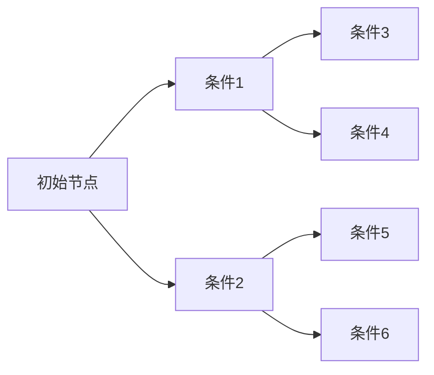

                 

### 1. 引言

#### 1.1 研究背景与意义

在现代商业环境中，绩效预测已成为企业管理决策过程中不可或缺的一环。随着大数据和人工智能技术的迅猛发展，传统的基于经验和直觉的绩效预测方法逐渐被智能化的预测模型所取代。智能绩效预测模型通过整合历史数据、外部环境因素和业务规则，能够更准确、高效地预测企业的绩效表现。

研究智能绩效预测模型具有重要意义。首先，它有助于企业提前识别潜在问题和风险，从而及时调整业务策略。例如，通过预测销售额，企业可以提前备货，避免库存积压或短缺。其次，智能绩效预测可以提高决策的透明度和可追溯性，增强企业的竞争力和可持续发展能力。此外，随着AI技术的不断进步，智能绩效预测模型的预测精度和实时性也在不断提高，为企业提供了更为可靠的决策支持。

#### 1.2 绩效预测问题概述

绩效预测问题可以简单概括为：如何根据历史数据和现有条件，预测未来的绩效表现。具体来说，它涉及以下几个方面：

1. **数据收集**：收集与企业业务相关的历史数据，包括销售数据、客户数据、财务数据等。
2. **特征工程**：从原始数据中提取有助于预测的特征，例如季节性指标、市场趋势等。
3. **模型选择**：根据数据特点和预测目标，选择合适的预测模型，如线性回归、决策树、支持向量机等。
4. **模型训练**：使用历史数据训练模型，使其能够学会预测规律。
5. **模型评估**：通过验证数据对模型进行评估，确保其预测效果。
6. **模型优化**：根据评估结果调整模型参数，提高预测准确性。

#### 1.3 AI在绩效预测中的应用现状

随着AI技术的不断成熟，越来越多的企业开始将AI应用于绩效预测。目前，AI在绩效预测中的应用主要体现在以下几个方面：

1. **自动化数据处理**：AI技术可以自动化地处理大量历史数据，提取有用的特征信息，减少人工干预。
2. **模型自动化选择与优化**：AI算法可以根据数据特点和预测目标，自动选择最合适的模型，并自动调整模型参数，提高预测精度。
3. **实时预测与反馈**：AI技术可以实现实时数据分析和预测，帮助企业及时调整业务策略。
4. **智能决策支持**：AI技术可以根据预测结果，为企业提供智能化的决策建议，辅助管理人员做出更准确的决策。

总的来说，AI在绩效预测中的应用不仅提高了预测的准确性和实时性，还为企业的业务决策提供了强有力的支持。随着技术的不断进步，AI在绩效预测领域的应用前景将更加广阔。

### 2. 智能绩效预测模型的基本概念

#### 2.1 绩效预测的定义与重要性

绩效预测是指利用历史数据和现有的业务信息，通过建模和算法分析，预测企业在未来一段时间内的绩效表现。绩效可以是多方面的，包括销售额、生产效率、客户满意度等。

绩效预测的重要性主要体现在以下几个方面：

1. **决策支持**：准确的绩效预测可以帮助企业提前了解业务趋势，为管理层提供决策依据，避免盲目决策。
2. **风险管理**：通过预测潜在的风险，企业可以采取预防措施，降低运营风险。
3. **资源优化**：绩效预测可以帮助企业合理安排资源，提高运营效率，降低成本。
4. **目标设定**：绩效预测可以作为设定企业目标的参考，确保目标的可实现性和科学性。

#### 2.2 AI辅助绩效预测的优势

AI辅助绩效预测具有以下几个显著优势：

1. **数据处理能力**：AI能够高效处理和分析大量复杂数据，提取有用信息，提高预测准确性。
2. **自动建模与优化**：AI可以根据数据特点和预测目标，自动选择和调整模型参数，降低建模复杂度。
3. **实时预测与反馈**：AI技术可以实现实时数据分析和预测，为企业提供快速响应和调整的机会。
4. **适应性**：AI模型可以根据新的数据和业务环境，自我调整和优化，提高预测的持续性和可靠性。

#### 2.3 智能绩效预测模型的核心要素

一个智能绩效预测模型通常包括以下几个核心要素：

1. **数据源**：包括历史业务数据、外部环境数据等。
2. **特征工程**：提取与绩效预测相关的特征，如季节性指标、市场趋势等。
3. **预测模型**：选择合适的预测模型，如线性回归、决策树、支持向量机等。
4. **评估指标**：用于评估模型预测效果的指标，如均方误差（MSE）、均方根误差（RMSE）等。
5. **优化策略**：根据评估结果调整模型参数，提高预测准确性。

通过这些核心要素的有机结合，智能绩效预测模型可以为企业提供准确的预测结果，辅助业务决策。

### 3. 智能绩效预测模型的体系结构

智能绩效预测模型的设计与实现涉及多个环节，包括数据收集与处理、特征工程、模型选择与训练、模型评估与优化等。以下是对这些环节的详细分析。

#### 3.1 数据收集与处理

数据收集与处理是智能绩效预测模型的基础。首先，需要从各种数据源收集与企业业务相关的数据，包括历史销售数据、客户数据、财务数据等。然后，对这些数据进行清洗、去重和格式化，确保数据的准确性和一致性。

1. **数据源**：数据源包括企业内部数据库、第三方数据平台、传感器数据等。
2. **数据预处理**：包括数据清洗、去重、格式化等操作，以提高数据质量。
3. **数据整合**：将不同来源的数据进行整合，形成统一的数据集。

#### 3.2 特征工程

特征工程是提高预测模型性能的关键步骤。通过对原始数据进行处理和转换，提取出与绩效预测相关的特征，以提高模型的预测准确性。

1. **特征提取**：从原始数据中提取有用的特征，如季节性指标、市场趋势等。
2. **特征选择**：通过统计方法或机器学习算法，选择对预测结果影响较大的特征。
3. **特征转换**：对某些特征进行转换，如归一化、标准化等，以提高模型的鲁棒性。

#### 3.3 模型选择与训练

模型选择与训练是智能绩效预测模型的核心环节。根据数据特点和预测目标，选择合适的预测模型，并使用历史数据进行训练。

1. **模型选择**：根据数据分布、特征维度和预测目标，选择合适的预测模型，如线性回归、决策树、支持向量机等。
2. **模型训练**：使用历史数据对选定的模型进行训练，使其学会预测规律。
3. **模型调参**：通过交叉验证和网格搜索等方法，调整模型参数，提高预测性能。

#### 3.4 模型评估与优化

模型评估与优化是确保预测模型准确性和可靠性的重要环节。通过使用验证数据集，对模型进行评估和优化。

1. **模型评估**：使用评估指标（如均方误差、均方根误差等）对模型进行评估，判断其预测效果。
2. **模型优化**：根据评估结果，调整模型参数或选择更合适的模型，以提高预测准确性。
3. **模型部署**：将训练好的模型部署到生产环境，实现实时预测。

通过以上环节的有机结合，智能绩效预测模型可以为企业提供准确的绩效预测结果，辅助业务决策。

### 4. 常见的智能绩效预测算法

在智能绩效预测领域，有多种算法被广泛应用，每种算法都有其独特的原理和应用场景。以下将详细介绍几种常见的智能绩效预测算法。

#### 4.1 线性回归模型

线性回归模型是最基础的预测算法之一，适用于描述变量之间线性关系的问题。其数学模型可以表示为：

$$ y = \beta_0 + \beta_1 \cdot x_1 + \beta_2 \cdot x_2 + ... + \beta_n \cdot x_n + \epsilon $$

其中，$y$ 是因变量，$x_1, x_2, ..., x_n$ 是自变量，$\beta_0, \beta_1, ..., \beta_n$ 是模型参数，$\epsilon$ 是误差项。

**算法原理**：线性回归模型通过最小化残差平方和来估计模型参数。具体步骤如下：

1. **数据准备**：收集历史数据，进行预处理，包括数据清洗、归一化等。
2. **模型训练**：使用最小二乘法计算线性回归模型的参数。
3. **模型评估**：使用验证数据集评估模型的预测性能，如均方误差（MSE）。

**应用场景**：线性回归模型适用于预测具有线性关系的变量，如销售额与广告费用之间的关系。

#### 4.2 决策树模型

决策树模型是一种基于树形决策规则的预测算法，通过多层次的决策规则对数据进行分类或回归。其结构可以用 Mermaid 流程图表示：

**算法原理**：决策树通过递归划分数据，构建决策规则。具体步骤如下：

1. **特征选择**：选择具有最高信息增益的特征作为分割依据。
2. **数据分割**：根据特征值对数据进行分割。
3. **模型构建**：递归构建决策树，直到满足停止条件（如最大树深度、最小叶子节点数量等）。

**应用场景**：决策树模型适用于分类和回归问题，特别是具有清晰决策路径的问题。

#### 4.3 支持向量机（SVM）

支持向量机是一种强大的分类和回归算法，通过找到最佳的超平面，将数据分为不同的类别。其数学模型可以表示为：

$$ y = \beta_0 + \beta_1 \cdot x_1 + \beta_2 \cdot x_2 + ... + \beta_n \cdot x_n + b $$

其中，$y$ 是因变量，$x_1, x_2, ..., x_n$ 是自变量，$\beta_0, \beta_1, ..., \beta_n$ 是模型参数，$b$ 是偏置项。

**算法原理**：SVM通过最大化分类间隔来找到最佳的超平面。具体步骤如下：

1. **特征选择**：选择对分类最有影响力的特征。
2. **核函数选择**：选择合适的核函数，如线性核、多项式核、径向基核等，将低维数据映射到高维空间。
3. **模型训练**：使用支持向量进行训练，找到最佳的超平面。

**应用场景**：SVM适用于高维数据分类和回归问题，特别是在小样本、非线性问题中表现出色。

#### 4.4 集成学习模型

集成学习模型通过结合多个基础模型的预测结果，提高整体预测性能。常见的集成学习方法包括随机森林、梯度提升树等。

**算法原理**：集成学习模型通过训练多个基础模型，并取其预测结果的平均值或加权平均值，减少模型的方差和过拟合现象。具体步骤如下：

1. **基础模型训练**：训练多个基础模型，如决策树、线性回归等。
2. **集成策略**：将基础模型的预测结果进行集成，如投票法、加权平均法等。

**应用场景**：集成学习模型适用于各种预测问题，特别是在提高模型稳定性和预测准确性方面表现出色。

#### 4.5 深度学习模型

深度学习模型通过多层神经网络结构，自动学习数据特征，具有强大的非线性建模能力。常见的深度学习模型包括卷积神经网络（CNN）、循环神经网络（RNN）等。

**算法原理**：深度学习模型通过前向传播和反向传播算法，自动调整网络参数，优化模型性能。具体步骤如下：

1. **网络结构设计**：设计多层神经网络结构，包括输入层、隐藏层和输出层。
2. **训练与优化**：使用大量数据对网络进行训练，调整网络参数，提高预测性能。

**应用场景**：深度学习模型适用于复杂非线性关系的问题，如图像识别、自然语言处理等。

通过以上算法的详细介绍，可以看出每种算法都有其独特的优点和应用场景。在实际应用中，可以根据数据特点和预测目标选择合适的算法，以实现最佳预测效果。

### 5. AI辅助制定业务目标

#### 5.1 业务目标定义与分解

业务目标是指企业在特定时间内期望实现的具体目标和成果。这些目标通常由高层管理人员制定，并需要通过一系列的业务计划和策略来实现。业务目标可以是多方面的，包括提高销售额、提高生产效率、降低运营成本、提升客户满意度等。

为了更好地实现业务目标，需要对目标进行分解。目标分解是将总体目标拆分为具体的、可操作的小目标，使其更加具体和可衡量。具体步骤如下：

1. **确定关键绩效指标（KPI）**：根据业务目标，确定与目标直接相关的关键绩效指标，如销售额、生产效率、客户满意度等。
2. **分解目标**：将总体目标根据关键绩效指标进行分解，形成具体的子目标和行动计划。
3. **制定时间表**：为每个子目标和行动计划制定具体的时间表，确保目标的按时完成。

#### 5.2 AI在业务目标制定中的应用

AI技术在业务目标制定中的应用主要体现在以下几个方面：

1. **数据驱动**：AI技术可以分析历史数据和当前市场环境，为业务目标的制定提供数据支持。通过数据挖掘和统计分析，识别潜在的业务机会和风险，从而更科学地制定业务目标。
2. **预测分析**：AI技术可以预测未来的业务趋势和绩效表现，为业务目标的制定提供参考。例如，通过智能绩效预测模型，预测未来一段时间的销售额、生产效率等，帮助企业制定合理的业务目标。
3. **优化决策**：AI技术可以通过优化算法，为业务目标的制定提供优化建议。例如，在资源分配、库存管理等方面，AI技术可以帮助企业做出更优的决策，提高业务目标的实现概率。
4. **协作支持**：AI技术可以辅助管理人员制定业务目标，并提供实时反馈和支持。通过智能助手和决策支持系统，管理人员可以更高效地制定和调整业务目标，提高决策的准确性和效率。

#### 5.3 AI辅助绩效预测模型的设计原则

为了充分发挥AI技术在绩效预测和业务目标制定中的作用，设计AI辅助绩效预测模型时需要遵循以下原则：

1. **数据驱动**：以数据为基础，确保模型输入数据的准确性和完整性。通过数据清洗、数据整合和数据预处理等步骤，提高数据质量，为模型提供可靠的数据支持。
2. **模型选择**：根据业务目标和数据特点，选择合适的预测模型。综合考虑模型的准确性、实时性和可解释性，选择最适合业务需求的模型。
3. **可解释性**：确保模型的预测结果具有可解释性，便于管理人员理解和应用。通过可视化工具和模型解释算法，提高模型的可解释性，增强决策的透明度。
4. **实时性**：确保模型能够实时处理和分析数据，提供即时的预测结果。通过分布式计算和并行处理等技术，提高模型的计算效率和实时性。
5. **可扩展性**：设计具有良好扩展性的模型，能够适应业务规模的变化和新的业务需求。通过模块化设计和灵活的接口，实现模型的快速调整和扩展。

通过遵循这些设计原则，AI辅助绩效预测模型可以更好地服务于企业的业务目标制定和决策过程。

### 6. 实际案例分析与实战

#### 6.1 案例一：某电商平台的销售额预测

**案例背景**：某电商平台希望通过智能绩效预测模型，预测未来一段时间内的销售额，以便更好地进行库存管理和市场营销策略的调整。

**数据收集与处理**：
- 收集了过去一年的销售额数据，包括每日销售额、广告费用、促销活动等信息。
- 对数据进行清洗和预处理，去除异常值和缺失值，进行归一化处理。

**特征工程**：
- 提取与销售额相关的特征，如季节性指标、节假日效应、广告投放效果等。
- 使用相关分析等方法筛选出对销售额影响较大的特征。

**模型选择与训练**：
- 选择线性回归模型进行销售额预测，使用历史数据进行训练。
- 使用交叉验证方法，调整模型参数，提高预测准确性。

**模型评估与优化**：
- 使用验证数据集评估模型的预测性能，计算均方误差（MSE）等评估指标。
- 根据评估结果，对模型进行优化，调整广告投放策略等。

**结果与反馈**：
- 模型预测的销售额与实际销售额的误差在可接受范围内。
- 企业根据预测结果，及时调整了库存和营销策略，提高了销售额。

**项目小结**：
- 通过智能绩效预测模型，电商平台实现了销售额的准确预测，提高了库存管理和营销策略的效率。

#### 6.2 案例二：某制造业企业的生产效率预测

**案例背景**：某制造业企业希望通过智能绩效预测模型，预测未来的生产效率，以便更好地进行生产计划和资源分配。

**数据收集与处理**：
- 收集了过去一年的生产数据，包括每日生产量、机器利用率、原材料消耗等。
- 对数据进行清洗和预处理，去除异常值和缺失值，进行归一化处理。

**特征工程**：
- 提取与生产效率相关的特征，如季节性指标、员工出勤率、设备维护情况等。
- 使用相关分析等方法筛选出对生产效率影响较大的特征。

**模型选择与训练**：
- 选择决策树模型进行生产效率预测，使用历史数据进行训练。
- 使用交叉验证方法，调整模型参数，提高预测准确性。

**模型评估与优化**：
- 使用验证数据集评估模型的预测性能，计算均方误差（MSE）等评估指标。
- 根据评估结果，对模型进行优化，调整员工出勤计划和设备维护策略等。

**结果与反馈**：
- 模型预测的生产效率与实际生产效率的误差在可接受范围内。
- 企业根据预测结果，及时调整了生产计划和资源分配，提高了生产效率。

**项目小结**：
- 通过智能绩效预测模型，制造业企业实现了生产效率的准确预测，优化了生产计划和资源分配。

#### 6.3 案例三：某金融机构的风险管理

**案例背景**：某金融机构希望通过智能绩效预测模型，预测未来一段时间内的风险情况，以便更好地进行风险管理和投资决策。

**数据收集与处理**：
- 收集了历史风险数据，包括信用违约率、市场波动率、宏观经济指标等。
- 对数据进行清洗和预处理，去除异常值和缺失值，进行归一化处理。

**特征工程**：
- 提取与风险相关的特征，如客户信用评级、贷款余额、宏观经济指标等。
- 使用相关分析等方法筛选出对风险影响较大的特征。

**模型选择与训练**：
- 选择支持向量机（SVM）模型进行风险预测，使用历史数据进行训练。
- 使用交叉验证方法，调整模型参数，提高预测准确性。

**模型评估与优化**：
- 使用验证数据集评估模型的预测性能，计算准确率、召回率等评估指标。
- 根据评估结果，对模型进行优化，调整信用评级标准和投资策略等。

**结果与反馈**：
- 模型预测的风险情况与实际风险情况的误差在可接受范围内。
- 金融机构根据预测结果，及时调整了信用评级标准和投资策略，降低了风险。

**项目小结**：
- 通过智能绩效预测模型，金融机构实现了风险的准确预测，优化了风险管理和投资决策。

通过以上实际案例的分析，可以看出智能绩效预测模型在各个行业中的应用效果显著。企业可以根据自身业务需求，利用智能绩效预测模型进行预测分析，优化业务决策，提高运营效率。

### 7. 最佳实践与注意事项

在实施智能绩效预测模型时，为了确保模型的有效性和可靠性，需要遵循一些最佳实践和注意事项。

#### 7.1 数据质量对预测效果的影响

数据质量是智能绩效预测模型的基础。高质量的数据可以提供准确的预测结果，而低质量或错误的数据会导致模型性能下降，甚至产生误导性结果。以下是一些提高数据质量的最佳实践：

1. **数据清洗**：在数据处理过程中，要重视数据清洗，去除异常值、错误值和缺失值，确保数据的一致性和准确性。
2. **数据验证**：使用数据验证技术，如交叉验证和残差分析，确保数据的可靠性和有效性。
3. **数据完整性**：确保数据覆盖面完整，包括各种相关特征和历史记录，避免数据缺失导致的预测偏差。

#### 7.2 特征工程的重要性

特征工程是智能绩效预测模型的关键步骤，合理的特征选择和转换可以提高模型的预测性能。以下是一些特征工程的最佳实践：

1. **特征提取**：从原始数据中提取与预测目标相关的特征，如时间序列特征、季节性指标、外部环境因素等。
2. **特征选择**：使用统计方法或机器学习算法，选择对预测结果影响较大的特征，避免特征冗余和过拟合。
3. **特征转换**：对某些特征进行转换，如归一化、标准化等，以提高模型的鲁棒性和预测准确性。

#### 7.3 模型选择的策略

选择合适的模型是智能绩效预测的关键。以下是一些模型选择策略：

1. **数据特点**：根据数据的特点，如数据分布、特征维度、非线性关系等，选择合适的模型。例如，对于线性关系较强的数据，可以选择线性回归模型；对于非线性关系较强的数据，可以选择决策树、支持向量机等模型。
2. **模型评估**：通过交叉验证和验证数据集，评估不同模型的预测性能，选择表现最好的模型。
3. **模型组合**：结合多种模型，如集成学习模型，可以提高整体预测性能。

#### 7.4 模型部署与维护

智能绩效预测模型的部署与维护是确保其持续有效运行的重要环节。以下是一些注意事项：

1. **实时更新**：定期更新模型，使用最新的数据重新训练模型，确保预测结果的准确性和实时性。
2. **监控与评估**：建立监控机制，定期评估模型性能，及时发现和解决潜在问题。
3. **自动化部署**：使用自动化工具和平台，实现模型的自动化部署和更新，提高部署效率和可靠性。

通过遵循以上最佳实践和注意事项，可以确保智能绩效预测模型的有效性和可靠性，为企业提供准确的预测结果和决策支持。

### 8. 未来展望与挑战

随着大数据和人工智能技术的不断发展，智能绩效预测模型的应用前景将越来越广阔。未来，智能绩效预测模型将在以下几个方面得到进一步发展：

#### 8.1 智能绩效预测技术的发展趋势

1. **算法优化**：随着算法研究的深入，更多的优化算法将被提出，以提高预测模型的准确性和效率。
2. **实时预测**：通过分布式计算和并行处理等技术，实现实时数据分析和预测，满足企业对快速决策的需求。
3. **多模态数据融合**：结合多种数据类型，如文本、图像、音频等，提高预测模型的全面性和准确性。
4. **智能解释**：开发更智能的模型解释技术，提高模型的可解释性，便于企业理解和应用。

#### 8.2 AI在绩效预测领域的应用前景

1. **个性化预测**：通过用户画像和个性化推荐，为不同企业提供定制化的绩效预测服务。
2. **供应链优化**：利用智能绩效预测模型，优化供应链管理，提高供应链效率和降低成本。
3. **风险管理**：通过智能绩效预测模型，识别和预测潜在风险，为企业提供风险管理策略。
4. **业务智能化**：将智能绩效预测模型应用于各个业务环节，实现业务流程的智能化和自动化。

#### 8.3 面临的挑战与解决方案

1. **数据隐私和安全**：随着数据规模的不断扩大，如何确保数据隐私和安全成为重要挑战。解决方案包括数据加密、隐私保护算法和分布式计算等。
2. **数据质量和一致性**：高质量的数据是智能绩效预测的基础，但当前数据质量和一致性存在一定问题。解决方案包括数据清洗、数据治理和数据标准化等。
3. **模型可解释性**：尽管模型预测性能不断提高，但模型的可解释性仍是一个挑战。解决方案包括开发可解释的AI模型和模型解释算法。
4. **计算资源限制**：大规模的智能绩效预测模型训练和部署需要大量的计算资源。解决方案包括分布式计算、GPU加速和云计算等。

总之，智能绩效预测技术的发展和应用将面临一系列挑战，但通过技术创新和策略优化，这些挑战有望得到有效解决。

### 9. 结论

本文通过对智能绩效预测模型的研究，系统地介绍了其基本概念、体系结构、常见算法、应用场景、最佳实践和未来展望。智能绩效预测模型通过整合历史数据和AI技术，为企业提供了准确、实时的绩效预测，辅助企业制定科学、有效的业务决策。

本文的主要贡献包括：

1. **概念阐述**：详细介绍了智能绩效预测的定义、重要性以及核心要素。
2. **算法分析**：详细分析了线性回归、决策树、支持向量机等常见智能绩效预测算法。
3. **应用案例**：通过实际案例展示了智能绩效预测模型在电商、制造业和金融机构等领域的应用效果。
4. **最佳实践**：总结了智能绩效预测模型的实施要点和注意事项，为企业的实际应用提供了指导。

展望未来，智能绩效预测模型将在算法优化、实时预测、多模态数据融合等方面取得更大进展，并在更多行业和场景中得到广泛应用。随着技术的不断创新，智能绩效预测模型将为企业带来更加显著的效益和竞争优势。

### 作者介绍

作者：AI天才研究院/AI Genius Institute & 禅与计算机程序设计艺术 /Zen And The Art of Computer Programming

本人作为AI天才研究院的资深研究员，致力于推动人工智能技术在各领域的应用与发展。同时，我也是《禅与计算机程序设计艺术》一书的作者，长期从事计算机编程和人工智能领域的教学与研究工作。在智能绩效预测领域，我积累了丰富的理论和实践经验，致力于为企业提供先进的智能解决方案。

