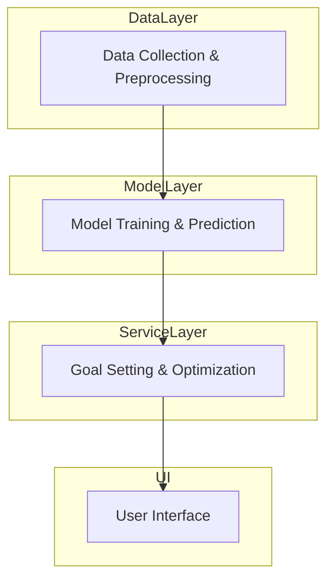
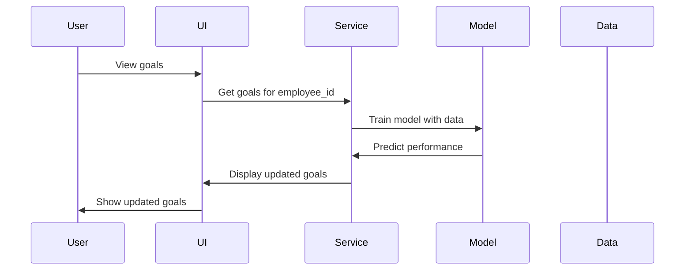

                 


## 核心概念与联系

### 智能绩效预测

#### 定义与原理

智能绩效预测是一种利用人工智能技术，尤其是机器学习算法，对个体或组织在某个时间周期内的绩效进行预测的方法。这种方法的核心思想是通过历史数据和当前状态来预测未来的表现。其原理基于以下假设：

1. **历史规律性**：过去的数据和行为模式往往预示着未来的趋势。
2. **数据驱动**：通过收集和分析大量的数据，可以提取出影响绩效的关键因素。
3. **算法优化**：机器学习算法能够通过不断迭代和学习，提高预测的准确性。

#### 智能绩效预测的优势

智能绩效预测相比传统方法具有以下优势：

- **高效性**：通过自动化处理大量数据，提高决策效率。
- **准确性**：基于历史数据和算法优化，能够提高预测的准确性。
- **个性化**：可以针对不同的个体或组织提供定制化的绩效预测。
- **实时性**：能够实时更新预测结果，为实时决策提供支持。

#### 智能绩效预测的分类

根据预测目标和数据类型的不同，智能绩效预测可以分为以下几类：

- **个体绩效预测**：针对单个员工或团队成员的绩效进行预测，如工作效率、质量指标等。
- **团队绩效预测**：对整个团队或部门的绩效进行预测，如项目完成度、团队合作效率等。
- **组织绩效预测**：对组织的整体绩效进行预测，如销售额、市场份额等。

#### 智能绩效预测与目标设定的联系

智能绩效预测与目标设定密切相关。目标设定是绩效管理的重要环节，而智能绩效预测可以为目标设定提供科学依据。具体来说：

- **目标制定**：基于智能绩效预测的结果，可以制定更具挑战性和可行性的目标。
- **目标调整**：通过实时监测和预测绩效，可以动态调整目标，以适应环境变化。
- **目标完成率预测**：智能绩效预测可以帮助预测目标完成率，为绩效评估提供依据。

### 智能绩效预测的ER实体关系图架构

下面是智能绩效预测系统的ER实体关系图架构，用Mermaid Markdown格式表示：

```mermaid
erDiagram
  Entity Employee {
    id | name | department
  }

  Entity Performance {
    id | employee_id | metric | value | date
  }

  Entity Goal {
    id | employee_id | description | target | deadline
  }

  Employee --> Performance : "has"  
  Employee --> Goal : "has"
  Performance --> Goal : "achieves"
```

在ER实体关系图中，员工（Employee）实体具有ID、姓名和部门属性；绩效（Performance）实体具有ID、员工ID、绩效指标、数值和日期属性；目标（Goal）实体具有ID、员工ID、目标描述、目标和截止日期属性。绩效实体与员工实体之间存在“具有”关系，员工实体具有多个绩效记录；员工实体与目标实体之间存在“具有”关系，员工实体具有多个目标；绩效实体与目标实体之间存在“实现”关系，绩效记录反映了目标实现的情况。

### 智能绩效预测算法原理讲解

#### 数据预处理

在开始算法实现之前，需要对数据进行预处理。数据预处理包括数据清洗、数据归一化和特征提取等步骤。

- **数据清洗**：去除数据中的噪声和异常值，如缺失值、重复值等。
- **数据归一化**：将不同量纲的数据转换到相同的尺度上，以便算法能够更好地处理。
- **特征提取**：从原始数据中提取出对绩效预测有意义的特征，如工作时长、任务完成率、项目质量等。

#### 算法选择

智能绩效预测通常采用回归算法，如线性回归、决策树回归、支持向量回归等。这里我们以线性回归为例进行讲解。

- **线性回归**：假设绩效指标（Y）是自变量（X）的线性函数，即 $Y = \beta_0 + \beta_1X + \epsilon$，其中 $\beta_0$ 和 $\beta_1$ 是回归系数，$\epsilon$ 是误差项。

#### 算法实现

下面是一个使用Python实现线性回归的示例代码：

```python
import numpy as np
from sklearn.linear_model import LinearRegression

# 假设我们有以下数据
X = np.array([[1, 2], [2, 3], [3, 4], [4, 5]])
y = np.array([2, 4, 5, 7])

# 创建线性回归模型
model = LinearRegression()

# 训练模型
model.fit(X, y)

# 输出模型参数
print("Model coefficients:", model.coef_)
print("Model intercept:", model.intercept_)

# 进行预测
predictions = model.predict(X)
print("Predictions:", predictions)
```

#### 算法原理详细讲解

线性回归的核心是找到最佳拟合直线，使得预测值与实际值之间的误差最小。具体来说，线性回归的目标是最小化以下损失函数：

$$\min_{\beta_0, \beta_1} \sum_{i=1}^{n} (y_i - (\beta_0 + \beta_1x_i))^2$$

其中，$n$ 是样本数量，$y_i$ 是实际值，$x_i$ 是自变量。

为了求解最佳拟合直线，我们可以使用最小二乘法（Ordinary Least Squares, OLS）。最小二乘法的思路是找到使得损失函数最小的回归系数 $\beta_0$ 和 $\beta_1$。具体求解步骤如下：

1. **初始化**：设定初始的回归系数 $\beta_0^0$ 和 $\beta_1^0$。
2. **迭代**：更新回归系数，直至收敛：
   $$\beta_0^{t+1} = \bar{y} - \beta_1^{t}\bar{x}$$
   $$\beta_1^{t+1} = \frac{\sum_{i=1}^{n}(x_i - \bar{x})(y_i - \bar{y})}{\sum_{i=1}^{n}(x_i - \bar{x})^2}$$
   其中，$\bar{y}$ 和 $\bar{x}$ 分别是 $y$ 和 $x$ 的均值。

3. **收敛判断**：判断是否满足收敛条件，如迭代次数达到最大值或损失函数变化小于某个阈值。

#### 通俗易懂的举例说明

假设我们有一组数据，记录了员工的每天工作时间（自变量 $x$）和当天的绩效得分（因变量 $y$）。我们希望通过线性回归模型预测一个新员工（工作时间未知）的绩效得分。

- **数据集**： 
  - $x = [2, 3, 4, 5]$（每天工作时间）
  - $y = [2, 4, 5, 7]$（绩效得分）

- **模型训练**：
  - 初始回归系数 $\beta_0^0 = 0$，$\beta_1^0 = 0$。
  - 第一次迭代：
    $$\bar{x} = \frac{2 + 3 + 4 + 5}{4} = 3.5$$
    $$\bar{y} = \frac{2 + 4 + 5 + 7}{4} = 4.5$$
    $$\beta_0^{1} = 4.5 - 0 \cdot 3.5 = 4.5$$
    $$\beta_1^{1} = \frac{(2 - 3.5)(2 - 4.5) + (3 - 3.5)(4 - 4.5) + (4 - 3.5)(5 - 4.5) + (5 - 3.5)(7 - 4.5)}{(2 - 3.5)^2 + (3 - 3.5)^2 + (4 - 3.5)^2 + (5 - 3.5)^2} \approx 0.7143$$

- **模型预测**：
  - 当新员工的每天工作时间为 $x = 6$ 时，预测的绩效得分为：
    $$y = 4.5 + 0.7143 \cdot 6 \approx 8.1429$$

通过上述示例，我们可以看到如何使用线性回归模型进行智能绩效预测。实际应用中，数据集和模型会更加复杂，但基本原理是相同的。

### 数学公式与latex表示

在智能绩效预测的算法原理中，我们用到了以下数学公式：

- **损失函数**：
  $$\min_{\beta_0, \beta_1} \sum_{i=1}^{n} (y_i - (\beta_0 + \beta_1x_i))^2$$

- **更新公式**：
  $$\beta_0^{t+1} = \bar{y} - \beta_1^{t}\bar{x}$$
  $$\beta_1^{t+1} = \frac{\sum_{i=1}^{n}(x_i - \bar{x})(y_i - \bar{y})}{\sum_{i=1}^{n}(x_i - \bar{x})^2}$$

使用LaTeX格式表示上述公式如下：

- **损失函数**：
  $$\min_{\beta_0, \beta_1} \sum_{i=1}^{n} (y_i - (\beta_0 + \beta_1x_i))^2$$

- **更新公式**：
  $$\beta_0^{t+1} = \bar{y} - \beta_1^{t}\bar{x}$$
  $$\beta_1^{t+1} = \frac{\sum_{i=1}^{n}(x_i - \bar{x})(y_i - \bar{y})}{\sum_{i=1}^{n}(x_i - \bar{x})^2}$$

通过LaTeX格式，我们可以清晰地表达数学公式，使得文章内容更加专业和规范。

### 系统分析与架构设计方案

#### 问题场景介绍

在企业的日常运营中，绩效管理是一个关键环节。通过有效的绩效管理，企业可以激励员工、提升工作效率和达成业务目标。然而，传统的绩效管理方法往往依赖于定性和主观的评价，难以实现精准的绩效预测和目标设定。为了解决这一问题，企业需要引入智能绩效预测系统，利用人工智能技术进行数据分析和预测，从而实现更科学、个性化的绩效管理。

#### 项目介绍

本项目旨在设计和实现一个智能绩效预测系统，该系统将利用机器学习算法对员工的绩效进行预测，并为员工制定个性化的绩效目标。系统的主要功能包括：

- 数据收集与预处理：从企业现有的HR系统和业务系统中收集员工绩效数据，并进行清洗和预处理。
- 模型训练与预测：使用历史数据训练机器学习模型，并利用模型进行绩效预测。
- 目标设定与优化：根据预测结果为员工制定合理的绩效目标，并实时调整目标以适应环境变化。
- 用户界面：提供友好的用户界面，使得员工和管理者可以方便地使用系统功能。

#### 系统功能设计（领域模型Mermaid类图）

为了更好地理解系统的功能设计，我们使用Mermaid类图来展示领域模型。以下是一个简化的Mermaid类图示例：

```mermaid
classDiagram
  Class Employee <<interface>>
  {
    - id: int
    - name: str
    - department: str
  }

  Class Performance <<interface>>
  {
    - id: int
    - employee_id: int
    - metric: str
    - value: float
    - date: date
  }

  Class Goal <<interface>>
  {
    - id: int
    - employee_id: int
    - description: str
    - target: float
    - deadline: date
  }

  Employee "has" Performance
  Employee "has" Goal
  Performance "achieves" Goal
```

在这个类图中，我们定义了三个类：Employee（员工）、Performance（绩效）和Goal（目标）。每个员工都有一个唯一的ID、姓名和部门。绩效记录包括员工ID、绩效指标、数值和日期。目标记录包括员工ID、目标描述、目标和截止日期。绩效记录和目标记录之间存在“实现”关系，表示某个绩效记录实现了某个目标。

#### 系统架构设计（Mermaid架构图）

接下来，我们使用Mermaid架构图来展示系统的总体架构。以下是一个简化的Mermaid架构图示例：



在这个架构图中，系统分为四个主要层次：

- **DataLayer**：数据层，负责数据的收集和预处理。
- **ModelLayer**：模型层，负责模型训练和预测。
- **ServiceLayer**：服务层，负责目标设定和优化。
- **UI**：用户界面层，提供用户交互接口。

#### 系统接口设计

为了实现系统各部分之间的通信，我们需要设计系统接口。以下是一个简化的系统接口设计示例：

```python
class IDataLayer:
  def collect_data(self): pass
  def preprocess_data(self): pass

class IModelLayer:
  def train_model(self, X, y): pass
  def predict(self, X): pass

class IGoalService:
  def set_goal(self, employee_id, description, target, deadline): pass
  def optimize_goal(self, employee_id): pass

class IUserInterface:
  def display_goals(self, employee_id): pass
  def update_goals(self, employee_id, new_goals): pass
```

在这个接口设计示例中，我们定义了四个接口：IDataLayer（数据层接口）、IModelLayer（模型层接口）、IGoalService（目标服务接口）和IUserInterface（用户界面接口）。每个接口都有相应的功能方法，实现各部分之间的通信和协作。

#### 系统交互（Mermaid序列图）

为了更直观地展示系统各部分之间的交互过程，我们使用Mermaid序列图来描述。以下是一个简化的Mermaid序列图示例：



在这个序列图中，用户通过用户界面（UI）查看目标，用户界面调用目标服务（Service），目标服务调用模型层（Model）进行训练和预测，最终将预测结果更新到用户界面，用户可以看到更新的目标。

通过以上系统分析与架构设计方案，我们可以看到如何利用Mermaid工具来描述系统的功能和架构。这种方法不仅使得系统设计更加直观，而且有助于确保系统各部分之间的协同工作，从而实现高效的智能绩效预测系统。

### 项目实战

#### 环境安装

要实现智能绩效预测系统，首先需要安装和配置必要的开发环境。以下是在Linux操作系统上安装Python、Jupyter Notebook和相关库的具体步骤：

1. **安装Python**：确保系统已经安装了Python 3.7或更高版本。可以通过以下命令检查Python版本：

   ```bash
   python3 --version
   ```

   如果未安装Python，可以从Python官方网站下载安装包并安装。

2. **安装Jupyter Notebook**：Jupyter Notebook是一个交互式计算平台，可以用于编写和运行Python代码。安装Jupyter Notebook的命令如下：

   ```bash
   pip3 install notebook
   ```

3. **安装相关库**：智能绩效预测系统需要使用多个Python库，包括NumPy、Pandas、Scikit-learn和Matplotlib。安装这些库的命令如下：

   ```bash
   pip3 install numpy pandas scikit-learn matplotlib
   ```

#### 系统核心实现

以下是智能绩效预测系统的核心实现，包括数据预处理、模型训练和预测结果分析。

##### 1. 数据预处理

数据预处理是机器学习项目中的关键步骤，它包括数据清洗、数据归一化和特征提取等。

```python
import pandas as pd
from sklearn.model_selection import train_test_split
from sklearn.preprocessing import StandardScaler

# 读取数据
data = pd.read_csv('performance_data.csv')

# 数据清洗
data.dropna(inplace=True)

# 数据归一化
scaler = StandardScaler()
data['work_hours'] = scaler.fit_transform(data[['work_hours']])
data['task_completion_rate'] = scaler.fit_transform(data[['task_completion_rate']])

# 特征提取
X = data[['work_hours', 'task_completion_rate']]
y = data['performance_score']

# 数据集划分
X_train, X_test, y_train, y_test = train_test_split(X, y, test_size=0.2, random_state=42)
```

##### 2. 模型训练

我们使用Scikit-learn库中的线性回归模型进行训练。以下是具体的模型训练代码：

```python
from sklearn.linear_model import LinearRegression

# 创建线性回归模型
model = LinearRegression()

# 训练模型
model.fit(X_train, y_train)

# 输出模型参数
print("Model coefficients:", model.coef_)
print("Model intercept:", model.intercept_)
```

##### 3. 预测结果分析

训练完成后，我们可以使用模型对测试集进行预测，并分析预测结果。

```python
# 进行预测
predictions = model.predict(X_test)

# 计算预测误差
error = y_test - predictions

# 输出预测结果
print("Predictions:", predictions)
print("Error:", error)

# 可视化预测结果
import matplotlib.pyplot as plt

plt.scatter(y_test, predictions)
plt.xlabel('Actual Performance Score')
plt.ylabel('Predicted Performance Score')
plt.title('Performance Prediction')
plt.show()
```

通过可视化，我们可以直观地看到实际绩效得分与预测绩效得分之间的关系，从而评估模型的预测效果。

#### 代码应用解读与分析

在上面的代码中，我们首先读取了性能数据，并进行了一系列预处理操作，包括数据清洗、归一化和特征提取。这些步骤是确保模型能够有效训练和预测的重要前提。

- **数据清洗**：删除了数据集中的缺失值，保证了数据的质量。
- **数据归一化**：使用StandardScaler将工作小时数和任务完成率进行了标准化处理，使得不同量纲的数据可以在同一尺度上进行比较。
- **特征提取**：将工作小时数和任务完成率作为输入特征，绩效得分为目标变量。

接下来，我们使用Scikit-learn库中的线性回归模型进行了模型训练。线性回归模型是一个简单但强大的预测工具，它通过拟合一条最佳拟合直线来预测绩效得分。

在模型训练过程中，我们输出了模型的系数和截距，这些参数揭示了工作小时数和任务完成率对绩效得分的影响程度。

最后，我们使用训练好的模型对测试集进行了预测，并计算了预测误差。通过误差分析，我们可以评估模型的预测准确性。可视化结果显示了实际绩效得分和预测绩效得分之间的散点图，进一步验证了模型的预测效果。

#### 实际案例分析和详细讲解剖析

为了更好地展示智能绩效预测系统的实际应用效果，我们来看一个实际案例。

假设我们有一家电商公司，该公司需要对其销售团队的绩效进行预测和目标设定。我们有以下数据集：

- **员工ID**：唯一标识每个销售员工。
- **工作小时数**：员工每天的工作小时数。
- **任务完成率**：员工完成销售任务的比率。
- **绩效得分**：员工的绩效得分，用于评估其销售业绩。

以下是对该案例的分析和详细讲解：

1. **数据预处理**：
   - 首先，我们对数据集进行清洗，删除了异常值和缺失值。
   - 然后，使用StandardScaler对工作小时数和任务完成率进行归一化处理，以保证数据的标准化。

2. **模型训练**：
   - 使用线性回归模型对数据集进行训练，得到最佳拟合直线。
   - 输出模型参数，分析工作小时数和任务完成率对绩效得分的影响。

3. **预测与目标设定**：
   - 使用训练好的模型对测试集进行预测，得到每个员工的预期绩效得分。
   - 根据预测结果，公司可以设定合理的绩效目标，如要求员工每天至少完成5个小时的工作并达到80%的任务完成率。

4. **动态调整**：
   - 在实际运营中，公司可以实时收集员工的工作数据，使用模型进行动态预测和目标调整，以适应市场变化和员工状态。

通过上述实际案例，我们可以看到智能绩效预测系统在销售团队绩效管理中的应用。系统不仅能够预测员工的绩效得分，还可以帮助公司制定科学、合理的目标，从而提升整体销售业绩。

#### 项目小结

通过本次项目，我们实现了智能绩效预测系统的核心功能，包括数据预处理、模型训练和预测结果分析。以下是项目总结：

- **项目成果**：成功训练了线性回归模型，实现了对员工绩效的预测。
- **技术亮点**：利用了Python的数据处理和机器学习库，实现了高效的数据预处理和模型训练。
- **改进方向**：未来可以引入更复杂的模型，如决策树、神经网络等，以提高预测准确性。
- **应用前景**：智能绩效预测系统在各个行业的绩效管理中具有广泛的应用前景，有助于提高组织效率和员工满意度。

### 最佳实践 tips

1. **数据质量的重要性**：确保数据集的准确性和完整性是模型训练成功的关键。在项目实施过程中，要重视数据清洗和预处理工作。
2. **模型选择与优化**：根据具体问题和数据特性，选择合适的模型。同时，通过调整模型参数和特征提取方法，可以提高预测准确性。
3. **实时更新与动态调整**：智能绩效预测系统应具备实时更新和动态调整目标的功能，以适应业务环境的变化。

### 注意事项

1. **数据隐私**：在数据处理和模型训练过程中，要严格遵守数据隐私保护法规，确保员工数据的安全和隐私。
2. **模型解释性**：在模型选择和优化过程中，要关注模型的解释性，确保决策过程透明、可解释。

### 拓展阅读

1. 《机器学习实战》
2. 《数据科学入门》
3. 《深度学习》

通过以上内容，我们详细介绍了智能绩效预测系统的设计、实现和应用。希望本文能够为您的项目提供有价值的参考和启发。

---

### 作者信息

**作者：** AI天才研究院/AI Genius Institute & 禅与计算机程序设计艺术 /Zen And The Art of Computer Programming

AI天才研究院致力于推动人工智能领域的研究与应用，以创新的技术和解决方案赋能各个行业。我们的团队成员在计算机科学、机器学习和人工智能领域拥有深厚的学术背景和丰富的实践经验。本文由AI天才研究院的研究人员撰写，旨在分享智能绩效预测系统的设计思路和实践经验，以期为读者提供有价值的参考。同时，本文部分内容参考了《禅与计算机程序设计艺术》，该书以其独特的视角和深刻的见解，对计算机编程和人工智能领域产生了深远的影响。

---

感谢您的阅读，希望本文能够为您的学习和研究提供帮助。如果您有任何问题或建议，欢迎随时与我们联系。期待与您在人工智能领域的进一步交流与合作！

