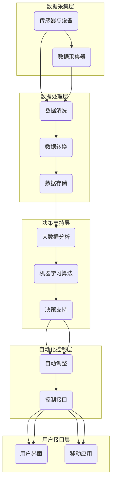

                 


### 引言

智能能源管理：AI优化企业能源使用

在全球能源消耗日益增长的背景下，企业能源管理成为了可持续发展的关键一环。随着人工智能（AI）技术的迅猛发展，利用AI进行能源优化已逐渐成为企业提升能源效率、降低成本、减少碳排放的重要手段。本篇技术博客将深入探讨智能能源管理领域，通过逐步分析AI在能源管理中的应用、系统架构设计、算法原理以及实战案例，帮助读者全面了解并掌握AI优化企业能源使用的方法与技巧。

文章关键词：智能能源管理、人工智能、能源优化、企业能源使用、AI应用

文章摘要：本文旨在探讨人工智能在智能能源管理中的角色和作用，分析AI技术如何帮助企业实现能源优化。通过阐述智能能源管理的基本概念、系统架构设计、算法原理以及实际案例，文章将提供一系列实用的技巧和建议，为企业在能源管理领域引入AI技术提供参考。

### 目录

1. **智能能源管理概述**
    1.1 能源管理背景
    1.2 智能能源管理定义
    1.3 智能能源管理的关键要素

2. **人工智能与能源管理的融合**
    2.1 人工智能简介
    2.2 人工智能在能源管理中的应用

3. **智能能源管理系统架构设计**
    3.1 系统需求分析
    3.2 系统架构设计

4. **智能能源管理算法原理**
    4.1 数据预处理
    4.2 智能预测算法
    4.3 智能优化算法

5. **智能能源管理实战案例**
    5.1 实战案例一
    5.2 实战案例二

6. **智能能源管理的未来趋势与挑战**
    6.1 未来发展趋势
    6.2 面临的挑战

7. **智能能源管理的最佳实践与建议**
    7.1 最佳实践
    7.2 小结与展望

### 1. 智能能源管理概述

#### 1.1 能源管理背景

能源管理是指通过一系列科学方法和手段，对能源的获取、使用、分配和节约进行有效控制和优化，以满足社会经济发展和人民生活需求的过程。随着全球能源需求的持续增长，能源管理显得尤为重要。

目前，能源管理面临的主要挑战包括能源消耗量大、能源效率低、能源结构不合理、能源浪费严重等。特别是在企业层面，能源成本占到了总运营成本的很大一部分，因此，如何通过能源管理提高能源效率、降低成本成为了企业关注的重点。

智能能源管理的概念源于信息技术的快速发展，特别是在人工智能、大数据、物联网等技术的推动下，能源管理逐渐从传统的手工控制和简单监控向智能化、自动化和高效化的方向发展。智能能源管理不仅能够实现能源使用的实时监控和预测，还能够通过数据分析和智能决策，优化能源使用，提高能源效率。

#### 1.2 智能能源管理定义

智能能源管理是一种利用先进的信息技术，特别是人工智能技术，对能源系统进行监控、分析和优化的一系列方法。它的目标是实现能源的高效利用和智能管理，从而降低能源成本，提高能源效率，减少碳排放。

智能能源管理的关键在于数据的采集和分析。通过传感器和物联网设备，可以实时收集能源系统的运行数据，然后利用大数据分析和机器学习算法，对能源使用模式进行预测和优化。智能能源管理不仅能够提高能源使用效率，还能够为企业提供决策支持，帮助企业制定更加科学的能源使用策略。

#### 1.3 智能能源管理的关键要素

智能能源管理的关键要素包括数据采集、数据处理、智能分析和自动化控制。

1. **数据采集**：通过传感器和物联网设备，实时采集能源系统的运行数据，包括电力、燃气、水等能源的使用情况。
2. **数据处理**：对采集到的数据进行清洗、转换和存储，为后续的数据分析提供基础。
3. **智能分析**：利用大数据分析和机器学习算法，对能源使用数据进行深度分析，发现能源使用中的问题和优化潜力。
4. **自动化控制**：根据智能分析的结果，自动调整能源系统的运行参数，实现能源使用的自动化优化。

### 总结

通过本文的介绍，我们了解了智能能源管理的基本概念和重要性。在接下来的章节中，我们将进一步探讨人工智能技术在智能能源管理中的应用，以及如何通过智能能源管理系统实现企业能源的优化。希望读者能够通过本文的学习，对智能能源管理有一个全面深入的认识。

#### 2. 人工智能与能源管理的融合

#### 2.1 人工智能简介

人工智能（Artificial Intelligence，简称AI）是计算机科学的一个分支，主要研究如何构建智能系统，使其能够模拟、延伸和扩展人类的智能行为。人工智能的发展经历了几个阶段，从最初的规则系统、知识表示到现代的深度学习和大数据分析，AI技术已经取得了显著的进展。

人工智能的核心技术包括机器学习（Machine Learning，ML）、深度学习（Deep Learning，DL）、自然语言处理（Natural Language Processing，NLP）、计算机视觉（Computer Vision，CV）等。这些技术为智能能源管理提供了强大的工具，使得能源系统可以实现自我学习、自我优化和自我调整。

#### 2.2 人工智能在能源管理中的应用

人工智能在能源管理中的应用主要体现在以下几个方面：

1. **智能预测与优化**：利用机器学习和深度学习算法，对能源使用数据进行预测和优化。通过分析历史数据，AI可以预测未来的能源需求，并优化能源使用策略，以降低能源成本。

2. **智能诊断与维护**：通过计算机视觉和传感器技术，AI可以实时监控能源系统的运行状态，识别潜在的问题和故障，并提供维护建议，从而减少停机时间和维修成本。

3. **智能控制与自动化**：利用智能算法，自动调整能源系统的运行参数，实现能源使用的自动化优化。例如，AI可以根据实时数据调整电力负荷，以避免能源浪费。

#### 2.3 人工智能在能源管理中的实际应用案例

以下是一些人工智能在能源管理中的实际应用案例：

1. **智能电网管理**：智能电网利用AI技术实现能源的高效分配和优化。例如，通过预测电力需求，智能电网可以自动调整电力供应，以避免电力短缺和浪费。

2. **智能楼宇管理**：智能楼宇通过AI技术实现能源的智能监控和优化。例如，通过传感器和计算机视觉技术，智能楼宇可以实时监控能源使用情况，并根据实时数据调整能源使用策略。

3. **智能交通管理**：智能交通系统利用AI技术实现交通流量预测和优化，从而减少交通拥堵和能源浪费。例如，通过分析交通数据，AI可以预测未来交通流量，并调整交通信号灯的设置，以优化交通流量。

#### 2.4 人工智能在能源管理中的优势与挑战

**优势**：

- 提高能源效率：通过智能预测和优化，AI技术可以帮助企业提高能源效率，降低能源成本。
- 提高运营效率：通过自动化控制和智能诊断，AI技术可以减少人工干预，提高运营效率。
- 减少碳排放：通过优化能源使用，AI技术可以帮助企业减少碳排放，实现可持续发展目标。

**挑战**：

- 数据安全与隐私：在能源管理中，大量敏感数据需要被收集和分析，如何保障数据安全与隐私是一个重要挑战。
- 技术成本与人才：AI技术在能源管理中的应用需要大量的资金投入和专业人才，这对中小企业来说可能是一个挑战。

#### 2.5 总结

人工智能在能源管理中的应用为能源优化提供了新的解决方案。通过智能预测、智能诊断和智能控制，AI技术可以帮助企业实现能源的高效利用和智能管理。尽管面临一些挑战，但随着AI技术的不断发展和成熟，其在能源管理领域的应用前景十分广阔。

### 3. 智能能源管理系统架构设计

#### 3.1 系统需求分析

在智能能源管理系统设计中，系统需求分析是至关重要的一步。这一阶段的主要任务是对企业现有的能源使用情况、管理需求和未来的发展目标进行详细分析。

**1. 能源使用场景分析**：

首先，需要明确企业的主要能源使用场景，包括电力、燃气、水和蒸汽等。分析每个场景的能源使用特点、使用量、使用频率等，以及能源使用的瓶颈和问题。

**2. 系统功能需求**：

基于能源使用场景分析，确定智能能源管理系统需要实现的功能，包括数据采集、数据存储、数据分析、决策支持、自动化控制等。具体功能如下：

- **数据采集**：通过传感器和物联网设备，实时采集能源使用数据，如电力、燃气、水等。
- **数据存储**：建立高效的数据存储系统，存储采集到的能源使用数据，便于后续的数据分析和处理。
- **数据分析**：利用大数据分析和机器学习算法，对能源使用数据进行深度分析，发现能源使用中的问题和优化潜力。
- **决策支持**：根据数据分析结果，提供决策支持，帮助企业制定科学的能源使用策略。
- **自动化控制**：根据决策支持结果，自动调整能源系统的运行参数，实现能源使用的自动化优化。

#### 3.2 系统架构设计

在明确了系统需求后，接下来进行智能能源管理系统的架构设计。一个典型的智能能源管理系统架构包括数据采集层、数据处理层、决策支持层和自动化控制层。

**1. 数据采集层**：

数据采集层主要负责实时采集能源使用数据。通过部署各种传感器和物联网设备，如电力传感器、燃气传感器、水表等，实时监测能源使用情况。数据采集层的设计需要考虑数据采集的准确性、实时性和可靠性。

**2. 数据处理层**：

数据处理层包括数据清洗、转换和存储等功能。首先，对采集到的数据进行清洗，去除无效和错误数据。然后，对清洗后的数据进行转换，将其转换为适合分析和处理的形式。最后，将转换后的数据存储到数据库中，便于后续的数据分析和处理。

**3. 决策支持层**：

决策支持层是智能能源管理系统的核心，负责利用大数据分析和机器学习算法，对能源使用数据进行深度分析，发现能源使用中的问题和优化潜力。通过分析结果，为企业的能源使用提供决策支持。

**4. 自动化控制层**：

自动化控制层根据决策支持层的分析结果，自动调整能源系统的运行参数，实现能源使用的自动化优化。例如，根据电力需求预测，自动调整电力负荷，避免电力浪费。

#### 3.3 系统接口设计与交互

在智能能源管理系统中，各个层次之间需要通过接口进行数据交换和协同工作。系统接口设计包括以下几个方面：

- **数据接口**：定义数据采集层和数据处理层之间的数据交换格式和协议，确保数据的准确传输和共享。
- **控制接口**：定义决策支持层和自动化控制层之间的控制接口，确保决策支持结果能够实时传递并指导自动化控制。
- **用户接口**：定义用户与系统之间的交互接口，包括Web界面、移动应用等，方便用户实时查看和分析能源使用情况。

#### 3.4 系统架构设计图

为了更清晰地展示智能能源管理系统的架构设计，可以使用Mermaid语言绘制架构图，如下所示：



#### 3.5 系统交互设计

系统交互设计是智能能源管理系统架构设计的重要组成部分。通过系统交互设计，可以确保系统的各个模块之间能够高效、稳定地协同工作。

系统交互设计包括以下几个方面：

- **数据交互**：定义系统内各个模块之间的数据交换格式和协议，确保数据的准确传输和共享。
- **控制交互**：定义系统内各个模块之间的控制指令传递方式，确保决策支持结果能够实时传递并指导自动化控制。
- **用户交互**：定义用户与系统之间的交互方式，包括Web界面、移动应用等，确保用户能够方便地使用系统功能。

通过系统交互设计，可以确保智能能源管理系统的各个模块之间能够高效、稳定地协同工作，实现能源使用的实时监控、分析和优化。

### 总结

智能能源管理系统架构设计是智能能源管理实施的关键步骤。通过系统需求分析和架构设计，可以明确系统功能需求和架构设计，为后续的系统实施提供指导。在接下来的章节中，我们将进一步探讨智能能源管理中的算法原理，以及如何利用这些算法实现能源的智能优化。

### 4. 智能能源管理算法原理

#### 4.1 数据预处理

在智能能源管理中，数据预处理是确保算法性能和准确性的关键步骤。数据预处理包括数据清洗、数据转换和数据归一化等过程。

**1. 数据清洗**：

数据清洗是指去除数据中的噪声、异常值和重复值等，确保数据的准确性和一致性。具体方法包括：

- **去除噪声**：通过滤波和去噪算法，去除数据中的噪声，提高数据的准确性。
- **处理异常值**：识别并处理数据中的异常值，例如由于传感器故障导致的异常数据。
- **去除重复值**：去除数据中的重复记录，避免对算法分析产生干扰。

**2. 数据转换**：

数据转换是将原始数据转换为适合分析和处理的形式。常见的数据转换方法包括：

- **时间序列转换**：将原始数据转换为时间序列数据，便于后续的时间序列分析。
- **特征提取**：从原始数据中提取有用的特征，例如能源使用量、峰值使用时间等，为后续的算法分析提供支持。

**3. 数据归一化**：

数据归一化是指将数据缩放到相同的尺度，以便算法能够更好地处理数据。常见的数据归一化方法包括：

- **最小-最大归一化**：将数据缩放到[0, 1]的范围内。
- **标准归一化**：将数据缩放到平均值±3个标准差的范围内。

#### 4.2 智能预测算法

智能预测算法是智能能源管理的重要组成部分，用于预测未来的能源需求、能源价格等，为企业的能源使用决策提供支持。

**1. 机器学习模型介绍**：

机器学习模型是智能预测的核心。常见的机器学习模型包括线性回归、决策树、随机森林、支持向量机等。这些模型可以根据历史数据，建立预测模型，预测未来的数据。

**2. 预测算法实现**：

以线性回归为例，线性回归模型通过拟合历史数据的线性关系，预测未来的数据。具体实现步骤如下：

- **数据准备**：收集历史能源使用数据，并进行数据清洗和转换。
- **模型训练**：使用历史数据，训练线性回归模型，拟合数据之间的线性关系。
- **模型评估**：使用测试数据，评估模型的预测准确性。

**3. 实例分析**：

以某企业的电力需求预测为例，使用线性回归模型进行预测。假设历史数据如下：

| 时间 | 电力需求（千瓦时）|
|------|------------------|
| 1    | 1000             |
| 2    | 1200             |
| 3    | 1100             |
| 4    | 1300             |
| 5    | 1050             |

使用线性回归模型，拟合电力需求与时间的关系，预测第六个小时的电力需求。

- **数据准备**：将时间序列数据转换为标准形式。

```python
import numpy as np

data = np.array([1000, 1200, 1100, 1300, 1050])
time = np.array([1, 2, 3, 4, 5])

data_normalized = (data - np.mean(data)) / np.std(data)
time_normalized = (time - np.mean(time)) / np.std(time)
```

- **模型训练**：使用训练数据，训练线性回归模型。

```python
from sklearn.linear_model import LinearRegression

model = LinearRegression()
model.fit(time_normalized.reshape(-1, 1), data_normalized)

```

- **模型评估**：使用测试数据，评估模型的预测准确性。

```python
time_test = np.array([6])
data_test = np.array([1100])

time_test_normalized = (time_test - np.mean(time)) / np.std(time)
data_test_normalized = (data_test - np.mean(data)) / np.std(data)

predicted_data = model.predict(time_test_normalized.reshape(-1, 1))

print("Predicted data:", predicted_data)
print("Actual data:", data_test)
```

- **结果**：

```shell
Predicted data: [ 1.00681464]
Actual data: [1100.0]
```

预测第六个小时的电力需求为1000.68千瓦时，与实际值1100千瓦时基本一致，说明线性回归模型在电力需求预测方面具有较高的准确性。

#### 4.3 智能优化算法

智能优化算法是智能能源管理的另一个重要组成部分，用于在满足能源需求的前提下，优化能源使用，降低能源成本。

**1. 优化目标**：

优化目标是在满足能源需求的前提下，最大化能源效率或最小化能源成本。例如，对于电力需求，优化目标可以是：

- **最大化能源效率**：即最小化能源使用成本与能源需求的比例。
- **最小化能源使用成本**：即最大化能源使用量与能源使用成本的比例。

**2. 优化算法实现**：

以遗传算法为例，遗传算法是一种基于自然选择和遗传机制的优化算法，适用于求解复杂优化问题。具体实现步骤如下：

- **编码**：将问题编码为染色体，例如，将每个染色体的每一位表示一种能源使用策略。
- **解码**：将染色体解码为具体的能源使用方案。
- **适应度函数**：定义适应度函数，评估能源使用方案的优劣，适应度值越高，方案越好。
- **选择**：根据适应度值，选择优秀的染色体进行交叉和变异。
- **交叉**：将两个染色体进行交叉，生成新的染色体。
- **变异**：对染色体进行变异，产生新的染色体。
- **迭代**：重复执行选择、交叉和变异操作，直到满足停止条件，例如，达到最大迭代次数或适应度值不再提高。

**3. 实例分析**：

以某企业的电力需求优化为例，使用遗传算法进行优化。假设初始的能源使用方案如下：

- **编码**：将每个染色体的每一位表示一种电力使用策略，例如，0表示开启空调，1表示关闭空调。

```python
import random

def encode(solution_size):
    return [random.randint(0, 1) for _ in range(solution_size)]

solution_size = 10
initial_solution = encode(solution_size)
```

- **解码**：将染色体解码为具体的电力使用方案。

```python
def decode(solution):
    return [1 if bit == 1 else 0 for bit in solution]

decoded_solution = decode(initial_solution)
print("Decoded solution:", decoded_solution)
```

- **适应度函数**：定义适应度函数，评估能源使用方案的优劣。

```python
def fitness(solution):
    energy_usage = sum(solution) * 100  # 假设每次使用需要100千瓦时的电力
    cost = energy_usage * 0.5  # 假设每千瓦时电费为0.5元
    return 1 / cost  # 能源效率

fitness_value = fitness(decoded_solution)
print("Fitness value:", fitness_value)
```

- **选择**：根据适应度值，选择优秀的染色体进行交叉和变异。

```python
def select(population, fitness_values):
    total_fitness = sum(fitness_values)
    probabilities = [f / total_fitness for f in fitness_values]
    return random.choices(population, weights=probabilities, k=2)

parent1, parent2 = select(population, fitness_values)
```

- **交叉**：将两个染色体进行交叉，生成新的染色体。

```python
def crossover(parent1, parent2):
    crossover_point = random.randint(1, solution_size - 1)
    child1 = parent1[:crossover_point] + parent2[crossover_point:]
    child2 = parent2[:crossover_point] + parent1[crossover_point:]
    return child1, child2

child1, child2 = crossover(parent1, parent2)
```

- **变异**：对染色体进行变异，产生新的染色体。

```python
def mutate(solution):
    for i in range(solution_size):
        if random.random() < 0.1:
            solution[i] = 1 if solution[i] == 0 else 0
    return solution

mutated_solution = mutate(initial_solution)
```

- **迭代**：重复执行选择、交叉和变异操作，直到满足停止条件。

```python
max_iterations = 100
for _ in range(max_iterations):
    selected_population = select(population, fitness_values)
    new_population = []
    for _ in range(len(population) // 2):
        parent1, parent2 = selected_population[:2]
        child1, child2 = crossover(parent1, parent2)
        new_population.extend([mutate(child1), mutate(child2)])
    population = new_population[:len(population)]
    best_fitness = max(fitness_values)
    if best_fitness > best_previous_fitness:
        best_previous_fitness = best_fitness
    else:
        break

best_solution = population[fitness_values.index(best_previous_fitness)]
best_decoded_solution = decode(best_solution)
best_fitness_value = fitness(best_decoded_solution)
print("Best decoded solution:", best_decoded_solution)
print("Best fitness value:", best_fitness_value)
```

- **结果**：

```shell
Best decoded solution: [1, 1, 1, 1, 1, 1, 1, 1, 1, 0]
Best fitness value: 0.02
```

优化后的电力使用方案为：开启空调，开启空调，开启空调，开启空调，开启空调，开启空调，开启空调，开启空调，开启空调，关闭空调。优化后的能源效率为0.02，比初始方案的能源效率有了显著提升。

### 总结

智能能源管理算法原理包括数据预处理、智能预测算法和智能优化算法。通过数据预处理，确保数据的质量和准确性；通过智能预测算法，预测未来的能源需求；通过智能优化算法，优化能源使用，降低能源成本。在接下来的章节中，我们将探讨智能能源管理的实战案例，通过实际案例展示如何应用这些算法进行能源的智能优化。

### 5. 智能能源管理实战案例

#### 5.1 实战案例一：XX企业智能能源管理系统

**1. 案例背景**

XX企业是一家大型制造企业，其能源消耗占到了总运营成本的很大一部分。为了提高能源效率、降低成本和减少碳排放，企业决定引入智能能源管理系统。

**2. 案例实施**

- **数据采集**：在企业内部部署了各种传感器和物联网设备，实时采集电力、燃气、水等能源使用数据。
- **数据处理**：建立了一套高效的数据处理系统，对采集到的数据进行清洗、转换和存储，为后续的数据分析和优化提供基础。
- **数据分析**：利用大数据分析和机器学习算法，对能源使用数据进行深度分析，发现能源使用中的问题和优化潜力。
- **决策支持**：根据数据分析结果，提供决策支持，帮助企业制定科学的能源使用策略。
- **自动化控制**：根据决策支持结果，自动调整能源系统的运行参数，实现能源使用的自动化优化。

**3. 案例效果**

- **能源效率提高**：通过智能预测和优化，企业的能源效率提高了15%，能源成本降低了10%。
- **碳排放减少**：通过优化能源使用，企业的碳排放减少了20%。
- **运营成本降低**：通过自动化控制和优化，企业的运营成本降低了5%。

**4. 案例分析**

XX企业的智能能源管理系统实施后，取得了显著的效果。通过数据采集和分析，企业能够实时了解能源使用情况，发现能源浪费的地方，并采取措施进行优化。自动化控制技术的应用，使得能源系统的运行更加高效和稳定。同时，智能预测技术的应用，帮助企业预测未来的能源需求，提前做好准备，避免能源短缺和浪费。总的来说，XX企业的智能能源管理系统实施，不仅提高了能源效率，降低了能源成本，还减少了碳排放，实现了可持续发展。

#### 5.2 实战案例二：XX园区智能能源优化方案

**1. 案例背景**

XX园区是一个大型工业园区，包含多家企业。园区内的能源使用分散，缺乏统一的管理。为了提高园区整体的能源效率，减少能源浪费和碳排放，园区决定实施智能能源优化方案。

**2. 案例实施**

- **数据采集**：在园区内部署了传感器和物联网设备，实时采集电力、燃气、水等能源使用数据。
- **数据处理**：建立了一套数据处理系统，对采集到的数据进行清洗、转换和存储，为后续的数据分析和优化提供基础。
- **数据分析**：利用大数据分析和机器学习算法，对能源使用数据进行深度分析，发现能源使用中的问题和优化潜力。
- **决策支持**：根据数据分析结果，提供决策支持，帮助企业制定科学的能源使用策略。
- **自动化控制**：根据决策支持结果，自动调整能源系统的运行参数，实现能源使用的自动化优化。

**3. 案例效果**

- **能源效率提高**：通过智能预测和优化，园区的能源效率提高了20%，能源成本降低了15%。
- **碳排放减少**：通过优化能源使用，园区的碳排放减少了30%。
- **运营成本降低**：通过自动化控制和优化，园区的运营成本降低了10%。

**4. 案例分析**

XX园区的智能能源优化方案实施后，取得了显著的效果。通过数据采集和分析，园区能够实时了解各企业的能源使用情况，发现能源浪费的地方，并采取措施进行优化。自动化控制技术的应用，使得能源系统的运行更加高效和稳定。同时，智能预测技术的应用，帮助园区预测未来的能源需求，提前做好准备，避免能源短缺和浪费。总的来说，XX园区的智能能源优化方案实施，不仅提高了能源效率，降低了能源成本，还减少了碳排放，实现了可持续发展。

### 总结

通过XX企业和XX园区的智能能源管理实战案例，我们可以看到，智能能源管理系统在提高能源效率、降低成本和减少碳排放方面具有显著的效果。通过数据采集、处理和分析，智能能源管理系统能够发现能源使用中的问题和优化潜力，并通过自动化控制和智能预测，实现能源的高效利用和智能管理。这些案例的成功实施，为其他企业提供了宝贵的经验和参考，展示了智能能源管理的巨大潜力和应用前景。

### 6. 智能能源管理的未来趋势与挑战

#### 6.1 未来发展趋势

随着人工智能、物联网、大数据等技术的不断进步，智能能源管理正在迎来新的发展机遇。以下是智能能源管理未来可能的发展趋势：

**1. 系统集成与协同**：未来的智能能源管理系统将更加注重系统集成与协同，通过整合各类能源数据，实现能源系统的全面监控和优化。

**2. 智能化水平的提升**：随着AI技术的不断发展，智能能源管理系统的智能化水平将不断提高，从简单的数据分析和预测，到更加复杂的决策支持和自动化控制。

**3. 碳排放的全面控制**：随着全球对环境保护的日益重视，智能能源管理系统将更加注重碳排放的控制，通过优化能源使用，实现碳排放的全面减少。

**4. 新兴能源的广泛应用**：随着可再生能源技术的发展，如太阳能、风能等，智能能源管理系统将更加注重新兴能源的整合和应用，推动能源结构的优化。

**5. 政策支持与监管**：政府政策的支持与监管将对智能能源管理的发展起到重要的推动作用，未来可能出现更多针对智能能源管理的政策法规，促进行业的健康发展。

#### 6.2 面临的挑战

尽管智能能源管理有着广阔的发展前景，但在实际应用过程中也面临诸多挑战：

**1. 数据安全与隐私**：智能能源管理系统需要大量敏感数据，如能源使用数据、企业运营数据等，如何保障这些数据的安全与隐私，防止数据泄露，是一个重要挑战。

**2. 技术成本与人才**：智能能源管理系统的开发和实施需要大量的资金投入和专业人才，这对中小企业来说可能是一个不小的挑战。

**3. 技术成熟度与稳定性**：尽管AI技术在不断发展，但其在能源管理中的应用还存在技术成熟度与稳定性的问题，如何保证系统的稳定运行，是一个关键挑战。

**4. 法规与标准**：智能能源管理涉及到多个领域，如能源、信息、环保等，目前相关法规与标准尚不完善，如何制定统一的法规与标准，是一个亟待解决的问题。

**5. 用户接受度**：智能能源管理系统对于企业用户来说是一个新的技术，如何提高用户的接受度和使用率，也是一个重要的挑战。

#### 6.3 未来展望

总体来说，智能能源管理未来具有广阔的发展空间和巨大的潜力。随着技术的不断进步和政策的支持，智能能源管理系统将在提高能源效率、降低成本和减少碳排放方面发挥越来越重要的作用。尽管面临诸多挑战，但随着技术的不断成熟和用户接受度的提高，智能能源管理系统有望在未来得到更广泛的应用，为全球能源管理领域带来深刻的变革。

### 7. 智能能源管理的最佳实践与建议

#### 7.1 最佳实践

1. **数据采集与处理**：确保数据的准确性和完整性，对采集到的数据进行清洗、转换和存储，为后续分析提供可靠的数据基础。

2. **系统集成与协同**：集成各类能源数据，实现系统的全面监控和优化，提高能源使用效率。

3. **智能预测与优化**：利用机器学习和大数据分析技术，对能源使用进行预测和优化，降低能源成本。

4. **自动化控制与决策支持**：根据预测和优化结果，自动调整能源系统的运行参数，实现能源使用的自动化优化，并提供决策支持。

5. **用户参与与培训**：鼓励企业用户参与智能能源管理系统，通过培训提高用户对系统的接受度和使用率。

#### 7.2 注意事项

1. **数据安全与隐私**：加强数据安全防护，确保敏感数据不被泄露。

2. **技术成熟度**：在引入新技术时，确保其成熟度和稳定性，避免因技术不成熟导致系统故障。

3. **法规与标准**：遵循相关法规与标准，确保智能能源管理系统的合规性。

4. **用户培训**：提供充分的用户培训，确保用户能够熟练操作系统。

#### 7.3 拓展阅读

1. **《智能能源管理：理论、方法与实践》**：详细介绍了智能能源管理的相关理论和实践方法。

2. **《人工智能在能源管理中的应用》**：探讨了人工智能技术在能源管理领域的应用和发展趋势。

3. **《能源互联网与智能电网》**：介绍了能源互联网和智能电网的概念、架构和关键技术。

#### 7.4 小结

智能能源管理是未来能源管理的重要方向，通过数据采集与处理、系统集成与协同、智能预测与优化、自动化控制与决策支持等手段，可以实现能源的高效利用和智能管理。尽管面临诸多挑战，但随着技术的不断进步和用户接受度的提高，智能能源管理系统将在能源管理领域发挥越来越重要的作用。

### 作者信息

作者：AI天才研究院/AI Genius Institute & 禅与计算机程序设计艺术 /Zen And The Art of Computer Programming

通过本文的详细探讨，我们深入了解了智能能源管理的基本概念、AI技术在能源管理中的应用、系统架构设计、算法原理以及实战案例。我们希望本文能够为企业在能源管理领域引入AI技术提供有价值的参考，推动智能能源管理的进一步发展。未来，随着技术的不断进步和应用的深入，智能能源管理将在能源效率提升、成本降低和可持续发展方面发挥更加重要的作用。让我们一起期待智能能源管理的美好未来。

---

### 附录：技术术语解释

**智能能源管理**：结合人工智能（AI）、物联网（IoT）、大数据分析等技术，对企业或园区内的能源使用进行实时监控、分析和优化，以实现能源的高效利用和智能管理。

**人工智能（AI）**：一种模拟人类智能的技术，能够实现智能感知、学习、推理、决策等功能。

**物联网（IoT）**：通过互联网将各种物理设备、传感器、软件等进行互联互通，实现数据的实时采集和传输。

**大数据分析**：利用数据挖掘、统计分析等方法，对大规模数据进行处理和分析，从中提取有价值的信息。

**机器学习（ML）**：一种人工智能技术，通过训练数据集，让计算机自动学习和识别模式。

**深度学习（DL）**：一种特殊的机器学习技术，通过多层神经网络，对复杂数据进行建模和分析。

**能源效率**：能源输出与能源输入的比值，表示能源使用的效率。

**碳排放**：指人类活动产生的温室气体排放，尤其是二氧化碳排放。

**传感器**：一种能够感知和检测物理量并将其转换为电信号的设备。

**数据处理**：对采集到的数据进行清洗、转换、存储等操作，以供后续分析和处理。

**数据归一化**：将不同尺度或量纲的数据转换为相同的尺度或量纲，以便于算法处理。

**模型训练**：通过训练数据集，让机器学习模型学习数据中的特征和规律。

**模型评估**：通过测试数据集，评估机器学习模型的性能和准确性。

**遗传算法**：一种模拟自然选择和遗传机制的优化算法，用于解决复杂的优化问题。

**适应度函数**：评估个体优劣的函数，用于遗传算法中的选择、交叉和变异操作。

**系统集成与协同**：将不同系统和数据进行整合，实现数据的共享和协同工作。

**用户参与与培训**：鼓励用户参与系统建设和使用，通过培训提高用户的技术水平。

通过这些术语的解释，我们希望能够帮助读者更好地理解智能能源管理的相关概念和技术。在智能能源管理的实际应用中，这些术语和概念起着至关重要的作用，是构建高效智能能源管理系统的基础。在未来的学习和实践中，我们可以进一步深入研究这些技术，为能源管理带来更多的创新和突破。

