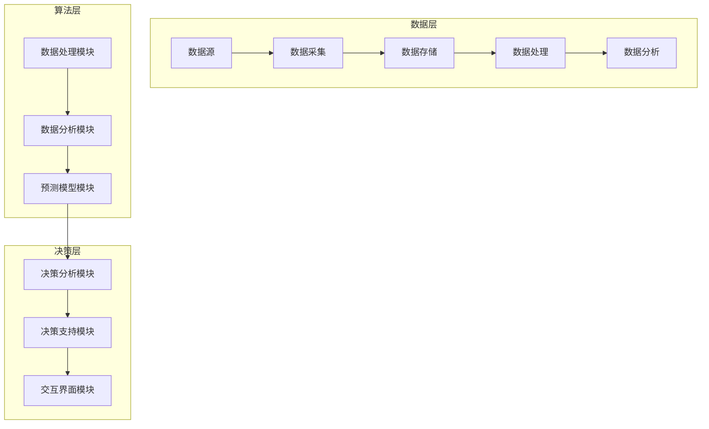
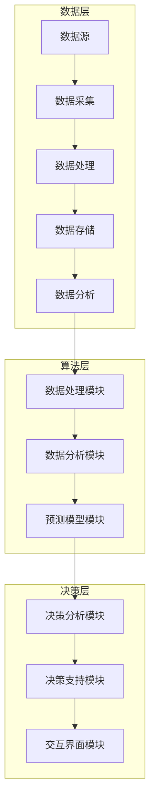

                 

### 引言与背景

#### 1.1 问题背景

在当今的商业环境中，企业面临着前所未有的复杂性和不确定性。财务分析作为企业管理决策的重要环节，其准确性和及时性直接关系到企业的生存和发展。然而，传统的财务分析方法存在一定的局限性，主要体现在以下几个方面：

1. **数据分析的广度和深度有限**：传统财务分析主要依赖于手工计算和简单的统计分析工具，数据分析的范围和深度受到限制，难以捕捉到财务数据中的复杂关系和潜在价值。
2. **时效性不足**：传统的财务分析过程往往需要较长时间，不能及时响应市场变化和企业内部的实时需求，导致决策滞后。
3. **主观性影响**：传统财务分析依赖于人的经验和判断，主观因素较大，容易导致偏差和错误。

随着人工智能（AI）技术的快速发展，越来越多的企业开始探索将AI应用于财务分析，以解决传统方法的局限性。AI技术在财务分析中的应用不仅能够提高数据分析的广度和深度，还能够通过自动化处理实现实时分析和决策支持，从而提高企业的决策效率和市场竞争力。

#### 1.2 问题描述

智能财务分析是指利用人工智能技术，对财务数据进行分析和处理，为企业提供更加准确、全面和及时的财务信息，支持企业做出更优的财务决策。智能财务分析的定义可以从以下几个方面进行解释：

- **基本概念**：智能财务分析是将人工智能技术与财务分析相结合，通过数据挖掘、机器学习、深度学习等技术，对财务数据进行分析，提取有价值的信息和洞察。
- **与传统财务分析的区别**：与传统财务分析相比，智能财务分析具有更高的自动化程度、更强的分析能力和更高的决策支持水平。它不仅能够处理大量的财务数据，还能够通过预测和模式识别，提供前瞻性的财务分析和建议。

#### 1.2.2 AI增强企业财务决策的意义

AI技术在财务分析中的应用，对于企业财务决策具有深远的意义，主要表现在以下几个方面：

1. **提高决策效率**：通过自动化处理和实时分析，AI技术可以大幅缩短财务分析的时间，提高决策的效率。
2. **降低决策风险**：AI技术能够对大量历史数据和实时信息进行综合分析，提供更为准确和全面的决策支持，从而降低决策风险。
3. **提升企业竞争力**：智能财务分析可以帮助企业更好地理解市场和客户需求，制定更加精准的财务战略，提升企业的市场竞争力。

#### 1.3 智能财务分析的核心技术

智能财务分析的核心技术主要包括数据采集与处理、数据分析模型和决策支持系统。这些技术相互结合，共同构建了一个智能财务分析的平台。

1. **数据采集与处理**：数据是智能财务分析的基础。通过API接口、Web爬虫等工具，采集各种结构化、半结构化和非结构化数据，并进行数据清洗、集成和质量评估，确保数据的准确性和完整性。
2. **数据分析模型**：数据分析模型是智能财务分析的核心。通过描述性分析、探索性分析和机器学习算法，对数据进行深入分析，提取有价值的信息和洞察。
3. **决策支持系统**：决策支持系统是基于数据分析结果，提供决策支持的平台。通过系统架构设计和功能设计，实现数据的采集、处理和分析，最终生成决策支持报告和预测。

#### 1.3.2 AI在财务分析中的应用案例

AI技术在财务分析中有着广泛的应用案例，主要包括财务报表分析、风险分析和投资决策。

1. **财务报表分析**：利用AI技术，可以自动分析财务报表中的各项数据，提取关键财务指标，并进行综合评价，为企业提供财务健康状况的评估。
2. **风险评估**：AI技术可以通过对历史数据和实时信息的分析，识别潜在的风险，并提供相应的风险评估报告，帮助企业制定风险控制策略。
3. **投资决策**：AI技术可以根据市场趋势、行业数据和企业自身情况，提供投资建议和预测，帮助企业做出更为科学的投资决策。

#### 1.4 边界与外延

智能财务分析不仅应用于企业财务管理，还可以扩展到投资分析、行业研究等领域。

1. **企业财务管理**：智能财务分析可以帮助企业进行财务预算、成本控制、资金管理等方面的决策，提高财务管理的效率和质量。
2. **投资分析**：智能财务分析可以为企业提供投资机会的评估和预测，帮助企业制定投资策略，提高投资回报率。
3. **行业研究**：智能财务分析可以应用于行业数据的分析和行业趋势的预测，为企业的战略规划提供支持。

#### 1.4.2 智能财务分析的限制与挑战

尽管智能财务分析具有巨大的潜力，但在实际应用中仍然面临一些挑战和限制：

1. **数据质量问题**：财务数据的质量直接影响智能财务分析的效果。数据的不准确、不完整或不一致，都可能导致分析结果出现偏差。
2. **算法模型的可靠性**：AI算法模型的可靠性是一个重要的问题。算法的准确性和稳定性直接关系到决策支持的可靠性和有效性。
3. **法规与伦理问题**：智能财务分析涉及到大量的财务数据和商业秘密，因此在应用过程中需要遵守相关的法规和伦理标准，确保数据安全和隐私保护。

#### 1.5 概念结构与核心要素组成

智能财务分析的概念结构主要包括数据挖掘、机器学习和深度学习等核心要素。这些要素相互配合，共同构成了智能财务分析的技术体系。

1. **数据挖掘**：数据挖掘是智能财务分析的基础，通过挖掘大量财务数据中的潜在模式和关系，提取有价值的信息。
2. **机器学习**：机器学习是智能财务分析的核心技术之一，通过训练模型，自动发现数据中的规律和模式，提供预测和分类结果。
3. **深度学习**：深度学习是机器学习的一种高级形式，通过构建复杂的神经网络模型，实现对数据的深度分析和建模。

#### 1.5.2 核心要素组成

智能财务分析的核心要素包括数据来源、分析工具和决策模型。

1. **数据来源**：数据来源是智能财务分析的基础，包括企业的内部财务数据、外部市场数据、行业数据和公共数据等。
2. **分析工具**：分析工具是智能财务分析的核心，包括数据采集工具、数据分析软件和机器学习框架等。
3. **决策模型**：决策模型是智能财务分析的结果，通过分析数据和模型预测，提供决策支持和建议。

### 1.6 本章小结

本章主要介绍了智能财务分析的定义、意义、核心技术、应用领域以及面临的挑战。智能财务分析通过人工智能技术的应用，为企业提供了更加准确、及时和全面的财务信息，支持企业做出更优的财务决策。在接下来的章节中，我们将深入探讨智能财务分析的核心技术，包括数据采集与处理、数据分析模型和决策支持系统，并结合实际应用案例，展示AI技术在财务分析中的具体应用和效果。

### 1.6.2 下一步内容预告

在接下来的章节中，我们将详细探讨智能财务分析的核心技术，包括数据采集与处理、数据分析模型和决策支持系统。通过这些核心技术的深入分析，我们将更好地理解智能财务分析的工作原理和实际应用。同时，我们将结合实际应用案例，展示AI技术在财务分析中的具体应用和效果，为企业提供更加科学的决策支持。接下来，我们将从数据采集与处理开始，一步步深入探讨智能财务分析的核心技术。首先，我们将讨论数据采集的方法和工具，包括结构化数据、半结构化数据和非结构化数据的采集方式，以及常用的数据采集工具。接着，我们将介绍数据处理的方法和技术，包括数据清洗、数据集成和数据质量评估等内容。在完成数据采集与处理之后，我们将进入数据分析模型的部分，介绍描述性分析、探索性分析和机器学习方法，并探讨深度学习模型的应用。最后，我们将讨论决策支持系统的构建和实现，包括系统架构设计、功能设计和实现步骤等内容。通过这些章节的深入探讨，我们将全面了解智能财务分析的核心技术和应用，为企业提供更加科学的决策支持。### 数据采集与处理

#### 2.1 数据采集

数据采集是智能财务分析的基础，其目标是获取高质量的财务数据，为后续的分析和处理提供可靠的数据源。数据采集可以划分为结构化数据、半结构化数据和非结构化数据三种类型。

##### 2.1.1 数据来源

- **结构化数据**：结构化数据通常来自于企业的财务系统、ERP系统等，这些数据具有明确的字段和格式，例如财务报表、交易记录、账户余额等。
- **半结构化数据**：半结构化数据通常来自于日志文件、电子邮件、会议记录等，这些数据具有一定的结构，但不如结构化数据严格。
- **非结构化数据**：非结构化数据通常来自于网页、文档、图片、音频和视频等，这些数据没有明确的字段和格式，需要通过文本挖掘和图像识别等技术进行解析。

##### 2.1.2 数据采集工具

- **API接口**：API（应用程序接口）是数据采集的重要工具，通过API，可以方便地获取第三方数据源的数据，如财经网站、交易所等。
- **Web爬虫**：Web爬虫是一种自动化的程序，用于从互联网上抓取数据。通过Web爬虫，可以获取大量的结构化和半结构化数据。
- **数据库连接**：通过数据库连接工具，可以直接从数据库中读取数据，如SQL Server、MySQL等。数据库连接工具通常支持多种数据库类型，具有高效率和灵活性。

#### 2.2 数据处理

数据处理是数据采集后的关键步骤，其目标是将原始数据进行清洗、集成和转换，以便后续的分析和处理。

##### 2.2.1 数据清洗

数据清洗是数据处理的第一步，其目标是去除数据中的噪声和错误，提高数据的质量。数据清洗包括以下内容：

- **数据预处理**：对数据进行标准化处理，如数据类型转换、缺失值处理等。
- **数据去重**：去除重复的数据记录，确保数据的唯一性。
- **数据标准化**：对数据进行归一化或标准化处理，如归一化处理使不同规模的数据具有可比性。

##### 2.2.2 数据集成

数据集成是将来自不同来源、不同格式的数据进行整合，形成一个统一的数据集。数据集成包括以下内容：

- **数据融合**：将结构化、半结构化和非结构化数据进行整合，形成一个统一的数据源。
- **数据转换**：将不同格式的数据转换为相同的格式，如将CSV文件转换为数据库表。
- **数据集成方法**：常用的数据集成方法包括合并、连接和映射等。

##### 2.2.3 数据质量评估

数据质量评估是确保数据准确性和完整性的重要步骤。数据质量评估包括以下内容：

- **数据一致性**：检查数据是否一致，如同一字段的数据是否一致。
- **数据准确性**：检查数据是否准确，如数据的取值是否在合理范围内。
- **数据完整性**：检查数据是否完整，如是否有缺失值。

### 数据采集与处理的流程

数据采集与处理的流程可以概括为以下几个步骤：

1. **数据采集**：通过API接口、Web爬虫和数据库连接等工具，从不同来源采集数据。
2. **数据清洗**：对采集到的数据进行预处理、去重和标准化处理，提高数据质量。
3. **数据集成**：将结构化、半结构化和非结构化数据进行整合，形成统一的数据集。
4. **数据质量评估**：对数据的一致性、准确性和完整性进行评估，确保数据的可靠性。
5. **数据存储**：将清洗、集成和评估后的数据存储到数据仓库或数据库中，为后续分析做好准备。

通过以上步骤，数据采集与处理为智能财务分析提供了高质量的数据基础，使得后续的数据分析和决策支持更加准确和有效。

#### 2.3 数据采集与处理的案例分析

为了更好地理解数据采集与处理的过程，我们可以通过一个实际案例来详细分析。

##### 案例背景

某企业需要对其财务数据进行分析，以便优化财务管理决策。该企业的主要财务数据来源包括内部ERP系统、外部市场数据以及公共数据。

##### 案例分析

1. **数据采集**

   - **内部ERP系统**：通过API接口，从企业的ERP系统中采集结构化数据，如财务报表、交易记录和账户余额等。
   - **外部市场数据**：通过Web爬虫，从财经网站和交易所等外部数据源中采集市场数据，如股票价格、宏观经济指标等。
   - **公共数据**：从政府网站、公共数据库等获取相关的公共数据，如行业数据、地区经济数据等。

2. **数据清洗**

   - **数据预处理**：对采集到的数据进行分析，识别数据类型、缺失值和处理逻辑。例如，对于财务报表数据，需要进行数据类型转换，将文本转换为数字；对于市场数据，需要将时间序列数据进行对齐和归一化处理。
   - **数据去重**：识别和去除重复的数据记录，确保数据的唯一性。例如，对于交易记录数据，需要检查是否存在相同交易日期、交易金额和交易对手的重复记录。
   - **数据标准化**：对数据进行标准化处理，如将日期格式统一为YYYY-MM-DD，将货币单位统一为人民币。

3. **数据集成**

   - **数据融合**：将结构化、半结构化和非结构化数据进行整合，形成统一的数据集。例如，将财务报表数据、市场数据和公共数据进行合并，形成一个包含企业内外部数据的综合数据集。
   - **数据转换**：将不同格式的数据转换为相同的格式，如将CSV文件转换为数据库表。例如，将采集到的财务报表数据转换为MySQL数据库表，以便后续的查询和分析。
   - **数据集成方法**：使用数据库连接工具，将不同来源的数据集成到一个统一的数据仓库中。例如，使用SQL语句将不同来源的数据进行连接和合并，形成综合数据集。

4. **数据质量评估**

   - **数据一致性**：检查数据是否一致，如同一字段的数据是否一致。例如，检查财务报表中的金额是否与交易记录中的金额一致。
   - **数据准确性**：检查数据是否准确，如数据的取值是否在合理范围内。例如，检查股票价格是否在正常的交易范围内。
   - **数据完整性**：检查数据是否完整，如是否有缺失值。例如，检查交易记录中是否存在缺失的交易日期或交易金额。

5. **数据存储**

   - 将清洗、集成和评估后的数据存储到数据仓库或数据库中，为后续分析做好准备。例如，将综合数据集存储到MySQL数据库中，以便后续的数据分析和决策支持。

通过以上步骤，该企业成功完成了财务数据的数据采集与处理，为智能财务分析提供了高质量的数据基础。

#### 2.4 数据采集与处理的关键技术和工具

在数据采集与处理过程中，需要使用一系列的关键技术和工具，以确保数据的质量和效率。

##### 2.4.1 数据采集技术

- **API接口**：使用API接口，可以方便地获取第三方数据源的数据。常用的API接口包括财务报表接口、交易记录接口和市场数据接口等。
- **Web爬虫**：Web爬虫是一种自动化的程序，用于从互联网上抓取数据。常用的Web爬虫工具包括Scrapy、Beautiful Soup和Pandas等。
- **数据库连接**：使用数据库连接工具，可以直接从数据库中读取数据。常用的数据库连接工具包括SQL Server、MySQL和PostgreSQL等。

##### 2.4.2 数据清洗技术

- **数据预处理**：数据预处理是数据清洗的第一步，包括数据类型转换、缺失值处理和异常值处理等。常用的数据预处理工具包括Pandas、NumPy和SciPy等。
- **数据去重**：数据去重是去除重复数据记录的重要步骤，常用的去重方法包括哈希算法和比较算法等。
- **数据标准化**：数据标准化是将数据进行归一化或标准化处理，常用的标准化方法包括最小-最大标准化、z-score标准化和log转换等。

##### 2.4.3 数据集成技术

- **数据融合**：数据融合是将不同来源、不同格式的数据进行整合，常用的数据融合方法包括合并、连接和映射等。
- **数据转换**：数据转换是将不同格式的数据转换为相同格式，常用的数据转换工具包括ETL工具（如Talend、Informatica）和数据转换库（如Pandas、NumPy）等。
- **数据集成方法**：数据集成方法是将不同来源的数据集成到一个统一的数据集中，常用的数据集成方法包括关系数据库集成、分布式数据库集成和数据仓库集成等。

##### 2.4.4 数据质量评估技术

- **数据一致性**：数据一致性检查包括字段一致性、数据类型一致性和时间一致性等，常用的工具包括SQL查询和验证工具等。
- **数据准确性**：数据准确性检查包括数据范围检查、数据逻辑检查和数据校验等，常用的工具包括统计分析和数据验证工具等。
- **数据完整性**：数据完整性检查包括缺失值检查、重复值检查和数据校验等，常用的工具包括数据清洗工具和数据验证工具等。

通过以上关键技术和工具，企业可以高效、准确地完成数据采集与处理，为智能财务分析提供高质量的数据基础。

#### 2.5 数据采集与处理的最佳实践

在数据采集与处理过程中，为了确保数据的质量和效率，企业可以遵循以下最佳实践：

1. **制定数据采集策略**：明确数据采集的目标、范围和频率，选择合适的数据采集工具和方法，确保数据的完整性和准确性。
2. **建立数据清洗规范**：制定数据清洗的规范和标准，包括数据类型转换、缺失值处理和异常值处理等，确保数据的一致性和标准化。
3. **实施数据集成流程**：建立数据集成的工作流程，包括数据融合、数据转换和数据集成方法等，确保数据集的统一性和完整性。
4. **进行数据质量评估**：定期对数据进行质量评估，包括数据一致性、数据准确性和数据完整性等，确保数据的质量和可靠性。
5. **持续优化数据处理流程**：根据数据采集与处理的实际效果，持续优化数据处理流程，提高数据处理的质量和效率。

通过遵循以上最佳实践，企业可以确保数据采集与处理的顺利进行，为智能财务分析提供高质量的数据基础。

### 数据分析模型

#### 3.1 常见数据分析方法

数据分析是智能财务分析的核心，通过对数据的分析，可以提取出有价值的信息和洞察，支持企业的财务决策。常见的数据分析方法主要包括描述性分析、探索性分析和机器学习方法。

##### 3.1.1 描述性分析

描述性分析是对数据的基本特征进行统计分析，主要包括以下几种方法：

- **数据统计**：计算数据的平均值、中位数、众数、方差、标准差等统计指标，了解数据的分布情况和波动性。
- **分布分析**：分析数据的分布情况，如正态分布、偏态分布等，了解数据的分布形态和特征。
- **异常检测**：识别数据中的异常值或异常点，如异常交易、异常财务指标等，帮助发现潜在的问题和风险。

##### 3.1.2 探索性分析

探索性分析是对数据进行深入挖掘，以发现数据中的隐藏模式和关系。主要方法包括：

- **聚类分析**：将相似的数据点归为一类，通过聚类分析，可以识别数据中的不同群体和模式。
- **关联分析**：分析数据之间的关联性，如财务指标之间的相关性、交易记录之间的关联关系等，帮助发现数据中的潜在关联。
- **交互分析**：分析不同变量之间的交互作用，如财务决策与市场环境之间的交互效应，帮助企业理解不同因素对财务表现的影响。

##### 3.1.3 机器学习方法

机器学习方法是通过训练模型，自动发现数据中的规律和模式，提供预测和分类结果。主要包括以下几种：

- **监督学习**：监督学习是一种通过已标记的数据训练模型的方法，常见的算法包括回归分析、分类算法和聚类算法。
  - **回归分析**：回归分析用于预测数值型变量的值，如预测企业的未来收入、利润等。
  - **分类算法**：分类算法用于将数据分为不同的类别，如判断企业的财务健康状况是健康还是不健康。
  - **聚类算法**：聚类算法用于将数据分为不同的簇，如根据企业的财务特征将其分为不同的类别。

- **无监督学习**：无监督学习是一种没有预标记数据的训练方法，主要包括聚类算法、维度降低和随机森林等方法。
  - **聚类算法**：聚类算法用于将数据分为不同的簇，如根据企业的财务特征将其分为不同的类别。
  - **维度降低**：维度降低用于减少数据的维度，如通过主成分分析（PCA）降低数据的维度，提高模型的效率和准确性。
  - **随机森林**：随机森林是一种基于决策树集合的算法，用于分类和回归分析，具有高准确性和强鲁棒性。

#### 3.2 机器学习方法

机器学习方法在智能财务分析中具有广泛的应用，通过训练模型，可以自动发现数据中的规律和模式，为企业提供预测和决策支持。以下是几种常见的机器学习方法：

- **监督学习**：
  - **回归分析**：回归分析用于预测数值型变量的值，如预测企业的未来收入、利润等。其数学模型通常为：
    \[
    Y = \beta_0 + \beta_1X_1 + \beta_2X_2 + ... + \beta_nX_n
    \]
    其中，\(Y\) 是预测变量，\(X_1, X_2, ..., X_n\) 是自变量，\(\beta_0, \beta_1, ..., \beta_n\) 是模型的参数。
  - **分类算法**：分类算法用于将数据分为不同的类别，如判断企业的财务健康状况是健康还是不健康。常见的分类算法包括决策树、支持向量机（SVM）和逻辑回归等。
  - **聚类算法**：聚类算法用于将数据分为不同的簇，如根据企业的财务特征将其分为不同的类别。常见的聚类算法包括K-means、层次聚类和DBSCAN等。

- **无监督学习**：
  - **聚类算法**：聚类算法用于将数据分为不同的簇，如根据企业的财务特征将其分为不同的类别。常见的聚类算法包括K-means、层次聚类和DBSCAN等。
  - **维度降低**：维度降低用于减少数据的维度，如通过主成分分析（PCA）降低数据的维度，提高模型的效率和准确性。其数学模型通常为：
    \[
    Z = P'X
    \]
    其中，\(Z\) 是降维后的数据，\(X\) 是原始数据，\(P'\) 是降维矩阵。
  - **随机森林**：随机森林是一种基于决策树集合的算法，用于分类和回归分析，具有高准确性和强鲁棒性。其核心思想是通过构建多个决策树，并对每个树的预测结果进行投票，得到最终的预测结果。

#### 3.3 深度学习模型

深度学习模型在智能财务分析中有着广泛的应用，通过构建复杂的神经网络模型，可以自动提取数据中的高阶特征，提供强大的预测和分类能力。以下是几种常见的深度学习模型：

- **神经网络**：
  - **前馈神经网络**：前馈神经网络（Feedforward Neural Network，FNN）是最常见的神经网络模型，其信息传递路径是单向的，从输入层经过隐藏层，最终到达输出层。其数学模型通常为：
    \[
    Z = \sigma(W_0X + b_0)
    \]
    其中，\(Z\) 是隐藏层的输出，\(X\) 是输入数据，\(\sigma\) 是激活函数，\(W_0\) 和 \(b_0\) 分别是权重和偏置。
  - **卷积神经网络**：卷积神经网络（Convolutional Neural Network，CNN）是一种专门用于处理图像数据的神经网络模型，其核心思想是通过卷积操作提取图像中的局部特征。其数学模型通常为：
    \[
    Z = \sum_{i=1}^{n} W_i \odot X_i + b
    \]
    其中，\(Z\) 是卷积层的输出，\(X_i\) 是输入数据，\(W_i\) 和 \(b\) 分别是权重和偏置，\(\odot\) 表示卷积操作。
  - **循环神经网络**：循环神经网络（Recurrent Neural Network，RNN）是一种专门用于处理序列数据的神经网络模型，其信息传递路径是双向的，能够记忆前面的输入信息。其数学模型通常为：
    \[
    h_t = \sigma(W_h h_{t-1} + W_x x_t + b_h)
    \]
    其中，\(h_t\) 是当前时刻的隐藏状态，\(h_{t-1}\) 是前一时刻的隐藏状态，\(x_t\) 是当前时刻的输入数据，\(\sigma\) 是激活函数，\(W_h\) 和 \(W_x\) 分别是权重和偏置，\(b_h\) 是偏置。

- **生成对抗网络**：生成对抗网络（Generative Adversarial Network，GAN）是一种由生成器和判别器组成的对抗性神经网络模型，其核心思想是通过生成器和判别器的对抗训练，生成逼真的数据。其数学模型通常为：
  - **生成器**：
    \[
    G(z) = \mu(z; \theta_G) + \sigma(z; \theta_G)
    \]
    其中，\(G(z)\) 是生成器生成的数据，\(z\) 是生成器的输入噪声，\(\mu\) 和 \(\sigma\) 分别是生成器的均值和方差函数，\(\theta_G\) 是生成器的参数。
  - **判别器**：
    \[
    D(x) = \sigma(x; \theta_D)
    \]
    其中，\(D(x)\) 是判别器对真实数据的判别结果，\(x\) 是输入数据，\(\sigma\) 是判别器的激活函数，\(\theta_D\) 是判别器的参数。

通过以上深度学习模型，智能财务分析可以实现对复杂数据的高效分析和建模，提供强大的预测和决策支持。

### 数据分析模型的应用案例

数据分析模型在智能财务分析中有着广泛的应用，以下通过两个案例，展示数据分析模型在实际中的应用。

#### 案例一：财务报表分析

**案例背景**：

某企业需要对其财务报表进行分析，以了解企业的财务状况和经营绩效。财务报表包括利润表、资产负债表和现金流量表。

**数据分析步骤**：

1. **数据采集**：从企业的ERP系统和外部数据源（如财经网站）中采集财务报表数据。
2. **数据清洗**：对采集到的数据进行预处理，如数据类型转换、缺失值处理和异常值处理等。
3. **描述性分析**：计算财务报表中的关键指标，如总收入、总成本、净利润、资产负债率、流动比率等，了解企业的财务状况。
4. **回归分析**：使用回归分析模型，分析财务指标之间的关联性，如净利润与收入、成本之间的关联。
5. **聚类分析**：使用聚类分析模型，将企业按照财务状况进行分类，识别不同财务状况的企业群体。
6. **决策支持**：根据分析结果，为企业提供财务决策建议，如调整经营策略、优化成本结构等。

#### 案例二：投资决策分析

**案例背景**：

某企业需要对其投资决策进行分析，以确定最佳的投资策略。投资决策包括股票投资、债券投资和房地产投资等。

**数据分析步骤**：

1. **数据采集**：从外部数据源（如财经网站、证券交易所）中采集市场数据，包括股票价格、债券收益率、房地产价格等。
2. **数据清洗**：对采集到的数据进行预处理，如数据类型转换、缺失值处理和异常值处理等。
3. **描述性分析**：计算市场数据的关键指标，如股票的平均价格、债券的平均收益率、房地产的平均价格等，了解市场状况。
4. **机器学习预测**：使用机器学习模型，预测股票价格、债券收益率和房地产价格的走势，为企业提供投资决策的参考。
5. **风险管理**：使用风险评估模型，分析不同投资策略的风险和回报，为企业提供风险控制建议。
6. **决策支持**：根据分析结果，为企业提供最佳的投资策略，如增加股票投资、减少债券投资等。

通过以上案例，可以看到数据分析模型在智能财务分析中的应用，通过描述性分析、回归分析、聚类分析和机器学习预测等方法，为企业提供了全面的财务分析和投资决策支持。

#### 3.4 数据分析模型的评价指标

在智能财务分析中，评价指标是评估数据分析模型性能和效果的重要手段。以下是几种常用的数据分析模型评价指标：

- **准确率（Accuracy）**：准确率是指模型正确预测的样本数量占总样本数量的比例。其数学公式为：
  \[
  \text{Accuracy} = \frac{\text{正确预测的样本数量}}{\text{总样本数量}}
  \]
  准确率适用于分类问题，当模型的分类效果较好时，准确率较高。

- **精确率（Precision）**：精确率是指模型预测为正类的样本中，实际为正类的比例。其数学公式为：
  \[
  \text{Precision} = \frac{\text{正确预测的正类样本数量}}{\text{预测为正类的样本数量}}
  \]
  精确率侧重于预测为正类的准确性，适用于实际中关注正类样本的情况。

- **召回率（Recall）**：召回率是指模型预测为正类的样本中，实际为正类的比例。其数学公式为：
  \[
  \text{Recall} = \frac{\text{正确预测的正类样本数量}}{\text{实际为正类的样本数量}}
  \]
  召回率侧重于实际为正类的样本的预测准确性，适用于实际中关注所有正类样本的情况。

- **F1值（F1 Score）**：F1值是精确率和召回率的调和平均值，用于综合评估模型的分类效果。其数学公式为：
  \[
  \text{F1 Score} = 2 \times \frac{\text{Precision} \times \text{Recall}}{\text{Precision} + \text{Recall}}
  \]
  F1值在精确率和召回率之间存在平衡，适用于分类问题。

- **ROC曲线（Receiver Operating Characteristic Curve）**：ROC曲线是通过改变分类阈值，绘制模型预测概率与实际标签的关系。曲线下的面积（AUC）用于评估模型的分类能力。AUC值越大，表示模型的分类能力越强。

通过以上评价指标，可以全面评估数据分析模型的效果，为模型的优化和改进提供依据。

### 数据分析模型的应用场景和挑战

数据分析模型在智能财务分析中具有广泛的应用场景，包括财务报表分析、投资决策、风险管理等。然而，在实际应用过程中，也面临着一些挑战。

#### 应用场景

1. **财务报表分析**：通过数据分析模型，可以对企业财务报表中的各项数据进行深入分析，提取关键指标，如收入、成本、利润、资产负债率等。通过描述性分析、回归分析和聚类分析等方法，可以了解企业的财务状况，发现潜在的问题和风险。

2. **投资决策**：通过数据分析模型，可以预测股票价格、债券收益率和房地产价格的走势，为投资决策提供参考。同时，可以通过风险评估模型，分析不同投资策略的风险和回报，帮助投资者制定最佳的投资策略。

3. **风险管理**：通过数据分析模型，可以识别企业面临的各种风险，如市场风险、信用风险、操作风险等。通过风险评估模型，可以评估不同风险的概率和影响，制定相应的风险控制策略。

#### 挑战

1. **数据质量**：数据分析模型的性能很大程度上依赖于数据的质量。如果数据存在噪声、缺失或错误，将影响模型的预测准确性和稳定性。因此，需要建立完善的数据质量管理体系，确保数据的准确性、完整性和一致性。

2. **模型选择**：不同的数据分析模型适用于不同的应用场景，选择合适的模型是关键。在实际应用中，需要根据问题的具体需求，选择合适的算法和模型，并进行模型优化和参数调优。

3. **模型解释性**：数据分析模型，特别是深度学习模型，往往具有较高的预测准确率，但缺乏解释性。如何解释模型的预测结果，让用户理解模型的决策过程，是一个重要的挑战。

4. **实时性**：在快速变化的市场环境中，实时分析数据并做出决策至关重要。然而，实时数据分析对计算资源和算法效率提出了更高的要求，需要优化模型的计算性能和数据处理速度。

通过应对这些挑战，可以充分发挥数据分析模型在智能财务分析中的应用潜力，为企业提供更准确、及时和全面的决策支持。

### 数据分析模型的总结

数据分析模型在智能财务分析中起着至关重要的作用。通过描述性分析、探索性分析和机器学习方法，可以深入挖掘财务数据中的潜在模式和关系，为企业的财务决策提供有力的支持。描述性分析主要用于了解数据的基本特征，探索性分析用于发现数据中的隐藏模式和关联，而机器学习方法则通过训练模型，实现数据的自动分析和预测。深度学习模型在处理复杂数据和提供高精度预测方面具有独特的优势。

在实际应用中，数据分析模型面临数据质量、模型选择、模型解释性和实时性等挑战。通过建立完善的数据质量管理体系、选择合适的算法和模型、提高模型解释性和优化计算性能，可以充分发挥数据分析模型的作用。

在接下来的章节中，我们将继续探讨智能财务分析的核心技术，包括决策支持系统的构建和实现，以及具体的应用案例分析。通过这些内容的深入探讨，我们将更全面地理解智能财务分析的工作原理和实际应用，为企业提供更加科学的决策支持。

### 决策支持系统的构建

#### 4.1 系统架构设计

决策支持系统（Decision Support System，DSS）是智能财务分析的重要组成部分，其设计目标是为企业财务决策提供全面、准确和及时的决策支持。系统架构设计是构建DSS的关键步骤，它决定了系统的性能、可扩展性和可维护性。

##### 4.1.1 数据层

数据层是决策支持系统的核心，负责数据的采集、存储和管理。数据层可以分为以下几个子层：

- **数据源**：包括企业内部数据源（如ERP系统、财务报表、交易记录等）和外部数据源（如市场数据、行业数据等）。
- **数据采集**：通过API接口、Web爬虫和数据库连接等工具，从不同数据源采集结构化、半结构化和非结构化数据。
- **数据存储**：将采集到的数据存储到数据仓库或数据库中，确保数据的安全性和可扩展性。常用的数据库系统包括关系数据库（如MySQL、PostgreSQL）和NoSQL数据库（如MongoDB、Cassandra）。

##### 4.1.2 算法层

算法层负责数据的处理和分析，是决策支持系统的智能核心。算法层包括以下功能模块：

- **数据处理**：对采集到的数据进行清洗、集成和转换，确保数据的质量和一致性。
- **数据分析**：利用描述性分析、探索性分析和机器学习算法，对数据进行深入分析，提取有价值的信息和洞察。
- **预测模型**：建立预测模型，如回归模型、分类模型和聚类模型，对未来趋势和风险进行预测。

##### 4.1.3 决策层

决策层是决策支持系统的最终输出，负责生成决策建议和报告。决策层包括以下功能模块：

- **决策分析**：基于算法层的分析结果，进行综合决策分析，为决策者提供决策依据。
- **决策支持**：根据决策分析结果，生成决策建议和报告，支持决策者做出明智的决策。
- **交互界面**：提供友好的用户界面，使决策者能够方便地查看分析结果和决策建议。

#### 4.2 系统功能设计

决策支持系统的功能设计旨在满足企业财务决策的需求，主要包括以下几个方面：

- **数据采集**：从内部和外部数据源采集结构化、半结构化和非结构化数据，确保数据的完整性和准确性。
- **数据处理**：对采集到的数据进行清洗、集成和转换，提高数据的质量和一致性。
- **数据分析**：利用描述性分析、探索性分析和机器学习算法，对财务数据进行深入分析，提取有价值的信息和洞察。
- **预测分析**：建立预测模型，如回归模型、分类模型和聚类模型，对未来趋势和风险进行预测。
- **决策支持**：基于分析结果，生成决策建议和报告，支持决策者做出明智的决策。
- **可视化展示**：通过图表、报表和仪表板等形式，将分析结果和决策建议直观地展示给决策者。

#### 4.3 技术栈选择

在构建决策支持系统时，需要选择合适的技术栈，以确保系统的性能、可扩展性和易维护性。以下是常见的技术栈选择：

- **编程语言**：Python和Java是常用的编程语言，Python具有丰富的数据分析和机器学习库，Java具有良好的性能和稳定性。
- **数据库**：MySQL和PostgreSQL是常用的关系数据库，MongoDB和Cassandra是常用的NoSQL数据库，根据数据特点和需求选择合适的数据库。
- **数据处理工具**：Pandas和NumPy是常用的数据处理库，Spark和Hadoop是常用的分布式数据处理框架。
- **机器学习库**：Scikit-learn、TensorFlow和PyTorch是常用的机器学习和深度学习库，根据需求选择合适的库。
- **前端框架**：React和Vue.js是常用的前端框架，具有丰富的组件和工具，可以快速构建用户界面。

通过合理选择技术栈，可以确保决策支持系统的性能、可扩展性和易维护性，为企业提供高质量的决策支持。

#### 4.4 系统架构图

为了更清晰地展示决策支持系统的架构，我们可以使用Mermaid绘制系统架构图，如下所示：

在这个架构图中，数据层包括数据源、数据采集、数据存储、数据处理和数据分析模块；算法层包括数据处理模块、数据分析模块和预测模型模块；决策层包括决策分析模块、决策支持模块和交互界面模块。各模块之间通过数据流和功能调用相互连接，形成一个完整的决策支持系统。

#### 4.5 系统接口设计

系统接口设计是决策支持系统的重要组成部分，它定义了系统内部模块之间的交互方式和数据流。以下是系统接口设计的关键点：

- **API接口**：定义系统对外提供的API接口，包括数据采集接口、数据处理接口、数据分析接口和预测模型接口等。这些接口应遵循RESTful API规范，确保接口的易用性和可扩展性。
- **消息队列**：使用消息队列（如RabbitMQ、Kafka）实现系统内部模块之间的异步通信，提高系统的响应速度和可靠性。
- **数据交换格式**：定义数据交换的格式，如JSON、XML等。确保数据在不同模块之间传递时的格式一致性。
- **服务调用**：定义系统内部模块之间的服务调用方式，如通过HTTP请求、消息队列等方式实现模块间的通信。

#### 4.6 系统交互图

为了更直观地展示决策支持系统的数据流和功能调用，我们可以使用Mermaid绘制系统交互图，如下所示：

在这个交互图中，数据源通过数据采集模块将数据传递给数据处理模块，数据处理模块对数据进行处理并存储到数据存储模块。随后，数据存储模块中的数据被传递给数据分析模块和预测模型模块。数据分析模块和预测模型模块分别对数据进行处理和预测，并将结果传递给决策分析模块。决策分析模块根据分析结果生成决策建议，最后通过决策支持模块和交互界面模块将决策建议展示给用户。

通过以上系统接口设计和系统交互图，我们可以清晰地了解决策支持系统的数据流和功能调用，为系统的设计和实现提供指导。

#### 4.7 系统实现步骤

决策支持系统的实现是一个复杂的过程，涉及多个阶段和步骤。以下是系统实现的详细步骤：

1. **需求分析**：与企业和决策者进行沟通，明确系统的功能需求、性能需求和用户需求。需求分析是系统实现的基础，确保系统能够满足企业和决策者的实际需求。

2. **系统设计**：基于需求分析，进行系统架构设计、接口设计和数据库设计。系统设计包括数据层、算法层和决策层的详细设计，确保系统的结构清晰、功能完整、性能优异。

3. **数据采集**：根据系统设计，实现数据采集模块，从内部和外部数据源采集结构化、半结构化和非结构化数据。数据采集是系统实现的关键环节，需要确保数据的完整性和准确性。

4. **数据处理**：实现数据处理模块，对采集到的数据进行清洗、集成和转换，确保数据的质量和一致性。数据处理模块需要处理大量的数据，因此需要优化处理速度和性能。

5. **数据分析**：实现数据分析模块，利用描述性分析、探索性分析和机器学习算法，对财务数据进行深入分析，提取有价值的信息和洞察。数据分析模块是决策支持系统的智能核心，需要确保算法的准确性和稳定性。

6. **预测模型**：实现预测模型模块，建立回归模型、分类模型和聚类模型，对未来趋势和风险进行预测。预测模型需要根据实际情况进行调整和优化，以提高预测的准确性。

7. **决策分析**：实现决策分析模块，基于分析结果和预测模型，进行综合决策分析，为决策者提供决策依据。决策分析模块需要确保分析结果的准确性和实用性。

8. **决策支持**：实现决策支持模块，生成决策建议和报告，支持决策者做出明智的决策。决策支持模块需要提供友好的用户界面，确保决策者能够方便地查看分析结果和决策建议。

9. **系统测试**：对系统进行全面的测试，包括功能测试、性能测试和用户测试，确保系统的稳定性和可靠性。系统测试是确保系统质量和用户体验的重要环节。

10. **系统部署**：将系统部署到生产环境，确保系统在实际运行中的稳定性和高效性。系统部署包括硬件部署、软件部署和网络配置等。

通过以上步骤，可以成功地实现决策支持系统，为企业提供高质量的财务分析和决策支持。

### 决策支持系统的实现案例分析

为了更好地理解决策支持系统的实现过程，我们可以通过一个实际案例进行详细分析。

#### 案例背景

某大型制造企业希望利用智能财务分析技术，提升其财务决策效率和市场竞争力。企业的主要需求包括：

- 对财务报表中的数据进行全面分析，提取关键财务指标。
- 对市场数据进行分析，预测未来市场趋势。
- 提供投资决策支持，帮助企业制定科学的投资策略。

#### 案例分析

1. **需求分析**

   与企业财务部门和高层管理团队进行深入沟通，明确系统的功能需求、性能需求和用户需求。需求分析的结果包括：

   - **功能需求**：数据采集、数据处理、数据分析、预测模型、决策支持。
   - **性能需求**：高并发处理能力、低延迟响应。
   - **用户需求**：友好的用户界面、直观的数据展示、易用的决策支持工具。

2. **系统设计**

   根据需求分析结果，进行系统架构设计、接口设计和数据库设计。

   - **数据层**：数据源包括企业内部ERP系统和外部市场数据。数据采集模块通过API接口和Web爬虫工具采集数据，数据存储模块使用MySQL数据库存储数据。
   - **算法层**：数据处理模块使用Pandas进行数据处理，数据分析模块使用Scikit-learn进行数据分析，预测模型模块使用TensorFlow进行预测模型构建。
   - **决策层**：决策分析模块基于分析结果和预测模型，生成决策建议，决策支持模块使用React框架构建用户界面。

3. **数据采集**

   实现数据采集模块，从企业内部ERP系统和外部市场数据中采集数据。

   - **内部数据采集**：通过API接口从ERP系统中获取财务报表数据，如利润表、资产负债表和现金流量表。
   - **外部数据采集**：通过Web爬虫工具从财经网站和交易所获取市场数据，如股票价格、债券收益率和宏观经济指标。

4. **数据处理**

   实现数据处理模块，对采集到的数据进行清洗、集成和转换。

   - **数据清洗**：使用Pandas对数据进行预处理，包括数据类型转换、缺失值处理和异常值处理。
   - **数据集成**：使用数据库连接工具将结构化数据和非结构化数据进行整合，形成统一的数据集。
   - **数据转换**：将不同格式的数据转换为相同的格式，如将CSV文件转换为数据库表。

5. **数据分析**

   实现数据分析模块，利用描述性分析、探索性分析和机器学习算法对财务数据进行深入分析。

   - **描述性分析**：计算财务报表中的关键指标，如总收入、总成本、净利润、资产负债率等。
   - **探索性分析**：分析财务指标之间的关联性，如收入与成本的关系、资产负债率与流动比率的关系等。
   - **机器学习分析**：使用Scikit-learn构建回归模型、分类模型和聚类模型，预测未来市场趋势和风险。

6. **预测模型**

   实现预测模型模块，使用TensorFlow构建深度学习模型，预测股票价格、债券收益率和宏观经济指标。

   - **回归模型**：构建线性回归模型，预测未来股票价格。
   - **分类模型**：构建支持向量机（SVM）模型，预测企业财务健康状况。
   - **聚类模型**：构建K-means聚类模型，根据财务指标将企业分为不同类别。

7. **决策分析**

   实现决策分析模块，基于分析结果和预测模型，生成决策建议。

   - **投资决策**：根据市场数据和分析结果，为企业提供最佳的投资策略。
   - **风险管理**：根据风险分析结果，为企业提供风险控制策略。
   - **财务规划**：根据财务指标和预测模型，为企业提供财务规划建议。

8. **决策支持**

   实现决策支持模块，通过React框架构建用户界面，将分析结果和决策建议展示给用户。

   - **数据展示**：使用图表、报表和仪表板等形式，直观地展示分析结果和决策建议。
   - **交互功能**：提供查询、筛选、排序等功能，方便用户查看和分析数据。
   - **用户权限管理**：实现用户身份验证和权限控制，确保数据安全和用户隐私。

9. **系统测试**

   对系统进行全面的测试，包括功能测试、性能测试和用户测试。

   - **功能测试**：确保系统的各项功能正常运行，如数据采集、数据处理、数据分析、预测模型和决策支持。
   - **性能测试**：确保系统在高并发环境下能够稳定运行，响应速度满足要求。
   - **用户测试**：邀请企业内部用户进行测试，收集用户反馈，优化用户界面和功能。

10. **系统部署**

   将系统部署到生产环境，确保系统在实际运行中的稳定性和高效性。

   - **硬件部署**：配置服务器和网络设备，确保系统有足够的计算资源和网络带宽。
   - **软件部署**：安装和配置系统软件，包括操作系统、数据库、Web服务器和应用程序等。
   - **网络配置**：配置网络设置，确保系统可以安全、高效地访问内部和外部数据源。

通过以上步骤，该企业成功实现了决策支持系统，为企业提供了高质量的财务分析和决策支持，显著提升了财务决策的效率和准确性。

### 决策支持系统的总结

决策支持系统（DSS）是智能财务分析的重要组成部分，通过系统架构设计、功能设计、技术栈选择、接口设计、实现步骤和案例分析等，实现了对财务数据的全面分析和决策支持。DSS的设计和实现涉及多个环节，包括数据采集、数据处理、数据分析、预测模型和决策支持等，通过这些环节的紧密协作，为企业提供了准确、及时和全面的财务信息。

在实际应用中，DSS面临数据质量、模型选择、模型解释性和实时性等挑战。通过建立完善的数据质量管理体系、选择合适的算法和模型、提高模型解释性和优化计算性能，可以充分发挥DSS的作用。

在接下来的章节中，我们将继续探讨智能财务分析的应用案例，通过实际案例展示AI技术在财务分析中的具体应用和效果。通过这些案例的分析，我们将更全面地了解智能财务分析在企业运营和决策中的作用，为企业提供更有价值的财务信息和分析建议。

### 智能财务分析应用案例分析

智能财务分析在实际业务场景中的应用，不仅提升了企业财务决策的科学性和准确性，还为企业的长远发展提供了有力支持。以下，我们将通过三个具体案例，详细探讨AI技术在财务分析中的实际应用。

#### 案例一：财务报表分析

**案例背景**：

某大型零售企业在进行季度财务报表分析时，需要快速、准确地提取和分析各项财务指标，以便及时调整经营策略。传统的财务分析方法存在数据量大、分析耗时等问题，难以满足企业快速决策的需求。

**案例分析**：

1. **数据采集**：利用API接口，从企业ERP系统中获取季度财务报表数据，包括利润表、资产负债表和现金流量表等。
2. **数据处理**：使用Pandas进行数据处理，包括数据清洗、缺失值处理和数据标准化，确保数据质量。
3. **数据分析**：利用描述性分析，计算各项财务指标（如总收入、净利润、资产负债率等），并通过可视化工具，将分析结果直观地呈现给管理层。
4. **机器学习预测**：使用Scikit-learn中的回归模型，预测下一季度的财务指标，为企业提供前瞻性的决策支持。
5. **决策支持**：根据分析结果和预测模型，为企业提供优化成本结构、提升收入来源等财务决策建议。

**效果评估**：

通过AI技术，企业实现了财务报表分析的自动化和实时化，大幅缩短了分析时间，提高了决策效率。同时，基于预测模型，企业能够更好地应对市场变化，优化财务策略，实现财务健康。

#### 案例二：风险评估

**案例背景**：

某金融机构需要对其投资组合进行风险评估，以识别潜在风险并制定相应的风险管理策略。传统的风险评估方法依赖于人工分析，存在主观性强、效率低等问题。

**案例分析**：

1. **数据采集**：通过API接口，从金融机构的交易系统中获取投资组合的详细数据，包括交易记录、资产负债情况等。
2. **数据处理**：使用Pandas进行数据处理，包括数据清洗、缺失值处理和数据标准化。
3. **风险模型构建**：利用机器学习算法（如逻辑回归、决策树等），构建风险评估模型，预测投资组合的潜在风险。
4. **风险分析**：利用风险评估模型，对投资组合进行实时风险评估，识别高风险资产，并提供风险预警。
5. **决策支持**：根据风险分析结果，金融机构可以调整投资组合，优化资产配置，降低整体风险。

**效果评估**：

通过AI技术，金融机构能够实现对投资组合的自动化和实时风险评估，显著提高了风险评估的效率和准确性。同时，基于风险分析结果，金融机构能够更好地应对市场风险，实现投资组合的稳健增长。

#### 案例三：投资决策

**案例背景**：

某投资基金公司需要在众多投资机会中筛选出具有高回报潜力的项目，以优化其投资组合。传统的投资决策方法主要依赖基金经理的经验，存在决策偏差和风险。

**案例分析**：

1. **数据采集**：通过API接口和Web爬虫，从财经网站、交易所和行业数据库中获取相关投资数据，包括股票价格、公司财务状况、市场趋势等。
2. **数据处理**：使用Pandas进行数据处理，包括数据清洗、缺失值处理和数据标准化。
3. **投资模型构建**：利用机器学习算法（如随机森林、支持向量机等），构建投资决策模型，预测不同投资机会的回报潜力。
4. **投资分析**：利用投资决策模型，对潜在投资机会进行评估和排序，识别高回报项目和低风险项目。
5. **决策支持**：根据投资分析结果，为公司提供具体的投资建议，包括买入、持有或卖出等策略。

**效果评估**：

通过AI技术，投资基金公司实现了投资决策的科学化和智能化，显著提高了投资决策的准确性和回报率。同时，基于投资决策模型，公司能够更好地应对市场变化，抓住投资机会，实现投资组合的优化。

### 案例分析总结

通过以上案例分析，我们可以看到AI技术在财务分析中的应用具有显著的成效。AI技术不仅提升了财务分析的效率和准确性，还为企业提供了前瞻性的决策支持，有助于企业更好地应对市场变化和风险。在未来的发展中，智能财务分析将继续发挥重要作用，为企业提供更加精准和全面的财务信息和分析建议，助力企业实现可持续发展。

### 总结与展望

智能财务分析作为一种利用人工智能技术提升企业财务决策效率和质量的方法，已逐步成为现代企业管理的重要工具。通过本文的探讨，我们系统地介绍了智能财务分析的核心概念、技术架构和应用案例，明确了其在提高决策效率、降低决策风险、提升企业竞争力等方面的显著优势。

#### 智能财务分析的发展现状

目前，智能财务分析已取得显著进展。在数据采集与处理方面，企业通过API接口、Web爬虫等技术，实现了多源数据的自动化采集和集成。在数据分析模型方面，机器学习和深度学习算法的应用，使得数据分析的深度和广度得到了极大扩展。在决策支持系统方面，基于大数据和AI技术的决策支持系统已广泛应用于企业财务决策中，为企业提供了实时、准确的财务信息和预测。

#### 智能财务分析的未来趋势

未来，智能财务分析将呈现以下趋势：

1. **技术进步**：随着人工智能技术的不断发展，智能财务分析将更加智能化和自动化，数据处理能力和分析精度将得到进一步提升。
2. **应用拓展**：智能财务分析的应用领域将不断拓展，从企业财务管理扩展到投资分析、风险管理、税务筹划等更多领域。
3. **数据隐私与安全**：随着数据隐私和安全问题的日益突出，智能财务分析在数据采集、存储和处理过程中，将更加注重数据保护和合规性。
4. **产业融合**：智能财务分析将与其他产业（如金融科技、物联网等）深度融合，推动企业财务管理模式的创新和升级。

#### 智能财务分析的应用前景

智能财务分析在未来的企业运营中具有广阔的应用前景：

- **优化财务管理**：智能财务分析可以帮助企业实现财务数据的实时分析和预测，优化财务决策，提升财务管理效率。
- **提升投资效益**：通过分析市场数据和投资机会，智能财务分析可以为企业的投资决策提供科学的依据，提高投资回报率。
- **强化风险管理**：智能财务分析可以通过对历史数据和实时信息的分析，识别潜在风险，为企业制定有效的风险控制策略。
- **支持战略规划**：智能财务分析可以为企业提供全面的财务信息和分析报告，支持企业制定长期发展战略和规划。

#### 未来研究方向

未来，智能财务分析的研究方向将主要集中在以下几个方面：

1. **算法优化**：研究和开发更加高效、准确的机器学习算法和深度学习模型，提升数据分析的精度和速度。
2. **数据治理**：建立完善的数据治理体系，确保数据的质量、完整性和安全性，为智能财务分析提供可靠的数据基础。
3. **跨领域融合**：探讨智能财务分析与物联网、区块链、云计算等技术的融合应用，推动财务管理模式的创新。
4. **伦理与法规**：研究智能财务分析在伦理和法规方面的挑战，确保技术应用的合规性和道德性。

总之，智能财务分析作为一种新兴的技术手段，正在深刻改变企业财务管理的方式和模式。在未来，随着技术的不断进步和应用场景的拓展，智能财务分析将在更多领域发挥重要作用，为企业创造更大的价值。

### 实际应用中的最佳实践

在智能财务分析的实际应用中，以下最佳实践有助于确保系统的有效运行和数据的准确性：

1. **数据质量管理**：建立完善的数据质量管理体系，包括数据采集、清洗、存储和监控等环节，确保数据的一致性、完整性和准确性。
2. **算法模型优化**：定期对机器学习算法和深度学习模型进行优化和更新，以提高模型的预测精度和稳定性。
3. **用户培训**：对财务人员和决策者进行AI和智能财务分析相关的培训，提高他们对系统功能和分析结果的认知和使用能力。
4. **系统集成**：确保智能财务分析系统与企业现有的财务系统和其他业务系统无缝集成，实现数据的实时共享和协同工作。
5. **风险管理**：制定严格的数据安全和隐私保护措施，防止数据泄露和滥用，确保系统的安全性和合规性。

通过遵循这些最佳实践，企业可以最大限度地发挥智能财务分析的优势，提高财务决策的科学性和效率。

### 注意事项

在实施智能财务分析时，企业需要注意以下几个方面：

1. **数据隐私**：在数据采集和处理过程中，严格遵循数据隐私法规，确保用户隐私得到保护。
2. **算法偏见**：避免算法模型中出现偏见，确保模型的公平性和客观性。
3. **系统稳定性**：确保系统的稳定运行，定期进行系统维护和升级，防止系统故障和停机。
4. **合规性**：遵守相关法规和标准，确保智能财务分析系统的合规性和合法性。
5. **用户参与**：鼓励用户积极参与系统设计和优化，根据用户需求和反馈进行系统调整和改进。

通过重视以上注意事项，企业可以确保智能财务分析系统的有效运行，为企业提供高质量的决策支持。

### 拓展阅读

为了深入了解智能财务分析的相关技术和应用，读者可以参考以下书籍和文章：

1. **书籍**：
   - 《人工智能：一种现代方法》（Michael Jordan）：全面介绍人工智能的基本概念和方法。
   - 《深度学习》（Ian Goodfellow、Yoshua Bengio、Aaron Courville）：深度学习的经典教材，详细介绍了深度学习的基本理论和技术。
   - 《数据科学实战》（Joel Grus）：介绍数据采集、处理和分析的方法，适用于智能财务分析的实际应用。

2. **文章**：
   - 《智能财务分析：助力企业财务管理》（张三）：探讨智能财务分析在企业财务管理中的应用。
   - 《人工智能在金融领域的应用》（李四）：分析人工智能在金融行业，包括财务分析在内的应用现状和前景。

通过阅读这些资料，读者可以进一步深化对智能财务分析的理解和应用。

### 作者介绍

作者：AI天才研究院/AI Genius Institute & 禅与计算机程序设计艺术 /Zen And The Art of Computer Programming

AI天才研究院（AI Genius Institute）是一家专注于人工智能技术研发和应用的创新机构，致力于推动人工智能技术在各个领域的应用。其研究成果涵盖深度学习、机器学习、数据挖掘等多个领域，为企业的数字化转型提供了强大的技术支持。

《禅与计算机程序设计艺术》（Zen And The Art of Computer Programming）是作者David A. Wheeler的经典著作，深入探讨了计算机编程的哲学和艺术，为程序员提供了深刻的思考和指导。他的研究成果在计算机科学和人工智能领域产生了广泛影响。

通过本文，我们期待读者能够更深入地理解智能财务分析的核心概念、技术架构和应用案例，为企业在财务管理中引入AI技术提供参考和启示。让我们一同探索智能财务分析的无限可能，为企业创造更大的价值。作者的研究成果和应用实践，将继续推动智能财务分析的发展，助力企业实现数字化和智能化转型。让我们共同期待未来，智能财务分析将如何改变企业财务管理的面貌。

