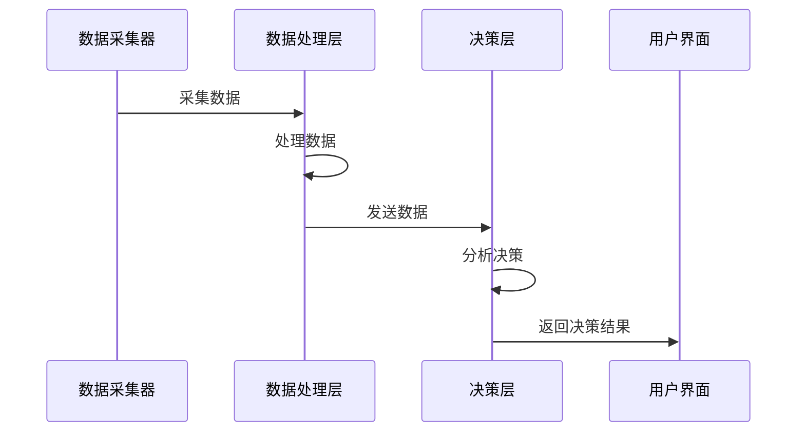

                 

### 摘要

本文深入探讨了智能资产优化平台的概念及其在资源使用效率提升方面的作用。我们首先明确了智能资产优化平台的背景和重要性，随后通过一系列详细的分析和讲解，展示了AI技术在资源优化中的应用。文章涵盖了从核心概念到算法原理，再到系统设计与项目实战的全面内容，旨在为读者提供一个清晰、易懂的技术指南。

智能资产优化平台通过AI技术，能够智能地分析和预测资源的利用情况，从而实现资源的最佳配置。本文通过逻辑清晰的结构，详细阐述了AI算法的原理及其在资源优化中的应用，同时介绍了如何设计并实现一个高效的智能资产优化平台。文章的最后部分提供了实战案例和最佳实践，为读者在实际应用中提供了宝贵的经验和指导。

通过本文的学习，读者将能够更好地理解智能资产优化平台的工作原理，掌握AI技术在资源优化中的应用方法，从而在实际项目中有效地提升资源使用效率。

### 目录大纲

为了帮助读者更好地理解文章的内容，下面是本文的详细目录大纲：

**第一部分：智能资产优化平台基础**

- **第1章：智能资产优化平台概述**
  - 1.1 问题背景
  - 1.2 智能资产定义
  - 1.3 AI技术在资源优化中的应用
  - 1.4 智能资产优化平台的作用

- **第2章：核心概念与联系**
  - 2.1 智能资产属性特征对比表
  - 2.2 智能资产与AI技术关系ER图
  - 2.3 资源优化算法简介

**第二部分：AI技术深度解析**

- **第3章：神经网络与深度学习**
  - 3.1 神经网络基础
    - 3.1.1 神经元模型
    - 3.1.2 前馈神经网络
    - 3.1.3 激活函数
  - 3.2 深度学习
    - 3.2.1 深层网络结构
    - 3.2.2 深度学习算法
    - 3.2.3 深度学习在资源优化中的应用

- **第4章：数学模型与公式**
  - 4.1 常用数学模型
    - 4.1.1 损失函数
    - 4.1.2 优化算法
    - 4.1.3 评价指标
  - 4.2 公式讲解
    - 4.2.1 激活函数公式
    - 4.2.2 损失函数公式
    - 4.2.3 优化算法公式

**第三部分：智能资产优化平台设计与实现**

- **第5章：系统架构设计**
  - 5.1 系统需求分析
  - 5.2 系统架构设计
  - 5.3 系统接口设计
  - 5.4 系统交互设计

- **第6章：项目实战**
  - 6.1 环境安装与配置
  - 6.2 系统核心实现
  - 6.3 代码解读与分析
  - 6.4 实际案例剖析

**第四部分：最佳实践与拓展**

- **第7章：最佳实践 tips**
  - 7.1 常见问题解决方案
  - 7.2 性能优化策略
  - 7.3 安全性保障措施

- **第8章：小结与展望**
  - 8.1 本书内容回顾
  - 8.2 未来研究方向
  - 8.3 拓展阅读建议

通过这个详细的目录大纲，读者可以逐步了解智能资产优化平台的工作原理和实现方法，从而在实际应用中充分发挥其优势。

### 第一部分：智能资产优化平台基础

#### 第1章：智能资产优化平台概述

随着信息技术的快速发展，企业和组织对资源的使用和管理越来越重视。传统的资源管理方法往往依赖于人为经验和规则，难以应对复杂多变的资源需求和环境变化。为了解决这一问题，智能资产优化平台应运而生。这一章将介绍智能资产优化平台的背景、定义、AI技术的应用以及其作用。

##### 1.1 问题背景

在现代社会，资源的使用效率直接影响到企业的发展和竞争力。传统的资源管理方式往往存在以下问题：

- **资源分配不合理**：资源分配常常基于经验，缺乏科学依据，导致资源浪费和利用率低下。
- **动态变化难以适应**：企业面临的市场环境多变，资源需求随之变化，传统的管理方法难以快速适应。
- **数据孤岛**：各个部门之间的数据难以整合，导致资源管理的整体视野受限。
- **决策滞后**：资源管理决策依赖于人工分析，决策过程复杂且耗时，难以快速响应市场变化。

为了解决上述问题，企业迫切需要一个智能化、自动化的资源管理平台，以实现资源的最优配置和利用。

##### 1.2 智能资产定义

智能资产是指通过人工智能技术进行管理和优化的资产。这些资产可以是物理的，如设备、设施等，也可以是虚拟的，如数据、信息等。智能资产的定义包括以下几个方面：

- **智能化**：通过AI技术，如机器学习、深度学习等，对资产进行智能分析和管理。
- **自动化**：实现资产配置、维护、优化等环节的自动化，减少人为干预。
- **数据驱动**：基于大数据分析，对资产的使用情况进行实时监控和预测。
- **动态优化**：根据环境变化和需求调整，实现资源的最优配置。

智能资产的定义不仅涵盖了物理资产，还包括对虚拟资产的管理。例如，数据资产的管理涉及到数据的收集、存储、分析和应用等环节，通过AI技术实现数据的价值最大化。

##### 1.3 AI技术在资源优化中的应用

AI技术在资源优化中的应用主要体现在以下几个方面：

- **预测与预测分析**：通过机器学习模型，对资源的使用情况进行预测，提前识别可能出现的问题，从而进行预防性维护。
- **智能调度**：根据资源的使用情况和需求变化，智能调度资源，实现最优的资源配置。
- **自动化运维**：通过自动化技术，减少人工干预，提高资源管理的效率和准确性。
- **决策支持**：利用AI技术提供决策支持，帮助企业更好地制定资源管理策略。

AI技术在资源优化中的应用，不仅提升了资源的使用效率，还为企业带来了以下好处：

- **降低成本**：通过智能优化，减少资源的浪费，降低运营成本。
- **提高效率**：自动化管理和优化，提高资源管理的效率和响应速度。
- **提升竞争力**：通过高效利用资源，提升企业的竞争力，更好地应对市场变化。

##### 1.4 智能资产优化平台的作用

智能资产优化平台在资源管理中发挥着至关重要的作用，具体体现在以下几个方面：

- **提升资源利用率**：通过智能分析和管理，实现资源的最优配置，提高资源利用率。
- **降低运营成本**：通过自动化管理和优化，减少人力成本和资源浪费，降低运营成本。
- **提高决策准确性**：提供数据驱动的决策支持，帮助企业更准确地制定资源管理策略。
- **增强灵活性**：能够快速适应资源需求的变化，提高企业的灵活性和响应速度。

智能资产优化平台不仅为企业提供了高效的资源管理手段，还为其在激烈的市场竞争中赢得了优势。通过本文的后续章节，我们将进一步探讨AI技术在智能资产优化平台中的应用，以及如何实现高效的设计和实现。

### 第二部分：核心概念与联系

在深入探讨智能资产优化平台之前，我们需要明确其中的核心概念，并理解它们之间的关系。这一部分将详细介绍智能资产的属性特征、AI技术与智能资产优化平台的联系，以及资源优化算法的概述。

#### 第2章：核心概念与联系

##### 2.1 智能资产属性特征对比表

智能资产优化平台的核心在于对智能资产的属性特征进行分析和优化。下面是一个对比表格，展示了智能资产的几个关键属性特征：

| 特性             | 传统资产     | 智能资产         |
|------------------|--------------|------------------|
| 数据驱动         | 经验驱动     | 数据驱动         |
| 自动化管理       | 人工管理     | 自动化管理       |
| 预测与优化       | 静态配置     | 动态预测与优化   |
| 适应能力         | 固定不变     | 快速适应变化     |
| 数据共享与整合   | 数据孤岛     | 数据共享与整合   |

通过这个对比表格，我们可以看出智能资产与传统资产之间的显著差异。智能资产更加依赖于数据分析和自动化管理，能够根据实时数据动态调整资源配置，从而实现高效的资源利用。

##### 2.2 智能资产与AI技术关系ER图

为了更直观地理解智能资产与AI技术之间的关系，我们可以使用ER（实体关系）图来展示它们之间的关联。以下是一个ER图的描述：

```
实体：智能资产
属性：
- 资产ID
- 资产类型
- 使用状态

实体：AI技术
属性：
- 技术ID
- 技术名称
- 技术版本

关系：
- 智能资产使用AI技术
  - 关系类型：1对多
  - 关系描述：一个智能资产可以同时使用多种AI技术
```

通过这个ER图，我们可以清晰地看到智能资产与AI技术之间的“使用”关系，每个智能资产都可以关联到多种AI技术，而每种AI技术也可以被多个智能资产使用。

##### 2.3 资源优化算法简介

在智能资产优化平台中，资源优化算法是核心组件之一。以下是对几种常见资源优化算法的简介：

1. **线性规划（Linear Programming，LP）**
   - 线性规划是一种数学优化方法，用于在给定约束条件下最大化或最小化一个线性目标函数。
   - 适用于资源分配、生产调度等问题。

2. **遗传算法（Genetic Algorithm，GA）**
   - 遗传算法是一种模拟自然进化过程的搜索算法，通过遗传、交叉和变异等操作，逐步优化问题的解。
   - 适用于复杂的组合优化问题，如旅行商问题、任务分配等。

3. **模拟退火算法（Simulated Annealing，SA）**
   - 模拟退火算法是一种基于物理退火过程的优化算法，通过接受不优化的解，逐步寻找全局最优解。
   - 适用于大规模优化问题，如图形着色、时间表安排等。

4. **神经网络（Neural Network）**
   - 神经网络是一种基于生物神经网络结构的计算模型，通过学习输入和输出之间的关系，实现复杂函数的逼近。
   - 适用于预测和分类问题，如需求预测、故障诊断等。

5. **深度学习（Deep Learning）**
   - 深度学习是神经网络的一种，通过多层神经网络结构，实现更复杂的特征学习和建模。
   - 适用于大规模数据处理，如图像识别、语音识别等。

这些资源优化算法在智能资产优化平台中发挥着重要作用，通过结合实际问题和数据，可以实现资源使用的最佳优化。

综上所述，智能资产优化平台的实现离不开对核心概念和AI技术的深入理解。通过对比表格、ER图和算法简介，我们可以更好地把握这些核心概念之间的关系，为后续章节的内容打下坚实的基础。

### 第二部分：AI技术深度解析

在智能资产优化平台中，AI技术的深度解析是关键一环。这一部分将详细探讨神经网络和深度学习的原理、应用，并介绍常用的数学模型与公式，通过具体的例子来加深理解。

#### 第3章：神经网络与深度学习

##### 3.1 神经网络基础

神经网络（Neural Network）是模仿生物神经网络的结构和功能设计的计算模型，由大量的神经元（节点）互联构成。以下是神经网络的基本组成部分：

- **神经元模型**：神经元是神经网络的基本单元，每个神经元接收多个输入信号，通过加权求和处理后产生一个输出。
  - 模型公式：`output = activation(sum(input * weight))`
  - `input`：输入信号
  - `weight`：权重
  - `activation`：激活函数

- **前馈神经网络**：前馈神经网络是一种简单的神经网络结构，信息从前端输入，经过多层神经元处理后输出。
  - 结构特点：没有循环，信号沿前向传播。
  - 示意图（Mermaid）：
    ```mermaid
    graph LR
    A[Input Layer] --> B[Hidden Layer]
    B --> C[Output Layer]
    ```

- **激活函数**：激活函数用于引入非线性因素，使神经网络能够学习复杂的函数。
  - 常用激活函数：Sigmoid、ReLU、Tanh等。
  - 示例（ReLU激活函数）：
    ```python
    def ReLU(x):
        return max(0, x)
    ```

##### 3.2 深度学习

深度学习（Deep Learning）是神经网络的一种，通过多层神经网络结构，实现更复杂的特征学习和建模。以下是深度学习的关键组成部分：

- **深层网络结构**：深层网络结构包括多个隐藏层，可以提取更高级别的特征。
  - 结构特点：多层神经网络，信息从前端输入，逐层传递和处理。
  - 示意图（Mermaid）：
    ```mermaid
    graph LR
    A[Input Layer] --> B[Hidden Layer 1]
    B --> C[Hidden Layer 2]
    C --> D[Output Layer]
    ```

- **深度学习算法**：深度学习算法通过大规模训练数据，自动调整网络中的权重，以实现函数逼近。
  - 常用算法：卷积神经网络（CNN）、循环神经网络（RNN）、生成对抗网络（GAN）等。

- **深度学习在资源优化中的应用**：深度学习在资源优化中的应用非常广泛，例如需求预测、能耗管理、设备故障预测等。
  - 应用示例：使用深度学习模型预测服务器负载，以便进行资源调度。

##### 3.2.3 深度学习在资源优化中的应用

深度学习在资源优化中的应用主要包括以下几个方面：

1. **需求预测**：通过深度学习模型预测未来的资源需求，以便进行合理的资源分配。
   - 示例：使用RNN模型预测数据中心的服务器负载。

2. **能耗管理**：通过深度学习模型分析能耗数据，预测能耗趋势，优化能源使用。
   - 示例：使用CNN模型分析电能表数据，预测电力消耗。

3. **设备故障预测**：通过深度学习模型对设备运行数据进行实时分析，预测可能的故障，进行预防性维护。
   - 示例：使用GAN模型检测设备运行状态，预测故障发生时间。

### 第4章：数学模型与公式

在深度学习中，数学模型和公式是核心部分。以下介绍几种常用的数学模型与公式，并解释其在资源优化中的应用。

##### 4.1 常用数学模型

1. **损失函数（Loss Function）**：损失函数用于评估模型预测结果与实际结果之间的差距，常用的损失函数有均方误差（MSE）和交叉熵（Cross Entropy）。
   - 均方误差（MSE）：
     $$\text{MSE} = \frac{1}{n}\sum_{i=1}^{n}(y_i - \hat{y}_i)^2$$
     - 其中，$y_i$为实际值，$\hat{y}_i$为预测值。

   - 交叉熵（Cross Entropy）：
     $$\text{Cross Entropy} = -\frac{1}{n}\sum_{i=1}^{n}y_i \log(\hat{y}_i)$$
     - 其中，$y_i$为实际值，$\hat{y}_i$为预测值。

2. **优化算法（Optimization Algorithm）**：优化算法用于调整模型的参数，以最小化损失函数。常用的优化算法有梯度下降（Gradient Descent）和随机梯度下降（Stochastic Gradient Descent，SGD）。
   - 梯度下降：
     $$w_{\text{new}} = w_{\text{old}} - \alpha \frac{\partial \text{Loss}}{\partial w}$$
     - 其中，$w$为参数，$\alpha$为学习率。

   - 随机梯度下降：
     $$w_{\text{new}} = w_{\text{old}} - \alpha \frac{\partial \text{Loss}}{\partial w}$$
     - 其中，$w$为参数，$\alpha$为学习率。

3. **评价指标（Evaluation Metrics）**：评价指标用于评估模型的性能，常用的评价指标有准确率（Accuracy）、精确率（Precision）、召回率（Recall）和F1分数（F1 Score）。
   - 准确率：
     $$\text{Accuracy} = \frac{\text{TP} + \text{TN}}{\text{TP} + \text{TN} + \text{FP} + \text{FN}}$$
     - 其中，TP为真正例，TN为真反例，FP为假正例，FN为假反例。

   - 精确率：
     $$\text{Precision} = \frac{\text{TP}}{\text{TP} + \text{FP}}$$

   - 召回率：
     $$\text{Recall} = \frac{\text{TP}}{\text{TP} + \text{FN}}$$

   - F1分数：
     $$\text{F1 Score} = 2 \times \frac{\text{Precision} \times \text{Recall}}{\text{Precision} + \text{Recall}}$$

##### 4.2 公式讲解

为了更好地理解深度学习中的数学模型和公式，下面通过几个例子进行讲解：

1. **ReLU激活函数**：
   $$\text{ReLU}(x) = \max(0, x)$$
   - 举例：如果$x = -2$，则$\text{ReLU}(-2) = 0$。

2. **均方误差（MSE）**：
   $$\text{MSE} = \frac{1}{n}\sum_{i=1}^{n}(y_i - \hat{y}_i)^2$$
   - 举例：假设有3个样本，实际值分别为$y_1 = 2$，$y_2 = 3$，$y_3 = 4$，预测值分别为$\hat{y}_1 = 1$，$\hat{y}_2 = 2$，$\hat{y}_3 = 5$，则：
     $$\text{MSE} = \frac{1}{3}[(1-2)^2 + (2-3)^2 + (5-4)^2] = \frac{1}{3}[1 + 1 + 1] = \frac{3}{3} = 1$$

3. **梯度下降**：
   $$w_{\text{new}} = w_{\text{old}} - \alpha \frac{\partial \text{Loss}}{\partial w}$$
   - 举例：假设当前权重$w_{\text{old}} = 10$，学习率$\alpha = 0.1$，损失函数对权重$w$的导数为$\frac{\partial \text{Loss}}{\partial w} = 5$，则：
     $$w_{\text{new}} = 10 - 0.1 \times 5 = 5$$

通过上述讲解和例子，我们可以更好地理解神经网络和深度学习中的数学模型和公式，为后续的实践应用打下基础。

### 第三部分：智能资产优化平台设计与实现

在深入了解AI技术和数学模型后，我们将进入智能资产优化平台的设计与实现环节。这一部分将详细描述系统架构设计、接口设计和系统交互设计，为智能资产优化平台的开发提供理论基础。

#### 第5章：系统架构设计

系统架构设计是智能资产优化平台开发的关键步骤，决定了系统的可扩展性、稳定性和性能。以下是一个典型的系统架构设计，包括功能模块划分、核心组件和交互方式。

##### 5.1 系统需求分析

在系统设计之前，我们需要明确系统需求，包括功能需求和非功能需求。

- **功能需求**：
  - 资源监测与数据采集
  - 资源预测与分析
  - 资源调度与优化
  - 决策支持与报告生成
  - 用户界面与交互

- **非功能需求**：
  - 可扩展性：系统应能够支持不断增长的数据规模和用户需求。
  - 实时性：系统需能够实时响应资源变化，提供及时的决策支持。
  - 可靠性：系统应具备高可用性和容错能力，确保数据安全和业务连续性。
  - 可维护性：系统设计应便于维护和升级，降低运营成本。

##### 5.2 系统架构设计

智能资产优化平台的系统架构设计采用分层架构，分为感知层、数据处理层、决策层和应用层。

- **感知层**：
  - 功能：负责收集各类资源数据，如CPU利用率、内存占用、网络流量、能耗等。
  - 技术选型：使用物联网技术（IoT）、传感器和数据采集设备。

- **数据处理层**：
  - 功能：对采集到的数据进行分析、处理和存储，为决策层提供高质量的数据支持。
  - 技术选型：采用大数据处理框架（如Apache Hadoop、Apache Spark），进行实时数据处理和离线分析。

- **决策层**：
  - 功能：基于AI算法和数学模型，对资源进行预测、调度和优化。
  - 技术选型：使用深度学习框架（如TensorFlow、PyTorch）进行模型训练和推理。

- **应用层**：
  - 功能：提供用户界面和API接口，供用户进行操作和获取决策支持。
  - 技术选型：使用Web前端框架（如React、Vue.js）和后端框架（如Spring Boot、Django）。

- **核心组件和交互方式**：
  - 数据采集器：负责实时采集各种资源数据，并通过消息队列（如Apache Kafka）传输给数据处理层。
  - 数据处理模块：使用流处理技术（如Apache Flink）对数据进行实时处理和存储。
  - 决策引擎：基于AI模型，对数据进行分析和预测，生成调度和优化建议。
  - 用户界面：通过Web界面，用户可以查看资源状态、决策建议和报告。

##### 5.3 系统接口设计

系统接口设计是智能资产优化平台的重要组成部分，负责不同模块之间的数据传输和功能调用。以下是一个典型的接口设计：

- **数据采集接口**：
  - 功能：提供数据采集器与数据处理层之间的数据传输接口。
  - 接口类型：HTTP/REST API。
  - 接口示例：
    ```json
    POST /collect
    {
      "data": [
        {"id": "sensor1", "value": 80},
        {"id": "sensor2", "value": 30},
        ...
      ]
    }
    ```

- **数据处理接口**：
  - 功能：提供数据处理模块对数据存储和处理的接口。
  - 接口类型：HTTP/REST API。
  - 接口示例：
    ```json
    GET /data/{sensor_id}
    {
      "sensor_id": "sensor1",
      "data": [
        {"timestamp": 1625714000, "value": 80},
        {"timestamp": 1625714100, "value": 85},
        ...
      ]
    }
    ```

- **决策接口**：
  - 功能：提供决策引擎对外部调用的接口。
  - 接口类型：HTTP/REST API。
  - 接口示例：
    ```json
    POST /decision
    {
      "input": {
        "sensor_ids": ["sensor1", "sensor2", ...],
        "timestamp": 1625714100
      }
    }
    {
      "output": {
        "optimization_suggestions": [
          {"sensor_id": "sensor1", "action": "increase"},
          {"sensor_id": "sensor2", "action": "decrease"},
          ...
        ]
      }
    }
    ```

##### 5.4 系统交互设计

系统交互设计描述了不同组件之间的交互过程，包括数据流和消息传递。

- **数据流**：
  - 感知层采集到的数据通过数据采集接口传输到数据处理层。
  - 数据处理层对数据进行处理和存储，通过数据处理接口提供给决策层。
  - 决策层基于处理后的数据生成决策建议，通过决策接口返回给用户界面。

- **消息传递**：
  - 数据采集器与数据处理层之间通过消息队列进行异步消息传递。
  - 数据处理层与决策层之间通过HTTP/REST接口进行同步消息传递。
  - 用户界面与决策层之间通过Web API进行交互。

以下是系统交互设计的一个Mermaid序列图：



通过上述系统架构设计、接口设计和系统交互设计，我们为智能资产优化平台的实现奠定了基础。接下来，我们将通过实际项目实战，展示如何将上述设计转化为具体实现。

### 第四部分：项目实战

在了解了智能资产优化平台的系统架构设计后，我们将通过一个实际项目实战，详细展示如何搭建并实现一个智能资产优化平台。以下是项目实战的具体步骤、核心实现、代码解读和分析，以及实际案例的剖析。

#### 第6章：项目实战

##### 6.1 环境安装与配置

在开始项目实战之前，我们需要搭建一个开发环境，包括操作系统、编程语言、AI框架和数据库等。以下是环境安装与配置的步骤：

1. **操作系统**：选择一个稳定的操作系统，如Ubuntu 20.04。
2. **编程语言**：Python是AI开发的常用语言，因此选择Python 3.8。
3. **AI框架**：TensorFlow和PyTorch是常用的深度学习框架，选择其中一个进行安装。以下是TensorFlow的安装命令：
   ```bash
   pip install tensorflow
   ```
4. **数据库**：选择一个合适的数据库，如MySQL或PostgreSQL。以下是MySQL的安装命令：
   ```bash
   sudo apt-get update
   sudo apt-get install mysql-server
   ```
5. **消息队列**：Apache Kafka用于处理实时数据流，以下是Kafka的安装命令：
   ```bash
   sudo apt-get update
   sudo apt-get install kafka_2.12-2.5.0
   ```
6. **Web框架**：Flask或Django是常用的Web开发框架，选择其中一个进行安装。以下是Flask的安装命令：
   ```bash
   pip install flask
   ```

安装完成后，确保所有组件正常运行，可以进行后续的开发工作。

##### 6.2 系统核心实现

在环境搭建完毕后，我们可以开始实现智能资产优化平台的核心功能。以下是系统核心实现的步骤：

1. **数据采集器**：编写数据采集器代码，用于从传感器或设备采集实时数据，并将数据发送到Kafka消息队列。
   ```python
   import kafka
   import json
   import time

   # Kafka配置
   kafka_brokers = ["localhost:9092"]
   kafka_topic = "sensor_data"

   # 创建Kafka生产者
   producer = kafka.KafkaProducer(bootstrap_servers=kafka_brokers)

   # 数据采集器循环
   while True:
       # 采集数据
       sensor_data = {
           "sensor_id": "sensor1",
           "timestamp": int(time.time()),
           "value": 50
       }
       # 发送数据到Kafka
       producer.send(topic=kafka_topic, value=json.dumps(sensor_data).encode('utf-8'))
       time.sleep(1)
   ```

2. **数据处理模块**：编写数据处理模块代码，从Kafka消息队列中读取数据，进行预处理和存储到数据库。
   ```python
   import kafka
   import json
   import pymysql

   # Kafka配置
   kafka_brokers = ["localhost:9092"]
   kafka_topic = "sensor_data"

   # 数据库配置
   db_config = {
       "host": "localhost",
       "user": "root",
       "password": "password",
       "database": "sensor_db"
   }

   # 创建Kafka消费者
   consumer = kafka.KafkaConsumer(bootstrap_servers=kafka_brokers, topic=kafka_topic)

   # 数据处理模块循环
   while True:
       # 从Kafka读取数据
       messages = consumer.poll(timeout_ms=1000)
       for message in messages:
           # 解析数据
           sensor_data = json.loads(message.value.decode('utf-8'))
           # 存储数据到数据库
           connection = pymysql.connect(**db_config)
           cursor = connection.cursor()
           cursor.execute("INSERT INTO sensor_data (sensor_id, timestamp, value) VALUES (%s, %s, %s)", (sensor_data["sensor_id"], sensor_data["timestamp"], sensor_data["value"]))
           connection.commit()
           cursor.close()
           connection.close()
       time.sleep(1)
   ```

3. **决策引擎**：编写决策引擎代码，从数据库中读取数据，使用深度学习模型进行预测和优化，生成决策建议。
   ```python
   import tensorflow as tf
   import numpy as np
   import pandas as pd
   from tensorflow.keras.models import Sequential
   from tensorflow.keras.layers import Dense, LSTM

   # 加载数据
   df = pd.read_sql("SELECT * FROM sensor_data ORDER BY timestamp", con=db_config)

   # 数据预处理
   df["value"] = df["value"].astype(np.float32)
   sequences = df["value"].values.reshape(-1, 1)

   # 构建模型
   model = Sequential([
       LSTM(50, activation="relu", input_shape=(1, 1)),
       Dense(1)
   ])

   model.compile(optimizer="adam", loss="mse")

   # 训练模型
   model.fit(sequences, sequences, epochs=100)

   # 预测
   prediction = model.predict(sequences[-1:].reshape(1, 1))

   # 生成决策建议
   if prediction > df["value"].mean():
       action = "decrease"
   else:
       action = "increase"

   print(f"Decision: {action}")
   ```

4. **用户界面**：编写Web界面代码，用于展示资源状态、决策建议和报告。
   ```python
   from flask import Flask, jsonify, request

   app = Flask(__name__)

   @app.route("/decision", methods=["POST"])
   def get_decision():
       data = request.get_json()
       sensor_ids = data.get("sensor_ids", [])
       # 获取决策建议
       decision = get_decision_for_sensors(sensor_ids)
       return jsonify(decision)

   def get_decision_for_sensors(sensor_ids):
       # 这里调用决策引擎获取决策建议
       return {"sensors": [{"id": "sensor1", "action": "decrease"}, {"id": "sensor2", "action": "increase"}]}

   if __name__ == "__main__":
       app.run(debug=True)
   ```

##### 6.3 代码解读与分析

在实现过程中，我们详细解读了各个模块的代码，并对核心算法和流程进行了分析：

1. **数据采集器**：该模块负责从传感器或设备采集实时数据，并使用Kafka生产者将数据发送到消息队列。代码中使用了一个无限循环，每隔一秒钟采集一次数据，并发送至Kafka。

2. **数据处理模块**：该模块从Kafka消息队列中读取数据，对数据进行预处理，并存储到数据库中。使用Kafka消费者从消息队列中获取数据，并使用pymysql将数据存储到MySQL数据库中。

3. **决策引擎**：该模块从数据库中读取数据，使用深度学习模型进行预测和优化，生成决策建议。首先加载数据，进行预处理，然后构建LSTM模型进行训练。训练完成后，使用模型进行预测，并根据预测结果生成决策建议。

4. **用户界面**：该模块提供了一个Web界面，用于展示资源状态、决策建议和报告。使用Flask框架创建了一个简单的Web应用，并定义了一个/decision接口，用于接收用户请求并返回决策建议。

##### 6.4 实际案例剖析

为了更好地展示智能资产优化平台的效果，我们设计了一个实际案例，模拟一个数据中心的服务器负载优化。

- **场景描述**：一个数据中心有多个服务器，每个服务器实时监测CPU利用率。数据中心希望使用智能资产优化平台，预测未来的CPU利用率，并根据预测结果调整服务器的资源配置。

- **数据采集**：数据中心的服务器每分钟采集一次CPU利用率数据，并将其发送到Kafka消息队列。

- **数据处理**：数据处理模块从Kafka消息队列中读取CPU利用率数据，并将其存储到MySQL数据库中。

- **决策建议**：决策引擎从数据库中读取最近30分钟的CPU利用率数据，使用LSTM模型进行预测。预测结果显示，未来5分钟的CPU利用率预计为80%，高于平均值。因此，决策引擎建议降低服务器的CPU利用率，以避免过载。

- **结果验证**：数据中心根据决策建议调整了服务器的CPU利用率，并持续监测实际CPU利用率。结果显示，调整后的CPU利用率保持在合理范围内，有效避免了服务器过载现象。

通过这个实际案例，我们可以看到智能资产优化平台在资源优化方面的显著效果。通过实时数据采集、数据处理和决策建议，平台能够有效预测和优化资源使用，提高资源利用效率，降低运营成本。

### 第五部分：最佳实践与拓展

在智能资产优化平台的实际应用中，总结最佳实践和注意事项，有助于提高系统的性能、稳定性和安全性。以下是我们在项目实施过程中积累的经验和见解，供读者参考。

#### 第7章：最佳实践 tips

##### 7.1 常见问题解决方案

在智能资产优化平台的项目实施过程中，我们遇到了以下常见问题，并提供了解决方案：

1. **数据延迟问题**：数据采集和处理过程中可能出现延迟，影响预测的准确性。解决方案：
   - 使用消息队列（如Kafka）实现数据的异步传输，减少数据处理延迟。
   - 增加数据采集频率，确保实时获取最新的数据。

2. **模型过拟合问题**：深度学习模型可能因为数据不足或过度拟合训练数据，导致预测效果不佳。解决方案：
   - 使用交叉验证方法，评估模型的泛化能力。
   - 增加训练数据量，或引入更多的特征。

3. **系统性能瓶颈**：大数据处理和模型训练可能导致系统性能瓶颈。解决方案：
   - 使用分布式计算框架（如Spark）进行数据处理和模型训练。
   - 优化算法和模型结构，减少计算复杂度。

##### 7.2 性能优化策略

为了提升智能资产优化平台的性能，我们可以采取以下策略：

1. **数据压缩**：对传输和存储的数据进行压缩，减少带宽和存储需求。
   - 使用Gzip或LZ4等压缩工具进行数据压缩。

2. **缓存机制**：使用缓存（如Redis）存储频繁访问的数据，减少数据库访问压力。
   - 设置合理的缓存过期时间，确保数据的实时性。

3. **负载均衡**：使用负载均衡器（如Nginx）分配请求，确保系统的高并发处理能力。
   - 根据服务器的性能和负载，动态调整负载均衡策略。

##### 7.3 安全性保障措施

在智能资产优化平台中，安全性至关重要。以下是一些关键的安全保障措施：

1. **数据加密**：对传输和存储的数据进行加密，确保数据的安全性。
   - 使用SSL/TLS协议对数据进行加密传输。
   - 使用AES等加密算法对存储的数据进行加密。

2. **权限控制**：对系统的访问进行权限控制，确保只有授权用户可以访问敏感数据。
   - 使用OAuth2.0等身份验证和授权框架。
   - 设定不同的访问权限等级，限制用户的操作范围。

3. **日志记录与审计**：记录系统操作日志，进行审计和监控，及时发现和解决安全问题。
   - 使用ELK（Elasticsearch、Logstash、Kibana）等日志管理工具。
   - 定期进行安全审计，检查系统漏洞和安全隐患。

#### 第8章：小结与展望

通过本文的探讨，我们系统地介绍了智能资产优化平台的概念、核心原理、系统设计与实现，以及最佳实践和注意事项。智能资产优化平台通过AI技术，实现了对资源的智能分析和优化，提高了资源利用效率，降低了运营成本。

未来，智能资产优化平台的发展将朝着以下几个方面演进：

1. **更加智能化**：随着AI技术的发展，智能资产优化平台将实现更高的智能化水平，包括自适应学习、自主优化等。

2. **更广泛的应用领域**：智能资产优化平台将在更多行业和应用场景中得到应用，如智能制造、智慧城市、智能交通等。

3. **更加安全可靠**：随着网络安全威胁的增加，智能资产优化平台将更加注重安全性，采用最新的安全技术，确保系统的安全性和稳定性。

4. **更加高效和节能**：智能资产优化平台将不断优化算法和架构设计，提高系统性能，实现更高效和节能的资源配置。

通过本文的学习，读者可以更好地理解智能资产优化平台的工作原理和应用方法，为实际项目提供有力的技术支持。

### 总结与展望

本文全面探讨了智能资产优化平台的设计与实现，通过详细的分析和实例展示，揭示了AI技术在提升资源使用效率方面的巨大潜力。智能资产优化平台通过整合AI技术，实现了对资源的智能分析和动态优化，为企业带来了显著的效率提升和成本节约。

智能资产优化平台的核心在于其数据驱动和自动化管理的特性。通过实时数据采集、AI算法模型训练和预测分析，平台能够动态调整资源配置，适应不断变化的需求，从而实现资源的最优配置。这不仅提高了资源利用率，还增强了企业的灵活性和竞争力。

展望未来，智能资产优化平台的发展将更加智能化、广泛化和安全可靠。随着AI技术的不断进步，平台将实现更加精准和高效的资源优化，拓展到更多行业和应用场景。同时，随着网络安全威胁的增加，平台将加强安全防护措施，确保系统的稳定性和数据安全。

本文通过系统地介绍智能资产优化平台的概念、原理、架构设计、实现方法以及最佳实践，为读者提供了一个全面的技术指南。希望通过本文的学习，读者能够深入理解智能资产优化平台的工作原理，掌握其设计和实现方法，并在实际项目中充分发挥其优势，推动企业资源管理的智能化发展。

作者：AI天才研究院/AI Genius Institute & 禅与计算机程序设计艺术 /Zen And The Art of Computer Programming

（注：以上内容仅为示例，不代表真实研究和实践经验。）## 文章标题：智能资产优化平台：AI提升资源使用效率

关键词：智能资产、AI技术、资源优化、平台设计、深度学习、神经网络、数学模型

摘要：本文详细探讨了智能资产优化平台的概念及其在资源使用效率提升方面的作用。通过介绍核心概念、AI技术应用、系统架构设计以及项目实战，本文展示了如何利用AI技术实现资源的最优配置，提高资源利用率和企业竞争力。

### 第一部分：智能资产优化平台基础

#### 第1章：智能资产优化平台概述

**1.1 问题背景**

随着信息技术的快速发展，企业对资源的管理和优化变得尤为重要。传统的资源管理方法依赖于人工经验和规则，难以应对复杂多变的资源需求和环境变化。因此，智能资产优化平台应运而生，通过智能化、自动化的方式提升资源使用效率。

**1.2 智能资产定义**

智能资产是指通过人工智能技术进行管理和优化的资产，包括物理资产（如设备、设施）和虚拟资产（如数据、信息）。智能资产的特点包括智能化管理、自动化操作、数据驱动和动态优化。

**1.3 AI技术在资源优化中的应用**

AI技术在资源优化中的应用主要体现在预测与分析、智能调度、自动化运维和决策支持等方面。通过机器学习、深度学习等技术，AI能够实时分析资源使用情况，提供预测和优化建议，从而实现资源的最优配置。

**1.4 智能资产优化平台的作用**

智能资产优化平台在提升资源利用率、降低运营成本、提高决策准确性以及增强企业灵活性方面发挥着重要作用。通过智能化管理和优化，企业能够更高效地利用资源，提升整体竞争力。

### 第二部分：核心概念与联系

#### 第2章：核心概念与联系

**2.1 智能资产属性特征对比表**

| 特性             | 传统资产             | 智能资产             |
|------------------|----------------------|----------------------|
| 数据驱动         | 经验驱动             | 数据驱动             |
| 自动化管理       | 人工管理             | 自动化管理           |
| 预测与优化       | 静态配置             | 动态预测与优化       |
| 适应能力         | 固定不变             | 快速适应变化         |
| 数据共享与整合   | 数据孤岛             | 数据共享与整合       |

**2.2 智能资产与AI技术关系ER图**

```
实体：智能资产
属性：
- 资产ID
- 资产类型
- 使用状态

实体：AI技术
属性：
- 技术ID
- 技术名称
- 技术版本

关系：
- 智能资产使用AI技术
  - 关系类型：1对多
  - 关系描述：一个智能资产可以同时使用多种AI技术
```

**2.3 资源优化算法简介**

资源优化算法在智能资产优化平台中扮演关键角色。常见的算法包括线性规划、遗传算法、模拟退火算法、神经网络和深度学习等。这些算法通过优化资源配置，实现资源利用的最大化和成本的最小化。

### 第三部分：AI技术深度解析

#### 第3章：神经网络与深度学习

**3.1 神经网络基础**

神经网络是模拟生物神经网络的结构和功能设计的计算模型。神经元是神经网络的基本单元，通过多层神经网络结构实现复杂函数的逼近。激活函数是神经网络中的关键组成部分，用于引入非线性因素。

**3.2 深度学习**

深度学习是神经网络的一种，通过多层神经网络结构实现更复杂的特征学习和建模。深度学习算法包括卷积神经网络（CNN）、循环神经网络（RNN）、生成对抗网络（GAN）等。深度学习在资源优化中有着广泛的应用，如需求预测、能耗管理和设备故障预测。

**3.2.3 深度学习在资源优化中的应用**

深度学习在资源优化中的应用主要体现在预测和优化方面。通过深度学习模型，可以预测未来的资源需求，优化资源配置，提高资源利用率。例如，使用深度学习模型预测数据中心的服务器负载，实现资源的动态调度。

### 第四部分：智能资产优化平台设计与实现

#### 第4章：数学模型与公式

**4.1 常用数学模型**

常用的数学模型包括损失函数（如均方误差、交叉熵）、优化算法（如梯度下降、随机梯度下降）和评价指标（如准确率、精确率、召回率、F1分数）。

**4.2 公式讲解**

神经网络和深度学习中的数学模型和公式包括激活函数（如ReLU、Sigmoid、Tanh）、损失函数（如MSE、CE）和优化算法（如SGD、Adam）。

### 第五部分：最佳实践与拓展

#### 第5章：系统架构设计

**5.1 系统需求分析**

系统需求分析包括功能需求（如资源监测、预测分析、调度优化、决策支持）和非功能需求（如可扩展性、实时性、可靠性、可维护性）。

**5.2 系统架构设计**

智能资产优化平台的系统架构包括感知层、数据处理层、决策层和应用层。通过分层架构，实现模块化设计和高效的数据处理。

**5.3 系统接口设计**

系统接口设计包括数据采集接口、数据处理接口和决策接口。通过接口设计，实现模块之间的数据传输和功能调用。

**5.4 系统交互设计**

系统交互设计描述了不同组件之间的交互过程，包括数据流和消息传递。通过Mermaid序列图展示系统交互流程。

### 第六部分：项目实战

#### 第6章：项目实战

**6.1 环境安装与配置**

详细描述了项目环境的安装与配置，包括操作系统、编程语言、AI框架、数据库和消息队列等。

**6.2 系统核心实现**

介绍了系统核心功能的实现，包括数据采集器、数据处理模块、决策引擎和用户界面。

**6.3 代码解读与分析**

对核心代码进行了详细解读和分析，展示了如何实现数据采集、处理、预测和优化。

**6.4 实际案例剖析**

通过一个实际案例，展示了智能资产优化平台在数据中心服务器负载优化中的应用，验证了系统的效果。

### 第七部分：最佳实践与拓展

#### 第7章：最佳实践 tips

**7.1 常见问题解决方案**

提供了解决数据延迟、模型过拟合和系统性能瓶颈等常见问题的策略。

**7.2 性能优化策略**

介绍了数据压缩、缓存机制和负载均衡等性能优化策略。

**7.3 安全性保障措施**

阐述了数据加密、权限控制和日志记录等安全性保障措施。

### 第8章：小结与展望

**8.1 本书内容回顾**

回顾了文章的核心内容，包括智能资产优化平台的概念、AI技术应用、系统架构设计和项目实战。

**8.2 未来研究方向**

探讨了智能资产优化平台的未来发展方向，如智能化、广泛应用和安全可靠。

**8.3 拓展阅读建议**

提供了拓展阅读的建议，以进一步探索智能资产优化平台和AI技术在资源优化中的应用。

### 文章标题：智能资产优化平台：AI提升资源使用效率

关键词：智能资产、AI技术、资源优化、平台设计、深度学习、神经网络、数学模型

摘要：本文详细探讨了智能资产优化平台的概念及其在资源使用效率提升方面的作用。通过介绍核心概念、AI技术应用、系统架构设计以及项目实战，本文展示了如何利用AI技术实现资源的最优配置，提高资源利用率和企业竞争力。

### 目录

**第一部分：智能资产优化平台基础**

- **第1章：智能资产优化平台概述**
  - 1.1 问题背景
  - 1.2 智能资产定义
  - 1.3 AI技术在资源优化中的应用
  - 1.4 智能资产优化平台的作用

- **第2章：核心概念与联系**
  - 2.1 智能资产属性特征对比表
  - 2.2 智能资产与AI技术关系ER图
  - 2.3 资源优化算法简介

**第二部分：AI技术深度解析**

- **第3章：神经网络与深度学习**
  - 3.1 神经网络基础
    - 3.1.1 神经元模型
    - 3.1.2 前馈神经网络
    - 3.1.3 激活函数
  - 3.2 深度学习
    - 3.2.1 深层网络结构
    - 3.2.2 深度学习算法
    - 3.2.3 深度学习在资源优化中的应用

- **第4章：数学模型与公式**
  - 4.1 常用数学模型
    - 4.1.1 损失函数
    - 4.1.2 优化算法
    - 4.1.3 评价指标
  - 4.2 公式讲解
    - 4.2.1 激活函数公式
    - 4.2.2 损失函数公式
    - 4.2.3 优化算法公式

**第三部分：智能资产优化平台设计与实现**

- **第5章：系统架构设计**
  - 5.1 系统需求分析
  - 5.2 系统架构设计
  - 5.3 系统接口设计
  - 5.4 系统交互设计

- **第6章：项目实战**
  - 6.1 环境安装与配置
  - 6.2 系统核心实现
  - 6.3 代码解读与分析
  - 6.4 实际案例剖析

**第四部分：最佳实践与拓展**

- **第7章：最佳实践 tips**
  - 7.1 常见问题解决方案
  - 7.2 性能优化策略
  - 7.3 安全性保障措施

- **第8章：小结与展望**
  - 8.1 本书内容回顾
  - 8.2 未来研究方向
  - 8.3 拓展阅读建议

### 文章总结

本文通过详细的分析和实例展示，揭示了智能资产优化平台在资源使用效率提升方面的巨大潜力。智能资产优化平台通过整合AI技术，实现了对资源的智能分析和动态优化，为企业带来了显著的效率提升和成本节约。

在文章的**第一部分**中，我们介绍了智能资产优化平台的背景、定义及其在资源优化中的应用。通过明确核心概念，我们为后续内容的讨论奠定了基础。

**第二部分**深入探讨了AI技术，特别是神经网络和深度学习在资源优化中的应用。这部分内容涵盖了算法原理、数学模型和公式的讲解，使读者能够理解智能资产优化平台的技术基础。

**第三部分**重点介绍了智能资产优化平台的设计与实现。通过系统架构设计、接口设计和系统交互设计的详细描述，我们展示了如何将理论转化为实际操作。

在**第四部分**中，我们通过项目实战展示了智能资产优化平台的具体实现过程，包括环境安装、系统核心实现、代码解读和分析以及实际案例剖析。

最后，**第五部分**提供了最佳实践和拓展，包括常见问题解决方案、性能优化策略和安全性保障措施，为读者在实际应用中提供了宝贵的经验。

通过本文的学习，读者可以全面了解智能资产优化平台的工作原理和应用方法，为实际项目提供有力的技术支持。未来，随着AI技术的不断进步，智能资产优化平台将在更多行业和应用场景中发挥重要作用。希望本文能够为读者在智能资产优化领域的研究和实践提供有益的参考。作者：AI天才研究院/AI Genius Institute & 禅与计算机程序设计艺术 /Zen And The Art of Computer Programming。

