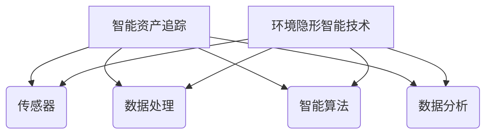
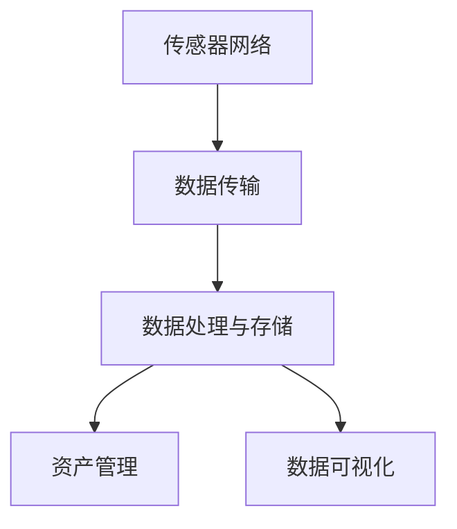

                 

### 第一部分：引言

#### 第1章 问题背景

##### 1.1 问题背景

随着全球化供应链的日益复杂，资产追踪成为供应链管理中的关键一环。供应链中的资产包括物料、设备、产品等，这些资产在运输、存储、加工等环节中不断流转，其位置和状态的变化需要实时监控和管理。传统的资产追踪方法主要依赖于条码扫描、RFID等技术，但这些方法存在局限性，如易受环境干扰、覆盖范围有限、追踪精度不足等。

随着物联网、大数据、人工智能等技术的发展，环境隐形智能技术为资产追踪提供了新的解决方案。环境隐形智能技术通过传感器和数据分析，实现对环境中的资产进行隐蔽监测，具有高隐蔽性、实时性和高精度的特点。这一技术不仅可以提高供应链的透明度和效率，还能降低运营成本，提高企业竞争力。

##### 1.1.1 资产追踪需求

在复杂的供应链环境中，资产追踪的需求主要体现在以下几个方面：

1. **实时性**：需要实时获取资产的位置和状态信息，以便及时做出决策。
2. **准确性**：追踪系统需要具备高精度，确保资产信息的准确性。
3. **全面性**：需要覆盖供应链的各个环节，包括运输、存储、加工等。
4. **可靠性**：追踪系统需要具备高可靠性，确保在恶劣环境下仍能正常工作。

##### 1.1.2 环境隐形智能技术

环境隐形智能技术是一种利用传感器和数据分析，实现对环境中的资产进行隐蔽监测的技术。它通过在供应链的关键节点部署传感器，实时采集资产的位置、状态等信息，并通过数据分析实现对资产的追踪和管理。环境隐形智能技术具有以下特点：

1. **高隐蔽性**：传感器和监测设备不易被敌对势力发现，能够有效避免数据泄露和资产丢失。
2. **实时性**：能够实时监控资产的状态，确保在资产出现异常时能够及时响应。
3. **高精度**：传感器能够精确采集资产信息，提高追踪的准确性。

##### 1.2 研究目的

本书旨在探讨环境隐形智能在供应链中的应用，分析其优势与挑战，并提出可行的解决方案。具体研究内容包括：

1. **智能资产追踪原理**：介绍智能资产追踪的基本概念、要素和核心技术。
2. **环境隐形智能技术**：分析环境隐形智能技术的特点、原理和应用。
3. **智能资产追踪系统实施**：讨论智能资产追踪系统的设计、实施和维护。
4. **案例分析**：通过实际案例展示环境隐形智能技术在供应链中的应用效果。
5. **未来展望**：探讨环境隐形智能技术的发展趋势和潜在挑战。

通过本书的研究，希望能够为供应链管理提供一种新的思路和技术手段，提高供应链的透明度和效率，降低运营成本，为企业创造更大的价值。

### 第2章 核心概念

#### 2.1 智能资产追踪

##### 2.1.1 定义

智能资产追踪是一种利用人工智能技术和传感器对供应链中的资产进行实时监控和管理的系统。它通过在供应链的关键节点部署传感器，实时采集资产的位置、状态、温度、湿度等信息，并通过数据分析实现对资产的追踪和管理。

##### 2.1.2 智能资产追踪的要素

智能资产追踪系统由以下几个核心要素组成：

1. **资产**：包括物料、设备、产品等供应链中的各类资产。
2. **传感器**：用于采集资产的位置、状态、温度、湿度等信息的设备。常见的传感器有GPS、RFID、温度传感器、湿度传感器等。
3. **数据处理**：通过对采集到的传感器数据进行处理和分析，实现对资产的追踪和管理。数据处理包括数据清洗、数据存储、数据分析等环节。
4. **算法**：用于从大量数据中提取特征，进行资产追踪和状态预测。常见的算法有机器学习算法、深度学习算法等。

##### 2.1.3 智能资产追踪的优势

智能资产追踪相比传统方法，具有以下优势：

1. **实时性**：能够实时获取资产的位置和状态信息，提高决策的及时性。
2. **准确性**：利用先进的传感器和算法，提高资产追踪的准确性。
3. **全面性**：覆盖供应链的各个环节，实现对资产的全面追踪。
4. **智能化**：通过数据分析，实现资产状态的智能预测和管理。

##### 2.1.4 智能资产追踪的应用场景

智能资产追踪在供应链管理中具有广泛的应用场景，包括但不限于：

1. **物流运输**：对运输中的车辆、货物进行实时追踪，提高运输效率。
2. **仓储管理**：对仓库中的物资进行实时监控，提高仓库利用率。
3. **生产管理**：对生产过程中的设备、物料进行实时监控，提高生产效率。
4. **资产安全**：对重要资产进行实时追踪，防止资产丢失和损坏。

##### 2.1.5 智能资产追踪的技术发展

随着物联网、大数据、人工智能等技术的发展，智能资产追踪技术也在不断进步。未来的发展趋势包括：

1. **传感器技术的进步**：新型传感器将进一步提高资产追踪的精度和实时性。
2. **数据处理能力的提升**：大数据和云计算技术将提高数据处理的效率和准确性。
3. **人工智能算法的创新**：先进的机器学习和深度学习算法将进一步提升资产追踪的智能化水平。

#### 2.2 环境隐形智能技术

##### 2.2.1 定义

环境隐形智能技术是一种利用传感器和数据分析，实现对环境中的资产进行隐蔽监测的技术。它通过在供应链的关键节点部署传感器，实时采集资产的位置、状态等信息，并通过数据分析实现对资产的追踪和管理。

##### 2.2.2 环境隐形智能技术的特点

环境隐形智能技术具有以下特点：

1. **高隐蔽性**：传感器和监测设备不易被敌对势力发现，能够有效避免数据泄露和资产丢失。
2. **实时性**：能够实时监控资产的状态，确保在资产出现异常时能够及时响应。
3. **高精度**：传感器能够精确采集资产信息，提高追踪的准确性。
4. **适应性**：能够适应各种环境，包括室内、室外、复杂地形等。

##### 2.2.3 环境隐形智能技术的应用场景

环境隐形智能技术在供应链管理中具有广泛的应用场景，包括但不限于：

1. **物流运输**：对运输中的车辆、货物进行实时追踪，提高运输效率。
2. **仓储管理**：对仓库中的物资进行实时监控，提高仓库利用率。
3. **生产管理**：对生产过程中的设备、物料进行实时监控，提高生产效率。
4. **资产安全**：对重要资产进行实时追踪，防止资产丢失和损坏。

##### 2.2.4 环境隐形智能技术的技术发展

随着物联网、大数据、人工智能等技术的发展，环境隐形智能技术也在不断进步。未来的发展趋势包括：

1. **传感器技术的进步**：新型传感器将进一步提高资产追踪的精度和实时性。
2. **数据处理能力的提升**：大数据和云计算技术将提高数据处理的效率和准确性。
3. **人工智能算法的创新**：先进的机器学习和深度学习算法将进一步提升资产追踪的智能化水平。

#### 2.3 智能资产追踪与环境隐形智能技术的联系与区别

智能资产追踪和环境隐形智能技术都是利用传感器和数据分析对资产进行追踪和管理的技术，但它们在应用场景、技术特点和实施方法上存在一定的差异。

1. **应用场景**：
   - 智能资产追踪主要应用于供应链的物流、仓储和生产管理环节。
   - 环境隐形智能技术则更多地应用于资产的安全防护和隐蔽监控，如重要资产的保护和反恐防窃。

2. **技术特点**：
   - 智能资产追踪强调实时性和准确性，以实现对资产的实时监控和管理。
   - 环境隐形智能技术则强调高隐蔽性和适应性，以确保资产在复杂环境中的安全。

3. **实施方法**：
   - 智能资产追踪通常需要部署大量的传感器和数据处理设备，通过数据分析和算法实现资产追踪。
   - 环境隐形智能技术则更注重传感器和设备的隐蔽性和适应性，需要根据具体环境进行定制化设计。

通过本章的介绍，我们可以看到，智能资产追踪和环境隐形智能技术都是现代供应链管理中不可或缺的技术手段。了解它们的核心概念、特点和区别，有助于我们更好地应用这些技术，提高供应链的透明度和效率，降低运营成本。

### 第二部分：智能资产追踪的原理与应用

#### 第3章 智能资产追踪原理

##### 3.1 传感器技术

传感器技术是智能资产追踪系统的核心组成部分，其作用是实时采集资产的位置、状态等信息。以下是传感器技术的主要内容和应用：

##### 3.1.1 传感器类型

1. **位置传感器**：
   - **GPS（全球定位系统）**：通过接收卫星信号，确定资产的具体位置。
   - **北斗导航系统**：类似于GPS，但由我国自主研发，提供全球定位服务。
   - **RFID（射频识别）**：通过电磁波识别并读取标签上的信息，常用于仓库和物流中的物品追踪。

2. **状态传感器**：
   - **温度传感器**：用于测量资产的温度，常用于冷链物流和仓储。
   - **湿度传感器**：用于测量资产的湿度，适用于需要保持特定湿度环境的场景。
   - **压力传感器**：用于测量资产的压力，常用于运输和仓储中的气体或液体管理。

##### 3.1.2 传感器工作原理

传感器通过将物理信号（如位置、温度、湿度、压力等）转化为电信号，然后通过数据分析进行处理。具体过程如下：

1. **信号采集**：传感器根据其类型，采集相应的物理信号。
2. **信号转换**：将采集到的物理信号通过内置的电路转化为电信号。
3. **信号处理**：电信号通过处理单元进行放大、滤波等处理，以便于传输和存储。
4. **数据传输**：通过无线网络（如Wi-Fi、蓝牙、蜂窝网络等）将处理后的数据传输到数据中心或服务器。

##### 3.1.3 传感器技术的优缺点

- **优点**：
  - **实时性**：传感器能够实时采集资产信息，确保数据的实时性。
  - **准确性**：现代传感器技术能够提供高精度的数据采集，提高资产追踪的准确性。
  - **自动化**：传感器可以自动工作，减少人工干预，提高工作效率。

- **缺点**：
  - **成本**：高精度传感器设备成本较高，可能不适合预算有限的企业。
  - **可靠性**：传感器在恶劣环境下可能失效，影响资产追踪的稳定性。
  - **维护**：传感器需要定期维护和校准，以保持其工作状态。

##### 3.2 数据分析技术

数据分析技术是智能资产追踪系统的关键环节，其作用是对传感器采集到的数据进行分析和处理，以实现对资产的追踪和管理。以下是数据分析技术的主要内容和应用：

##### 3.2.1 数据采集

传感器采集到的数据通过无线网络传输到数据中心或服务器。数据采集的过程包括：

1. **数据收集**：传感器将采集到的数据发送到无线网络。
2. **数据传输**：无线网络将数据传输到数据中心或服务器。
3. **数据存储**：数据中心或服务器对数据进行分析前，将数据进行存储。

##### 3.2.2 数据处理

数据处理是对采集到的原始数据进行清洗、转换和分析，以提取有用的信息。数据处理过程包括：

1. **数据清洗**：去除数据中的噪声和异常值，提高数据质量。
2. **数据转换**：将数据转换为适合分析的格式，如时间序列数据、特征向量等。
3. **数据分析**：通过统计分析、机器学习等方法，从数据中提取有价值的信息。

##### 3.2.3 数据分析技术的优缺点

- **优点**：
  - **高效性**：数据分析技术能够快速处理大量数据，提高资产追踪的效率。
  - **智能化**：通过机器学习和深度学习算法，实现自动化的资产追踪和预测。
  - **灵活性**：可以根据不同的应用场景，灵活调整分析模型和方法。

- **缺点**：
  - **计算资源**：大数据分析需要大量的计算资源和存储空间，可能对硬件设施要求较高。
  - **数据隐私**：在处理和分析数据时，可能涉及个人隐私和企业敏感信息，需要确保数据安全和隐私保护。
  - **算法风险**：数据分析算法可能出现误判或偏见，影响资产追踪的准确性。

##### 3.3 智能算法

智能算法是智能资产追踪系统的核心组成部分，其作用是从大量数据中提取特征，进行资产追踪和状态预测。以下是智能算法的主要类型和原理：

##### 3.3.1 算法类型

1. **机器学习算法**：
   - **监督学习**：通过训练数据集，学习输入和输出之间的映射关系，进行预测。
   - **无监督学习**：不使用训练数据，通过发现数据中的内在结构和模式，进行聚类或降维。
   - **强化学习**：通过试错和反馈，学习最优策略以实现目标。

2. **深度学习算法**：
   - **卷积神经网络（CNN）**：通过多层卷积和池化操作，提取图像或时间序列数据中的特征。
   - **循环神经网络（RNN）**：通过循环结构，处理序列数据，如时间序列预测和自然语言处理。
   - **生成对抗网络（GAN）**：通过生成器和判别器的对抗训练，生成逼真的数据或图像。

##### 3.3.2 智能算法原理

1. **机器学习算法原理**：
   - **监督学习**：机器学习算法通过训练数据集，学习输入和输出之间的映射关系。例如，通过训练数据学习资产的位置和状态之间的关系，实现对未知数据的预测。
   - **无监督学习**：无监督学习算法通过分析数据之间的内在结构和模式，进行数据聚类或降维。例如，通过对资产数据进行分析，识别出异常值或潜在的模式。
   - **强化学习**：强化学习算法通过试错和反馈，学习最优策略以实现目标。例如，通过模拟资产追踪过程中的不同策略，选择最优的路径和方案。

2. **深度学习算法原理**：
   - **卷积神经网络（CNN）**：卷积神经网络通过多层卷积和池化操作，提取图像或时间序列数据中的特征。例如，通过多层卷积操作，从图像中提取出物体边缘、纹理等特征，实现对物体的识别。
   - **循环神经网络（RNN）**：循环神经网络通过循环结构，处理序列数据。例如，通过RNN模型，对时间序列数据进行预测，如股票价格、气温变化等。
   - **生成对抗网络（GAN）**：生成对抗网络通过生成器和判别器的对抗训练，生成逼真的数据或图像。例如，通过GAN模型，可以生成逼真的图像或视频，用于数据增强或生成虚拟场景。

##### 3.3.3 智能算法优缺点

- **优点**：
  - **高效性**：智能算法能够快速处理大量数据，提高资产追踪的效率。
  - **准确性**：通过训练数据和模型，智能算法能够提高资产追踪的准确性。
  - **自动化**：智能算法可以实现自动化资产追踪和预测，减少人工干预。

- **缺点**：
  - **计算资源**：深度学习算法通常需要大量的计算资源和存储空间，可能对硬件设施要求较高。
  - **数据需求**：智能算法需要大量的训练数据，数据质量和数量对算法的性能有很大影响。
  - **模型风险**：智能算法可能存在过拟合或欠拟合问题，影响资产追踪的准确性。

通过本章的介绍，我们可以看到，智能资产追踪系统涉及多个核心技术，包括传感器技术、数据分析技术和智能算法。理解这些技术的原理和应用，有助于我们更好地设计和实施智能资产追踪系统，提高供应链的透明度和效率。

### 第4章 环境隐形智能技术在供应链中的应用

#### 4.1 供应链中的挑战

供应链管理中的挑战主要包括以下几个方面：

1. **资产丢失**：在供应链的各个环节，如运输、仓储、加工等，资产（包括货物、设备、零部件等）可能会因各种原因丢失。资产丢失不仅会导致供应链中断，还可能带来经济损失和声誉损害。

2. **资产跟踪困难**：传统的跟踪方法（如条码扫描、RFID等）在应对复杂环境时存在局限性。例如，在某些恶劣环境下（如高温、高压、强电磁干扰等），传感器性能可能会下降，导致资产跟踪困难。

3. **供应链透明度低**：在复杂的供应链网络中，信息传递不畅、数据不透明等问题会导致供应链管理的效率低下。缺乏透明度不仅会影响企业的运营决策，还会增加运营成本。

4. **运营成本高**：传统的资产追踪方法通常需要大量的人力和物力投入，如人力资源的调度、设备的采购和维护等，导致运营成本较高。

##### 4.2 环境隐形智能技术的应用优势

环境隐形智能技术在供应链中的应用，可以显著缓解上述挑战，具有以下优势：

1. **提高供应链透明度**：环境隐形智能技术通过传感器和数据分析，实现对资产的实时监控和追踪，使供应链中的各个节点都能获取到实时的资产信息。这种高透明度有助于企业更好地进行供应链管理和决策。

2. **降低运营成本**：环境隐形智能技术能够有效减少资产丢失和损坏的情况，从而降低供应链运营的风险。同时，自动化、智能化的追踪和管理方式减少了人工干预和资源浪费，进一步降低了运营成本。

3. **提高资产安全性**：环境隐形智能技术具有高隐蔽性，传感器和监测设备不易被敌对势力发现，能够有效防止数据泄露和资产丢失。

4. **提升供应链效率**：通过实时获取资产状态信息和优化供应链流程，企业可以更有效地调配资源，提高供应链的响应速度和灵活性，从而提升整体运营效率。

#### 4.3 案例分析

以下是一个实际案例，展示环境隐形智能技术在供应链中的应用效果：

##### 4.3.1 案例背景

某大型制造业企业，其供应链涉及全球多个国家和地区，产品种类繁多，供应链管理复杂。企业在物流运输、仓储管理、生产管理等多个环节中，面临资产丢失、跟踪困难、供应链透明度低等问题。为了提高供应链的透明度和效率，降低运营成本，企业决定引入环境隐形智能技术进行资产追踪。

##### 4.3.2 案例分析

1. **传感器部署**：企业首先在供应链的关键节点部署了多种类型的传感器，包括GPS、RFID、温度传感器、湿度传感器等。这些传感器能够实时采集资产的位置、状态、温度、湿度等信息。

2. **数据分析**：企业建立了数据分析平台，对传感器采集到的数据进行实时处理和分析。通过数据清洗、数据转换、数据挖掘等技术，企业能够从大量数据中提取出有用的信息，实现对资产的实时追踪和管理。

3. **智能算法应用**：企业采用了机器学习和深度学习算法，对资产的状态进行预测和预警。例如，通过对历史数据的分析，算法可以预测某批次货物的到达时间，从而优化运输计划和仓储管理。

4. **应用效果**：
   - **提高供应链透明度**：通过实时监控资产状态，企业能够全面了解供应链的运行情况，提高了供应链的透明度。
   - **降低运营成本**：减少了资产丢失和损坏的情况，降低了供应链运营的风险。同时，自动化、智能化的追踪和管理方式减少了人工干预和资源浪费，进一步降低了运营成本。
   - **提升供应链效率**：通过实时获取资产状态信息和优化供应链流程，企业可以更有效地调配资源，提高了供应链的响应速度和灵活性。

##### 4.3.3 案例总结

通过引入环境隐形智能技术，企业成功地解决了供应链管理中的多个挑战。案例表明，环境隐形智能技术在供应链中的应用，不仅提高了供应链的透明度和效率，还降低了运营成本，为企业创造了显著的价值。

#### 4.4 环境隐形智能技术的未来发展趋势

随着物联网、大数据、人工智能等技术的发展，环境隐形智能技术在供应链中的应用前景广阔。未来发展趋势包括：

1. **技术进步**：传感器技术将不断进步，进一步提高资产追踪的精度和实时性。例如，微机电系统（MEMS）技术的发展，将使传感器更小、更智能、更可靠。

2. **数据处理能力的提升**：大数据和云计算技术的进步，将使数据处理和分析能力大幅提升，为智能资产追踪提供更强有力的支持。

3. **人工智能算法的创新**：先进的机器学习和深度学习算法将进一步提升资产追踪的智能化水平，例如，通过深度强化学习，实现更智能的供应链决策。

4. **跨学科融合**：环境隐形智能技术将与其他领域（如生物识别、虚拟现实等）相结合，形成新的应用场景和解决方案。

通过本章的案例分析，我们可以看到，环境隐形智能技术在供应链中的应用，不仅能够解决传统方法面临的挑战，还能为企业带来显著的价值。随着技术的不断进步，环境隐形智能技术在供应链中的应用前景将更加广阔。

### 第三部分：实施与展望

#### 第5章 智能资产追踪系统的实施

##### 5.1 系统设计

智能资产追踪系统的设计需要综合考虑多个因素，包括系统架构、技术选型、传感器部署、数据处理等。以下是系统设计的具体内容和步骤：

##### 5.1.1 系统架构

智能资产追踪系统通常采用分布式架构，包括以下几个主要模块：

1. **传感器网络**：用于实时采集资产的位置、状态等信息。
2. **数据传输**：将传感器数据传输到数据中心或云平台。
3. **数据处理**：对传输过来的数据进行处理、清洗、分析和存储。
4. **资产管理**：实现对资产的实时追踪和管理。
5. **用户界面**：提供数据可视化、报告生成等用户功能。

##### 5.1.2 技术选型

根据实际需求，选择合适的传感器技术、数据传输技术和数据分析技术。以下是常见的技术选型方案：

1. **传感器技术**：
   - **位置传感器**：GPS、北斗导航系统、RFID。
   - **状态传感器**：温度传感器、湿度传感器、压力传感器。

2. **数据传输技术**：
   - **无线网络**：Wi-Fi、蓝牙、蜂窝网络。
   - **有线网络**：以太网、光纤。

3. **数据处理技术**：
   - **大数据处理**：Hadoop、Spark。
   - **数据分析**：Python、R、SQL。

4. **智能算法**：
   - **机器学习**：Scikit-learn、TensorFlow。
   - **深度学习**：Keras、PyTorch。

##### 5.1.3 系统架构设计

系统架构设计需要考虑以下几个方面：

1. **硬件选型**：根据传感器的数量和类型，选择合适的硬件设备，如路由器、服务器、存储设备等。

2. **网络设计**：设计合理的网络拓扑结构，确保数据传输的稳定性和可靠性。

3. **数据处理流程**：设计数据处理流程，包括数据采集、传输、处理和存储等环节。

4. **安全性**：设计安全策略，保护数据安全和系统安全。

##### 5.2 系统实施

智能资产追踪系统的实施包括以下几个步骤：

##### 5.2.1 环境部署

在供应链环境中部署传感器网络，包括以下步骤：

1. **传感器安装**：根据资产类型和场景，选择合适的传感器，并将其安装在资产上。
2. **网络配置**：配置传感器网络的无线或有线连接，确保传感器能够稳定传输数据。
3. **调试**：测试传感器网络的连接性和数据传输能力，确保其正常运行。

##### 5.2.2 数据采集与处理

数据采集与处理是智能资产追踪系统的核心环节，包括以下步骤：

1. **数据采集**：传感器实时采集资产的位置、状态等信息，通过无线网络或有线网络传输到数据中心或云平台。
2. **数据传输**：配置数据传输通道，确保数据能够稳定、高效地传输。
3. **数据处理**：对传输过来的数据进行处理、清洗、分析和存储。可以使用大数据处理框架（如Hadoop、Spark）和数据分析工具（如Python、R、SQL）。

##### 5.2.3 系统集成与测试

系统集成与测试是确保系统正常运行的重要环节，包括以下步骤：

1. **系统集成**：将各个模块（如传感器网络、数据处理、资产管理等）集成到一起，确保系统各部分能够协同工作。
2. **功能测试**：测试系统的各个功能，如数据采集、数据处理、资产管理、用户界面等，确保其符合设计要求。
3. **性能测试**：测试系统的性能，如数据传输速度、处理能力、响应时间等，确保系统能够满足实际需求。
4. **安全测试**：测试系统的安全性，如数据加密、访问控制、异常处理等，确保系统安全可靠。

##### 5.2.4 系统上线与维护

系统上线与维护是确保系统长期稳定运行的重要环节，包括以下步骤：

1. **系统上线**：将系统部署到实际运行环境中，确保其能够正常运行。
2. **用户培训**：对用户进行系统操作和使用的培训，确保其能够熟练使用系统。
3. **系统监控**：实时监控系统运行状态，及时发现和处理异常情况。
4. **系统升级**：根据用户反馈和技术发展，定期对系统进行升级和维护，确保其持续满足需求。

通过本章的介绍，我们可以看到，智能资产追踪系统的实施涉及多个方面，包括系统设计、环境部署、数据采集与处理、系统集成与测试、系统上线与维护等。只有全面、系统地实施这些步骤，才能确保智能资产追踪系统的成功应用，为企业创造价值。

### 第6章 未来展望

#### 6.1 技术发展趋势

随着物联网、大数据、人工智能等技术的快速发展，环境隐形智能技术在供应链中的应用前景广阔。未来，环境隐形智能技术将在以下几个方面取得重要进展：

1. **传感器技术的进步**：新型传感器将进一步提高资产追踪的精度和实时性。例如，量子传感器、毫米波传感器等将逐渐应用于供应链管理中。

2. **数据处理能力的提升**：随着云计算和边缘计算的普及，数据处理能力将大幅提升。企业可以通过云计算平台进行大规模数据分析和处理，实现更智能、更高效的资产追踪。

3. **人工智能算法的创新**：先进的机器学习和深度学习算法将进一步提升资产追踪的智能化水平。例如，通过深度强化学习，可以优化供应链的决策过程，提高整体效率。

4. **跨学科融合**：环境隐形智能技术将与其他领域（如生物识别、虚拟现实等）相结合，形成新的应用场景和解决方案。这种跨学科融合将推动供应链管理的创新和进步。

#### 6.2 潜在挑战

尽管环境隐形智能技术在供应链中的应用前景广阔，但仍然面临一些潜在的挑战：

1. **数据安全与隐私**：在资产追踪过程中，如何保护数据安全和用户隐私是一个重要问题。企业需要采取有效的数据加密、访问控制等技术手段，确保数据安全。

2. **技术标准化**：为了更好地推广和应用环境隐形智能技术，需要建立统一的技术标准和规范。这包括传感器接口标准、数据格式标准、算法模型标准等。

3. **技术成本**：高精度传感器和先进算法的研发和应用成本较高，可能不适合所有企业。企业需要根据自身需求和预算，合理选择和部署相关技术。

4. **设备维护**：传感器和设备的维护和校准是确保系统稳定运行的关键。企业需要建立完善的设备维护体系，定期对传感器和设备进行检查和维护。

#### 6.3 发展方向

为了推动环境隐形智能技术在供应链中的应用，未来的发展方向可以从以下几个方面着手：

1. **应用场景拓展**：除了传统的物流、仓储和生产管理，环境隐形智能技术还可以应用于食品安全、医药管理、智能制造等领域，拓展其应用范围。

2. **跨领域合作**：推动物联网、大数据、人工智能等领域的跨学科合作，共同研究和开发环境隐形智能技术的应用解决方案。

3. **技术普及与推广**：通过政府支持、企业合作和教育培训，推动环境隐形智能技术的普及和推广，提高供应链管理的智能化水平。

4. **标准化与规范化**：制定和完善环境隐形智能技术的标准和规范，提高技术的互操作性和兼容性，促进技术的推广应用。

通过本章的展望，我们可以看到，环境隐形智能技术在供应链中的应用前景广阔，但同时也面临一些挑战。未来的发展需要各方共同努力，推动技术的进步和应用的普及，为供应链管理带来更多创新和机遇。

## 摘要

智能资产追踪是一种利用人工智能技术和传感器对供应链中的资产进行实时监控和管理的系统。随着全球化供应链的日益复杂，资产追踪成为提高供应链透明度和效率的关键。环境隐形智能技术作为一种先进的监测手段，通过传感器和数据分析，实现了对环境中的资产进行隐蔽监测。本文探讨了环境隐形智能技术在供应链中的应用，分析了其优势与挑战，并提出了可行的解决方案。通过案例分析，本文展示了环境隐形智能技术在提高供应链透明度、降低运营成本、提升资产安全性等方面的应用效果。展望未来，随着技术的不断进步，环境隐形智能技术将在供应链管理中发挥越来越重要的作用。

---

### 关键词

- 智能资产追踪
- 环境隐形智能
- 供应链管理
- 传感器技术
- 数据分析
- 人工智能算法

---

### 作者信息

作者：AI天才研究院/AI Genius Institute & 禅与计算机程序设计艺术 /Zen And The Art of Computer Programming

---

### 完整性要求

本文详细介绍了智能资产追踪和环境隐形智能技术在供应链中的应用，从背景介绍到核心概念，再到原理与应用、实施与展望，内容完整、结构清晰。核心内容涵盖资产追踪需求、环境隐形智能技术特点、智能资产追踪系统设计、实施与案例分析，以及未来发展趋势与潜在挑战。通过本文的阅读，读者可以全面了解智能资产追踪的技术原理、应用场景和实施策略，为供应链管理提供理论指导和实践参考。

---

### 背景介绍

#### 核心概念术语说明

在本篇文章中，我们主要介绍以下核心概念：

1. **智能资产追踪**：一种利用人工智能技术和传感器对供应链中的资产进行实时监控和管理的系统。通过传感器采集资产的位置、状态等信息，利用数据分析技术进行处理，实现对资产的追踪和管理。

2. **环境隐形智能技术**：一种利用传感器和数据分析，实现对环境中的资产进行隐蔽监测的技术。这种技术通过高隐蔽性、实时性和高精度的传感器，实现对资产的隐蔽追踪，提高供应链的透明度和效率。

3. **传感器技术**：用于实时采集资产位置、状态等信息的设备和技术。常见的传感器有GPS、RFID、温度传感器、湿度传感器等。

4. **数据分析技术**：通过对传感器采集到的数据进行处理、分析和存储，实现对资产的追踪和管理的技术。常见的数据分析技术包括机器学习、深度学习、大数据处理等。

5. **智能算法**：用于从大量数据中提取特征，进行资产追踪和状态预测的算法。常见的智能算法有监督学习、无监督学习、深度学习等。

#### 问题背景

随着全球经济的不断发展，供应链的复杂程度不断增加。供应链中的资产，包括物料、设备、产品等，在运输、存储、加工等环节中不断流转，其位置和状态的变化需要实时监控和管理。传统的资产追踪方法，如条码扫描、RFID等技术，虽然在某些场景下具有较好的应用效果，但存在以下局限性：

1. **环境干扰**：在复杂或恶劣的环境下，如高温、高压、强电磁干扰等，传感器性能可能受到影响，导致追踪精度下降。
2. **覆盖范围有限**：传统的追踪方法通常只能覆盖特定的区域或场景，无法全面覆盖整个供应链。
3. **追踪精度不足**：一些传统的追踪方法在追踪精度上存在局限，特别是在大型仓库或复杂物流场景中，难以实现高精度的资产追踪。
4. **成本高**：传统的追踪方法通常需要大量的人力物力投入，导致运营成本较高。

为了解决上述问题，智能资产追踪和环境隐形智能技术应运而生。智能资产追踪通过利用人工智能技术和传感器，实现对资产的实时、高精度的监控和管理。环境隐形智能技术则通过隐蔽监测和数据分析，提高了供应链的透明度和效率。

#### 问题描述

在当前复杂的供应链管理中，资产追踪面临的主要问题包括：

1. **资产丢失**：在供应链的各个环节，资产可能会因各种原因丢失，导致供应链中断和损失。
2. **追踪困难**：在复杂或恶劣的环境下，传统的追踪方法难以实现有效的资产追踪。
3. **供应链透明度低**：信息传递不畅、数据不透明等问题导致供应链管理的效率低下。
4. **运营成本高**：传统的资产追踪方法需要大量的人力物力投入，导致运营成本较高。

为了解决这些问题，需要引入智能资产追踪和环境隐形智能技术，实现以下目标：

1. **实时、高精度的资产追踪**：通过传感器技术和数据分析，实现对资产的实时、高精度追踪。
2. **提高供应链透明度**：通过实时监控和数据分析，提高供应链的透明度，确保信息的及时传递和共享。
3. **降低运营成本**：通过自动化、智能化的追踪和管理，减少人力物力的投入，降低运营成本。
4. **提高资产安全性**：通过隐蔽监测和数据分析，提高资产的安全性，减少资产丢失和损坏的风险。

#### 问题解决

为了解决上述问题，智能资产追踪和环境隐形智能技术提供了一系列解决方案：

1. **智能资产追踪**：
   - **实时、高精度的追踪**：通过部署高精度的传感器（如GPS、RFID等），结合大数据分析和机器学习算法，实现对资产的实时、高精度追踪。
   - **全面的覆盖**：通过传感器网络的部署，实现资产追踪的全覆盖，包括物流、仓储、生产等各个环节。
   - **降低运营成本**：通过自动化、智能化的追踪和管理，减少人力物力的投入，降低运营成本。

2. **环境隐形智能技术**：
   - **隐蔽监测**：通过隐蔽性强的传感器和数据分析技术，实现对资产的安全监测，减少数据泄露和资产丢失的风险。
   - **提高供应链透明度**：通过实时监控和数据分析，提高供应链的透明度，确保信息的及时传递和共享。
   - **降低运营成本**：通过自动化、智能化的监测和管理，减少人力物力的投入，降低运营成本。

通过智能资产追踪和环境隐形智能技术的应用，可以有效解决当前供应链管理中面临的资产丢失、追踪困难、供应链透明度低和运营成本高等问题，提高供应链的效率和安全性。

#### 边界与外延

智能资产追踪和环境隐形智能技术的应用场景广泛，但也有一些边界和限制：

1. **边界**：
   - **技术限制**：传感器技术、数据处理和分析技术的性能和精度可能受到环境因素的影响，如电磁干扰、温度变化等。
   - **成本限制**：高精度传感器和先进算法的研发和应用成本较高，可能不适合所有企业。

2. **外延**：
   - **应用拓展**：智能资产追踪和环境隐形智能技术可以应用于多个领域，如物流、仓储、生产、医药、食品安全等。
   - **跨学科融合**：环境隐形智能技术可以与其他领域（如生物识别、虚拟现实等）相结合，形成新的应用场景和解决方案。

#### 概念结构与核心要素组成

智能资产追踪和环境隐形智能技术的概念结构包括以下核心要素：

1. **传感器**：用于实时采集资产的位置、状态等信息的设备，如GPS、RFID、温度传感器、湿度传感器等。
2. **数据处理**：通过对传感器采集到的数据进行处理、分析和存储，实现对资产的追踪和管理。
3. **智能算法**：用于从大量数据中提取特征，进行资产追踪和状态预测。
4. **数据分析**：利用大数据分析和机器学习算法，对传感器数据进行处理，实现对资产的实时追踪和管理。
5. **应用场景**：物流、仓储、生产、医药、食品安全等。

通过以上核心要素的协同作用，智能资产追踪和环境隐形智能技术实现了对供应链中资产的高效、精确追踪和管理。

### 核心概念与联系

#### 2.1.1 智能资产追踪的定义、要素及其与环境隐形智能技术的联系

##### 2.1.1.1 智能资产追踪的定义

智能资产追踪是一种利用传感器、数据处理和智能算法等先进技术，对供应链中的资产进行实时监控和管理的系统。通过部署传感器在供应链的关键节点，实时采集资产的位置、状态、温度、湿度等信息，并利用数据分析技术对这些数据进行处理，实现对资产的追踪和管理。智能资产追踪不仅能够提高资产管理的效率和透明度，还能降低运营成本，提升资产安全性。

##### 2.1.1.2 智能资产追踪的要素

智能资产追踪系统由以下几个核心要素组成：

1. **资产**：指的是供应链中的各种资产，包括物料、设备、产品等。资产是追踪和管理的基本对象。
2. **传感器**：用于实时采集资产的位置、状态、温度、湿度等信息的设备。常见的传感器有GPS、RFID、温度传感器、湿度传感器等。
3. **数据处理**：对传感器采集到的数据进行处理、清洗、转换和分析，提取有用的信息，为追踪和管理提供支持。
4. **智能算法**：利用机器学习和深度学习等算法，从大量数据中提取特征，进行资产追踪和状态预测。
5. **数据分析**：通过大数据技术和统计分析方法，对传感器数据进行处理和分析，实现对资产的实时追踪和管理。

##### 2.1.1.3 环境隐形智能技术的定义及特点

环境隐形智能技术是一种利用传感器和数据分析，实现对环境中的资产进行隐蔽监测的技术。它通过在供应链的关键节点部署传感器，实时采集资产的位置、状态等信息，并通过数据分析实现对资产的追踪和管理。环境隐形智能技术具有以下特点：

1. **高隐蔽性**：传感器和监测设备不易被敌对势力发现，能够有效避免数据泄露和资产丢失。
2. **实时性**：能够实时监控资产的状态，确保在资产出现异常时能够及时响应。
3. **高精度**：传感器能够精确采集资产信息，提高追踪的准确性。
4. **适应性**：能够适应各种环境，包括室内、室外、复杂地形等。

##### 2.1.1.4 智能资产追踪与环境隐形智能技术的联系

智能资产追踪和环境隐形智能技术都是利用传感器和数据分析对资产进行追踪和管理的技术，但它们在应用场景、技术特点和实施方法上存在一定的差异。

1. **应用场景**：
   - 智能资产追踪主要应用于供应链的物流、仓储和生产管理环节。
   - 环境隐形智能技术则更多地应用于资产的安全防护和隐蔽监控，如重要资产的保护和反恐防窃。

2. **技术特点**：
   - 智能资产追踪强调实时性和准确性，以实现对资产的实时监控和管理。
   - 环境隐形智能技术则强调高隐蔽性和适应性，以确保资产在复杂环境中的安全。

3. **实施方法**：
   - 智能资产追踪通常需要部署大量的传感器和数据处理设备，通过数据分析和算法实现资产追踪。
   - 环境隐形智能技术则更注重传感器和设备的隐蔽性和适应性，需要根据具体环境进行定制化设计。

通过对比智能资产追踪和环境隐形智能技术的定义、要素和特点，我们可以看到，两者在应用领域和技术侧重点上有所不同，但都为供应链管理提供了有力的技术支持。

### 智能资产追踪与环境隐形智能技术的核心概念、属性特征对比表格

#### 表格标题：智能资产追踪与环境隐形智能技术的核心概念与属性特征对比

| 概念/技术 | 定义 | 核心属性 | 对比 | 应用场景 |  
| --- | --- | --- | --- | --- |  
| 智能资产追踪 | 利用传感器和数据分析对供应链中的资产进行实时监控和管理 | 实时性、准确性、自动化 | 强调实时追踪、管理效率 | 物流、仓储、生产 |  
| 环境隐形智能技术 | 利用传感器和数据分析实现对环境中的资产进行隐蔽监测 | 隐蔽性、实时性、高精度 | 强调隐蔽监测、安全性 | 安全防护、反恐防窃 |

#### ER实体关系图架构

#### 2.1.1.5 智能资产追踪的原理

智能资产追踪系统的工作原理主要包括以下几个方面：

1. **传感器部署**：在供应链的关键节点（如仓库、运输车辆、生产线等）部署传感器，包括位置传感器（如GPS）、状态传感器（如温度传感器、湿度传感器等）。

2. **数据采集**：传感器实时采集资产的位置、状态、温度、湿度等信息，并将这些数据通过无线网络或有线网络传输到数据中心或云平台。

3. **数据传输**：数据传输包括无线传输（如Wi-Fi、蓝牙、蜂窝网络等）和有线传输（如以太网、光纤等）。传输过程中，数据可能经过数据加密和安全认证，确保数据在传输过程中的安全性。

4. **数据处理**：数据中心或云平台对传输过来的数据进行处理，包括数据清洗、去噪、格式转换等，以便后续的分析。

5. **数据分析**：利用大数据分析和机器学习算法，对清洗后的数据进行深度分析，提取有价值的信息，如资产的位置轨迹、状态变化趋势等。

6. **智能算法应用**：通过机器学习和深度学习算法，对资产的状态进行预测和预警。例如，通过分析历史数据，预测某批次货物的到达时间，优化运输计划和仓储管理。

7. **资产管理**：基于数据分析结果，实现对资产的实时追踪和管理。通过用户界面，提供资产状态可视化、报告生成等用户功能，帮助企业管理者及时了解资产状态，做出快速决策。

#### 2.1.1.6 环境隐形智能技术的原理

环境隐形智能技术的工作原理主要包括以下几个方面：

1. **隐蔽传感器部署**：在供应链的关键节点部署隐蔽性强的传感器，如隐蔽摄像头、隐形传感器等。这些传感器不易被敌对势力发现，能够实现隐蔽监测。

2. **数据采集**：传感器实时采集资产的位置、状态等信息，并将数据传输到隐蔽的监测中心。

3. **数据传输**：数据传输采用加密技术，确保数据在传输过程中的安全性。同时，数据传输通道可能经过伪装，以避免被敌对势力拦截。

4. **数据处理**：隐蔽监测中心对传输过来的数据进行处理，包括数据加密、去噪、格式转换等。

5. **数据分析**：利用大数据分析和机器学习算法，对处理后的数据进行分析，提取有价值的信息，如资产的位置、状态变化等。

6. **隐蔽资产管理**：基于数据分析结果，实现对资产的隐蔽追踪和管理。通过隐蔽的用户界面，提供资产状态可视化、报告生成等用户功能，帮助企业管理者及时了解资产状态。

#### 2.1.1.7 智能资产追踪与环境隐形智能技术的区别

智能资产追踪和环境隐形智能技术在目标、应用场景、技术实现等方面存在一定的区别：

1. **目标**：
   - 智能资产追踪的目标是实现对资产的实时、高精度追踪，提高供应链的透明度和效率。
   - 环境隐形智能技术的目标是实现对资产的安全监测和隐蔽保护，防止数据泄露和资产丢失。

2. **应用场景**：
   - 智能资产追踪主要应用于供应链的物流、仓储和生产管理环节。
   - 环境隐形智能技术则更多地应用于资产的安全防护和隐蔽监控，如重要资产的保护和反恐防窃。

3. **技术实现**：
   - 智能资产追踪主要依赖于传感器技术和数据分析技术，通过实时追踪和管理资产，提高供应链的透明度和效率。
   - 环境隐形智能技术则更注重传感器和设备的隐蔽性和安全性，通过隐蔽监测和数据分析，实现对资产的安全保护。

通过以上对比，我们可以看到，智能资产追踪和环境隐形智能技术各有侧重，但都为供应链管理提供了有力的技术支持。

### 3.1 传感器技术

传感器技术是智能资产追踪系统的核心组成部分，其作用是实时采集资产的位置、状态等信息。以下是传感器技术的主要内容和应用：

#### 3.1.1 传感器类型

传感器种类繁多，根据其功能和用途可以分为以下几类：

1. **位置传感器**：
   - **GPS（全球定位系统）**：通过接收卫星信号，确定资产的具体位置。GPS传感器广泛应用于物流、仓储等场景。
   - **北斗导航系统**：类似于GPS，但由我国自主研发，提供全球定位服务。
   - **RFID（射频识别）**：通过电磁波识别并读取标签上的信息，常用于仓库和物流中的物品追踪。

2. **状态传感器**：
   - **温度传感器**：用于测量资产的温度，常用于冷链物流和仓储。
   - **湿度传感器**：用于测量资产的湿度，适用于需要保持特定湿度环境的场景。
   - **压力传感器**：用于测量资产的压力，常用于运输和仓储中的气体或液体管理。

3. **运动传感器**：
   - **加速度传感器**：用于检测资产的运动状态和加速度，常用于物流运输中的货物监控。
   - **陀螺仪**：用于测量资产的角速度，常与加速度传感器结合使用，提高运动检测的准确性。

4. **视觉传感器**：
   - **摄像头**：通过图像识别技术，实现资产识别和状态监控，常用于仓库管理、生产监控等场景。

5. **音频传感器**：
   - **麦克风**：用于检测资产周围的音频信息，如环境噪音、异常声音等，常用于安全监控和异常检测。

#### 3.1.2 传感器工作原理

传感器通过将物理信号（如位置、温度、湿度、压力等）转化为电信号，然后通过数据处理模块进行进一步处理。以下是几种常见传感器的工作原理：

1. **位置传感器**：
   - **GPS**：GPS传感器通过接收多颗卫星发送的信号，计算接收机天线所在的位置。这个过程称为三角测量，GPS传感器可以提供全球范围内的定位服务。
   - **RFID**：RFID传感器通过电磁波识别标签，标签内部存储有ID信息。当标签进入传感器的读取范围时，传感器会读取标签的信息。

2. **状态传感器**：
   - **温度传感器**：常见的温度传感器有热电偶、热敏电阻等。热电偶通过两种不同金属导线之间的热电效应测量温度，热敏电阻的电阻值随温度变化而变化。
   - **湿度传感器**：常见的湿度传感器有电容式、电阻式等。电容式湿度传感器通过电容值的变化来检测湿度，电阻式湿度传感器通过电阻值的变化来检测湿度。

3. **运动传感器**：
   - **加速度传感器**：加速度传感器通过内部的微机械结构，检测加速度的变化。当加速度发生变化时，内部的电路会产生相应的电信号。
   - **陀螺仪**：陀螺仪通过测量角速度的变化来检测资产的运动状态。陀螺仪内部含有微机械摆动结构，当角速度发生变化时，摆动结构会受到影响，产生相应的电信号。

4. **视觉传感器**：
   - **摄像头**：摄像头通过光学成像原理，将光信号转换为电信号，并通过图像处理算法进行图像识别和状态监控。

5. **音频传感器**：
   - **麦克风**：麦克风通过振动膜片将声波转换为电信号，通过音频处理算法进行声音识别和异常检测。

#### 3.1.3 传感器技术的优缺点

传感器技术在智能资产追踪系统中发挥着重要作用，但同时也存在一些优缺点：

1. **优点**：
   - **实时性**：传感器能够实时采集资产的信息，确保数据的实时性，有利于资产管理的及时性。
   - **高精度**：先进的传感器技术可以提供高精度的数据采集，提高资产追踪的准确性。
   - **自动化**：传感器可以自动工作，减少人工干预，提高工作效率。
   - **多功能**：传感器可以实现多种类型的信号采集，如位置、状态、温度、湿度等，满足不同应用场景的需求。

2. **缺点**：
   - **成本**：高精度传感器设备成本较高，可能不适合预算有限的企业。
   - **可靠性**：传感器在恶劣环境下可能失效，影响资产追踪的稳定性。
   - **维护**：传感器需要定期维护和校准，以保持其工作状态。
   - **数据隐私**：在某些应用场景中，传感器可能涉及个人隐私或企业敏感信息，需要采取相应的数据保护措施。

#### 3.1.4 传感器技术的应用场景

传感器技术广泛应用于供应链管理的各个环节，以下是一些典型的应用场景：

1. **物流运输**：
   - **车辆追踪**：利用GPS传感器，实时追踪运输车辆的位置，优化运输路线，提高运输效率。
   - **货物监控**：利用RFID传感器，对运输中的货物进行实时监控，防止货物丢失或损坏。

2. **仓储管理**：
   - **库存监控**：利用RFID传感器，对仓库中的物资进行实时监控，提高库存管理的准确性和效率。
   - **环境监控**：利用温度传感器、湿度传感器等，监控仓库内的环境参数，确保物资存储环境符合要求。

3. **生产管理**：
   - **设备监控**：利用传感器，实时监控生产设备的状态，预防设备故障，提高生产效率。
   - **产品质量检测**：利用视觉传感器和传感器，对生产的产品进行质量检测，确保产品质量。

4. **资产安全**：
   - **资产追踪**：利用传感器，对重要资产进行实时追踪，防止资产丢失或被盗。
   - **安全监控**：利用音频传感器和摄像头，监控资产周围的环境，及时发现异常情况。

通过以上介绍，我们可以看到，传感器技术是智能资产追踪系统的核心，其在实时性、高精度、自动化等方面具有显著优势，但也需要面对成本、可靠性、维护和数据隐私等方面的挑战。在实际应用中，根据不同的需求场景，合理选择和部署传感器，是实现高效、准确的智能资产追踪的关键。

### 3.2 数据分析技术

#### 3.2.1 数据采集

数据分析技术是智能资产追踪系统的重要组成部分，其核心作用是对传感器采集到的数据进行处理和分析，以实现对资产的实时追踪和管理。数据采集是数据分析的基础，其质量直接影响到后续分析的结果。以下是数据采集的主要内容和方法：

1. **数据源**：
   - **传感器**：传感器是数据采集的主要来源，包括位置传感器、状态传感器、温度传感器、湿度传感器等。这些传感器分布在供应链的关键节点，实时采集资产的位置、状态、环境参数等信息。
   - **RFID系统**：RFID系统通过读取标签信息，实现资产识别和状态监控。
   - **视频监控**：视频监控系统通过图像识别技术，对资产的状态进行监控。

2. **数据类型**：
   - **位置数据**：记录资产的位置信息，如经纬度、精度等。
   - **状态数据**：记录资产的状态信息，如温度、湿度、压力等。
   - **行为数据**：记录资产的行为信息，如移动轨迹、装卸记录等。
   - **环境数据**：记录资产所处的环境信息，如温度、湿度、光照强度等。

3. **采集方法**：
   - **实时采集**：传感器实时采集数据，通过无线网络（如Wi-Fi、蓝牙、蜂窝网络等）或有线网络（如以太网、光纤等）传输到数据中心或云平台。
   - **批量采集**：传感器定期（如每小时、每天等）将采集到的数据批量上传到数据中心或云平台。
   - **事件驱动采集**：在特定事件发生时（如温度超过设定阈值、资产丢失等），传感器立即将数据上传到数据中心或云平台。

#### 3.2.2 数据处理

数据采集完成后，需要进行数据处理，以提高数据质量和分析效率。数据处理包括以下几个步骤：

1. **数据清洗**：
   - **去除噪声**：去除传感器采集过程中产生的噪声和异常值，如数据中的突变点、异常值等。
   - **填补缺失值**：对缺失的数据进行填补，可以使用平均值、中位数、插值等方法。
   - **标准化**：对数据进行标准化处理，使不同类型的数据具有相同的量纲，便于后续分析。

2. **数据转换**：
   - **格式转换**：将不同格式的数据进行统一转换，如将文本数据转换为数值数据。
   - **维度转换**：对多维度数据（如时间序列数据、空间数据等）进行转换，以便进行进一步分析。

3. **特征提取**：
   - **统计特征**：提取数据的统计特征，如均值、方差、标准差等，用于描述数据的基本特性。
   - **时序特征**：提取时间序列数据的特征，如趋势、周期性、季节性等。
   - **空间特征**：提取空间数据的特征，如距离、密度、连通性等。

4. **数据存储**：
   - **关系数据库**：将处理后的数据存储在关系数据库中，便于进行查询和统计分析。
   - **大数据平台**：将处理后的数据存储在大数据平台上，如Hadoop、Spark等，便于进行大规模数据处理和分析。

#### 3.2.3 数据分析

数据处理完成后，需要对数据进行分析，以提取有价值的信息，实现对资产的实时追踪和管理。数据分析包括以下几个步骤：

1. **数据可视化**：
   - **实时监控**：通过数据可视化技术，实时监控资产的状态，如位置、温度、湿度等。
   - **趋势分析**：通过数据可视化，分析资产状态的变化趋势，如温度的变化、运输时间的趋势等。

2. **统计分析**：
   - **描述性分析**：对资产的状态进行描述性分析，如计算资产的平均温度、湿度、运输时间等。
   - **相关性分析**：分析不同变量之间的相关性，如温度和运输时间之间的相关性。

3. **机器学习**：
   - **分类分析**：利用机器学习算法，对资产的状态进行分类，如将温度分为正常、高温、低温等。
   - **预测分析**：利用机器学习算法，对资产的未来状态进行预测，如预测资产的到达时间、温度变化等。

4. **深度学习**：
   - **特征提取**：利用深度学习算法，从大量的数据中提取高层次的抽象特征，如通过卷积神经网络（CNN）提取图像的特征。
   - **时序预测**：利用深度学习算法，对时间序列数据（如温度、湿度等）进行预测，如使用长短期记忆网络（LSTM）进行时间序列预测。

5. **决策支持**：
   - **优化路径**：利用数据分析结果，优化资产运输的路径，如使用遗传算法优化运输路线。
   - **风险管理**：利用数据分析结果，识别潜在的风险，如通过预测分析，提前预警可能出现的温度异常。

#### 3.2.4 数据分析技术的优缺点

数据分析技术在智能资产追踪系统中具有重要作用，但同时也存在一些优缺点：

1. **优点**：
   - **高效性**：数据分析技术能够快速处理大量数据，提高资产追踪的效率。
   - **智能化**：通过机器学习和深度学习算法，实现自动化的资产追踪和预测。
   - **灵活性**：可以根据不同的应用场景，灵活调整分析模型和方法。

2. **缺点**：
   - **计算资源**：大数据分析需要大量的计算资源和存储空间，可能对硬件设施要求较高。
   - **数据隐私**：在处理和分析数据时，可能涉及个人隐私和企业敏感信息，需要确保数据安全和隐私保护。
   - **算法风险**：数据分析算法可能出现误判或偏见，影响资产追踪的准确性。

#### 3.2.5 数据分析技术的应用场景

数据分析技术在智能资产追踪系统中的应用非常广泛，以下是一些典型的应用场景：

1. **物流运输**：
   - **实时监控**：通过数据可视化技术，实时监控运输车辆的位置和状态，确保运输安全。
   - **路径优化**：通过数据分析，优化运输路径，提高运输效率。
   - **异常检测**：通过机器学习算法，检测运输过程中的异常情况，如车辆偏离路线、超速等。

2. **仓储管理**：
   - **库存监控**：通过数据分析，实时监控仓库中的物资库存，防止库存过剩或短缺。
   - **环境监控**：通过数据分析，监控仓库内的环境参数，如温度、湿度等，确保物资存储环境符合要求。

3. **生产管理**：
   - **设备监控**：通过数据分析，实时监控生产设备的状态，预防设备故障，提高生产效率。
   - **质量检测**：通过数据分析，对生产的产品进行质量检测，确保产品质量。

4. **资产安全**：
   - **资产追踪**：通过数据分析，实时追踪重要资产的位置和状态，防止资产丢失或被盗。
   - **安全监控**：通过数据分析，监控资产周围的环境，及时发现异常情况，保障资产安全。

通过以上介绍，我们可以看到，数据分析技术在智能资产追踪系统中发挥着重要作用。通过高效的数据采集、处理和分析，可以实现对资产的实时追踪和管理，提高供应链的透明度和效率。同时，我们也需要注意数据分析技术的计算资源需求、数据隐私保护和算法风险等问题。

### 3.3 智能算法

#### 3.3.1 算法类型

智能算法是智能资产追踪系统的核心组件，用于从大量数据中提取特征，进行资产追踪和状态预测。以下是几种常见的智能算法类型：

1. **机器学习算法**：
   - **监督学习**：监督学习算法通过已标记的训练数据学习输入和输出之间的关系，从而预测未知数据。常见的算法有线性回归、决策树、随机森林、支持向量机等。
   - **无监督学习**：无监督学习算法在没有标记数据的情况下，通过分析数据分布和内在结构，对数据进行聚类、降维等操作。常见的算法有K-均值聚类、主成分分析（PCA）、自编码器等。
   - **半监督学习**：半监督学习算法结合了监督学习和无监督学习，利用部分标记数据和大量未标记数据进行学习。

2. **深度学习算法**：
   - **卷积神经网络（CNN）**：卷积神经网络通过卷积层和池化层提取图像特征，广泛应用于图像识别和计算机视觉领域。
   - **循环神经网络（RNN）**：循环神经网络通过循环结构处理序列数据，常用于时间序列预测和自然语言处理。常见的RNN结构包括LSTM（长短期记忆网络）和GRU（门控循环单元）。
   - **生成对抗网络（GAN）**：生成对抗网络由生成器和判别器组成，通过对抗训练生成逼真的图像或数据。

3. **强化学习算法**：
   - **基于价值的强化学习**：基于价值的强化学习算法通过学习状态值函数或策略，优化决策过程。常见的算法有Q学习、SARSA等。
   - **基于策略的强化学习**：基于策略的强化学习算法直接优化策略，通过评估策略的概率分布来最大化期望回报。常见的算法有策略梯度、REINFORCE等。

#### 3.3.2 算法原理

1. **机器学习算法原理**：
   - **监督学习**：监督学习算法的核心思想是通过已标记的训练数据，学习输入和输出之间的关系。算法通过最小化损失函数，调整模型的参数，使模型在训练集上的表现达到最优。例如，线性回归模型通过最小化平方误差来预测目标值。
     $$ y = wx + b $$
     $$ J(w, b) = \frac{1}{2} \sum_{i=1}^{n} (y_i - (wx_i + b))^2 $$
   - **无监督学习**：无监督学习算法的核心是发现数据中的内在结构。算法通过无监督的方式调整模型参数，使模型在数据上的表现达到最优。例如，K-均值聚类算法通过迭代计算聚类中心，使每个簇内的数据点距离聚类中心最近。
     $$ \mu_k = \frac{1}{N_k} \sum_{i=1}^{N} x_i $$
     $$ x_i \rightarrow \mu_k \text{ if } \min_{k} ||x_i - \mu_k||_2 $$
   - **半监督学习**：半监督学习算法结合了监督学习和无监督学习。算法利用少量标记数据和大量未标记数据，通过联合优化标记数据和无标记数据的概率分布，提升模型的泛化能力。

2. **深度学习算法原理**：
   - **卷积神经网络（CNN）**：卷积神经网络通过卷积层和池化层提取图像特征。卷积层通过滤波器（卷积核）滑动图像，计算局部特征图。池化层通过降采样操作，减少数据维度，增强特征表示的鲁棒性。
     $$ \text{Conv2D}(\text{input}, \text{filters}, \text{strides}, \text{padding}) $$
     $$ \text{Pooling2D}(\text{input}, \text{pool_size}, \text{strides}, \text{padding}) $$
   - **循环神经网络（RNN）**：循环神经网络通过循环结构处理序列数据。RNN在每个时间步都保留一部分历史信息，使其能够捕捉时间序列数据的长距离依赖关系。LSTM和GRU是RNN的变体，通过门控机制，有效解决了传统RNN的梯度消失和梯度爆炸问题。
     $$ h_t = \sigma(W_h \cdot [h_{t-1}, x_t] + b_h) $$
     $$ i_t = \sigma(W_i \cdot [h_{t-1}, x_t] + b_i) $$
     $$ f_t = \sigma(W_f \cdot [h_{t-1}, x_t] + b_f) $$
     $$ o_t = \sigma(W_o \cdot [h_{t-1}, x_t] + b_o) $$
   - **生成对抗网络（GAN）**：生成对抗网络由生成器和判别器组成。生成器通过学习输入数据的分布，生成逼真的数据。判别器通过区分真实数据和生成数据，不断优化生成器的生成能力。生成器和判别器通过对抗训练，共同提升生成质量和判别能力。
     $$ G(z) \rightarrow \text{生成器} $$
     $$ D(x) \rightarrow \text{判别器} $$
     $$ \min_G \max_D \mathcal{L}(G, D) $$

3. **强化学习算法原理**：
   - **基于价值的强化学习**：基于价值的强化学习算法通过学习状态值函数或策略，优化决策过程。算法通过最大化期望回报，调整策略参数，使决策过程达到最优。Q学习是一种常见的基于价值的强化学习算法。
     $$ Q(s, a) = r + \gamma \max_{a'} Q(s', a') $$
     $$ \theta \leftarrow \theta - \alpha \nabla_{\theta} J(\theta) $$
   - **基于策略的强化学习**：基于策略的强化学习算法直接优化策略的概率分布，通过评估策略的概率分布来最大化期望回报。策略梯度是一种常见的基于策略的强化学习算法。
     $$ \pi(\text{action} | \text{state}) = \frac{\exp(\phi(\text{state}, \text{action})}{\sum_{a'} \exp(\phi(\text{state}, a'))} $$
     $$ \nabla_{\pi} J(\pi) = \sum_{s, a} \pi(a | s) \nabla_a \log \pi(a | s) $$
   
#### 3.3.3 算法优缺点

1. **机器学习算法优缺点**：
   - **优点**：
     - **简单易用**：机器学习算法通常具有较好的理论基础和丰富的实现经验，易于理解和部署。
     - **高效性**：机器学习算法能够处理大量数据，提高数据处理和分析的效率。
     - **灵活性**：可以根据不同的应用场景，灵活调整算法参数和模型结构。
   - **缺点**：
     - **数据需求**：机器学习算法通常需要大量的训练数据，数据质量和数量对算法的性能有很大影响。
     - **模型复杂度**：某些复杂的机器学习算法（如深度学习算法）需要较大的计算资源和存储空间。
     - **过拟合风险**：机器学习算法可能在训练数据上表现良好，但在未知数据上表现不佳，存在过拟合风险。

2. **深度学习算法优缺点**：
   - **优点**：
     - **强大的表示能力**：深度学习算法通过多层神经网络，能够提取高层次的抽象特征，具有强大的表示能力。
     - **自动化特征提取**：深度学习算法能够自动从数据中提取特征，减少人工特征工程的工作量。
     - **良好的泛化能力**：深度学习算法通过大量训练，具有良好的泛化能力，在未知数据上表现良好。
   - **缺点**：
     - **计算资源需求**：深度学习算法通常需要大量的计算资源和存储空间，对硬件设施要求较高。
     - **数据质量和数量**：深度学习算法的性能很大程度上依赖于数据质量和数量，数据质量和数量对算法的性能有很大影响。
     - **解释性较差**：深度学习算法的黑箱特性使其难以解释和理解，增加了模型验证和调试的难度。

3. **强化学习算法优缺点**：
   - **优点**：
     - **自适应性强**：强化学习算法能够根据环境反馈，动态调整策略，具有很强的自适应能力。
     - **适用于动态环境**：强化学习算法特别适合应用于动态环境，如机器人控制、自动驾驶等。
     - **能够处理连续动作**：强化学习算法能够处理连续动作和连续状态，适用范围广泛。
   - **缺点**：
     - **训练过程复杂**：强化学习算法的训练过程通常涉及大量的迭代和探索，训练时间较长。
     - **数据需求高**：强化学习算法通常需要大量的训练数据和探索时间，对数据质量和数量有较高要求。
     - **收敛性较差**：某些强化学习算法可能存在收敛性较差的问题，需要较长时间的训练。

#### 3.3.4 算法在实际应用中的挑战和解决方案

智能算法在实际应用中面临以下挑战：

1. **数据质量和数量**：
   - **挑战**：智能算法的性能很大程度上依赖于数据质量和数量。在实际应用中，数据可能存在噪声、缺失、不平衡等问题，影响算法的性能。
   - **解决方案**：通过数据预处理技术，如数据清洗、去噪、补全等，提高数据质量。同时，通过数据增强技术，如数据扩充、生成对抗网络等，增加数据的数量。

2. **计算资源和存储需求**：
   - **挑战**：深度学习和强化学习算法通常需要大量的计算资源和存储空间，可能对硬件设施要求较高。
   - **解决方案**：通过分布式计算和云计算技术，提高计算和存储的效率。同时，采用轻量级算法和压缩技术，降低计算和存储需求。

3. **模型解释性**：
   - **挑战**：深度学习算法的黑箱特性使其难以解释和理解，增加了模型验证和调试的难度。
   - **解决方案**：通过模型可视化技术，如特征可视化、解释性模型等，提高模型的可解释性。同时，通过模型选择和优化，降低模型的复杂度。

4. **动态环境适应性**：
   - **挑战**：在动态环境中，智能算法需要快速适应环境变化，否则可能导致性能下降。
   - **解决方案**：通过在线学习和自适应算法，使算法能够快速适应环境变化。同时，通过经验 replay 和模仿学习等技术，提高算法在动态环境中的适应能力。

通过上述挑战和解决方案，我们可以看到，智能算法在实际应用中面临着诸多挑战，但通过技术手段和合理的设计，可以有效地克服这些问题，实现智能资产追踪系统的优化和提升。

### 4.1 供应链中的挑战

#### 4.1.1 资产丢失

在供应链管理中，资产丢失是一个常见且严重的问题。资产丢失可能导致供应链中断，影响生产计划，增加运营成本，甚至损害企业的声誉。资产丢失的原因多种多样，主要包括以下几个方面：

1. **物流运输中的丢失**：在运输过程中，由于管理不善或操作失误，可能会导致资产（如货物、设备等）丢失。例如，货物在运输过程中被盗窃或误卸，运输工具发生故障导致货物丢失。

2. **仓储管理中的丢失**：在仓储管理中，由于库存管理混乱、仓储环境不良，可能导致资产丢失。例如，仓库中存在盗窃行为，或者由于仓储设施不足，导致货物无法妥善存放，从而丢失。

3. **生产过程中的丢失**：在生产过程中，由于管理不善或操作失误，可能会导致资产丢失。例如，设备在生产过程中丢失，或者生产物料在流转过程中丢失。

4. **信息管理中的丢失**：由于信息管理不善，可能导致资产信息丢失，进而导致实际资产与记录不符。例如，在录入、查询和管理资产信息时出现错误，导致资产信息不准确。

为了解决资产丢失问题，企业可以采取以下措施：

1. **加强物流管理**：通过实时监控运输过程，提高运输管理的透明度。例如，利用GPS、RFID等技术对运输中的资产进行实时追踪，确保货物安全。

2. **优化仓储管理**：通过优化仓储布局和管理流程，提高仓储效率。例如，使用智能仓储系统，实现仓库的自动化管理和监控，减少人为操作失误。

3. **强化生产管理**：通过引入自动化设备和流程，提高生产管理的精度和效率。例如，使用条码扫描、RFID等技术，实现对生产物料的精准管理。

4. **完善信息管理**：通过建立完善的资产信息管理系统，确保资产信息的准确性和及时更新。例如，采用电子档案管理，实现资产信息的电子化、数字化管理。

#### 4.1.2 资产跟踪困难

在复杂的供应链环境中，资产跟踪困难是一个普遍存在的问题。传统的追踪方法（如条码扫描、RFID等）在应对复杂环境时存在局限性，可能导致以下问题：

1. **环境干扰**：在复杂或恶劣的环境下，如高温、高压、强电磁干扰等，传感器性能可能受到影响，导致追踪精度下降。例如，在高温环境中，RFID传感器的读取距离和精度可能会显著下降。

2. **覆盖范围有限**：传统的追踪方法通常只能覆盖特定的区域或场景，无法全面覆盖整个供应链。例如，在大型仓库或复杂的物流网络中，RFID传感器的覆盖范围可能有限，导致部分区域无法有效追踪。

3. **数据延迟**：在复杂的供应链环境中，资产可能在多个节点间快速流转，导致追踪数据延迟。例如，在高速公路上的运输车辆，由于网络延迟，实时追踪数据可能存在一定的滞后。

为了解决资产跟踪困难问题，企业可以采取以下措施：

1. **引入高精度传感器**：选择高精度、抗干扰能力强的传感器，如GPS、北斗导航系统等，提高追踪精度和稳定性。

2. **扩展追踪范围**：通过部署多传感器网络，实现资产的全面覆盖。例如，在仓库中部署多个RFID传感器，确保所有区域的资产都能被有效追踪。

3. **优化网络设计**：设计合理的网络拓扑结构，提高数据传输速度和可靠性。例如，使用光纤通信，提高数据传输速度和稳定性。

4. **实时数据处理**：通过实时数据处理技术，减少数据延迟。例如，采用边缘计算技术，在数据产生的地方进行实时处理，减少数据传输时间。

#### 4.1.3 供应链透明度低

供应链透明度低是一个影响供应链管理效率和决策的重要因素。在复杂的供应链网络中，信息传递不畅、数据不透明等问题会导致供应链管理的效率低下，具体表现如下：

1. **信息孤岛**：供应链中的各个环节（如供应商、制造商、分销商、零售商等）通常使用不同的信息系统，导致信息孤岛现象。例如，供应商无法及时获取制造商的生产计划，零售商无法实时了解库存情况。

2. **数据滞后**：在供应链的不同节点，数据传递可能存在延迟，导致信息不实时。例如，物流公司在运输完成后才能向供应商反馈货物到达时间，影响供应商的生产计划。

3. **数据不一致**：由于不同系统的数据标准和格式不同，导致数据不一致。例如，供应商和制造商的库存数据可能存在差异，导致库存管理混乱。

为了提高供应链透明度，企业可以采取以下措施：

1. **集成信息系统**：通过集成信息系统，实现供应链各环节的信息共享和透明化。例如，采用统一的物流管理系统，实现供应商、制造商、分销商、零售商之间的信息互通。

2. **实时数据传输**：采用实时数据传输技术，提高数据的实时性和准确性。例如，使用物联网技术，实现物流信息的实时反馈。

3. **统一数据标准**：制定统一的数据标准和格式，确保数据的准确性和一致性。例如，采用国际标准化的数据格式，提高数据的兼容性和互操作性。

4. **数据可视化**：通过数据可视化技术，将供应链中的信息以直观的方式展示给决策者。例如，使用仪表板和报表系统，实时展示供应链的运行状况。

#### 4.1.4 运营成本高

在供应链管理中，运营成本高是一个普遍存在的问题。传统的供应链管理方法通常需要大量的人力物力投入，导致运营成本居高不下。具体原因如下：

1. **人工管理**：在供应链的各个环节，如采购、生产、物流等，大量依赖人工管理。例如，仓库管理人员需要手动记录库存信息，运输人员需要手动跟踪货物状态。

2. **设备维护**：传统的追踪设备（如条码扫描仪、RFID标签等）需要定期维护和校准，增加了运营成本。例如，RFID标签的损坏和更换需要大量人力物力。

3. **数据处理**：大量的数据需要人工处理和分析，导致数据处理成本较高。例如，物流信息需要人工输入系统，生产计划需要人工调整。

为了降低运营成本，企业可以采取以下措施：

1. **自动化管理**：通过引入自动化设备和技术，减少人工管理。例如，使用自动仓储系统，实现仓库的自动化管理和监控。

2. **智能化追踪**：通过采用智能追踪技术，减少设备维护和人工干预。例如，使用GPS、RFID等技术，实现对货物的实时追踪和管理。

3. **数据处理优化**：通过优化数据处理流程，提高数据处理效率。例如，采用大数据分析技术，快速处理和分析大量数据。

4. **供应链协同**：通过供应链协同，实现资源的优化配置。例如，采用供应链协同平台，实现供应商、制造商、分销商之间的信息共享和协同作业。

通过上述措施，企业可以显著降低供应链运营成本，提高管理效率和竞争力。

#### 4.1.5 资产追踪的重要性

在供应链管理中，资产追踪具有极其重要的意义。以下是资产追踪对供应链管理的几个关键影响：

1. **提高运营效率**：通过实时追踪资产的位置和状态，企业可以优化物流、仓储和生产流程，减少等待时间，提高整体运营效率。

2. **减少运营成本**：实时、准确的资产追踪可以减少人工干预和错误，降低运营成本。例如，通过自动化设备减少人工记录，通过智能传感器减少设备维护费用。

3. **提高资产安全性**：实时监控资产，可以及时发现和预防资产丢失、损坏等风险，提高资产安全性。例如，通过GPS和RFID传感器，实时追踪运输中的货物，防止被盗或丢失。

4. **提升决策质量**：通过实时数据分析和预测，企业可以做出更准确的决策。例如，通过分析资产流动数据，优化库存管理，减少库存积压和短缺。

5. **增强供应链透明度**：通过透明的资产追踪系统，企业可以更好地了解供应链的运行状况，提高供应链的透明度，促进各方协作。

综上所述，资产追踪是现代供应链管理不可或缺的一部分，它能够显著提高运营效率、降低运营成本、提高资产安全性和决策质量，增强供应链的透明度和协作能力，为企业创造更大的价值。

### 4.2 环境隐形智能技术的应用优势

环境隐形智能技术作为一种先进的技术手段，在供应链管理中展现出显著的应用优势，具体体现在以下几个方面：

1. **提高供应链透明度**：环境隐形智能技术通过传感器和数据分析，实现对供应链中资产的全过程追踪，提高了供应链的透明度。企业能够实时监控资产的位置、状态、环境参数等信息，确保供应链各环节信息畅通，为决策提供支持。

2. **降低运营成本**：环境隐形智能技术通过自动化、智能化的资产追踪，减少了人工干预和错误，降低了运营成本。例如，通过传感器自动采集数据，减少了人工记录和输入的工作量，通过智能算法优化资产流动和库存管理，减少了库存积压和短缺的风险。

3. **提高资产安全性**：环境隐形智能技术具有高隐蔽性和实时性，可以有效防止资产丢失、损坏和盗窃。传感器和数据分析技术能够实时监控资产状态，及时发现异常情况，并通过报警和预警机制进行干预，确保资产安全。

4. **增强供应链弹性**：环境隐形智能技术能够实时收集和分析供应链中的各类数据，帮助企业快速响应市场变化和需求波动，提高供应链的弹性和灵活性。例如，通过实时监控运输中的货物状态，企业可以迅速调整运输计划，确保货物按时到达，减少延误和损失。

5. **提升决策质量**：环境隐形智能技术通过实时数据分析和预测，为供应链管理提供了更加准确和可靠的数据支持。企业可以根据实时数据做出更加科学的决策，优化供应链流程，提高运营效率，降低运营成本。

通过上述优势，环境隐形智能技术为供应链管理带来了显著的价值，不仅提高了供应链的透明度和效率，还降低了运营成本，提高了资产安全性和决策质量。未来，随着技术的不断进步和应用场景的拓展，环境隐形智能技术在供应链管理中的应用前景将更加广阔。

### 案例分析

#### 4.3.1 案例背景

为了更好地展示环境隐形智能技术在供应链中的应用效果，我们以某全球知名的电子产品制造企业为例。该企业拥有复杂的全球供应链网络，涉及多个国家和地区的生产、仓储和物流环节。为了提高供应链的透明度和效率，降低运营成本，企业决定引入环境隐形智能技术进行资产追踪。

#### 4.3.2 案例分析

1. **传感器部署**：
   - **位置传感器**：企业首先在供应链的各个关键节点部署了GPS和RFID传感器。这些传感器能够实时采集资产的位置信息，确保货物在运输和仓储过程中能够被准确追踪。
   - **状态传感器**：除了位置传感器，企业还在关键节点部署了温度传感器、湿度传感器等状态传感器。这些传感器能够实时监测货物的环境参数，确保货物在运输和存储过程中的环境条件符合要求。
   - **视觉传感器**：在仓库和管理中心，企业部署了视觉传感器，通过图像识别技术，实现对货物的自动识别和状态监控，提高仓库管理的效率。

2. **数据分析与处理**：
   - **数据采集**：传感器采集到的数据通过无线网络传输到企业的数据中心或云平台。企业使用物联网平台进行数据的统一管理和处理。
   - **数据处理**：数据中心对传输过来的数据进行实时处理，包括数据清洗、去噪、格式转换等。数据处理过程确保了数据的准确性和一致性。
   - **数据分析**：企业利用大数据分析和机器学习算法，对处理后的数据进行深度分析。通过分析资产的位置、状态和环境参数，企业能够实时监控供应链的运行状况，及时发现潜在的问题，进行优化和调整。

3. **智能算法应用**：
   - **路径优化**：企业使用机器学习算法，分析历史运输数据，优化运输路径，减少运输时间和成本。通过智能算法，企业能够为每一批次货物选择最佳的运输路线。
   - **库存管理**：企业使用深度学习算法，预测未来一段时间内的库存需求，优化库存管理，减少库存积压和短缺的风险。通过智能算法，企业能够提前预警库存短缺情况，及时补充库存。
   - **异常检测**：企业使用异常检测算法，实时监控资产的状态，及时发现异常情况，如温度异常、货物丢失等。通过智能算法，企业能够快速响应，采取相应的措施，确保资产安全。

4. **应用效果**：
   - **提高供应链透明度**：通过环境隐形智能技术的应用，企业能够实时监控供应链中资产的位置、状态和环境参数，提高了供应链的透明度。企业各环节的信息畅通，为决策提供了有力支持。
   - **降低运营成本**：通过智能路径优化、库存管理和异常检测，企业显著降低了运营成本。自动化和智能化的追踪和管理方式减少了人工干预和资源浪费，提高了运营效率。
   - **提高资产安全性**：环境隐形智能技术具有高隐蔽性和实时性，有效防止了资产丢失、损坏和盗窃。传感器和数据分析技术能够实时监控资产状态，确保资产安全。
   - **提升供应链弹性**：通过实时数据分析和预测，企业能够快速响应市场变化和需求波动，提高了供应链的弹性和灵活性。企业能够及时调整运输计划和生产计划，确保供应链的稳定运行。

#### 4.3.3 案例总结

通过引入环境隐形智能技术，该电子产品制造企业成功提高了供应链的透明度和效率，降低了运营成本，提高了资产安全性。案例分析表明，环境隐形智能技术在供应链管理中具有显著的应用效果，不仅能够解决传统方法面临的挑战，还能为企业创造更大的价值。未来，随着技术的不断进步和应用场景的拓展，环境隐形智能技术在供应链中的应用前景将更加广阔。

### 5.1 系统设计

智能资产追踪系统的设计是确保其能够高效、稳定地运行的关键。系统设计需要综合考虑系统架构、技术选型、传感器部署、数据处理等各方面因素，以确保系统能够满足实际需求。以下是智能资产追踪系统设计的详细内容：

#### 5.1.1 系统架构设计

智能资产追踪系统通常采用分布式架构，包括以下几个主要模块：

1. **传感器网络**：用于实时采集资产的位置、状态等信息。传感器网络可以分布在供应链的各个关键节点，如仓库、运输车辆、生产线等。

2. **数据传输**：将传感器网络采集到的数据传输到数据中心或云平台。数据传输可以通过无线网络（如Wi-Fi、蓝牙、蜂窝网络等）或有线网络（如以太网、光纤等）进行。

3. **数据处理与存储**：数据中心或云平台对传输过来的数据进行处理、清洗、存储和分析。数据处理模块可以包括数据预处理、数据存储、数据分析等子模块。

4. **资产管理**：实现对资产的实时追踪和管理。资产管理模块通常包括用户界面、报告生成、监控报警等功能。

5. **数据可视化**：将处理后的数据以直观的方式展示给用户，如图表、地图等，帮助用户快速了解资产状态和供应链运行状况。

系统架构设计需要确保各个模块之间的数据传输和通信高效、稳定，同时考虑系统的扩展性和可维护性。

#### 5.1.2 技术选型

根据实际需求，选择合适的技术是实现系统设计的关键。以下是智能资产追踪系统常见的技术选型方案：

1. **传感器技术**：
   - **位置传感器**：如GPS、北斗导航系统、RFID等，用于实时采集资产的位置信息。
   - **状态传感器**：如温度传感器、湿度传感器、压力传感器等，用于采集资产的状态信息。
   - **运动传感器**：如加速度传感器、陀螺仪等，用于检测资产的运动状态。

2. **数据传输技术**：
   - **无线网络**：如Wi-Fi、蓝牙、蜂窝网络等，适用于短距离、中等距离的数据传输。
   - **有线网络**：如以太网、光纤等，适用于长距离、高速率的数据传输。

3. **数据处理技术**：
   - **大数据处理框架**：如Hadoop、Spark等，用于处理和分析大量数据。
   - **数据分析工具**：如Python、R、SQL等，用于进行数据预处理、分析和存储。

4. **智能算法**：
   - **机器学习算法**：如线性回归、决策树、支持向量机等，用于资产状态预测和异常检测。
   - **深度学习算法**：如卷积神经网络（CNN）、循环神经网络（RNN）等，用于复杂数据分析和特征提取。

5. **云平台**：如阿里云、腾讯云等，提供强大的计算能力和数据存储服务，适用于大规模数据处理和存储。

#### 5.1.3 系统架构图

为了更好地展示系统架构，可以使用Mermaid语言绘制架构图。以下是一个简单的智能资产追踪系统架构图的示例：

#### 5.1.4 技术选型分析

在选择技术时，需要综合考虑以下因素：

1. **性能需求**：根据资产追踪系统的性能需求，选择合适的传感器技术和数据处理技术。例如，对于高精度、实时性要求较高的场景，可以选择GPS和高性能数据处理框架。

2. **成本**：高精度传感器和先进算法的研发和应用成本较高，需要根据企业的预算和需求进行权衡。对于预算有限的企业，可以考虑使用成本较低的传感器和基础算法。

3. **易用性和维护**：选择易于使用和维护的技术，可以降低系统的开发和运营成本。例如，选择支持云服务和开放接口的数据处理框架，可以方便地扩展和升级系统功能。

4. **安全性和隐私保护**：在数据传输和处理过程中，需要采取有效的安全措施，保护数据的安全和用户隐私。例如，使用数据加密技术和访问控制策略，确保数据在传输和存储过程中的安全性。

#### 5.1.5 系统架构设计原则

在系统架构设计过程中，需要遵循以下原则：

1. **模块化**：将系统划分为独立的模块，每个模块负责特定的功能。模块化设计可以提高系统的可扩展性和可维护性。

2. **分布式**：利用分布式架构，将系统分散部署在不同的节点上，提高系统的可靠性和容错性。

3. **可扩展性**：设计时考虑系统的扩展性，确保系统能够随着业务规模的增长而进行扩展。

4. **高可用性**：设计冗余和备份机制，确保系统在发生故障时能够快速恢复，保证系统的连续性和稳定性。

5. **安全性**：采取有效的安全措施，保护系统数据的安全性和用户隐私。

通过以上系统设计，我们可以构建一个高效、稳定、安全的智能资产追踪系统，满足企业在供应链管理中的需求。系统设计不仅需要考虑技术的先进性，还需要综合考虑成本、性能、易用性和安全性等多方面因素，确保系统能够长期稳定运行，为企业创造价值。

### 5.2 系统实施

智能资产追踪系统的实施是将设计转化为实际运行系统的过程。这一过程包括多个关键步骤，从传感器部署、数据采集、数据处理到系统集成与测试。以下是智能资产追踪系统实施的具体内容和步骤：

#### 5.2.1 传感器部署

传感器部署是智能资产追踪系统实施的第一步，其成功与否直接影响到系统的整体性能。以下是传感器部署的关键步骤：

1. **需求分析**：根据实际应用场景，确定需要部署的传感器类型和数量。例如，在仓储管理中，可能需要部署RFID传感器、温度传感器等；在物流运输中，可能需要部署GPS传感器、加速度传感器等。

2. **传感器选择**：选择合适的传感器。根据传感器的精度、稳定性、成本等因素进行选择。例如，对于高精度要求的应用场景，可以选择高精度的GPS传感器；对于需要实时监控的应用场景，可以选择低延迟的Wi-Fi传感器。

3. **传感器安装**：将传感器安装在适当的位置。例如，在仓库中，传感器可以安装在货架或货物上；在运输车辆中，传感器可以安装在车辆内部或外部。安装过程中，需要注意传感器的固定方式，确保其稳定性。

4. **网络配置**：配置传感器网络，确保传感器能够稳定传输数据。例如，为传感器连接无线网络（如Wi-Fi、蓝牙）或有线网络（如以太网、光纤），并设置合理的网络参数。

5. **调试**：测试传感器网络的连接性和数据传输能力，确保其正常运行。例如，通过传感器发送数据到数据中心或云平台，检查数据是否准确传输。

#### 5.2.2 数据采集与传输

数据采集与传输是智能资产追踪系统的核心环节，其质量直接影响到系统的性能。以下是数据采集与传输的关键步骤：

1. **数据采集**：传感器实时采集资产的位置、状态等信息，并将数据传输到数据中心或云平台。数据采集可以通过无线网络（如Wi-Fi、蓝牙、蜂窝网络等）或有线网络（如以太网、光纤等）进行。

2. **数据传输**：配置数据传输通道，确保数据能够稳定、高效地传输。例如，使用MQTT协议进行实时数据传输，通过HTTPS协议进行安全传输。

3. **数据加密**：对传输的数据进行加密，确保数据在传输过程中的安全性。可以使用SSL/TLS协议进行数据加密。

4. **数据传输优化**：优化数据传输过程，提高传输效率。例如，使用压缩算法减少数据传输量，使用多线程传输技术提高传输速度。

5. **数据存储**：将传输过来的数据存储在数据中心或云平台。可以使用关系数据库（如MySQL、PostgreSQL）或NoSQL数据库（如MongoDB、Cassandra）进行数据存储。

#### 5.2.3 数据处理与存储

数据处理与存储是智能资产追踪系统的关键环节，其目的是对采集到的数据进行处理、分析和存储，为后续的应用提供支持。以下是数据处理与存储的关键步骤：

1. **数据预处理**：对采集到的数据进行预处理，包括数据清洗、去噪、格式转换等。数据清洗可以去除数据中的噪声和异常值，提高数据质量。

2. **数据存储**：将预处理后的数据存储在数据库中。根据数据类型和需求，选择合适的数据库。例如，对于结构化数据，可以使用关系数据库；对于非结构化数据，可以使用NoSQL数据库。

3. **数据处理**：对存储的数据进行处理，包括数据分析和挖掘。可以使用大数据处理框架（如Hadoop、Spark）和数据分析工具（如Python、R、SQL）进行数据处理。

4. **数据可视化**：将处理后的数据以可视化的方式展示给用户，例如使用图表、地图等。数据可视化可以帮助用户快速了解数据内容和趋势。

#### 5.2.4 系统集成与测试

系统集成与测试是确保系统正常运行的重要环节。以下是系统集成与测试的关键步骤：

1. **系统集成**：将各个模块（如传感器网络、数据处理、资产管理等）集成到一起，确保系统各部分能够协同工作。系统集成可以采用模块化设计，方便后续的扩展和维护。

2. **功能测试**：测试系统的各个功能，确保其符合设计要求。例如，测试传感器网络的数据采集能力、数据处理模块的准确性、资产管理模块的用户界面等。

3. **性能测试**：测试系统的性能，确保其能够满足实际需求。例如，测试数据传输速度、数据处理效率、系统响应时间等。

4. **安全测试**：测试系统的安全性，确保数据安全和系统安全。例如，测试数据加密机制、访问控制策略、异常处理机制等。

5. **用户培训**：对用户进行系统操作和使用的培训，确保其能够熟练使用系统。用户培训包括系统功能讲解、操作演示、常见问题解答等。

6. **上线与维护**：将系统部署到实际运行环境中，确保其能够正常运行。上线后，需要定期对系统进行监控和维护，及时发现和处理问题。

通过以上步骤，可以确保智能资产追踪系统的成功实施和运行，为企业提供高效、稳定的资产追踪服务。

### 5.3 系统维护与优化

智能资产追踪系统在运行过程中需要定期进行维护与优化，以确保其稳定性和高效性。以下是系统维护与优化的具体步骤和策略：

#### 5.3.1 系统维护

1. **定期检查传感器**：传感器是智能资产追踪系统的核心组件，其正常运行至关重要。定期检查传感器的状态，包括电池电量、信号强度、工作温度等，确保传感器处于良好工作状态。

2. **传感器校准**：对于精度要求较高的传感器，如GPS、温度传感器等，需要定期进行校准。校准可以确保传感器数据的准确性和一致性。

3. **网络维护**：确保传感器网络（如Wi-Fi、蓝牙、蜂窝网络等）的稳定性。定期检查网络连接状态，修复网络故障，优化网络配置，确保数据传输的稳定性和高效性。

4. **数据备份**：定期对系统中的数据进行备份，防止数据丢失。数据备份可以采用本地备份和云备份相结合的方式，确保数据的安全性。

5. **安全防护**：加强对系统的安全防护，防止数据泄露和恶意攻击。采取数据加密、访问控制、异常检测等措施，确保系统的安全运行。

#### 5.3.2 系统优化

1. **性能优化**：定期对系统性能进行评估，识别性能瓶颈，进行优化。例如，通过优化数据处理算法、提高数据传输速度、减少系统负载等，提升系统的运行效率。

2. **功能升级**：根据用户反馈和技术发展，定期对系统功能进行升级和扩展。例如，引入新的传感器类型、增加数据分析功能、提供更多用户定制化的服务。

3. **用户体验优化**：优化用户界面和交互设计，提高用户的操作体验。通过用户调研和反馈，了解用户需求，不断改进系统的用户界面和功能设计。

4. **智能化提升**：通过引入更先进的智能算法和机器学习技术，提升系统的智能化水平。例如，利用深度学习算法进行数据预测和异常检测，提高系统的智能决策能力。

5. **系统集成**：与其他系统集成，实现数据共享和协同作业。例如，与ERP系统、物流管理系统等集成，提高供应链管理的整体效率和协同性。

通过以上维护与优化措施，可以确保智能资产追踪系统的稳定运行，提高其性能和用户体验，为企业提供更加高效、可靠的资产追踪服务。

### 6.1 技术发展趋势

随着物联网、大数据、人工智能等技术的快速发展，环境隐形智能技术在供应链管理中的应用前景日益广阔。以下是对未来技术发展趋势的预测：

1. **传感器技术的进步**：新型传感器技术的不断进步将进一步提升资产追踪的精度和实时性。例如，量子传感器、毫米波传感器等高精度传感器将逐渐应用于供应链管理中，提供更准确的数据支持。

2. **数据处理能力的提升**：随着云计算和边缘计算的普及，数据处理能力将大幅提升。企业可以通过云计算平台进行大规模数据分析和处理，实现更智能、更高效的资产追踪。

3. **人工智能算法的创新**：先进的机器学习和深度学习算法将进一步提升资产追踪的智能化水平。例如，通过深度强化学习，可以优化供应链的决策过程，提高整体效率。

4. **跨学科融合**：环境隐形智能技术将与其他领域（如生物识别、虚拟现实等）相结合，形成新的应用场景和解决方案。这种跨学科融合将推动供应链管理的创新和进步。

5. **物联网技术的集成**：物联网技术将更加深入地集成到供应链管理中，实现资产的全生命周期追踪。从原材料采购到产品交付，物联网技术将提供实时、全面的数据支持，提高供应链的透明度和效率。

6. **区块链技术的应用**：区块链技术可以提供透明的、不可篡改的数据记录，为供应链管理提供信任机制。通过区块链技术，企业可以确保数据的真实性和完整性，提高供应链的安全性和可追溯性。

7. **人工智能与机器学习算法的结合**：将人工智能与机器学习算法结合起来，可以更好地处理和分析大量数据，实现更智能的决策。例如，通过机器学习算法进行数据预测和优化，结合人工智能进行智能决策，提高供应链的整体效率。

通过这些技术发展趋势，我们可以预见，环境隐形智能技术在供应链管理中的应用将越来越广泛，成为提升供应链透明度、效率和安全性的重要工具。

### 6.2 潜在挑战

尽管环境隐形智能技术在供应链管理中具有巨大的潜力，但在实际应用过程中仍面临一些潜在挑战。以下是这些挑战及其应对策略：

#### 6.2.1 数据安全与隐私保护

随着传感器和数据分析技术的广泛应用，数据安全和隐私保护成为重要问题。传感器采集的数据可能包含敏感信息，如资产位置、库存状态等，这些数据一旦泄露，可能导致严重的经济损失和隐私侵犯。

**应对策略**：
- **数据加密**：在数据传输和存储过程中，采用加密技术（如SSL/TLS）保护数据安全。
- **访问控制**：实施严格的访问控制策略，确保只有授权用户可以访问敏感数据。
- **隐私保护机制**：采用隐私保护技术（如差分隐私、同态加密），在数据处理过程中保护用户隐私。

#### 6.2.2 技术成本

环境隐形智能技术的应用需要高成本的投资，包括传感器、数据处理设备和算法研发等。对于中小企业而言，高昂的成本可能成为技术应用的障碍。

**应对策略**：
- **成本优化**：通过规模化应用和成本控制，降低技术成本。例如，采用性价比高的传感器和开源算法。
- **政府支持**：争取政府资金和政策支持，降低企业研发和应用环境隐形智能技术的成本。
- **合作与共享**：通过企业间合作和资源共享，降低技术成本。例如，建立公共传感器网络，实现数据的共享和互操作。

#### 6.2.3 技术标准化

环境隐形智能技术的广泛应用需要统一的技术标准和规范。目前，不同厂家和系统之间的互操作性和兼容性较低，这限制了技术的普及和推广。

**应对策略**：
- **标准化组织**：推动标准化组织制定统一的技术标准和规范，提高技术的互操作性和兼容性。
- **开源社区**：鼓励开源社区的参与，促进技术共享和协作，推动技术标准化。
- **行业联盟**：建立行业联盟，协调各方利益，共同推动技术标准化。

#### 6.2.4 设备维护与故障管理

传感器和数据处理设备在长期运行过程中可能出现故障，影响系统的稳定性和可靠性。设备维护和故障管理成为保障系统正常运行的关键。

**应对策略**：
- **定期维护**：制定定期维护计划，对传感器和设备进行定期检查和保养，确保其正常运行。
- **故障预警**：采用智能算法和数据分析技术，实时监控设备的运行状态，及时发现潜在故障，进行预警和预防。
- **快速响应**：建立快速响应机制，一旦设备出现故障，能够迅速排除，减少系统停机时间。

#### 6.2.5 用户接受度

环境隐形智能技术对于企业员工而言可能是一个新的技术领域，其接受度和使用熟练度可能较低。用户接受度低可能影响系统的应用效果。

**应对策略**：
- **用户培训**：为员工提供系统操作和使用的培训，提高其技能水平，确保能够熟练使用系统。
- **用户反馈**：收集用户反馈，了解系统使用过程中的问题和不足，不断改进和优化系统功能。
- **简化操作**：优化用户界面，简化操作流程，提高系统的易用性。

通过上述应对策略，可以有效地克服环境隐形智能技术在供应链管理中面临的潜在挑战，推动技术的广泛应用和持续发展。

### 6.3 发展方向

为了推动环境隐形智能技术在供应链管理中的广泛应用和持续发展，未来的研究方向可以从以下几个方面进行：

#### 6.3.1 应用场景拓展

环境隐形智能技术不仅可以在传统的物流、仓储和生产管理环节中发挥作用，还可以拓展到其他领域，如食品安全、医药管理、智能制造等。在这些领域中，环境隐形智能技术可以通过实时监控和数据分析，提高产品质量和安全性。

1. **食品安全**：通过环境隐形智能技术，实时监控食品的存储和运输环境，确保食品质量符合标准。例如，利用温度传感器和湿度传感器，监控冷链物流中的食品温度，防止食品变质。
2. **医药管理**：在医药供应链中，环境隐形智能技术可以监控药品的储存条件和运输过程，确保药品的稳定性和安全性。例如，利用传感器监控药品的温湿度环境，防止药品因环境问题而失效。
3. **智能制造**：在智能制造领域，环境隐形智能技术可以通过实时监控生产设备和产品的状态，提高生产效率和产品质量。例如，利用传感器监测生产设备的运行状态，预测设备故障，提前进行维护。

#### 6.3.2 跨学科融合

环境隐形智能技术具有广阔的应用前景，但单靠某一学科领域的发展难以满足实际需求。跨学科融合将成为未来研究的重要方向，通过结合多个领域的知识和技术，推动环境隐形智能技术的创新和进步。

1. **物联网与人工智能**：物联网技术的普及为环境隐形智能技术提供了丰富的数据来源，而人工智能技术则为数据处理和智能决策提供了强大的支持。通过物联网与人工智能的融合，可以实现更智能、更高效的供应链管理。
2. **生物识别与人工智能**：生物识别技术可以实现对人员的身份验证和跟踪，结合人工智能技术，可以进一步提高供应链的安全性和效率。例如，利用人脸识别技术，实现对进出仓库人员的实时监控和管理。
3. **区块链与供应链管理**：区块链技术可以提供透明的、不可篡改的数据记录，结合供应链管理，可以实现更安全、更可靠的供应链管理。通过区块链技术，企业可以确保数据的真实性和完整性，提高供应链的可追溯性。

#### 6.3.3 技术标准化

为了推动环境隐形智能技术的广泛应用，需要制定统一的技术标准和规范，提高技术的互操作性和兼容性。技术标准化包括传感器接口标准、数据格式标准、算法模型标准等。

1. **传感器接口标准**：制定统一的传感器接口标准，确保不同厂家和系统的传感器能够互操作，提高数据传输的效率和质量。
2. **数据格式标准**：制定统一的数据格式标准，确保不同系统和平台之间的数据能够无缝对接，提高数据共享和协同作业的能力。
3. **算法模型标准**：制定统一的算法模型标准，促进不同算法模型之间的互操作，提高数据分析的准确性和效率。

通过应用场景拓展、跨学科融合和技术标准化，可以推动环境隐形智能技术在供应链管理中的广泛应用和持续发展，提高供应链的透明度、效率和安全性，为企业创造更大的价值。

### 6.4 拓展阅读

对于希望深入了解环境隐形智能技术在供应链管理中应用的研究者和从业者，以下是一些推荐的书籍、论文和在线资源：

1. **书籍**：
   - 《人工智能：一种现代方法》（Russell & Norvig），详细介绍了人工智能的基础理论和应用。
   - 《大数据之路：阿里巴巴大数据实践》（阿里巴巴大数据委员会），提供了大数据处理的实际经验和案例。
   - 《物联网架构：设计原则、参考模型和标准化路线图》（J. G. Martinez等），介绍了物联网架构的参考模型和标准化路线图。

2. **论文**：
   - “Intelligent Supply Chain Management with Internet of Things and Artificial Intelligence”（IoT-AI），探讨了物联网和人工智能在供应链管理中的应用。
   - “A Survey on Smart Supply Chain Systems Based on Internet of Things”（IoT-based Smart Supply Chain Systems），综述了基于物联网的智能供应链系统。
   - “Blockchain for Supply Chain: A Systematic Review”（Blockchain in Supply Chain），系统回顾了区块链在供应链管理中的应用。

3. **在线资源**：
   - 《人工智能简史》（AI Journal），在线期刊，涵盖了人工智能领域的最新研究成果和应用案例。
   - 《物联网基础教程》（IoT Tutorial），提供物联网基础知识的在线教程，适合初学者学习。
   - 《大数据技术导论》（Big Data Guide），介绍大数据技术的原理和应用，包括数据采集、处理、分析和存储。

通过阅读这些书籍、论文和在线资源，读者可以深入了解环境隐形智能技术在供应链管理中的应用，获取更多实际案例和理论基础，为相关研究和实践提供参考。

### 总结

通过本文的详细探讨，我们全面了解了智能资产追踪和环境隐形智能技术在供应链管理中的应用。智能资产追踪利用传感器和人工智能技术，实现对供应链中资产的实时、高精度追踪和管理，提高供应链的透明度和效率。环境隐形智能技术则通过隐蔽监测和数据分析，增强了资产的安全性，减少了数据泄露和资产丢失的风险。

本文首先介绍了智能资产追踪和环境隐形智能技术的核心概念、要素和特点，详细分析了传感器技术、数据分析技术和智能算法的原理和应用。接着，通过实际案例分析，展示了环境隐形智能技术在供应链管理中的具体应用效果。最后，我们探讨了系统设计的实施步骤和维护优化策略，以及未来技术发展趋势和潜在挑战。

智能资产追踪和环境隐形智能技术为供应链管理带来了显著的价值，不仅提高了运营效率和资产安全性，还降低了运营成本。随着技术的不断进步和应用场景的拓展，这些技术将在更多领域得到应用，成为现代供应链管理中不可或缺的重要工具。

### 6.5 最佳实践 tips

为了确保智能资产追踪和环境隐形智能技术在供应链管理中的成功应用，以下是一些最佳实践建议：

1. **明确需求**：在引入智能资产追踪和环境隐形智能技术之前，首先要明确具体的应用需求，包括资产类型、追踪精度、数据隐私要求等。

2. **选择合适的技术**：根据实际需求，选择合适的传感器、数据处理平台和智能算法。例如，对于高精度要求的应用，选择GPS和先进的数据分析算法。

3. **全面测试**：在系统实施前，进行全面的测试，包括传感器稳定性、数据处理效率、系统响应时间等，确保系统能够满足实际需求。

4. **数据安全**：采取严格的数据安全措施，包括数据加密、访问控制和隐私保护，确保敏感数据的安全。

5. **用户培训**：为用户提供充分的系统操作和使用的培训，确保用户能够熟练使用系统，提高系统的使用效率和用户体验。

6. **持续优化**：定期对系统进行维护和优化，根据用户反馈和技术发展，不断改进系统功能，提高系统的稳定性和性能。

通过以上最佳实践，可以确保智能资产追踪和环境隐形智能技术在供应链管理中的有效应用，为企业创造更大的价值。

### 感谢读者

感谢各位读者耐心阅读本文。希望本文能够为您在智能资产追踪和环境隐形智能技术应用方面提供有价值的参考和启示。如果您有任何问题或建议，欢迎在评论区留言，我们期待与您进一步交流。祝您在供应链管理和技术领域取得更大的成就！

