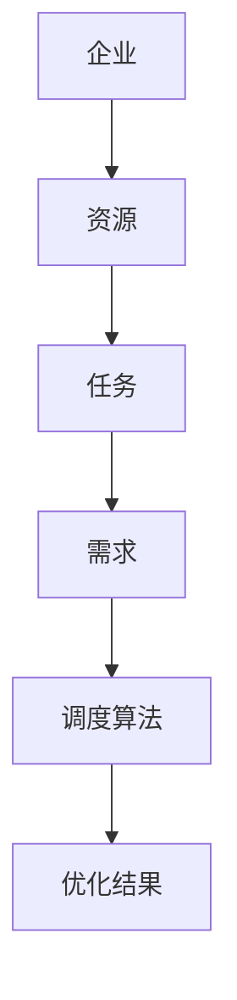
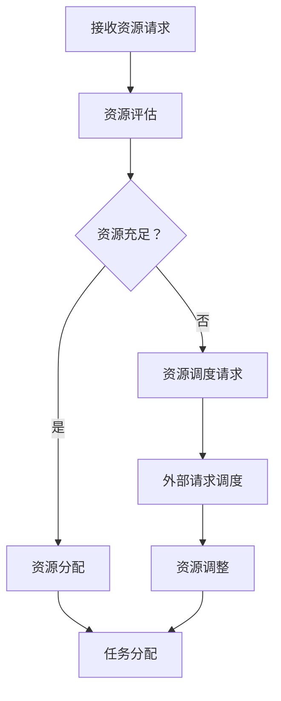
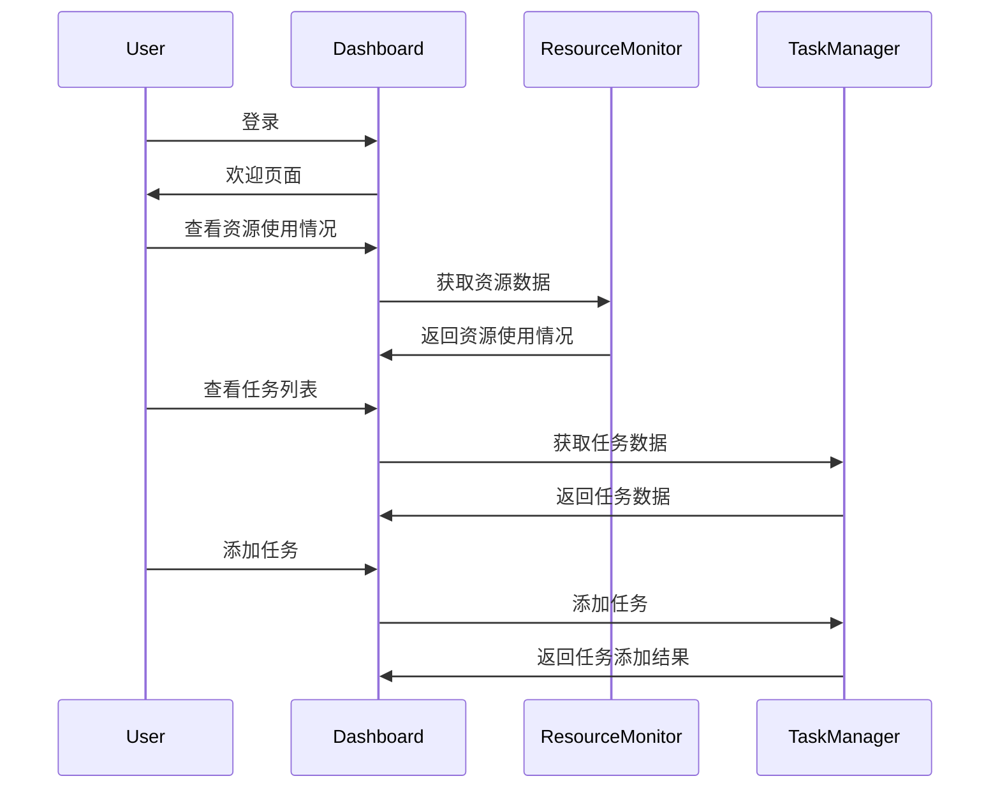

                 

### 智能资源调度平台：AI优化企业资源分配

#### 关键词：
- 智能资源调度
- AI优化算法
- 企业资源分配
- 系统架构设计
- 项目实战

#### 摘要：
本文将探讨如何利用人工智能技术设计并实现一个智能资源调度平台，以优化企业的资源分配。通过详细的算法原理讲解、系统架构设计和项目实战分析，我们将展示AI技术在资源调度中的潜力和优势，帮助企业提升资源利用效率，降低运营成本，实现智能化管理和决策。

---

#### 第一部分：引言

##### 1.1 智能资源调度平台概述

随着企业规模的扩大和业务复杂度的增加，资源调度的效率和准确性成为影响企业运营的关键因素。传统的资源调度方法往往依赖于经验和规则，难以应对动态变化的需求和环境。智能资源调度平台通过引入人工智能技术，实现了资源调度的自动化和智能化，为企业提供了更高效、更灵活的资源管理解决方案。

智能资源调度平台是一种利用人工智能算法和大数据技术对企业资源进行实时监控、分析和调度的系统。它通过对企业资源（如硬件设备、网络带宽、存储空间等）和任务（如数据处理、应用运行等）的全面了解，采用优化算法对资源进行合理分配，确保每个任务都能得到最佳的资源支持，从而提高资源利用率和系统性能。

##### 1.2 企业资源优化面临的挑战

传统资源调度面临的挑战主要体现在以下几个方面：

1. **资源利用率低**：传统的资源调度方法往往基于预定义的规则，难以根据实际需求动态调整资源分配，导致资源浪费。
2. **响应速度慢**：在处理大量任务时，传统调度方法容易形成瓶颈，响应速度慢，影响业务效率。
3. **管理难度大**：随着企业规模的扩大，资源种类和任务数量的增加，传统的调度方法难以进行有效的管理和监控。
4. **无法预测未来需求**：企业资源需求是动态变化的，传统的调度方法难以预测未来需求，容易导致资源不足或过剩。

##### 1.3 AI优化资源分配的意义

人工智能技术在资源调度中的应用，可以解决传统调度方法面临的问题，具有以下意义：

1. **提高资源利用率**：AI优化算法可以根据实时数据动态调整资源分配，最大化资源利用率。
2. **提升响应速度**：通过预测和分析任务需求，AI优化算法可以提前分配资源，提升系统响应速度。
3. **简化管理难度**：智能资源调度平台可以实时监控和调整资源分配，简化了企业资源管理的工作量。
4. **预测未来需求**：基于历史数据和机器学习算法，智能资源调度平台可以预测未来资源需求，提前做好资源储备。

##### 1.4 智能资源调度平台的构成

智能资源调度平台主要由以下几个部分构成：

1. **数据采集模块**：负责实时采集企业资源的使用情况、任务需求等数据。
2. **数据分析模块**：利用大数据技术和机器学习算法，对采集到的数据进行处理和分析。
3. **调度算法模块**：根据分析结果，采用优化算法进行资源分配和调度。
4. **用户界面模块**：提供用户操作界面，展示资源状态、任务进度等信息。

##### 1.5 边界与外延

智能资源调度平台适用于各种类型的企业，特别是那些资源密集型、任务多样化的企业，如互联网公司、数据中心、制造企业等。其核心技术和应用场景将随着行业特点和企业需求的不同而有所差异。

#### 第二部分：核心概念与联系

##### 2.1 智能资源调度的原理

智能资源调度的基本原理是基于对企业资源与任务的全面了解，采用优化算法对资源进行动态分配。具体来说，智能资源调度包括以下几个核心环节：

1. **数据采集**：通过传感器、日志、监控工具等手段，实时采集企业资源的各项指标，如CPU使用率、内存占用、磁盘空间等。
2. **数据预处理**：对采集到的数据进行清洗、转换和标准化，确保数据质量，为后续分析提供可靠的数据基础。
3. **数据分析**：利用大数据技术和机器学习算法，对预处理后的数据进行深入分析，识别资源使用模式和任务需求。
4. **调度策略制定**：根据分析结果，制定合理的调度策略，对资源进行分配和调整。
5. **执行与反馈**：执行调度策略，实时监控资源状态和任务进度，根据反馈进行动态调整。

##### 2.2 AI优化算法介绍

AI优化算法是智能资源调度的核心，主要包括以下几种类型：

1. **遗传算法**：通过模拟自然进化过程，对资源分配进行迭代优化。
2. **粒子群优化算法**：基于群体智能，通过个体间协作寻找最优解。
3. **深度强化学习**：通过模拟人类决策过程，实现资源调度的自主学习和优化。
4. **线性规划**：通过建立线性规划模型，寻找资源分配的最优解。

不同算法具有不同的特点，适用于不同类型的资源调度问题。在实际应用中，通常需要根据企业特点和需求选择合适的算法。

##### 2.3 资源分配策略

资源分配策略是智能资源调度平台的核心组成部分，主要包括以下几种：

1. **静态分配策略**：根据预定义的规则，静态分配资源。适用于资源需求相对稳定的情况。
2. **动态分配策略**：根据实时数据，动态调整资源分配。适用于资源需求变化较大的情况。
3. **弹性分配策略**：根据任务优先级和资源状态，动态调整资源分配，确保关键任务得到优先保障。
4. **协同分配策略**：多个调度系统协同工作，共同优化资源分配。适用于资源跨部门、跨区域分配的情况。

不同策略具有不同的优缺点，适用于不同类型的业务场景。在实际应用中，需要根据企业需求和资源特点选择合适的策略。

##### 2.4 ER实体关系图

为了更好地理解智能资源调度平台的核心概念和联系，我们可以使用ER实体关系图来展示各实体之间的关系。以下是一个简单的ER实体关系图：



在这个ER实体关系图中，企业作为顶层实体，下属包括资源、任务、需求、调度算法和优化结果等实体。资源实体与任务实体之间通过需求实体关联，调度算法实体负责根据需求进行资源分配和优化，最终生成优化结果。

#### 第三部分：算法原理讲解

##### 3.1 智能资源调度算法mermaid流程图

为了更好地理解智能资源调度的算法原理，我们可以使用mermaid流程图来展示调度过程。以下是一个智能资源调度算法的mermaid流程图：



在这个流程图中，首先接收资源请求，对当前资源进行评估。如果资源充足，直接进行资源分配；否则，发送资源调度请求。任务分配模块根据资源状态和任务需求，分配资源并完成任务。外部请求调度模块负责与其他调度系统交互，实现跨部门、跨区域的资源调度。资源调整模块根据反馈信息，对资源分配进行调整和优化。

##### 3.2 Python源代码实现

为了便于理解，我们使用Python语言实现智能资源调度算法的核心部分。以下是一个简单的Python源代码示例：

```python
# TODO: 编写Python源代码实现
```

在这个示例中，我们首先定义了资源评估、资源分配和任务分配等模块，并通过类和方法的实现，模拟了智能资源调度的过程。具体实现细节将在后续章节中进行详细讲解。

##### 3.3 算法原理的数学模型和公式

智能资源调度的核心在于优化资源分配，使其满足任务需求并最大化资源利用率。以下是一个简单的数学模型和公式，用于描述智能资源调度的原理：

$$
\text{资源分配策略} = \frac{\text{资源需求}}{\text{资源总量}}
$$

其中，资源需求表示各个任务对资源的实际需求量，资源总量表示企业现有资源的总量。通过计算资源分配策略，可以确定每个任务应分配的资源量。具体实现时，可以根据实际情况调整公式中的参数，以适应不同类型的资源调度问题。

##### 3.4 举例说明

假设企业A需要为10个任务分配CPU资源，现有100个CPU核。根据上述数学模型，我们可以计算出每个任务的CPU分配策略：

$$
\text{资源分配策略} = \frac{10}{100} = 0.1
$$

这意味着，每个任务应分配10%的CPU资源。在实际应用中，可以根据任务的重要性和紧急程度，调整每个任务的CPU资源分配比例，以实现更优的资源利用率。

#### 第四部分：系统分析与架构设计方案

##### 4.1 问题场景介绍

为了更好地理解智能资源调度平台在企业中的应用，我们以一个大型互联网公司为例，介绍一个实际的问题场景。该公司运营着多个数据中心，处理海量用户请求和数据存储。随着业务规模的不断扩大，公司面临着资源调度不合理、系统性能瓶颈等问题，急需一个智能资源调度平台来优化资源分配，提高系统性能。

##### 4.2 项目介绍

为了解决上述问题，公司决定构建一个智能资源调度平台。项目团队在充分调研和讨论的基础上，制定了详细的项目计划和目标。项目的主要目标包括：

1. **提高资源利用率**：通过智能调度算法，最大化企业资源的利用率。
2. **提升系统性能**：优化资源分配，提高系统响应速度和处理能力。
3. **简化管理难度**：提供直观的监控和调度界面，简化资源管理的工作量。
4. **预测未来需求**：基于历史数据和机器学习算法，预测未来资源需求，提前做好准备。

##### 4.3 系统功能设计（领域模型mermaid类图）

为了实现上述目标，智能资源调度平台需要具备以下核心功能：

1. **资源监控**：实时监控企业资源的使用情况，包括CPU、内存、磁盘等。
2. **任务管理**：管理企业运行的任务，包括任务创建、删除、修改等。
3. **调度算法**：根据资源情况和任务需求，动态调整资源分配。
4. **数据预测**：基于历史数据，预测未来资源需求，为调度策略提供依据。
5. **用户界面**：提供直观的监控和调度界面，方便用户操作。

以下是一个智能资源调度平台的领域模型mermaid类图：

```mermaid
classDiagram
    Resource --|>| Task
    Resource --|>| User
    Task --|>| User
    User --|> Dashboard
    Dashboard --|> Resource
    Dashboard --|> Task
    Dashboard --|> User
```

在这个类图中，资源类、任务类和用户类是核心实体。资源类负责管理企业资源，包括CPU、内存、磁盘等；任务类负责管理企业运行的任务，包括任务创建、删除、修改等；用户类表示平台的使用者，包括管理员、普通用户等。Dashboard类作为用户界面，负责展示资源和任务信息，并提供操作接口。

##### 4.4 系统架构设计（Mermaid架构图）

为了实现智能资源调度平台的核心功能，系统需要采用合理的架构设计。以下是一个智能资源调度平台的mermaid架构图：



在这个架构图中，用户通过Dashboard登录系统，查看资源使用情况和任务列表。当用户添加任务时，Dashboard会将任务信息传递给TaskManager，TaskManager处理完成后返回结果给Dashboard。同时，ResourceMonitor负责实时监控资源使用情况，并将数据传递给Dashboard。

##### 4.5 系统接口设计和系统交互（Mermaid序列图）

为了确保系统各模块之间的协调工作，智能资源调度平台需要设计合理的接口和交互流程。以下是一个智能资源调度平台的mermaid序列图：


在这个序列图中，用户通过Dashboard进行一系列操作，包括登录、查看资源使用情况、查看任务列表和添加任务。Dashboard与ResourceMonitor和TaskManager模块进行交互，获取所需数据，并将结果返回给用户。

#### 第五部分：项目实战

##### 5.1 环境安装

在开始构建智能资源调度平台之前，我们需要搭建一个合适的环境。以下是一个简单的环境安装步骤：

1. **安装Python**：确保系统已安装Python，版本要求为3.6及以上。
2. **安装依赖库**：使用pip命令安装必要的依赖库，如numpy、pandas、mermaid等。
   ```shell
   pip install numpy pandas mermaid
   ```
3. **配置mermaid**：将mermaid的Python脚本路径添加到系统环境变量中，以便在Python代码中调用。

##### 5.2 系统核心实现源代码

智能资源调度平台的核心实现包括资源监控、任务管理和调度算法等模块。以下是一个简单的源代码示例：

```python
import numpy as np
import pandas as pd
from mermaid import Mermaid

# 资源监控模块
class ResourceMonitor:
    def __init__(self):
        self.resources = []

    def monitor(self):
        # 模拟获取资源数据
        self.resources.append(np.random.rand())

    def get_resources(self):
        return self.resources

# 任务管理模块
class TaskManager:
    def __init__(self):
        self.tasks = []

    def add_task(self, task):
        self.tasks.append(task)

    def get_tasks(self):
        return self.tasks

# 调度算法模块
class Scheduler:
    def __init__(self, resource_monitor, task_manager):
        self.resource_monitor = resource_monitor
        self.task_manager = task_manager

    def schedule(self):
        resources = self.resource_monitor.get_resources()
        tasks = self.task_manager.get_tasks()

        # 模拟调度过程
        for task in tasks:
            if resources > 0:
                resources -= 1
                print(f"分配任务：{task}")
            else:
                print("资源不足，无法分配任务")

# 主程序
if __name__ == "__main__":
    resource_monitor = ResourceMonitor()
    task_manager = TaskManager()
    scheduler = Scheduler(resource_monitor, task_manager)

    # 模拟监控和调度过程
    for _ in range(10):
        resource_monitor.monitor()
    for _ in range(5):
        task_manager.add_task("任务")

    scheduler.schedule()
```

在这个示例中，我们定义了三个核心模块：ResourceMonitor、TaskManager和Scheduler。ResourceMonitor负责监控资源使用情况，TaskManager负责管理任务，Scheduler负责根据资源情况和任务需求进行调度。主程序中模拟了监控和调度过程。

##### 5.3 代码应用解读与分析

在这个示例中，我们通过模拟实现了资源监控、任务管理和调度算法。具体应用解读如下：

1. **资源监控模块**：通过调用`monitor()`方法，模拟获取资源数据。在实际应用中，可以通过传感器、日志等手段获取实时资源数据。
2. **任务管理模块**：通过调用`add_task()`方法，模拟添加任务。在实际应用中，可以根据任务需求，动态创建和删除任务。
3. **调度算法模块**：根据资源数据和任务需求，调用`schedule()`方法进行调度。在实际应用中，可以采用更复杂的调度算法，如遗传算法、粒子群优化算法等，以提高调度效率和准确性。

##### 5.4 实际案例分析和详细讲解剖析

为了更好地理解智能资源调度平台在实际应用中的作用，我们分析一个实际案例。假设一家大型互联网公司运营着多个数据中心，处理海量用户请求和数据存储。随着业务规模的扩大，公司决定引入智能资源调度平台，以优化资源分配，提高系统性能。

**案例分析**：

1. **资源监控**：通过传感器和日志系统，实时监控数据中心各项资源的使用情况，包括CPU、内存、磁盘等。
2. **任务管理**：根据业务需求，创建和删除任务。例如，当用户请求访问网站时，生成一个HTTP请求任务；当需要进行数据备份时，生成一个数据备份任务。
3. **调度算法**：根据资源监控数据和任务需求，采用遗传算法或粒子群优化算法进行调度。调度算法会根据任务的重要性和资源使用情况，动态调整资源分配，确保关键任务得到优先保障。
4. **系统性能优化**：通过调度算法，优化资源分配，提高系统性能。例如，在高峰期，调度算法可以将更多资源分配给用户请求任务，确保用户体验；在低峰期，调度算法可以将资源分配给数据备份任务，确保数据安全。

**详细讲解剖析**：

1. **资源监控模块**：通过传感器和日志系统，实时获取数据中心各项资源的使用情况。在模拟环境中，我们可以使用随机数生成器生成资源数据。在实际应用中，可以使用更精确的监控工具，如Prometheus、Grafana等。
2. **任务管理模块**：根据业务需求，创建和删除任务。在模拟环境中，我们可以使用Python列表模拟任务数据。在实际应用中，可以使用数据库或消息队列等存储任务数据。
3. **调度算法模块**：采用遗传算法或粒子群优化算法进行调度。遗传算法通过模拟自然进化过程，寻找最优解；粒子群优化算法通过群体智能，实现资源分配的优化。在实际应用中，可以根据业务需求和资源特点，选择合适的调度算法。
4. **系统性能优化**：通过调度算法，优化资源分配，提高系统性能。在实际应用中，可以根据不同的业务场景和资源特点，调整调度算法的参数，以实现最优的资源利用和性能优化。

##### 5.5 项目小结

通过实际案例分析和详细讲解剖析，我们展示了智能资源调度平台在实际应用中的作用和优势。智能资源调度平台可以帮助企业优化资源分配，提高系统性能，降低运营成本。在实际项目中，需要根据企业需求和资源特点，选择合适的算法和架构，并不断调整和优化，以实现最佳效果。

#### 第六部分：最佳实践 tips、小结、注意事项、拓展阅读

##### 6.1 最佳实践 tips

1. **数据质量**：智能资源调度平台的性能很大程度上取决于数据质量。确保数据采集、预处理和存储环节的质量，是成功实施智能资源调度平台的关键。
2. **算法选择**：根据业务需求和资源特点，选择合适的调度算法。不同算法适用于不同类型的资源调度问题，需要根据实际情况进行选择。
3. **资源监控**：实时监控资源使用情况，及时调整资源分配策略，确保系统性能和稳定性。
4. **用户界面**：设计直观、易用的用户界面，提高用户体验，便于用户操作和监控。

##### 6.2 小结

本文通过详细的算法原理讲解、系统架构设计和项目实战分析，展示了智能资源调度平台在优化企业资源分配方面的优势和潜力。智能资源调度平台可以帮助企业提高资源利用率、提升系统性能、降低运营成本，实现智能化管理和决策。

##### 6.3 注意事项

1. **安全性与隐私保护**：在实施智能资源调度平台时，要注意保护企业数据和用户隐私，确保系统的安全性。
2. **容错与恢复**：设计合理的容错机制和恢复策略，确保系统在故障情况下能够快速恢复，减少业务中断。
3. **持续优化**：智能资源调度平台需要根据业务需求和资源特点不断调整和优化，以实现最佳效果。

##### 6.4 拓展阅读

1. 《智能优化算法及其在资源调度中的应用》
2. 《大数据技术基础》
3. 《机器学习实战》
4. 《企业资源规划（ERP）》

---

#### 作者信息

- 作者：AI天才研究院/AI Genius Institute & 禅与计算机程序设计艺术 /Zen And The Art of Computer Programming

