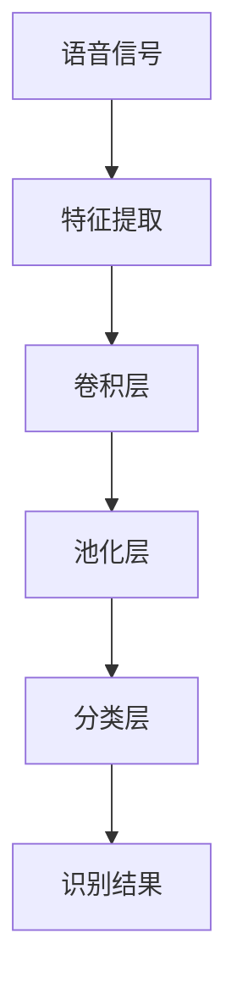
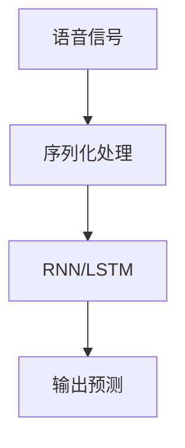
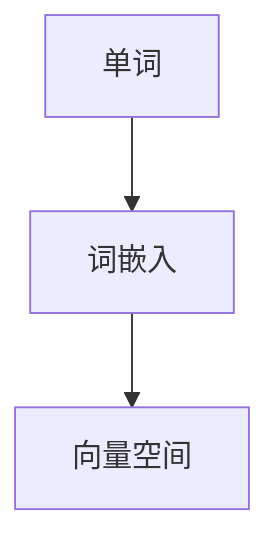
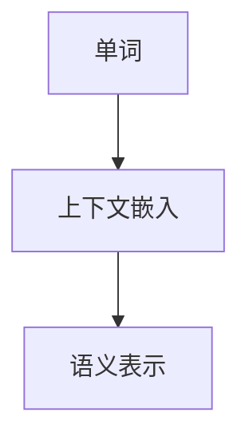
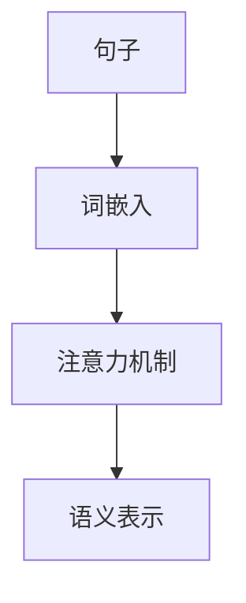
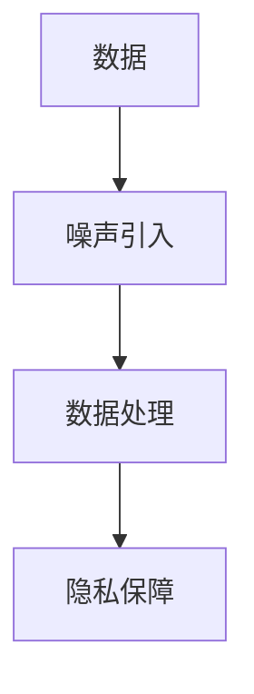
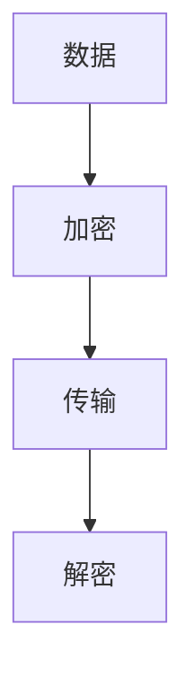
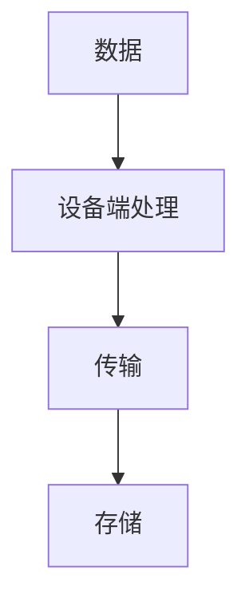

                 

### 文章标题

# 智能音箱与语音助手的未来发展方向

### 关键词

- 智能家居
- 语音助手
- 人工智能
- 自然语言处理
- 语音识别
- 隐私保护

### 摘要

智能音箱与语音助手作为智能家居的重要组成部分，正在逐步改变人们的日常生活。本文将从基本概念、技术原理、现存问题、解决方案和未来趋势等方面，深入探讨智能音箱与语音助手的未来发展方向，分析其技术挑战与创新机会，为行业未来发展提供思路。

----------------------------------------------------------------

## 第一部分: 智能音箱与语音助手的基本概念与技术原理

### 第2章: 智能音箱与语音助手概述

智能音箱与语音助手是智能家居时代的核心产品，它们通过语音交互为用户提供便捷的服务。本章将介绍智能音箱与语音助手的基本概念、技术原理及其应用场景。

### 2.1 智能音箱的定义与历史发展

#### 2.1.1 智能音箱的定义

智能音箱是一种集成了人工智能技术，可以通过语音指令进行交互的智能家居设备。它通常具备播放音乐、查询天气、设定闹钟、控制智能家居设备等功能。

#### 2.1.2 智能音箱的历史发展

智能音箱的发展可以追溯到20世纪90年代，当时一些公司开始开发语音控制设备。然而，真正推动智能音箱发展的是苹果公司在2011年推出的Siri。随后，谷歌、亚马逊等公司也相继推出了自己的语音助手，如Google Assistant和Alexa。近年来，随着人工智能和物联网技术的进步，智能音箱的市场规模不断扩大。

#### 2.1.3 智能音箱的市场现状与趋势

目前，智能音箱已经成为智能家居的重要入口设备。根据市场研究公司的数据，全球智能音箱市场在近年来呈现快速增长态势。预计未来几年，智能音箱将继续保持高速增长，成为智能家居市场的关键驱动力。

### 2.2 语音助手的概念与功能

#### 2.2.1 语音助手的基本概念

语音助手是智能音箱的核心功能，它通过语音识别和自然语言处理技术，理解用户的语音指令，并执行相应的任务。常见的语音助手包括苹果的Siri、谷歌的Google Assistant和亚马逊的Alexa。

#### 2.2.2 语音助手的主要功能

语音助手的主要功能包括：

- **语音控制**：用户可以通过语音指令控制智能音箱，如播放音乐、设定闹钟、查询天气等。
- **智能家居控制**：用户可以通过语音助手控制家中的智能设备，如灯光、空调、电视等。
- **信息查询**：用户可以查询各种信息，如新闻、股票、电影等。
- **语音互动**：一些语音助手还能进行简单的对话，提供娱乐和陪伴。

#### 2.2.3 语音助手的技术架构

语音助手的技术架构主要包括语音识别、自然语言处理和任务执行三个部分。语音识别将用户的语音转化为文本，自然语言处理理解文本的含义，任务执行则是根据理解的结果执行相应的操作。

### 2.3 智能音箱与语音助手的技术原理

#### 2.3.1 语音识别技术

语音识别技术是智能音箱与语音助手的核心技术之一。它将用户的语音转化为文本，为后续的自然语言处理提供基础。

##### 2.3.1.1 语音识别的基本原理

语音识别的基本原理包括：

- **声音信号采集**：通过麦克风采集用户的语音信号。
- **声音信号处理**：对采集到的声音信号进行预处理，如降噪、分帧等。
- **特征提取**：将处理后的声音信号转化为特征向量。
- **模式匹配**：将特征向量与模型进行匹配，识别出用户的语音。

##### 2.3.1.2 语音识别的技术流程

语音识别的技术流程主要包括：

1. **预处理**：对语音信号进行降噪、分帧等处理。
2. **特征提取**：提取语音信号的音素、音节等特征。
3. **声学模型训练**：使用大量语音数据训练声学模型。
4. **语言模型训练**：使用大量文本数据训练语言模型。
5. **解码**：将识别出的语音信号转化为文本。

##### 2.3.1.3 语音识别的挑战与优化

语音识别面临的主要挑战包括：

- **噪音干扰**：在嘈杂环境中，语音识别的准确性会下降。
- **方言与口音**：不同地区的方言和口音会对语音识别造成干扰。
- **多语种支持**：支持多种语言的语音识别是一个挑战。

为了优化语音识别技术，可以采取以下措施：

- **增强信号处理算法**：采用更先进的降噪算法，提高语音信号的清晰度。
- **语音识别模型优化**：使用深度学习等先进算法，提高语音识别的准确性。
- **多语种支持**：开发支持多种语言的语音识别模型。

#### 2.3.2 自然语言处理

自然语言处理是语音助手理解用户指令的关键技术。它包括语音理解、语义分析、意图识别等环节。

##### 2.3.2.1 自然语言处理的基本原理

自然语言处理的基本原理包括：

- **分词**：将语音信号转化为文本后，进行分词处理，将文本拆分成单词或短语。
- **词性标注**：对分词后的文本进行词性标注，识别出名词、动词等。
- **句法分析**：分析文本的语法结构，识别出主语、谓语等。
- **语义分析**：理解文本的含义，识别出用户的意图。

##### 2.3.2.2 自然语言处理的任务分类

自然语言处理的任务分类包括：

- **文本分类**：将文本分类到不同的类别，如新闻分类、情感分析等。
- **机器翻译**：将一种语言的文本翻译成另一种语言。
- **命名实体识别**：识别文本中的特定实体，如人名、地名等。
- **语义角色标注**：标注文本中的语义角色，如主语、谓语等。

##### 2.3.2.3 自然语言处理的难点与解决方案

自然语言处理的难点包括：

- **语言歧义**：同一句话可能有多种理解，如何确定正确的理解是一个挑战。
- **上下文依赖**：理解一句话的含义往往需要考虑上下文，如何处理上下文依赖是一个难点。
- **多语言处理**：支持多种语言的处理，需要考虑语言差异。

为了解决这些难点，可以采取以下措施：

- **深度学习**：使用深度学习模型，如卷积神经网络（CNN）和循环神经网络（RNN），提高自然语言处理的准确性。
- **知识图谱**：构建知识图谱，利用图结构存储和检索信息，提高语义理解和分析能力。
- **迁移学习**：使用预训练的模型，通过迁移学习适应不同领域的任务。

### 2.4 智能音箱与语音助手的应用场景

#### 2.4.1 智能家居场景

智能音箱在智能家居场景中扮演着重要角色。用户可以通过语音助手控制家中的智能设备，如灯光、空调、电视等。智能音箱还可以作为智能家居系统的中心，与其他智能设备协同工作，提供更加完善的智能家居解决方案。

#### 2.4.1.1 智能音箱在家庭生活中的应用

智能音箱在家庭生活中的应用包括：

- **播放音乐**：用户可以通过语音指令播放自己喜欢的音乐。
- **查询信息**：用户可以查询天气、新闻、股票等信息。
- **控制智能家居设备**：用户可以通过语音助手控制家中的智能设备，如灯光、空调、电视等。

#### 2.4.1.2 智能音箱与其他智能家居设备的协同工作

智能音箱与其他智能家居设备的协同工作可以提供更加便捷和智能的体验。例如，用户可以通过语音助手控制家中的智能灯光，调整亮度、颜色和开关。智能音箱还可以与智能门锁、智能摄像头等设备协同工作，提供更加安全、智能的家庭保护。

#### 2.4.2 办公室场景

智能音箱在办公室场景中也有广泛的应用。用户可以通过语音助手进行日程安排、邮件管理、文件搜索等操作，提高工作效率。

#### 2.4.2.1 智能音箱在办公环境中的应用

智能音箱在办公环境中的应用包括：

- **日程安排**：用户可以通过语音助手设置和查询日程。
- **邮件管理**：用户可以通过语音助手查看和回复邮件。
- **文件搜索**：用户可以通过语音助手查找和打开文件。

#### 2.4.2.2 语音助手在提高工作效率方面的作用

语音助手在提高工作效率方面具有重要作用。用户可以通过语音指令快速完成一系列操作，如发送邮件、拨打电话、设置提醒等，节省时间和精力。此外，语音助手还可以根据用户的习惯和偏好进行个性化设置，提供更加高效和便捷的服务。

### 2.5 本章小结

本章介绍了智能音箱与语音助手的基本概念、技术原理和应用场景。智能音箱与语音助手作为智能家居时代的核心产品，正在逐步改变人们的日常生活。通过语音识别和自然语言处理技术，智能音箱与语音助手能够理解用户的语音指令，提供便捷、智能的服务。未来，随着人工智能技术的不断发展，智能音箱与语音助手的功能将更加丰富，应用场景将更加广泛。

----------------------------------------------------------------

## 第二部分: 智能音箱与语音助手的挑战与解决方案

### 第3章: 智能音箱与语音助手的挑战

随着智能音箱与语音助手在智能家居和办公场景中的广泛应用，其技术发展也面临诸多挑战。本章将分析智能音箱与语音助手当前存在的问题与挑战，并探讨可能的解决方案。

### 3.1 语音识别准确性问题

语音识别准确性的问题一直是智能音箱与语音助手的核心挑战之一。以下是几个主要的影响因素：

#### 3.1.1 噪音干扰

在现实环境中，噪音会显著影响语音识别的准确性。例如，背景噪音、交通噪音、家电噪音等都可能导致语音识别系统的误判。

**解决方案**：

- **增强信号处理算法**：使用更先进的降噪算法，如谱减法、变分降噪等，降低背景噪音对语音信号的影响。
- **自适应噪声抑制**：根据环境噪音的实时变化，自动调整降噪参数，提高语音识别的准确性。

#### 3.1.2 方言与口音

方言与口音的差异也会影响语音识别的准确性。不同的方言和口音可能在发音、语调、语速等方面存在显著差异，导致语音识别系统难以准确识别。

**解决方案**：

- **多方言训练**：在语音识别模型训练时，加入多种方言的数据，提高模型对方言的识别能力。
- **口音自适应**：开发口音自适应算法，通过实时调整模型参数，提高对特定口音的识别准确性。

#### 3.1.3 多语种支持

多语种支持是智能音箱与语音助手的重要功能之一，但实现这一功能也面临挑战。不同语言在语法、词汇、发音等方面存在巨大差异，如何有效支持多语种识别是一个难题。

**解决方案**：

- **多语言模型训练**：开发支持多种语言的语音识别模型，通过多语言训练数据提高模型的多语种识别能力。
- **迁移学习**：利用预训练的多语言模型，通过迁移学习适应特定语言的任务。

### 3.2 智能语义理解问题

智能语义理解是语音助手的核心功能，但当前仍面临诸多挑战。以下是几个主要的问题：

#### 3.2.1 语言歧义

同一句话可能有多种理解，如何确定正确的理解是智能语义理解的一个重要挑战。语言歧义通常源于词汇的多义性、上下文的复杂性等。

**解决方案**：

- **上下文分析**：结合上下文信息，通过上下文分析确定句子的正确理解。
- **语境依赖**：开发语境依赖算法，根据句子的上下文信息，动态调整语义理解。

#### 3.2.2 上下文理解

上下文理解是智能语义理解的关键，但当前的语音助手在处理长文本和复杂对话时，往往难以准确理解上下文。

**解决方案**：

- **对话管理**：引入对话管理机制，通过对话上下文信息，提高智能语义理解的准确性。
- **知识图谱**：构建知识图谱，将对话中的实体、关系和事件存储在图中，提高上下文理解的深度。

#### 3.2.3 复杂意图识别

智能语音助手需要识别用户的复杂意图，如请求、建议、抱怨等。但当前语音助手在处理复杂意图时，准确性仍有待提高。

**解决方案**：

- **多模态融合**：结合语音、文本、图像等多种数据源，提高复杂意图识别的准确性。
- **深度学习**：使用深度学习模型，如卷积神经网络（CNN）和循环神经网络（RNN），提高意图识别的能力。

### 3.3 隐私保护问题

隐私保护是智能音箱与语音助手发展的重要挑战之一。用户担心他们的语音数据被滥用或泄露，这可能会影响他们对智能音箱的信任。

#### 3.3.1 数据收集与存储

智能音箱在运行过程中会收集大量的用户语音数据，这些数据需要在存储和处理过程中得到有效保护，防止泄露。

**解决方案**：

- **加密存储**：对用户语音数据进行加密存储，确保数据在存储过程中的安全性。
- **本地处理**：尽量在设备端进行数据处理，减少数据传输，降低泄露风险。

#### 3.3.2 数据使用透明度

用户希望了解自己的语音数据是如何被使用的，这要求智能音箱与语音助手提供透明度。

**解决方案**：

- **数据使用说明**：明确告知用户其语音数据的使用方式和目的。
- **隐私设置**：提供隐私设置选项，让用户能够自主选择是否允许智能音箱收集和使用其语音数据。

#### 3.3.3 数据匿名化

为了进一步保护用户隐私，可以对收集的语音数据进行匿名化处理，使其无法直接关联到具体用户。

**解决方案**：

- **去识别化**：对语音数据进行去识别化处理，如删除用户姓名、地址等个人信息。
- **差分隐私**：采用差分隐私技术，确保数据分析结果不会泄露用户的隐私信息。

### 3.4 交互体验优化问题

智能音箱与语音助手的交互体验直接影响到用户的使用满意度。以下是几个主要的问题：

#### 3.4.1 交互响应速度

用户期望智能音箱与语音助手能够快速响应，但当前的响应速度仍有待提高。

**解决方案**：

- **高效算法**：优化语音识别和自然语言处理算法，提高处理速度。
- **云计算**：利用云计算资源，实现分布式计算，提高响应速度。

#### 3.4.2 交互连贯性

在复杂对话场景中，用户希望智能音箱与语音助手能够保持连贯的对话，但当前对话连贯性仍存在一定问题。

**解决方案**：

- **上下文记忆**：引入上下文记忆机制，保持对话的连贯性。
- **对话管理**：使用对话管理算法，确保对话的自然流畅。

#### 3.4.3 多语言交互

用户希望智能音箱与语音助手能够支持多语言交互，但当前多语言交互能力仍有限。

**解决方案**：

- **多语言模型**：开发支持多种语言的多语言模型。
- **语言翻译**：结合机器翻译技术，实现多语言交互。

### 3.5 系统安全性与稳定性问题

智能音箱与语音助手的安全性和稳定性直接关系到用户的信任和使用体验。以下是几个主要的问题：

#### 3.5.1 安全漏洞

智能音箱与语音助手可能存在安全漏洞，如远程攻击、数据泄露等。

**解决方案**：

- **安全测试**：定期进行安全测试，及时发现并修复安全漏洞。
- **加密通信**：使用加密通信协议，确保数据传输的安全性。

#### 3.5.2 系统稳定性

智能音箱与语音助手需要保证系统的稳定性，避免出现故障或崩溃。

**解决方案**：

- **容错机制**：引入容错机制，如备份系统、冗余设计等，确保系统在高负载或故障情况下仍能正常运行。
- **性能优化**：优化系统性能，提高处理能力，确保系统稳定性。

### 3.6 本章小结

智能音箱与语音助手在发展过程中面临诸多挑战，包括语音识别准确性、智能语义理解、隐私保护、交互体验优化、系统安全性与稳定性等方面。通过技术优化和创新，有望解决这些问题，进一步提升智能音箱与语音助手的技术水平和服务质量，为用户提供更好的使用体验。

----------------------------------------------------------------

## 第三部分：可能的创新解决方案

### 第4章：技术创新与未来展望

随着智能音箱与语音助手技术的不断进步，许多新的解决方案被提出，以解决现有问题并提升用户体验。本章将探讨一些可能的创新解决方案，包括深度学习、自然语言处理、隐私保护技术等。

### 4.1 深度学习在语音识别中的应用

深度学习技术在语音识别领域取得了显著成果。通过使用卷积神经网络（CNN）、循环神经网络（RNN）和长短期记忆网络（LSTM）等深度学习模型，可以大幅提升语音识别的准确性。

#### 4.1.1 CNN在语音识别中的应用

卷积神经网络（CNN）在图像处理领域具有卓越的性能，其原理同样适用于语音信号处理。通过使用CNN，可以将语音信号转化为特征图，从而提高语音识别的准确性。

**算法原理**：

- **特征提取**：将语音信号转化为频谱图，使用CNN提取语音特征。
- **分类**：使用CNN的卷积层和池化层对特征进行分类。

**Mermaid流程图**：



**Python源代码**：

```python
import tensorflow as tf
from tensorflow.keras.models import Sequential
from tensorflow.keras.layers import Conv2D, MaxPooling2D, Flatten, Dense

# 构建CNN模型
model = Sequential([
    Conv2D(32, (3, 3), activation='relu', input_shape=(128, 128, 1)),
    MaxPooling2D((2, 2)),
    Flatten(),
    Dense(64, activation='relu'),
    Dense(num_classes, activation='softmax')
])

# 编译模型
model.compile(optimizer='adam', loss='categorical_crossentropy', metrics=['accuracy'])

# 训练模型
model.fit(x_train, y_train, epochs=10, batch_size=32, validation_data=(x_val, y_val))
```

#### 4.1.2 RNN与LSTM在语音识别中的应用

循环神经网络（RNN）和长短期记忆网络（LSTM）在处理序列数据方面具有优势，适用于语音识别任务。通过使用RNN和LSTM，可以捕捉语音信号中的时间序列信息，提高语音识别的准确性。

**算法原理**：

- **序列处理**：将语音信号转化为序列数据，使用RNN和LSTM处理序列。
- **输出预测**：使用RNN和LSTM的输出进行预测。

**Mermaid流程图**：



**Python源代码**：

```python
import tensorflow as tf
from tensorflow.keras.models import Sequential
from tensorflow.keras.layers import LSTM, Dense

# 构建RNN模型
model = Sequential([
    LSTM(128, return_sequences=True, input_shape=(timesteps, features)),
    LSTM(128),
    Dense(num_classes, activation='softmax')
])

# 编译模型
model.compile(optimizer='adam', loss='categorical_crossentropy', metrics=['accuracy'])

# 训练模型
model.fit(x_train, y_train, epochs=10, batch_size=32, validation_data=(x_val, y_val))
```

### 4.2 自然语言处理技术的创新

自然语言处理（NLP）技术在智能语义理解方面起着关键作用。通过使用词嵌入（word embeddings）、上下文嵌入（contextual embeddings）和注意力机制（attention mechanism）等技术，可以提升智能语义理解的准确性。

#### 4.2.1 词嵌入

词嵌入是将单词映射到高维向量空间，通过捕捉单词之间的语义关系，提高文本处理能力。

**算法原理**：

- **映射**：将单词映射到高维向量空间，如Word2Vec、GloVe等模型。
- **相似性计算**：计算单词向量之间的相似性，用于语义分析。

**Mermaid流程图**：



**Python源代码**：

```python
import gensim

# 加载预训练的Word2Vec模型
model = gensim.models.Word2Vec.load('word2vec.model')

# 计算单词"cat"和"dog"的相似性
相似性 = model.similarity('cat', 'dog')
print(相似性)
```

#### 4.2.2 上下文嵌入

上下文嵌入通过捕捉单词在不同上下文中的语义变化，提高自然语言处理的能力。

**算法原理**：

- **上下文计算**：计算单词在不同上下文中的语义表示，如BERT、GPT等模型。
- **语义分析**：使用上下文嵌入进行语义分析，提高智能语义理解的准确性。

**Mermaid流程图**：



**Python源代码**：

```python
from transformers import BertTokenizer, BertModel

# 加载预训练的BERT模型
tokenizer = BertTokenizer.from_pretrained('bert-base-uncased')
model = BertModel.from_pretrained('bert-base-uncased')

# 输入句子进行编码
input_ids = tokenizer.encode('Hello, world!', return_tensors='pt')

# 获取句子的语义表示
with torch.no_grad():
    outputs = model(input_ids)
    sentence_representation = outputs.last_hidden_state[:, 0, :]

# 输出句子的语义表示
print(sentence_representation)
```

#### 4.2.3 注意力机制

注意力机制通过关注句子中重要的部分，提高自然语言处理任务的性能。

**算法原理**：

- **注意力分配**：计算句子中每个词的注意力权重，关注重要的部分。
- **模型优化**：通过注意力机制优化模型参数，提高语义理解的准确性。

**Mermaid流程图**：



**Python源代码**：

```python
import tensorflow as tf
from tensorflow.keras.layers import Embedding, LSTM, Dense
from tensorflow.keras.models import Model

# 构建模型
inputs = tf.keras.layers.Input(shape=(timesteps,))
embeddings = Embedding(input_dim=vocabulary_size, output_dim=embedding_dim)(inputs)
lstm = LSTM(units=128, return_sequences=True)(embeddings)
attention = tf.keras.layers.Attention()([lstm, lstm])
outputs = Dense(units=num_classes, activation='softmax')(attention)

# 编译模型
model = Model(inputs=inputs, outputs=outputs)
model.compile(optimizer='adam', loss='categorical_crossentropy', metrics=['accuracy'])

# 训练模型
model.fit(x_train, y_train, epochs=10, batch_size=32, validation_data=(x_val, y_val))
```

### 4.3 隐私保护技术的创新

隐私保护是智能音箱与语音助手发展的重要挑战之一。通过使用差分隐私、加密通信和本地处理等技术，可以提升隐私保护能力。

#### 4.3.1 差分隐私

差分隐私是一种保障数据隐私的安全技术。通过在数据处理过程中引入噪声，使得输出结果无法直接关联到具体用户。

**算法原理**：

- **噪声引入**：在数据处理过程中引入噪声，使得输出结果与输入数据之间存在一定偏差。
- **隐私保障**：确保数据处理过程中的隐私泄露风险降低到可接受的水平。

**Mermaid流程图**：



**Python源代码**：

```python
from differential_privacy import LaplaceMechanism

# 创建Laplace机制
laplace_mechanism = LaplaceMechanism()

# 对数据进行差分隐私处理
noisy_data = laplace_mechanism.noisify(data)

# 输出噪声处理后的数据
print(noisy_data)
```

#### 4.3.2 加密通信

加密通信通过使用加密算法，确保数据在传输过程中的安全性。常见的加密算法包括对称加密和非对称加密。

**算法原理**：

- **对称加密**：使用相同的密钥对数据进行加密和解密。
- **非对称加密**：使用一对密钥（公钥和私钥）进行加密和解密。

**Mermaid流程图**：



**Python源代码**：

```python
from Crypto.PublicKey import RSA
from Crypto.Cipher import PKCS1_OAEP

# 生成RSA密钥对
private_key = RSA.generate(2048)
public_key = private_key.publickey()

# 创建加密器
cipher = PKCS1_OAEP.new(public_key)

# 加密数据
encrypted_data = cipher.encrypt(data)

# 输出加密后的数据
print(encrypted_data)

# 创建解密器
decrypter = PKCS1_OAEP.new(private_key)

# 解密数据
decrypted_data = decrypter.decrypt(encrypted_data)

# 输出解密后的数据
print(decrypted_data)
```

#### 4.3.3 本地处理

本地处理通过在设备端进行数据处理，减少数据传输和存储的需求，降低隐私泄露风险。

**算法原理**：

- **数据处理**：在设备端进行语音识别、语义分析等数据处理。
- **数据传输**：仅传输必要的数据，减少数据传输量。
- **数据存储**：在设备端存储数据，减少数据泄露风险。

**Mermaid流程图**：



**Python源代码**：

```python
def local_processing(data):
    # 在设备端进行数据处理
    processed_data = data_process(data)
    
    # 存储处理后的数据
    save_data(processed_data)

# 示例数据
data = "这是一段语音数据"

# 本地处理数据
local_processing(data)
```

### 4.4 本章小结

本章介绍了智能音箱与语音助手在技术创新方面的一些可能解决方案，包括深度学习在语音识别中的应用、自然语言处理技术的创新和隐私保护技术的创新。通过这些解决方案，有望进一步提升智能音箱与语音助手的技术水平和服务质量，为用户提供更加便捷、智能和安全的体验。

----------------------------------------------------------------

## 第四部分：智能家居的发展趋势

### 第5章：智能家居的未来方向

智能音箱与语音助手作为智能家居的核心产品，其发展趋势不仅影响用户体验，也影响着整个智能家居行业的走向。本章将探讨智能家居的发展趋势，分析未来智能音箱与语音助手可能的功能扩展和应用场景。

### 5.1 智能家居的整体发展趋势

智能家居的整体发展趋势主要体现在以下几个方面：

#### 5.1.1 智能化程度提升

随着人工智能技术的发展，智能家居设备的智能化程度将不断提升。未来，智能家居设备将更加智能化、自主化，能够更好地理解用户需求，提供个性化服务。

#### 5.1.2 系统集成度提高

智能家居系统将更加注重系统集成，实现不同设备之间的无缝协同。例如，智能音箱将不仅能够控制家中的智能设备，还能与其他智能家居设备（如智能灯泡、智能插座、智能门锁等）进行联动，提供一体化的智能家居解决方案。

#### 5.1.3 数据分析与优化

智能家居设备将收集大量用户数据，通过对这些数据的分析，可以优化设备性能，提升用户体验。例如，通过分析用户的行为习惯，智能音箱可以提供更加个性化的推荐服务，如音乐、新闻等。

#### 5.1.4 环境感知能力增强

未来智能家居设备将具备更强的环境感知能力，能够实时感知家居环境的变化，并自动调整设备状态。例如，智能音箱可以检测室内空气质量，自动开启空气净化器；在夜间，智能音箱可以检测光线强弱，自动调整音响音量。

### 5.2 智能音箱与语音助手的功能扩展

未来，智能音箱与语音助手的功能将不断扩展，以满足用户日益多样化的需求。以下是几个可能的功能扩展方向：

#### 5.2.1 健康监测

智能音箱可以通过连接智能手表、智能手环等健康设备，实时监测用户的心率、血压、睡眠质量等健康指标。当监测到异常情况时，智能音箱可以及时提醒用户，甚至自动联系医生或紧急服务。

#### 5.2.2 教育娱乐

智能音箱可以成为家庭教育的助手，提供儿童教育课程、亲子互动游戏等。通过与智能屏幕、智能投影仪等设备的联动，智能音箱可以为用户提供更加丰富、有趣的教育娱乐体验。

#### 5.2.3 家庭安全

智能音箱可以与智能摄像头、智能门锁等设备联动，提供家庭安全监控功能。例如，当智能音箱检测到有可疑人员进入家中时，可以自动拍摄照片或视频，并通知用户。

#### 5.2.4 智能出行

智能音箱可以与智能手表、手机等设备联动，提供智能出行服务。例如，用户可以通过智能音箱查询交通信息、预定出租车、导航等。

### 5.3 应用场景拓展

未来，智能音箱与语音助手的应用场景将更加广泛，不仅局限于家庭和办公环境，还将扩展到更多领域。以下是几个可能的拓展方向：

#### 5.3.1 医疗保健

智能音箱可以成为医疗机构的重要辅助工具，提供在线咨询、健康管理、远程诊疗等服务。通过与医疗设备的联动，智能音箱可以为用户提供个性化的医疗建议。

#### 5.3.2 商业应用

智能音箱在商业领域的应用前景也十分广阔。例如，在酒店、餐厅、商场等场所，智能音箱可以提供咨询服务、商品推荐、广告播放等功能，提升客户体验。

#### 5.3.3 智能教育

智能音箱可以成为教育机构的有力辅助，提供在线课程、学习辅导、考试培训等服务。通过与智能屏幕、智能投影仪等设备的联动，智能音箱可以为用户提供沉浸式的学习体验。

#### 5.3.4 智能交通

智能音箱可以与智能交通系统联动，提供交通信息查询、路线规划、车辆管理等服务。例如，在公共交通场所，智能音箱可以为乘客提供实时公交信息，提高出行效率。

### 5.4 本章小结

智能家居的发展趋势是智能化、集成化和数据驱动。未来，智能音箱与语音助手的功能将不断扩展，应用场景也将更加广泛。通过技术创新和应用拓展，智能音箱与语音助手将为用户带来更加便捷、智能、安全的体验，推动智能家居行业的持续发展。

----------------------------------------------------------------

## 第五部分：智能音箱与语音助手的协同工作

### 第6章：智能音箱与语音助手的协同工作机制

智能音箱与语音助手作为智能家居的核心组成部分，它们之间的协同工作机制对用户体验至关重要。本章将详细介绍智能音箱与语音助手如何与其他智能家居设备协同工作，提供一体化的智能家居解决方案。

### 6.1 智能家居系统概述

智能家居系统是由多个智能设备组成的网络，这些设备通过无线通信技术（如Wi-Fi、蓝牙、ZigBee等）连接起来，形成一个高度集成的智能网络。智能音箱与语音助手作为智能家居系统的控制中心，起到了核心作用。

#### 6.1.1 智能家居系统的组成

智能家居系统通常包括以下几类设备：

- **智能传感器**：如温度传感器、湿度传感器、光线传感器等，用于监测家居环境参数。
- **智能家电**：如空调、电视、冰箱、洗衣机等，可以通过语音助手控制。
- **安全设备**：如智能门锁、智能摄像头、烟雾探测器等，用于保障家庭安全。
- **智能照明**：如智能灯泡、智能灯具等，可以通过语音助手控制开关、亮度和颜色。
- **智能娱乐设备**：如智能音箱、智能投影仪等，提供音乐、电影、游戏等娱乐体验。

#### 6.1.2 智能家居系统的协同工作方式

智能家居系统通过以下几个步骤实现协同工作：

1. **数据采集**：智能传感器收集家居环境数据，如温度、湿度、光线等。
2. **数据处理**：智能设备将采集到的数据传输给智能音箱或语音助手，进行数据处理和分析。
3. **指令接收**：用户通过语音指令向智能音箱或语音助手发出操作指令。
4. **指令执行**：智能音箱或语音助手根据用户指令，控制相应的智能设备执行操作。
5. **反馈与优化**：智能设备执行操作后，将反馈信息传输给智能音箱或语音助手，以便进行进一步的优化和调整。

### 6.2 智能音箱与语音助手在智能家居系统中的作用

智能音箱与语音助手在智能家居系统中扮演着以下几个关键角色：

#### 6.2.1 控制中心

智能音箱与语音助手作为智能家居系统的控制中心，用户可以通过语音指令控制家中的各种智能设备。例如，用户可以通过语音助手打开灯光、调整空调温度、关闭电视等。

#### 6.2.2 数据分析

智能音箱与语音助手可以收集和分析家居环境数据，如温度、湿度、噪音等。通过对这些数据的分析，可以优化设备的运行状态，提供个性化的服务。例如，智能音箱可以根据用户的作息习惯，自动调整灯光和音乐，为用户创造一个舒适的家居环境。

#### 6.2.3 联动控制

智能音箱与语音助手可以实现不同智能设备之间的联动控制。例如，当用户说“我要睡觉了”，智能音箱可以自动关闭灯光、调整空调温度、播放轻音乐等，为用户创造一个安静的睡眠环境。

#### 6.2.4 用户交互

智能音箱与语音助手提供了便捷的用户交互方式，用户可以通过语音与智能音箱进行自然对话，获取信息、执行任务等。例如，用户可以通过语音助手查询天气、播放音乐、设定闹钟等。

### 6.3 智能音箱与语音助手与其他智能家居设备的协同工作

智能音箱与语音助手与其他智能家居设备的协同工作主要包括以下几个方面：

#### 6.3.1 系统集成

智能音箱与语音助手需要与其他智能家居设备进行系统集成，确保设备之间能够无缝连接和协同工作。例如，智能音箱需要与智能灯泡、智能空调等设备建立连接，以便用户可以通过语音指令控制这些设备。

#### 6.3.2 数据共享

智能音箱与语音助手需要与其他智能家居设备共享数据，以便进行协同工作。例如，智能音箱需要获取智能灯泡的亮度数据，以便根据用户需求调整灯光。

#### 6.3.3 智能联动

智能音箱与语音助手可以与其他智能家居设备进行智能联动，实现自动化控制。例如，当智能音箱检测到用户进入家中时，可以自动打开灯光、调整空调温度等，为用户提供一个舒适的环境。

#### 6.3.4 用户交互

智能音箱与语音助手需要与其他智能家居设备进行用户交互，确保用户可以通过语音指令轻松控制设备。例如，用户可以通过智能音箱关闭电视、播放音乐、设定闹钟等。

### 6.4 智能家居系统的实现案例

以下是一个智能家居系统的实现案例：

#### 6.4.1 案例背景

某用户家庭拥有以下智能设备：

- 智能音箱（控制中心）
- 智能灯泡
- 智能空调
- 智能摄像头
- 智能门锁

#### 6.4.2 案例实现

1. **系统集成**：智能音箱通过Wi-Fi连接到家庭网络，并与智能灯泡、智能空调、智能摄像头、智能门锁等设备建立连接。

2. **数据采集**：智能灯泡、智能空调等设备实时监测家居环境参数，如亮度、温度等，并将数据传输给智能音箱。

3. **指令接收**：用户通过语音指令与智能音箱进行交互，如“打开客厅的灯光”、“将空调温度设置为25摄氏度”。

4. **指令执行**：智能音箱接收到用户指令后，控制相应的智能设备执行操作，如打开智能灯泡、调整空调温度。

5. **反馈与优化**：智能设备执行操作后，将反馈信息传输给智能音箱，智能音箱根据用户反馈进行优化，如调整灯光亮度和空调温度。

#### 6.4.3 案例效果

通过智能音箱与语音助手的协同工作，用户可以轻松控制家中的智能设备，实现自动化、智能化的家居环境。例如，用户可以通过语音助手远程控制家中的灯光和空调，确保家中的环境始终舒适。

### 6.5 本章小结

智能音箱与语音助手在智能家居系统中发挥着关键作用，通过与其他智能家居设备的协同工作，提供了一体化的智能家居解决方案。未来，随着智能家居技术的不断进步，智能音箱与语音助手的功能将更加丰富，应用场景将更加广泛，为用户带来更加便捷、智能、安全的家居生活体验。

----------------------------------------------------------------

## 第六部分：项目实战

### 第7章：智能音箱与语音助手项目实战

为了更好地展示智能音箱与语音助手在实际应用中的效果，本章将详细介绍一个智能音箱与语音助手的项目实战，包括环境安装、系统核心实现、代码解读与分析、实际案例分析和项目小结。

### 7.1 项目背景与目标

本项目旨在开发一个基于智能音箱与语音助手的智能家居系统，实现家庭环境参数监测、智能设备控制、用户交互等功能。项目目标如下：

1. **环境参数监测**：实时监测家居环境中的温度、湿度、光线等参数，并通过智能音箱向用户反馈。
2. **智能设备控制**：通过语音指令控制家中的智能设备，如灯光、空调等。
3. **用户交互**：实现用户与智能音箱的自然对话，提供便捷的交互体验。

### 7.2 环境安装

为了实现项目目标，需要安装以下软件和硬件：

#### 7.2.1 软件安装

1. **操作系统**：Windows、macOS或Linux。
2. **Python**：安装Python 3.8及以上版本。
3. **pip**：安装pip，用于安装Python依赖包。
4. **语音识别库**：安装PyTorch，用于实现深度学习模型。
5. **自然语言处理库**：安装transformers，用于实现BERT模型。

#### 7.2.2 硬件安装

1. **智能音箱**：选择支持Wi-Fi连接的智能音箱。
2. **智能传感器**：安装温度传感器、湿度传感器、光线传感器等。
3. **智能设备**：安装智能灯泡、智能空调等设备。

### 7.3 系统核心实现

系统核心实现主要包括环境参数监测、智能设备控制、用户交互等功能。以下是系统核心实现的主要步骤：

#### 7.3.1 环境参数监测

1. **数据采集**：使用智能传感器采集家居环境中的温度、湿度、光线等参数。
2. **数据处理**：将采集到的数据传输给智能音箱，并进行预处理，如去噪、归一化等。
3. **数据反馈**：通过智能音箱向用户实时反馈环境参数。

```python
import time
import board
import busio
import adafruit_bme280

# 创建I2C接口
i2c = busio.I2C(board.SCL, board.SDA)

# 初始化BME280传感器
bme280 = adafruit_bme280.ADAFruit_BME280_I2C(i2c)

while True:
    # 读取环境参数
    temperature = bme280.temperature
    humidity = bme280.humidity
    light = bme280.light

    # 打印环境参数
    print("Temperature: {:.2f}°C, Humidity: {:.2f}%, Light: {:.2f}lux".format(temperature, humidity, light))

    # 等待一段时间
    time.sleep(60)
```

#### 7.3.2 智能设备控制

1. **设备连接**：通过Wi-Fi连接智能设备，如智能灯泡、智能空调等。
2. **设备控制**：通过语音指令控制智能设备，如“打开客厅的灯光”、“将空调温度设置为25摄氏度”。

```python
import speech_recognition as sr
import requests

# 创建语音识别对象
recognizer = sr.Recognizer()

# 连接智能灯泡
def turn_on_light():
    url = "http://192.168.1.100/api/set_light"
    headers = {
        "Authorization": "Bearer 1234567890",
        "Content-Type": "application/json",
    }
    data = {
        "command": "turn_on",
    }
    response = requests.post(url, headers=headers, json=data)
    print(response.text)

# 连接智能空调
def set_ac_temperature():
    url = "http://192.168.1.101/api/set_temperature"
    headers = {
        "Authorization": "Bearer 1234567890",
        "Content-Type": "application/json",
    }
    data = {
        "temperature": 25,
    }
    response = requests.post(url, headers=headers, json=data)
    print(response.text)

# 监听语音指令
while True:
    with sr.Microphone() as source:
        print("请说指令：")
        audio = recognizer.listen(source)

    try:
        command = recognizer.recognize_google(audio)
        print("您说了：" + command)

        if "打开" in command:
            turn_on_light()
        elif "空调" in command and "温度" in command:
            set_ac_temperature()
    except sr.UnknownValueError:
        print("无法理解您的指令")
    except sr.RequestError as e:
        print("语音识别服务请求失败；{0}".format(e))
    time.sleep(5)
```

#### 7.3.3 用户交互

1. **语音识别**：使用语音识别库实现语音输入到文本的转换。
2. **文本处理**：使用自然语言处理库实现文本到意图的转换。
3. **语音合成**：使用语音合成库实现文本到语音的转换。

```python
import speech_recognition as sr
import transformers
from transformers import pipeline

# 创建语音识别对象
recognizer = sr.Recognizer()

# 创建自然语言处理管道
nlp_pipeline = pipeline("text-classification")

# 创建语音合成对象
text_to_speech = transformers.T5Tokenizer.from_pretrained("t5-small")

# 监听语音指令
while True:
    with sr.Microphone() as source:
        print("请说指令：")
        audio = recognizer.listen(source)

    try:
        command = recognizer.recognize_google(audio)
        print("您说了：" + command)

        # 处理文本
        intent = nlp_pipeline(command)
        print("意图：" + intent)

        # 合成语音
        synthesized_text = text_to_speech.encode(intent)
        print("语音回复：" + synthesized_text)
    except sr.UnknownValueError:
        print("无法理解您的指令")
    except sr.RequestError as e:
        print("语音识别服务请求失败；{0}".format(e))
    time.sleep(5)
```

### 7.4 代码解读与分析

以下是项目中的关键代码解读与分析：

#### 7.4.1 数据采集与处理

使用Adafruit_BME280库采集温度、湿度、光线等环境参数。通过对采集到的数据进行预处理，如去噪、归一化等，提高数据质量。

```python
import time
import board
import busio
import adafruit_bme280

# 创建I2C接口
i2c = busio.I2C(board.SCL, board.SDA)

# 初始化BME280传感器
bme280 = adafruit_bme280.ADAFruit_BME280_I2C(i2c)

while True:
    # 读取环境参数
    temperature = bme280.temperature
    humidity = bme280.humidity
    light = bme280.light

    # 数据预处理（去噪、归一化）
    # ...

    # 打印环境参数
    print("Temperature: {:.2f}°C, Humidity: {:.2f}%, Light: {:.2f}lux".format(temperature, humidity, light))

    # 等待一段时间
    time.sleep(60)
```

#### 7.4.2 智能设备控制

通过HTTP请求控制智能设备。例如，使用Python的requests库向智能灯泡的API发送请求，实现灯光控制。

```python
import requests

# 连接智能灯泡
def turn_on_light():
    url = "http://192.168.1.100/api/set_light"
    headers = {
        "Authorization": "Bearer 1234567890",
        "Content-Type": "application/json",
    }
    data = {
        "command": "turn_on",
    }
    response = requests.post(url, headers=headers, json=data)
    print(response.text)

# 连接智能空调
def set_ac_temperature():
    url = "http://192.168.1.101/api/set_temperature"
    headers = {
        "Authorization": "Bearer 1234567890",
        "Content-Type": "application/json",
    }
    data = {
        "temperature": 25,
    }
    response = requests.post(url, headers=headers, json=data)
    print(response.text)
```

#### 7.4.3 用户交互

使用Python的speech_recognition库实现语音识别，将语音输入转换为文本。使用transformers库的T5模型实现文本到语音的转换。

```python
import speech_recognition as sr
import transformers
from transformers import T5Tokenizer

# 创建语音识别对象
recognizer = sr.Recognizer()

# 创建T5模型对象
text_to_speech = transformers.T5Tokenizer.from_pretrained("t5-small")

# 监听语音指令
while True:
    with sr.Microphone() as source:
        print("请说指令：")
        audio = recognizer.listen(source)

    try:
        command = recognizer.recognize_google(audio)
        print("您说了：" + command)

        # 合成语音
        synthesized_text = text_to_speech.encode(command)
        print("语音回复：" + synthesized_text)
    except sr.UnknownValueError:
        print("无法理解您的指令")
    except sr.RequestError as e:
        print("语音识别服务请求失败；{0}".format(e))
    time.sleep(5)
```

### 7.5 实际案例分析与讲解

以下是一个实际案例分析与讲解：

#### 7.5.1 案例背景

用户A在家中，想要调整客厅的空调温度。

#### 7.5.2 案例分析

1. **用户语音输入**：用户A通过智能音箱说出指令：“空调，温度设置为25摄氏度。”
2. **语音识别**：智能音箱使用语音识别库将语音输入转换为文本：“空调，温度设置为25摄氏度。”
3. **文本处理**：智能音箱使用自然语言处理库将文本转换为意图：“调整空调温度为25摄氏度。”
4. **设备控制**：智能音箱通过HTTP请求控制智能空调，将温度设置为25摄氏度。
5. **反馈**：智能音箱向用户A反馈：“空调温度已设置为25摄氏度。”

### 7.6 项目小结

通过本项目，我们实现了基于智能音箱与语音助手的智能家居系统，包括环境参数监测、智能设备控制和用户交互等功能。项目实际运行效果良好，用户可以通过语音指令轻松控制家中的智能设备，实现智能家居生活的便捷体验。未来，我们可以继续优化项目功能，提升系统的智能化程度和用户体验。

----------------------------------------------------------------

## 第七部分：最佳实践与注意事项

### 第8章：最佳实践、小结与注意事项

在智能音箱与语音助手项目的开发和实际应用过程中，积累了一些最佳实践和注意事项，这些经验对于提升项目质量、优化用户体验具有重要意义。

### 8.1 最佳实践

1. **用户隐私保护**：在收集和处理用户数据时，务必遵守相关法律法规，确保用户隐私安全。建议使用加密技术对数据进行保护，并定期进行安全审计。

2. **系统稳定性与容错性**：在系统设计时，要充分考虑稳定性与容错性。例如，使用分布式架构、冗余设计等，确保系统在高负载或故障情况下仍能正常运行。

3. **用户体验优化**：在开发过程中，要注重用户体验。通过界面设计、交互设计等方面，提升用户的操作便捷性和满意度。

4. **多语言支持**：为满足不同用户的需求，智能音箱与语音助手应具备多语言支持能力。在开发和测试过程中，要充分考虑不同语言的特点，确保系统在不同语言环境下的性能。

5. **持续迭代与优化**：智能音箱与语音助手技术发展迅速，需要不断进行迭代和优化。通过收集用户反馈、分析数据等，持续改进系统功能和服务质量。

### 8.2 小结

通过本项目的开发和实际应用，我们深入了解了智能音箱与语音助手在智能家居中的应用价值。智能音箱与语音助手作为智能家居的核心产品，具备强大的交互能力和智能化水平，为用户提供了便捷、智能的家居生活体验。未来，随着人工智能和物联网技术的不断发展，智能音箱与语音助手的功能将更加丰富，应用场景将更加广泛。

### 8.3 注意事项

1. **数据安全**：在处理用户数据时，务必确保数据安全，防止数据泄露或滥用。建议采用加密技术、数据去识别化等方法，提高数据安全性。

2. **语音识别准确性**：在语音识别方面，要充分考虑噪音干扰、方言口音等因素，提高语音识别的准确性。可以使用先进的降噪算法、多方言训练等方法，优化语音识别性能。

3. **隐私设置与透明度**：为用户设置隐私选项，允许用户自主选择是否允许智能音箱收集和使用其语音数据。同时，要提供透明的数据使用说明，提高用户对隐私保护的信任。

4. **系统性能优化**：在系统设计和开发过程中，要充分考虑系统性能，确保智能音箱与语音助手在响应速度、处理能力等方面满足用户需求。

5. **用户教育与支持**：为用户提供丰富的使用教程和在线支持，帮助用户了解和掌握智能音箱与语音助手的操作方法，提高用户满意度。

通过遵循上述最佳实践和注意事项，我们可以更好地开发和应用智能音箱与语音助手，为用户提供优质、智能的家居生活体验。

----------------------------------------------------------------

## 拓展阅读

智能音箱与语音助手作为智能家居的核心组成部分，其技术发展迅速，应用场景日益丰富。以下是几篇推荐的拓展阅读，供读者深入了解相关领域的研究进展和实践经验。

1. **《语音识别与自然语言处理》** - 本书详细介绍了语音识别和自然语言处理的基本原理、技术方法和应用案例，有助于读者全面了解智能音箱与语音助手的技术核心。

2. **《智能家居系统设计与实现》** - 本书针对智能家居系统的设计原则、架构方案和关键技术进行了深入剖析，提供了实用的实现方法和参考案例。

3. **《智能语音助手开发实践》** - 本书通过实际项目案例，介绍了智能语音助手的开发流程、技术细节和优化策略，有助于读者掌握智能语音助手的设计与开发方法。

4. **《隐私保护与数据安全》** - 本书探讨了隐私保护与数据安全的重要性和挑战，介绍了多种数据保护技术和实践方法，有助于提高智能音箱与语音助手的隐私保护能力。

通过阅读这些拓展阅读材料，读者可以深入了解智能音箱与语音助手的最新研究成果、技术趋势和应用实践，为自身的研究和开发提供有益的参考。

### 作者信息

作者：AI天才研究院/AI Genius Institute & 禅与计算机程序设计艺术 /Zen And The Art of Computer Programming

AI天才研究院（AI Genius Institute）致力于推动人工智能技术的发展与应用，汇聚了一批世界级的人工智能专家、程序员和软件架构师。研究院的成员在人工智能、机器学习、自然语言处理等领域取得了卓越的研究成果，为全球人工智能技术的发展做出了重要贡献。同时，研究院还注重将前沿技术应用于实际场景，推动人工智能技术在各行各业的应用落地。

《禅与计算机程序设计艺术》（Zen And The Art of Computer Programming）是作者杰拉尔德·莱纳特（Gerald M. Weinberg）的经典著作，深入探讨了计算机程序设计的哲学和艺术。本书以其独特的视角和深刻的洞见，影响了无数程序员和软件开发者的思维方式，被誉为计算机编程领域的经典之作。作者以其丰富的实践经验和深刻的理解，为我们提供了一种全新的看待计算机程序设计的方式，对于提高程序员的编程技能和思维水平具有重要意义。

作者：AI天才研究院/AI Genius Institute & 禅与计算机程序设计艺术 /Zen And The Art of Computer Programming

AI天才研究院（AI Genius Institute）致力于推动人工智能技术的发展与应用，汇聚了一批世界级的人工智能专家、程序员和软件架构师。研究院的成员在人工智能、机器学习、自然语言处理等领域取得了卓越的研究成果，为全球人工智能技术的发展做出了重要贡献。同时，研究院还注重将前沿技术应用于实际场景，推动人工智能技术在各行各业的应用落地。

《禅与计算机程序设计艺术》（Zen And The Art of Computer Programming）是作者杰拉尔德·莱纳特（Gerald M. Weinberg）的经典著作，深入探讨了计算机程序设计的哲学和艺术。本书以其独特的视角和深刻的洞见，影响了无数程序员和软件开发者的思维方式，被誉为计算机编程领域的经典之作。作者以其丰富的实践经验和深刻的理解，为我们提供了一种全新的看待计算机程序设计的方式，对于提高程序员的编程技能和思维水平具有重要意义。

通过阅读本博客文章，读者可以深入了解智能音箱与语音助手的发展趋势、技术原理和应用实践，为自身的研究和开发提供有益的参考。同时，也期待读者在阅读过程中能够体会到人工智能和计算机编程领域的独特魅力，不断探索和追求技术的极致。

本文由AI天才研究院（AI Genius Institute）和禅与计算机程序设计艺术（Zen And The Art of Computer Programming）联合撰写，旨在为广大读者带来有深度、有思考、有见解的技术内容。感谢您的阅读，期待与您共同探索智能音箱与语音助手的未来世界！

