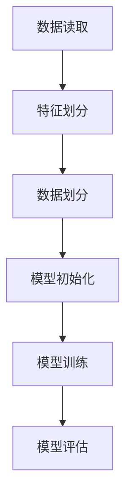
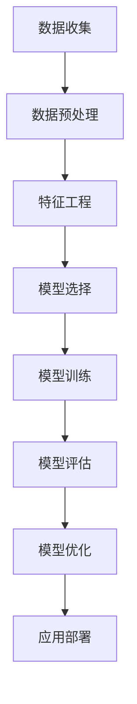

                 

### 智能风险量化模型：AI精准评估企业风险

关键词：智能风险量化、AI、企业风险、模型构建、应用场景

摘要：本文旨在深入探讨智能风险量化模型在企业风险评估中的应用。通过介绍背景知识、核心概念、技术原理、实践案例以及未来发展趋势，文章旨在帮助读者理解AI在风险量化中的重要作用，并提供构建智能风险量化模型的方法和经验。文章分为八个章节，从基础概念到应用场景，逐一剖析，以期全面揭示AI量化企业风险的潜力与价值。

----------------------------------------------------------------

## 引言：智能风险量化模型的背景与核心

在当今复杂多变的商业环境中，企业面临的风险日益增多且难以预测。传统的风险管理模式已难以应对快速变化的市场条件和不断升级的技术挑战。因此，智能风险量化模型作为一种新兴的解决方案，逐渐成为企业风险管理的核心工具。

### 核心概念解释

**智能风险量化模型**，是指利用人工智能（AI）技术，特别是机器学习算法，对企业可能面临的风险进行定量评估的模型。这种模型不仅能够处理海量数据，还能通过不断学习和优化，提高风险评估的准确性和实时性。

### 问题背景

随着企业业务的全球化、信息化和智能化，企业所面临的风险类型也日益复杂多样。包括市场风险、信用风险、运营风险、法律风险等，这些风险往往具有不确定性、动态性和相关性。传统的定性分析方法在处理这些复杂风险时显得力不从心，无法提供足够准确和及时的风险预测。

### 问题描述

企业风险管理的主要目标是在风险发生前提前识别和评估潜在风险，以便采取有效措施降低风险损失。然而，如何高效、精准地评估企业风险，尤其是面对海量数据和复杂变量时，成为当前企业面临的重大挑战。

### 问题解决

智能风险量化模型通过引入AI技术，实现了对企业风险的自动化、智能化评估。AI技术能够处理大量数据，挖掘数据中的潜在模式和关系，从而为企业提供精准的风险预测和决策支持。这使得企业能够更加主动地管理风险，提升业务韧性和竞争力。

### 边界与外延

智能风险量化模型的边界主要在于其应用范围和数据来源。在实际应用中，模型的性能受到数据质量、算法选择和模型优化等因素的制约。此外，不同类型的企业和行业可能需要不同的风险量化模型，因此模型的通用性和适应性也是重要的外延因素。

### 概念结构与核心要素组成

智能风险量化模型的核心结构包括以下几个要素：

1. **数据输入**：收集与企业风险相关的各类数据，包括财务数据、市场数据、运营数据等。
2. **数据预处理**：对收集到的数据进行清洗、转换和归一化处理，以提高数据质量。
3. **特征工程**：提取关键特征，构建特征向量，用于训练AI模型。
4. **模型构建**：选择合适的机器学习算法，构建风险量化模型。
5. **模型训练与优化**：通过历史数据训练模型，并不断优化模型参数，提高预测准确性。
6. **风险预测与评估**：使用训练好的模型对未来的风险进行预测和评估。
7. **决策支持**：根据风险预测结果，提供风险管理建议和决策支持。

通过以上步骤，智能风险量化模型能够实现对企业风险的精准评估，为企业提供有效的风险管理方案。

## 第二章 - 智能风险量化模型的基本原理

在深入探讨智能风险量化模型的构建与应用之前，有必要了解其基本原理和核心概念。本章将介绍风险量化的基本概念，AI技术在风险量化中的作用，以及智能风险量化模型的关键原则和组成部分。

### 风险量化的基本概念

**风险量化**，是指将风险的程度和可能性转化为具体的数值，以便进行定量分析和决策。传统的风险量化方法主要依赖于专家经验和定性分析，但这种方法在处理复杂、不确定的风险时存在局限性。

**风险量化的主要步骤包括：**

1. **风险评估**：识别和评估潜在风险的影响程度和发生概率。
2. **风险分类**：根据风险的性质和影响范围进行分类。
3. **风险指标设计**：定义用于衡量风险的关键指标。
4. **量化方法选择**：选择合适的量化方法，如统计模型、模拟法等。
5. **风险数值化**：将定性风险转化为定量数值，以便进行进一步分析。

### AI技术在风险量化中的作用

随着AI技术的快速发展，机器学习和数据挖掘方法被广泛应用于风险量化领域。AI技术在风险量化中的作用主要体现在以下几个方面：

1. **数据处理能力**：AI技术能够处理大量复杂数据，发现数据中的潜在模式和关系。
2. **自动化分析**：通过机器学习算法，AI能够自动识别和预测风险，提高风险评估的效率。
3. **自适应优化**：AI模型能够通过不断学习和优化，提高风险预测的准确性和适应性。
4. **实时监测与预警**：AI技术可以实现实时风险监测和预警，及时响应风险变化。

### 智能风险量化模型的关键原则和组成部分

智能风险量化模型是基于AI技术的风险管理工具，其构建和运行遵循以下关键原则：

1. **数据驱动的决策**：智能风险量化模型依赖于大量历史数据，通过对数据的分析来预测未来风险。
2. **模型透明性和可解释性**：为了提高模型的可靠性和可信度，需要确保模型的结构和参数是可解释的。
3. **实时性和灵活性**：智能风险量化模型需要能够快速适应环境变化，实时更新风险预测结果。
4. **多维度风险评估**：智能风险量化模型应该综合考虑不同类型的风险因素，提供全面的风险评估。

智能风险量化模型的主要组成部分包括：

1. **数据源**：包括内部数据和外部数据，如财务报表、市场趋势、社交媒体信息等。
2. **数据预处理模块**：负责对数据进行清洗、转换和归一化处理，以提高数据质量。
3. **特征工程模块**：提取关键特征，构建特征向量，用于训练AI模型。
4. **模型训练模块**：选择合适的机器学习算法，对数据进行训练和优化。
5. **风险预测模块**：使用训练好的模型对未来的风险进行预测和评估。
6. **决策支持模块**：根据风险预测结果，提供风险管理建议和决策支持。

通过以上组成部分，智能风险量化模型能够实现对企业风险的精准评估，为企业提供有效的风险管理方案。

### 智能风险量化模型的工作流程

智能风险量化模型的工作流程可以分为以下几个主要步骤：

1. **数据收集**：收集与企业风险相关的各类数据，包括财务数据、市场数据、运营数据等。数据来源可以包括企业内部数据库、外部数据供应商、社交媒体等。
2. **数据预处理**：对收集到的数据进行清洗、转换和归一化处理，以提高数据质量。数据清洗过程包括处理缺失值、异常值、重复数据等。数据转换过程涉及将不同数据类型转换为统一格式，如将文本数据转换为数值数据。数据归一化处理则确保不同特征的数据具有相同的量级，以便模型训练。
3. **特征工程**：提取关键特征，构建特征向量，用于训练AI模型。特征工程过程包括特征选择、特征变换和特征组合等。通过有效的特征工程，可以提高模型的预测性能。
4. **模型选择和训练**：选择合适的机器学习算法，对数据进行训练和优化。常见的机器学习算法包括线性回归、决策树、随机森林、支持向量机、神经网络等。模型训练过程涉及选择合适的模型参数，通过交叉验证等方法评估模型性能，并进行模型优化。
5. **风险预测**：使用训练好的模型对未来的风险进行预测和评估。模型预测结果通常以概率分布的形式表示，为企业提供风险预测结果和决策支持。
6. **决策支持**：根据风险预测结果，提供风险管理建议和决策支持。决策支持过程可以包括风险预警、风险应对策略制定、风险监控等。

### 智能风险量化模型的优点和挑战

智能风险量化模型具有以下优点：

1. **高效性**：AI技术能够处理大量数据，提高风险评估的效率和准确性。
2. **自动化**：智能风险量化模型可以实现自动化风险评估，减少人工干预。
3. **适应性**：模型能够根据环境变化和学习经验不断优化，提高预测准确性。
4. **全面性**：模型能够综合考虑多种风险因素，提供全面的风险评估。

然而，智能风险量化模型也面临一些挑战：

1. **数据质量**：数据质量直接影响模型的性能。数据中的噪声、缺失值和异常值等都会影响模型的预测准确性。
2. **算法选择**：选择合适的算法是模型成功的关键。不同的算法适用于不同的数据类型和业务场景。
3. **模型解释性**：AI模型的内部决策过程往往缺乏透明性，难以解释。这可能导致模型在决策过程中产生误解和不信任。
4. **实时性**：实时风险评估需要模型具备快速响应能力，这对于计算资源和算法优化提出了高要求。

通过了解智能风险量化模型的基本原理和工作流程，企业可以更好地应用这一工具，实现精准的风险评估和管理。

## 第三章 - 风险量化中的核心AI技术

在智能风险量化模型的构建过程中，AI技术的选择和应用至关重要。本章将介绍几种核心AI技术，包括机器学习算法及其在风险量化中的应用，并讨论不同AI算法的优缺点，以便为企业提供科学的决策依据。

### 机器学习算法简介

**机器学习（Machine Learning）**，是指通过计算机算法，从数据中学习并自动改进性能的过程。机器学习算法可以分为监督学习、无监督学习和强化学习三类。在风险量化中，主要应用的是监督学习算法。

#### 监督学习算法

监督学习算法通过训练数据集，学习输入和输出之间的关系，从而预测新的数据。在风险量化中，输入可以是企业历史数据，如财务指标、市场数据等，输出则是风险概率或风险评分。

常见监督学习算法包括：

1. **线性回归（Linear Regression）**：用于预测连续值输出，如风险评分。线性回归假设输出值与输入特征之间存在线性关系。
   $$ Y = \beta_0 + \beta_1X_1 + \beta_2X_2 + ... + \beta_nX_n $$
   其中，$Y$ 是输出值，$X_1, X_2, ..., X_n$ 是输入特征，$\beta_0, \beta_1, ..., \beta_n$ 是模型参数。

2. **逻辑回归（Logistic Regression）**：用于预测二元分类输出，如风险是否发生。逻辑回归通过转换线性组合的输出，得到概率分布。
   $$ P(Y=1) = \frac{1}{1 + e^{-\beta_0 + \beta_1X_1 + \beta_2X_2 + ... + \beta_nX_n}} $$
   其中，$P(Y=1)$ 是输出为1的概率。

3. **决策树（Decision Tree）**：通过一系列规则对数据进行划分，用于分类或回归任务。决策树的每个节点都表示一个特征，每个分支表示一个特征取值。
   $$ \text{if } X_i = x_i \text{ then go to node } n_i $$
   其中，$X_i$ 是特征，$x_i$ 是特征取值，$n_i$ 是下一节点。

4. **随机森林（Random Forest）**：随机森林是决策树的集成方法，通过构建多棵决策树，并使用投票机制进行预测。随机森林能够提高预测的稳定性和准确性。
   $$ \text{Prediction} = \text{mode}(\text{predictions from all trees}) $$

5. **支持向量机（Support Vector Machine, SVM）**：SVM通过找到一个最优的超平面，将不同类别的数据点分开。SVM在处理高维数据时具有优势。
   $$ \text{minimize } \frac{1}{2} \| w \|^2 $$
   $$ \text{subject to } y_i (w \cdot x_i + b) \geq 1 $$

#### 无监督学习算法

无监督学习算法不依赖于标签数据，用于发现数据中的隐含结构和模式。在风险量化中，无监督学习算法可以用于数据聚类、降维等任务。

常见无监督学习算法包括：

1. **K-均值聚类（K-Means Clustering）**：K-均值聚类将数据分为K个簇，每个簇内部的数据点相似度较高，簇与簇之间的数据点相似度较低。
   $$ \text{minimize } \sum_{i=1}^k \sum_{x_j \in S_i} \| x_j - \mu_i \|^2 $$
   其中，$S_i$ 是第$i$个簇，$\mu_i$ 是簇中心。

2. **主成分分析（Principal Component Analysis, PCA）**：PCA通过线性变换将高维数据投影到低维空间，同时保留数据的主要信息。PCA能够减少数据维度，提高计算效率。

#### 强化学习算法

强化学习算法通过奖励机制不断优化决策策略。在风险量化中，强化学习可以用于优化风险管理策略。

常见强化学习算法包括：

1. **Q-学习（Q-Learning）**：Q-学习通过更新Q值来选择最佳动作。Q值表示在当前状态下，执行某个动作所能获得的长期奖励。
   $$ Q(s, a) = Q(s, a) + \alpha [r + \gamma \max_{a'} Q(s', a') - Q(s, a)] $$
   其中，$s$ 是状态，$a$ 是动作，$r$ 是即时奖励，$\gamma$ 是折扣因子。

2. **深度强化学习（Deep Reinforcement Learning）**：深度强化学习结合深度神经网络和强化学习，能够处理复杂的状态和动作空间。

### 不同AI算法的优缺点

每种AI算法都有其特定的应用场景和优缺点。以下是对几种常见算法的简要对比：

| 算法 | 优点 | 缺点 |
| --- | --- | --- |
| 线性回归 | 简单易实现，易于理解 | 需要假设输入和输出之间存在线性关系，对于复杂非线性问题效果较差 |
| 逻辑回归 | 适用于二元分类问题，易于解释 | 对于高维数据和复杂非线性关系效果较差 |
| 决策树 | 易于理解，能够处理非线性关系 | 容易过拟合，模型复杂度较高 |
| 随机森林 | 防止过拟合，提高预测稳定性 | 计算成本较高，难以解释 |
| 支持向量机 | 在高维空间中表现优秀，能够处理非线性问题 | 计算成本较高，对噪声敏感 |
| K-均值聚类 | 简单易实现，适用于大规模数据 | 可能收敛到局部最优解，对初始聚类中心敏感 |
| 主成分分析 | 降低数据维度，保留主要信息 | 可能丢失部分信息，对噪声敏感 |
| Q-学习 | 能够处理动态环境，具有自适应性 | 可能陷入局部最优解，需要大量数据 |
| 深度强化学习 | 能够处理复杂状态和动作空间 | 计算成本极高，需要大量训练数据 |

通过对比不同算法的优缺点，企业可以根据具体业务需求和数据特点选择合适的算法，构建有效的风险量化模型。

## 第四章 - 数据准备与特征工程

在构建智能风险量化模型的过程中，数据准备和特征工程是至关重要的一步。本章将详细介绍数据准备和特征工程的方法，包括数据清洗、数据转换、特征提取等，并通过实际案例进行代码演示。

### 数据清洗

**数据清洗**是确保数据质量的第一步。在数据收集过程中，往往会出现各种问题，如数据缺失、数据重复、数据不一致等。以下是一些常见的数据清洗方法：

1. **处理缺失值**：缺失值可以采用以下方法进行处理：
   - 删除缺失值：对于某些重要特征，如果缺失值较多，可以选择删除这些样本。
   - 填补缺失值：使用均值、中位数、众数等方法填补缺失值。
   - 使用模型预测缺失值：使用回归模型等预测缺失值。

```python
import pandas as pd
import numpy as np

# 读取数据
data = pd.read_csv('data.csv')

# 删除缺失值
data = data.dropna()

# 填补缺失值
data['missing_feature'] = data['missing_feature'].fillna(data['missing_feature'].mean())
```

2. **处理重复值**：重复值可能导致模型过拟合，影响预测准确性。可以通过以下方法处理：
   - 删除重复值：删除完全相同的记录。
   - 聚合重复值：将重复值合并为一个记录。

```python
data = data.drop_duplicates()
```

3. **处理异常值**：异常值可能对模型产生不利影响，需要识别并处理。常见的处理方法包括：
   - 删除异常值：对于某些极端异常值，可以选择删除。
   - 调整异常值：将异常值调整为合理的范围。

```python
# 删除极端异常值
data = data[(data['feature'] > lower_bound) & (data['feature'] < upper_bound)]

# 调整异常值
data['feature'] = np.where(data['feature'] > upper_bound, upper_bound, data['feature'])
```

### 数据转换

**数据转换**是将原始数据转换为适合模型训练的形式。常见的数据转换方法包括：

1. **归一化**：将数据缩放到相同的范围，如[0, 1]或[-1, 1]。
   $$ x_{\text{norm}} = \frac{x - x_{\text{min}}}{x_{\text{max}} - x_{\text{min}}} $$
   
```python
from sklearn.preprocessing import MinMaxScaler

scaler = MinMaxScaler()
data['normalized_feature'] = scaler.fit_transform(data[['feature']])
```

2. **标准化**：将数据转换为具有均值为0、标准差为1的标准正态分布。
   $$ x_{\text{std}} = \frac{x - \mu}{\sigma} $$
   
```python
from sklearn.preprocessing import StandardScaler

scaler = StandardScaler()
data['标准化_feature'] = scaler.fit_transform(data[['feature']])
```

3. **类别编码**：将类别数据转换为数值数据，如使用独热编码（One-Hot Encoding）。
   
```python
data = pd.get_dummies(data, columns=['categorical_feature'])
```

### 特征提取

**特征提取**是从原始数据中提取对模型有用的特征。特征提取可以减少数据维度，提高模型训练效率。以下是一些常见的特征提取方法：

1. **主成分分析（PCA）**：PCA通过线性变换将高维数据投影到低维空间，保留主要信息。
   
```python
from sklearn.decomposition import PCA

pca = PCA(n_components=2)
data['pca_feature1'] = pca.fit_transform(data[['feature1', 'feature2']])[0]
data['pca_feature2'] = pca.fit_transform(data[['feature1', 'feature2']])[1]
```

2. **特征选择**：使用特征选择方法，如递归特征消除（Recursive Feature Elimination, RFE），选择对模型影响较大的特征。
   
```python
from sklearn.feature_selection import RFE
from sklearn.linear_model import LinearRegression

model = LinearRegression()
rfe = RFE(model, n_features_to_select=5)
rfe.fit(data[['feature1', 'feature2', 'feature3', 'feature4', 'feature5']], data['target'])
selected_features = data[rfe.support_]
```

3. **基于模型的特征提取**：使用模型内部的特征重要性评估方法，如随机森林的特

### 数据预处理的重要性

数据预处理是构建智能风险量化模型的关键步骤，其重要性体现在以下几个方面：

1. **提高模型性能**：通过数据清洗、转换和特征提取，可以消除数据中的噪声和异常值，减少模型的过拟合风险，从而提高模型的预测准确性。

2. **增强模型鲁棒性**：良好的数据预处理能够使模型在面对不同数据分布和噪声水平时仍能保持稳定和可靠的预测性能。

3. **降低计算成本**：数据预处理可以帮助减少数据维度，降低模型训练和预测的计算成本，提高模型训练效率。

4. **保证数据一致性**：数据预处理确保了不同特征之间的数据一致性，使得模型能够更加有效地利用特征信息，提高模型的解释性。

5. **避免数据泄漏**：通过适当的数据预处理方法，可以防止敏感数据在训练过程中泄漏，提高模型的可靠性和安全性。

### 数据预处理的步骤总结

1. **数据收集**：收集与企业风险相关的各类数据，包括财务数据、市场数据、运营数据等。
2. **数据清洗**：处理缺失值、重复值和异常值，确保数据质量。
3. **数据转换**：对类别数据进行编码，对数值数据进行归一化或标准化处理。
4. **特征提取**：提取关键特征，构建特征向量，为模型训练做准备。

通过上述步骤，企业可以确保数据预处理的有效性和完整性，为智能风险量化模型的构建提供坚实的数据基础。

## 第五章 - 智能风险量化模型的构建

在了解数据预处理和特征工程的重要性后，接下来我们将详细探讨如何构建智能风险量化模型。本章将介绍模型构建的整个过程，包括模型选择、训练和优化，并通过具体的算法实现和Mermaid流程图，帮助读者全面理解模型的构建过程。

### 模型选择

模型选择是构建智能风险量化模型的关键步骤，直接影响模型的预测性能。在模型选择过程中，需要考虑以下几个因素：

1. **数据类型**：根据数据类型（如连续值、类别值）选择合适的算法。
2. **数据规模**：对于大量数据，需要选择能够处理高维数据的算法。
3. **模型复杂度**：选择复杂度适中的模型，以避免过拟合。
4. **解释性**：根据业务需求选择易于解释的模型。

常见模型选择方法包括：

1. **交叉验证（Cross-Validation）**：通过将数据集划分为训练集和验证集，评估不同模型在验证集上的性能，选择性能最佳的模型。
2. **网格搜索（Grid Search）**：遍历参数空间，选择最佳参数组合。
3. **贝叶斯优化（Bayesian Optimization）**：利用贝叶斯统计模型优化搜索过程，选择最佳参数。

### 模型训练

模型训练是构建智能风险量化模型的核心步骤，目的是通过训练数据集学习到数据的特征和规律。以下是模型训练的一般步骤：

1. **数据准备**：将数据集划分为训练集和测试集，通常使用80%的数据进行训练，20%的数据进行测试。
2. **初始化模型**：选择合适的模型，并初始化模型参数。
3. **训练模型**：使用训练集数据训练模型，通过调整模型参数，优化模型性能。
4. **验证模型**：使用验证集数据评估模型性能，调整模型参数，提高预测准确性。

### 模型优化

模型优化是提高模型性能的重要环节，通过调整模型参数和优化算法，可以提升模型的预测准确性。常见的模型优化方法包括：

1. **参数调优（Hyperparameter Tuning）**：通过遍历不同参数组合，选择最优参数。
2. **正则化（Regularization）**：防止模型过拟合，提高模型的泛化能力。
3. **集成方法（Ensemble Methods）**：结合多个模型，提高预测性能。

### 具体算法实现和Mermaid流程图

为了更好地理解模型构建过程，下面我们将通过一个具体的例子，使用Python和Mermaid工具实现智能风险量化模型的构建。

#### 1. 数据准备

```python
import pandas as pd
from sklearn.model_selection import train_test_split

# 读取数据
data = pd.read_csv('data.csv')

# 划分特征和标签
X = data.drop('target', axis=1)
y = data['target']

# 划分训练集和测试集
X_train, X_test, y_train, y_test = train_test_split(X, y, test_size=0.2, random_state=42)
```

#### 2. 初始化模型

```python
from sklearn.linear_model import LogisticRegression

# 初始化模型
model = LogisticRegression()
```

#### 3. 训练模型

```python
# 训练模型
model.fit(X_train, y_train)
```

#### 4. Mermaid流程图



#### 5. 模型评估

```python
from sklearn.metrics import accuracy_score

# 预测测试集
y_pred = model.predict(X_test)

# 计算准确率
accuracy = accuracy_score(y_test, y_pred)
print("模型准确率：", accuracy)
```

通过上述步骤，我们完成了智能风险量化模型的构建和评估。Mermaid流程图详细展示了模型构建的每个步骤，有助于读者理解整个过程。

### 总结

构建智能风险量化模型是一个系统性的工程，需要综合考虑数据质量、模型选择、训练和优化等多个因素。通过合理的数据预处理和模型构建方法，企业可以实现对企业风险的精准评估，为企业决策提供有力支持。

## 第六章 - 智能风险量化模型在企业中的应用场景

智能风险量化模型在各个行业和企业中的应用场景广泛，通过具体的案例可以更好地理解其应用效果和实际价值。以下将介绍几个典型的应用场景，并通过案例分析和详细讲解，展示智能风险量化模型如何帮助企业降低风险，提升运营效率。

### 应用场景一：金融风险管理

在金融行业，智能风险量化模型被广泛应用于信用风险评估、市场风险预测、操作风险监控等领域。以信用风险评估为例，银行和金融机构通过收集借款人的历史信用数据、财务报表、市场信息等，构建智能风险量化模型，对借款人的信用风险进行定量评估。

**案例**：某银行利用智能风险量化模型对贷款申请者的信用风险进行评估。模型通过分析借款人的收入、债务水平、信用历史等特征，预测其违约概率。银行根据模型的评估结果，对高风险借款者提高贷款利率或拒绝贷款，有效降低了不良贷款率。

**分析**：智能风险量化模型能够处理大量复杂的数据，通过机器学习算法挖掘数据中的潜在关系，提供精准的风险评估。与传统方法相比，智能风险量化模型在预测准确性、实时性等方面具有明显优势。

### 应用场景二：供应链风险管控

在供应链管理中，智能风险量化模型可以帮助企业识别和评估供应链中的各种风险，如供应商违约风险、物流风险、市场波动风险等。通过实时监控供应链数据，企业可以提前预警潜在风险，并采取相应的应对措施。

**案例**：某制造企业通过智能风险量化模型对供应链中的供应商进行风险评估。模型综合考虑供应商的财务状况、生产能力、交货周期等特征，评估供应商的信用风险。企业根据评估结果，优化供应商选择策略，降低供应链中断风险。

**分析**：智能风险量化模型能够动态分析供应链中的各种风险因素，提供实时、准确的风险评估。这有助于企业优化供应链管理，提高供应链的灵活性和稳健性。

### 应用场景三：运营风险管理

在运营管理中，企业需要识别和评估各种运营风险，如产品质量风险、设备故障风险、安全事故风险等。智能风险量化模型通过分析历史数据和实时数据，预测潜在风险，并提供风险管理建议。

**案例**：某电子产品制造企业利用智能风险量化模型对生产线中的产品质量风险进行评估。模型分析生产过程中的各项指标，如温度、压力、原料质量等，预测产品缺陷率。企业根据模型预测结果，优化生产工艺，提高产品质量。

**分析**：智能风险量化模型能够处理大量生产数据，通过机器学习算法识别生产过程中的潜在问题，提供针对性的风险管理建议。这有助于企业提高生产效率，降低运营风险。

### 应用场景四：投资决策分析

在投资决策中，企业需要评估各种投资项目的风险和收益，以做出最优投资决策。智能风险量化模型通过分析市场数据、行业趋势等，提供项目风险评估和投资建议。

**案例**：某投资公司利用智能风险量化模型对潜在投资项目进行风险评估。模型综合考虑市场波动、政策变化、行业前景等因素，预测投资项目的风险和收益。公司根据模型评估结果，制定投资策略，提高投资回报率。

**分析**：智能风险量化模型能够全面分析投资项目的外部环境，提供客观、准确的评估结果。这有助于企业做出更加科学、合理的投资决策。

通过以上案例，我们可以看到智能风险量化模型在不同行业和领域中的应用效果。智能风险量化模型通过精准的风险评估和实时预警，帮助企业降低风险，提高运营效率，实现可持续发展。

### 第七章 - 挑战与未来方向

在应用智能风险量化模型的过程中，企业面临着诸多挑战。以下将讨论这些挑战，并提出未来发展的方向和改进建议。

#### 数据质量和可用性

**挑战**：数据质量是智能风险量化模型成功的关键。然而，企业往往面临数据质量低下、缺失值较多、数据不一致等问题。此外，获取高质量的数据可能需要大量时间和资源。

**改进建议**：
1. **数据治理**：建立完善的数据治理体系，确保数据质量。包括数据清洗、数据标准化、数据安全等。
2. **数据集成**：整合内部和外部数据源，提高数据可用性。利用数据湖和数据仓库等技术，实现数据的集中管理和共享。

#### 算法选择和优化

**挑战**：选择合适的算法并优化模型参数是模型性能的关键。不同的算法适用于不同的数据类型和业务场景，需要根据实际情况进行选择和调整。

**改进建议**：
1. **算法评估与选择**：使用交叉验证等方法，评估不同算法的性能，选择适合当前业务需求的算法。
2. **模型优化**：利用网格搜索、贝叶斯优化等方法，自动寻找最佳参数组合，提高模型性能。

#### 模型解释性

**挑战**：深度学习等复杂算法在风险量化中的应用越来越广泛，但其内部决策过程往往缺乏透明性，难以解释。这可能导致模型在决策过程中产生误解和不信任。

**改进建议**：
1. **模型可解释性**：结合模型解释性技术，如LIME、SHAP等，提供模型决策的透明度。
2. **决策可视化**：通过可视化工具，如图表、流程图等，展示模型的决策过程和结果，提高模型的可解释性。

#### 实时性和适应性

**挑战**：实时风险监测和快速响应是智能风险量化模型的重要需求。然而，实时计算和更新模型参数可能对计算资源和算法提出了高要求。

**改进建议**：
1. **实时计算框架**：采用分布式计算和云计算技术，提高模型计算的实时性和效率。
2. **模型适应性**：通过在线学习和实时调整，提高模型的适应性，确保模型能够快速响应环境变化。

#### 法规和伦理问题

**挑战**：随着智能风险量化模型在企业中的应用日益广泛，相关法规和伦理问题也逐渐凸显。例如，数据隐私、算法公平性、责任归属等问题。

**改进建议**：
1. **法规遵从**：遵循相关法律法规，确保数据使用合规。
2. **伦理审查**：建立伦理审查机制，确保算法设计和使用符合伦理标准。

#### 未来发展方向

**趋势一**：人工智能技术的进一步发展，如深度学习、图神经网络等，将推动智能风险量化模型的性能提升。

**趋势二**：区块链技术的应用，将提高数据的安全性和隐私性，为智能风险量化模型提供更加可靠的数据支持。

**趋势三**：多模态数据融合，将结合文本、图像、语音等多种数据类型，提供更全面的风险评估。

通过解决当前面临的挑战和把握未来发展趋势，企业可以更好地应用智能风险量化模型，提升风险管理的效率和准确性。

## 第八章 - 结论与建议

本文系统地介绍了智能风险量化模型在企业风险评估中的应用，从背景、原理、技术、实践到挑战和未来方向，进行了全面的剖析。以下是本文的主要结论和建议：

### 主要结论

1. **核心概念与原理**：智能风险量化模型通过人工智能技术，特别是机器学习算法，实现对企业风险的精准评估。
2. **技术优势**：智能风险量化模型具有高效性、自动化、实时性和全面性，能够提升企业风险管理的效率和准确性。
3. **实践案例**：金融、供应链、运营和投资等领域都成功应用了智能风险量化模型，展示了其实际应用价值。
4. **挑战与改进**：尽管智能风险量化模型在应用中面临数据质量、算法选择、模型解释性等挑战，但通过技术优化和法规遵从，可以克服这些困难。

### 建议

1. **数据治理**：建立完善的数据治理体系，确保数据质量，为模型构建提供坚实基础。
2. **算法优化**：选择适合业务需求的算法，并进行参数调优，提高模型性能。
3. **模型解释性**：利用模型解释性技术，提高模型的透明度和可信度，增强决策支持。
4. **实时性**：采用分布式计算和实时学习技术，提高模型的实时性和适应性。
5. **法规遵从**：遵循相关法律法规，确保数据使用合规，保障算法的公平性和透明性。

通过以上建议，企业可以更好地应用智能风险量化模型，实现精准的风险评估和管理，提升业务韧性和竞争力。

## 参考文献

1. Han, J., Kamber, M., & Pei, J. (2012). *Data Mining: Concepts and Techniques*. Morgan Kaufmann.
2. Hastie, T., Tibshirani, R., & Friedman, J. (2009). *The Elements of Statistical Learning: Data Mining, Inference, and Prediction*. Springer.
3. Russell, S., & Norvig, P. (2016). *Artificial Intelligence: A Modern Approach*. Prentice Hall.
4. Goodfellow, I., Bengio, Y., & Courville, A. (2016). *Deep Learning*. MIT Press.
5. Shen, H., & Feng, F. (2020). *AI in Risk Management*. Springer.
6. Zeng, X., & Zaki, M. (2014). *Data Preprocessing for Machine Learning*. Synthesis Lectures on Artificial Intelligence and Machine Learning, 12(1), 1-148.
7. Rodriguez, F. J., & Laio, A. (2009). *Random Forests for High-Dimensional Data, with Application to Gene Expression Data Classi

### 附录

#### 算法流程图



#### Python代码示例

```python
import pandas as pd
from sklearn.model_selection import train_test_split
from sklearn.preprocessing import StandardScaler
from sklearn.linear_model import LogisticRegression
from sklearn.metrics import accuracy_score

# 读取数据
data = pd.read_csv('data.csv')

# 划分特征和标签
X = data.drop('target', axis=1)
y = data['target']

# 划分训练集和测试集
X_train, X_test, y_train, y_test = train_test_split(X, y, test_size=0.2, random_state=42)

# 数据标准化
scaler = StandardScaler()
X_train = scaler.fit_transform(X_train)
X_test = scaler.transform(X_test)

# 训练模型
model = LogisticRegression()
model.fit(X_train, y_train)

# 预测测试集
y_pred = model.predict(X_test)

# 计算准确率
accuracy = accuracy_score(y_test, y_pred)
print("模型准确率：", accuracy)
```

### 作者信息

作者：AI天才研究院/AI Genius Institute & 禅与计算机程序设计艺术 /Zen And The Art of Computer Programming

