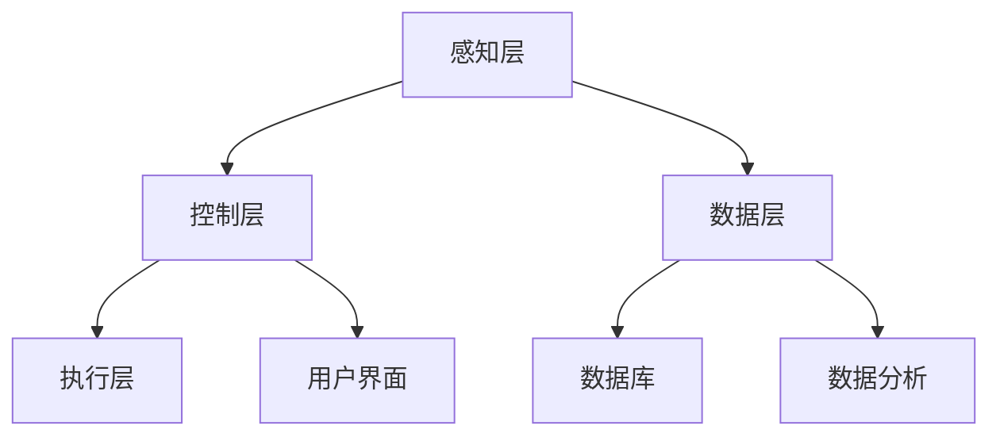
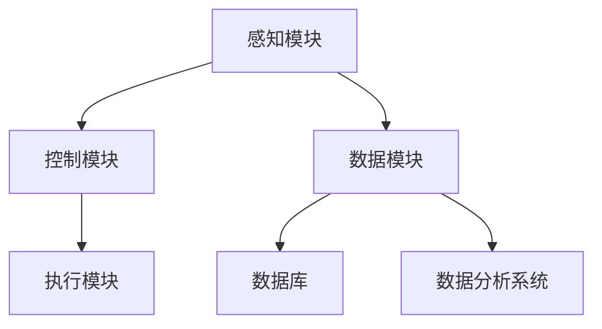

                 

## 引言：服务机器人在医疗健康领域的重要性

### 背景介绍

在过去的几十年里，医疗健康领域经历了显著的变革，从传统的人工医疗服务向现代的智能化医疗服务转型。随着科技的发展，特别是人工智能（AI）和机器人技术的快速进步，医疗服务方式正逐步迈向自动化和个性化。在此背景下，服务机器人在医疗健康领域的应用逐渐成为热门话题。服务机器人是一种能够为人类提供各种服务和帮助的智能机器人，它们通过感知环境、自主决策和执行任务，极大地提高了医疗服务的效率和质量。

### 问题描述

尽管服务机器人在医疗健康领域的潜力巨大，但实际应用过程中仍面临诸多挑战。首先，医疗环境复杂多变，对服务机器人的可靠性和适应性提出了高要求。其次，医疗数据的隐私和安全问题亟待解决。此外，医务人员和服务机器人之间的协同工作模式尚未完全成熟，影响了服务机器人的推广和应用。这些问题限制了服务机器人在医疗健康领域的进一步发展，因此，深入研究和解决这些问题具有重要意义。

### 解决方案与挑战

为了克服上述挑战，研究人员和工程师们提出了多种解决方案。例如，通过强化机器学习算法，提高服务机器人的自主决策能力；利用区块链技术，确保医疗数据的隐私和安全；通过人机交互技术的进步，提升医务人员与服务机器人之间的协同效率。然而，这些解决方案在实际应用中仍然存在一定的技术壁垒和成本问题。因此，需要进一步探讨如何在实际环境中实现服务机器人的高效、安全、可靠应用。

### 文章的核心内容和主题思想

本文旨在全面探讨服务机器人在医疗健康领域的发展，分析其基本概念、技术原理、应用场景、系统设计和实践案例。通过详细阐述服务机器人在医疗健康领域的核心问题和解决方案，本文希望能够为相关研究人员和从业人员提供有价值的参考。文章将从以下几个方面展开：

1. **基本概念和理论基础**：介绍服务机器人的定义、分类和核心组成，探讨其在医疗健康领域的应用前景。
2. **人工智能与机器学习在服务机器人中的应用**：阐述AI和ML的基本原理，分析它们在服务机器人中的应用案例。
3. **服务机器人在医疗健康领域的应用场景**：详细讨论服务机器人在医院、护理院、远程医疗等场景中的应用。
4. **技术架构与系统设计**：分析服务机器人系统的设计原则和架构，介绍相关的技术实现方法。
5. **实践案例与实施策略**：通过具体案例，展示服务机器人在医疗健康领域的成功实践，并提供实施策略。

通过这些内容，本文希望能够为服务机器人在医疗健康领域的深入研究和实际应用提供新的思路和方法。

## 关键词

服务机器人，医疗健康，人工智能，机器学习，自动化，医疗数据隐私，系统架构，人机交互。

## 摘要

服务机器人在医疗健康领域的应用正逐步成为医疗行业的重要趋势。本文从基本概念出发，详细探讨了服务机器人在医疗健康领域的应用现状、核心技术和挑战。通过分析人工智能和机器学习在服务机器人中的应用，以及服务机器人在不同医疗场景中的实际应用案例，本文展示了服务机器人在提升医疗服务效率、质量与安全方面的潜力。同时，本文还深入分析了服务机器人系统的技术架构和设计原则，提供了具体的实施策略和实践案例，为未来的研究和应用提供了有价值的参考。

## 基本概念与理论基础

### 服务机器人的定义与分类

服务机器人是一种专门设计用于为人类提供各种服务的智能机器人。它们通过感知环境、自主决策和执行任务，能够实现如清洁、护理、配送、维护等多种功能。在医疗健康领域，服务机器人主要应用于医院环境、护理院、康复中心和远程医疗服务等场景。

服务机器人可以按照其功能和应用范围进行分类。常见的分类方式包括以下几种：

1. **按功能分类**：
   - **清洁机器人**：主要用于医院环境的清洁和消毒，如医院病房、手术室等。
   - **护理机器人**：用于辅助护理工作，如运送病人、帮助病人进行康复训练、监测病人健康状况等。
   - **配送机器人**：用于在医院内部运送药品、食品和其他物资。
   - **维护机器人**：用于设备维护和设施检查，如医院设备的维修、监控等。

2. **按应用范围分类**：
   - **室内服务机器人**：主要在室内环境中工作，如医院病房、办公室、商场等。
   - **室外服务机器人**：主要在室外环境中工作，如机场、火车站、公园等。

### 核心组成与核心技术

服务机器人的核心组成包括传感器、执行器、控制器和通信系统。传感器用于感知环境，如摄像头、激光雷达、超声波传感器等；执行器用于执行具体任务，如电机、机械臂等；控制器负责处理传感器数据，做出决策，控制执行器动作；通信系统确保机器人与外部设备或系统进行数据交换。

在核心技术方面，服务机器人主要依赖于人工智能（AI）和机器人技术。人工智能包括机器学习、深度学习、自然语言处理等技术，用于增强机器人的自主决策和问题解决能力。机器人技术则涉及机器人运动学、动力学、路径规划、人机交互等技术，用于实现机器人的自主移动和任务执行。

### 医疗健康领域的应用前景

服务机器人在医疗健康领域的应用前景广阔。首先，在提高医疗服务效率方面，服务机器人可以替代医务人员完成一些重复性、劳动强度大的工作，如清洁、配送和监测等，从而减轻医务人员的工作负担。其次，在提升医疗服务质量方面，服务机器人通过高精度感知和决策能力，可以提供更加准确和及时的医疗服务，如康复训练、健康监测等。此外，在保障医疗服务安全方面，服务机器人可以减少人为错误，降低医疗事故的发生率。

总的来说，服务机器人在医疗健康领域的应用不仅有助于提高医疗服务的效率和品质，还能够推动医疗行业的智能化和自动化发展，具有重要的现实意义和深远的影响。

### 医疗健康领域中服务机器人的核心概念

在探讨服务机器人在医疗健康领域的应用时，必须首先理解其核心概念和组成结构。以下是服务机器人领域中的几个关键概念及其相互关系：

#### 1. 人工智能（AI）
人工智能是服务机器人的核心驱动力量，包括机器学习、深度学习、自然语言处理等多种技术。AI技术使机器人具备自我学习和决策能力，能够根据环境和任务需求进行自适应调整。在医疗健康领域，AI技术主要用于疾病诊断、治疗方案推荐、患者健康监测等方面。

**AI的属性特征：**
- **自我学习性**：通过大量数据训练，AI系统能够不断优化自身的算法，提高诊断和预测的准确性。
- **自动化决策**：AI系统能够处理复杂的医疗数据，提供实时诊断和决策支持。

**AI与机器人的关系：**
AI技术为机器人提供了智能化的“大脑”，使机器人能够理解、学习和执行复杂的任务。在医疗健康领域，机器人依赖AI进行数据分析和决策，从而实现自动化医疗服务。

#### 2. 机器人技术
机器人技术包括运动控制、路径规划、传感器融合等技术。这些技术使服务机器人能够在不同的医疗环境中自主移动和执行任务。

**机器人技术的属性特征：**
- **自主移动性**：通过运动控制系统，机器人能够在复杂环境中自主导航。
- **高精度控制**：机器人通过传感器融合和运动控制技术，能够实现精确的动作执行。

**机器人技术与服务机器人的关系：**
机器人技术是服务机器人的“身体”，它决定了机器人能否在不同环境中执行复杂任务。在医疗健康领域，机器人技术确保了服务机器人能够精确地完成配送、护理等任务。

#### 3. 医疗数据管理
医疗数据管理是服务机器人在医疗健康领域应用的关键环节，涉及到数据的收集、存储、处理和分析。有效的医疗数据管理能够确保数据的准确性和安全性。

**医疗数据管理的属性特征：**
- **数据准确性**：通过高精度的传感器和AI技术，确保数据的准确收集和记录。
- **数据安全性**：采用加密和隐私保护技术，确保医疗数据在传输和存储过程中的安全性。

**医疗数据管理与服务机器人的关系：**
医疗数据管理为服务机器人提供了必要的数据支持，使其能够进行有效的数据分析和决策。在医疗健康领域，良好的医疗数据管理能够提高服务机器人的性能和可靠性。

#### 4. 人机交互
人机交互技术是服务机器人的重要组成部分，它确保了机器人能够与医务人员和患者进行有效沟通和协作。

**人机交互的属性特征：**
- **自然性**：通过自然语言处理技术，实现人与机器人之间的自然对话。
- **直观性**：通过图形用户界面（GUI）和语音识别，提高人机交互的直观性和易用性。

**人机交互与服务机器人的关系：**
人机交互技术使服务机器人能够与医务人员和患者进行无缝协作，提高服务机器人的使用效率和用户体验。在医疗健康领域，良好的人机交互能够增强服务机器人的应用价值和用户满意度。

#### 综合关系

上述核心概念通过技术融合和协作，共同构成了服务机器人的整体功能。具体而言，AI技术为机器人提供了智能化的决策支持，机器人技术确保了机器人的自主移动和任务执行能力，医疗数据管理提供了必要的数据支持，而人机交互技术则增强了用户与机器人的互动体验。

在医疗健康领域，这些核心概念共同作用，实现了服务机器人的高效、安全、可靠应用。通过AI和机器人技术的结合，服务机器人能够提供精准的医疗服务；通过医疗数据管理，确保了医疗数据的安全性和准确性；通过人机交互技术，增强了服务机器人的用户体验。

总之，服务机器人在医疗健康领域的应用，不仅依赖于其核心概念和技术的成熟，还需要各技术之间的紧密协作和集成，以实现其最大价值。

### 人工智能与机器学习在服务机器人中的应用

#### 人工智能（AI）的基本原理

人工智能（AI）是指通过计算机系统实现人类智能的功能，使其能够感知环境、学习、推理、决策和行动。AI的核心包括机器学习（ML）、深度学习（DL）和自然语言处理（NLP）等子领域。其中，机器学习是一种通过数据训练模型，使计算机能够从数据中学习并做出预测或决策的技术。深度学习是机器学习的一种特殊形式，通过构建多层神经网络模型，模拟人类大脑的学习过程，进行复杂的数据分析和模式识别。自然语言处理则专注于使计算机理解和处理自然语言，从而实现人与机器的交互。

#### 机器学习（ML）算法及其在服务机器人中的应用

机器学习算法是AI的核心技术之一，包括监督学习、无监督学习和强化学习等类型。监督学习是一种有标注数据的训练方法，通过输入和输出数据对模型进行训练，使其能够对新的输入数据进行预测。常见的监督学习算法有线性回归、逻辑回归、支持向量机（SVM）和决策树等。无监督学习则不需要标注数据，通过发现数据中的模式和结构进行训练，如聚类分析和主成分分析（PCA）。强化学习是通过与环境的交互，根据反馈信号调整策略，以实现目标最大化。

在服务机器人中，机器学习算法广泛应用于路径规划、任务执行和异常检测等方面。例如，在路径规划中，可以使用遗传算法（GA）或A*算法，根据环境地图和障碍物信息，为机器人规划最优路径。在任务执行中，机器人可以通过深度强化学习（DRL）算法，根据环境和任务需求，自主调整其动作策略，提高任务执行效率。在异常检测中，可以使用孤立森林（Isolation Forest）算法或K最近邻（K-Nearest Neighbors, KNN）算法，对机器人运行过程中的数据进行分析，及时发现和处理异常情况。

#### 案例分析：深度强化学习在服务机器人中的应用

以下是一个具体的案例分析，展示了深度强化学习（DRL）在服务机器人中的应用。

**案例背景**：
某医院引入了一款用于病房配送的服务机器人，其任务是在医院内部自主导航，将药品和物资准确地送达指定位置。然而，医院内部环境复杂，包括各种障碍物和突发情况，这对机器人的路径规划和任务执行能力提出了高要求。

**解决方案**：
为了提高服务机器人的路径规划和任务执行能力，研究人员采用了深度强化学习（DRL）算法。具体步骤如下：

1. **状态空间定义**：
   - **状态**：包括机器人的位置、速度、周围环境信息（如障碍物位置、方向等）。
   - **动作**：机器人可以采取的动作，如前进、后退、转向等。

2. **深度神经网络构建**：
   - 构建一个深度神经网络（DNN），作为DRL算法的智能体（Agent），用于处理状态信息，预测最佳动作。
   - 网络结构包括多个隐藏层，通过激活函数（如ReLU）和优化算法（如Adam）进行训练。

3. **奖励机制设计**：
   - 设计一个奖励机制，根据机器人的动作和任务完成情况，给予不同的奖励。
   - 奖励值越高，表示机器人的任务完成得越好。

4. **训练过程**：
   - 使用强化学习框架（如OpenAI Gym）进行训练，模拟不同场景和环境。
   - 通过多轮训练，智能体不断调整其动作策略，提高路径规划和任务执行的准确性。

**实现与效果**：
通过深度强化学习（DRL）算法，服务机器人能够在复杂的医院环境中，自主导航并完成任务。实验结果显示，与传统路径规划算法相比，DRL算法能够显著提高机器人的任务完成率和响应速度。此外，DRL算法还能够适应新的环境和任务需求，具有较好的泛化能力。

总之，人工智能和机器学习技术在服务机器人中的应用，极大地提升了机器人在医疗健康领域的性能和效率。通过深度强化学习等先进算法，服务机器人能够更加智能地执行任务，为医疗健康领域带来革命性的变革。

### 服务机器人在医疗健康领域的应用场景

#### 医院环境

在医院环境中，服务机器人主要应用于病房清洁、物资配送、患者监护和辅助诊疗等方面。这些机器人能够24小时不间断工作，大大减轻了医务人员的工作压力，提高了医疗服务的效率。

1. **病房清洁**：
   - 清洁机器人负责清洁病房、走廊和洗手间等区域，使用高效清洁剂和消毒工具，确保医院环境的卫生和安全。
   - 通过机器视觉和传感器技术，清洁机器人能够避开障碍物，绕过病人和工作人员，确保清洁工作的高效和安全。

2. **物资配送**：
   - 配送机器人负责将药品、医疗器械和食品等物资从仓库或药房运送到指定的科室和病房。
   - 这些机器人通常具有高负载能力和自主导航功能，通过无线通信系统与医院管理系统进行实时交互，确保物资配送的准确性和及时性。

3. **患者监护**：
   - 监护机器人通过佩戴在患者身上的传感器，实时监测患者的生命体征，如心率、呼吸、体温等，并将数据传输给医务人员。
   - 如果监测到异常情况，监护机器人可以立即通知医务人员，提供及时的治疗和干预。

4. **辅助诊疗**：
   - 诊疗机器人通过影像识别和数据分析技术，辅助医生进行诊断和治疗决策。
   - 例如，放射科机器人可以自动处理医学影像，提高诊断的准确性和效率；手术机器人则能够协助医生进行复杂的手术操作，提高手术的成功率和安全性。

#### 护理院和老年人护理

在护理院和老年人护理领域，服务机器人的应用尤为重要，因为老年人通常需要更多的监护和护理。服务机器人能够提供全天候的陪伴和帮助，提高老年人的生活质量。

1. **日常生活辅助**：
   - 日常护理机器人帮助老年人进行日常活动，如穿衣、洗漱、进食等。
   - 这些机器人通常配备机械手臂和语音交互系统，能够根据老年人的需求进行灵活操作。

2. **健康监测**：
   - 健康监测机器人通过传感器和AI技术，实时监测老年人的健康状况，包括心率、血压、血糖等。
   - 如果监测到异常情况，机器人会立即通知护理人员和家属，并提供相应的建议和帮助。

3. **娱乐和社交**：
   - 娱乐社交机器人通过语音交互和多媒体功能，为老年人提供娱乐和社交活动，缓解他们的孤独感。
   - 这些机器人能够播放音乐、讲故事、进行对话，甚至组织小游戏，提高老年人的情绪和生活质量。

#### 远程医疗

远程医疗是服务机器人应用的一个重要领域，通过机器人技术，实现医疗服务的远程化和智能化。

1. **远程诊疗**：
   - 远程诊疗机器人通过视频会议系统和医疗设备，实现医生与患者之间的远程诊断和治疗。
   - 这些机器人能够提供实时音视频通讯，医生可以通过机器人的摄像头和传感器观察患者的病情，并提供专业的医疗建议。

2. **远程监控**：
   - 远程监控机器人通过传感器和AI技术，对患者的健康状况进行实时监控。
   - 医生可以通过远程监控系统，随时了解患者的健康状况，并根据需要调整治疗方案。

3. **医疗数据管理**：
   - 远程医疗机器人还负责收集和管理工作中的医疗数据，包括患者的病历、检查报告和诊断结果。
   - 通过大数据分析和AI技术，这些机器人能够帮助医生进行数据挖掘和预测分析，提供更精确的诊断和治疗建议。

#### 康复中心

在康复中心，服务机器人主要用于康复训练、辅助治疗和日常护理等方面。

1. **康复训练**：
   - 康复训练机器人通过机械结构和传感器技术，为患者提供个性化的康复训练计划。
   - 例如，步行训练机器人可以帮助中风患者进行步态训练，提高其行走能力。

2. **辅助治疗**：
   - 辅助治疗机器人通过自动化设备和技术，为患者提供多种治疗手段，如物理治疗、康复手术等。
   - 这些机器人能够精准地执行治疗任务，提高治疗效果和安全性。

3. **日常护理**：
   - 日常护理机器人负责患者的饮食、用药和日常活动，减轻护理人员的负担。
   - 这些机器人通常配备智能语音交互系统和自动化操作设备，能够根据患者的需求进行灵活操作。

总之，服务机器人在医疗健康领域的应用场景丰富多样，不仅提高了医疗服务的效率和质量，还极大地改善了患者的体验。随着技术的不断进步，服务机器人在医疗健康领域的应用前景将更加广阔。

### 服务机器人系统的设计原则与架构

#### 系统设计原则

在设计服务机器人系统时，需要遵循一系列设计原则，以确保系统的可靠性、可扩展性和易维护性。以下是一些关键的设计原则：

1. **模块化设计**：将系统划分为多个功能模块，每个模块具有独立的职责，便于系统的开发和维护。例如，可以将传感器模块、执行器模块、控制模块和数据管理模块分开设计。

2. **可扩展性**：系统应具备良好的扩展性，能够适应未来的需求变化和技术升级。这意味着在设计时需要预留足够的接口和扩展点，以便在需要时进行功能扩展或替换。

3. **安全性**：服务机器人在医疗环境中工作，必须确保系统的安全性。这包括物理安全（如防止机器人伤害病人或医务人员）、数据安全（如保护病人隐私）和网络安全（如防止黑客攻击）。

4. **用户友好性**：系统设计应充分考虑用户的操作体验，提供直观的用户界面和友好的交互方式，使医务人员和患者能够轻松地使用和操作机器人。

5. **实时性**：在医疗应用中，机器人需要能够实时响应和处理各种情况。因此，系统设计应确保实时数据处理和响应能力，以避免延误医疗决策和操作。

#### 系统架构

服务机器人系统的架构通常包括感知层、控制层、执行层和数据层四个主要层次，各层之间相互配合，共同实现系统的功能。

1. **感知层**：感知层是服务机器人的“感官”，负责收集环境信息。常用的传感器包括摄像头、激光雷达、超声波传感器、温度传感器等。这些传感器将收集到的数据传输到控制层进行处理。

2. **控制层**：控制层是系统的“大脑”，负责处理感知层收集的数据，并做出决策。控制层通常包括一个或多个计算机节点，运行机器学习算法和路径规划算法等。控制层通过接口与执行层进行通信，下达任务指令。

3. **执行层**：执行层是服务机器人的“肢体”，负责执行控制层下达的任务指令。执行层包括各种执行器，如电机、机械臂、驱动轮等。这些执行器根据指令进行具体的动作执行。

4. **数据层**：数据层负责数据的存储、管理和分析。数据层通常包括一个数据库系统，用于存储传感器数据、控制指令和执行结果。同时，数据层还通过数据分析和机器学习算法，提供决策支持和优化建议。

#### 系统架构图

以下是服务机器人系统架构的Mermaid流程图：

在上述架构中，感知层通过传感器收集环境数据，传输到控制层进行处理；控制层根据处理结果，生成任务指令，发送到执行层执行；数据层负责数据的存储和管理，同时提供数据分析支持，辅助控制层的决策；用户界面则用于医务人员和患者的交互，接收和反馈信息。

#### 系统接口与交互设计

系统接口与交互设计是确保服务机器人有效运作的关键。以下是一些设计要点：

1. **传感器与控制层接口**：传感器与控制层的接口应确保数据传输的实时性和准确性。常用的接口协议包括USB、CAN总线、Wi-Fi和蓝牙等。设计时应考虑传感器的数据量、传输速率和实时性要求。

2. **控制层与执行层接口**：控制层与执行层的接口需要确保指令的下达和反馈的及时性。接口协议应支持高频率的数据通信，并具备容错和冗余机制，以保证系统的稳定性。

3. **数据层与外部系统接口**：数据层与外部系统（如医院管理系统、病历系统等）的接口设计应确保数据的一致性和安全性。常用的接口技术包括Web服务、API接口和数据库连接等。

4. **用户界面与系统接口**：用户界面与系统的接口设计应简单直观，便于医务人员和患者操作。界面设计应包括实时数据展示、操作控制面板和警报提示等功能。

#### 人机交互设计

人机交互（HCI）设计是提升服务机器人用户体验的重要环节。以下是一些关键设计要点：

1. **自然语言处理**：通过自然语言处理技术，实现机器人与用户之间的自然对话。用户可以使用语音或文字与机器人进行交流，简化操作流程。

2. **图形用户界面**：设计直观、易操作的图形用户界面，使用户能够轻松地与机器人进行交互。界面应包括清晰的指示、友好的提示信息和便捷的操作流程。

3. **多模态交互**：支持多种交互方式，如语音、手势、触摸屏等，以满足不同用户的交互需求。

4. **实时反馈**：系统应提供实时的操作反馈，使用户能够及时了解机器人的状态和执行情况。例如，语音提示、动画效果和屏幕显示等。

通过遵循上述设计原则和架构，服务机器人系统可以实现高效、安全、可靠的运作，为医疗健康领域提供强大的技术支持。

### 实践案例与实施策略

#### 案例背景

某大型综合医院引入了一款用于病房清洁和物资配送的服务机器人，旨在提高医院内部运作效率，减少医务人员的工作负担。这款服务机器人由医院自主研发，结合了先进的AI技术和机器人技术，能够自主导航、自动避障，并具备智能配送功能。

#### 环境介绍

医院的环境复杂多变，包括多个楼层、走廊、病房和手术室等区域。这些区域存在各种障碍物，如家具、设备、行人等。此外，医院的规章制度严格，对机器人的行为规范和安全性有较高要求。

#### 系统功能设计

1. **清洁功能**：服务机器人配备高效的清洁设备，能够自动完成病房的清扫和消毒工作。机器人通过摄像头和激光雷达感知环境，识别障碍物并规划清洁路径。

2. **物资配送功能**：服务机器人能够接收医院管理系统的配送指令，自动前往指定地点取物，并准确送达。机器人通过无线通信系统与医院管理系统进行实时数据交互，确保配送的准确性和及时性。

3. **障碍物避障功能**：通过深度学习和传感器融合技术，机器人能够实时感知周围环境，自动避障并规划安全路径。

#### 系统架构设计

服务机器人系统采用模块化设计，主要包括感知模块、控制模块、执行模块和数据模块。

1. **感知模块**：包括摄像头、激光雷达、超声波传感器等，用于感知周围环境。

2. **控制模块**：运行深度学习算法和路径规划算法，负责处理感知数据并生成控制指令。

3. **执行模块**：包括电机、机械臂等执行器，负责执行控制模块生成的任务指令。

4. **数据模块**：包括数据库和数据分析系统，用于存储和管理机器人运行数据，并提供数据分析支持。

以下是系统架构的Mermaid流程图：

#### 系统接口与交互设计

1. **传感器与控制模块接口**：采用标准的数据接口协议（如USB、CAN总线），确保数据传输的实时性和准确性。

2. **控制模块与执行模块接口**：通过高速通信接口（如USB或无线网络），确保控制指令的实时下达和反馈。

3. **数据模块与外部系统接口**：通过Web服务和API接口，与医院管理系统进行数据交互，实现数据共享和系统集成。

4. **用户界面**：设计直观易操作的图形用户界面（GUI），使医务人员能够方便地监控和操作机器人。

#### 人机交互设计

1. **自然语言处理**：通过语音识别和自然语言处理技术，实现机器人与医务人员的自然对话，简化操作流程。

2. **多模态交互**：支持语音、手势和触摸屏等多种交互方式，满足不同医务人员的操作习惯。

3. **实时反馈**：系统提供实时的操作反馈，包括语音提示、动画效果和屏幕显示，确保操作透明和可控。

#### 实际案例实现

1. **环境建模**：首先，对医院的环境进行建模，包括各个楼层、房间、走廊的布局和障碍物分布。使用三维建模工具，创建详细的医院环境地图。

2. **传感器部署**：在机器人的感知模块中，部署摄像头、激光雷达和超声波传感器，确保机器人能够实时感知周围环境。

3. **算法训练**：利用深度学习算法，对机器人进行环境建模和障碍物识别训练。通过大量数据集，训练机器人的感知和决策模型，提高其识别精度和自主导航能力。

4. **系统集成**：将各个功能模块进行集成，实现机器人与医院管理系统的无缝对接。通过Web服务和API接口，实现数据的实时传输和交互。

5. **测试与优化**：在实际环境中进行测试，对机器人的性能和稳定性进行优化。通过多次测试和调整，确保机器人能够在复杂环境中稳定运行。

#### 实施效果

通过实际应用，服务机器人在医院内部实现了高效、安全、可靠的运作。具体效果如下：

1. **提高清洁效率**：服务机器人每天能够完成大量病房的清扫和消毒工作，有效提高了医院的卫生水平。

2. **优化物资配送**：机器人能够准确、及时地将物资送达指定地点，减少了人为错误和配送延误。

3. **减轻医务人员负担**：机器人承担了大量重复性、劳动强度大的工作，医务人员的工作负担显著减轻。

4. **改善患者体验**：服务机器人的引入，使患者感受到医院的服务质量提升，提高了患者的满意度和体验。

总之，服务机器人在医疗健康领域的实际案例展示了其巨大的应用潜力。通过合理的设计和实施，服务机器人能够显著提高医疗服务的效率和质量，为医疗行业的发展注入新的动力。

### 最佳实践与注意事项

#### 最佳实践

1. **确保数据隐私和安全**：在服务机器人系统中，数据隐私和安全至关重要。必须采用加密技术保护数据传输和存储，确保病人的隐私不被泄露。

2. **进行严格的测试和验证**：在部署服务机器人之前，必须进行严格的测试和验证，确保机器人在各种环境下都能稳定、可靠地运行。

3. **提供用户培训和支持**：为医务人员和患者提供全面的培训和支持，确保他们能够熟练使用和操作服务机器人，提高其使用效率。

4. **持续优化和更新算法**：随着技术的不断发展，持续优化和更新服务机器人的算法和功能，以适应新的需求和挑战。

#### 注意事项

1. **遵循法律法规**：在设计和应用服务机器人时，必须严格遵守相关的法律法规，确保机器人的行为符合伦理和法律规定。

2. **确保系统的实时性和响应速度**：特别是在医疗紧急情况下，服务机器人必须具备实时性和快速响应能力，以避免延误治疗。

3. **关注机器人的维护和保养**：定期对服务机器人进行维护和保养，确保其性能和安全性，避免因设备故障导致的医疗事故。

### 拓展阅读

1. **《智能机器人技术与应用》**：详细介绍了智能机器人的基本概念、核心技术及应用场景，有助于深入了解服务机器人的发展。

2. **《人工智能：一种现代的方法》**：涵盖了机器学习、深度学习、自然语言处理等人工智能核心技术的理论和方法，为服务机器人的研发提供技术支持。

3. **《医疗大数据与智能分析》**：探讨了医疗大数据的处理和分析方法，以及如何在医疗服务中应用人工智能技术，为服务机器人的数据管理提供参考。

### 作者信息

作者：AI天才研究院/AI Genius Institute & 禅与计算机程序设计艺术 /Zen And The Art of Computer Programming

本文通过详细探讨服务机器人在医疗健康领域的应用，展示了其在提升医疗服务效率、质量和安全性方面的潜力。同时，文章还提供了系统设计、实践案例和最佳实践等方面的内容，为相关研究和应用提供了有价值的参考。希望读者能够从中获得启发，共同推动服务机器人在医疗健康领域的进一步发展。

