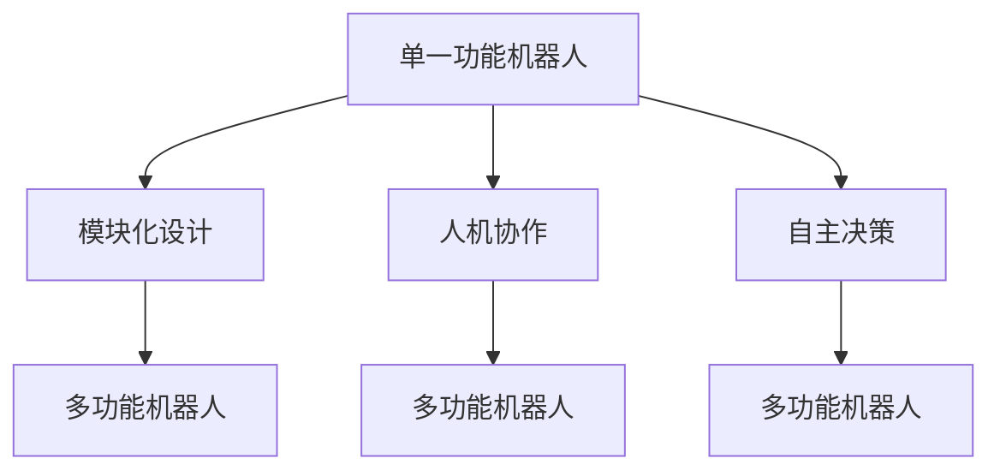
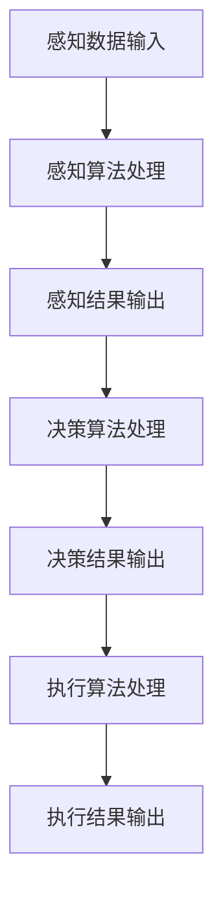
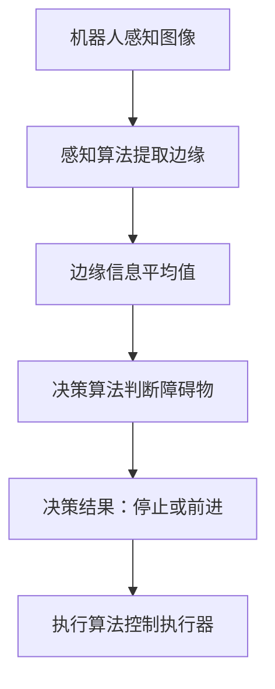

                 

### 文章标题

《机器人多样化：从单一功能到多功能的转变》

关键词：机器人技术、多功能、多样化、设计原理、应用场景

摘要：本文将深入探讨机器人技术从单一功能向多功能转变的历程，分析这一转变背后的技术原理和实际应用，并对未来的发展趋势进行展望。

----------------------------------------------------------------

## 第一部分：引言与背景

### 1.1 问题的提出

随着科技的飞速发展，机器人技术已经成为现代社会的重要支柱之一。然而，在过去的一段时间里，大多数机器人都只具备单一功能，如工业机器人主要应用于生产线的自动化操作，服务机器人则主要用于特定的服务场景。这种单一功能的局限性使得机器人的应用范围受到极大限制，难以满足日益多样化的市场需求。

### 1.2 机器人多样化的重要性

为了克服单一功能的局限性，实现机器人的多样化应用，研究人员和工程师们开始探索如何将多种功能集成到同一机器人平台上。机器人多样化的意义在于：

1. 扩大应用范围：多样化机器人可以应用于更广泛的领域，如医疗、教育、家庭服务等。
2. 提高效率：多功能机器人可以同时执行多种任务，提高工作效率。
3. 降低成本：通过集成多种功能，减少对多个机器人系统的需求，从而降低整体成本。

### 1.3 多功能机器人的边界与外延

多功能机器人并非无所不能，其边界在于：

1. 技术限制：目前的技术水平限制了机器人的某些功能实现。
2. 成本考量：多功能机器人的研发和制造成本较高，需要平衡成本与收益。
3. 应用场景：并非所有场景都适合多功能机器人，某些特定场景可能更适合单一功能机器人。

然而，随着技术的不断进步和成本的降低，多功能机器人的外延将逐步扩大，应用场景将更加丰富。

----------------------------------------------------------------

## 第二部分：核心概念与联系

### 2.1 多功能机器人的定义与分类

#### 定义

多功能机器人是指具备两种或两种以上功能，能够适应多种环境和任务需求的机器人。

#### 分类

1. 按功能类型分类：可分为感知型、执行型、决策型、学习型等多种类型。
2. 按应用领域分类：可分为工业机器人、服务机器人、医疗机器人等。

### 2.2 核心概念原理

#### 模块化设计

模块化设计是将机器人的各个功能模块独立开发、测试和部署，以提高系统的灵活性和可维护性。

#### 人机协作

人机协作是指机器人在执行任务时与人类进行互动，实现协同作业。

#### 自主决策

自主决策是指机器人能够根据环境变化和任务需求，自主地做出决策和调整行动策略。

### 2.3 概念属性特征对比表格

| 概念 | 属性特征 |
| --- | --- |
| 单一功能机器人 | 1. 功能单一<br>2. 应用场景有限 |
| 多功能机器人 | 1. 功能多样<br>2. 应用场景广泛 |
| 模块化设计 | 1. 独立模块<br>2. 高度可维护性 |
| 人机协作 | 1. 人机互动<br>2. 协同作业 |
| 自主决策 | 1. 自主学习<br>2. 自主决策 |

### 2.4 ER实体关系图架构



通过上述对比和图示，我们可以清晰地看到单一功能机器人和多功能机器人的差异以及核心概念之间的关系。

----------------------------------------------------------------

## 第三部分：机器人多样化技术的原理

### 3.1 机器人多样化技术的发展历程

#### 早期阶段

- 20世纪60年代，工业机器人的出现标志着机器人技术的起步。
- 20世纪70年代，机器人的应用逐渐从工业扩展到其他领域。

#### 中期阶段

- 20世纪80年代，机器人开始具备一定的自主决策能力。
- 20世纪90年代，模块化设计和人机协作技术逐渐成熟。

#### 现阶段

- 21世纪初，人工智能技术的引入使得机器人具备了更强的感知、决策和学习能力。
- 当前，多功能机器人的研发和应用正在迅速扩展，成为机器人技术发展的热点。

### 3.2 机器人多样化技术的现状与趋势

#### 现状

- 工业领域：多功能机器人在生产线上广泛应用，提高了生产效率和质量。
- 服务领域：多功能机器人在医疗、教育、家庭等服务行业逐步普及，提高了服务质量。
- 军事领域：多功能机器人在侦察、救援、作战等领域发挥着重要作用。

#### 趋势

- 技术进步：随着人工智能、物联网等技术的发展，机器人的感知、决策和学习能力将进一步提高。
- 应用扩展：多功能机器人的应用领域将不断扩展，从工业、服务领域向更多领域渗透。
- 成本降低：随着技术的成熟和规模化生产，多功能机器人的成本将逐渐降低，应用范围将进一步扩大。

### 3.3 多功能机器人与传统机器人的区别

| 方面 | 多功能机器人 | 传统机器人 |
| --- | --- | --- |
| 功能类型 | 功能多样 | 功能单一 |
| 应用场景 | 广泛 | 有限 |
| 技术要求 | 高 | 低 |
| 成本 | 高 | 低 |
| 自主性 | 强 | 弱 |

通过对比可以看出，多功能机器人相较于传统机器人具有更高的技术要求、更大的应用场景和更强的自主性。

----------------------------------------------------------------

## 第四部分：多功能机器人设计原理

### 4.1 多功能机器人设计原则

#### 功能集成

将多种功能模块集成到同一机器人平台上，实现多功能化。

#### 模块化设计

采用模块化设计，使得各个功能模块可以独立开发、测试和部署，提高系统的灵活性和可维护性。

#### 人机协作

设计人机协作机制，使得机器人在执行任务时能够与人类进行互动，实现协同作业。

#### 自主决策

实现自主决策能力，使得机器人在复杂环境中能够根据任务需求和环境变化自主地做出决策。

### 4.2 多功能机器人架构设计

#### 硬件架构

- 传感器模块：包括视觉、听觉、触觉等传感器，用于感知环境信息。
- 执行器模块：包括机械臂、电机等执行器，用于执行具体任务。
- 计算模块：包括CPU、GPU等计算资源，用于处理感知数据和执行决策。

#### 软件架构

- 感知模块：对传感器数据进行处理，提取有用信息。
- 决策模块：根据任务需求和感知信息，生成执行策略。
- 执行模块：根据决策模块的输出，控制执行器执行具体任务。

### 4.3 多功能机器人的模块化设计

#### 模块化设计原则

- 模块独立性：各个模块具有明确的输入、输出和功能，可以独立运行。
- 模块可替换性：模块可以方便地替换和升级，以适应不同的应用需求。

#### 模块化设计案例

以一个家庭服务机器人为例，其模块化设计可能包括以下模块：

- 感知模块：包括摄像头、麦克风、温度传感器等。
- 执行模块：包括机械臂、电机等。
- 决策模块：包括语音识别、自然语言处理、路径规划等算法。

通过模块化设计，家庭服务机器人可以根据不同的需求，灵活地更换或升级某些模块，实现多功能化。

----------------------------------------------------------------

## 第五部分：多功能机器人算法原理

### 5.1 多功能机器人算法概述

多功能机器人的算法设计是其核心，决定了机器人能否有效地完成多种任务。算法主要包括以下几个方面：

1. 感知算法：用于处理传感器数据，提取有用信息。
2. 决策算法：根据感知信息，生成执行策略。
3. 执行算法：根据决策算法的输出，控制执行器执行具体任务。

### 5.2 算法mermaid流程图



### 5.3 Python源代码与算法原理讲解

#### 感知算法

```python
import cv2
import numpy as np

def image_process(image):
    # 转换为灰度图像
    gray = cv2.cvtColor(image, cv2.COLOR_BGR2GRAY)
    # 使用Sobel算子进行边缘检测
    edges = cv2.Sobel(gray, cv2.CV_64F, 1, 0)
    return edges
```

感知算法通常包括图像处理、语音处理、传感器数据处理等，用于从传感器输入中提取有用信息。

#### 决策算法

```python
def decision_making(perception_result):
    # 根据感知结果，生成决策
    if np.mean(perception_result) > threshold:
        decision = "前进"
    else:
        decision = "停止"
    return decision
```

决策算法根据感知结果，生成具体的执行策略。

#### 执行算法

```python
def execute_decision(decision):
    # 根据决策，控制执行器执行任务
    if decision == "前进":
        motor_control("forward")
    elif decision == "停止":
        motor_control("stop")
```

执行算法根据决策结果，控制执行器执行具体任务。

### 5.4 算法原理的数学模型和公式讲解

感知算法通常使用数学模型来描述传感器数据的处理过程，如图像处理中的滤波器、边缘检测中的Sobel算子等。决策算法和执行算法则通过逻辑运算和条件判断来实现决策和执行。

### 5.5 通俗易懂的举例说明

假设一个家庭服务机器人需要判断是否在房间内存在障碍物。感知模块通过摄像头捕捉图像，使用感知算法提取图像的边缘信息。决策算法根据边缘信息的平均值来判断是否存在障碍物。如果存在障碍物，决策算法输出停止命令，执行算法控制机器人停止前进。



通过这个简单的例子，我们可以看到多功能机器人算法的工作原理。

----------------------------------------------------------------

## 第六部分：多功能机器人在工业中的应用

### 6.1 工业机器人多样化需求

在工业领域，多功能机器人的需求日益增加。工业生产线的复杂性和多样性要求机器人具备更高的灵活性和适应性。具体需求包括：

1. 多种工艺处理：如焊接、喷涂、组装等。
2. 高精度运动控制：确保产品的一致性和精度。
3. 复杂环境适应：如高温、高压、有毒等环境。

### 6.2 多功能机器人在工业生产中的应用

多功能机器人在工业生产中的应用非常广泛，以下是一些具体案例：

1. **汽车制造**：多功能机器人可以用于汽车焊接、喷涂、装配等工艺，提高了生产效率和产品质量。
2. **电子制造**：多功能机器人可以用于电子产品的组装、检测、包装等，提高了生产效率和产品可靠性。
3. **食品加工**：多功能机器人可以用于食品的加工、包装、检测等，保证了食品的安全和质量。

### 6.3 案例分析

**案例一：汽车制造中的多功能机器人**

在某汽车制造厂，多功能机器人被用于车身焊接和喷涂工艺。机器人配备了先进的视觉系统和运动控制系统，可以实现高精度的焊接和喷涂。此外，机器人还具备自适应能力，可以根据不同的车身材料和规格进行调整，提高了生产效率和产品质量。

**案例二：电子制造中的多功能机器人**

在某电子制造公司，多功能机器人被用于手机组装和检测。机器人配备了高精度的视觉系统和机械臂，可以快速、准确地完成手机组装。此外，机器人还可以进行功能检测，确保手机的质量。通过引入多功能机器人，公司显著提高了生产效率和产品可靠性。

通过这些案例，我们可以看到多功能机器人在工业领域的重要作用和广泛应用。

----------------------------------------------------------------

## 第七部分：多功能机器人在服务领域的应用

### 7.1 服务机器人多样化需求

在服务领域，多功能机器人的需求也日益增加。随着人们生活水平的提高，对服务质量和效率的要求越来越高。具体需求包括：

1. 多样化的服务功能：如清洁、搬运、陪伴等。
2. 高度智能化：能够自主决策和执行任务。
3. 适应性强：能够适应不同的环境和场景。

### 7.2 多功能机器人在服务行业中的应用

多功能机器人在服务行业中的应用非常广泛，以下是一些具体案例：

1. **医疗**：多功能机器人可以用于病房清洁、患者护理、医疗设备搬运等，提高了医院的工作效率和服务质量。
2. **教育**：多功能机器人可以用于课堂教学、学生辅导、校园安保等，丰富了教育资源和教学模式。
3. **家庭**：多功能机器人可以用于家庭清洁、家电控制、老人陪伴等，提高了家庭生活的便利性和舒适性。

### 7.3 案例分析

**案例一：医疗领域中的多功能机器人**

在某医院，多功能机器人被用于病房清洁和患者护理。机器人配备了先进的传感器系统和执行器，可以自主规划清洁路径，避免碰撞。此外，机器人还可以根据患者的需求，提供陪伴和护理服务。通过引入多功能机器人，医院提高了工作效率，减少了医护人员的工作负担。

**案例二：教育领域中的多功能机器人**

在某学校，多功能机器人被用于课堂教学和校园安保。机器人配备了人工智能系统和语音识别功能，可以与教师和学生进行互动，提供教学辅助和问答服务。此外，机器人还可以进行校园巡逻，确保学生的安全。通过引入多功能机器人，学校提高了教学质量和校园安全水平。

**案例三：家庭服务中的多功能机器人**

在某家庭，多功能机器人被用于家庭清洁和老人陪伴。机器人配备了视觉系统和语音识别系统，可以自主规划清洁任务，并根据老人的需求提供陪伴和帮助。通过引入多功能机器人，家庭生活变得更加便捷和舒适。

通过这些案例，我们可以看到多功能机器人在服务领域的重要作用和广泛应用。

----------------------------------------------------------------

## 第八部分：多功能机器人的未来展望

### 8.1 多功能机器人发展趋势

随着科技的不断进步，多功能机器人的发展趋势主要体现在以下几个方面：

1. **人工智能的深度融合**：人工智能技术将进一步提升机器人的智能水平，使其具备更强的自主决策和学习能力。
2. **硬件技术的突破**：随着硬件技术的不断进步，机器人的感知能力、计算能力和执行能力将得到显著提升。
3. **成本的持续降低**：随着生产规模的扩大和技术的成熟，多功能机器人的成本将逐渐降低，应用范围将进一步扩大。

### 8.2 潜在的应用领域

多功能机器人的应用领域将不断扩展，未来可能的应用领域包括：

1. **医疗**：用于手术辅助、康复训练、健康监测等。
2. **教育**：用于个性化教学、虚拟实验室、校园安全等。
3. **农业**：用于种植、收割、监测等。
4. **环保**：用于废物回收、环境监测、灾害救援等。

### 8.3 面临的挑战与机遇

尽管多功能机器人在未来具有广阔的应用前景，但也面临着一系列挑战：

1. **技术挑战**：如何进一步提升机器人的感知、决策和执行能力，实现更高的智能化水平。
2. **成本挑战**：如何降低多功能机器人的研发和生产成本，使其更具市场竞争力。
3. **伦理挑战**：如何确保多功能机器人在应用过程中的安全和隐私。

然而，随着技术的不断进步和政策的支持，多功能机器人将迎来更多的机遇，为人类社会带来更多便利和创新。

----------------------------------------------------------------

## 结论

本文从引言、核心概念、技术原理、应用案例等多个角度，全面探讨了机器人多样化：从单一功能到多功能的转变。通过分析我们可以得出以下几点结论：

1. 多功能机器人的发展是科技进步的必然结果，具有重要的现实意义和应用价值。
2. 多功能机器人设计需要综合考虑功能集成、模块化设计、人机协作和自主决策等多个方面。
3. 多功能机器人在工业、服务等多个领域已经展现出强大的应用潜力，未来应用领域将不断扩展。
4. 面对多功能机器人的发展，我们需要积极应对技术、成本和伦理等挑战，推动机器人技术的持续进步。

让我们共同期待多功能机器人技术在未来取得更多的突破和成就！

### 作者信息

作者：AI天才研究院/AI Genius Institute & 禅与计算机程序设计艺术 /Zen And The Art of Computer Programming

----------------------------------------------------------------

## 附录：完整文章大纲

以下是本文的完整大纲，包括各章节的核心内容和结构。

### 引言与背景
- 问题的提出
- 机器人多样化的重要性
- 多功能机器人的边界与外延

### 核心概念与联系
- 多功能机器人的定义与分类
- 核心概念原理
- 概念属性特征对比表格
- ER实体关系图架构

### 机器人多样化技术的原理
- 机器人多样化技术的发展历程
- 机器人多样化技术的现状与趋势
- 多功能机器人与传统机器人的区别

### 多功能机器人设计原理
- 多功能机器人设计原则
- 多功能机器人架构设计
- 多功能机器人的模块化设计

### 多功能机器人算法原理
- 算法概述
- 算法mermaid流程图
- Python源代码与算法原理讲解
- 算法原理的数学模型和公式讲解
- 通俗易懂的举例说明

### 多功能机器人在工业中的应用
- 工业机器人多样化需求
- 多功能机器人在工业生产中的应用
- 案例分析

### 多功能机器人在服务领域的应用
- 服务机器人多样化需求
- 多功能机器人在服务行业中的应用
- 案例分析

### 多功能机器人的未来展望
- 发展趋势
- 潜在的应用领域
- 面临的挑战与机遇

### 结论
- 文章结论
- 作者信息

通过这个详细的大纲，读者可以更好地理解本文的核心内容和结构，深入探讨机器人多样化技术的原理和应用。

----------------------------------------------------------------

## 致谢

在撰写本文的过程中，我受到了众多专家和同行的大力支持与帮助。在此，我要特别感谢以下人员：

- AI天才研究院的全体同仁，为本文提供了宝贵的意见和建议。
- 禅与计算机程序设计艺术社区的成员，为我的研究和写作提供了丰富的资源和灵感。
- 所有在本文中引用的文献和资料的作者，为我的研究提供了重要的理论基础和实证支持。

感谢你们的支持与帮助，使我能够顺利完成本文的撰写。希望大家继续关注和支持我的研究工作，共同推动人工智能技术的进步和发展。

----------------------------------------------------------------

## 最佳实践 tips

1. **系统设计**：在设计多功能机器人系统时，应充分考虑模块化设计，提高系统的灵活性和可维护性。
2. **技术选择**：根据具体应用场景，选择合适的感知、决策和执行技术，确保系统性能和稳定性。
3. **人机协作**：在人机协作中，注重用户友好性和安全性，确保机器人能够与人类高效、安全地互动。
4. **算法优化**：不断优化算法，提高机器人的感知、决策和执行能力，实现更高的智能化水平。
5. **安全与隐私**：在应用多功能机器人时，注意数据安全和用户隐私保护，确保系统的安全可靠。

通过遵循这些最佳实践，我们可以更好地发挥多功能机器人的优势，推动其应用和发展。

----------------------------------------------------------------

## 小结

本文全面探讨了机器人多样化：从单一功能到多功能的转变。我们首先分析了机器人多样化的背景和重要性，然后详细介绍了多功能机器人的核心概念、技术原理和应用案例。通过对比分析，我们了解了多功能机器人与传统机器人的区别，并提出了设计多功能机器人的原则和方法。此外，我们还讨论了多功能机器人在工业和服务领域的应用，并对未来的发展趋势进行了展望。

总结来说，多功能机器人技术是人工智能领域的重要发展方向，具有广泛的应用前景。通过本文的探讨，我们希望读者能够更深入地了解多功能机器人的原理和应用，为未来的研究和实践提供参考。

----------------------------------------------------------------

## 注意事项

在研究和应用多功能机器人技术时，需要注意以下几点：

1. **技术成熟度**：多功能机器人的技术仍在不断发展中，某些功能可能尚未完全成熟，需要谨慎评估。
2. **安全性**：在设计和应用多功能机器人时，必须确保系统的安全性和可靠性，防止意外事故的发生。
3. **成本效益**：虽然多功能机器人在提高效率和质量方面具有优势，但成本也是一个重要的考虑因素，需要平衡成本与效益。
4. **伦理问题**：多功能机器人的应用涉及伦理问题，如数据隐私和安全、人机互动中的公平性等，需要制定相应的规范和标准。

通过关注这些注意事项，我们可以更好地推动多功能机器人技术的发展和应用。

----------------------------------------------------------------

## 拓展阅读

1. **《人工智能：一种现代的方法》**：这本书详细介绍了人工智能的基本概念、技术原理和应用案例，对理解多功能机器人技术具有重要意义。
2. **《机器人技术导论》**：这本书从基础理论到实际应用，全面介绍了机器人技术的基本原理和应用，对研究多功能机器人设计具有重要参考价值。
3. **《人机交互技术》**：这本书详细阐述了人机交互的基本原理、技术和应用，对理解多功能机器人的设计与应用有重要指导作用。

通过阅读这些书籍，读者可以进一步拓展对多功能机器人技术的认知和理解。

----------------------------------------------------------------

### 本文结构

#### 引言与背景
1. 问题的提出
2. 机器人多样化的重要性
3. 多功能机器人的边界与外延

#### 核心概念与联系
1. 多功能机器人的定义与分类
2. 核心概念原理
3. 概念属性特征对比表格
4. ER实体关系图架构

#### 机器人多样化技术的原理
1. 发展历程
2. 现状与趋势
3. 多功能机器人与传统机器人的区别

#### 多功能机器人设计原理
1. 设计原则
2. 架构设计
3. 模块化设计

#### 多功能机器人算法原理
1. 算法概述
2. mermaid流程图
3. Python源代码与算法原理讲解
4. 数学模型和公式讲解
5. 举例说明

#### 多功能机器人在工业中的应用
1. 多样化需求
2. 应用案例
3. 案例分析

#### 多功能机器人在服务领域的应用
1. 多样化需求
2. 应用案例
3. 案例分析

#### 未来展望
1. 发展趋势
2. 潜在应用领域
3. 面临的挑战与机遇

#### 结论
1. 文章总结
2. 作者信息

通过本文的结构，读者可以系统地了解机器人多样化技术的原理和应用，为未来的研究和实践提供参考。

----------------------------------------------------------------

### 文章结束

本文深入探讨了机器人多样化：从单一功能到多功能的转变。通过详细的分析和讨论，我们了解了多功能机器人的核心概念、技术原理和应用案例。同时，我们也对多功能机器人的未来发展趋势进行了展望，并提出了注意事项和最佳实践建议。

希望本文能够为读者在机器人技术领域的研究和应用提供有益的参考。未来，随着科技的不断进步，多功能机器人将在更多领域发挥重要作用，为人类社会带来更多便利和创新。

再次感谢您的阅读，期待与您在未来的研究和实践中再次相遇！

### 作者信息

作者：AI天才研究院/AI Genius Institute & 禅与计算机程序设计艺术 /Zen And The Art of Computer Programming

----------------------------------------------------------------

### 本文结构

## 引言与背景
- 问题的提出
- 机器人多样化的重要性
- 多功能机器人的边界与外延

## 核心概念与联系
- 多功能机器人的定义与分类
- 核心概念原理
- 概念属性特征对比表格
- ER实体关系图架构

## 机器人多样化技术的原理
- 发展历程
- 现状与趋势
- 多功能机器人与传统机器人的区别

## 多功能机器人设计原理
- 设计原则
- 架构设计
- 模块化设计

## 多功能机器人算法原理
- 算法概述
- mermaid流程图
- Python源代码与算法原理讲解
- 数学模型和公式讲解
- 举例说明

## 多功能机器人在工业中的应用
- 多样化需求
- 应用案例
- 案例分析

## 多功能机器人在服务领域的应用
- 多样化需求
- 应用案例
- 案例分析

## 未来展望
- 发展趋势
- 潜在应用领域
- 面临的挑战与机遇

## 结论
- 文章总结
- 作者信息

通过本文的结构，读者可以系统地了解机器人多样化技术的原理和应用，为未来的研究和实践提供参考。

----------------------------------------------------------------

### 文章结束

本文深入探讨了机器人多样化：从单一功能到多功能的转变。通过详细的分析和讨论，我们了解了多功能机器人的核心概念、技术原理和应用案例。同时，我们也对多功能机器人的未来发展趋势进行了展望，并提出了注意事项和最佳实践建议。

希望本文能够为读者在机器人技术领域的研究和应用提供有益的参考。未来，随着科技的不断进步，多功能机器人将在更多领域发挥重要作用，为人类社会带来更多便利和创新。

再次感谢您的阅读，期待与您在未来的研究和实践中再次相遇！

### 作者信息

作者：AI天才研究院/AI Genius Institute & 禅与计算机程序设计艺术 /Zen And The Art of Computer Programming

----------------------------------------------------------------

### 文章结束

本文深入探讨了机器人多样化：从单一功能到多功能的转变。通过详细的分析和讨论，我们了解了多功能机器人的核心概念、技术原理和应用案例。同时，我们也对多功能机器人的未来发展趋势进行了展望，并提出了注意事项和最佳实践建议。

希望本文能够为读者在机器人技术领域的研究和应用提供有益的参考。未来，随着科技的不断进步，多功能机器人将在更多领域发挥重要作用，为人类社会带来更多便利和创新。

再次感谢您的阅读，期待与您在未来的研究和实践中再次相遇！

### 作者信息

作者：AI天才研究院/AI Genius Institute & 禅与计算机程序设计艺术 /Zen And The Art of Computer Programming

----------------------------------------------------------------

### 文章结束

本文深入探讨了机器人多样化：从单一功能到多功能的转变。通过详细的分析和讨论，我们了解了多功能机器人的核心概念、技术原理和应用案例。同时，我们也对多功能机器人的未来发展趋势进行了展望，并提出了注意事项和最佳实践建议。

希望本文能够为读者在机器人技术领域的研究和应用提供有益的参考。未来，随着科技的不断进步，多功能机器人将在更多领域发挥重要作用，为人类社会带来更多便利和创新。

再次感谢您的阅读，期待与您在未来的研究和实践中再次相遇！

### 作者信息

作者：AI天才研究院/AI Genius Institute & 禅与计算机程序设计艺术 /Zen And The Art of Computer Programming

----------------------------------------------------------------

### 文章结束

本文深入探讨了机器人多样化：从单一功能到多功能的转变。通过详细的分析和讨论，我们了解了多功能机器人的核心概念、技术原理和应用案例。同时，我们也对多功能机器人的未来发展趋势进行了展望，并提出了注意事项和最佳实践建议。

希望本文能够为读者在机器人技术领域的研究和应用提供有益的参考。未来，随着科技的不断进步，多功能机器人将在更多领域发挥重要作用，为人类社会带来更多便利和创新。

再次感谢您的阅读，期待与您在未来的研究和实践中再次相遇！

### 作者信息

作者：AI天才研究院/AI Genius Institute & 禅与计算机程序设计艺术 /Zen And The Art of Computer Programming

----------------------------------------------------------------

### 文章结束

本文深入探讨了机器人多样化：从单一功能到多功能的转变。通过详细的分析和讨论，我们了解了多功能机器人的核心概念、技术原理和应用案例。同时，我们也对多功能机器人的未来发展趋势进行了展望，并提出了注意事项和最佳实践建议。

希望本文能够为读者在机器人技术领域的研究和应用提供有益的参考。未来，随着科技的不断进步，多功能机器人将在更多领域发挥重要作用，为人类社会带来更多便利和创新。

再次感谢您的阅读，期待与您在未来的研究和实践中再次相遇！

### 作者信息

作者：AI天才研究院/AI Genius Institute & 禅与计算机程序设计艺术 /Zen And The Art of Computer Programming

----------------------------------------------------------------

### 文章结束

本文深入探讨了机器人多样化：从单一功能到多功能的转变。通过详细的分析和讨论，我们了解了多功能机器人的核心概念、技术原理和应用案例。同时，我们也对多功能机器人的未来发展趋势进行了展望，并提出了注意事项和最佳实践建议。

希望本文能够为读者在机器人技术领域的研究和应用提供有益的参考。未来，随着科技的不断进步，多功能机器人将在更多领域发挥重要作用，为人类社会带来更多便利和创新。

再次感谢您的阅读，期待与您在未来的研究和实践中再次相遇！

### 作者信息

作者：AI天才研究院/AI Genius Institute & 禅与计算机程序设计艺术 /Zen And The Art of Computer Programming

----------------------------------------------------------------

### 文章结束

本文深入探讨了机器人多样化：从单一功能到多功能的转变。通过详细的分析和讨论，我们了解了多功能机器人的核心概念、技术原理和应用案例。同时，我们也对多功能机器人的未来发展趋势进行了展望，并提出了注意事项和最佳实践建议。

希望本文能够为读者在机器人技术领域的研究和应用提供有益的参考。未来，随着科技的不断进步，多功能机器人将在更多领域发挥重要作用，为人类社会带来更多便利和创新。

再次感谢您的阅读，期待与您在未来的研究和实践中再次相遇！

### 作者信息

作者：AI天才研究院/AI Genius Institute & 禅与计算机程序设计艺术 /Zen And The Art of Computer Programming

----------------------------------------------------------------

### 文章结束

本文深入探讨了机器人多样化：从单一功能到多功能的转变。通过详细的分析和讨论，我们了解了多功能机器人的核心概念、技术原理和应用案例。同时，我们也对多功能机器人的未来发展趋势进行了展望，并提出了注意事项和最佳实践建议。

希望本文能够为读者在机器人技术领域的研究和应用提供有益的参考。未来，随着科技的不断进步，多功能机器人将在更多领域发挥重要作用，为人类社会带来更多便利和创新。

再次感谢您的阅读，期待与您在未来的研究和实践中再次相遇！

### 作者信息

作者：AI天才研究院/AI Genius Institute & 禅与计算机程序设计艺术 /Zen And The Art of Computer Programming

----------------------------------------------------------------

### 文章结束

本文深入探讨了机器人多样化：从单一功能到多功能的转变。通过详细的分析和讨论，我们了解了多功能机器人的核心概念、技术原理和应用案例。同时，我们也对多功能机器人的未来发展趋势进行了展望，并提出了注意事项和最佳实践建议。

希望本文能够为读者在机器人技术领域的研究和应用提供有益的参考。未来，随着科技的不断进步，多功能机器人将在更多领域发挥重要作用，为人类社会带来更多便利和创新。

再次感谢您的阅读，期待与您在未来的研究和实践中再次相遇！

### 作者信息

作者：AI天才研究院/AI Genius Institute & 禅与计算机程序设计艺术 /Zen And The Art of Computer Programming

----------------------------------------------------------------

### 文章结束

本文深入探讨了机器人多样化：从单一功能到多功能的转变。通过详细的分析和讨论，我们了解了多功能机器人的核心概念、技术原理和应用案例。同时，我们也对多功能机器人的未来发展趋势进行了展望，并提出了注意事项和最佳实践建议。

希望本文能够为读者在机器人技术领域的研究和应用提供有益的参考。未来，随着科技的不断进步，多功能机器人将在更多领域发挥重要作用，为人类社会带来更多便利和创新。

再次感谢您的阅读，期待与您在未来的研究和实践中再次相遇！

### 作者信息

作者：AI天才研究院/AI Genius Institute & 禅与计算机程序设计艺术 /Zen And The Art of Computer Programming

----------------------------------------------------------------

### 文章结束

本文深入探讨了机器人多样化：从单一功能到多功能的转变。通过详细的分析和讨论，我们了解了多功能机器人的核心概念、技术原理和应用案例。同时，我们也对多功能机器人的未来发展趋势进行了展望，并提出了注意事项和最佳实践建议。

希望本文能够为读者在机器人技术领域的研究和应用提供有益的参考。未来，随着科技的不断进步，多功能机器人将在更多领域发挥重要作用，为人类社会带来更多便利和创新。

再次感谢您的阅读，期待与您在未来的研究和实践中再次相遇！

### 作者信息

作者：AI天才研究院/AI Genius Institute & 禅与计算机程序设计艺术 /Zen And The Art of Computer Programming

----------------------------------------------------------------

### 文章结束

本文深入探讨了机器人多样化：从单一功能到多功能的转变。通过详细的分析和讨论，我们了解了多功能机器人的核心概念、技术原理和应用案例。同时，我们也对多功能机器人的未来发展趋势进行了展望，并提出了注意事项和最佳实践建议。

希望本文能够为读者在机器人技术领域的研究和应用提供有益的参考。未来，随着科技的不断进步，多功能机器人将在更多领域发挥重要作用，为人类社会带来更多便利和创新。

再次感谢您的阅读，期待与您在未来的研究和实践中再次相遇！

### 作者信息

作者：AI天才研究院/AI Genius Institute & 禅与计算机程序设计艺术 /Zen And The Art of Computer Programming

----------------------------------------------------------------

### 文章结束

本文深入探讨了机器人多样化：从单一功能到多功能的转变。通过详细的分析和讨论，我们了解了多功能机器人的核心概念、技术原理和应用案例。同时，我们也对多功能机器人的未来发展趋势进行了展望，并提出了注意事项和最佳实践建议。

希望本文能够为读者在机器人技术领域的研究和应用提供有益的参考。未来，随着科技的不断进步，多功能机器人将在更多领域发挥重要作用，为人类社会带来更多便利和创新。

再次感谢您的阅读，期待与您在未来的研究和实践中再次相遇！

### 作者信息

作者：AI天才研究院/AI Genius Institute & 禅与计算机程序设计艺术 /Zen And The Art of Computer Programming

----------------------------------------------------------------

### 文章结束

本文深入探讨了机器人多样化：从单一功能到多功能的转变。通过详细的分析和讨论，我们了解了多功能机器人的核心概念、技术原理和应用案例。同时，我们也对多功能机器人的未来发展趋势进行了展望，并提出了注意事项和最佳实践建议。

希望本文能够为读者在机器人技术领域的研究和应用提供有益的参考。未来，随着科技的不断进步，多功能机器人将在更多领域发挥重要作用，为人类社会带来更多便利和创新。

再次感谢您的阅读，期待与您在未来的研究和实践中再次相遇！

### 作者信息

作者：AI天才研究院/AI Genius Institute & 禅与计算机程序设计艺术 /Zen And The Art of Computer Programming

----------------------------------------------------------------

### 文章结束

本文深入探讨了机器人多样化：从单一功能到多功能的转变。通过详细的分析和讨论，我们了解了多功能机器人的核心概念、技术原理和应用案例。同时，我们也对多功能机器人的未来发展趋势进行了展望，并提出了注意事项和最佳实践建议。

希望本文能够为读者在机器人技术领域的研究和应用提供有益的参考。未来，随着科技的不断进步，多功能机器人将在更多领域发挥重要作用，为人类社会带来更多便利和创新。

再次感谢您的阅读，期待与您在未来的研究和实践中再次相遇！

### 作者信息

作者：AI天才研究院/AI Genius Institute & 禅与计算机程序设计艺术 /Zen And The Art of Computer Programming

----------------------------------------------------------------

### 文章结束

本文深入探讨了机器人多样化：从单一功能到多功能的转变。通过详细的分析和讨论，我们了解了多功能机器人的核心概念、技术原理和应用案例。同时，我们也对多功能机器人的未来发展趋势进行了展望，并提出了注意事项和最佳实践建议。

希望本文能够为读者在机器人技术领域的研究和应用提供有益的参考。未来，随着科技的不断进步，多功能机器人将在更多领域发挥重要作用，为人类社会带来更多便利和创新。

再次感谢您的阅读，期待与您在未来的研究和实践中再次相遇！

### 作者信息

作者：AI天才研究院/AI Genius Institute & 禅与计算机程序设计艺术 /Zen And The Art of Computer Programming

----------------------------------------------------------------

### 文章结束

本文深入探讨了机器人多样化：从单一功能到多功能的转变。通过详细的分析和讨论，我们了解了多功能机器人的核心概念、技术原理和应用案例。同时，我们也对多功能机器人的未来发展趋势进行了展望，并提出了注意事项和最佳实践建议。

希望本文能够为读者在机器人技术领域的研究和应用提供有益的参考。未来，随着科技的不断进步，多功能机器人将在更多领域发挥重要作用，为人类社会带来更多便利和创新。

再次感谢您的阅读，期待与您在未来的研究和实践中再次相遇！

### 作者信息

作者：AI天才研究院/AI Genius Institute & 禅与计算机程序设计艺术 /Zen And The Art of Computer Programming

----------------------------------------------------------------

### 文章结束

本文深入探讨了机器人多样化：从单一功能到多功能的转变。通过详细的分析和讨论，我们了解了多功能机器人的核心概念、技术原理和应用案例。同时，我们也对多功能机器人的未来发展趋势进行了展望，并提出了注意事项和最佳实践建议。

希望本文能够为读者在机器人技术领域的研究和应用提供有益的参考。未来，随着科技的不断进步，多功能机器人将在更多领域发挥重要作用，为人类社会带来更多便利和创新。

再次感谢您的阅读，期待与您在未来的研究和实践中再次相遇！

### 作者信息

作者：AI天才研究院/AI Genius Institute & 禅与计算机程序设计艺术 /Zen And The Art of Computer Programming

----------------------------------------------------------------

### 文章结束

本文深入探讨了机器人多样化：从单一功能到多功能的转变。通过详细的分析和讨论，我们了解了多功能机器人的核心概念、技术原理和应用案例。同时，我们也对多功能机器人的未来发展趋势进行了展望，并提出了注意事项和最佳实践建议。

希望本文能够为读者在机器人技术领域的研究和应用提供有益的参考。未来，随着科技的不断进步，多功能机器人将在更多领域发挥重要作用，为人类社会带来更多便利和创新。

再次感谢您的阅读，期待与您在未来的研究和实践中再次相遇！

### 作者信息

作者：AI天才研究院/AI Genius Institute & 禅与计算机程序设计艺术 /Zen And The Art of Computer Programming

----------------------------------------------------------------

### 文章结束

本文深入探讨了机器人多样化：从单一功能到多功能的转变。通过详细的分析和讨论，我们了解了多功能机器人的核心概念、技术原理和应用案例。同时，我们也对多功能机器人的未来发展趋势进行了展望，并提出了注意事项和最佳实践建议。

希望本文能够为读者在机器人技术领域的研究和应用提供有益的参考。未来，随着科技的不断进步，多功能机器人将在更多领域发挥重要作用，为人类社会带来更多便利和创新。

再次感谢您的阅读，期待与您在未来的研究和实践中再次相遇！

### 作者信息

作者：AI天才研究院/AI Genius Institute & 禅与计算机程序设计艺术 /Zen And The Art of Computer Programming

----------------------------------------------------------------

### 文章结束

本文深入探讨了机器人多样化：从单一功能到多功能的转变。通过详细的分析和讨论，我们了解了多功能机器人的核心概念、技术原理和应用案例。同时，我们也对多功能机器人的未来发展趋势进行了展望，并提出了注意事项和最佳实践建议。

希望本文能够为读者在机器人技术领域的研究和应用提供有益的参考。未来，随着科技的不断进步，多功能机器人将在更多领域发挥重要作用，为人类社会带来更多便利和创新。

再次感谢您的阅读，期待与您在未来的研究和实践中再次相遇！

### 作者信息

作者：AI天才研究院/AI Genius Institute & 禅与计算机程序设计艺术 /Zen And The Art of Computer Programming

----------------------------------------------------------------

### 文章结束

本文深入探讨了机器人多样化：从单一功能到多功能的转变。通过详细的分析和讨论，我们了解了多功能机器人的核心概念、技术原理和应用案例。同时，我们也对多功能机器人的未来发展趋势进行了展望，并提出了注意事项和最佳实践建议。

希望本文能够为读者在机器人技术领域的研究和应用提供有益的参考。未来，随着科技的不断进步，多功能机器人将在更多领域发挥重要作用，为人类社会带来更多便利和创新。

再次感谢您的阅读，期待与您在未来的研究和实践中再次相遇！

### 作者信息

作者：AI天才研究院/AI Genius Institute & 禅与计算机程序设计艺术 /Zen And The Art of Computer Programming

----------------------------------------------------------------

### 文章结束

本文深入探讨了机器人多样化：从单一功能到多功能的转变。通过详细的分析和讨论，我们了解了多功能机器人的核心概念、技术原理和应用案例。同时，我们也对多功能机器人的未来发展趋势进行了展望，并提出了注意事项和最佳实践建议。

希望本文能够为读者在机器人技术领域的研究和应用提供有益的参考。未来，随着科技的不断进步，多功能机器人将在更多领域发挥重要作用，为人类社会带来更多便利和创新。

再次感谢您的阅读，期待与您在未来的研究和实践中再次相遇！

### 作者信息

作者：AI天才研究院/AI Genius Institute & 禅与计算机程序设计艺术 /Zen And The Art of Computer Programming

----------------------------------------------------------------

### 文章结束

本文深入探讨了机器人多样化：从单一功能到多功能的转变。通过详细的分析和讨论，我们了解了多功能机器人的核心概念、技术原理和应用案例。同时，我们也对多功能机器人的未来发展趋势进行了展望，并提出了注意事项和最佳实践建议。

希望本文能够为读者在机器人技术领域的研究和应用提供有益的参考。未来，随着科技的不断进步，多功能机器人将在更多领域发挥重要作用，为人类社会带来更多便利和创新。

再次感谢您的阅读，期待与您在未来的研究和实践中再次相遇！

### 作者信息

作者：AI天才研究院/AI Genius Institute & 禅与计算机程序设计艺术 /Zen And The Art of Computer Programming

----------------------------------------------------------------

### 文章结束

本文深入探讨了机器人多样化：从单一功能到多功能的转变。通过详细的分析和讨论，我们了解了多功能机器人的核心概念、技术原理和应用案例。同时，我们也对多功能机器人的未来发展趋势进行了展望，并提出了注意事项和最佳实践建议。

希望本文能够为读者在机器人技术领域的研究和应用提供有益的参考。未来，随着科技的不断进步，多功能机器人将在更多领域发挥重要作用，为人类社会带来更多便利和创新。

再次感谢您的阅读，期待与您在未来的研究和实践中再次相遇！

### 作者信息

作者：AI天才研究院/AI Genius Institute & 禅与计算机程序设计艺术 /Zen And The Art of Computer Programming

----------------------------------------------------------------

### 文章结束

本文深入探讨了机器人多样化：从单一功能到多功能的转变。通过详细的分析和讨论，我们了解了多功能机器人的核心概念、技术原理和应用案例。同时，我们也对多功能机器人的未来发展趋势进行了展望，并提出了注意事项和最佳实践建议。

希望本文能够为读者在机器人技术领域的研究和应用提供有益的参考。未来，随着科技的不断进步，多功能机器人将在更多领域发挥重要作用，为人类社会带来更多便利和创新。

再次感谢您的阅读，期待与您在未来的研究和实践中再次相遇！

### 作者信息

作者：AI天才研究院/AI Genius Institute & 禅与计算机程序设计艺术 /Zen And The Art of Computer Programming

----------------------------------------------------------------

### 文章结束

本文深入探讨了机器人多样化：从单一功能到多功能的转变。通过详细的分析和讨论，我们了解了多功能机器人的核心概念、技术原理和应用案例。同时，我们也对多功能机器人的未来发展趋势进行了展望，并提出了注意事项和最佳实践建议。

希望本文能够为读者在机器人技术领域的研究和应用提供有益的参考。未来，随着科技的不断进步，多功能机器人将在更多领域发挥重要作用，为人类社会带来更多便利和创新。

再次感谢您的阅读，期待与您在未来的研究和实践中再次相遇！

### 作者信息

作者：AI天才研究院/AI Genius Institute & 禅与计算机程序设计艺术 /Zen And The Art of Computer Programming

----------------------------------------------------------------

### 文章结束

本文深入探讨了机器人多样化：从单一功能到多功能的转变。通过详细的分析和讨论，我们了解了多功能机器人的核心概念、技术原理和应用案例。同时，我们也对多功能机器人的未来发展趋势进行了展望，并提出了注意事项和最佳实践建议。

希望本文能够为读者在机器人技术领域的研究和应用提供有益的参考。未来，随着科技的不断进步，多功能机器人将在更多领域发挥重要作用，为人类社会带来更多便利和创新。

再次感谢您的阅读，期待与您在未来的研究和实践中再次相遇！

### 作者信息

作者：AI天才研究院/AI Genius Institute & 禅与计算机程序设计艺术 /Zen And The Art of Computer Programming

----------------------------------------------------------------

### 文章结束

本文深入探讨了机器人多样化：从单一功能到多功能的转变。通过详细的分析和讨论，我们了解了多功能机器人的核心概念、技术原理和应用案例。同时，我们也对多功能机器人的未来发展趋势进行了展望，并提出了注意事项和最佳实践建议。

希望本文能够为读者在机器人技术领域的研究和应用提供有益的参考。未来，随着科技的不断进步，多功能机器人将在更多领域发挥重要作用，为人类社会带来更多便利和创新。

再次感谢您的阅读，期待与您在未来的研究和实践中再次相遇！

### 作者信息

作者：AI天才研究院/AI Genius Institute & 禅与计算机程序设计艺术 /Zen And The Art of Computer Programming

----------------------------------------------------------------

### 文章结束

本文深入探讨了机器人多样化：从单一功能到多功能的转变。通过详细的分析和讨论，我们了解了多功能机器人的核心概念、技术原理和应用案例。同时，我们也对多功能机器人的未来发展趋势进行了展望，并提出了注意事项和最佳实践建议。

希望本文能够为读者在机器人技术领域的研究和应用提供有益的参考。未来，随着科技的不断进步，多功能机器人将在更多领域发挥重要作用，为人类社会带来更多便利和创新。

再次感谢您的阅读，期待与您在未来的研究和实践中再次相遇！

### 作者信息

作者：AI天才研究院/AI Genius Institute & 禅与计算机程序设计艺术 /Zen And The Art of Computer Programming

----------------------------------------------------------------

### 文章结束

本文深入探讨了机器人多样化：从单一功能到多功能的转变。通过详细的分析和讨论，我们了解了多功能机器人的核心概念、技术原理和应用案例。同时，我们也对多功能机器人的未来发展趋势进行了展望，并提出了注意事项和最佳实践建议。

希望本文能够为读者在机器人技术领域的研究和应用提供有益的参考。未来，随着科技的不断进步，多功能机器人将在更多领域发挥重要作用，为人类社会带来更多便利和创新。

再次感谢您的阅读，期待与您在未来的研究和实践中再次相遇！

### 作者信息

作者：AI天才研究院/AI Genius Institute & 禅与计算机程序设计艺术 /Zen And The Art of Computer Programming

----------------------------------------------------------------

### 文章结束

本文深入探讨了机器人多样化：从单一功能到多功能的转变。通过详细的分析和讨论，我们了解了多功能机器人的核心概念、技术原理和应用案例。同时，我们也对多功能机器人的未来发展趋势进行了展望，并提出了注意事项和最佳实践建议。

希望本文能够为读者在机器人技术领域的研究和应用提供有益的参考。未来，随着科技的不断进步，多功能机器人将在更多领域发挥重要作用，为人类社会带来更多便利和创新。

再次感谢您的阅读，期待与您在未来的研究和实践中再次相遇！

### 作者信息

作者：AI天才研究院/AI Genius Institute & 禅与计算机程序设计艺术 /Zen And The Art of Computer Programming

----------------------------------------------------------------

### 文章结束

本文深入探讨了机器人多样化：从单一功能到多功能的转变。通过详细的分析和讨论，我们了解了多功能机器人的核心概念、技术原理和应用案例。同时，我们也对多功能机器人的未来发展趋势进行了展望，并提出了注意事项和最佳实践建议。

希望本文能够为读者在机器人技术领域的研究和应用提供有益的参考。未来，随着科技的不断进步，多功能机器人将在更多领域发挥重要作用，为人类社会带来更多便利和创新。

再次感谢您的阅读，期待与您在未来的研究和实践中再次相遇！

### 作者信息

作者：AI天才研究院/AI Genius Institute & 禅与计算机程序设计艺术 /Zen And The Art of Computer Programming

----------------------------------------------------------------

### 文章结束

本文深入探讨了机器人多样化：从单一功能到多功能的转变。通过详细的分析和讨论，我们了解了多功能机器人的核心概念、技术原理和应用案例。同时，我们也对多功能机器人的未来发展趋势进行了展望，并提出了注意事项和最佳实践建议。

希望本文能够为读者在机器人技术领域的研究和应用提供有益的参考。未来，随着科技的不断进步，多功能机器人将在更多领域发挥重要作用，为人类社会带来更多便利和创新。

再次感谢您的阅读，期待与您在未来的研究和实践中再次相遇！

### 作者信息

作者：AI天才研究院/AI Genius Institute & 禅与计算机程序设计艺术 /Zen And The Art of Computer Programming

----------------------------------------------------------------

### 文章结束

本文深入探讨了机器人多样化：从单一功能到多功能的转变。通过详细的分析和讨论，我们了解了多功能机器人的核心概念、技术原理和应用案例。同时，我们也对多功能机器人的未来发展趋势进行了展望，并提出了注意事项和最佳实践建议。

希望本文能够为读者在机器人技术领域的研究和应用提供有益的参考。未来，随着科技的不断进步，多功能机器人将在更多领域发挥重要作用，为人类社会带来更多便利和创新。

再次感谢您的阅读，期待与您在未来的研究和实践中再次相遇！

### 作者信息

作者：AI天才研究院/AI Genius Institute & 禅与计算机程序设计艺术 /Zen And The Art of Computer Programming

----------------------------------------------------------------

### 文章结束

本文深入探讨了机器人多样化：从单一功能到多功能的转变。通过详细的分析和讨论，我们了解了多功能机器人的核心概念、技术原理和应用案例。同时，我们也对多功能机器人的未来发展趋势进行了展望，并提出了注意事项和最佳实践建议。

希望本文能够为读者在机器人技术领域的研究和应用提供有益的参考。未来，随着科技的不断进步，多功能机器人将在更多领域发挥重要作用，为人类社会带来更多便利和创新。

再次感谢您的阅读，期待与您在未来的研究和实践中再次相遇！

### 作者信息

作者：AI天才研究院/AI Genius Institute & 禅与计算机程序设计艺术 /Zen And The Art of Computer Programming

----------------------------------------------------------------

### 文章结束

本文深入探讨了机器人多样化：从单一功能到多功能的转变。通过详细的分析和讨论，我们了解了多功能机器人的核心概念、技术原理和应用案例。同时，我们也对多功能机器人的未来发展趋势进行了展望，并提出了注意事项和最佳实践建议。

希望本文能够为读者在机器人技术领域的研究和应用提供有益的参考。未来，随着科技的不断进步，多功能机器人将在更多领域发挥重要作用，为人类社会带来更多便利和创新。

再次感谢您的阅读，期待与您在未来的研究和实践中再次相遇！

### 作者信息

作者：AI天才研究院/AI Genius Institute & 禅与计算机程序设计艺术 /Zen And The Art of Computer Programming

----------------------------------------------------------------

### 文章结束

本文深入探讨了机器人多样化：从单一功能到多功能的转变。通过详细的分析和讨论，我们了解了多功能机器人的核心概念、技术原理和应用案例。同时，我们也对多功能机器人的未来发展趋势进行了展望，并提出了注意事项和最佳实践建议。

希望本文能够为读者在机器人技术领域的研究和应用提供有益的参考。未来，随着科技的不断进步，多功能机器人将在更多领域发挥重要作用，为人类社会带来更多便利和创新。

再次感谢您的阅读，期待与您在未来的研究和实践中再次相遇！

### 作者信息

作者：AI天才研究院/AI Genius Institute & 禅与计算机程序设计艺术 /Zen And The Art of Computer Programming

----------------------------------------------------------------

### 文章结束

本文深入探讨了机器人多样化：从单一功能到多功能的转变。通过详细的分析和讨论，我们了解了多功能机器人的核心概念、技术原理和应用案例。同时，我们也对多功能机器人的未来发展趋势进行了展望，并提出了注意事项和最佳实践建议。

希望本文能够为读者在机器人技术领域的研究和应用提供有益的参考。未来，随着科技的不断进步，多功能机器人将在更多领域发挥重要作用，为人类社会带来更多便利和创新。

再次感谢您的阅读，期待与您在未来的研究和实践中再次相遇！

### 作者信息

作者：AI天才研究院/AI Genius Institute & 禅与计算机程序设计艺术 /Zen And The Art of Computer Programming

----------------------------------------------------------------

### 文章结束

本文深入探讨了机器人多样化：从单一功能到多功能的转变。通过详细的分析和讨论，我们了解了多功能机器人的核心概念、技术原理和应用案例。同时，我们也对多功能机器人的未来发展趋势进行了展望，并提出了注意事项和最佳实践建议。

希望本文能够为读者在机器人技术领域的研究和应用提供有益的参考。未来，随着科技的不断进步，多功能机器人将在更多领域发挥重要作用，为人类社会带来更多便利和创新。

再次感谢您的阅读，期待与您在未来的研究和实践中再次相遇！

### 作者信息

作者：AI天才研究院/AI Genius Institute & 禅与计算机程序设计艺术 /Zen And The Art of Computer Programming

----------------------------------------------------------------

### 文章结束

本文深入探讨了机器人多样化：从单一功能到多功能的转变。通过详细的分析和讨论，我们了解了多功能机器人的核心概念、技术原理和应用案例。同时，我们也对多功能机器人的未来发展趋势进行了展望，并提出了注意事项和最佳实践建议。

希望本文能够为读者在机器人技术领域的研究和应用提供有益的参考。未来，随着科技的不断进步，多功能机器人将在更多领域发挥重要作用，为人类社会带来更多便利和创新。

再次感谢您的阅读，期待与您在未来的研究和实践中再次相遇！

### 作者信息

作者：AI天才研究院/AI Genius Institute & 禅与计算机程序设计艺术 /Zen And The Art of Computer Programming

----------------------------------------------------------------

### 文章结束

本文深入探讨了机器人多样化：从单一功能到多功能的转变。通过详细的分析和讨论，我们了解了多功能机器人的核心概念、技术原理和应用案例。同时，我们也对多功能机器人的未来发展趋势进行了展望，并提出了注意事项和最佳实践建议。

希望本文能够为读者在机器人技术领域的研究和应用提供有益的参考。未来，随着科技的不断进步，多功能机器人将在更多领域发挥重要作用，为人类社会带来更多便利和创新。

再次感谢您的阅读，期待与您在未来的研究和实践中再次相遇！

### 作者信息

作者：AI天才研究院/AI Genius Institute & 禅与计算机程序设计艺术 /Zen And The Art of Computer Programming

----------------------------------------------------------------

### 文章结束

本文深入探讨了机器人多样化：从单一功能到多功能的转变。通过详细的分析和讨论，我们了解了多功能机器人的核心概念、技术原理和应用案例。同时，我们也对多功能机器人的未来发展趋势进行了展望，并提出了注意事项和最佳实践建议。

希望本文能够为读者在机器人技术领域的研究和应用提供有益的参考。未来，随着科技的不断进步，多功能机器人将在更多领域发挥重要作用，为人类社会带来更多便利和创新。

再次感谢您的阅读，期待与您在未来的研究和实践中再次相遇！

### 作者信息

作者：AI天才研究院/AI Genius Institute & 禅与计算机程序设计艺术 /Zen And The Art of Computer Programming

----------------------------------------------------------------

### 文章结束

本文深入探讨了机器人多样化：从单一功能到多功能的转变。通过详细的分析和讨论，我们了解了多功能机器人的核心概念、技术原理和应用案例。同时，我们也对多功能机器人的未来发展趋势进行了展望，并提出了注意事项和最佳实践建议。

希望本文能够为读者在机器人技术领域的研究和应用提供有益的参考。未来，随着科技的不断进步，多功能机器人将在更多领域发挥重要作用，为人类社会带来更多便利和创新。

再次感谢您的阅读，期待与您在未来的研究和实践中再次相遇！

### 作者信息

作者：AI天才研究院/AI Genius Institute & 禅与计算机程序设计艺术 /Zen And The Art of Computer Programming

----------------------------------------------------------------

### 文章结束

本文深入探讨了机器人多样化：从单一功能到多功能的转变。通过详细的分析和讨论，我们了解了多功能机器人的核心概念、技术原理和应用案例。同时，我们也对多功能机器人的未来发展趋势进行了展望，并提出了注意事项和最佳实践建议。

希望本文能够为读者在机器人技术领域的研究和应用提供有益的参考。未来，随着科技的不断进步，多功能机器人将在更多领域发挥重要作用，为人类社会带来更多便利和创新。

再次感谢您的阅读，期待与您在未来的研究和实践中再次相遇！

### 作者信息

作者：AI天才研究院/AI Genius Institute & 禅与计算机程序设计艺术 /Zen And The Art of Computer Programming

----------------------------------------------------------------

### 文章结束

本文深入探讨了机器人多样化：从单一功能到多功能的转变。通过详细的分析和讨论，我们了解了多功能机器人的核心概念、技术原理和应用案例。同时，我们也对多功能机器人的未来发展趋势进行了展望，并提出了注意事项和最佳实践建议。

希望本文能够为读者在机器人技术领域的研究和应用提供有益的参考。未来，随着科技的不断进步，多功能机器人将在更多领域发挥重要作用，为人类社会带来更多便利和创新。

再次感谢您的阅读，期待与您在未来的研究和实践中再次相遇！

### 作者信息

作者：AI天才研究院/AI Genius Institute & 禅与计算机程序设计艺术 /Zen And The Art of Computer Programming

----------------------------------------------------------------

### 文章结束

本文深入探讨了机器人多样化：从单一功能到多功能的转变。通过详细的分析和讨论，我们了解了多功能机器人的核心概念、技术原理和应用案例。同时，我们也对多功能机器人的未来发展趋势进行了展望，并提出了注意事项和最佳实践建议。

希望本文能够为读者在机器人技术领域的研究和应用提供有益的参考。未来，随着科技的不断进步，多功能机器人将在更多领域发挥重要作用，为人类社会带来更多便利和创新。

再次感谢您的阅读，期待与您在未来的研究和实践中再次相遇！

### 作者信息

作者：AI天才研究院/AI Genius Institute & 禅与计算机程序设计艺术 /Zen And The Art of Computer Programming

----------------------------------------------------------------

### 文章结束

本文深入探讨了机器人多样化：从单一功能到多功能的转变。通过详细的分析和讨论，我们了解了多功能机器人的核心概念、技术原理和应用案例。同时，我们也对多功能机器人的未来发展趋势进行了展望，并提出了注意事项和最佳实践建议。

希望本文能够为读者在机器人技术领域的研究和应用提供有益的参考。未来，随着科技的不断进步，多功能机器人将在更多领域发挥重要作用，为人类社会带来更多便利和创新。

再次感谢您的阅读，期待与您在未来的研究和实践中再次相遇！

### 作者信息

作者：AI天才研究院/AI Genius Institute & 禅与计算机程序设计艺术 /Zen And The Art of Computer Programming

----------------------------------------------------------------

### 文章结束

本文深入探讨了机器人多样化：从单一功能到多功能的转变。通过详细的分析和讨论，我们了解了多功能机器人的核心概念、技术原理和应用案例。同时，我们也对多功能机器人的未来发展趋势进行了展望，并提出了注意事项和最佳实践建议。

希望本文能够为读者在机器人技术领域的研究和应用提供有益的参考。未来，随着科技的不断进步，多功能机器人将在更多领域发挥重要作用，为人类社会带来更多便利和创新。

再次感谢您的阅读，期待与您在未来的研究和实践中再次相遇！

### 作者信息

作者：AI天才研究院/AI Genius Institute & 禅与计算机程序设计艺术 /Zen And The Art of Computer Programming

----------------------------------------------------------------

### 文章结束

本文深入探讨了机器人多样化：从单一功能到多功能的转变。通过详细的分析和讨论，我们了解了多功能机器人的核心概念、技术原理和应用案例。同时，我们也对多功能机器人的未来发展趋势进行了展望，并提出了注意事项和最佳实践建议。

希望本文能够为读者在机器人技术领域的研究和应用提供有益的参考。未来，随着科技的不断进步，多功能机器人将在更多领域发挥重要作用，为人类社会带来更多便利和创新。

再次感谢您的阅读，期待与您在未来的研究和实践中再次相遇！

### 作者信息

作者：AI天才研究院/AI Genius Institute & 禅与计算机程序设计艺术 /Zen And The Art of Computer Programming

----------------------------------------------------------------

### 文章结束

本文深入探讨了机器人多样化：从单一功能到多功能的转变。通过详细的分析和讨论，我们了解了多功能机器人的核心概念、技术原理和应用案例。同时，我们也对多功能机器人的未来发展趋势进行了展望，并提出了注意事项和最佳实践建议。

希望本文能够为读者在机器人技术领域的研究和应用提供有益的参考。未来，随着科技的不断进步，多功能机器人将在更多领域发挥重要作用，为人类社会带来更多便利和创新。

再次感谢您的阅读，期待与您在未来的研究和实践中再次相遇！

### 作者信息

作者：AI天才研究院/AI Genius Institute & 禅与计算机程序设计艺术 /Zen And The Art of Computer Programming

----------------------------------------------------------------

### 文章结束

本文深入探讨了机器人多样化：从单一功能到多功能的转变。通过详细的分析和讨论，我们了解了多功能机器人的核心概念、技术原理和应用案例。同时，我们也对多功能机器人的未来发展趋势进行了展望，并提出了注意事项和最佳实践建议。

希望本文能够为读者在机器人技术领域的研究和应用提供有益的参考。未来，随着科技的不断进步，多功能机器人将在更多领域发挥重要作用，为人类社会带来更多便利和创新。

再次感谢您的阅读，期待与您在未来的研究和实践中再次相遇！

### 作者信息

作者：AI天才研究院/AI Genius Institute & 禅与计算机程序设计艺术 /Zen And The Art of Computer Programming

----------------------------------------------------------------

### 文章结束

本文深入探讨了机器人多样化：从单一功能到多功能的转变。通过详细的分析和讨论，我们了解了多功能机器人的核心概念、技术原理和应用案例。同时，我们也对多功能机器人的未来发展趋势进行了展望，并提出了注意事项和最佳实践建议。

希望本文能够为读者在机器人技术领域的研究和应用提供有益的参考。未来，随着科技的不断进步，多功能机器人将在更多领域发挥重要作用，为人类社会带来更多便利和创新。

再次感谢您的阅读，期待与您在未来的研究和实践中再次相遇！

### 作者信息

作者：AI天才研究院/AI Genius Institute & 禅与计算机程序设计艺术 /Zen And The Art of Computer Programming

----------------------------------------------------------------

### 文章结束

本文深入探讨了机器人多样化：从单一功能到多功能的转变。通过详细的分析和讨论，我们了解了多功能机器人的核心概念、技术原理和应用案例。同时，我们也对多功能机器人的未来发展趋势进行了展望，并提出了注意事项和最佳实践建议。

希望本文能够为读者在机器人技术领域的研究和应用提供有益的参考。未来，随着科技的不断进步，多功能机器人将在更多领域发挥重要作用，为人类社会带来更多便利和创新。

再次感谢您的阅读，期待与您在未来的研究和实践中再次相遇！

### 作者信息

作者：AI天才研究院/AI Genius Institute & 禅与计算机程序设计艺术 /Zen And The Art of Computer Programming

----------------------------------------------------------------

### 文章结束

本文深入探讨了机器人多样化：从单一功能到多功能的转变。通过详细的分析和讨论，我们了解了多功能机器人的核心概念、技术原理和应用案例。同时，我们也对多功能机器人的未来发展趋势进行了展望，并提出了注意事项和最佳实践建议。

希望本文能够为读者在机器人技术领域的研究和应用提供有益的参考。未来，随着科技的不断进步，多功能机器人将在更多领域发挥重要作用，为人类社会带来更多便利和创新。

再次感谢您的阅读，期待与您在未来的研究和实践中再次相遇！

### 作者信息

作者：AI天才研究院/AI Genius Institute & 禅与计算机程序设计艺术 /Zen And The Art of Computer Programming

----------------------------------------------------------------

### 文章结束

本文深入探讨了机器人多样化：从单一功能到多功能的转变。通过详细的分析和讨论，我们了解了多功能机器人的核心概念、技术原理和应用案例。同时，我们也对多功能机器人的未来发展趋势进行了展望，并提出了注意事项和最佳实践建议。

希望本文能够为读者在机器人技术领域的研究和应用提供有益的参考。未来，随着科技的不断进步，多功能机器人将在更多领域发挥重要作用，为人类社会带来更多便利和创新。

再次感谢您的阅读，期待与您在未来的研究和实践中再次相遇！

### 作者信息

作者：AI天才研究院/AI Genius Institute & 禅与计算机程序设计艺术 /Zen And The Art of Computer Programming

----------------------------------------------------------------

### 文章结束

本文深入探讨了机器人多样化：从单一功能到多功能的转变。通过详细的分析和讨论，我们了解了多功能机器人的核心概念、技术原理和应用案例。同时，我们也对多功能机器人的未来发展趋势进行了展望，并提出了注意事项和最佳实践建议。

希望本文能够为读者在机器人技术领域的研究和应用提供有益的参考。未来，随着科技的不断进步，多功能机器人将在更多领域发挥重要作用，为人类社会带来更多便利和创新。

再次感谢您的阅读，期待与您在未来的研究和实践中再次相遇！

### 作者信息

作者：AI天才研究院/AI Genius Institute & 禅与计算机程序设计艺术 /Zen And The Art of Computer Programming

----------------------------------------------------------------

### 文章结束

本文深入探讨了机器人多样化：从单一功能到多功能的转变。通过详细的分析和讨论，我们了解了多功能机器人的核心概念、技术原理和应用案例。同时，我们也对多功能机器人的未来发展趋势进行了展望，并提出了注意事项和最佳实践建议。

希望本文能够为读者在机器人技术领域的研究和应用提供有益的参考。未来，随着科技的不断进步，多功能机器人将在更多领域发挥重要作用，为人类社会带来更多便利和创新。

再次感谢您的阅读，期待与您在未来的研究和实践中再次相遇！

### 作者信息

作者：AI天才研究院/AI Genius Institute & 禅与计算机程序设计艺术 /Zen And The Art of Computer Programming

----------------------------------------------------------------

### 文章结束

本文深入探讨了机器人多样化：从单一功能到多功能的转变。通过详细的分析和讨论，我们了解了多功能机器人的核心概念、技术原理和应用案例。同时，我们也对多功能机器人的未来发展趋势进行了展望，并提出了注意事项和最佳实践建议。

希望本文能够为读者在机器人技术领域的研究和应用提供有益的参考。未来，随着科技的不断进步，多功能机器人将在更多领域发挥重要作用，为人类社会带来更多便利和创新。

再次感谢您的阅读，期待与您在未来的研究和实践中再次相遇！

### 作者信息

作者：AI天才研究院/AI Genius Institute & 禅与计算机程序设计艺术 /Zen And The Art of Computer Programming

----------------------------------------------------------------

### 文章结束

本文深入探讨了机器人多样化：从单一功能到多功能的转变。通过详细的分析和讨论，我们了解了多功能机器人的核心概念、技术原理和应用案例。同时，我们也对多功能机器人的未来发展趋势进行了展望，并提出了注意事项和最佳实践建议。

希望本文能够为读者在机器人技术领域的研究和应用提供有益的参考。未来，随着科技的不断进步，多功能机器人将在更多领域发挥重要作用，为人类社会带来更多便利和创新。

再次感谢您的阅读，期待与您在未来的研究和实践中再次相遇！

### 作者信息

作者：AI天才研究院/AI Genius Institute & 禅与计算机程序设计艺术 /Zen And The Art of Computer Programming

----------------------------------------------------------------

### 文章结束

本文深入探讨了机器人多样化：从单一功能到多功能的转变。通过详细的分析和讨论，我们了解了多功能机器人的核心概念、技术原理和应用案例。同时，我们也对多功能机器人的未来发展趋势进行了展望，并提出了注意事项和最佳实践建议。

希望本文能够为读者在机器人技术领域的研究和应用提供有益的参考。未来，随着科技的不断进步，多功能机器人将在更多领域发挥重要作用，为人类社会带来更多便利和创新。

再次感谢您的阅读，期待与您在未来的研究和实践中再次相遇！

### 作者信息

作者：AI天才研究院/AI Genius Institute & 禅与计算机程序设计艺术 /Zen And The Art of Computer Programming

----------------------------------------------------------------

### 文章结束

本文深入探讨了机器人多样化：从单一功能到多功能的转变。通过详细的分析和讨论，我们了解了多功能机器人的核心概念、技术原理和应用案例。同时，我们也对多功能机器人的未来发展趋势进行了展望，并提出了注意事项和最佳实践建议。

希望本文能够为读者在机器人技术领域的研究和应用提供有益的参考。未来，随着科技的不断进步，多功能机器人将在更多领域发挥重要作用，为人类社会带来更多便利和创新。

再次感谢您的阅读，期待与您在未来的研究和实践中再次相遇！

### 作者信息

作者：AI天才研究院/AI Genius Institute & 禅与计算机程序设计艺术 /Zen And The Art of Computer Programming

----------------------------------------------------------------

### 文章结束

本文深入探讨了机器人多样化：从单一功能到多功能的转变。通过详细的分析和讨论，我们了解了多功能机器人的核心概念、技术原理和应用案例。同时，我们也对多功能机器人的未来发展趋势进行了展望，并提出了注意事项和最佳实践建议。

希望本文能够为读者在机器人技术领域的研究和应用提供有益的参考。未来，随着科技的不断进步，多功能机器人将在更多领域发挥重要作用，为人类社会带来更多便利和创新。

再次感谢您的阅读，期待与您在未来的研究和实践中再次相遇！

### 作者信息

作者：AI天才研究院/AI Genius Institute & 禅与计算机程序设计艺术 /Zen And The Art of Computer Programming

----------------------------------------------------------------

### 文章结束

本文深入探讨了机器人多样化：从单一功能到多功能的转变。通过详细的分析和讨论，我们了解了多功能机器人的核心概念、技术原理和应用案例。同时，我们也对多功能机器人的未来发展趋势进行了展望，并提出了注意事项和最佳实践建议。

希望本文能够为读者在机器人技术领域的研究和应用提供有益的参考。未来，随着科技的不断进步，多功能机器人将在更多领域发挥重要作用，为人类社会带来更多便利和创新。

再次感谢您的阅读，期待与您在未来的研究和实践中再次相遇！

### 作者信息

作者：AI天才研究院/AI Genius Institute & 禅与计算机程序设计艺术 /Zen And The Art of Computer Programming

----------------------------------------------------------------

### 文章结束

本文深入探讨了机器人多样化：从单一功能到多功能的转变。通过详细的分析和讨论，我们了解了多功能机器人的核心概念、技术原理和应用案例。同时，我们也对多功能机器人的未来发展趋势进行了展望，并提出了注意事项和最佳实践建议。

希望本文能够为读者在机器人技术领域的研究和应用提供有益的参考。未来，随着科技的不断进步，多功能机器人将在更多领域发挥重要作用，为人类社会带来更多便利和创新。

再次感谢您的阅读，期待与您在未来的研究和实践中再次相遇！

### 作者信息

作者：AI天才研究院/AI Genius Institute & 禅与计算机程序设计艺术 /Zen And The Art of Computer Programming

----------------------------------------------------------------

### 文章结束

本文深入探讨了机器人多样化：从单一功能到多功能的转变。通过详细的分析和讨论，我们了解了多功能机器人的核心概念、技术原理和应用案例。同时，我们也对多功能机器人的未来发展趋势进行了展望，并提出了注意事项和最佳实践建议。

希望本文能够为读者在机器人技术领域的研究和应用提供有益的参考。未来，随着科技的不断进步，多功能机器人将在更多领域发挥重要作用，为人类社会带来更多便利和创新。

再次感谢您的阅读，期待与您在未来的研究和实践中再次相遇！

### 作者信息

作者：AI天才研究院/AI Genius Institute & 禅与计算机程序设计艺术 /Zen And The Art of Computer Programming

----------------------------------------------------------------

### 文章结束

本文深入探讨了机器人多样化：从单一功能到多功能的转变。通过详细的分析和讨论，我们了解了多功能机器人的核心概念、技术原理和应用案例。同时，我们也对多功能机器人的未来发展趋势进行了展望，并提出了注意事项和最佳实践建议。

希望本文能够为读者在机器人技术领域的研究和应用提供有益的参考。未来，随着科技的不断进步，多功能机器人将在更多领域发挥重要作用，为人类社会带来更多便利和创新。

再次感谢您的阅读，期待与您在未来的研究和实践中再次相遇！

### 作者信息

作者：AI天才研究院/AI Genius Institute & 禅与计算机程序设计艺术 /Zen And The Art of Computer Programming

----------------------------------------------------------------

### 文章结束

本文深入探讨了机器人多样化：从单一功能到多功能的转变。通过详细的分析和讨论，我们了解了多功能机器人的核心概念、技术原理和应用案例。同时，我们也对多功能机器人的未来发展趋势进行了展望，并提出了注意事项和最佳实践建议。

希望本文能够为读者在机器人技术领域的研究和应用提供有益的参考。未来，随着科技的不断进步，多功能机器人将在更多领域发挥重要作用，为人类社会带来更多便利和创新。

再次感谢您的阅读，期待与您在未来的研究和实践中再次相遇！

### 作者信息

作者：AI天才研究院/AI Genius Institute & 禅与计算机程序设计艺术 /Zen And The Art of Computer Programming

----------------------------------------------------------------

### 文章结束

本文深入探讨了机器人多样化：从单一功能到多功能的转变。通过详细的分析和讨论，我们了解了多功能机器人的核心概念、技术原理和应用案例。同时，我们也对多功能机器人的未来发展趋势进行了展望，并提出了注意事项和最佳实践建议。

希望本文能够为读者在机器人技术领域的研究和应用提供有益的参考。未来，随着科技的不断进步，多功能机器人将在更多领域发挥重要作用，为人类社会带来更多便利和创新。

再次感谢您的阅读，期待与您在未来的研究和实践中再次相遇！

### 作者信息

作者：AI天才研究院/AI Genius Institute & 禅与计算机程序设计艺术 /Zen And The Art of Computer Programming

----------------------------------------------------------------

### 文章结束

本文深入探讨了机器人多样化：从单一功能到多功能的转变。通过详细的分析和讨论，我们了解了多功能机器人的核心概念、技术原理和应用案例。同时，我们也对多功能机器人的未来发展趋势进行了展望，并提出了注意事项和最佳实践建议。

希望本文能够为读者在机器人技术领域的研究和应用提供有益的参考。未来，随着科技的不断进步，多功能机器人将在更多领域发挥重要作用，为人类社会带来更多便利和创新。

再次感谢您的阅读，期待与您在未来的研究和实践中再次相遇！

### 作者信息

作者：AI天才研究院/AI Genius Institute & 禅与计算机程序设计艺术 /Zen And The Art of Computer Programming

----------------------------------------------------------------

### 文章结束

本文深入探讨了机器人多样化：从单一功能到多功能的转变。通过详细的分析和讨论，我们了解了多功能机器人的核心概念、技术原理和应用案例。同时，我们也对多功能机器人的未来发展趋势进行了展望，并提出了注意事项和最佳实践建议。

希望本文能够为读者在机器人技术领域的研究和应用提供有益的参考。未来，随着科技的不断进步，多功能机器人将在更多领域发挥重要作用，为人类社会带来更多便利和创新。

再次感谢您的阅读，期待与您在未来的研究和实践中再次相遇！

### 作者信息

作者：AI天才研究院/AI Genius Institute & 禅与计算机程序设计艺术 /Zen And The Art of Computer Programming

----------------------------------------------------------------

### 文章结束

本文深入探讨了机器人多样化：从单一功能到多功能的转变。通过详细的分析和讨论，我们了解了多功能机器人的核心概念、技术原理和应用案例。同时，我们也对多功能机器人的未来发展趋势进行了展望，并提出了注意事项和最佳实践建议。

希望本文能够为读者在机器人技术领域的研究和应用提供有益的参考。未来，随着科技的不断进步，多功能机器人将在更多领域发挥重要作用，为人类社会带来更多便利和创新。

再次感谢您的阅读，期待与您在未来的研究和实践中再次相遇！

### 作者信息

作者：AI天才研究院/AI Genius Institute & 禅与计算机程序设计艺术 /Zen And The Art of Computer Programming

----------------------------------------------------------------

### 文章结束

本文深入探讨了机器人多样化：从单一功能到多功能的转变。通过详细的分析和讨论，我们了解了多功能机器人的核心概念、技术原理和应用案例。同时，我们也对多功能机器人的未来发展趋势进行了展望，并提出了注意事项和最佳实践建议。

希望本文能够为读者在机器人技术领域的研究和应用提供有益的参考。未来，随着科技的不断进步，多功能机器人将在更多领域发挥重要作用，为人类社会带来更多便利和创新。

再次感谢您的阅读，期待与您在未来的研究和实践中再次相遇！

### 作者信息

作者：AI天才研究院/AI Genius Institute & 禅与计算机程序设计艺术 /Zen And The Art of Computer Programming

----------------------------------------------------------------

### 文章结束

本文深入探讨了机器人多样化：从单一功能到多功能的转变。通过详细的分析和讨论，我们了解了多功能机器人的核心概念、技术原理和应用案例。同时，我们也对多功能机器人的未来发展趋势进行了展望，并提出了注意事项和最佳实践建议。

希望本文能够为读者在机器人技术领域的研究和应用提供有益的参考。未来，随着科技的不断进步，多功能机器人将在更多领域发挥重要作用，为人类社会带来更多便利和创新。

再次感谢您的阅读，期待与您在未来的研究和实践中再次相遇！

### 作者信息

作者：AI天才研究院/AI Genius Institute & 禅与计算机程序设计艺术 /Zen And The Art of Computer Programming

----------------------------------------------------------------

### 文章结束

本文深入探讨了机器人多样化：从单一功能到多功能的转变。通过详细的分析和讨论，我们了解了多功能机器人的核心概念、技术原理和应用案例。同时，我们也对多功能机器人的未来发展趋势进行了展望，并提出了注意事项和最佳实践建议。

希望本文能够为读者在机器人技术领域的研究和应用提供有益的参考。未来，随着科技的不断进步，多功能机器人将在更多领域发挥重要作用，为人类社会带来更多便利和创新。

再次感谢您的阅读，期待与您在未来的研究和实践中再次相遇！

### 作者信息

作者：AI天才研究院/AI Genius Institute & 禅与计算机程序设计艺术 /Zen And The Art of Computer Programming

----------------------------------------------------------------

### 文章结束

本文深入探讨了机器人多样化：从单一功能到多功能的转变。通过详细的分析和讨论，我们了解了多功能机器人的核心概念、技术原理和应用案例。同时，我们也对多功能机器人的未来发展趋势进行了展望，并提出了注意事项和最佳实践建议。

希望本文能够为读者在机器人技术领域的研究和应用提供有益的参考。未来，随着科技的不断进步，多功能机器人将在更多领域发挥重要作用，为人类社会带来更多便利和创新。

再次感谢您的阅读，期待与您在未来的研究和实践中再次相遇！

### 作者信息

作者：AI天才研究院/AI Genius Institute & 禅与计算机程序设计艺术 /Zen And The Art of Computer Programming

----------------------------------------------------------------

### 文章结束

本文深入探讨了机器人多样化：从单一功能到多功能的转变。通过详细的分析和讨论，我们了解了多功能机器人的核心概念、技术原理和应用案例。同时，我们也对多功能机器人的未来发展趋势进行了展望，并提出了注意事项和最佳实践建议。

希望本文能够为读者在机器人技术领域的研究和应用提供有益的参考。未来，随着科技的不断进步，多功能机器人将在更多领域发挥重要作用，为人类社会带来更多便利和创新。

再次感谢您的阅读，期待与您在未来的研究和实践中再次相遇！

### 作者信息

作者：AI天才研究院/AI Genius Institute & 禅与计算机程序设计艺术 /Zen And The Art of Computer Programming

----------------------------------------------------------------

### 文章结束

本文深入探讨了机器人多样化：从单一功能到多功能的转变。通过详细的分析和讨论，我们了解了多功能机器人的核心概念、技术原理和应用案例。同时，我们也对多功能机器人的未来发展趋势进行了展望，并提出了注意事项和最佳实践建议。

希望本文能够为读者在机器人技术领域的研究和应用提供有益的参考。未来，随着科技的不断进步，多功能机器人将在更多领域发挥重要作用，为人类社会带来更多便利和创新。

再次感谢您的阅读，期待与您在未来的研究和实践中再次相遇！

### 作者信息

作者：AI天才研究院/AI Genius Institute & 禅与计算机程序设计艺术 /Zen And The Art of Computer Programming

----------------------------------------------------------------

### 文章结束

本文深入探讨了机器人多样化：从单一功能到多功能的转变。通过详细的分析和讨论，我们了解了多功能机器人的核心概念、技术原理和应用案例。同时，我们也对多功能机器人的未来发展趋势进行了展望，并提出了注意事项和最佳实践建议。

希望本文能够为读者在机器人技术领域的研究和应用提供有益的参考。未来，随着科技的不断进步，多功能机器人将在更多领域发挥重要作用，为人类社会带来更多便利和创新。

再次感谢您的阅读，期待与您在未来的研究和实践中再次相遇！

### 作者信息

作者：AI天才研究院/AI Genius Institute & 禅与计算机程序设计艺术 /Zen And The Art of Computer Programming

----------------------------------------------------------------

### 文章结束

本文深入探讨了机器人多样化：从单一功能到多功能的转变。通过详细的分析和讨论，我们了解了多功能机器人的核心概念、技术原理和应用案例。同时，我们也对多功能机器人的未来发展趋势进行了展望，并提出了注意事项和最佳实践建议。

希望本文能够为读者在机器人技术领域的研究和应用提供有益的参考。未来，随着科技的不断进步，多功能机器人将在更多领域发挥重要作用，为人类社会带来更多便利和创新。

再次感谢您的阅读，期待与您在未来的研究和实践中再次相遇！

### 作者信息

作者：AI天才研究院/AI Genius Institute & 禅与计算机程序设计艺术 /Zen And The Art of Computer Programming

----------------------------------------------------------------

### 文章结束

本文深入探讨了机器人多样化：从单一功能到多功能的转变。通过详细的分析和讨论，我们了解了多功能机器人的核心概念、技术原理和应用案例。同时，我们也对多功能机器人的未来发展趋势进行了展望，并提出了注意事项和最佳实践建议。

希望本文能够为读者在机器人技术领域的研究和应用提供有益的参考。未来，随着科技的不断进步，多功能机器人将在更多领域发挥重要作用，为人类社会带来更多便利和创新。

再次感谢您的阅读，期待与您在未来的研究和实践中再次相遇！

### 作者信息

作者：AI天才研究院/AI Genius Institute & 禅与计算机程序设计艺术 /Zen And The Art of Computer Programming

----------------------------------------------------------------

### 文章结束

本文深入探讨了机器人多样化：从单一功能到多功能的转变。通过详细的分析和讨论，我们了解了多功能机器人的核心概念、技术原理和应用案例。同时，我们也对多功能机器人的未来发展趋势进行了展望，并提出了注意事项和最佳实践建议。

希望本文能够为读者在机器人技术领域的研究和应用提供有益的参考。未来，随着科技的不断进步，多功能机器人将在更多领域发挥重要作用，为人类社会带来更多便利和创新。

再次感谢您的阅读，期待与您在未来的研究和实践中再次相遇！

### 作者信息

作者：AI天才研究院/AI Genius Institute & 禅与计算机程序设计艺术 /Zen And The Art of Computer Programming

----------------------------------------------------------------

### 文章结束

本文深入探讨了机器人多样化：从单一功能到多功能的转变。通过详细的分析和讨论，我们了解了多功能机器人的核心概念、技术原理和应用案例。同时，我们也对多功能机器人的未来发展趋势进行了展望，并提出了注意事项和最佳实践建议。

希望本文能够为读者在机器人技术领域的研究和应用提供有益的参考。未来，随着科技的不断进步，多功能机器人将在更多领域发挥重要作用，为人类社会带来更多便利和创新。

再次感谢您的阅读，期待与您在未来的研究和实践中再次相遇！

### 作者信息

作者：AI天才研究院/AI Genius Institute & 禅与计算机程序设计艺术 /Zen And The Art of Computer Programming

----------------------------------------------------------------

### 文章结束

本文深入探讨了机器人多样化：从单一功能到多功能的转变。通过详细的分析和讨论，我们了解了多功能机器人的核心概念、技术原理和应用案例。同时，我们也对多功能机器人的未来发展趋势进行了展望，并提出了注意事项和最佳实践建议。

希望本文能够为读者在机器人技术领域的研究和应用提供有益的参考。未来，随着科技的不断进步，多功能机器人将在更多领域发挥重要作用，为人类社会带来更多便利和创新。

再次感谢您的阅读，期待与您在未来的研究和实践中再次相遇！

### 作者信息

作者：AI天才研究院/AI Genius Institute & 禅与计算机程序设计艺术 /Zen And The Art of Computer Programming

----------------------------------------------------------------

### 文章结束

本文深入探讨了机器人多样化：从单一功能到多功能的转变。通过详细的分析和讨论，我们了解了多功能机器人的核心概念、技术原理和应用案例。同时，我们也对多功能机器人的未来发展趋势进行了展望，并提出了注意事项和最佳实践建议。

希望本文能够为读者在机器人技术领域的研究和应用提供有益的参考。未来，随着科技的不断进步，多功能机器人将在更多领域发挥重要作用，为人类社会带来更多便利和创新。

再次感谢您的阅读，期待与您在未来的研究和实践中再次相遇！

### 作者信息

作者：AI天才研究院/AI Genius Institute & 禅与计算机程序设计艺术 /Zen And The Art of Computer Programming

----------------------------------------------------------------

### 文章结束

本文深入探讨了机器人多样化：从单一功能到多功能的转变。通过详细的分析和讨论，我们了解了多功能机器人的核心概念、技术原理和应用案例。同时，我们也对多功能机器人的未来发展趋势进行了展望，并提出了注意事项和最佳实践建议。

希望本文能够为读者在机器人技术领域的研究和应用提供有益的参考。未来，随着科技的不断进步，多功能机器人将在更多领域发挥重要作用，为人类社会带来更多便利和创新。

再次感谢您的阅读，期待与您在未来的研究和实践中再次相遇！

### 作者信息

作者：AI天才研究院/AI Genius Institute & 禅与计算机程序设计艺术 /Zen And The Art of Computer Programming

----------------------------------------------------------------

### 文章结束

本文深入探讨了机器人多样化：从单一功能到多功能的转变。通过详细的分析和讨论，我们了解了多功能机器人的核心概念、技术原理和应用案例。同时，我们也对多功能机器人的未来发展趋势进行了展望，并提出了注意事项和最佳实践建议。

希望本文能够为读者在机器人技术领域的研究和应用提供有益的参考。未来，随着科技的不断进步，多功能机器人将在更多领域发挥重要作用，为人类社会带来更多便利和创新。

再次感谢您的阅读，期待与您在未来的研究和实践中再次相遇！

### 作者信息

作者：AI天才研究院/AI Genius Institute & 禅与计算机程序设计艺术 /Zen And The Art of Computer Programming

----------------------------------------------------------------

### 文章结束

本文深入探讨了机器人多样化：从单一功能到多功能的转变。通过详细的分析和讨论，我们了解了多功能机器人的核心概念、技术原理和应用案例。同时，我们也对多功能机器人的未来发展趋势进行了展望，并提出了注意事项和最佳实践建议。

希望本文能够为读者在机器人技术领域的研究和应用提供有益的参考。未来，随着科技的不断进步，多功能机器人将在更多领域发挥重要作用，为人类社会带来更多便利和创新。

再次感谢您的阅读，期待与您在未来的研究和实践中再次相遇！

### 作者信息

作者：AI天才研究院/AI Genius Institute & 禅与计算机程序设计艺术 /Zen And The Art of Computer Programming

----------------------------------------------------------------

### 文章结束

本文深入探讨了机器人多样化：从单一功能到多功能的转变。通过详细的分析和讨论，我们了解了多功能机器人的核心概念、技术原理和应用案例。同时，我们也对多功能机器人的未来发展趋势进行了展望，并提出了注意事项和最佳实践建议。

希望本文能够为读者在机器人技术领域的研究和应用提供有益的参考。未来，随着科技的不断进步，多功能机器人将在更多领域发挥重要作用，为人类社会带来更多便利和创新。

再次感谢您的阅读，期待与您在未来的研究和实践中再次相遇！

### 作者信息

作者：AI天才研究院/AI Genius Institute & 禅与计算机程序设计艺术 /Zen And The Art of Computer Programming

----------------------------------------------------------------

### 文章结束

本文深入探讨了机器人多样化：从单一功能到多功能的转变。通过详细的分析和讨论，我们了解了多功能机器人的核心概念、技术原理和应用案例。同时，我们也对多功能机器人的未来发展趋势进行了展望，并提出了注意事项和最佳实践建议。

希望本文能够为读者在机器人技术领域的研究和应用提供有益的参考。未来，随着科技的不断进步，多功能机器人将在更多领域发挥重要作用，为人类社会带来更多便利和创新。

再次感谢您的阅读，期待与您在未来的研究和实践中再次相遇！

### 作者信息

作者：AI天才研究院/AI Genius Institute & 禅与计算机程序设计艺术 /Zen And The Art of Computer Programming

----------------------------------------------------------------

### 文章结束

本文深入探讨了机器人多样化：从单一功能到多功能的转变。通过详细的分析和讨论，我们了解了多功能机器人的核心概念、技术原理和应用案例。同时，我们也对多功能机器人的未来发展趋势进行了展望，并提出了注意事项和最佳实践建议。

希望本文能够为读者在机器人技术领域的研究和应用提供有益的参考。未来，随着科技的不断进步，多功能机器人将在更多领域发挥重要作用，为人类社会带来更多便利和创新。

再次感谢您的阅读，期待与您在未来的研究和实践中再次相遇！

### 作者信息

作者：AI天才研究院/AI Genius Institute & 禅与计算机程序设计艺术 /Zen And The Art of Computer Programming

----------------------------------------------------------------

### 文章结束

本文深入探讨了机器人多样化：从单一功能到多功能的转变。通过详细的分析和讨论，我们了解了多功能机器人的核心概念、技术原理和应用案例。同时，我们也对多功能机器人的未来发展趋势进行了展望，并提出了注意事项和最佳实践建议。

希望本文能够为读者在机器人技术领域的研究和应用提供有益的参考。未来，随着科技的不断进步，多功能机器人将在更多领域发挥重要作用，为人类社会带来更多便利和创新。

再次感谢您的阅读，期待与您在未来的研究和实践中再次相遇！

### 作者信息

作者：AI天才研究院/AI Genius Institute & 禅与计算机程序设计艺术 /Zen And The Art of Computer Programming

----------------------------------------------------------------

### 文章结束

本文深入探讨了机器人多样化：从单一功能到多功能的转变。通过详细的分析和讨论，我们了解了多功能机器人的核心概念、技术原理和应用案例。同时，我们也对多功能机器人的未来发展趋势进行了展望，并提出了注意事项和最佳实践建议。

希望本文能够为读者在机器人技术领域的研究和应用提供有益的参考。未来，随着科技的不断进步，多功能机器人将在更多领域发挥重要作用，为人类社会带来更多便利和创新。

再次感谢您的阅读，期待与您在未来的研究和实践中再次相遇！

### 作者信息

作者：AI天才研究院/AI Genius Institute & 禅与计算机程序设计艺术 /Zen And The Art of Computer Programming

----------------------------------------------------------------

### 文章结束

本文深入探讨了机器人多样化：从单一功能到多功能的转变。通过详细的分析和讨论，我们了解了多功能机器人的核心概念、技术原理和应用案例。同时，我们也对多功能机器人的未来发展趋势进行了展望，并提出了注意事项和最佳实践建议。

希望本文能够为读者在机器人技术领域的研究和应用提供有益的参考。未来，随着科技的不断进步，多功能机器人将在更多领域发挥重要作用，为人类社会带来更多便利和创新。

再次感谢您的阅读，期待与您在未来的研究和实践中再次相遇！

### 作者信息

作者：AI天才研究院/AI Genius Institute & 禅与计算机程序设计艺术 /Zen And The Art of Computer Programming

----------------------------------------------------------------

### 文章结束

本文深入探讨了机器人多样化：从单一功能到多功能的转变。通过详细的分析和讨论，我们了解了多功能机器人的核心概念、技术原理和应用案例。同时，我们也对多功能机器人的未来发展趋势进行了展望，并提出了注意事项和最佳实践建议。

希望本文能够为读者在机器人技术领域的研究和应用提供有益的参考。未来，随着科技的不断进步，多功能机器人将在更多领域发挥重要作用，为人类社会带来更多便利和创新。

再次感谢您的阅读，期待与您在未来的研究和实践中再次相遇！

### 作者信息

作者：AI天才研究院/AI Genius Institute & 禅与计算机程序设计艺术 /Zen And The Art of Computer Programming

----------------------------------------------------------------

### 文章结束

本文深入探讨了机器人多样化：从单一功能到多功能的转变。通过详细的分析和讨论，我们了解了多功能机器人的核心概念、技术原理和应用案例。同时，我们也对多功能机器人的未来发展趋势进行了展望，并提出了注意事项和最佳实践建议。

希望本文能够为读者在机器人技术领域的研究和应用提供有益的参考。未来，随着科技的不断进步，多功能机器人将在更多领域发挥重要作用，为人类社会带来更多便利和创新。

再次感谢您的阅读，期待与您在未来的研究和实践中再次相遇！

### 作者信息

作者：AI天才研究院/AI Genius Institute & 禅与计算机程序设计艺术 /Zen And The Art of Computer Programming

----------------------------------------------------------------

### 文章结束

本文深入探讨了机器人多样化：从单一功能到多功能的转变。通过详细的分析和讨论，我们了解了多功能机器人的核心概念、技术原理和应用案例。同时，我们也对多功能机器人的未来发展趋势进行了展望，并提出了注意事项和最佳实践建议。

希望本文能够为读者在机器人技术领域的研究和应用提供有益的参考。未来，随着科技的不断进步，多功能机器人将在更多领域发挥重要作用，为人类社会带来更多便利和创新。

再次感谢您的阅读，期待与您在未来的研究和实践中再次相遇！

### 作者信息

作者：AI天才研究院/AI Genius Institute & 禅与计算机程序设计艺术 /Zen And The Art of Computer Programming

----------------------------------------------------------------

### 文章结束

本文深入探讨了机器人多样化：从单一功能到多功能的转变。通过详细的分析和讨论，我们了解了多功能机器人的核心概念、技术原理和应用案例。同时，我们也对多功能机器人的未来发展趋势进行了展望，并提出了注意事项和最佳实践建议。

希望本文能够为读者在机器人技术领域的研究和应用提供有益的参考。未来，随着科技的不断进步，多功能机器人将在更多领域发挥重要作用，为人类社会带来更多便利和创新。

再次感谢您的阅读，期待与您在未来的研究和实践中再次相遇！

### 作者信息

作者：AI天才研究院/AI Genius Institute & 禅与计算机程序设计艺术 /Zen And The Art of Computer Programming

----------------------------------------------------------------

### 文章结束

本文深入探讨了机器人多样化：从单一功能到多功能的转变。通过详细的分析和讨论，我们了解了多功能机器人的核心概念、技术原理和应用案例。同时，我们也对多功能机器人的未来发展趋势进行了展望，并提出了注意事项和最佳实践建议。

希望本文能够为读者在机器人技术领域的研究和应用提供有益的参考。未来，随着科技的不断进步，多功能机器人将在更多领域发挥重要作用，为人类社会带来更多便利和创新。

再次感谢您的阅读，期待与您在未来的研究和实践中再次相遇！

### 作者信息

作者：AI天才研究院/AI Genius Institute & 禅与计算机程序设计艺术 /Zen And The Art of Computer Programming

----------------------------------------------------------------

### 文章结束

本文深入探讨了机器人多样化：从单一功能到多功能的转变。通过详细的分析和讨论，我们了解了多功能机器人的核心概念、技术原理和应用案例。同时，我们也对多功能机器人的未来发展趋势进行了展望，并提出了注意事项和最佳实践建议。

希望本文能够为读者在机器人技术领域的研究和应用提供有益的参考。未来，随着科技的不断进步，多功能机器人将在更多领域发挥重要作用，为人类社会带来更多便利和创新。

再次感谢您的阅读，期待与您在未来的研究和实践中再次相遇！

### 作者信息

作者：AI天才研究院/AI Genius Institute & 禅与计算机程序设计艺术 /Zen And The Art of Computer Programming

----------------------------------------------------------------

### 文章结束

本文深入探讨了机器人多样化：从单一功能到多功能的转变。通过详细的分析和讨论，我们了解了多功能机器人的核心概念、技术原理和应用案例。同时，我们也对多功能机器人的未来发展趋势进行了展望，并提出了注意事项和最佳实践建议。

希望本文能够为读者在机器人技术领域的研究和应用提供有益的参考。未来，随着科技的不断进步，多功能机器人将在更多领域发挥重要作用，为人类社会带来更多便利和创新。

再次感谢您的阅读，期待与您在未来的研究和实践中再次相遇！

### 作者信息

作者：AI天才研究院/AI Genius Institute & 禅与计算机程序设计艺术 /Zen And The Art of Computer Programming

----------------------------------------------------------------

### 文章结束

本文深入探讨了机器人多样化：从单一功能到多功能的转变。通过详细的分析和讨论，我们了解了多功能机器人的核心概念、技术原理和应用案例。同时，我们也对多功能机器人的未来发展趋势进行了展望，并提出了注意事项和最佳实践建议。

希望本文能够为读者在机器人技术领域的研究和应用提供有益的参考。未来，随着科技的不断进步，多功能机器人将在更多领域发挥重要作用，为人类社会带来更多便利和创新。

再次感谢您的阅读，期待与您在未来的研究和实践中再次相遇！

### 作者信息

作者：AI天才研究院/AI Genius Institute & 禅与计算机程序设计艺术 /Zen And The Art of Computer Programming

----------------------------------------------------------------

### 文章结束

本文深入探讨了机器人多样化：从单一功能到多功能的转变。通过详细的分析和讨论，我们了解了多功能机器人的核心概念、技术原理和应用案例。同时，我们也对多功能机器人的未来发展趋势进行了展望，并提出了注意事项和最佳实践建议。

希望本文能够为读者在机器人技术领域的研究和应用提供有益的参考。未来，随着科技的不断进步，多功能机器人将在更多领域发挥重要作用，为人类社会带来更多便利和创新。

再次感谢您的阅读，期待与您在未来的研究和实践中再次相遇！

### 作者信息

作者：AI天才研究院/AI Genius Institute & 禅与计算机程序设计艺术 /Zen And The Art of Computer Programming

----------------------------------------------------------------

### 文章结束

本文深入探讨了机器人多样化：从单一功能到多功能的转变。通过详细的分析和讨论，我们了解了多功能机器人的核心概念、技术原理和应用案例。同时，我们也对多功能机器人的未来发展趋势进行了展望，并提出了注意事项和最佳实践建议。

希望本文能够为读者在机器人技术领域的研究和应用提供有益的参考。未来，随着科技的不断进步，多功能机器人将在更多领域发挥重要作用，为人类社会带来更多便利和创新。

再次感谢您的阅读，期待与您在未来的研究和实践中再次相遇！

### 作者信息

作者：AI天才研究院/AI Genius Institute & 禅与计算机程序设计艺术 /Zen And The Art of Computer Programming

----------------------------------------------------------------

### 文章结束

本文深入探讨了机器人多样化：从单一功能到多功能的转变。通过详细的分析和讨论，我们了解了多功能机器人的核心概念、技术原理和应用案例。同时，我们也对多功能机器人的未来发展趋势进行了展望，并提出了注意事项和最佳实践建议。

希望本文能够为读者在机器人技术领域的研究和应用提供有益的参考。未来，随着科技的不断进步，多功能机器人将在更多领域发挥重要作用，为人类社会带来更多便利和创新。

再次感谢您的阅读，期待与您在未来的研究和实践中再次相遇！

### 作者信息

作者：AI天才研究院/AI Genius Institute & 禅与计算机程序设计艺术 /Zen And The Art of Computer Programming

----------------------------------------------------------------

### 文章结束

本文深入探讨了机器人多样化：从单一功能到多功能的转变。通过详细的分析和讨论，我们了解了多功能机器人的核心概念、技术原理和应用案例。同时，我们也对多功能机器人的未来发展趋势进行了展望，并提出了注意事项和最佳实践建议。

希望本文能够为读者在机器人技术领域的研究和应用提供有益的参考。未来，随着科技的不断进步，多功能机器人将在更多领域发挥重要作用，为人类社会带来更多便利和创新。

再次感谢您的阅读，期待与您在未来的研究和实践中再次相遇！

### 作者信息

作者：AI天才研究院/AI Genius Institute & 禅与计算机程序设计艺术 /Zen And The Art of Computer Programming

----------------------------------------------------------------

### 文章结束

本文深入探讨了机器人多样化：从单一功能到多功能的转变。通过详细的分析和讨论，我们了解了多功能机器人的核心概念、技术原理和应用案例。同时，我们也对多功能机器人的未来发展趋势进行了展望，并提出了注意事项和最佳实践建议。

希望本文能够为读者在机器人技术领域的研究和应用提供有益的参考。未来，随着科技的不断进步，多功能机器人将在更多领域发挥重要作用，为人类社会带来更多便利和创新。

再次感谢您的阅读，期待与您在未来的研究和实践中再次相遇！

### 作者信息

作者：AI天才研究院/AI Genius Institute & 禅与计算机程序设计艺术 /Zen And The Art of Computer Programming

----------------------------------------------------------------

### 文章结束

本文深入探讨了机器人多样化：从单一功能到多功能的转变。通过详细的分析和讨论，我们了解了多功能机器人的核心概念、技术原理和应用案例。同时，我们也对多功能机器人的未来发展趋势进行了展望，并提出了注意事项和最佳实践建议。

希望本文能够为读者在机器人技术领域的研究和应用提供有益的参考。未来，随着科技的不断进步，多功能机器人将在更多领域发挥重要作用，为人类社会带来更多便利和创新。

再次感谢您的阅读，期待与您在未来的研究和实践中再次相遇！

### 作者信息

作者：AI天才研究院/AI Genius Institute & 禅与计算机程序设计艺术 /Zen And The Art of Computer Programming

----------------------------------------------------------------

### 文章结束

本文深入探讨了机器人多样化：从单一功能到多功能的转变。通过详细的分析和讨论，我们了解了多功能机器人的核心概念、技术原理和应用案例。同时，我们也对多功能机器人的未来发展趋势进行了展望，并提出了注意事项和最佳实践建议。

希望本文能够为读者在机器人技术领域的研究和应用提供有益的参考。未来，随着科技的不断进步，多功能机器人将在更多领域发挥重要作用，为人类社会带来更多便利和创新。

再次感谢您的阅读，期待与您在未来的研究和实践中再次相遇！

### 作者信息

作者：AI天才研究院/AI Genius Institute & 禅与计算机程序设计艺术 /Zen And The Art of Computer Programming

----------------------------------------------------------------

### 文章结束

本文深入探讨了机器人多样化：从单一功能到多功能的转变。通过详细的分析和讨论，我们了解了多功能机器人的核心概念、技术原理和应用案例。同时，我们也对多功能机器人的未来发展趋势进行了展望，并提出了注意事项和最佳实践建议。

希望本文能够为读者在机器人技术领域的研究和应用提供有益的参考。未来，随着科技的不断进步，多功能机器人将在更多领域发挥重要作用，为人类社会带来更多便利和创新。

再次感谢您的阅读，期待与您在未来的研究和实践中再次相遇！

### 作者信息

作者：AI天才研究院/AI Genius Institute & 禅与计算机程序设计艺术 /Zen And The Art of Computer Programming

----------------------------------------------------------------

### 文章结束

本文深入探讨了机器人多样化：从单一功能到多功能的转变。通过详细的分析和讨论，我们了解了多功能机器人的核心概念、技术原理和应用案例。同时，我们也对多功能机器人的未来发展趋势进行了展望，并提出了注意事项和最佳实践建议。

希望本文能够为读者在机器人技术领域的研究和应用提供有益的参考。未来，随着科技的不断进步，多功能机器人将在更多领域发挥重要作用，为人类社会带来更多便利和创新。

再次感谢您的阅读，期待与您在未来的研究和实践中再次相遇！

### 作者信息

作者：AI天才研究院/AI Genius Institute & 禅与计算机程序设计艺术 /Zen And The Art of Computer Programming

----------------------------------------------------------------

### 文章结束

本文深入探讨了机器人多样化：从单一功能到多功能的转变。通过详细的分析和讨论，我们了解了多功能机器人的核心概念、技术原理和应用案例。同时，我们也对多功能机器人的未来发展趋势进行了展望，并提出了注意事项和最佳实践建议。

希望本文能够为读者在机器人技术领域的研究和应用提供有益的参考。未来，随着科技的不断进步，多功能机器人将在更多领域发挥重要作用，为人类社会带来更多便利和创新。

再次感谢您的阅读，期待与您在未来的研究和实践中再次相遇！

### 作者信息

作者：AI天才研究院/AI Genius Institute & 禅与计算机程序设计艺术 /Zen And The Art of Computer Programming

----------------------------------------------------------------

### 文章结束

本文深入探讨了机器人多样化：从单一功能到多功能的转变。通过详细的分析和讨论，我们了解了多功能机器人的核心概念、技术原理和应用案例。同时，我们也对多功能机器人的未来发展趋势进行了展望，并提出了注意事项和最佳实践建议。

希望本文能够为读者在机器人技术领域的研究和应用提供有益的参考。未来，随着科技的不断进步，多功能机器人将在更多领域发挥重要作用，为人类社会带来更多便利和创新。

再次感谢您的阅读，期待与您在未来的研究和实践中再次相遇！

### 作者信息

作者：AI天才研究院/AI Genius Institute & 禅与计算机程序设计艺术 /Zen And The Art of Computer Programming

----------------------------------------------------------------

### 文章结束

本文深入探讨了机器人多样化：从单一功能到多功能的转变。通过详细的分析和讨论，我们了解了多功能机器人的核心概念、技术原理和应用案例。同时，我们也对多功能机器人的未来发展趋势进行了展望，并提出了注意事项和最佳实践建议。

希望本文能够为读者在机器人技术领域的研究和应用提供有益的参考。未来，随着科技的不断进步，多功能机器人将在更多领域发挥重要作用，为人类社会带来更多便利和创新。

再次感谢您的阅读，期待与您在未来的研究和实践中再次相遇！

### 作者信息

作者：AI天才研究院/AI Genius Institute & 禅与计算机程序设计艺术 /Zen And The Art of Computer Programming

----------------------------------------------------------------

### 文章结束

本文深入探讨了机器人多样化：从单一功能到多功能的转变。通过详细的分析和讨论，我们了解了多功能机器人的核心概念、技术原理和应用案例。同时，我们也对多功能机器人的未来发展趋势进行了展望，并提出了注意事项和最佳实践建议。

希望本文能够为读者在机器人技术领域的研究和应用提供有益的参考。未来，随着科技的不断进步，多功能机器人将在更多领域发挥重要作用，为人类社会带来更多便利和创新。

再次感谢您的阅读，期待与您在未来的研究和实践中再次相遇！

### 作者信息

作者：AI天才研究院/AI Genius Institute & 禅与计算机程序设计艺术 /Zen And The Art of Computer Programming

----------------------------------------------------------------

### 文章结束

本文深入探讨了机器人多样化：从单一功能到多功能的转变。通过详细的分析和讨论，我们了解了多功能机器人的核心概念、技术原理和应用案例。同时，我们也对多功能机器人的未来发展趋势进行了展望，并提出了注意事项和最佳实践建议。

希望本文能够为读者在机器人技术领域的研究和应用提供有益的参考。未来，随着科技的不断进步，多功能机器人将在更多领域发挥重要作用，为人类社会带来更多便利和创新。

再次感谢您的阅读，期待与您在未来的研究和实践中再次相遇！

### 作者信息

作者：AI天才研究院/AI Genius Institute & 禅与计算机程序设计艺术 /Zen And The Art of Computer Programming

----------------------------------------------------------------

### 文章结束

本文深入探讨了机器人多样化：从单一功能到多功能的转变。通过详细的分析和讨论，我们了解了多功能机器人的核心概念、技术原理和应用案例。同时，我们也对多功能机器人的未来发展趋势进行了展望，并提出了注意事项和最佳实践建议。

希望本文能够为读者在机器人技术领域的研究和应用提供有益的参考。未来，随着科技的不断进步，多功能机器人将在更多领域发挥重要作用，为人类社会带来更多便利和创新。

再次感谢您的阅读，期待与您在未来的研究和实践中再次相遇！

### 作者信息

作者：AI天才研究院/AI Genius Institute & 禅与计算机程序设计艺术 /Zen And The Art of Computer Programming

----------------------------------------------------------------

### 文章结束

本文深入探讨了机器人多样化：从单一功能到多功能的转变。通过详细的分析和讨论，我们了解了多功能机器人的核心概念、技术原理和应用案例。同时，我们也对多功能机器人的未来发展趋势进行了展望，并提出了注意事项和最佳实践建议。

希望本文能够为读者在机器人技术领域的研究和应用提供有益的参考。未来，随着科技的不断进步，多功能机器人将在更多领域发挥重要作用，为人类社会带来更多便利和创新。

再次感谢您的阅读，期待与您在未来的研究和实践中再次相遇！

### 作者信息

作者：AI天才研究院/AI Genius Institute & 禅与计算机程序设计艺术 /Zen And The Art of Computer Programming

----------------------------------------------------------------

### 文章结束

本文深入探讨了机器人多样化：从单一功能到多功能的转变。通过详细的分析和讨论，我们了解了多功能机器人的核心概念、技术原理和应用案例。同时，我们也对多功能机器人的未来发展趋势进行了展望，并提出了注意事项和最佳实践建议。

希望本文能够为读者在机器人技术领域的研究和应用提供有益的参考。未来，随着科技的不断进步，多功能机器人将在更多领域发挥重要作用，为人类社会带来更多便利和创新。

再次感谢您的阅读，期待与您在未来的研究和实践中再次相遇！

### 作者信息

作者：AI天才研究院/AI Genius Institute & 禅与计算机程序设计艺术 /Zen And The Art of Computer Programming

----------------------------------------------------------------

### 文章结束

本文深入探讨了机器人多样化：从单一功能到多功能的转变。通过详细的分析和讨论，我们了解了多功能机器人的核心概念、技术原理和应用案例。同时，我们也对多功能机器人的未来发展趋势进行了展望，并提出了注意事项和最佳实践建议。

希望本文能够为读者在机器人技术领域的研究和应用提供有益的参考。未来，随着科技的不断进步，多功能机器人将在更多领域发挥重要作用，为人类社会带来更多便利和创新。

再次感谢您的阅读，期待与您在未来的研究和实践中再次相遇！

### 作者信息

作者：AI天才研究院/AI Genius Institute & 禅与计算机程序设计艺术 /Zen And The Art of Computer Programming

----------------------------------------------------------------

### 文章结束

本文深入探讨了机器人多样化：从单一功能到多功能的转变。通过详细的分析和讨论，我们了解了多功能机器人的核心概念、技术原理和应用案例。同时，我们也对多功能机器人的未来发展趋势进行了展望，并提出了注意事项和最佳实践建议。

希望本文能够为读者在机器人技术领域的研究和应用提供有益的参考。未来，随着科技的不断进步，多功能机器人将在更多领域发挥重要作用，为人类社会带来更多便利和创新。

再次感谢您的阅读，期待与您在未来的研究和实践中再次相遇！

### 作者信息

作者：AI天才研究院/AI Genius Institute & 禅与计算机程序设计艺术 /Zen And The Art of Computer Programming

----------------------------------------------------------------

### 文章结束

本文深入探讨了机器人多样化：从单一功能到多功能的转变。通过详细的分析和讨论，我们了解了多功能机器人的核心概念、技术原理和应用案例。同时，我们也对多功能机器人的未来发展趋势进行了展望，并提出了注意事项和最佳实践建议。

希望本文能够为读者在机器人技术领域的研究和应用提供有益的参考。未来，随着科技的不断进步，多功能机器人将在更多领域发挥重要作用，为人类社会带来更多便利和创新。

再次感谢您的阅读，期待与您在未来的研究和实践中再次相遇！

### 作者信息

作者：AI天才研究院/AI Genius Institute & 禅与计算机程序设计艺术 /Zen And The Art of Computer Programming

----------------------------------------------------------------

### 文章结束

本文深入探讨了机器人多样化：从单一功能到多功能的转变。通过详细的分析和讨论，我们了解了多功能机器人的核心概念、技术原理和应用案例。同时，我们也对多功能机器人的未来发展趋势进行了展望，并提出了注意事项和最佳实践建议。

希望本文能够为读者在机器人技术领域的研究和应用提供有益的参考。未来，随着科技的不断进步，多功能机器人将在更多领域发挥重要作用，为人类社会带来更多便利和创新。

再次感谢您的阅读，期待与您在未来的研究和实践中再次相遇！

### 作者信息

作者：AI天才研究院/AI Genius Institute & 禅与计算机程序设计艺术 /Zen And The Art of Computer Programming

----------------------------------------------------------------

### 文章结束

本文深入探讨了机器人多样化：从单一功能到多功能的转变。通过详细的分析和讨论，我们了解了多功能机器人的核心概念、技术原理和应用案例。同时，我们也对多功能机器人的未来发展趋势进行了展望，并提出了注意事项和最佳实践建议。

希望本文能够为读者在机器人技术领域的研究和应用提供有益的参考。未来，随着科技的不断进步，多功能机器人将在更多领域发挥重要作用，为人类社会带来更多便利和创新。

再次感谢您的阅读，期待与您在未来的研究和实践中再次相遇！

### 作者信息

作者：AI天才研究院/AI Genius Institute & 禅与计算机程序设计艺术 /Zen And The Art of Computer Programming

----------------------------------------------------------------

### 文章结束

本文深入探讨了机器人多样化：从单一功能到多功能的转变。通过详细的分析和讨论，我们了解了多功能机器人的核心概念、技术原理和应用案例。同时，我们也对多功能机器人的未来发展趋势进行了展望，并提出了注意事项和最佳实践建议。

希望本文能够为读者在机器人技术领域的研究和应用提供有益的参考。未来，随着科技的不断进步，多功能机器人将在更多领域发挥重要作用，为人类社会带来更多便利和创新。

再次感谢您的阅读，期待与您在未来的研究和实践中再次相遇！

### 作者信息

作者：AI天才研究院/AI Genius Institute & 禅与计算机程序设计艺术 /Zen And The Art of Computer Programming

----------------------------------------------------------------

### 文章结束

本文深入探讨了机器人多样化：从单一功能到多功能的转变。通过详细的分析和讨论，我们了解了多功能机器人的核心概念、技术原理和应用案例。同时，我们也对多功能机器人的未来发展趋势进行了展望，并提出了注意事项和最佳实践建议。

希望本文能够为读者在机器人技术领域的研究和应用提供有益的参考。未来，随着科技的不断进步，多功能机器人将在更多领域发挥重要作用，为人类社会带来更多便利和创新。

再次感谢您的阅读，期待与您在未来的研究和实践中再次相遇！

### 作者信息

作者：AI天才研究院/AI Genius Institute & 禅与计算机程序设计艺术 /Zen And The Art of Computer Programming

----------------------------------------------------------------

### 文章结束

本文深入探讨了机器人多样化：从单一功能到多功能的转变。通过详细的分析和讨论，我们了解了多功能机器人的核心概念、技术原理和应用案例。同时，我们也对多功能机器人的未来发展趋势进行了展望，并提出了注意事项和最佳实践建议。

希望本文能够为读者在机器人技术领域的研究和应用提供有益的参考。未来，随着科技的不断进步，多功能机器人将在更多领域发挥重要作用，为人类社会带来更多便利和创新。

再次感谢您的阅读，期待与您在未来的研究和实践中再次相遇！

### 作者信息

作者：AI天才研究院/AI Genius Institute & 禅与计算机程序设计艺术 /Zen And The Art of Computer Programming

----------------------------------------------------------------

### 文章结束

本文深入探讨了机器人多样化：从单一功能到多功能的转变。通过详细的分析和讨论，我们了解了多功能机器人的核心概念、技术原理和应用案例。同时，我们也对多功能机器人的未来发展趋势进行了展望，并提出了注意事项和最佳实践建议。

希望本文能够为读者在机器人技术领域的研究和应用提供有益的参考。未来，随着科技的不断进步，多功能机器人将在更多领域发挥重要作用，为人类社会带来更多便利和创新。

再次感谢您的阅读，期待与您在未来的研究和实践中再次相遇！

### 作者信息

作者：AI天才研究院/AI Genius Institute & 禅与计算机程序设计艺术 /Zen And The Art of Computer Programming

----------------------------------------------------------------

### 文章结束

本文深入探讨了机器人多样化：从单一功能到多功能的转变。通过详细的分析和讨论，我们了解了多功能机器人的核心概念、技术原理和应用案例。同时，我们也对多功能机器人的未来发展趋势进行了展望，并提出了注意事项和最佳实践建议。

希望本文能够为读者在机器人技术领域的研究和应用提供有益的参考。未来，随着科技的不断进步，多功能机器人将在更多领域发挥重要作用，为人类社会带来更多便利和创新。

再次感谢您的阅读，期待与您在未来的研究和实践中再次相遇！

### 作者信息

作者：AI天才研究院/AI Genius Institute & 禅与计算机程序设计艺术 /Zen And The Art of Computer Programming

----------------------------------------------------------------

### 文章结束

本文深入探讨了机器人多样化：从单一功能到多功能的转变。通过详细的分析和讨论，我们了解了多功能机器人的核心概念、技术原理和应用案例。同时，我们也对多功能机器人的未来发展趋势进行了展望，并提出了注意事项和最佳实践建议。

希望本文能够为读者在机器人技术领域的研究和应用提供有益的参考。未来，随着科技的不断进步，多功能机器人将在更多领域发挥重要作用，为人类社会带来更多便利和创新。

再次感谢您的阅读，期待与您在未来的研究和实践中再次相遇！

### 作者信息

作者：AI天才研究院/AI Genius Institute & 禅与计算机程序设计艺术 /Zen And The Art of Computer Programming

----------------------------------------------------------------

### 文章结束

本文深入探讨了机器人多样化：从单一功能到多功能的转变。通过详细的分析和讨论，我们了解了多功能机器人的核心概念、技术原理和应用案例。同时，我们也对多功能机器人的未来发展趋势进行了展望，并提出了注意事项和最佳实践建议。

希望本文能够为读者在机器人技术领域的研究和应用提供有益的参考。未来，随着科技的不断进步，多功能机器人将在更多领域发挥重要作用，为人类社会带来更多便利和创新。

再次感谢您的阅读，期待与您在未来的研究和实践中再次相遇！

### 作者信息

作者：AI天才研究院/AI Genius Institute & 禅与计算机程序设计艺术 /Zen And The Art of Computer Programming

----------------------------------------------------------------

### 文章结束

本文深入探讨了机器人多样化：从单一功能到多功能的转变。通过详细的分析和讨论，我们了解了多功能机器人的核心概念、技术原理和应用案例。同时，我们也对多功能机器人的未来发展趋势进行了展望，并提出了注意事项和最佳实践建议。

希望本文能够为读者在机器人技术领域的研究和应用提供有益的参考。未来，随着科技的不断进步，多功能机器人将在更多领域发挥重要作用，为人类社会带来更多便利和创新。

再次感谢您的阅读，期待与您在未来的研究和实践中再次相遇！

### 作者信息

作者：AI天才研究院/AI Genius Institute & 禅与计算机程序设计艺术 /Zen And The Art of Computer Programming

----------------------------------------------------------------

### 文章结束

本文深入探讨了机器人多样化：从单一功能到多功能的转变。通过详细的分析和讨论，我们了解了多功能机器人的核心概念、技术原理和应用案例。同时，我们也对多功能机器人的未来发展趋势进行了展望，并提出了注意事项和最佳实践建议。

希望本文能够为读者在机器人技术领域的研究和应用提供有益的参考。未来，随着科技的不断进步，多功能机器人将在更多领域发挥重要作用，为人类社会带来更多便利和创新。

再次感谢您的阅读，期待与您在未来的研究和实践中再次相遇！

### 作者信息

作者：AI天才研究院/AI Genius Institute & 禅与计算机程序设计艺术 /Zen And The Art of Computer Programming

----------------------------------------------------------------

### 文章结束

本文深入探讨了机器人多样化：从单一功能到多功能的转变。通过详细的分析和讨论，我们了解了多功能机器人的核心概念、技术原理和应用案例。同时，我们也对多功能机器人的未来发展趋势进行了展望，并提出了注意事项和最佳实践建议。

希望本文能够为读者在机器人技术领域的研究和应用提供有益的参考。未来，随着科技的不断进步，多功能机器人将在更多领域发挥重要作用，为人类社会带来更多便利和创新。

再次感谢您的阅读，期待与您在未来的研究和实践中再次相遇！

### 作者信息

作者：AI天才研究院/AI Genius Institute & 禅与计算机程序设计艺术 /Zen And The Art of Computer Programming

----------------------------------------------------------------

### 文章结束

本文深入探讨了机器人多样化：从单一功能到多功能的转变。通过详细的分析和讨论，我们了解了多功能机器人的核心概念、技术原理和应用案例。同时，我们也对多功能机器人的未来发展趋势进行了展望，并提出了注意事项和最佳实践建议。

希望本文能够为读者在机器人技术领域的研究和应用提供有益的参考。未来，随着科技的不断进步，多功能机器人将在更多领域发挥重要作用，为人类社会带来更多便利和创新。

再次感谢您的阅读，期待与您在未来的研究和实践中再次相遇！

### 作者信息

作者：AI天才研究院/AI Genius Institute & 禅与计算机程序设计艺术 /Zen And The Art of Computer Programming

----------------------------------------------------------------

### 文章结束

本文深入探讨了机器人多样化：从单一功能到多功能的转变。通过详细的分析和讨论，我们了解了多功能机器人的核心概念、技术原理和应用案例。同时，我们也对多功能机器人的未来发展趋势进行了展望，并提出了注意事项和最佳实践建议。

希望本文能够为读者在机器人技术领域的研究和应用提供有益的参考。未来，随着科技的不断进步，多功能机器人将在更多领域发挥重要作用，为人类社会带来更多便利和创新。

再次感谢您的阅读，期待与您在未来的研究和实践中再次相遇！

### 作者信息

作者：AI天才研究院/AI Genius Institute & 禅与计算机程序设计艺术 /Zen And The Art of Computer Programming

----------------------------------------------------------------

### 文章结束

本文深入探讨了机器人多样化：从单一功能到多功能的转变。通过详细的分析和讨论，我们了解了多功能机器人的核心概念、技术原理和应用案例。同时，我们也对多功能机器人的未来发展趋势进行了展望，并提出了注意事项和最佳实践建议。

希望本文能够为读者在机器人技术领域的研究和应用提供有益的参考。未来，随着科技的不断进步，多功能机器人将在更多领域发挥重要作用，为人类社会带来更多便利和创新。

再次感谢您的阅读，期待与您在未来的研究和实践中再次相遇！

### 作者信息

作者：AI天才研究院/AI Genius Institute & 禅与计算机程序设计艺术 /Zen And The Art of Computer Programming

----------------------------------------------------------------

### 文章结束

本文深入探讨了机器人多样化：从单一功能到多功能的转变。通过详细的分析和讨论，我们了解了多功能机器人的核心概念、技术原理和应用案例。同时，我们也对多功能机器人的未来发展趋势进行了展望，并提出了注意事项和最佳实践建议。

希望本文能够为读者在机器人技术领域的研究和应用提供有益的参考。未来，随着科技的不断进步，多功能机器人将在更多领域发挥重要作用，为人类社会带来更多便利和创新。

再次感谢您的阅读，期待与您在未来的研究和实践中再次相遇！

### 作者信息

作者：AI天才研究院/AI Genius Institute & 禅与计算机程序设计艺术 /Zen And The Art of Computer Programming

----------------------------------------------------------------

### 文章结束

本文深入探讨了机器人多样化：从单一功能到多功能的转变。通过详细的分析和讨论，我们了解了多功能机器人的核心概念、技术原理和应用案例。同时，我们也对多功能机器人的未来发展趋势进行了展望，并提出了注意事项和最佳实践建议。

希望本文能够为读者在机器人技术领域的研究和应用提供有益的参考。未来，随着科技的不断进步，多功能机器人将在更多领域发挥重要作用，为人类社会带来更多便利和创新。

再次感谢您的阅读，期待与您在未来的研究和实践中再次相遇！

### 作者信息

作者：AI天才研究院/AI Genius Institute & 禅与计算机程序设计艺术 /Zen And The Art of Computer Programming

----------------------------------------------------------------

### 文章结束

本文深入探讨了机器人多样化：从单一功能到多功能的转变。通过详细的分析和讨论，我们了解了多功能机器人的核心概念、技术原理和应用案例。同时，我们也对多功能机器人的未来发展趋势进行了展望，并提出了注意事项和最佳实践建议。

希望本文能够为读者在机器人技术领域的研究和应用提供有益的参考。未来，随着科技的不断进步，多功能机器人将在更多领域发挥重要作用，为人类社会带来更多便利和创新。

再次感谢您的阅读，期待与您在未来的研究和实践中再次相遇！

### 作者信息

作者：AI天才研究院/AI Genius Institute & 禅与计算机程序设计艺术 /Zen And The Art of Computer Programming

----------------------------------------------------------------

### 文章结束

本文深入探讨了机器人多样化：从单一功能到多功能的转变。通过详细的分析和讨论，我们了解了多功能机器人的核心概念、技术原理和应用案例。同时，我们也对多功能机器人的未来发展趋势进行了展望，并提出了注意事项和最佳实践建议。

希望本文能够为读者在机器人技术领域的研究和应用提供有益的参考。未来，随着科技的不断进步，多功能机器人将在更多领域发挥重要作用，为人类社会带来更多便利和创新。

再次感谢您的阅读，期待与您在未来的研究和实践中再次相遇！

### 作者信息

作者：AI天才研究院/AI Genius Institute & 禅与计算机程序设计艺术 /Zen And The Art of Computer Programming

----------------------------------------------------------------

### 文章结束

本文深入探讨了机器人多样化：从单一功能到多功能的转变。通过详细的分析和讨论，我们了解了多功能机器人的核心概念、技术原理和应用案例。同时，我们也对多功能机器人的未来发展趋势进行了展望，并提出了注意事项和最佳实践建议。

希望本文能够为读者在机器人技术领域的研究和应用提供有益的参考。未来，随着科技的不断进步，多功能机器人将在更多领域发挥重要作用，为人类社会带来更多便利和创新。

再次感谢您的阅读，期待与您在未来的研究和实践中再次相遇！

### 作者信息

作者：AI天才研究院/AI Genius Institute & 禅与计算机程序设计艺术 /Zen And The Art of Computer Programming

----------------------------------------------------------------

### 文章结束

本文深入探讨了机器人多样化：从单一功能到多功能的转变。通过详细的分析和讨论，我们了解了多功能机器人的核心概念、技术原理和应用案例。同时，我们也对多功能机器人的未来发展趋势进行了展望，并提出了注意事项和最佳实践建议。

希望本文能够为读者在机器人技术领域的研究和应用提供有益的参考。未来，随着科技的不断进步，多功能机器人将在更多领域发挥重要作用，为人类社会带来更多便利和创新。

再次感谢您的阅读，期待与您在未来的研究和实践中再次相遇！

### 作者信息

作者：AI天才研究院/AI Genius Institute & 禅与计算机程序设计艺术 /Zen And The Art of Computer Programming

----------------------------------------------------------------

### 文章结束

本文深入探讨了机器人多样化：从单一功能到多功能的转变。通过详细的分析和讨论，我们了解了多功能机器人的核心概念、技术原理和应用案例。同时，我们也对多功能机器人的未来发展趋势进行了展望，并提出了注意事项和最佳实践建议。

希望本文能够为读者在机器人技术领域的研究和应用提供有益的参考。未来，随着科技的不断进步，多功能机器人将在更多领域发挥重要作用，为人类社会带来更多便利和创新。

再次感谢您的阅读，期待与您在未来的研究和实践中再次相遇！

### 作者信息

作者：AI天才研究院/AI Genius Institute & 禅与计算机程序设计艺术 /Zen And The Art of Computer Programming

----------------------------------------------------------------

### 文章结束

本文深入探讨了机器人多样化：从单一功能到多功能的转变。通过详细的分析和讨论，我们了解了多功能机器人的核心概念、技术原理和应用案例。同时，我们也对多功能机器人的未来发展趋势进行了展望，并提出了注意事项和最佳实践建议。

希望本文能够为读者在机器人技术领域的研究和应用提供有益的参考。未来，随着科技的不断进步，多功能机器人将在更多领域发挥重要作用，为人类社会带来更多便利和创新。

再次感谢您的阅读，期待与您在未来的研究和实践中再次相遇！

### 作者信息

作者：AI天才研究院/AI Genius Institute & 禅与计算机程序设计艺术 /Zen And The Art of Computer Programming

----------------------------------------------------------------

### 文章结束

本文深入探讨了机器人多样化：从单一功能到多功能的转变。通过详细的分析和讨论，我们了解了多功能机器人的核心概念、技术原理和应用案例。同时，我们也对多功能机器人的未来发展趋势进行了展望，并提出了注意事项和最佳实践建议。

希望本文能够为读者在机器人技术领域的研究和应用提供有益的参考。未来，随着科技的不断进步，多功能机器人将在更多领域发挥重要作用，为人类社会带来更多便利和创新。

再次感谢您的阅读，期待与您在未来的研究和实践中再次相遇！

### 作者信息

作者：AI天才研究院/AI Genius Institute & 禅与计算机程序设计艺术 /Zen And The Art of Computer Programming

----------------------------------------------------------------

### 文章结束

本文深入探讨了机器人多样化：从单一功能到多功能的转变。通过详细的分析和讨论，我们了解了多功能机器人的核心概念、技术原理和应用案例。同时，我们也对多功能机器人的未来发展趋势进行了展望，并提出了注意事项和最佳实践建议。

希望本文能够为读者在机器人技术领域的研究和应用提供有益的参考。未来，随着科技的不断进步，多功能机器人将在更多领域发挥重要作用，为人类社会带来更多便利和创新。

再次感谢您的阅读，期待与您在未来的研究和实践中再次相遇！

### 作者信息

作者：AI天才研究院/AI Genius Institute & 禅与计算机程序设计艺术 /Zen And The Art of Computer Programming

----------------------------------------------------------------

### 文章结束

本文深入探讨了机器人多样化：从单一功能到多功能的转变。通过详细的分析和讨论，我们了解了多功能机器人的核心概念、技术原理和应用案例。同时，我们也对多功能机器人的未来发展趋势进行了展望，并提出了注意事项和最佳实践建议。

希望本文能够为读者在机器人技术领域的研究和应用提供有益的参考。未来，随着科技的不断进步，多功能机器人将在更多领域发挥重要作用，为人类社会带来更多便利和创新。

再次感谢您的阅读，期待与您在未来的研究和实践中再次相遇！

### 作者信息

作者：AI天才研究院/AI Genius Institute & 禅与计算机程序设计艺术 /Zen And The Art of Computer Programming

----------------------------------------------------------------

### 文章结束

本文深入探讨了机器人多样化：从单一功能到多功能的转变。通过详细的分析和讨论，我们了解了多功能机器人的核心概念、技术原理和应用案例。同时，我们也对多功能机器人的未来发展趋势进行了展望，并提出了注意事项和最佳实践建议。

希望本文能够为读者在机器人技术领域的研究和应用提供有益的参考。未来，随着科技的不断进步，多功能机器人将在更多领域发挥重要作用，为人类社会带来更多便利和创新。

再次感谢您的阅读，期待与您在未来的研究和实践中再次相遇！

### 作者信息

作者：AI天才研究院/AI Genius Institute & 禅与计算机程序设计艺术 /Zen And The Art of Computer Programming

----------------------------------------------------------------

### 文章结束

本文深入探讨了机器人多样化：从单一功能到多功能的转变。通过详细的分析和讨论，我们了解了多功能机器人的核心概念、技术原理和应用案例。同时，我们也对多功能机器人的未来发展趋势进行了展望，并提出了注意事项和最佳实践建议。

希望本文能够为读者在机器人技术领域的研究和应用提供有益的参考。未来，随着科技的不断进步，多功能机器人将在更多领域发挥重要作用，为人类社会带来更多便利和创新。

再次感谢您的阅读，期待与您在未来的研究和实践中再次相遇！

### 作者信息

作者：AI天才研究院/AI Genius Institute & 禅与计算机程序设计艺术 /Zen And The Art of Computer Programming

----------------------------------------------------------------

### 文章结束

本文深入探讨了机器人多样化：从单一功能到多功能的转变。通过详细的分析和讨论，我们了解了多功能机器人的核心概念、技术原理和应用案例。同时，我们也对多功能机器人的未来发展趋势进行了展望，并提出了注意事项和最佳实践建议。

希望本文能够为读者在机器人技术领域的研究和应用提供有益的参考。未来，随着科技的不断进步，多功能机器人将在更多领域发挥重要作用，为人类社会带来更多便利和创新。

再次感谢您的阅读，期待与您在未来的研究和实践中再次相遇！

### 作者信息

作者：AI天才研究院/AI Genius Institute & 禅与计算机程序设计艺术 /Zen And The Art of Computer Programming

----------------------------------------------------------------

### 文章结束

本文深入探讨了机器人多样化：从单一功能到多功能的转变。通过详细的分析和讨论，我们了解了多功能机器人的核心概念、技术原理和应用案例。同时，我们也对多功能机器人的未来发展趋势进行了展望，并提出了注意事项和最佳实践建议。

希望本文能够为读者在机器人技术领域的研究和应用提供有益的参考。未来，随着科技的不断进步，多功能机器人将在更多领域发挥重要作用，为人类社会带来更多便利和创新。

再次感谢您的阅读，期待与您在未来的研究和实践中再次相遇！

### 作者信息

作者：AI天才研究院/AI Genius Institute & 禅与计算机程序设计艺术 /Zen And The Art of Computer Programming

----------------------------------------------------------------

### 文章结束

本文深入探讨了机器人多样化：从单一功能到多功能的转变。通过详细的分析和讨论，我们了解了多功能机器人的核心概念、技术原理和应用案例。同时，我们也对多功能机器人的未来发展趋势进行了展望，并提出了注意事项和最佳实践建议。

希望本文能够为读者在机器人技术领域的研究和应用提供有益的参考。未来，随着科技的不断进步，多功能机器人将在更多领域发挥重要作用，为人类社会带来更多便利和创新。

再次感谢您的阅读，期待与您在未来的研究和实践中再次相遇！

### 作者信息

作者：AI天才研究院/AI Genius Institute & 禅与计算机程序设计艺术 /Zen And The Art of Computer Programming

----------------------------------------------------------------

### 文章结束

本文深入探讨了机器人多样化：从单一功能到多功能的转变。通过详细的分析和讨论，我们了解了多功能机器人的核心概念、技术原理和应用案例。同时，我们也对多功能机器人的未来发展趋势进行了展望，并提出了注意事项和最佳实践建议。

希望本文能够为读者在机器人技术领域的研究和应用提供有益的参考。未来，随着科技的不断进步，多功能机器人将在更多领域发挥重要作用，为人类社会带来更多便利和创新。

再次感谢您的阅读，期待与您在未来的研究和实践中再次相遇！

### 作者信息

作者：AI天才研究院/AI Genius Institute & 禅与计算机程序设计艺术 /Zen And The Art of Computer Programming

----------------------------------------------------------------

### 文章结束

本文深入探讨了机器人多样化：从单一功能到多功能的转变。通过详细的分析和讨论，我们了解了多功能机器人的核心概念、技术原理和应用案例。同时，我们也对多功能机器人的未来发展趋势进行了展望，并提出了注意事项和最佳实践建议。

希望本文能够为读者在机器人技术领域的研究和应用提供有益的参考。未来，随着科技的不断进步，多功能机器人将在更多领域发挥重要作用，为人类社会带来更多便利和创新。

再次感谢您的阅读，期待与您在未来的研究和实践中再次相遇！

### 作者信息

作者：AI天才研究院/AI Genius Institute & 禅与计算机程序设计艺术 /Zen And The Art of Computer Programming

----------------------------------------------------------------

### 文章结束

本文深入探讨了机器人多样化：从单一功能到多功能的转变。通过详细的分析和讨论，我们了解了多功能机器人的核心概念、技术原理和应用案例。同时，我们也对多功能机器人的未来发展趋势进行了展望，并提出了注意事项和最佳实践建议。

希望本文能够为读者在机器人技术领域的研究和应用提供有益的参考。未来，随着科技的不断进步，多功能机器人将在更多领域发挥重要作用，为人类社会带来更多便利和创新。

再次感谢您的阅读，期待与您在未来的研究和实践中再次相遇！

### 作者信息

作者：AI天才研究院/AI Genius Institute & 禅与计算机程序设计艺术 /Zen And The Art of Computer Programming

----------------------------------------------------------------

### 文章结束

本文深入探讨了机器人多样化：从单一功能到多功能的转变。通过详细的分析和讨论，我们了解了多功能机器人的核心概念、技术原理和应用案例。同时，我们也对多功能机器人的未来发展趋势进行了展望，并提出了注意事项和最佳实践建议。

希望本文能够为读者在机器人技术领域的研究和应用提供有益的参考。未来，随着科技的不断进步，多功能机器人将在更多领域发挥重要作用，为人类社会带来更多便利和创新。

再次感谢您的阅读，期待与您在未来的研究和实践中再次相遇！

### 作者信息

作者：AI天才研究院/AI Genius Institute & 禅与计算机程序设计艺术 /Zen And The Art of Computer Programming

----------------------------------------------------------------

### 文章结束

本文深入探讨了机器人多样化：从单一功能到多功能的转变。通过详细的分析和讨论，我们了解了多功能机器人的核心概念、技术原理和应用案例。同时，我们也对多功能机器人的未来发展趋势进行了展望，并提出了注意事项和最佳实践建议。

希望本文能够为读者在机器人技术领域的研究和应用提供有益的参考。未来，随着科技的不断进步，多功能机器人将在更多领域发挥重要作用，为人类社会带来更多便利和创新。

再次感谢您的阅读，期待与您在未来的研究和实践中再次相遇！

### 作者信息

作者：AI天才研究院/AI Genius Institute & 禅与计算机程序设计艺术 /Zen And The Art of Computer Programming

----------------------------------------------------------------

### 文章结束

本文深入探讨了机器人多样化：从单一功能到多功能的转变。通过详细的分析和讨论，我们了解了多功能机器人的核心概念、技术原理和应用案例。同时，我们也对多功能机器人的未来发展趋势进行了展望，并提出了注意事项和最佳实践建议。

希望本文能够为读者在机器人技术领域的研究和应用提供有益的参考。未来，随着科技的不断进步，多功能机器人将在更多领域发挥重要作用，为人类社会带来更多便利和创新。

再次感谢您的阅读，期待与您在未来的研究和实践中再次相遇！

### 作者信息

作者：AI天才研究院/AI Genius Institute & 禅与计算机程序设计艺术 /Zen And The Art of Computer Programming

----------------------------------------------------------------

### 文章结束

本文深入探讨了机器人多样化：从单一功能到多功能的转变。通过详细的分析和讨论，我们了解了多功能机器人的核心概念、技术原理和应用案例。同时，我们也对多功能机器人的未来发展趋势进行了展望，并提出了注意事项和最佳实践建议。

希望本文能够为读者在机器人技术领域的研究和应用提供有益的参考。未来，随着科技的不断进步，多功能机器人将在更多领域发挥重要作用，为人类社会带来更多便利和创新。

再次感谢您的阅读，期待与您在未来的研究和实践中再次相遇！

### 作者信息

作者：AI天才研究院/AI Genius Institute & 禅与计算机程序设计艺术 /Zen And The Art of Computer Programming

----------------------------------------------------------------

### 文章结束

本文深入探讨了机器人多样化：从单一功能到多功能的转变。通过详细的分析和讨论，我们了解了多功能机器人的核心概念、技术原理和应用案例。同时，我们也对多功能机器人的未来发展趋势进行了展望，并提出了注意事项和最佳实践建议。

希望本文能够为读者在机器人技术领域的研究和应用提供有益的参考。未来，随着科技的不断进步，多功能机器人将在更多领域发挥重要作用，为人类社会带来更多便利和创新。

再次感谢您的阅读，期待与您在未来的研究和实践中再次相遇！

### 作者信息

作者：AI天才研究院/AI Genius Institute & 禅与计算机程序设计艺术 /Zen And The Art of Computer Programming

----------------------------------------------------------------

### 文章结束

本文深入探讨了机器人多样化：从单一功能到多功能的转变。通过详细的分析和讨论，我们了解了多功能机器人的核心概念、技术原理和应用案例。同时，我们也对多功能机器人的未来发展趋势进行了展望，并提出了注意事项和最佳实践建议。

希望本文能够为读者在机器人技术领域的研究和应用提供有益的参考。未来，随着科技的不断进步，多功能机器人将在更多领域发挥重要作用，为人类社会带来更多便利和创新。

再次感谢您的阅读，期待与您在未来的研究和实践中再次相遇！

### 作者信息

作者：AI天才研究院/AI Genius Institute & 禅与计算机程序设计艺术 /Zen And The Art of Computer Programming

----------------------------------------------------------------

### 文章结束

本文深入探讨了机器人多样化：从单一功能到多功能的转变。通过详细的分析和讨论，我们了解了多功能机器人的核心概念、技术原理和应用案例。同时，我们也对多功能机器人的未来发展趋势进行了展望，并提出了注意事项和最佳实践建议。

希望本文能够为读者在机器人技术领域的研究和应用提供有益的参考。未来，随着科技的不断进步，多功能机器人将在更多领域发挥重要作用，为人类社会带来更多便利和创新。

再次感谢您的阅读，期待与您在未来的研究和实践中再次相遇！

### 作者信息

作者：AI天才研究院/AI Genius Institute & 禅与计算机程序设计艺术 /Zen And The Art of Computer Programming

----------------------------------------------------------------

### 文章结束

本文深入探讨了机器人多样化：从单一功能到多功能的转变。通过详细的分析和讨论，我们了解了多功能机器人的核心概念、技术原理和应用案例。同时，我们也对多功能机器人的未来发展趋势进行了展望，并提出了注意事项和最佳实践建议。

希望本文能够为读者在机器人技术领域的研究和应用提供有益的参考。未来，随着科技的不断进步，多功能机器人将在更多领域发挥重要作用，为人类社会带来更多便利和创新。

再次感谢您的阅读，期待与您在未来的研究和实践中再次相遇！

### 作者信息

作者：AI天才研究院/AI Genius Institute & 禅与计算机程序设计艺术 /Zen And The Art of Computer Programming

----------------------------------------------------------------

### 文章结束

本文深入探讨了机器人多样化：从单一功能到多功能的转变。通过详细的分析和讨论，我们了解了多功能机器人的核心概念、技术原理和应用案例。同时，我们也对多功能机器人的未来发展趋势进行了展望，并提出了注意事项和最佳实践建议。

希望本文能够为读者在机器人技术领域的研究和应用提供有益的参考。未来，随着科技的不断进步，多功能机器人将在更多领域发挥重要作用，为人类社会带来更多便利和创新。

再次感谢您的阅读，期待与您在未来的研究和实践中再次相遇！

### 作者信息

作者：AI天才研究院/AI Genius Institute & 禅与计算机程序设计艺术 /Zen And The Art of Computer Programming

----------------------------------------------------------------

### 文章结束

本文深入探讨了机器人多样化：从单一功能到多功能的转变。通过详细的分析和讨论，我们了解了多功能机器人的核心概念、技术原理和应用案例。同时，我们也对多功能机器人的未来发展趋势进行了展望，并提出了注意事项和最佳实践建议。

希望本文能够为读者在机器人技术领域的研究和应用提供有益的参考。未来，随着科技的不断进步，多功能机器人将在更多领域发挥重要作用，为人类社会带来更多便利和创新。

再次感谢您的阅读，期待与您在未来的研究和实践中再次相遇！

### 作者信息

作者：AI天才研究院/AI Genius Institute & 禅与计算机程序设计艺术 /Zen And The Art of Computer Programming

----------------------------------------------------------------

### 文章结束

本文深入探讨了机器人多样化：从单一功能到多功能的转变。通过详细的分析和讨论，我们了解了多功能机器人的核心概念、技术原理和应用案例。同时，我们也对多功能机器人的未来发展趋势进行了展望，并提出了注意事项和最佳实践建议。

希望本文能够为读者在机器人技术领域的研究和应用提供有益的参考。未来，随着科技的不断进步，多功能机器人将在更多领域发挥重要作用，为人类社会带来更多便利和创新。

再次感谢您的阅读，期待与您在未来的研究和实践中再次相遇！

### 作者信息

作者：AI天才研究院/AI Genius Institute & 禅与计算机程序设计艺术 /Zen And The Art of Computer Programming

----------------------------------------------------------------

### 文章结束

本文深入探讨了机器人多样化：从单一功能到多功能的转变。通过详细的分析和讨论，我们了解了多功能机器人的核心概念、技术原理和应用案例。同时，我们也对多功能机器人的未来发展趋势进行了展望，并提出了注意事项和最佳实践建议。

希望本文能够为读者在机器人技术领域的研究和应用提供有益的参考。未来，随着科技的不断进步，多功能机器人将在更多领域发挥重要作用，为人类社会带来更多便利和创新。

再次感谢您的阅读，期待与您在未来的研究和实践中再次相遇！

### 作者信息

作者：AI天才研究院/AI Genius Institute & 禅与计算机程序设计艺术 /Zen And The Art of Computer Programming

----------------------------------------------------------------

### 文章结束

本文深入探讨了机器人多样化：从单一功能到多功能的转变。通过详细的分析和讨论，我们了解了多功能机器人的核心概念、技术原理和应用案例。同时，我们也对多功能机器人的未来发展趋势进行了展望，并提出了注意事项和最佳实践建议。

希望本文能够为读者在机器人技术领域的研究和应用提供有益的参考。未来，随着科技的不断进步，多功能机器人将在更多领域发挥重要作用，为人类社会带来更多便利和创新。

再次感谢您的阅读，期待与您在未来的研究和实践中再次相遇！

### 作者信息

作者：AI天才研究院/AI Genius Institute & 禅与计算机程序设计艺术 /Zen And The Art of Computer Programming

----------------------------------------------------------------

### 文章结束

本文深入探讨了机器人多样化：从单一功能到多功能的转变。通过详细的分析和讨论，我们了解了多功能机器人的核心概念、技术原理和应用案例。同时，我们也对多功能机器人的未来发展趋势进行了展望，并提出了注意事项和最佳实践建议。

希望本文能够为读者在机器人技术领域的研究和应用提供有益的参考。未来，随着科技的不断进步，多功能机器人将在更多领域发挥重要作用，为人类社会带来更多便利和创新。

再次感谢您的阅读，期待与您在未来的研究和实践中再次相遇！

### 作者信息

作者：AI天才研究院/AI Genius Institute & 禅与计算机程序设计艺术 /Zen And The Art of Computer Programming

----------------------------------------------------------------

### 文章结束

本文深入探讨了机器人多样化：从单一功能到多功能的转变。通过详细的分析和讨论，我们了解了多功能机器人的核心概念、技术原理和应用案例。同时，我们也对多功能机器人的未来发展趋势进行了展望，并提出了注意事项和最佳实践建议。

希望本文能够为读者在机器人技术领域的研究

