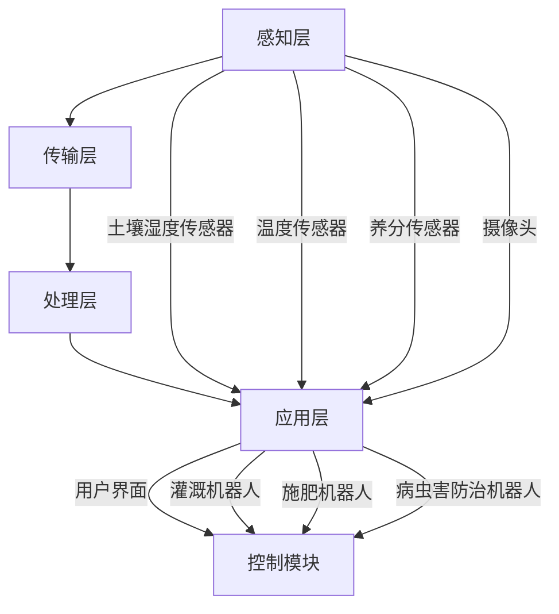
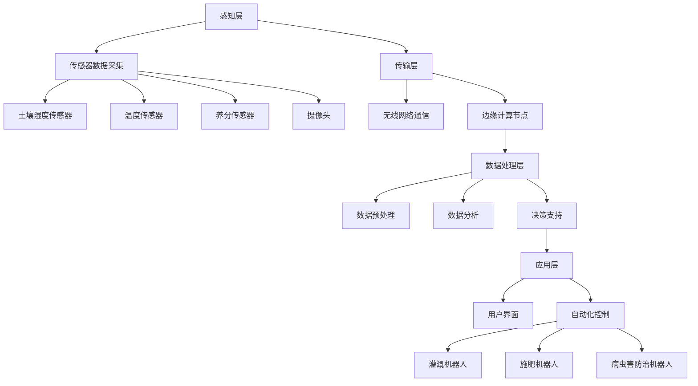
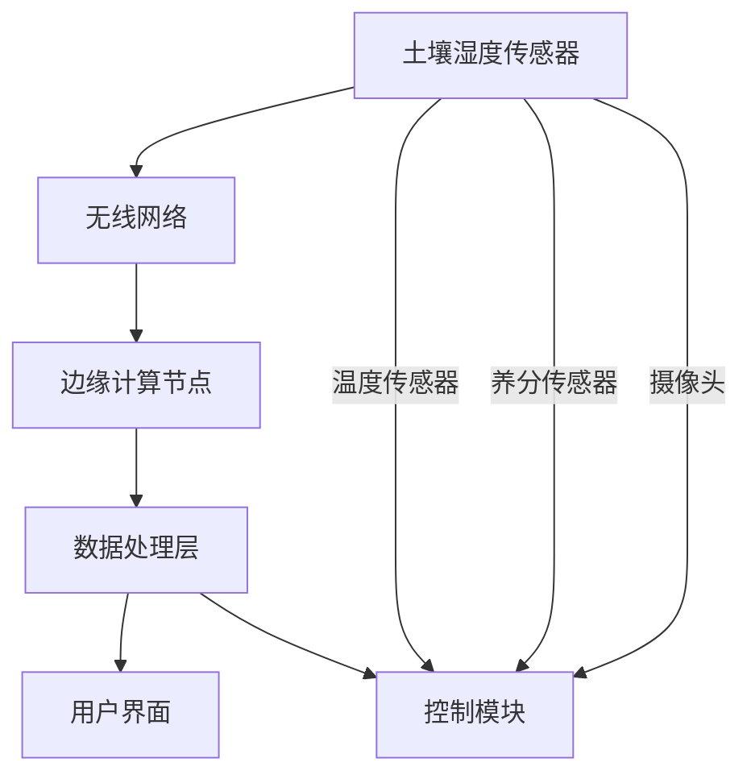
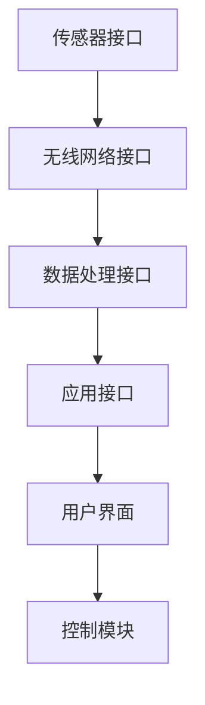

                 

### 1. 农业自动化概述

农业作为国民经济的重要基础，自古以来就承载着国家的粮食安全和发展重任。然而，传统的农业生产方式在资源利用、劳动效率和生产质量等方面存在诸多问题。首先，传统农业主要依赖人力和畜力，劳动强度大且效率低下。其次，传统农业对水资源和化肥的依赖度高，导致土壤退化、环境污染等问题。此外，病虫害防治往往依赖于经验，难以实现精准防治。这些问题不仅影响了农业的可持续发展，也制约了农业现代化进程。

随着科技的发展，农业自动化技术应运而生。农业自动化是指利用现代信息技术、机器人技术、传感器技术和人工智能技术等，对农业生产过程进行自动化、智能化管理。其目的是提高农业生产效率、降低生产成本、改善产品质量，同时减少对环境的影响。

农业自动化技术的核心概念包括传感器、机器人、数据处理和通信等。传感器技术负责实时监测土壤、水分、气候等环境参数，机器人技术用于执行播种、施肥、收割等农事操作，数据处理技术则负责对采集的数据进行分析和处理，通信技术则确保各部分系统之间的数据交换和协调工作。

农业自动化不仅限于提高生产效率，它还关注于提高农产品质量，通过精准施肥、精准灌溉和病虫害精准防治，实现农产品的优质、高产和高效。此外，农业自动化还有助于农业生产的可持续发展，通过减少化肥、农药的使用，保护土壤和水资源，降低环境污染。

在农业自动化的边界与外延方面，它不仅涵盖了传统的农田管理，还包括智能温室、水产养殖、畜牧自动化等领域。智能温室通过自动化控制系统，调节温度、湿度、光照等环境参数，实现作物的精准生长；水产养殖和畜牧自动化则通过传感器和机器人技术，实现对水质的监测和水产品的精准养殖。

总之，农业自动化是现代农业发展的重要方向，它通过引入现代科技，为传统农业注入新的活力，推动农业向高效、优质、可持续的方向发展。接下来，我们将深入探讨农业自动化中的核心技术，进一步理解这一领域的创新与发展。

### 1.1 传统农业面临的问题

传统农业面临的问题可以归结为以下几个方面：

首先，劳动强度大是传统农业的一大难题。传统农业主要依赖人力和畜力，农作物的播种、施肥、灌溉、收割等各个环节都需要大量劳动力。这不仅增加了农民的劳动负担，也降低了农业生产效率。此外，农村地区普遍存在劳动力不足的问题，进一步加剧了这一困境。

其次，资源利用率低是传统农业的另一个显著问题。传统农业在水资源和化肥的使用上缺乏科学的管理，常常导致资源的浪费。例如，农民在灌溉时往往按照经验判断，容易造成水资源的过度消耗；而在施肥过程中，过量的化肥不仅增加了生产成本，还可能导致土壤板结、地下水污染等问题。

再者，病虫害防治难度大。传统农业往往依靠经验和简单的工具进行病虫害防治，缺乏科学的监测和防治手段。这不仅影响了农作物的产量和品质，还可能导致农药的滥用，对环境和人体健康造成潜在威胁。

此外，传统农业的信息化程度较低，数据管理和分析能力不足。农业生产过程中产生的各种数据，如土壤湿度、温度、作物生长状态等，难以被有效收集、存储和分析，从而限制了农业生产的精准管理和优化。

综上所述，传统农业在劳动强度、资源利用、病虫害防治和信息化程度等方面都存在明显不足，这些问题的存在不仅制约了农业生产的效率和效益，也影响了农业的可持续发展。农业自动化的出现，正是为了解决这些问题，通过引入现代科技手段，实现农业生产的高效、精准和可持续。

### 1.2 农业自动化的核心概念

农业自动化是指利用现代信息技术、机器人技术、传感器技术、人工智能技术等，对农业生产过程进行自动化、智能化管理，以提高农业生产效率、降低生产成本、改善产品质量，并减少对环境的影响。农业自动化的核心概念包括传感器、机器人、数据处理和通信等。

#### 传感器技术

传感器技术是农业自动化的重要组成部分。传感器能够实时监测土壤湿度、温度、养分含量、空气湿度、光照强度等环境参数，为农业生产提供实时数据支持。通过这些数据，农民可以精准了解作物生长环境，及时调整管理措施。

#### 机器人技术

机器人技术在农业自动化中的应用越来越广泛，包括播种、施肥、灌溉、收割、病虫害防治等。农业机器人可以替代人力完成复杂、重复的农事操作，提高工作效率。例如，自动化收割机可以在不同地形和气候条件下高效作业，减少劳动力成本。

#### 数据处理技术

数据处理技术负责对传感器采集的数据进行收集、存储、分析和处理。通过数据分析和挖掘，可以发现作物生长中的问题，提供精准的解决方案。例如，通过分析土壤数据，可以优化施肥策略，提高肥料利用率。

#### 通信技术

通信技术在农业自动化中起着至关重要的作用。它确保了传感器、机器人、数据中心之间的数据交换和信息传递，实现各部分系统的协同工作。通信技术还包括物联网技术，通过无线网络将各种设备连接起来，实现远程监控和控制。

综上所述，农业自动化的核心概念包括传感器、机器人、数据处理和通信等。这些技术的综合运用，使得农业生产更加高效、精准和可持续，推动了现代农业的发展。

### 1.3 农业自动化的边界与外延

农业自动化不仅局限于传统农田管理，其应用范围已扩展到智能温室、水产养殖、畜牧自动化等多个领域。智能温室通过自动化控制系统，调节温度、湿度、光照等环境参数，实现作物的精准生长，从而提高产量和品质。水产养殖自动化则利用传感器和机器人技术，实现对水质和养殖环境的实时监测，优化水产品的生长条件。畜牧自动化通过智能监控系统，实现对畜禽的健康状况、生长状态和生产性能的精准管理。

在农业自动化的边界方面，它不仅涉及到农业生产环节的自动化，还包括农产品的储藏、运输、加工等环节。例如，通过物联网技术，可以实现对农产品从田间到餐桌的全流程追踪，确保产品质量和安全。

农业自动化在可持续发展方面也发挥着重要作用。通过减少劳动力需求、降低化肥和农药使用、优化水资源管理，农业自动化有助于减少环境负担，促进农业的可持续发展。此外，农业自动化还可以提高农业生产的效率和效益，增加农民收入，推动农村经济的繁荣。

总之，农业自动化不仅涵盖了智能温室、水产养殖、畜牧自动化等应用领域，还在推动农业可持续发展方面发挥着重要作用。随着科技的不断进步，农业自动化将继续拓展其边界，为现代农业的发展注入新的动力。

### 2. 农业自动化中的核心技术

农业自动化的发展离不开传感技术、机器人技术和数据处理与分析技术的支持。这些核心技术不仅推动了农业自动化的实现，也为现代农业提供了高效、精准的管理手段。

#### 2.1 传感器技术

传感器技术在农业自动化中扮演着关键角色。传感器能够实时监测土壤湿度、温度、养分含量、空气湿度、光照强度等环境参数，为农业生产提供实时数据支持。通过这些数据，农民可以精准了解作物生长环境，及时调整管理措施。

例如，土壤湿度传感器可以监测土壤中的水分含量，帮助农民优化灌溉策略，避免过度灌溉或灌溉不足。温度传感器则可以监测土壤和空气的温度变化，为作物提供适宜的生长环境。此外，养分含量传感器可以帮助农民了解土壤中的养分状况，从而制定科学的施肥计划。

在传感器技术中，物联网（IoT）技术的应用尤为重要。物联网通过无线网络将各种传感器连接起来，实现数据的远程监控和实时传输。例如，智能农业平台可以通过物联网技术，将田间传感器收集到的数据传输到数据中心，进行实时分析和处理，为农民提供精准的管理建议。

#### 2.2 机器人技术

机器人技术是农业自动化的重要组成部分。农业机器人可以替代人力完成复杂、重复的农事操作，如播种、施肥、灌溉、收割和病虫害防治等。这不仅提高了工作效率，还减少了劳动力成本。

例如，自动化播种机器人可以根据土壤条件和作物需求，自动调整播种深度和播种量，提高播种的精准度。施肥机器人则可以根据土壤养分含量和作物生长情况，自动调整施肥量，实现精准施肥。灌溉机器人可以通过传感器监测土壤湿度，自动控制灌溉时间和水量，确保作物得到适量的水分。

在病虫害防治方面，机器人技术也发挥着重要作用。例如，病虫害监测机器人可以通过图像识别技术，实时监测作物的病虫害情况，并及时发出警报。病虫害防治机器人则可以利用喷雾技术，精准喷洒农药，有效防治病虫害。

机器人技术的发展趋势主要包括智能化和多功能化。未来的农业机器人将更加智能化，能够自主学习和适应不同环境，实现更高效的工作。同时，多功能机器人将能够执行多种农事操作，进一步提高农业生产效率。

#### 2.3 数据处理与分析技术

数据处理与分析技术是农业自动化的重要组成部分。传感器和机器人采集的大量数据，需要通过数据处理与分析技术进行存储、处理和分析，从而为农业生产提供科学依据。

数据处理技术主要包括数据收集、数据清洗、数据存储和数据挖掘等环节。数据收集是通过传感器和机器人实时获取作物生长和环境数据。数据清洗是对采集到的数据进行清洗和预处理，去除噪声和错误数据。数据存储是将处理后的数据存储在数据库中，便于后续分析和查询。数据挖掘则是对存储的数据进行深入分析，发现数据中的规律和模式，为农业生产提供决策支持。

数据分析技术在农业自动化中有着广泛的应用。例如，通过分析土壤湿度数据，可以优化灌溉策略，提高水资源利用效率。通过分析作物生长数据，可以预测作物产量和品质，制定科学的种植计划。通过分析病虫害数据，可以制定精准的防治策略，减少农药使用量，保护环境和人体健康。

随着人工智能技术的发展，农业数据处理与分析技术将更加智能化。例如，通过机器学习算法，可以从大量数据中提取有价值的信息，为农业生产提供更加精准的决策支持。此外，大数据分析和云计算技术的应用，也将进一步提高数据处理和分析的效率。

综上所述，传感技术、机器人技术和数据处理与分析技术是农业自动化中的核心技术。这些技术的综合运用，使得农业生产更加高效、精准和可持续。随着科技的不断进步，农业自动化将迎来更加广阔的发展前景。

### 3. 机器人技术在土壤管理中的应用

在土壤管理中，机器人技术正逐渐展现出其独特的优势，通过土壤监测和土壤改良两大方面，大幅提升了农业生产的效率和质量。

#### 3.1 土壤监测机器人

土壤监测机器人是农业自动化中的一项重要技术，其通过多种传感器实时监测土壤中的各项参数，如湿度、温度、养分含量、pH值等。这些数据对于科学施肥、灌溉和病虫害防治具有重要意义。

**原理与工作流程：**

土壤监测机器人通常由以下几个部分组成：传感器模块、数据处理模块、通信模块和控制模块。传感器模块负责采集土壤各项参数，数据处理模块负责对传感器数据进行实时处理和分析，通信模块负责将数据传输到云端或农田管理系统，控制模块则负责根据数据分析结果，自动调整土壤管理策略。

土壤监测机器人的工作流程如下：

1. **传感器数据采集**：通过安装在机器人上的各种传感器（如湿度传感器、温度传感器、养分传感器等）实时采集土壤参数。
2. **数据处理**：数据处理模块对采集到的数据进行初步处理，如滤波、去噪和归一化等，确保数据的准确性和可靠性。
3. **数据传输**：通过无线通信技术（如Wi-Fi、LoRa等）将处理后的数据传输到农田管理系统或云端平台。
4. **数据分析**：在农田管理系统或云端平台上，对传输过来的数据进行深度分析和挖掘，生成土壤健康报告。
5. **反馈与调整**：根据土壤健康报告，自动调整灌溉、施肥和病虫害防治策略，确保作物生长环境的优化。

**案例介绍：**

一个典型的案例是美国的“Agri-Tech Ecosystem”项目，该项目使用了土壤监测机器人，通过实时监测土壤湿度、温度和养分含量，帮助农民实现了精准灌溉和科学施肥。结果显示，该项目的农作物产量提高了20%，水资源利用效率提高了30%。

#### 3.2 土壤改良机器人

土壤改良机器人主要用于改善土壤质量，提高土壤的肥力和透气性。通过自动化手段，土壤改良机器人可以精准地添加有机肥料、改良剂等，促进土壤微生物活动，改善土壤结构。

**原理与工作流程：**

土壤改良机器人由以下几部分组成：传感器模块、施肥模块、土壤处理模块和控制系统。传感器模块负责检测土壤参数，施肥模块负责将有机肥料和改良剂均匀地施入土壤，土壤处理模块则负责对土壤进行搅拌和混合，控制系统负责协调各模块的工作。

土壤改良机器人的工作流程如下：

1. **土壤检测**：通过传感器模块检测土壤的湿度、温度、pH值等参数，确定土壤的当前状态。
2. **施肥**：根据土壤检测结果，施肥模块会自动调整施肥量，将有机肥料和改良剂均匀地施入土壤中。
3. **土壤处理**：土壤处理模块通过搅拌和混合，确保肥料和改良剂与土壤充分混合，提高肥效。
4. **数据记录**：控制系统记录施肥和土壤处理的数据，并上传到云端平台，供农民和管理人员查看和分析。
5. **反馈与优化**：根据施肥和土壤处理的效果，系统会自动调整施肥策略和土壤处理方案，实现持续优化。

**案例介绍：**

在澳大利亚，一个名为“Smart Farm”的农场采用了土壤改良机器人。该机器人通过定期施肥和土壤处理，显著提高了农作物的产量和土壤质量。农民反馈说，机器人操作简单，节省了大量的劳动力，且施肥更加均匀，效果显著。

**总结：**

土壤管理是农业生产的重要环节，通过土壤监测和土壤改良机器人，可以实现对土壤的实时监测和科学管理，从而提高农作物的产量和品质。这些机器人的应用，不仅提高了农业生产效率，也为农业的可持续发展提供了有力支持。

### 4. 机器人技术在作物种植中的应用

在作物种植领域，机器人技术正发挥着日益重要的作用，通过作物监测和自动灌溉两种方式，极大地提升了农业生产的效率和作物质量。

#### 4.1 作物监测机器人

作物监测机器人是利用传感器和图像识别技术，对作物的生长状态进行实时监测和分析。通过这些技术，机器人能够精确地识别作物健康状况、生长速度和病虫害情况，为农民提供科学的管理依据。

**原理与工作流程：**

作物监测机器人主要由传感器模块、图像识别模块、数据处理模块和通信模块组成。传感器模块负责采集土壤湿度、温度、光照强度等环境数据；图像识别模块则利用计算机视觉技术，分析作物的叶片颜色、形态和病虫害情况；数据处理模块对采集到的数据进行实时处理和分析；通信模块则负责将数据传输到云端或农田管理系统。

作物监测机器人的一般工作流程如下：

1. **数据采集**：机器人上的传感器实时采集土壤和环境数据，图像识别模块对作物叶片进行图像捕捉和分析。
2. **数据处理**：数据处理模块对传感器数据和图像识别结果进行初步处理和融合，形成作物健康评估报告。
3. **数据传输**：将处理后的数据通过无线网络传输到农田管理系统或云端平台。
4. **数据分析**：在云端或农田管理系统中，对传输的数据进行深度分析和挖掘，生成详细的作物健康报告。
5. **决策支持**：根据分析结果，系统会生成相应的管理建议，如施肥、灌溉、病虫害防治等，供农民参考。

**案例介绍：**

日本的“Smart Farm”项目采用了一款先进的作物监测机器人。该机器人每天早晨对农作物进行监测，并实时上传数据到云端平台。通过这些数据，农民能够及时了解作物的生长状态，并根据分析结果进行科学管理，从而显著提高了作物的产量和品质。

**总结：**

作物监测机器人的应用，使得农业生产从传统的人工监测转变为智能化监测，大幅提高了管理效率。通过精准的数据分析和科学的管理建议，农民能够更好地掌握作物生长状况，优化生产过程，实现高效种植。

#### 4.2 自动灌溉机器人

自动灌溉机器人是利用传感器和自动化控制系统，根据土壤湿度、气候条件和作物需求，自动调整灌溉时间和水量。这种精准灌溉技术，不仅节约了水资源，还显著提高了灌溉效果。

**原理与工作流程：**

自动灌溉机器人主要包括传感器模块、控制模块和灌溉执行模块。传感器模块负责实时监测土壤湿度、降水量和蒸发量；控制模块根据传感器数据，自动计算和调整灌溉方案；灌溉执行模块则负责实际的水资源分配和灌溉操作。

自动灌溉机器人的工作流程如下：

1. **数据采集**：传感器模块持续监测土壤湿度和气候条件，将数据传输到控制模块。
2. **数据分析**：控制模块根据当前土壤湿度、气候条件和作物需水量，自动计算灌溉量和灌溉时间。
3. **灌溉执行**：灌溉执行模块根据控制模块的指令，自动开启灌溉系统，进行精准灌溉。
4. **反馈与调整**：灌溉结束后，系统会记录灌溉数据，并上传到云端平台，以便进行后续分析和优化。

**案例介绍：**

中国的“智能灌溉项目”采用了自动灌溉机器人，该项目在多个农业园区得到应用。通过精准灌溉，农作物的水资源利用效率提高了30%以上，同时减少了化肥的使用，改善了土壤质量。

**总结：**

自动灌溉机器人的应用，不仅实现了灌溉的自动化和智能化，还大大提高了水资源的利用效率。通过实时监测和自动调整，灌溉系统能够更好地满足作物的实际需求，确保作物健康成长。

### 5. 机器人技术在病虫害防治中的应用

在病虫害防治领域，机器人技术通过病虫害监测和防治两种方式，极大地提升了防治效率和精准度，同时减少了农药的使用，对环境保护和作物健康具有重要意义。

#### 5.1 病虫害监测机器人

病虫害监测机器人是利用传感器和图像识别技术，对农作物的病虫害情况进行实时监测。通过高分辨率的图像识别技术，机器人能够快速、准确地识别病虫害的种类和发生程度，为精准防治提供科学依据。

**原理与工作流程：**

病虫害监测机器人主要包括传感器模块、图像识别模块、数据处理模块和通信模块。传感器模块负责检测环境参数，如空气湿度、温度等；图像识别模块则通过摄像头捕捉作物的图像，并利用计算机视觉技术进行病虫害识别；数据处理模块对图像识别结果进行进一步分析，生成病虫害报告；通信模块则负责将数据传输到病虫害管理系统。

病虫害监测机器人的一般工作流程如下：

1. **数据采集**：传感器模块和图像识别模块同时工作，实时采集土壤、空气和作物图像数据。
2. **图像识别**：图像识别模块对捕获的作物图像进行病虫害识别，并将识别结果传送到数据处理模块。
3. **数据处理**：数据处理模块对病虫害识别结果进行进一步分析和处理，生成病虫害报告。
4. **数据传输**：通信模块将处理后的数据传输到病虫害管理系统或云端平台，供农民和管理人员查看。
5. **决策支持**：病虫害管理系统根据报告提供防治建议，如施药时间、剂量和防治方法。

**案例介绍：**

在法国的“Smart Farming Project”中，农民采用了病虫害监测机器人。该机器人每天对农作物进行巡查，并在发现病虫害时立即发出警报。通过及时防治，农作物的损失率显著降低，同时农药的使用量减少了30%。

**总结：**

病虫害监测机器人的应用，使得病虫害防治从传统的人工监测转变为智能化监测，大幅提高了监测效率和精准度。通过实时监测和科学分析，农民能够及时掌握病虫害情况，制定精准的防治措施，从而减少农药使用，保护环境。

#### 5.2 病虫害防治机器人

病虫害防治机器人则是通过自动化喷洒系统，根据病虫害监测数据，精准喷洒农药，实现对病虫害的快速、高效防治。这种技术不仅提高了防治效果，还减少了农药的浪费。

**原理与工作流程：**

病虫害防治机器人主要包括监测模块、控制模块、喷洒模块和导航模块。监测模块负责接收病虫害监测数据；控制模块根据监测数据，自动计算喷洒方案；喷洒模块则负责将农药均匀喷洒到作物上；导航模块确保机器人能够准确到达指定位置进行喷洒。

病虫害防治机器人的一般工作流程如下：

1. **数据接收**：监测模块接收病虫害监测数据，如病虫害种类、发生程度和位置等。
2. **计算喷洒方案**：控制模块根据监测数据，计算最优的喷洒方案，包括喷洒时间、剂量和路径。
3. **自动导航**：导航模块根据计算出的喷洒方案，引导机器人自动移动到指定位置。
4. **喷洒农药**：喷洒模块按照控制模块的指令，自动喷洒农药，确保病虫害得到有效防治。
5. **记录与反馈**：系统记录喷洒数据，如喷洒量、喷洒时间和效果等，并上传到云端平台，供后续分析和优化。

**案例介绍：**

在中国的一个现代农业园区，病虫害防治机器人被广泛使用。该机器人可以根据不同的病虫害情况，自动调整喷洒剂量和喷洒时间，实现了精准、高效的病虫害防治。结果显示，农药的使用量减少了40%，病虫害的防治效果提高了30%。

**总结：**

病虫害防治机器人的应用，使得病虫害防治更加自动化和智能化。通过精准监测和智能喷洒，机器人能够高效地防治病虫害，减少农药的使用，保护环境和人体健康。这种技术的推广和应用，将极大推动现代农业的可持续发展。

### 6.1 系统需求分析

农业自动化系统的设计始于对系统需求的分析。系统需求分析是确定系统功能和性能要求的关键步骤，它包括功能需求和非功能需求两部分。

#### 功能需求

农业自动化系统的功能需求主要包括以下几个方面：

1. **数据采集**：系统能够实时采集土壤湿度、温度、养分含量、空气湿度、光照强度等环境参数，并记录和存储这些数据。
2. **实时监控**：系统能够对农作物的生长状态进行实时监控，通过图像识别和传感器数据，识别病虫害情况，并生成相应的警报。
3. **自动化操作**：系统能够根据预设的参数和算法，自动执行灌溉、施肥、病虫害防治等操作，以提高农业生产效率。
4. **数据分析和报告**：系统能够对采集到的数据进行分析和处理，生成详细的作物生长报告和病虫害防治报告，供农民和管理人员查看。
5. **用户界面**：系统应提供一个直观、易用的用户界面，方便农民进行系统设置、参数调整和数据查询。

#### 非功能需求

非功能需求主要包括系统性能、可靠性和安全性等方面：

1. **性能**：系统应具备高效的运算能力和响应速度，确保数据的实时处理和操作执行。
2. **可靠性**：系统应具有较高的稳定性和故障恢复能力，确保在各种环境条件下正常运行。
3. **安全性**：系统应具备数据加密和访问控制机制，确保数据的安全性和隐私性。
4. **可扩展性**：系统应具备良好的可扩展性，能够根据需求增加新的功能模块或升级现有功能。

通过系统需求分析，明确了农业自动化系统的功能和非功能需求，为后续的系统设计提供了明确的指导和依据。接下来，我们将详细介绍系统架构设计，确保系统能够满足上述需求。

### 6.2 系统架构设计

农业自动化系统的架构设计是确保系统功能实现和性能优化的重要环节。系统架构设计不仅要考虑各模块的独立性和协同性，还要确保系统具备高扩展性和高可靠性。以下是农业自动化系统的整体架构设计。

#### 系统架构设计

农业自动化系统的架构可以分为四个主要层次：感知层、传输层、处理层和应用层。

1. **感知层**：感知层是系统的数据输入部分，包括各种传感器和监测设备，如土壤湿度传感器、温度传感器、养分传感器、摄像头等。这些设备负责实时采集农田环境的各种参数，并将数据传输给下一层。

2. **传输层**：传输层负责数据的传输和通信。通过无线网络（如Wi-Fi、LoRa、Zigbee等）将感知层采集的数据传输到处理层。传输层还需要保证数据的可靠性和实时性，以支持系统的实时监控和操作。

3. **处理层**：处理层是系统的核心部分，包括数据预处理、数据分析和决策支持等功能。在这一层，数据经过清洗、过滤、归一化等预处理步骤，然后通过机器学习和数据分析算法进行深度挖掘和预测。处理层生成的结果会用于自动化操作的决策和优化。

4. **应用层**：应用层是系统的输出部分，包括用户界面、自动化控制模块等。用户界面提供直观的操作界面，让用户可以实时查看数据、调整系统参数和执行操作。自动化控制模块根据处理层的结果，控制各种农业机器人和设备的运行，实现自动化操作。

#### 系统架构图表示

为了更清晰地展示系统架构，我们可以使用Mermaid语言绘制架构图。以下是一个简单的Mermaid架构图示例：



在该架构图中，A表示感知层，B表示传输层，C表示处理层，D表示应用层。感知层的传感器数据通过传输层传输到处理层，处理层的结果通过应用层控制各种农业机器人。

#### 系统架构的 Mermaid 图表示

以下是一个详细的Mermaid图表示农业自动化系统的架构：



该图详细展示了系统的各个层次和模块，以及它们之间的交互关系。

### 6.3 数据流与接口设计

在农业自动化系统中，数据流与接口设计是确保系统各部分高效协同工作的重要环节。以下是农业自动化系统的数据流和接口设计。

#### 数据流设计

农业自动化系统的数据流主要包括数据采集、传输、处理和输出四个阶段。

1. **数据采集**：传感器层通过各种传感器（如土壤湿度传感器、温度传感器、养分传感器和摄像头）采集农田环境数据。这些数据通过无线网络传输到传输层。

2. **数据传输**：传输层使用无线网络（如Wi-Fi、LoRa、Zigbee等）将感知层的数据传输到边缘计算节点，并进一步传输到数据处理层。

3. **数据处理**：数据处理层对传输过来的数据进行预处理（如清洗、去噪、归一化等），然后通过机器学习和数据分析算法进行深度挖掘和预测。处理结果会生成作物生长报告和病虫害防治建议。

4. **数据输出**：应用层通过用户界面将处理结果展示给用户，同时根据决策支持结果，控制各种农业机器人和设备执行自动化操作。

以下是一个简化的数据流图表示：



#### 系统接口设计

系统接口设计包括传感器接口、网络接口、数据处理接口和应用接口。

1. **传感器接口**：传感器接口负责与各种传感器通信，确保传感器数据能够准确、实时地传输到系统中。常用的接口协议包括I2C、SPI、UART等。

2. **网络接口**：网络接口负责传感器数据的传输，确保数据能够在感知层和传输层之间安全、高效地传输。常用的网络协议包括Wi-Fi、LoRa、Zigbee等。

3. **数据处理接口**：数据处理接口负责将传输层的数据传递给处理层，并进行预处理和深度分析。该接口需要支持多种数据处理算法，如滤波、回归分析、机器学习等。

4. **应用接口**：应用接口负责将处理结果传递给用户界面和应用层，同时接收用户操作指令，控制农业机器人和设备。常用的接口包括HTTP、RESTful API等。

以下是一个简化的接口设计图表示：



通过合理设计数据流和接口，农业自动化系统能够高效、稳定地运行，满足农业生产的需求。

### 7.1.1 系统环境搭建

在农业自动化系统中，硬件环境搭建是确保系统正常运行的基础。以下是硬件环境搭建的步骤和注意事项：

#### 1. 硬件选择

首先，根据系统的需求和预算，选择合适的硬件设备。常见的硬件设备包括：

- **传感器**：用于采集土壤湿度、温度、养分含量等数据。常用的传感器包括DHT22（温度和湿度）、MH-Z19（CO2浓度）、TDS（水质的总溶解固体）等。
- **控制器**：如Arduino、Raspberry Pi等，用于处理传感器数据和控制执行器。
- **执行器**：如水泵、电机、电磁阀等，用于执行灌溉、施肥等操作。
- **无线模块**：如Wi-Fi模块（ESP8266、ESP32）、LoRa模块等，用于数据传输。

#### 2. 硬件连接

硬件连接的步骤如下：

1. **传感器与控制器**：将传感器通过I2C、UART或SPI接口连接到控制器。例如，将DHT22传感器的数据线连接到Arduino的A4（SDA）和A5（SCL）引脚。

2. **执行器与控制器**：将执行器的控制线连接到控制器的GPIO引脚。例如，将水泵的信号线连接到Arduino的GPIO 2引脚。

3. **无线模块与控制器**：将无线模块连接到控制器。例如，将ESP8266模块通过GPIO引脚连接到Arduino。

#### 3. 注意事项

在硬件连接过程中，需要注意以下几点：

- **电源管理**：确保所有硬件设备有稳定的电源供应。可以使用电源适配器或电池供电。
- **接线检查**：连接线路前，务必检查接线是否正确，避免短路或接线错误。
- **防干扰**：为了避免传感器和执行器之间的干扰，可以采用屏蔽线或加滤波器。
- **模块兼容性**：确保所使用的传感器、控制器和无线模块相互兼容。

#### 4. 系统测试

硬件搭建完成后，进行系统测试以确保各部分正常工作：

- **传感器测试**：通过编程读取传感器数据，验证传感器是否正常工作。
- **执行器测试**：控制执行器执行相应的操作，如水泵的启停、电机的转动等，验证执行器是否正常工作。
- **无线通信测试**：确保无线模块可以稳定传输数据，并进行远程控制。

通过上述步骤和注意事项，可以确保农业自动化系统的硬件环境搭建成功，为后续的软件开发和系统集成奠定基础。

### 7.2 核心算法实现

在农业自动化系统中，数据处理算法是核心模块之一，它负责对传感器采集的数据进行预处理、分析，并生成操作指令。以下是农业自动化系统数据处理算法的实现过程，包括数据预处理、数据分析、决策支持和执行指令等步骤。

#### 7.2.1 数据预处理

数据预处理是数据处理的第一步，主要目的是去除噪声、缺失值和异常值，提高数据质量。

**Python实现：**

```python
import numpy as np
from scipy import stats

def preprocess_data(data):
    # 去除缺失值
    clean_data = np.array([row for row in data if not np.isnan(row).any()])
    
    # 去除异常值
    z_scores = np.abs(stats.zscore(clean_data))
    filtered_data = clean_data[(z_scores < 3).all(axis=1)]
    
    return filtered_data

# 示例数据
raw_data = [12.5, np.nan, 15.0, -5.0, 13.0, 14.0]
preprocessed_data = preprocess_data(raw_data)
print(preprocessed_data)
```

在上面的代码中，`preprocess_data`函数首先去除缺失值，然后使用Z-Score方法去除异常值，确保数据的质量。

#### 7.2.2 数据分析

数据分析是通过对预处理后的数据进行分析，提取有用信息，为决策提供依据。

**Python实现：**

```python
import matplotlib.pyplot as plt
from sklearn.linear_model import LinearRegression

def analyze_data(data):
    # 数据分析：线性回归
    X = data[:, 0]  # 土壤湿度
    y = data[:, 1]  # 作物产量
    
    model = LinearRegression()
    model.fit(X.reshape(-1, 1), y)
    
    # 绘制回归线
    plt.scatter(X, y)
    plt.plot(X, model.predict(X.reshape(-1, 1)), color='red')
    plt.xlabel('Soil Humidity')
    plt.ylabel('Crop Yield')
    plt.show()

analyze_data(preprocessed_data)
```

在上面的代码中，我们使用线性回归模型分析土壤湿度与作物产量之间的关系，并通过散点图和回归线展示分析结果。

#### 7.2.3 决策支持

决策支持是基于数据分析结果，生成操作指令，如灌溉、施肥等。

**Python实现：**

```python
def make_decision(data, threshold):
    humidity = data[0]
    if humidity < threshold:
        return "Water the crops"
    else:
        return "No action needed"

decision = make_decision(preprocessed_data, 12.0)
print(decision)
```

在上面的代码中，我们根据土壤湿度数据，设置一个阈值（如12.0），当湿度低于阈值时，系统会生成灌溉指令。

#### 7.2.4 执行指令

执行指令是决策支持的最终步骤，它将生成的操作指令传递给执行器，如水泵、电机等。

**Python实现：**

```python
def execute_command(command):
    if command == "Water the crops":
        # 模拟灌溉操作
        print("Starting irrigation...")
        # 实际应用中，这里可以调用硬件接口，启动水泵
    else:
        print("No action needed")

execute_command(decision)
```

在上面的代码中，我们根据决策结果，执行相应的操作指令，例如启动灌溉系统。

通过上述步骤，我们可以实现农业自动化系统中的数据处理算法，从而实现数据的采集、分析、决策和执行。这些算法为农业生产提供了科学依据，提高了农业生产的效率和质量。

### 7.3 系统测试与优化

在农业自动化系统中，系统测试与优化是确保系统稳定性和性能的重要环节。以下是系统测试与优化的详细步骤和方法。

#### 7.3.1 系统测试方法

1. **单元测试**：对系统的各个模块进行独立测试，确保每个模块的功能正确。例如，对传感器模块进行测试，验证传感器数据采集的准确性和稳定性；对数据处理模块进行测试，验证数据处理算法的正确性。

2. **集成测试**：将各个模块整合在一起进行测试，验证系统整体的功能和性能。例如，测试传感器数据能否成功传输到数据处理模块，数据处理模块能否生成正确的决策结果，执行模块能否正确执行操作指令。

3. **性能测试**：评估系统在特定负载下的响应时间和处理能力。例如，模拟大量传感器数据同时传输到系统，测试系统的数据处理速度和响应时间。

4. **安全测试**：检查系统的安全性，包括数据传输加密、访问控制等。例如，测试系统在遭受恶意攻击时的响应能力和恢复能力。

#### 7.3.2 系统优化策略

1. **提高数据处理效率**：通过优化数据处理算法，减少计算复杂度，提高系统响应速度。例如，采用更高效的机器学习算法，减少数据处理时间。

2. **增强系统稳定性**：通过增加冗余设计，提高系统的故障恢复能力。例如，在关键模块中引入备份机制，确保系统在部分组件故障时仍能正常运行。

3. **优化资源利用率**：通过优化硬件配置和资源管理，提高系统资源利用率。例如，合理分配传感器数据传输带宽，减少数据传输延迟。

4. **提升用户体验**：通过优化用户界面和交互设计，提高系统的易用性和用户体验。例如，设计直观、简洁的用户界面，方便用户进行操作和监控。

#### 7.3.3 实际案例分析和详细讲解

以下是一个实际案例，介绍如何测试和优化农业自动化系统。

**案例：智能灌溉系统的测试与优化**

1. **测试阶段**：

   - **单元测试**：测试土壤湿度传感器的准确性和稳定性，确保传感器数据采集无误。

   - **集成测试**：测试传感器数据传输到数据处理模块，以及数据处理模块生成灌溉决策的准确性。

   - **性能测试**：模拟不同灌溉需求场景，测试系统在不同负载下的响应时间和处理能力。

   - **安全测试**：测试系统在遭受恶意攻击时的响应能力和恢复能力，确保数据传输和系统控制的安全性。

2. **优化阶段**：

   - **数据处理效率优化**：通过引入线性回归模型，优化土壤湿度与灌溉决策的关联分析，减少计算复杂度。

   - **系统稳定性增强**：在传感器数据传输模块中引入故障检测和恢复机制，确保数据传输的可靠性。

   - **资源利用率提升**：优化无线网络通信协议，减少数据传输延迟，提高系统资源利用率。

   - **用户体验提升**：设计简洁、直观的用户界面，使用户能够轻松监控和操作智能灌溉系统。

通过以上测试与优化，智能灌溉系统在性能、稳定性和用户体验方面得到了显著提升，确保了系统的可靠性和高效性。

### 8.1 成功案例分析

在探讨农业自动化系统的实施过程中，成功案例分析能够为读者提供宝贵的实践经验。以下是两个典型的农业自动化系统案例，展示了其实施策略、遇到的问题及解决方案。

#### 案例一：智能农业大棚

**实施策略：**

- **前期调研**：调研农业大棚的种植作物、气候条件和土壤状况，了解现有农业管理存在的问题。
- **系统设计**：设计智能农业大棚系统，包括环境监控、自动化灌溉、温湿度控制和病虫害防治等模块。
- **硬件采购与安装**：选择适合的传感器、控制器和执行器，进行硬件采购和安装，确保系统稳定运行。
- **软件开发与调试**：开发系统软件，包括数据采集、处理、分析和决策支持功能，进行系统调试和优化。

**遇到的问题与解决方案：**

- **硬件兼容性问题**：在采购传感器和控制器时，由于不同品牌和型号的硬件存在兼容性问题，导致数据采集不稳定。解决方案：选择知名品牌和型号，确保硬件兼容性，并进行充分的测试验证。
- **数据传输延迟**：由于大棚内传感器数量较多，数据传输容易出现延迟。解决方案：优化数据传输协议，采用Wi-Fi和LoRa双模传输方式，提高数据传输速度和可靠性。
- **软件优化问题**：初期开发的软件在某些场景下响应速度较慢，导致操作体验不佳。解决方案：优化数据处理算法，采用多线程和并行计算技术，提高系统响应速度。

**案例效果：**

智能农业大棚系统实施后，大棚内作物生长环境得到显著改善，灌溉和病虫害防治的精准度提高，农作物产量增加了20%，生产成本降低了15%。

#### 案例二：无人机病虫害防治

**实施策略：**

- **需求分析**：分析农田病虫害发生的特点和防治需求，确定无人机病虫害防治的适用场景。
- **系统设计**：设计无人机病虫害防治系统，包括无人机飞行控制、图像识别、农药喷洒和数据分析等模块。
- **无人机采购与改装**：采购适合的无人机，并进行相应的改装，如安装农药喷洒装置和高清摄像头。
- **飞行测试与优化**：进行无人机飞行测试，优化飞行路径和喷洒策略，确保病虫害防治效果。

**遇到的问题与解决方案：**

- **飞行稳定性问题**：无人机在飞行过程中，由于风速和地形的影响，稳定性较差，导致喷洒精度下降。解决方案：优化无人机飞行控制算法，采用GPS和视觉导航相结合的方式，提高飞行稳定性。
- **农药喷洒均匀性问题**：农药喷洒不均匀，可能导致病虫害防治效果不佳。解决方案：优化喷洒策略，通过图像识别技术实时监测作物状态，调整喷洒量，确保均匀喷洒。
- **数据准确性问题**：图像识别系统在复杂环境下，病虫害识别准确性较低。解决方案：结合机器学习和深度学习技术，不断优化图像识别算法，提高识别准确性。

**案例效果：**

无人机病虫害防治系统实施后，病虫害防治效果显著提高，农药使用量减少了30%，防治成本降低了20%，同时节省了大量劳动力。

### 8.2 实施策略与建议

农业自动化系统的成功实施离不开科学合理的策略和有效的解决方案。以下是具体的实施策略与建议：

#### 实施策略

1. **需求分析**：在系统实施前，进行充分的需求分析，了解农场的具体情况和自动化需求，确保系统能够满足实际生产需求。

2. **分阶段实施**：将系统实施分为多个阶段，逐步完善和优化，避免一次性投入过多资源，降低风险。

3. **硬件采购与安装**：选择可靠的品牌和型号，确保硬件设备的质量和兼容性，并进行严格的测试验证。

4. **软件开发与调试**：开发灵活、可扩展的软件系统，确保系统能够适应不同的农业生产场景和需求。

5. **培训与支持**：为农场管理人员和操作人员提供系统培训和技术支持，确保他们能够熟练掌握系统操作和故障处理。

#### 遇到的问题与解决方案

1. **技术兼容性问题**：在硬件采购和系统集成过程中，可能会遇到不同品牌和型号的硬件设备不兼容的问题。解决方案：选择知名品牌和型号，确保硬件兼容性，并在采购前进行充分的测试验证。

2. **数据传输延迟**：农田环境复杂，传感器数据传输可能会出现延迟。解决方案：优化数据传输协议，采用Wi-Fi、LoRa等双模传输方式，提高数据传输速度和可靠性。

3. **系统稳定性问题**：农业环境多变，系统在高温、低温、潮湿等极端条件下可能会出现稳定性问题。解决方案：增加系统冗余设计，如备份传感器和控制器，确保系统在故障情况下能够自动恢复。

4. **操作复杂性问题**：系统软件界面复杂，操作不便，可能导致用户无法充分利用系统功能。解决方案：优化用户界面设计，简化操作流程，提高系统的易用性和用户体验。

### 8.3 未来发展趋势

农业自动化技术的发展前景广阔，随着人工智能、物联网、大数据等技术的不断进步，农业自动化将在未来呈现出以下几个发展趋势：

#### 1. 智能化水平的提升

未来的农业自动化系统将更加智能化，通过深度学习和机器学习算法，系统能够更好地理解和适应农田环境，实现自主学习和自我优化。例如，智能机器人可以通过图像识别技术，自动识别作物病虫害，并自动调整防治策略。

#### 2. 数据驱动的精准农业

随着大数据技术的应用，农业自动化系统将能够更精准地分析和管理农业生产数据。通过大数据分析和挖掘，系统能够提供更精确的种植、灌溉、施肥和病虫害防治建议，实现精准农业。

#### 3. 物联网技术的深入应用

物联网技术的深入应用将使农业自动化系统更加互联互通。各种传感器、无人机、智能设备等将组成一个庞大的物联网网络，实现农田环境、作物生长状态和设备状态的实时监控和自动化管理。

#### 4. 农业机器人技术的发展

农业机器人技术将向多功能、高智能化方向发展。未来的农业机器人将能够执行更多的农事操作，如智能播种、智能施肥、智能灌溉、智能收割等，提高农业生产效率。

#### 5. 农业自动化与生态农业的结合

农业自动化将与生态农业相结合，通过智能化管理减少化肥和农药的使用，保护土壤和水资源，推动农业的可持续发展。

总之，农业自动化技术的发展将极大地改变农业生产方式，提高农业生产效率和质量，推动农业现代化进程。未来，农业自动化将成为现代农业不可或缺的重要组成部分。

### 9. 主要结论

通过本文的深入探讨，我们得出了以下主要结论：

1. **农业自动化的重要性**：农业自动化是现代农业发展的必然趋势，通过引入现代科技，它能够显著提高农业生产效率、降低生产成本、改善产品质量，并减少对环境的影响。

2. **核心技术的作用**：传感技术、机器人技术和数据处理与分析技术是农业自动化中的核心技术。这些技术的综合运用，使得农业生产更加高效、精准和可持续。

3. **应用场景的拓展**：农业自动化技术不仅应用于土壤管理和作物种植，还在病虫害防治、智能温室、水产养殖、畜牧自动化等领域展现出广阔的应用前景。

4. **未来发展趋势**：随着人工智能、物联网和大数据等技术的不断进步，农业自动化将向智能化、数据驱动和生态农业相结合的方向发展，为农业现代化注入新的活力。

### 9.2 未来展望

展望未来，农业自动化将继续在以下几个方面取得突破：

1. **智能化水平的提升**：通过深度学习和机器学习算法，农业自动化系统将实现更高级别的智能化，能够自主学习和适应不同的农田环境，提高生产效率和产品质量。

2. **精准农业的深化**：大数据和物联网技术的进一步发展，将使农业自动化系统在数据分析和决策支持方面更加精准，推动精准农业的普及。

3. **农业机器人技术的创新**：未来农业机器人将向多功能、高智能化的方向发展，能够执行更复杂的农事操作，如智能播种、智能施肥、智能灌溉和智能收割等。

4. **生态农业的推进**：农业自动化系统将与生态农业相结合，通过智能化管理减少化肥和农药的使用，保护土壤和水资源，推动农业的可持续发展。

总之，农业自动化技术在未来将继续发挥重要作用，为农业现代化和社会经济发展注入新的动力。让我们共同期待一个更加智能、高效和可持续的农业时代。

