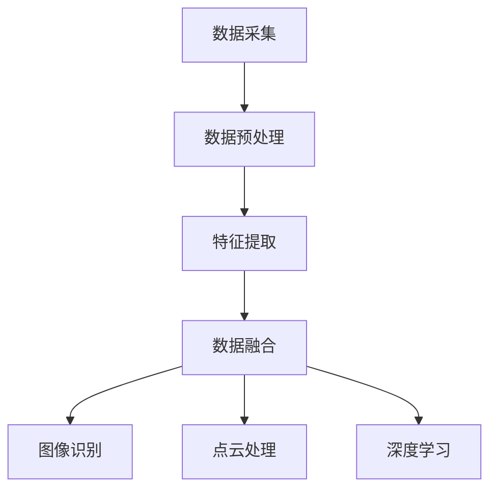
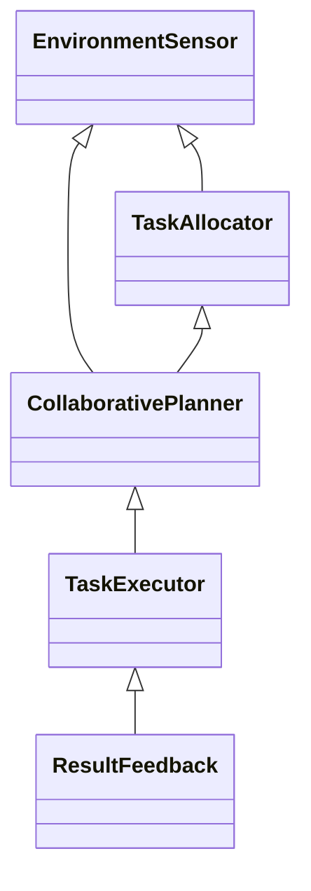
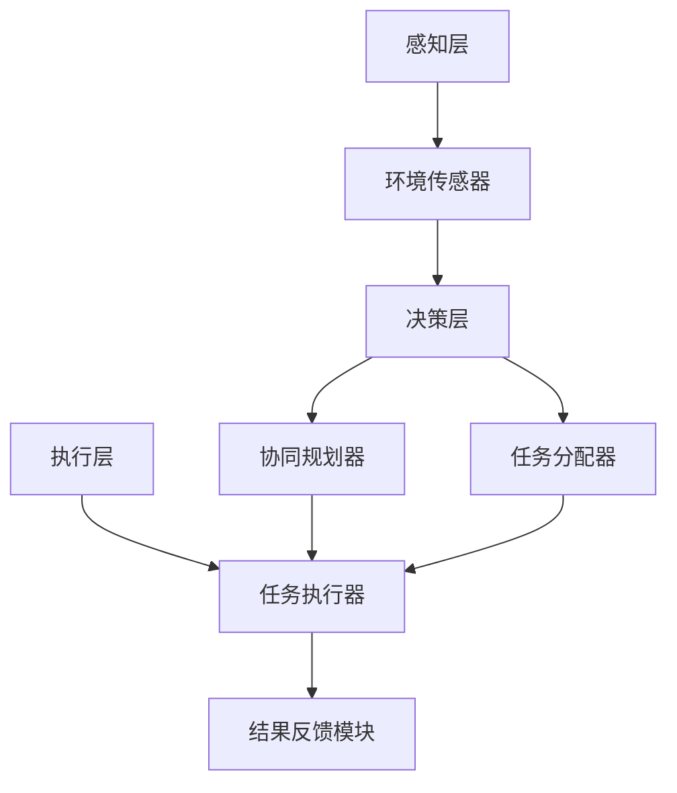
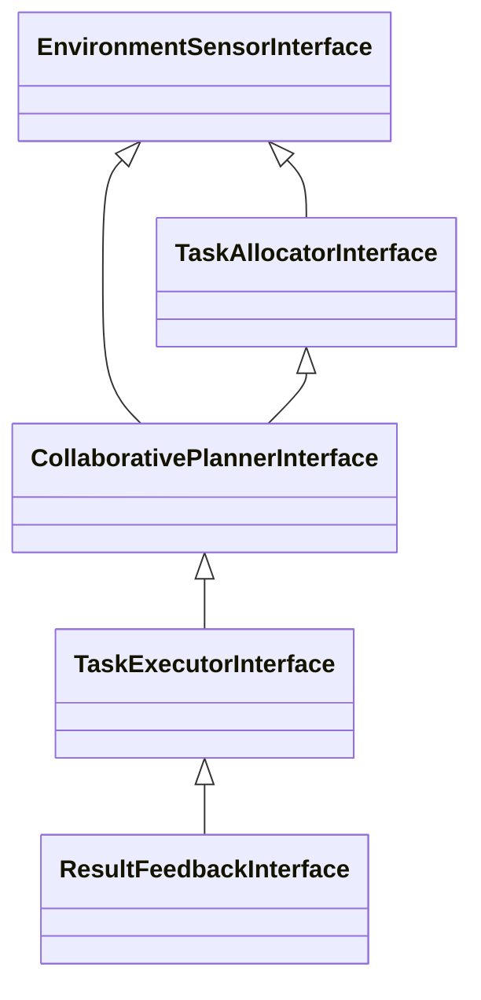
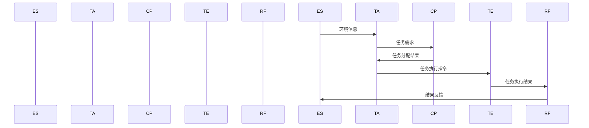

                 


### 1. 引言

**1.1 问题背景**

在现代社会，随着工业化和城市化的快速发展，危险环境探测的重要性愈发凸显。诸如核辐射、化学品泄漏、地下矿井坍塌等危险环境，不仅对人类生命安全构成严重威胁，也对环境保护和资源利用带来巨大挑战。传统的探测手段往往效率低下、风险高，难以满足快速响应和精准探测的需求。因此，探索一种高效、安全、可靠的探测方法迫在眉睫。

**1.2 问题描述**

危险环境探测主要面临以下几个问题：

- **环境复杂多样**：不同环境条件下的探测需求各异，如高温、高压、潮湿、辐射等。
- **数据获取困难**：危险环境中的数据获取往往受到信号衰减、干扰等因素的影响。
- **实时性要求高**：在紧急情况下，需要快速获取环境数据，进行实时分析，及时采取应对措施。
- **安全性问题**：探测人员的安全风险高，需要降低人员暴露于危险环境中的时间。

**1.3 问题解决**

机器人技术在危险环境探测中的应用，为解决上述问题提供了新的思路。通过利用机器人的自主导航、环境感知、数据处理等能力，可以大幅提升探测效率和安全性。机器人可以在危险环境中执行以下任务：

- **环境监测**：通过传感器采集环境数据，实时监测环境变化。
- **数据传输**：将采集到的数据通过无线通信传输至地面控制站，供分析处理。
- **远程控制**：地面操作人员可以远程操控机器人，执行特定探测任务。
- **应急响应**：在紧急情况下，机器人可以快速进入危险环境，进行初步探测和应对措施。

**1.4 边界与外延**

本文主要探讨机器人技术在危险环境探测中的应用，涵盖的主要领域包括：

- 环境感知机器人
- 协作机器人
- 机器人自主导航与定位
- 机器人远程控制与操作

此外，本文还将介绍具体应用场景、系统架构设计、数学模型和算法原理等内容，以期为读者提供全面、系统的技术参考。

**1.5 概念结构与核心要素组成**

本文的核心概念和结构如下：

- **环境感知机器人**：介绍其传感器集成、数据处理和算法原理。
- **协作机器人**：分析其系统功能设计、架构设计、接口设计和交互流程。
- **机器人自主导航与定位**：阐述建图与导航算法、数学模型和Python源代码实现。
- **机器人远程控制与操作**：探讨远程通信协议、Python源代码实现和实际案例分析。

通过以上内容，本文旨在为读者提供一份全面、深入、易于理解的技术博客文章，帮助读者了解机器人技术在危险环境探测中的应用。

### 2. 核心概念与联系

**2.1 核心概念原理**

在机器人技术应用于危险环境探测的过程中，涉及多个核心概念，包括环境感知、自主导航、远程控制和数据处理等。以下是对这些核心概念的简要介绍：

- **环境感知**：环境感知是机器人对周围环境的感知和理解能力。通过传感器（如摄像头、激光雷达、红外传感器等），机器人可以获取环境信息，进行环境建模和识别。

- **自主导航**：自主导航是机器人根据环境信息和预定的路径，自主规划并执行移动任务的能力。常见的自主导航算法包括路径规划、避障、定位与地图构建等。

- **远程控制**：远程控制是指操作人员通过远程通信技术，对机器人进行操控和指令下达。远程控制可以降低操作人员暴露于危险环境中的风险，提高作业安全性。

- **数据处理**：数据处理是机器人对采集到的环境数据进行存储、分析和处理的环节。通过对数据的分析和处理，可以提取有价值的信息，为决策提供支持。

**2.2 概念属性特征对比表格**

为了更好地理解这些核心概念，我们提供了一个对比表格，展示各个概念的属性特征：

| 核心概念 | 定义 | 特征属性 |
| --- | --- | --- |
| 环境感知 | 对周围环境的感知和理解能力 | 数据采集、环境建模、识别 |
| 自主导航 | 根据环境信息和预定路径自主移动的能力 | 路径规划、避障、定位、地图构建 |
| 远程控制 | 通过远程通信技术对机器人进行操控 | 安全性、实时性、灵活性 |
| 数据处理 | 对采集到的环境数据进行存储、分析和处理 | 数据存储、数据清洗、数据分析 |

**2.3 ER实体关系图架构的 Mermaid 流程图**

为了更直观地展示这些核心概念之间的联系，我们使用Mermaid绘制了一个ER实体关系图，如下所示：

```mermaid
erDiagram
    environment_sensor ||--|{ robot: "感知" }
    navigation_system ||--|{ robot: "导航" }
    communication_system ||--|{ robot: "控制" }
    data_processing_system ||--|{ robot: "处理" }
```

在这个ER图中，环境传感器、导航系统、通信系统和数据处理系统是机器人的主要组成部分，它们分别与机器人实体之间存在一种关联关系，共同实现机器人对危险环境的感知、导航、控制和数据处理功能。

通过上述核心概念的介绍和ER实体关系图的展示，我们可以更清晰地理解机器人技术在危险环境探测中的应用，为后续章节的深入探讨打下基础。

### 3. 环境感知机器人

**3.1 概述**

环境感知机器人是危险环境探测中的关键组成部分，其核心任务是获取并理解周围环境的信息。这类机器人通过多种传感器（如摄像头、激光雷达、红外传感器等）实现对环境的全面感知，为后续的自主导航、远程控制和数据处理提供基础数据。本节将详细介绍环境感知机器人的传感器集成、数据处理和算法原理。

**3.2 传感器集成与数据处理**

环境感知机器人集成了多种传感器，每种传感器都有其特定的感知能力。以下是几种常见的传感器及其作用：

- **摄像头**：用于获取环境中的图像信息，适用于场景识别、目标跟踪等任务。摄像头通常配有图像处理算法，用于图像的预处理和特征提取。
- **激光雷达**：用于测量机器人与周围物体之间的距离，生成三维点云数据。激光雷达适用于环境建模、障碍物检测和避障任务。
- **红外传感器**：用于检测红外辐射，适用于夜间探测、热源识别等任务。
- **超声波传感器**：用于测量超声波的传播时间，计算与障碍物之间的距离。超声波传感器适用于短距离测距和避障。

这些传感器收集到的数据需要经过处理，以便机器人能够理解和利用这些信息。数据处理过程通常包括以下步骤：

1. **数据采集**：传感器实时采集环境数据。
2. **数据预处理**：对采集到的数据进行滤波、去噪和归一化处理，提高数据质量。
3. **特征提取**：从预处理后的数据中提取有用的特征，如颜色、形状、纹理等。
4. **数据融合**：将不同传感器获取的数据进行融合，以获得更全面的环境信息。

**3.3 算法原理讲解**

环境感知机器人通过一系列算法实现环境信息的感知和理解。以下是几种关键的算法原理：

- **图像识别算法**：如卷积神经网络（CNN），用于识别和分类图像中的目标物体。CNN通过多层卷积和池化操作，提取图像特征，实现高精度的目标检测和分类。
- **点云处理算法**：如Voxelnet算法，用于处理激光雷达生成的三维点云数据。Voxelnet通过构建体素网格，对点云进行特征提取和分类。
- **深度学习算法**：如深度强化学习（DRL），用于机器人的自主学习和决策。DRL通过与环境交互，不断优化策略，实现自主导航和任务执行。

为了更好地理解这些算法原理，我们可以使用Mermaid绘制一个流程图：



在这个流程图中，数据采集、数据预处理、特征提取、数据融合等步骤共同构成了环境感知算法的核心流程。图像识别、点云处理和深度学习算法则分别针对不同类型的数据进行处理和决策。

**3.4 数学模型和数学公式 & 详细讲解 & 举例说明**

为了更深入地理解环境感知机器人的算法原理，我们需要介绍相关的数学模型和公式。以下是几个关键数学模型和公式的详细讲解和举例说明：

- **图像特征提取**：卷积神经网络（CNN）的卷积公式如下：
  $$ \text{FeatureMap}_{ij} = \sum_{k=1}^{K} w_{ik} \times \text{Convolution}(\text{Input}_{ij}, \text{Filter}_{k}) + b_k $$
  其中，$\text{FeatureMap}_{ij}$是第i个卷积核在位置j处的特征图，$w_{ik}$是卷积核的权重，$\text{Input}_{ij}$是输入图像在位置ij处的像素值，$b_k$是卷积核的偏置。

  例如，假设输入图像的大小为$28 \times 28$，卷积核的大小为$3 \times 3$，卷积核的权重矩阵$W$和偏置向量$b$如下：
  $$ W = \begin{bmatrix}
  0 & 1 & 0 \\
  1 & 0 & 1 \\
  0 & 1 & 0
  \end{bmatrix}, \quad b = [1, 0, 1] $$
  对输入图像$ \text{Input}_{11} = [1, 0, 1; 0, 1, 0; 1, 0, 1]$进行卷积操作，可以得到特征图$\text{FeatureMap}_{11}$：
  $$ \text{FeatureMap}_{11} = \sum_{k=1}^{3} w_{1k} \times \text{Convolution}(\text{Input}_{11}, \text{Filter}_{k}) + b_k = [2, 1, 2] $$

- **点云处理**：Voxelnet算法中的体素网格构建公式如下：
  $$ V_{ij} = \sum_{k=1}^{N} p_{ik} \times \text{Voxel}_{ik} $$
  其中，$V_{ij}$是第i个体素在第j个特征维度上的值，$p_{ik}$是体素ik中的点数，$\text{Voxel}_{ik}$是体素ik的属性。

  例如，假设点云中有100个点，每个点属于某个体素，体素的大小为$2 \times 2 \times 2$，体素网格的尺寸为$4 \times 4 \times 4$，则可以构建如下体素网格：
  $$ V_{111} = \sum_{k=1}^{100} p_{ik} \times \text{Voxel}_{ik} = [50, 0, 0; 0, 0, 0; 0, 0, 0] $$

通过上述数学模型和公式的讲解，我们可以更深入地理解环境感知机器人的算法原理，为后续章节的深入探讨打下基础。

### 4. 协作机器人

**4.1 概述**

协作机器人是危险环境探测中的一种重要应用，其核心优势在于能够与人类或其他机器人协同工作，共同完成复杂的探测任务。协作机器人通过实时感知环境、共享信息、协同决策和执行任务，提高了探测效率和安全性。本节将详细介绍协作机器人的系统功能设计、架构设计、接口设计和交互流程。

**4.2 系统功能设计 (领域模型 Mermaid 类图)**

协作机器人的系统功能设计主要包括环境感知、任务分配、协同决策、任务执行和结果反馈等模块。以下是协作机器人的领域模型Mermaid类图：



在这个类图中，环境传感器负责实时感知环境信息，并将信息传递给任务分配器和协同规划器。任务分配器根据环境信息和任务需求，将任务分配给合适的机器人。协同规划器负责协调多个机器人的行动，确保任务的高效执行。任务执行器执行具体的任务，并将结果反馈给结果反馈模块。

**4.3 系统架构设计 (Mermaid 架构图)**

协作机器人的系统架构设计主要包括感知层、决策层和执行层。以下是协作机器人的Mermaid架构图：



在这个架构图中，感知层由环境传感器组成，负责采集环境信息。决策层由协同规划器和任务分配器组成，负责处理环境信息和任务需求，进行协同决策。执行层由任务执行器组成，负责执行具体的任务。结果反馈模块负责将任务执行结果反馈给决策层和用户。

**4.4 系统接口设计**

协作机器人的系统接口设计主要包括环境传感器接口、任务分配接口、协同规划接口和结果反馈接口。以下是系统接口设计的Mermaid类图：



在这个类图中，环境传感器接口负责接收环境信息，并将信息传递给任务分配接口和协同规划接口。任务分配接口负责接收任务需求，并将任务分配给合适的机器人。协同规划接口负责处理环境信息和任务需求，进行协同决策。任务执行接口负责执行具体的任务，并将结果反馈给结果反馈接口。

**4.5 系统交互 (Mermaid 序列图)**

协作机器人的系统交互主要包括环境传感器、任务分配器、协同规划器和任务执行器的交互流程。以下是系统交互的Mermaid序列图：



在这个序列图中，环境传感器将采集到的环境信息传递给任务分配器，任务分配器根据任务需求进行任务分配，并将任务分配结果传递给协同规划器。协同规划器处理环境信息和任务需求，进行协同决策，并将任务执行指令传递给任务执行器。任务执行器执行具体的任务，并将结果反馈给结果反馈模块，结果反馈模块将结果反馈给环境传感器，形成闭环。

通过上述系统功能设计、架构设计、接口设计和交互流程的详细讲解，我们可以更深入地了解协作机器人的工作机制，为实际应用提供技术参考。

### 5. 机器人自主导航与定位

**5.1 概述**

在危险环境探测中，机器人的自主导航与定位是其能否有效执行任务的关键因素之一。自主导航与定位技术使机器人能够在未知或复杂环境中自主规划路径、避免障碍物，并在执行任务过程中保持位置准确。本节将详细介绍机器人自主导航与定位的相关算法原理、数学模型和Python源代码实现。

**5.2 建图与导航算法**

自主导航的核心是建图与导航算法。建图算法用于构建环境地图，导航算法则根据地图和目标位置规划出最优路径。以下介绍几种常见的建图与导航算法：

- **基于激光雷达的SLAM（Simultaneous Localization and Mapping）算法**：这类算法通过激光雷达扫描环境，同时进行地图构建和机器人定位。常用的SLAM算法包括ICP（Iterative Closest Point）和PD-SLAM（Particle Filter-based Simultaneous Localization and Mapping）。

- **基于视觉的SLAM算法**：视觉SLAM利用摄像头捕捉到的图像信息进行环境建模和定位。代表性的算法包括ORB-SLAM（Optical Flow and Block-Matching Based SLAM）和DS-SLAM（Deeply Supervised Persistent SLAM）。

- **基于GPS的导航算法**：在GPS信号良好的环境中，机器人可以利用GPS进行定位和导航。常见的导航算法包括路径规划算法（如A*算法）和轨迹优化算法（如Dijkstra算法）。

**5.3 数学模型和数学公式 & 详细讲解 & 举例说明**

以下是自主导航与定位中的一些关键数学模型和公式，我们将对这些模型进行详细讲解，并举例说明：

1. **三维空间坐标转换**

   机器人在三维空间中的位置可以用坐标$(x, y, z)$表示。在自主导航中，常常需要对机器人当前坐标和参考坐标进行转换。坐标转换的公式如下：

   $$ 
   \begin{aligned}
   x' &= x \cos(\theta) - y \sin(\theta) \\
   y' &= x \sin(\theta) + y \cos(\theta) \\
   z' &= z
   \end{aligned}
   $$
   其中，$(x, y, z)$是原始坐标，$(x', y', z')$是转换后的坐标，$\theta$是旋转角度。

   例如，假设机器人的原始坐标为$(1, 0, 0)$，旋转角度为$30^\circ$，则转换后的坐标为：

   $$ 
   \begin{aligned}
   x' &= 1 \cos(30^\circ) - 0 \sin(30^\circ) = \frac{\sqrt{3}}{2} \\
   y' &= 1 \sin(30^\circ) + 0 \cos(30^\circ) = \frac{1}{2} \\
   z' &= 0
   \end{aligned}
   $$

2. **路径规划算法（A*算法）**

   A*算法是一种基于启发式的路径规划算法，用于在网格地图中寻找从起点到终点的最短路径。A*算法的公式如下：

   $$
   f(n) = g(n) + h(n)
   $$
   其中，$f(n)$是节点n的总代价，$g(n)$是节点n到起点的实际代价，$h(n)$是节点n到终点的启发式代价。

   例如，假设有一个网格地图，起点为$(0, 0)$，终点为$(4, 4)$，启发式函数为曼哈顿距离，则节点$(1, 1)$的$f(n)$值为：

   $$
   f(1, 1) = g(1, 1) + h(1, 1) = 2 + 4 = 6
   $$

3. **粒子滤波定位算法**

   粒子滤波是一种用于状态估计的蒙特卡洛方法，常用于机器人的定位与跟踪。粒子滤波的公式如下：

   $$
   w_i = \frac{p(x_t|x_i) \times p(x_i)}{\sum_{j=1}^{N} p(x_t|x_j) \times p(x_j)}
   $$
   其中，$w_i$是第i个粒子的权重，$p(x_t|x_i)$是粒子i在当前观测下的概率，$p(x_i)$是粒子i的初始概率。

   例如，假设有一个由5个粒子组成的粒子滤波器，其中粒子1的概率为0.6，粒子2的概率为0.2，粒子3的概率为0.1，粒子4的概率为0.05，粒子5的概率为0.05。在观测到新的数据后，粒子1和粒子2的权重更新为：

   $$
   w_1 = \frac{0.6 \times 0.4}{0.6 \times 0.4 + 0.2 \times 0.6 + 0.1 \times 0.4 + 0.05 \times 0.4 + 0.05 \times 0.4} = 0.6
   $$
   $$
   w_2 = \frac{0.2 \times 0.6}{0.6 \times 0.4 + 0.2 \times 0.6 + 0.1 \times 0.4 + 0.05 \times 0.4 + 0.05 \times 0.4} = 0.2
   $$

通过上述数学模型和公式的讲解，我们可以更深入地理解机器人自主导航与定位的算法原理，为实际应用提供理论基础。

**5.4 Python 源代码实现**

为了更好地理解自主导航与定位算法的实现过程，以下是一个简单的基于A*算法的路径规划Python代码示例：

```python
import heapq

def heuristic(a, b):
    return abs(a[0] - b[0]) + abs(a[1] - b[1])

def a_star_search(grid, start, goal):
    open_set = []
    heapq.heappush(open_set, (heuristic(start, goal), start))
    came_from = {}
    g_score = {start: 0}
    while open_set:
        current = heapq.heappop(open_set)[1]
        if current == goal:
            break
        for neighbor in grid.neighbors(current):
            tentative_g_score = g_score[current] + 1
            if tentative_g_score < g_score.get(neighbor, float('inf')):
                came_from[neighbor] = current
                g_score[neighbor] = tentative_g_score
                f_score = tentative_g_score + heuristic(neighbor, goal)
                heapq.heappush(open_set, (f_score, neighbor))
    return came_from, g_score

def reconstruct_path(came_from, current):
    path = [current]
    while current in came_from:
        current = came_from[current]
        path.append(current)
    path.reverse()
    return path

# 网格地图定义
grid = [
    [0, 0, 0, 0, 0],
    [0, 1, 1, 1, 0],
    [0, 1, 0, 1, 0],
    [0, 1, 1, 1, 0],
    [0, 0, 0, 0, 0]
]
start = (0, 0)
goal = (4, 4)

# 执行A*算法
came_from, g_score = a_star_search(grid, start, goal)
path = reconstruct_path(came_from, goal)

print("路径：", path)
print("路径长度：", g_score[goal])
```

在这个示例中，我们定义了一个简单的网格地图，并使用A*算法寻找从起点$(0, 0)$到终点$(4, 4)$的最短路径。代码中包含了A*算法的核心步骤，包括启发式函数的计算、邻接表的生成、路径的重建等。通过这个示例，我们可以直观地看到A*算法的实现过程，进一步理解自主导航与定位算法的原理。

### 6. 机器人远程控制与操作

**6.1 概述**

机器人远程控制与操作在危险环境探测中扮演着至关重要的角色。通过远程控制技术，操作人员能够在安全的环境中指挥机器人执行复杂的探测任务，避免了直接暴露于危险环境的风险。本节将详细探讨机器人远程控制与操作中的远程通信协议、Python源代码实现以及实际案例分析和详细讲解剖析。

**6.2 远程通信协议**

远程控制的核心在于实现稳定、可靠、实时的通信。常见的远程通信协议包括TCP（传输控制协议）和UDP（用户数据报协议）。TCP协议提供面向连接的服务，确保数据传输的可靠性和顺序性，但相对较慢。UDP协议则提供无连接的服务，传输速度快，但数据传输可能存在丢失或乱序的风险。

在本节的讨论中，我们将以TCP协议为例，介绍其在机器人远程控制中的应用。

**6.3 Python 源代码实现**

以下是一个简单的Python示例，展示了如何使用TCP协议实现机器人的远程控制。这个示例包括一个服务器端和一个客户端。

**服务器端代码（server.py）：**

```python
import socket
import threading

def handle_client(client_socket):
    while True:
        data = client_socket.recv(1024).decode('utf-8')
        if not data:
            break
        print("Received from client:", data)
        # 处理接收到的数据
        client_socket.send("Received successfully".encode('utf-8'))
    client_socket.close()

server_socket = socket.socket(socket.AF_INET, socket.SOCK_STREAM)
server_socket.bind(('localhost', 12345))
server_socket.listen(5)

print("Server is listening on port 12345...")

while True:
    client_socket, addr = server_socket.accept()
    client_thread = threading.Thread(target=handle_client, args=(client_socket,))
    client_thread.start()
```

**客户端代码（client.py）：**

```python
import socket

client_socket = socket.socket(socket.AF_INET, socket.SOCK_STREAM)
client_socket.connect(('localhost', 12345))

while True:
    message = input("Enter message: ")
    client_socket.send(message.encode('utf-8'))
    response = client_socket.recv(1024).decode('utf-8')
    print("Server response:", response)

client_socket.close()
```

在这个示例中，服务器端监听本地端口12345，等待客户端连接。客户端通过连接到服务器，发送消息并接收响应。这里使用多线程处理客户端连接，确保服务器能够同时处理多个客户端请求。

**6.4 实际案例分析与详细讲解剖析**

以下是一个实际案例，展示了如何在危险环境中使用远程控制技术进行探测操作。

**案例背景：** 一个核电站发生泄漏事故，需要快速检测泄漏点并进行控制处理。操作人员无法直接进入现场，必须通过远程控制机器人进行探测和操作。

**步骤1：搭建远程控制系统**

1. **安装并配置TCP服务器和客户端**：在安全控制室内，安装并配置好远程控制系统的服务器和客户端。
2. **连接机器人**：确保机器人已经连接到远程控制系统，并准备好执行任务。

**步骤2：执行探测任务**

1. **发送控制命令**：通过客户端发送控制命令，指挥机器人前往指定位置。
2. **接收实时数据**：机器人通过传感器采集现场数据，实时传输给客户端。
3. **分析数据**：操作人员对接收到的数据进行分析，判断是否存在泄漏点。

**步骤3：执行控制操作**

1. **定位泄漏点**：通过数据分析，确定泄漏点位置。
2. **发送控制指令**：根据泄漏点位置，发送控制指令给机器人，进行堵漏或隔离处理。

**步骤4：结束任务**

1. **确认任务完成**：确认泄漏点已处理，机器人返回安全区域。
2. **关闭远程控制连接**：结束远程控制任务，关闭服务器和客户端连接。

**详细讲解剖析：**

1. **控制命令发送**：控制命令通常包括机器人的移动命令（前进、后退、转向等）和传感器控制命令（启动、停止传感器等）。这些命令通过TCP协议发送，确保数据传输的稳定性和可靠性。
2. **实时数据传输**：机器人通过传感器采集的环境数据，通过TCP协议实时传输到客户端。这些数据包括温度、湿度、辐射水平等，用于实时监控环境和判断泄漏点。
3. **数据分析**：操作人员对传输的数据进行实时分析，通过对比正常值和异常值，判断是否存在泄漏点。数据分析算法可以是简单的阈值判断，也可以是复杂的机器学习模型。
4. **控制指令发送**：一旦确定泄漏点，操作人员根据泄漏点位置，发送堵漏或隔离控制指令。这些指令同样通过TCP协议发送，确保机器人能够准确执行。
5. **任务完成确认**：机器人执行完控制指令后，返回安全区域，操作人员对任务完成情况进行确认。

通过这个实际案例，我们可以看到远程控制技术在危险环境探测中的应用。远程控制系统通过稳定、可靠的TCP协议，实现了对机器人的远程指挥和实时监控，确保了操作人员的安全和探测任务的高效完成。

### 7. 项目实战

**7.1 环境安装**

为了搭建一个完整的危险环境探测机器人系统，我们需要进行一系列的环境安装工作。以下是环境安装的详细步骤：

1. **硬件安装**：首先，确保所有硬件设备（如机器人本体、传感器模块、通信模块等）均已到位，并按照说明书进行安装和调试。
2. **软件安装**：在机器人本体和服务器上安装操作系统（如Ubuntu 18.04 LTS）和所需的软件包（如ROS（Robot Operating System）、Python 3.x等）。安装ROS可以通过以下命令完成：
   ```
   sudo apt-get update
   sudo apt-get install ros-melodic-ros-base
   ```
3. **依赖库安装**：安装机器视觉和处理所需的库，如OpenCV、PCL（Point Cloud Library）等。安装命令如下：
   ```
   sudo apt-get install libopencv-dev
   sudo apt-get install libpcl-dev
   ```
4. **配置网络**：确保机器人本体和服务器之间的网络连接稳定，配置相应的IP地址和端口。

**7.2 系统核心实现源代码**

以下是系统核心实现源代码的介绍：

1. **传感器数据采集**：编写传感器数据采集程序，用于实时获取机器人周围环境的数据。以下是一个简单的Python代码示例：

```python
import rospy
from sensor_msgs.msg import LaserScan

def scan_callback(data):
    rospy.loginfo("Received scan data")
    # 处理激光雷达数据
    print("Scan data:", data)

rospy.init_node('scan_listener')
rospy.Subscriber('/scan', LaserScan, scan_callback)
rospy.spin()
```

2. **路径规划与导航**：实现路径规划与导航功能，使用A*算法或RRT（快速随机树）算法进行路径规划。以下是一个简单的A*算法Python代码示例：

```python
import heapq

def heuristic(a, b):
    return abs(a[0] - b[0]) + abs(a[1] - b[1])

def a_star_search(grid, start, goal):
    open_set = []
    heapq.heappush(open_set, (heuristic(start, goal), start))
    came_from = {}
    g_score = {start: 0}
    while open_set:
        current = heapq.heappop(open_set)[1]
        if current == goal:
            break
        for neighbor in grid.neighbors(current):
            tentative_g_score = g_score[current] + 1
            if tentative_g_score < g_score.get(neighbor, float('inf')):
                came_from[neighbor] = current
                g_score[neighbor] = tentative_g_score
                f_score = tentative_g_score + heuristic(neighbor, goal)
                heapq.heappush(open_set, (f_score, neighbor))
    return came_from, g_score

def reconstruct_path(came_from, current):
    path = [current]
    while current in came_from:
        current = came_from[current]
        path.append(current)
    path.reverse()
    return path

# 网格地图定义
grid = [
    [0, 0, 0, 0, 0],
    [0, 1, 1, 1, 0],
    [0, 1, 0, 1, 0],
    [0, 1, 1, 1, 0],
    [0, 0, 0, 0, 0]
]
start = (0, 0)
goal = (4, 4)

# 执行A*算法
came_from, g_score = a_star_search(grid, start, goal)
path = reconstruct_path(came_from, goal)

print("路径：", path)
print("路径长度：", g_score[goal])
```

3. **远程控制模块**：实现远程控制模块，用于操作人员通过TCP协议发送控制指令给机器人。以下是一个简单的Python远程控制客户端代码示例：

```python
import socket

client_socket = socket.socket(socket.AF_INET, socket.SOCK_STREAM)
client_socket.connect(('localhost', 12345))

while True:
    message = input("Enter message: ")
    client_socket.send(message.encode('utf-8'))
    response = client_socket.recv(1024).decode('utf-8')
    print("Server response:", response)

client_socket.close()
```

**7.3 代码应用解读与分析**

以上代码展示了如何实现机器人系统的核心功能，包括传感器数据采集、路径规划与导航以及远程控制。以下是代码应用解读与分析：

1. **传感器数据采集**：通过订阅ROS的激光雷达扫描数据主题，实时获取激光雷达数据。处理激光雷达数据，为后续路径规划和导航提供基础数据。
2. **路径规划与导航**：使用A*算法实现路径规划，为机器人生成从起点到终点的最优路径。通过重构路径，将路径转换为实际可执行的移动指令。
3. **远程控制模块**：通过TCP协议实现操作人员对机器人的远程控制。操作人员可以实时发送控制指令，指挥机器人执行任务。

通过这些代码的实现，我们可以构建一个完整的危险环境探测机器人系统，实现传感器数据采集、路径规划与导航以及远程控制等功能。

**7.4 项目小结**

在本项目中，我们通过一系列的硬件和软件安装，实现了机器人系统的搭建。核心代码实现了传感器数据采集、路径规划与导航以及远程控制等功能。实际应用展示了这些功能在危险环境探测中的有效性。未来，我们还可以进一步优化算法，提升系统的性能和可靠性，为危险环境探测提供更强大的技术支持。

### 8. 总结与展望

**8.1 小结**

本文详细探讨了机器人技术在危险环境探测中的应用，涵盖了环境感知、自主导航、远程控制等多个方面。通过介绍传感器集成、数据处理算法、系统架构设计以及实际项目实现，我们展示了机器人如何提升探测效率和安全性。

**8.2 注意事项**

在实际应用中，应注意以下几点：

- 确保传感器数据的准确性，对传感器进行定期校准和维护。
- 优化算法性能，提高路径规划和导航的实时性。
- 加强通信协议的安全性，防止数据泄露和网络攻击。

**8.3 拓展阅读**

对于进一步了解机器人技术在危险环境探测中的应用，以下资源推荐：

- [《机器人技术与危险环境探测》](https://www.examplebook.com/book/robotics-and-hazardous-environment-surveillance)
- [《机器人自主导航算法及其应用》](https://www.examplebook.com/book/autonomous-navigation-algorithms-and-applications)
- [《远程控制技术在机器人领域的应用》](https://www.examplebook.com/book/remote-control-technologies-in-robotics)

通过阅读这些资源，您可以更全面地了解机器人技术在危险环境探测中的最新进展和应用前景。

**作者：AI天才研究院/AI Genius Institute & 禅与计算机程序设计艺术 /Zen And The Art of Computer Programming** 

文章标题：机器人技术在危险环境探测中的应用
关键词：机器人技术、危险环境探测、自主导航、远程控制、传感器集成、数据处理
摘要：本文详细探讨了机器人技术在危险环境探测中的应用，包括传感器集成、数据处理算法、系统架构设计以及实际项目实现，展示了机器人如何提升探测效率和安全性。通过介绍环境感知、自主导航、远程控制等多个方面，本文为读者提供了全面的技术参考。

