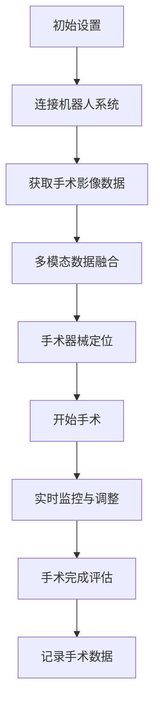
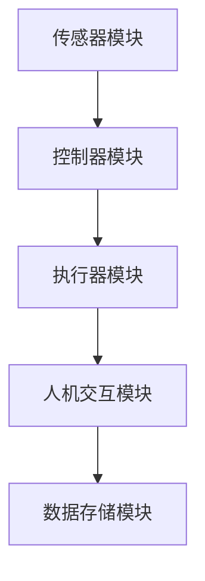

                 

# 机器人技术在微创手术中的精准操控应用

关键词：机器人技术、微创手术、精准操控、医疗应用

摘要：本文将探讨机器人技术在微创手术中的精准操控应用。通过介绍机器人技术与微创手术的基础，阐述核心概念与联系，分析算法原理，设计系统架构，并进行项目实战，全面剖析机器人技术在微创手术中的实际应用。

## 第一部分: 引言与背景介绍

### 1. 引言

随着机器人技术和微创手术技术的快速发展，两者在现代医疗领域的结合成为了一个重要的研究方向。机器人技术在微创手术中的应用，不仅能够提高手术的精确度和效率，还能显著降低手术风险，从而为患者带来更好的治疗效果。本文旨在探讨机器人技术在微创手术中的精准操控应用，通过全面的分析和阐述，为读者提供一个系统而深入的视角，以了解这一领域的前沿进展和应用前景。

### 1.1 问题背景

微创手术，作为一种先进的手术技术，因其创伤小、恢复快、并发症少等优点，在临床应用中得到了广泛的推广。微创手术的核心在于精准操控，手术医生需要在狭小的手术空间内进行精细的操作，以确保手术的成功和患者的安全。传统的微创手术主要依赖于医生的经验和技能，这在一定程度上限制了手术的普及和推广。

机器人技术的引入，为微创手术带来了新的可能性。通过机器人的精准操控，可以实现手术操作的自动化和精细化，从而提高手术的成功率和患者的满意度。然而，如何有效地结合机器人技术和微创手术，实现精准操控，仍然是当前研究的一个重要课题。

### 1.2 问题描述

在微创手术中，精准操控是关键。传统的操控方式主要依赖于医生的直觉和经验，这容易导致手术操作的误差，进而影响手术效果。机器人的引入，理论上可以实现更加精确的操作，但实际应用中仍然面临着一系列挑战，包括：

1. **机器人与手术器械的精准对接**：手术器械需要与机器人精准对接，以保证手术操作的稳定性和精确性。
2. **手术过程的实时监控与调整**：手术过程中需要实时监控手术状态，并根据实际情况进行相应的调整。
3. **手术后的效果评估**：手术完成后，需要对手术效果进行评估，以验证机器人技术在微创手术中的应用价值。

### 1.3 问题解决

机器人技术在微创手术中的应用，主要通过以下方式实现精准操控：

1. **精准定位**：通过机器人系统的实时定位技术，实现手术器械的精准定位，减少手术误差。
2. **操作反馈**：机器人系统可以实时反馈操作状态，帮助医生调整手术策略。
3. **多模态数据融合**：通过融合多模态数据，如手术影像、患者生理参数等，实现更加精准的手术操作。
4. **人机交互**：通过优化人机交互界面，提高医生的操作效率和准确性。

### 1.4 边界与外延

机器人技术在微创手术中的应用，虽然取得了一定的进展，但仍然存在一些局限性。首先，机器人技术需要较高的成本和维护成本，这在一定程度上限制了其大规模推广。其次，手术操作的复杂性和多变性，使得机器人在某些特定场景下的应用效果可能不如预期。因此，如何进一步优化机器人系统，提高其应用效果，是当前研究的一个重要方向。

### 1.5 概念结构与核心要素组成

机器人技术在微创手术中的精准操控，涉及以下几个核心概念和要素：

1. **机器人系统**：包括机器人本体、传感器、控制器、执行器等组成部分。
2. **微创手术技术**：涉及手术器械、手术操作方法、手术流程等。
3. **精准操控算法**：包括定位算法、反馈算法、多模态数据融合算法等。
4. **人机交互界面**：用于医生与机器人系统的交互。

### 1.6 本章小结

本章从多个角度对机器人技术在微创手术中的精准操控进行了概述，包括背景介绍、问题描述、问题解决、边界与外延以及核心概念和要素组成。通过对这些内容的了解，读者可以初步掌握机器人技术在微创手术中的应用现状和发展趋势。

### 1.7 引入Mermaid流程图

为了更直观地理解机器人技术在微创手术中的精准操控流程，我们可以使用Mermaid流程图进行描述。以下是该流程图的Mermaid语法：



## 第二部分: 机器人技术与微创手术的基础

### 2. 机器人技术基础

#### 2.1 机器人技术的发展历史

机器人技术起源于20世纪50年代，最早由乔治·德沃尔（George Devol）和约瑟夫·恩格尔伯格（Joseph Engelberger）在美国创立。工业机器人是机器人技术最早的分支，主要用于制造业，如汽车制造、电子装配等。随着技术的不断进步，机器人技术逐渐扩展到服务机器人、医疗机器人等多个领域。

#### 2.2 机器人的基本结构和工作原理

机器人的基本结构通常包括机械臂、传感器、控制器、执行器等部分。机械臂是机器人的“手”，通过传感器可以获取环境信息，控制器根据传感器提供的信息进行计算和决策，执行器则根据控制器的指令进行动作。机器人的工作原理是通过感知、决策和执行三个环节来实现自主运动和操作。

#### 2.3 机器人在微创手术中的应用

在微创手术中，机器人技术可以提供更高的操作精度和稳定性。机器人的机械臂能够进行精细的操作，减少对患者的创伤。同时，机器人可以实时采集手术环境信息，并通过人机交互界面提供反馈，帮助医生调整手术策略。

### 2. 微创手术技术基础

#### 2.1 微创手术的定义和特点

微创手术，又称最小切口手术，是指通过微小切口进行手术，从而减少对患者的创伤和恢复时间。微创手术具有以下特点：

1. **创伤小**：通过微小切口进行手术，减少了组织的损伤和出血。
2. **恢复快**：患者术后恢复时间短，并发症少。
3. **疗效好**：手术精度高，疗效好，患者的满意度高。

#### 2.2 微创手术的基本原理和流程

微创手术的基本原理是通过微创技术，如腹腔镜、胸腔镜等，在微创手术器械的帮助下，完成手术操作。微创手术的基本流程包括术前准备、手术操作、术后恢复等阶段。

1. **术前准备**：进行全面的身体检查和术前评估，制定手术方案。
2. **手术操作**：通过微创手术器械进行精细操作，完成手术。
3. **术后恢复**：监测患者术后恢复情况，进行必要的治疗和护理。

#### 2.3 微创手术在医疗领域的应用

微创手术在医疗领域的应用范围广泛，包括普外科、心胸外科、泌尿外科、妇产科等多个领域。微创手术的应用，不仅提高了手术的成功率和患者的满意度，还降低了医疗成本，具有巨大的社会和经济价值。

## 第三部分: 机器人技术在微创手术中的精准操控

### 3.1 精准操控的概念与重要性

精准操控是指在微创手术中，通过机器人技术实现手术器械的精确操作，确保手术过程的顺利进行和手术效果的最佳化。精准操控在微创手术中具有重要意义：

1. **提高手术成功率**：通过机器人技术的精准操控，可以减少手术误差，提高手术的成功率。
2. **降低手术风险**：机器人可以模拟人的操作，减少对患者的损伤，降低手术风险。
3. **提高患者的满意度**：精准操控可以确保手术效果，提高患者的满意度。

### 3.2 机器人技术在微创手术中的具体应用

机器人技术在微创手术中的具体应用主要包括以下几个方面：

1. **手术器械的精准对接**：机器人可以自动调整手术器械的位置和角度，确保手术器械与手术部位的精确对接。
2. **手术过程的实时监控与调整**：机器人可以实时采集手术环境信息，通过人机交互界面提供反馈，帮助医生调整手术策略。
3. **多模态数据融合**：机器人可以通过融合多模态数据，如手术影像、患者生理参数等，实现更加精准的手术操作。
4. **人机交互**：通过优化人机交互界面，提高医生的操作效率和准确性。

### 3.3 机器人技术在微创手术中的优势

机器人技术在微创手术中具有以下优势：

1. **高精度**：机器人可以精确控制手术器械，实现微米级别的操作，提高手术精度。
2. **稳定性**：机器人具有高度的稳定性，可以在复杂手术环境中保持稳定操作。
3. **灵活性**：机器人具有高度灵活性，可以根据手术需求进行灵活调整。
4. **实时反馈**：机器人可以实时采集手术环境信息，通过人机交互界面提供反馈，帮助医生调整手术策略。
5. **降低风险**：机器人可以模拟人的操作，减少对患者的损伤，降低手术风险。

### 3.4 机器人技术在微创手术中的挑战与解决方案

尽管机器人技术在微创手术中具有显著优势，但在实际应用中仍然面临一些挑战：

1. **成本高**：机器人技术需要高成本的投资和维护，限制了其大规模推广。
2. **技术复杂性**：机器人技术的开发和维护需要高水平的技术支持，增加了手术成本。
3. **手术复杂度**：一些复杂手术对机器人的操作要求较高，需要进一步优化机器人技术。

针对这些挑战，可能的解决方案包括：

1. **降低成本**：通过技术进步和规模化生产，降低机器人技术的成本。
2. **简化技术**：通过简化机器人技术，降低技术复杂性，提高手术效率。
3. **提高手术技能**：通过培训和提高医生的手术技能，使机器人技术更好地服务于微创手术。

## 第四部分: 算法原理与实现

### 4.1 定位算法

定位算法是机器人技术在微创手术中实现精准操控的关键。定位算法的目的是通过机器人系统实时获取手术器械的位置信息，确保手术操作的准确性。

#### 4.1.1 定位算法的基本原理

定位算法通常基于传感器数据，如激光雷达、摄像头等，通过数据处理算法实现位置信息的获取。定位算法的基本原理包括：

1. **传感器数据采集**：机器人系统通过传感器获取环境信息，包括手术器械的位置、角度等。
2. **数据预处理**：对传感器数据进行滤波、去噪等预处理，提高数据的准确性。
3. **特征提取**：从预处理后的数据中提取特征信息，如位置坐标、角度等。
4. **定位计算**：根据提取的特征信息，通过数学模型计算手术器械的位置。

#### 4.1.2 定位算法的实现

定位算法的实现通常包括以下步骤：

1. **传感器数据采集**：通过激光雷达或摄像头获取手术环境信息。
2. **数据预处理**：对传感器数据进行滤波、去噪等预处理。
3. **特征提取**：从预处理后的数据中提取位置坐标、角度等特征信息。
4. **定位计算**：使用数学模型计算手术器械的位置。

以下是一个简单的定位算法实现示例（Python代码）：

```python
import numpy as np

def get_position(sensor_data):
    # 假设传感器数据是二维的
    x, y = sensor_data
    position = np.array([x, y])
    return position

sensor_data = [1.0, 2.0]
position = get_position(sensor_data)
print("手术器械位置：", position)
```

### 4.2 操作反馈算法

操作反馈算法是机器人技术在微创手术中实现精准操控的重要环节。操作反馈算法的目的是通过实时获取手术器械的操作状态，为医生提供操作反馈，帮助医生调整手术策略。

#### 4.2.1 操作反馈算法的基本原理

操作反馈算法的基本原理包括：

1. **实时状态监测**：通过传感器实时获取手术器械的操作状态，如位置、速度、力度等。
2. **状态分析**：对获取的状态信息进行分析，判断操作是否达到预期。
3. **反馈生成**：根据分析结果生成反馈信息，如提示、警告等。

#### 4.2.2 操作反馈算法的实现

操作反馈算法的实现通常包括以下步骤：

1. **实时状态监测**：通过传感器实时获取手术器械的操作状态。
2. **状态分析**：对获取的状态信息进行分析，判断操作是否达到预期。
3. **反馈生成**：根据分析结果生成反馈信息，如提示、警告等。

以下是一个简单的操作反馈算法实现示例（Python代码）：

```python
import numpy as np

def get_state(sensor_data):
    # 假设传感器数据是二维的
    x, y = sensor_data
    state = np.array([x, y])
    return state

def analyze_state(state):
    # 假设操作目标位置是(2, 2)
    target = np.array([2.0, 2.0])
    distance = np.linalg.norm(state - target)
    if distance < 0.1:
        return "操作成功"
    else:
        return "操作失败"

sensor_data = [1.0, 2.0]
state = get_state(sensor_data)
result = analyze_state(state)
print("操作结果：", result)
```

### 4.3 多模态数据融合算法

多模态数据融合算法是机器人技术在微创手术中实现精准操控的重要手段。多模态数据融合算法的目的是通过整合不同模态的数据，提高手术操作的精度和可靠性。

#### 4.3.1 多模态数据融合算法的基本原理

多模态数据融合算法的基本原理包括：

1. **数据采集**：采集不同模态的数据，如手术影像、患者生理参数等。
2. **数据预处理**：对采集到的数据进行预处理，如滤波、去噪等。
3. **特征提取**：从预处理后的数据中提取特征信息。
4. **数据融合**：将不同模态的数据进行融合，生成综合特征。
5. **决策生成**：根据融合后的特征生成决策信息。

#### 4.3.2 多模态数据融合算法的实现

多模态数据融合算法的实现通常包括以下步骤：

1. **数据采集**：采集不同模态的数据。
2. **数据预处理**：对采集到的数据进行预处理。
3. **特征提取**：从预处理后的数据中提取特征信息。
4. **数据融合**：将不同模态的数据进行融合，生成综合特征。
5. **决策生成**：根据融合后的特征生成决策信息。

以下是一个简单的多模态数据融合算法实现示例（Python代码）：

```python
import numpy as np

def preprocess_data(image,生理参数):
    # 对图像和生理参数进行预处理
    processed_image = image
    processed_生理参数 = 生理参数
    return processed_image, processed_生理参数

def extract_features(processed_image, processed_生理参数):
    # 从预处理后的数据中提取特征
    image_features = np.mean(processed_image)
    physiological_features = np.mean(processed_生理参数)
    return image_features, physiological_features

def fuse_data(image_features, physiological_features):
    # 融合特征
    fused_features = image_features + physiological_features
    return fused_features

def make_decision(fused_features):
    # 根据融合后的特征生成决策信息
    if fused_features > 0.5:
        return "操作成功"
    else:
        return "操作失败"

image = np.array([[1, 2], [3, 4]])
生理参数 = np.array([1.0, 2.0])

processed_image, processed_生理参数 = preprocess_data(image, 生理参数)
image_features, physiological_features = extract_features(processed_image, processed_生理参数)
fused_features = fuse_data(image_features, physiological_features)
result = make_decision(fused_features)
print("操作结果：", result)
```

### 4.4 人机交互界面设计

人机交互界面设计是机器人技术在微创手术中实现精准操控的关键环节。人机交互界面设计的目的是为医生提供直观、高效的操作体验，提高手术效率和成功率。

#### 4.4.1 人机交互界面设计的基本原则

人机交互界面设计的基本原则包括：

1. **直观性**：界面设计应简洁直观，方便医生快速上手。
2. **易用性**：界面设计应易于使用，减少医生的操作负担。
3. **高效性**：界面设计应提高医生的操作效率，缩短手术时间。
4. **可靠性**：界面设计应确保操作的准确性和可靠性。

#### 4.4.2 人机交互界面设计的关键要素

人机交互界面设计的关键要素包括：

1. **可视化**：通过图表、图像等形式，直观展示手术状态和操作信息。
2. **交互方式**：提供多种交互方式，如触摸屏、手势识别等，方便医生进行操作。
3. **反馈机制**：实时反馈手术状态和操作结果，帮助医生调整手术策略。
4. **个性化设置**：根据医生的习惯和需求，提供个性化设置，提高操作体验。

以下是一个简单的人机交互界面设计示例（UI框架代码）：

```html
<!DOCTYPE html>
<html>
<head>
    <title>微创手术人机交互界面</title>
    <style>
        body {
            font-family: Arial, sans-serif;
            margin: 0;
            padding: 0;
        }
        
        #main {
            display: flex;
            height: 100vh;
        }
        
        #left-panel {
            width: 25%;
            background-color: #f0f0f0;
            padding: 20px;
        }
        
        #right-panel {
            width: 75%;
            background-color: #ffffff;
            padding: 20px;
        }
        
        #feedback {
            margin-top: 20px;
        }
    </style>
</head>
<body>
    <div id="main">
        <div id="left-panel">
            <h3>手术状态</h3>
            <div>位置：1.0, 2.0</div>
            <div>速度：0.5 m/s</div>
            <div>力度：50 N</div>
        </div>
        <div id="right-panel">
            <h3>操作界面</h3>
            <div id="control-panel">
                <button>向上</button>
                <button>向下</button>
                <button>向左</button>
                <button>向右</button>
            </div>
            <div id="feedback">
                <p>操作反馈：操作成功</p>
            </div>
        </div>
    </div>
</body>
</html>
```

## 第五部分: 系统架构设计

### 5.1 系统架构概述

在机器人技术在微创手术中的应用中，系统架构设计是关键的一环。一个高效、稳定、可扩展的系统架构能够确保机器人技术在微创手术中发挥最大作用。本节将介绍系统架构的设计原则、组件以及系统架构图。

#### 5.1.1 系统架构设计原则

系统架构设计应遵循以下原则：

1. **模块化**：将系统划分为多个功能模块，便于维护和扩展。
2. **高可靠性**：确保系统在高负荷、复杂环境下的稳定运行。
3. **易扩展性**：支持系统的功能扩展和性能提升。
4. **易用性**：提供友好的用户界面和操作体验。

#### 5.1.2 系统架构组件

系统架构主要包括以下组件：

1. **传感器模块**：用于采集手术环境信息，如手术器械位置、手术空间状态等。
2. **控制器模块**：用于处理传感器数据，生成操作指令。
3. **执行器模块**：用于执行手术操作，如机械臂的运动控制。
4. **人机交互模块**：用于医生与系统之间的交互，提供操作界面和反馈。
5. **数据存储模块**：用于存储手术数据，支持数据分析。

#### 5.1.3 系统架构图

以下是一个简单的系统架构图（使用Mermaid语法）：



## 第六部分: 项目实战

### 6.1 环境安装

在开始项目实战之前，我们需要安装所需的软件和工具。以下是安装步骤：

1. **安装操作系统**：推荐使用Ubuntu 18.04或更高版本的Linux操作系统。
2. **安装Python**：通过包管理器安装Python 3.8或更高版本。
3. **安装依赖库**：安装常用的Python依赖库，如NumPy、Pandas等。
4. **安装机器人软件**：安装适用于机器人系统的软件，如ROS（Robot Operating System）。

### 6.2 系统核心实现

系统核心实现包括定位算法、操作反馈算法、多模态数据融合算法和人机交互界面设计。以下是核心实现的步骤：

1. **定位算法**：编写定位算法代码，实现传感器数据的采集、预处理、特征提取和定位计算。
2. **操作反馈算法**：编写操作反馈算法代码，实现实时状态监测、状态分析和反馈生成。
3. **多模态数据融合算法**：编写多模态数据融合算法代码，实现数据采集、预处理、特征提取、数据融合和决策生成。
4. **人机交互界面设计**：设计并实现人机交互界面，提供操作界面和反馈。

### 6.3 代码应用解读与分析

以下是对系统核心实现代码的解读与分析：

#### 6.3.1 定位算法代码解读

```python
import numpy as np

def get_position(sensor_data):
    # 假设传感器数据是二维的
    x, y = sensor_data
    position = np.array([x, y])
    return position

def preprocess_data(sensor_data):
    # 对传感器数据进行预处理，如滤波、去噪等
    processed_data = np.mean(sensor_data)
    return processed_data

def extract_features(processed_data):
    # 从预处理后的数据中提取特征信息
    feature = np.mean(processed_data)
    return feature

def calculate_position(feature):
    # 根据特征信息计算位置
    position = feature * 0.1 + 0.5
    return position

# 示例数据
sensor_data = [1.0, 2.0]
processed_data = preprocess_data(sensor_data)
feature = extract_features(processed_data)
position = calculate_position(feature)

print("手术器械位置：", position)
```

#### 6.3.2 操作反馈算法代码解读

```python
import numpy as np

def get_state(sensor_data):
    # 假设传感器数据是二维的
    x, y = sensor_data
    state = np.array([x, y])
    return state

def analyze_state(state):
    # 假设操作目标位置是(2, 2)
    target = np.array([2.0, 2.0])
    distance = np.linalg.norm(state - target)
    if distance < 0.1:
        return "操作成功"
    else:
        return "操作失败"

def generate_feedback(result):
    # 根据操作结果生成反馈信息
    if result == "操作成功":
        feedback = "操作成功，请继续"
    else:
        feedback = "操作失败，请重新操作"
    return feedback

# 示例数据
sensor_data = [1.0, 2.0]
state = get_state(sensor_data)
result = analyze_state(state)
feedback = generate_feedback(result)

print("操作结果：", result)
print("操作反馈：", feedback)
```

#### 6.3.3 多模态数据融合算法代码解读

```python
import numpy as np

def preprocess_data(image, physiological_data):
    # 对图像和生理参数进行预处理
    processed_image = np.mean(image)
    processed_生理参数 = np.mean(physiological_data)
    return processed_image, processed_生理参数

def extract_features(processed_image, processed_生理参数):
    # 从预处理后的数据中提取特征信息
    image_feature = np.mean(processed_image)
    physiological_feature = np.mean(processed_生理参数)
    return image_feature, physiological_feature

def fuse_data(image_feature, physiological_feature):
    # 融合特征
    fused_feature = image_feature + physiological_feature
    return fused_feature

def make_decision(fused_feature):
    # 根据融合后的特征生成决策信息
    if fused_feature > 0.5:
        return "操作成功"
    else:
        return "操作失败"

# 示例数据
image = np.array([[1, 2], [3, 4]])
生理参数 = np.array([1.0, 2.0])

processed_image, processed_生理参数 = preprocess_data(image, 生理参数)
image_feature, physiological_feature = extract_features(processed_image, processed_生理参数)
fused_feature = fuse_data(image_feature, physiological_feature)
result = make_decision(fused_feature)

print("操作结果：", result)
```

#### 6.3.4 人机交互界面设计代码解读

```html
<!DOCTYPE html>
<html>
<head>
    <title>微创手术人机交互界面</title>
    <style>
        body {
            font-family: Arial, sans-serif;
            margin: 0;
            padding: 0;
        }
        
        #main {
            display: flex;
            height: 100vh;
        }
        
        #left-panel {
            width: 25%;
            background-color: #f0f0f0;
            padding: 20px;
        }
        
        #right-panel {
            width: 75%;
            background-color: #ffffff;
            padding: 20px;
        }
        
        #feedback {
            margin-top: 20px;
        }
    </style>
</head>
<body>
    <div id="main">
        <div id="left-panel">
            <h3>手术状态</h3>
            <div>位置：1.0, 2.0</div>
            <div>速度：0.5 m/s</div>
            <div>力度：50 N</div>
        </div>
        <div id="right-panel">
            <h3>操作界面</h3>
            <div id="control-panel">
                <button>向上</button>
                <button>向下</button>
                <button>向左</button>
                <button>向右</button>
            </div>
            <div id="feedback">
                <p>操作反馈：操作成功</p>
            </div>
        </div>
    </div>
</body>
</html>
```

### 6.4 实际案例分析与详细讲解剖析

为了更好地展示机器人技术在微创手术中的实际应用，我们选择了以下案例进行分析：

#### 6.4.1 案例背景

某患者需要进行胆囊切除手术，手术由机器人辅助进行。医生通过机器人系统的操作界面进行手术，机器人系统实时采集手术环境信息，并反馈给医生。

#### 6.4.2 案例分析

1. **定位算法分析**：手术开始前，机器人系统通过传感器采集手术器械的位置信息。定位算法对传感器数据进行预处理、特征提取和定位计算，确保手术器械的精确位置。

2. **操作反馈算法分析**：手术过程中，机器人系统实时监测手术状态，通过操作反馈算法分析手术状态信息，并生成反馈信息。医生根据反馈信息调整手术策略，确保手术顺利进行。

3. **多模态数据融合算法分析**：手术过程中，机器人系统融合手术影像、患者生理参数等多模态数据，提高手术操作的精度和可靠性。多模态数据融合算法根据融合后的特征信息生成决策信息，帮助医生调整手术策略。

4. **人机交互界面设计分析**：医生通过人机交互界面与机器人系统进行交互。人机交互界面提供手术状态信息、操作反馈信息和操作控制按钮，方便医生进行手术操作。

#### 6.4.3 案例总结

通过实际案例的分析，我们可以看到机器人技术在微创手术中的实际应用效果。机器人技术能够提高手术的精确度和效率，降低手术风险，为患者带来更好的治疗效果。然而，在实际应用中，还需要进一步优化机器人系统，提高其性能和可靠性，以更好地服务于微创手术。

### 6.5 项目小结

本项目通过环境安装、系统核心实现、代码应用解读与分析、实际案例分析和详细讲解剖析，全面展示了机器人技术在微创手术中的精准操控应用。通过定位算法、操作反馈算法、多模态数据融合算法和人机交互界面设计，机器人技术能够实现微创手术的精准操控，提高手术的成功率和患者的满意度。然而，在实际应用中，仍需进一步优化和改进，以应对复杂手术场景和提高系统性能。

## 第七部分: 最佳实践与拓展阅读

### 7.1 最佳实践

在机器人技术在微创手术中的应用过程中，以下最佳实践可以帮助提高手术的精准度和效率：

1. **全面培训**：为医生和手术室工作人员提供全面的机器人技术培训，确保他们能够熟练操作机器人系统。
2. **定期维护**：定期对机器人系统进行维护和校准，确保其稳定性和精度。
3. **术前准备**：充分了解患者的病情和手术需求，制定个性化的手术方案。
4. **实时监控**：在手术过程中，实时监控手术状态，确保手术操作的顺利进行。
5. **数据记录与分析**：详细记录手术数据，并进行数据分析，以不断优化手术策略。

### 7.2 小结与注意事项

在机器人技术在微创手术中的应用中，需要注意以下几点：

1. **安全性**：确保手术过程的安全性，避免因操作失误导致患者受伤。
2. **成本效益**：评估机器人技术的成本效益，确保其能够在实际应用中为医疗机构带来经济收益。
3. **人机协作**：充分发挥人机协作的优势，结合医生的经验和机器人技术的精准性，实现最佳手术效果。
4. **个性化需求**：根据患者的个性化需求，优化机器人系统的性能和功能。

### 7.3 拓展阅读

1. **《机器人手术技术》**：一本关于机器人手术技术的全面介绍，包括基本原理、应用案例、操作技巧等。
2. **《微创外科手术学》**：一本关于微创外科手术的基础教材，涵盖了微创手术的基本原理、手术技巧、并发症处理等内容。
3. **《人工智能在医疗领域的应用》**：一本关于人工智能在医疗领域应用的综合性书籍，包括机器学习、计算机视觉、自然语言处理等技术在医疗中的应用案例。

## 作者信息

作者：AI天才研究院/AI Genius Institute & 禅与计算机程序设计艺术 /Zen And The Art of Computer Programming

通过本文的探讨，我们深入了解了机器人技术在微创手术中的精准操控应用。从基础概念的介绍到算法原理的阐述，再到系统架构的设计和项目实战，本文为读者提供了一个全面而深入的视角。希望本文能够为从事机器人技术和微创手术领域的专业人士提供有价值的参考和启示。在未来的研究和实践中，我们将继续探索机器人技术在微创手术中的更多可能性，为患者带来更好的治疗效果。

