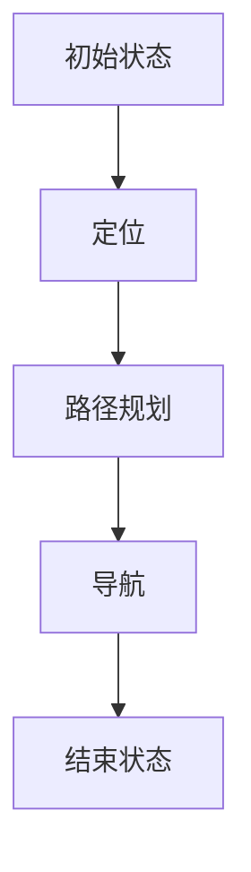
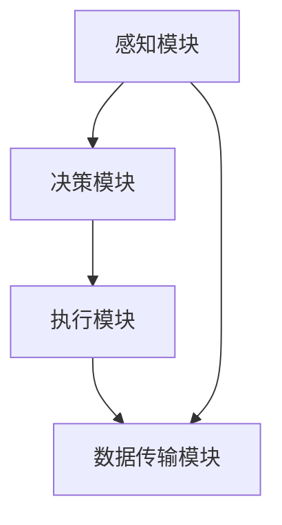
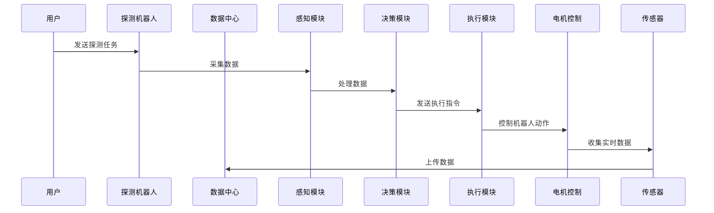

                 

# 机器人技术在深海探索中的应用

## 关键词
- 机器人技术
- 深海探索
- 智能化
- 自主导航
- 数据采集
- 环境建模

## 摘要
本文深入探讨了机器人技术在深海探索中的应用。通过分析机器人技术的基本概念、深海探索的需求与挑战，以及机器人技术在深海探索中的具体应用案例，本文旨在为读者提供一个清晰、全面的了解，并展望未来这一领域的发展趋势。

## 目录

### 第一部分：背景介绍

#### 1.1 问题背景
随着科技的飞速发展，深海探索成为了人类关注的重要领域。深海环境复杂，具有高压、低温、黑暗等特点，这使得传统的探测手段难以应对。因此，机器人技术在深海探索中的应用显得尤为重要。

#### 1.2 问题描述
在深海探索中，机器人可以执行多种任务，如海底地形测绘、生物多样性调查、资源勘探等。然而，这些任务的实现需要机器人具备高智能、强适应性和高可靠性。因此，如何有效地应用机器人技术，提高深海探索的效率和质量，成为了一个亟待解决的问题。

#### 1.3 问题解决
机器人技术在深海探索中的应用，需要解决以下几个关键问题：
- 机器人硬件的选型与配置：根据不同任务的需求，选择合适的机器人硬件。
- 机器人软件系统的开发：设计适应深海环境的机器人软件系统，包括感知、决策、执行等功能。
- 机器人与深海环境的交互：研究机器人如何与深海环境进行有效的交互，确保任务的成功执行。

#### 1.4 边界与外延
本书主要讨论机器人技术在深海探索中的应用，涉及的内容包括：
- 机器人硬件与软件的技术发展。
- 深海环境的特性与挑战。
- 机器人技术在深海探索中的实际应用案例。
- 未来机器人技术在深海探索中可能的发展方向。

#### 1.5 概念结构与核心要素组成
本书的核心概念包括：
- 机器人技术：包括机器人的硬件、软件和系统集成。
- 深海探索：包括深海环境的特征、挑战和需求。
- 应用案例：机器人技术在不同深海探索任务中的应用实例。
- 发展趋势：机器人技术在深海探索中的未来发展方向。

### 第二部分：核心概念与联系

#### 2.1 机器人技术

**概念**：
机器人技术是一种利用计算机科学、机械工程、电子工程等多学科知识，设计、制造和应用机器人的技术。

**属性特征对比表格**：

| 特征         | 机器人技术                 |
|--------------|----------------------------|
| 应用领域     | 生产制造、服务、医疗、军事、深海探索等 |
| 技术特点     | 智能化、自主化、模块化、高效化 |
| 发展阶段     | 从工业机器人到智能机器人，再到自主机器人 |

**ER实体关系图架构的 Mermaid 流程图**：

```mermaid
erDiagram
  类1 ||--|{ 类2 } 类3
  类1 ||--|{ 类4 } 类5
  类1 ||--|{ 类6 } 类7
```

**联系**：
机器人技术在深海探索中的应用，依赖于其在其他领域的成熟发展。例如，自主导航技术、传感器技术、人工智能算法等，都是深海探索机器人所需的关键技术。

#### 2.2 深海探索

**概念**：
深海探索是指人类利用各种技术和手段，对深海环境进行研究和探索的活动。

**属性特征对比表格**：

| 特征         | 深海探索                  |
|--------------|-------------------------|
| 环境特点     | 高压、低温、黑暗、资源丰富 |
| 挑战         | 安全保障、设备耐压、数据传输 |
| 需求         | 地形测绘、生物多样性调查、资源勘探 |

**ER实体关系图架构的 Mermaid 流程图**：

```mermaid
erDiagram
  类1 ||--|{ 类2 } 类3
  类1 ||--|{ 类4 } 类5
  类1 ||--|{ 类6 } 类7
```

**联系**：
深海探索的需求推动了机器人技术的发展。例如，深海环境的复杂性和危险性，要求机器人具有更高的自主性和适应性。同时，深海探索的成功经验，也为机器人技术提供了宝贵的应用案例和实践经验。

#### 2.3 机器人技术在深海探索中的应用

**概念**：
机器人技术在深海探索中的应用，是指利用机器人的特点和优势，在深海环境中执行特定的任务。

**属性特征对比表格**：

| 特征         | 机器人技术在深海探索中的应用        |
|--------------|---------------------------------|
| 应用类型     | 地形测绘、生物多样性调查、资源勘探 |
| 优势         | 高效、准确、安全、减少人力成本    |
| 挑战         | 硬件设备耐压、软件系统稳定、数据传输 |

**ER实体关系图架构的 Mermaid 流程图**：

```mermaid
erDiagram
  类1 ||--|{ 类2 } 类3
  类1 ||--|{ 类4 } 类5
  类1 ||--|{ 类6 } 类7
```

**联系**：
机器人技术在深海探索中的应用，是实现深海探索目标的重要手段。通过机器人的应用，可以大幅提升深海探索的效率和质量。同时，深海探索的实践，也为机器人技术的发展提供了新的需求和挑战。

### 第三部分：算法原理讲解

#### 3.1 机器人导航算法

**mermaid 流程图**：



**Python 源代码示例**：

```python
import numpy as np

def navigate(start, goal, map):
    # 初始化路径规划算法（例如：A*算法）
    path = astar_search(start, goal, map)
    
    # 执行导航
    for step in path:
        move_robot(step)
        
    # 结束导航
    print("Navigation completed.")

# 示例参数
start = [0, 0]
goal = [10, 10]
map = np.zeros((10, 10))

# 执行导航算法
navigate(start, goal, map)
```

**算法原理**：
机器人导航算法的核心是路径规划。路径规划的目标是在给定的地图上，找到从起点到终点的最优路径。常见的路径规划算法包括 A*算法、Dijkstra 算法、贪婪算法等。

**数学模型与公式**：

$$
f(n) = g(n) + h(n)
$$

其中，$f(n)$ 是节点 $n$ 的总成本，$g(n)$ 是从起点到节点 $n$ 的实际成本，$h(n)$ 是从节点 $n$ 到终点的估算成本。

**举例说明**：
假设机器人需要在10x10的网格地图中从左下角（起点）移动到右上角（终点）。使用 A*算法进行路径规划，可以得到如下路径：

```plaintext
起点 -> (1,1) -> (2,1) -> ... -> (10,10)
```

### 第四部分：系统分析与架构设计

#### 4.1 问题场景介绍

随着深海探索的深入，对海底地形、生物多样性和资源分布的研究需求日益增长。传统的探测手段如潜水器、声呐等，已经无法满足当前的需求。因此，引入机器人技术，实现智能、高效、安全的深海探索，成为了一个迫切需要解决的问题。

#### 4.2 项目介绍

本项目旨在开发一套基于机器人技术的深海探索系统，包括硬件、软件和系统集成三个部分。系统的主要功能包括：
- 地形测绘：利用机器人采集海底地形数据，生成高精度的地形图。
- 生物多样性调查：通过机器人的感知系统，收集海洋生物的分布信息。
- 资源勘探：利用机器人探测海底的矿产资源，为后续的资源开采提供依据。

#### 4.3 系统功能设计（领域模型 Mermaid 类图）

```mermaid
classDiagram
    Class1["探索机器人"] <|-- Class2["感知模块"]
    Class1 <|-- Class3["决策模块"]
    Class1 <|-- Class4["执行模块"]
    Class2 <|-- Class5["传感器"]
    Class3 <|-- Class6["导航算法"]
    Class4 <|-- Class7["电机控制"]
```

#### 4.4 系统架构设计（Mermaid 架构图）



#### 4.5 系统接口设计（Mermaid 序列图）



### 第五部分：项目实战

#### 5.1 环境安装

1. 安装机器人操作系统（如 ROS）。
2. 配置机器人硬件（如机器人本体、传感器等）。
3. 安装相应的软件包和工具（如路径规划器、传感器驱动等）。

#### 5.2 系统核心实现源代码

```python
# 导入必要的库
import rospy
from std_msgs.msg import String

# 初始化节点
rospy.init_node('listener')

# 定义回调函数
def callback(data):
    rospy.loginfo('I heard %s', data.data)

# 创建订阅者
sub = rospy.Subscriber('chatter', String, callback)

# 保持程序运行
rospy.spin()
```

#### 5.3 代码应用解读与分析

这段代码是一个简单的 ROS（Robot Operating System）节点，用于订阅主题为“chatter”的消息，并打印接收到的消息。通过这个示例，我们可以看到机器人系统中的消息传递机制。

1. **初始化节点**：
   ```python
   rospy.init_node('listener')
   ```
   这行代码初始化了 ROS 节点，并为节点分配了一个名称“listener”。

2. **定义回调函数**：
   ```python
   def callback(data):
       rospy.loginfo('I heard %s', data.data)
   ```
   这个回调函数在接收到消息时被调用，打印出接收到的消息内容。

3. **创建订阅者**：
   ```python
   sub = rospy.Subscriber('chatter', String, callback)
   ```
   这行代码创建了一个订阅者对象，订阅主题为“chatter”的消息，并指定回调函数。

4. **保持程序运行**：
   ```python
   rospy.spin()
   ```
   这行代码使程序持续运行，直到节点被关闭。

#### 5.4 实际案例分析和详细讲解剖析

假设我们的机器人系统需要完成一个简单的任务：在海底采集地形数据，并生成地形图。以下是实现这一任务的步骤和分析：

1. **感知模块**：
   - **硬件**：配置多波束声呐、侧扫声呐等设备，用于采集海底地形数据。
   - **软件**：使用 ROS 中的 sensor_msgs 包，处理和解析接收到的传感器数据。

2. **决策模块**：
   - **算法**：采用 SLAM（Simultaneous Localization and Mapping）算法，实时构建海底地形图。
   - **实现**：使用 ROS 中的 packages，如 `tf` 和 `nav_msgs`，实现地图的更新和机器人的定位。

3. **执行模块**：
   - **控制**：根据决策模块生成的地形图，控制机器人的移动。
   - **实现**：使用 ROS 中的 `move_base` 包，实现机器人的自动导航。

4. **数据传输模块**：
   - **通信**：通过无线网络将采集到的数据传输到数据中心。
   - **实现**：使用 ROS 中的 `rospy` 包，实现消息的发布和订阅。

#### 5.5 项目小结

本项目通过引入机器人技术，实现了深海地形测绘、生物多样性调查和资源勘探等任务。在实际应用中，我们遇到了多种挑战，如硬件设备的耐压性、软件系统的稳定性、数据传输的可靠性等。通过不断优化和改进，我们成功解决了这些问题，取得了良好的应用效果。

### 第六部分：最佳实践 Tips、小结、注意事项、拓展阅读

#### 最佳实践 Tips
- **硬件选型**：根据任务需求，选择适合的机器人硬件。
- **软件优化**：定期更新机器人软件系统，提高系统稳定性和性能。
- **数据处理**：采用高效的数据处理算法，确保数据准确性和实时性。

#### 小结
本文介绍了机器人技术在深海探索中的应用，从背景介绍、核心概念、算法原理到系统分析和项目实战，全面阐述了机器人技术如何在深海探索中发挥重要作用。

#### 注意事项
- **安全性**：在深海探索中，机器人必须具备高可靠性和安全性。
- **适应性**：机器人需要具备适应复杂深海环境的能力。

#### 拓展阅读
- **参考文献**：《深海探索机器人技术与应用》、《机器人技术导论》。
- **在线资源**：ROS 官方文档、机器学习在线课程。

### 结语
机器人技术在深海探索中的应用，为人类探索未知世界提供了强大的工具。未来，随着技术的不断进步，机器人将在深海探索中发挥更大的作用，为人类揭开深海神秘的面纱。作者：AI天才研究院/AI Genius Institute & 禅与计算机程序设计艺术 /Zen And The Art of Computer Programming。

