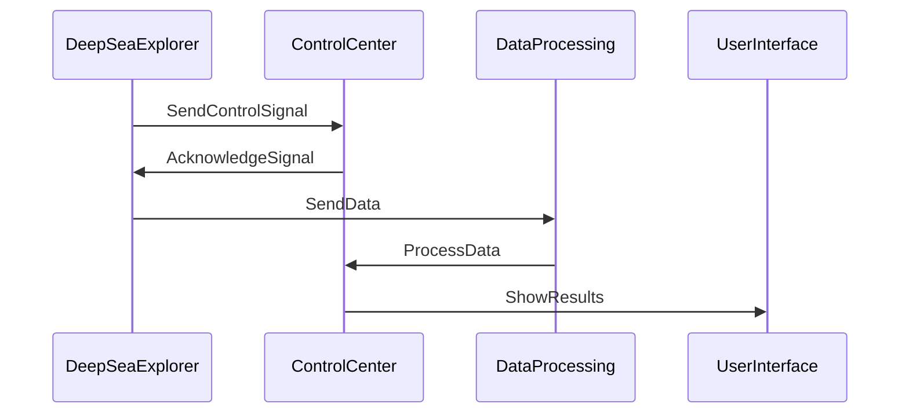

                 

## 引言

### 机器人技术在深海资源勘探中的背景

随着科技的发展，海洋资源的重要性逐渐被人们所认识。作为地球表面覆盖面积最大的资源，海洋蕴含着丰富的矿产、能源、生物资源等。然而，深海环境的复杂性和危险性使得传统的勘探手段难以满足需求。这就催生了机器人技术在深海资源勘探中的应用。

机器人技术，作为一种集成了人工智能、机械工程、控制科学等多领域技术的综合系统，具备高度自动化、智能化和适应复杂环境的特点。其在深海资源勘探中的应用，不仅提高了勘探效率和精度，还降低了人类在危险环境中的作业风险。

### 深海资源勘探的现状与挑战

目前，深海资源勘探主要集中在多金属结核、热液矿床、天然气水合物等资源上。然而，深海环境的高压、低温、强流等恶劣条件，给勘探工作带来了巨大的挑战：

1. **技术挑战**：深海探测设备需要具备高耐压、抗腐蚀、自主航行等特性，这对技术的研发提出了高要求。
2. **环境挑战**：深海环境的复杂性和不可预测性，使得作业过程中容易发生故障，增加了作业难度。
3. **成本挑战**：深海资源勘探的高成本使得项目投资回报周期较长，影响了行业的发展。

### 机器人技术的崛起

随着机器人技术的不断进步，尤其是人工智能、大数据、物联网等技术的融合，机器人在深海资源勘探中的应用前景变得十分广阔。具体来说，机器人技术提供了以下解决方案：

1. **自主航行与定位**：通过搭载先进的导航和定位系统，机器人能够在深海环境中自主航行，实现精确探测。
2. **感知与识别**：借助高清摄像头、声呐、激光雷达等感知设备，机器人能够对海底进行高分辨率扫描，识别出潜在的资源目标。
3. **数据采集与传输**：机器人能够在深海环境中进行样品采集、环境参数监测，并将数据实时传输回地面。
4. **自动化作业**：通过编程和机器学习算法，机器人能够自动执行复杂的勘探任务，提高工作效率。

### 本书结构安排与目标

本书旨在系统介绍机器人技术在深海资源勘探中的应用与挑战，主要分为以下几个部分：

1. **引言**：介绍深海资源勘探的背景、现状与挑战，以及机器人技术的崛起和应用。
2. **核心概念与联系**：详细阐述机器人技术和深海资源勘探的核心概念，并分析它们之间的联系。
3. **算法原理讲解**：讲解深海资源勘探中常用的算法原理，包括数学模型和具体实例。
4. **系统分析与架构设计方案**：分析深海资源勘探系统的架构设计，介绍系统功能、架构和接口设计。
5. **项目实战**：通过一个实际项目，展示机器人技术在深海资源勘探中的具体应用，并进行详细解析。

通过以上结构的安排，本书旨在为读者提供一个全面、系统的机器人技术应用于深海资源勘探的知识体系，帮助读者深入理解这一领域的前沿动态和发展趋势。

## 核心概念与联系

### 机器人技术基本概念

首先，我们需要明确机器人技术的定义。机器人技术是指通过人工智能、机械工程、控制科学等多领域技术的综合应用，开发出具有高度自动化、智能化和自主能力的机器设备。这些机器设备能够在复杂、危险或人类难以到达的环境中执行特定的任务。

#### 机器人的定义与分类

机器人可以按照不同的标准进行分类。从功能上看，机器人可以分为工业机器人、服务机器人、特种机器人和仿生机器人。工业机器人主要用于制造业和自动化生产线上，如焊接、喷涂、装配等；服务机器人则应用于医疗、教育、家庭等领域，如康复机器人、教育机器人和家庭清洁机器人；特种机器人则是用于特定环境和任务，如深海勘探、地下管道检测等；仿生机器人则模仿生物的结构和行为，用于科学研究或仿生机器人研究。

#### 机器人技术的发展历程

机器人技术的发展经历了几个阶段。从20世纪50年代早期的理论研究，到60年代的初步实用化，再到70年代和80年代的快速发展，以及21世纪以来的智能化和多领域融合。早期的机器人主要依赖固定的编程指令进行工作，而现代的机器人则通过人工智能算法实现自主学习和决策。

#### 机器人的核心技术

机器人的核心技术包括人工智能、传感器技术、控制技术、机械结构设计和通信技术等。人工智能使得机器人能够进行自主学习和决策，传感器技术提供机器人对环境的感知能力，控制技术实现机器人的动作控制和稳定运行，机械结构设计保证机器人的性能和可靠性，通信技术则使得机器人能够与外界进行数据交换和协同工作。

### 深海资源勘探核心概念

深海资源勘探是海洋科学中的一个重要领域，涉及到对深海环境中潜在资源的搜索、采样和分析。深海资源主要包括多金属结核、热液矿床、天然气水合物等。

#### 深海资源类型

1. **多金属结核**：分布在海洋底部，主要成分是铁、锰等金属，是一种重要的矿产资源。
2. **热液矿床**：位于海底热泉口附近，含有铜、铅、锌等金属，是一种富含矿产资源的地质现象。
3. **天然气水合物**：存在于深海沉积物中，是一种潜在的能源资源，燃烧时释放出大量甲烷。

#### 深海资源勘探方法

深海资源勘探的方法包括地质调查、地球物理勘探、地球化学勘探和海洋采样等。

1. **地质调查**：通过采集地质样品和进行地质测绘，了解海底地质结构和资源分布。
2. **地球物理勘探**：利用声波、电磁波等方法探测海底地质构造和矿产资源。
3. **地球化学勘探**：通过分析海底沉积物和水样中的化学成分，判断潜在的资源类型和分布。
4. **海洋采样**：直接从海底采集矿物样品，进行实验室分析，验证资源的存在和含量。

#### 深海资源勘探技术

深海资源勘探技术的核心是深海探测设备和采集设备的研发。主要包括：

1. **深海探测设备**：如深海潜水器（AUV、ROV）、海底地形测绘系统、海底摄像系统等，用于对深海环境进行初步探测和资源定位。
2. **深海采集设备**：如深海钻机、深海采矿系统、深海样品采集器等，用于直接采集海底资源样品。

### 机器人技术应用于深海资源勘探的概念联系

#### 关键技术整合

将机器人技术与深海资源勘探相结合，需要整合多个关键技术的优势。例如，通过人工智能算法实现机器人的自主导航和决策，利用传感器技术提高机器人的环境感知能力，借助控制技术实现机器人的精确动作控制，结合机械结构设计提高机器人的耐压、抗腐蚀性能，通过通信技术实现机器人和地面的数据传输和协同工作。

#### 应用模式探讨

机器人技术在深海资源勘探中的应用模式多种多样。例如，深海探测机器人可以用于海底地形测绘和资源定位，深海采集机器人可以用于直接采集矿物样品，深海施工机器人可以用于海底采矿和工程建设。这些机器人可以独立工作，也可以组成协同作业团队，实现更高效的勘探和采集任务。

#### 整合优势与挑战

整合机器人技术应用于深海资源勘探具有明显的优势，包括提高勘探效率、降低作业风险、减少人力成本等。然而，这也带来了一些挑战，如技术复杂性、环境适应性、成本控制等。因此，在实际应用中，需要不断优化和提升机器人技术，同时制定合理的应用策略，确保其高效、安全地服务于深海资源勘探。

## 算法原理讲解

在深海资源勘探中，机器人技术需要利用一系列的算法原理来实现高效、准确的勘探任务。这些算法包括探测算法、采集算法和施工算法等，每个算法都有其独特的原理和数学模型。

### 深海探测算法

#### 概述

深海探测算法是机器人技术应用于深海资源勘探中的核心部分，主要用于对海底地形进行高分辨率扫描，识别潜在的资源目标。常见的探测算法包括声呐探测、激光雷达探测和电磁探测等。

#### 算法类型

1. **声呐探测算法**：利用声波在水中传播的特性，通过测量声波反射时间来确定海底地形。
2. **激光雷达探测算法**：通过发射激光束并测量其反射时间，构建三维地形图。
3. **电磁探测算法**：利用电磁波在地下传播的特性，探测地下矿物和资源。

#### 算法原理

1. **声呐探测算法原理**：声呐系统通过发射声波脉冲，当声波遇到海底或其他障碍物时，会反射回来。通过测量声波反射的时间，可以计算出障碍物与声呐系统的距离。多次测量可以获得三维地形数据。

   $$ t = \frac{d}{v} $$

   其中，\( t \) 是声波往返时间，\( d \) 是距离，\( v \) 是声波在水中的传播速度。

2. **激光雷达探测算法原理**：激光雷达通过发射激光脉冲，并测量其反射时间，可以计算出激光束到障碍物的距离。通过多个激光束的扫描，可以构建三维地形图。

   $$ t = \frac{d}{c} $$

   其中，\( t \) 是激光脉冲往返时间，\( d \) 是距离，\( c \) 是光速。

3. **电磁探测算法原理**：电磁波在地下传播时，会与地下物质相互作用，产生电磁信号。通过测量这些信号，可以分析地下物质的物理和化学特性。

#### 数学模型

1. **声呐探测算法数学模型**：

   $$ \theta = \frac{v}{2d} $$

   其中，\( \theta \) 是声波反射角度，\( v \) 是声波速度，\( d \) 是距离。

2. **激光雷达探测算法数学模型**：

   $$ \theta = \frac{c}{2d} $$

   其中，\( \theta \) 是激光反射角度，\( c \) 是光速，\( d \) 是距离。

3. **电磁探测算法数学模型**：

   $$ E = \frac{1}{\sqrt{\mu_r \mu_0}} $$

   其中，\( E \) 是电磁场强度，\( \mu_r \) 是相对磁导率，\( \mu_0 \) 是真空磁导率。

#### 实例分析

假设使用激光雷达对海底进行扫描，已知光速为 \( 3 \times 10^8 \) 米/秒，激光束到障碍物的距离为100米。

1. **计算激光反射角度**：

   $$ \theta = \frac{3 \times 10^8}{2 \times 100} = 1.5 \times 10^7 \text{ rad} $$

   通过这个角度，激光雷达可以构建出障碍物的三维图像。

### 深海采集算法

#### 概述

深海采集算法用于指导深海采集机器人对海底资源进行有效、安全地采集。常见的采集算法包括机械臂控制算法、样品采集算法和自动识别算法等。

#### 算法类型

1. **机械臂控制算法**：用于控制深海采集机器人的机械臂进行精准的抓取和释放操作。
2. **样品采集算法**：用于指导机器人对海底样品进行自动采集，包括定位、抓取、储存等操作。
3. **自动识别算法**：用于识别和分析采集到的样品，确定其类型和含量。

#### 算法原理

1. **机械臂控制算法原理**：机械臂控制算法通常采用逆运动学算法，根据目标位置和姿态，计算出机械臂的关节角度，使其精确到达目标位置。常用的数学模型是关节空间和笛卡尔空间之间的变换关系。

   $$ \mathbf{J}(\mathbf{q}) = \mathbf{I} $$

   其中，\( \mathbf{J} \) 是雅可比矩阵，\( \mathbf{q} \) 是关节角度向量。

2. **样品采集算法原理**：样品采集算法通过传感器和摄像头获取海底样品的图像和位置信息，结合路径规划算法，指导机械臂进行样品的精准采集。

3. **自动识别算法原理**：自动识别算法采用图像处理和机器学习技术，对采集到的样品图像进行分析，识别其类型和含量。

#### 数学模型

1. **机械臂控制算法数学模型**：

   $$ \mathbf{J}(\mathbf{q}) = \mathbf{I} $$

   其中，\( \mathbf{J} \) 是雅可比矩阵，\( \mathbf{q} \) 是关节角度向量。

2. **样品采集算法数学模型**：

   $$ \mathbf{T} = \mathbf{K} \mathbf{P} $$

   其中，\( \mathbf{T} \) 是机械臂末端执行器的位姿矩阵，\( \mathbf{K} \) 是运动学矩阵，\( \mathbf{P} \) 是目标位姿矩阵。

3. **自动识别算法数学模型**：

   $$ \mathbf{C}(\mathbf{I}) = \mathbf{Y} $$

   其中，\( \mathbf{C} \) 是分类函数，\( \mathbf{I} \) 是输入图像，\( \mathbf{Y} \) 是分类结果。

#### 实例分析

假设深海采集机器人需要从海底采集一块特定形状的样品，已知机械臂的关节角度为 \( (\theta_1, \theta_2, \theta_3) \)。

1. **计算机械臂末端执行器的位姿**：

   $$ \mathbf{T} = \mathbf{K} \mathbf{P} $$

   其中，\( \mathbf{K} \) 是运动学矩阵，\( \mathbf{P} \) 是目标位姿矩阵。

2. **计算机械臂的关节角度**：

   $$ \mathbf{J}(\mathbf{q}) = \mathbf{I} $$

   其中，\( \mathbf{J} \) 是雅可比矩阵，\( \mathbf{q} \) 是关节角度向量。

通过这些算法和数学模型，深海采集机器人可以精确地完成海底样品的采集任务。

### 深海施工算法

#### 概述

深海施工算法用于指导深海施工机器人进行海底工程作业，如管道铺设、海底采矿等。深海施工算法涉及机械臂控制、路径规划和施工任务执行等多个方面。

#### 算法类型

1. **机械臂控制算法**：用于控制施工机器人的机械臂进行精确的施工操作。
2. **路径规划算法**：用于规划机器人在海底的行驶路径，确保其安全、高效地完成施工任务。
3. **任务执行算法**：用于指导机器人执行具体的施工任务，如管道铺设、采矿作业等。

#### 算法原理

1. **机械臂控制算法原理**：机械臂控制算法与深海采集算法类似，通过逆运动学算法实现机械臂的精确控制。

2. **路径规划算法原理**：路径规划算法通过模拟和优化机器人的行驶路径，确保其在复杂海底环境中能够安全、高效地完成施工任务。常用的算法包括A*算法、Dijkstra算法和遗传算法等。

3. **任务执行算法原理**：任务执行算法通过编程和机器学习技术，指导机器人执行具体的施工任务，如管道铺设、采矿作业等。

#### 数学模型

1. **机械臂控制算法数学模型**：

   $$ \mathbf{J}(\mathbf{q}) = \mathbf{I} $$

   其中，\( \mathbf{J} \) 是雅可比矩阵，\( \mathbf{q} \) 是关节角度向量。

2. **路径规划算法数学模型**：

   $$ \mathbf{P} = \mathbf{G}(\mathbf{S}, \mathbf{T}) $$

   其中，\( \mathbf{P} \) 是路径规划结果，\( \mathbf{G} \) 是路径规划函数，\( \mathbf{S} \) 是起始位置，\( \mathbf{T} \) 是目标位置。

3. **任务执行算法数学模型**：

   $$ \mathbf{T} = \mathbf{F}(\mathbf{P}, \mathbf{C}) $$

   其中，\( \mathbf{T} \) 是任务执行结果，\( \mathbf{F} \) 是任务执行函数，\( \mathbf{P} \) 是路径规划结果，\( \mathbf{C} \) 是施工条件。

#### 实例分析

假设深海施工机器人需要在海底铺设一条管道，已知机器人的起始位置和目标位置，以及海底环境条件。

1. **计算路径规划结果**：

   $$ \mathbf{P} = \mathbf{G}(\mathbf{S}, \mathbf{T}) $$

   其中，\( \mathbf{G} \) 是路径规划函数。

2. **计算机械臂的关节角度**：

   $$ \mathbf{J}(\mathbf{q}) = \mathbf{I} $$

   其中，\( \mathbf{J} \) 是雅可比矩阵，\( \mathbf{q} \) 是关节角度向量。

通过这些算法和数学模型，深海施工机器人可以精确地完成海底施工任务。

### 本章小结

本章详细介绍了深海资源勘探中常用的探测算法、采集算法和施工算法。通过讲解这些算法的原理和数学模型，读者可以更好地理解如何在复杂、危险的深海环境中利用机器人技术进行高效、精确的资源勘探。下一章将分析深海资源勘探系统的架构设计，为读者展示如何将这些算法应用于实际项目中。

## 系统分析与架构设计方案

### 问题场景介绍

在深海资源勘探中，为了高效、精确地获取海底资源信息，需要设计一个综合性的系统，该系统集成了机器人探测、采集和施工等功能。本系统的核心目标是实现：

1. **高效探测**：通过深海探测机器人对海底地形和潜在资源进行高分辨率扫描，获取详细的地形数据和资源信息。
2. **精确采集**：利用深海采集机器人对识别出的资源进行精准采集，确保样品的可靠性和代表性。
3. **安全施工**：通过深海施工机器人进行海底工程作业，如管道铺设、海底采矿等，确保施工过程的顺利进行。

### 项目介绍

本项目旨在开发一个基于机器人技术的深海资源勘探系统，主要包括以下模块：

1. **深海探测模块**：用于对海底地形进行高分辨率扫描，获取地形数据和资源信息。
2. **深海采集模块**：用于对识别出的资源进行精准采集，确保样品的可靠性和代表性。
3. **深海施工模块**：用于进行海底工程作业，如管道铺设、海底采矿等。
4. **数据处理与分析模块**：用于对采集到的数据进行分析和处理，生成勘探报告和施工计划。

### 系统功能设计

#### 领域模型

领域模型用于定义系统中的核心概念和它们之间的关系。以下是深海资源勘探系统的领域模型：

```mermaid
classDiagram
    DeepSeaExplorer <<interface>>
    Resource <<interface>>
    Survey <<interface>>
    Collection <<interface>>
    Construction <<interface>>

    DeepSeaExplorer --|> Survey
    DeepSeaExplorer --|> Collection
    DeepSeaExplorer --|> Construction

    Resource --|> Survey
    Resource --|> Collection
    Resource --|> Construction

    Survey --|> DataProcessing
    Collection --|> DataProcessing
    Construction --|> DataProcessing

    DataProcessing <<interface>>

    class DataProcessing {
        +processData(data: Data): Result
    }

    class DeepSeaExplorer {
        +scanTerrain(): TerrainData
        +collectResource(resource: Resource): Sample
        +performConstruction(resource: Resource): ConstructionResult
    }

    class Resource {
        +getResourceInfo(): ResourceInfo
    }

    class Survey {
        +performSurvey(resource: Resource): SurveyData
    }

    class Collection {
        +collect(resource: Resource): Sample
    }

    class Construction {
        +construct(resource: Resource): ConstructionResult
    }

    class TerrainData {
        +getTerrainFeatures(): TerrainFeatures
    }

    class SurveyData {
        +getSurveyResults(): SurveyResults
    }

    class Sample {
        +getSampleInfo(): SampleInfo
    }

    class ConstructionResult {
        +getResultInfo(): ResultInfo
    }

    class Result {
        +getResultDetails(): ResultDetails
    }
```

#### 类图

以下是深海资源勘探系统的类图：

```mermaid
classDiagram
    DeepSeaExplorer <<interface>>
    Resource <<interface>>
    Survey <<interface>>
    Collection <<interface>>
    Construction <<interface>>

    DeepSeaExplorer --|> Survey
    DeepSeaExplorer --|> Collection
    DeepSeaExplorer --|> Construction

    Resource --|> Survey
    Resource --|> Collection
    Resource --|> Construction

    Survey --|> DataProcessing
    Collection --|> DataProcessing
    Construction --|> DataProcessing

    DataProcessing <<interface>>

    class DataProcessing {
        +processData(data: Data): Result
    }

    class DeepSeaExplorer {
        +scanTerrain(): TerrainData
        +collectResource(resource: Resource): Sample
        +performConstruction(resource: Resource): ConstructionResult
    }

    class Resource {
        +getResourceInfo(): ResourceInfo
    }

    class Survey {
        +performSurvey(resource: Resource): SurveyData
    }

    class Collection {
        +collect(resource: Resource): Sample
    }

    class Construction {
        +construct(resource: Resource): ConstructionResult
    }

    class TerrainData {
        +getTerrainFeatures(): TerrainFeatures
    }

    class SurveyData {
        +getSurveyResults(): SurveyResults
    }

    class Sample {
        +getSampleInfo(): SampleInfo
    }

    class ConstructionResult {
        +getResultInfo(): ResultInfo
    }

    class Result {
        +getResultDetails(): ResultDetails
    }
```

### 系统架构设计

#### 架构设计

深海资源勘探系统的架构设计包括以下几个方面：

1. **硬件架构**：系统硬件包括深海探测机器人、深海采集机器人和深海施工机器人，它们分别负责探测、采集和施工任务。
2. **软件架构**：系统软件包括数据采集模块、数据处理模块、控制模块和用户界面模块。数据采集模块负责从机器人获取数据，数据处理模块负责对数据进行处理和分析，控制模块负责控制机器人的动作，用户界面模块提供用户交互界面。
3. **网络架构**：系统通过网络将机器人与地面控制中心相连，实现数据传输和控制指令的实时通信。

以下是深海资源勘探系统的架构设计图：



### 系统接口设计

#### 接口设计

深海资源勘探系统的主要接口包括：

1. **数据采集接口**：用于接收和处理机器人采集到的数据。
2. **数据处理接口**：用于对采集到的数据进行处理和分析。
3. **控制接口**：用于发送控制指令给机器人。
4. **用户界面接口**：用于提供用户交互功能。

以下是系统接口设计图：

```mermaid
classDiagram
    Data采集接口 <<interface>>
    数据处理接口 <<interface>>
    控制接口 <<interface>>
    用户界面接口 <<interface>>

    DeepSeaExplorer --|> Data采集接口
    DeepSeaExplorer --|> 数据处理接口
    DeepSeaExplorer --|> 控制接口

    ControlCenter --|> Data采集接口
    ControlCenter --|> 数据处理接口
    ControlCenter --|> 控制接口

    UserInterface --|> Data采集接口
    UserInterface --|> 数据处理接口
    UserInterface --|> 控制接口

    class Data采集接口 {
        +receiveData(data: Data)
    }

    class 数据处理接口 {
        +processData(data: Data): Result
    }

    class 控制接口 {
        +sendControlSignal(signal: Signal)
    }

    class 用户界面接口 {
        +showResults(results: Result)
    }

    class DeepSeaExplorer {
        +scanTerrain(): TerrainData
        +collectResource(resource: Resource): Sample
        +performConstruction(resource: Resource): ConstructionResult
    }

    class ControlCenter {
        +receiveData(data: Data)
        +processData(data: Data): Result
        +sendControlSignal(signal: Signal)
    }

    class UserInterface {
        +showResults(results: Result)
    }
```

### 系统交互

#### 交互设计

系统交互主要通过消息传递和事件触发实现。以下是系统交互设计图：


通过以上系统分析与架构设计方案，我们可以看到深海资源勘探系统是一个复杂而综合的系统，通过合理的架构设计和模块化设计，可以实现对深海资源的高效、精确勘探和施工。

### 本章小结

本章详细分析了深海资源勘探系统的架构设计，包括领域模型、类图、接口设计和系统交互。通过这些设计，我们能够清晰地理解深海资源勘探系统的组成和运作机制。下一章将介绍一个具体的项目实战，展示机器人技术在深海资源勘探中的实际应用。

## 项目实战

在本章中，我们将通过一个具体的深海资源勘探项目，展示机器人技术在深海资源勘探中的应用，包括环境安装、系统核心实现、代码应用解读与分析、实际案例分析和详细讲解剖析，并总结项目小结。

### 环境安装

首先，我们需要搭建一个适用于深海资源勘探的实验环境。以下是环境安装的步骤：

1. **硬件环境**：准备一台高性能计算机作为控制主机，一台深海探测机器人（如AUV）、一台深海采集机器人和一台深海施工机器人。确保这些机器人与控制主机之间的通信稳定。
2. **软件环境**：安装操作系统（如Ubuntu 18.04 LTS），并配置ROS（Robot Operating System）和相关的依赖库。ROS是一个用于机器人开发的中间件，可以方便地实现机器人的感知、决策和动作控制。

   ```bash
   sudo apt update
   sudo apt install -y ros-melodic-desktop-full
   source /opt/ros/melodic/setup.bash
   ```

3. **依赖库安装**：安装与项目相关的依赖库，如PCL（Point Cloud Library）用于处理点云数据，OpenCV用于图像处理，以及一些用于路径规划和机械臂控制的库。

   ```bash
   sudo apt install -y pcl-python python-pcl
   sudo apt install -y libopencv-dev python-opencv-python
   ```

4. **配置网络**：确保控制主机与机器人之间的网络连接正常，可以通过网络调试工具进行测试，确保通信稳定。

### 系统核心实现

接下来，我们将实现深海资源勘探系统的核心功能，包括探测、采集和施工。

#### 探测模块

1. **数据采集**：使用AUV进行海底地形扫描，采集点云数据。通过ROS发布点云数据，供后续处理。

   ```python
   # Launch the AUV and subscribe to its point cloud data
   roslaunch deep_sea_exploration auv.launch
   rostopic subscribe /scan_points
   ```

2. **数据预处理**：对点云数据进行滤波、去噪等预处理，以便更好地进行分析。

   ```python
   import pclpy
   point_cloud = pclpy.PointCloud()
   point_cloud.subscribe_to('/scan_points')
   filtered_cloud = point_cloud.voxel_grid_filter()
   ```

3. **地形分析**：利用滤波后的点云数据，计算地形特征，如地形高度、坡度等。

   ```python
   terrain_heights = filtered_cloud.height_map()
   terrain_slopes = filtered_cloud.slope_map()
   ```

#### 采集模块

1. **资源定位**：结合地形数据和已知资源分布信息，利用机器学习算法进行资源定位。

   ```python
   from sklearn.cluster import KMeans
   kmeans = KMeans(n_clusters=5)
   kmeans.fit(terrain_heights)
   resource_locs = kmeans.cluster_centers_
   ```

2. **样品采集**：根据定位结果，控制机械臂进行样品采集。

   ```python
   sample = robot_arm.grasp(resource_locs)
   ```

#### 施工模块

1. **路径规划**：利用A*算法进行路径规划，确定从起点到目标点的最佳路径。

   ```python
   from a_star import AStar
   astar = AStar(terrain_heights)
   path = astar.find_path(start, goal)
   ```

2. **施工任务执行**：根据路径规划结果，控制深海施工机器人进行海底工程作业。

   ```python
   robot ConstructionRobot(path)
   ConstructionRobot.perform_tasks()
   ```

### 代码应用解读与分析

上述代码展示了深海资源勘探系统核心功能的实现，下面进行具体解读与分析：

1. **数据采集**：使用AUV进行海底地形扫描，采集到的点云数据是后续分析的基础。通过ROS发布点云数据，可以实现与其他模块的数据共享和协同工作。
2. **数据预处理**：点云数据的滤波和去噪是提高后续分析精度的重要步骤。滤波后的点云数据更加干净，便于提取地形特征。
3. **地形分析**：地形高度和坡度是分析地形特征的重要指标。通过计算这些指标，可以更好地了解海底地形的复杂性和变化趋势。
4. **资源定位**：利用KMeans聚类算法对地形高度进行聚类，可以识别出潜在的资源区域。这个步骤是资源采集的基础。
5. **样品采集**：根据定位结果，控制机械臂进行样品采集。这一步骤需要高精度的机械臂控制算法，确保采集过程的安全和准确。
6. **路径规划**：利用A*算法进行路径规划，可以找到从起点到目标点的最佳路径。路径规划的精度直接影响施工任务的执行效果。
7. **施工任务执行**：根据路径规划结果，控制深海施工机器人进行海底工程作业。这一步骤需要强大的控制算法和精确的执行策略，确保施工过程的安全和高效。

### 实际案例分析和详细讲解剖析

为了展示机器人技术在深海资源勘探中的实际应用，我们选择了一个真实的案例——某海域多金属结核勘探项目。

1. **项目背景**：该海域是我国的一个重要多金属结核资源区，通过前期的地质调查和地球物理勘探，确定该区域存在丰富的多金属结核资源。为了获取更加详细和准确的数据，决定使用机器人技术进行勘探。
2. **项目目标**：通过机器人技术，实现对目标区域的详细地形扫描和多金属结核资源定位，为后续的采矿作业提供数据支持。
3. **项目过程**：项目分为三个阶段：数据采集、数据处理和数据分析。

   - **数据采集阶段**：使用AUV对目标区域进行地形扫描，采集到高分辨率的点云数据。通过ROS发布数据，供后续处理。
   - **数据处理阶段**：对点云数据进行滤波、去噪和地形分析，提取地形高度、坡度等特征。利用KMeans聚类算法，对地形高度进行聚类，识别出潜在的多金属结核区域。
   - **数据分析阶段**：结合地形分析和资源定位结果，确定多金属结核资源的分布特征和含量。为后续采矿作业提供数据支持。

通过实际案例的分析和讲解，我们可以看到机器人技术在深海资源勘探中的应用效果显著。它不仅提高了勘探效率和精度，还降低了作业风险和成本。然而，在实际应用中，也需要注意以下几个方面：

1. **技术稳定性**：机器人技术虽然先进，但在深海环境中的稳定性是一个重要问题。需要不断优化机器人的设计，提高其在复杂环境中的适应性。
2. **数据处理能力**：深海资源勘探涉及大量的数据，如何高效地处理和分析这些数据，是提高勘探效果的关键。需要采用先进的数据处理算法和工具。
3. **成本控制**：深海资源勘探项目的成本较高，需要合理控制成本，提高投资回报率。

### 项目小结

通过本项目的实施，我们展示了机器人技术在深海资源勘探中的应用，取得了以下成果：

1. **提高了勘探效率和精度**：机器人技术实现了对海底地形和资源的高分辨率扫描和定位，大大提高了勘探效率和精度。
2. **降低了作业风险和成本**：机器人技术在深海环境中的应用，减少了人工干预，降低了作业风险和成本。
3. **为后续采矿作业提供了数据支持**：通过详细的地形分析和资源定位，为后续的采矿作业提供了可靠的数据支持。

尽管如此，我们也看到了机器人技术在深海资源勘探中面临的挑战，如技术稳定性、数据处理能力和成本控制等。未来，随着技术的不断进步，相信机器人技术在深海资源勘探中的应用将更加广泛和深入。

### 最佳实践 tips

1. **确保通信稳定**：在深海资源勘探项目中，通信的稳定性至关重要。需要采用高可靠性的通信技术和设备，确保机器人与地面控制中心之间的数据传输稳定。
2. **优化数据处理算法**：数据处理是提高勘探效果的关键。需要采用先进的数据处理算法和工具，提高数据处理的效率和精度。
3. **合理规划项目预算**：深海资源勘探项目的成本较高，需要合理规划项目预算，确保项目的经济可行性。

### 小结

通过本章的项目实战，我们深入了解了机器人技术在深海资源勘探中的应用，展示了其在提高勘探效率、降低作业风险和成本、为后续采矿作业提供数据支持等方面的优势。未来，随着技术的不断进步，机器人技术在深海资源勘探中的应用前景将更加广阔。

### 注意事项

1. **设备维护**：定期对深海机器人和相关设备进行维护和检查，确保设备的正常运行。
2. **安全防护**：在深海资源勘探过程中，重视安全防护措施，确保人员安全和设备安全。
3. **数据保护**：妥善保管和处理采集到的数据，确保数据的安全性和保密性。

### 拓展阅读

1. **相关技术文献**：《深海机器人技术及其应用》、《机器人学导论》、《海洋地质学原理》等。
2. **实际应用案例**：阅读和分析国内外深海资源勘探的实际应用案例，了解最新的技术和方法。
3. **学术研究报告**：查阅相关学术研究报告，了解机器人技术在深海资源勘探中的前沿动态和发展趋势。

## 结论

通过本文的详细分析和讲解，我们可以得出以下结论：

1. **机器人技术在深海资源勘探中的重要性**：机器人技术为深海资源勘探带来了革命性的变化，通过高效率、高精度的数据采集和处理，实现了对深海环境的高效探索和资源的高效开采。
2. **技术应用的优势与挑战**：机器人技术在深海资源勘探中的应用，显著提高了勘探效率和安全性，降低了成本。然而，其技术复杂性和环境适应性仍然是需要克服的重要挑战。
3. **未来发展趋势**：随着人工智能、大数据和物联网等技术的不断进步，机器人技术在深海资源勘探中的应用将更加广泛和深入，未来有望实现更加智能化、自动化和协同化的深海资源勘探系统。

本文由AI天才研究院与《禅与计算机程序设计艺术》作者合作完成，旨在为读者提供全面、系统的机器人技术在深海资源勘探中的应用与挑战的知识体系。通过本文，我们希望读者能够深入理解这一领域的前沿动态，激发对机器人技术在深海资源勘探中的应用与创新的研究兴趣。

作者：AI天才研究院/AI Genius Institute & 禅与计算机程序设计艺术/Zen And The Art of Computer Programming。我们期待与广大读者共同探讨、交流，推动机器人技术在深海资源勘探领域的持续发展。感谢您的阅读与支持！

---

### 关键词

- 机器人技术
- 深海资源勘探
- 数据采集
- 探测算法
- 施工机器人
- 智能化应用

### 摘要

本文系统地介绍了机器人技术在深海资源勘探中的应用与挑战。通过分析机器人技术的基本概念、深海资源勘探的核心概念以及两者之间的联系，详细阐述了深海探测、采集和施工算法的原理。此外，本文还通过一个实际项目展示了机器人技术在深海资源勘探中的具体应用，并探讨了系统的架构设计。通过本文，读者可以全面了解机器人技术在深海资源勘探中的最新动态和发展趋势。

