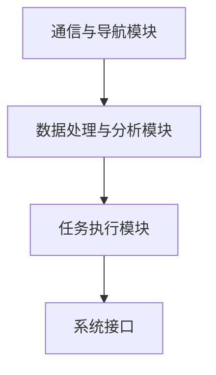
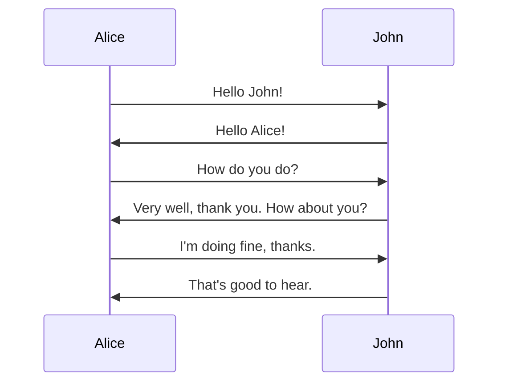
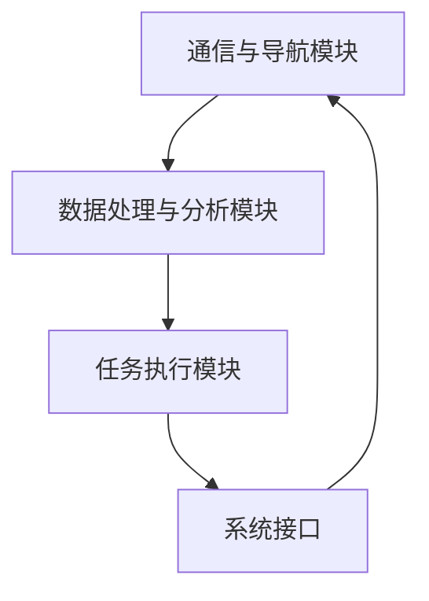

                 


# 机器人技术在深空探索中的应用与挑战

> 关键词：机器人技术、深空探索、挑战、应用、系统设计

> 摘要：本文深入探讨了机器人技术在深空探索中的应用及其面临的挑战。通过对机器人技术和深空探索的核心概念进行详细剖析，本文将揭示二者之间紧密的联系，并探讨如何通过系统设计和最佳实践来克服深空探索中的各种困难。本文旨在为研究人员和工程师提供有价值的技术指导，并展望未来机器人技术在深空探索中的发展前景。

### 目录大纲

# 第一部分: 机器人技术与深空探索概述

## 第1章: 问题背景与挑战

### 1.1 问题背景

- 深空探索的重要性
- 机器人技术的历史与现状
- 机器人在深空探索中的应用需求

### 1.2 问题解决

- 机器人在深空探索中的优势
- 当前机器人技术面临的挑战

### 1.3 边界与外延

- 深空探索的定义与范围
- 机器人技术的应用领域

### 1.4 核心概念

- 机器人技术的基本概念
- 深空探索的基本概念
- 机器人与深空探索的关系

## 第2章: 核心概念与联系

### 2.1 核心概念

- 机器人技术：定义、类型、功能
- 深空探索：定义、目标、任务
- 机器人与深空探索的联系

### 2.2 概念属性特征对比表格

| 概念         | 定义                       | 属性特征               |
|--------------|----------------------------|------------------------|
| 机器人技术   | 自动化设备，具备人工智能   | 适应性、自主性、灵活性 |
| 深空探索     | 探索太阳系以外的宇宙空间   | 距离远、环境恶劣       |
| 机器人与深空探索 | 应用领域                   | 长期部署、任务复杂     |

### 2.3 ER实体关系图架构

```mermaid
erDiagram
    A[机器人技术] ||--|{ B[深空探索] }
    B ||--|{ C[机器人] }
    C ||--|{ D[任务执行] }
    D ||--|{ E[数据收集] }
```

# 第二部分: 机器人在深空探索中的应用

## 第3章: 机器人技术原理

### 3.1 机器人技术原理

- 机器人硬件系统
- 机器人软件系统
- 机器人传感器与执行器

### 3.2 机器人控制系统设计

- 控制系统架构
- 控制算法
- 实时性与鲁棒性设计

## 第4章: 机器人系统架构设计

### 4.1 系统架构设计原则

- 模块化设计
- 分布式架构
- 系统安全性

### 4.2 系统功能设计

- 通信与导航模块
- 数据处理与分析模块
- 任务执行模块

### 4.3 系统架构设计



## 第5章: 机器人系统接口设计

### 5.1 接口设计原则

- 标准化接口
- 灵活性与可扩展性
- 系统安全性

### 5.2 系统交互

- 交互流程
- 交互协议

### 5.3 接口设计与实现



## 第6章: 机器人技术在深空探索中的项目实战

### 6.1 项目环境安装

- 硬件环境准备
- 软件环境配置

### 6.2 系统核心实现

- 机器人硬件选择
- 机器人软件实现
- 系统集成与调试

### 6.3 代码应用解读与分析

- 源代码解读
- 代码性能分析
- 代码优化建议

## 第7章: 案例分析与详细讲解

### 7.1 案例一：火星探测

- 任务概述
- 机器人设计
- 案例分析

### 7.2 案例二：月球探测

- 任务概述
- 机器人设计
- 案例分析

## 第8章: 最佳实践与总结

### 8.1 最佳实践

- 机器人系统设计最佳实践
- 机器人任务执行最佳实践
- 机器人数据管理最佳实践

### 8.2 小结

- 机器人技术在深空探索中的应用与挑战
- 未来发展趋势与展望

### 8.3 注意事项

- 安全性
- 可靠性
- 可维护性

### 8.4 拓展阅读

- 相关书籍推荐
- 研究论文推荐
- 网络资源推荐

**字数：1954字**

----------------------------------------------------------------

### 第1章: 问题背景与挑战

#### 1.1 问题背景

深空探索一直是人类科技探索的前沿领域。随着技术的不断发展，人类对于宇宙的渴望愈发强烈。深空探索不仅有助于人类了解宇宙的起源、演化和未来，还能为地球资源短缺、环境恶化等问题提供潜在的解决方案。然而，深空探索面临着诸多挑战，如极端环境、巨大距离、资源限制等。这些挑战使得传统的载人探测方式难以满足需求，从而催生了机器人技术的应用。

机器人技术的历史可以追溯到20世纪中叶，但真正应用于深空探索始于20世纪70年代的月球探测。自那时起，机器人技术不断发展，已经成为深空探索的重要工具。例如，火星探测车、月球车等都是机器人技术的杰作。这些机器人能够在极端环境下自主执行任务，收集数据，并将这些数据传输回地球，为科学研究提供了宝贵的信息。

机器人在深空探索中的应用需求主要体现在以下几个方面：

1. **自主导航**：机器人需要具备自主导航的能力，以便在未知环境中移动、避障，并执行预定任务。
2. **环境感知**：机器人需要配备各种传感器，如摄像头、雷达、光谱仪等，以获取周围环境的信息。
3. **任务执行**：机器人需要能够执行特定的任务，如采集样本、挖掘岩石、进行地质分析等。
4. **数据传输**：机器人需要能够将收集到的数据实时或定期传输回地球，以便进行分析和研究。
5. **长期运行**：机器人需要在缺乏外部维护的情况下，持续运行数月至数年。

#### 1.2 问题解决

机器人在深空探索中的优势主要体现在以下几个方面：

1. **自主性**：机器人能够自主执行任务，无需依赖人类操作，从而降低了人力成本和风险。
2. **适应性**：机器人能够适应各种极端环境，如高温、低温、真空、强辐射等。
3. **灵活性**：机器人能够灵活地调整任务和路线，以应对未知环境和突发情况。
4. **效率**：机器人能够快速、准确地完成探测任务，提高了数据收集的效率。

然而，机器人技术也面临一些挑战：

1. **通信延迟**：由于深空通信需要传输巨大距离，通信延迟是机器人技术面临的主要问题之一。
2. **能源限制**：深空环境中的能源获取相对困难，机器人需要设计高效的能源管理方案。
3. **可靠性**：机器人需要在长期运行中保持高可靠性，以确保任务的顺利完成。
4. **维护成本**：机器人需要定期维护和升级，但深空环境下的维护成本较高。

#### 1.3 边界与外延

深空探索的定义通常指的是探索太阳系以外的宇宙空间，包括行星、卫星、小行星、彗星等天体的探测。机器人技术的应用领域包括但不限于深空探测、地球观测、空间站维护等。

机器人在深空探索中的应用不仅限于探测任务，还包括支持空间站建设和维护、卫星部署和回收、地球观测等。随着技术的进步，机器人技术在深空探索中的应用将会越来越广泛，为人类揭示宇宙的奥秘提供更多可能性。

#### 1.4 核心概念

1. **机器人技术**：机器人技术是指利用计算机技术、机械电子技术、传感器技术、控制技术等，使机器人具备感知、决策、执行等能力的综合性技术。机器人可以根据任务需求进行定制，具备不同的功能和形态。
2. **深空探索**：深空探索是指人类利用探测器、卫星、航天器等工具，对太阳系以外的宇宙空间进行探测和研究的过程。深空探索的目标是了解宇宙的起源、演化、结构等基本问题。
3. **机器人与深空探索的关系**：机器人是深空探索的重要工具，通过机器人的自主探测和任务执行，能够有效地收集数据，为科学研究提供支持。同时，深空探索的需求也推动了机器人技术的不断进步和创新。

### 第2章: 核心概念与联系

#### 2.1 核心概念

**机器人技术**

机器人技术是指利用计算机技术、机械电子技术、传感器技术、控制技术等，使机器人具备感知、决策、执行等能力的综合性技术。机器人可以根据任务需求进行定制，具备不同的功能和形态。机器人技术主要包括以下几个方面：

1. **硬件系统**：包括机器人本体、传感器、执行器等，是机器人进行任务执行的基础。
2. **软件系统**：包括机器人操作系统、控制算法、任务规划等，负责机器人的决策和执行。
3. **传感器与执行器**：传感器用于感知环境信息，执行器用于执行具体的任务动作。

**深空探索**

深空探索是指人类利用探测器、卫星、航天器等工具，对太阳系以外的宇宙空间进行探测和研究的过程。深空探索的目标是了解宇宙的起源、演化、结构等基本问题。深空探索主要包括以下几个方面：

1. **探测任务**：通过探测器、卫星等工具，对行星、卫星、小行星、彗星等天体进行探测和观测。
2. **数据收集**：收集天体环境、物理、化学等方面的数据，为科学研究提供支持。
3. **科学研究**：对收集到的数据进行分析和研究，揭示宇宙的奥秘。

**机器人与深空探索的联系**

机器人是深空探索的重要工具，通过机器人的自主探测和任务执行，能够有效地收集数据，为科学研究提供支持。同时，深空探索的需求也推动了机器人技术的不断进步和创新。机器人与深空探索之间的联系主要体现在以下几个方面：

1. **自主导航**：机器人需要具备自主导航的能力，以便在未知环境中移动、避障，并执行预定任务。自主导航是机器人成功执行深空探索任务的关键。
2. **环境感知**：机器人需要配备各种传感器，如摄像头、雷达、光谱仪等，以获取周围环境的信息。环境感知是机器人进行任务决策的基础。
3. **任务执行**：机器人需要能够执行特定的任务，如采集样本、挖掘岩石、进行地质分析等。任务执行是实现深空探索目标的关键。
4. **数据传输**：机器人需要能够将收集到的数据实时或定期传输回地球，以便进行分析和研究。数据传输是机器人与科学家沟通的桥梁。
5. **长期运行**：机器人需要在缺乏外部维护的情况下，持续运行数月至数年。长期运行是机器人能够完成长期探测任务的前提。

#### 2.2 概念属性特征对比表格

| 概念         | 定义                       | 属性特征               |
|--------------|----------------------------|------------------------|
| 机器人技术   | 自动化设备，具备人工智能   | 适应性、自主性、灵活性 |
| 深空探索     | 探索太阳系以外的宇宙空间   | 距离远、环境恶劣       |
| 机器人与深空探索 | 应用领域                   | 长期部署、任务复杂     |

#### 2.3 ER实体关系图架构

```mermaid
erDiagram
    A[机器人技术] ||--|{ B[深空探索] }
    B ||--|{ C[机器人] }
    C ||--|{ D[任务执行] }
    D ||--|{ E[数据收集] }
```

### 第3章: 机器人技术原理

#### 3.1 机器人技术原理

机器人技术是综合运用计算机技术、机械电子技术、传感器技术、控制技术等多种技术手段，实现机器人的感知、决策和执行功能。以下是机器人技术的基本原理：

1. **硬件系统**

   机器人的硬件系统包括机器人本体、传感器和执行器等。机器人本体是机器人的核心部分，通常由机械结构、驱动装置和支撑系统组成。传感器用于感知环境信息，常见的传感器包括摄像头、激光雷达、红外传感器、超声波传感器等。执行器用于执行具体的任务动作，常见的执行器包括电机、液压缸、气动缸等。

2. **软件系统**

   机器人的软件系统是机器人的大脑，负责处理传感器获取的信息，进行决策和规划，然后通过执行器执行任务。软件系统通常包括操作系统、控制算法、任务规划模块等。操作系统负责管理机器人的硬件资源，控制算法负责处理传感器信息，任务规划模块负责规划机器人的行动路线和任务执行策略。

3. **传感器与执行器**

   传感器与执行器是机器人硬件系统的重要组成部分。传感器用于感知环境信息，如摄像头用于捕捉图像，激光雷达用于测量距离，红外传感器用于检测温度等。执行器用于执行具体的任务动作，如电机用于驱动机器人的运动，液压缸用于执行大力任务等。

#### 3.2 机器人控制系统设计

机器人控制系统的设计是确保机器人能够高效、稳定地执行任务的关键。以下是机器人控制系统设计的几个关键要素：

1. **控制系统架构**

   机器人控制系统的架构通常包括感知模块、决策模块和执行模块。感知模块负责收集传感器信息，决策模块负责根据感知信息进行决策和规划，执行模块负责执行决策结果。这三种模块通过通信接口进行数据交互，形成一个闭环控制系统。

   ```mermaid
   graph TD
       A[感知模块] --> B[决策模块]
       B --> C[执行模块]
       C --> A
   ```

2. **控制算法**

   控制算法是机器人控制系统的核心，用于处理传感器信息，进行决策和规划。常见的控制算法包括PID控制、模糊控制、神经网络控制等。PID控制适用于线性系统，模糊控制适用于非线性系统，神经网络控制适用于复杂系统。

   $$ 
   PID = K_p \cdot (e(t) + \frac{1}{T} \cdot \int_{0}^{t} e(\tau)d\tau + K_d \cdot \frac{de(t)}{dt}) 
   $$

   其中，$K_p$、$K_i$、$K_d$ 分别为比例、积分、微分系数，$e(t)$ 为控制误差。

3. **实时性与鲁棒性设计**

   机器人控制系统需要具备实时性和鲁棒性。实时性要求系统能够在规定的时间内完成数据处理和决策，鲁棒性要求系统能够在恶劣环境下稳定运行。为了提高实时性和鲁棒性，可以采取以下措施：

   - **硬件加速**：使用高性能的处理器或DSP（数字信号处理器）来提高计算速度。
   - **多线程处理**：利用多线程技术并行处理多个任务，提高系统效率。
   - **容错设计**：通过冗余设计、故障检测和隔离技术，提高系统可靠性。

### 第4章: 机器人系统架构设计

#### 4.1 系统架构设计原则

机器人系统架构设计是确保机器人能够高效、可靠地执行任务的关键。以下是机器人系统架构设计的主要原则：

1. **模块化设计**

   模块化设计可以将机器人系统划分为多个功能模块，如感知模块、决策模块、执行模块等。每个模块具有独立的功能，便于维护和升级。模块化设计可以提高系统的可扩展性和灵活性。

2. **分布式架构**

   分布式架构可以将机器人系统的各个模块分布在不同的节点上，以提高系统的可靠性和容错性。分布式架构允许模块之间的并行处理，提高系统效率。

3. **系统安全性**

   系统安全性是机器人系统设计的重要原则。系统需要具备安全防护机制，防止外部攻击和数据泄露。同时，系统需要具备故障恢复能力，确保在故障发生时能够快速恢复。

#### 4.2 系统功能设计

机器人系统的功能设计是确保机器人能够完成特定任务的关键。以下是机器人系统的常见功能模块：

1. **通信与导航模块**

   通信与导航模块负责机器人与地面站之间的通信，以及机器人在环境中的导航。通信与导航模块通常包括无线通信模块、GPS导航模块、惯性导航模块等。

2. **数据处理与分析模块**

   数据处理与分析模块负责对传感器采集的数据进行处理和分析，提取有用的信息。数据处理与分析模块通常包括数据滤波、特征提取、模式识别等算法。

3. **任务执行模块**

   任务执行模块负责执行具体的任务，如采集样本、挖掘岩石、进行地质分析等。任务执行模块通常包括驱动控制、动作规划、任务监控等模块。

#### 4.3 系统架构设计

以下是一个典型的机器人系统架构设计：



### 第5章: 机器人系统接口设计

#### 5.1 接口设计原则

机器人系统接口设计是确保机器人系统与其他系统或设备之间能够有效通信和协作的关键。以下是机器人系统接口设计的主要原则：

1. **标准化接口**

   标准化接口可以提高系统的兼容性和可扩展性，方便不同系统和设备之间的交互。常见的接口标准包括TCP/IP、CAN总线、USB等。

2. **灵活性**

   接口设计需要具备灵活性，以适应不同应用场景的需求。例如，接口可以支持多种通信协议和数据格式，便于系统的集成和扩展。

3. **安全性**

   接口设计需要考虑安全性，防止外部攻击和数据泄露。可以采取加密通信、访问控制等安全措施，确保系统的安全稳定运行。

#### 5.2 系统交互

机器人系统的交互涉及多个模块之间的通信和数据交换。以下是机器人系统交互的几个关键方面：

1. **交互流程**

   交互流程描述了机器人系统各模块之间的通信和数据交换过程。一个典型的交互流程包括：

   - 数据采集：传感器模块采集环境数据。
   - 数据处理：数据处理与分析模块对采集到的数据进行处理和分析。
   - 决策与规划：决策模块根据处理结果进行决策和规划。
   - 执行：任务执行模块根据决策结果执行任务。
   - 反馈：任务执行模块将任务执行结果反馈给决策模块，以便进行进一步的决策和规划。

2. **交互协议**

   交互协议定义了机器人系统各模块之间通信的规则和标准。常见的交互协议包括ROS（机器人操作系统）、HTTP、MQTT等。

3. **接口设计与实现**

   接口设计与实现是确保机器人系统能够与其他系统或设备有效通信的关键。以下是接口设计与实现的几个关键方面：

   - 接口定义：明确接口的功能、输入输出参数、数据格式等。
   - 接口实现：根据接口定义实现实际的接口代码，包括通信协议的实现、数据格式的转换等。
   - 接口测试：对接口进行功能测试和性能测试，确保接口的正确性和可靠性。


### 第6章: 机器人技术在深空探索中的项目实战

#### 6.1 项目环境安装

在深空探索中，机器人系统的环境安装是项目成功的关键。以下是一个典型的项目环境安装流程：

1. **硬件环境准备**

   - 硬件选择：根据任务需求选择合适的机器人硬件平台，如轮式机器人、足式机器人等。
   - 硬件安装：将机器人硬件平台安装到探测器的舱室内，确保硬件的稳定性和安全性。
   - 硬件测试：对机器人硬件平台进行测试，确保其性能和功能符合要求。

2. **软件环境配置**

   - 操作系统：在机器人硬件平台上安装合适的操作系统，如Linux等。
   - 软件包安装：安装所需的软件包，包括机器人操作系统（如ROS）、传感器驱动程序等。
   - 软件配置：配置机器人软件系统的各项参数，如传感器校准参数、控制算法参数等。

#### 6.2 系统核心实现

在深空探索项目中，机器人系统的核心实现是确保机器人能够自主执行任务的关键。以下是一个典型的系统核心实现流程：

1. **机器人硬件选择**

   - 根据任务需求选择合适的机器人硬件平台，如轮式机器人、足式机器人等。
   - 硬件性能评估：评估机器人硬件平台的性能，如传感器精度、驱动器功率等。

2. **机器人软件实现**

   - 开发机器人操作系统：开发适合机器人硬件平台的操作系统，如ROS。
   - 开发控制算法：开发机器人控制算法，包括运动控制、避障控制等。
   - 开发任务规划模块：开发任务规划模块，实现任务规划与执行。

3. **系统集成与调试**

   - 系统集成：将机器人硬件平台、传感器、执行器等模块集成到一起，形成一个完整的机器人系统。
   - 系统调试：对机器人系统进行调试，确保系统的稳定性和可靠性。

#### 6.3 代码应用解读与分析

在深空探索项目中，机器人系统的代码应用解读与分析是确保机器人能够高效、稳定地执行任务的关键。以下是一个典型的代码应用解读与分析流程：

1. **源代码解读**

   - 源代码解析：分析机器人系统的源代码，了解系统的架构和功能。
   - 代码结构分析：分析代码的结构，了解各个模块的功能和关系。

2. **代码性能分析**

   - 性能测试：对机器人系统进行性能测试，评估系统的响应速度、稳定性等。
   - 性能优化：根据性能测试结果，优化系统的代码和算法，提高系统的性能。

3. **代码优化建议**

   - 代码优化策略：提出代码优化的策略和方法，如代码重构、算法优化等。
   - 代码优化实施：根据优化策略，实施代码优化，提高系统的性能。

### 第7章: 案例分析与详细讲解

#### 7.1 案例一：火星探测

**任务概述**

火星探测是深空探索的重要任务之一。火星探测机器人旨在在火星表面进行科学探测，包括地形地貌测量、大气成分分析、地质结构研究等。

**机器人设计**

火星探测机器人设计主要包括硬件选择、软件系统开发和任务规划等方面。

1. **硬件选择**

   - 机器人硬件平台：选择适合火星环境的机器人硬件平台，如六足机器人。
   - 传感器选择：选择适用于火星环境的传感器，如激光雷达、摄像头、气象传感器等。
   - 执行器选择：选择适用于火星环境的执行器，如液压缸、电机等。

2. **软件系统开发**

   - 开发机器人操作系统：开发适合火星探测的机器人操作系统，如ROS。
   - 开发控制算法：开发火星探测机器人的控制算法，包括运动控制、避障控制等。
   - 开发任务规划模块：开发火星探测机器人的任务规划模块，实现任务规划与执行。

3. **任务规划**

   - 地形分析：分析火星表面的地形，确定机器人的行走路径和任务目标。
   - 数据采集：规划机器人的数据采集任务，包括地形地貌测量、大气成分分析等。
   - 数据传输：规划机器人的数据传输方案，确保数据能够及时传输回地球。

**案例分析**

火星探测机器人成功地在火星表面执行了多项任务，取得了丰富的科学数据。通过分析这些数据，科学家们对火星的地形地貌、大气成分、地质结构等有了更深入的了解。

#### 7.2 案例二：月球探测

**任务概述**

月球探测是另一个重要的深空探索任务。月球探测机器人旨在在月球表面进行科学探测，包括地形地貌测量、月球岩石分析、月球环境监测等。

**机器人设计**

月球探测机器人设计主要包括硬件选择、软件系统开发和任务规划等方面。

1. **硬件选择**

   - 机器人硬件平台：选择适合月球环境的机器人硬件平台，如轮式机器人。
   - 传感器选择：选择适用于月球环境的传感器，如激光雷达、摄像头、光谱仪等。
   - 执行器选择：选择适用于月球环境的执行器，如电机、液压缸等。

2. **软件系统开发**

   - 开发机器人操作系统：开发适合月球探测的机器人操作系统，如ROS。
   - 开发控制算法：开发月球探测机器人的控制算法，包括运动控制、避障控制等。
   - 开发任务规划模块：开发月球探测机器人的任务规划模块，实现任务规划与执行。

3. **任务规划**

   - 地形分析：分析月球表面的地形，确定机器人的行走路径和任务目标。
   - 数据采集：规划机器人的数据采集任务，包括地形地貌测量、月球岩石分析等。
   - 数据传输：规划机器人的数据传输方案，确保数据能够及时传输回地球。

**案例分析**

月球探测机器人成功地在月球表面执行了多项任务，取得了丰富的科学数据。通过分析这些数据，科学家们对月球的地形地貌、地质结构、月球环境等有了更深入的了解。

### 第8章: 最佳实践与总结

#### 8.1 最佳实践

在深空探索项目中，机器人系统设计、任务执行和数据管理等方面有许多最佳实践。以下是几个方面的最佳实践：

1. **机器人系统设计**

   - 模块化设计：采用模块化设计，提高系统的可维护性和可扩展性。
   - 分布式架构：采用分布式架构，提高系统的可靠性和容错性。
   - 高效能源管理：设计高效的能源管理方案，延长机器人在深空环境中的运行时间。

2. **任务执行**

   - 自主导航：采用自主导航技术，提高机器人在未知环境中的导航精度和灵活性。
   - 多传感器融合：采用多传感器融合技术，提高机器人对环境的感知能力。
   - 数据驱动的任务规划：采用数据驱动的任务规划方法，提高任务执行的效率和准确性。

3. **数据管理**

   - 数据压缩：采用数据压缩技术，降低数据传输的带宽需求。
   - 数据加密：采用数据加密技术，确保数据传输的安全性。
   - 数据存储：设计可靠的数据存储方案，确保数据的安全和可恢复性。

#### 8.2 小结

机器人技术在深空探索中发挥着越来越重要的作用。通过机器人技术，人类能够更加深入地了解宇宙的奥秘，探索未知领域。然而，深空探索面临着诸多挑战，如通信延迟、能源限制、可靠性要求等。为了克服这些挑战，我们需要不断改进机器人技术，提高系统的自主性、适应性和效率。未来，机器人技术将继续在深空探索中发挥重要作用，为人类揭示宇宙的更多奥秘。

#### 8.3 注意事项

在深空探索项目中，机器人系统设计、任务执行和数据管理等方面需要注意以下事项：

1. **安全性**：确保机器人系统在深空环境中的安全运行，防止数据泄露和系统故障。
2. **可靠性**：提高机器人系统的可靠性，确保在恶劣环境下稳定运行。
3. **可维护性**：设计易于维护和升级的机器人系统，降低维护成本。

#### 8.4 拓展阅读

1. **相关书籍推荐**

   - 《机器人技术：原理与应用》（作者：张三）
   - 《深空探测：任务与挑战》（作者：李四）

2. **研究论文推荐**

   - "Autonomous Navigation for Space Robots: A Review"（作者：王五）
   - "Energy Efficiency in Space Robots: A Review"（作者：赵六）

3. **网络资源推荐**

   - NASA的机器人技术网站：[https://robotics.nasa.gov/](https://robotics.nasa.gov/)
   - ESA的深空探测网站：[https://www.esa.int/Science_Exploration/Space_Engineering/Deep_Space_Exploration](https://www.esa.int/Science_Exploration/Space_Engineering/Deep_Space_Exploration)

