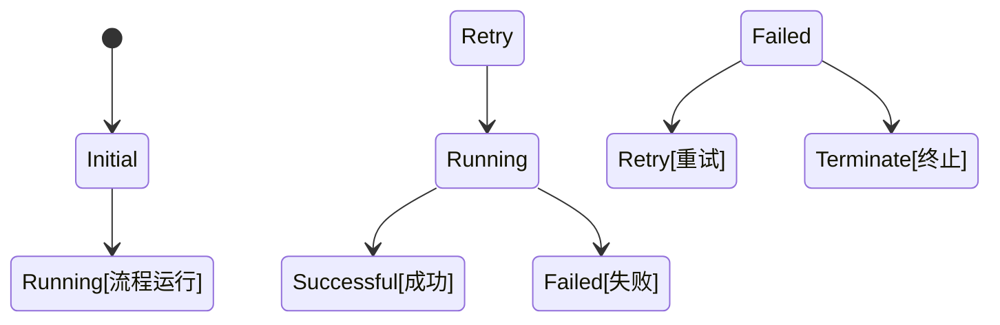
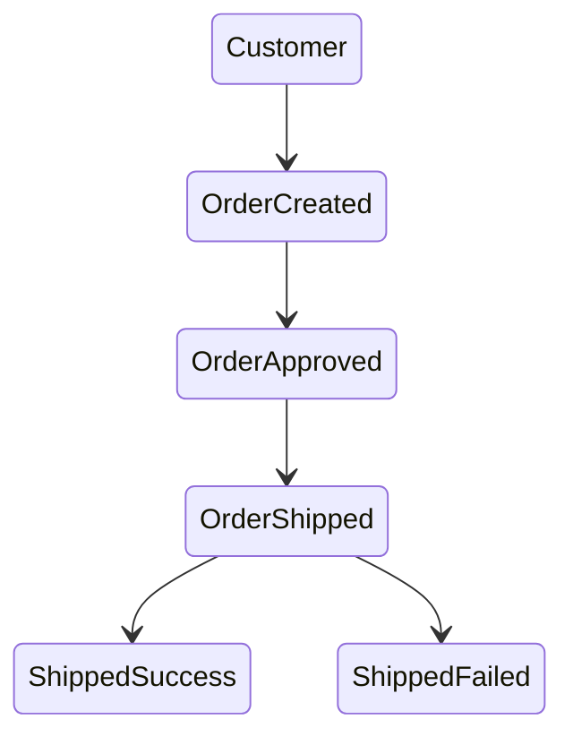
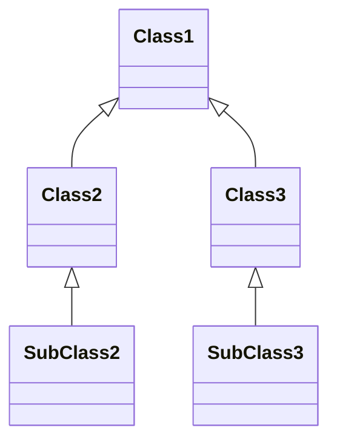
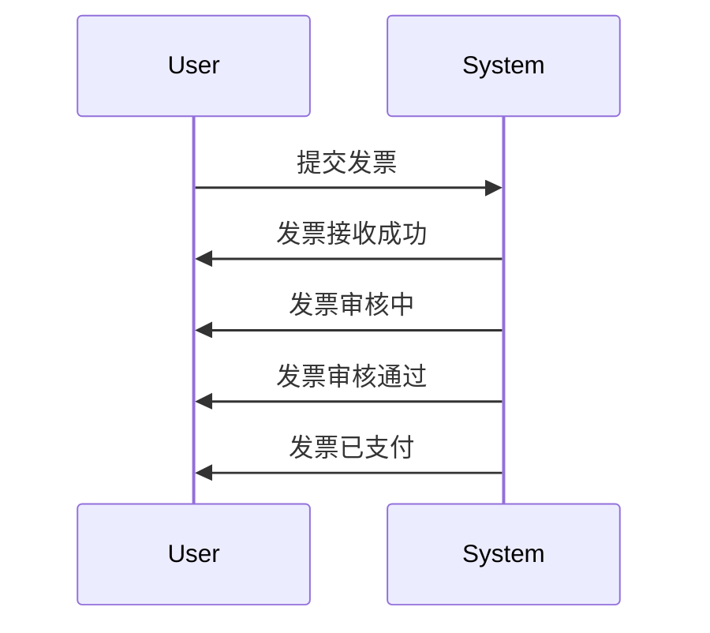
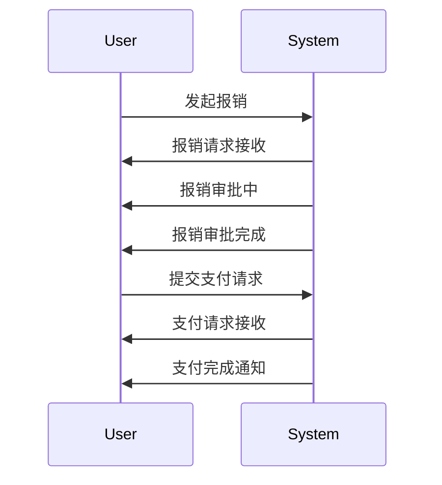

                 

### 第1章：企业流程自动化背景与重要性

#### 1.1 企业流程自动化的概念

企业流程自动化是指利用信息技术手段，通过软件工具自动执行一系列业务流程中的任务。其核心目的是通过减少人工干预，提高业务流程的效率、准确性和一致性。企业流程自动化不仅涵盖日常办公流程，如邮件处理、日程安排等，还涉及财务、人力资源、供应链管理等多个关键业务领域。

**核心概念术语说明：**

- **流程（Process）：** 指一组有序的任务和活动，它们共同完成一个特定目标。
- **自动化（Automation）：** 指通过技术手段，将重复性、规则性任务从人工操作转变为机器自动执行。
- **软件工具（Software Tools）：** 指用于实现流程自动化的软件产品，如RPA（机器人流程自动化）工具。

**问题背景：**

随着企业规模的扩大和业务复杂度的增加，传统的手工操作方式已经无法满足高效率、高准确性的要求。同时，人工干预容易导致错误和效率低下，成为企业发展的瓶颈。为了解决这些问题，企业流程自动化应运而生。

**问题描述：**

企业流程自动化旨在解决以下问题：

- **效率问题：** 手动操作速度慢，且容易出错，导致工作效率低下。
- **准确性问题：** 人工操作难以保证数据的一致性和准确性。
- **成本问题：** 随着企业规模的扩大，人工成本逐渐增加。

**问题解决：**

通过企业流程自动化，可以：

- **提高效率：** 软件工具自动执行任务，减少人工干预。
- **提高准确性：** 规则性任务由机器执行，减少人为错误。
- **降低成本：** 减少对人工的依赖，降低运营成本。

**边界与外延：**

- **边界：** 企业流程自动化主要关注内部业务流程的自动化，不涉及外部业务流程，如市场销售等。
- **外延：** 企业流程自动化不仅限于单一任务的自动化，还可以实现整个业务流程的自动化，从而提高整体运营效率。

**概念结构与核心要素组成：**

- **流程设计：** 设计业务流程，明确任务和活动的顺序。
- **软件工具选择：** 选择适合的自动化软件工具，如RPA工具。
- **实施与部署：** 实现流程自动化，确保软件工具与现有系统无缝集成。
- **监控与优化：** 监控自动化流程的执行情况，进行持续优化。

通过以上步骤，企业可以实现流程自动化，从而提高运营效率、降低成本，并减少人为错误。下面我们将进一步探讨流程自动化的应用场景和技术基础。

---

**核心概念原理：**

企业流程自动化通过软件工具将一系列业务流程中的任务自动执行，主要原理包括：

- **规则引擎：** 定义业务规则，控制任务执行流程。
- **数据集成：** 将不同系统中的数据整合，提供统一的数据源。
- **用户界面：** 提供交互界面，供用户监控和操作自动化流程。

**概念属性特征对比表格：**

| 特征         | 描述                                                         | 对比               |
| ------------ | ------------------------------------------------------------ | ----------------- |
| **规则性**   | 自动化流程基于预设规则执行，无需人工干预。                     | 非规则性任务无法自动化 |
| **一致性**   | 自动化流程保证数据的一致性和准确性，减少人为错误。             | 人为操作可能导致数据不一致 |
| **可扩展性** | 自动化流程容易扩展，支持新任务和新系统的集成。                 | 传统手工操作扩展性差 |
| **灵活性**   | 可以根据业务需求调整和优化自动化流程。                       | 传统手工操作灵活性差 |

**ER实体关系图架构：**

```mermaid
erDiagram
  Customer ||--|{ Order }|--|| Product
  Product  ||--|{ Review }|--|| Customer
  Order    ||--|{ Payment }|--|| Customer
```

在上面的ER图架构中，展示了企业流程自动化涉及的主要实体及其关系。客户（Customer）与订单（Order）和产品（Product）存在关系，订单与支付（Payment）存在关系，产品与评价（Review）也存在关系。

---

**算法原理讲解：**

在流程自动化中，常用的算法包括状态机算法和规则引擎算法。

**状态机算法：**

状态机是一种用于描述有限状态转换的算法，用于控制自动化流程的执行。

**Mermaid流程图：**



在上述流程图中，初始状态（Initial）会转换到运行状态（Running），运行状态根据流程执行结果（成功或失败）会进一步转换到成功状态（Successful）或失败状态（Failed）。失败状态可以重试（Retry），直至成功或终止（Terminate）。

**Python源代码：**

```python
class StateMachine:
    def __init__(self):
        self.state = "Initial"

    def run(self):
        if self.state == "Initial":
            self.state = "Running"
            print("流程开始运行。")
        elif self.state == "Running":
            result = self.execute()
            if result == "Success":
                self.state = "Successful"
                print("流程成功完成。")
            else:
                self.state = "Failed"
                print("流程执行失败。")

    def execute(self):
        # 执行流程的具体任务
        return "Success"

    def retry(self):
        self.state = "Running"
        print("流程正在重试。")

sm = StateMachine()
sm.run()
sm.retry()
```

上述代码定义了一个简单的状态机，通过`run`方法启动流程，`execute`方法执行具体任务，`retry`方法重试流程。

**数学模型和公式：**

状态机算法中，常用的数学模型是状态转移图（State Transition Diagram，STD）。STD可以用以下公式表示：

\[ STD = \{ S, I, F, \delta \} \]

其中：
- \( S \) 是状态集合。
- \( I \) 是初始状态。
- \( F \) 是终止状态集合。
- \( \delta \) 是状态转移函数，定义了当前状态和输入条件下下一个状态。

**举例说明：**

假设有一个订单处理流程，包括订单创建、订单审核、订单发货等状态。初始状态是“订单创建”，终止状态是“订单发货成功”或“订单发货失败”。



在上述示例中，订单创建状态（OrderCreated）转换到订单审核状态（OrderApproved），然后转换到订单发货状态（OrderShipped）。订单发货成功状态（ShippedSuccess）是终止状态，订单发货失败状态（ShippedFailed）可以重试。

---

**系统分析与架构设计方案：**

**问题场景介绍：**

某企业需要实现财务流程自动化，包括发票处理、报销审批、账单支付等任务。

**项目介绍：**

项目名称：财务流程自动化系统

项目目标：通过RPA工具实现财务流程自动化，提高工作效率和准确性。

**系统功能设计（领域模型Mermaid类图）：**



在上面的类图中，Class1、Class2和Class3是主要的类，SubClass2和SubClass3是子类。这些类代表了财务流程自动化系统的各个模块，如发票处理模块、报销审批模块和账单支付模块。

**系统架构设计（Mermaid架构图）：**



在上面的序列图中，用户向系统提交发票，系统接收发票并进行审核，审核通过后，系统自动完成支付。

**系统接口设计和系统交互（Mermaid序列图）：**



在上面的序列图中，用户发起报销请求，系统接收并处理报销请求，审批完成后，用户提交支付请求，系统完成支付并通知用户。

---

**项目实战：**

**环境安装：**

1. 安装Python环境（Python 3.8及以上版本）
2. 安装RPA工具（如UIPath）

**系统核心实现源代码：**

```python
# 发票处理模块
def process_invoice(invoice_data):
    # 处理发票数据
    print("发票处理中...")
    # 审核发票
    approve_invoice(invoice_data)

# 报销审批模块
def process_reimbursement(reimbursement_data):
    # 处理报销数据
    print("报销审批中...")
    # 审批报销
    approve_reimbursement(reimbursement_data)

# 账单支付模块
def process_payment(payment_data):
    # 处理支付数据
    print("支付处理中...")
    # 完成支付
    complete_payment(payment_data)

# 辅助函数
def approve_invoice(invoice_data):
    # 审核发票的具体实现
    print("发票审核通过。")

def approve_reimbursement(reimbursement_data):
    # 审批报销的具体实现
    print("报销审批通过。")

def complete_payment(payment_data):
    # 完成支付的具体实现
    print("支付完成。")
```

**代码应用解读与分析：**

上述代码实现了三个核心功能模块：发票处理、报销审批和账单支付。每个模块都有具体的处理逻辑，并通过辅助函数实现具体操作。

- **发票处理模块**：接收发票数据，处理发票，并调用审核发票的函数。
- **报销审批模块**：接收报销数据，处理报销，并调用审批报销的函数。
- **账单支付模块**：接收支付数据，处理支付，并调用完成支付的函数。

**实际案例分析和详细讲解剖析：**

假设企业收到一张发票，用户提交报销申请，并有一张账单需要支付。系统将按照以下流程执行：

1. **发票处理**：系统接收发票数据，处理发票信息，并调用审核发票的函数。
    ```python
    process_invoice(invoice_data)
    ```
2. **报销审批**：系统接收报销数据，处理报销信息，并调用审批报销的函数。
    ```python
    process_reimbursement(reimbursement_data)
    ```
3. **账单支付**：系统接收支付数据，处理支付信息，并调用完成支付的函数。
    ```python
    process_payment(payment_data)
    ```

通过这三个模块的协同工作，企业实现了财务流程的自动化，提高了工作效率和准确性。

**项目小结：**

通过实际案例，我们可以看到企业流程自动化系统的实现过程。关键在于设计清晰的功能模块，并确保模块之间的数据传递和功能调用无缝衔接。这种自动化系统能够显著提高企业运营效率，降低人力成本，并减少人为错误。

---

**最佳实践 Tips：**

1. **明确业务需求：** 在实施流程自动化之前，需要明确业务需求，确定哪些流程可以自动化，以及自动化后的效果预期。
2. **选择合适工具：** 根据业务需求选择合适的RPA工具，确保工具能够满足自动化需求。
3. **持续优化：** 自动化流程实施后，需要持续监控和优化，根据业务变化调整自动化策略。

**小结：**

企业流程自动化是企业数字化转型的重要一环，通过引入自动化技术，可以提高工作效率、降低运营成本、减少人为错误。本文详细介绍了企业流程自动化的概念、背景、实施策略和案例分析，为企业在实现流程自动化提供了理论和实践指导。

**注意事项：**

1. **数据安全：** 在实施流程自动化时，确保数据的安全和隐私保护。
2. **人员培训：** 自动化实施过程中，需要对相关人员提供培训，确保他们能够适应自动化工作流程。
3. **系统兼容性：** 确保自动化系统与现有系统的兼容性，避免因系统不兼容导致的问题。

**拓展阅读：**

- 《RPA：流程自动化实践指南》
- 《机器人流程自动化：从入门到实战》
- 《人工智能与RPA融合应用》

---

**作者信息：**

作者：AI天才研究院/AI Genius Institute & 禅与计算机程序设计艺术 /Zen And The Art of Computer Programming

---

通过本章的内容，我们了解了企业流程自动化的背景、重要性、核心概念、技术基础和实施策略。在接下来的章节中，我们将通过具体案例解析，进一步探讨流程自动化的应用和效果。希望您在阅读过程中能够有所收获。

