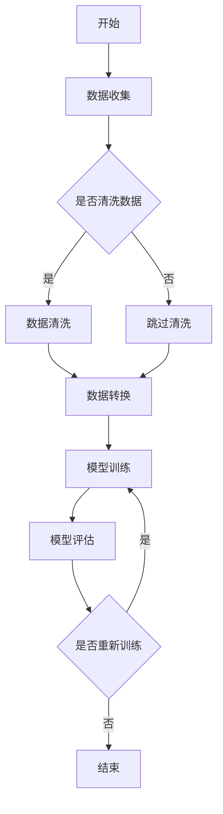

                 

# 机器学习在个性化健康风险评估中的应用

## 关键词

机器学习，个性化健康风险评估，健康数据，数据预处理，特征工程，模型评估，算法优化，应用案例

## 摘要

随着健康意识的提升和数据科学技术的进步，机器学习在个性化健康风险评估中的应用日益广泛。本文旨在探讨机器学习技术如何通过数据预处理、特征工程、模型训练与评估等步骤，实现对个体健康风险的精准预测。文章首先介绍了机器学习的基本概念和个性化健康风险评估的重要性，随后详细分析了常见机器学习算法及其应用，最后通过具体案例展示了机器学习在健康风险评估中的实际应用效果，并对未来的发展趋势进行了展望。

---

### 引言与背景

个性化健康风险评估是一个新兴的领域，它结合了医学、统计学和计算机科学，旨在通过分析个体的生物信息和生活习惯等数据，预测个体患病的风险，为健康管理和预防提供科学依据。

#### 1.1 问题背景

健康风险是指个体在未来一段时间内患上某种疾病或出现健康问题的可能性。传统的健康风险评估方法主要依赖于流行病学数据和大样本统计，其预测结果往往缺乏个体化特征，无法准确反映每个个体的健康状况。而随着大数据和人工智能技术的发展，利用机器学习算法进行个性化健康风险评估成为可能。

#### 1.2 机器学习概述

机器学习是一种通过数据驱动的方法，使计算机具备从数据中学习和做出决策的能力。根据学习方式的不同，机器学习可以分为监督学习、无监督学习和半监督学习。监督学习通过已知标签的数据进行训练，无监督学习则从无标签的数据中发现模式和结构，半监督学习结合了监督学习和无监督学习的特点。

#### 1.3 个性化健康风险评估的挑战

个性化健康风险评估面临以下挑战：

- **数据多样性**：健康数据包括结构化数据（如医疗记录）和非结构化数据（如医疗影像），这些数据的多样性增加了数据处理和分析的难度。
- **数据质量**：健康数据往往存在噪声、缺失值和异常值，这些都会影响模型的准确性。
- **模型解释性**：许多机器学习模型，尤其是深度学习模型，具有较高的预测准确性，但其内部决策过程复杂，难以解释。
- **隐私保护**：健康数据是敏感信息，如何在保障隐私的前提下进行数据处理和分析是一个重要问题。

### 机器学习基础

在深入了解个性化健康风险评估之前，我们需要先掌握机器学习的基础知识。

#### 2.1 机器学习基本概念

机器学习的基本概念包括：

- **模型**：机器学习模型是一个函数，它将输入特征映射到输出标签。
- **特征**：特征是用于训练模型的变量，如身高、体重、年龄等。
- **标签**：标签是模型的输出，通常是二分类或多分类的结果，如患病或未患病。
- **损失函数**：损失函数用于衡量模型预测与实际结果之间的差距。

#### 2.2 数据预处理

数据预处理是机器学习中的重要步骤，它包括以下任务：

- **数据清洗**：去除噪声、填补缺失值、处理异常值。
- **数据转换**：将数据转换为适合模型训练的格式，如归一化、标准化。
- **数据降维**：通过主成分分析（PCA）等方法减少数据维度。

#### 2.3 分类与回归算法

分类算法用于将数据分为不同的类别，常见的分类算法有：

- **逻辑回归**：用于二分类问题。
- **决策树**：通过树形结构进行分类。
- **随机森林**：基于决策树的集成学习方法。
- **支持向量机**（SVM）：通过最大化分类间隔进行分类。

回归算法用于预测连续值，常见的回归算法有：

- **线性回归**：通过线性模型进行预测。
- **岭回归**：通过正则化避免过拟合。
- **LASSO回归**：通过L1正则化进行特征选择。

#### 2.4 监督学习、无监督学习和半监督学习

- **监督学习**：使用已知标签的数据进行训练。
- **无监督学习**：从无标签的数据中发现模式和结构。
- **半监督学习**：结合监督学习和无监督学习的特点，利用少量标签数据和大量无标签数据。

### 个性化健康风险评估模型

个性化健康风险评估模型是机器学习在健康领域的具体应用。以下是构建和优化这种模型的步骤：

#### 3.1 模型构建

模型构建包括以下步骤：

- **数据收集**：收集与疾病相关的生物信息、生活习惯等数据。
- **数据预处理**：对收集到的数据进行清洗、转换和降维。
- **特征选择**：选择对疾病预测有显著影响的特征。
- **模型选择**：根据数据特点和业务需求选择合适的模型。

#### 3.2 特征工程

特征工程是提高模型性能的关键步骤，包括以下任务：

- **特征提取**：从原始数据中提取新的特征。
- **特征选择**：选择对模型预测有显著影响的特征。
- **特征组合**：通过组合不同特征生成新的特征。

#### 3.3 模型训练与评估

模型训练与评估包括以下步骤：

- **模型训练**：使用训练数据对模型进行训练。
- **模型评估**：使用验证集评估模型性能，常用的评估指标有准确率、召回率、F1分数等。
- **模型调参**：通过调整模型参数优化模型性能。

#### 3.4 模型优化

模型优化包括以下策略：

- **交叉验证**：通过交叉验证避免过拟合。
- **模型融合**：结合多个模型提高预测准确性。
- **特征重要性分析**：分析特征对模型预测的影响，排除无关特征。

### 模型评估与优化

模型评估与优化是确保模型性能的关键步骤。以下是评估与优化模型的常见方法：

#### 4.1 评估指标

常用的评估指标有：

- **准确率**：预测正确的样本占总样本的比例。
- **召回率**：预测正确的正样本占总正样本的比例。
- **F1分数**：准确率和召回率的调和平均。
- **ROC曲线**：通过真阳性率与假阳性率绘制的曲线评估模型性能。

#### 4.2 模型调参

模型调参包括以下方法：

- **网格搜索**：通过遍历参数空间找到最优参数。
- **贝叶斯优化**：利用贝叶斯优化算法自动搜索最优参数。
- **随机搜索**：随机选择参数组合进行优化。

#### 4.3 模型融合

模型融合包括以下方法：

- **集成学习**：结合多个模型的预测结果提高准确性。
- ** stacking**：通过分层方法整合多个模型。

### 应用案例

以下是一些个性化健康风险评估的应用案例：

#### 5.1 糖尿病风险评估

糖尿病是一种常见的慢性疾病，早期预测对患者的健康管理至关重要。通过机器学习算法，可以分析患者的生物信息和生活习惯，预测其患糖尿病的风险。

#### 5.2 心血管疾病预测

心血管疾病是导致死亡的主要原因之一，通过机器学习算法，可以预测患者患心血管疾病的风险，为医生制定治疗方案提供依据。

#### 5.3 癌症早期筛查

癌症早期筛查是提高癌症治愈率的关键，通过机器学习算法，可以分析患者的生物标志物和影像数据，预测其患癌症的风险。

### 实践指南与建议

以下是一些实践指南和建议：

#### 6.1 数据获取与处理

- **数据来源**：可以从医疗机构、健康APP、社交媒体等渠道获取健康数据。
- **数据处理**：进行数据清洗、转换和降维，确保数据质量。

#### 6.2 算法选择与实现

- **算法选择**：根据数据特点和业务需求选择合适的算法。
- **算法实现**：使用Python、R等编程语言实现算法。

#### 6.3 模型部署与维护

- **模型部署**：将训练好的模型部署到生产环境，提供预测服务。
- **模型维护**：定期更新数据和模型，确保预测准确性。

### 总结与展望

个性化健康风险评估是机器学习在医疗领域的重要应用，通过数据驱动的方法，可以实现对个体健康风险的精准预测。随着人工智能技术的不断发展，个性化健康风险评估将变得更加精确和高效，为健康管理和疾病预防提供强有力的支持。

### 参考文献

1. 吴军. 机器学习 [M]. 清华大学出版社，2017.
2. 周志华. 机器学习 [M]. 清华大学出版社，2016.
3. James, G., Witten, D., Hastie, T., & Tibshirani, R. (2013). An Introduction to Statistical Learning with Applications in R [M]. Springer.
4. Kotsiantis, S. (2007). Supervised machine learning: A review of classification techniques [J]. Informatica, 31(3), 249-268.

---

作者：AI天才研究院/AI Genius Institute & 禅与计算机程序设计艺术 /Zen And The Art of Computer Programming

---

### 附录

本文中的算法流程图、数学公式和架构图均采用Markdown中的Mermaid语法编写，具体示例如下：

#### Mermaid算法流程图示例



#### LaTeX数学公式示例

```markdown
$$
E = mc^2
$$

$1 + 1 = 2$
```

通过使用Mermaid和LaTeX，本文不仅展示了机器学习在个性化健康风险评估中的应用，还提供了详细的算法流程和数学公式，帮助读者更好地理解和掌握相关技术。

---

### 注意事项

1. **数据隐私**：在实际应用中，确保数据隐私和安全是至关重要的，应遵循相关法律法规和道德规范。
2. **模型解释性**：尽管深度学习模型在准确性上有显著优势，但其解释性较差。在实际应用中，应结合模型解释性进行选择。
3. **持续更新**：健康数据不断变化，定期更新数据和模型是确保预测准确性的关键。

---

### 拓展阅读

1. **健康数据挖掘**：[《健康数据挖掘：方法与应用》](https://book.douban.com/subject/30274777/)
2. **机器学习实践**：[《机器学习实践》](https://book.douban.com/subject/26899833/)
3. **医疗人工智能**：[《医疗人工智能：未来医疗的变革者》](https://book.douban.com/subject/30888197/)

---

本文通过详细的步骤和分析，探讨了机器学习在个性化健康风险评估中的应用，展示了技术的实际价值和潜在挑战。希望读者能从中获得启发，为健康管理和疾病预防贡献自己的力量。

