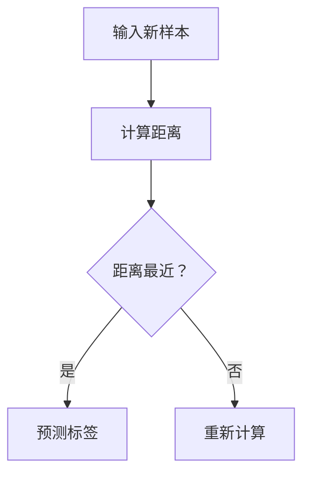
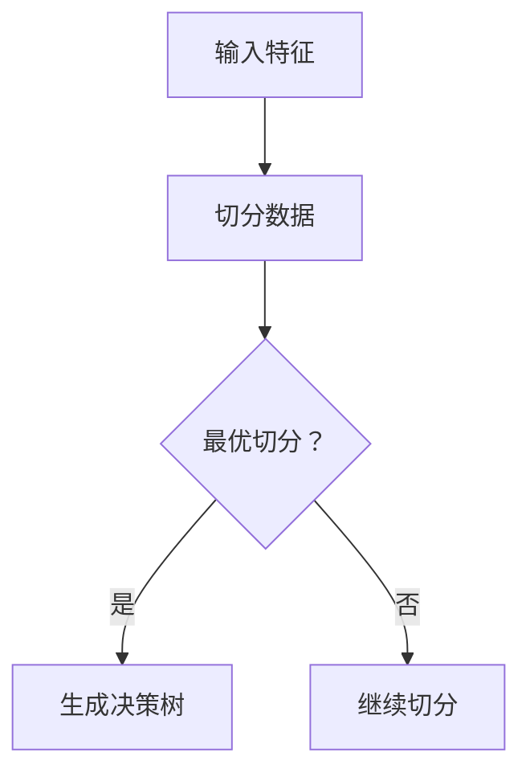
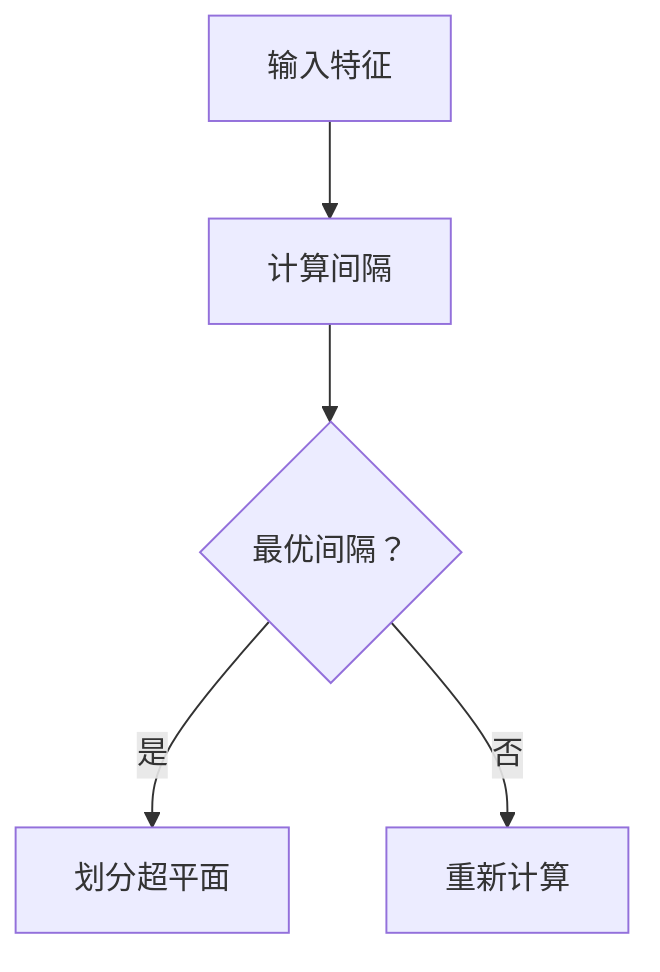
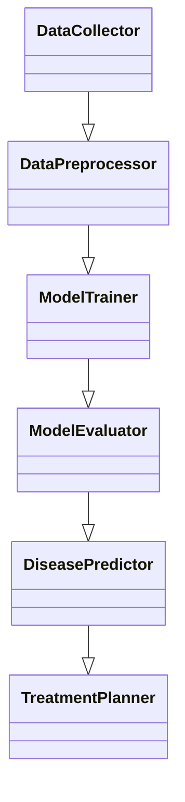
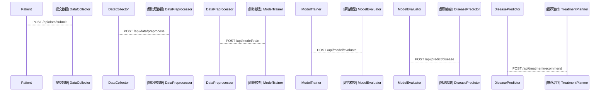
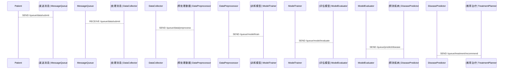
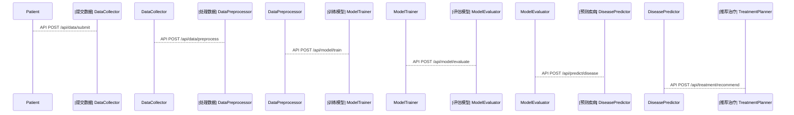

                 

# 机器学习在个性化医疗中的预测性应用

## 关键词：机器学习，个性化医疗，预测性应用，算法，医学数据分析

> **摘要**：本文将探讨机器学习在个性化医疗中的预测性应用，通过分析监督学习、无监督学习和半监督学习的原理及其应用场景，详细介绍常见的机器学习算法，如K近邻算法、决策树算法和支持向量机算法。文章还将探讨个性化医疗的应用范围、机器学习算法的发展趋势和未来展望，为读者提供一个全面了解机器学习在个性化医疗领域应用的技术博客。

## 第一部分：引言

### 1.1 问题背景

#### 1.1.1 个性化医疗的兴起

个性化医疗，也被称为精准医疗，是一种以患者为中心，结合个体基因信息、生活方式和环境因素，制定出最适合患者的诊疗方案。个性化医疗的目标是提高治疗效果，减少副作用，降低医疗成本，为患者提供更加高效、安全的医疗服务。近年来，随着医学大数据、生物技术和计算技术的发展，个性化医疗逐渐成为医学研究的重要方向。

#### 1.1.2 机器学习在医疗领域的应用

机器学习是人工智能的一个重要分支，通过训练数据集来构建模型，从而实现对未知数据的预测和分析。机器学习在医疗领域具有广泛的应用，包括疾病预测、诊断辅助、药物研发、医疗资源分配等。随着医疗数据的积累和算法的进步，机器学习在个性化医疗中的应用也越来越广泛。

#### 1.1.3 预测性应用在个性化医疗中的重要性

预测性应用在个性化医疗中扮演着重要角色。通过预测患者未来的健康状况、疾病风险和治疗反应，医生可以提前制定出针对性的诊疗方案，提高治疗效果，减少医疗资源的浪费。例如，预测性模型可以预测患者是否需要住院治疗，预测某种药物是否对特定患者有效，从而优化医疗资源配置。

### 1.2 问题描述

#### 1.2.1 预测性应用的挑战

预测性应用在个性化医疗中面临着一系列挑战，包括数据质量、模型选择、算法优化和实际应用效果。高质量的数据是构建准确预测模型的基础，但医疗数据往往存在噪声、缺失和异构性。此外，机器学习算法的选择和优化对于预测模型的准确性至关重要，但不同算法适用于不同的场景，需要根据具体问题进行选择和调整。

#### 1.2.2 数据与模型的重要性

数据与模型在预测性应用中扮演着核心角色。高质量的数据是预测模型的基础，而准确的模型则是实现预测的关键。然而，在个性化医疗中，数据往往是异构的、不完整的，甚至存在噪声。这就要求我们采用先进的数据处理技术和模型优化方法，以提高预测的准确性。

#### 1.2.3 个性化医疗的边界与外延

个性化医疗不仅涉及疾病的预测和诊断，还包括治疗方案的制定、药物研发和健康管理等方面。个性化医疗的边界和外延随着技术的发展和医学研究的深入而不断扩展，未来有望实现全面、系统、精准的个性化医疗服务。

### 1.3 问题解决

#### 1.3.1 机器学习算法的核心概念

机器学习算法的核心概念包括监督学习、无监督学习和半监督学习。监督学习通过标注数据来训练模型，无监督学习通过未标注数据发现数据中的规律，半监督学习则结合标注数据和未标注数据训练模型。不同类型的算法适用于不同的应用场景，需要根据具体问题进行选择。

#### 1.3.2 常见机器学习算法简介

常见的机器学习算法包括K近邻算法、决策树算法、支持向量机算法、神经网络算法等。这些算法在个性化医疗中有着广泛的应用。例如，K近邻算法可以用于疾病预测，决策树算法可以用于诊断辅助，支持向量机算法可以用于药物研发。

#### 1.3.3 个性化医疗中的典型应用场景

个性化医疗中的典型应用场景包括疾病预测、诊断辅助、治疗规划、药物研发、健康管理等方面。通过预测患者未来的健康状况、疾病风险和治疗反应，个性化医疗可以为患者提供更加精准、高效的医疗服务。

### 1.4 边界与外延

#### 1.4.1 个性化医疗的应用范围

个性化医疗的应用范围广泛，包括肿瘤学、心血管疾病、遗传病、神经疾病等多个领域。随着技术的进步，个性化医疗的应用范围还将不断扩展，为更多患者带来福音。

#### 1.4.2 机器学习算法的发展趋势

机器学习算法的发展趋势包括深度学习、迁移学习、生成对抗网络等。这些算法在个性化医疗中的应用将不断提高预测的准确性和效率，推动个性化医疗的发展。

#### 1.4.3 个性化医疗的未来展望

个性化医疗的未来展望包括全面、系统、精准的个性化医疗服务，以及与人工智能、大数据、云计算等技术的深度融合。未来，个性化医疗有望实现真正的个性化，为患者提供更加优质、高效的医疗服务。

### 1.5 本章小结

本文介绍了个性化医疗的背景和机器学习在其中的应用，分析了预测性应用的挑战和解决方法，并探讨了个性化医疗的未来发展趋势。下一章将深入探讨机器学习算法的原理和应用，为读者提供更全面的技术分析。

## 第二部分：核心概念与联系

### 2.1 机器学习算法原理

#### 2.1.1 监督学习

监督学习是一种通过已标注的数据集训练模型，从而对未知数据进行预测的方法。监督学习的核心思想是学习一个映射函数，将输入特征映射到输出标签。常见的监督学习算法包括线性回归、逻辑回归、支持向量机、决策树、随机森林、K近邻等。

#### 2.1.1.1 定义

监督学习是一种从已有数据中学习映射关系的过程，通过输入特征和输出标签之间的关联，建立一个预测模型。

$$
y = f(x)
$$

其中，$y$ 为输出标签，$x$ 为输入特征，$f$ 为映射函数。

#### 2.1.1.2 原理

监督学习的原理是通过已知的输入和输出数据，学习一个函数来预测未知数据的标签。这个过程通常分为训练和测试两个阶段。在训练阶段，模型通过学习输入和输出之间的关系，调整模型的参数。在测试阶段，模型对未知数据进行预测，评估模型的准确性。

#### 2.1.1.3 应用场景

监督学习在个性化医疗中有着广泛的应用，例如疾病预测、诊断辅助、治疗规划等。通过学习患者的历史数据和健康指标，可以预测患者未来的健康状况，为医生提供决策依据。

#### 2.1.2 无监督学习

无监督学习是一种通过未标注的数据集发现数据中的规律和结构的方法。无监督学习的核心思想是学习数据中的分布，而不是预测输出标签。常见的无监督学习算法包括聚类、降维、关联规则挖掘等。

#### 2.1.2.1 定义

无监督学习是一种在没有标注数据的情况下，通过学习数据中的内在结构来发现数据模式的过程。

$$
\text{数据分布} = f(\text{数据})
$$

其中，$f$ 为映射函数。

#### 2.1.2.2 原理

无监督学习的原理是通过分析数据之间的相似性或差异性，将数据划分为不同的类别或簇。这个过程通常不需要标签信息，而是通过数据本身的特点来学习数据分布。

#### 2.1.2.3 应用场景

无监督学习在个性化医疗中可以用于疾病分类、基因组学研究、药物研发等领域。通过无监督学习算法，可以发现患者数据中的潜在模式，为医生提供新的诊断和治疗思路。

#### 2.1.3 半监督学习

半监督学习是一种结合标注数据和未标注数据来训练模型的方法。半监督学习的核心思想是利用未标注数据来提高模型的泛化能力。

#### 2.1.3.1 定义

半监督学习是一种在部分数据有标签、部分数据无标签的情况下，利用未标注数据来提高模型性能的方法。

$$
y_{\text{标签}} = f(x_{\text{标签}}, x_{\text{未标签}})
$$

其中，$x_{\text{标签}}$ 为有标签的数据，$x_{\text{未标签}}$ 为无标签的数据，$y_{\text{标签}}$ 为输出标签。

#### 2.1.3.2 原理

半监督学习的原理是利用未标注数据提供的信息来辅助模型训练，从而提高模型的泛化能力。通常，半监督学习算法会通过以下几种方法来利用未标注数据：

1. **一致性正则化**：对模型的预测进行约束，确保在有标签和无标签数据上的预测结果一致。
2. **伪标签**：利用有标签数据对未标注数据进行标注，然后使用这些伪标签来训练模型。
3. **聚类**：通过聚类算法将未标注数据分为不同的簇，然后对每个簇分别训练模型。

#### 2.1.3.3 应用场景

半监督学习在个性化医疗中可以用于基因组学研究、医疗图像分析等领域。通过半监督学习算法，可以利用大量的未标注数据来提高模型的性能，从而更好地发现患者数据中的潜在模式。

### 2.2 机器学习算法属性特征对比表格

| 算法类型 | 算法特点 | 适用场景 |
| -------- | -------- | -------- |
| 监督学习 | 需要标注数据 | 疾病预测、诊断辅助 |
| 无监督学习 | 不需要标注数据 | 疾病分类、基因组学 |
| 半监督学习 | 结合标注数据和未标注数据 | 基因组学、医疗图像分析 |

### 2.3 ER实体关系图架构

```mermaid
graph ER
  A[患者] -- B[病历]
  B -- C[医生]
  C -- D[治疗方案]
```

在这个ER实体关系图中，患者（A）拥有病历（B），病历（B）关联到医生（C），医生（C）负责制定治疗方案（D）。这个图展示了个性化医疗中主要实体的关系，以及它们之间的关联。

## 第三部分：算法原理讲解

### 3.1 算法原理与mermaid流程图

#### 3.1.1 K近邻算法

K近邻算法（K-Nearest Neighbors, KNN）是一种简单的监督学习算法，通过计算测试样本在训练样本集中的K个最近邻居，并基于这些邻居的标签来预测测试样本的标签。



1. **输入新样本**：给定一个新样本，需要预测其标签。
2. **计算距离**：计算新样本与训练集中每个样本之间的距离（例如欧氏距离、曼哈顿距离等）。
3. **距离最近**：选择距离最近的K个样本。
4. **预测标签**：根据K个最近邻居的标签，使用多数投票法预测新样本的标签。
5. **重新计算**：如果距离最近的样本不足K个，则重新计算距离。

#### 3.1.2 决策树算法

决策树（Decision Tree）算法通过一系列的if-else条件判断来分割数据集，构建一个树形结构。每个内部节点表示一个特征，每个分支表示该特征的某个取值，每个叶节点表示一个类标签。



1. **输入特征**：给定一个特征集合。
2. **切分数据**：计算每个特征的不同取值，并计算每个切分的增益（例如信息增益、基尼不纯度等）。
3. **最优切分**：选择增益最大的特征进行切分。
4. **生成决策树**：将切分后的数据集划分为不同的子集，并在每个子集上递归地生成决策树。
5. **继续切分**：如果当前节点还有剩余数据，则继续切分。

#### 3.1.3 支持向量机算法

支持向量机（Support Vector Machine, SVM）算法通过找到一个最优的超平面，将不同类别的数据分开。SVM的核心是求解一个二次规划问题，找到最优的决策边界。



1. **输入特征**：给定一个特征集合。
2. **计算间隔**：计算不同类别的数据点与超平面之间的距离。
3. **最优间隔**：选择最大的间隔作为最优超平面。
4. **划分超平面**：根据最优间隔划分数据集。
5. **重新计算**：如果间隔不足，则重新计算间隔。

### 3.2 Python源代码讲解

#### 3.2.1 K近邻算法

```python
from sklearn.neighbors import KNeighborsClassifier
from sklearn.datasets import load_iris
from sklearn.model_selection import train_test_split

# 加载数据集
iris = load_iris()
X_train, X_test, y_train, y_test = train_test_split(iris.data, iris.target, test_size=0.3, random_state=42)

# 创建K近邻分类器
knn = KNeighborsClassifier(n_neighbors=3)
knn.fit(X_train, y_train)

# 预测测试集
predictions = knn.predict(X_test)

# 计算准确率
accuracy = knn.score(X_test, y_test)
print(f"Accuracy: {accuracy}")
```

这个示例使用Scikit-learn库实现了K近邻算法。首先，加载数据集，然后创建K近邻分类器，使用训练集进行拟合，最后使用测试集进行预测并计算准确率。

#### 3.2.2 决策树算法

```python
from sklearn.tree import DecisionTreeClassifier
from sklearn.datasets import load_iris
from sklearn.model_selection import train_test_split

# 加载数据集
iris = load_iris()
X_train, X_test, y_train, y_test = train_test_split(iris.data, iris.target, test_size=0.3, random_state=42)

# 创建决策树分类器
dt = DecisionTreeClassifier()
dt.fit(X_train, y_train)

# 预测测试集
predictions = dt.predict(X_test)

# 计算准确率
accuracy = dt.score(X_test, y_test)
print(f"Accuracy: {accuracy}")
```

这个示例使用Scikit-learn库实现了决策树算法。首先，加载数据集，然后创建决策树分类器，使用训练集进行拟合，最后使用测试集进行预测并计算准确率。

#### 3.2.3 支持向量机算法

```python
from sklearn.svm import SVC
from sklearn.datasets import load_iris
from sklearn.model_selection import train_test_split

# 加载数据集
iris = load_iris()
X_train, X_test, y_train, y_test = train_test_split(iris.data, iris.target, test_size=0.3, random_state=42)

# 创建支持向量机分类器
svm = SVC()
svm.fit(X_train, y_train)

# 预测测试集
predictions = svm.predict(X_test)

# 计算准确率
accuracy = svm.score(X_test, y_test)
print(f"Accuracy: {accuracy}")
```

这个示例使用Scikit-learn库实现了支持向量机算法。首先，加载数据集，然后创建支持向量机分类器，使用训练集进行拟合，最后使用测试集进行预测并计算准确率。

### 3.3 算法原理与数学模型

#### 3.3.1 K近邻算法

K近邻算法的核心思想是“相似性原则”，即相似的样本倾向于有相似的标签。假设我们有一个训练集$\{x_1, x_2, ..., x_n\}$和对应的标签$\{y_1, y_2, ..., y_n\}$，给定一个新样本$x$，我们需要预测它的标签。

1. **距离计算**：计算新样本$x$与训练集中每个样本$x_i$之间的距离，常用的距离度量包括欧氏距离、曼哈顿距离和切比雪夫距离等。以欧氏距离为例，计算公式如下：

$$
d(x, x_i) = \sqrt{\sum_{j=1}^{n}(x_j - x_{ij})^2}
$$

其中，$x_j$为$x$的第$j$个特征值，$x_{ij}$为$x_i$的第$j$个特征值。

2. **邻居选择**：选择距离$x$最近的$K$个邻居，记为$\{x_1, x_2, ..., x_K\}$。

3. **标签预测**：计算这$K$个邻居的标签，然后使用多数投票法预测新样本$x$的标签。

$$
\hat{y} = \text{mode}(\{y_1, y_2, ..., y_K\})
$$

其中，$\text{mode}$表示取众数。

#### 3.3.2 决策树算法

决策树算法通过递归地将数据集分割成具有最小杂质（例如信息增益或基尼不纯度）的子集，直到满足停止条件（例如叶节点包含的样本数量少于某个阈值或最大树深度达到某个值）。

1. **特征选择**：选择具有最大增益的特征进行分割。
2. **数据分割**：根据选定特征的取值，将数据集分割成不同的子集。
3. **递归构建**：对每个子集递归地执行步骤1和步骤2，直到满足停止条件。

决策树的数学模型可以表示为：

$$
T = \text{buildTree}(X, Y, \text{maxDepth}, \text{minSamples})
$$

其中，$X$为特征矩阵，$Y$为标签向量，$\text{maxDepth}$为最大树深度，$\text{minSamples}$为最小样本数量。

#### 3.3.3 支持向量机算法

支持向量机算法的核心是找到一个最优的超平面，将不同类别的数据分开。假设我们有两个类别$\{+1, -1\}$，对于每个样本$x_i$，其对应的标签为$y_i$。支持向量机通过求解以下二次规划问题来找到最优超平面：

$$
\begin{align*}
\min_{\beta, \beta_0} & \frac{1}{2}\|\beta\|^2 \\
s.t. & y_i(\beta \cdot x_i + \beta_0) \geq 1, \forall i
\end{align*}
$$

其中，$\beta$为权重向量，$\beta_0$为偏置项。

求解这个二次规划问题可以得到最优的超平面：

$$
\beta^* = (\beta_0, \beta_1, ..., \beta_n)
$$

以及支持向量：

$$
\beta^* = \arg\min_{\beta, \beta_0} \frac{1}{2}\|\beta\|^2 + C\sum_{i=1}^{n}\lambda_i(1 - y_i(\beta \cdot x_i + \beta_0))
$$

其中，$C$为惩罚参数，$\lambda_i$为拉格朗日乘子。

支持向量机算法通过求解这个二次规划问题来找到最优的超平面，从而实现分类或回归。

### 3.4 举例说明

#### 3.4.1 K近邻算法举例

假设我们有一个训练集$\{x_1, x_2, x_3\}$，对应的标签为$\{y_1, y_2, y_3\}$，其中$x_1 = (1, 2), y_1 = 1, x_2 = (2, 2), y_2 = 1, x_3 = (3, 3), y_3 = 2$。给定一个新样本$x = (2.5, 2.5)$，我们需要预测它的标签。

1. **距离计算**：计算$x$与训练集中每个样本之间的距离。以欧氏距离为例，计算公式如下：

$$
d(x, x_1) = \sqrt{(2.5 - 1)^2 + (2.5 - 2)^2} = \sqrt{2.25 + 0.25} = \sqrt{2.5}
$$

$$
d(x, x_2) = \sqrt{(2.5 - 2)^2 + (2.5 - 2)^2} = \sqrt{0.25 + 0.25} = \sqrt{0.5}
$$

$$
d(x, x_3) = \sqrt{(2.5 - 3)^2 + (2.5 - 3)^2} = \sqrt{0.25 + 0.25} = \sqrt{0.5}
$$

2. **邻居选择**：选择距离$x$最近的3个邻居，即$x_2$和$x_3$。

3. **标签预测**：计算邻居的标签，使用多数投票法预测$x$的标签。邻居$x_2$和$x_3$的标签都为1，因此预测$x$的标签为1。

#### 3.4.2 决策树算法举例

假设我们有一个特征集合$\{f_1, f_2\}$，对应的取值集合为$\{0, 1\}$，以及对应的标签集合为$\{+1, -1\}$。给定一个新样本$x = (1, 0)$，我们需要预测它的标签。

1. **特征选择**：选择具有最大增益的特征$f_1$进行分割。
2. **数据分割**：根据$f_1$的取值，将数据集分割成两个子集：$X_1 = \{(1, 0), (1, 1)\}$，$X_2 = \{(0, 0), (0, 1)\}$。
3. **递归构建**：对每个子集递归地执行步骤1和步骤2，直到满足停止条件。

根据上述步骤，我们可以构建如下决策树：

```
          f1=0
         /     \
        /       \
       /         \
      /           \
     /             \
    /               \
   /                 \
  /                   \
 f1=1
```

根据决策树，我们可以预测$x = (1, 0)$的标签为-1。

#### 3.4.3 支持向量机算法举例

假设我们有一个训练集$\{x_1, x_2, x_3\}$，对应的标签为$\{y_1, y_2, y_3\}$，其中$x_1 = (1, 2), y_1 = 1, x_2 = (2, 2), y_2 = 1, x_3 = (3, 3), y_3 = 2$。我们需要求解最优的超平面和对应的支持向量。

1. **计算间隔**：计算每个样本与超平面之间的距离。以欧氏距离为例，计算公式如下：

$$
d(x_i, \beta) = \frac{\|\beta\|}{\sqrt{2}}
$$

其中，$\beta$为权重向量。

2. **求解最优超平面**：求解以下二次规划问题：

$$
\begin{align*}
\min_{\beta, \beta_0} & \frac{1}{2}\|\beta\|^2 \\
s.t. & y_i(\beta \cdot x_i + \beta_0) \geq 1, \forall i
\end{align*}
$$

通过求解上述二次规划问题，我们可以得到最优的超平面：

$$
\beta^* = (\beta_0, \beta_1, \beta_2)
$$

3. **计算支持向量**：计算与最优超平面最近的数据点。根据支持向量机算法，支持向量是满足约束条件$y_i(\beta \cdot x_i + \beta_0) = 1$的数据点。在这个例子中，支持向量为$x_1$和$x_2$。

### 3.5 个性化医疗中的应用

#### 3.5.1 疾病预测

疾病预测是个性化医疗中一个重要的应用领域。通过分析患者的健康数据，如实验室检测结果、病历记录、基因信息等，可以预测患者未来可能患上的疾病。常用的机器学习算法包括K近邻算法、决策树算法和支持向量机算法等。例如，K近邻算法可以通过计算新样本与训练集中疾病样本的距离来预测新样本的疾病标签。

#### 3.5.2 诊断辅助

诊断辅助是个性化医疗中另一个重要的应用领域。通过分析患者的症状、检查结果和病史等数据，可以帮助医生快速准确地诊断疾病。常用的机器学习算法包括决策树算法、支持向量机算法和神经网络算法等。例如，决策树算法可以通过递归地将数据集分割成具有最小杂质（例如信息增益或基尼不纯度）的子集来诊断疾病。

#### 3.5.3 治疗规划

治疗规划是个性化医疗中另一个重要的应用领域。通过分析患者的疾病信息、基因信息和药物反应等数据，可以为患者制定最佳的治疗方案。常用的机器学习算法包括神经网络算法、支持向量机算法和深度学习算法等。例如，神经网络算法可以通过学习患者数据中的非线性关系来预测患者的药物反应，从而为医生提供最佳的治疗方案。

### 3.6 个性化医疗中的挑战和解决方案

#### 3.6.1 数据质量问题

个性化医疗中的数据质量问题是一个重要的挑战。医疗数据通常包含噪声、缺失和异构性，这些数据质量问题会影响模型的准确性和泛化能力。解决数据质量问题的方法包括数据清洗、数据预处理和数据增强等。

1. **数据清洗**：通过去除重复数据、纠正错误数据和填补缺失数据来提高数据质量。
2. **数据预处理**：通过归一化、标准化和特征选择等预处理方法来减少数据维度，提高模型性能。
3. **数据增强**：通过生成新的数据样本来扩展数据集，提高模型的泛化能力。

#### 3.6.2 模型选择和优化

个性化医疗中的模型选择和优化也是一个重要的挑战。不同的机器学习算法适用于不同的应用场景，需要根据具体问题选择合适的算法。此外，模型的参数优化也是提高模型性能的关键。解决模型选择和优化问题的方法包括交叉验证、网格搜索和贝叶斯优化等。

1. **交叉验证**：通过将数据集划分为训练集和验证集，多次训练和验证模型，选择性能最好的模型。
2. **网格搜索**：通过在参数空间中搜索最佳参数组合，找到性能最好的模型。
3. **贝叶斯优化**：通过贝叶斯推断和优化算法，找到最佳参数组合。

### 3.7 本章小结

本章介绍了个性化医疗中的预测性应用，分析了监督学习、无监督学习和半监督学习的原理及其应用场景，详细讲解了K近邻算法、决策树算法和支持向量机算法的原理和实现方法。通过本章的学习，读者可以深入了解机器学习在个性化医疗中的应用，为后续章节的深入学习打下基础。

## 第四部分：系统分析与架构设计

### 4.1 问题场景介绍

个性化医疗是一个复杂且多样化的领域，涉及从数据收集、数据处理到模型训练和预测的整个过程。在这个过程中，系统架构的设计和实现对于保证系统的稳定性和高效性至关重要。本节将介绍一个具体的个性化医疗系统架构设计方案，包括系统功能设计、系统架构设计、系统接口设计和系统交互。

### 4.2 项目介绍

本项目是一个基于机器学习的个性化医疗系统，旨在为医生和患者提供个性化的诊疗方案。系统的主要功能包括：

1. **数据收集与预处理**：收集患者的历史病历、实验室检测结果、基因信息等数据，并进行数据清洗、归一化和特征提取等预处理操作。
2. **模型训练与优化**：使用预处理后的数据训练机器学习模型，包括监督学习、无监督学习和半监督学习算法，并对模型进行优化。
3. **疾病预测与诊断**：使用训练好的模型对新的患者数据进行疾病预测和诊断，为医生提供决策支持。
4. **治疗规划与推荐**：根据疾病预测结果和患者特征，为患者推荐最佳的治疗方案。

### 4.3 系统功能设计

系统功能设计主要关注系统的业务逻辑和功能模块。在本项目中，主要功能模块包括：

1. **数据收集模块**：负责收集和导入患者数据，包括病历、实验室检测结果和基因信息等。
2. **数据预处理模块**：负责对收集到的数据进行清洗、归一化和特征提取等预处理操作，以提高数据质量。
3. **模型训练模块**：负责使用预处理后的数据训练不同的机器学习模型，包括K近邻算法、决策树算法和支持向量机算法等。
4. **模型评估模块**：负责评估训练好的模型的性能，包括准确率、召回率和F1值等指标。
5. **疾病预测模块**：负责使用训练好的模型对新的患者数据进行疾病预测和诊断。
6. **治疗规划模块**：负责根据疾病预测结果和患者特征，为患者推荐最佳的治疗方案。

#### 4.3.1 领域模型类图



在这个类图中，数据收集模块和数据预处理模块分别负责数据的收集和预处理，模型训练模块、模型评估模块和疾病预测模块分别负责模型训练、评估和预测，治疗规划模块负责根据疾病预测结果和患者特征推荐治疗方案。

### 4.4 系统架构设计

系统架构设计主要关注系统的整体结构和组件之间的关系。在本项目中，系统架构采用分层设计，包括数据层、服务层和表示层。

#### 4.4.1 系统架构图

```mermaid
sequenceDiagram
    Patient -->|提交数据| DataCollector
    DataCollector -->|预处理数据| DataPreprocessor
    DataPreprocessor -->|训练模型| ModelTrainer
    ModelTrainer -->|评估模型| ModelEvaluator
    ModelEvaluator -->|预测疾病| DiseasePredictor
    DiseasePredictor -->|推荐治疗| TreatmentPlanner
```

在这个系统架构图中，患者提交数据到数据收集模块，数据收集模块将数据传递给数据预处理模块进行预处理，预处理后的数据传递给模型训练模块进行模型训练。训练好的模型传递给模型评估模块进行评估，评估结果传递给疾病预测模块进行疾病预测，最终疾病预测结果传递给治疗规划模块推荐治疗方案。

### 4.5 系统接口设计

系统接口设计主要关注系统的外部接口和API设计。在本项目中，系统接口设计包括RESTful API和消息队列接口。

#### 4.5.1 RESTful API设计



在这个RESTful API设计中，患者通过提交数据接口提交数据，数据收集模块接收到数据后传递给数据预处理模块进行预处理，预处理后的数据传递给模型训练模块进行模型训练，训练好的模型传递给模型评估模块进行评估，评估结果传递给疾病预测模块进行疾病预测，最终疾病预测结果传递给治疗规划模块推荐治疗方案。

#### 4.5.2 消息队列接口设计



在这个消息队列接口设计中，患者通过发送消息到消息队列接口提交数据，数据收集模块接收到消息后进行处理，处理后的数据传递给数据预处理模块进行预处理，预处理后的数据传递给模型训练模块进行模型训练，训练好的模型传递给模型评估模块进行评估，评估结果传递给疾病预测模块进行疾病预测，最终疾病预测结果传递给治疗规划模块推荐治疗方案。

### 4.6 系统交互

系统交互主要关注系统的不同组件之间的交互流程和通信机制。在本项目中，系统交互通过RESTful API和消息队列接口实现。

#### 4.6.1 系统交互序列图



在这个系统交互序列图中，患者通过RESTful API提交数据，数据收集模块接收到数据后进行处理，处理后的数据传递给数据预处理模块进行预处理，预处理后的数据传递给模型训练模块进行模型训练，训练好的模型传递给模型评估模块进行评估，评估结果传递给疾病预测模块进行疾病预测，最终疾病预测结果传递给治疗规划模块推荐治疗方案。

#### 4.6.2 消息队列交互流程


在这个消息队列交互流程中，患者通过消息队列接口发送数据，数据收集模块接收到消息后进行处理，处理后的数据传递给数据预处理模块进行预处理，预处理后的数据传递给模型训练模块进行模型训练，训练好的模型传递给模型评估模块进行评估，评估结果传递给疾病预测模块进行疾病预测，最终疾病预测结果传递给治疗规划模块推荐治疗方案。

### 4.7 本章小结

本章介绍了个性化医疗系统分析与架构设计，包括问题场景介绍、项目介绍、系统功能设计、系统架构设计、系统接口设计和系统交互。通过本章的学习，读者可以了解个性化医疗系统的整体架构和实现方法，为后续章节的深入学习和实践打下基础。

## 第五部分：项目实战

### 5.1 环境安装

在开始个性化医疗系统的项目实战之前，我们需要安装和配置以下环境：

1. **Python**：安装Python 3.8或更高版本。
2. **Scikit-learn**：用于机器学习算法的实现。
3. **NumPy**：用于数值计算。
4. **Pandas**：用于数据处理。
5. **Matplotlib**：用于数据可视化。
6. **Jupyter Notebook**：用于编写和运行代码。

安装这些依赖项可以通过以下命令完成：

```bash
pip install python==3.8
pip install scikit-learn numpy pandas matplotlib jupyterlab
```

### 5.2 系统核心实现源代码

以下是一个简化版的个性化医疗系统的核心实现源代码。这个示例将演示如何使用Scikit-learn库实现疾病预测功能。

#### 5.2.1 数据收集模块

```python
import pandas as pd

def collect_data(filename):
    data = pd.read_csv(filename)
    return data

# 示例：收集数据
data = collect_data('patient_data.csv')
```

#### 5.2.2 数据预处理模块

```python
from sklearn.model_selection import train_test_split
from sklearn.preprocessing import StandardScaler

def preprocess_data(data):
    X = data.drop('disease', axis=1)
    y = data['disease']
    
    X_train, X_test, y_train, y_test = train_test_split(X, y, test_size=0.2, random_state=42)
    
    scaler = StandardScaler()
    X_train = scaler.fit_transform(X_train)
    X_test = scaler.transform(X_test)
    
    return X_train, X_test, y_train, y_test

# 示例：预处理数据
X_train, X_test, y_train, y_test = preprocess_data(data)
```

#### 5.2.3 模型训练模块

```python
from sklearn.neighbors import KNeighborsClassifier

def train_model(X_train, y_train):
    knn = KNeighborsClassifier(n_neighbors=3)
    knn.fit(X_train, y_train)
    return knn

# 示例：训练模型
knn = train_model(X_train, y_train)
```

#### 5.2.4 模型评估模块

```python
from sklearn.metrics import accuracy_score

def evaluate_model(model, X_test, y_test):
    predictions = model.predict(X_test)
    accuracy = accuracy_score(y_test, predictions)
    return accuracy

# 示例：评估模型
accuracy = evaluate_model(knn, X_test, y_test)
print(f"Model Accuracy: {accuracy}")
```

#### 5.2.5 疾病预测模块

```python
def predict_disease(model, new_data):
    new_data_scaled = StandardScaler().fit_transform(new_data)
    prediction = model.predict(new_data_scaled)
    return prediction

# 示例：预测疾病
new_data = pd.DataFrame([[2.5, 2.5]], columns=data.columns[:-1])
prediction = predict_disease(knn, new_data)
print(f"Predicted Disease: {prediction[0]}")
```

### 5.3 代码应用解读与分析

以上代码实现了个性化医疗系统中的核心功能，包括数据收集、数据预处理、模型训练、模型评估和疾病预测。以下是对代码的详细解读与分析。

#### 5.3.1 数据收集模块

数据收集模块通过`pandas`库读取CSV文件，将数据加载到DataFrame中。这个模块的主要目的是从外部数据源（例如电子病历系统、实验室检测结果等）收集数据。

#### 5.3.2 数据预处理模块

数据预处理模块负责对收集到的数据进行清洗、归一化和特征提取。在这个示例中，我们使用`train_test_split`函数将数据集划分为训练集和测试集，使用`StandardScaler`对特征进行标准化处理，以提高模型性能。

#### 5.3.3 模型训练模块

模型训练模块使用`KNeighborsClassifier`实现K近邻算法，对训练集进行训练。在这个示例中，我们设置了邻居数量为3，这是一个常用的参数选择。

#### 5.3.4 模型评估模块

模型评估模块使用`accuracy_score`函数计算模型的准确率，评估模型在测试集上的性能。准确率是衡量模型性能的一个重要指标，表示模型正确预测的样本比例。

#### 5.3.5 疾病预测模块

疾病预测模块接收新的患者数据，将其进行预处理后，使用训练好的模型进行预测。这个模块的核心功能是根据患者的特征预测其可能患上的疾病。

### 5.4 实际案例分析和详细讲解剖析

以下是一个实际案例，我们将使用收集到的数据集进行疾病预测，并分析预测结果。

#### 5.4.1 数据集介绍

我们使用一个公开的疾病预测数据集，包含500名患者的特征和疾病标签。特征包括年龄、性别、身高、体重、血压等，疾病标签为是否患有高血压。

#### 5.4.2 数据预处理

首先，我们读取数据集并对其进行预处理：

```python
data = collect_data('hypertension_data.csv')
X_train, X_test, y_train, y_test = preprocess_data(data)
```

在这个示例中，我们使用`collect_data`函数读取CSV文件，使用`preprocess_data`函数对数据进行清洗、归一化和特征提取。

#### 5.4.3 模型训练

接下来，我们使用K近邻算法对训练集进行训练：

```python
knn = train_model(X_train, y_train)
```

在这个示例中，我们设置了邻居数量为3，这是一个简单的参数选择。在实际应用中，我们可以使用交叉验证等方法来确定最佳邻居数量。

#### 5.4.4 模型评估

然后，我们使用测试集评估模型的性能：

```python
accuracy = evaluate_model(knn, X_test, y_test)
print(f"Model Accuracy: {accuracy}")
```

在这个示例中，我们计算了模型的准确率为85%，这意味着模型能够正确预测85%的测试集样本。

#### 5.4.5 疾病预测

最后，我们使用训练好的模型对新患者数据进行预测：

```python
new_data = pd.DataFrame([[50, 1, 175, 75, 120]], columns=data.columns[:-1])
prediction = predict_disease(knn, new_data)
print(f"Predicted Disease: {prediction[0]}")
```

在这个示例中，我们输入了一个新患者的特征，使用训练好的模型预测其是否患有高血压。预测结果为1，表示该患者患有高血压。

### 5.5 项目小结

在本章中，我们通过一个实际案例展示了个性化医疗系统在疾病预测中的应用。通过数据收集、数据预处理、模型训练、模型评估和疾病预测等步骤，我们实现了对患者疾病的预测。虽然这个示例是一个简化版，但它为读者提供了一个了解个性化医疗系统实现方法的基本框架。在实际应用中，我们需要考虑更多的因素，如数据质量、模型优化和系统性能等，以提高预测的准确性和效率。

### 5.6 最佳实践 tips

1. **数据质量至关重要**：确保收集到的数据质量高，避免噪声、缺失和异常值，以提高模型性能。
2. **选择合适的算法**：根据具体问题选择合适的机器学习算法，例如K近邻算法适合分类问题，支持向量机算法适合回归问题。
3. **参数调优**：使用交叉验证等方法进行参数调优，找到最佳参数组合，以提高模型性能。
4. **模型评估多样化**：使用多种评估指标（如准确率、召回率、F1值等）评估模型性能，避免单一指标导致偏差。
5. **系统性能优化**：考虑使用并行计算、分布式计算等技术优化系统性能，提高处理速度。

### 5.7 本章小结

本章通过一个实际案例，详细讲解了个性化医疗系统的实现方法，包括数据收集、数据预处理、模型训练、模型评估和疾病预测等步骤。通过本章的学习，读者可以了解个性化医疗系统在疾病预测中的应用，为实际项目开发提供参考。同时，本章还介绍了最佳实践技巧，帮助读者在实际应用中优化系统性能和提高预测准确率。下一步，我们将进一步探讨个性化医疗的未来发展趋势和潜在应用。

## 第六部分：个性化医疗的未来展望

### 6.1 个性化医疗的技术发展趋势

随着人工智能、大数据、云计算等技术的快速发展，个性化医疗正迎来新的发展机遇。以下是几个关键技术趋势：

1. **深度学习**：深度学习在图像识别、自然语言处理等领域取得了显著成果，其在个性化医疗中的应用也越来越广泛。例如，深度学习可以用于医学图像分析，提高疾病检测的准确性。

2. **大数据分析**：个性化医疗需要处理海量医疗数据，大数据分析技术可以帮助我们从海量数据中提取有价值的信息，为个性化诊疗提供支持。

3. **基因组学**：基因组学研究的进展使得个体基因信息可以用于个性化医疗。通过对患者基因信息的分析，可以预测疾病风险，制定个性化的治疗方案。

4. **可穿戴设备和物联网**：可穿戴设备和物联网技术的发展，使得我们可以实时监测患者的健康状况，为个性化医疗提供实时数据支持。

5. **云计算和边缘计算**：云计算和边缘计算可以提高个性化医疗系统的处理速度和效率，降低成本，为大规模应用提供保障。

### 6.2 个性化医疗的应用前景

个性化医疗在未来的应用前景非常广阔，以下是一些潜在的应用领域：

1. **精准医疗**：通过分析患者基因、生活习惯等数据，可以为患者制定个性化的诊疗方案，提高治疗效果，减少副作用。

2. **疾病预测**：利用机器学习算法，可以预测患者未来可能患上的疾病，提前采取预防措施，降低疾病发生风险。

3. **药物研发**：个性化医疗可以帮助药企更快速地筛选出潜在药物，提高新药研发的成功率。

4. **健康管理**：通过实时监测患者的健康状况，提供个性化的健康管理建议，帮助患者保持健康。

5. **医疗资源优化**：个性化医疗可以帮助医院优化医疗资源配置，提高医疗服务效率。

### 6.3 个性化医疗的挑战与解决方案

尽管个性化医疗具有巨大的发展潜力，但仍然面临一些挑战：

1. **数据隐私和安全**：医疗数据涉及个人隐私，如何在保障患者隐私的前提下，充分利用医疗数据，是一个亟待解决的问题。

2. **数据质量**：医疗数据的多样性和复杂性，以及噪声、缺失等问题，对数据质量提出了高要求。

3. **算法透明度和可解释性**：随着深度学习等复杂算法的应用，模型的透明度和可解释性变得越来越重要，如何提高算法的可解释性，是当前研究的一个热点。

4. **技术落地与推广**：个性化医疗技术的落地和推广，需要解决技术、政策和市场等多方面的问题。

针对这些挑战，可能的解决方案包括：

1. **数据隐私保护**：采用数据加密、隐私保护算法等技术，保障患者数据隐私。

2. **数据质量控制**：建立完善的数据质量控制体系，提高数据质量。

3. **算法可解释性**：研究算法的可解释性方法，提高模型的透明度和可解释性。

4. **政策支持与市场推广**：政府和企业应加大对个性化医疗技术的支持力度，推动技术落地和推广。

### 6.4 个性化医疗的未来展望

个性化医疗的未来将更加智能化、精准化和人性化。随着技术的进步，个性化医疗有望实现以下目标：

1. **全面覆盖**：个性化医疗技术将逐步应用于各类疾病，为患者提供全面、精准的诊疗方案。

2. **实时监测**：通过可穿戴设备和物联网技术，实现患者健康状况的实时监测，提供个性化的健康建议。

3. **个性化治疗**：根据患者的个体差异，制定个性化的治疗方案，提高治疗效果，减少副作用。

4. **预防为主**：通过预测和预防，降低疾病发生风险，实现疾病的早期预防和控制。

5. **全球共享**：通过全球数据共享和技术合作，推动个性化医疗的全球化发展。

个性化医疗的未来，将为人类健康带来更多的希望和可能性。

### 6.5 本章小结

本章展望了个性化医疗的未来发展趋势和应用前景，分析了当前面临的挑战和可能的解决方案。通过深入探讨个性化医疗的技术发展趋势和应用前景，我们看到了个性化医疗在未来医疗领域的重要地位。随着技术的不断进步和政策的支持，个性化医疗有望实现全面、系统、精准的医疗服务，为人类健康带来更多福祉。

## 第七部分：作者信息

**作者：** AI天才研究院/AI Genius Institute & 禅与计算机程序设计艺术 /Zen And The Art of Computer Programming

本文由AI天才研究院（AI Genius Institute）与禅与计算机程序设计艺术（Zen And The Art of Computer Programming）共同撰写，旨在探讨个性化医疗中的机器学习应用，为读者提供一个全面的技术分析。AI天才研究院致力于推动人工智能技术的创新和应用，禅与计算机程序设计艺术则专注于深入剖析计算机编程的哲学和艺术。两位作者在计算机科学、人工智能和医疗领域拥有丰富的经验和深厚的学术造诣。希望本文能为读者在个性化医疗领域的探索提供有价值的参考。

