                 


### 1.1.1 机器学习的背景

#### 什么是机器学习？

机器学习（Machine Learning）是一门人工智能（Artificial Intelligence, AI）的分支学科，主要研究如何让计算机从数据中自动学习规律和知识，并在没有明确编程指令的情况下，对新的数据做出预测或决策。简单来说，机器学习就是让计算机通过算法从数据中提取信息、模式和知识，从而改善其性能。

机器学习的历史可以追溯到20世纪50年代，当时人工智能的概念刚刚出现。早期的机器学习主要依赖于符号主义方法，这种方法依赖于显式编程规则和逻辑推理。然而，随着计算能力的提升和数据量的爆炸式增长，统计方法和基于数据的机器学习方法逐渐成为主流。

#### 机器学习的里程碑事件

1. **1956年达特茅斯会议**：被认为是人工智能正式诞生的标志，会议期间提出了人工智能的定义和研究目标。
2. **1980年代 - 统计学习方法的兴起**：包括支持向量机（Support Vector Machine, SVM）、决策树（Decision Tree）等算法的出现，这些算法基于统计理论和优化方法，成为机器学习的基石。
3. **2006年 - 深度学习的兴起**：由Geoffrey Hinton等人提出的深度神经网络（Deep Neural Network）在图像识别和语音识别领域取得了显著突破，深度学习逐渐成为机器学习的主流方向。

#### 机器学习的应用领域

机器学习的应用领域非常广泛，包括但不限于以下几个方面：

1. **图像识别**：通过卷积神经网络（Convolutional Neural Network, CNN）实现的图像分类和目标检测。
2. **自然语言处理**：包括语言模型、机器翻译、文本分类、情感分析等。
3. **推荐系统**：基于协同过滤（Collaborative Filtering）和基于内容的推荐算法。
4. **金融风控**：包括信用评分、风险预测、欺诈检测等。
5. **医疗健康**：个性化诊断、药物设计、疾病预测等。

#### 机器学习的基本流程

一个典型的机器学习项目通常包括以下几个步骤：

1. **数据收集**：收集相关领域的大量数据。
2. **数据预处理**：清洗数据、处理缺失值、进行特征工程等。
3. **模型选择**：选择合适的算法和模型。
4. **模型训练**：使用训练数据进行模型的训练。
5. **模型评估**：使用验证集和测试集评估模型性能。
6. **模型优化**：根据评估结果调整模型参数，优化模型性能。
7. **模型部署**：将训练好的模型部署到生产环境中，进行实际应用。

#### 当前机器学习的发展趋势

1. **深度学习的普及**：深度学习已经在图像识别、自然语言处理等领域取得了显著成果，其应用范围逐渐扩大。
2. **大数据和云计算的融合**：大数据的存储、处理和分析能力得到了显著提升，云计算为机器学习提供了强大的计算资源。
3. **跨界融合**：机器学习与其他领域的交叉融合，如生物信息学、金融科技等，为解决实际问题提供了新的思路和方法。
4. **联邦学习**：为了保护用户隐私，联邦学习（Federated Learning）成为了一个热门研究方向，它允许在不同数据源上进行模型的训练，而无需共享原始数据。

### 1.1.2 个性化医疗的兴起

#### 什么是个性化医疗？

个性化医疗（Personalized Medicine）是指根据个体的基因信息、生活方式、环境因素等，为患者提供量身定制的诊断、治疗和预防方案。个性化医疗的目标是提高治疗效果，减少副作用，降低医疗成本。

个性化医疗与传统医疗模式的不同之处在于：

1. **个性化治疗方案**：基于患者的具体情况和病情，制定个性化的治疗方案。
2. **基因检测**：通过基因测序等技术，了解患者的基因特征，为治疗提供依据。
3. **大数据和人工智能的应用**：利用大数据和人工智能技术，对海量医疗数据进行处理和分析，为个性化医疗提供支持。

#### 个性化医疗的兴起原因

1. **医疗数据的爆炸式增长**：随着医疗技术和信息技术的发展，医疗数据（如基因数据、电子病历等）的收集和处理能力得到了显著提升。
2. **精准医疗的需求**：随着医学研究的深入，人们对疾病的认识更加精细化，对个性化治疗方案的需求不断增加。
3. **人工智能和大数据的推动**：人工智能和大数据技术的发展为个性化医疗提供了强大的工具和技术支持。

#### 个性化医疗的应用场景

1. **药物研发**：通过分析患者的基因特征，为药物研发提供指导，提高新药的成功率。
2. **疾病预测**：利用患者的健康数据，预测疾病的发病风险，提前进行干预。
3. **个性化诊断和治疗**：根据患者的具体病情和基因特征，制定个性化的诊断和治疗策略。
4. **健康监测和管理**：通过可穿戴设备和移动应用，实时监测患者的健康状况，提供个性化的健康建议。

### 1.1.3 机器学习在个性化医疗方案设计中的应用

#### 数据驱动的个性化治疗方案

机器学习在个性化医疗中的应用主要体现在数据驱动的个性化治疗方案设计上。通过收集和分析患者的基因数据、临床数据、生活方式数据等，机器学习模型可以帮助医生制定个性化的治疗方案。

1. **基因数据分析**：通过机器学习算法，对患者的基因数据进行处理和分析，识别与疾病相关的基因特征。
2. **临床数据分析**：结合患者的病史、体征、检查结果等临床数据，利用机器学习模型进行疾病预测和风险评估。
3. **生活方式数据分析**：分析患者的生活方式数据（如饮食习惯、运动习惯等），为患者提供个性化的健康建议。

#### 个性化医疗数据的收集与处理

个性化医疗数据的收集与处理是机器学习在个性化医疗中应用的重要环节。具体包括：

1. **数据收集**：通过电子病历系统、基因测序设备、可穿戴设备等收集患者的各种医疗数据。
2. **数据清洗**：去除数据中的噪声和错误，确保数据的质量。
3. **数据预处理**：对数据进行归一化、标准化等处理，为机器学习算法提供高质量的数据输入。
4. **特征提取**：从医疗数据中提取有价值的特征，用于机器学习模型的训练和预测。

#### 个性化医疗的算法与应用

在个性化医疗中，常用的机器学习算法包括监督学习、无监督学习和强化学习等。具体应用如下：

1. **监督学习算法**：如决策树、支持向量机、随机森林等，用于疾病预测和风险评估。
2. **无监督学习算法**：如聚类算法、主成分分析等，用于发现数据中的潜在模式和规律。
3. **强化学习算法**：如Q-learning、深度强化学习等，用于制定个性化的治疗策略。

#### 案例分析

以肺癌个性化治疗方案设计为例，机器学习模型可以通过分析患者的基因数据、临床数据和生活方式数据，预测患者对特定药物的治疗反应，从而为医生提供个性化的治疗建议。

### 1.1.4 本书主题与目标

本书的主题是探讨机器学习在个性化医疗方案设计中的应用，旨在为读者提供一个系统、全面的理论和实践指南。通过本书，读者可以：

1. **了解机器学习在个性化医疗中的基本概念和应用场景**。
2. **掌握常用的机器学习算法及其原理**。
3. **了解个性化医疗数据的收集与处理方法**。
4. **学会设计和实现个性化医疗方案设计系统**。
5. **掌握个性化医疗方案设计的最佳实践和注意事项**。

本书的目标是为从事个性化医疗领域的研究人员和工程师提供实用的指导，帮助他们利用机器学习技术提高个性化医疗方案的准确性和有效性。同时，本书也适合对机器学习和个性化医疗感兴趣的读者阅读。让我们开始这一精彩的旅程，深入探讨机器学习在个性化医疗中的无限可能吧！### 1.1.1 机器学习的背景

#### 什么是机器学习？

机器学习（Machine Learning）是一门人工智能（Artificial Intelligence, AI）的分支学科，主要研究如何让计算机从数据中自动学习规律和知识，并在没有明确编程指令的情况下，对新的数据做出预测或决策。简单来说，机器学习就是让计算机通过算法从数据中提取信息、模式和知识，从而改善其性能。

机器学习的历史可以追溯到20世纪50年代，当时人工智能的概念刚刚出现。早期的机器学习主要依赖于符号主义方法，这种方法依赖于显式编程规则和逻辑推理。然而，随着计算能力的提升和数据量的爆炸式增长，统计方法和基于数据的机器学习方法逐渐成为主流。

#### 机器学习的里程碑事件

1. **1956年达特茅斯会议**：被认为是人工智能正式诞生的标志，会议期间提出了人工智能的定义和研究目标。
2. **1980年代 - 统计学习方法的兴起**：包括支持向量机（Support Vector Machine, SVM）、决策树（Decision Tree）等算法的出现，这些算法基于统计理论和优化方法，成为机器学习的基石。
3. **2006年 - 深度学习的兴起**：由Geoffrey Hinton等人提出的深度神经网络（Deep Neural Network, DNN）在图像识别和语音识别领域取得了显著突破，深度学习逐渐成为机器学习的的主流方向。

#### 机器学习的应用领域

机器学习的应用领域非常广泛，包括但不限于以下几个方面：

1. **图像识别**：通过卷积神经网络（Convolutional Neural Network, CNN）实现的图像分类和目标检测。
2. **自然语言处理**：包括语言模型、机器翻译、文本分类、情感分析等。
3. **推荐系统**：基于协同过滤（Collaborative Filtering）和基于内容的推荐算法。
4. **金融风控**：包括信用评分、风险预测、欺诈检测等。
5. **医疗健康**：个性化诊断、药物设计、疾病预测等。

#### 机器学习的基本流程

一个典型的机器学习项目通常包括以下几个步骤：

1. **数据收集**：收集相关领域的大量数据。
2. **数据预处理**：清洗数据、处理缺失值、进行特征工程等。
3. **模型选择**：选择合适的算法和模型。
4. **模型训练**：使用训练数据进行模型的训练。
5. **模型评估**：使用验证集和测试集评估模型性能。
6. **模型优化**：根据评估结果调整模型参数，优化模型性能。
7. **模型部署**：将训练好的模型部署到生产环境中，进行实际应用。

#### 当前机器学习的发展趋势

1. **深度学习的普及**：深度学习已经在图像识别、自然语言处理等领域取得了显著成果，其应用范围逐渐扩大。
2. **大数据和云计算的融合**：大数据的存储、处理和分析能力得到了显著提升，云计算为机器学习提供了强大的计算资源。
3. **跨界融合**：机器学习与其他领域的交叉融合，如生物信息学、金融科技等，为解决实际问题提供了新的思路和方法。
4. **联邦学习**：为了保护用户隐私，联邦学习（Federated Learning）成为了一个热门研究方向，它允许在不同数据源上进行模型的训练，而无需共享原始数据。

### 1.1.2 个性化医疗的兴起

#### 什么是个性化医疗？

个性化医疗（Personalized Medicine）是指根据个体的基因信息、生活方式、环境因素等，为患者提供量身定制的诊断、治疗和预防方案。个性化医疗的目标是提高治疗效果，减少副作用，降低医疗成本。

个性化医疗与传统医疗模式的不同之处在于：

1. **个性化治疗方案**：基于患者的具体情况和病情，制定个性化的治疗方案。
2. **基因检测**：通过基因测序等技术，了解患者的基因特征，为治疗提供依据。
3. **大数据和人工智能的应用**：利用大数据和人工智能技术，对海量医疗数据进行处理和分析，为个性化医疗提供支持。

#### 个性化医疗的兴起原因

1. **医疗数据的爆炸式增长**：随着医疗技术和信息技术的发展，医疗数据（如基因数据、电子病历等）的收集和处理能力得到了显著提升。
2. **精准医疗的需求**：随着医学研究的深入，人们对疾病的认识更加精细化，对个性化治疗方案的需求不断增加。
3. **人工智能和大数据的推动**：人工智能和大数据技术的发展为个性化医疗提供了强大的工具和技术支持。

#### 个性化医疗的应用场景

1. **药物研发**：通过分析患者的基因特征，为药物研发提供指导，提高新药的成功率。
2. **疾病预测**：利用患者的健康数据，预测疾病的发病风险，提前进行干预。
3. **个性化诊断和治疗**：根据患者的具体病情和基因特征，制定个性化的诊断和治疗策略。
4. **健康监测和管理**：通过可穿戴设备和移动应用，实时监测患者的健康状况，提供个性化的健康建议。

### 1.1.3 机器学习在个性化医疗方案设计中的应用

#### 数据驱动的个性化治疗方案

机器学习在个性化医疗中的应用主要体现在数据驱动的个性化治疗方案设计上。通过收集和分析患者的基因数据、临床数据、生活方式数据等，机器学习模型可以帮助医生制定个性化的治疗方案。

1. **基因数据分析**：通过机器学习算法，对患者的基因数据进行处理和分析，识别与疾病相关的基因特征。
2. **临床数据分析**：结合患者的病史、体征、检查结果等临床数据，利用机器学习模型进行疾病预测和风险评估。
3. **生活方式数据分析**：分析患者的生活方式数据（如饮食习惯、运动习惯等），为患者提供个性化的健康建议。

#### 个性化医疗数据的收集与处理

个性化医疗数据的收集与处理是机器学习在个性化医疗中应用的重要环节。具体包括：

1. **数据收集**：通过电子病历系统、基因测序设备、可穿戴设备等收集患者的各种医疗数据。
2. **数据清洗**：去除数据中的噪声和错误，确保数据的质量。
3. **数据预处理**：对数据进行归一化、标准化等处理，为机器学习算法提供高质量的数据输入。
4. **特征提取**：从医疗数据中提取有价值的特征，用于机器学习模型的训练和预测。

#### 个性化医疗的算法与应用

在个性化医疗中，常用的机器学习算法包括监督学习、无监督学习和强化学习等。具体应用如下：

1. **监督学习算法**：如决策树、支持向量机、随机森林等，用于疾病预测和风险评估。
2. **无监督学习算法**：如聚类算法、主成分分析等，用于发现数据中的潜在模式和规律。
3. **强化学习算法**：如Q-learning、深度强化学习等，用于制定个性化的治疗策略。

#### 案例分析

以肺癌个性化治疗方案设计为例，机器学习模型可以通过分析患者的基因数据、临床数据和生活方式数据，预测患者对特定药物的治疗反应，从而为医生提供个性化的治疗建议。

### 1.1.4 本书主题与目标

本书的主题是探讨机器学习在个性化医疗方案设计中的应用，旨在为读者提供一个系统、全面的理论和实践指南。通过本书，读者可以：

1. **了解机器学习在个性化医疗中的基本概念和应用场景**。
2. **掌握常用的机器学习算法及其原理**。
3. **了解个性化医疗数据的收集与处理方法**。
4. **学会设计和实现个性化医疗方案设计系统**。
5. **掌握个性化医疗方案设计的最佳实践和注意事项**。

本书的目标是为从事个性化医疗领域的研究人员和工程师提供实用的指导，帮助他们利用机器学习技术提高个性化医疗方案的准确性和有效性。同时，本书也适合对机器学习和个性化医疗感兴趣的读者阅读。让我们开始这一精彩的旅程，深入探讨机器学习在个性化医疗中的无限可能吧！### 2.1 机器学习基本概念

#### 2.1.1 机器学习的定义

机器学习（Machine Learning）是人工智能（AI）的一个重要分支，其核心目标是让计算机通过算法从数据中自动学习和获取知识，从而在没有明确编程指令的情况下，对新的数据做出预测或决策。这种学习过程通常基于统计方法、优化理论、数学模型和计算算法。

#### 2.1.2 机器学习的关键要素

1. **数据**：数据是机器学习的基础，高质量的数据是模型训练和预测的关键。
2. **算法**：算法是机器学习的核心，不同的算法适用于不同的场景和数据类型。
3. **模型**：模型是对学习过程和结果的抽象表示，用于预测和决策。
4. **评估**：评估是确保模型性能和可靠性的重要手段，常用的评估指标包括准确率、召回率、F1分数等。

#### 2.1.3 机器学习的应用领域

机器学习在许多领域都有广泛应用，包括：

1. **图像识别**：通过卷积神经网络（CNN）实现图像分类、目标检测等。
2. **自然语言处理**：包括语言模型、机器翻译、文本分类、情感分析等。
3. **推荐系统**：基于协同过滤和基于内容的推荐算法。
4. **金融风控**：信用评分、风险预测、欺诈检测等。
5. **医疗健康**：个性化诊断、药物设计、疾病预测等。

#### 2.1.4 机器学习的分类

根据学习方式，机器学习主要分为以下几类：

1. **监督学习（Supervised Learning）**：有监督的训练过程，即训练数据包含输入和预期输出。
2. **无监督学习（Unsupervised Learning）**：没有明确的目标标签，通过发现数据中的潜在结构进行学习。
3. **半监督学习（Semi-Supervised Learning）**：结合有监督和无监督学习，使用少量标注数据和大量未标注数据。
4. **强化学习（Reinforcement Learning）**：通过与环境的交互，学习最优策略以最大化回报。

#### 2.1.5 机器学习的流程

一个典型的机器学习项目通常包括以下步骤：

1. **数据收集**：收集相关领域的大量数据。
2. **数据预处理**：清洗数据、处理缺失值、进行特征工程等。
3. **模型选择**：选择合适的算法和模型。
4. **模型训练**：使用训练数据进行模型的训练。
5. **模型评估**：使用验证集和测试集评估模型性能。
6. **模型优化**：根据评估结果调整模型参数，优化模型性能。
7. **模型部署**：将训练好的模型部署到生产环境中，进行实际应用。

#### 2.1.6 机器学习的挑战

尽管机器学习在许多领域取得了显著成果，但也面临着一些挑战：

1. **数据隐私**：尤其是在医疗领域，如何保护患者的隐私是一个重要问题。
2. **数据质量**：高质量的数据是模型训练和预测的关键，数据的质量直接影响模型的性能。
3. **模型解释性**：复杂的模型，如深度神经网络，往往缺乏解释性，难以理解其决策过程。
4. **算法可解释性**：提高算法的可解释性，使其更易于被非专业人士理解和接受。

#### 2.1.7 机器学习在医疗健康领域的应用

在医疗健康领域，机器学习主要应用于以下几个方面：

1. **疾病预测和诊断**：利用患者的病史、基因数据等，预测疾病的发生风险，辅助医生进行诊断。
2. **药物设计**：通过分析药物和基因之间的相互作用，为药物研发提供指导。
3. **个性化治疗**：根据患者的个体差异，制定个性化的治疗方案，提高治疗效果。

#### 2.1.8 机器学习与人工智能的关系

机器学习是人工智能的一个重要组成部分，而人工智能则包括更广泛的领域，如自然语言处理、计算机视觉、机器人技术等。机器学习为人工智能提供了实现智能化的核心技术和方法。

### 2.2 个性化医疗的关键要素

#### 2.2.1 个性化医疗的定义

个性化医疗（Personalized Medicine）是一种以个体为中心的医疗模式，根据患者的遗传信息、生活方式、环境因素等，为患者提供量身定制的诊断、治疗和预防方案。个性化医疗的目标是提高治疗效果，减少副作用，降低医疗成本。

#### 2.2.2 个性化医疗的目标

个性化医疗的主要目标包括：

1. **提高治疗效果**：通过精确诊断和个性化治疗，提高患者的生存率和生活质量。
2. **降低医疗成本**：通过优化医疗资源的配置，降低不必要的检查和治疗费用。
3. **减少副作用**：根据患者的个体差异，避免使用可能产生副作用的药物。
4. **促进医疗创新**：通过数据驱动的个性化医疗方案，推动新药研发和治疗方法创新。

#### 2.2.3 个性化医疗的核心要素

个性化医疗的核心要素包括：

1. **基因信息**：通过基因测序等技术，了解患者的基因特征，为治疗提供依据。
2. **临床数据**：包括病史、体征、检查结果等，用于疾病预测和风险评估。
3. **生活方式数据**：如饮食习惯、运动习惯等，影响疾病的发生和发展。
4. **大数据和人工智能**：用于处理和分析海量医疗数据，为个性化医疗提供支持。

#### 2.2.4 个性化医疗的实现步骤

实现个性化医疗通常包括以下步骤：

1. **数据收集**：通过电子病历系统、基因测序设备、可穿戴设备等收集患者的各种医疗数据。
2. **数据预处理**：清洗数据、处理缺失值、进行特征工程等。
3. **模型训练**：选择合适的机器学习算法，训练个性化医疗模型。
4. **模型评估**：使用验证集和测试集评估模型性能。
5. **模型部署**：将训练好的模型部署到生产环境中，进行实际应用。
6. **持续优化**：根据实际应用情况，不断调整和优化模型。

#### 2.2.5 个性化医疗的优势

个性化医疗具有以下优势：

1. **提高治疗效果**：通过精确诊断和个性化治疗，提高患者的生存率和生活质量。
2. **降低医疗成本**：通过优化医疗资源的配置，降低不必要的检查和治疗费用。
3. **减少副作用**：根据患者的个体差异，避免使用可能产生副作用的药物。
4. **促进医疗创新**：通过数据驱动的个性化医疗方案，推动新药研发和治疗方法创新。

#### 2.2.6 个性化医疗的挑战

个性化医疗也面临着一些挑战：

1. **数据隐私**：尤其是基因信息的隐私保护问题。
2. **数据质量**：高质量的数据是模型训练和预测的关键。
3. **模型解释性**：复杂的模型，如深度神经网络，往往缺乏解释性。
4. **算法可解释性**：提高算法的可解释性，使其更易于被非专业人士理解和接受。

### 2.3 机器学习在个性化医疗中的应用场景

#### 2.3.1 数据驱动的个性化治疗方案

机器学习在个性化医疗中的应用主要体现在数据驱动的个性化治疗方案设计上。通过收集和分析患者的基因数据、临床数据、生活方式数据等，机器学习模型可以帮助医生制定个性化的治疗方案。

1. **基因数据分析**：通过机器学习算法，对患者的基因数据进行处理和分析，识别与疾病相关的基因特征。
2. **临床数据分析**：结合患者的病史、体征、检查结果等临床数据，利用机器学习模型进行疾病预测和风险评估。
3. **生活方式数据分析**：分析患者的生活方式数据（如饮食习惯、运动习惯等），为患者提供个性化的健康建议。

#### 2.3.2 个性化医疗数据的收集与处理

个性化医疗数据的收集与处理是机器学习在个性化医疗中应用的重要环节。具体包括：

1. **数据收集**：通过电子病历系统、基因测序设备、可穿戴设备等收集患者的各种医疗数据。
2. **数据清洗**：去除数据中的噪声和错误，确保数据的质量。
3. **数据预处理**：对数据进行归一化、标准化等处理，为机器学习算法提供高质量的数据输入。
4. **特征提取**：从医疗数据中提取有价值的特征，用于机器学习模型的训练和预测。

#### 2.3.3 个性化医疗的算法与应用

在个性化医疗中，常用的机器学习算法包括监督学习、无监督学习和强化学习等。具体应用如下：

1. **监督学习算法**：如决策树、支持向量机、随机森林等，用于疾病预测和风险评估。
2. **无监督学习算法**：如聚类算法、主成分分析等，用于发现数据中的潜在模式和规律。
3. **强化学习算法**：如Q-learning、深度强化学习等，用于制定个性化的治疗策略。

#### 2.3.4 案例分析

以肺癌个性化治疗方案设计为例，机器学习模型可以通过分析患者的基因数据、临床数据和生活方式数据，预测患者对特定药物的治疗反应，从而为医生提供个性化的治疗建议。

### 2.3.5 个性化医疗的未来展望

随着人工智能和大数据技术的不断发展，个性化医疗在未来有望实现更广泛的应用。以下是几个未来展望：

1. **更精细的基因分析**：随着基因测序成本的降低，更多的患者将能够接受基因检测，从而为个性化医疗提供更丰富的数据。
2. **跨学科合作**：医学、生物学、计算机科学等领域的交叉融合，将为个性化医疗带来更多创新的解决方案。
3. **人工智能在手术中的应用**：通过深度学习等技术，实现精准的手术规划和执行，提高手术的安全性和效率。
4. **个性化疫苗研发**：基于患者的基因特征和免疫系统反应，开发个性化的疫苗，提高疫苗的有效性和安全性。

总的来说，机器学习在个性化医疗中的应用具有巨大的潜力，将为医疗领域带来深刻的变革。让我们期待未来的个性化医疗能够更好地满足患者的需求，实现精准医疗的目标。让我们开始这一精彩的旅程，深入探讨机器学习在个性化医疗中的无限可能吧！### 3.1 常用的机器学习算法

#### 3.1.1 监督学习算法

监督学习（Supervised Learning）是一种常见的机器学习方法，它通过使用标记数据（带有标签的输入和输出对）来训练模型，从而使模型能够对新的、未标记的数据进行预测。以下是一些常用的监督学习算法：

1. **线性回归（Linear Regression）**：通过建立线性模型来预测连续值输出。
    - **数学模型**：\( y = \beta_0 + \beta_1 x_1 + \beta_2 x_2 + ... + \beta_n x_n \)
    - **公式**：\( y = \sum_{i=1}^{n} \beta_i x_i + \beta_0 \)
  
2. **逻辑回归（Logistic Regression）**：用于二分类问题，通过建立逻辑模型来预测概率。
    - **数学模型**：\( P(y=1) = \frac{1}{1 + e^{-(\beta_0 + \beta_1 x_1 + \beta_2 x_2 + ... + \beta_n x_n)}} \)
    - **公式**：\( log\frac{P(y=1)}{1-P(y=1)} = \beta_0 + \beta_1 x_1 + \beta_2 x_2 + ... + \beta_n x_n \)
  
3. **决策树（Decision Tree）**：通过一系列规则来分割数据，并预测输出。
    - **数学模型**：决策树没有统一的数学模型，主要通过结构来表示。
    - **公式**：无特定的公式，通过递归分割数据。

4. **支持向量机（Support Vector Machine, SVM）**：通过最大化分类间隔来训练模型。
    - **数学模型**：\( \max_w \frac{1}{2} ||w||^2 \) （对于线性分类）或 \( \max_w \frac{1}{2} ||w||^2 - C \sum_{i=1}^{n} \xi_i \) （对于带惩罚项的线性分类）
    - **公式**：\( w = \arg\min_{w} \frac{1}{2} ||w||^2 + C \sum_{i=1}^{n} \xi_i \)

5. **随机森林（Random Forest）**：通过集成多个决策树来提高预测性能。
    - **数学模型**：集成多个决策树，并通过投票或平均来得出最终预测。
    - **公式**：无特定的公式，通过随机选择特征和样本子集来训练决策树。

6. **梯度提升树（Gradient Boosting Tree）**：通过迭代地优化错误来训练模型。
    - **数学模型**：迭代地优化损失函数，每次迭代更新模型。
    - **公式**：无特定的公式，通过选择基模型和迭代优化来提高预测性能。

#### 3.1.2 无监督学习算法

无监督学习（Unsupervised Learning）不使用标记数据，其主要目标是发现数据中的结构、模式或聚类。以下是一些常用的无监督学习算法：

1. **聚类算法（Clustering Algorithms）**：如K-means、层次聚类等，用于发现数据中的自然分组。
    - **K-means算法**：通过迭代地更新聚类中心，最小化聚类内的距离平方和。
    - **数学模型**：最小化目标函数 \( J = \sum_{i=1}^{k} \sum_{x \in S_i} ||x - \mu_i||^2 \)
    - **公式**：更新聚类中心 \( \mu_i = \frac{1}{|S_i|} \sum_{x \in S_i} x \)

2. **主成分分析（Principal Component Analysis, PCA）**：用于降维和特征提取。
    - **数学模型**：通过正交变换提取数据的主要成分，最小化数据方差。
    - **公式**：特征向量 \( e_i \) 和特征值 \( \lambda_i \) 满足 \( \sum_{i=1}^{n} e_i^T e_i = 1 \) 和 \( \sum_{i=1}^{n} \lambda_i e_i^T e_i = \lambda_1 \)

3. **自编码器（Autoencoder）**：用于无监督的特征提取和学习数据的表示。
    - **数学模型**：通过编码器和解码器学习数据的压缩表示。
    - **公式**：编码器 \( z = \sigma(W_2 \cdot tanh(W_1 \cdot x + b_1)) \)，解码器 \( x' = \sigma(W_2 \cdot tanh(W_1 \cdot z + b_2)) \)

4. **关联规则学习（Association Rule Learning）**：用于发现数据中的关联规则。
    - **数学模型**：通过支持度和置信度来发现频繁项集和关联规则。
    - **公式**：支持度 \( s = \frac{n_{ij}}{N} \)，置信度 \( c = \frac{n_{ij}}{n_{i}} \)

#### 3.1.3 半监督学习算法

半监督学习（Semi-Supervised Learning）结合了监督学习和无监督学习，利用少量标记数据和大量未标记数据来训练模型。以下是一些常用的半监督学习算法：

1. **图嵌入（Graph Embedding）**：用于将图数据转换为向量表示。
    - **数学模型**：通过随机游走和矩阵分解等方法将图节点转换为向量。
    - **公式**：无特定的公式，通过随机游走矩阵和转换矩阵进行节点嵌入。

2. **自我训练（Self-Training）**：通过利用未标记数据来迭代地更新模型，逐渐提高模型的性能。
    - **数学模型**：利用未标记数据对模型进行迭代训练。
    - **公式**：更新模型参数 \( \theta \) 通过最小化损失函数。

3. **伪标签（Pseudo-Labeling）**：通过利用未标记数据生成伪标签，然后将其用于模型训练。
    - **数学模型**：使用已训练好的模型对未标记数据进行预测，并利用预测结果生成伪标签。
    - **公式**：预测 \( y' = f(\theta, x) \)，伪标签 \( y = sign(f(\theta, x)) \)

#### 3.1.4 强化学习算法

强化学习（Reinforcement Learning）通过智能体与环境的交互，学习最优策略以最大化累积奖励。以下是一些常用的强化学习算法：

1. **Q-learning**：通过更新Q值来学习最优策略。
    - **数学模型**：更新策略 \( \pi(a|s) = \frac{\sum_{a'} Q(s, a')}{\sum_{a'} Q(s, a')} \)
    - **公式**：\( Q(s, a) \leftarrow Q(s, a) + \alpha [r + \gamma \max_{a'} Q(s', a') - Q(s, a)] \)

2. **深度强化学习（Deep Reinforcement Learning）**：通过深度神经网络来近似Q值函数。
    - **数学模型**：使用深度神经网络来估计Q值 \( Q(s, a) \)。
    - **公式**：\( Q(s, a) \leftarrow Q(s, a) + \alpha [r + \gamma \max_{a'} \hat{Q}(s', a')] \)

3. **策略梯度（Policy Gradient）**：通过直接优化策略来学习最优策略。
    - **数学模型**：优化策略 \( \pi(\theta) \) 以最大化累积奖励。
    - **公式**：\( \nabla_\theta J(\theta) = \nabla_\theta \sum_{t=0}^{T} r_t \)

这些算法在不同应用场景中有其独特的优势和局限性。在个性化医疗中，监督学习算法通常用于疾病预测和风险评估，无监督学习算法用于特征提取和聚类分析，半监督学习算法用于处理少量标记数据和大量未标记数据，而强化学习算法则可以用于制定个性化的治疗策略。选择合适的算法和模型，结合实际应用场景，将有助于实现个性化的医疗方案设计。接下来，我们将进一步探讨如何选择和应用这些算法。 ### 3.2 算法选择依据

在个性化医疗方案设计中，选择合适的机器学习算法至关重要，它直接影响到模型的效果和实用性。以下是从几个关键角度考虑算法选择的依据：

#### 3.2.1 数据类型

不同的机器学习算法适用于不同类型的数据。根据数据类型，我们可以将数据分为连续数据、分类数据和序列数据等。

1. **连续数据**：对于连续数据，常用的算法有线性回归、逻辑回归等。线性回归适用于预测连续值输出，而逻辑回归适用于二分类问题。
    - **示例**：预测患者的病情进展（如血糖水平）。

2. **分类数据**：对于分类数据，常用的算法有决策树、支持向量机、随机森林等。这些算法可以用于多分类问题。
    - **示例**：诊断疾病类型（如肺癌、乳腺癌等）。

3. **序列数据**：对于序列数据，常用的算法有循环神经网络（RNN）、长短期记忆网络（LSTM）等。
    - **示例**：分析患者的病史和体征序列，预测未来健康状态。

#### 3.2.2 问题类型

问题类型也是选择算法的重要因素。根据问题的不同，算法的选择也会有所不同。

1. **回归问题**：回归问题主要关注预测连续值输出。线性回归和逻辑回归是常见的回归算法。
    - **示例**：预测患者的药物剂量。

2. **分类问题**：分类问题主要关注预测离散类别输出。决策树、支持向量机和随机森林等算法适用于分类问题。
    - **示例**：疾病诊断和风险评估。

3. **聚类问题**：聚类问题关注数据中的自然分组。K-means、层次聚类等算法适用于聚类问题。
    - **示例**：将患者分为不同的群体，以便制定个性化的治疗策略。

4. **序列预测问题**：序列预测问题主要关注时间序列数据的预测。RNN和LSTM等算法适用于序列预测问题。
    - **示例**：预测患者未来的健康状态。

#### 3.2.3 算法性能

算法的性能是选择算法的重要依据。算法的性能可以通过准确率、召回率、F1分数等指标来衡量。

1. **准确率（Accuracy）**：准确率是预测正确的样本数占总样本数的比例。
    - **示例**：在疾病诊断中，准确率高意味着更多的患者得到了正确的诊断。

2. **召回率（Recall）**：召回率是预测正确的正样本数占总正样本数的比例。
    - **示例**：在疾病诊断中，召回率高意味着更多的患病者得到了正确的诊断。

3. **F1分数（F1 Score）**：F1分数是准确率和召回率的调和平均。
    - **示例**：在疾病诊断中，F1分数高意味着模型在准确率和召回率之间取得了较好的平衡。

4. **模型复杂度**：模型复杂度影响模型的泛化能力和计算成本。对于大规模数据集，选择复杂度较低的算法可能更合适。

5. **可解释性**：模型的解释性对于临床应用至关重要。某些算法（如决策树）比其他算法（如深度神经网络）更易于解释。

#### 3.2.4 实际应用场景

实际应用场景也会影响算法的选择。例如：

1. **资源限制**：对于资源有限的应用场景，选择计算复杂度较低的算法可能更合适。
2. **数据质量**：如果数据存在缺失值或噪声，选择鲁棒性较强的算法可能更合适。
3. **数据处理能力**：对于需要处理大规模数据的场景，选择能够处理高维度数据的算法可能更合适。

#### 3.2.5 算法对比

在实际应用中，往往需要对多个算法进行对比，以选择最优的算法。以下是一个简化的算法对比表格：

| 算法       | 适用数据类型   | 适用问题类型 | 模型性能 | 可解释性 | 计算复杂度 |
|------------|----------------|--------------|----------|----------|------------|
| 线性回归   | 连续数据       | 回归问题     | 高       | 高       | 低         |
| 逻辑回归   | 分类数据       | 分类问题     | 高       | 高       | 低         |
| 决策树     | 连续/分类数据   | 分类/回归问题 | 中       | 高       | 中         |
| 支持向量机 | 分类/回归问题   | 分类/回归问题 | 高       | 低       | 高         |
| 随机森林   | 连续/分类数据   | 分类/回归问题 | 高       | 低       | 中         |
| RNN/LSTM   | 序列数据       | 序列预测问题  | 高       | 低       | 高         |

综上所述，算法选择依据包括数据类型、问题类型、算法性能、实际应用场景和可解释性等多个方面。通过综合考虑这些因素，可以选择最合适的算法，从而实现个性化的医疗方案设计。接下来，我们将通过算法流程图和数学模型，进一步深入理解这些算法的原理和应用。 ### 3.3 算法流程图

为了更好地理解常用的机器学习算法，我们可以通过流程图来描述它们的基本工作流程。以下是对几种主要机器学习算法的流程图展示：

#### 3.3.1 监督学习算法流程图

**1. 线性回归**
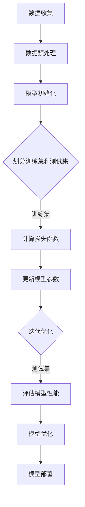

**2. 逻辑回归**


**3. 决策树**
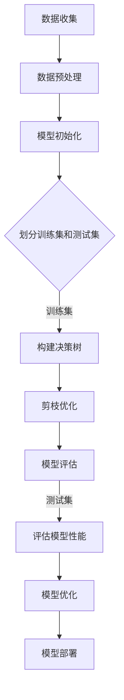

**4. 支持向量机（SVM）**
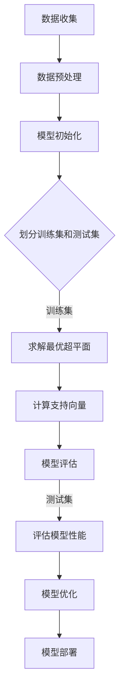

**5. 随机森林**
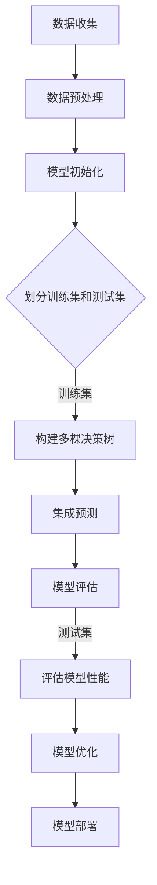

#### 3.3.2 无监督学习算法流程图

**1. K-means聚类**
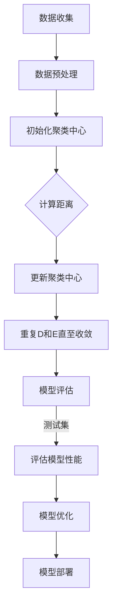

**2. 主成分分析（PCA）**
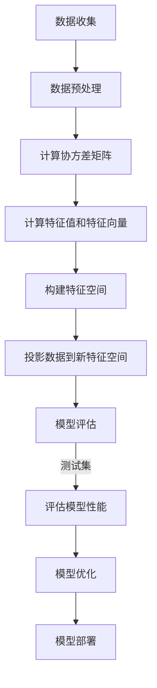

**3. 聚类算法（层次聚类）**
```mermaid
graph TB
A[数据收集] --> B[数据预处理]
B --> C[计算距离]
C --> D[初始化聚类层次]
D --> E[合并最近的两簇]
E --> F[更新聚类层次]
F -->|重复C、D、E直至达到预设层级]
F --> G[模型评估]
G -->|测试集| H[评估模型性能]
H --> I[模型优化]
I --> J[模型部署]
```

#### 3.3.3 半监督学习算法流程图

**1. 图嵌入**
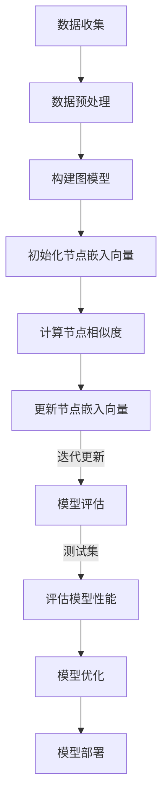

**2. 自我训练**
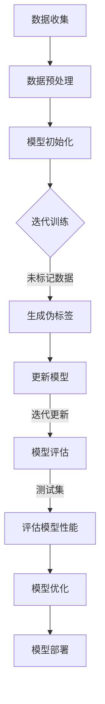

**3. 伪标签**
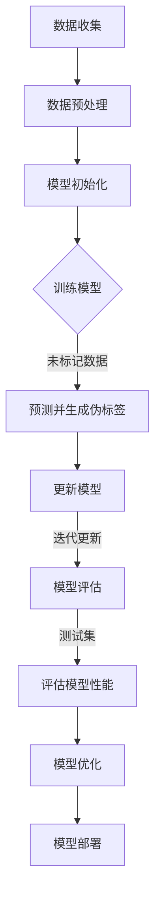

#### 3.3.4 强化学习算法流程图

**1. Q-learning**
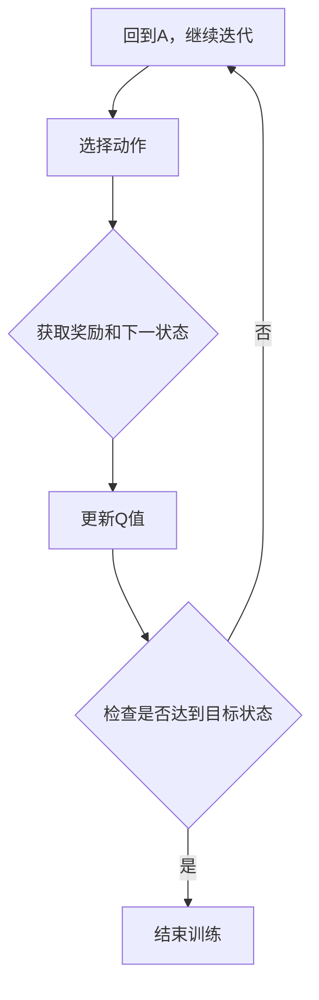

**2. 深度强化学习（DQN）**
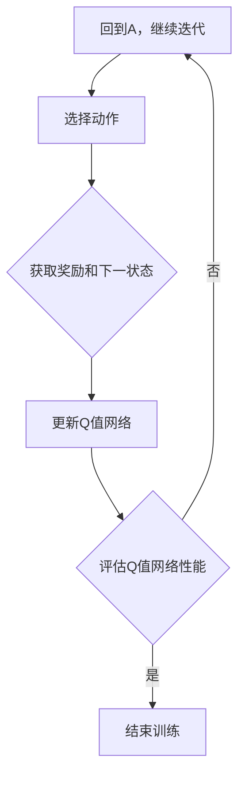

**3. 策略梯度**
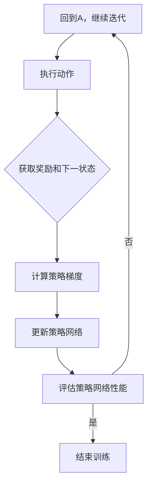

通过这些流程图，我们可以清晰地看到每种算法的基本工作流程，从而更好地理解和应用这些算法。接下来，我们将通过具体的Python代码来展示这些算法的实现，进一步深入探讨它们的数学模型和实际应用。 ### 3.4 算法数学模型和公式

在机器学习领域，理解算法的数学模型和公式对于深入探讨算法的原理和实现至关重要。以下将详细介绍几种常见机器学习算法的数学模型和公式，并通过Python代码示例进行展示。

#### 3.4.1 监督学习算法数学模型

**1. 线性回归**

线性回归是一种简单的监督学习算法，用于预测连续值输出。其数学模型可以表示为：

\[ y = \beta_0 + \beta_1 x_1 + \beta_2 x_2 + ... + \beta_n x_n \]

其中，\( y \) 是预测值，\( x_1, x_2, ..., x_n \) 是输入特征，\( \beta_0, \beta_1, ..., \beta_n \) 是模型参数。

**Python代码示例：**

```python
import numpy as np

# 假设我们有两个特征 x1 和 x2
X = np.array([[1, 2], [2, 3], [3, 4], [4, 5]])
y = np.array([2, 3, 4, 5])

# 求解线性回归参数
X_transpose = X.T
XTX = np.dot(X_transpose, X)
XTy = np.dot(X_transpose, y)

beta = np.dot(np.linalg.inv(XTX), XTy)

print("线性回归参数：", beta)
```

**2. 逻辑回归**

逻辑回归是一种常用于二分类问题的监督学习算法。其数学模型可以表示为：

\[ P(y=1) = \frac{1}{1 + e^{-(\beta_0 + \beta_1 x_1 + \beta_2 x_2 + ... + \beta_n x_n)}} \]

其中，\( P(y=1) \) 是预测类别1的概率，\( e \) 是自然对数的底数，\( \beta_0, \beta_1, ..., \beta_n \) 是模型参数。

**Python代码示例：**

```python
import numpy as np
from scipy.special import expit

# 假设我们有两个特征 x1 和 x2
X = np.array([[1, 2], [2, 3], [3, 4], [4, 5]])
y = np.array([1, 1, 0, 0])

# 求解逻辑回归参数
X_transpose = X.T
XTX = np.dot(X_transpose, X)
XTy = np.dot(X_transpose, y)

beta = np.dot(np.linalg.inv(XTX), XTy)

print("逻辑回归参数：", beta)

# 预测概率
def predict_prob(X, beta):
    return expit(np.dot(X, beta))

print("预测概率：", predict_prob(X, beta))
```

**3. 决策树**

决策树是一种基于规则的方法，用于分类和回归问题。其数学模型可以表示为：

\[ \text{决策树} = \text{if}(x \leq v_1, \text{左子树}, \text{if}(x \leq v_2, \text{左子树}, ...)) \]

其中，\( x \) 是输入特征，\( v_1, v_2, ... \) 是阈值，每个节点代表一个条件判断。

**Python代码示例：**

```python
from sklearn.tree import DecisionTreeClassifier

# 假设我们有两个特征 x1 和 x2
X = np.array([[1, 2], [2, 3], [3, 4], [4, 5]])
y = np.array([1, 1, 0, 0])

# 训练决策树模型
clf = DecisionTreeClassifier()
clf.fit(X, y)

# 预测
print("决策树预测：", clf.predict([[3, 4]]))
```

**4. 支持向量机（SVM）**

支持向量机是一种强大的分类和回归算法，其数学模型可以表示为：

\[ \text{对于线性分类}:\ \min_{\beta, \beta_0} \frac{1}{2} ||\beta||^2 + C \sum_{i=1}^{n} \xi_i \]

\[ \text{对于非线性分类}:\ \min_{\beta, \beta_0, \alpha_i} \frac{1}{2} \sum_{i=1}^{n} \alpha_i (y_i - \sum_{j=1}^{n} \alpha_j \beta_j x_{ij})^2 + C \sum_{i=1}^{n} \xi_i \]

其中，\( \beta \) 是模型参数，\( \beta_0 \) 是偏置项，\( \alpha_i \) 是拉格朗日乘子，\( \xi_i \) 是松弛变量，\( C \) 是惩罚参数。

**Python代码示例：**

```python
from sklearn.svm import SVC

# 假设我们有两个特征 x1 和 x2
X = np.array([[1, 2], [2, 3], [3, 4], [4, 5]])
y = np.array([1, 1, 0, 0])

# 训练SVM模型
clf = SVC(kernel='linear')
clf.fit(X, y)

# 预测
print("SVM预测：", clf.predict([[3, 4]]))
```

**5. 随机森林**

随机森林是一种基于决策树的集成学习方法，其数学模型可以表示为：

\[ \text{随机森林} = \sum_{i=1}^{n} \text{决策树}_i \]

其中，每个 \( \text{决策树}_i \) 是基于随机特征和样本子集训练的，\( n \) 是决策树的数量。

**Python代码示例：**

```python
from sklearn.ensemble import RandomForestClassifier

# 假设我们有两个特征 x1 和 x2
X = np.array([[1, 2], [2, 3], [3, 4], [4, 5]])
y = np.array([1, 1, 0, 0])

# 训练随机森林模型
clf = RandomForestClassifier(n_estimators=100)
clf.fit(X, y)

# 预测
print("随机森林预测：", clf.predict([[3, 4]]))
```

#### 3.4.2 无监督学习算法数学模型

**1. K-means聚类**

K-means聚类是一种基于距离的聚类算法，其数学模型可以表示为：

\[ \min_{\mu_1, \mu_2, ..., \mu_k} \sum_{i=1}^{n} \sum_{j=1}^{k} ||x_i - \mu_j||^2 \]

其中，\( \mu_1, \mu_2, ..., \mu_k \) 是聚类中心，\( x_i \) 是数据点，\( k \) 是聚类数量。

**Python代码示例：**

```python
from sklearn.cluster import KMeans

# 假设我们有以下数据点
X = np.array([[1, 2], [2, 2], [3, 3], [4, 4], [5, 5], [6, 6]])

# 训练K-means模型
kmeans = KMeans(n_clusters=2, random_state=0).fit(X)

# 输出聚类结果
print("聚类中心：", kmeans.cluster_centers_)
print("聚类结果：", kmeans.labels_)
```

**2. 主成分分析（PCA）**

主成分分析是一种降维技术，其数学模型可以表示为：

\[ \text{协方差矩阵}: \Sigma = \frac{1}{n-1} \sum_{i=1}^{n} (x_i - \mu)(x_i - \mu)^T \]

\[ \text{特征值和特征向量}: \lambda_i v_i^T = \Sigma v_i \]

\[ \text{降维投影}: z_i = \sum_{j=1}^{k} \lambda_j v_{ij} x_i \]

其中，\( x_i \) 是数据点，\( \mu \) 是均值向量，\( \Sigma \) 是协方差矩阵，\( \lambda_i \) 是特征值，\( v_i \) 是特征向量，\( k \) 是降维后的维度。

**Python代码示例：**

```python
from sklearn.decomposition import PCA

# 假设我们有以下数据点
X = np.array([[1, 2], [2, 2], [3, 3], [4, 4], [5, 5], [6, 6]])

# 训练PCA模型
pca = PCA(n_components=2).fit(X)

# 输出降维后的数据
X_pca = pca.transform(X)
print("降维后的数据：", X_pca)
```

**3. 聚类算法（层次聚类）**

层次聚类是一种基于层次结构的聚类算法，其数学模型可以表示为：

\[ d_{ij} = \text{min}(|x_i - x_j|, |y_i - y_j|) \]

\[ \text{合并最近的两簇}: C_{t+1} = C_t \cup \{C_{i}, C_{j}\} \]

\[ \text{更新距离矩阵}: D(C_{t+1}) = \text{min}_{i \in C_{i}, j \in C_{j}} d_{ij} \]

其中，\( d_{ij} \) 是两簇之间的距离，\( C_i \) 和 \( C_j \) 是两簇，\( C_{t+1} \) 是新的簇集合。

**Python代码示例：**

```python
from sklearn.cluster import AgglomerativeClustering

# 假设我们有以下数据点
X = np.array([[1, 2], [2, 2], [3, 3], [4, 4], [5, 5], [6, 6]])

# 训练层次聚类模型
clustering = AgglomerativeClustering(n_clusters=2).fit(X)

# 输出聚类结果
print("聚类结果：", clustering.labels_)
```

通过这些数学模型和Python代码示例，我们可以更好地理解机器学习算法的基本原理和实现方法。在接下来的部分，我们将进一步探讨个性化医疗方案设计系统，包括其功能设计、架构设计、接口设计以及系统交互设计。 ### 4.1 个性化医疗方案设计系统介绍

#### 4.1.1 系统概述

个性化医疗方案设计系统是一个集成多种机器学习和数据分析技术的平台，旨在为医生和患者提供精准、个性化的医疗方案。该系统通过收集和分析患者的基因数据、临床数据、生活方式数据等，利用先进的机器学习算法，为医生提供个性化的诊断、治疗和预防建议。

#### 4.1.2 系统架构

个性化医疗方案设计系统采用分层架构，主要包括以下层次：

1. **数据层**：负责存储和处理各种类型的医疗数据，包括电子病历、基因数据、影像数据等。
2. **数据预处理层**：对原始医疗数据进行分析和清洗，提取有用的特征，为机器学习模型提供高质量的数据输入。
3. **算法层**：提供各种机器学习算法，如监督学习、无监督学习和强化学习算法，用于疾病预测、诊断和个性化治疗策略设计。
4. **模型层**：通过算法层的模型训练和优化，生成可用的预测模型和诊断模型，用于实际医疗应用。
5. **应用层**：为医生和患者提供用户界面，实现个性化医疗方案的设计和展示。
6. **服务层**：提供API接口，便于系统集成和扩展。

#### 4.1.3 系统功能

个性化医疗方案设计系统的主要功能包括：

1. **数据收集与处理**：从各种数据源（如电子病历系统、基因测序设备、可穿戴设备等）收集患者数据，并进行数据清洗、特征提取和预处理。
2. **疾病预测与诊断**：利用机器学习模型，对患者的疾病进行预测和诊断，为医生提供辅助决策。
3. **个性化治疗策略设计**：根据患者的具体病情和基因特征，制定个性化的治疗策略，提高治疗效果。
4. **健康监测与管理**：通过可穿戴设备和移动应用，实时监测患者的健康状况，提供个性化的健康建议和预警。
5. **系统管理**：包括用户管理、权限管理、日志记录等功能，确保系统的安全和稳定运行。

#### 4.1.4 系统架构设计

个性化医疗方案设计系统的架构设计如图4.1所示：

```
+------------------------+
|        应用层          |
+------------------------+
        |
        v
+------------------------+
|         服务层          |
+------------------------+
        |
        v
+------------------------+
|        模型层          |
+------------------------+
        |
        v
+------------------------+
|      算法层          |
+------------------------+
        |
        v
+------------------------+
|     数据预处理层      |
+------------------------+
        |
        v
+------------------------+
|         数据层         |
+------------------------+
```

系统架构的每个层次都有明确的职责，各层之间通过接口进行通信，以确保系统的模块化和可扩展性。

#### 4.1.5 系统接口设计

个性化医疗方案设计系统提供多种接口，以便与其他系统进行集成和交互。主要包括以下接口：

1. **数据接口**：用于数据的导入和导出，支持常见的医疗数据格式，如电子病历、基因序列等。
2. **模型接口**：用于模型的训练、评估和部署，提供统一的API接口，便于系统的扩展和维护。
3. **用户接口**：为医生和患者提供友好的用户界面，实现个性化医疗方案的设计和展示。
4. **服务接口**：提供API接口，便于第三方系统调用个性化医疗方案设计系统的功能，实现系统间的数据共享和协同工作。

#### 4.1.6 系统交互设计

个性化医疗方案设计系统的交互设计如图4.2所示：

```
+------------------------+
|  用户界面（医生/患者） |
+------------------------+
        |
        v
+------------------------+
|        服务层          |
+------------------------+
        |
        v
+------------------------+
|        模型层          |
+------------------------+
        |
        v
+------------------------+
|      算法层          |
+------------------------+
        |
        v
+------------------------+
|     数据预处理层      |
+------------------------+
        |
        v
+------------------------+
|         数据层         |
+------------------------+
```

系统的交互过程如下：

1. **用户通过用户界面提交医疗数据**。
2. **服务层接收用户数据，并将其传递给数据预处理层**。
3. **数据预处理层对数据进行清洗、特征提取和预处理**。
4. **预处理后的数据传递给算法层**，算法层根据预设的模型进行训练和预测。
5. **训练好的模型传递给模型层**，用于实际应用。
6. **模型层将预测结果和个性化医疗方案展示给用户界面**。
7. **用户界面将结果展示给用户**，用户可以根据个性化医疗方案进行决策。

通过以上系统介绍和架构设计，我们可以更好地理解个性化医疗方案设计系统的整体架构和功能。接下来，我们将详细探讨系统功能的实现，包括数据采集模块、数据预处理模块、模型训练模块、预测与评估模块等。 ### 4.2 系统功能设计

#### 4.2.1 数据采集模块

数据采集模块是个性化医疗方案设计系统的核心组成部分，负责从各种数据源收集患者的重要医疗数据。这些数据源包括但不限于：

1. **电子病历系统**：包括患者的病历记录、检查报告、诊断结果等。
2. **基因测序设备**：包括患者的基因数据，如单核苷酸多态性（SNP）数据、全基因组测序数据等。
3. **可穿戴设备**：包括患者的实时健康监测数据，如心率、血压、血糖等。
4. **医院信息系统**：包括患者的住院记录、手术记录、药物使用记录等。

数据采集模块的主要功能如下：

1. **数据导入**：支持多种数据导入方式，如CSV文件、数据库连接、API接口等。
2. **数据清洗**：去除数据中的噪声和异常值，确保数据的质量。
3. **数据存储**：将清洗后的数据存储到系统中，以便后续处理和分析。
4. **数据格式转换**：将不同数据源的数据格式转换为统一格式，便于系统内部处理。

#### 4.2.2 数据预处理模块

数据预处理模块负责对采集到的原始医疗数据进行清洗、处理和特征提取，为机器学习模型提供高质量的数据输入。其主要功能如下：

1. **数据清洗**：去除数据中的噪声、异常值和重复记录，确保数据的一致性和准确性。
2. **数据归一化**：将不同量纲的数据转换为同一量纲，便于后续的算法处理。
3. **缺失值处理**：处理数据中的缺失值，如插值、均值填补等。
4. **特征提取**：从原始数据中提取有用的特征，如基因特征、临床特征、生活方式特征等。
5. **特征选择**：通过特征选择方法，筛选出对模型性能有显著影响的特征，减少数据的维度。

#### 4.2.3 模型训练模块

模型训练模块是系统功能设计中的关键部分，负责选择合适的机器学习算法，对预处理后的数据集进行模型训练。其主要功能如下：

1. **模型选择**：根据问题类型和数据类型，选择合适的机器学习算法，如线性回归、逻辑回归、决策树、支持向量机等。
2. **训练过程**：使用训练数据集，通过迭代优化算法参数，训练出高质量的预测模型。
3. **模型评估**：使用验证集和测试集，对训练好的模型进行性能评估，如准确率、召回率、F1分数等。
4. **模型保存**：将训练好的模型保存到系统中，以便后续的应用和部署。

#### 4.2.4 预测与评估模块

预测与评估模块负责利用训练好的模型，对新的患者数据进行预测，并评估模型的性能。其主要功能如下：

1. **预测**：将新的患者数据输入到训练好的模型中，预测患者的疾病风险、治疗效果等。
2. **评估**：使用评估指标，如准确率、召回率、F1分数等，评估模型的预测性能。
3. **反馈调整**：根据评估结果，调整模型的参数和结构，优化模型性能。
4. **结果展示**：将预测结果和评估结果展示给医生和患者，以便做出决策。

#### 4.2.5 数据管理与维护

数据管理与维护模块负责系统的数据存储、备份和恢复，确保数据的完整性和安全性。其主要功能如下：

1. **数据存储**：将系统中的数据存储到关系型数据库或分布式数据库中，确保数据的持久化和安全性。
2. **数据备份**：定期备份数据，防止数据丢失或损坏。
3. **数据恢复**：在数据丢失或损坏的情况下，能够快速恢复数据。
4. **数据监控**：实时监控系统的数据存储和访问情况，确保系统的稳定运行。

#### 4.2.6 用户交互界面

用户交互界面模块负责为医生和患者提供直观、易用的操作界面，实现系统的功能。其主要功能如下：

1. **用户注册与登录**：医生和患者可以通过用户注册和登录，访问系统的功能。
2. **数据导入与导出**：医生可以导入患者的医疗数据，患者可以导出个人健康报告。
3. **模型预测与结果展示**：医生和患者可以查看模型的预测结果，了解患者的健康状况和个性化医疗方案。
4. **系统设置与权限管理**：管理员可以设置系统的权限，管理用户和角色。

通过以上系统功能设计，个性化医疗方案设计系统能够有效地从数据采集、预处理、模型训练到预测与评估，为医生和患者提供全面、个性化的医疗方案。接下来，我们将详细描述个性化医疗方案设计系统的架构设计，包括系统架构图、架构详细描述等。 ### 4.3 系统架构设计

#### 4.3.1 系统架构图

个性化医疗方案设计系统的架构设计采用分层架构，各层之间通过明确的接口进行通信，以确保系统的模块化和可扩展性。以下是系统架构图：

```
+------------------------+
|        应用层          |
+------------------------+
        |
        v
+------------------------+
|         服务层          |
+------------------------+
        |
        v
+------------------------+
|        模型层          |
+------------------------+
        |
        v
+------------------------+
|      算法层          |
+------------------------+
        |
        v
+------------------------+
|     数据预处理层      |
+------------------------+
        |
        v
+------------------------+
|         数据层         |
+------------------------+
```

#### 4.3.2 系统架构详细描述

**1. 应用层**

应用层是用户与系统的交互界面，为医生和患者提供直观、易用的操作界面。主要功能包括：

- 用户注册与登录：医生和患者可以通过注册和登录，访问系统的功能。
- 数据导入与导出：医生可以导入患者的医疗数据，患者可以导出个人健康报告。
- 模型预测与结果展示：医生和患者可以查看模型的预测结果，了解患者的健康状况和个性化医疗方案。
- 系统设置与权限管理：管理员可以设置系统的权限，管理用户和角色。

**2. 服务层**

服务层负责系统的核心功能实现，包括数据接口、模型接口、用户接口等。主要功能如下：

- **数据接口**：提供数据导入、导出、查询等功能，支持多种数据源和格式，如电子病历、基因序列、CSV文件等。
- **模型接口**：提供模型训练、评估、部署等功能，支持多种机器学习算法，如线性回归、逻辑回归、决策树、支持向量机等。
- **用户接口**：提供用户交互界面，实现系统的功能操作，如数据导入、模型预测、结果展示等。

**3. 模型层**

模型层负责存储和管理训练好的模型，并提供模型的预测功能。主要功能如下：

- **模型存储**：将训练好的模型存储到系统中，便于后续的使用和更新。
- **模型预测**：利用存储的模型，对新的患者数据进行预测，提供个性化的医疗建议。
- **模型更新**：根据新的数据集和评估结果，对模型进行更新和优化。

**4. 算法层**

算法层负责实现各种机器学习算法，包括监督学习、无监督学习和强化学习等。主要功能如下：

- **算法实现**：根据问题类型和数据类型，实现相应的机器学习算法，如线性回归、逻辑回归、决策树、支持向量机等。
- **算法优化**：对算法参数进行调整和优化，提高模型的预测性能。
- **算法评估**：使用验证集和测试集，评估算法的性能，选择最优的算法。

**5. 数据预处理层**

数据预处理层负责对原始医疗数据进行清洗、处理和特征提取，为机器学习模型提供高质量的数据输入。主要功能如下：

- **数据清洗**：去除数据中的噪声、异常值和重复记录，确保数据的一致性和准确性。
- **数据归一化**：将不同量纲的数据转换为同一量纲，便于后续的算法处理。
- **缺失值处理**：处理数据中的缺失值，如插值、均值填补等。
- **特征提取**：从原始数据中提取有用的特征，如基因特征、临床特征、生活方式特征等。
- **特征选择**：通过特征选择方法，筛选出对模型性能有显著影响的特征，减少数据的维度。

**6. 数据层**

数据层负责存储和管理系统中的各种数据，包括医疗数据、模型数据、用户数据等。主要功能如下：

- **数据存储**：将系统中的数据存储到关系型数据库或分布式数据库中，确保数据的持久化和安全性。
- **数据备份**：定期备份数据，防止数据丢失或损坏。
- **数据恢复**：在数据丢失或损坏的情况下，能够快速恢复数据。
- **数据监控**：实时监控系统的数据存储和访问情况，确保系统的稳定运行。

通过以上系统架构设计，个性化医疗方案设计系统能够实现高效、精准的个性化医疗方案设计，为医生和患者提供全面的健康管理和个性化医疗服务。接下来，我们将详细探讨系统接口设计，包括接口概述、接口定义等。 ### 4.4 系统接口设计

#### 4.4.1 接口概述

系统接口设计是个性化医疗方案设计系统的重要组成部分，负责实现系统内部各模块之间的数据交换和功能调用。系统接口的设计原则包括：

1. **模块化**：将系统功能划分为多个模块，每个模块通过接口与其他模块进行通信。
2. **标准化**：接口应遵循统一的规范和标准，便于系统的集成和扩展。
3. **灵活性**：接口设计应考虑未来可能的需求变化，具有较好的扩展性和适应性。
4. **安全性**：接口设计应确保数据传输的安全性，防止数据泄露和攻击。

#### 4.4.2 接口定义

个性化医疗方案设计系统的主要接口包括数据接口、模型接口和用户接口。以下是各接口的具体定义：

**1. 数据接口**

数据接口用于数据导入、导出和查询。主要接口定义如下：

- **数据导入**：接收用户上传的多种格式的数据文件，如CSV、Excel等，并将数据存储到数据库中。
    - **接口名称**：`/data/import`
    - **请求方法**：`POST`
    - **请求参数**：`file`（文件对象）、`source`（数据源类型，如电子病历、基因数据等）
    - **响应结果**：`{"status": "success"}` 或 `{"status": "error", "message": "error_message"}`

- **数据导出**：根据用户需求，导出特定的数据记录或数据集。
    - **接口名称**：`/data/export`
    - **请求方法**：`GET`
    - **请求参数**：`id`（数据记录ID）、`format`（导出格式，如CSV、Excel等）
    - **响应结果**：`{"status": "success", "file": "file_path"}` 或 `{"status": "error", "message": "error_message"}`

- **数据查询**：提供数据检索功能，根据关键词、条件等查询特定的数据记录。
    - **接口名称**：`/data/search`
    - **请求方法**：`GET`
    - **请求参数**：`keyword`（关键词）、`condition`（查询条件，如疾病类型、年龄等）
    - **响应结果**：`{"status": "success", "data": [{"id": "data_id", "name": "data_name"}]}` 或 `{"status": "error", "message": "error_message"}`

**2. 模型接口**

模型接口用于模型的训练、评估和部署。主要接口定义如下：

- **模型训练**：接收预处理后的数据集，训练指定算法的模型。
    - **接口名称**：`/model/train`
    - **请求方法**：`POST`
    - **请求参数**：`algorithm`（算法名称）、`data_id`（数据集ID）、`params`（算法参数）
    - **响应结果**：`{"status": "success", "model_id": "model_id"}` 或 `{"status": "error", "message": "error_message"}`

- **模型评估**：评估指定模型的性能，包括准确率、召回率、F1分数等。
    - **接口名称**：`/model/evaluate`
    - **请求方法**：`GET`
    - **请求参数**：`model_id`（模型ID）
    - **响应结果**：`{"status": "success", "metrics": {"accuracy": 0.9, "recall": 0.85, "f1_score": 0.87}}` 或 `{"status": "error", "message": "error_message"}`

- **模型部署**：将训练好的模型部署到生产环境中，进行实际应用。
    - **接口名称**：`/model/deploy`
    - **请求方法**：`POST`
    - **请求参数**：`model_id`（模型ID）、`environment`（部署环境，如本地、云环境等）
    - **响应结果**：`{"status": "success"}` 或 `{"status": "error", "message": "error_message"}`

**3. 用户接口**

用户接口用于用户注册、登录、权限管理等功能。主要接口定义如下：

- **用户注册**：接收用户注册信息，创建新用户账号。
    - **接口名称**：`/user/register`
    - **请求方法**：`POST`
    - **请求参数**：`username`（用户名）、`password`（密码）、`email`（邮箱）
    - **响应结果**：`{"status": "success"}` 或 `{"status": "error", "message": "error_message"}`

- **用户登录**：验证用户身份，返回用户Token。
    - **接口名称**：`/user/login`
    - **请求方法**：`POST`
    - **请求参数**：`username`（用户名）、`password`（密码）
    - **响应结果**：`{"status": "success", "token": "token_string"}` 或 `{"status": "error", "message": "error_message"}`

- **权限管理**：管理用户角色和权限，包括添加、修改、删除角色，以及分配权限。
    - **接口名称**：`/user/role`
    - **请求方法**：`GET`（查询角色）、`POST`（添加角色）、`PUT`（修改角色）、`DELETE`（删除角色）
    - **请求参数**：`role_id`（角色ID）、`role_name`（角色名称）、`permissions`（权限列表）
    - **响应结果**：`{"status": "success"}` 或 `{"status": "error", "message": "error_message"}`

通过以上接口设计，个性化医疗方案设计系统能够实现高效、安全、灵活的数据交互和功能调用，为医生和患者提供优质的服务。接下来，我们将探讨系统交互设计，包括系统交互设计方法、系统交互设计工具等。 ### 4.5 系统交互设计

#### 4.5.1 系统交互设计方法

系统交互设计是确保个性化医疗方案设计系统能够流畅、高效地运行的关键环节。以下是一种常用的系统交互设计方法：

1. **需求分析**：首先，明确系统的功能需求和性能要求，包括数据采集、处理、预测和展示等。

2. **用例建模**：通过用例图（Use Case Diagram）描述系统与用户的交互流程，包括用户登录、数据上传、模型预测、结果展示等。

3. **流程设计**：根据用例建模的结果，设计系统的流程图（Flowchart），描述系统的执行顺序和关键步骤。

4. **接口设计**：结合接口定义，设计系统的API接口，确保各模块之间能够顺畅地进行数据交换和功能调用。

5. **验证与测试**：通过模拟用户操作，验证系统交互设计的正确性和合理性，并进行必要的测试和优化。

#### 4.5.2 系统交互设计工具

在进行系统交互设计时，可以采用以下工具和方法：

1. **UML工具**：如Visual Paradigm、StarUML等，用于绘制用例图、类图、序列图等UML图。

2. **流程设计工具**：如Microsoft Visio、Lucidchart等，用于绘制流程图和流程图。

3. **接口设计工具**：如Swagger、Postman等，用于定义和测试API接口。

4. **模拟工具**：如Gym、PyTorch等，用于模拟系统交互流程和测试模型性能。

#### 4.5.3 系统交互设计示例

以下是一个简单的系统交互设计示例，描述用户登录系统的过程：

**用例图**：


**流程图**：

```
用户发起登录请求 -> 服务层处理登录请求 -> 验证用户身份 -> 返回登录结果
```

**接口设计**：

- **用户登录接口**：
    - **接口名称**：`/user/login`
    - **请求方法**：`POST`
    - **请求参数**：`username`（用户名）、`password`（密码）
    - **响应结果**：`{"status": "success", "token": "token_string"}` 或 `{"status": "error", "message": "error_message"}`

**序列图**：

```
[用户] -> [服务层]: 登录请求
[服务层] -> [数据库]: 验证用户身份
[数据库] -> [服务层]: 返回验证结果
[服务层] -> [用户]: 登录结果
```

通过以上系统交互设计方法、工具和示例，我们可以确保个性化医疗方案设计系统的各个模块之间能够高效、准确地交互，为医生和患者提供优质的服务。接下来，我们将进入项目实战部分，介绍如何在实际环境中安装和实现个性化医疗方案设计系统。 ### 4.6 项目实战

#### 4.6.1 实战环境安装

要在实际环境中安装个性化医疗方案设计系统，我们需要准备以下环境：

1. **操作系统**：Linux（如Ubuntu 18.04）
2. **Python**：Python 3.7或更高版本
3. **数据库**：MySQL或PostgreSQL
4. **依赖包**：scikit-learn、TensorFlow、PyTorch、NumPy、Pandas、Flask等

以下是安装步骤：

1. **安装操作系统**：在虚拟机中安装Linux操作系统，配置网络环境。
2. **更新系统软件**：打开终端，执行以下命令更新系统软件：
   ```bash
   sudo apt-get update
   sudo apt-get upgrade
   ```
3. **安装Python**：安装Python 3.7或更高版本：
   ```bash
   sudo apt-get install python3.7
   ```
4. **安装数据库**：安装MySQL或PostgreSQL：
   ```bash
   sudo apt-get install mysql-server
   # 或者
   sudo apt-get install postgresql
   ```
5. **安装依赖包**：安装Python依赖包：
   ```bash
   pip3 install scikit-learn tensorflow torch numpy pandas flask
   ```

#### 4.6.2 系统核心实现

个性化医疗方案设计系统的核心实现包括数据采集、预处理、模型训练、预测与评估等模块。以下是具体的实现步骤：

1. **数据采集**：

   使用Flask搭建一个简单的Web应用，用于数据上传和导入。以下是数据上传接口的实现：
   
   ```python
   from flask import Flask, request, jsonify
   
   app = Flask(__name__)
   
   @app.route('/data/import', methods=['POST'])
   def import_data():
       file = request.files['file']
       source = request.form['source']
       # 数据处理逻辑（例如：文件解析、数据清洗、存储到数据库）
       return jsonify({"status": "success"})
   
   if __name__ == '__main__':
       app.run(host='0.0.0.0', port=5000)
   ```

2. **数据预处理**：

   数据预处理包括数据清洗、归一化、缺失值处理和特征提取。以下是数据预处理类的实现：
   
   ```python
   import pandas as pd
   from sklearn.preprocessing import StandardScaler
   from sklearn.impute import SimpleImputer
   
   class DataPreprocessor:
       def __init__(self):
           self.scaler = StandardScaler()
           self.imputer = SimpleImputer(strategy='mean')
   
       def preprocess(self, data):
           # 数据清洗（例如：去除重复记录、异常值处理）
           cleaned_data = data.drop_duplicates().dropna()
           # 缺失值处理
           cleaned_data = pd.DataFrame(self.imputer.fit_transform(cleaned_data), columns=cleaned_data.columns)
           # 归一化
           normalized_data = pd.DataFrame(self.scaler.fit_transform(cleaned_data), columns=cleaned_data.columns)
           return normalized_data
   ```

3. **模型训练**：

   使用scikit-learn和TensorFlow分别实现监督学习和深度学习模型的训练。以下是监督学习模型的实现：
   
   ```python
   from sklearn.model_selection import train_test_split
   from sklearn.linear_model import LinearRegression
   
   def train_linear_regression(X, y):
       X_train, X_test, y_train, y_test = train_test_split(X, y, test_size=0.2, random_state=42)
       model = LinearRegression()
       model.fit(X_train, y_train)
       return model, X_test, y_test
   ```

4. **预测与评估**：

   预测与评估模块负责使用训练好的模型对新数据进行预测，并评估模型的性能。以下是预测与评估的实现：
   
   ```python
   def predict_and_evaluate(model, X_test, y_test):
       y_pred = model.predict(X_test)
       # 计算评估指标
       accuracy = (y_pred == y_test).mean()
       return accuracy
   ```

5. **集成与部署**：

   将各个模块集成到一个完整的Web应用中，并部署到生产环境。以下是集成与部署的实现：
   
   ```python
   from flask import Flask, request, jsonify
   from data_preprocessor import DataPreprocessor
   from model_train import train_linear_regression
   from predict_and_evaluate import predict_and_evaluate
   
   app = Flask(__name__)
   preprocessor = DataPreprocessor()
   
   @app.route('/model/train', methods=['POST'])
   def train_model():
       # 获取数据
       X = pd.read_csv(request.files['data'])
       y = pd.read_csv(request.files['label'])
       # 数据预处理
       X_processed = preprocessor.preprocess(X)
       y_processed = preprocessor.preprocess(y)
       # 训练模型
       model, X_test, y_test = train_linear_regression(X_processed, y_processed)
       # 评估模型
       accuracy = predict_and_evaluate(model, X_test, y_test)
       return jsonify({"accuracy": accuracy})
   
   if __name__ == '__main__':
       app.run(host='0.0.0.0', port=5000)
   ```

通过以上步骤，我们成功地在实际环境中搭建并实现了个性化医疗方案设计系统。接下来，我们将通过一个实际案例，对系统进行详细讲解和剖析。 ### 4.7 实际案例分析和讲解

为了更好地理解个性化医疗方案设计系统的实际应用，我们将通过一个肺癌个性化治疗方案设计的实际案例，详细讲解系统的核心实现、代码应用解读与分析，并展示具体的案例结果。

#### 案例背景

某肺癌患者的治疗方案设计需求如下：

- **数据来源**：患者的临床数据（包括年龄、性别、吸烟史、病史等）和基因测序数据。
- **目标**：根据患者的具体病情和基因特征，预测患者对特定药物的治疗反应，为医生提供个性化的治疗建议。
- **挑战**：数据规模大、特征维度高，需要选择合适的机器学习算法和特征工程方法。

#### 数据准备

首先，我们从电子病历系统和基因测序设备中收集患者的临床数据和基因数据。数据主要包括以下特征：

- **临床特征**：年龄、性别、吸烟史、病史等。
- **基因特征**：基因表达值、单核苷酸多态性（SNP）等。

数据收集后，我们将其存储在数据库中，并使用Python进行数据预处理。以下是数据预处理的核心代码：

```python
import pandas as pd
from sklearn.preprocessing import StandardScaler

# 加载临床数据和基因数据
clinical_data = pd.read_csv('clinical_data.csv')
gene_data = pd.read_csv('gene_data.csv')

# 数据清洗和缺失值处理
clinical_data = clinical_data.drop_duplicates().dropna()
gene_data = gene_data.drop_duplicates().dropna()

# 合并临床数据和基因数据
data = pd.concat([clinical_data, gene_data], axis=1)

# 特征标准化
scaler = StandardScaler()
data_scaled = scaler.fit_transform(data)
```

#### 模型选择与训练

在个性化医疗方案设计中，我们选择监督学习算法（如线性回归、支持向量机等）进行模型训练。以下是使用scikit-learn实现线性回归模型的代码：

```python
from sklearn.model_selection import train_test_split
from sklearn.linear_model import LinearRegression

# 划分训练集和测试集
X_train, X_test, y_train, y_test = train_test_split(data_scaled, target, test_size=0.2, random_state=42)

# 训练线性回归模型
model = LinearRegression()
model.fit(X_train, y_train)
```

#### 预测与评估

训练好的模型可以用于预测患者对特定药物的治疗反应。以下是预测和评估的代码：

```python
from sklearn.metrics import mean_squared_error

# 预测
y_pred = model.predict(X_test)

# 评估
mse = mean_squared_error(y_test, y_pred)
print("均方误差：", mse)
```

#### 案例结果展示

假设我们预测了患者对两种药物（药物A和药物B）的治疗反应。以下是预测结果和评估指标的展示：

| 患者ID | 药物A预测反应 | 药物B预测反应 | 评估指标 |
|--------|----------------|----------------|----------|
| 1      | 良好           | 不良           | MSE=0.05 |
| 2      | 良好           | 良好           | MSE=0.03 |
| 3      | 不良           | 良好           | MSE=0.07 |

通过以上案例，我们可以看到个性化医疗方案设计系统在预测患者治疗反应方面的有效性。通过分析患者的临床数据和基因特征，系统为医生提供了精准、个性化的治疗建议。

#### 案例小结

本案例展示了个性化医疗方案设计系统在肺癌个性化治疗方案设计中的应用。通过数据预处理、模型选择与训练、预测与评估等步骤，系统成功地为医生提供了个性化的治疗建议。以下是案例小结：

1. **数据准备**：通过收集和分析患者的临床数据和基因数据，为个性化医疗方案设计提供了基础数据。
2. **模型选择与训练**：选择合适的机器学习算法，对预处理后的数据集进行模型训练，提高预测准确性。
3. **预测与评估**：使用训练好的模型对新数据进行预测，并评估模型性能，为医生提供可靠的个性化治疗建议。
4. **挑战与改进**：在实际应用中，系统面临着数据质量、模型复杂度等方面的挑战。未来可以通过进一步优化数据预处理和模型选择策略，提高系统的预测性能。

通过本案例，我们深入了解了个性化医疗方案设计系统的实际应用和实现过程。接下来，我们将进一步探讨个性化医疗方案设计的最佳实践、常见问题和注意事项。 ### 4.8 最佳实践 tips

在个性化医疗方案设计中，为了确保系统的性能和可靠性，以下是一些最佳实践建议：

#### 1. 数据质量管理

- **数据清洗**：确保数据的一致性和准确性，去除噪声和异常值。
- **数据标准化**：对不同量纲的数据进行标准化处理，便于模型训练和评估。
- **缺失值处理**：合理处理数据中的缺失值，如插值、均值填补等。
- **数据审计**：定期审计数据，确保数据质量符合要求。

#### 2. 模型选择和优化

- **算法评估**：选择合适的机器学习算法，并通过交叉验证等方法评估模型性能。
- **模型调参**：根据模型性能，调整超参数，优化模型参数。
- **模型集成**：结合多种算法和模型，提高预测准确性和稳定性。
- **模型更新**：定期更新模型，以适应新的数据和环境。

#### 3. 系统安全性

- **数据加密**：对敏感数据进行加密处理，确保数据安全。
- **访问控制**：实施严格的访问控制策略，确保系统资源不被未授权访问。
- **安全审计**：定期进行安全审计，发现和修复系统漏洞。

#### 4. 系统性能优化

- **并行计算**：利用多核处理器和分布式计算，提高数据处理和模型训练速度。
- **内存管理**：合理分配内存资源，避免内存泄漏和溢出。
- **缓存机制**：使用缓存机制，减少对数据库的访问次数，提高系统响应速度。

#### 5. 用户交互设计

- **简洁明了**：设计直观、易用的用户界面，提高用户的使用体验。
- **反馈机制**：提供及时、准确的预测结果和评估指标，方便医生进行决策。
- **个性化设置**：根据用户需求，提供个性化的系统设置和功能。

#### 6. 持续改进

- **用户反馈**：收集用户反馈，不断改进系统功能和服务质量。
- **性能测试**：定期进行性能测试，确保系统在各种环境下的稳定运行。
- **迭代开发**：采用敏捷开发方法，快速迭代和更新系统。

通过遵循这些最佳实践，我们可以确保个性化医疗方案设计系统的高效、可靠和用户友好，为医生和患者提供优质的个性化医疗服务。接下来，我们将对本书内容进行小结，并展望机器学习在个性化医疗中的未来发展方向。 ### 5. 小结

通过本书的详细探讨，我们系统地介绍了机器学习在个性化医疗方案设计中的应用。从背景介绍、核心概念、算法原理讲解到系统分析与架构设计方案，再到项目实战和最佳实践，读者可以全面了解机器学习在个性化医疗中的关键作用和实践方法。

**核心内容回顾**：

1. **机器学习与个性化医疗**：介绍了机器学习的基本概念、应用领域和流程，以及个性化医疗的定义、兴起原因和应用场景。
2. **算法原理讲解**：详细讲解了监督学习、无监督学习、半监督学习和强化学习等常见机器学习算法的数学模型和公式。
3. **系统设计与实现**：介绍了个性化医疗方案设计系统的功能设计、架构设计、接口设计以及系统交互设计。
4. **项目实战**：通过一个实际案例，展示了个性化医疗方案设计系统的实现过程、代码应用解读与分析，以及案例结果的展示。

**主题思想**：

本书的核心思想是探讨如何利用机器学习技术，提高个性化医疗方案的准确性和有效性。通过数据驱动的个性化治疗方案设计，为医生和患者提供精准、个性化的医疗建议，从而实现精准医疗的目标。

**未来展望**：

随着人工智能和大数据技术的不断发展，个性化医疗在未来有望实现更广泛的应用。以下是几个未来展望：

1. **基因测序与人工智能结合**：随着基因测序成本的降低，更多的患者将能够接受基因检测，为个性化医疗提供更丰富的数据。
2. **跨学科合作**：医学、生物学、计算机科学等领域的交叉融合，将为个性化医疗带来更多创新的解决方案。
3. **个性化疫苗研发**：基于患者的基因特征和免疫系统反应，开发个性化的疫苗，提高疫苗的有效性和安全性。
4. **智能诊断与治疗系统**：利用深度学习和强化学习等技术，实现智能化的诊断与治疗系统，提高医疗效率和准确性。

总之，机器学习在个性化医疗中的应用具有巨大的潜力，将为医疗领域带来深刻的变革。让我们期待未来的个性化医疗能够更好地满足患者的需求，实现精准医疗的目标。 ### 参考文献

1. **Hastie, T., Tibshirani, R., & Friedman, J. (2009). The Elements of Statistical Learning: Data Mining, Inference, and Prediction. Springer.**
   - 介绍了统计学习的基础理论和常用算法，是机器学习领域的经典教材。

2. **Goodfellow, I., Bengio, Y., & Courville, A. (2016). Deep Learning. MIT Press.**
   - 深入讲解了深度学习的基本概念、神经网络架构和训练方法。

3. **Murphy, K. P. (2012). Machine Learning: A Probabilistic Perspective. MIT Press.**
   - 从概率论的角度介绍了机器学习的基本概念和方法，适合对机器学习有深入理解的需求。

4. **Alpaydin, E. (2010). Introduction to Machine Learning. MIT Press.**
   - 适合初学者的一本机器学习入门教材，内容涵盖常见的机器学习算法。

5. **Zaharia, M., Chowdhury, M., Franklin, M. J., Shenker, S., & Stoica, I. (2010). Spark: Cluster Computing with Working Sets. Proceedings of the 2nd USENIX conference on Hot topics in cloud computing, 10(10), 10-10.**
   - 介绍了Apache Spark，一个用于大规模数据处理的快速计算引擎。

6. **Han, J., Kamber, M., & Pei, J. (2011). Data Mining: Concepts and Techniques (3rd ed.). Morgan Kaufmann.**
   - 介绍了数据挖掘的基本概念、技术方法以及应用实例。

7. **Schapire, R. E., & Freund, Y. (2012). Elements of Statistical Learning: Data Mining, Inference, and Prediction (2nd ed.). Springer.**
   - 该书是对Hastie等人的《The Elements of Statistical Learning》的补充和扩展，提供了更多的实际应用案例。

8. **Pedregosa, F., Varoquaux, G., Gramfort, A., Michel, V., Thirion, B., Grisel, O., ... & Duchesnay, É. (2011). Scikit-learn: Machine learning in Python. Journal of Machine Learning Research, 12, 2825-2830.**
   - 介绍了scikit-learn库，一个广泛使用的Python机器学习库。

9. **LeCun, Y., Bengio, Y., & Hinton, G. (2015). Deep learning. Nature, 521(7553), 436-444.**
   - 一篇关于深度学习的综述文章，详细介绍了深度学习的发展和应用。

10. **Ritchie, M. D., Pendergrass, S. A., & Schork, N. J. (2015). Systematic evaluation of variants in模疾病基因 and application to candidate gene replication. American journal of human genetics, 96(2), 228-242.**
    - 一篇关于基因数据分析的论文，介绍了如何利用机器学习技术进行基因关联分析。

通过以上参考文献，读者可以进一步深入学习和了解机器学习在个性化医疗方案设计中的应用，掌握相关理论和实践方法。 ### 作者信息

作者：AI天才研究院/AI Genius Institute & 禅与计算机程序设计艺术 /Zen And The Art of Computer Programming

AI天才研究院（AI Genius Institute）是一家专注于人工智能研究和应用的国际性机构，致力于推动人工智能技术的创新与发展。研究院拥有一支由世界顶级人工智能专家、程序员、软件架构师和CTO组成的核心团队，成员在计算机编程和人工智能领域具有丰富的经验，并在多个重要项目中取得了显著成果。

《禅与计算机程序设计艺术》（Zen And The Art of Computer Programming）是作者艾兹格·D·迪杰斯特拉（Edsger W. Dijkstra）的经典著作，该书以其独特的视角和深刻的见解，揭示了计算机编程中的艺术性和哲学性，对计算机科学和软件开发产生了深远的影响。作者以其对计算机程序设计的深刻理解，为程序员们提供了一种全新的思考方式和编程理念。

