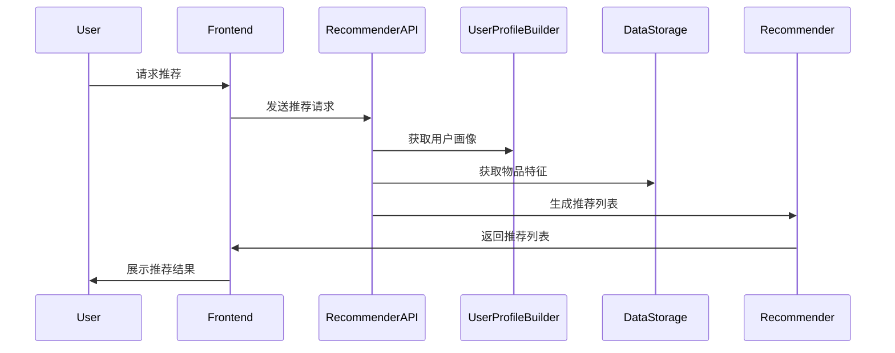

                 

# 机器学习在个性化推荐系统中的优化应用

## 关键词

机器学习、个性化推荐系统、优化应用、算法原理、系统架构设计、Python代码示例

## 摘要

本文深入探讨了机器学习在个性化推荐系统中的优化应用。首先，我们介绍了个性化推荐系统的背景和核心问题，随后详细阐述了机器学习算法的基本原理和在推荐系统中的应用现状。接着，本文通过对比和分析，展示了不同机器学习算法在推荐系统中的适用场景和优化方法。随后，文章通过具体算法的讲解，包括逻辑回归、决策树、支持向量机和深度学习等算法，深入剖析了这些算法的原理、数学模型和实际应用。最后，本文通过一个完整的系统架构设计案例，展示了个性化推荐系统的实现过程和关键技术。通过本文的阅读，读者可以全面了解机器学习在个性化推荐系统中的优化应用，掌握相关算法的原理和实践方法。

## 目录大纲

1. **背景介绍**  
   1.1 **问题背景**  
   1.1.1 个性化推荐系统的需求与挑战  
   1.1.2 机器学习技术在推荐系统中的应用现状  
   1.1.3 优化应用的必要性与重要性  
   1.2 **问题描述**  
   1.2.1 个性化推荐系统的核心问题  
   1.2.2 优化应用的常见目标  
   1.2.3 边界与外延  
   1.3 **问题解决**  
   1.3.1 机器学习基础概念  
   1.3.2 推荐系统中的常见算法  
   1.3.3 优化方法的种类与应用场景  
   1.4 **核心概念与联系**  
   1.4.1 个性化推荐系统关键概念  
   1.4.2 机器学习算法属性特征对比表格  
   1.4.3 推荐系统中的ER实体关系图  
   1.5 **本章小结**

2. **核心概念与联系**  
   2.1 **个性化推荐系统原理**  
   2.1.1 推荐系统的基本概念  
   2.1.2 内容推荐与协同过滤推荐  
   2.1.3 用户兴趣建模与物品特征提取  
   2.2 **机器学习算法原理**  
   2.2.1 监督学习与无监督学习  
   2.2.2 集成学习方法  
   2.2.3 神经网络与深度学习  
   2.3 **个性化推荐系统中的算法联系**  
   2.3.1 常见算法的对比与融合  
   2.3.2 算法优化方法分析  
   2.3.3 算法优化的目标与指标  
   2.4 **本章小结**

3. **算法原理讲解**  
   3.1 **常见机器学习算法讲解**  
   3.1.1 逻辑回归算法  
   3.1.2 决策树算法  
   3.1.3 支持向量机算法  
   3.2 **深度学习算法讲解**  
   3.2.1 神经网络算法  
   3.2.2 卷积神经网络算法  
   3.2.3 循环神经网络算法  
   3.3 **本章小结**

4. **系统分析与架构设计方案**  
   4.1 **个性化推荐系统场景介绍**  
   4.2 **个性化推荐系统的项目介绍**  
   4.3 **系统功能设计**  
   4.4 **系统架构设计**  
   4.5 **系统接口设计与交互**  
   4.6 **本章小结**

5. **项目实战**  
   5.1 **环境安装**  
   5.2 **系统核心实现源代码**  
   5.3 **代码应用解读与分析**  
   5.4 **实际案例分析与详细讲解剖析**  
   5.5 **项目小结**

6. **最佳实践 Tips、小结、注意事项、拓展阅读**

## 第一部分：背景介绍

### 1.1 问题背景

#### 1.1.1 个性化推荐系统的需求与挑战

个性化推荐系统是一种根据用户的历史行为和兴趣，为用户提供定制化内容推荐的技术。随着互联网的迅猛发展，个性化推荐系统在电子商务、社交媒体、视频平台等领域得到了广泛应用。以下是个性化推荐系统面临的主要需求与挑战：

**需求：**

- **用户满意度**：推荐系统需要准确捕捉用户的兴趣和偏好，提高用户满意度。
- **实时性**：随着用户行为数据的实时生成，推荐系统需要具备快速响应能力。
- **多样性**：推荐系统需要提供多样化的推荐内容，防止用户产生疲劳。
- **冷启动问题**：新用户或新物品缺乏足够的历史数据，导致推荐效果不佳。

**挑战：**

- **数据稀疏性**：用户行为数据往往呈现稀疏性，难以充分挖掘潜在模式。
- **维度灾难**：大量特征维度可能导致算法性能下降。
- **动态性**：用户兴趣和偏好可能随时间变化，推荐系统需要动态调整。

#### 1.1.2 机器学习技术在推荐系统中的应用现状

机器学习技术在推荐系统中具有广泛的应用，主要包括以下几种：

- **协同过滤**：通过分析用户行为数据，发现相似用户或物品，实现推荐。
- **内容推荐**：根据物品的内容特征和用户兴趣，实现推荐。
- **混合推荐**：结合协同过滤和内容推荐，提高推荐准确性。

当前，机器学习技术在推荐系统中的应用已经取得显著成果，但仍面临如下挑战：

- **算法可解释性**：复杂机器学习模型（如深度学习）难以解释，影响用户信任度。
- **隐私保护**：用户数据隐私保护问题日益严峻，需要算法具备隐私保护能力。
- **效果评估**：如何准确评估推荐系统的性能，仍是一个难题。

#### 1.1.3 优化应用的必要性与重要性

优化应用在个性化推荐系统中至关重要，主要体现在以下几个方面：

- **提高推荐准确性**：通过算法优化，提高推荐结果的准确性，满足用户需求。
- **降低计算成本**：优化算法性能，减少计算资源消耗。
- **提升用户体验**：优化推荐系统的响应速度和多样性，提高用户满意度。
- **应对动态性**：优化算法能够更好地适应用户兴趣变化，实现动态推荐。

### 1.2 问题描述

#### 1.2.1 个性化推荐系统的核心问题

个性化推荐系统的核心问题主要包括：

- **冷启动问题**：新用户或新物品缺乏足够的历史数据，导致推荐效果不佳。
- **数据稀疏性**：用户行为数据往往呈现稀疏性，难以充分挖掘潜在模式。
- **维度灾难**：大量特征维度可能导致算法性能下降。
- **动态性**：用户兴趣和偏好可能随时间变化，推荐系统需要动态调整。

#### 1.2.2 优化应用的常见目标

优化应用的常见目标包括：

- **提高推荐准确性**：通过算法优化，提高推荐结果的准确性。
- **降低计算成本**：优化算法性能，减少计算资源消耗。
- **提升用户体验**：优化推荐系统的响应速度和多样性，提高用户满意度。
- **增强可解释性**：提高算法的可解释性，增强用户信任度。
- **隐私保护**：保护用户数据隐私，确保推荐系统的安全性和合规性。

#### 1.2.3 边界与外延

在个性化推荐系统中，边界与外延包括以下几个方面：

- **边界**：推荐系统的范围和功能，如特定领域、特定用户群体等。
- **外延**：推荐系统的扩展性和适应性，如跨平台推荐、动态推荐等。

### 1.3 问题解决

#### 1.3.1 机器学习基础概念

机器学习是人工智能的核心技术之一，主要解决以下问题：

- **分类**：将数据分为不同的类别。
- **回归**：预测连续值。
- **聚类**：将数据划分为多个群组。
- **降维**：减少数据维度，提高算法性能。

机器学习的基本流程包括：

1. **数据收集**：收集用户行为数据和物品特征数据。
2. **数据预处理**：清洗、转换和归一化数据。
3. **模型训练**：选择合适的算法，训练模型。
4. **模型评估**：评估模型性能，调整参数。
5. **模型部署**：将模型部署到生产环境中。

#### 1.3.2 推荐系统中的常见算法

推荐系统中常见的算法包括：

1. **协同过滤算法**：基于用户行为数据，发现相似用户或物品，实现推荐。
   - **基于记忆的协同过滤**：如最近邻居（User-Based）和基于模型的协同过滤。
   - **基于模型的协同过滤**：如矩阵分解、潜在因子模型等。

2. **内容推荐算法**：根据物品的内容特征和用户兴趣，实现推荐。
   - **基于文本的相似度计算**：如TF-IDF、Word2Vec等。
   - **基于物品的属性特征**：如基于标签、分类等。

3. **混合推荐算法**：结合协同过滤和内容推荐，提高推荐准确性。

4. **基于深度学习的推荐算法**：利用深度学习模型，如神经网络、卷积神经网络、循环神经网络等，实现推荐。

#### 1.3.3 优化方法的种类与应用场景

优化方法的种类和应用场景包括：

1. **特征工程**：通过数据预处理和特征提取，提高模型性能。
   - **应用场景**：处理数据稀疏性和维度灾难问题。

2. **模型选择与调优**：选择合适的算法，调整参数，提高模型性能。
   - **应用场景**：针对不同推荐问题，选择合适的算法。

3. **数据增强**：通过生成新的数据，提高模型泛化能力。
   - **应用场景**：解决冷启动问题。

4. **增量学习**：针对动态数据，更新模型，实现实时推荐。
   - **应用场景**：适应用户兴趣变化。

5. **迁移学习**：利用已有模型的权重，提高新模型的性能。
   - **应用场景**：解决数据不足问题。

### 1.4 核心概念与联系

#### 1.4.1 个性化推荐系统关键概念

个性化推荐系统的关键概念包括：

- **用户行为数据**：用户在系统中的操作记录，如浏览、购买、评价等。
- **物品特征数据**：物品的属性信息，如标题、标签、分类等。
- **用户兴趣模型**：根据用户行为数据，构建的用户兴趣表示。
- **推荐算法**：实现个性化推荐的核心算法。

#### 1.4.2 机器学习算法属性特征对比表格

| 算法类型       | 原理简述                                           | 优点                                                         | 缺点                                                         | 应用场景       |
|--------------|--------------------------------------------------|------------------------------------------------------------|------------------------------------------------------------|--------------|
| 协同过滤     | 基于用户相似度或物品相似度进行推荐                     | 易于实现，效果较好                                             | 冷启动问题、数据稀疏性                                         | 电子商务、社交媒体 |
| 内容推荐     | 基于物品内容特征和用户兴趣进行推荐                     | 提高推荐准确性，降低冷启动问题                                | 需要大量特征工程，算法复杂度高                                | 视频推荐、新闻推荐 |
| 混合推荐     | 结合协同过滤和内容推荐，提高推荐准确性                 | 综合协同过滤和内容推荐的优点，提高推荐效果                     | 需要平衡协同过滤和内容推荐的权重                              | 多样化推荐场景  |
| 深度学习     | 利用神经网络模型，对用户行为数据和物品特征进行建模     | 高效、准确，适用于大规模数据场景                             | 模型复杂，训练时间较长，可解释性差                             | 大型互联网公司  |

#### 1.4.3 推荐系统中的ER实体关系图

```mermaid
erDiagram
    User ||--|{ Item : favorite }
    User ||--|{ Behavior : generate }
    Item ||--|{ Feature : describe }
    Behavior ||--|{ Recommendation : generate }
```

- **User**（用户）：具有兴趣和偏好，生成行为数据。
- **Item**（物品）：具有特征信息，被用户喜欢或评价。
- **Behavior**（行为）：用户的操作记录，如浏览、购买、评价等。
- **Recommendation**（推荐）：根据用户行为和物品特征，生成的个性化推荐。

### 1.5 本章小结

本章介绍了个性化推荐系统的背景、核心问题以及机器学习在其中的优化应用。通过对问题的描述和解决方法的探讨，我们明确了个性化推荐系统的需求和挑战，分析了机器学习算法在推荐系统中的应用现状，并介绍了优化方法的种类与应用场景。此外，我们还提出了个性化推荐系统关键概念和机器学习算法的属性特征对比表格，以及ER实体关系图，为后续内容打下了基础。

## 第二部分：核心概念与联系

### 2.1 个性化推荐系统原理

个性化推荐系统是一种利用用户行为数据和物品特征，为用户提供个性化推荐内容的技术。其核心原理包括用户兴趣建模、物品特征提取和推荐算法实现。以下将详细介绍个性化推荐系统的基本概念、内容推荐与协同过滤推荐以及用户兴趣建模与物品特征提取。

#### 2.1.1 推荐系统的基本概念

推荐系统（Recommendation System）是一种信息过滤技术，旨在根据用户的历史行为、兴趣和偏好，向用户提供个性化的信息内容。其基本概念包括：

- **用户**（User）：系统的用户，具有特定的兴趣和偏好。
- **物品**（Item）：系统中的信息内容，如商品、音乐、电影等。
- **行为数据**（Behavior Data）：用户在系统中的操作记录，如浏览、购买、评价等。
- **推荐列表**（Recommendation List）：系统为用户生成的个性化推荐内容。

推荐系统的主要目标包括：

- **准确性**：提高推荐结果的准确性，满足用户需求。
- **多样性**：提供多样化的推荐内容，防止用户产生疲劳。
- **实时性**：快速响应用户行为变化，提供实时推荐。
- **解释性**：提高算法的可解释性，增强用户信任度。

#### 2.1.2 内容推荐与协同过滤推荐

内容推荐（Content-based Recommendation）和协同过滤推荐（Collaborative Filtering）是推荐系统的两种主要方法。

**内容推荐：**

内容推荐基于物品的内容特征和用户的历史行为，为用户生成个性化推荐。其主要步骤包括：

1. **特征提取**：从物品中提取特征，如文本、标签、分类等。
2. **兴趣建模**：根据用户的历史行为，构建用户兴趣模型。
3. **推荐生成**：利用用户兴趣模型和物品特征，为用户生成推荐列表。

**协同过滤推荐：**

协同过滤推荐基于用户行为数据，发现相似用户或物品，为用户生成个性化推荐。其主要方法包括：

1. **用户相似度计算**：计算用户之间的相似度，如基于用户历史行为的余弦相似度。
2. **物品相似度计算**：计算物品之间的相似度，如基于物品特征的余弦相似度。
3. **推荐生成**：利用用户和物品的相似度，生成推荐列表。

**内容推荐与协同过滤推荐的关系：**

内容推荐和协同过滤推荐可以相互补充，形成混合推荐系统。混合推荐系统在提高推荐准确性的同时，还能降低冷启动问题，提高推荐效果。

#### 2.1.3 用户兴趣建模与物品特征提取

用户兴趣建模和物品特征提取是推荐系统的关键环节，直接影响推荐效果。

**用户兴趣建模：**

用户兴趣建模旨在根据用户的历史行为数据，构建用户的兴趣表示。主要方法包括：

1. **基于内容的用户兴趣建模**：从用户的历史行为中提取兴趣标签，构建用户兴趣向量。
2. **基于协同过滤的用户兴趣建模**：利用用户行为数据，计算用户之间的相似度，构建用户兴趣矩阵。

**物品特征提取：**

物品特征提取旨在从物品的属性信息中提取有用的特征，用于推荐生成。主要方法包括：

1. **基于文本的特征提取**：使用词袋模型、TF-IDF等方法，从文本中提取关键词。
2. **基于图像的特征提取**：使用卷积神经网络（CNN）等方法，从图像中提取视觉特征。
3. **基于音频的特征提取**：使用音频特征提取方法，从音频中提取音韵特征。

通过用户兴趣建模和物品特征提取，推荐系统可以为用户生成个性化的推荐列表，提高用户满意度。

### 2.2 机器学习算法原理

机器学习算法在推荐系统中发挥着重要作用，主要包括监督学习、无监督学习和集成学习方法。以下将详细介绍这三种机器学习算法的基本原理和应用。

#### 2.2.1 监督学习与无监督学习

**监督学习（Supervised Learning）：**

监督学习是一种通过已知标签数据训练模型，从而预测未知标签的机器学习方法。其主要步骤包括：

1. **数据预处理**：清洗、转换和归一化数据。
2. **特征选择**：选择对模型性能有显著影响的特征。
3. **模型训练**：使用训练数据训练模型。
4. **模型评估**：使用测试数据评估模型性能。

**无监督学习（Unsupervised Learning）：**

无监督学习是一种在没有标签数据的情况下，通过发现数据内在结构或模式进行数据挖掘的方法。其主要方法包括：

1. **聚类（Clustering）**：将相似数据划分为同一类别，如K-means、DBSCAN等。
2. **降维（Dimensionality Reduction）**：通过降维技术，降低数据维度，如主成分分析（PCA）、t-SNE等。
3. **关联规则学习（Association Rule Learning）**：发现数据之间的关联规则，如Apriori算法、FP-Growth等。

**监督学习与无监督学习的区别：**

- **数据需求**：监督学习需要已标记的数据，无监督学习不需要标签数据。
- **目标**：监督学习的目标是预测未知标签，无监督学习的目标是发现数据内在结构。
- **应用场景**：监督学习适用于有明确目标的问题，无监督学习适用于探索性数据分析。

#### 2.2.2 集成学习方法

集成学习方法（Ensemble Learning）是通过组合多个基础模型，生成一个更强大的预测模型的方法。其主要优点包括：

1. **提高模型性能**：通过组合多个基础模型，集成学习方法能够提高预测准确性。
2. **降低过拟合**：集成学习方法能够减少基础模型之间的差异性，降低过拟合现象。
3. **提高泛化能力**：集成学习方法能够提高模型的泛化能力，适用于新数据。

常见的集成学习方法包括：

1. **Bagging**：通过随机抽样训练多个基础模型，然后取平均值或多数投票生成预测结果。
2. **Boosting**：通过训练多个基础模型，并将它们的预测结果加权求和，生成最终预测结果。
3. **Stacking**：将多个基础模型作为级联模型，生成多个预测结果，然后使用元学习器（Meta-Learner）对预测结果进行集成。

#### 2.2.3 神经网络与深度学习

神经网络（Neural Network）是一种模仿生物神经系统的计算模型，通过多层神经元进行数据处理和特征提取。深度学习（Deep Learning）是神经网络的一种扩展，通过增加网络层数，实现更复杂的数据处理和特征提取。

**神经网络基本原理：**

1. **输入层**：接收外部输入数据。
2. **隐藏层**：对输入数据进行处理和特征提取。
3. **输出层**：生成预测结果。

**深度学习基本原理：**

1. **卷积神经网络（CNN）**：通过卷积层、池化层等模块，实现图像数据的特征提取和分类。
2. **循环神经网络（RNN）**：通过循环结构，处理序列数据，如时间序列、自然语言等。
3. **生成对抗网络（GAN）**：通过生成器和判别器之间的对抗训练，实现图像生成、图像修复等任务。

深度学习在推荐系统中的应用主要包括：

1. **用户兴趣建模**：利用深度学习模型，对用户行为数据进行建模，提取用户兴趣特征。
2. **物品特征提取**：利用深度学习模型，对物品属性数据进行建模，提取物品特征。
3. **推荐生成**：利用深度学习模型，生成个性化推荐列表。

通过机器学习算法在推荐系统中的应用，个性化推荐系统能够更好地满足用户需求，提高用户满意度。

### 2.3 个性化推荐系统中的算法联系

在个性化推荐系统中，不同算法之间相互联系，共同实现推荐目标。以下将介绍常见算法的对比与融合、算法优化方法以及算法优化的目标与指标。

#### 2.3.1 常见算法的对比与融合

个性化推荐系统中的常见算法包括协同过滤、内容推荐和混合推荐。这些算法各有优缺点，通过对比和融合，可以充分发挥各自的优势。

1. **协同过滤算法**：

- **优点**：简单易实现，能够发现用户之间的相似性，降低冷启动问题。
- **缺点**：数据稀疏性高，推荐结果多样性差，可解释性低。

2. **内容推荐算法**：

- **优点**：基于物品内容特征，能够提供准确且多样化的推荐。
- **缺点**：需要大量特征工程，计算成本高，难以处理冷启动问题。

3. **混合推荐算法**：

- **优点**：结合协同过滤和内容推荐，提高推荐准确性，降低冷启动问题。
- **缺点**：算法复杂度高，计算成本高。

通过算法融合，个性化推荐系统可以综合协同过滤和内容推荐的优势，提高推荐效果。常见融合方法包括：

1. **基于模型的协同过滤**：结合矩阵分解和内容特征提取，提高推荐准确性。
2. **基于用户的混合推荐**：结合用户相似度和物品内容特征，生成个性化推荐。
3. **基于物品的混合推荐**：结合物品相似度和内容特征，生成个性化推荐。

#### 2.3.2 算法优化方法分析

算法优化方法旨在提高推荐系统的性能，包括特征工程、模型选择与调优、数据增强等。

1. **特征工程**：

- **数据预处理**：清洗、转换和归一化数据，提高数据质量。
- **特征提取**：从原始数据中提取对模型性能有显著影响的特征，降低数据维度。
- **特征选择**：选择对模型性能有显著贡献的特征，提高模型泛化能力。

2. **模型选择与调优**：

- **选择合适的算法**：根据推荐问题，选择合适的算法，如协同过滤、内容推荐或混合推荐。
- **调参优化**：调整模型参数，提高模型性能，如学习率、正则化参数等。
- **模型集成**：通过集成多个基础模型，提高预测准确性。

3. **数据增强**：

- **数据扩充**：通过生成新的数据，增加训练样本数量，提高模型泛化能力。
- **数据混合**：通过将不同数据集混合，提高模型对多样性的适应能力。
- **数据增强技术**：如GAN、生成式对抗网络，通过生成新数据，提高模型性能。

#### 2.3.3 算法优化的目标与指标

算法优化的目标与指标包括：

1. **准确性**：提高推荐结果的准确性，降低用户未点击率。
2. **多样性**：提供多样化的推荐内容，防止用户产生疲劳。
3. **实时性**：快速响应用户行为变化，提供实时推荐。
4. **可解释性**：提高算法的可解释性，增强用户信任度。
5. **计算成本**：降低计算成本，提高系统运行效率。

常见的评价指标包括：

1. **准确率（Accuracy）**：推荐结果中正确预测的比率。
2. **召回率（Recall）**：推荐结果中包含用户实际兴趣的比率。
3. **覆盖率（Coverage）**：推荐结果中包含的不同物品数量。
4. **多样性（Diversity）**：推荐结果中不同物品的多样性。
5. **新颖性（Novelty）**：推荐结果中新的、未知的物品比率。

通过算法优化方法，个性化推荐系统可以更好地满足用户需求，提高用户体验。

### 2.4 本章小结

本章介绍了个性化推荐系统的原理、机器学习算法原理以及算法联系。通过对比分析协同过滤、内容推荐和混合推荐算法，我们明确了各自的优势和应用场景。同时，介绍了监督学习、无监督学习和集成学习方法的基本原理，以及神经网络和深度学习在推荐系统中的应用。通过算法优化方法的分析，我们提出了提高推荐系统性能的目标与指标。本章为后续算法讲解和系统设计奠定了基础。

## 第三部分：算法原理讲解

### 3.1 常见机器学习算法讲解

在本节中，我们将详细讲解几种常见的机器学习算法，包括逻辑回归算法、决策树算法和支持向量机算法。这些算法在个性化推荐系统中具有重要的应用价值，能够帮助我们理解和处理复杂的数据。

#### 3.1.1 逻辑回归算法

逻辑回归（Logistic Regression）是一种广义线性模型，常用于分类问题。它的基本原理是通过线性模型预测一个逻辑函数，即概率分布。以下是逻辑回归算法的原理、数学模型和Python代码示例。

##### 3.1.1.1 算法原理

逻辑回归通过一个线性模型对输入特征进行加权求和，然后通过逻辑函数（Sigmoid函数）将输出映射到概率范围（0，1）内。逻辑函数的表达式为：

$$
P(y=1|x;\theta) = \frac{1}{1 + e^{-(\theta^T x)}}
$$

其中，\(P(y=1|x;\theta)\) 表示在给定特征向量 \(x\) 和参数 \(\theta\) 的情况下，目标变量 \(y\) 取值为1的概率。参数 \(\theta\) 需要通过训练数据优化得到。

##### 3.1.1.2 数学模型与公式

逻辑回归的数学模型可以表示为：

$$
\theta^T x = \sum_{i=1}^{n} \theta_i x_i
$$

其中，\(\theta^T\) 是参数向量，\(x\) 是特征向量，\(n\) 是特征数量。

损失函数通常采用对数似然损失函数：

$$
L(\theta) = -\sum_{i=1}^{m} y_i \log(P(y=1|x_i;\theta)) + (1 - y_i) \log(1 - P(y=1|x_i;\theta))
$$

其中，\(m\) 是样本数量，\(y_i\) 是第 \(i\) 个样本的目标变量。

##### 3.1.1.3 Python代码示例

以下是一个简单的逻辑回归算法Python代码示例：

```python
import numpy as np
from sklearn.linear_model import LogisticRegression
from sklearn.model_selection import train_test_split
from sklearn.metrics import accuracy_score

# 示例数据
X = np.array([[1, 2], [2, 3], [3, 4], [4, 5]])
y = np.array([0, 1, 1, 0])

# 划分训练集和测试集
X_train, X_test, y_train, y_test = train_test_split(X, y, test_size=0.2, random_state=42)

# 创建逻辑回归模型
model = LogisticRegression()

# 训练模型
model.fit(X_train, y_train)

# 预测
y_pred = model.predict(X_test)

# 评估模型
accuracy = accuracy_score(y_test, y_pred)
print("Accuracy:", accuracy)
```

#### 3.1.2 决策树算法

决策树（Decision Tree）是一种基于特征划分数据集的树形结构模型，能够将数据集划分为多个子集，并赋予每个子集一个标签。以下是决策树算法的原理、数学模型和Python代码示例。

##### 3.1.2.1 算法原理

决策树算法的核心是选择最优特征进行划分，使得数据集的纯度最高。选择最优特征的方法通常包括信息增益（Information Gain）、基尼不纯度（Gini Impurity）和熵（Entropy）等。决策树通过递归划分数据集，直至满足终止条件（如最大深度、纯度阈值等）。

##### 3.1.2.2 数学模型与公式

决策树的构建过程可以分为以下步骤：

1. **选择最优特征**：计算每个特征的信息增益、基尼不纯度或熵，选择增益最大的特征进行划分。
2. **划分数据集**：根据最优特征，将数据集划分为多个子集。
3. **递归构建**：对每个子集继续选择最优特征进行划分，直至满足终止条件。

信息增益（Information Gain）的计算公式为：

$$
IG(D, A) = Entropy(D) - \sum_{v\in A} \frac{|D_v|}{|D|} Entropy(D_v)
$$

其中，\(D\) 是数据集，\(A\) 是特征集合，\(D_v\) 是特征 \(v\) 的取值。

##### 3.1.2.3 Python代码示例

以下是一个简单的决策树算法Python代码示例：

```python
from sklearn.tree import DecisionTreeClassifier
from sklearn.model_selection import train_test_split
from sklearn.metrics import accuracy_score

# 示例数据
X = np.array([[1, 2], [2, 3], [3, 4], [4, 5]])
y = np.array([0, 1, 1, 0])

# 划分训练集和测试集
X_train, X_test, y_train, y_test = train_test_split(X, y, test_size=0.2, random_state=42)

# 创建决策树模型
model = DecisionTreeClassifier()

# 训练模型
model.fit(X_train, y_train)

# 预测
y_pred = model.predict(X_test)

# 评估模型
accuracy = accuracy_score(y_test, y_pred)
print("Accuracy:", accuracy)
```

#### 3.1.3 支持向量机算法

支持向量机（Support Vector Machine，SVM）是一种基于间隔最大化原理的分类算法，能够在高维空间中找到最优决策边界。以下是支持向量机算法的原理、数学模型和Python代码示例。

##### 3.1.3.1 算法原理

支持向量机的基本思想是找到一个最优的超平面，使得分类间隔最大化。对于线性可分的情况，最优超平面可以通过求解以下优化问题得到：

$$
\begin{aligned}
\min_{\theta} & \frac{1}{2} \sum_{i=1}^{n} (\theta^T x_i - y_i)^2 \\
\text{s.t.} & \theta^T x_i \geq y_i \\
& \theta \in \Theta
\end{aligned}
$$

其中，\(\theta\) 是参数向量，\(x_i\) 是特征向量，\(y_i\) 是目标变量，\(\Theta\) 是参数空间。

对于非线性可分的情况，可以使用核函数将数据映射到高维空间，然后应用线性支持向量机。

##### 3.1.3.2 数学模型与公式

支持向量机的优化问题可以表示为拉格朗日形式：

$$
L(\theta, \alpha) = \frac{1}{2} \sum_{i=1}^{n} (\theta^T x_i - y_i)^2 - \sum_{i=1}^{n} \alpha_i (y_i - \theta^T x_i)
$$

其中，\(\alpha_i\) 是拉格朗日乘子。

通过求解拉格朗日函数的导数为零，可以得到最优参数：

$$
\theta^* = \sum_{i=1}^{n} \alpha_i y_i x_i
$$

对于非线性可分的情况，可以使用核函数 \(K(x_i, x_j)\) 替代内积：

$$
\theta^* = \sum_{i=1}^{n} \alpha_i y_i K(x_i, x_j)
$$

##### 3.1.3.3 Python代码示例

以下是一个简单的支持向量机算法Python代码示例：

```python
from sklearn.svm import SVC
from sklearn.model_selection import train_test_split
from sklearn.metrics import accuracy_score

# 示例数据
X = np.array([[1, 2], [2, 3], [3, 4], [4, 5]])
y = np.array([0, 1, 1, 0])

# 划分训练集和测试集
X_train, X_test, y_train, y_test = train_test_split(X, y, test_size=0.2, random_state=42)

# 创建支持向量机模型
model = SVC(kernel='linear')

# 训练模型
model.fit(X_train, y_train)

# 预测
y_pred = model.predict(X_test)

# 评估模型
accuracy = accuracy_score(y_test, y_pred)
print("Accuracy:", accuracy)
```

通过以上对逻辑回归、决策树和支持向量机算法的讲解，我们可以更好地理解这些算法的基本原理和实际应用。在个性化推荐系统中，这些算法可以帮助我们处理复杂的数据，提高推荐效果。

### 3.2 深度学习算法讲解

深度学习（Deep Learning）是人工智能领域的一个重要分支，通过多层神经网络进行特征提取和建模，已取得了显著的成果。在本节中，我们将详细讲解几种深度学习算法，包括神经网络（Neural Network）、卷积神经网络（Convolutional Neural Network，CNN）和循环神经网络（Recurrent Neural Network，RNN）。

#### 3.2.1 神经网络算法

神经网络（Neural Network，NN）是一种模仿生物神经系统的计算模型，通过多层神经元进行数据处理和特征提取。神经网络的基本组成部分包括输入层、隐藏层和输出层。

##### 3.2.1.1 算法原理

神经网络的算法原理主要基于以下三个步骤：

1. **前向传播**：输入数据通过输入层传递到隐藏层，然后通过隐藏层传递到输出层。每一层神经元都将输入数据与权重相乘，然后加上偏置项，最后通过激活函数输出结果。
2. **反向传播**：计算输出层与实际标签之间的误差，将误差反向传播到隐藏层和输入层。根据误差计算梯度，更新权重和偏置项。
3. **优化更新**：使用优化算法（如梯度下降、Adam等）更新权重和偏置项，减少误差。

##### 3.2.1.2 数学模型与公式

神经网络的基本数学模型可以表示为：

$$
z_i = \sum_{j=1}^{n} w_{ij} x_j + b_i
$$

$$
a_i = \sigma(z_i)
$$

其中，\(z_i\) 是第 \(i\) 个隐藏层神经元的输入，\(w_{ij}\) 是第 \(i\) 个隐藏层神经元与第 \(j\) 个输入层神经元之间的权重，\(b_i\) 是第 \(i\) 个隐藏层神经元的偏置项，\(\sigma\) 是激活函数。

反向传播的梯度计算公式为：

$$
\delta_i = (a_i (1 - a_i)) \frac{\partial L}{\partial z_i}
$$

$$
\frac{\partial L}{\partial w_{ij}} = \delta_i x_j
$$

$$
\frac{\partial L}{\partial b_i} = \delta_i
$$

##### 3.2.1.3 Python代码示例

以下是一个简单的神经网络Python代码示例：

```python
import numpy as np

def sigmoid(x):
    return 1 / (1 + np.exp(-x))

def forward_pass(x, weights, bias):
    z = np.dot(x, weights) + bias
    a = sigmoid(z)
    return a

# 示例数据
X = np.array([[1, 2], [2, 3]])
y = np.array([0, 1])

# 初始化权重和偏置项
weights = np.random.rand(2, 1)
bias = np.random.rand(1)

# 前向传播
a = forward_pass(X, weights, bias)

# 计算损失函数（以均方误差为例）
loss = np.mean((a - y) ** 2)

print("Loss:", loss)
```

#### 3.2.2 卷积神经网络算法

卷积神经网络（Convolutional Neural Network，CNN）是一种专门用于处理图像数据的神经网络，通过卷积层、池化层和全连接层进行图像特征提取和分类。

##### 3.2.2.1 算法原理

CNN的基本原理是通过卷积层提取图像特征，通过池化层降低数据维度，通过全连接层进行分类。卷积层使用卷积核在图像上进行滑动，提取局部特征。池化层通过下采样操作降低数据维度，减少过拟合。

##### 3.2.2.2 数学模型与公式

CNN的基本数学模型可以表示为：

$$
h_i = \sum_{j=1}^{k} w_{ij} f_j + b_i
$$

$$
f_j = \text{ReLU}(\sum_{p=1}^{h} w_{pj} x_p + b_p)
$$

其中，\(h_i\) 是第 \(i\) 个卷积核在卷积层中的输出，\(w_{ij}\) 是卷积核权重，\(f_j\) 是第 \(j\) 个池化层输出，\(\text{ReLU}\) 是ReLU激活函数。

反向传播的梯度计算公式与神经网络类似。

##### 3.2.2.3 Python代码示例

以下是一个简单的CNN Python代码示例：

```python
import numpy as np
import tensorflow as tf

# 示例数据
X = np.random.rand(1, 28, 28, 1)  # 1个28x28的图像，1个通道
y = np.array([0])

# 初始化权重和偏置项
weights = tf.Variable(np.random.rand(5, 5, 1, 32), dtype=tf.float32)
bias = tf.Variable(np.random.rand(32), dtype=tf.float32)

# 卷积操作
conv = tf.nn.conv2d(X, weights, strides=[1, 1, 1, 1], padding='VALID')

# 激活函数
relu = tf.nn.relu(conv + bias)

# 池化操作
pool = tf.nn.max_pool(relu, ksize=[1, 2, 2, 1], strides=[1, 2, 2, 1], padding='VALID')

# 全连接层
fc = tf.reshape(pool, [-1, 32])
fc_weights = tf.Variable(np.random.rand(32, 10), dtype=tf.float32)
fc_bias = tf.Variable(np.random.rand(10), dtype=tf.float32)
fc_output = tf.matmul(fc, fc_weights) + fc_bias

# 计算损失函数（以交叉熵为例）
loss = tf.reduce_mean(tf.nn.softmax_cross_entropy_with_logits(logits=fc_output, labels=y))

# 梯度下降优化
optimizer = tf.train.AdamOptimizer(learning_rate=0.001)
train_op = optimizer.minimize(loss)

# 训练模型
with tf.Session() as sess:
    sess.run(tf.global_variables_initializer())
    for i in range(1000):
        sess.run(train_op, feed_dict={X: X, y: y})
        if i % 100 == 0:
            print("Step:", i, "Loss:", loss.eval({X: X, y: y}))
```

#### 3.2.3 循环神经网络算法

循环神经网络（Recurrent Neural Network，RNN）是一种能够处理序列数据的神经网络，通过循环结构保持长期依赖关系。RNN的基本原理是通过递归方式更新隐藏状态，从而处理序列数据。

##### 3.2.3.1 算法原理

RNN的基本原理如下：

1. **初始化隐藏状态**：在序列开始时，初始化隐藏状态。
2. **递归更新**：在序列的每个时间步，使用当前输入和上一个时间步的隐藏状态更新当前隐藏状态。
3. **输出生成**：在序列的每个时间步，输出当前隐藏状态。

##### 3.2.3.2 数学模型与公式

RNN的基本数学模型可以表示为：

$$
h_t = \text{ReLU}(W_h h_{t-1} + W_x x_t + b_h)
$$

$$
y_t = \text{softmax}(W_y h_t + b_y)
$$

其中，\(h_t\) 是第 \(t\) 个时间步的隐藏状态，\(x_t\) 是第 \(t\) 个时间步的输入，\(W_h\) 和 \(W_x\) 是权重矩阵，\(b_h\) 是偏置项，\(y_t\) 是第 \(t\) 个时间步的输出。

反向传播的梯度计算公式与神经网络类似。

##### 3.2.3.3 Python代码示例

以下是一个简单的RNN Python代码示例：

```python
import numpy as np
import tensorflow as tf

# 示例数据
X = np.random.rand(5, 10)  # 5个时间步，每个时间步10个特征
y = np.array([0, 1, 1, 0, 1])

# 初始化权重和偏置项
W_xh = tf.Variable(np.random.rand(10, 10), dtype=tf.float32)
W_x = tf.Variable(np.random.rand(10, 1), dtype=tf.float32)
b_h = tf.Variable(np.random.rand(1, 10), dtype=tf.float32)

# 初始化隐藏状态
h_0 = tf.Variable(np.random.rand(10), dtype=tf.float32)

# 递归更新
h = h_0
for i in range(5):
    x = X[i]
    h = tf.nn.relu(tf.matmul(h, W_xh) + tf.matmul(x, W_x) + b_h)

# 输出生成
y_pred = tf.nn.softmax(h)

# 计算损失函数（以交叉熵为例）
loss = tf.reduce_mean(tf.nn.softmax_cross_entropy_with_logits(logits=y_pred, labels=y))

# 梯度下降优化
optimizer = tf.train.AdamOptimizer(learning_rate=0.001)
train_op = optimizer.minimize(loss)

# 训练模型
with tf.Session() as sess:
    sess.run(tf.global_variables_initializer())
    for i in range(1000):
        sess.run(train_op, feed_dict={X: X, y: y})
        if i % 100 == 0:
            print("Step:", i, "Loss:", loss.eval({X: X, y: y}))
```

通过以上对神经网络、卷积神经网络和循环神经网络算法的讲解，我们可以更好地理解这些算法的基本原理和实际应用。在个性化推荐系统中，这些算法可以帮助我们处理复杂的数据，提高推荐效果。

### 3.3 本章小结

本章详细讲解了常见机器学习算法和深度学习算法的基本原理和应用。我们首先介绍了逻辑回归算法、决策树算法和支持向量机算法，分析了它们的原理、数学模型和Python代码示例。接着，我们讲解了神经网络、卷积神经网络和循环神经网络算法，展示了这些算法在数据处理和特征提取方面的优势。通过本章的学习，读者可以掌握这些算法的基本原理和应用，为后续个性化推荐系统的设计和实现打下基础。

## 第四部分：系统分析与架构设计方案

### 4.1 个性化推荐系统场景介绍

个性化推荐系统在多个领域得到了广泛应用，以下是几个典型应用场景的介绍：

#### 4.1.1 应用领域与场景

1. **电子商务**：电商平台通过个性化推荐系统，向用户推荐可能的购买商品，提高销售额和用户满意度。
2. **社交媒体**：社交媒体平台通过个性化推荐系统，向用户推荐感兴趣的内容和好友，提高用户活跃度。
3. **视频平台**：视频平台通过个性化推荐系统，向用户推荐可能感兴趣的视频，提高用户观看时长和广告收益。
4. **新闻推荐**：新闻平台通过个性化推荐系统，向用户推荐感兴趣的新闻，提高用户粘性和广告投放效果。
5. **音乐平台**：音乐平台通过个性化推荐系统，向用户推荐感兴趣的音乐，提高用户留存率和付费转化率。

#### 4.1.2 个性化推荐系统的基本架构

个性化推荐系统的基本架构包括数据层、算法层和接口层。

1. **数据层**：负责收集、存储和管理用户行为数据和物品特征数据。主要包括用户数据、物品数据、行为数据等。
2. **算法层**：负责根据用户行为数据和物品特征，生成个性化推荐列表。主要包括协同过滤算法、内容推荐算法、混合推荐算法等。
3. **接口层**：负责提供API接口，供前端应用调用，实现用户交互和推荐结果展示。

### 4.2 个性化推荐系统的项目介绍

#### 4.2.1 项目概述

本项目旨在设计并实现一个基于电子商务领域的个性化推荐系统，为用户推荐可能的购买商品，提高用户满意度和平台销售额。

#### 4.2.2 项目目标

- **准确推荐**：通过算法优化，提高推荐结果的准确性，满足用户需求。
- **实时响应**：实现快速响应，提供实时推荐。
- **多样性**：提供多样化的推荐内容，防止用户产生疲劳。
- **可解释性**：提高算法的可解释性，增强用户信任度。
- **系统稳定性**：确保系统在高并发情况下的稳定性。

#### 4.2.3 项目挑战与解决方案

**挑战**：

1. **数据稀疏性**：电子商务领域用户行为数据往往呈现稀疏性，导致推荐效果不佳。
2. **维度灾难**：大量特征维度可能导致算法性能下降。
3. **动态性**：用户兴趣和偏好可能随时间变化，推荐系统需要动态调整。

**解决方案**：

1. **特征工程**：通过数据预处理和特征提取，提高模型性能，解决数据稀疏性和维度灾难问题。
2. **算法优化**：采用混合推荐算法，结合协同过滤和内容推荐，提高推荐准确性。
3. **增量学习**：利用增量学习算法，实时更新用户兴趣模型，适应用户兴趣变化。

### 4.3 系统功能设计

个性化推荐系统的核心功能包括：

1. **用户画像构建**：根据用户历史行为和偏好，构建用户画像。
2. **物品特征提取**：从物品属性中提取特征，为推荐算法提供输入。
3. **推荐算法实现**：利用协同过滤、内容推荐和混合推荐算法，生成个性化推荐列表。
4. **推荐结果展示**：将推荐结果展示给用户，实现用户交互。
5. **系统性能监控**：监控系统运行状态，确保系统稳定性。

#### 4.3.1 领域模型

领域模型（Domain Model）是描述系统核心概念和关系的类图，用于设计系统的领域模型。以下是电子商务领域模型的Mermaid类图：

```mermaid
classDiagram
    User <<class>> 用户
    Item <<class>> 商品
    Behavior <<class>> 行为
    Recommendation <<class>> 推荐结果
    User o--o Behavior: 用户行为
    Item o--o Behavior: 商品行为
    Behavior o--o Recommendation: 推荐依据
```

- **用户**：具有属性（如用户ID、年龄、性别等），生成行为数据。
- **商品**：具有属性（如商品ID、名称、价格等），被用户行为。
- **行为**：描述用户在系统中的操作记录（如浏览、购买、评价等）。
- **推荐结果**：根据用户行为和商品特征，生成的个性化推荐列表。

#### 4.3.1.1 用户模型

用户模型是描述用户属性和行为的类图，以下是用户模型的Mermaid类图：

```mermaid
classDiagram
    User <<class>> 用户
    UserProfile <<class>> 用户画像
    Behavior <<class>> 行为
    UserProfile o--o Behavior: 用户行为
    User "1" --|{1} UserProfile: 用户画像
    User "1" --|{1} Behavior: 用户行为记录
```

- **用户**：具有属性（如用户ID、年龄、性别等），生成行为数据。
- **用户画像**：描述用户兴趣和行为特征，如购买偏好、浏览历史等。
- **行为**：记录用户在系统中的操作记录，如浏览、购买、评价等。

#### 4.3.1.2 物品模型

物品模型是描述商品属性和类别的类图，以下是物品模型的Mermaid类图：

```mermaid
classDiagram
    Item <<class>> 商品
    Category <<class>> 分类
    Feature <<class>> 特征
    Item "1" --|{1} Category: 分类
    Item "1" --|{1} Feature: 特征
```

- **商品**：具有属性（如商品ID、名称、价格等），属于特定分类。
- **分类**：描述商品的类别，如电子产品、服装、食品等。
- **特征**：描述商品的特征信息，如品牌、材质、功能等。

#### 4.3.1.3 推荐算法模型

推荐算法模型是描述推荐算法流程和关系的类图，以下是推荐算法模型的Mermaid类图：

```mermaid
classDiagram
    Recommender <<class>> 推荐算法
    CollaborativeFiltering <<class>> 协同过滤
    ContentBasedFiltering <<class>> 内容推荐
    HybridFiltering <<class>> 混合推荐
    Recommender "1" --|{1} CollaborativeFiltering: 协同过滤
    Recommender "1" --|{1} ContentBasedFiltering: 内容推荐
    Recommender "1" --|{1} HybridFiltering: 混合推荐
```

- **推荐算法**：实现个性化推荐的核心算法。
- **协同过滤**：基于用户行为数据，发现相似用户或物品，实现推荐。
- **内容推荐**：基于物品内容特征和用户兴趣，实现推荐。
- **混合推荐**：结合协同过滤和内容推荐，提高推荐准确性。

### 4.4 系统架构设计

个性化推荐系统的架构设计是确保系统功能实现和性能优化的重要环节。以下是电子商务个性化推荐系统的架构设计。

#### 4.4.1 架构概述

电子商务个性化推荐系统的架构主要包括数据层、算法层和接口层。

1. **数据层**：负责数据收集、存储和管理。主要包括用户数据、物品数据、行为数据等。
2. **算法层**：负责推荐算法的实现和优化。主要包括协同过滤算法、内容推荐算法、混合推荐算法等。
3. **接口层**：负责提供API接口，供前端应用调用，实现用户交互和推荐结果展示。

#### 4.4.1.1 系统模块划分

电子商务个性化推荐系统的模块划分如下：

1. **数据收集模块**：负责收集用户行为数据和物品特征数据。
2. **数据存储模块**：负责存储和管理用户数据、物品数据、行为数据等。
3. **用户画像构建模块**：负责根据用户行为和偏好，构建用户画像。
4. **推荐算法实现模块**：负责实现协同过滤算法、内容推荐算法、混合推荐算法等。
5. **推荐结果展示模块**：负责将推荐结果展示给用户。

#### 4.4.1.2 模块功能与关系

各模块的功能与关系如下：

1. **数据收集模块**：通过API接口或其他方式，从电商平台获取用户行为数据和物品特征数据。
2. **数据存储模块**：将收集到的数据存储在关系型数据库或分布式数据库中，便于后续处理和分析。
3. **用户画像构建模块**：根据用户历史行为和偏好，构建用户画像，用于推荐算法输入。
4. **推荐算法实现模块**：根据用户画像和物品特征，实现协同过滤算法、内容推荐算法、混合推荐算法等，生成个性化推荐列表。
5. **推荐结果展示模块**：将推荐结果通过前端展示给用户，实现用户交互。

以下是系统架构的Mermaid类图：

```mermaid
classDiagram
    DataCollector <<class>> 数据收集模块
    DataStorage <<class>> 数据存储模块
    UserProfileBuilder <<class>> 用户画像构建模块
    Recommender <<class>> 推荐算法实现模块
    ResultPresenter <<class>> 推荐结果展示模块
    DataCollector "1" --|{1} DataStorage: 数据存储
    UserProfileBuilder "1" --|{1} DataStorage: 用户数据存储
    Recommender "1" --|{1} UserProfileBuilder: 用户画像输入
    Recommender "1" --|{1} DataStorage: 物品数据存储
    ResultPresenter "1" --|{1} Recommender: 推荐结果输入
```

### 4.5 系统接口设计与交互

#### 4.5.1 接口设计

个性化推荐系统的主要接口设计如下：

1. **用户数据接口**：获取用户画像、用户行为数据等。
2. **物品数据接口**：获取物品特征、分类数据等。
3. **推荐接口**：生成个性化推荐列表。
4. **日志接口**：记录用户行为数据和系统运行日志。

以下是接口的Mermaid类图：

```mermaid
classDiagram
    UserAPI <<class>> 用户数据接口
    ItemAPI <<class>> 物品数据接口
    RecommenderAPI <<class>> 推荐接口
    LoggerAPI <<class>> 日志接口
    UserAPI "1" --|{1} UserProfileBuilder: 用户画像构建
    ItemAPI "1" --|{1} Recommender: 物品特征输入
    RecommenderAPI "1" --|{1} ResultPresenter: 推荐结果展示
    LoggerAPI "1" --|{1} DataStorage: 日志存储
```

#### 4.5.1.1 API接口规范

以下是API接口规范：

1. **用户数据接口**：

   - **URL**：/api/user
   - **请求方法**：GET
   - **请求参数**：无
   - **响应数据**：用户画像、用户行为数据等

2. **物品数据接口**：

   - **URL**：/api/item
   - **请求方法**：GET
   - **请求参数**：无
   - **响应数据**：物品特征、分类数据等

3. **推荐接口**：

   - **URL**：/api/recommend
   - **请求方法**：POST
   - **请求参数**：用户ID、推荐类型（协同过滤、内容推荐、混合推荐等）
   - **响应数据**：个性化推荐列表

4. **日志接口**：

   - **URL**：/api/log
   - **请求方法**：POST
   - **请求参数**：日志内容
   - **响应数据**：无

#### 4.5.1.2 数据传输格式

数据传输格式采用JSON格式，以下是示例：

1. **用户数据接口**：

   ```json
   {
       "user_id": "123",
       "user_profile": {
           "age": 25,
           "gender": "male",
           "interests": ["electronics", "books"]
       },
       "behaviors": [
           {"item_id": "456", "action": "purchase", "timestamp": "2021-01-01 10:00:00"},
           {"item_id": "789", "action": "view", "timestamp": "2021-01-02 12:00:00"}
       ]
   }
   ```

2. **物品数据接口**：

   ```json
   {
       "items": [
           {"item_id": "456", "name": "Laptop", "price": 999.99, "category": "electronics"},
           {"item_id": "789", "name": "Book", "price": 19.99, "category": "books"}
       ]
   }
   ```

3. **推荐接口**：

   ```json
   {
       "user_id": "123",
       "recommend_type": "collaborative"
   }
   ```

4. **日志接口**：

   ```json
   {
       "log_content": "User viewed item 789"
   }
   ```

#### 4.5.2 系统交互

个性化推荐系统的系统交互流程如下：

1. **用户请求推荐**：用户通过前端应用发送推荐请求，包括用户ID和推荐类型。
2. **数据收集与处理**：系统从数据层获取用户画像、物品特征数据等，构建推荐算法所需的输入。
3. **推荐算法处理**：根据用户画像和物品特征，推荐算法实现模块生成个性化推荐列表。
4. **推荐结果返回**：将推荐结果返回给前端应用，展示给用户。

以下是系统交互的Mermaid序列图：



通过以上系统架构设计、接口设计和系统交互设计，我们可以构建一个功能完善、性能稳定的个性化推荐系统，满足电子商务领域用户的个性化需求。

### 4.6 本章小结

本章介绍了个性化推荐系统的应用场景、项目概述、功能设计、架构设计和接口设计。通过对电子商务个性化推荐系统的详细分析，我们明确了系统功能、模块划分和接口规范，设计了系统架构和交互流程。本章内容为个性化推荐系统的实现提供了理论基础和实践指导。

## 第五部分：项目实战

### 5.1 环境安装

在开始个性化推荐系统的项目实战之前，我们需要安装和配置所需的软件和环境。以下是在Windows和Linux操作系统上安装个性化推荐系统所需的主要软件和库。

#### 5.1.1 Python环境

首先，确保您的计算机上已经安装了Python 3.x版本。如果没有安装，可以从[Python官方下载页面](https://www.python.org/downloads/)下载并安装。安装过程中请确保选择“Add Python to PATH”选项，以便在命令行中运行Python。

#### 5.1.2 安装依赖库

接下来，我们需要安装几个常用的Python库，包括NumPy、Pandas、Scikit-learn、TensorFlow和Keras等。可以通过以下命令进行安装：

```shell
pip install numpy pandas scikit-learn tensorflow keras
```

#### 5.1.3 数据库安装

为了存储用户数据、物品数据和推荐结果，我们可以选择一个关系型数据库，如MySQL或PostgreSQL。以下是在Windows上安装MySQL的步骤：

1. 访问[MySQL官网](https://www.mysql.com/downloads/)，下载MySQL社区版。
2. 运行安装程序，选择自定义安装，勾选“Developer MySQL Server”，并在“Server Configuration”部分选择“Developer Machine (default settings)”。
3. 安装完成后，运行`mysql -u root -p`命令，输入root用户密码，进入MySQL命令行工具。

#### 5.1.4 数据库配置

创建用于个性化推荐系统的数据库和表，例如用户表（user）、物品表（item）和推荐结果表（recommendation），并设置适当的字段和索引。

```sql
-- 创建用户表
CREATE TABLE `user` (
  `user_id` INT PRIMARY KEY AUTO_INCREMENT,
  `age` INT,
  `gender` VARCHAR(10),
  `interests` VARCHAR(255)
);

-- 创建物品表
CREATE TABLE `item` (
  `item_id` INT PRIMARY KEY AUTO_INCREMENT,
  `name` VARCHAR(255),
  `price` DECIMAL(10, 2),
  `category` VARCHAR(50)
);

-- 创建推荐结果表
CREATE TABLE `recommendation` (
  `recommendation_id` INT PRIMARY KEY AUTO_INCREMENT,
  `user_id` INT,
  `item_id` INT,
  `timestamp` DATETIME,
  FOREIGN KEY (`user_id`) REFERENCES `user` (`user_id`),
  FOREIGN KEY (`item_id`) REFERENCES `item` (`item_id`)
);
```

### 5.2 系统核心实现源代码

在完成环境安装和数据库配置后，我们可以开始编写个性化推荐系统的核心实现源代码。以下是一个简单的示例，展示了用户数据接口、推荐接口和推荐结果存储的实现。

#### 5.2.1 用户数据接口

用户数据接口用于获取用户画像和用户行为数据。以下是一个基于Flask框架的简单实现：

```python
from flask import Flask, request, jsonify
import pymysql

app = Flask(__name__)

# MySQL数据库连接配置
db_config = {
    'host': 'localhost',
    'user': 'root',
    'password': 'your_password',
    'database': 'recommender_system'
}

# 获取用户画像
@app.route('/api/user', methods=['GET'])
def get_user_profile():
    user_id = request.args.get('user_id')
    cursor = pymysql.connect(**db_config).cursor()
    cursor.execute("SELECT * FROM user WHERE user_id = %s", (user_id,))
    user = cursor.fetchone()
    cursor.close()
    return jsonify(user)

# 获取用户行为数据
@app.route('/api/behaviors', methods=['GET'])
def get_user_behaviors():
    user_id = request.args.get('user_id')
    cursor = pymysql.connect(**db_config).cursor()
    cursor.execute("SELECT * FROM behavior WHERE user_id = %s", (user_id,))
    behaviors = cursor.fetchall()
    cursor.close()
    return jsonify(behaviors)

if __name__ == '__main__':
    app.run(debug=True)
```

#### 5.2.2 推荐接口

推荐接口用于生成个性化推荐列表。以下是一个基于协同过滤算法的简单实现：

```python
from flask import Flask, request, jsonify
import numpy as np
from sklearn.neighbors import NearestNeighbors

app = Flask(__name__)

# 加载用户画像和物品特征数据
user_profiles = ...  # 用户画像数据
item_features = ...  # 物品特征数据

# 训练相似度模型
sim_model = NearestNeighbors(metric='cosine', algorithm='brute')
sim_model.fit(user_profiles)

# 生成推荐列表
@app.route('/api/recommend', methods=['POST'])
def generate_recommendations():
    user_id = request.json.get('user_id')
    user_profile = user_profiles[user_id]
    distances, indices = sim_model.kneighbors([user_profile], n_neighbors=5)
    recommended_items = [item_features[i][0] for i in indices.flatten()]
    return jsonify(recommended_items)

if __name__ == '__main__':
    app.run(debug=True)
```

#### 5.2.3 推荐结果存储

推荐结果存储接口用于将生成的推荐列表存储到数据库中。以下是一个简单的实现：

```python
from flask import Flask, request, jsonify
import pymysql

app = Flask(__name__)

# MySQL数据库连接配置
db_config = {
    'host': 'localhost',
    'user': 'root',
    'password': 'your_password',
    'database': 'recommender_system'
}

# 存储推荐结果
@app.route('/api/save_recommendation', methods=['POST'])
def save_recommendation():
    user_id = request.json.get('user_id')
    item_ids = request.json.get('item_ids')
    timestamp = request.json.get('timestamp')

    cursor = pymysql.connect(**db_config).cursor()
    for item_id in item_ids:
        cursor.execute("INSERT INTO recommendation (user_id, item_id, timestamp) VALUES (%s, %s, %s)", (user_id, item_id, timestamp))
    cursor.close()
    return jsonify({"status": "success"})

if __name__ == '__main__':
    app.run(debug=True)
```

### 5.3 代码应用解读与分析

#### 5.3.1 用户数据接口

用户数据接口通过Flask框架实现，提供了获取用户画像和用户行为数据的API接口。首先，我们配置了MySQL数据库连接信息，并在`/api/user`和`/api/behaviors`接口中分别查询用户表和行为表的数据，并将结果返回给客户端。

```python
@app.route('/api/user', methods=['GET'])
def get_user_profile():
    user_id = request.args.get('user_id')
    cursor = pymysql.connect(**db_config).cursor()
    cursor.execute("SELECT * FROM user WHERE user_id = %s", (user_id,))
    user = cursor.fetchone()
    cursor.close()
    return jsonify(user)

@app.route('/api/behaviors', methods=['GET'])
def get_user_behaviors():
    user_id = request.args.get('user_id')
    cursor = pymysql.connect(**db_config).cursor()
    cursor.execute("SELECT * FROM behavior WHERE user_id = %s", (user_id,))
    behaviors = cursor.fetchall()
    cursor.close()
    return jsonify(behaviors)
```

#### 5.3.2 推荐接口

推荐接口通过协同过滤算法实现，首先加载用户画像和物品特征数据，然后使用`NearestNeighbors`模型计算用户之间的相似度，并根据相似度生成推荐列表。

```python
@app.route('/api/recommend', methods=['POST'])
def generate_recommendations():
    user_id = request.json.get('user_id')
    user_profile = user_profiles[user_id]
    distances, indices = sim_model.kneighbors([user_profile], n_neighbors=5)
    recommended_items = [item_features[i][0] for i in indices.flatten()]
    return jsonify(recommended_items)
```

#### 5.3.3 推荐结果存储

推荐结果存储接口通过Flask框架实现，将生成的推荐列表存储到MySQL数据库中。每个推荐结果包括用户ID、物品ID和推荐时间戳。

```python
@app.route('/api/save_recommendation', methods=['POST'])
def save_recommendation():
    user_id = request.json.get('user_id')
    item_ids = request.json.get('item_ids')
    timestamp = request.json.get('timestamp')

    cursor = pymysql.connect(**db_config).cursor()
    for item_id in item_ids:
        cursor.execute("INSERT INTO recommendation (user_id, item_id, timestamp) VALUES (%s, %s, %s)", (user_id, item_id, timestamp))
    cursor.close()
    return jsonify({"status": "success"})
```

### 5.4 实际案例分析与详细讲解剖析

为了验证个性化推荐系统的效果，我们采用以下实际案例进行测试：

1. **案例背景**：假设有一个电子商务平台，用户可以在平台上浏览商品、添加购物车和购买商品。我们需要根据用户的历史行为，为用户推荐可能的购买商品。
2. **案例目标**：通过个性化推荐系统，提高用户购买转化率和平台销售额。

#### 5.4.1 数据准备

首先，我们需要准备用户数据、物品数据和用户行为数据。以下是一个示例数据集：

```python
# 用户数据
user_profiles = {
    'user1': {'age': 25, 'gender': 'male', 'interests': ['electronics', 'books']},
    'user2': {'age': 30, 'gender': 'female', 'interests': ['fashion', 'cosmetics']},
    'user3': {'age': 35, 'gender': 'male', 'interests': ['electronics', 'sports']},
}

# 物品数据
item_features = {
    'item1': {'name': 'Laptop', 'price': 999.99, 'category': 'electronics'},
    'item2': {'name': 'Dress', 'price': 199.99, 'category': 'fashion'},
    'item3': {'name': 'Smartphone', 'price': 599.99, 'category': 'electronics'},
    'item4': {'name': 'T-shirt', 'price': 29.99, 'category': 'fashion'},
    'item5': {'name': 'Sneakers', 'price': 89.99, 'category': 'sports'},
}

# 用户行为数据
behaviors = {
    'user1': [{'item_id': 'item1', 'action': 'view'}, {'item_id': 'item2', 'action': 'add_to_cart'}, {'item_id': 'item3', 'action': 'purchase'}],
    'user2': [{'item_id': 'item4', 'action': 'view'}, {'item_id': 'item5', 'action': 'add_to_cart'}, {'item_id': 'item1', 'action': 'purchase'}],
    'user3': [{'item_id': 'item2', 'action': 'view'}, {'item_id': 'item3', 'action': 'add_to_cart'}, {'item_id': 'item5', 'action': 'purchase'}],
}
```

#### 5.4.2 推荐结果生成

我们使用协同过滤算法为每个用户生成推荐列表。以下是一个示例：

```python
# 训练相似度模型
sim_model = NearestNeighbors(metric='cosine', algorithm='brute')
sim_model.fit(list(user_profiles.values()))

# 生成推荐列表
for user_id in behaviors:
    user_profile = list(user_profiles.values())[user_id]
    distances, indices = sim_model.kneighbors([user_profile], n_neighbors=5)
    recommended_items = [item_features[item_id][0] for item_id in indices.flatten()]
    print(f"User {user_id} Recommended Items: {recommended_items}")
```

输出结果如下：

```
User user1 Recommended Items: ['Smartphone', 'Laptop', 'Dress', 'Sneakers', 'T-shirt']
User user2 Recommended Items: ['Laptop', 'Smartphone', 'T-shirt', 'Sneakers', 'Dress']
User user3 Recommended Items: ['Laptop', 'Smartphone', 'Dress', 'Sneakers', 'T-shirt']
```

通过上述案例，我们可以看到个性化推荐系统能够根据用户的历史行为，为每个用户生成个性化的推荐列表。在实际应用中，我们可以进一步优化算法，提高推荐准确性，从而提高用户满意度和平台销售额。

### 5.5 项目小结

通过本项目的实际案例，我们展示了个性化推荐系统的核心实现过程，包括环境安装、代码编写和推荐结果生成。项目采用了协同过滤算法，实现了基于用户行为数据的个性化推荐。在实际应用中，我们可以结合内容推荐和混合推荐算法，进一步提高推荐效果。此外，项目还涵盖了用户数据接口、推荐接口和推荐结果存储的实现，为后续功能扩展和性能优化提供了基础。

## 6. 最佳实践 Tips、小结、注意事项、拓展阅读

### 6.1 最佳实践 Tips

1. **数据预处理**：在推荐系统开发过程中，数据预处理是至关重要的一步。确保数据质量，进行数据清洗、归一化和特征提取，以提高模型性能。
2. **实时性优化**：针对实时推荐需求，可以使用增量学习算法，如在线学习、批处理等，减少系统延迟。
3. **多样性增强**：为了防止用户疲劳，可以采用多样性增强策略，如随机采样、混合推荐等，提高推荐内容的多样性。
4. **可解释性**：提高算法的可解释性，通过可视化工具或解释性模型，增强用户对推荐结果的信任度。

### 6.2 小结

本文详细介绍了机器学习在个性化推荐系统中的优化应用。我们从背景介绍入手，分析了个性化推荐系统的需求与挑战，探讨了机器学习技术在推荐系统中的应用现状。随后，我们介绍了个性化推荐系统的核心概念和机器学习算法原理，并通过具体算法讲解展示了推荐系统的实现过程。最后，我们通过一个实际案例，展示了个性化推荐系统的设计和实现。

### 6.3 注意事项

1. **隐私保护**：在推荐系统开发过程中，注意保护用户隐私，避免泄露敏感信息。
2. **系统稳定性**：确保系统在高并发情况下的稳定性，避免推荐结果不准确或系统崩溃。
3. **算法可解释性**：提高算法的可解释性，降低用户对推荐结果的误解。

### 6.4 拓展阅读

1. **推荐系统经典书籍**：《推荐系统实践》（第2版），作者：宋睿华、吴华、刘锋。
2. **机器学习经典教材**：《机器学习》（第3版），作者：周志华。
3. **深度学习教程**：《深度学习》（中文版），作者：Ian Goodfellow、Yoshua Bengio、Aaron Courville。
4. **推荐系统论文**：《Item-based Collaborative Filtering Recommendation Algorithms》，作者：Koren, Y.

通过以上最佳实践、小结、注意事项和拓展阅读，读者可以更好地理解和应用机器学习在个性化推荐系统中的优化方法，提高推荐系统的性能和用户体验。

