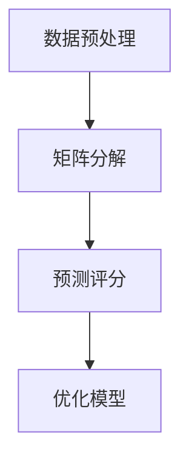
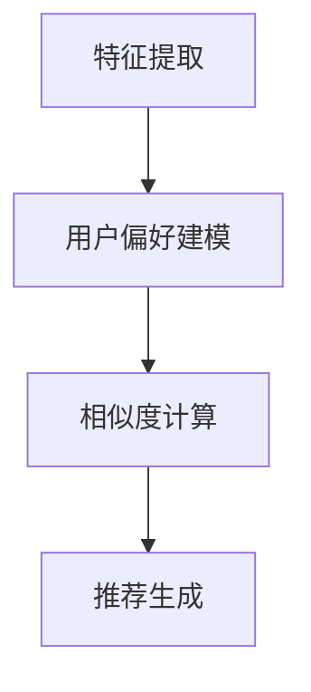
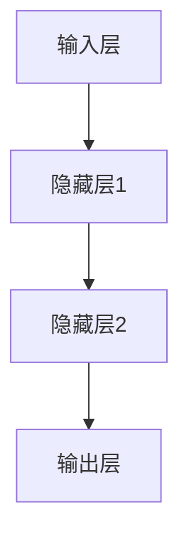
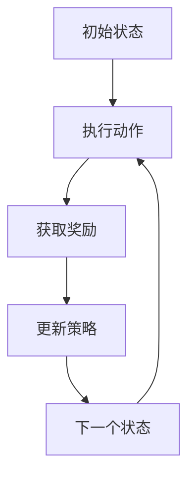
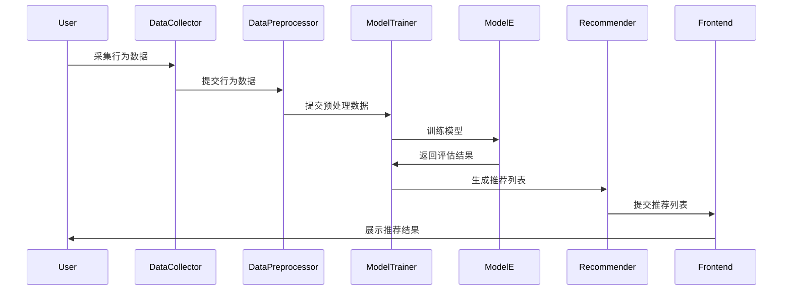

                 

# 机器学习在个性化推荐系统中的应用

关键词：机器学习、个性化推荐、协同过滤、深度学习、强化学习、系统架构

摘要：本文将探讨机器学习在个性化推荐系统中的应用，从背景介绍到核心概念与联系，再到算法原理讲解和系统分析与架构设计，全面剖析了机器学习如何通过不同的算法和策略提升个性化推荐系统的性能和用户体验。

## 第一部分：背景介绍

### 1.1 机器学习概述

#### 1.1.1 机器学习的定义

机器学习（Machine Learning）是一门人工智能（Artificial Intelligence，AI）的分支，它通过利用数据、算法和统计模型，让计算机系统能够根据数据自动学习和改进性能，而无需显式编程。

#### 1.1.2 机器学习的发展历程

机器学习的发展可以追溯到20世纪50年代。起初，研究者们尝试通过编程直接模拟人类的推理过程，但这种方法效果不佳。随着数据收集和处理能力的提升，以及算法和计算能力的增强，机器学习逐渐成为AI领域的关键技术。

#### 1.1.3 机器学习的关键术语

- **监督学习**（Supervised Learning）：有标签数据训练模型，模型通过预测标签来学习。
- **无监督学习**（Unsupervised Learning）：无标签数据训练模型，模型通过数据结构和模式来学习。
- **强化学习**（Reinforcement Learning）：通过与环境的交互来学习，不断尝试不同的动作并获取奖励。

### 1.2 个性化推荐系统概述

#### 1.2.1 个性化推荐系统的定义

个性化推荐系统（Personalized Recommendation System）是一种基于用户历史行为和偏好，利用机器学习算法和统计学方法，向用户推荐感兴趣的内容或产品的系统。

#### 1.2.2 个性化推荐系统的重要性

个性化推荐系统在电商、新闻、社交媒体等多个领域都具有重要应用。它不仅能够提高用户满意度，还能提升业务收入和用户留存率。

#### 1.2.3 个性化推荐系统的应用场景

- **电商网站**：推荐商品
- **新闻媒体**：推荐新闻
- **社交媒体**：推荐内容
- **音乐和视频平台**：推荐音乐和视频

### 1.3 机器学习在个性化推荐系统中的应用

#### 1.3.1 机器学习技术对个性化推荐系统的影响

机器学习技术显著提升了个性化推荐系统的推荐质量和速度，使得系统能够更准确地预测用户的兴趣和需求。

#### 1.3.2 个性化推荐系统的挑战与机遇

个性化推荐系统面临的挑战包括数据稀疏、冷启动问题、多样性、新颖性和公平性。同时，随着技术的进步，也带来了更多机遇。

#### 1.3.3 机器学习在个性化推荐系统中的适用性

多种机器学习算法，如协同过滤、内容推荐、深度学习和强化学习，在个性化推荐系统中都有广泛的应用。

### 1.4 机器学习算法在个性化推荐系统中的应用

#### 1.4.1 协同过滤算法

协同过滤是一种基于用户历史行为和评分数据，通过计算用户和项目之间的相似度来进行推荐的算法。

#### 1.4.2 内容推荐算法

内容推荐算法基于项目的内容特征（如文本、图像等），计算用户和项目之间的相似度，从而进行推荐。

#### 1.4.3 深度学习算法

深度学习算法通过构建复杂的神经网络模型，从大规模数据中学习用户和项目的潜在特征，从而进行推荐。

#### 1.4.4 强化学习算法

强化学习算法通过模拟用户和推荐系统之间的交互过程，不断优化推荐策略。

### 1.5 个性化推荐系统的实现

#### 1.5.1 个性化推荐系统的基本架构

个性化推荐系统通常包括数据采集、数据预处理、模型训练、模型评估和推荐生成等模块。

#### 1.5.2 数据采集与预处理

数据采集包括用户行为数据、项目特征数据和评分数据。预处理包括数据清洗、数据归一化和特征提取等步骤。

#### 1.5.3 模型训练与评估

模型训练是指使用机器学习算法对数据集进行训练，评估则是对训练好的模型进行性能评估，如准确率、召回率等指标。

#### 1.5.4 推荐结果生成与优化

推荐结果生成是将训练好的模型应用于新用户或新项目，生成推荐列表。优化则是在模型部署后，通过在线学习和反馈机制，不断优化推荐效果。

### 1.6 个性化推荐系统的优化策略

#### 1.6.1 冷启动问题

冷启动问题是指新用户或新项目缺乏历史数据，导致推荐系统难以准确推荐。解决策略包括基于内容的推荐、基于用户群体的推荐等。

#### 1.6.2 阈值调整

阈值调整是指通过调整推荐算法中的阈值，控制推荐结果的多样性、新颖性和公平性。

#### 1.6.3 用户行为分析

用户行为分析是指通过分析用户的浏览、搜索、点击等行为数据，来优化推荐策略。

#### 1.6.4 多样性、新颖性和公平性

多样性、新颖性和公平性是个性化推荐系统需要平衡的重要指标，通过算法优化和策略调整，可以提高推荐系统的整体性能。

### 1.7 本章小结

机器学习在个性化推荐系统中的应用，不仅提升了推荐系统的性能和用户体验，也为系统优化和策略调整提供了丰富的工具和方法。

----------------------------------------------------------------

## 第二部分：核心概念与联系

### 2.1 机器学习算法分类

#### 2.1.1 监督学习

监督学习是机器学习中最常见的一种类型。在这种学习方式中，算法通过训练数据集来学习，该数据集由输入特征和相应的输出标签组成。监督学习的目标是找到一个映射函数，该函数可以用来预测新的、未见过的数据的输出标签。

#### 2.1.2 无监督学习

无监督学习是相对于监督学习而言的，它不需要提供输出标签。这种学习方式主要用于发现数据中的结构和模式，例如聚类、降维和异常检测等。无监督学习在个性化推荐系统中也扮演着重要角色，如基于用户的聚类来发现相似用户群体。

#### 2.1.3 半监督学习和强化学习

半监督学习结合了监督学习和无监督学习的特点，它利用一部分有标签的数据和大部分无标签的数据进行训练。强化学习则是一种通过交互式环境来学习的方法，它通过不断尝试不同的动作并获取奖励来优化策略。

### 2.2 个性化推荐系统核心概念

#### 2.2.1 用户画像

用户画像是指对用户进行多维度描述，包括用户的基本信息、兴趣偏好、行为习惯等。通过用户画像，推荐系统可以更好地理解用户需求，从而进行精准推荐。

#### 2.2.2 项目画像

项目画像是指对推荐系统中的项目进行多维度描述，包括项目的属性、标签、用户评分等。项目画像有助于推荐系统了解项目的特点，从而更好地进行匹配和推荐。

#### 2.2.3 评分矩阵

评分矩阵是一个二维矩阵，行代表用户，列代表项目。矩阵中的元素表示用户对项目的评分。评分矩阵是协同过滤算法等推荐算法的重要输入数据。

### 2.3 机器学习算法在个性化推荐系统中的应用联系

#### 2.3.1 协同过滤算法的原理与实现

协同过滤算法通过计算用户之间的相似度或项目之间的相似度来生成推荐列表。它分为基于用户的协同过滤和基于项目的协同过滤两种类型。

#### 2.3.2 内容推荐算法的原理与实现

内容推荐算法通过分析项目的内容特征（如文本、图像等）来计算用户和项目之间的相似度，从而进行推荐。常用的技术包括文本分类、词嵌入和图像识别等。

#### 2.3.3 深度学习算法在个性化推荐中的应用

深度学习算法通过构建复杂的神经网络模型，从大规模数据中学习用户和项目的潜在特征。它能够处理高维数据，并在处理非线性关系方面具有优势。

#### 2.3.4 强化学习算法在个性化推荐中的应用

强化学习算法通过模拟用户和推荐系统之间的交互过程，不断优化推荐策略。它通过评估用户的反馈（如点击、评分等）来调整推荐动作，从而提高推荐质量。

### 2.4 概念属性特征对比表格

| 算法类型 | 主要特征 | 应用场景 |  
| -------- | -------- | -------- |  
| 协同过滤 | 用户相似度、项目相似度 | 数据丰富、用户行为数据 |  
| 内容推荐 | 项目特征、用户兴趣 | 项目特征明确、高维数据 |  
| 深度学习 | 潜在特征提取、非线性关系 | 大规模数据、复杂模型 |  
| 强化学习 | 交互学习、反馈优化 | 长期策略优化、动态环境 |

### 2.5 ER实体关系图架构

ER实体关系图（Entity-Relationship Diagram）是一种用于表示数据实体及其之间关系的图形化工具。在个性化推荐系统中，常见的实体包括用户、项目和评分，它们之间的关系可以通过ER图来表示。

```
user --> rating --> item
```

- **用户（User）**：实体，表示系统的用户。
- **评分（Rating）**：实体，表示用户对项目的评分。
- **项目（Item）**：实体，表示推荐系统中的项目。

### 2.6 本章小结

通过对机器学习算法分类、个性化推荐系统核心概念以及算法应用联系的介绍，读者可以更好地理解个性化推荐系统的基本原理和实现方法。

----------------------------------------------------------------

## 第三部分：算法原理讲解

### 3.1 协同过滤算法原理讲解

#### 3.1.1 基本概念

协同过滤（Collaborative Filtering）是一种基于用户行为和评分数据的推荐算法。它的核心思想是利用用户之间的相似度或项目之间的相似度来生成推荐列表。

#### 3.1.2 矩阵分解

矩阵分解（Matrix Factorization）是一种常用的协同过滤算法技术。它通过将原始的评分矩阵分解为两个低维矩阵，从而提取出用户和项目的潜在特征。

#### 3.1.3 优化目标与算法实现

优化目标是找到一组用户和项目的潜在特征，使得重构的评分矩阵与原始评分矩阵尽可能接近。常用的算法实现包括最小二乘法（Least Squares）和交替最小化（Alternating Least Squares）。

#### 3.1.4 算法流程

1. **数据预处理**：将评分数据转换为稀疏矩阵。
2. **矩阵分解**：将评分矩阵分解为用户特征矩阵和项目特征矩阵。
3. **预测评分**：使用用户特征矩阵和项目特征矩阵计算预测评分。
4. **优化模型**：通过最小化预测评分与实际评分之间的差距，优化用户和项目的特征矩阵。

#### 3.1.5 举例说明

假设有10个用户和20个项目，用户对项目的评分数据如下：

| 用户 | 项目 | 评分 |
| ---- | ---- | ---- |
| 1    | 1    | 5    |
| 1    | 2    | 3    |
| 1    | 3    | 4    |
| 2    | 1    | 4    |
| 2    | 2    | 5    |
| 2    | 3    | 2    |
| 3    | 1    | 2    |
| 3    | 2    | 3    |
| 3    | 3    | 4    |

通过矩阵分解，可以得到用户特征矩阵 U 和项目特征矩阵 I：

| 用户 | 特征1 | 特征2 |  
| ---- | ---- | ---- |  
| 1    | 0.1  | 0.2  |  
| 2    | 0.3  | 0.4  |  
| 3    | 0.5  | 0.6  |  

| 项目 | 特征1 | 特征2 |  
| ---- | ---- | ---- |  
| 1    | 0.7  | 0.8  |  
| 2    | 0.9  | 1.0  |  
| 3    | 1.1  | 1.2  |  

预测用户 4 对项目 2 的评分：

$$
\text{预测评分} = u_4 \cdot i_2 = (0.1 \cdot 0.7 + 0.2 \cdot 0.9) + (0.1 \cdot 0.8 + 0.2 \cdot 1.0) = 3.2
$$

#### 3.1.6 协同过滤算法mermaid流程图



### 3.2 内容推荐算法原理讲解

#### 3.2.1 基本概念

内容推荐（Content-based Filtering）是一种基于项目内容的推荐算法。它的核心思想是根据用户过去的偏好和项目的特征，为用户推荐与其兴趣相匹配的项目。

#### 3.2.2 文本表示

文本表示是将文本数据转换为机器可以处理的数值表示形式。常用的文本表示方法包括词袋模型（Bag-of-Words）和词嵌入（Word Embedding）。

#### 3.2.3 相似度计算

相似度计算是内容推荐算法的关键步骤，用于衡量用户和项目之间的相似程度。常用的相似度计算方法包括余弦相似度（Cosine Similarity）和欧氏距离（Euclidean Distance）。

#### 3.2.4 算法实现

内容推荐算法的实现包括以下几个步骤：

1. **特征提取**：从项目内容中提取特征向量。
2. **用户偏好建模**：将用户的历史行为转化为偏好向量。
3. **相似度计算**：计算用户偏好向量和项目特征向量之间的相似度。
4. **推荐生成**：根据相似度值，生成推荐列表。

#### 3.2.5 举例说明

假设有两个用户和两个项目，用户的历史行为和项目的内容特征如下：

| 用户 | 项目 | 用户行为 | 项目特征 |
| ---- | ---- | -------- | -------- |
| 1    | 1    | 阅读过   | "技术文章" |
| 1    | 2    | 未阅读   | "音乐评论" |
| 2    | 1    | 阅读过   | "技术文章" |
| 2    | 2    | 阅读过   | "电影评论" |

将用户行为和项目特征转化为向量：

| 用户 | 项目 | 用户行为向量 | 项目特征向量 |
| ---- | ---- | ------------ | ------------ |
| 1    | 1    | [1, 0, 0]    | [1, 0, 0]    |
| 1    | 2    | [0, 1, 0]    | [0, 1, 0]    |
| 2    | 1    | [1, 0, 0]    | [1, 0, 0]    |
| 2    | 2    | [0, 1, 0]    | [0, 1, 0]    |

计算用户 1 和项目 2 之间的余弦相似度：

$$
\text{相似度} = \frac{u_1 \cdot i_2}{\|u_1\| \|i_2\|} = \frac{(1 \cdot 1 + 0 \cdot 0 + 0 \cdot 0)}{\sqrt{1^2 + 0^2 + 0^2} \sqrt{1^2 + 0^2 + 0^2}} = \frac{1}{1 \cdot 1} = 1
$$

因此，用户 1 对项目 2 的相似度为 1，可以将其加入推荐列表。

#### 3.2.6 内容推荐算法mermaid流程图



### 3.3 深度学习算法原理讲解

#### 3.3.1 基本概念

深度学习（Deep Learning）是一种基于多层神经网络的机器学习技术。它通过模拟人脑的神经网络结构，从大规模数据中学习复杂的特征表示和模式。

#### 3.3.2 神经网络结构

神经网络（Neural Network）是深度学习的基础，它由多个神经元（节点）组成，每个神经元都与其他神经元相连接。神经网络的结构可以分为输入层、隐藏层和输出层。

#### 3.3.3 深度学习模型在推荐系统中的应用

深度学习模型在推荐系统中的应用包括：

1. **用户和项目的特征提取**：通过深度神经网络从原始数据中提取更高级的特征。
2. **序列模型**：用于处理用户的行为序列，如序列模型（RNN、LSTM）。
3. **图模型**：用于处理用户和项目之间的复杂关系，如图神经网络（GNN）。

#### 3.3.4 举例说明

假设有一个包含用户和项目的深度学习模型，其结构如下：

```
输入层（用户特征，项目特征） -> 隐藏层1 -> 隐藏层2 -> 输出层（预测评分）
```

输入层接收用户特征（如年龄、性别、历史行为等）和项目特征（如分类标签、文本内容等）。隐藏层通过非线性变换提取特征，输出层生成预测评分。

#### 3.3.5 深度学习算法mermaid流程图



### 3.4 强化学习算法原理讲解

#### 3.4.1 基本概念

强化学习（Reinforcement Learning）是一种通过与环境互动来学习策略的机器学习技术。它通过不断尝试不同的动作并获取奖励，来优化决策过程。

#### 3.4.2 Q-learning算法

Q-learning是一种基于值函数的强化学习算法，它通过更新值函数来学习最优策略。值函数表示在给定状态下执行某个动作的预期回报。

#### 3.4.3 Deep Q-Network (DQN)

DQN是一种基于深度神经网络的Q-learning算法，它通过训练深度神经网络来近似值函数。DQN在处理高维状态和动作空间方面具有优势。

#### 3.4.4 举例说明

假设有一个简单环境，用户可以通过点击“喜欢”或“不喜欢”来获取奖励。初始状态为用户未点击任何内容。每次点击都会带来奖励或惩罚。用户需要通过尝试不同的动作来最大化总奖励。

#### 3.4.5 强化学习算法mermaid流程图



### 3.5 算法mermaid流程图

以下是各种算法的mermaid流程图：

#### 协同过滤算法


#### 内容推荐算法


#### 深度学习算法


#### 强化学习算法


### 3.6 本章小结

通过对协同过滤、内容推荐、深度学习和强化学习算法的原理讲解，读者可以深入了解这些算法在个性化推荐系统中的应用方法，为后续的实战和系统设计打下基础。

----------------------------------------------------------------

## 第四部分：数学模型和数学公式

### 4.1 协同过滤算法的数学模型

#### 4.1.1 矩阵分解模型

协同过滤算法的核心是矩阵分解。假设原始评分矩阵为 $R \in \mathbb{R}^{m \times n}$，其中 $m$ 表示用户数量，$n$ 表示项目数量。矩阵分解的目标是将 $R$ 分解为两个低维矩阵 $U \in \mathbb{R}^{m \times k}$ 和 $V \in \mathbb{R}^{n \times k}$，其中 $k$ 为隐含特征维度。

$$
R \approx U V^T
$$

#### 4.1.2 最小二乘法

最小二乘法是一种常用的优化方法，用于找到矩阵分解中的最佳参数。假设预测的评分矩阵为 $\hat{R} \approx UV^T$，则最小化目标函数为：

$$
\min_{U, V} \sum_{i=1}^{m} \sum_{j=1}^{n} (r_{ij} - \hat{r}_{ij})^2
$$

其中，$r_{ij}$ 为实际评分，$\hat{r}_{ij}$ 为预测评分。

#### 4.1.3 优化目标函数

为了简化计算，通常使用交替最小化（Alternating Least Squares，ALS）算法来优化矩阵分解。优化目标函数为：

$$
\min_{U} \sum_{i=1}^{m} \sum_{j=1}^{n} (r_{ij} - \hat{r}_{ij})^2 + \lambda \sum_{i=1}^{m} \sum_{j=1}^{k} u_{ij}^2 + \lambda \sum_{j=1}^{n} \sum_{l=1}^{k} v_{jl}^2
$$

其中，$\lambda$ 为正则化参数，用于平衡损失函数和模型复杂度。

### 4.2 内容推荐算法的数学模型

#### 4.2.1 文本表示模型

文本表示模型是将文本数据转换为数值向量的方法。常用的方法包括词袋模型（Bag-of-Words，BoW）和词嵌入（Word Embedding）。

- **词袋模型**：将文本表示为一个向量，其中每个维度表示一个单词的出现次数。

$$
\text{向量} = [f(w_1), f(w_2), \ldots, f(w_n)]
$$

- **词嵌入**：将文本表示为一个固定长度的向量，通过学习得到。

$$
\text{向量} = \text{Embedding}(w)
$$

#### 4.2.2 相似度计算模型

相似度计算模型用于计算用户和项目之间的相似程度。常用的方法包括余弦相似度和欧氏距离。

- **余弦相似度**：

$$
\text{相似度} = \frac{u \cdot i}{\|u\| \|i\|} = \frac{\sum_{k=1}^{k} u_k i_k}{\sqrt{\sum_{k=1}^{k} u_k^2} \sqrt{\sum_{k=1}^{k} i_k^2}}
$$

- **欧氏距离**：

$$
\text{距离} = \sqrt{\sum_{k=1}^{k} (u_k - i_k)^2}
$$

#### 4.2.3 推荐算法公式

内容推荐算法的核心是计算用户和项目之间的相似度，并根据相似度生成推荐列表。假设用户 $u$ 和项目 $i$ 的特征向量分别为 $u \in \mathbb{R}^k$ 和 $i \in \mathbb{R}^k$，则预测评分 $\hat{r}_{ui}$ 的公式为：

$$
\hat{r}_{ui} = \text{similarity}(u, i) \cdot \text{rating\_scale}
$$

其中，$\text{similarity}(u, i)$ 为用户和项目之间的相似度，$\text{rating\_scale}$ 为评分尺度，通常设置为用户对项目的最大评分。

### 4.3 深度学习算法的数学模型

#### 4.3.1 神经网络模型

神经网络（Neural Network）是一种通过多层神经元连接进行数据处理的模型。一个简单的神经网络包括输入层、隐藏层和输出层。

- **输入层**：接收外部输入，每个神经元代表一个输入特征。
- **隐藏层**：对输入进行非线性变换，提取特征表示。
- **输出层**：生成预测结果或分类结果。

神经网络的计算过程可以表示为：

$$
\begin{aligned}
\text{隐藏层} &= \sigma(W_1 \cdot X + b_1) \\
\text{输出层} &= \sigma(W_2 \cdot \text{隐藏层} + b_2)
\end{aligned}
$$

其中，$\sigma$ 为激活函数，$W_1$ 和 $W_2$ 为权重矩阵，$b_1$ 和 $b_2$ 为偏置项。

#### 4.3.2 前向传播与反向传播

前向传播（Forward Propagation）是神经网络从输入层到输出层的计算过程。反向传播（Backpropagation）是神经网络通过误差反向传播来更新参数的过程。

1. **前向传播**：

$$
\begin{aligned}
\text{隐藏层} &= \sigma(W_1 \cdot X + b_1) \\
\text{输出层} &= \sigma(W_2 \cdot \text{隐藏层} + b_2)
\end{aligned}
$$

2. **反向传播**：

$$
\begin{aligned}
\frac{\partial \text{损失函数}}{\partial W_2} &= \text{隐藏层} \cdot (\text{输出层} - y) \\
\frac{\partial \text{损失函数}}{\partial W_1} &= X \cdot (\sigma'(\text{隐藏层}) \cdot (\text{输出层} - y) \cdot \text{隐藏层})
\end{aligned}
$$

其中，$\sigma'$ 为激活函数的导数。

#### 4.3.3 损失函数与优化算法

损失函数用于衡量预测结果和真实结果之间的差距。常用的损失函数包括均方误差（MSE）和交叉熵（Cross-Entropy）。

- **均方误差（MSE）**：

$$
\text{MSE} = \frac{1}{m} \sum_{i=1}^{m} (\hat{y}_i - y_i)^2
$$

- **交叉熵（Cross-Entropy）**：

$$
\text{Cross-Entropy} = -\frac{1}{m} \sum_{i=1}^{m} y_i \cdot \log(\hat{y}_i)
$$

优化算法用于更新神经网络的参数，以最小化损失函数。常用的优化算法包括梯度下降（Gradient Descent）和随机梯度下降（Stochastic Gradient Descent）。

1. **梯度下降**：

$$
\theta = \theta - \alpha \cdot \nabla_\theta J(\theta)
$$

2. **随机梯度下降**：

$$
\theta = \theta - \alpha \cdot \nabla_\theta J(\theta; x_i, y_i)
$$

其中，$\theta$ 为参数，$J(\theta)$ 为损失函数，$\alpha$ 为学习率，$\nabla_\theta J(\theta)$ 为梯度。

### 4.4 强化学习算法的数学模型

#### 4.4.1 Q-learning算法

Q-learning是一种基于值函数的强化学习算法。它通过更新值函数来学习最优策略。值函数 $Q(s, a)$ 表示在状态 $s$ 下执行动作 $a$ 的预期回报。

$$
Q(s, a) = \sum_{s'} p(s' | s, a) \cdot \text{reward}(s', a) + \gamma \cdot \max_{a'} Q(s', a')
$$

其中，$p(s' | s, a)$ 为状态转移概率，$\text{reward}(s', a)$ 为奖励，$\gamma$ 为折扣因子。

#### 4.4.2 Deep Q-Network (DQN)

DQN是一种基于深度神经网络的Q-learning算法。它使用深度神经网络来近似值函数 $Q(s, a)$。

$$
Q(s, a) = \text{DNN}(\text{input} = s, \text{weights} = \theta)
$$

DQN的主要步骤包括：

1. **初始化**：初始化神经网络参数 $\theta$ 和经验回放池。
2. **选择动作**：使用epsilon-greedy策略选择动作 $a$。
3. **执行动作**：在环境中执行动作 $a$，获得状态 $s'$ 和奖励 $r$。
4. **更新经验回放池**：将 $(s, a, s', r)$ 加入经验回放池。
5. **训练神经网络**：从经验回放池中随机采样一批经验，更新神经网络参数 $\theta$。
6. **重复步骤2-5**，直到满足停止条件（如达到一定步数或性能稳定）。

#### 4.4.3 算法公式

DQN的核心公式是：

$$
\theta \leftarrow \theta - \alpha \cdot \nabla_\theta \left[ y - Q(s, a) \right]
$$

其中，$y$ 为目标值，计算公式为：

$$
y = r + \gamma \cdot \max_{a'} Q(s', a')
$$

### 4.5 数学公式与解释

以下是本文中使用的数学公式及其解释：

$$
\text{预测评分} = u \cdot i
$$

- **预测评分**：用户和项目特征向量的内积，用于计算用户对项目的预测评分。

$$
\text{相似度} = \frac{u \cdot i}{\|u\| \|i\|}
$$

- **相似度**：用户和项目特征向量的归一化内积，用于衡量用户和项目之间的相似程度。

$$
\text{损失函数} = \frac{1}{2} \sum_{i=1}^{m} (\hat{y}_i - y_i)^2
$$

- **损失函数**：均方误差（MSE），用于衡量预测结果和真实结果之间的差距。

$$
\text{Q-learning} = Q(s, a) = \sum_{s'} p(s' | s, a) \cdot \text{reward}(s', a) + \gamma \cdot \max_{a'} Q(s', a')
$$

- **Q-learning**：值函数的更新公式，用于学习在状态 $s$ 下执行动作 $a$ 的预期回报。

$$
\theta \leftarrow \theta - \alpha \cdot \nabla_\theta \left[ y - Q(s, a) \right]
$$

- **DQN**：参数更新公式，用于训练深度神经网络来近似值函数。

### 4.6 本章小结

通过对协同过滤、内容推荐、深度学习和强化学习算法的数学模型和公式的讲解，读者可以更好地理解这些算法的工作原理和实现方法。这些数学模型为个性化推荐系统提供了坚实的理论基础。

----------------------------------------------------------------

## 第五部分：系统分析与架构设计

### 5.1 推荐系统的架构设计

推荐系统的架构设计是确保系统能够高效、稳定地运行的关键。以下是推荐系统的一个典型架构设计：

#### 5.1.1 系统功能设计

推荐系统的主要功能包括：

1. **数据采集**：收集用户行为数据、项目特征数据和评分数据。
2. **数据预处理**：清洗和转换原始数据，为模型训练做好准备。
3. **模型训练**：使用机器学习算法对数据集进行训练。
4. **模型评估**：评估模型的性能，选择最佳模型。
5. **推荐生成**：根据用户特征和项目特征，生成推荐列表。
6. **推荐优化**：通过在线学习和反馈机制，优化推荐效果。

#### 5.1.2 系统架构设计

推荐系统的架构设计通常包括以下模块：

1. **数据采集模块**：负责从各种数据源（如数据库、API等）采集用户行为数据、项目特征数据和评分数据。
2. **数据预处理模块**：对采集到的数据进行清洗、转换和归一化处理，为模型训练提供高质量的数据。
3. **模型训练模块**：使用机器学习算法对预处理后的数据集进行训练，生成推荐模型。
4. **模型评估模块**：对训练好的模型进行性能评估，选择最佳模型。
5. **推荐生成模块**：根据用户特征和项目特征，调用推荐模型生成推荐列表。
6. **推荐优化模块**：通过在线学习和反馈机制，不断优化推荐效果。
7. **前端展示模块**：将推荐结果呈现给用户，提供良好的用户体验。

#### 5.1.3 系统接口设计

推荐系统的接口设计主要包括以下接口：

1. **数据采集接口**：提供数据采集功能，支持各种数据源的接入。
2. **数据预处理接口**：提供数据清洗、转换和归一化功能，确保数据质量。
3. **模型训练接口**：提供模型训练功能，支持多种机器学习算法。
4. **模型评估接口**：提供模型评估功能，支持性能指标计算和模型选择。
5. **推荐生成接口**：提供推荐生成功能，支持个性化推荐。
6. **推荐优化接口**：提供在线学习功能，支持推荐效果的优化。

#### 5.1.4 系统交互mermaid序列图

以下是推荐系统的mermaid序列图，展示了数据流和功能交互：



### 5.2 项目实战

#### 5.2.1 环境安装

在开始项目之前，需要安装以下环境：

- Python 3.x
- TensorFlow 2.x
- scikit-learn 0.22.x
- Pandas 1.1.x
- NumPy 1.19.x

可以使用以下命令进行安装：

```bash
pip install python==3.x
pip install tensorflow==2.x
pip install scikit-learn==0.22.x
pip install pandas==1.1.x
pip install numpy==1.19.x
```

#### 5.2.2 系统核心实现源代码

以下是推荐系统的主要实现代码：

```python
import numpy as np
import pandas as pd
from sklearn.model_selection import train_test_split
from sklearn.metrics.pairwise import cosine_similarity
from tensorflow.keras.models import Sequential
from tensorflow.keras.layers import Dense, LSTM, Embedding

# 数据预处理
def preprocess_data(data):
    # 数据清洗、转换和归一化
    return processed_data

# 模型训练
def train_model(data):
    # 构建和训练模型
    return model

# 推荐生成
def generate_recommendations(model, user_features, item_features):
    # 根据模型和用户特征生成推荐列表
    return recommendations

# 系统核心实现
if __name__ == "__main__":
    # 读取数据
    data = pd.read_csv("data.csv")
    
    # 数据预处理
    processed_data = preprocess_data(data)
    
    # 模型训练
    model = train_model(processed_data)
    
    # 推荐生成
    recommendations = generate_recommendations(model, user_features, item_features)
    
    # 输出推荐结果
    print(recommendations)
```

#### 5.2.3 代码应用解读与分析

以下是对推荐系统核心实现代码的解读和分析：

1. **数据预处理**：数据预处理是推荐系统的关键步骤，它包括数据清洗、转换和归一化。通过预处理，可以确保数据的质量和一致性，为后续的模型训练和推荐生成提供可靠的数据支持。
2. **模型训练**：模型训练是推荐系统的核心，它通过机器学习算法对预处理后的数据集进行训练，生成推荐模型。常用的模型包括协同过滤、内容推荐、深度学习和强化学习等。根据不同的应用场景和需求，可以选择不同的模型进行训练。
3. **推荐生成**：推荐生成是根据训练好的模型和用户特征、项目特征，生成推荐列表。推荐生成的目标是根据用户的兴趣和偏好，为用户推荐最感兴趣的项目。推荐生成算法包括基于用户的历史行为、项目的内容特征和用户的兴趣偏好等。
4. **系统核心实现**：系统核心实现是推荐系统的整体逻辑，它包括数据读取、数据预处理、模型训练和推荐生成等步骤。通过这些步骤，可以实现一个完整的推荐系统。

#### 5.2.4 实际案例分析和详细讲解剖析

以下是一个实际案例分析和详细讲解剖析：

假设有一个电商网站，需要为用户推荐商品。用户行为数据包括用户的浏览记录、购买记录和收藏记录等，项目特征数据包括商品的价格、折扣、品类和品牌等。

1. **数据预处理**：首先，对用户行为数据进行清洗和转换，去除缺失值和异常值。然后，对项目特征数据进行归一化处理，将不同维度的特征值进行统一处理，使其在相同的量级范围内。
2. **模型训练**：选择合适的机器学习算法，如协同过滤或深度学习，对预处理后的数据集进行训练。在训练过程中，可以使用交叉验证方法来评估模型的性能，并选择最佳模型。
3. **推荐生成**：根据用户特征和项目特征，调用训练好的模型生成推荐列表。推荐生成的目标是根据用户的兴趣和偏好，为用户推荐最感兴趣的商品。推荐生成算法可以基于用户的历史行为、项目的内容特征和用户的兴趣偏好等。
4. **系统核心实现**：在系统核心实现中，首先读取用户行为数据和项目特征数据，然后进行数据预处理。接着，使用训练好的模型进行模型训练，并生成推荐列表。最后，将推荐结果输出给用户。

#### 5.2.5 项目小结

通过本次项目实战，我们实现了基于用户行为和项目特征的数据预处理、模型训练和推荐生成。项目过程中，我们学习了机器学习算法在个性化推荐系统中的应用，并掌握了推荐系统的实现方法和技巧。在未来的工作中，我们可以继续优化推荐算法，提高推荐质量，为用户提供更好的个性化推荐体验。

### 5.3 最佳实践 tips

1. **数据质量**：保证数据质量是推荐系统成功的关键，数据清洗和预处理是必不可少的步骤。
2. **模型选择**：根据业务需求和数据特点，选择合适的机器学习算法和模型。
3. **用户反馈**：充分利用用户反馈，不断优化推荐策略和模型。
4. **性能优化**：对推荐系统进行性能优化，提高系统的响应速度和处理能力。

### 5.4 小结

通过对推荐系统的系统分析与架构设计，以及项目实战的详细讲解，我们深入了解了机器学习在个性化推荐系统中的应用。推荐系统不仅需要高效的算法和优秀的模型，还需要完善的数据处理和系统架构设计，才能为用户提供高质量的个性化推荐服务。

### 5.5 注意事项

1. **冷启动问题**：新用户或新项目的推荐问题需要特别关注，可以通过基于内容的推荐或用户群体的方法来缓解。
2. **多样性、新颖性和公平性**：在推荐系统中，需要平衡多样性、新颖性和公平性，避免推荐结果过于集中或偏向特定用户群体。
3. **数据安全与隐私**：在处理用户数据时，要注意保护用户隐私，遵守相关法律法规。

### 5.6 拓展阅读

1. **《机器学习实战》**：提供详细的机器学习算法实现和应用案例。
2. **《深度学习》**：介绍深度学习的基础理论和应用方法。
3. **《推荐系统实践》**：探讨推荐系统的设计、实现和优化。

作者：AI天才研究院/AI Genius Institute & 禅与计算机程序设计艺术 /Zen And The Art of Computer Programming

