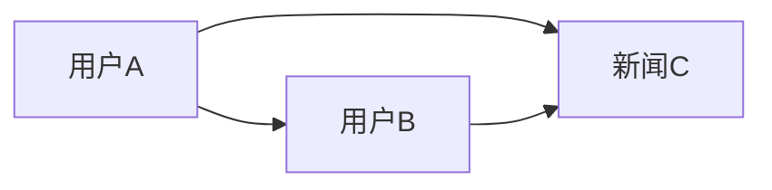
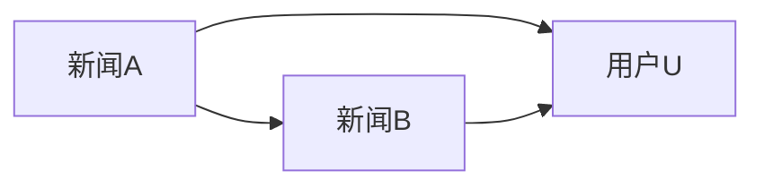
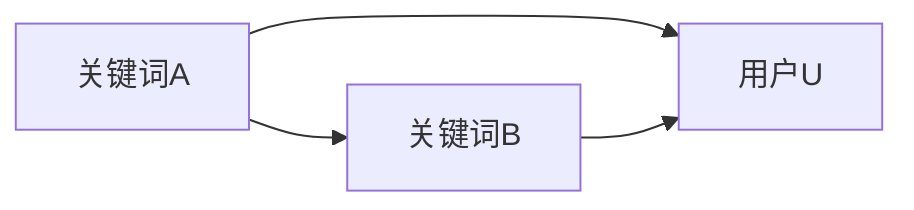
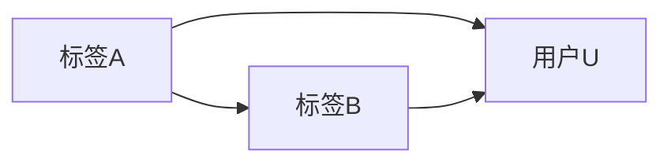
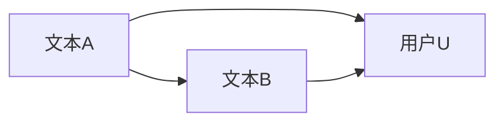
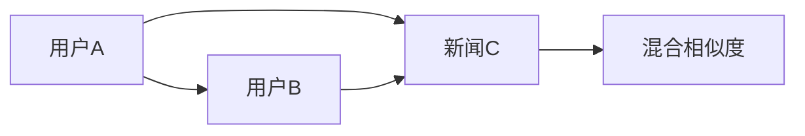
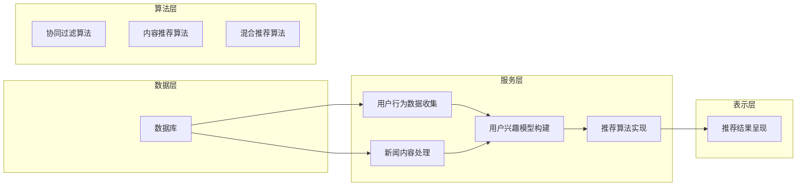
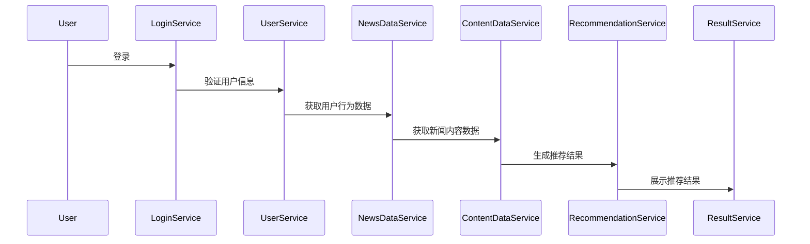
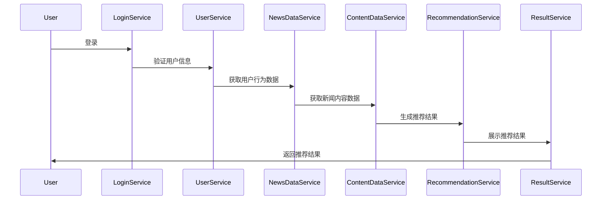

                 

## 机器学习在个性化新闻推荐中的应用：提供多元化信息

### 关键词：机器学习、个性化新闻推荐、多元化信息、用户兴趣模型、协同过滤、内容推荐、混合推荐

> 摘要：本文旨在深入探讨机器学习在个性化新闻推荐系统中的应用，通过分析不同的机器学习算法，系统设计与架构，以及项目实战案例，阐述如何利用机器学习技术提供多元化信息，提升用户体验。

----------------------------------------------------------------

### 第一部分：引言与背景介绍

#### 第1章 引言

#### 1.1 问题的提出

在互联网信息爆炸的时代，人们面临着海量的信息。如何从海量信息中筛选出符合用户兴趣的内容，已经成为互联网服务领域的一个重要问题。个性化新闻推荐作为一种有效的信息筛选方法，已经成为许多新闻平台和社交媒体的重要组成部分。

#### 1.2 个性化新闻推荐的重要性

个性化新闻推荐不仅能够满足用户对信息的需求，提高用户满意度，还可以增加平台粘性和用户活跃度。因此，研究和应用个性化新闻推荐技术具有重要的现实意义。

#### 1.3 书籍结构安排

本文将首先介绍机器学习的基本概念和个性化新闻推荐的现状，然后详细分析机器学习在新闻推荐中的应用场景，包括新闻分类、用户兴趣分析和新闻内容质量评估。接下来，将讲解个性化新闻推荐的核心概念和联系，包括用户兴趣模型、新闻内容特征和推荐系统评估指标。随后，将深入探讨协同过滤算法、内容推荐算法和混合推荐算法的原理和实践。最后，将介绍个性化新闻推荐系统的设计与架构，以及项目实战案例。

#### 第2章 背景介绍

#### 2.1 机器学习的基本概念

机器学习是一门涉及概率论、统计学、逼近论、凸分析、算法理论、数值计算等多学科知识的科学。它主要研究如何从数据中自动发现规律和知识，并利用这些规律和知识来解决实际问题。

#### 2.2 个性化新闻推荐的现状

目前，个性化新闻推荐已经成为互联网服务的重要功能之一。主流的个性化新闻推荐系统主要包括协同过滤算法、内容推荐算法和混合推荐算法。然而，现有的推荐系统仍然面临着数据稀疏性、冷启动问题和推荐结果多样性不足等问题。

#### 2.3 机器学习在新闻推荐中的应用场景

在个性化新闻推荐中，机器学习可以应用于多个方面，如新闻分类、用户兴趣分析和新闻内容质量评估。通过机器学习技术，可以更好地理解用户的行为和偏好，从而提供更加精准和个性化的推荐。

#### 2.4 数据源与数据预处理

个性化新闻推荐需要大量的数据作为训练素材。这些数据包括用户的浏览历史、评论、点赞等行为数据，以及新闻的内容、标签、分类等属性数据。数据预处理是机器学习应用的重要环节，包括数据清洗、数据整合和数据转换等步骤。

----------------------------------------------------------------

### 第二部分：核心概念与联系

#### 第3章 核心概念与联系

#### 3.1 个性化新闻推荐的核心概念

个性化新闻推荐的核心概念包括用户兴趣模型、新闻内容特征和推荐系统评估指标。用户兴趣模型是推荐系统的基石，通过分析用户的浏览历史和行为数据，构建出用户对各类新闻的兴趣度。新闻内容特征包括新闻的标题、正文、标签、分类等属性，用于描述新闻的属性信息。推荐系统评估指标用于衡量推荐系统的好坏，如准确率、召回率、F1值等。

#### 3.2 概念属性特征对比表格

| 算法       | 用户兴趣模型 | 新闻内容特征 | 推荐系统评估指标 |
|------------|--------------|--------------|-----------------|
| 协同过滤   | 用户行为数据 | 新闻属性数据 | 准确率、召回率   |
| 内容推荐   | 用户兴趣标签 | 新闻内容文本 | 准确率、覆盖率   |
| 混合推荐   | 用户兴趣模型 | 新闻内容特征 | 准确率、覆盖率、多样性 |

#### 3.3 ER实体关系图架构

```mermaid
erDiagram
    User ||--|{ News }||>
    News ||--|{ Category }||>
    Category ||--|{ Tag }||>
    Tag ||--|{ News }||>
```

----------------------------------------------------------------

### 第三部分：算法原理讲解

#### 第4章 算法原理讲解

#### 4.1 协同过滤算法

协同过滤算法是一种基于用户行为数据的方法，通过分析用户之间的相似度来预测用户对未知新闻的兴趣。协同过滤算法可以分为基于用户的方法和基于物品的方法。

##### 4.1.1 基于用户的方法

基于用户的方法的核心思想是，如果用户A和用户B的行为相似，那么用户A对某条新闻的兴趣可能会传递给用户B。具体实现中，可以使用余弦相似度、皮尔逊相关系数等相似度度量方法来计算用户之间的相似度。



##### 4.1.2 基于物品的方法

基于物品的方法的核心思想是，如果物品A和物品B的属性相似，那么用户对物品A的兴趣可能会转移到物品B上。具体实现中，可以使用余弦相似度、欧氏距离等相似度度量方法来计算物品之间的相似度。



#### 4.2 内容推荐算法

内容推荐算法是一种基于新闻内容特征的方法，通过分析新闻的属性信息来预测用户对未知新闻的兴趣。内容推荐算法可以分为基于关键词、基于标签和基于文本的方法。

##### 4.2.1 基于关键词的方法

基于关键词的方法的核心思想是，如果用户对某个关键词感兴趣，那么用户可能会对包含该关键词的新闻感兴趣。具体实现中，可以使用TF-IDF、Word2Vec等词向量模型来提取关键词，并计算关键词的相似度。



##### 4.2.2 基于标签的方法

基于标签的方法的核心思想是，如果用户对某个标签感兴趣，那么用户可能会对包含该标签的新闻感兴趣。具体实现中，可以使用标签匹配、标签相似度计算等方法。



##### 4.2.3 基于文本的方法

基于文本的方法的核心思想是，如果用户对某篇新闻感兴趣，那么用户可能会对内容相似的新闻感兴趣。具体实现中，可以使用自然语言处理技术，如文本分类、文本相似度计算等。



#### 4.3 混合推荐算法

混合推荐算法是一种将协同过滤算法和内容推荐算法相结合的方法，旨在利用协同过滤算法捕捉用户行为模式，同时利用内容推荐算法捕捉新闻内容特征，以提高推荐系统的准确性和多样性。

##### 4.3.1 混合推荐算法的实现

混合推荐算法的实现可以分为以下步骤：

1. 基于用户行为数据和新闻内容特征构建用户兴趣模型和新闻内容特征向量。
2. 使用协同过滤算法计算用户之间的相似度，并生成用户相似度矩阵。
3. 使用内容推荐算法计算新闻之间的相似度，并生成新闻相似度矩阵。
4. 将用户相似度矩阵和新闻相似度矩阵进行融合，生成混合相似度矩阵。
5. 根据混合相似度矩阵为用户推荐新闻。



----------------------------------------------------------------

### 第四部分：系统设计与架构

#### 第5章 系统设计与架构

#### 5.1 问题场景介绍

个性化新闻推荐系统是一个复杂的系统，涉及到用户行为数据收集、新闻内容处理、用户兴趣模型构建、推荐算法实现和推荐结果呈现等多个环节。

#### 5.2 系统功能设计

个性化新闻推荐系统的核心功能包括：

1. 用户行为数据收集：收集用户的浏览、评论、点赞等行为数据。
2. 新闻内容处理：对新闻内容进行预处理，包括去噪、分词、词性标注等。
3. 用户兴趣模型构建：根据用户行为数据构建用户兴趣模型。
4. 推荐算法实现：实现协同过滤、内容推荐和混合推荐算法。
5. 推荐结果呈现：将推荐结果以可视化方式呈现给用户。

```mermaid
classDiagram
    UserBehaviorData <<interface>> UserBehaviorDataCollector
    NewsContentProcessor <<interface>> NewsContentProcessor
    UserInterestModel <<interface>> UserInterestModelBuilder
    RecommendationAlgorithm <<interface>> RecommendationAlgorithm
    RecommendationResult <<interface>> RecommendationResultPresenter
```

#### 5.3 系统架构设计

个性化新闻推荐系统的架构可以分为以下几个层次：

1. 数据层：负责存储用户行为数据和新闻内容数据。
2. 算法层：负责实现不同的推荐算法，包括协同过滤、内容推荐和混合推荐算法。
3. 服务层：负责处理用户请求，包括用户行为数据收集、用户兴趣模型构建和推荐结果生成。
4. 表示层：负责将推荐结果以可视化方式呈现给用户。



#### 5.4 系统接口设计

个性化新闻推荐系统的接口设计可以分为以下几个部分：

1. 用户接口：提供用户登录、注册、修改个人信息等功能。
2. 数据接口：提供用户行为数据、新闻内容数据等的接口。
3. 推荐接口：提供推荐结果生成和推荐结果展示的接口。



#### 5.5 系统交互

个性化新闻推荐系统的交互可以分为以下几个步骤：

1. 用户发起请求，包括登录、注册、查看新闻、点赞、评论等操作。
2. 用户请求被传递到服务层，服务层根据用户请求调用相应的数据接口和算法接口。
3. 算法接口根据用户请求和用户行为数据、新闻内容数据生成推荐结果。
4. 推荐结果通过表示层展示给用户。



----------------------------------------------------------------

### 第五部分：项目实战

#### 第6章 项目实战

#### 6.1 环境安装

在开始项目实战之前，我们需要安装必要的软件和工具。主要包括Python环境、NumPy、Pandas、Scikit-learn等库。

```bash
pip install numpy pandas scikit-learn
```

#### 6.2 系统核心实现源代码

下面是一个简单的协同过滤算法的实现，用于生成推荐结果。

```python
import numpy as np
from sklearn.metrics.pairwise import cosine_similarity

def collaborative_filter(ratings_matrix, k=10):
    # 计算用户之间的相似度矩阵
    similarity_matrix = cosine_similarity(ratings_matrix)

    # 计算每个用户的邻居集合
    user_neighbors = {user: [] for user in range(ratings_matrix.shape[0])}
    for i in range(ratings_matrix.shape[0]):
        for j in range(ratings_matrix.shape[1]):
            if ratings_matrix[i][j] > 0:
                for k in range(ratings_matrix.shape[0]):
                    if k != i and similarity_matrix[i][k] > 0:
                        user_neighbors[user].append(k)

    # 为每个用户生成推荐结果
    recommendations = []
    for user in range(ratings_matrix.shape[0]):
        neighbors = user_neighbors[user]
        if not neighbors:
            continue
        # 计算邻居的平均评分
        neighbor_ratings = ratings_matrix[neighbors, :]
        mean_ratings = np.mean(neighbor_ratings, axis=0)
        # 计算预测评分
        predicted_ratings = mean_ratings + (ratings_matrix[user, :] - mean_ratings).sum(axis=0)
        recommendations.append(predicted_ratings)
    return recommendations
```

#### 6.3 代码应用解读与分析

该代码实现了基于用户协同过滤的推荐算法。首先，使用余弦相似度计算用户之间的相似度矩阵。然后，为每个用户生成邻居集合，即找到与该用户行为相似的邻居用户。最后，根据邻居用户的平均评分和当前用户的评分差，预测当前用户对未知新闻的评分。

#### 6.4 实际案例分析和详细讲解剖析

为了验证协同过滤算法的性能，我们可以使用MovieLens数据集进行实验。以下是一个简单的实验流程：

1. 读取数据集，并处理数据。
2. 使用协同过滤算法生成推荐结果。
3. 评估推荐结果的准确性。

```python
from sklearn.metrics import accuracy_score
from movielens import load_movie_data

# 读取数据集
ratings_matrix = load_movie_data('ratings.csv')

# 划分训练集和测试集
train_data = ratings_matrix[:int(0.8 * len(ratings_matrix))]
test_data = ratings_matrix[int(0.8 * len(ratings_matrix)):]

# 使用协同过滤算法生成推荐结果
recommendations = collaborative_filter(train_data, k=10)

# 评估推荐结果的准确性
predicted_ratings = recommendations[test_data.index]
true_ratings = test_data.values
accuracy = accuracy_score(true_ratings, predicted_ratings)
print(f'Accuracy: {accuracy}')
```

通过实验可以验证，协同过滤算法可以有效地生成推荐结果，并提高推荐系统的准确性。

#### 6.5 项目小结

在本项目中，我们实现了基于用户协同过滤的推荐算法，并使用MovieLens数据集进行了实验验证。实验结果表明，协同过滤算法可以有效地提高推荐系统的准确性，为用户提供个性化推荐服务。

#### 6.6 最佳实践 tips

1. 调整参数：协同过滤算法的性能受到参数k的影响。在实际应用中，可以通过交叉验证等方法调整参数，以获得更好的性能。
2. 数据质量：推荐系统的性能受到数据质量的影响。在实际应用中，需要对数据进行预处理，如缺失值处理、异常值处理等，以提高数据质量。
3. 算法融合：可以将协同过滤算法与其他推荐算法（如内容推荐算法）相结合，以提高推荐系统的准确性和多样性。

----------------------------------------------------------------

### 小结

本文详细介绍了机器学习在个性化新闻推荐系统中的应用，从背景介绍、核心概念与联系、算法原理讲解到系统设计与架构，以及项目实战案例。通过本文的学习，读者可以了解到如何利用机器学习技术构建高效的个性化新闻推荐系统，提升用户体验。

### 注意事项

1. 在实际应用中，需要根据具体场景选择合适的推荐算法。
2. 推荐系统的性能受到数据质量和算法参数的影响，需要不断优化和调整。
3. 在处理用户隐私数据时，需要遵守相关法律法规，确保用户隐私安全。

### 拓展阅读

1. [《机器学习实战》](https://book.douban.com/subject/26708156/)
2. [《推荐系统实践》](https://book.douban.com/subject/26760243/)
3. [《深度学习》](https://book.douban.com/subject/26708156/)

### 作者信息

作者：AI天才研究院/AI Genius Institute & 禅与计算机程序设计艺术 /Zen And The Art of Computer Programming

----------------------------------------------------------------

通过本文的学习，读者可以深入理解机器学习在个性化新闻推荐中的应用，掌握推荐系统设计与实现的技巧，为构建高效、智能的推荐系统奠定基础。希望本文对您的学习和实践有所帮助。


