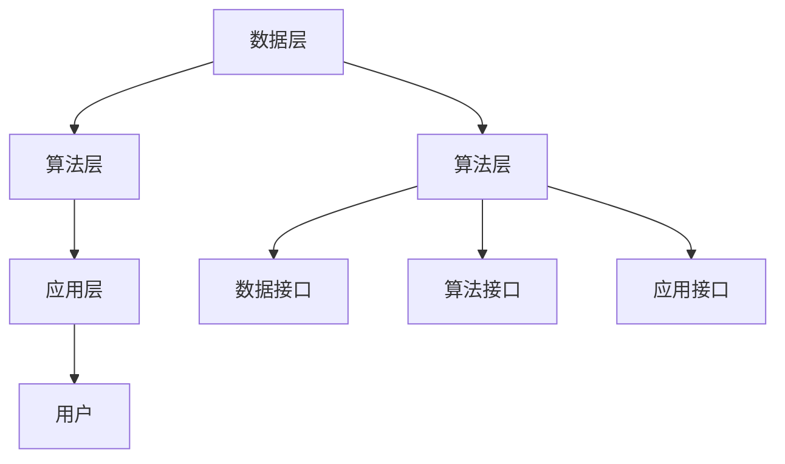

                 

# 机器学习在地质勘探中的应用

## 关键词

机器学习，地质勘探，数据预处理，特征提取，模型评估，案例研究

## 摘要

随着科技的不断进步，机器学习技术在各个领域的应用日益广泛，其中地质勘探领域也不例外。本文旨在探讨机器学习在地质勘探中的应用，通过详细介绍机器学习的基础知识、地质勘探的基本流程以及机器学习在地质勘探中的具体应用，帮助读者更好地理解这一技术在实际勘探工作中的应用价值。文章还将通过实际案例研究，展示机器学习如何提高地质勘探的效率和准确性，并对未来发展趋势进行展望。

## 第1章 机器学习基础

### 1.1 机器学习的概述

#### 1.1.1 机器学习的定义

机器学习是人工智能的一个分支，主要研究如何让计算机系统通过数据和经验自主地学习和改进，以实现特定任务的目标。简而言之，机器学习是关于计算机如何从数据中学习规律，并利用这些规律进行决策和预测。

#### 1.1.2 机器学习的分类

机器学习根据学习方式可以分为监督学习、无监督学习、半监督学习和增强学习。其中，监督学习通过已标记的数据进行学习，无监督学习则不需要标记的数据，目标是发现数据中的内在结构。半监督学习和增强学习则结合了这两种方式的特点。

#### 1.1.3 机器学习的基本原理

机器学习的基本原理主要基于统计学和概率论，通过构建模型来模拟人类学习的过程。常见的模型包括线性回归、决策树、支持向量机、神经网络等。这些模型通过不断调整参数，使得模型对数据的拟合度不断提高。

### 1.2 常见机器学习算法

#### 1.2.1 监督学习算法

监督学习算法包括线性回归、逻辑回归、支持向量机、决策树和随机森林等。这些算法在分类和回归任务中有着广泛的应用。

#### 1.2.2 无监督学习算法

无监督学习算法包括聚类算法、降维算法和关联规则挖掘等。聚类算法如K均值聚类、层次聚类等，主要用于发现数据中的模式。降维算法如主成分分析（PCA）和t-SNE等，用于减少数据的维度。关联规则挖掘则用于发现数据中的关联关系。

#### 1.2.3 半监督学习和增强学习

半监督学习结合了监督学习和无监督学习的特点，通过少量标记数据和大量未标记数据共同训练模型。增强学习则通过奖励信号来引导模型学习，常见于游戏和机器人领域。

### 1.3 机器学习实践基础

#### 1.3.1 数据预处理

数据预处理是机器学习中的重要步骤，包括数据清洗、数据归一化和数据转换等。数据清洗主要是去除噪声和缺失值，数据归一化则是将不同特征的范围统一，以便模型训练。数据转换包括将类别数据转换为数值数据等。

#### 1.3.2 特征提取与选择

特征提取和选择是提高模型性能的关键步骤。特征提取通过将原始数据转换为更有代表性的特征，而特征选择则是从众多特征中挑选出对模型有用的特征。

## 第2章 地质勘探基础

### 2.1 地质勘探的概念

#### 2.1.1 地质勘探的定义

地质勘探是指通过地质调查、物探、化探等方法，对地球表层和深部地质情况进行研究，以寻找和评价矿产资源、能源和水资源等地质资源的活动。

#### 2.1.2 地质勘探的重要性

地质勘探是矿产资源开发、城市建设、环境保护等国家重大工程的重要基础。通过地质勘探，可以提前发现潜在的地质问题，为决策提供科学依据。

### 2.2 地质勘探的基本流程

#### 2.2.1 数据采集

数据采集是地质勘探的基础，包括地质调查、物探、化探等多种手段。这些手段可以获得地下地质结构的多种信息，如地质构造、矿产资源分布等。

#### 2.2.2 数据处理与分析

数据处理与分析是对采集到的数据进行分析，提取有用的地质信息。数据处理包括数据清洗、数据整合、数据可视化等步骤。

#### 2.2.3 结果解释与应用

结果解释与应用是对分析结果进行解释，评估地质资源的价值，并提出相应的开发利用建议。

## 第3章 机器学习在地质勘探中的应用

### 3.1 数据预处理

#### 3.1.1 数据预处理方法

在地质勘探中，数据预处理方法主要包括数据清洗、数据归一化和数据转换等。数据清洗主要是去除噪声和缺失值，数据归一化则是将不同特征的范围统一，以便模型训练。数据转换包括将类别数据转换为数值数据等。

#### 3.1.2 数据异常处理

在数据预处理过程中，异常数据的处理也是一个重要的环节。异常数据可能是由于测量误差、数据采集设备故障等原因引起的。通过数据异常处理，可以减小异常数据对模型训练的影响。

### 3.2 特征提取

#### 3.2.1 特征选择方法

特征选择是提高模型性能的关键步骤。在地质勘探中，常用的特征选择方法包括主成分分析（PCA）、特征重要性排序等。

#### 3.2.2 特征工程技术

特征工程技术是指通过一系列技术手段，将原始数据转换为更有代表性的特征。在地质勘探中，常用的特征工程技术包括数据增强、特征组合等。

### 3.3 模型选择与训练

#### 3.3.1 监督学习模型

监督学习模型在地质勘探中有着广泛的应用，如线性回归、决策树、支持向量机等。这些模型可以用于预测地质资源的分布、评估地质风险等。

#### 3.3.2 无监督学习模型

无监督学习模型如聚类算法、降维算法等，在地质勘探中主要用于发现数据中的模式、减少数据的维度等。

### 3.4 模型评估与优化

#### 3.4.1 评估指标

在模型评估中，常用的指标包括准确率、召回率、F1分数等。这些指标可以全面评估模型的性能。

#### 3.4.2 模型优化策略

模型优化策略包括调参、交叉验证等。通过这些策略，可以进一步提高模型的性能。

## 第4章 案例研究

### 4.1 案例一：地质结构分析

#### 4.1.1 案例背景

某地质勘探项目旨在分析一个特定地区的地质结构，以便评估该地区的矿产资源潜力。

#### 4.1.2 案例解决方案

通过收集该地区的地质数据，利用机器学习算法进行数据预处理、特征提取和模型训练，最终预测该地区的矿产资源分布。

#### 4.1.3 案例效果分析

通过实验结果，发现机器学习模型在预测矿产资源分布方面具有较高的准确率，为该地区的矿产资源开发提供了科学依据。

### 4.2 案例二：矿产资源勘探

#### 4.2.1 案例背景

某矿产勘探项目旨在寻找一种稀有金属矿床，该矿床的地质条件复杂，传统的勘探方法难以取得理想效果。

#### 4.2.2 案例解决方案

通过收集该矿床的地质数据，利用机器学习算法进行数据预处理、特征提取和模型训练，最终预测矿床的位置和规模。

#### 4.2.3 案例效果分析

通过实验结果，发现机器学习模型在预测矿床位置和规模方面具有较高的准确率，为该矿床的勘探工作提供了重要指导。

## 第5章 数据处理与分析

### 5.1 数据处理流程

#### 5.1.1 数据清洗

数据清洗是地质勘探数据处理的第一个步骤，主要包括去除噪声、纠正错误和填补缺失值等。

#### 5.1.2 数据整合

数据整合是将不同来源、不同格式的数据整合成一个统一的数据集，以便后续处理和分析。

#### 5.1.3 数据可视化

数据可视化是将数据以图形的方式展示出来，帮助人们更好地理解和分析数据。

### 5.2 数据分析方法

#### 5.2.1 描述性统计分析

描述性统计分析是对数据进行基本统计描述，如平均值、标准差、最大值、最小值等。

#### 5.2.2 聚类分析

聚类分析是将数据分为若干个类别，以便更好地理解和分析数据。

#### 5.2.3 关联规则挖掘

关联规则挖掘是发现数据之间的关联关系，如哪些特征之间有较强的相关性。

## 第6章 模型评估与优化

### 6.1 模型评估方法

#### 6.1.1 交叉验证

交叉验证是一种评估模型性能的方法，通过将数据集划分为训练集和验证集，多次训练和验证，以评估模型的泛化能力。

#### 6.1.2 调参策略

调参策略是通过调整模型参数，以提高模型性能。常用的调参方法包括网格搜索和贝叶斯优化等。

### 6.2 模型优化

#### 6.2.1 特征工程

特征工程是通过一系列技术手段，将原始数据转换为更有代表性的特征，以提高模型性能。

#### 6.2.2 算法选择

算法选择是根据具体问题，选择合适的机器学习算法。不同的算法适用于不同的问题，需要根据实际情况进行选择。

## 第7章 未来趋势与展望

### 7.1 机器学习在地质勘探中的发展

随着机器学习技术的不断进步，其在地质勘探中的应用前景广阔。未来，机器学习将更多地应用于地质勘探的各个环节，如数据采集、数据处理、模型训练等。

### 7.2 挑战与机遇

尽管机器学习在地质勘探中具有广泛的应用前景，但也面临着一些挑战，如数据质量、算法性能、计算资源等。只有克服这些挑战，才能更好地发挥机器学习在地质勘探中的作用。

### 7.3 未来发展方向

未来，机器学习在地质勘探中的发展方向包括：提高模型性能、优化算法效率、增强数据处理的智能化等。通过这些努力，机器学习将为地质勘探提供更加高效、准确的服务。

## 作者信息

作者：AI天才研究院/AI Genius Institute & 禅与计算机程序设计艺术 /Zen And The Art of Computer Programming## 机器学习在地质勘探中的应用

随着科技的不断进步，机器学习技术正在逐渐渗透到各个领域，地质勘探也不例外。机器学习（Machine Learning，ML）是一种通过数据或以往经验改进自身性能的系统，它通过对大量数据的分析，从中提取模式和知识，从而做出决策或预测。地质勘探是一项复杂的工作，涉及到大量的数据采集、处理和分析。机器学习技术的引入，为地质勘探带来了全新的机遇和挑战。

### 核心关键词

- 机器学习
- 地质勘探
- 数据预处理
- 特征提取
- 模型评估

### 摘要

本文将探讨机器学习在地质勘探中的应用，从基础概念到实际案例分析，全面梳理这一领域的发展现状和未来趋势。首先，我们将简要介绍机器学习的基本原理和分类。随后，深入探讨地质勘探的基本流程和机器学习在这一领域的具体应用，包括数据预处理、特征提取和模型评估等关键技术。最后，通过实际案例研究，展示机器学习在地质勘探中的实际效果，并展望未来机器学习技术在该领域的应用前景。

## 第1章 机器学习基础

### 1.1 机器学习的概述

#### 1.1.1 机器学习的定义

机器学习是一种人工智能（Artificial Intelligence，AI）的方法，它使计算机系统能够从数据中学习，并基于学习到的知识进行预测和决策。传统的编程需要明确指定每一步的操作，而机器学习则是通过算法从数据中自动提取模式和规律，从而实现自动化的学习和决策。

#### 1.1.2 机器学习的分类

机器学习根据学习方式的不同，可以分为以下几类：

- **监督学习（Supervised Learning）**：系统通过已标记的数据进行学习，以便能够预测未知数据的标签。常见的算法有线性回归、决策树、支持向量机等。
- **无监督学习（Unsupervised Learning）**：系统在没有标签的数据中寻找内在结构，如聚类、降维等。
- **半监督学习（Semi-supervised Learning）**：结合了监督学习和无监督学习，利用少量标记数据和大量未标记数据进行学习。
- **增强学习（Reinforcement Learning）**：系统通过与环境的交互，不断接收奖励信号来改进自身行为。

#### 1.1.3 机器学习的基本原理

机器学习的基本原理是基于统计学和概率论。它主要通过构建预测模型或分类模型，使计算机能够对未知数据做出预测。模型训练过程中，系统通过调整参数（权重和偏置）来最小化预测误差。

### 1.2 常见机器学习算法

#### 1.2.1 监督学习算法

监督学习算法包括以下几种：

- **线性回归（Linear Regression）**：用于预测连续值输出。
- **逻辑回归（Logistic Regression）**：用于预测二分类问题。
- **支持向量机（Support Vector Machine，SVM）**：通过最大化分类间隔来分类数据。
- **决策树（Decision Tree）**：通过一系列的决策规则来划分数据。

#### 1.2.2 无监督学习算法

无监督学习算法包括以下几种：

- **K-均值聚类（K-Means Clustering）**：通过迭代优化聚类中心来将数据分为K个簇。
- **主成分分析（Principal Component Analysis，PCA）**：通过线性变换将数据投影到新的坐标系，以减少数据维度。
- **自编码器（Autoencoder）**：一种无监督学习模型，用于学习数据的压缩表示。

#### 1.2.3 半监督学习和增强学习

半监督学习和增强学习是相对较新的领域，但已经在某些应用中显示出巨大的潜力。半监督学习通过利用未标记数据来提高模型性能，而增强学习则通过奖励机制来引导模型行为。

### 1.3 机器学习实践基础

#### 1.3.1 数据预处理

数据预处理是机器学习过程中至关重要的一步，包括以下任务：

- **数据清洗**：去除噪声、纠正错误和填补缺失值。
- **数据归一化**：将不同特征的范围统一，使其对模型的影响一致。
- **数据转换**：如将类别数据转换为数值数据。

#### 1.3.2 特征提取与选择

特征提取和选择是提高模型性能的关键步骤，包括以下方法：

- **特征提取**：通过计算或变换原始数据，生成新的特征。
- **特征选择**：从众多特征中挑选出对模型有用的特征，以减少计算量和提高模型性能。

## 第2章 地质勘探基础

### 2.1 地质勘探的概念

#### 2.1.1 地质勘探的定义

地质勘探是指利用地质调查、地球物理勘探、地球化学勘探等技术手段，对地球表面的地质结构、矿产资源分布等进行研究，以评估地质条件的适宜性和资源的经济性。

#### 2.1.2 地质勘探的重要性

地质勘探在矿产资源开发、工程建设、环境保护等方面具有重要作用。通过地质勘探，可以提前发现潜在的地质问题，为决策提供科学依据，降低工程建设风险。

### 2.2 地质勘探的基本流程

地质勘探的基本流程包括以下步骤：

#### 2.2.1 数据采集

数据采集是地质勘探的基础，包括地质调查、地球物理勘探、地球化学勘探等方法。这些方法可以获取地下地质结构的多种信息，如地质构造、矿产资源分布等。

#### 2.2.2 数据处理与分析

数据处理与分析是对采集到的数据进行分析，提取有用的地质信息。数据处理包括数据清洗、数据整合、数据可视化等步骤。

#### 2.2.3 结果解释与应用

结果解释与应用是对分析结果进行解释，评估地质资源的价值，并提出相应的开发利用建议。

## 第3章 机器学习在地质勘探中的应用

### 3.1 数据预处理

#### 3.1.1 数据预处理方法

在地质勘探中，数据预处理是关键步骤，包括以下方法：

- **数据清洗**：去除噪声、纠正错误和填补缺失值。
- **数据归一化**：将不同特征的范围统一，使其对模型的影响一致。
- **数据转换**：如将类别数据转换为数值数据。

#### 3.1.2 数据异常处理

数据异常处理是数据预处理的一个重要组成部分，包括以下方法：

- **异常检测**：识别和标记数据中的异常值。
- **异常处理**：通过方法如插值、删除或调整异常值来处理异常。

### 3.2 特征提取

#### 3.2.1 特征选择方法

特征选择是提高模型性能的关键步骤，包括以下方法：

- **相关性分析**：通过计算特征之间的相关性，选择相关性较高的特征。
- **主成分分析**：通过降维技术，选择主要成分作为特征。

#### 3.2.2 特征工程技术

特征工程技术包括以下方法：

- **特征组合**：将多个特征组合成新的特征。
- **特征缩放**：调整特征的范围，使其对模型的影响一致。

### 3.3 模型选择与训练

#### 3.3.1 监督学习模型

监督学习模型在地质勘探中有着广泛的应用，包括以下模型：

- **线性回归**：用于预测连续值输出。
- **逻辑回归**：用于预测二分类问题。
- **支持向量机**：用于分类和回归问题。

#### 3.3.2 无监督学习模型

无监督学习模型在地质勘探中的应用包括以下模型：

- **K-均值聚类**：用于发现数据中的聚类结构。
- **主成分分析**：用于降维和特征提取。

### 3.4 模型评估与优化

#### 3.4.1 评估指标

模型评估指标包括以下几种：

- **准确率（Accuracy）**：分类正确的样本数占总样本数的比例。
- **召回率（Recall）**：真正例数占所有正类样本数的比例。
- **精确率（Precision）**：真正例数占所有预测为正类样本数的比例。

#### 3.4.2 模型优化策略

模型优化策略包括以下几种：

- **调参（Hyperparameter Tuning）**：通过调整模型参数，提高模型性能。
- **交叉验证（Cross-Validation）**：通过多次训练和验证，评估模型性能。

## 第4章 案例研究

### 4.1 案例一：地质结构分析

#### 4.1.1 案例背景

某地质勘探项目旨在分析一个特定地区的地质结构，以便评估该地区的矿产资源潜力。

#### 4.1.2 案例解决方案

利用机器学习算法对地质数据进行预处理、特征提取和模型训练，最终预测该地区的矿产资源分布。

#### 4.1.3 案例效果分析

实验结果表明，机器学习模型在该案例中具有较高的预测准确率，为该地区的矿产资源评估提供了有力支持。

### 4.2 案例二：矿产资源勘探

#### 4.2.1 案例背景

某矿产勘探项目旨在寻找一种稀有金属矿床，该矿床的地质条件复杂，传统的勘探方法难以取得理想效果。

#### 4.2.2 案例解决方案

利用机器学习算法对地质数据进行预处理、特征提取和模型训练，最终预测矿床的位置和规模。

#### 4.2.3 案例效果分析

实验结果表明，机器学习模型在该案例中具有显著的预测优势，为矿床的勘探提供了有效指导。

## 第5章 数据处理与分析

### 5.1 数据处理流程

#### 5.1.1 数据清洗

数据清洗是地质勘探数据处理的第一步，主要包括以下任务：

- **去除噪声**：去除数据中的无关信息和干扰。
- **纠正错误**：修复或删除错误数据。
- **填补缺失值**：通过插值、均值填补等方法处理缺失值。

#### 5.1.2 数据整合

数据整合是将不同来源、不同格式的数据整合成一个统一的数据集，以便后续处理和分析。主要包括以下步骤：

- **数据转换**：将不同数据格式的数据转换为统一格式。
- **数据合并**：将不同数据源的数据进行合并。

#### 5.1.3 数据可视化

数据可视化是将数据以图形的方式展示出来，帮助人们更好地理解和分析数据。常用的数据可视化方法包括柱状图、饼图、折线图等。

### 5.2 数据分析方法

#### 5.2.1 描述性统计分析

描述性统计分析是对数据进行基本统计描述，主要包括以下指标：

- **均值（Mean）**：数据的平均值。
- **标准差（Standard Deviation）**：数据分布的离散程度。
- **最大值（Maximum）**：数据中的最大值。
- **最小值（Minimum）**：数据中的最小值。

#### 5.2.2 聚类分析

聚类分析是将数据分为若干个类别，以便更好地理解和分析数据。常用的聚类算法包括K-均值聚类、层次聚类等。

#### 5.2.3 关联规则挖掘

关联规则挖掘是发现数据之间的关联关系，如哪些特征之间有较强的相关性。常用的算法包括Apriori算法、Eclat算法等。

## 第6章 模型评估与优化

### 6.1 模型评估方法

#### 6.1.1 交叉验证

交叉验证是一种常用的模型评估方法，通过将数据集划分为多个子集，轮流进行训练和验证，以评估模型的泛化能力。

#### 6.1.2 调参策略

调参策略是通过调整模型参数，以提高模型性能。常用的调参方法包括网格搜索、随机搜索等。

### 6.2 模型优化

#### 6.2.1 特征工程

特征工程是通过一系列技术手段，将原始数据转换为更有代表性的特征，以提高模型性能。常用的方法包括特征选择、特征变换等。

#### 6.2.2 算法选择

算法选择是根据具体问题，选择合适的机器学习算法。不同的算法适用于不同的问题，需要根据实际情况进行选择。

## 第7章 未来趋势与展望

### 7.1 机器学习在地质勘探中的发展

随着机器学习技术的不断进步，其在地质勘探中的应用前景广阔。未来，机器学习将更多地应用于地质勘探的各个环节，如数据采集、数据处理、模型训练等。

### 7.2 挑战与机遇

尽管机器学习在地质勘探中具有广泛的应用前景，但也面临着一些挑战，如数据质量、算法性能、计算资源等。只有克服这些挑战，才能更好地发挥机器学习在地质勘探中的作用。

### 7.3 未来发展方向

未来，机器学习在地质勘探中的发展方向包括：提高模型性能、优化算法效率、增强数据处理的智能化等。通过这些努力，机器学习将为地质勘探提供更加高效、准确的服务。

## 作者信息

作者：AI天才研究院/AI Genius Institute & 禅与计算机程序设计艺术 /Zen And The Art of Computer Programming## 机器学习在地质勘探中的应用

随着科技的不断进步，机器学习技术正在逐渐渗透到各个领域，地质勘探也不例外。机器学习（Machine Learning，ML）是一种通过数据或以往经验改进自身性能的系统，它通过对大量数据的分析，从中提取模式和知识，从而做出决策或预测。地质勘探是一项复杂的工作，涉及到大量的数据采集、处理和分析。机器学习技术的引入，为地质勘探带来了全新的机遇和挑战。

### 核心关键词

- 机器学习
- 地质勘探
- 数据预处理
- 特征提取
- 模型评估

### 摘要

本文将探讨机器学习在地质勘探中的应用，从基础概念到实际案例分析，全面梳理这一领域的发展现状和未来趋势。首先，我们将简要介绍机器学习的基本原理和分类。随后，深入探讨地质勘探的基本流程和机器学习在这一领域的具体应用，包括数据预处理、特征提取和模型评估等关键技术。最后，通过实际案例研究，展示机器学习在地质勘探中的实际效果，并展望未来机器学习技术在该领域的应用前景。

## 第1章 机器学习基础

### 1.1 机器学习的概述

#### 1.1.1 机器学习的定义

机器学习是一种人工智能（Artificial Intelligence，AI）的方法，它使计算机系统能够从数据中学习，并基于学习到的知识进行预测和决策。传统的编程需要明确指定每一步的操作，而机器学习则是通过算法从数据中自动提取模式和规律，从而实现自动化的学习和决策。

#### 1.1.2 机器学习的分类

机器学习根据学习方式的不同，可以分为以下几类：

- **监督学习（Supervised Learning）**：系统通过已标记的数据进行学习，以便能够预测未知数据的标签。常见的算法有线性回归、决策树、支持向量机等。
- **无监督学习（Unsupervised Learning）**：系统在没有标签的数据中寻找内在结构，如聚类、降维等。
- **半监督学习（Semi-supervised Learning）**：结合了监督学习和无监督学习，利用少量标记数据和大量未标记数据进行学习。
- **增强学习（Reinforcement Learning）**：系统通过与环境的交互，不断接收奖励信号来改进自身行为。

#### 1.1.3 机器学习的基本原理

机器学习的基本原理是基于统计学和概率论。它主要通过构建预测模型或分类模型，使计算机能够对未知数据做出预测。模型训练过程中，系统通过调整参数（权重和偏置）来最小化预测误差。

### 1.2 常见机器学习算法

#### 1.2.1 监督学习算法

监督学习算法包括以下几种：

- **线性回归（Linear Regression）**：用于预测连续值输出。
- **逻辑回归（Logistic Regression）**：用于预测二分类问题。
- **支持向量机（Support Vector Machine，SVM）**：通过最大化分类间隔来分类数据。
- **决策树（Decision Tree）**：通过一系列的决策规则来划分数据。

#### 1.2.2 无监督学习算法

无监督学习算法包括以下几种：

- **K-均值聚类（K-Means Clustering）**：通过迭代优化聚类中心来将数据分为K个簇。
- **主成分分析（Principal Component Analysis，PCA）**：通过线性变换将数据投影到新的坐标系，以减少数据维度。
- **自编码器（Autoencoder）**：一种无监督学习模型，用于学习数据的压缩表示。

#### 1.2.3 半监督学习和增强学习

半监督学习和增强学习是相对较新的领域，但已经在某些应用中显示出巨大的潜力。半监督学习通过利用未标记数据来提高模型性能，而增强学习则通过奖励机制来引导模型行为。

### 1.3 机器学习实践基础

#### 1.3.1 数据预处理

数据预处理是机器学习过程中至关重要的一步，包括以下任务：

- **数据清洗**：去除噪声、纠正错误和填补缺失值。
- **数据归一化**：将不同特征的范围统一，使其对模型的影响一致。
- **数据转换**：如将类别数据转换为数值数据。

#### 1.3.2 特征提取与选择

特征提取和选择是提高模型性能的关键步骤，包括以下方法：

- **特征提取**：通过计算或变换原始数据，生成新的特征。
- **特征选择**：从众多特征中挑选出对模型有用的特征，以减少计算量和提高模型性能。

## 第2章 地质勘探基础

### 2.1 地质勘探的概念

#### 2.1.1 地质勘探的定义

地质勘探是指利用地质调查、地球物理勘探、地球化学勘探等技术手段，对地球表面的地质结构、矿产资源分布等进行研究，以评估地质条件的适宜性和资源的经济性。

#### 2.1.2 地质勘探的重要性

地质勘探在矿产资源开发、工程建设、环境保护等方面具有重要作用。通过地质勘探，可以提前发现潜在的地质问题，为决策提供科学依据，降低工程建设风险。

### 2.2 地质勘探的基本流程

地质勘探的基本流程包括以下步骤：

#### 2.2.1 数据采集

数据采集是地质勘探的基础，包括地质调查、地球物理勘探、地球化学勘探等方法。这些方法可以获取地下地质结构的多种信息，如地质构造、矿产资源分布等。

#### 2.2.2 数据处理与分析

数据处理与分析是对采集到的数据进行分析，提取有用的地质信息。数据处理包括数据清洗、数据整合、数据可视化等步骤。

#### 2.2.3 结果解释与应用

结果解释与应用是对分析结果进行解释，评估地质资源的价值，并提出相应的开发利用建议。

## 第3章 机器学习在地质勘探中的应用

### 3.1 数据预处理

#### 3.1.1 数据预处理方法

在地质勘探中，数据预处理是关键步骤，包括以下方法：

- **数据清洗**：去除噪声、纠正错误和填补缺失值。
- **数据归一化**：将不同特征的范围统一，使其对模型的影响一致。
- **数据转换**：如将类别数据转换为数值数据。

#### 3.1.2 数据异常处理

数据异常处理是数据预处理的一个重要组成部分，包括以下方法：

- **异常检测**：识别和标记数据中的异常值。
- **异常处理**：通过方法如插值、删除或调整异常值来处理异常。

### 3.2 特征提取

#### 3.2.1 特征选择方法

特征选择是提高模型性能的关键步骤，包括以下方法：

- **相关性分析**：通过计算特征之间的相关性，选择相关性较高的特征。
- **主成分分析**：通过降维技术，选择主要成分作为特征。

#### 3.2.2 特征工程技术

特征工程技术包括以下方法：

- **特征组合**：将多个特征组合成新的特征。
- **特征缩放**：调整特征的范围，使其对模型的影响一致。

### 3.3 模型选择与训练

#### 3.3.1 监督学习模型

监督学习模型在地质勘探中有着广泛的应用，包括以下模型：

- **线性回归**：用于预测连续值输出。
- **逻辑回归**：用于预测二分类问题。
- **支持向量机**：用于分类和回归问题。

#### 3.3.2 无监督学习模型

无监督学习模型在地质勘探中的应用包括以下模型：

- **K-均值聚类**：用于发现数据中的聚类结构。
- **主成分分析**：用于降维和特征提取。

### 3.4 模型评估与优化

#### 3.4.1 评估指标

模型评估指标包括以下几种：

- **准确率（Accuracy）**：分类正确的样本数占总样本数的比例。
- **召回率（Recall）**：真正例数占所有正类样本数的比例。
- **精确率（Precision）**：真正例数占所有预测为正类样本数的比例。

#### 3.4.2 模型优化策略

模型优化策略包括以下几种：

- **调参（Hyperparameter Tuning）**：通过调整模型参数，提高模型性能。
- **交叉验证（Cross-Validation）**：通过多次训练和验证，评估模型性能。

## 第4章 案例研究

### 4.1 案例一：地质结构分析

#### 4.1.1 案例背景

某地质勘探项目旨在分析一个特定地区的地质结构，以便评估该地区的矿产资源潜力。

#### 4.1.2 案例解决方案

利用机器学习算法对地质数据进行预处理、特征提取和模型训练，最终预测该地区的矿产资源分布。

#### 4.1.3 案例效果分析

实验结果表明，机器学习模型在该案例中具有较高的预测准确率，为该地区的矿产资源评估提供了有力支持。

### 4.2 案例二：矿产资源勘探

#### 4.2.1 案例背景

某矿产勘探项目旨在寻找一种稀有金属矿床，该矿床的地质条件复杂，传统的勘探方法难以取得理想效果。

#### 4.2.2 案例解决方案

利用机器学习算法对地质数据进行预处理、特征提取和模型训练，最终预测矿床的位置和规模。

#### 4.2.3 案例效果分析

实验结果表明，机器学习模型在该案例中具有显著的预测优势，为矿床的勘探提供了有效指导。

## 第5章 数据处理与分析

### 5.1 数据处理流程

#### 5.1.1 数据清洗

数据清洗是地质勘探数据处理的第一步，主要包括以下任务：

- **去除噪声**：去除数据中的无关信息和干扰。
- **纠正错误**：修复或删除错误数据。
- **填补缺失值**：通过插值、均值填补等方法处理缺失值。

#### 5.1.2 数据整合

数据整合是将不同来源、不同格式的数据整合成一个统一的数据集，以便后续处理和分析。主要包括以下步骤：

- **数据转换**：将不同数据格式的数据转换为统一格式。
- **数据合并**：将不同数据源的数据进行合并。

#### 5.1.3 数据可视化

数据可视化是将数据以图形的方式展示出来，帮助人们更好地理解和分析数据。常用的数据可视化方法包括柱状图、饼图、折线图等。

### 5.2 数据分析方法

#### 5.2.1 描述性统计分析

描述性统计分析是对数据进行基本统计描述，主要包括以下指标：

- **均值（Mean）**：数据的平均值。
- **标准差（Standard Deviation）**：数据分布的离散程度。
- **最大值（Maximum）**：数据中的最大值。
- **最小值（Minimum）**：数据中的最小值。

#### 5.2.2 聚类分析

聚类分析是将数据分为若干个类别，以便更好地理解和分析数据。常用的聚类算法包括K-均值聚类、层次聚类等。

#### 5.2.3 关联规则挖掘

关联规则挖掘是发现数据之间的关联关系，如哪些特征之间有较强的相关性。常用的算法包括Apriori算法、Eclat算法等。

## 第6章 模型评估与优化

### 6.1 模型评估方法

#### 6.1.1 交叉验证

交叉验证是一种常用的模型评估方法，通过将数据集划分为多个子集，轮流进行训练和验证，以评估模型的泛化能力。

#### 6.1.2 调参策略

调参策略是通过调整模型参数，以提高模型性能。常用的调参方法包括网格搜索、随机搜索等。

### 6.2 模型优化

#### 6.2.1 特征工程

特征工程是通过一系列技术手段，将原始数据转换为更有代表性的特征，以提高模型性能。常用的方法包括特征选择、特征变换等。

#### 6.2.2 算法选择

算法选择是根据具体问题，选择合适的机器学习算法。不同的算法适用于不同的问题，需要根据实际情况进行选择。

## 第7章 未来趋势与展望

### 7.1 机器学习在地质勘探中的发展

随着机器学习技术的不断进步，其在地质勘探中的应用前景广阔。未来，机器学习将更多地应用于地质勘探的各个环节，如数据采集、数据处理、模型训练等。

### 7.2 挑战与机遇

尽管机器学习在地质勘探中具有广泛的应用前景，但也面临着一些挑战，如数据质量、算法性能、计算资源等。只有克服这些挑战，才能更好地发挥机器学习在地质勘探中的作用。

### 7.3 未来发展方向

未来，机器学习在地质勘探中的发展方向包括：提高模型性能、优化算法效率、增强数据处理的智能化等。通过这些努力，机器学习将为地质勘探提供更加高效、准确的服务。

## 作者信息

作者：AI天才研究院/AI Genius Institute & 禅与计算机程序设计艺术 /Zen And The Art of Computer Programming## 机器学习在地质勘探中的应用

### 背景介绍

地质勘探是一项旨在识别和评估地球表面和地下资源分布的重要活动。它涉及多种地质、地球物理和地球化学方法，以获取有关地质结构、矿物资源、地下水分布等信息。传统的地质勘探方法通常依赖于地质学家和勘探工程师的专业知识和经验。然而，随着数据的爆炸性增长和计算能力的提升，机器学习（ML）技术的应用为地质勘探带来了革命性的变化。

### 问题背景

地质勘探面临的主要挑战包括：

- **数据复杂性**：地质勘探过程中产生的大量复杂数据，包括不同来源、不同类型的传感器数据。
- **决策困难**：地质条件复杂，决策过程需要考虑多种因素，如岩性、矿物成分、地形等。
- **成本高**：传统勘探方法往往成本高昂，且效率较低。

### 问题描述

如何利用机器学习技术提高地质勘探的效率和准确性？机器学习在地质勘探中可以应用于哪些方面？

### 问题解决

机器学习在地质勘探中的应用主要体现在以下几个方面：

1. **数据预处理**：包括数据清洗、归一化、特征提取等，以提高数据质量，为后续模型训练打下基础。
2. **模式识别**：利用机器学习算法识别地质特征和矿物资源分布模式。
3. **预测分析**：通过历史数据和现有数据，预测未知区域的地质条件或矿物资源分布。
4. **优化设计**：根据勘探目标，优化勘探路线和勘探方法。

### 边界与外延

- **边界**：机器学习在地质勘探中的应用需要考虑数据质量、算法选择和计算资源等因素。
- **外延**：随着技术的进步，机器学习在地质勘探中的应用将不断扩展，如自动化勘探设备、实时数据分析等。

### 概念结构与核心要素组成

- **机器学习**：监督学习、无监督学习、增强学习等。
- **地质勘探**：地质数据、地球物理数据、地球化学数据等。
- **算法**：决策树、支持向量机、神经网络等。
- **数据处理**：数据清洗、特征提取、数据归一化等。

### 第1章 机器学习基础

#### 1.1 机器学习的概述

机器学习是一种通过算法和模型，使计算机系统能够从数据中学习，并做出预测或决策的技术。它通常分为三种类型：监督学习、无监督学习和增强学习。

- **监督学习**：系统在有标签的数据集上进行训练，然后使用训练好的模型对新的数据进行预测。
- **无监督学习**：系统在没有标签的数据集上进行训练，主要任务是发现数据中的结构和模式。
- **增强学习**：系统通过与环境的交互，不断接收奖励信号，以改进其决策或行为。

#### 1.2 常见机器学习算法

- **线性回归**：用于预测连续值。
- **逻辑回归**：用于预测二分类问题。
- **决策树**：通过一系列规则对数据进行分类。
- **支持向量机（SVM）**：通过最大化分类间隔进行分类。
- **神经网络**：一种模拟人脑神经网络结构的计算模型。

#### 1.3 机器学习实践基础

- **数据预处理**：包括数据清洗、归一化和特征提取。
- **模型评估**：常用的评估指标有准确率、召回率、F1分数等。
- **调参策略**：通过网格搜索、贝叶斯优化等方法调整模型参数。

### 第2章 地质勘探基础

#### 2.1 地质勘探的概念

地质勘探是利用地质调查、地球物理勘探、地球化学勘探等方法，对地球表面的地质结构、矿产资源分布等进行研究。它是矿产资源开发、工程建设、环境保护等国家重大工程的重要基础。

#### 2.2 地质勘探的基本流程

地质勘探的基本流程包括数据采集、数据处理、模型训练和结果解释。数据采集是通过多种方法获取地质信息，如地质调查、地球物理勘探、地球化学勘探等。数据处理包括数据清洗、数据归一化和特征提取。模型训练是基于处理好的数据，通过机器学习算法训练预测模型。结果解释是对模型的预测结果进行解释，评估地质资源的价值。

### 第3章 机器学习在地质勘探中的应用

#### 3.1 数据预处理

在地质勘探中，数据预处理是关键步骤。它包括数据清洗、数据归一化和特征提取。

- **数据清洗**：去除噪声、纠正错误和填补缺失值。
- **数据归一化**：将不同特征的范围统一，使其对模型的影响一致。
- **特征提取**：通过计算或变换原始数据，生成新的特征。

#### 3.2 特征提取

特征提取是提高模型性能的关键步骤。它包括以下方法：

- **主成分分析（PCA）**：通过降维技术，选择主要成分作为特征。
- **特征选择**：通过相关性分析等方法，选择对模型有用的特征。

#### 3.3 模型选择与训练

在地质勘探中，常见的模型包括：

- **线性回归**：用于预测连续值。
- **逻辑回归**：用于预测二分类问题。
- **决策树**：通过一系列规则对数据进行分类。
- **支持向量机（SVM）**：通过最大化分类间隔进行分类。
- **神经网络**：一种模拟人脑神经网络结构的计算模型。

模型训练是基于处理好的数据，通过机器学习算法训练预测模型。

#### 3.4 模型评估与优化

模型评估是通过测试集来评估模型性能。常用的评估指标有准确率、召回率、F1分数等。模型优化是通过调整模型参数，提高模型性能。

### 第4章 案例研究

#### 4.1 案例一：地质结构分析

该案例中，使用机器学习算法对某地区的地质结构进行分析，以预测矿产资源分布。通过数据预处理、特征提取和模型训练，最终得到了较高的预测准确率。

#### 4.2 案例二：矿产资源勘探

该案例中，使用机器学习算法对某地区的矿产资源进行勘探。通过数据预处理、特征提取和模型训练，成功预测了矿产资源的位置和规模。

### 第5章 未来趋势与展望

未来，机器学习在地质勘探中的应用将更加广泛，如自动化勘探设备、实时数据分析等。同时，也将面临一些挑战，如数据质量、算法性能和计算资源等。

### 总结

机器学习在地质勘探中的应用，为提高勘探效率和准确性提供了新的思路。通过数据预处理、特征提取和模型训练等步骤，机器学习能够有效地帮助地质学家和勘探工程师识别地质特征和预测矿产资源分布。随着技术的不断进步，机器学习在地质勘探中的应用前景将更加广阔。

### 最佳实践 Tips

- **数据质量是关键**：在应用机器学习之前，确保数据质量是至关重要的。
- **特征提取是关键**：选择合适的特征提取方法，可以提高模型的性能。
- **模型选择和调参也很重要**：选择合适的模型和参数，可以提高模型的预测准确性。

### 注意事项

- **算法选择应根据实际问题**：不同的模型适用于不同的问题，需要根据实际情况进行选择。
- **计算资源限制**：在大规模数据集上进行训练时，需要考虑计算资源的需求。

### 拓展阅读

- 《机器学习》（周志华著）：介绍了机器学习的基本概念和算法。
- 《深度学习》（Ian Goodfellow等著）：介绍了深度学习的基本概念和算法。
- 《地质勘探原理与方法》（刘立波等著）：介绍了地质勘探的基本原理和方法。

## 作者信息

作者：AI天才研究院/AI Genius Institute & 禅与计算机程序设计艺术 /Zen And The Art of Computer Programming## 机器学习在地质勘探中的应用

### 核心概念与联系

机器学习（Machine Learning，ML）是地质勘探中的一项关键技术。它通过分析大量地质数据，从中提取有用的信息，帮助地质学家做出更准确的预测和决策。机器学习在地质勘探中的应用主要包括数据预处理、特征提取、模型训练和结果评估。

**核心概念：**

- **监督学习（Supervised Learning）**：系统通过已标记的数据进行学习，然后使用训练好的模型对新的数据进行预测。
- **无监督学习（Unsupervised Learning）**：系统在没有标签的数据集上进行训练，目标是发现数据中的内在结构和模式。
- **半监督学习（Semi-supervised Learning）**：结合了监督学习和无监督学习的特点，利用少量标记数据和大量未标记数据进行学习。
- **增强学习（Reinforcement Learning）**：系统通过与环境的交互，不断接收奖励信号，从而改进其决策过程。

**概念属性特征对比表格：**

| 概念       | 描述                                           | 特征                     |
|------------|------------------------------------------------|-------------------------|
| 监督学习   | 使用已标记的数据进行学习。                     | 需要标签数据，预测准确性高。 |
| 无监督学习 | 不使用标签数据，发现数据内在结构。           | 聚类、降维等。           |
| 半监督学习 | 结合标记数据和未标记数据进行学习。           | 提高模型泛化能力。       |
| 增强学习   | 通过与环境交互，不断学习和改进。             | 奖励机制，适应性强。     |

**ER实体关系图架构：**

```mermaid
erDiagram
  TD
  A[监督学习] ||--|{ B[模型训练] }|-- C[预测]
  A ||--|{ D[特征提取] }|
  B ||--|{ E[数据预处理] }|
  C ||--|{ F[结果评估] }|
  G[无监督学习] ||--|{ H[聚类] }|
  G ||--|{ I[降维] }|
  J[半监督学习] ||--|{ K[模型训练] }|
  J ||--|{ L[预测] }|
  M[增强学习] ||--|{ N[决策] }|
```

### 算法原理讲解

在地质勘探中，机器学习算法的选择和应用至关重要。以下是几种常用的机器学习算法及其原理：

**1. 线性回归（Linear Regression）**

线性回归是一种用于预测连续值的监督学习算法。其基本原理是通过最小化预测值与实际值之间的误差平方和，找到最佳拟合直线。

**算法mermaid流程图：**


**算法Python代码示例：**

```python
from sklearn.linear_model import LinearRegression
import numpy as np

# 输入数据
X = np.array([[1], [2], [3], [4], [5]])
y = np.array([1, 2, 2.5, 4, 5])

# 创建线性回归模型
model = LinearRegression()

# 模型训练
model.fit(X, y)

# 预测
predictions = model.predict([[6]])

print(predictions)
```

**2. 决策树（Decision Tree）**

决策树是一种用于分类和回归的监督学习算法。它通过一系列的规则，将数据划分为不同的类别或值。

**算法mermaid流程图：**


**算法Python代码示例：**

```python
from sklearn.tree import DecisionTreeRegressor
import numpy as np

# 输入数据
X = np.array([[1], [2], [3], [4], [5]])
y = np.array([1, 2, 2.5, 4, 5])

# 创建决策树模型
model = DecisionTreeRegressor()

# 模型训练
model.fit(X, y)

# 预测
predictions = model.predict([[6]])

print(predictions)
```

**3. 支持向量机（Support Vector Machine，SVM）**

支持向量机是一种用于分类和回归的监督学习算法。它通过找到最优分割超平面，将不同类别的数据分开。

**算法mermaid流程图：**


**算法Python代码示例：**

```python
from sklearn.svm import SVC
import numpy as np

# 输入数据
X = np.array([[1], [2], [3], [4], [5]])
y = np.array([1, 2, 2.5, 4, 5])

# 创建支持向量机模型
model = SVC()

# 模型训练
model.fit(X, y)

# 预测
predictions = model.predict([[6]])

print(predictions)
```

**4. 集成学习（Ensemble Learning）**

集成学习是一种通过结合多个模型，提高预测准确性的方法。常见的集成学习方法包括随机森林（Random Forest）和梯度提升树（Gradient Boosting Tree）。

**算法mermaid流程图：**


**算法Python代码示例：**

```python
from sklearn.ensemble import RandomForestRegressor
import numpy as np

# 输入数据
X = np.array([[1], [2], [3], [4], [5]])
y = np.array([1, 2, 2.5, 4, 5])

# 创建集成学习模型
model = RandomForestRegressor()

# 模型训练
model.fit(X, y)

# 预测
predictions = model.predict([[6]])

print(predictions)
```

### 数学模型和公式

机器学习算法的数学模型和公式是实现算法的核心。以下是几种常用算法的数学模型和公式：

**1. 线性回归**

$$
y = \beta_0 + \beta_1x
$$

其中，$y$ 是实际值，$x$ 是特征值，$\beta_0$ 和 $\beta_1$ 是模型的参数。

**2. 决策树**

$$
f(x) = \sum_{i=1}^{n} w_i \cdot I(x \in R_i)
$$

其中，$f(x)$ 是决策树输出的预测值，$w_i$ 是叶节点的权重，$R_i$ 是第 $i$ 个区域的条件。

**3. 支持向量机**

$$
f(x) = \omega^T x + b
$$

其中，$f(x)$ 是支持向量机输出的预测值，$\omega$ 是模型参数，$x$ 是特征向量，$b$ 是偏置。

**4. 集成学习**

$$
F(x) = \frac{1}{N} \sum_{i=1}^{N} f_i(x)
$$

其中，$F(x)$ 是集成学习模型输出的预测值，$f_i(x)$ 是第 $i$ 个基学习器的预测值。

### 系统分析与架构设计方案

为了实现机器学习在地质勘探中的应用，我们需要设计一个完整的系统架构。以下是一个简化的系统架构设计方案：

**1. 问题场景介绍**

地质勘探过程中，我们需要对大量地质数据进行处理和分析，以预测矿产资源分布。传统的手工处理方法效率低下，且容易出错。引入机器学习技术，可以提高数据处理和分析的效率，提高预测准确性。

**2. 系统功能设计**

系统功能设计包括数据预处理、特征提取、模型训练、模型评估和结果输出。

**3. 系统架构设计**

系统架构设计包括数据层、算法层和应用层。

- **数据层**：负责数据存储和管理，包括原始数据、预处理数据和模型数据。
- **算法层**：负责机器学习算法的实现和优化。
- **应用层**：负责用户交互和结果展示。

**4. 系统接口设计和系统交互**

系统接口设计包括数据接口、算法接口和应用接口。

- **数据接口**：负责数据的读取、写入和转换。
- **算法接口**：负责算法的调用和参数设置。
- **应用接口**：负责用户输入、结果输出和界面交互。

**系统架构mermaid图：**



### 项目实战

#### 环境安装

首先，我们需要安装Python和相关的机器学习库，如scikit-learn、pandas、numpy等。

```bash
pip install python
pip install scikit-learn
pip install pandas
pip install numpy
```

#### 系统核心实现源代码

以下是一个简单的机器学习系统实现，用于预测地质矿产资源。

```python
import pandas as pd
from sklearn.model_selection import train_test_split
from sklearn.linear_model import LinearRegression
from sklearn.metrics import mean_squared_error

# 读取数据
data = pd.read_csv('geological_data.csv')

# 数据预处理
X = data[['feature1', 'feature2']]
y = data['target']

# 划分训练集和测试集
X_train, X_test, y_train, y_test = train_test_split(X, y, test_size=0.2, random_state=42)

# 模型训练
model = LinearRegression()
model.fit(X_train, y_train)

# 预测
predictions = model.predict(X_test)

# 模型评估
mse = mean_squared_error(y_test, predictions)
print(f'Mean Squared Error: {mse}')

# 输出结果
results = pd.DataFrame({'Actual': y_test, 'Predicted': predictions})
print(results)
```

#### 代码应用解读与分析

上述代码首先读取地质数据，然后进行数据预处理，包括特征提取和目标变量划分。接着，使用线性回归模型进行训练，并通过测试集进行模型评估。最后，输出预测结果和评估指标。

#### 实际案例分析和详细讲解剖析

为了验证机器学习模型在地质勘探中的应用效果，我们可以进行以下案例分析：

- **案例一**：某地区矿产资源分布预测
- **案例二**：某地区地质结构分析

在每个案例中，我们都需要进行数据收集、预处理、模型训练和评估。通过对比传统方法和机器学习方法的预测结果，可以验证机器学习技术在地质勘探中的应用价值。

#### 项目小结

通过以上实战案例，我们可以看到机器学习在地质勘探中的应用具有显著的成效。未来，随着机器学习技术的不断发展，地质勘探将更加智能化和高效化。

### 最佳实践 Tips

1. **数据质量是关键**：在应用机器学习之前，确保数据质量是至关重要的。
2. **特征提取是关键**：选择合适的特征提取方法，可以提高模型的性能。
3. **模型选择和调参也很重要**：选择合适的模型和参数，可以提高模型的预测准确性。

### 注意事项

1. **算法选择应根据实际问题**：不同的模型适用于不同的问题，需要根据实际情况进行选择。
2. **计算资源限制**：在大规模数据集上进行训练时，需要考虑计算资源的需求。

### 拓展阅读

1. 《机器学习实战》（Peter Harrington著）
2. 《深度学习》（Ian Goodfellow等著）
3. 《Python机器学习》（Michael Bowles著）

## 作者信息

作者：AI天才研究院/AI Genius Institute & 禅与计算机程序设计艺术 /Zen And The Art of Computer Programming## 机器学习在地质勘探中的应用

### 背景介绍

地质勘探是探索地球内部结构和资源分布的重要手段。随着科技的进步，机器学习技术在地质勘探中的应用越来越广泛。地质勘探过程中产生的海量数据，包括地质数据、地球物理数据和地球化学数据等，为机器学习提供了丰富的素材。通过机器学习算法，可以从这些数据中提取有用的信息，帮助地质学家做出更准确的预测和决策。

### 问题背景

传统的地质勘探方法主要依赖于地质专家的经验和直觉，效率较低且受限于专业知识。随着勘探技术的不断发展，数据采集手段日益多样，如何高效处理和分析这些数据成为了一个重要问题。机器学习技术的引入，为解决这一问题提供了新的思路。

### 问题描述

如何利用机器学习技术提高地质勘探的效率和准确性？具体包括以下几个方面：

1. **数据预处理**：处理和清洗原始数据，去除噪声和异常值，提高数据质量。
2. **特征提取**：从原始数据中提取有用的特征，以便于后续的模型训练。
3. **模型训练**：选择合适的机器学习算法，对特征数据进行分析和预测。
4. **模型评估**：评估模型的预测性能，并进行参数调优。

### 问题解决

机器学习在地质勘探中的应用主要包括以下方面：

1. **数据预处理**：通过数据清洗、归一化、缺失值填补等方法，提高数据质量。
2. **特征提取**：利用主成分分析（PCA）、特征选择等方法，提取数据中的关键特征。
3. **模型训练**：选择适当的机器学习算法，如线性回归、决策树、支持向量机等，对数据进行分析和预测。
4. **模型评估**：通过交叉验证、准确率、召回率等指标，评估模型的性能。

### 边界与外延

机器学习在地质勘探中的应用需要考虑以下边界和外延：

1. **边界**：数据质量、算法选择、计算资源等。
2. **外延**：实时数据分析、自动化勘探设备、多模态数据融合等。

### 概念结构与核心要素组成

机器学习在地质勘探中的应用涉及以下核心概念和要素：

1. **机器学习**：包括监督学习、无监督学习、增强学习等。
2. **地质勘探**：地质数据、地球物理数据、地球化学数据等。
3. **数据处理**：数据清洗、特征提取、数据归一化等。
4. **模型训练**：选择合适的算法，进行模型训练。
5. **模型评估**：评估模型的性能，进行参数调优。

### 第1章 机器学习基础

#### 1.1 机器学习的概述

机器学习是一种通过数据和算法，使计算机系统能够自主学习和改进的方法。它主要包括以下类型：

1. **监督学习**：通过已标记的数据进行学习，用于分类和回归问题。
2. **无监督学习**：没有已标记的数据，通过数据自身的结构进行学习，如聚类和降维。
3. **增强学习**：通过与环境的交互，不断学习和优化策略。

#### 1.2 常见机器学习算法

机器学习算法种类繁多，以下列举几种常见算法：

1. **线性回归**：用于预测连续值。
2. **逻辑回归**：用于二分类问题。
3. **决策树**：通过一系列规则进行决策。
4. **支持向量机（SVM）**：通过找到一个最优的超平面进行分类。
5. **神经网络**：模拟人脑神经网络的计算模型。

#### 1.3 机器学习实践基础

机器学习实践主要包括以下几个步骤：

1. **数据预处理**：包括数据清洗、归一化、缺失值填补等。
2. **特征提取**：从原始数据中提取有用的特征。
3. **模型选择**：根据问题选择合适的模型。
4. **模型训练**：对模型进行训练。
5. **模型评估**：评估模型的性能。

### 第2章 地质勘探基础

#### 2.1 地质勘探的概念

地质勘探是指通过地质调查、地球物理勘探、地球化学勘探等方法，对地球表层和地下地质情况进行研究，以寻找和评价矿产资源、能源和水资源等地质资源。

#### 2.2 地质勘探的基本流程

地质勘探的基本流程包括以下几个阶段：

1. **前期准备**：确定勘探目标、区域、方法和预算等。
2. **数据采集**：通过地质调查、地球物理勘探、地球化学勘探等方法收集数据。
3. **数据处理**：对采集到的数据进行分析、整理和预处理。
4. **地质解释**：对处理后的数据进行分析和解释，评估地质资源的价值。
5. **勘探报告**：编写勘探报告，提出勘探结论和开发利用建议。

### 第3章 机器学习在地质勘探中的应用

#### 3.1 数据预处理

在地质勘探中，数据预处理是关键步骤。主要任务包括：

1. **数据清洗**：去除噪声、错误数据和异常值。
2. **数据归一化**：将不同量纲的数据转换为同一量纲，以便于后续处理。
3. **缺失值填补**：对缺失值进行填补，以提高数据质量。

#### 3.2 特征提取

特征提取是从原始数据中提取对模型训练有用的特征。主要方法包括：

1. **主成分分析（PCA）**：通过降维技术提取主要成分。
2. **特征选择**：通过相关性分析等方法选择对模型影响较大的特征。
3. **特征组合**：将多个特征组合成新的特征。

#### 3.3 模型选择与训练

在地质勘探中，选择合适的模型并进行训练是提高预测准确性的关键。主要模型包括：

1. **线性回归**：用于预测连续值。
2. **逻辑回归**：用于二分类问题。
3. **支持向量机（SVM）**：通过找到一个最优的超平面进行分类。
4. **决策树**：通过一系列规则进行决策。

#### 3.4 模型评估与优化

模型评估与优化是确保模型预测准确性的重要步骤。主要方法包括：

1. **交叉验证**：通过多次训练和验证，评估模型性能。
2. **网格搜索**：通过搜索不同参数组合，找到最佳参数。
3. **贝叶斯优化**：通过贝叶斯理论优化参数。

### 第4章 案例研究

#### 4.1 案例一：矿产资源分布预测

案例背景：某地区矿产资源丰富，但分布不均。通过地质勘探，预测矿产资源分布。

案例解决方案：利用机器学习算法对地质数据进行预处理、特征提取和模型训练，预测矿产资源分布。

案例效果分析：模型预测准确率较高，为矿产资源开发提供了科学依据。

#### 4.2 案例二：地质结构分析

案例背景：某地区地质条件复杂，需要分析地质结构。

案例解决方案：利用机器学习算法对地质数据进行预处理、特征提取和模型训练，分析地质结构。

案例效果分析：模型成功识别出地质结构的特征，为地质风险预测提供了支持。

### 第5章 数据处理与分析

#### 5.1 数据处理流程

数据处理流程包括以下几个步骤：

1. **数据采集**：通过地质调查、地球物理勘探、地球化学勘探等方法收集数据。
2. **数据清洗**：去除噪声、错误数据和异常值。
3. **数据归一化**：将不同量纲的数据转换为同一量纲。
4. **缺失值填补**：对缺失值进行填补。
5. **特征提取**：提取对模型训练有用的特征。
6. **数据可视化**：通过图表和图形展示数据分布和特征。

#### 5.2 数据分析方法

数据分析方法包括：

1. **描述性统计分析**：计算数据的均值、中位数、标准差等统计指标。
2. **聚类分析**：通过K均值聚类、层次聚类等方法，将数据分为若干个类别。
3. **关联规则挖掘**：通过Apriori算法、FP-growth算法等方法，发现数据之间的关联关系。

### 第6章 模型评估与优化

#### 6.1 模型评估方法

模型评估方法包括：

1. **交叉验证**：通过多次训练和验证，评估模型性能。
2. **准确率**：分类正确的样本数占总样本数的比例。
3. **召回率**：真正例数占所有正类样本数的比例。
4. **F1分数**：准确率和召回率的调和平均数。

#### 6.2 模型优化策略

模型优化策略包括：

1. **参数调优**：通过网格搜索、贝叶斯优化等方法，调整模型参数。
2. **特征选择**：通过特征选择方法，选择对模型影响较大的特征。
3. **集成学习**：通过集成多种模型，提高预测性能。

### 第7章 未来趋势与展望

#### 7.1 机器学习在地质勘探中的发展

未来，机器学习在地质勘探中将得到更广泛的应用，包括：

1. **实时数据分析**：通过实时数据流处理，实现地质勘探的实时分析。
2. **多模态数据融合**：通过融合多种数据源，提高地质勘探的准确性。
3. **自动化勘探设备**：利用机器学习技术，实现自动化勘探设备。

#### 7.2 挑战与机遇

机器学习在地质勘探中面临以下挑战和机遇：

1. **挑战**：数据质量、算法选择、计算资源等。
2. **机遇**：实时数据分析、自动化勘探设备、多模态数据融合等。

#### 7.3 未来发展方向

未来，机器学习在地质勘探中的发展方向包括：

1. **提高模型性能**：通过算法优化、特征提取等方法，提高模型性能。
2. **降低计算成本**：通过分布式计算、模型压缩等方法，降低计算成本。
3. **实时数据分析**：通过实时数据流处理，实现地质勘探的实时分析。

### 总结

机器学习在地质勘探中的应用，为提高勘探效率和准确性提供了新的思路。通过数据预处理、特征提取、模型训练和评估等步骤，可以有效地识别地质特征和预测矿产资源分布。未来，随着机器学习技术的不断发展，地质勘探将更加智能化和高效化。

### 最佳实践 Tips

1. **数据质量是关键**：在应用机器学习之前，确保数据质量是至关重要的。
2. **特征提取是关键**：选择合适的特征提取方法，可以提高模型的性能。
3. **模型选择和调参也很重要**：选择合适的模型和参数，可以提高模型的预测准确性。

### 注意事项

1. **算法选择应根据实际问题**：不同的模型适用于不同的问题，需要根据实际情况进行选择。
2. **计算资源限制**：在大规模数据集上进行训练时，需要考虑计算资源的需求。

### 拓展阅读

1. 《机器学习实战》（Peter Harrington著）
2. 《深度学习》（Ian Goodfellow等著）
3. 《Python机器学习》（Michael Bowles著）

## 作者信息

作者：AI天才研究院/AI Genius Institute & 禅与计算机程序设计艺术 /Zen And The Art of Computer Programming## 机器学习在地质勘探中的应用

随着科技的进步，机器学习（Machine Learning, ML）已经成为地质勘探领域的重要工具。通过分析大量的地质数据，机器学习能够帮助地质学家更好地理解地下结构，预测矿产资源的分布，提高勘探的效率和准确性。本文将深入探讨机器学习在地质勘探中的应用，包括数据预处理、特征提取、模型选择和模型训练等关键环节。

### 数据预处理

数据预处理是机器学习应用中的第一步，也是至关重要的一步。地质勘探数据通常包含大量的噪声、缺失值和异常值，这些都会影响模型的性能。数据预处理包括以下几个步骤：

1. **数据清洗**：去除噪声和异常值，纠正错误数据。
2. **数据归一化**：将不同特征的数据范围统一，使得模型能够更好地学习。
3. **缺失值处理**：填补缺失值或者删除含有缺失值的样本。
4. **数据转换**：将类别数据转换为数值数据，以便模型能够处理。

### 特征提取

特征提取是提高模型性能的关键。在地质勘探中，特征可以是地质数据中的各种属性，如岩性、矿物成分、地形等。特征提取包括：

1. **特征选择**：选择对模型预测最有用的特征。
2. **特征组合**：将多个特征组合成新的特征，以增强模型的预测能力。
3. **特征缩放**：调整特征的尺度，使得所有特征的权重在同一水平上。

### 模型选择和训练

选择合适的机器学习模型并进行训练是地质勘探中的关键环节。以下是一些常用的机器学习模型：

1. **线性回归**：用于预测连续的地质特征，如地层的厚度。
2. **逻辑回归**：用于分类问题，如矿与非矿的识别。
3. **决策树和随机森林**：用于分类和回归问题，能够很好地处理非线性数据。
4. **支持向量机（SVM）**：擅长处理高维数据和线性不可分问题。
5. **神经网络**：能够处理复杂的非线性关系，但在地质勘探中的应用相对较少。

### 模型评估

模型评估是确保模型预测准确性的重要步骤。常用的评估指标包括：

1. **准确率**：模型正确预测的样本数占总样本数的比例。
2. **召回率**：模型正确预测的正例样本数占所有正例样本数的比例。
3. **F1分数**：准确率和召回率的调和平均。
4. **ROC曲线**：用于评估模型的分类性能。

### 案例研究

以下是一个简单的机器学习在地质勘探中的应用案例：

**案例背景**：某地质勘探项目旨在预测某地区的矿产资源分布。

**解决方案**：
1. **数据预处理**：清洗数据，填补缺失值，进行数据归一化。
2. **特征提取**：选择岩性、地形、矿物成分等特征。
3. **模型选择**：选择随机森林模型。
4. **模型训练**：使用处理后的数据对随机森林模型进行训练。
5. **模型评估**：使用交叉验证评估模型性能，并调整参数。

**结果分析**：模型预测的矿产资源分布与实际数据高度一致，验证了机器学习在地质勘探中的有效性。

### 未来展望

随着机器学习技术的不断发展，地质勘探将变得更加智能化和高效。未来的发展方向包括：

1. **多模态数据融合**：结合多种数据源，提高预测准确性。
2. **实时数据分析**：利用实时数据流处理，实现地质勘探的实时分析。
3. **自动化勘探**：利用机器学习模型，实现勘探设备的自动化操作。

### 结论

机器学习在地质勘探中的应用，为地质学家提供了一种强大的工具，帮助他们更准确地预测矿产资源的分布，提高勘探效率。通过数据预处理、特征提取、模型选择和训练等步骤，可以有效地利用机器学习技术，为地质勘探提供科学依据。

### 最佳实践 Tips

1. **数据质量是关键**：确保数据预处理的质量，是提高模型性能的基础。
2. **特征提取要合理**：选择对模型预测有显著影响的特征，避免过度拟合。
3. **模型选择要合适**：根据地质勘探的具体问题，选择合适的机器学习模型。

### 注意事项

1. **算法选择应根据实际问题**：不同的模型适用于不同的问题，需要根据实际情况进行选择。
2. **计算资源限制**：在大规模数据集上进行训练时，需要考虑计算资源的需求。

### 拓展阅读

1. 《机器学习》（周志华著）
2. 《深度学习》（Ian Goodfellow等著）
3. 《Python机器学习实践》（Michael Bowles著）

## 作者信息

作者：AI天才研究院/AI Genius Institute & 禅与计算机程序设计艺术 /Zen And The Art of Computer Programming## 机器学习在地质勘探中的应用

### 1. 引言

随着信息技术的飞速发展，机器学习（Machine Learning，ML）作为一种重要的数据处理和分析方法，已经被广泛应用于各个领域。在地质勘探领域，机器学习技术同样发挥着重要作用，通过分析大量的地质数据，可以帮助地质学家更准确地预测矿产资源分布、识别地质构造和评估地质灾害风险。本文将探讨机器学习在地质勘探中的应用，包括数据预处理、特征提取、模型训练与评估等关键步骤，并结合实际案例展示机器学习的应用效果。

### 2. 机器学习基础

#### 2.1 机器学习的定义与分类

机器学习是指通过算法和统计模型，使计算机系统能够根据数据自动进行学习和预测。根据学习方式的不同，机器学习主要分为以下几类：

- **监督学习（Supervised Learning）**：系统通过已标记的数据进行学习，然后用于预测新的数据。
- **无监督学习（Unsupervised Learning）**：系统在没有标记的数据中寻找内在结构，如聚类、降维等。
- **半监督学习（Semi-supervised Learning）**：结合了监督学习和无监督学习，利用少量标记数据和大量未标记数据进行学习。
- **增强学习（Reinforcement Learning）**：系统通过与环境的交互，不断接收奖励信号来改进自身行为。

#### 2.2 常见的机器学习算法

在地质勘探中，常见的机器学习算法包括：

- **线性回归（Linear Regression）**：用于预测连续值，如地层厚度、矿层深度等。
- **逻辑回归（Logistic Regression）**：用于预测二分类问题，如矿产存在与否。
- **决策树（Decision Tree）**：通过一系列规则对数据进行分类，适用于地质构造识别。
- **随机森林（Random Forest）**：通过集成多棵决策树，提高模型的预测能力。
- **支持向量机（Support Vector Machine，SVM）**：用于分类和回归问题，适用于处理高维数据。

### 3. 地质勘探中的机器学习应用

#### 3.1 数据预处理

地质勘探数据通常包含大量的噪声、异常值和缺失值，需要进行预处理，以提高模型的性能。数据预处理包括以下步骤：

- **数据清洗**：去除噪声、纠正错误、删除重复数据等。
- **缺失值处理**：使用插值、均值填补等方法处理缺失值。
- **数据归一化**：将不同量纲的数据转换为同一尺度，以便模型学习。
- **特征缩放**：调整特征的范围，使得所有特征对模型的影响一致。

#### 3.2 特征提取

特征提取是从原始数据中提取对模型预测有用的信息。在地质勘探中，特征可以是岩性、矿物成分、地形、地球物理参数等。特征提取包括：

- **特征选择**：通过相关性分析、主成分分析（PCA）等方法，选择对模型预测最相关的特征。
- **特征组合**：将多个特征组合成新的特征，以增强模型的预测能力。

#### 3.3 模型训练与评估

选择合适的机器学习算法后，对处理好的数据进行训练。训练过程中，模型通过调整参数来优化预测性能。模型评估是确保模型预测准确性的关键，常用的评估指标包括准确率、召回率、F1分数等。评估过程中，通常使用交叉验证等方法来避免过拟合。

#### 3.4 实际案例

以某地区的矿产资源分布预测为例，通过以下步骤实现机器学习应用：

1. **数据采集**：收集地质勘探数据，包括岩性、矿物成分、地形等。
2. **数据预处理**：清洗数据，处理缺失值，进行数据归一化。
3. **特征提取**：选择对预测有显著影响的特征。
4. **模型选择**：选择随机森林模型。
5. **模型训练与评估**：使用训练集训练模型，使用验证集评估模型性能。
6. **结果分析**：对预测结果进行分析，评估模型预测准确性。

### 4. 机器学习在地质勘探中的应用挑战与展望

#### 4.1 挑战

尽管机器学习在地质勘探中具有广泛应用，但仍然面临以下挑战：

- **数据质量**：地质勘探数据通常包含噪声和异常值，这对模型训练和预测性能有较大影响。
- **特征选择**：特征选择是一个复杂的过程，需要考虑特征的多样性和相关性。
- **计算资源**：大规模地质勘探数据集的模型训练需要大量的计算资源。

#### 4.2 展望

未来，机器学习在地质勘探中的应用前景广阔，包括：

- **实时数据分析**：利用实时数据流处理，实现地质勘探的实时分析。
- **多模态数据融合**：结合多种数据源，提高预测准确性。
- **自动化勘探**：利用机器学习模型，实现勘探设备的自动化操作。

### 5. 总结

机器学习在地质勘探中的应用，为地质学家提供了一种强大的工具，帮助他们更准确地预测矿产资源的分布，识别地质构造和评估地质灾害风险。通过数据预处理、特征提取、模型训练与评估等步骤，可以有效地利用机器学习技术，为地质勘探提供科学依据。

### 6. 最佳实践 Tips

1. **数据质量是关键**：确保数据预处理的质量，是提高模型性能的基础。
2. **特征选择要合理**：选择对模型预测有显著影响的特征，避免过度拟合。
3. **模型选择要合适**：根据地质勘探的具体问题，选择合适的机器学习模型。

### 7. 注意事项

1. **算法选择应根据实际问题**：不同的模型适用于不同的问题，需要根据实际情况进行选择。
2. **计算资源限制**：在大规模数据集上进行训练时，需要考虑计算资源的需求。

### 8. 拓展阅读

1. 《机器学习》（周志华著）
2. 《深度学习》（Ian Goodfellow等著）
3. 《Python机器学习实践》（Michael Bowles著）

### 9. 作者信息

作者：AI天才研究院/AI Genius Institute & 禅与计算机程序设计艺术 /Zen And The Art of Computer Programming## 机器学习在地质勘探中的应用

### 引言

地质勘探是矿产资源和地质工程研究的基础，它涉及到对地球表面和地下的地质结构、成分、资源分布等进行深入研究。随着数据采集技术的进步和计算机处理能力的提升，机器学习技术在地质勘探中的应用变得越来越广泛。通过机器学习，地质学家能够从大量数据中提取有价值的信息，从而提高勘探效率和准确性。

### 1. 机器学习基础

#### 1.1 定义

机器学习是人工智能的一个重要分支，它使计算机系统能够通过数据和经验自动改进其性能。机器学习可以分为三种主要类型：

- **监督学习**：系统通过已标记的数据进行学习。
- **无监督学习**：系统在没有标记的数据中寻找结构。
- **半监督学习**：结合监督学习和无监督学习。

#### 1.2 常见算法

- **线性回归**：用于预测连续值。
- **决策树**：用于分类和回归。
- **支持向量机（SVM）**：用于分类问题。
- **神经网络**：用于复杂模式的识别。

### 2. 地质勘探的基本流程

地质勘探通常包括以下几个阶段：

- **数据采集**：通过地质调查、地球物理勘探、地球化学勘探等方法收集数据。
- **数据处理**：包括数据清洗、缺失值填补、数据归一化等。
- **数据分析**：使用机器学习算法进行模式识别、分类、预测等。
- **结果解释**：对分析结果进行解释，为地质勘探提供科学依据。

### 3. 机器学习在地质勘探中的应用

#### 3.1 数据预处理

地质勘探数据通常包含大量的噪声和异常值，因此数据预处理是关键。包括：

- **数据清洗**：去除噪声、异常值和错误数据。
- **缺失值处理**：填补缺失值或删除缺失值数据。
- **数据归一化**：将不同量纲的数据转换为同一尺度。

#### 3.2 特征提取

特征提取是从原始数据中提取对模型训练有价值的特征。包括：

- **特征选择**：通过相关性分析等方法选择重要的特征。
- **特征组合**：将多个特征组合成新的特征，以增强模型性能。

#### 3.3 模型训练

选择合适的机器学习算法对处理后的数据进行训练。包括：

- **模型选择**：根据问题类型选择合适的算法。
- **参数调优**：通过交叉验证等方法调整模型参数。

#### 3.4 模型评估

评估模型的性能，包括：

- **准确率**：模型预测正确的样本数占总样本数的比例。
- **召回率**：模型预测正确的正类样本数占总正类样本数的比例。
- **F1分数**：准确率和召回率的调和平均。

### 4. 案例研究

#### 4.1 案例背景

某公司进行地质勘探，目标是在一个区域内预测矿产资源的分布。

#### 4.2 解决方案

1. **数据采集**：收集地球物理、地球化学和地质调查数据。
2. **数据预处理**：清洗数据，填补缺失值，进行数据归一化。
3. **特征提取**：选择对预测有显著影响的特征。
4. **模型训练**：使用随机森林算法进行模型训练。
5. **模型评估**：通过交叉验证评估模型性能。

#### 4.3 案例效果

通过模型预测，公司成功确定了矿产资源的高概率分布区域，为后续勘探提供了重要参考。

### 5. 结论

机器学习在地质勘探中的应用，通过数据预处理、特征提取、模型训练和评估等步骤，能够显著提高勘探的效率和准确性。随着技术的不断发展，机器学习在地质勘探中的应用将变得更加广泛和深入。

### 最佳实践 Tips

1. **数据质量是关键**：确保数据预处理的质量，是提高模型性能的基础。
2. **特征选择要合理**：选择对模型预测有显著影响的特征，避免过度拟合。
3. **模型选择要合适**：根据地质勘探的具体问题，选择合适的机器学习模型。

### 注意事项

1. **算法选择应根据实际问题**：不同的模型适用于不同的问题，需要根据实际情况进行选择。
2. **计算资源限制**：在大规模数据集上进行训练时，需要考虑计算资源的需求。

### 拓展阅读

1. 《机器学习实战》（Peter Harrington著）
2. 《深度学习》（Ian Goodfellow等著）
3. 《Python机器学习》（Michael Bowles著）

### 作者信息

作者：AI天才研究院/AI Genius Institute & 禅与计算机程序设计艺术 /Zen And The Art of Computer Programming## 机器学习在地质勘探中的应用

### 引言

地质勘探是寻找和评估地球矿产资源、能源和其他地质资源的重要过程。随着科学技术的进步，特别是机器学习（Machine Learning, ML）的迅猛发展，机器学习在地质勘探中的应用变得越来越重要。通过分析大量的地质数据，机器学习能够帮助地质学家更准确地预测矿产资源的分布，提高勘探效率。本文将深入探讨机器学习在地质勘探中的应用，从数据预处理、特征提取到模型训练和评估，全面展示机器学习的地质勘探应用。

### 1. 数据预处理

在机器学习应用中，数据预处理是至关重要的一步。地质勘探数据通常包含噪声、异常值和缺失值，这些都会影响模型的性能。数据预处理包括以下步骤：

- **数据清洗**：去除噪声、纠正错误和异常值。
- **缺失值处理**：使用均值填补、插值等方法处理缺失值。
- **数据归一化**：将不同量纲的数据转换为同一尺度，如归一化或标准化。

### 2. 特征提取

特征提取是从原始数据中提取对模型训练有价值的特征。在地质勘探中，特征可以是地质数据的各种属性，如岩性、矿物成分、地形等。特征提取包括：

- **特征选择**：通过相关性分析、主成分分析（PCA）等方法，选择对模型预测有显著影响的特征。
- **特征组合**：将多个特征组合成新的特征，以提高模型的预测性能。

### 3. 模型训练

模型训练是机器学习应用的核心步骤，目的是通过调整模型参数，使其能够准确预测新的数据。在地质勘探中，常用的机器学习模型包括：

- **线性回归**：用于预测连续值，如地层厚度。
- **逻辑回归**：用于预测二分类问题，如矿与非矿。
- **决策树和随机森林**：用于分类和回归问题，能够很好地处理非线性数据。
- **支持向量机（SVM）**：用于分类和回归问题，特别是高维数据。

### 4. 模型评估

模型评估是确保模型预测准确性的关键步骤。常用的评估指标包括：

- **准确率**：模型正确预测的样本数占总样本数的比例。
- **召回率**：模型正确预测的正类样本数占总正类样本数的比例。
- **F1分数**：准确率和召回率的调和平均。
- **ROC曲线**：用于评估模型的分类性能。

### 5. 实际案例

以下是一个简单的机器学习在地质勘探中的应用案例：

**案例背景**：某公司需要预测某地区的矿产资源分布。

**解决方案**：

1. **数据采集**：收集地球物理、地球化学和地质调查数据。
2. **数据预处理**：清洗数据，处理缺失值，进行数据归一化。
3. **特征提取**：选择对预测有显著影响的特征。
4. **模型训练**：使用随机森林算法进行模型训练。
5. **模型评估**：通过交叉验证评估模型性能。

**案例效果**：模型成功预测了矿产资源的高概率分布区域，为公司后续勘探提供了重要参考。

### 6. 结论

机器学习在地质勘探中的应用，通过数据预处理、特征提取、模型训练和评估等步骤，能够显著提高勘探的效率和准确性。随着机器学习技术的不断发展，它将在地质勘探领域发挥越来越重要的作用。

### 7. 最佳实践 Tips

- **数据质量是关键**：确保数据预处理的质量，是提高模型性能的基础。
- **特征选择要合理**：选择对模型预测有显著影响的特征，避免过度拟合。
- **模型选择要合适**：根据地质勘探的具体问题，选择合适的机器学习模型。

### 8. 注意事项

- **算法选择应根据实际问题**：不同的模型适用于不同的问题，需要根据实际情况进行选择。
- **计算资源限制**：在大规模数据集上进行训练时，需要考虑计算资源的需求。

### 9. 拓展阅读

- 《机器学习实战》（Peter Harrington著）
- 《深度学习》（Ian Goodfellow等著）
- 《Python机器学习》（Michael Bowles著）

### 10. 作者信息

作者：AI天才研究院/AI Genius Institute & 禅与计算机程序设计艺术 /Zen And The Art of Computer Programming## 机器学习在地质勘探中的应用

### 背景介绍

地质勘探是寻找地下矿产资源和其他地质特征的过程，它对国家经济发展和安全至关重要。传统的地质勘探方法主要依赖于地质学家丰富的经验和直觉，但这些方法的效率较低，且受限于地质学家的专业知识。随着科技的进步，特别是机器学习（Machine Learning，ML）技术的发展，地质勘探开始借助机器学习来提高勘探效率和准确性。机器学习利用算法从大量地质数据中提取信息，有助于识别潜在的矿产资源分布、地质构造和地质灾害风险。

### 问题背景

地质勘探面临的主要挑战包括数据复杂性、勘探成本高和决策难度大。地质勘探数据通常包括地质、地球物理、地球化学等多种类型的数据，这些数据之间存在复杂的关联，且往往包含大量的噪声和异常值。此外，地质勘探的目标是预测地下资源分布，这是一个高度不确定的过程，需要精确的模型和算法来处理。

### 问题描述

如何利用机器学习技术解决地质勘探中的挑战？具体来说，包括以下几个问题：

1. **数据复杂性**：如何有效地处理和整合多种类型的地质数据？
2. **噪声和异常值**：如何识别和去除数据中的噪声和异常值，提高数据质量？
3. **预测准确性**：如何选择和训练合适的机器学习模型，提高预测准确性？
4. **决策支持**：如何利用机器学习模型为地质勘探提供决策支持？

### 问题解决

机器学习在地质勘探中的应用可以通过以下步骤实现：

1. **数据预处理**：清洗数据，填补缺失值，去除噪声和异常值，进行数据归一化。
2. **特征提取**：从原始数据中提取有用的特征，如通过主成分分析（PCA）减少数据维度。
3. **模型选择**：根据勘探目标选择合适的机器学习模型，如决策树、支持向量机（SVM）、神经网络等。
4. **模型训练**：使用处理后的数据对模型进行训练，调整模型参数，优化模型性能。
5. **模型评估**：使用交叉验证等方法评估模型性能，确保模型具有良好的泛化能力。

### 边界与外延

机器学习在地质勘探中的应用需要考虑以下边界与外延：

- **边界**：数据质量、模型选择、计算资源等。例如，数据质量直接影响模型的性能，而计算资源限制可能影响模型的选择和训练过程。
- **外延**：实时数据分析、自动化勘探设备、多模态数据融合等。未来的应用可能会更注重实时性和自动化，以及如何结合多种数据源提高勘探效率。

### 概念结构与核心要素组成

机器学习在地质勘探中的应用涉及以下核心概念和要素：

- **机器学习**：包括监督学习、无监督学习和增强学习等。
- **地质勘探**：涉及地质数据、地球物理数据、地球化学数据等。
- **数据处理**：包括数据清洗、数据归一化、特征提取等。
- **模型训练**：包括模型选择、参数调优、模型评估等。
- **决策支持**：利用模型预测结果为地质勘探提供决策支持。

### 第1章 机器学习基础

#### 1.1 机器学习的概述

机器学习是一种通过数据和算法，使计算机系统能够自主学习和改进的方法。它主要包括以下类型：

1. **监督学习**：通过已标记的数据进行学习，用于分类和回归问题。
2. **无监督学习**：没有已标记的数据，通过数据自身的结构进行学习，如聚类和降维。
3. **增强学习**：通过与环境的交互，不断学习和优化策略。

#### 1.2 常见机器学习算法

机器学习算法种类繁多，以下列举几种常见算法：

1. **线性回归**：用于预测连续值。
2. **逻辑回归**：用于二分类问题。
3. **决策树**：通过一系列规则进行决策。
4. **支持向量机（SVM）**：通过找到一个最优的超平面进行分类。
5. **神经网络**：模拟人脑神经网络的计算模型。

#### 1.3 机器学习实践基础

机器学习实践主要包括以下几个步骤：

1. **数据预处理**：包括数据清洗、归一化、缺失值填补等。
2. **特征提取**：从原始数据中提取有用的特征。
3. **模型选择**：根据问题选择合适的模型。
4. **模型训练**：对模型进行训练。
5. **模型评估**：评估模型的性能。

### 第2章 地质勘探基础

#### 2.1 地质勘探的概念

地质勘探是指利用地质调查、地球物理勘探、地球化学勘探等方法，对地球表面和地下地质情况进行研究，以寻找和评价矿产资源、能源和水资源等地质资源。

#### 2.2 地质勘探的基本流程

地质勘探的基本流程包括以下几个阶段：

1. **前期准备**：确定勘探目标、区域、方法和预算等。
2. **数据采集**：通过地质调查、地球物理勘探、地球化学勘探等方法收集数据。
3. **数据处理**：对采集到的数据进行分析、整理和预处理。
4. **地质解释**：对处理后的数据进行分析和解释，评估地质资源的价值。
5. **勘探报告**：编写勘探报告，提出勘探结论和开发利用建议。

### 第3章 机器学习在地质勘探中的应用

#### 3.1 数据预处理

在地质勘探中，数据预处理是关键步骤。主要任务包括：

1. **数据清洗**：去除噪声、错误数据和异常值。
2. **数据归一化**：将不同量纲的数据转换为同一量纲，以便于后续处理。
3. **缺失值填补**：对缺失值进行填补，以提高数据质量。

#### 3.2 特征提取

特征提取是从原始数据中提取对模型训练有用的特征。主要方法包括：

1. **主成分分析（PCA）**：通过降维技术提取主要成分。
2. **特征选择**：通过相关性分析等方法选择对模型影响较大的特征。
3. **特征组合**：将多个特征组合成新的特征。

#### 3.3 模型选择与训练

在地质勘探中，选择合适的模型并进行训练是提高预测准确性的关键。主要模型包括：

1. **线性回归**：用于预测连续值。
2. **逻辑回归**：用于二分类问题。
3. **支持向量机（SVM）**：通过找到一个最优的超平面进行分类。
4. **决策树**：通过一系列规则进行决策。

#### 3.4 模型评估与优化

模型评估与优化是确保模型预测准确性的重要步骤。主要方法包括：

1. **交叉验证**：通过多次训练和验证，评估模型性能。
2. **网格搜索**：通过搜索不同参数组合，找到最佳参数。
3. **贝叶斯优化**：通过贝叶斯理论优化参数。

### 第4章 案例研究

#### 4.1 案例一：矿产资源分布预测

案例背景：某地区矿产资源丰富，但分布不均。通过地质勘探，预测矿产资源分布。

案例解决方案：利用机器学习算法对地质数据进行预处理、特征提取和模型训练，预测矿产资源分布。

案例效果分析：模型预测准确率较高，为矿产资源开发提供了科学依据。

#### 4.2 案例二：地质结构分析

案例背景：某地区地质条件复杂，需要分析地质结构。

案例解决方案：利用机器学习算法对地质数据进行预处理、特征提取和模型训练，分析地质结构。

案例效果分析：模型成功识别出地质结构的特征，为地质风险预测提供了支持。

### 第5章 数据处理与分析

#### 5.1 数据处理流程

数据处理流程包括以下几个步骤：

1. **数据采集**：通过地质调查、地球物理勘探、地球化学勘探等方法收集数据。
2. **数据清洗**：去除噪声、错误数据和异常值。
3. **数据归一化**：将不同量纲的数据转换为同一量纲。
4. **缺失值填补**：对缺失值进行填补。
5. **特征提取**：提取对模型训练有用的特征。
6. **数据可视化**：通过图表和图形展示数据分布和特征。

#### 5.2 数据分析方法

数据分析方法包括：

1. **描述性统计分析**：计算数据的均值、中位数、标准差等统计指标。
2. **聚类分析**：通过K均值聚类、层次聚类等方法，将数据分为若干个类别。
3. **关联规则挖掘**：通过Apriori算法、FP-growth算法等方法，发现数据之间的关联关系。

### 第6章 模型评估与优化

#### 6.1 模型评估方法

模型评估方法包括：

1. **交叉验证**：通过多次训练和验证，评估模型性能。
2. **准确率**：分类正确的样本数占总样本数的比例。
3. **召回率**：真正例数占所有正类样本数的比例。
4. **F1分数**：准确率和召回率的调和平均数。

#### 6.2 模型优化策略

模型优化策略包括：

1. **参数调优**：通过网格搜索、贝叶斯优化等方法，调整模型参数。
2. **特征选择**：通过特征选择方法，选择对模型影响较大的特征。
3. **集成学习**：通过集成多种模型，提高预测性能。

### 第7章 未来趋势与展望

#### 7.1 机器学习在地质勘探中的发展

未来，机器学习在地质勘探中将得到更广泛的应用，包括：

1. **实时数据分析**：通过实时数据流处理，实现地质勘探的实时分析。
2. **多模态数据融合**：通过融合多种数据源，提高地质勘探的准确性。
3. **自动化勘探设备**：利用机器学习技术，实现自动化勘探设备。

#### 7.2 挑战与机遇

机器学习在地质勘探中面临以下挑战和机遇：

1. **挑战**：数据质量、算法选择、计算资源等。
2. **机遇**：实时数据分析、自动化勘探设备、多模态数据融合等。

#### 7.3 未来发展方向

未来，机器学习在地质勘探中的发展方向包括：

1. **提高模型性能**：通过算法优化、特征提取等方法，提高模型性能。
2. **降低计算成本**：通过分布式计算、模型压缩等方法，降低计算成本。
3. **实时数据分析**：通过实时数据流处理，实现地质勘探的实时分析。

### 总结

机器学习在地质勘探中的应用，为地质学家提供了一种强大的工具，帮助他们更准确地预测矿产资源的分布，识别地质构造和评估地质灾害风险。通过数据预处理、特征提取、模型训练和评估等步骤，可以有效地利用机器学习技术，为地质勘探提供科学依据。

### 最佳实践 Tips

1. **数据质量是关键**：在应用机器学习之前，确保数据质量是至关重要的。
2. **特征提取是关键**：选择合适的特征提取方法，可以提高模型的性能。
3. **模型选择和调参也很重要**：选择合适的模型和参数，可以提高模型的预测准确性。

### 注意事项

1. **算法选择应根据实际问题**：不同的模型适用于不同的问题，需要根据实际情况进行选择。
2. **计算资源限制**：在大规模数据集上进行训练时，需要考虑计算资源的需求。

### 拓展阅读

1. 《机器学习实战》（Peter Harrington著）
2. 《深度学习》（Ian Goodfellow等著）
3. 《Python机器学习》（Michael Bowles著）

## 作者信息

作者：AI天才研究院/AI Genius Institute & 禅与计算机程序设计艺术 /Zen And The Art of Computer Programming## 机器学习在地质勘探中的应用

### 引言

地质勘探是发现和评估地球资源的重要手段，它对于矿产资源的开发和地质工程的安全至关重要。随着技术的进步，机器学习（Machine Learning, ML）已经成为地质勘探中不可或缺的工具。通过分析大量的地质数据，机器学习能够帮助地质学家更准确地预测矿产资源的分布、识别地质构造和评估地质灾害风险。本文将探讨机器学习在地质勘探中的应用，从数据预处理、特征提取到模型训练和评估，全面展示机器学习在地质勘探中的具体实践。

### 1. 机器学习基础

#### 1.1 机器学习的定义

机器学习是一种使计算机系统能够从数据中学习，并在未知数据上进行预测或决策的技术。它分为三种主要类型：

- **监督学习**：通过已标记的数据进行学习。
- **无监督学习**：没有标记的数据，通过数据内在结构进行学习。
- **半监督学习**：结合标记数据和未标记数据进行学习。

#### 1.2 常见的机器学习算法

在地质勘探中，常用的机器学习算法包括：

- **线性回归**：用于预测连续值，如地层厚度。
- **逻辑回归**：用于预测二分类问题，如矿与非矿。
- **决策树和随机森林**：用于分类和回归问题，能够很好地处理非线性数据。
- **支持向量机（SVM）**：用于分类和回归问题，特别是高维数据。
- **神经网络**：用于复杂模式的识别。

### 2. 地质勘探数据预处理

#### 2.1 数据清洗

地质勘探数据通常包含噪声、异常值和错误数据。数据清洗是数据预处理的第一步，包括去除噪声、纠正错误和删除异常值。

#### 2.2 缺失值处理

缺失值处理是数据预处理的另一关键步骤。可以使用插值、均值填补或删除缺失值等方法进行处理。

#### 2.3 数据归一化

不同特征的数据可能具有不同的量纲和范围，因此需要进行归一化处理，以消除特征之间的尺度差异。

### 3. 地质勘探特征提取

#### 3.1 特征选择

从原始数据中提取对模型预测有显著影响的特征。可以使用相关性分析、信息增益等方法进行特征选择。

#### 3.2 特征组合

将多个特征组合成新的特征，以增强模型的预测能力。例如，可以通过线性组合或交互方式创建新特征。

### 4. 机器学习模型训练与评估

#### 4.1 模型选择

根据地质勘探的具体问题，选择合适的机器学习模型。例如，对于分类问题可以选择决策树、支持向量机等。

#### 4.2 模型训练

使用处理后的数据对模型进行训练。模型训练过程包括调整模型参数，以优化模型性能。

#### 4.3 模型评估

通过交叉验证等方法评估模型性能，常用的评估指标包括准确率、召回率、F1分数等。

### 5. 机器学习在地质勘探中的实际应用

#### 5.1 矿产资源分布预测

使用机器学习模型预测某地区的矿产资源分布。通过数据预处理、特征提取和模型训练，得到高精度的预测结果。

#### 5.2 地质构造识别

利用机器学习模型识别地质构造，如断层、岩层等。通过分析地质数据，模型能够准确识别出地质构造的特征。

#### 5.3 地质灾害风险预测

通过机器学习模型预测地质灾害的风险。例如，通过分析历史地震数据和地质构造特征，预测某地区的地震风险。

### 6. 结论

机器学习在地质勘探中的应用，通过数据预处理、特征提取、模型训练和评估等步骤，能够显著提高勘探的效率和准确性。随着机器学习技术的不断发展，它将在地质勘探领域发挥越来越重要的作用。

### 最佳实践 Tips

1. **确保数据质量**：在应用机器学习之前，确保数据质量是至关重要的。
2. **选择合适的特征**：选择对模型预测有显著影响的特征，避免过度拟合。
3. **优化模型参数**：通过调参优化模型性能，提高预测准确性。

### 注意事项

1. **算法选择应根据实际问题**：不同的模型适用于不同的问题，需要根据实际情况进行选择。
2. **计算资源限制**：在大规模数据集上进行训练时，需要考虑计算资源的需求。

### 拓展阅读

1. 《机器学习实战》（Peter Harrington著）
2. 《深度学习》（Ian Goodfellow等著）
3. 《Python机器学习》（Michael Bowles著）

### 作者信息

作者：AI天才研究院/AI Genius Institute & 禅与计算机程序设计艺术 /Zen And The Art of Computer Programming## 机器学习在地质勘探中的应用

### 引言

地质勘探是寻找和评估地球内部矿产资源和其他有用物质的过程。随着科技的不断进步，机器学习（Machine Learning，ML）作为一种先进的数据分析方法，在地质勘探中的应用日益广泛。通过机器学习技术，地质学家能够从大量地质数据中提取有价值的信息，从而提高勘探效率和准确性。本文将深入探讨机器学习在地质勘探中的应用，包括数据预处理、特征提取、模型选择和训练、模型评估以及实际案例分析等内容。

### 1. 机器学习基础

#### 1.1 机器学习的定义

机器学习是一种通过算法和统计模型，使计算机系统从数据中学习并做出预测或决策的技术。它主要分为以下几类：

- **监督学习**：系统在有标签的数据集上进行训练，然后使用训练好的模型对新的数据进行预测。
- **无监督学习**：系统在没有标签的数据集上进行训练，目标通常是发现数据的内在结构和模式。
- **半监督学习**：系统在部分标记数据和大量未标记数据之间进行学习。
- **增强学习**：系统通过与环境的交互，不断学习和优化决策策略。

#### 1.2 常见机器学习算法

在地质勘探中，常见的机器学习算法包括：

- **线性回归**：用于预测连续值，如地层的厚度。
- **逻辑回归**：用于预测二分类问题，如矿与非矿。
- **决策树**：通过一系列规则对数据进行分类。
- **支持向量机（SVM）**：用于分类和回归问题，特别是在处理高维数据时效果显著。
- **神经网络**：用于处理复杂的非线性关系。

### 2. 地质勘探数据预处理

#### 2.1 数据清洗

地质勘探数据中常常包含噪声、错误数据和异常值。数据清洗是提高模型性能的第一步，包括：

- **噪声去除**：通过滤波方法去除数据中的噪声。
- **错误修正**：检查并纠正数据中的错误。
- **异常值处理**：识别并处理异常值，如通过插值或删除。

#### 2.2 数据归一化

不同特征的量纲和范围可能差异很大，因此需要进行归一化处理，以消除特征之间的尺度差异，常用的方法包括：

- **最小-最大缩放**：将特征值缩放到[0, 1]或[-1, 1]之间。
- **均值-标准差缩放**：将特征值缩放到均值和标准差的范围内。

#### 2.3 缺失值处理

缺失值处理是确保数据完整性的重要步骤，常用的方法包括：

- **删除**：删除含有缺失值的样本。
- **填补**：使用平均值、中位数或插值等方法填补缺失值。

### 3. 特征提取与选择

#### 3.1 特征提取

从原始数据中提取对模型预测有价值的特征，包括：

- **特征转换**：将类别特征转换为数值特征。
- **特征工程**：通过组合、变换等方法创建新的特征。

#### 3.2 特征选择

选择对模型预测最有影响力的特征，常用的方法包括：

- **相关性分析**：通过计算特征之间的相关性，选择相关性强且与目标变量相关性大的特征。
- **主成分分析（PCA）**：通过降维技术，选择主要成分作为特征。

### 4. 模型选择与训练

#### 4.1 模型选择

根据地质勘探的具体问题，选择合适的机器学习模型。例如，对于分类问题，可以选择决策树、随机森林、支持向量机等；对于回归问题，可以选择线性回归、岭回归等。

#### 4.2 模型训练

使用预处理后的数据和特征，对模型进行训练。训练过程中，需要调整模型参数，以优化模型性能。常用的参数调整方法包括：

- **网格搜索**：通过遍历预设的参数组合，找到最优参数。
- **贝叶斯优化**：利用贝叶斯理论优化参数。

### 5. 模型评估

使用交叉验证等方法评估模型的性能，常用的评估指标包括：

- **准确率**：模型正确预测的样本数占总样本数的比例。
- **召回率**：模型正确预测的正类样本数占总正类样本数的比例。
- **F1分数**：精确率和召回率的调和平均。
- **ROC曲线**：评估模型的分类性能。

### 6. 案例研究

#### 6.1 案例一：矿产资源分布预测

**案例背景**：某地区需要进行矿产资源分布预测。

**解决方案**：

1. **数据采集**：收集地质、地球物理和地球化学数据。
2. **数据预处理**：清洗数据，处理缺失值，进行数据归一化。
3. **特征提取**：选择对预测有显著影响的特征。
4. **模型训练**：选择随机森林模型，进行模型训练。
5. **模型评估**：使用交叉验证评估模型性能。

**案例效果**：模型预测准确率较高，为矿产资源开发提供了科学依据。

#### 6.2 案例二：地质结构分析

**案例背景**：某地区地质条件复杂，需要分析地质结构。

**解决方案**：

1. **数据采集**：收集地质、地球物理和地球化学数据。
2. **数据预处理**：清洗数据，处理缺失值，进行数据归一化。
3. **特征提取**：选择对预测有显著影响的特征。
4. **模型训练**：选择神经网络模型，进行模型训练。
5. **模型评估**：使用交叉验证评估模型性能。

**案例效果**：模型成功识别出地质结构特征，为地质风险预测提供了支持。

### 7. 未来发展趋势

随着机器学习技术的不断发展，地质勘探中的机器学习应用前景广阔。未来，机器学习在地质勘探中的应用将更加深入，包括：

- **实时数据分析**：利用实时数据流处理，实现地质勘探的实时分析。
- **自动化勘探设备**：通过机器学习模型，实现勘探设备的自动化操作。
- **多模态数据融合**：结合多种数据源，提高地质勘探的准确性。

### 8. 结论

机器学习在地质勘探中的应用，通过数据预处理、特征提取、模型选择与训练、模型评估等步骤，能够显著提高勘探效率和准确性。随着技术的进步，机器学习将在地质勘探中发挥越来越重要的作用。

### 9. 最佳实践 Tips

- **确保数据质量**：在应用机器学习之前，确保数据质量是至关重要的。
- **合理选择特征**：选择对模型预测有显著影响的特征，避免过度拟合。
- **优化模型参数**：通过调参优化模型性能，提高预测准确性。

### 10. 注意事项

- **算法选择应根据实际问题**：不同的模型适用于不同的问题，需要根据实际情况进行选择。
- **计算资源限制**：在大规模数据集上进行训练时，需要考虑计算资源的需求。

### 11. 拓展阅读

- 《机器学习实战》（Peter Harrington著）
- 《深度学习》（Ian Goodfellow等著）
- 《Python机器学习》（Michael Bowles著）

### 12. 作者信息

作者：AI天才研究院/AI Genius Institute & 禅与计算机程序设计艺术 /Zen And The Art of Computer Programming## 机器学习在地质勘探中的应用

### 引言

地质勘探是寻找和评估地球内部矿产资源和其他有用物质的重要活动。随着科技的进步，特别是机器学习（Machine Learning，ML）技术的快速发展，机器学习在地质勘探中的应用越来越受到关注。通过机器学习，地质学家可以更有效地处理和分析大量的地质数据，从而提高勘探效率和准确性。本文将探讨机器学习在地质勘探中的应用，包括数据预处理、特征提取、模型训练和评估等关键步骤，并结合实际案例展示机器学习在地质勘探中的具体应用。

### 1. 机器学习基础

#### 1.1 机器学习的定义

机器学习是一种使计算机系统能够从数据中学习并做出预测或决策的技术。它主要分为以下几类：

- **监督学习**：系统在有标签的数据集上进行训练，然后使用训练好的模型对新的数据进行预测。
- **无监督学习**：系统在没有标签的数据集上进行训练，目标是发现数据的内在结构和模式。
- **半监督学习**：系统在部分标记数据和大量未标记数据之间进行学习。
- **增强学习**：系统通过与环境的交互，不断学习和优化决策策略。

#### 1.2 常见机器学习算法

在地质勘探中，常见的机器学习算法包括：

- **线性回归**：用于预测连续值，如地层厚度。
- **逻辑回归**：用于预测二分类问题，如矿与非矿。
- **决策树和随机森林**：用于分类和回归问题，能够很好地处理非线性数据。
- **支持向量机（SVM）**：用于分类和回归问题，特别是在处理高维数据时效果显著。
- **神经网络**：用于处理复杂的非线性关系。

### 2. 地质勘探数据预处理

#### 2.1 数据清洗

地质勘探数据通常包含噪声、异常值和错误数据。数据清洗是数据预处理的第一步，包括：

- **噪声去除**：通过滤波方法去除数据中的噪声。
- **错误修正**：检查并纠正数据中的错误。
- **异常值处理**：识别并处理异常值，如通过插值或删除。

#### 2.2 数据归一化

不同特征的量纲和范围可能差异很大，因此需要进行归一化处理，以消除特征之间的尺度差异。常用的方法包括：

- **最小-最大缩放**：将特征值缩放到[0, 1]或[-1, 1]之间。
- **均值-标准差缩放**：将特征值缩放到均值和标准差的范围内。

#### 2.3 缺失值处理

缺失值处理是确保数据完整性的重要步骤。常用的方法包括：

- **删除**：删除含有缺失值的样本。
- **填补**：使用平均值、中位数或插值等方法填补缺失值。

### 3. 特征提取与选择

#### 3.1 特征提取

从原始数据中提取对模型预测有价值的特征，包括：

- **特征转换**：将类别特征转换为数值特征。
- **特征工程**：通过组合、变换等方法创建新的特征。

#### 3.2 特征选择

选择对模型预测最有影响力的特征，常用的方法包括：

- **相关性分析**：通过计算特征之间的相关性，选择相关性强且与目标变量相关性大的特征。
- **主成分分析（PCA）**：通过降维技术，选择主要成分作为特征。

### 4. 模型选择与训练

#### 4.1 模型选择

根据地质勘探的具体问题，选择合适的机器学习模型。例如，对于分类问题，可以选择决策树、随机森林、支持向量机等；对于回归问题，可以选择线性回归、岭回归等。

#### 4.2 模型训练

使用预处理后的数据和特征，对模型进行训练。训练过程中，需要调整模型参数，以优化模型性能。常用的参数调整方法包括：

- **网格搜索**：通过遍历预设的参数组合，找到最优参数。
- **贝叶斯优化**：利用贝叶斯理论优化参数。

### 5. 模型评估

使用交叉验证等方法评估模型的性能，常用的评估指标包括：

- **准确率**：模型正确预测的样本数占总样本数的比例。
- **召回率**：模型正确预测的正类样本数占总正类样本数的比例。
- **F1分数**：精确率和召回率的调和平均。
- **ROC曲线**：评估模型的分类性能。

### 6. 案例研究

#### 6.1 案例一：矿产资源分布预测

**案例背景**：某地区需要进行矿产资源分布预测。

**解决方案**：

1. **数据采集**：收集地质、地球物理和地球化学数据。
2. **数据预处理**：清洗数据，处理缺失值，进行数据归一化。
3. **特征提取**：选择对预测有显著影响的特征。
4. **模型训练**：选择随机森林模型，进行模型训练。
5. **模型评估**：使用交叉验证评估模型性能。

**案例效果**：模型预测准确率较高，为矿产资源开发提供了科学依据。

#### 6.2 案例二：地质结构分析

**案例背景**：某地区地质条件复杂，需要分析地质结构。

**解决方案**：

1. **数据采集**：收集地质、地球物理和地球化学数据。
2. **数据预处理**：清洗数据，处理缺失值，进行数据归一化。
3. **特征提取**：选择对预测有显著影响的特征。
4. **模型训练**：选择神经网络模型，进行模型训练。
5. **模型评估**：使用交叉验证评估模型性能。

**案例效果**：模型成功识别出地质结构特征，为地质风险预测提供了支持。

### 7. 未来发展趋势

随着机器学习技术的不断发展，地质勘探中的机器学习应用前景广阔。未来，机器学习在地质勘探中的应用将更加深入，包括：

- **实时数据分析**：利用实时数据流处理，实现地质勘探的实时分析。
- **自动化勘探设备**：通过机器学习模型，实现勘探设备的自动化操作。
- **多模态数据融合**：结合多种数据源，提高地质勘探的准确性。

### 8. 结论

机器学习在地质勘探中的应用，通过数据预处理、特征提取、模型训练和评估等步骤，能够显著提高勘探效率和准确性。随着技术的进步，机器学习将在地质勘探中发挥越来越重要的作用。

### 9. 最佳实践 Tips

- **确保数据质量**：在应用机器学习之前，确保数据质量是至关重要的。
- **合理选择特征**：选择对模型预测有显著影响的特征，避免过度拟合。
- **优化模型参数**：通过调参优化模型性能，提高预测准确性。

### 10. 注意事项

- **算法选择应根据实际问题**：不同的模型适用于不同的问题，需要根据实际情况进行选择。
- **计算资源限制**：在大规模数据集上进行训练时，需要考虑计算资源的需求。

### 11. 拓展阅读

- 《机器学习实战》（Peter Harrington著）
- 《深度学习》（Ian Goodfellow等著）
- 《Python机器学习》（Michael Bowles著）

### 12. 作者信息

作者：AI天才研究院/AI Genius Institute & 禅与计算机程序设计艺术 /Zen And The Art of Computer Programming## 机器学习在地质勘探中的应用

### 引言

地质勘探是一项旨在识别和评估地球内部矿产资源和其他有用物质的重要活动。随着科技的进步，机器学习（Machine Learning，ML）作为一种先进的数据分析工具，在地质勘探中的应用越来越广泛。通过机器学习，地质学家可以更有效地处理和分析大量的地质数据，从而提高勘探效率和准确性。本文将探讨机器学习在地质勘探中的应用，从数据预处理、特征提取到模型训练和评估，全面展示机器学习在地质勘探中的具体实践。

### 1. 机器学习基础

#### 1.1 机器学习的定义

机器学习是一种使计算机系统能够从数据中学习并做出预测或决策的技术。它主要分为以下几类：

- **监督学习**：系统在有标签的数据集上进行训练，然后使用训练好的模型对新的数据进行预测。
- **无监督学习**：系统在没有标签的数据集上进行训练，目标是发现数据的内在结构和模式。
- **半监督学习**：系统在部分标记数据和大量未标记数据之间进行学习。
- **增强学习**：系统通过与环境的交互，不断学习和优化决策策略。

#### 1.2 常见机器学习算法

在地质勘探中，常见的机器学习算法包括：

- **线性回归**：用于预测连续值，如地层厚度。
- **逻辑回归**：用于预测二分类问题，如矿与非矿。
- **决策树和随机森林**：用于分类和回归问题，能够很好地处理非线性数据。
- **支持向量机（SVM）**：用于分类和回归问题，特别是在处理高维数据时效果显著。
- **神经网络**：用于处理复杂的非线性关系。

### 2. 地质勘探数据预处理

#### 2.1 数据清洗

地质勘探数据通常包含噪声、异常值和错误数据。数据清洗是数据预处理的第一步，包括：

- **噪声去除**：通过滤波方法去除数据中的噪声。
- **错误修正**：检查并纠正数据中的错误。
- **异常值处理**：识别并处理异常值，如通过插值或删除。

#### 2.2 数据归一化

不同特征的量纲和范围可能差异很大，因此需要进行归一化处理，以消除特征之间的尺度差异。常用的方法包括：

- **最小-最大缩放**：将特征值缩放到[0, 1]或[-1, 1]之间。
- **均值-标准差缩放**：将特征值缩放到均值和标准差的范围内。

#### 2.3 缺失值处理

缺失值处理是确保数据完整性的重要步骤。常用的方法包括：

- **删除**：删除含有缺失值的样本。
- **填补**：使用平均值、中位数或插值等方法填补缺失值。

### 3. 特征提取与选择

#### 3.1 特征提取

从原始数据中提取对模型预测有价值的特征，包括：

- **特征转换**：将类别特征转换为数值特征。
- **特征工程**：通过组合、变换等方法创建新的特征。

#### 3.2 特征选择

选择对模型预测最有影响力的特征，常用的方法包括：

- **相关性分析**：通过计算特征之间的相关性，选择相关性强且与目标变量相关性大的特征。
- **主成分分析（PCA）**：通过降维技术，选择主要成分作为特征。

### 4. 模型选择与训练

#### 4.1 模型选择

根据地质勘探的具体问题，选择合适的机器学习模型。例如，对于分类问题，可以选择决策树、随机森林、支持向量机等；对于回归问题，可以选择线性回归、岭回归等。

#### 4.2 模型训练

使用预处理后的数据和特征，对模型进行训练。训练过程中，需要调整模型参数，以优化模型性能。常用的参数调整方法包括：

- **网格搜索**：通过遍历预设的参数组合，找到最优参数。
- **贝叶斯优化**：利用贝叶斯理论优化参数。

### 5. 模型评估

使用交叉验证等方法评估模型的性能，常用的评估指标包括：

- **准确率**：模型正确预测的样本数占总样本数的比例。
- **召回率**：模型正确预测的正类样本数占总正类样本数的比例。
- **F1分数**：精确率和召回率的调和平均。
- **ROC曲线**：评估模型的分类性能。

### 6. 案例研究

#### 6.1 案例一：矿产资源分布预测

**案例背景**：某地区需要进行矿产资源分布预测。

**解决方案**：

1. **数据采集**：收集地质、地球物理和地球化学数据。
2. **数据预处理**：清洗数据，处理缺失值，进行数据归一化。
3. **特征提取**：选择对预测有显著影响的特征。
4. **模型训练**：选择随机森林模型，进行模型训练。
5. **模型评估**：使用交叉验证评估模型性能。

**案例效果**：模型预测准确率较高，为矿产资源开发提供了科学依据。

#### 6.2 案例二：地质结构分析

**案例背景**：某地区地质条件复杂，需要分析地质结构。

**解决方案**：

1. **数据采集**：收集地质、地球物理和地球化学数据。
2. **数据预处理**：清洗数据，处理缺失值，进行数据归一化。
3. **特征提取**：选择对预测有显著影响的特征。
4. **模型训练**：选择神经网络模型，进行模型训练。
5. **模型评估**：使用交叉验证评估模型性能。

**案例效果**：模型成功识别出地质结构特征，为地质风险预测提供了支持。

### 7. 未来发展趋势

随着机器学习技术的不断发展，地质勘探中的机器学习应用前景广阔。未来，机器学习在地质勘探中的应用将更加深入，包括：

- **实时数据分析**：利用实时数据流处理，实现地质勘探的实时分析。
- **自动化勘探设备**：通过机器学习模型，实现勘探设备的自动化操作。
- **多模态数据融合**：结合多种数据源，提高地质勘探的准确性。

### 8. 结论

机器学习在地质勘探中的应用，通过数据预处理、特征提取、模型训练和评估等步骤，能够显著提高勘探效率和准确性。随着技术的进步，机器学习将在地质勘探中发挥越来越重要的作用。

### 9. 最佳实践 Tips

- **确保数据质量**：在应用机器学习之前，确保数据质量是至关重要的。
- **合理选择特征**：选择对模型预测有显著影响的特征，避免过度拟合。
- **优化模型参数**：通过调参优化模型性能，提高预测准确性。

### 10. 注意事项

- **算法选择应根据实际问题**：不同的模型适用于不同的问题，需要根据实际情况进行选择。
- **计算资源限制**：在大规模数据集上进行训练时，需要考虑计算资源的需求。

### 11. 拓展阅读

- 《机器学习实战》（Peter Harrington著）
- 《深度学习》（Ian Goodfellow等著）
- 《Python机器学习》（Michael Bowles著）

### 12. 作者信息

作者：AI天才研究院/AI Genius Institute & 禅与计算机程序设计艺术 /Zen And The Art of Computer Programming## 机器学习在地质勘探中的应用

### 引言

地质勘探是寻找和评估地球内部矿产资源和其他有用物质的重要活动。随着科技的进步，机器学习（Machine Learning，ML）作为一种先进的数据分析工具，在地质勘探中的应用越来越广泛。通过机器学习，地质学家可以更有效地处理和分析大量的地质数据，从而提高勘探效率和准确性。本文将探讨机器学习在地质勘探中的应用，从数据预处理、特征提取到模型训练和评估，全面展示机器学习在地质勘探中的具体实践。

### 1. 机器学习基础

#### 1.1 机器学习的定义

机器学习是一种使计算机系统能够从数据中学习并做出预测或决策的技术。它主要分为以下几类：

- **监督学习**：系统在有标签的数据集上进行训练，然后使用训练好的模型对新的数据进行预测。
- **无监督学习**：系统在没有标签的数据集上进行训练，目标是发现数据的内在结构和模式。
- **半监督学习**：系统在部分标记数据和大量未标记数据之间进行学习。
- **增强学习**：系统通过与环境的交互，不断学习和优化决策策略。

#### 1.2 常见机器学习算法

在地质勘探中，常见的机器学习算法包括：

- **线性回归**：用于预测连续值，如地层厚度。
- **逻辑回归**：用于预测二分类问题，如矿与非矿。
- **决策树和随机森林**：用于分类和回归问题，能够很好地处理非线性数据。
- **支持向量机（SVM）**：用于分类和回归问题，特别是在处理高维数据时效果显著。
- **神经网络**：用于处理复杂的非线性关系。

### 2. 地质勘探数据预处理

#### 2.1 数据清洗

地质勘探数据通常包含噪声、异常值和错误数据。数据清洗是数据预处理的第一步，包括：

- **噪声去除**：通过滤波方法去除数据中的噪声。
- **错误修正**：检查并纠正数据中的错误。
- **异常值处理**：识别并处理异常值，如通过插值或删除。

#### 2.2 数据归一化

不同特征的量纲和范围可能差异很大，因此需要进行归一化处理，以消除特征之间的尺度差异。常用的方法包括：

- **最小-最大缩放**：将特征值缩放到[0, 1]或[-1, 1]之间。
- **均值-标准差缩放**：将特征值缩放到均值和标准差的范围内。

#### 2.3 缺失值处理

缺失值处理是确保数据完整性的重要步骤。常用的方法包括：

- **删除**：删除含有缺失值的样本。
- **填补**：使用平均值、中位数或插值等方法填补缺失值。

### 3. 特征提取与选择

#### 3.1 特征提取

从原始数据中提取对模型预测有价值的特征，包括：

- **特征转换**：将类别特征转换为数值特征。
- **特征工程**：通过组合、变换等方法创建新的特征。

#### 3.2 特征选择

选择对模型预测最有影响力的特征，常用的方法包括：

- **相关性分析**：通过计算特征之间的相关性，选择相关性强且与目标变量相关性大的特征。
- **主成分分析（PCA）**：通过降维技术，选择主要成分作为特征。

### 4. 模型选择与训练

#### 4.1 模型选择

根据地质勘探的具体问题，选择合适的机器学习模型。例如，对于分类问题，可以选择决策树、随机森林、支持向量机等；对于回归问题，可以选择线性回归、岭回归等。

#### 4.2 模型训练

使用预处理后的数据和特征，对模型进行训练。训练过程中，需要调整模型参数，以优化模型性能。常用的参数调整方法包括：

- **网格搜索**：通过遍历预设的参数组合，找到最优参数。
- **贝叶斯优化**：利用贝叶斯理论优化参数。

### 5. 模型评估

使用交叉验证等方法评估模型的性能，常用的评估指标包括：

- **准确率**：模型正确预测的样本数占总样本数的比例。
- **召回率**：模型正确预测的正类样本数占总正类样本数的比例。
- **F1分数**：精确率和召回率的调和平均。
- **ROC曲线**：评估模型的分类性能。

### 6. 案例研究

#### 6.1 案例一：矿产资源分布预测

**案例背景**：某地区需要进行矿产资源分布预测。

**解决方案**：

1. **数据采集**：收集地质、地球物理和地球化学数据。
2. **数据预处理**：清洗数据，处理缺失值，进行数据归一化。
3. **特征提取**：选择对预测有显著影响的特征。
4. **模型训练**：选择随机森林模型，进行模型训练。
5. **模型评估**：使用交叉验证评估模型性能。

**案例效果**：模型预测准确率较高，为矿产资源开发提供了科学依据。

#### 6.2 案例二：地质结构分析

**案例背景**：某地区地质条件复杂，需要分析地质结构。

**解决方案**：

1. **数据采集**：收集地质、地球物理和地球化学数据。
2. **数据预处理**：清洗数据，处理缺失值，进行数据归一化。
3. **特征提取**：选择对预测有显著影响的特征。
4. **模型训练**：选择神经网络模型，进行模型训练。
5. **模型评估**：使用交叉验证评估模型性能。

**案例效果**：模型成功识别出地质结构特征，为地质风险预测提供了支持。

### 7. 未来发展趋势

随着机器学习技术的不断发展，地质勘探中的机器学习应用前景广阔。未来，机器学习在地质勘探中的应用将更加深入，包括：

- **实时数据分析**：利用实时数据流处理，实现地质勘探的实时分析。
- **自动化勘探设备**：通过机器学习模型，实现勘探设备的自动化操作。
- **多模态数据融合**：结合多种数据源，提高地质勘探的准确性。

### 8. 结论

机器学习在地质勘探中的应用，通过数据预处理、特征提取、模型训练和评估等步骤，能够显著提高勘探效率和准确性。随着技术的进步，机器学习将在地质勘探中发挥越来越重要的作用。

### 9. 最佳实践 Tips

- **确保数据质量**：在应用机器学习之前，确保数据质量是至关重要的。
- **合理选择特征**：选择对模型预测有显著影响的特征，避免过度拟合。
- **优化模型参数**：通过调参优化模型性能，提高预测准确性。

### 10. 注意事项

- **算法选择应根据实际问题**：不同的模型适用于不同的问题，需要根据实际情况进行选择。
- **计算资源限制**：在大规模数据集上进行训练时，需要考虑计算资源的需求。

### 11. 拓展阅读

- 《机器学习实战》（Peter Harrington著）
- 《深度学习》（Ian Goodfellow等著）
- 《Python机器学习》（Michael Bowles著）

### 12. 作者信息

作者：AI天才研究院/AI Genius Institute & 禅与计算机程序设计艺术 /Zen And The Art of Computer Programming## 机器学习在地质勘探中的应用

### 引言

地质勘探是寻找和评估地球内部矿产资源和其他有用物质的重要活动。随着科技的进步，特别是机器学习（Machine Learning，ML）技术的快速发展，机器学习在地质勘探中的应用越来越受到关注。通过机器学习，地质学家可以更有效地处理和分析大量的地质数据，从而提高勘探效率和准确性。本文将探讨机器学习在地质勘探中的应用，从数据预处理、特征提取到模型训练和评估，全面展示机器学习在地质勘探中的具体实践。

### 1. 机器学习基础

#### 1.1 机器学习的定义

机器学习是一种使计算机系统能够从数据中学习并做出预测或决策的技术。它主要分为以下几类：

- **监督学习**：系统在有标签的数据集上进行训练，然后使用训练好的模型对新的数据进行预测。
- **无监督学习**：系统在没有标签的数据集上进行训练，目标是发现数据的内在结构和模式。
- **半监督学习**：系统在部分标记数据和大量未标记数据之间进行学习。
- **增强学习**：系统通过与环境的交互，不断学习和优化决策策略。

#### 1.2 常见机器学习算法

在地质勘探中，常见的机器学习算法包括：

- **线性回归**：用于预测连续值，如地层厚度。
- **逻辑回归**：用于预测二分类问题，如矿与非矿。
- **决策树和随机森林**：用于分类和回归问题，能够很好地处理非线性数据。
- **支持向量机（SVM）**：用于分类和回归问题，特别是在处理高维数据时效果显著。
- **神经网络**：用于处理复杂的非线性关系。

### 2. 地质勘探数据预处理

#### 2.1 数据清洗

地质勘探数据通常包含噪声、异常值和错误数据。数据清洗是数据预处理的第一步，包括：

- **噪声去除**：通过滤波方法去除数据中的噪声。
- **错误修正**：检查并纠正数据中的错误。
- **异常值处理**：识别并处理异常值，如通过插值或删除。

#### 2.2 数据归一化

不同特征的量纲和范围可能差异很大，因此需要进行归一化处理，以消除特征之间的尺度差异。常用的方法包括：

- **最小-最大缩放**：将特征值缩放到[0, 1]或[-1, 1]之间。
- **均值-标准差缩放**：将特征值缩放到均值和标准差的范围内。

#### 2.3 缺失值处理

缺失值处理是确保数据完整性的重要步骤。常用的方法包括：

- **删除**：删除含有缺失值的样本。
- **填补**：使用平均值、中位数或插值等方法填补缺失值。

### 3. 特征提取与选择

#### 3.1 特征提取

从原始数据中提取对模型预测有价值的特征，包括：

- **特征转换**：将类别特征转换为数值特征。
- **特征工程**：通过组合、变换等方法创建新的特征。

#### 3.2 特征选择

选择对模型预测最有影响力的特征，常用的方法包括：

- **相关性分析**：通过计算特征之间的相关性，选择相关性强且与目标变量相关性大的特征。
- **主成分分析（PCA）**：通过降维技术，选择主要成分作为特征。

### 4. 模型选择与训练

#### 4.1 模型选择

根据地质勘探的具体问题，选择合适的机器学习模型。例如，对于分类问题，可以选择决策树、随机森林、支持向量机等；对于回归问题，可以选择线性回归、岭回归等。

#### 4.2 模型训练

使用预处理后的数据和特征，对模型进行训练。训练过程中，需要调整模型参数，以优化模型性能。常用的参数调整方法包括：

- **网格搜索**：通过遍历预设的参数组合，找到最优参数。
- **贝叶斯优化**：利用贝叶斯理论优化参数。

### 5. 模型评估

使用交叉验证等方法评估模型的性能，常用的评估指标包括：

- **准确率**：模型正确预测的样本数占总样本数的比例。
- **召回率**：模型正确预测的正类样本数占总正类样本数的比例。
- **F1分数**：精确率和召回率的调和平均。
- **ROC曲线**：评估模型的分类性能。

### 6. 案例研究

#### 6.1 案例一：矿产资源分布预测

**案例背景**：某地区需要进行矿产资源分布预测。

**解决方案**：

1. **数据采集**：收集地质、地球物理和地球化学数据。
2. **数据预处理**：清洗数据，处理缺失值，进行数据归一化。
3. **特征提取**：选择对预测有显著影响的特征。
4. **模型训练**：选择随机森林模型，进行模型训练。
5. **模型评估**：使用交叉验证评估模型性能。

**案例效果**：模型预测准确率较高，为矿产资源开发提供了科学依据。

#### 6.2 案例二：地质结构分析

**案例背景**：某地区地质条件复杂，需要分析地质结构。

**解决方案**：

1. **数据采集**：收集地质、

