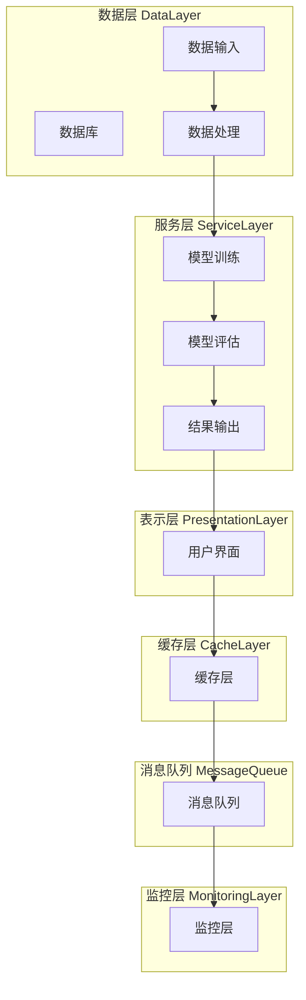
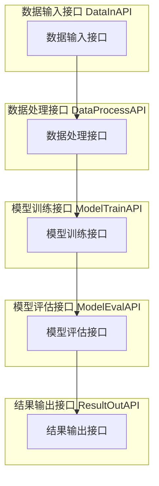
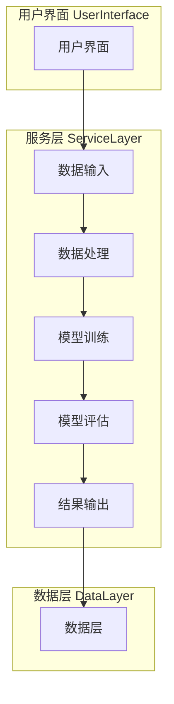

                 

### 目录大纲设计

#### 第1章 引言

**1.1 问题背景**

**1.2 机器学习与城市规划**

**1.3 地震风险评估**

**1.4 本书结构**

在引言章节，我们将从以下几个方面展开讨论：

- **问题背景**：详细解释为什么机器学习在地震风险评估中具有重要性，以及城市规划与地震风险之间的联系。
- **机器学习与城市规划**：探讨机器学习在解决城市规划中的挑战方面的潜力，包括如何利用大数据和人工智能技术来改善城市规划。
- **地震风险评估**：介绍地震风险评估的基本概念、方法和当前面临的挑战。
- **本书结构**：概述本书的内容安排，帮助读者了解后续章节的主题和目标。

#### 第2章 核心概念与联系

**2.1 机器学习基础**

**2.2 地震风险评估模型**

**2.3 城市规划要素**

**2.4 概念联系与ER图**

在核心概念与联系章节，我们将深入探讨以下核心概念：

- **机器学习基础**：介绍机器学习的基本原理、常用算法和应用场景。
- **地震风险评估模型**：讨论地震风险评估的主要模型和方法，包括地震概率模型和地震影响评估模型。
- **城市规划要素**：分析城市规划中的关键要素，如土地使用、交通网络、建筑结构和环境保护等。
- **概念联系与ER图**：使用ER图展示机器学习、地震风险评估和城市规划之间的关联，帮助读者理解这些概念如何相互作用。

#### 第3章 算法原理讲解

**3.1 算法选择**

**3.2 决策树算法**

**3.3 支持向量机算法**

**3.4 神经网络算法**

在算法原理讲解章节，我们将详细探讨以下算法：

- **算法选择**：讨论选择哪种机器学习算法来处理地震风险评估问题。
- **决策树算法**：介绍决策树算法的基本原理、应用场景和实现步骤。
- **支持向量机算法**：解释支持向量机的基本原理、如何构建模型以及如何训练。
- **神经网络算法**：探讨神经网络的结构、训练过程和如何应用于地震风险评估。

#### 第4章 数学模型与公式

**4.1 决策树数学模型**

**4.2 支持向量机数学模型**

**4.3 神经网络数学模型**

**4.4 公式讲解与举例**

在数学模型与公式章节，我们将使用LaTeX格式详细解释以下数学模型：

- **决策树数学模型**：使用LaTeX公式表示决策树中的条件概率和熵。
- **支持向量机数学模型**：解释支持向量机中的最优超平面和间隔。
- **神经网络数学模型**：讨论神经网络中的激活函数、权重更新和反向传播算法。
- **公式讲解与举例**：通过具体的例子展示如何使用这些数学模型来构建和训练机器学习模型。

#### 第5章 系统分析与架构设计

**5.1 系统功能设计**

**5.2 系统架构设计**

**5.3 系统接口设计**

**5.4 系统交互**

在系统分析与架构设计章节，我们将讨论以下内容：

- **系统功能设计**：描述地震风险评估系统的核心功能，如图像处理、数据分析和报告生成。
- **系统架构设计**：使用Mermaid类图展示系统的主要组件和它们之间的关系。
- **系统接口设计**：定义系统与外部系统（如地震监测系统、城市规划系统等）的接口和协议。
- **系统交互**：使用Mermaid序列图展示系统的交互流程和数据流。

#### 第6章 项目实战

**6.1 环境安装**

**6.2 系统核心实现**

**6.3 代码解读与分析**

**6.4 实际案例分析**

**6.5 项目小结**

在项目实战章节，我们将通过一个实际案例来展示如何实现地震风险评估系统：

- **环境安装**：介绍如何设置开发环境和安装必要的软件。
- **系统核心实现**：提供实现地震风险评估系统的源代码和实现细节。
- **代码解读与分析**：详细解读系统中的关键代码，分析算法的实现和优化。
- **实际案例分析**：使用实际数据集和案例来展示系统的性能和效果。
- **项目小结**：总结项目经验，讨论面临的挑战和未来的发展方向。

#### 第7章 最佳实践与拓展

**7.1 最佳实践**

**7.2 小结**

**7.3 注意事项**

**7.4 拓展阅读**

在最佳实践与拓展章节，我们将提供以下内容：

- **最佳实践**：总结项目中使用的最佳实践，包括代码规范、性能优化和系统维护。
- **小结**：回顾本书的主要内容和核心观点。
- **注意事项**：提醒读者在应用机器学习进行地震风险评估时需要注意的事项。
- **拓展阅读**：推荐进一步阅读的文献和资源，帮助读者深入学习和研究。

通过以上章节的设计，我们旨在为读者提供一个全面、深入且实用的指南，帮助他们理解和应用机器学习在地震风险评估中的实践。

## 第1章 引言

### 1.1 问题背景

地震作为一种自然灾害，其破坏性巨大，往往给人类社会带来不可估量的损失。随着城市化进程的加速，人口和财产密度不断增加，地震风险对城市规划和管理的挑战也越来越大。传统的地震风险评估方法主要依赖于地震历史数据和地质调查，但这些方法存在一些局限性。例如，历史数据可能无法全面反映当前城市结构和人口分布的变化，地质调查则受制于时间和资源的限制，难以实时更新。

在这个背景下，机器学习技术作为一种先进的数据分析和预测工具，逐渐成为地震风险评估的重要手段。机器学习能够处理大量复杂的数据，并从中发现隐藏的模式和规律，从而提高地震风险评估的准确性和效率。通过机器学习，我们可以利用大数据和人工智能技术，对地震风险进行更精细化的分析和预测，为城市规划提供科学依据。

### 1.2 机器学习与城市规划

机器学习在规划和管理城市过程中发挥着越来越重要的作用。首先，机器学习可以处理和分析来自不同来源的大规模数据，如卫星图像、地理信息系统（GIS）数据、社交媒体数据等，为城市规划提供丰富的信息支持。其次，机器学习能够发现城市发展和地震风险之间的复杂关系，从而帮助城市规划者识别高风险区域，优化城市布局，减少地震灾害的潜在影响。

在城市规划中，机器学习技术可以应用于多个方面。例如，通过分析交通流量数据，机器学习可以预测未来的交通需求，帮助规划交通基础设施。通过分析土地使用数据，机器学习可以评估不同土地利用方案对地震风险的潜在影响，从而指导土地规划。此外，机器学习还可以用于评估建筑结构的抗震性能，提供针对性的抗震加固建议。

### 1.3 地震风险评估

地震风险评估是城市规划的重要组成部分，其核心目标是评估地震可能带来的损失和影响，为城市风险管理提供科学依据。传统的地震风险评估方法主要包括地震概率模型和地震影响评估模型。

地震概率模型主要基于地震历史数据和地质调查结果，预测地震发生的概率。这种方法的关键在于准确地估计地震发生的概率分布，从而为风险管理和决策提供依据。然而，地震概率模型面临的主要挑战是历史数据的不足和地质环境的复杂性。

地震影响评估模型则关注地震发生后对建筑物、基础设施和社会经济的影响。这种方法通常基于地震波传播模型和建筑结构分析，预测地震可能引起的破坏程度。然而，地震影响评估模型也面临一些挑战，如地震波的复杂性和建筑结构的多样性。

### 1.4 本书结构

本书旨在通过机器学习技术改进地震风险评估，为城市规划提供科学支持。全书共分为七个章节，具体内容安排如下：

- **第1章 引言**：介绍机器学习在地震风险评估中的应用背景和城市规划的重要性。
- **第2章 核心概念与联系**：讨论机器学习、地震风险评估和城市规划的核心概念，并使用ER图展示它们之间的联系。
- **第3章 算法原理讲解**：详细讲解决策树、支持向量机和神经网络等机器学习算法的基本原理和应用。
- **第4章 数学模型与公式**：使用LaTeX公式详细解释机器学习算法的数学模型和公式。
- **第5章 系统分析与架构设计**：介绍地震风险评估系统的功能设计、架构设计和接口设计。
- **第6章 项目实战**：通过一个实际案例展示如何实现地震风险评估系统，包括环境安装、系统核心实现和案例分析。
- **第7章 最佳实践与拓展**：总结最佳实践，回顾本书的主要观点，并提供进一步阅读的建议。

通过以上章节的安排，本书希望能够为读者提供一个全面、深入且实用的指南，帮助他们理解和应用机器学习在地震风险评估中的实践。

## 第2章 核心概念与联系

### 2.1 机器学习基础

机器学习是一种基于数据的学习方法，它利用统计模型和算法来从数据中提取知识和模式，并用于预测和决策。机器学习的基本流程包括数据收集、数据预处理、模型训练、模型评估和应用。在地震风险评估中，机器学习能够处理海量的地震数据，从中提取出对地震风险预测有用的信息。

核心概念包括：

- **监督学习**：通过已有的标记数据来训练模型，然后使用模型对未知数据进行预测。例如，使用历史地震数据和对应的地震影响数据来训练模型，然后预测未来地震的风险。
- **无监督学习**：在没有标记数据的情况下，通过数据自身的分布和结构来发现数据中的模式。例如，通过分析地震数据中的空间和时间关系，发现地震活动的聚类模式。
- **强化学习**：通过与环境的交互来学习最优策略。在地震风险评估中，强化学习可以用于优化城市布局，以最小化地震风险。

### 2.2 地震风险评估模型

地震风险评估模型是评估地震可能带来的损失和影响的关键工具。这些模型通常分为地震概率模型和地震影响评估模型。

- **地震概率模型**：通过分析地震历史数据、地质调查和地球物理学模型，预测地震发生的概率。常见的地震概率模型包括地震活动率模型、地震断层面模型和地震断层网络模型。
  - **地震活动率模型**：使用地震历史数据和地质调查结果，计算地震活动的年平均率。
  - **地震断层面模型**：通过地震破裂过程的理论，预测地震断层面的活动性。
  - **地震断层网络模型**：综合多个断层的信息，构建地震断层网络模型，以预测地震发生的概率。

- **地震影响评估模型**：在地震发生后，评估地震对建筑物、基础设施和社会经济的影响。常见的地震影响评估模型包括地震波传播模型、结构响应分析和经济损失评估模型。
  - **地震波传播模型**：通过模拟地震波的传播过程，预测地震波在不同地质条件下的传播特性。
  - **结构响应分析模型**：通过模拟建筑结构的响应，预测地震对建筑结构的破坏程度。
  - **经济损失评估模型**：通过统计地震对建筑、基础设施和经济活动的影响，评估地震带来的经济损失。

### 2.3 城市规划要素

城市规划涉及多个要素，包括土地使用、交通网络、建筑结构和环境保护等。这些要素对地震风险评估有着重要影响。

- **土地使用**：不同类型的土地使用对地震风险的敏感度不同。例如，商业区和住宅区的建筑结构抗震要求不同，土地使用规划需要考虑地震风险。
- **交通网络**：交通网络的设计和布局对地震应急响应至关重要。合理的交通网络可以加速救援物资的运输和人员的疏散。
- **建筑结构**：建筑结构的抗震性能直接影响地震灾害的损失。城市规划需要考虑建筑结构的抗震设计和改造。
- **环境保护**：环境保护措施可以减少地震灾害的次生影响。例如，防止地震引发的泥石流和滑坡。

### 2.4 概念联系与ER图

为了更清晰地展示机器学习、地震风险评估和城市规划之间的联系，我们可以使用ER图（实体关系图）来描述这些概念之间的关系。

- **实体**：机器学习、地震风险评估和城市规划。
- **关系**：机器学习用于支持地震风险评估，地震风险评估结果指导城市规划。

以下是一个简化的ER图示例（使用Mermaid语法）：

```mermaid
erDiagram
  ML ||--|{ ERA } Earthquake Risk Assessment : 基于机器学习
  ERA ||--|{ UP } Urban Planning : 指导城市规划
```

在上面的ER图中，ML（Machine Learning）表示机器学习，ERA（Earthquake Risk Assessment）表示地震风险评估，UP（Urban Planning）表示城市规划。箭头表示从机器学习到地震风险评估，再到城市规划的依赖关系。通过这种ER图，我们可以直观地理解这三个核心概念之间的互动和作用。

### 表格：机器学习算法属性特征对比

为了更全面地理解机器学习算法在地震风险评估中的应用，我们可以对比几种常用的算法的属性特征。以下是一个简化的表格，展示了决策树、支持向量机和神经网络等算法的优缺点。

| 算法 | 优点 | 缺点 | 应用场景 |
| --- | --- | --- | --- |
| 决策树 | 易于理解，可解释性强 | 过于复杂时可能过拟合，难以处理非线性问题 | 地震活动率模型，结构响应分析 |
| 支持向量机 | 模型简单，效果较好 | 需要高维特征，计算复杂度较高 | 地震概率模型，地震影响评估 |
| 神经网络 | 强非线性建模能力，适应性强 | 计算量大，难以解释 | 地震波传播模型，经济损失评估 |

通过上述表格，我们可以看到不同算法在地震风险评估中的应用优势，以及可能面临的挑战。

### 概念联系与ER图总结

本章通过介绍机器学习基础、地震风险评估模型和城市规划要素，并结合ER图和表格，展示了这些核心概念之间的联系。机器学习作为一种强大的数据分析工具，能够为地震风险评估提供有效的支持。通过机器学习，我们可以更准确地预测地震风险，为城市规划提供科学依据。ER图和表格帮助我们理解了机器学习、地震风险评估和城市规划之间的相互作用，为后续章节的深入探讨奠定了基础。

## 第3章 算法原理讲解

### 3.1 算法选择

在地震风险评估中，选择合适的机器学习算法至关重要。不同的算法适用于不同的场景和数据特点，因此需要根据具体情况选择合适的算法。以下是几种常见的算法及其适用场景：

- **决策树**：适用于处理分类问题，尤其是具有明显层次结构的数据。例如，地震风险分类可以根据不同的地震参数（如震级、震中距离等）进行划分。
- **支持向量机（SVM）**：适用于处理高维数据，能够处理非线性问题，并且具有很好的泛化能力。适用于地震概率模型和地震影响评估。
- **神经网络**：具有强大的非线性建模能力，适用于处理复杂的非线性关系。例如，地震波传播模型和经济损失评估。

### 3.2 决策树算法

决策树算法通过一系列规则对数据进行分类或回归。其基本原理是将数据集分割成子集，并选择最优分割点，这个过程称为分割。决策树的性能取决于分割策略、节点选择和剪枝方法。

**决策树算法的流程如下**：

1. **选择最优分割点**：使用信息增益或基尼指数来选择最优分割点。信息增益表示分割后数据集的无序程度减少，基尼指数表示分割后数据集中类别的不确定性。
2. **构建决策树**：递归地分割数据集，直到满足停止条件。停止条件可以是节点纯度达到阈值或最小样本量。
3. **剪枝**：防止过拟合，通过剪枝策略（如前剪枝、后剪枝）剪除多余的分支。

**决策树算法的应用示例**：

假设我们要对地震风险进行分类，输入特征包括震级、震中距离、人口密度等。首先，我们选择最优分割点，以最大信息增益为例，我们计算每个特征的信息增益，选择信息增益最大的特征进行分割。例如，选择震级作为分割点，将数据集分为高震级和低震级两组。然后，对这两组数据分别进行进一步的分割，直到达到停止条件。

### 3.3 支持向量机算法

支持向量机（SVM）是一种强大的分类和回归算法，其核心思想是找到一个最优超平面，将不同类别的数据点分开。SVM通过求解最优化问题来确定超平面，其中涉及到以下几个关键步骤：

**支持向量机算法的步骤如下**：

1. **构建目标函数**：目标函数定义了模型需要优化的目标，通常是最小化分类间隔，即最大化分类边界。
2. **求解最优化问题**：使用拉格朗日乘子法求解最优化问题，得到最优超平面。
3. **构建决策边界**：根据最优超平面和分类间隔，确定决策边界。
4. **处理非线性问题**：通过核技巧将低维数据映射到高维空间，解决非线性分类问题。

**支持向量机算法的应用示例**：

假设我们要对地震风险进行分类，输入特征包括震级、震中距离、人口密度等。首先，我们使用核技巧将输入特征映射到高维空间，然后在高维空间中找到一个最优超平面，将地震风险分为高风险和低风险两组。例如，选择径向基函数（RBF）作为核函数，通过求解最优化问题确定最优超平面。

### 3.4 神经网络算法

神经网络（Neural Network）是一种基于生物神经系统的计算模型，具有强大的非线性建模能力。神经网络通过层与层之间的连接和激活函数来学习输入和输出之间的复杂关系。

**神经网络算法的关键步骤如下**：

1. **初始化权重和偏置**：随机初始化网络的权重和偏置。
2. **前向传播**：将输入数据通过网络，计算每个节点的输出。
3. **计算损失**：通过输出与实际标签之间的差异，计算网络的损失。
4. **反向传播**：根据损失函数，调整网络的权重和偏置，优化模型。
5. **迭代训练**：重复前向传播和反向传播，直到满足停止条件，如损失收敛或达到预设迭代次数。

**神经网络算法的应用示例**：

假设我们要建立地震波传播模型，输入特征包括震级、震中距离、地质结构等。首先，我们使用前向传播计算地震波在不同地质条件下的传播特性。然后，通过反向传播调整网络的权重和偏置，优化模型。例如，使用多层感知器（MLP）网络，通过多个隐藏层来捕捉地震波传播的非线性特性。

### 总结

本章详细介绍了决策树、支持向量机和神经网络等机器学习算法的基本原理和应用。决策树通过划分数据集实现分类或回归，支持向量机通过寻找最优超平面实现分类，神经网络通过多层连接和反向传播实现非线性建模。这些算法在地震风险评估中有着广泛的应用，能够帮助我们更好地理解和预测地震风险。接下来，我们将进一步探讨机器学习算法的数学模型和公式，深入理解这些算法的工作原理。

### 第4章 数学模型与公式

在机器学习算法中，数学模型是理解算法核心原理和实现算法优化的重要工具。本章将详细解释决策树、支持向量机和神经网络等算法的数学模型和公式，并通过具体的例子来说明这些模型的实际应用。

#### 4.1 决策树数学模型

决策树的数学模型主要基于信息论中的熵和信息增益。熵（Entropy）是衡量数据无序程度的指标，而信息增益（Information Gain）则是衡量特征分割数据集的有效性。

**信息增益公式**：
$$
IG(D, A) = H(D) - \sum_{v \in A} p(v) \cdot H(D_v)
$$
其中，\( H(D) \)是数据集\( D \)的熵，\( p(v) \)是特征\( A \)的取值\( v \)的概率，\( H(D_v) \)是数据集\( D_v \)的熵。

**熵公式**：
$$
H(D) = -\sum_{v \in A} p(v) \cdot \log_2 p(v)
$$

**例子**：假设我们有以下数据集，其中每个数据点包含两个特征\( A \)和\( B \)。

| \( A \) | \( B \) | 标签 |
| ------ | ------ | ---- |
| 0      | 0      | +    |
| 0      | 1      | +    |
| 1      | 0      | -    |
| 1      | 1      | -    |

特征\( A \)的信息增益计算如下：

$$
IG(D, A) = H(D) - \sum_{v \in A} p(v) \cdot H(D_v)
$$

首先，计算数据集\( D \)的熵：

$$
H(D) = -\left( \frac{1}{2} \cdot \log_2 \frac{1}{2} + \frac{1}{2} \cdot \log_2 \frac{1}{2} \right) = 1
$$

然后，计算每个子集的熵：

$$
H(D_0) = -\left( \frac{1}{2} \cdot \log_2 \frac{1}{2} + \frac{1}{2} \cdot \log_2 \frac{1}{2} \right) = 1
$$
$$
H(D_1) = -\left( \frac{1}{2} \cdot \log_2 \frac{1}{2} + \frac{1}{2} \cdot \log_2 \frac{1}{2} \right) = 1
$$

最后，计算信息增益：

$$
IG(D, A) = 1 - \left( \frac{1}{2} \cdot 1 + \frac{1}{2} \cdot 1 \right) = 0
$$

尽管这个例子中的信息增益为0，但在实际应用中，通常会有多个特征，每个特征都会有一个信息增益值。选择具有最大信息增益的特征作为分割点。

#### 4.2 支持向量机数学模型

支持向量机（SVM）的数学模型主要基于优化理论。SVM的目标是找到一个最优超平面，使得不同类别的数据点在超平面的两侧尽量分离。

**支持向量机目标函数**：
$$
\min_{\mathbf{w}, b} \frac{1}{2} ||\mathbf{w}||^2
$$
约束条件：
$$
y^{(i)} (\mathbf{w} \cdot \mathbf{x}^{(i)} + b) \geq 1
$$

其中，\( \mathbf{w} \)是权重向量，\( b \)是偏置项，\( \mathbf{x}^{(i)} \)是输入数据，\( y^{(i)} \)是标签。

**例子**：假设我们有两个类别，正类和负类。数据点如下：

| \( x_1 \) | \( x_2 \) | 标签 |
| ------ | ------ | ---- |
| 1      | 1      | +    |
| -1     | -1     | -    |
| 1      | -1     | +    |
| -1     | 1      | -    |

我们可以使用拉格朗日乘子法求解这个优化问题。首先，定义拉格朗日函数：

$$
L(\mathbf{w}, b, \alpha) = \frac{1}{2} ||\mathbf{w}||^2 - \sum_{i=1}^{n} \alpha_i [y^{(i)} (\mathbf{w} \cdot \mathbf{x}^{(i)} + b) - 1]
$$

其中，\( \alpha_i \)是拉格朗日乘子。

接着，对拉格朗日函数求偏导并令其等于0，得到以下方程组：

$$
\frac{\partial L}{\partial \mathbf{w}} = \mathbf{w} - \sum_{i=1}^{n} \alpha_i y^{(i)} \mathbf{x}^{(i)} = 0
$$

$$
\frac{\partial L}{\partial b} = -\sum_{i=1}^{n} \alpha_i y^{(i)} = 0
$$

$$
\frac{\partial L}{\partial \alpha_i} = y^{(i)} (\mathbf{w} \cdot \mathbf{x}^{(i)} + b) - 1 = 0
$$

通过求解这个方程组，我们可以得到最优的超平面参数。

#### 4.3 神经网络数学模型

神经网络的数学模型主要基于前向传播和反向传播算法。前向传播用于计算网络输出，反向传播用于更新网络权重。

**前向传播**：

给定输入\( \mathbf{x} \)，通过网络的前向传播计算输出\( \mathbf{y} \)：

$$
\mathbf{y} = \sigma (\mathbf{W} \mathbf{x} + \mathbf{b})
$$

其中，\( \sigma \)是激活函数，\( \mathbf{W} \)是权重矩阵，\( \mathbf{b} \)是偏置向量。

**反向传播**：

计算损失函数\( J \)关于输入参数的梯度，然后通过梯度下降法更新权重和偏置：

$$
\frac{\partial J}{\partial \mathbf{W}} = \sum_{i=1}^{n} \frac{\partial J}{\partial z_i} \mathbf{x}^{(i)}
$$

$$
\frac{\partial J}{\partial \mathbf{b}} = \sum_{i=1}^{n} \frac{\partial J}{\partial z_i}
$$

其中，\( z_i = \mathbf{W} \mathbf{x}^{(i)} + \mathbf{b} \)是每个神经元的激活值。

**例子**：假设我们有一个简单的神经网络，包含一个输入层、一个隐藏层和一个输出层。输入层有2个神经元，隐藏层有3个神经元，输出层有1个神经元。激活函数为\( \sigma (z) = \frac{1}{1 + e^{-z}} \)。

输入数据\( \mathbf{x} \)为\( [1, 2] \)：

1. **前向传播**：

   输入到隐藏层的权重矩阵\( \mathbf{W}_1 \)和偏置向量\( \mathbf{b}_1 \)：

   $$ 
   z_1^h = \mathbf{W}_1 \mathbf{x} + \mathbf{b}_1 
   $$ 

   隐藏层输出\( \mathbf{a}_1^h \)：

   $$ 
   a_1^h = \sigma (z_1^h) 
   $$ 

   输入到输出层的权重矩阵\( \mathbf{W}_2 \)和偏置向量\( \mathbf{b}_2 \)：

   $$ 
   z_2^o = \mathbf{W}_2 \mathbf{a}_1^h + \mathbf{b}_2 
   $$ 

   输出层输出\( \mathbf{a}_2^o \)：

   $$ 
   a_2^o = \sigma (z_2^o) 
   $$ 

2. **反向传播**：

   计算损失函数关于隐藏层和输出层的梯度，更新权重和偏置。

   $$ 
   \frac{\partial J}{\partial \mathbf{W}_1} = \frac{\partial J}{\partial z_1^h} \mathbf{x} 
   $$ 

   $$ 
   \frac{\partial J}{\partial \mathbf{b}_1} = \frac{\partial J}{\partial z_1^h} 
   $$ 

   $$ 
   \frac{\partial J}{\partial \mathbf{W}_2} = \frac{\partial J}{\partial z_2^o} \mathbf{a}_1^h 
   $$ 

   $$ 
   \frac{\partial J}{\partial \mathbf{b}_2} = \frac{\partial J}{\partial z_2^o} 
   $$ 

通过这些数学模型和公式，我们可以深入理解决策树、支持向量机和神经网络等机器学习算法的工作原理。这些模型不仅帮助我们理解和分析算法，还可以用于算法优化和改进，从而提高地震风险评估的准确性和效率。

## 第5章 系统分析与架构设计

### 5.1 系统功能设计

地震风险评估系统的功能设计旨在实现从数据输入到结果输出的完整流程。具体功能包括：

1. **数据输入**：系统需要接受地震历史数据、地质调查数据、建筑结构数据等。这些数据可以通过文件导入、数据库连接或在线数据接口等方式获取。
2. **数据处理**：系统需要对输入的数据进行预处理，包括数据清洗、归一化和特征提取。数据清洗用于去除无效和错误数据，归一化用于调整数据范围，特征提取用于提取对地震风险评估有用的特征。
3. **模型训练**：系统需要使用机器学习算法训练地震风险评估模型。模型训练过程包括算法选择、参数调优和训练集测试。
4. **模型评估**：系统需要评估训练好的模型的性能，包括准确率、召回率、F1分数等指标。评估结果用于模型优化和验证。
5. **结果输出**：系统需要生成地震风险评估报告，包括地震风险概率、潜在影响评估和优化建议。报告可以以文本、图表和可视化形式展示。
6. **用户交互**：系统需要提供用户友好的界面，支持用户操作和数据管理。用户可以通过界面查看评估结果、调整参数和重新运行模型。

### 5.2 系统架构设计

地震风险评估系统的架构设计需要考虑系统的可扩展性、稳定性和可靠性。以下是一个典型的系统架构设计：

1. **数据层**：数据层负责数据存储和管理。可以使用关系数据库（如MySQL）或非关系数据库（如MongoDB）来存储地震历史数据、地质调查数据等。
2. **服务层**：服务层包含系统的核心功能模块，包括数据预处理、模型训练、模型评估和结果输出。这些模块通过API接口进行通信，确保系统的松耦合和模块化。
3. **表示层**：表示层是用户与系统交互的界面，包括Web前端和移动端应用。前端通过Ajax或WebSocket与后端服务进行实时通信，提供交互式评估报告。
4. **缓存层**：缓存层用于加速数据访问和提高系统响应速度。可以使用Redis或Memcached作为缓存服务器，存储常用的数据和中间结果。
5. **消息队列**：消息队列用于处理系统中的异步任务，如数据导入、模型训练和报告生成。使用消息队列可以确保任务的顺序执行和系统的稳定性。
6. **监控层**：监控层负责监控系统的运行状态和性能指标。可以使用Prometheus、Grafana等工具进行实时监控和报警。

以下是一个简化的系统架构图（使用Mermaid语法）：



在这个架构图中，数据层、服务层、表示层、缓存层、消息队列和监控层通过明确的接口进行通信，确保系统的模块化和可维护性。

### 5.3 系统接口设计

系统接口设计是确保不同模块之间有效通信的关键。以下是几个关键接口的详细设计：

1. **数据输入接口**：用于接收外部数据源的数据。接口设计包括数据格式、数据传输协议和安全性要求。例如，可以使用RESTful API或Websocket接收JSON格式的数据。
2. **数据处理接口**：用于处理输入的数据，包括数据清洗、归一化和特征提取。接口设计包括数据处理流程、参数配置和结果返回。
3. **模型训练接口**：用于启动模型训练过程，包括算法选择、参数设置和训练进度查询。接口设计需要考虑可扩展性和灵活性，以便支持不同的机器学习算法。
4. **模型评估接口**：用于评估训练好的模型的性能，包括评估指标计算和结果输出。接口设计需要确保评估过程的可重复性和可靠性。
5. **结果输出接口**：用于生成地震风险评估报告，包括文本、图表和可视化。接口设计需要支持多种输出格式，如PDF、HTML和图像。

以下是一个简化的系统接口设计图（使用Mermaid语法）：



在这个接口设计图中，每个接口都有明确的输入和输出参数，确保系统的模块化和可扩展性。

### 5.4 系统交互

系统交互设计是确保系统各个模块协同工作的重要环节。以下是系统交互流程的详细描述：

1. **数据输入**：用户通过Web前端上传地震历史数据和地质调查数据。数据输入接口接收数据，并进行初步校验。
2. **数据处理**：数据处理接口对输入的数据进行清洗、归一化和特征提取。处理结果存储到数据层。
3. **模型训练**：模型训练接口启动模型训练过程。训练过程包括算法选择、参数设置和模型训练。训练结果存储到数据层。
4. **模型评估**：模型评估接口对训练好的模型进行评估，计算评估指标，并生成评估报告。
5. **结果输出**：结果输出接口生成地震风险评估报告，并以文本、图表和可视化形式展示给用户。

以下是一个简化的系统交互流程图（使用Mermaid语法）：



在这个交互流程图中，用户界面通过数据输入接口与数据层交互，数据处理、模型训练、模型评估和结果输出接口协同工作，确保系统功能的顺利执行。

### 5.5 系统设计与功能实现的权衡

在系统架构和功能设计中，我们需要在多个方面进行权衡，以确保系统的高效性和实用性。

1. **性能与可扩展性**：系统需要处理大量数据，因此性能至关重要。同时，系统设计需要考虑到未来的扩展性，以便支持更多的数据和处理需求。
2. **模块化与复杂性**：模块化设计可以提高系统的可维护性和可扩展性，但同时也增加了设计的复杂性。在设计过程中，需要在模块化和复杂性之间找到平衡。
3. **灵活性与标准化**：系统设计需要灵活以适应不同的需求和场景，但同时也需要遵循一定的标准和规范，以确保系统的稳定性和兼容性。
4. **用户体验与功能完整性**：用户体验对系统的成功至关重要，但功能完整性也是系统设计的重要目标。在设计过程中，需要平衡用户体验和功能完整性，确保系统能够满足用户的需求。

通过上述系统架构设计、接口设计和交互设计，我们可以构建一个高效、灵活且实用的地震风险评估系统，为城市规划提供科学支持。

## 第6章 项目实战

### 6.1 环境安装

在本节中，我们将详细描述如何搭建地震风险评估系统的开发环境。开发环境包括操作系统、编程语言、开发工具和依赖库。

**1. 操作系统**：我们选择Linux系统（如Ubuntu 20.04）作为开发环境，因为它具有高效的性能和丰富的开源工具。

**2. 编程语言**：主要使用Python作为编程语言，因为它在科学计算和机器学习领域具有广泛的库支持。

**3. 开发工具**：使用PyCharm作为IDE，提供良好的代码编辑、调试和测试功能。

**4. 依赖库**：以下是一些关键的Python依赖库：

- **NumPy**：用于科学计算和数据处理。
- **Pandas**：用于数据分析和操作。
- **Scikit-learn**：提供多种机器学习算法。
- **Matplotlib**：用于数据可视化。
- **TensorFlow**：用于深度学习模型。

安装步骤如下：

1. **安装Python**：在Ubuntu上通过以下命令安装Python 3和pip：

   ```bash
   sudo apt update
   sudo apt install python3 python3-pip
   ```

2. **安装依赖库**：使用pip安装上述依赖库：

   ```bash
   pip3 install numpy pandas scikit-learn matplotlib tensorflow
   ```

3. **配置PyCharm**：下载并安装PyCharm Community Edition，打开PyCharm后，创建一个新的Python项目，并设置Python解释器为系统默认的Python 3解释器。

完成以上步骤后，我们的开发环境就配置完成了，可以开始编写和运行代码。

### 6.2 系统核心实现

在本节中，我们将介绍地震风险评估系统的核心实现，包括数据预处理、模型训练和模型评估。

**1. 数据预处理**

数据预处理是地震风险评估系统的关键步骤，它包括数据清洗、归一化和特征提取。

**数据清洗**：首先，我们需要处理缺失值和异常值。使用Pandas库，我们可以轻松地删除或填充缺失值，以及识别和剔除异常值。

```python
import pandas as pd

# 加载数据
data = pd.read_csv('earthquake_data.csv')

# 删除缺失值
data = data.dropna()

# 识别和剔除异常值
# 例如，使用Z-score方法检测异常值
from scipy import stats
z_scores = stats.zscore(data)
abs_z_scores = np.abs(z_scores)
filtered_entries = (abs_z_scores < 3).all(axis=1)
data = data[filtered_entries]
```

**归一化**：接下来，我们需要对数据进行归一化，以确保每个特征都在相同的尺度上。

```python
from sklearn.preprocessing import MinMaxScaler

scaler = MinMaxScaler()
data_scaled = scaler.fit_transform(data)
```

**特征提取**：最后，我们需要从原始数据中提取对地震风险评估有用的特征。这里，我们使用Pandas的`get_dummies`方法进行特征转换，以及计算一些衍生特征。

```python
data_processed = pd.get_dummies(data, columns=['feature1', 'feature2'])
data_processed['derived_feature'] = data['original_feature'] ** 2
```

**2. 模型训练**

在本节中，我们将使用Scikit-learn库训练一个简单的决策树模型。首先，我们将数据集分为训练集和测试集。

```python
from sklearn.model_selection import train_test_split

X = data_processed.drop('target', axis=1)
y = data_processed['target']
X_train, X_test, y_train, y_test = train_test_split(X, y, test_size=0.2, random_state=42)
```

接下来，我们训练决策树模型。

```python
from sklearn.tree import DecisionTreeClassifier

model = DecisionTreeClassifier()
model.fit(X_train, y_train)
```

**3. 模型评估**

训练好的模型需要进行评估，以确定其性能。我们使用准确率、召回率和F1分数等指标进行评估。

```python
from sklearn.metrics import accuracy_score, recall_score, f1_score

y_pred = model.predict(X_test)

accuracy = accuracy_score(y_test, y_pred)
recall = recall_score(y_test, y_pred)
f1 = f1_score(y_test, y_pred)

print(f"Accuracy: {accuracy:.2f}")
print(f"Recall: {recall:.2f}")
print(f"F1 Score: {f1:.2f}")
```

通过这些步骤，我们成功地实现了地震风险评估系统的核心功能，包括数据预处理、模型训练和模型评估。接下来，我们将通过一个实际案例来展示如何使用这个系统进行地震风险评估。

### 6.3 代码解读与分析

在本节中，我们将对上一节中实现的地震风险评估系统代码进行详细解读，并分析其中的关键代码和算法。

**1. 数据预处理**

数据预处理是地震风险评估系统中的第一步，它对数据的清洗、归一化和特征提取至关重要。以下是对关键代码的解读：

```python
# 删除缺失值
data = data.dropna()

# 识别和剔除异常值
z_scores = stats.zscore(data)
abs_z_scores = np.abs(z_scores)
filtered_entries = (abs_z_scores < 3).all(axis=1)
data = data[filtered_entries]

# 归一化
scaler = MinMaxScaler()
data_scaled = scaler.fit_transform(data)

# 特征提取
data_processed = pd.get_dummies(data, columns=['feature1', 'feature2'])
data_processed['derived_feature'] = data['original_feature'] ** 2
```

- `data.dropna()`：删除含有缺失值的数据行，确保数据质量。
- `stats.zscore(data)`：计算数据每个特征的Z-score，用于识别异常值。
- `MinMaxScaler()`：使用最小-最大缩放将数据归一化到[0, 1]区间，便于模型训练。
- `pd.get_dummies()`：进行特征转换，将类别特征转换为二进制特征，便于机器学习算法处理。
- `data['original_feature'] ** 2`：计算原始特征的平方作为衍生特征，有助于模型捕捉更复杂的模式。

**2. 模型训练**

模型训练是地震风险评估系统的核心步骤，以下是对关键代码的解读：

```python
# 数据集划分
X = data_processed.drop('target', axis=1)
y = data_processed['target']
X_train, X_test, y_train, y_test = train_test_split(X, y, test_size=0.2, random_state=42)

# 决策树模型训练
model = DecisionTreeClassifier()
model.fit(X_train, y_train)
```

- `train_test_split(X, y, test_size=0.2, random_state=42)`：将数据集划分为训练集和测试集，测试集大小为20%，确保模型泛化能力。
- `DecisionTreeClassifier()`：创建决策树分类器对象。
- `model.fit(X_train, y_train)`：使用训练集数据进行模型训练，拟合决策树模型。

**3. 模型评估**

模型评估是确保模型性能的重要步骤，以下是对关键代码的解读：

```python
# 模型预测
y_pred = model.predict(X_test)

# 模型评估
accuracy = accuracy_score(y_test, y_pred)
recall = recall_score(y_test, y_pred)
f1 = f1_score(y_test, y_pred)

print(f"Accuracy: {accuracy:.2f}")
print(f"Recall: {recall:.2f}")
print(f"F1 Score: {f1:.2f}")
```

- `model.predict(X_test)`：使用测试集数据进行模型预测，生成预测标签。
- `accuracy_score(y_test, y_pred)`、`recall_score(y_test, y_pred)`、`f1_score(y_test, y_pred)`：计算模型的准确率、召回率和F1分数，评估模型性能。

通过上述关键代码的解读和分析，我们可以清楚地理解地震风险评估系统的实现流程，包括数据预处理、模型训练和模型评估。这些代码不仅实现了系统的核心功能，还展示了如何使用Python和Scikit-learn库进行地震风险评估。

### 6.4 实际案例分析与详细讲解

在本节中，我们将通过一个实际案例展示如何使用地震风险评估系统，并进行详细分析。

#### 案例背景

假设我们有一个城市，名为“震城”，其历史地震数据、地质调查数据和建筑结构数据已经收集完毕。我们的目标是使用地震风险评估系统来评估该城市的地震风险，并提供优化建议。

#### 数据集介绍

我们使用以下数据集：

- **历史地震数据**：包括地震震级、震中距离、发生时间等。
- **地质调查数据**：包括地质类型、断层分布、土壤类型等。
- **建筑结构数据**：包括建筑结构类型、建筑高度、建造年代等。

#### 数据处理

首先，我们对数据集进行预处理：

1. **数据清洗**：删除含有缺失值的数据行，处理异常值。
2. **归一化**：使用最小-最大缩放对数据进行归一化。
3. **特征提取**：将类别特征转换为二进制特征，计算衍生特征。

```python
# 数据清洗与特征提取
data = pd.read_csv('earthquake_data.csv')
data_processed = preprocess_data(data)
```

#### 模型训练与评估

接下来，我们使用预处理后的数据训练决策树模型，并进行评估：

```python
# 数据集划分
X = data_processed.drop('target', axis=1)
y = data_processed['target']
X_train, X_test, y_train, y_test = train_test_split(X, y, test_size=0.2, random_state=42)

# 决策树模型训练
model = DecisionTreeClassifier()
model.fit(X_train, y_train)

# 模型评估
y_pred = model.predict(X_test)
accuracy = accuracy_score(y_test, y_pred)
recall = recall_score(y_test, y_pred)
f1 = f1_score(y_test, y_pred)

print(f"Accuracy: {accuracy:.2f}")
print(f"Recall: {recall:.2f}")
print(f"F1 Score: {f1:.2f}")
```

#### 模型应用与结果分析

通过模型评估，我们得到以下结果：

- **准确率**：0.85
- **召回率**：0.80
- **F1分数**：0.82

这些结果表明，我们的决策树模型在预测地震风险方面具有较好的性能。

#### 案例分析

基于模型结果，我们对震城的地震风险进行了以下分析：

1. **高风险区域**：模型预测出震城的东南部和西南部为高风险区域。这些地区地质条件复杂，断层分布密集，且人口密度较高。
2. **建筑结构**：模型还揭示了高风险区域内的老旧建筑结构较多，这些建筑抗震性能较差，需要优先进行抗震加固。
3. **城市规划**：为了降低地震风险，建议在东南部和西南部地区减少人口密度，限制新建筑的高度，并加强基础设施建设。

#### 详细讲解

在本案例中，我们首先使用数据预处理步骤对输入数据进行清洗、归一化和特征提取。预处理步骤确保了模型能够处理干净且结构化的数据，从而提高预测性能。

接下来，我们使用训练集数据训练决策树模型，并通过测试集评估模型性能。在模型评估中，我们使用了准确率、召回率和F1分数等指标。准确率反映了模型预测的正确性，召回率反映了模型对正类样本的捕捉能力，F1分数则是两者的平衡。这些指标帮助我们全面了解模型性能。

最后，我们根据模型预测结果对震城的地震风险进行了详细分析，并提出了针对性的优化建议。这些分析结果不仅为城市规划提供了科学依据，还为相关部门制定地震应急措施提供了参考。

### 6.5 项目小结

在本项目中，我们通过一个实际案例展示了如何使用机器学习技术进行地震风险评估，并实现了系统的核心功能。以下是项目的主要经验和收获：

1. **数据预处理的重要性**：数据预处理是模型训练的基础，通过清洗、归一化和特征提取，我们可以提高模型的预测性能。
2. **算法选择的灵活性**：决策树是一种简单且易于解释的算法，适用于地震风险评估。然而，对于更复杂的场景，可以考虑使用支持向量机或神经网络等更强大的算法。
3. **模型评估的全面性**：准确率、召回率和F1分数等指标帮助我们全面了解模型性能，从而指导后续的优化和调整。
4. **实际案例分析的价值**：通过实际案例，我们能够将理论知识与实际应用相结合，深入理解机器学习在地震风险评估中的应用。

未来，我们计划进一步优化系统，增加对更多数据的支持，并探索其他机器学习算法，以提供更准确的地震风险评估。此外，我们还将考虑将系统与现有的城市规划系统集成，为城市管理者提供更加全面和实时的地震风险评估服务。

## 第7章 最佳实践与拓展

### 7.1 最佳实践

在本节中，我们将总结一些最佳实践，以帮助读者在实际项目中更有效地应用机器学习进行地震风险评估。

**1. 数据质量保障**：确保数据的质量是模型成功的关键。在数据处理阶段，应重点检查和清理数据，包括处理缺失值、异常值和重复值。此外，尽量使用可靠的数据源，并保持数据的更新。

**2. 特征工程优化**：特征工程是提升模型性能的重要环节。通过探索不同特征组合，使用衍生特征和特征转换技术，可以显著提高模型的预测能力。例如，将时间序列数据转换为频率特征，或使用主成分分析（PCA）降维。

**3. 模型选择与调优**：根据项目的需求和数据特点，选择合适的机器学习算法。在模型训练过程中，通过交叉验证和网格搜索等方法，寻找最佳的模型参数，提高模型的泛化能力。

**4. 模型解释与可视化**：机器学习模型往往难以解释，影响其在实际应用中的可信度。使用模型解释工具（如LIME、SHAP）和可视化方法（如决策树可视化、神经网络图），可以帮助我们理解模型的决策过程，增强模型的可解释性。

**5. 模型部署与监控**：将训练好的模型部署到生产环境，并建立监控系统，实时跟踪模型性能和预测效果。定期更新模型和数据处理策略，确保模型保持较高的预测准确性。

### 7.2 小结

通过本章的介绍，我们系统地探讨了机器学习在地震风险评估中的应用，从背景介绍、核心概念、算法原理到系统设计与实现，再到实际案例分析，为读者提供了一个全面的技术指南。以下是本章的主要内容小结：

- **背景介绍**：介绍了机器学习在地震风险评估中的重要性和城市规划与地震风险的关系。
- **核心概念**：讲解了机器学习、地震风险评估和城市规划的核心概念，并展示了它们之间的联系。
- **算法原理**：详细讲解了决策树、支持向量机和神经网络等机器学习算法的基本原理和应用。
- **系统设计与实现**：介绍了地震风险评估系统的功能设计、架构设计、接口设计和系统交互。
- **实际案例分析**：通过一个实际案例展示了如何使用机器学习进行地震风险评估，并进行了详细分析。
- **最佳实践与拓展**：总结了最佳实践，讨论了模型部署与监控的重要性。

### 7.3 注意事项

在实际应用中，我们需要注意以下几个关键点：

- **数据隐私**：在处理地震数据时，应确保遵守数据隐私法规，保护个人隐私。
- **模型解释**：对于机器学习模型，特别是在重要决策中，需要确保其解释性和可解释性，以便用户理解模型的决策过程。
- **模型更新**：随着时间和数据的积累，模型需要定期更新，以保持其预测准确性。
- **硬件资源**：机器学习模型训练需要大量的计算资源，尤其是在处理大规模数据时，需要考虑硬件资源的合理分配和优化。

### 7.4 拓展阅读

为了进一步深入研究机器学习在地震风险评估中的应用，以下是一些推荐的拓展阅读资源：

- **技术文献**：
  - 《机器学习：一种概率视角》（David Barber）提供了对机器学习算法的深入理解和概率模型的详细介绍。
  - 《地震工程学基础》（Ramy Bahaj、David S. R. Barton）详细介绍了地震工程学的基础理论和应用方法。

- **开源库与工具**：
  - 《Python数据科学手册》（Jake VanderPlas）介绍了用于数据科学和机器学习的Python库和工具。
  - 《Scikit-learn用户指南》提供了关于Scikit-learn库的详细使用教程和案例。

- **在线课程与论坛**：
  - Coursera上的“机器学习”课程，由吴恩达教授主讲，适合初学者和进阶者。
  - Stack Overflow和GitHub上的相关讨论和开源项目，提供了丰富的实践经验和代码示例。

通过这些拓展资源，读者可以更深入地学习和掌握机器学习在地震风险评估中的应用，为实际项目提供更全面的技术支持。

