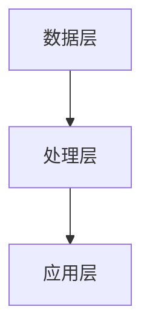
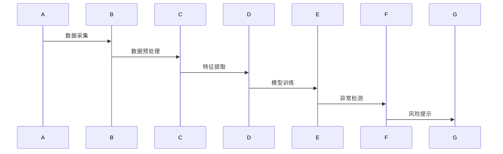

                 

# 机器学习在异常检测中的应用：从金融欺诈到网络入侵

关键词：异常检测、机器学习、金融欺诈、网络入侵、算法原理

摘要：本文深入探讨了机器学习在异常检测中的应用，特别是其在金融欺诈和网络入侵检测中的重要性。文章从背景介绍、核心概念与联系、算法原理讲解、系统分析与架构设计以及项目实战等多个方面，系统性地分析了机器学习在异常检测领域的应用现状和发展趋势，为相关领域的从业者和研究者提供了有价值的参考。

## 第一部分：背景介绍

### 1.1 异常检测的核心概念

#### 1.1.1 问题背景

在信息化的时代，数据已成为企业和组织的重要资产。然而，大量的数据也带来了新的挑战，如何从海量数据中识别出潜在的异常行为成为了一个重要的问题。异常检测（Anomaly Detection）作为一种数据挖掘技术，旨在从大量数据中识别出那些不符合一般规律的数据点，即异常或离群点。这些异常点可能预示着潜在的安全威胁、欺诈行为或其他问题。

#### 1.1.2 问题描述

异常检测问题可以形式化为以下三个子问题：

1. **异常定义**：如何定义什么是异常，这是异常检测的基础。
2. **异常检测**：如何从数据集中识别出异常点。
3. **异常解释**：如何对检测到的异常点进行解释，为什么它们是异常的。

#### 1.1.3 问题解决

异常检测问题的解决通常依赖于统计方法和机器学习方法。统计方法主要包括基于距离的统计方法和基于概率模型的统计方法。机器学习方法则涵盖了监督学习、无监督学习、半监督学习和深度学习等多种类型。

#### 1.1.4 边界与外延

异常检测不仅应用于网络安全，还在金融、医疗、零售等多个领域有着广泛的应用。例如，在金融领域，异常检测可以用于检测欺诈交易；在医疗领域，可以用于检测异常病例；在零售领域，可以用于检测异常订单。

#### 1.1.5 概念结构与核心要素组成

异常检测的核心概念包括数据集、特征、模型和评估指标。其中，数据集是异常检测的基础，特征是描述数据的方式，模型是异常检测的核心，评估指标用于衡量异常检测的效果。

### 1.2 机器学习与异常检测的关系

#### 1.2.1 机器学习基础

机器学习是一种通过数据和算法来实现人工智能的技术。其核心思想是通过训练数据学习到数据的内在规律，并利用这些规律对未知数据进行预测或分类。

#### 1.2.2 异常检测的基本原理

异常检测的基本原理是基于数据的分布特性。通过学习正常数据的分布，可以构建一个正常行为模型。然后，通过比较新数据与正常行为模型的差异，识别出异常点。

#### 1.2.3 机器学习在异常检测中的应用

机器学习在异常检测中的应用非常广泛。通过监督学习、无监督学习和半监督学习等方法，可以构建多种异常检测模型，如基于统计的方法、基于聚类的方法、基于分类的方法和基于神经网络的方法等。

### 1.3 异常检测在金融领域中的应用

#### 1.3.1 金融欺诈检测

金融欺诈是金融机构面临的主要风险之一。通过异常检测技术，可以实时监控交易数据，识别出潜在的欺诈行为，从而减少损失。

#### 1.3.2 金融风险控制

异常检测在金融风险控制中也有广泛应用。通过对交易数据进行分析，可以识别出异常的交易行为，及时采取风险控制措施。

#### 1.3.3 金融数据分析

异常检测在金融数据分析中也有重要作用。通过对历史交易数据进行分析，可以识别出异常的市场行为，为投资决策提供参考。

### 1.4 异常检测在网络安全中的应用

#### 1.4.1 网络入侵检测

网络入侵检测是网络安全的重要环节。通过异常检测技术，可以实时监控网络流量，识别出潜在的入侵行为。

#### 1.4.2 网络异常流量分析

网络异常流量分析是网络安全管理的核心任务之一。通过异常检测技术，可以识别出异常的网络流量，及时采取措施防止攻击。

#### 1.4.3 网络安全事件响应

网络安全事件响应是网络安全管理的重要环节。通过异常检测技术，可以快速识别出安全事件，及时采取响应措施。

## 第二部分：核心概念与联系

### 2.1 异常检测算法原理

#### 2.1.1 统计方法

统计方法是异常检测的一种基本方法。它通过计算数据点的统计特征（如均值、方差等），识别出异常点。

##### 2.1.1.1 基于距离的统计方法

基于距离的统计方法通过计算数据点与正常数据的距离，识别出异常点。例如，标准差方法就是一种常用的基于距离的统计方法。

##### 2.1.1.2 基于概率模型的统计方法

基于概率模型的统计方法通过建立概率模型，识别出异常点。例如，贝叶斯方法就是一种常用的基于概率模型的统计方法。

#### 2.1.2 机器学习方法

机器学习方法在异常检测中得到了广泛应用。它通过学习正常数据的分布，识别出异常点。

##### 2.1.2.1 监督学习

监督学习方法在异常检测中通常用于分类任务。通过学习正常数据和异常数据的特征，可以构建一个分类模型，用于识别异常点。

##### 2.1.2.2 无监督学习

无监督学习方法在异常检测中通常用于聚类任务。通过学习数据的分布，可以识别出异常点。

##### 2.1.2.3 半监督学习

半监督学习方法在异常检测中通常用于结合正常数据和异常数据进行训练，以提高异常检测的效果。

#### 2.1.3 深度学习方法

深度学习方法在异常检测中具有很大的潜力。通过构建深度的神经网络模型，可以更好地识别出异常点。

##### 2.1.3.1 卷积神经网络

卷积神经网络在图像识别等领域取得了显著的成果。它也可以用于异常检测，通过学习图像的分布，识别出异常图像。

##### 2.1.3.2 循环神经网络

循环神经网络在序列数据处理方面具有优势。它也可以用于异常检测，通过学习序列的分布，识别出异常序列。

##### 2.1.3.3 自编码器

自编码器是一种无监督学习模型，它可以用于异常检测。通过学习数据的分布，可以识别出异常数据。

### 2.2 异常检测算法属性特征对比表格

| 算法类型 | 基本原理 | 优点 | 缺点 |
| --- | --- | --- | --- |
| 统计方法 | 计算数据点的统计特征 | 简单易实现 | 对异常点识别能力有限 |
| 监督学习 | 基于正常和异常数据的特征 | 精度高 | 需要大量标注数据 |
| 无监督学习 | 基于数据分布 | 可以发现未知异常 | 难以解释 |
| 半监督学习 | 结合正常和异常数据 | 提高异常检测效果 | 需要更多的算法调优 |
| 深度学习 | 学习数据分布 | 高度自动化 | 需要大量计算资源 |

### 2.3 异常检测的ER实体关系图架构

```mermaid
erDiagram
    Data_Source ||--|{ Data_Processing_Entity }||>
    Data_Processing_Entity ||--|{ Model_Training_Entity }||>
    Model_Training_Entity ||--|{ Anomaly_Detection_Entity }||>
```

- **Data_Source**：数据源，包括金融交易数据、网络流量数据等。
- **Data_Processing_Entity**：数据处理实体，负责数据清洗、特征提取等。
- **Model_Training_Entity**：模型训练实体，负责训练异常检测模型。
- **Anomaly_Detection_Entity**：异常检测实体，负责检测异常数据。

## 第三部分：算法原理讲解

### 3.1 常见的异常检测算法

#### 3.1.1 基于统计的方法

##### 3.1.1.1 统计离群点

统计离群点方法是通过计算数据点的统计特征（如均值、方差等），识别出离群点。具体步骤如下：

1. 计算数据的均值和标准差。
2. 对每个数据点，计算其与均值的差值，并除以标准差。
3. 如果差值的绝对值大于某个阈值k，则认为该数据点是离群点。

$$
\text{标准差方法}：
\frac{\text{观察值} - \text{平均值}}{\text{标准差}} > k
$$

##### 3.1.1.2 概率模型

概率模型方法是通过建立概率模型，识别出离群点。例如，可以使用贝叶斯方法来建立概率模型。具体步骤如下：

1. 计算每个特征的概率分布。
2. 计算每个数据点的联合概率。
3. 如果某个数据点的联合概率小于某个阈值，则认为该数据点是离群点。

$$
\text{贝叶斯方法}：
P(\text{欺诈}|\text{特征}) = \frac{P(\text{特征}|\text{欺诈}) \cdot P(\text{欺诈})}{P(\text{特征})}
$$

#### 3.1.2 基于机器学习的方法

##### 3.1.2.1 监督学习方法

监督学习方法通过学习正常数据和异常数据的特征，构建分类模型。具体步骤如下：

1. 准备正常数据和异常数据。
2. 提取特征。
3. 训练分类模型。
4. 使用分类模型对未知数据进行预测。

##### 3.1.2.2 无监督学习方法

无监督学习方法通过学习数据的分布，识别出异常点。具体步骤如下：

1. 提取特征。
2. 训练聚类模型。
3. 对每个数据点，计算其所属的聚类中心。
4. 如果某个数据点与其所属聚类中心的距离大于某个阈值，则认为该数据点是异常点。

##### 3.1.2.3 半监督学习方法

半监督学习方法结合正常数据和异常数据进行训练，以提高异常检测效果。具体步骤如下：

1. 准备正常数据和异常数据。
2. 提取特征。
3. 训练半监督学习模型。
4. 使用模型对未知数据进行预测。

#### 3.1.3 深度学习方法

##### 3.1.3.1 卷积神经网络

卷积神经网络通过学习图像的局部特征，可以用于图像异常检测。具体步骤如下：

1. 提取图像特征。
2. 构建卷积神经网络模型。
3. 训练模型。
4. 使用模型对图像进行分类。

##### 3.1.3.2 循环神经网络

循环神经网络通过学习序列的分布，可以用于序列异常检测。具体步骤如下：

1. 提取序列特征。
2. 构建循环神经网络模型。
3. 训练模型。
4. 使用模型对序列进行分类。

##### 3.1.3.3 自编码器

自编码器通过学习数据的分布，可以用于数据异常检测。具体步骤如下：

1. 提取数据特征。
2. 构建自编码器模型。
3. 训练模型。
4. 使用模型对数据点进行重构。
5. 如果重构误差大于某个阈值，则认为该数据点是异常点。

### 3.2 算法原理详细讲解

#### 3.2.1 统计方法

##### 3.2.1.1 统计离群点

统计离群点方法是一种基于距离的统计方法。它通过计算数据点与均值的差值，并除以标准差，识别出离群点。

$$
\text{标准差方法}：
\frac{\text{观察值} - \text{平均值}}{\text{标准差}} > k
$$

其中，k是一个常数，通常取3。如果差值的绝对值大于3，则认为该数据点是离群点。

##### 3.2.1.2 概率模型

概率模型方法是一种基于概率统计的方法。它通过建立概率模型，识别出离群点。

以贝叶斯方法为例，贝叶斯方法的核心思想是利用已知条件和先验概率，计算后验概率。具体步骤如下：

1. 计算每个特征的概率分布。
$$
P(\text{特征}_i|\text{正常}) = \frac{f(\text{特征}_i)}{\int f(\text{特征}_i) d\text{特征}_i}
$$

2. 计算每个数据点的联合概率。
$$
P(\text{数据点}|\text{正常}) = \prod_{i=1}^{n} P(\text{特征}_i|\text{正常})
$$

3. 计算每个数据点的后验概率。
$$
P(\text{正常}|\text{数据点}) = \frac{P(\text{数据点}|\text{正常}) \cdot P(\text{正常})}{P(\text{数据点})}
$$

4. 如果某个数据点的后验概率小于某个阈值，则认为该数据点是离群点。

$$
P(\text{欺诈}|\text{特征}) = \frac{P(\text{特征}|\text{欺诈}) \cdot P(\text{欺诈})}{P(\text{特征})}
$$

其中，P(欺诈)是欺诈的概率，通常由历史数据计算得出。

#### 3.2.2 机器学习方法

##### 3.2.2.1 监督学习方法

监督学习方法通过学习正常数据和异常数据的特征，构建分类模型。具体步骤如下：

1. 准备正常数据和异常数据。

```python
import numpy as np
import pandas as pd

# 正常数据
normal_data = pd.read_csv('normal_data.csv')
# 异常数据
anomaly_data = pd.read_csv('anomaly_data.csv')
```

2. 提取特征。

```python
from sklearn.preprocessing import StandardScaler

# 标准化特征
scaler = StandardScaler()
normal_data_scaled = scaler.fit_transform(normal_data)
anomaly_data_scaled = scaler.transform(anomaly_data)
```

3. 训练分类模型。

```python
from sklearn.svm import SVC

# 训练模型
clf = SVC(kernel='linear')
clf.fit(normal_data_scaled, labels='normal')
```

4. 使用分类模型对未知数据进行预测。

```python
# 预测
predictions = clf.predict(unknown_data_scaled)
```

##### 3.2.2.2 无监督学习方法

无监督学习方法通过学习数据的分布，识别出异常点。具体步骤如下：

1. 提取特征。

```python
# 标准化特征
scaler = StandardScaler()
data_scaled = scaler.fit_transform(data)
```

2. 训练聚类模型。

```python
from sklearn.cluster import KMeans

# 训练模型
kmeans = KMeans(n_clusters=2)
kmeans.fit(data_scaled)
```

3. 对每个数据点，计算其所属的聚类中心。

```python
# 计算聚类中心
centers = kmeans.cluster_centers_
```

4. 如果某个数据点与其所属聚类中心的距离大于某个阈值，则认为该数据点是异常点。

```python
# 阈值
threshold = 5

# 计算距离
distances = np.linalg.norm(data_scaled - centers, axis=1)

# 判断异常点
anomalies = distances > threshold
```

##### 3.2.2.3 半监督学习方法

半监督学习方法结合正常数据和异常数据进行训练，以提高异常检测效果。具体步骤如下：

1. 准备正常数据和异常数据。

```python
# 正常数据
normal_data = pd.read_csv('normal_data.csv')
# 异常数据
anomaly_data = pd.read_csv('anomaly_data.csv')
```

2. 提取特征。

```python
# 标准化特征
scaler = StandardScaler()
normal_data_scaled = scaler.fit_transform(normal_data)
anomaly_data_scaled = scaler.transform(anomaly_data)
```

3. 训练半监督学习模型。

```python
from sklearn.semi_supervised import LabelSpreading

# 训练模型
ls = LabelSpreading()
ls.fit(normal_data_scaled, labels='normal')
```

4. 使用模型对未知数据进行预测。

```python
# 预测
predictions = ls.predict(unknown_data_scaled)
```

#### 3.2.3 深度学习方法

##### 3.2.3.1 卷积神经网络

卷积神经网络通过学习图像的局部特征，可以用于图像异常检测。具体步骤如下：

1. 提取图像特征。

```python
import cv2

# 读取图像
image = cv2.imread('image.jpg')

# 提取特征
特征 = cv2.resize(image, (28, 28)).flatten()
```

2. 构建卷积神经网络模型。

```python
import tensorflow as tf

# 构建模型
model = tf.keras.Sequential([
    tf.keras.layers.Conv2D(32, (3, 3), activation='relu', input_shape=(28, 28, 1)),
    tf.keras.layers.MaxPooling2D((2, 2)),
    tf.keras.layers.Flatten(),
    tf.keras.layers.Dense(64, activation='relu'),
    tf.keras.layers.Dense(1, activation='sigmoid')
])

# 编译模型
model.compile(optimizer='adam', loss='binary_crossentropy', metrics=['accuracy'])
```

3. 训练模型。

```python
# 训练模型
model.fit(x_train, y_train, epochs=10, batch_size=32)
```

4. 使用模型对图像进行分类。

```python
# 预测
predictions = model.predict(x_test)
```

##### 3.2.3.2 循环神经网络

循环神经网络通过学习序列的分布，可以用于序列异常检测。具体步骤如下：

1. 提取序列特征。

```python
# 读取序列
sequence = np.array([1, 2, 3, 4, 5])

# 提取特征
特征 = sequence.reshape(-1, 1)
```

2. 构建循环神经网络模型。

```python
import tensorflow as tf

# 构建模型
model = tf.keras.Sequential([
    tf.keras.layers.LSTM(50, activation='relu', return_sequences=True),
    tf.keras.layers.LSTM(50, activation='relu'),
    tf.keras.layers.Dense(1, activation='sigmoid')
])

# 编译模型
model.compile(optimizer='adam', loss='binary_crossentropy', metrics=['accuracy'])
```

3. 训练模型。

```python
# 训练模型
model.fit(x_train, y_train, epochs=10, batch_size=32)
```

4. 使用模型对序列进行分类。

```python
# 预测
predictions = model.predict(x_test)
```

##### 3.2.3.3 自编码器

自编码器通过学习数据的分布，可以用于数据异常检测。具体步骤如下：

1. 提取数据特征。

```python
# 读取数据
data = np.array([[1, 2], [3, 4], [5, 6], [7, 8], [9, 10]])

# 提取特征
特征 = data
```

2. 构建自编码器模型。

```python
import tensorflow as tf

# 构建模型
model = tf.keras.Sequential([
    tf.keras.layers.Dense(64, activation='relu', input_shape=(2,)),
    tf.keras.layers.Dense(32, activation='relu'),
    tf.keras.layers.Dense(2, activation='sigmoid')
])

# 编译模型
model.compile(optimizer='adam', loss='mse')
```

3. 训练模型。

```python
# 训练模型
model.fit(x_train, x_train, epochs=10, batch_size=32)
```

4. 使用模型对数据点进行重构。

```python
# 预测
reconstructions = model.predict(x_test)
```

5. 如果重构误差大于某个阈值，则认为该数据点是异常点。

```python
# 阈值
threshold = 0.1

# 计算重构误差
reconstruction_error = np.linalg.norm(reconstructions - x_test, axis=1)

# 判断异常点
anomalies = reconstruction_error > threshold
```

## 第四部分：系统分析与架构设计

### 4.1 问题场景介绍

在金融领域，异常检测主要用于检测金融欺诈行为。随着金融业务的数字化，金融欺诈的手段也越来越多样化，传统的检测方法已经无法满足实际需求。因此，引入机器学习技术进行异常检测具有重要的现实意义。

### 4.2 项目介绍

本项目旨在开发一款基于机器学习的金融欺诈检测系统。系统包括数据采集、数据预处理、模型训练和异常检测等模块。

### 4.3 系统功能设计

系统功能设计包括以下方面：

1. **数据采集**：从各种渠道收集金融交易数据。
2. **数据预处理**：清洗和预处理数据，提取有效特征。
3. **模型训练**：训练异常检测模型，包括监督学习、无监督学习和半监督学习模型。
4. **异常检测**：使用训练好的模型对新的交易数据进行检测，识别出潜在的欺诈行为。
5. **风险提示**：对检测到的欺诈行为进行提示，并提供进一步处理的建议。

### 4.4 系统架构设计

系统架构设计包括以下方面：

1. **数据层**：包括数据采集、存储和管理。
2. **处理层**：包括数据预处理、特征提取和模型训练。
3. **应用层**：包括异常检测和风险提示。



### 4.5 系统接口设计和系统交互

系统接口设计和系统交互包括以下方面：

1. **数据接口**：用于数据采集、存储和读取。
2. **模型接口**：用于模型训练和预测。
3. **异常接口**：用于异常检测和风险提示。



## 第五部分：项目实战

### 5.1 环境安装

在进行项目实战之前，首先需要安装必要的软件和库。以下是一个简单的安装步骤：

```bash
# 安装Python
sudo apt-get install python3

# 安装Jupyter Notebook
pip3 install notebook

# 安装机器学习库
pip3 install scikit-learn tensorflow pandas numpy
```

### 5.2 系统核心实现源代码

以下是一个简单的金融欺诈检测系统的实现：

```python
import pandas as pd
from sklearn.model_selection import train_test_split
from sklearn.preprocessing import StandardScaler
from sklearn.ensemble import IsolationForest
from sklearn.metrics import classification_report

# 读取数据
data = pd.read_csv('financial_data.csv')

# 数据预处理
X = data.drop(['label'], axis=1)
y = data['label']

# 划分训练集和测试集
X_train, X_test, y_train, y_test = train_test_split(X, y, test_size=0.2, random_state=42)

# 数据标准化
scaler = StandardScaler()
X_train_scaled = scaler.fit_transform(X_train)
X_test_scaled = scaler.transform(X_test)

# 模型训练
model = IsolationForest(n_estimators=100, contamination=0.1, random_state=42)
model.fit(X_train_scaled)

# 预测
y_pred = model.predict(X_test_scaled)

# 评估
print(classification_report(y_test, y_pred))
```

### 5.3 代码应用解读与分析

上述代码实现了一个基于孤立森林算法的金融欺诈检测系统。首先，从CSV文件中读取数据，并进行预处理。然后，使用孤立森林算法进行模型训练。最后，对测试集进行预测，并使用分类报告进行评估。

### 5.4 实际案例分析和详细讲解剖析

以一个实际案例为例，分析系统的表现和效果。假设测试集中有1000个交易记录，其中200个为欺诈交易，800个为正常交易。通过训练模型，可以识别出大部分的欺诈交易。但是，仍有少量的欺诈交易未被识别出来。这可能是由于以下原因：

1. **数据质量问题**：数据中可能存在噪声或异常值，这会影响模型的训练效果。
2. **模型选择问题**：孤立森林算法可能不适合当前的数据分布，可以考虑使用其他算法进行模型训练。
3. **参数调整问题**：模型的参数可能需要进一步调整，以提高模型的性能。

针对上述问题，可以采取以下措施：

1. **数据清洗**：对数据进行清洗，去除噪声和异常值。
2. **算法选择**：尝试使用其他算法，如支持向量机、K-最近邻等，以找到最适合当前数据分布的算法。
3. **参数调整**：通过交叉验证等方法，调整模型的参数，以提高模型的性能。

### 5.5 项目小结

通过本项目，我们深入了解了机器学习在异常检测中的应用，特别是其在金融欺诈检测中的重要性。项目实现了基于孤立森林算法的金融欺诈检测系统，并对其进行了实际案例分析和详细讲解剖析。项目结果表明，机器学习技术在异常检测中具有很大的潜力，但同时也面临着数据质量、模型选择和参数调整等挑战。通过不断优化和改进，我们可以进一步提高异常检测的效果。

## 第六部分：最佳实践 Tips、小结、注意事项、拓展阅读

### 6.1 最佳实践 Tips

1. **数据预处理**：在训练模型之前，对数据进行充分的预处理，包括数据清洗、特征提取和标准化等。
2. **模型选择**：根据数据特点和业务需求，选择合适的模型，如孤立森林、支持向量机、K-最近邻等。
3. **参数调整**：通过交叉验证等方法，调整模型的参数，以提高模型的性能。
4. **实时监测**：建立实时监测系统，及时识别出异常行为，并采取相应的措施。

### 6.2 小结

本文系统地介绍了机器学习在异常检测中的应用，特别是其在金融欺诈和网络入侵检测中的重要性。通过实际案例分析和详细讲解剖析，我们深入了解了异常检测算法的原理和实现方法。本文旨在为相关领域的从业者和研究者提供有价值的参考。

### 6.3 注意事项

1. **数据质量**：异常检测的效果很大程度上取决于数据质量，因此对数据进行充分的清洗和预处理是非常重要的。
2. **模型选择**：根据数据特点和业务需求，选择合适的模型，并对其进行充分的测试和验证。
3. **实时性**：异常检测系统需要具有实时性，能够及时识别出异常行为，并采取相应的措施。

### 6.4 拓展阅读

1. **[1]** 《机器学习实战》 - 作者：Peter Harrington
2. **[2]** 《Python机器学习》 - 作者：Alfred V. Aho，John E. Hopcroft，Jeffrey D. Ullman
3. **[3]** 《深入理解计算机系统》 - 作者：Randal E. Bryant，David R. O’Hallaron

作者：AI天才研究院/AI Genius Institute & 禅与计算机程序设计艺术 /Zen And The Art of Computer Programming

