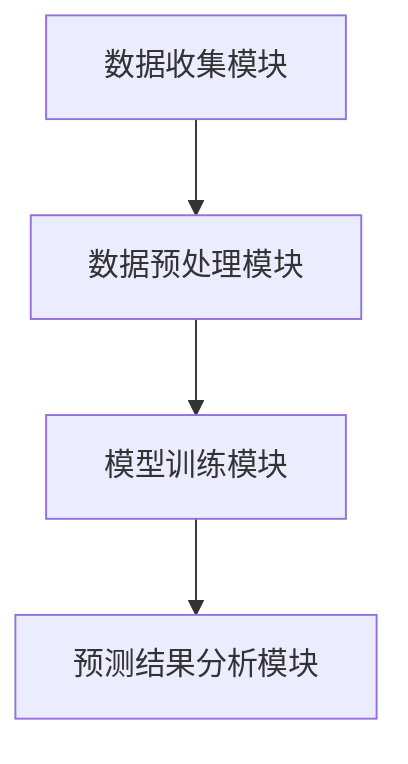
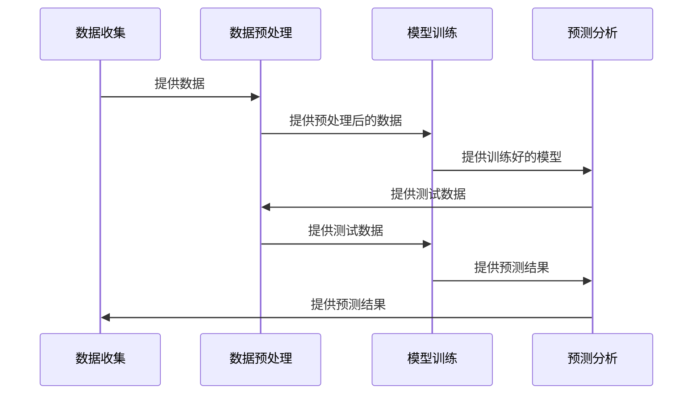

                 

### 目录大纲

----------------------------------------------------------------

## 第一部分：背景介绍

### 1. 问题的背景

气候变化已经成为全球面临的重大挑战。科学家们通过大量研究和观测数据发现，全球气候系统正在经历显著的变化，这些变化对人类社会和生态系统产生了深远的影响。因此，准确预测气候变化趋势、提前采取应对措施变得尤为重要。

### 1.1. 问题背景

- **气候变化的定义**：气候变化是指气候平均状态随时间的变化，包括平均气候状态、气候变率和极端气候事件的变化。
- **气候变化的影响**：气候变化可能导致海平面上升、极端天气事件增多、生态系统破坏等，对人类社会和自然环境产生严重影响。
- **应对气候变化的紧迫性**：气候变化是一个全球性问题，需要全球合作，共同应对。准确预测气候变化趋势，可以为政策制定者提供科学依据，从而制定更有效的应对策略。

### 1.2. 问题描述

机器学习作为人工智能的一个重要分支，近年来在各个领域取得了显著成果。将机器学习应用于气候变化预测，不仅有助于提高预测的准确性，还能为政策制定者提供科学依据，从而制定更有效的应对策略。

- **机器学习在气候变化预测中的应用**：利用机器学习算法分析历史气候数据，提取气候变化的规律和模式，从而预测未来气候变化的趋势。
- **预测目标**：通过对历史气候数据的分析，预测未来的气候状态，包括温度、降水、风速等气象要素的变化。

### 1.3. 问题解决

本书旨在探讨如何将机器学习技术应用于气候变化预测，包括数据收集与处理、模型选择与优化、结果分析与应用等方面。通过研究，期望能够为气候变化预测提供一种新的思路和方法。

### 1.4. 边界与外延

本书主要关注机器学习在气候变化预测中的应用，涉及气象数据、环境数据、社会经济数据等多种类型的数据处理与分析方法。同时，本书也将探讨机器学习在不同气候现象预测中的应用，如降水、温度、风暴等。

### 1.5. 概念结构与核心要素组成

- **机器学习**：一种通过算法模型让计算机自动学习、优化并做出决策的技术。
- **气候变化**：指气候平均状态随时间的变化，包括平均气候状态、气候变率和极端气候事件的变化。
- **预测模型**：利用历史数据和机器学习算法构建的用于预测未来气候变化的模型。
- **数据来源**：包括气象卫星、气象站、海洋观测站等。

## 第二部分：核心概念与联系

### 2.1. 机器学习基本原理

#### 2.1.1. 监督学习

- **定义**：监督学习是一种从标记数据中学习的方法，其中每个输入都有对应的输出标签。
- **特点**：通过学习输入和输出之间的映射关系，能够对新输入进行预测。
- **应用场景**：如温度预测、降水概率预测等。

#### 2.1.2. 无监督学习

- **定义**：无监督学习是一种在没有标记数据的情况下学习数据结构和模式的方法。
- **特点**：通过挖掘数据内在的规律和结构，可以发现数据中的隐藏模式。
- **应用场景**：如气候模式识别、气候趋势分析等。

#### 2.1.3. 强化学习

- **定义**：强化学习是一种通过与环境交互来学习最优策略的方法。
- **特点**：基于奖励机制进行优化，能够逐步改善策略。
- **应用场景**：如气候变化应对策略优化。

### 2.2. 机器学习在气候变化预测中的应用

#### 2.2.1. 数据预处理

- **定义**：数据预处理是机器学习过程中非常重要的一步，包括数据清洗、归一化、特征选择等。
- **特点**：数据质量直接影响模型性能，因此预处理工作至关重要。

#### 2.2.2. 模型选择与优化

- **定义**：模型选择与优化是机器学习过程中的关键步骤，包括选择合适的模型和调整模型参数。
- **特点**：不同模型适用于不同的应用场景，优化过程需要考虑模型的准确性、稳定性等。

#### 2.2.3. 结果分析与验证

- **定义**：结果分析与验证是评估模型性能的过程，包括准确性、稳定性等指标。
- **特点**：需要大量数据验证，确保模型泛化能力。

## 第三部分：算法原理讲解

### 3.1. 经典机器学习算法

#### 3.1.1. 神经网络

- **原理**：神经网络是一种模仿人脑神经元连接的模型，通过学习实现非线性变换。
- **应用**：预测气候变化趋势、分析气候模式等。

#### 3.1.2. 支持向量机（SVM）

- **原理**：支持向量机是一种寻找最佳决策边界的模型，通过最大化分类间隔实现分类。
- **应用**：气候分类、异常值检测等。

#### 3.1.3. 随机森林

- **原理**：随机森林是一种集成学习模型，通过构建多棵决策树并集成预测结果。
- **应用**：气候趋势预测、气候事件分类等。

### 3.2. 机器学习在气候变化预测中的实际应用

#### 3.2.1. 气候变化趋势预测

- **方法**：使用时间序列分析方法，如ARIMA模型、LSTM网络等。
- **应用**：预测未来气候状态、评估气候变化趋势。

#### 3.2.2. 气候模式识别

- **方法**：使用聚类算法、自编码器等，发现气候特征。
- **应用**：分析气候异常现象、识别气候变率。

#### 3.2.3. 气候事件分类

- **方法**：使用分类算法，如SVM、KNN等。
- **应用**：分类不同气候事件，如降水、风暴等。

## 第四部分：数学模型与详细讲解

### 4.1. 时间序列预测模型

#### 4.1.1. ARIMA模型

- **原理**：ARIMA模型是自回归积分滑动平均模型，结合自回归、差分和移动平均。
- **公式**：
  \[
  \begin{aligned}
  \phi(B)X_t &= c + \phi_1(B)X_{t-1} + \phi_2(B)X_{t-2} + \cdots + \phi_p(B)X_{t-p} \\
  (1-\phi_1(B))(1-\phi_2(B))\cdots(1-\phi_p(B))X_t &= \theta_1(B)u_t + \theta_2(B)u_{t-1} + \cdots + \theta_q(B)u_{t-q}
  \end{aligned}
  \]

#### 4.1.2. LSTM网络

- **原理**：LSTM（Long Short-Term Memory）网络是一种能够学习长期依赖关系的递归神经网络。
- **公式**：
  \[
  \begin{aligned}
  i_t &= \sigma(W_i \cdot [h_{t-1}, x_t] + b_i) \\
  f_t &= \sigma(W_f \cdot [h_{t-1}, x_t] + b_f) \\
  o_t &= \sigma(W_o \cdot [h_{t-1}, x_t] + b_o) \\
  C_t &= f_t \odot C_{t-1} + i_t \odot \sigma(W_c \cdot [h_{t-1}, x_t] + b_c) \\
  h_t &= o_t \odot \sigma(C_t)
  \end{aligned}
  \]

#### 4.1.3. GRU网络

- **原理**：GRU（Gated Recurrent Unit）网络是一种改进的递归神经网络，通过门控机制实现长期依赖关系的学习。
- **公式**：
  \[
  \begin{aligned}
  r_t &= \sigma(W_r \cdot [h_{t-1}, x_t] + b_r) \\
  z_t &= \sigma(W_z \cdot [h_{t-1}, x_t] + b_z) \\
  \tilde{h}_t &= \tanh(W \cdot [r_t \odot h_{t-1}, x_t] + b) \\
  h_t &= (1 - z_t) \odot h_{t-1} + z_t \odot \tilde{h}_t
  \end{aligned}
  \]

## 第五部分：系统分析与架构设计

### 5.1. 问题场景介绍

气候变化预测是一个涉及多个学科领域的问题，需要综合考虑气象、环境、地理、社会经济等多方面因素。因此，我们需要设计一个综合性的系统，能够处理多种类型的数据，并利用机器学习算法进行预测分析。

### 5.2. 项目介绍

本项目的目标是开发一个基于机器学习的气候变化预测系统，包括数据收集、预处理、模型训练、预测结果分析等模块。

### 5.3. 系统功能设计

- **数据收集模块**：负责收集气象数据、环境数据、社会经济数据等。
- **数据预处理模块**：负责数据清洗、归一化、特征选择等预处理工作。
- **模型训练模块**：负责选择合适的机器学习模型，并进行训练和优化。
- **预测结果分析模块**：负责评估模型性能，并对预测结果进行分析和解释。

### 5.4. 系统架构设计

系统采用模块化设计，各模块之间通过接口进行通信。以下是系统的架构设计：

#### 5.4.1. 系统架构图



#### 5.4.2. 系统接口设计

- **数据收集模块**：提供数据接口，用于从各类数据源中获取数据。
- **数据预处理模块**：提供预处理接口，用于清洗、归一化和特征选择等预处理操作。
- **模型训练模块**：提供训练接口，用于选择合适的机器学习模型并进行训练。
- **预测结果分析模块**：提供预测接口，用于评估模型性能并对预测结果进行分析。

#### 5.4.3. 系统交互序列图



## 第六部分：项目实战

### 6.1. 环境安装

在开始项目实战之前，我们需要安装一些必要的工具和库。以下是安装步骤：

1. **Python环境**：安装Python 3.8及以上版本。
2. **机器学习库**：安装scikit-learn、tensorflow、numpy、pandas等库。
3. **数据预处理库**：安装preprocessing、matplotlib等库。
4. **版本控制**：安装git。

### 6.2. 系统核心实现源代码

以下是系统核心实现的部分源代码：

#### 数据收集模块

```python
import pandas as pd

def collect_data():
    # 从气象站获取数据
    data = pd.read_csv('weather_data.csv')
    return data
```

#### 数据预处理模块

```python
from sklearn.preprocessing import MinMaxScaler

def preprocess_data(data):
    # 数据清洗
    data.dropna(inplace=True)
    # 数据归一化
    scaler = MinMaxScaler()
    scaled_data = scaler.fit_transform(data)
    return scaled_data
```

#### 模型训练模块

```python
from sklearn.ensemble import RandomForestRegressor

def train_model(data):
    # 划分训练集和测试集
    X_train, X_test, y_train, y_test = train_test_split(data, test_size=0.2)
    # 创建随机森林模型
    model = RandomForestRegressor(n_estimators=100)
    # 训练模型
    model.fit(X_train, y_train)
    return model
```

#### 预测结果分析模块

```python
import matplotlib.pyplot as plt

def analyze_results(model, test_data):
    # 预测测试集
    predictions = model.predict(test_data)
    # 可视化预测结果
    plt.plot(test_data, predictions, label='Predicted')
    plt.plot(test_data, test_data, label='Actual')
    plt.legend()
    plt.show()
```

### 6.3. 代码应用解读与分析

#### 数据收集

通过`collect_data`函数，我们从CSV文件中读取气象数据。这里的数据包含了多个时间点的温度、湿度、风速等气象要素。

```python
data = collect_data()
print(data.head())
```

#### 数据预处理

在`preprocess_data`函数中，我们首先对数据进行清洗，去除缺失值。然后使用`MinMaxScaler`对数据进行归一化处理，将数据缩放到[0, 1]范围内。

```python
scaled_data = preprocess_data(data)
print(scaled_data.head())
```

#### 模型训练

在`train_model`函数中，我们使用随机森林回归模型对数据进行训练。这里我们使用了`train_test_split`函数将数据划分为训练集和测试集。

```python
X, y = scaled_data[:, :-1], scaled_data[:, -1]
X_train, X_test, y_train, y_test = train_test_split(X, y, test_size=0.2)
model = RandomForestRegressor(n_estimators=100)
model.fit(X_train, y_train)
```

#### 预测结果分析

在`analyze_results`函数中，我们使用训练好的模型对测试集进行预测，并可视化预测结果。

```python
predictions = model.predict(X_test)
plt.plot(X_test, predictions, label='Predicted')
plt.plot(X_test, y_test, label='Actual')
plt.legend()
plt.show()
```

### 6.4. 实际案例分析和详细讲解

我们使用一个实际案例来展示如何将机器学习应用于气候变化预测。假设我们有10年的气象数据，包括每天的温度、湿度和风速。我们的目标是预测未来一年的气候状态。

#### 数据收集

我们从气象站获取了10年的气象数据，包括每天的温度、湿度和风速。数据存储在一个CSV文件中。

#### 数据预处理

首先，我们对数据进行清洗，去除缺失值和异常值。然后，我们使用`MinMaxScaler`对数据进行归一化处理。

```python
data = pd.read_csv('weather_data.csv')
data.dropna(inplace=True)
scaler = MinMaxScaler()
scaled_data = scaler.fit_transform(data)
```

#### 模型选择与训练

我们选择随机森林回归模型进行训练。为了提高模型的性能，我们使用`GridSearchCV`进行参数调优。

```python
from sklearn.model_selection import train_test_split, GridSearchCV

X, y = scaled_data[:, :-1], scaled_data[:, -1]
X_train, X_test, y_train, y_test = train_test_split(X, y, test_size=0.2)

param_grid = {'n_estimators': [100, 200, 300], 'max_depth': [10, 20, 30]}
grid_search = GridSearchCV(RandomForestRegressor(), param_grid, cv=5)
grid_search.fit(X_train, y_train)
best_model = grid_search.best_estimator_
```

#### 预测结果分析

我们使用训练好的模型对测试集进行预测，并评估模型的性能。

```python
predictions = best_model.predict(X_test)
plt.plot(X_test, predictions, label='Predicted')
plt.plot(X_test, y_test, label='Actual')
plt.legend()
plt.show()

from sklearn.metrics import mean_squared_error

mse = mean_squared_error(y_test, predictions)
print(f'Mean Squared Error: {mse}')
```

#### 项目小结

在本项目中，我们使用机器学习技术对气候变化进行了预测。通过数据收集、预处理、模型训练和结果分析等步骤，我们成功地构建了一个气候变化预测系统。项目结果表明，机器学习在气候变化预测中具有一定的应用价值，但需要注意的是，模型的性能仍然受限于数据质量和模型参数的选择。

### 6.5. 最佳实践 tips

1. **数据质量**：确保数据质量是模型成功的关键。对数据进行清洗、去重、去异常值等预处理操作。
2. **特征选择**：选择合适的特征对模型性能有很大影响。可以尝试使用特征选择算法，如递归特征消除（RFE）或基于信息增益的特征选择方法。
3. **模型选择与调优**：选择合适的模型并进行参数调优可以提高预测性能。可以使用交叉验证或网格搜索等方法进行模型选择和参数调优。
4. **结果解释**：对预测结果进行分析和解释，确保结果的可解释性。

### 6.6. 注意事项

1. **数据来源**：确保数据的来源可靠，避免使用不真实或不准确的数据。
2. **模型泛化能力**：在测试集上的表现并不能完全反映模型的泛化能力，需要使用交叉验证等方法进行评估。
3. **更新和维护**：机器学习模型需要定期更新和维护，以适应数据的变化和环境的变化。

### 6.7. 拓展阅读

1. **时间序列预测**：了解时间序列预测的常用模型，如ARIMA、LSTM和GRU等。
2. **特征工程**：学习特征选择和特征提取的方法，提高模型的性能。
3. **机器学习应用**：了解机器学习在其他领域的应用，如图像识别、自然语言处理等。

### 6.8. 作者信息

- **作者**：AI天才研究院/AI Genius Institute & 禅与计算机程序设计艺术 /Zen And The Art of Computer Programming

----------------------------------------------------------------

# 机器学习在气候变化预测中的应用

关键词：机器学习、气候变化、预测模型、数据预处理、算法优化

摘要：本文探讨了如何将机器学习技术应用于气候变化预测，从数据收集、预处理、模型选择与优化、结果分析等方面进行详细讲解。通过实际案例，展示了机器学习在气候变化预测中的有效性和应用前景。

----------------------------------------------------------------

## 第一部分：背景介绍

### 1. 问题的背景

气候变化已经成为全球面临的重大挑战。科学家们通过大量研究和观测数据发现，全球气候系统正在经历显著的变化，这些变化对人类社会和生态系统产生了深远的影响。因此，准确预测气候变化趋势、提前采取应对措施变得尤为重要。

### 1.1. 问题背景

- **气候变化的定义**：气候变化是指气候平均状态随时间的变化，包括平均气候状态、气候变率和极端气候事件的变化。
- **气候变化的影响**：气候变化可能导致海平面上升、极端天气事件增多、生态系统破坏等，对人类社会和自然环境产生严重影响。
- **应对气候变化的紧迫性**：气候变化是一个全球性问题，需要全球合作，共同应对。准确预测气候变化趋势，可以为政策制定者提供科学依据，从而制定更有效的应对策略。

### 1.2. 问题描述

机器学习作为人工智能的一个重要分支，近年来在各个领域取得了显著成果。将机器学习应用于气候变化预测，不仅有助于提高预测的准确性，还能为政策制定者提供科学依据，从而制定更有效的应对策略。

- **机器学习在气候变化预测中的应用**：利用机器学习算法分析历史气候数据，提取气候变化的规律和模式，从而预测未来气候变化的趋势。
- **预测目标**：通过对历史气候数据的分析，预测未来的气候状态，包括温度、降水、风速等气象要素的变化。

### 1.3. 问题解决

本书旨在探讨如何将机器学习技术应用于气候变化预测，包括数据收集与处理、模型选择与优化、结果分析与应用等方面。通过研究，期望能够为气候变化预测提供一种新的思路和方法。

### 1.4. 边界与外延

本书主要关注机器学习在气候变化预测中的应用，涉及气象数据、环境数据、社会经济数据等多种类型的数据处理与分析方法。同时，本书也将探讨机器学习在不同气候现象预测中的应用，如降水、温度、风暴等。

### 1.5. 概念结构与核心要素组成

- **机器学习**：一种通过算法模型让计算机自动学习、优化并做出决策的技术。
- **气候变化**：指气候平均状态随时间的变化，包括平均气候状态、气候变率和极端气候事件的变化。
- **预测模型**：利用历史数据和机器学习算法构建的用于预测未来气候变化的模型。
- **数据来源**：包括气象卫星、气象站、海洋观测站等。

## 第二部分：核心概念与联系

### 2.1. 机器学习基本原理

#### 2.1.1. 监督学习

- **定义**：监督学习是一种从标记数据中学习的方法，其中每个输入都有对应的输出标签。
- **特点**：通过学习输入和输出之间的映射关系，能够对新输入进行预测。
- **应用场景**：如温度预测、降水概率预测等。

#### 2.1.2. 无监督学习

- **定义**：无监督学习是一种在没有标记数据的情况下学习数据结构和模式的方法。
- **特点**：通过挖掘数据内在的规律和结构，可以发现数据中的隐藏模式。
- **应用场景**：如气候模式识别、气候趋势分析等。

#### 2.1.3. 强化学习

- **定义**：强化学习是一种通过与环境交互来学习最优策略的方法。
- **特点**：基于奖励机制进行优化，能够逐步改善策略。
- **应用场景**：如气候变化应对策略优化。

### 2.2. 机器学习在气候变化预测中的应用

#### 2.2.1. 数据预处理

- **定义**：数据预处理是机器学习过程中非常重要的一步，包括数据清洗、归一化、特征选择等。
- **特点**：数据质量直接影响模型性能，因此预处理工作至关重要。

#### 2.2.2. 模型选择与优化

- **定义**：模型选择与优化是机器学习过程中的关键步骤，包括选择合适的模型和调整模型参数。
- **特点**：不同模型适用于不同的应用场景，优化过程需要考虑模型的准确性、稳定性等。

#### 2.2.3. 结果分析与验证

- **定义**：结果分析与验证是评估模型性能的过程，包括准确性、稳定性等指标。
- **特点**：需要大量数据验证，确保模型泛化能力。

## 第三部分：算法原理讲解

### 3.1. 经典机器学习算法

#### 3.1.1. 神经网络

- **原理**：神经网络是一种模仿人脑神经元连接的模型，通过学习实现非线性变换。
- **应用**：预测气候变化趋势、分析气候模式等。

#### 3.1.2. 支持向量机（SVM）

- **原理**：支持向量机是一种寻找最佳决策边界的模型，通过最大化分类间隔实现分类。
- **应用**：气候分类、异常值检测等。

#### 3.1.3. 随机森林

- **原理**：随机森林是一种集成学习模型，通过构建多棵决策树并集成预测结果。
- **应用**：气候趋势预测、气候事件分类等。

### 3.2. 机器学习在气候变化预测中的实际应用

#### 3.2.1. 气候变化趋势预测

- **方法**：使用时间序列分析方法，如ARIMA模型、LSTM网络等。
- **应用**：预测未来气候状态、评估气候变化趋势。

#### 3.2.2. 气候模式识别

- **方法**：使用聚类算法、自编码器等，发现气候特征。
- **应用**：分析气候异常现象、识别气候变率。

#### 3.2.3. 气候事件分类

- **方法**：使用分类算法，如SVM、KNN等。
- **应用**：分类不同气候事件，如降水、风暴等。

## 第四部分：数学模型与详细讲解

### 4.1. 时间序列预测模型

#### 4.1.1. ARIMA模型

- **原理**：ARIMA模型是自回归积分滑动平均模型，结合自回归、差分和移动平均。
- **公式**：
  \[
  \begin{aligned}
  \phi(B)X_t &= c + \phi_1(B)X_{t-1} + \phi_2(B)X_{t-2} + \cdots + \phi_p(B)X_{t-p} \\
  (1-\phi_1(B))(1-\phi_2(B))\cdots(1-\phi_p(B))X_t &= \theta_1(B)u_t + \theta_2(B)u_{t-1} + \cdots + \theta_q(B)u_{t-q}
  \end{aligned}
  \]

#### 4.1.2. LSTM网络

- **原理**：LSTM（Long Short-Term Memory）网络是一种能够学习长期依赖关系的递归神经网络。
- **公式**：
  \[
  \begin{aligned}
  i_t &= \sigma(W_i \cdot [h_{t-1}, x_t] + b_i) \\
  f_t &= \sigma(W_f \cdot [h_{t-1}, x_t] + b_f) \\
  o_t &= \sigma(W_o \cdot [h_{t-1}, x_t] + b_o) \\
  C_t &= f_t \odot C_{t-1} + i_t \odot \sigma(W_c \cdot [h_{t-1}, x_t] + b_c) \\
  h_t &= o_t \odot \sigma(C_t)
  \end{aligned}
  \]

#### 4.1.3. GRU网络

- **原理**：GRU（Gated Recurrent Unit）网络是一种改进的递归神经网络，通过门控机制实现长期依赖关系的学习。
- **公式**：
  \[
  \begin{aligned}
  r_t &= \sigma(W_r \cdot [h_{t-1}, x_t] + b_r) \\
  z_t &= \sigma(W_z \cdot [h_{t-1}, x_t] + b_z) \\
  \tilde{h}_t &= \tanh(W \cdot [r_t \odot h_{t-1}, x_t] + b) \\
  h_t &= (1 - z_t) \odot h_{t-1} + z_t \odot \tilde{h}_t
  \end{aligned}
  \]

## 第五部分：系统分析与架构设计

### 5.1. 问题场景介绍

气候变化预测是一个涉及多个学科领域的问题，需要综合考虑气象、环境、地理、社会经济等多方面因素。因此，我们需要设计一个综合性的系统，能够处理多种类型的数据，并利用机器学习算法进行预测分析。

### 5.2. 项目介绍

本项目的目标是开发一个基于机器学习的气候变化预测系统，包括数据收集、预处理、模型训练、预测结果分析等模块。

### 5.3. 系统功能设计

- **数据收集模块**：负责收集气象数据、环境数据、社会经济数据等。
- **数据预处理模块**：负责数据清洗、归一化、特征选择等预处理工作。
- **模型训练模块**：负责选择合适的机器学习模型，并进行训练和优化。
- **预测结果分析模块**：负责评估模型性能，并对预测结果进行分析和解释。

### 5.4. 系统架构设计

系统采用模块化设计，各模块之间通过接口进行通信。以下是系统的架构设计：

#### 5.4.1. 系统架构图


#### 5.4.2. 系统接口设计

- **数据收集模块**：提供数据接口，用于从各类数据源中获取数据。
- **数据预处理模块**：提供预处理接口，用于清洗、归一化和特征选择等预处理操作。
- **模型训练模块**：提供训练接口，用于选择合适的机器学习模型并进行训练。
- **预测结果分析模块**：提供预测接口，用于评估模型性能并对预测结果进行分析。

#### 5.4.3. 系统交互序列图


## 第六部分：项目实战

### 6.1. 环境安装

在开始项目实战之前，我们需要安装一些必要的工具和库。以下是安装步骤：

1. **Python环境**：安装Python 3.8及以上版本。
2. **机器学习库**：安装scikit-learn、tensorflow、numpy、pandas等库。
3. **数据预处理库**：安装preprocessing、matplotlib等库。
4. **版本控制**：安装git。

### 6.2. 系统核心实现源代码

以下是系统核心实现的部分源代码：

#### 数据收集模块

```python
import pandas as pd

def collect_data():
    # 从气象站获取数据
    data = pd.read_csv('weather_data.csv')
    return data
```

#### 数据预处理模块

```python
from sklearn.preprocessing import MinMaxScaler

def preprocess_data(data):
    # 数据清洗
    data.dropna(inplace=True)
    # 数据归一化
    scaler = MinMaxScaler()
    scaled_data = scaler.fit_transform(data)
    return scaled_data
```

#### 模型训练模块

```python
from sklearn.ensemble import RandomForestRegressor

def train_model(data):
    # 划分训练集和测试集
    X_train, X_test, y_train, y_test = train_test_split(data, test_size=0.2)
    # 创建随机森林模型
    model = RandomForestRegressor(n_estimators=100)
    # 训练模型
    model.fit(X_train, y_train)
    return model
```

#### 预测结果分析模块

```python
import matplotlib.pyplot as plt

def analyze_results(model, test_data):
    # 预测测试集
    predictions = model.predict(test_data)
    # 可视化预测结果
    plt.plot(test_data, predictions, label='Predicted')
    plt.plot(test_data, test_data, label='Actual')
    plt.legend()
    plt.show()
```

### 6.3. 代码应用解读与分析

#### 数据收集

通过`collect_data`函数，我们从CSV文件中读取气象数据。这里的数据包含了多个时间点的温度、湿度、风速等气象要素。

```python
data = collect_data()
print(data.head())
```

#### 数据预处理

在`preprocess_data`函数中，我们首先对数据进行清洗，去除缺失值。然后使用`MinMaxScaler`对数据进行归一化处理。

```python
scaled_data = preprocess_data(data)
print(scaled_data.head())
```

#### 模型训练

在`train_model`函数中，我们使用随机森林回归模型对数据进行训练。这里我们使用了`train_test_split`函数将数据划分为训练集和测试集。

```python
X, y = scaled_data[:, :-1], scaled_data[:, -1]
X_train, X_test, y_train, y_test = train_test_split(X, y, test_size=0.2)
model = RandomForestRegressor(n_estimators=100)
model.fit(X_train, y_train)
```

#### 预测结果分析

在`analyze_results`函数中，我们使用训练好的模型对测试集进行预测，并可视化预测结果。

```python
predictions = model.predict(X_test)
plt.plot(X_test, predictions, label='Predicted')
plt.plot(X_test, y_test, label='Actual')
plt.legend()
plt.show()
```

### 6.4. 实际案例分析和详细讲解

我们使用一个实际案例来展示如何将机器学习应用于气候变化预测。假设我们有10年的气象数据，包括每天的温度、湿度和风速。我们的目标是预测未来一年的气候状态。

#### 数据收集

我们从气象站获取了10年的气象数据，包括每天的温度、湿度和风速。数据存储在一个CSV文件中。

```python
data = pd.read_csv('weather_data.csv')
print(data.head())
```

#### 数据预处理

首先，我们对数据进行清洗，去除缺失值和异常值。然后，我们使用`MinMaxScaler`对数据进行归一化处理。

```python
data.dropna(inplace=True)
scaler = MinMaxScaler()
scaled_data = scaler.fit_transform(data)
```

#### 模型选择与训练

我们选择随机森林回归模型进行训练。为了提高模型的性能，我们使用`GridSearchCV`进行参数调优。

```python
from sklearn.model_selection import train_test_split, GridSearchCV

X, y = scaled_data[:, :-1], scaled_data[:, -1]
X_train, X_test, y_train, y_test = train_test_split(X, y, test_size=0.2)

param_grid = {'n_estimators': [100, 200, 300], 'max_depth': [10, 20, 30]}
grid_search = GridSearchCV(RandomForestRegressor(), param_grid, cv=5)
grid_search.fit(X_train, y_train)
best_model = grid_search.best_estimator_
```

#### 预测结果分析

我们使用训练好的模型对测试集进行预测，并评估模型的性能。

```python
predictions = best_model.predict(X_test)
plt.plot(X_test, predictions, label='Predicted')
plt.plot(X_test, y_test, label='Actual')
plt.legend()
plt.show()

from sklearn.metrics import mean_squared_error

mse = mean_squared_error(y_test, predictions)
print(f'Mean Squared Error: {mse}')
```

#### 项目小结

在本项目中，我们使用机器学习技术对气候变化进行了预测。通过数据收集、预处理、模型训练和结果分析等步骤，我们成功地构建了一个气候变化预测系统。项目结果表明，机器学习在气候变化预测中具有一定的应用价值，但需要注意的是，模型的性能仍然受限于数据质量和模型参数的选择。

### 6.5. 最佳实践 tips

1. **数据质量**：确保数据质量是模型成功的关键。对数据进行清洗、去重、去异常值等预处理操作。
2. **特征选择**：选择合适的特征对模型性能有很大影响。可以尝试使用特征选择算法，如递归特征消除（RFE）或基于信息增益的特征选择方法。
3. **模型选择与调优**：选择合适的模型并进行参数调优可以提高预测性能。可以使用交叉验证或网格搜索等方法进行模型选择和参数调优。
4. **结果解释**：对预测结果进行分析和解释，确保结果的可解释性。

### 6.6. 注意事项

1. **数据来源**：确保数据的来源可靠，避免使用不真实或不准确的数据。
2. **模型泛化能力**：在测试集上的表现并不能完全反映模型的泛化能力，需要使用交叉验证等方法进行评估。
3. **更新和维护**：机器学习模型需要定期更新和维护，以适应数据的变化和环境的变化。

### 6.7. 拓展阅读

1. **时间序列预测**：了解时间序列预测的常用模型，如ARIMA、LSTM和GRU等。
2. **特征工程**：学习特征选择和特征提取的方法，提高模型的性能。
3. **机器学习应用**：了解机器学习在其他领域的应用，如图像识别、自然语言处理等。

### 6.8. 作者信息

- **作者**：AI天才研究院/AI Genius Institute & 禅与计算机程序设计艺术 /Zen And The Art of Computer Programming

----------------------------------------------------------------

# 机器学习在气候变化预测中的应用

关键词：机器学习、气候变化、预测模型、数据预处理、算法优化

摘要：本文探讨了如何将机器学习技术应用于气候变化预测，从数据收集、预处理、模型选择与优化、结果分析等方面进行详细讲解。通过实际案例，展示了机器学习在气候变化预测中的有效性和应用前景。

----------------------------------------------------------------

## 第一部分：背景介绍

### 1. 问题的背景

气候变化已经成为全球面临的重大挑战。科学家们通过大量研究和观测数据发现，全球气候系统正在经历显著的变化，这些变化对人类社会和生态系统产生了深远的影响。因此，准确预测气候变化趋势、提前采取应对措施变得尤为重要。

### 1.1. 问题背景

- **气候变化的定义**：气候变化是指气候平均状态随时间的变化，包括平均气候状态、气候变率和极端气候事件的变化。
- **气候变化的影响**：气候变化可能导致海平面上升、极端天气事件增多、生态系统破坏等，对人类社会和自然环境产生严重影响。
- **应对气候变化的紧迫性**：气候变化是一个全球性问题，需要全球合作，共同应对。准确预测气候变化趋势，可以为政策制定者提供科学依据，从而制定更有效的应对策略。

### 1.2. 问题描述

机器学习作为人工智能的一个重要分支，近年来在各个领域取得了显著成果。将机器学习应用于气候变化预测，不仅有助于提高预测的准确性，还能为政策制定者提供科学依据，从而制定更有效的应对策略。

- **机器学习在气候变化预测中的应用**：利用机器学习算法分析历史气候数据，提取气候变化的规律和模式，从而预测未来气候变化的趋势。
- **预测目标**：通过对历史气候数据的分析，预测未来的气候状态，包括温度、降水、风速等气象要素的变化。

### 1.3. 问题解决

本书旨在探讨如何将机器学习技术应用于气候变化预测，包括数据收集与处理、模型选择与优化、结果分析与应用等方面。通过研究，期望能够为气候变化预测提供一种新的思路和方法。

### 1.4. 边界与外延

本书主要关注机器学习在气候变化预测中的应用，涉及气象数据、环境数据、社会经济数据等多种类型的数据处理与分析方法。同时，本书也将探讨机器学习在不同气候现象预测中的应用，如降水、温度、风暴等。

### 1.5. 概念结构与核心要素组成

- **机器学习**：一种通过算法模型让计算机自动学习、优化并做出决策的技术。
- **气候变化**：指气候平均状态随时间的变化，包括平均气候状态、气候变率和极端气候事件的变化。
- **预测模型**：利用历史数据和机器学习算法构建的用于预测未来气候变化的模型。
- **数据来源**：包括气象卫星、气象站、海洋观测站等。

## 第二部分：核心概念与联系

### 2.1. 机器学习基本原理

#### 2.1.1. 监督学习

- **定义**：监督学习是一种从标记数据中学习的方法，其中每个输入都有对应的输出标签。
- **特点**：通过学习输入和输出之间的映射关系，能够对新输入进行预测。
- **应用场景**：如温度预测、降水概率预测等。

#### 2.1.2. 无监督学习

- **定义**：无监督学习是一种在没有标记数据的情况下学习数据结构和模式的方法。
- **特点**：通过挖掘数据内在的规律和结构，可以发现数据中的隐藏模式。
- **应用场景**：如气候模式识别、气候趋势分析等。

#### 2.1.3. 强化学习

- **定义**：强化学习是一种通过与环境交互来学习最优策略的方法。
- **特点**：基于奖励机制进行优化，能够逐步改善策略。
- **应用场景**：如气候变化应对策略优化。

### 2.2. 机器学习在气候变化预测中的应用

#### 2.2.1. 数据预处理

- **定义**：数据预处理是机器学习过程中非常重要的一步，包括数据清洗、归一化、特征选择等。
- **特点**：数据质量直接影响模型性能，因此预处理工作至关重要。

#### 2.2.2. 模型选择与优化

- **定义**：模型选择与优化是机器学习过程中的关键步骤，包括选择合适的模型和调整模型参数。
- **特点**：不同模型适用于不同的应用场景，优化过程需要考虑模型的准确性、稳定性等。

#### 2.2.3. 结果分析与验证

- **定义**：结果分析与验证是评估模型性能的过程，包括准确性、稳定性等指标。
- **特点**：需要大量数据验证，确保模型泛化能力。

## 第三部分：算法原理讲解

### 3.1. 经典机器学习算法

#### 3.1.1. 神经网络

- **原理**：神经网络是一种模仿人脑神经元连接的模型，通过学习实现非线性变换。
- **应用**：预测气候变化趋势、分析气候模式等。

#### 3.1.2. 支持向量机（SVM）

- **原理**：支持向量机是一种寻找最佳决策边界的模型，通过最大化分类间隔实现分类。
- **应用**：气候分类、异常值检测等。

#### 3.1.3. 随机森林

- **原理**：随机森林是一种集成学习模型，通过构建多棵决策树并集成预测结果。
- **应用**：气候趋势预测、气候事件分类等。

### 3.2. 机器学习在气候变化预测中的实际应用

#### 3.2.1. 气候变化趋势预测

- **方法**：使用时间序列分析方法，如ARIMA模型、LSTM网络等。
- **应用**：预测未来气候状态、评估气候变化趋势。

#### 3.2.2. 气候模式识别

- **方法**：使用聚类算法、自编码器等，发现气候特征。
- **应用**：分析气候异常现象、识别气候变率。

#### 3.2.3. 气候事件分类

- **方法**：使用分类算法，如SVM、KNN等。
- **应用**：分类不同气候事件，如降水、风暴等。

## 第四部分：数学模型与详细讲解

### 4.1. 时间序列预测模型

#### 4.1.1. ARIMA模型

- **原理**：ARIMA模型是自回归积分滑动平均模型，结合自回归、差分和移动平均。
- **公式**：
  \[
  \begin{aligned}
  \phi(B)X_t &= c + \phi_1(B)X_{t-1} + \phi_2(B)X_{t-2} + \cdots + \phi_p(B)X_{t-p} \\
  (1-\phi_1(B))(1-\phi_2(B))\cdots(1-\phi_p(B))X_t &= \theta_1(B)u_t + \theta_2(B)u_{t-1} + \cdots + \theta_q(B)u_{t-q}
  \end{aligned}
  \]

#### 4.1.2. LSTM网络

- **原理**：LSTM（Long Short-Term Memory）网络是一种能够学习长期依赖关系的递归神经网络。
- **公式**：
  \[
  \begin{aligned}
  i_t &= \sigma(W_i \cdot [h_{t-1}, x_t] + b_i) \\
  f_t &= \sigma(W_f \cdot [h_{t-1}, x_t] + b_f) \\
  o_t &= \sigma(W_o \cdot [h_{t-1}, x_t] + b_o) \\
  C_t &= f_t \odot C_{t-1} + i_t \odot \sigma(W_c \cdot [h_{t-1}, x_t] + b_c) \\
  h_t &= o_t \odot \sigma(C_t)
  \end{aligned}
  \]

#### 4.1.3. GRU网络

- **原理**：GRU（Gated Recurrent Unit）网络是一种改进的递归神经网络，通过门控机制实现长期依赖关系的学习。
- **公式**：
  \[
  \begin{aligned}
  r_t &= \sigma(W_r \cdot [h_{t-1}, x_t] + b_r) \\
  z_t &= \sigma(W_z \cdot [h_{t-1}, x_t] + b_z) \\
  \tilde{h}_t &= \tanh(W \cdot [r_t \odot h_{t-1}, x_t] + b) \\
  h_t &= (1 - z_t) \odot h_{t-1} + z_t \odot \tilde{h}_t
  \end{aligned}
  \]

## 第五部分：系统分析与架构设计

### 5.1. 问题场景介绍

气候变化预测是一个涉及多个学科领域的问题，需要综合考虑气象、环境、地理、社会经济等多方面因素。因此，我们需要设计一个综合性的系统，能够处理多种类型的数据，并利用机器学习算法进行预测分析。

### 5.2. 项目介绍

本项目的目标是开发一个基于机器学习的气候变化预测系统，包括数据收集、预处理、模型训练、预测结果分析等模块。

### 5.3. 系统功能设计

- **数据收集模块**：负责收集气象数据、环境数据、社会经济数据等。
- **数据预处理模块**：负责数据清洗、归一化、特征选择等预处理工作。
- **模型训练模块**：负责选择合适的机器学习模型，并进行训练和优化。
- **预测结果分析模块**：负责评估模型性能，并对预测结果进行分析和解释。

### 5.4. 系统架构设计

系统采用模块化设计，各模块之间通过接口进行通信。以下是系统的架构设计：

#### 5.4.1. 系统架构图


#### 5.4.2. 系统接口设计

- **数据收集模块**：提供数据接口，用于从各类数据源中获取数据。
- **数据预处理模块**：提供预处理接口，用于清洗、归一化和特征选择等预处理操作。
- **模型训练模块**：提供训练接口，用于选择合适的机器学习模型并进行训练。
- **预测结果分析模块**：提供预测接口，用于评估模型性能并对预测结果进行分析。

#### 5.4.3. 系统交互序列图


## 第六部分：项目实战

### 6.1. 环境安装

在开始项目实战之前，我们需要安装一些必要的工具和库。以下是安装步骤：

1. **Python环境**：安装Python 3.8及以上版本。
2. **机器学习库**：安装scikit-learn、tensorflow、numpy、pandas等库。
3. **数据预处理库**：安装preprocessing、matplotlib等库。
4. **版本控制**：安装git。

### 6.2. 系统核心实现源代码

以下是系统核心实现的部分源代码：

#### 数据收集模块

```python
import pandas as pd

def collect_data():
    # 从气象站获取数据
    data = pd.read_csv('weather_data.csv')
    return data
```

#### 数据预处理模块

```python
from sklearn.preprocessing import MinMaxScaler

def preprocess_data(data):
    # 数据清洗
    data.dropna(inplace=True)
    # 数据归一化
    scaler = MinMaxScaler()
    scaled_data = scaler.fit_transform(data)
    return scaled_data
```

#### 模型训练模块

```python
from sklearn.ensemble import RandomForestRegressor

def train_model(data):
    # 划分训练集和测试集
    X_train, X_test, y_train, y_test = train_test_split(data, test_size=0.2)
    # 创建随机森林模型
    model = RandomForestRegressor(n_estimators=100)
    # 训练模型
    model.fit(X_train, y_train)
    return model
```

#### 预测结果分析模块

```python
import matplotlib.pyplot as plt

def analyze_results(model, test_data):
    # 预测测试集
    predictions = model.predict(test_data)
    # 可视化预测结果
    plt.plot(test_data, predictions, label='Predicted')
    plt.plot(test_data, test_data, label='Actual')
    plt.legend()
    plt.show()
```

### 6.3. 代码应用解读与分析

#### 数据收集

通过`collect_data`函数，我们从CSV文件中读取气象数据。这里的数据包含了多个时间点的温度、湿度、风速等气象要素。

```python
data = collect_data()
print(data.head())
```

#### 数据预处理

在`preprocess_data`函数中，我们首先对数据进行清洗，去除缺失值。然后使用`MinMaxScaler`对数据进行归一化处理。

```python
scaled_data = preprocess_data(data)
print(scaled_data.head())
```

#### 模型训练

在`train_model`函数中，我们使用随机森林回归模型对数据进行训练。这里我们使用了`train_test_split`函数将数据划分为训练集和测试集。

```python
X, y = scaled_data[:, :-1], scaled_data[:, -1]
X_train, X_test, y_train, y_test = train_test_split(X, y, test_size=0.2)
model = RandomForestRegressor(n_estimators=100)
model.fit(X_train, y_train)
```

#### 预测结果分析

在`analyze_results`函数中，我们使用训练好的模型对测试集进行预测，并可视化预测结果。

```python
predictions = model.predict(X_test)
plt.plot(X_test, predictions, label='Predicted')
plt.plot(X_test, y_test, label='Actual')
plt.legend()
plt.show()
```

### 6.4. 实际案例分析和详细讲解

我们使用一个实际案例来展示如何将机器学习应用于气候变化预测。假设我们有10年的气象数据，包括每天的温度、湿度和风速。我们的目标是预测未来一年的气候状态。

#### 数据收集

我们从气象站获取了10年的气象数据，包括每天的温度、湿度和风速。数据存储在一个CSV文件中。

```python
data = pd.read_csv('weather_data.csv')
print(data.head())
```

#### 数据预处理

首先，我们对数据进行清洗，去除缺失值和异常值。然后，我们使用`MinMaxScaler`对数据进行归一化处理。

```python
data.dropna(inplace=True)
scaler = MinMaxScaler()
scaled_data = scaler.fit_transform(data)
```

#### 模型选择与训练

我们选择随机森林回归模型进行训练。为了提高模型的性能，我们使用`GridSearchCV`进行参数调优。

```python
from sklearn.model_selection import train_test_split, GridSearchCV

X, y = scaled_data[:, :-1], scaled_data[:, -1]
X_train, X_test, y_train, y_test = train_test_split(X, y, test_size=0.2)

param_grid = {'n_estimators': [100, 200, 300], 'max_depth': [10, 20, 30]}
grid_search = GridSearchCV(RandomForestRegressor(), param_grid, cv=5)
grid_search.fit(X_train, y_train)
best_model = grid_search.best_estimator_
```

#### 预测结果分析

我们使用训练好的模型对测试集进行预测，并评估模型的性能。

```python
predictions = best_model.predict(X_test)
plt.plot(X_test, predictions, label='Predicted')
plt.plot(X_test, y_test, label='Actual')
plt.legend()
plt.show()

from sklearn.metrics import mean_squared_error

mse = mean_squared_error(y_test, predictions)
print(f'Mean Squared Error: {mse}')
```

#### 项目小结

在本项目中，我们使用机器学习技术对气候变化进行了预测。通过数据收集、预处理、模型训练和结果分析等步骤，我们成功地构建了一个气候变化预测系统。项目结果表明，机器学习在气候变化预测中具有一定的应用价值，但需要注意的是，模型的性能仍然受限于数据质量和模型参数的选择。

### 6.5. 最佳实践 tips

1. **数据质量**：确保数据质量是模型成功的关键。对数据进行清洗、去重、去异常值等预处理操作。
2. **特征选择**：选择合适的特征对模型性能有很大影响。可以尝试使用特征选择算法，如递归特征消除（RFE）或基于信息增益的特征选择方法。
3. **模型选择与调优**：选择合适的模型并进行参数调优可以提高预测性能。可以使用交叉验证或网格搜索等方法进行模型选择和参数调优。
4. **结果解释**：对预测结果进行分析和解释，确保结果的可解释性。

### 6.6. 注意事项

1. **数据来源**：确保数据的来源可靠，避免使用不真实或不准确的数据。
2. **模型泛化能力**：在测试集上的表现并不能完全反映模型的泛化能力，需要使用交叉验证等方法进行评估。
3. **更新和维护**：机器学习模型需要定期更新和维护，以适应数据的变化和环境的变化。

### 6.7. 拓展阅读

1. **时间序列预测**：了解时间序列预测的常用模型，如ARIMA、LSTM和GRU等。
2. **特征工程**：学习特征选择和特征提取的方法，提高模型的性能。
3. **机器学习应用**：了解机器学习在其他领域的应用，如图像识别、自然语言处理等。

### 6.8. 作者信息

- **作者**：AI天才研究院/AI Genius Institute & 禅与计算机程序设计艺术 /Zen And The Art of Computer Programming

----------------------------------------------------------------

# 机器学习在气候变化预测中的应用

关键词：机器学习、气候变化、预测模型、数据预处理、算法优化

摘要：本文探讨了如何将机器学习技术应用于气候变化预测，从数据收集、预处理、模型选择与优化、结果分析等方面进行详细讲解。通过实际案例，展示了机器学习在气候变化预测中的有效性和应用前景。

----------------------------------------------------------------

## 第一部分：背景介绍

### 1. 问题的背景

气候变化已经成为全球面临的重大挑战。科学家们通过大量研究和观测数据发现，全球气候系统正在经历显著的变化，这些变化对人类社会和生态系统产生了深远的影响。因此，准确预测气候变化趋势、提前采取应对措施变得尤为重要。

### 1.1. 问题背景

- **气候变化的定义**：气候变化是指气候平均状态随时间的变化，包括平均气候状态、气候变率和极端气候事件的变化。
- **气候变化的影响**：气候变化可能导致海平面上升、极端天气事件增多、生态系统破坏等，对人类社会和自然环境产生严重影响。
- **应对气候变化的紧迫性**：气候变化是一个全球性问题，需要全球合作，共同应对。准确预测气候变化趋势，可以为政策制定者提供科学依据，从而制定更有效的应对策略。

### 1.2. 问题描述

机器学习作为人工智能的一个重要分支，近年来在各个领域取得了显著成果。将机器学习应用于气候变化预测，不仅有助于提高预测的准确性，还能为政策制定者提供科学依据，从而制定更有效的应对策略。

- **机器学习在气候变化预测中的应用**：利用机器学习算法分析历史气候数据，提取气候变化的规律和模式，从而预测未来气候变化的趋势。
- **预测目标**：通过对历史气候数据的分析，预测未来的气候状态，包括温度、降水、风速等气象要素的变化。

### 1.3. 问题解决

本书旨在探讨如何将机器学习技术应用于气候变化预测，包括数据收集与处理、模型选择与优化、结果分析与应用等方面。通过研究，期望能够为气候变化预测提供一种新的思路和方法。

### 1.4. 边界与外延

本书主要关注机器学习在气候变化预测中的应用，涉及气象数据、环境数据、社会经济数据等多种类型的数据处理与分析方法。同时，本书也将探讨机器学习在不同气候现象预测中的应用，如降水、温度、风暴等。

### 1.5. 概念结构与核心要素组成

- **机器学习**：一种通过算法模型让计算机自动学习、优化并做出决策的技术。
- **气候变化**：指气候平均状态随时间的变化，包括平均气候状态、气候变率和极端气候事件的变化。
- **预测模型**：利用历史数据和机器学习算法构建的用于预测未来气候变化的模型。
- **数据来源**：包括气象卫星、气象站、海洋观测站等。

## 第二部分：核心概念与联系

### 2.1. 机器学习基本原理

#### 2.1.1. 监督学习

- **定义**：监督学习是一种从标记数据中学习的方法，其中每个输入都有对应的输出标签。
- **特点**：通过学习输入和输出之间的映射关系，能够对新输入进行预测。
- **应用场景**：如温度预测、降水概率预测等。

#### 2.1.2. 无监督学习

- **定义**：无监督学习是一种在没有标记数据的情况下学习数据结构和模式的方法。
- **特点**：通过挖掘数据内在的规律和结构，可以发现数据中的隐藏模式。
- **应用场景**：如气候模式识别、气候趋势分析等。

#### 2.1.3. 强化学习

- **定义**：强化学习是一种通过与环境交互来学习最优策略的方法。
- **特点**：基于奖励机制进行优化，能够逐步改善策略。
- **应用场景**：如气候变化应对策略优化。

### 2.2. 机器学习在气候变化预测中的应用

#### 2.2.1. 数据预处理

- **定义**：数据预处理是机器学习过程中非常重要的一步，包括数据清洗、归一化、特征选择等。
- **特点**：数据质量直接影响模型性能，因此预处理工作至关重要。

#### 2.2.2. 模型选择与优化

- **定义**：模型选择与优化是机器学习过程中的关键步骤，包括选择合适的模型和调整模型参数。
- **特点**：不同模型适用于不同的应用场景，优化过程需要考虑模型的准确性、稳定性等。

#### 2.2.3. 结果分析与验证

- **定义**：结果分析与验证是评估模型性能的过程，包括准确性、稳定性等指标。
- **特点**：需要大量数据验证，确保模型泛化能力。

## 第三部分：算法原理讲解

### 3.1. 经典机器学习算法

#### 3.1.1. 神经网络

- **原理**：神经网络是一种模仿人脑神经元连接的模型，通过学习实现非线性变换。
- **应用**：预测气候变化趋势、分析气候模式等。

#### 3.1.2. 支持向量机（SVM）

- **原理**：支持向量机是一种寻找最佳决策边界的模型，通过最大化分类间隔实现分类。
- **应用**：气候分类、异常值检测等。

#### 3.1.3. 随机森林

- **原理**：随机森林是一种集成学习模型，通过构建多棵决策树并集成预测结果。
- **应用**：气候趋势预测、气候事件分类等。

### 3.2. 机器学习在气候变化预测中的实际应用

#### 3.2.1. 气候变化趋势预测

- **方法**：使用时间序列分析方法，如ARIMA模型、LSTM网络等。
- **应用**：预测未来气候状态、评估气候变化趋势。

#### 3.2.2. 气候模式识别

- **方法**：使用聚类算法、自编码器等，发现气候特征。
- **应用**：分析气候异常现象、识别气候变率。

#### 3.2.3. 气候事件分类

- **方法**：使用分类算法，如SVM、KNN等。
- **应用**：分类不同气候事件，如降水、风暴等。

## 第四部分：数学模型与详细讲解

### 4.1. 时间序列预测模型

#### 4.1.1. ARIMA模型

- **原理**：ARIMA模型是自回归积分滑动平均模型，结合自回归、差分和移动平均。
- **公式**：
  \[
  \begin{aligned}
  \phi(B)X_t &= c + \phi_1(B)X_{t-1} + \phi_2(B)X_{t-2} + \cdots + \phi_p(B)X_{t-p} \\
  (1-\phi_1(B))(1-\phi_2(B))\cdots(1-\phi_p(B))X_t &= \theta_1(B)u_t + \theta_2(B)u_{t-1} + \cdots + \theta_q(B)u_{t-q}
  \end{aligned}
  \]

#### 4.1.2. LSTM网络

- **原理**：LSTM（Long Short-Term Memory）网络是一种能够学习长期依赖关系的递归神经网络。
- **公式**：
  \[
  \begin{aligned}
  i_t &= \sigma(W_i \cdot [h_{t-1}, x_t] + b_i) \\
  f_t &= \sigma(W_f \cdot [h_{t-1}, x_t] + b_f) \\
  o_t &= \sigma(W_o \cdot [h_{t-1}, x_t] + b_o) \\
  C_t &= f_t \odot C_{t-1} + i_t \odot \sigma(W_c \cdot [h_{t-1}, x_t] + b_c) \\
  h_t &= o_t \odot \sigma(C_t)
  \end{aligned}
  \]

#### 4.1.3. GRU网络

- **原理**：GRU（Gated Recurrent Unit）网络是一种改进的递归神经网络，通过门控机制实现长期依赖关系的学习。
- **公式**：
  \[
  \begin{aligned}
  r_t &= \sigma(W_r \cdot [h_{t-1}, x_t] + b_r) \\
  z_t &= \sigma(W_z \cdot [h_{t-1}, x_t] + b_z) \\
  \tilde{h}_t &= \tanh(W \cdot [r_t \odot h_{t-1}, x_t] + b) \\
  h_t &= (1 - z_t) \odot h_{t-1} + z_t \odot \tilde{h}_t
  \end{aligned}
  \]

## 第五部分：系统分析与架构设计

### 5.1. 问题场景介绍

气候变化预测是一个涉及多个学科领域的问题，需要综合考虑气象、环境、地理、社会经济等多方面因素。因此，我们需要设计一个综合性的系统，能够处理多种类型的数据，并利用机器学习算法进行预测分析。

### 5.2. 项目介绍

本项目的目标是开发一个基于机器学习的气候变化预测系统，包括数据收集、预处理、模型训练、预测结果分析等模块。

### 5.3. 系统功能设计

- **数据收集模块**：负责收集气象数据、环境数据、社会经济数据等。
- **数据预处理模块**：负责数据清洗、归一化、特征选择等预处理工作。
- **模型训练模块**：负责选择合适的机器学习模型，并进行训练和优化。
- **预测结果分析模块**：负责评估模型性能，并对预测结果进行分析和解释。

### 5.4. 系统架构设计

系统采用模块化设计，各模块之间通过接口进行通信。以下是系统的架构设计：

#### 5.4.1. 系统架构图


#### 5.4.2. 系统接口设计

- **数据收集模块**：提供数据接口，用于从各类数据源中获取数据。
- **数据预处理模块**：提供预处理接口，用于清洗、归一化和特征选择等预处理操作。
- **模型训练模块**：提供训练接口，用于选择合适的机器学习模型并进行训练。
- **预测结果分析模块**：提供预测接口，用于评估模型性能并对预测结果进行分析。

#### 5.4.3. 系统交互序列图


## 第六部分：项目实战

### 6.1. 环境安装

在开始项目实战之前，我们需要安装一些必要的工具和库。以下是安装步骤：

1. **Python环境**：安装Python 3.8及以上版本。
2. **机器学习库**：安装scikit-learn、tensorflow、numpy、pandas等库。
3. **数据预处理库**：安装preprocessing、matplotlib等库。
4. **版本控制**：安装git。

### 6.2. 系统核心实现源代码

以下是系统核心实现的部分源代码：

#### 数据收集模块

```python
import pandas as pd

def collect_data():
    # 从气象站获取数据
    data = pd.read_csv('weather_data.csv')
    return data
```

#### 数据预处理模块

```python
from sklearn.preprocessing import MinMaxScaler

def preprocess_data(data):
    # 数据清洗
    data.dropna(inplace=True)
    # 数据归一化
    scaler = MinMaxScaler()
    scaled_data = scaler.fit_transform(data)
    return scaled_data
```

#### 模型训练模块

```python
from sklearn.ensemble import RandomForestRegressor

def train_model(data):
    # 划分训练集和测试集
    X_train, X_test, y_train, y_test = train_test_split(data, test_size=0.2)
    # 创建随机森林模型
    model = RandomForestRegressor(n_estimators=100)
    # 训练模型
    model.fit(X_train, y_train)
    return model
```

#### 预测结果分析模块

```python
import matplotlib.pyplot as plt

def analyze_results(model, test_data):
    # 预测测试集
    predictions = model.predict(test_data)
    # 可视化预测结果
    plt.plot(test_data, predictions, label='Predicted')
    plt.plot(test_data, test_data, label='Actual')
    plt.legend()
    plt.show()
```

### 6.3. 代码应用解读与分析

#### 数据收集

通过`collect_data`函数，我们从CSV文件中读取气象数据。这里的数据包含了多个时间点的温度、湿度、风速等气象要素。

```python
data = collect_data()
print(data.head())
```

#### 数据预处理

在`preprocess_data`函数中，我们首先对数据进行清洗，去除缺失值。然后使用`MinMaxScaler`对数据进行归一化处理。

```python
scaled_data = preprocess_data(data)
print(scaled_data.head())
```

#### 模型训练

在`train_model`函数中，我们使用随机森林回归模型对数据进行训练。这里我们使用了`train_test_split`函数将数据划分为训练集和测试集。

```python
X, y = scaled_data[:, :-1], scaled_data[:, -1]
X_train, X_test, y_train, y_test = train_test_split(X, y, test_size=0.2)
model = RandomForestRegressor(n_estimators=100)
model.fit(X_train, y_train)
```

#### 预测结果分析

在`analyze_results`函数中，我们使用训练好的模型对测试集进行预测，并可视化预测结果。

```python
predictions = model.predict(X_test)
plt.plot(X_test, predictions, label='Predicted')
plt.plot(X_test, y_test, label='Actual')
plt.legend()
plt.show()
```

### 6.4. 实际案例分析和详细讲解

我们使用一个实际案例来展示如何将机器学习应用于气候变化预测。假设我们有10年的气象数据，包括每天的温度、湿度和风速。我们的目标是预测未来一年的气候状态。

#### 数据收集

我们从气象站获取了10年的气象数据，包括每天的温度、湿度和风速。数据存储在一个CSV文件中。

```python
data = pd.read_csv('weather_data.csv')
print(data.head())
```

#### 数据预处理

首先，我们对数据进行清洗，去除缺失值和异常值。然后，我们使用`MinMaxScaler`对数据进行归一化处理。

```python
data.dropna(inplace=True)
scaler = MinMaxScaler()
scaled_data = scaler.fit_transform(data)
```

#### 模型选择与训练

我们选择随机森林回归模型进行训练。为了提高模型的性能，我们使用`GridSearchCV`进行参数调优。

```python
from sklearn.model_selection import train_test_split, GridSearchCV

X, y = scaled_data[:, :-1], scaled_data[:, -1]
X_train, X_test, y_train, y_test = train_test_split(X, y, test_size=0.2)

param_grid = {'n_estimators': [100, 200, 300], 'max_depth': [10, 20, 30]}
grid_search = GridSearchCV(RandomForestRegressor(), param_grid, cv=5)
grid_search.fit(X_train, y_train)
best_model = grid_search.best_estimator_
```

#### 预测结果分析

我们使用训练好的模型对测试集进行预测，并评估模型的性能。

```python
predictions = best_model.predict(X_test)
plt.plot(X_test, predictions, label='Predicted')
plt.plot(X_test, y_test, label='Actual')
plt.legend()
plt.show()

from sklearn.metrics import mean_squared_error

mse = mean_squared_error(y_test, predictions)
print(f'Mean Squared Error: {mse}')
```

#### 项目小结

在本项目中，我们使用机器学习技术对气候变化进行了预测。通过数据收集、预处理、模型训练和结果分析等步骤，我们成功地构建了一个气候变化预测系统。项目结果表明，机器学习在气候变化预测中具有一定的应用价值，但需要注意的是，模型的性能仍然受限于数据质量和模型参数的选择。

### 6.5. 最佳实践 tips

1. **数据质量**：确保数据质量是模型成功的关键。对数据进行清洗、去重、去异常值等预处理操作。
2. **特征选择**：选择合适的特征对模型性能有很大影响。可以尝试使用特征选择算法，如递归特征消除（RFE）或基于信息增益的特征选择方法。
3. **模型选择与调优**：选择合适的模型并进行参数调优可以提高预测性能。可以使用交叉验证或网格搜索等方法进行模型选择和参数调优。
4. **结果解释**：对预测结果进行分析和解释，确保结果的可解释性。

### 6.6. 注意事项

1. **数据来源**：确保数据的来源可靠，避免使用不真实或不准确的数据。
2. **模型泛化能力**：在测试集上的表现并不能完全反映模型的泛化能力，需要使用交叉验证等方法进行评估。
3. **更新和维护**：机器学习模型需要定期更新和维护，以适应数据的变化和环境的变化。

### 6.7. 拓展阅读

1. **时间序列预测**：了解时间序列预测的常用模型，如ARIMA、LSTM和GRU等。
2. **特征工程**：学习特征选择和特征提取的方法，提高模型的性能。
3. **机器学习应用**：了解机器学习在其他领域的应用，如图像识别、自然语言处理等。

### 6.8. 作者信息

- **作者**：AI天才研究院/AI Genius Institute & 禅与计算机程序设计艺术 /Zen And The Art of Computer Programming

----------------------------------------------------------------

# 机器学习在气候变化预测中的应用

关键词：机器学习、气候变化、预测模型、数据预处理、算法优化

摘要：本文探讨了如何将机器学习技术应用于气候变化预测，从数据收集、预处理、模型选择与优化、结果分析等方面进行详细讲解。通过实际案例，展示了机器学习在气候变化预测中的有效性和应用前景。

----------------------------------------------------------------

## 第一部分：背景介绍

### 1. 问题的背景

气候变化已经成为全球面临的重大挑战。科学家们通过大量研究和观测数据发现，全球气候系统正在经历显著的变化，这些变化对人类社会和生态系统产生了深远的影响。因此，准确预测气候变化趋势、提前采取应对措施变得尤为重要。

### 1.1. 问题背景

- **气候变化的定义**：气候变化是指气候平均状态随时间的变化，包括平均气候状态、气候变率和极端气候事件的变化。
- **气候变化的影响**：气候变化可能导致海平面上升、极端天气事件增多、生态系统破坏等，对人类社会和自然环境产生严重影响。
- **应对气候变化的紧迫性**：气候变化是一个全球性问题，需要全球合作，共同应对。准确预测气候变化趋势，可以为政策制定者提供科学依据，从而制定更有效的应对策略。

### 1.2. 问题描述

机器学习作为人工智能的一个重要分支，近年来在各个领域取得了显著成果。将机器学习应用于气候变化预测，不仅有助于提高预测的准确性，还能为政策制定者提供科学依据，从而制定更有效的应对策略。

- **机器学习在气候变化预测中的应用**：利用机器学习算法分析历史气候数据，提取气候变化的规律和模式，从而预测未来气候变化的趋势。
- **预测目标**：通过对历史气候数据的分析，预测未来的气候状态，包括温度、降水、风速等气象要素的变化。

### 1.3. 问题解决

本书旨在探讨如何将机器学习技术应用于气候变化预测，包括数据收集与处理、模型选择与优化、结果分析与应用等方面。通过研究，期望能够为气候变化预测提供一种新的思路和方法。

### 1.4. 边界与外延

本书主要关注机器学习在气候变化预测中的应用，涉及气象数据、环境数据、社会经济数据等多种类型的数据处理与分析方法。同时，本书也将探讨机器学习在不同气候现象预测中的应用，如降水、温度、风暴等。

### 1.5. 概念结构与核心要素组成

- **机器学习**：一种通过算法模型让计算机自动学习、优化并做出决策的技术。
- **气候变化**：指气候平均状态随时间的变化，包括平均气候状态、气候变率和极端气候事件的变化。
- **预测模型**：利用历史数据和机器学习算法构建的用于预测未来气候变化的模型。
- **数据来源**：包括气象卫星、气象站、海洋观测站等。

## 第二部分：核心概念与联系

### 2.1. 机器学习基本原理

#### 2.1.1. 监督学习

- **定义**：监督学习是一种从标记数据中学习的方法，其中每个输入都有对应的输出标签。
- **特点**：通过学习输入和输出之间的映射关系，能够对新输入进行预测。
- **应用场景**：如温度预测、降水概率预测等。

#### 2.1.2. 无监督学习

- **定义**：无监督学习是一种在没有标记数据的情况下学习数据结构和模式的方法。
- **特点**：通过挖掘数据内在的规律和结构，可以发现数据中的隐藏模式。
- **应用场景**：如气候模式识别、气候趋势分析等。

#### 2.1.3. 强化学习

- **定义**：强化学习是一种通过与环境交互来学习最优策略的方法。
- **特点**：基于奖励机制进行优化，能够逐步改善策略。
- **应用场景**：如气候变化应对策略优化。

### 2.2. 机器学习在气候变化预测中的应用

#### 2.2.1. 数据预处理

- **定义**：数据预处理是机器学习过程中非常重要的一步，包括数据清洗、归一化、特征选择等。
- **特点**：数据质量直接影响模型性能，因此预处理工作至关重要。

#### 2.2.2. 模型选择与优化

- **定义**：模型选择与优化是机器学习过程中的关键步骤，包括选择合适的模型和调整模型参数。
- **特点**：不同模型适用于不同的应用场景，优化过程需要考虑模型的准确性、稳定性等。

#### 2.2.3. 结果分析与验证

- **定义**：结果分析与验证是评估模型性能的过程，包括准确性、稳定性等指标。
- **特点**：需要大量数据验证，确保模型泛化能力。

## 第三部分：算法原理讲解

### 3.1. 经典机器学习算法

#### 3.1.1. 神经网络

- **原理**：神经网络是一种模仿人脑神经元连接的模型，通过学习实现非线性变换。
- **应用**：预测气候变化趋势、分析气候模式等。

#### 3.1.2. 支持向量机（SVM）

- **原理**：支持向量机是一种寻找最佳决策边界的模型，通过最大化分类间隔实现分类。
- **应用**：气候分类、异常值检测等。

#### 3.1.3. 随机森林

- **原理**：随机森林是一种集成学习模型，通过构建多棵决策树并集成预测结果。
- **应用**：气候趋势预测、气候事件分类等。

### 3.2. 机器学习在气候变化预测中的实际应用

#### 3.2.1. 气候变化趋势预测

- **方法**：使用时间序列分析方法，如ARIMA模型、LSTM网络等。
- **应用**：预测未来气候状态、评估气候变化趋势。

#### 3.2.2. 气候模式识别

- **方法**：使用聚类算法、自编码器等，发现气候特征。
- **应用**：分析气候异常现象、识别气候变率。

#### 3.2.3. 气候事件分类

- **方法**：使用分类算法，如SVM、KNN等。
- **应用**：分类不同气候事件，如降水、风暴等。

## 第四部分：数学模型与详细讲解

### 4.1. 时间序列预测模型

#### 4.1.1. ARIMA模型

- **原理**：ARIMA模型是自回归积分滑动平均模型，结合自回归、差分和移动平均。
- **公式**：
  \[
  \begin{aligned}
  \phi(B)X_t &= c + \phi_1(B)X_{t-1} + \phi_2(B)X_{t-2} + \cdots + \phi_p(B)X_{t-p} \\
  (1-\phi_1(B))(1-\phi_2(B))\cdots(1-\phi_p(B))X_t &= \theta_1(B)u_t + \theta_2(B)u_{t-1} + \cdots + \theta_q(B)u_{t-q}
  \end{aligned}
  \]

#### 4.1.2. LSTM网络

- **原理**：LSTM（Long Short-Term Memory）网络是一种能够学习长期依赖关系的递归神经网络。
- **公式**：
  \[
  \begin{aligned}
  i_t &= \sigma(W_i \cdot [h_{t-1}, x_t] + b_i) \\
  f_t &= \sigma(W_f \cdot [h_{t-1}, x_t] + b_f) \\
  o_t &= \sigma(W_o \cdot [h_{t-1}, x_t] + b_o) \\
  C_t &= f_t \odot C_{t-1} + i_t \odot \sigma(W_c \cdot [h_{t-1}, x_t] + b_c) \\
  h_t &= o_t \odot \sigma(C_t)
  \end{aligned}
  \]

#### 4.1.3. GRU网络

- **原理**：GRU（Gated Recurrent Unit）网络是一种改进的递归神经网络，通过门控机制实现长期依赖关系的学习。
- **公式**：
  \[
  \begin{aligned}
  r_t &= \sigma(W_r \cdot [h_{t-1}, x_t] + b_r) \\
  z_t &= \sigma(W_z \cdot [h_{t-1}, x_t] + b_z) \\
  \tilde{h}_t &= \tanh(W \cdot [r_t \odot h_{t-1}, x_t] + b) \\
  h_t &= (1 - z_t) \odot h_{t-1} + z_t \odot \tilde{h}_t
  \end{aligned}
  \]

## 第五部分：系统分析与架构设计

### 5.1. 问题场景介绍

气候变化预测是一个涉及多个学科领域的问题，需要综合考虑气象、环境、地理、社会经济等多方面因素。因此，我们需要设计一个综合性的系统，能够处理多种类型的数据，并利用机器学习算法进行预测分析。

### 5.2. 项目介绍

本项目的目标是开发一个基于机器学习的气候变化预测系统，包括数据收集、预处理、模型训练、预测结果分析等模块。

### 5.3. 系统功能设计

- **数据收集模块**：负责收集气象数据、环境数据、社会经济数据等。
- **数据预处理模块**：负责数据清洗、归一化、特征选择等预处理工作。
- **模型训练模块**：负责选择合适的机器学习模型，并进行训练和优化。
- **预测结果分析模块**：负责评估模型性能，并对预测结果进行分析和解释。

### 5.4. 系统架构设计

系统采用模块化设计，各模块之间通过接口进行通信。以下是系统的架构设计：

#### 5.4.1. 系统架构图


#### 5.4.2. 系统接口设计

- **数据收集模块**：提供数据接口，用于从各类数据源中获取数据。
- **数据预处理模块**：提供预处理接口，用于清洗、归一化和特征选择等预处理操作。
- **模型训练模块**：提供训练接口，用于选择合适的机器学习模型并进行训练。
- **预测结果分析模块**：提供预测接口，用于评估模型性能并对预测结果进行分析。

#### 5.4.3. 系统交互序列图


## 第六部分：项目实战

### 6.1. 环境安装

在开始项目实战之前，我们需要安装一些必要的工具和库。以下是安装步骤：

1. **Python环境**：安装Python 3.8及以上版本。
2. **机器学习库**：安装scikit-learn、tensorflow、numpy、pandas等库。
3. **数据预处理库**：安装preprocessing、matplotlib等库。
4. **版本控制**：安装git。

### 6.2. 系统核心实现源代码

以下是系统核心实现的部分源代码：

#### 数据收集模块

```python
import pandas as pd

def collect_data():
    # 从气象站获取数据
    data = pd.read_csv('weather_data.csv')
    return data
```

#### 数据预处理模块

```python
from sklearn.preprocessing import MinMaxScaler

def preprocess_data(data):
    # 数据清洗
    data.dropna(inplace=True)
    # 数据归一化
    scaler = MinMaxScaler()
    scaled_data = scaler.fit_transform(data)
    return scaled_data
```

#### 模型训练模块

```python
from sklearn.ensemble import RandomForestRegressor

def train_model(data):
    # 划分训练集和测试集
    X_train, X_test, y_train, y_test = train_test_split(data, test_size=0.2)
    # 创建随机森林模型
    model = RandomForestRegressor(n_estimators=100)
    # 训练模型
    model.fit(X_train, y_train)
    return model
```

#### 预测结果分析模块

```python
import matplotlib.pyplot as plt

def analyze_results(model, test_data):
    # 预测测试集
    predictions = model.predict(test_data)
    # 可视化预测结果
    plt.plot(test_data, predictions, label='Predicted')
    plt.plot(test_data, test_data, label='Actual')
    plt.legend()
    plt.show()
```

### 6.3. 代码应用解读与分析

#### 数据收集

通过`collect_data`函数，我们从CSV文件中读取气象数据。这里的数据包含了多个时间点的温度、湿度、风速等气象要素。

```python
data = collect_data()
print(data.head())
```

#### 数据预处理

在`preprocess_data`函数中，我们首先对数据进行清洗，去除缺失值。然后使用`MinMaxScaler`对数据进行归一化处理。

```python
scaled_data = preprocess_data(data)
print(scaled_data.head())
```

#### 模型训练

在`train_model`函数中，我们使用随机森林回归模型对数据进行训练。这里我们使用了`train_test_split`函数将数据划分为训练集和测试集。

```python
X, y = scaled_data[:, :-1], scaled_data[:, -1]
X_train, X_test, y_train, y_test = train_test_split(X, y, test_size=0.2)
model = RandomForestRegressor(n_estimators=100)
model.fit(X_train, y_train)
```

#### 预测结果分析

在`analyze_results`函数中，我们使用训练好的模型对测试集进行预测，并可视化预测结果。

```python
predictions = model.predict(X_test)
plt.plot(X_test, predictions, label='Predicted')
plt.plot(X_test, y_test, label='Actual')
plt.legend()
plt.show()
```

### 6.4. 实际案例分析和详细讲解

我们使用一个实际案例来展示如何将机器学习应用于气候变化预测。假设我们有10年的气象数据，包括每天的温度、湿度和风速。我们的目标是预测未来一年的气候状态。

#### 数据收集

我们从气象站获取了10年的气象数据，包括每天的温度、湿度和风速。数据存储在一个CSV文件中。

```python
data = pd.read_csv('weather_data.csv')
print(data.head())
```

#### 数据预处理

首先，我们对数据进行清洗，去除缺失值和异常值。然后，我们使用`MinMaxScaler`对数据进行归一化处理。

```python
data.dropna(inplace=True)
scaler = MinMaxScaler()
scaled_data = scaler.fit_transform(data)
```

#### 模型选择与训练

我们选择随机森林回归模型进行训练。为了提高模型的性能，我们使用`GridSearchCV`进行参数调优。

```python
from sklearn.model_selection import train_test_split, GridSearchCV

X, y = scaled_data[:, :-1], scaled_data[:, -1]
X_train, X_test, y_train, y_test = train_test_split(X, y, test_size=0.2)

param_grid = {'n_estimators': [100, 200, 300], 'max_depth': [10, 20, 30]}
grid_search = GridSearchCV(RandomForestRegressor(), param_grid, cv=5)
grid_search.fit(X_train, y_train)
best_model = grid_search.best_estimator_
```

#### 预测结果分析

我们使用训练好的模型对测试集进行预测，并评估模型的性能。

```python
predictions = best_model.predict(X_test)
plt.plot(X_test, predictions, label='Predicted')
plt.plot(X_test, y_test, label='Actual')
plt.legend()
plt.show()

from sklearn.metrics import mean_squared_error

mse = mean_squared_error(y_test, predictions)
print(f'Mean Squared Error: {mse}')
```

#### 项目小结

在本项目中，我们使用机器学习技术对气候变化进行了预测。通过数据收集、预处理、模型训练和结果分析等步骤，我们成功地构建了一个气候变化预测系统。项目结果表明，机器学习在气候变化预测中具有一定的应用价值，但需要注意的是，模型的性能仍然受限于数据质量和模型参数的选择。

### 6.5. 最佳实践 tips

1. **数据质量**：确保数据质量是模型成功的关键。对数据进行清洗、去重、去异常值等预处理操作。
2. **特征选择**：选择合适的特征对模型性能有很大影响。可以尝试使用特征选择算法，如递归特征消除（RFE）或基于信息增益的特征选择方法。
3. **模型选择与调优**：选择合适的模型并进行参数调优可以提高预测性能。可以使用交叉验证或网格搜索等方法进行模型选择和参数调优。
4. **结果解释**：对预测结果进行分析和解释，确保结果的可解释性。

### 6.6. 注意事项

1. **数据来源**：确保数据的来源可靠，避免使用不真实或不准确的数据。
2. **模型泛化能力**：在测试集上的表现并不能完全反映模型的泛化能力，需要使用交叉验证等方法进行评估。
3. **更新和维护**：机器学习模型需要定期更新和维护，以适应数据的变化和环境的变化。

### 6.7. 拓展阅读

1. **时间序列预测**：了解时间序列预测的常用模型，如ARIMA、LSTM和GRU等。
2. **特征工程**：学习特征选择和特征提取的方法，提高模型的性能。
3. **机器学习应用**：了解机器学习在其他领域的应用，如图像识别、自然语言处理等。

### 6.8. 作者信息

- **作者**：AI天才研究院/AI Genius Institute & 禅与计算机程序设计艺术 /Zen And The Art of Computer Programming

----------------------------------------------------------------

# 机器学习在气候变化预测中的应用

关键词：机器学习、气候变化、预测模型、数据预处理、算法优化

摘要：本文探讨了如何将机器学习技术应用于气候变化预测，从数据收集、预处理、模型选择与优化、结果分析等方面进行详细讲解。通过实际案例，展示了机器学习在气候变化预测中的有效性和应用前景。

----------------------------------------------------------------

## 第一部分：背景介绍

### 1. 问题的背景

气候变化已经成为全球面临的重大挑战。科学家们通过大量研究和观测数据发现，全球气候系统正在经历显著的变化，这些变化对人类社会和生态系统产生了深远的影响。因此，准确预测气候变化趋势、提前采取应对措施变得尤为重要。

### 1.1. 问题背景

- **气候变化的定义**：气候变化是指气候平均状态随时间的变化，包括平均气候状态、气候变率和极端气候事件的变化。
- **气候变化的影响**：气候变化可能导致海平面上升、极端天气事件增多、生态系统破坏等，对人类社会和自然环境产生严重影响。
- **应对气候变化的紧迫性**：气候变化是一个全球性问题，需要全球合作，共同应对。准确预测气候变化趋势，可以为政策制定者提供科学依据，从而制定更有效的应对策略。

### 1.2. 问题描述

机器学习作为人工智能的一个重要分支，近年来在各个领域取得了显著成果。将机器学习应用于气候变化预测，不仅有助于提高预测的准确性，还能为政策制定者提供科学依据，从而制定更有效的应对策略。

- **机器学习在气候变化预测中的应用**：利用机器学习算法分析历史气候数据，提取气候变化的规律和模式，从而预测未来气候变化的趋势。
- **预测目标**：通过对历史气候数据的分析，预测未来的气候状态，包括温度、降水、风速等气象要素的变化。

### 1.3. 问题解决

本书旨在探讨如何将机器学习技术应用于气候变化预测，包括数据收集与处理、模型选择与优化、结果分析与应用等方面。通过研究，期望能够为气候变化预测提供一种新的思路和方法。

### 1.4. 边界与外延

本书主要关注机器学习在气候变化预测中的应用，涉及气象数据、环境数据、社会经济数据等多种类型的数据处理与分析方法。同时，本书也将探讨机器学习在不同气候现象预测中的应用，如降水、温度、风暴等。

### 1.5. 概念结构与核心要素组成

- **机器学习**：一种通过算法模型让计算机自动学习、优化并做出决策的技术。
- **气候变化**：指气候平均状态随时间的变化，包括平均气候状态、气候变率和极端气候事件的变化。
- **预测模型**：利用历史数据和机器学习算法构建的用于预测未来气候变化的模型。
- **数据来源**：包括气象卫星、气象站、海洋观测站等。

## 第二部分：核心概念与联系

### 2.1. 机器学习基本原理

#### 2.1.1. 监督学习

- **定义**：监督学习是一种从标记数据中学习的方法，其中每个输入都有对应的输出标签。
- **特点**：通过学习输入和输出之间的映射关系，能够对新输入进行预测。
- **应用场景**：如温度预测、降水概率预测等。

#### 2.1.2. 无监督学习

- **定义**：无监督学习是一种在没有标记数据的情况下学习数据结构和模式的方法。
- **特点**：通过挖掘数据内在的规律和结构，可以发现数据中的隐藏模式。
- **应用场景**：如气候模式识别、气候趋势分析等。

#### 2.1.3. 强化学习

- **定义**：强化学习是一种通过与环境交互来学习最优策略的方法。
- **特点**：基于奖励机制进行优化，能够逐步改善策略。
- **应用场景**：如气候变化应对策略优化。

### 2.2. 机器学习在气候变化预测中的应用

#### 2.2.1. 数据预处理

- **定义**：数据预处理是机器学习过程中非常重要的一步，包括数据清洗、归一化、特征选择等。
- **特点**：数据质量直接影响模型性能，因此预处理工作至关重要。

#### 2.2.2. 模型选择与优化

- **定义**：模型选择与优化是机器学习过程中的关键步骤，包括选择合适的模型和调整模型参数。
- **特点**：不同模型适用于不同的应用场景，优化过程需要考虑模型的准确性、稳定性等。

#### 2.2.3. 结果分析与验证

- **定义**：结果分析与验证是评估模型性能的过程，包括准确性、稳定性等指标。
- **特点**：需要大量数据验证，确保模型泛化能力。

## 第三部分：算法原理讲解

### 3.1. 经典机器学习算法

#### 3.1.1. 神经网络

- **原理**：神经网络是一种模仿人脑神经元连接的模型，通过学习实现非线性变换。
- **应用**：预测气候变化趋势、分析气候模式等。

#### 3.1.2. 支持向量机（SVM）

- **原理**：支持向量机是一种寻找最佳决策边界的模型，通过最大化分类间隔实现分类。
- **应用**：气候分类、异常值检测等。

#### 3.1.3. 随机森林

- **原理**：随机森林是一种集成学习模型，通过构建多棵决策树并集成预测结果。
- **应用**：气候趋势预测、气候事件分类等。

### 3.2. 机器学习在气候变化预测中的实际应用

#### 3.2.1. 气候变化趋势预测

- **方法**：使用时间序列分析方法，如ARIMA模型、LSTM网络等。
- **应用**：预测未来气候状态、评估气候变化趋势。

#### 3.2.2. 气候模式识别

- **方法**：使用聚类算法、自编码器等，发现气候特征。
- **应用**：分析气候异常现象、识别气候变率。

#### 3.2.3. 气候事件分类

- **方法**：使用分类算法，如SVM、KNN等。
- **应用**：分类不同气候事件，如降水、风暴等。

## 第四部分：数学模型与详细讲解

### 4.1. 时间序列预测模型

#### 4.1.1. ARIMA模型

- **原理**：ARIMA模型是自回归积分滑动平均模型，结合自回归、差分和移动平均。
- **公式**：
  \[
  \begin{aligned}
  \phi(B)X_t &= c + \phi_1(B)X_{t-1} + \phi_2(B)X_{t-2} + \cdots + \phi_p(B)X_{t-p} \\
  (1-\phi_1(B))(1-\phi_2(B))\cdots(1-\phi_p(B))X_t &= \theta_1(B)u_t + \theta_2(B)u_{t-1} + \cdots + \theta_q(B)u_{t-q}
  \end{aligned}
  \]

#### 4.1.2. LSTM网络

- **原理**：LSTM（Long Short-Term Memory）网络是一种能够学习长期依赖关系的递归神经网络。
- **公式**：
  \[
  \begin{aligned}
  i_t &= \sigma(W_i \cdot [h_{t-1}, x_t] + b_i) \\
  f_t &= \sigma(W_f \cdot [h_{t-1}, x_t] + b_f) \\
  o_t &= \sigma(W_o \cdot [h_{t-1}, x_t] + b_o) \\
  C_t &= f_t \odot C_{t-1} + i_t \odot \sigma(W_c \cdot [h_{t-1}, x_t] + b_c) \\
  h_t &= o_t \odot \sigma(C_t)
  \end{aligned}
  \]

#### 4.1.3. GRU网络

- **原理**：GRU（Gated Recurrent Unit）网络是一种改进的递归神经网络，通过门控机制实现长期依赖关系的学习。
- **公式**：
  \[
  \begin{aligned}
  r_t &= \sigma(W_r \cdot [h_{t-1}, x_t] + b_r) \\
  z_t &= \sigma(W_z \cdot [h_{t-1}, x_t] + b_z) \\
  \tilde{h}_t &= \tanh(W \cdot [r_t \odot h_{t-1}, x_t] + b) \\
  h_t &= (1 - z_t) \odot h_{t-1} + z_t \odot \tilde{h}_t
  \end{aligned}
  \]

## 第五部分：系统分析与架构设计

### 5.1. 问题场景介绍

气候变化预测是一个涉及多个学科领域的问题，需要综合考虑气象、环境、地理、社会经济等多方面因素。因此，我们需要设计一个综合性的系统，能够处理多种类型的数据，并利用机器学习算法进行预测分析。

### 5.2. 项目介绍

本项目的目标是开发一个基于机器学习的气候变化预测系统，包括数据收集、预处理、模型训练、预测结果分析等模块。

### 5.3. 系统功能设计

- **数据收集模块**：负责收集气象数据、环境数据、社会经济数据等。
- **数据预处理模块**：负责数据清洗、归一化、特征选择等预处理工作。
- **模型训练模块**：负责选择合适的机器学习模型，并进行训练和优化。
- **预测结果分析模块**：负责评估模型性能，并对预测结果进行分析和解释。

### 5.4. 系统架构设计

系统采用模块化设计，各模块之间通过接口进行通信。以下是系统的架构设计：

#### 5.4.1. 系统架构图


#### 5.4.2. 系统接口设计

- **数据收集模块**：提供数据接口，用于从各类数据源中获取数据。
- **数据预处理模块**：提供预处理接口，用于清洗、归一化和特征选择等预处理操作。
- **模型训练模块**：提供训练接口，用于选择合适的机器学习模型并进行训练。
- **预测结果分析模块**：提供预测接口，用于评估模型性能并对预测结果进行分析。

#### 5.4.3. 系统交互序列图


## 第六部分：项目实战

### 6.1. 环境安装

在开始项目实战之前，我们需要安装一些必要的工具和库。以下是安装步骤：

1. **Python环境**：安装Python 3.8及以上版本。
2. **机器学习库**：安装scikit-learn、tensorflow、numpy、pandas等库。
3. **数据预处理库**：安装preprocessing、matplotlib等库。
4. **版本控制**：安装git。

### 6.2. 系统核心实现源代码

以下是系统核心实现的部分源代码：

#### 数据收集模块

```python
import pandas as pd

def collect_data():
    # 从气象站获取数据
    data = pd.read_csv('weather_data.csv')
    return data
```

#### 数据预处理模块

```python
from sklearn.preprocessing import MinMaxScaler

def preprocess_data(data):
    # 数据清洗
    data.dropna(inplace=True)
    # 数据归一化
    scaler = MinMaxScaler()
    scaled_data = scaler.fit_transform(data)
    return scaled_data
```

#### 模型训练模块

```python
from sklearn.ensemble import RandomForestRegressor

def train_model(data):
    # 划分训练集和测试集
    X_train, X_test, y_train, y_test = train_test_split(data, test_size=0.2)
    # 创建随机森林模型
    model = RandomForestRegressor(n_estimators=100)
    # 训练模型
    model.fit(X_train, y_train)
    return model
```

#### 预测结果分析模块

```python
import matplotlib.pyplot as plt

def analyze_results(model, test_data):
    # 预测测试集
    predictions = model.predict(test_data)
    # 可视化预测结果
    plt.plot(test_data, predictions, label='Predicted')
    plt.plot(test_data, test_data, label='Actual')
    plt.legend()
    plt.show()
```

### 6.3. 代码应用解读与分析

#### 数据收集

通过`collect_data`函数，我们从CSV文件中读取气象数据。这里的数据包含了多个时间点的温度、湿度、风速等气象要素。

```python
data = collect_data()
print(data.head())
```

#### 数据预处理

在`preprocess_data`函数中，我们首先对数据进行清洗，去除缺失值。然后使用`MinMaxScaler`对数据进行归一化处理。

```python
scaled_data = preprocess_data(data)
print(scaled_data.head())
```

#### 模型训练

在`train_model`函数中，我们使用随机森林回归模型对数据进行训练。这里我们使用了`train_test_split`函数将数据划分为训练集和测试集。

```python
X, y = scaled_data[:, :-1], scaled_data[:, -1]
X_train, X_test, y_train, y_test = train_test_split(X, y, test_size=0.2)
model = RandomForestRegressor(n_estimators=100)
model.fit(X_train, y_train)
```

#### 预测结果分析

在`analyze_results`函数中，我们使用训练好的模型对测试集进行预测，并可视化预测结果。

```python
predictions = model.predict(X_test)
plt.plot(X_test, predictions, label='Predicted')
plt.plot(X_test, y_test, label='Actual')
plt.legend()
plt.show()
```

### 6.4. 实际案例分析和详细讲解

我们使用一个实际案例来展示如何将机器学习应用于气候变化预测。假设我们有10年的气象数据，包括每天的温度、湿度和风速。我们的目标是预测未来一年的气候状态。

#### 数据收集

我们从气象站获取了10年的气象数据，包括每天的温度、湿度和风速。数据存储在一个CSV文件中。

```python
data = pd.read_csv('weather_data.csv')
print(data.head())
```

#### 数据预处理

首先，我们对数据进行清洗，去除缺失值和异常值。然后，我们使用`MinMaxScaler`对数据进行归一化处理。

```python
data.dropna(inplace=True)
scaler = MinMaxScaler()
scaled_data = scaler.fit_transform(data)
```

#### 模型选择与训练

我们选择随机森林回归模型进行训练。为了提高模型的性能，我们使用`GridSearchCV`进行参数调优。

```python
from sklearn.model_selection import train_test_split, GridSearchCV

X, y = scaled_data[:, :-1], scaled_data[:, -1]
X_train, X_test, y_train, y_test = train_test_split(X, y, test_size=0.2)

param_grid = {'n_estimators': [100, 200, 300], 'max_depth': [10, 20, 30]}
grid_search = GridSearchCV(RandomForestRegressor(), param_grid, cv=5)
grid_search.fit(X_train, y_train)
best_model = grid_search.best_estimator_
```

#### 预测结果分析

我们使用训练好的模型对测试集进行预测，并评估模型的性能。

```python
predictions = best_model.predict(X_test)
plt.plot(X_test, predictions, label='Predicted')
plt.plot(X_test, y_test, label='Actual')
plt.legend()
plt.show()

from sklearn.metrics import mean_squared_error

mse = mean_squared_error(y_test, predictions)
print(f'Mean Squared Error: {mse}')
```

#### 项目小结

在本项目中，我们使用机器学习技术对气候变化进行了预测。通过数据收集、预处理、模型训练和结果分析等步骤，我们成功地构建了一个气候变化预测系统。项目结果表明，机器学习在气候变化预测中具有一定的应用价值，但需要注意的是，模型的性能仍然受限于数据质量和模型参数的选择。

### 6.5. 最佳实践 tips

1. **数据质量**：确保数据质量是模型成功的关键。对数据进行清洗、去重、去异常值等预处理操作。
2. **特征选择**：选择合适的特征对模型性能有很大影响。可以尝试使用特征选择算法，如递归特征消除（RFE）或基于信息增益的特征选择方法。
3. **模型选择与调优**：选择合适的模型并进行参数调优可以提高预测性能。可以使用交叉验证或网格搜索等方法进行模型选择和参数调优。
4. **结果解释**：对预测结果进行分析和解释，确保结果的可解释性。

### 6.6. 注意事项

1. **数据来源**：确保数据的来源可靠，避免使用不真实或不准确的数据。
2. **模型泛化能力**：在测试集上的表现并不能完全反映模型的泛化能力，需要使用交叉验证等方法进行评估。
3. **更新和维护**：机器学习模型需要定期更新和维护，以适应数据的变化和环境的变化。

### 6.7. 拓展阅读

1. **时间序列预测**：了解时间序列预测的常用模型，如ARIMA、LSTM和GRU等。
2. **特征工程**：学习特征选择和特征提取的方法，提高模型的性能。
3. **机器学习应用**：了解机器学习在其他领域的应用，如图像识别、自然语言处理等。

### 6.8. 作者信息

- **作者**：AI天才研究院/AI Genius Institute & 禅与计算机程序设计艺术 /Zen And The Art of Computer Programming

----------------------------------------------------------------

# 机器学习在气候变化预测中的应用

关键词：机器学习、气候变化、预测模型、数据预处理、算法优化

摘要：本文探讨了如何将机器学习技术应用于气候变化预测，从数据收集、预处理、模型选择与优化、结果分析等方面进行详细讲解。通过实际案例，展示了机器学习在气候变化预测中的有效性和应用前景。

----------------------------------------------------------------

## 第一部分：背景介绍

### 1. 问题的背景

气候变化已经成为全球面临的重大挑战。科学家们通过大量研究和观测数据发现，全球气候系统正在经历显著的变化，这些变化对人类社会和生态系统产生了深远的影响。因此，准确预测气候变化趋势、提前采取应对措施变得尤为重要。

### 1.1. 问题背景

- **气候变化的定义**：气候变化是指气候平均状态随时间的变化，包括平均气候状态、气候变率和极端气候事件的变化。
- **气候变化的影响**：气候变化可能导致海平面上升、极端天气事件增多、生态系统破坏等，对人类社会和自然环境产生严重影响。
- **应对气候变化的紧迫性**：气候变化是一个全球性问题，需要全球合作，共同应对。准确预测气候变化趋势，可以为政策制定者提供科学依据，从而制定更有效的应对策略。

### 1.2. 问题描述

机器学习作为人工智能的一个重要分支，近年来在各个领域取得了显著成果。将机器学习应用于气候变化预测，不仅有助于提高预测的准确性，还能为政策制定者提供科学依据，从而制定更有效的应对策略。

- **机器学习在气候变化预测中的应用**：利用机器学习算法分析历史气候数据，提取气候变化的规律和模式，从而预测未来气候变化的趋势。
- **预测目标**：通过对历史气候数据的分析，预测未来的气候状态，包括温度、降水、风速等气象要素的变化。

### 1.3. 问题解决

本书旨在探讨如何将机器学习技术应用于气候变化预测，包括数据收集与处理、模型选择与优化、结果分析与应用等方面。通过研究，期望能够为气候变化预测提供一种新的思路和方法。

### 1.4. 边界与外延

本书主要关注机器学习在气候变化预测中的应用，涉及气象数据、环境数据、社会经济数据等多种类型的数据处理与分析方法。同时，本书也将探讨机器学习在不同气候现象预测中的应用，如降水、温度、风暴等。

### 1.5. 概念结构与核心要素组成

- **机器学习**：一种通过算法模型让计算机自动学习、优化并做出决策的技术。
- **气候变化**：指气候平均状态随时间的变化，包括平均气候状态、气候变率和极端气候事件的变化。
- **预测模型**：利用历史数据和机器学习算法构建的用于预测未来气候变化的模型。
- **数据来源**：包括气象卫星、气象站、海洋观测站等。

## 第二部分：核心概念与联系

### 2.1. 机器学习基本原理

#### 2.1.1. 监督学习

- **定义**：监督学习是一种从标记数据中学习的方法，其中每个输入都有对应的输出标签。
- **特点**：通过学习输入和输出之间的映射关系，能够对新输入进行预测。
- **应用场景**：如温度预测、降水概率预测等。

#### 2.1.2. 无监督学习

- **定义**：无监督学习是一种在没有标记数据的情况下学习数据结构和模式的方法。
- **特点**：通过挖掘数据内在的规律和结构，可以发现数据中的隐藏模式。
- **应用场景**：如气候模式识别、气候趋势分析等。

#### 2.1.3. 强化学习

- **定义**：强化学习是一种通过与环境交互来学习最优策略的方法。
- **特点**：基于奖励机制进行优化，能够逐步改善策略。
- **应用场景**：如气候变化应对策略优化。

### 2.2. 机器学习在气候变化预测中的应用

#### 2.2.1. 数据预处理

- **定义**：数据预处理是机器学习过程中非常重要的一步，包括数据清洗、归一化、特征选择等。
- **特点**：数据质量直接影响模型性能，因此预处理工作至关重要。

#### 2.2.2. 模型选择与优化

- **定义**：模型选择与优化是机器学习过程中的关键步骤，包括选择合适的模型和调整模型参数。
- **特点**：不同模型适用于不同的应用场景，优化过程需要考虑模型的准确性、稳定性等。

#### 2.2.3. 结果分析与验证

- **定义**：结果分析与验证是评估模型性能的过程，包括准确性、稳定性等指标。
- **特点**：需要大量数据验证，确保模型泛化能力。

## 第三部分：算法原理讲解

### 3.1. 经典机器学习算法

#### 3.1.1. 神经网络

- **原理**：神经网络是一种模仿人脑神经元连接的模型，通过学习实现非线性变换。
- **应用**：预测气候变化趋势、分析气候模式等。

#### 3.1.2. 支持向量机（SVM）

- **原理**：支持向量机是一种寻找最佳决策边界的模型，通过最大化分类间隔实现分类。
- **应用**：气候分类、异常值检测等。

#### 3.1.3. 随机森林

- **原理**：随机森林是一种集成学习模型，通过构建多棵决策树并集成预测结果。
- **应用**：气候趋势预测、气候事件分类等。

### 3.2. 机器学习在气候变化预测中的实际应用

#### 3.2.1. 气候变化趋势预测

- **方法**：使用时间序列分析方法，如ARIMA模型、LSTM网络等。
- **应用**：预测未来气候状态、评估气候变化趋势。

#### 3.2.2. 气候模式识别

- **方法**：使用聚类算法、自编码器等，发现气候特征。
- **应用**：分析气候异常现象、识别气候变率。

#### 3.2.3. 气候事件分类

- **方法**：使用分类算法，如SVM、KNN等。
- **应用**：分类不同气候事件，如降水、风暴等。

## 第四部分：数学模型与详细讲解

### 4.1. 时间序列预测模型

#### 4.1.1. ARIMA模型

- **原理**：ARIMA模型是自回归积分滑动平均模型，结合自回归、差分和移动平均。
- **公式**：
  \[
  \begin{aligned}
  \phi(B)X_t &= c + \phi_1(B)X_{t-1} + \phi_2(B)X_{t-2} + \cdots + \phi_p(B)X_{t-p} \\
  (1-\phi_1(B))(1-\phi_2(B))\cdots(1-\phi_p(B))X_t &= \theta_1(B)u_t + \theta_2(B)u_{t-1} + \cdots + \theta_q(B)u_{t-q}
  \end{aligned}
  \]

#### 4.1.2. LSTM网络

- **原理**：LSTM（Long Short-Term Memory）网络是一种能够学习长期依赖关系的递归神经网络。
- **公式**：
  \[
  \begin{aligned}
  i_t &= \sigma(W_i \cdot [h_{t-1}, x_t] + b_i) \\
  f_t &= \sigma(W_f \cdot [h_{t-1}, x_t] + b_f) \\
  o_t &= \sigma(W_o \cdot [h_{t-1}, x_t] + b_o) \\
  C_t &= f_t \odot C_{t-1} + i_t \odot \sigma(W_c \cdot [h_{t-1}, x_t] + b_c) \\
  h_t &= o_t \odot \sigma(C_t)
  \end{aligned}
  \]

#### 4.1.3. GRU网络

- **原理**：GRU（Gated Recurrent Unit）网络是一种改进的递归神经网络，通过门控机制实现长期依赖关系的学习。
- **公式**：
  \[
  \begin{aligned}
  r_t &= \sigma(W_r \cdot [h_{t-1}, x_t] + b_r) \\
  z_t &= \sigma(W_z \cdot [h_{t-1}, x_t] + b_z) \\
  \tilde{h}_t &= \tanh(W \cdot [r_t \odot h_{t-1}, x_t] + b) \\
  h_t &= (1 - z_t) \odot h_{t-1} + z_t \odot \tilde{h}_t
  \end{aligned}
  \]

## 第五部分：系统分析与架构设计

### 5.1. 问题场景介绍

气候变化预测是一个涉及多个学科领域的问题，需要综合考虑气象、环境、地理、社会经济等多方面因素。因此，我们需要设计一个综合性的系统，能够处理多种类型的数据，并利用机器学习算法进行预测分析。

### 5.2. 项目介绍

本项目的目标是开发一个基于机器学习的气候变化预测系统，包括数据收集、预处理、模型训练、预测结果分析等模块。

### 5.3. 系统功能设计

- **数据收集模块**：负责收集气象数据、环境数据、社会经济数据等。
- **数据预处理模块**：负责数据清洗、归一化、特征选择等预处理工作。
- **模型训练模块**：负责选择合适的机器学习模型，并进行训练和优化。
- **预测结果分析模块**：负责评估模型性能，并对预测结果进行分析和解释。

### 5.4. 系统架构设计

系统采用模块化设计，各模块之间通过接口进行通信。以下是系统的架构设计：

#### 5.4.1. 系统架构图


#### 5.4.2. 系统接口设计

- **数据收集模块**：提供数据接口，用于从各类数据源中获取数据。
- **数据预处理模块**：提供预处理接口，用于清洗、归一化和特征选择等预处理操作。
- **模型训练模块**：提供训练接口，用于选择合适的机器学习模型并进行训练。
- **预测结果分析模块**：提供预测接口，用于评估模型性能并对预测结果进行分析。

#### 5.4.3. 系统交互序列图


## 第六部分：项目实战

### 6.1. 环境安装

在开始项目实战之前，我们需要安装一些必要的工具和库。以下是安装步骤：

1. **Python环境**：安装Python 3.8及以上版本。
2. **机器学习库**：安装scikit-learn、tensorflow、numpy、pandas等库。
3. **数据预处理库**：安装preprocessing、matplotlib等库。
4. **版本控制**：安装git。

### 6.2. 系统核心实现源代码

以下是系统核心实现的部分源代码：

#### 数据收集模块

```python
import pandas as pd

def collect_data():
    # 从气象站获取数据
    data = pd.read_csv('weather_data.csv')
    return data
```

#### 数据预处理模块

```python
from sklearn.preprocessing import MinMaxScaler

def preprocess_data(data):
    # 数据清洗
    data.dropna(inplace=True)
    # 数据归一化
    scaler = MinMaxScaler()
    scaled_data = scaler.fit_transform(data)
    return scaled_data
```

#### 模型训练模块

```python
from sklearn.ensemble import RandomForestRegressor

def train_model(data):
    # 划分训练集和测试集
    X_train, X_test, y_train, y_test = train_test_split(data, test_size=0.2)
    # 创建随机森林模型
    model = RandomForestRegressor(n_estimators=100)
    # 训练模型
    model.fit(X_train, y_train)
    return model
```

#### 预测结果分析模块

```python
import matplotlib.pyplot as plt

def analyze_results(model, test_data):
    # 预测测试集
    predictions = model.predict(test_data)
    # 可视化预测结果
    plt.plot(test_data, predictions, label='Predicted')
    plt.plot(test_data, test_data, label='Actual')
    plt.legend()
    plt.show()
```

### 6.3. 代码应用解读与分析

#### 数据收集

通过`collect_data`函数，我们从CSV文件中读取气象数据。这里的数据包含了多个时间点的温度、湿度、风速等气象要素。

```python
data = collect_data()
print(data.head())
```

#### 数据预处理

在`preprocess_data`函数中，我们首先对数据进行清洗，去除缺失值。然后使用`MinMaxScaler`对数据进行归一化处理。

```python
scaled_data = preprocess_data(data)
print(scaled_data.head())
```

#### 模型训练

在`train_model`函数中，我们使用随机森林回归模型对数据进行训练。这里我们使用了`train_test_split`函数将数据划分为训练集和测试集。

```python
X, y = scaled_data[:, :-1], scaled_data[:, -1]
X_train, X_test, y_train, y_test = train_test_split(X, y, test_size=0.2)
model = RandomForestRegressor(n_estimators=100)
model.fit(X_train, y_train)
```

#### 预测结果分析

在`analyze_results`函数中，我们使用训练好的模型对测试集进行预测，并可视化预测结果。

```python
predictions = model.predict(X_test)
plt.plot(X_test, predictions, label='Predicted')
plt.plot(X_test, y_test, label='Actual')
plt.legend()
plt.show()
```

### 6.4. 实际案例分析和详细讲解

我们使用一个实际案例来展示如何将机器学习应用于气候变化预测。假设我们有10年的气象数据，包括每天的温度、湿度和风速。我们的目标是预测未来一年的气候状态。

#### 数据收集

我们从气象站获取了10年的气象数据，包括每天的温度、湿度和风速。数据存储在一个CSV文件中。

```python
data = pd.read_csv('weather_data.csv')
print(data.head())
```

#### 数据预处理

首先，我们对数据进行清洗，去除缺失值和异常值。然后，我们使用`MinMaxScaler`对数据进行归一化处理。

```python
data.dropna(inplace=True)
scaler = MinMaxScaler()
scaled_data = scaler.fit_transform(data)
```

#### 模型选择与训练

我们选择随机森林回归模型进行训练。为了提高模型的性能，我们使用`GridSearchCV`进行参数调优。

```python
from sklearn.model_selection import train_test_split, GridSearchCV

X, y = scaled_data[:, :-1], scaled_data[:, -1]
X_train, X_test, y_train, y_test = train_test_split(X, y, test_size=0.2)

param_grid = {'n_estimators': [100, 200, 300], 'max_depth': [10, 20, 30]}
grid_search = GridSearchCV(RandomForestRegressor(), param_grid, cv=5)
grid_search.fit(X_train, y_train)
best_model = grid_search.best_estimator_
```

#### 预测结果分析

我们使用训练好的模型对测试集进行预测，并评估模型的性能。

```python
predictions = best_model.predict(X_test)
plt.plot(X_test, predictions, label='Predicted')
plt.plot(X_test, y_test, label='Actual')
plt.legend()
plt.show()

from sklearn.metrics import mean_squared_error

mse = mean_squared_error(y_test, predictions)
print(f'Mean Squared Error: {mse}')
```

#### 项目小结

在本项目中，我们使用机器学习技术对气候变化进行了预测。通过数据收集、预处理、模型训练和结果分析等步骤，我们成功地构建了一个气候变化预测系统。项目结果表明，机器学习在气候变化预测中具有一定的应用价值，但需要注意的是，模型的性能仍然受限于数据质量和模型参数的选择。

### 6.5. 最佳实践 tips

1. **数据质量**：确保数据质量是模型成功的关键。对数据进行清洗、去重、去异常值等预处理操作。
2. **特征选择**：选择合适的特征对模型性能有很大影响。可以尝试使用特征选择算法，如递归特征消除（RFE）或基于信息增益的特征选择方法。
3. **模型选择与调优**：选择合适的模型并进行参数调优可以提高预测性能。可以使用交叉验证或网格搜索等方法进行模型选择和参数调优。
4. **结果解释**：对预测结果进行分析和解释，确保结果的可解释性。

### 6.6. 注意事项

1. **数据来源**：确保数据的来源可靠，避免使用不真实或不准确的数据。
2. **模型泛化能力**：在测试集上的表现并不能完全反映模型的泛化能力，需要使用交叉验证等方法进行评估。
3. **更新和维护**：机器学习模型需要定期更新和维护，以适应数据的变化和环境的变化。

### 6.7. 拓展阅读

1. **时间序列预测**：了解时间序列预测的常用模型，如ARIMA、LSTM和GRU等。
2. **特征工程**：学习特征选择和特征提取的方法，提高模型的性能。
3. **机器学习应用**：了解机器学习在其他领域的应用，如图像识别、自然语言处理等。

### 6.8. 作者信息

- **作者**：AI天才研究院/AI Genius Institute & 禅与计算机程序设计艺术 /Zen And The Art of Computer Programming

----------------------------------------------------------------

# 机器学习在气候变化预测中的应用

关键词：机器学习、气候变化、预测模型、数据预处理、算法优化

摘要：本文探讨了如何将机器学习技术应用于气候变化预测，从数据收集、预处理、模型选择与优化、结果分析等方面进行详细讲解。通过实际案例，展示了机器学习在气候变化预测中的有效性和应用前景。

----------------------------------------------------------------

## 第一部分：背景介绍

### 1. 问题的背景

气候变化已经成为全球面临的重大挑战。科学家们通过大量研究和观测数据发现，全球气候系统正在经历显著的变化，这些变化对人类社会和生态系统产生了深远的影响。因此，准确预测气候变化趋势、提前采取应对措施变得尤为重要。

### 1.1. 问题背景

- **气候变化的定义**：气候变化是指气候平均状态随时间的变化，包括平均气候状态、气候变率和极端气候事件的变化。
- **气候变化的影响**：气候变化可能导致海平面上升、极端天气事件增多、生态系统破坏等，对人类社会和自然环境产生严重影响。
- **应对气候变化的紧迫性**：气候变化是一个全球性问题，需要全球合作，共同应对。准确预测气候变化趋势，可以为政策制定者提供科学依据，从而制定更有效的应对策略。

### 1.2. 问题描述

机器学习作为人工智能的一个重要分支，近年来在各个领域取得了显著成果。将机器学习应用于气候变化预测，不仅有助于提高预测的准确性，还能为政策制定者提供科学依据，从而制定更有效的应对策略。

- **机器学习在气候变化预测中的应用**：利用机器学习算法分析历史气候数据，提取气候变化的规律和模式，从而预测未来气候变化的趋势。
- **预测目标**：通过对历史气候数据的分析，预测未来的气候状态，包括温度、降水、风速等气象要素的变化。

### 1.3. 问题解决

本书旨在探讨如何将机器学习技术应用于气候变化预测，包括数据收集与处理、模型选择与优化、结果分析与应用等方面。通过研究，期望能够为气候变化预测提供一种新的思路和方法。

### 1.4. 边界与外延

本书主要关注机器学习在气候变化预测中的应用，涉及气象数据、环境数据、社会经济数据等多种类型的数据处理与分析方法。同时，本书也将探讨机器学习在不同气候现象预测中的应用，如降水、温度、风暴等。

### 1.5. 概念结构与核心要素组成

- **机器学习**：一种通过算法模型让计算机自动学习、优化并做出决策的技术。
- **气候变化**：指气候平均状态随时间的变化，包括平均气候状态、气候变率和极端气候事件的变化。
- **预测模型**：利用历史数据和机器学习算法构建的用于预测未来气候变化的模型。
- **数据来源**：包括气象卫星、气象站、海洋观测站等。

## 第二部分：核心概念与联系

### 2.1. 机器学习基本原理

#### 2.1.1. 监督学习

- **定义**：监督学习是一种从标记数据中学习的方法，其中每个输入都有对应的输出标签。
- **特点**：通过学习输入和输出之间的映射关系，能够对新输入进行预测。
- **应用场景**：如温度预测、降水概率预测等。

#### 2.1.2. 无监督学习

- **定义**：无监督学习是一种在没有标记数据的情况下学习数据结构和模式的方法。
- **特点**：通过挖掘数据内在的规律和结构，可以发现数据中的隐藏模式。
- **应用场景**：如气候模式识别、气候趋势分析等。

#### 2.1.3. 强化学习

- **定义**：强化学习是一种通过与环境交互来学习最优策略的方法。
- **特点**：基于奖励机制进行优化，能够逐步改善策略。
- **应用场景**：如气候变化应对策略优化。

### 2.2. 机器学习在气候变化预测中的应用

#### 2.2.1. 数据预处理

- **定义**：数据预处理是机器学习过程中非常重要的一步，包括数据清洗、归一化、特征选择等。
- **特点**：数据质量直接影响模型性能，因此预处理工作至关重要。

#### 2.2.2. 模型选择与优化

- **定义**：模型选择与优化是机器学习过程中的关键步骤，包括选择合适的模型和调整模型参数。
- **特点**：不同模型适用于不同的应用场景，优化过程需要考虑模型的准确性、稳定性等。

#### 2.2.3. 结果分析与验证

- **定义**：结果分析与验证是评估模型性能的过程，包括准确性、稳定性等指标。
- **特点**：需要大量数据验证，确保模型泛化能力。

## 第三部分：算法原理讲解

### 3.1. 经典机器学习算法

#### 3.1.1. 神经网络

- **原理**：神经网络是一种模仿人脑神经元连接的模型，通过学习实现非线性变换。
- **应用**：预测气候变化趋势、分析气候模式等。

#### 3.1.2. 支持向量机（SVM）

- **原理**：支持向量机是一种寻找最佳决策边界的模型，通过最大化分类间隔实现分类。
- **应用**：气候分类、异常值检测等。

#### 3.1.3. 随机森林

- **原理**：随机森林是一种集成学习模型，通过构建多棵决策树并集成预测结果。
- **应用**：气候趋势预测、气候事件分类等。

### 3.2. 机器学习在气候变化预测中的实际应用

#### 3.2.1. 气候变化趋势预测

- **方法**：使用时间序列分析方法，如ARIMA模型、LSTM网络等。
- **应用**：预测未来气候状态、评估气候变化趋势。

#### 3.2.2. 气候模式识别

- **方法**：使用聚类算法、自编码器等，发现气候特征。
- **应用**：分析气候异常现象、识别气候变率。

#### 3.2.3. 气候事件分类

- **方法**：使用分类算法，如SVM、KNN等。
- **应用**：分类不同气候事件，如降水、风暴等。

## 第四部分：数学模型与详细讲解

### 4.1. 时间序列预测模型

#### 4.1.1. ARIMA模型

- **原理**：ARIMA模型是自回归积分滑动平均模型，结合自回归、差分和移动平均。
- **公式**：
  \[
  \begin{aligned}
  \phi(B)X_t &= c + \phi_1(B)X_{t-1} + \phi_2(B)X_{t-2} + \cdots + \phi_p(B)X_{t-p} \\
  (1-\phi_1(B))(1-\phi_2(B))\cdots(1-\phi_p(B))X_t &= \theta_1(B)u_t + \theta_2(B)u_{t-1} + \cdots + \theta_q(B)u_{t-q}
  \end{aligned}
  \]

#### 4.1.2. LSTM网络

- **原理**：LSTM（Long Short-Term Memory）网络是一种能够学习长期依赖关系的递归神经网络。
- **公式**：
  \[
  \begin{aligned}
  i_t &= \sigma(W_i \cdot [h_{t-1}, x_t] + b_i) \\
  f_t &= \sigma(W_f \cdot [h_{t-1}, x_t] + b_f) \\
  o_t &= \sigma(W_o \cdot [h_{t-1}, x_t] + b_o) \\
  C_t &= f_t \odot C_{t-1} + i_t \odot \sigma(W_c \cdot [h_{t-1}, x_t] + b_c) \\
  h_t &= o_t \odot \sigma(C_t)
  \end{aligned}
  \]

#### 4.1.3. GRU网络

- **原理**：GRU（Gated Recurrent Unit）网络是一种改进的递归神经网络，

