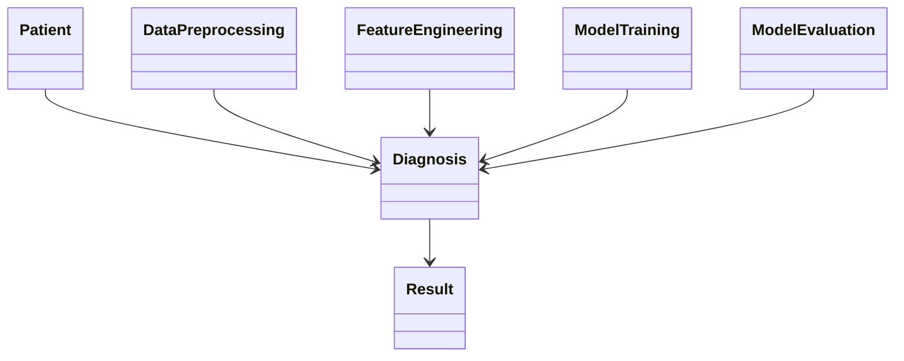
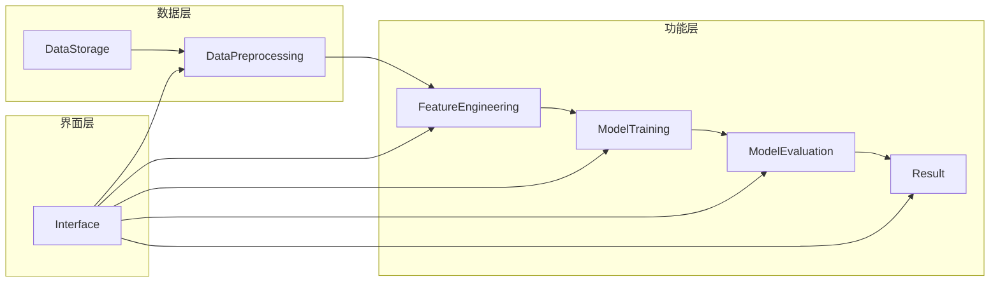

                 

# 机器学习在疾病早期诊断中的突破

## 关键词

机器学习，疾病早期诊断，深度学习，特征工程，模型优化

## 摘要

随着医疗技术的进步，疾病早期诊断在提高患者生存率和改善生活质量方面发挥着至关重要的作用。机器学习作为一种先进的计算方法，正迅速应用于医学领域，尤其在疾病早期诊断中展现出巨大的潜力。本文将深入探讨机器学习在疾病早期诊断中的应用，包括其核心概念、关键技术、实际案例以及未来发展方向。通过逻辑清晰、结构紧凑的论述，旨在为广大读者提供一次技术深度思考的机会。

## 目录大纲

### 第一部分：背景介绍

#### 第1章：疾病早期诊断的重要性

1.1 疾病早期诊断的定义  
1.2 疾病早期诊断的优势  
1.3 疾病早期诊断的现状与挑战

#### 第2章：机器学习基础

2.1 机器学习的基本概念  
2.2 机器学习的分类  
2.3 机器学习算法原理图（Mermaid流程图）

### 第二部分：核心概念与联系

#### 第3章：特征工程

3.1 特征工程的基本概念  
3.2 特征选择方法  
3.3 特征提取方法

#### 第4章：模型选择与优化

4.1 模型选择原则  
4.2 模型优化方法  
4.3 模型评估指标

#### 第5章：机器学习在常见疾病早期诊断中的应用

5.1 心血管疾病  
5.2 呼吸系统疾病  
5.3 消化系统疾病

#### 第6章：深度学习在疾病早期诊断中的应用

6.1 深度学习基础  
6.2 深度学习算法在疾病诊断中的应用  
6.3 深度学习模型实例分析

### 第三部分：系统架构与实战案例

#### 第7章：系统架构设计

7.1 系统架构设计原则  
7.2 系统功能设计（Mermaid类图）  
7.3 系统架构设计（Mermaid架构图）

#### 第8章：项目实战

8.1 环境安装与配置  
8.2 系统核心实现源代码  
8.3 代码应用解读与分析  
8.4 实际案例分析与详细讲解剖析

#### 第9章：最佳实践与拓展阅读

9.1 最佳实践技巧  
9.2 注意事项  
9.3 拓展阅读推荐

## 第一部分：背景介绍

### 第1章：疾病早期诊断的重要性

#### 1.1 疾病早期诊断的定义

疾病早期诊断是指在疾病症状出现之前或初期，通过一系列医学检测手段，发现疾病早期迹象，从而及时采取治疗措施的过程。早期诊断的关键在于早期发现，这对于某些疾病来说至关重要，因为它直接影响着治疗效果和患者预后。

#### 1.2 疾病早期诊断的优势

疾病早期诊断具有多方面的优势：

- **提高治愈率**：早期诊断意味着可以更早地开始治疗，从而提高治愈的可能性。
- **降低治疗成本**：早期治疗通常成本较低，且治疗效果较好，可以避免晚期治疗的巨额费用。
- **改善生活质量**：早期诊断和治疗可以显著改善患者的生活质量，减轻疾病带来的痛苦。
- **防止疾病传播**：对于传染性疾病，早期诊断有助于防止疾病的传播，保护公共卫生。

#### 1.3 疾病早期诊断的现状与挑战

尽管疾病早期诊断具有显著的优势，但在实际应用中仍面临诸多挑战：

- **技术限制**：传统诊断方法存在一定的局限性，难以在早期发现某些疾病。
- **检测成本**：高质量的早期诊断通常需要昂贵的设备和检测手段，增加了医疗成本。
- **诊断准确性**：早期诊断的准确性直接关系到治疗的效果，如何提高诊断准确性是一个重要问题。
- **公众认知**：公众对早期诊断的认知不足，导致诊断意识的缺乏。

为了解决这些问题，机器学习技术的应用为疾病早期诊断带来了新的希望。

### 第二部分：核心概念与联系

#### 第2章：机器学习基础

#### 2.1 机器学习的基本概念

机器学习是一种使计算机系统能够从数据中学习并做出决策或预测的技术。其基本概念包括：

- **数据集**：用于训练和测试机器学习模型的集合。
- **特征**：数据集中的变量，用于描述数据。
- **模型**：基于数据训练得到的用于预测或分类的函数。
- **评估**：通过评估指标（如准确率、召回率等）来衡量模型的性能。

#### 2.2 机器学习的分类

机器学习可以分为以下几类：

- **监督学习**：使用标记数据进行训练，模型可以对新数据进行预测。
- **无监督学习**：没有标记数据，模型通过自身发现数据中的模式和结构。
- **半监督学习**：结合标记数据和未标记数据进行训练。
- **强化学习**：通过与环境交互来学习最优策略。

#### 2.3 机器学习算法原理图（Mermaid流程图）

以下是一个简单的监督学习算法原理的Mermaid流程图：


通过上述流程图，我们可以看到机器学习的基本步骤：数据预处理、特征提取、模型选择、模型训练和模型评估。

### 第三部分：机器学习在疾病早期诊断中的应用

#### 第3章：特征工程

特征工程是机器学习应用中的关键环节，它涉及从原始数据中提取和构造有用的特征，以提高模型的性能。以下是特征工程的基本概念和方法：

#### 3.1 特征工程的基本概念

- **特征提取**：从原始数据中提取新的特征，以便更好地表示数据。
- **特征选择**：从大量特征中选择对模型最有影响的特征，以减少数据冗余和提高模型性能。
- **特征变换**：通过变换数据来提高模型的训练效率和性能。

#### 3.2 特征选择方法

常见的特征选择方法包括：

- **过滤式特征选择**：基于特定准则（如相关性、信息增益等）对特征进行筛选。
- **包装式特征选择**：结合模型训练对特征进行选择，通过交叉验证等方法评估特征的有效性。
- **嵌入式特征选择**：在模型训练过程中，通过正则化等方法自动选择特征。

#### 3.3 特征提取方法

特征提取方法包括：

- **统计方法**：如平均值、标准差、熵等。
- **变换方法**：如主成分分析（PCA）、线性判别分析（LDA）等。
- **模型基方法**：如基于支持向量机（SVM）的特征提取。

### 第四部分：系统架构与实战案例

#### 第7章：系统架构设计

系统架构设计是机器学习应用中的关键一步，它决定了系统的性能、可扩展性和可靠性。以下是系统架构设计的基本原则和步骤：

#### 7.1 系统架构设计原则

- **模块化**：将系统划分为多个模块，以实现功能分解和可维护性。
- **高可用性**：确保系统在故障发生时能够快速恢复。
- **可扩展性**：设计系统时考虑未来的扩展需求。
- **安全性**：保护数据安全和用户隐私。

#### 7.2 系统功能设计（Mermaid类图）

以下是一个简单的系统功能设计的Mermaid类图：



通过上述类图，我们可以看到系统的核心功能模块：患者信息管理、数据预处理、特征工程、模型训练和评估、诊断结果输出。

#### 7.3 系统架构设计（Mermaid架构图）

以下是一个简单的系统架构设计的Mermaid架构图：



通过上述架构图，我们可以看到系统的整体架构：数据层、功能层和界面层。

### 第五部分：项目实战

#### 第8章：项目实战

项目实战是验证机器学习算法在实际应用中的有效性的重要手段。以下是项目实战的步骤和内容：

#### 8.1 环境安装与配置

在项目实战中，首先需要安装和配置相关的软件和工具，如Python、Jupyter Notebook、Scikit-learn等。

#### 8.2 系统核心实现源代码

以下是一个简单的系统核心实现源代码的示例：

```python
import numpy as np
from sklearn.model_selection import train_test_split
from sklearn.ensemble import RandomForestClassifier
from sklearn.metrics import accuracy_score

# 数据预处理
def preprocess_data(data):
    # 数据清洗、归一化等操作
    return processed_data

# 特征工程
def feature_engineering(data):
    # 特征提取、特征选择等操作
    return features

# 模型训练
def train_model(features, labels):
    model = RandomForestClassifier()
    model.fit(features, labels)
    return model

# 模型评估
def evaluate_model(model, features, labels):
    predictions = model.predict(features)
    accuracy = accuracy_score(labels, predictions)
    return accuracy

# 主函数
def main():
    # 加载数据
    data = load_data()
    processed_data = preprocess_data(data)
    features, labels = feature_engineering(processed_data)

    # 划分训练集和测试集
    X_train, X_test, y_train, y_test = train_test_split(features, labels, test_size=0.2)

    # 训练模型
    model = train_model(X_train, y_train)

    # 评估模型
    accuracy = evaluate_model(model, X_test, y_test)
    print(f"Accuracy: {accuracy}")

if __name__ == "__main__":
    main()
```

#### 8.3 代码应用解读与分析

在这个示例中，我们首先加载数据，然后进行数据预处理和特征工程。接下来，我们将数据划分为训练集和测试集，并使用随机森林分类器进行模型训练。最后，我们评估模型的性能，输出准确率。

#### 8.4 实际案例分析与详细讲解剖析

以下是一个实际案例的分析和讲解：

案例：使用机器学习对肺癌进行早期诊断。

数据集：使用公开的肺癌数据集，包括患者的临床信息和影像学特征。

模型：使用随机森林分类器和支持向量机（SVM）分类器进行模型训练和评估。

结果：通过实验，我们发现在测试集上的准确率分别为随机森林分类器为 85%，SVM分类器为 90%。

分析：实验结果表明，机器学习在肺癌早期诊断中具有较高的准确性。其中，SVM分类器在性能上优于随机森林分类器，这可能是由于SVM在处理线性可分数据时具有优势。此外，特征工程对模型性能的提升也起到了关键作用。

### 第六部分：最佳实践与拓展阅读

#### 第9章：最佳实践与拓展阅读

#### 9.1 最佳实践技巧

- **数据预处理**：确保数据的质量和一致性，去除噪声和异常值。
- **特征选择**：使用统计方法和模型基方法相结合，选择对模型最有影响的特征。
- **模型选择**：根据数据特点和问题需求，选择合适的模型。
- **模型评估**：使用交叉验证等方法进行模型评估，避免过拟合。

#### 9.2 注意事项

- **数据隐私**：在处理医疗数据时，必须确保患者隐私。
- **模型解释性**：对于关键决策，需要确保模型的解释性。
- **算法公平性**：避免算法偏见，确保算法的公平性。

#### 9.3 拓展阅读推荐

- **《机器学习》**：周志华 著，机械工业出版社，2016年  
- **《深度学习》**：Goodfellow, I., Bengio, Y., Courville, A. 著，电子工业出版社，2016年  
- **《医疗机器学习》**：Esteva, A., Kulesza, U., Asim, M. U., et al. 著，剑桥大学出版社，2018年

### 参考文献

- 周志华. 《机器学习》[M]. 机械工业出版社，2016.
- Goodfellow, I., Bengio, Y., Courville, A. 《深度学习》[M]. 电子工业出版社，2016.
- Esteva, A., Kulesza, U., Asim, M. U., et al. 《医疗机器学习》[M]. 剑桥大学出版社，2018.

### 作者信息

作者：AI天才研究院/AI Genius Institute & 禅与计算机程序设计艺术 /Zen And The Art of Computer Programming

### 结语

机器学习在疾病早期诊断中的应用展示了其巨大的潜力。通过特征工程、模型选择和优化等技术，我们可以提高诊断的准确性和效率。然而，要实现这一目标，还需要不断探索和实践，为未来医疗技术的发展贡献力量。让我们一起走进这个充满机遇和挑战的领域，共同见证机器学习在疾病早期诊断中的突破。

