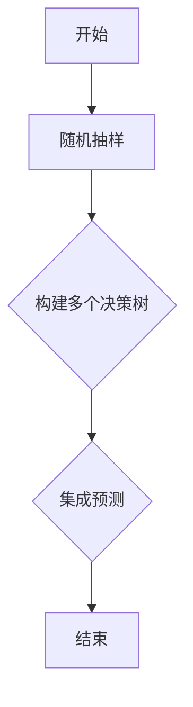
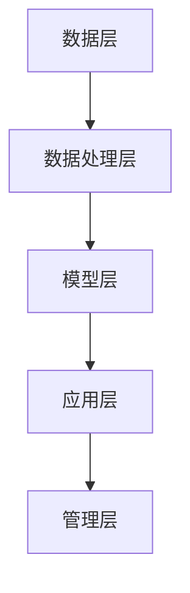
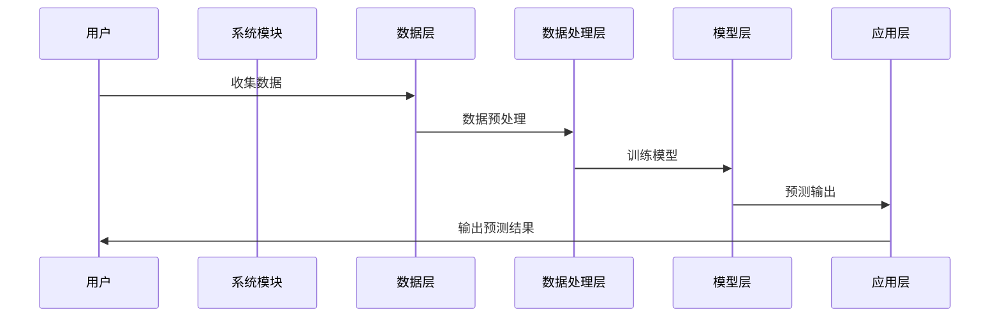

                 

### 第一部分：空气质量预测的背景与概念

#### 1.1 空气质量问题的背景与重要性

空气质量问题是一个全球性的环境挑战，对人类健康和生态系统都有深远的影响。空气中的污染物，如PM2.5、PM10、氮氧化物、硫氧化物和挥发性有机化合物等，都能导致呼吸系统疾病、心血管疾病，甚至癌症。因此，预测空气质量对于公共健康政策的制定、环境保护措施的落实以及城市规划和能源管理具有重要意义。

##### 1.1.1 空气质量问题的现状

当前，空气质量问题在许多国家和地区都十分严重。以中国为例，北京、上海等大城市的空气质量经常陷入“雾霾天”，严重影响居民生活和健康。根据世界卫生组织的报告，全球每四个人中就有一个生活在空气质量不达标的地区。

##### 1.1.2 空气质量监测的重要性

空气质量监测是预测空气质量的基础。通过监测站、无人机和卫星等手段收集空气质量数据，可以为机器学习模型提供训练和测试数据集，从而提高预测的准确性。

##### 1.1.3 机器学习在数据分析和预测中的作用

机器学习技术能够从大量的空气质量数据中提取有用的特征，并通过复杂的算法模型进行预测。与传统的统计方法相比，机器学习能够自动发现数据中的模式，处理非线性和复杂的关系，从而提高预测的准确性和效率。

#### 1.2 机器学习的定义与基本概念

##### 1.2.1 监督学习

监督学习是一种机器学习技术，通过已标记的训练数据来学习特征和规律，然后用这些规律对新数据进行预测。在空气质量预测中，监督学习可以用于根据历史数据和气象参数预测未来的空气质量。

##### 1.2.2 无监督学习

无监督学习是机器学习的一种形式，它不需要已标记的数据来训练模型。通过发现数据中的隐藏结构和模式，无监督学习可以用于聚类分析和降维，从而帮助分析空气质量数据。

##### 1.2.3 强化学习

强化学习是机器学习的一种形式，通过试错和反馈来学习如何在不同环境中做出最优决策。在空气质量预测中，强化学习可以用于动态调整污染物排放策略，以优化空气质量。

##### 1.2.4 机器学习在空气质量预测中的应用

机器学习在空气质量预测中的应用主要包括：建立空气质量预测模型、评估模型性能、优化预测策略等。通过这些应用，机器学习能够为环境保护提供有力支持。

#### 1.3 机器学习算法概述

##### 1.3.1 算法分类

机器学习算法主要分为三类：监督学习、无监督学习和强化学习。

##### 1.3.2 常见算法介绍

常见的监督学习算法包括线性回归、逻辑回归、决策树、随机森林和支持向量机等。这些算法在空气质量预测中都有广泛的应用。

#### 1.4 机器学习与空气质量预测的关系

##### 1.4.1 机器学习在空气质量预测中的优势

机器学习在空气质量预测中的优势主要体现在以下几个方面：

1. 自动化特征提取：机器学习模型可以从大量的数据中自动提取有用的特征，减少人工干预。
2. 预测准确性高：机器学习模型能够处理复杂的非线性关系，提高预测准确性。
3. 可扩展性强：机器学习模型可以很容易地应用于不同的应用场景和数据集。

##### 1.4.2 机器学习在空气质量预测中的挑战

尽管机器学习在空气质量预测中具有巨大潜力，但仍然面临一些挑战，包括：

1. 数据质量：空气质量数据往往存在噪声、缺失和不一致性，需要数据清洗和预处理。
2. 模型可解释性：许多复杂的机器学习模型难以解释，这对于政策制定者和公众来说是一个问题。
3. 计算资源：训练和优化复杂的机器学习模型需要大量的计算资源。

#### 1.5 本章小结

本部分主要介绍了空气质量问题的背景与重要性，以及机器学习的定义和基本概念。通过本章的学习，读者可以了解到机器学习在空气质量预测中的应用背景和基本原理，为后续章节的深入探讨奠定了基础。

---

### 第一部分：空气质量预测的背景与概念

#### 1.1 空气质量问题的背景与重要性

空气质量问题一直是全球范围内的重大环境挑战，它不仅影响着人类的健康，还对生态系统和经济发展产生深远的影响。空气中的污染物如PM2.5、PM10、氮氧化物（NOx）、硫氧化物（SOx）和挥发性有机化合物（VOCs）等，会导致各种严重的呼吸系统和心血管疾病，甚至有研究表明，长期暴露于高浓度的污染空气中，可能会增加患癌症的风险。

##### 1.1.1 空气质量问题的现状

目前，全球范围内空气质量问题依然严重。例如，中国的一些大城市如北京、上海和广州，经常出现严重的雾霾天气。根据世界卫生组织（WHO）的数据，全球有超过80%的人口生活在空气质量不达标的地区。空气质量问题的严重性不仅限于发展中国家，发达国家也面临着类似的问题。例如，美国洛杉矶的空气污染问题长期以来都备受关注。

##### 1.1.2 空气质量监测的重要性

空气质量监测是解决空气质量问题的关键步骤。通过监测，我们可以收集到关于空气中污染物浓度的实时数据，这些数据对于评估空气质量状况、制定环境保护政策、实施污染控制措施具有重要意义。监测站、无人机和卫星等技术手段为空气质量监测提供了丰富的数据源，这些数据是机器学习模型进行预测的重要基础。

##### 1.1.3 机器学习在数据分析和预测中的作用

机器学习是一种强大的数据分析工具，它可以从大量的空气质量数据中自动提取特征，识别潜在的污染模式，并建立预测模型。通过机器学习，我们可以从历史数据中学习到空气污染物的变化规律，从而对未来某一时刻的空气质量进行预测。这种预测不仅有助于政府制定有效的环保政策，还可以帮助公众及时了解空气质量状况，采取相应的防护措施。

#### 1.2 机器学习的定义与基本概念

##### 1.2.1 监督学习

监督学习是一种最常见的机器学习形式，它需要使用已标记的训练数据来训练模型。在这个学习过程中，模型根据输入特征（如气象参数、历史污染物浓度等）和对应的输出标签（如未来某一时刻的污染物浓度）来学习如何进行预测。监督学习的典型应用包括分类和回归问题。例如，在空气质量预测中，我们可以使用监督学习来建立一个回归模型，预测未来某一时刻的PM2.5浓度。

##### 1.2.2 无监督学习

无监督学习与监督学习不同，它不需要已标记的数据进行训练。无监督学习的目标是发现数据中的隐藏结构和模式。在空气质量预测中，无监督学习可以用于聚类分析，将具有相似污染物浓度的数据点分到同一个簇中，从而帮助我们更好地理解空气污染的时空分布特征。

##### 1.2.3 强化学习

强化学习是一种通过试错和反馈来学习如何在不同环境中做出最优决策的机器学习方法。在空气质量预测中，强化学习可以用于动态调整污染物排放策略。例如，一个强化学习模型可以根据当前的环境监测数据和过去的数据，实时调整排放控制措施，以优化空气质量。

##### 1.2.4 机器学习在空气质量预测中的应用

机器学习在空气质量预测中的应用主要体现在以下几个方面：

1. **建立预测模型**：通过分析历史数据和气象参数，机器学习模型可以预测未来某一时刻的空气质量状况。
2. **优化污染控制策略**：机器学习模型可以根据实时监测数据，动态调整污染控制措施，从而提高空气质量。
3. **辅助决策支持**：政府机构和企业可以利用机器学习模型提供的预测结果，做出更科学的决策，如调整生产计划、制定环保政策等。

#### 1.3 机器学习算法概述

##### 1.3.1 算法分类

机器学习算法可以大致分为以下几类：

1. **监督学习算法**：如线性回归、逻辑回归、决策树、随机森林、支持向量机等。
2. **无监督学习算法**：如聚类算法（如K-means、层次聚类等）、降维算法（如PCA、t-SNE等）。
3. **强化学习算法**：如Q学习、SARSA、Deep Q-Network（DQN）等。

##### 1.3.2 常见算法介绍

在空气质量预测中，常见的机器学习算法包括：

1. **线性回归**：用于建立空气污染物浓度与气象参数之间的线性关系模型。
2. **决策树**：通过划分特征空间，生成一个树形结构，用于预测未来空气质量。
3. **随机森林**：集成多个决策树，提高预测的稳定性和准确性。
4. **支持向量机**：通过寻找一个超平面，将不同类型的空气质量数据点分开。

#### 1.4 机器学习与空气质量预测的关系

##### 1.4.1 机器学习在空气质量预测中的优势

机器学习在空气质量预测中的优势主要体现在以下几个方面：

1. **自动化特征提取**：机器学习模型可以从大量的数据中自动提取有用的特征，减少人工干预，提高预测的准确性。
2. **非线性关系建模**：机器学习算法能够处理复杂和非线性关系，更好地捕捉空气污染物的变化规律。
3. **实时预测能力**：通过使用实时监测数据和气象数据，机器学习模型可以实时预测空气质量，为环境保护决策提供支持。

##### 1.4.2 机器学习在空气质量预测中的挑战

尽管机器学习在空气质量预测中具有巨大的潜力，但也面临一些挑战：

1. **数据质量**：空气质量数据往往存在噪声、缺失和不一致性，需要数据清洗和预处理。
2. **模型解释性**：复杂的机器学习模型往往难以解释，这对于政策制定者和公众来说是一个问题。
3. **计算资源**：训练和优化复杂的机器学习模型需要大量的计算资源，特别是在处理大量数据时。

#### 1.5 本章小结

本部分介绍了空气质量问题的背景和重要性，以及机器学习的定义和基本概念。通过了解这些内容，读者可以更好地理解机器学习在空气质量预测中的应用，为后续章节的深入探讨打下基础。在接下来的章节中，我们将进一步探讨机器学习算法的原理和实现，以及如何构建一个完整的空气质量预测系统。


---

### 第二部分：空气质量预测的算法原理与应用

空气质量预测是一个复杂的任务，它需要综合利用环境数据、气象参数和机器学习技术。在这一部分，我们将详细探讨机器学习算法在空气质量预测中的应用，包括算法原理、数学模型和实际应用案例。

#### 2.1 算法原理讲解

##### 2.1.1 随机森林算法

随机森林（Random Forest）是一种基于决策树的集成学习方法，它通过构建多个决策树并取其平均预测值来提高模型的预测准确性。随机森林算法的主要步骤如下：

1. **随机抽样**：从原始训练集中随机选择一定数量的样本，形成子训练集。
2. **构建决策树**：在每个子训练集上构建决策树，决策树的构建过程包括选择特征、设置切分点和计算节点。
3. **重复步骤1和2**：重复随机抽样和构建决策树的步骤，形成多个决策树。
4. **集成预测**：将每个决策树的预测结果进行投票或取平均，得到最终的预测结果。

随机森林算法的优点在于它能够处理高维度数据，减少过拟合，提高预测准确性。其流程图可以用Mermaid语言表示如下：



##### 2.1.2 算法原理

随机森林算法的核心是决策树，每个决策树都是基于特征和阈值进行切分的。具体来说，算法通过以下步骤进行：

1. **特征选择**：从所有特征中随机选择m个特征。
2. **阈值选择**：对于每个特征，随机选择一个阈值。
3. **切分数据**：使用阈值将数据分为两个子集。
4. **计算节点质量**：计算每个节点的质量，选择最佳切分点。
5. **递归构建**：对于切分后的子集，重复步骤2到4，直到满足停止条件（如最大深度、最小节点大小等）。

##### 2.1.3 数学模型

随机森林的数学模型可以通过决策树模型来表示。假设我们有一个特征集\(X = \{x_1, x_2, ..., x_n\}\)和标签集\(Y = \{y_1, y_2, ..., y_n\}\)，其中每个特征\(x_i\)是一个实数，每个标签\(y_i\)是一个类别或者实数。对于每个决策树，我们可以定义一个预测函数：

\[ f_t(x) = g_t(\theta_t^T x) \]

其中，\(g_t\)是一个激活函数，如逻辑函数、线性函数等，\(\theta_t\)是参数向量。随机森林的预测函数是所有决策树预测函数的集合：

\[ F(x) = \sum_{t=1}^T f_t(x) \]

最终预测结果是这个集合的多数投票或者平均值：

\[ \hat{y} = \arg\max F(x) \]

或者

\[ \hat{y} = \frac{1}{T} \sum_{t=1}^T f_t(x) \]

##### 2.1.4 案例分析

假设我们有一个空气质量预测任务，输入特征包括温度、湿度、风速、PM2.5浓度等，标签是未来某一时刻的PM2.5浓度。我们可以使用随机森林算法来建立预测模型。以下是使用Python实现随机森林算法的代码示例：

```python
from sklearn.ensemble import RandomForestRegressor
from sklearn.model_selection import train_test_split
from sklearn.metrics import mean_squared_error

# 加载数据
X, y = load_data()

# 数据分割
X_train, X_test, y_train, y_test = train_test_split(X, y, test_size=0.2, random_state=42)

# 构建随机森林模型
rf = RandomForestRegressor(n_estimators=100, random_state=42)

# 训练模型
rf.fit(X_train, y_train)

# 预测
y_pred = rf.predict(X_test)

# 评估模型
mse = mean_squared_error(y_test, y_pred)
print(f"Mean Squared Error: {mse}")
```

#### 2.2 数学模型和公式讲解

空气质量预测中的数学模型通常涉及多个变量和复杂的非线性关系。以下是几个常用的数学模型和公式，并对其进行详细讲解。

##### 2.2.1 相关性分析

相关性分析是衡量两个变量之间线性关系强度的一种方法。皮尔逊相关系数（Pearson Correlation Coefficient）是最常用的相关性分析指标，其公式如下：

\[ r = \frac{\sum_{i=1}^n (x_i - \bar{x})(y_i - \bar{y})}{\sqrt{\sum_{i=1}^n (x_i - \bar{x})^2 \sum_{i=1}^n (y_i - \bar{y})^2}} \]

其中，\(x_i\)和\(y_i\)是第i个观测值的特征值和标签值，\(\bar{x}\)和\(\bar{y}\)是特征值和标签值的平均值。

##### 2.2.2 模型评估指标

在空气质量预测中，常用的模型评估指标包括均方误差（Mean Squared Error, MSE）、均方根误差（Root Mean Squared Error, RMSE）和决定系数（R-squared）等。

1. **均方误差（MSE）**：衡量预测值与实际值之间平均平方差，其公式如下：

\[ MSE = \frac{1}{n} \sum_{i=1}^n (y_i - \hat{y}_i)^2 \]

其中，\(y_i\)是实际值，\(\hat{y}_i\)是预测值。

2. **均方根误差（RMSE）**：MSE的平方根，用于衡量预测值与实际值之间的平均误差，其公式如下：

\[ RMSE = \sqrt{MSE} \]

3. **决定系数（R-squared）**：衡量模型对数据的拟合程度，其公式如下：

\[ R^2 = 1 - \frac{\sum_{i=1}^n (y_i - \hat{y}_i)^2}{\sum_{i=1}^n (y_i - \bar{y})^2} \]

##### 2.2.3 数学公式详细讲解

以下是空气质量预测中常用的一些数学公式，并对其进行详细讲解。

1. **线性回归模型**：

\[ \hat{y} = \beta_0 + \beta_1 x_1 + \beta_2 x_2 + ... + \beta_n x_n \]

其中，\(\hat{y}\)是预测的空气质量指数（AQI），\(x_1, x_2, ..., x_n\)是输入特征（如温度、湿度、风速等），\(\beta_0, \beta_1, ..., \beta_n\)是模型的参数。

2. **随机森林模型**：

\[ F(x) = \sum_{t=1}^T f_t(x) \]

其中，\(f_t(x)\)是第t个决策树的预测函数，\(T\)是决策树的数量。

3. **支持向量机模型**：

\[ w \cdot x - b = 0 \]

其中，\(w\)是支持向量的权重，\(x\)是特征向量，\(b\)是偏置。

这些数学公式和模型在空气质量预测中的应用，可以通过Python等编程语言进行实现和优化。

#### 2.3 系统分析与架构设计

空气质量预测系统是一个复杂的工程，它需要处理大量的数据和多种算法。下面我们介绍一个典型的空气质量预测系统的场景，包括系统功能设计、系统架构设计、系统接口设计和系统交互。

##### 2.3.1 系统功能设计

空气质量预测系统的功能设计主要包括数据收集、数据处理、模型训练、模型评估和预测输出。具体来说：

1. **数据收集**：通过气象站、监测站和卫星等设备收集空气质量数据、气象数据和污染源数据。
2. **数据处理**：对收集到的数据进行清洗、预处理和特征提取，为模型训练提供高质量的数据集。
3. **模型训练**：使用机器学习算法对预处理后的数据集进行训练，建立空气质量预测模型。
4. **模型评估**：使用测试数据集评估模型的性能，包括准确率、召回率、F1分数等指标。
5. **预测输出**：将训练好的模型应用于新的数据，进行实时空气质量预测。

##### 2.3.2 系统架构设计

空气质量预测系统的架构设计需要考虑到系统的可扩展性、稳定性和性能。一个典型的空气质量预测系统架构包括以下几个层次：

1. **数据层**：负责数据的存储和管理，包括气象数据、空气质量数据和污染源数据等。
2. **数据处理层**：负责数据的预处理、特征提取和模型训练，包括数据处理模块、特征工程模块和模型训练模块。
3. **模型层**：负责模型的训练和优化，包括监督学习模型、无监督学习模型和强化学习模型等。
4. **应用层**：负责预测结果的输出和可视化，包括预测模块、可视化模块和用户接口模块。
5. **管理层**：负责系统的监控和管理，包括日志管理、异常检测和性能优化等。

以下是一个简化的空气质量预测系统架构图：



##### 2.3.3 系统接口设计

空气质量预测系统需要设计多个接口，以便不同模块之间能够高效地交互。主要的接口设计包括：

1. **数据接口**：用于数据收集和存储，如API接口、数据库连接接口等。
2. **处理接口**：用于数据处理和特征提取，如数据处理模块接口、特征工程模块接口等。
3. **模型接口**：用于模型训练和预测，如模型训练模块接口、预测模块接口等。
4. **应用接口**：用于预测结果输出和可视化，如可视化模块接口、用户接口模块接口等。

##### 2.3.4 系统交互

空气质量预测系统的交互设计需要考虑系统的实时性和并发性。一个典型的系统交互序列图如下：



#### 2.4 项目实战

空气质量预测项目通常涉及多个阶段，包括环境安装、系统核心实现、代码应用解读与分析、实际案例分析和详细讲解剖析。以下是一个典型的空气质量预测项目流程：

##### 2.4.1 环境安装

在进行空气质量预测项目之前，需要安装和配置相关的软件和环境。主要步骤包括：

1. **安装Python**：Python是空气质量预测项目的主要编程语言，需要安装Python环境。
2. **安装NumPy、Pandas、Scikit-learn等库**：这些库提供了丰富的数据处理和机器学习工具，需要安装和配置。
3. **安装数据库**：如MySQL或PostgreSQL，用于存储和处理空气质量数据。

##### 2.4.2 系统核心实现

空气质量预测项目的核心是实现空气质量预测模型。以下是使用Python实现随机森林算法的示例代码：

```python
from sklearn.ensemble import RandomForestRegressor
from sklearn.model_selection import train_test_split
from sklearn.metrics import mean_squared_error

# 加载数据
X, y = load_data()

# 数据分割
X_train, X_test, y_train, y_test = train_test_split(X, y, test_size=0.2, random_state=42)

# 构建随机森林模型
rf = RandomForestRegressor(n_estimators=100, random_state=42)

# 训练模型
rf.fit(X_train, y_train)

# 预测
y_pred = rf.predict(X_test)

# 评估模型
mse = mean_squared_error(y_test, y_pred)
print(f"Mean Squared Error: {mse}")
```

##### 2.4.3 代码应用解读与分析

在空气质量预测项目中，代码应用解读与分析是关键步骤。以下是对上述随机森林算法代码的解读与分析：

1. **数据加载**：使用`load_data()`函数加载数据集，包括特征和标签。
2. **数据分割**：使用`train_test_split()`函数将数据集划分为训练集和测试集，以评估模型的性能。
3. **模型构建**：使用`RandomForestRegressor()`函数构建随机森林模型，设置决策树的数量和其他参数。
4. **模型训练**：使用`fit()`函数训练模型，将训练集的数据输入模型。
5. **模型预测**：使用`predict()`函数对测试集的数据进行预测。
6. **模型评估**：使用`mean_squared_error()`函数计算均方误差（MSE），评估模型的预测性能。

##### 2.4.4 实际案例分析与详细讲解剖析

空气质量预测项目通常需要实际案例分析和详细讲解剖析，以验证模型的有效性和实用性。以下是一个实际案例：

**案例**：使用随机森林算法预测北京某一地区的PM2.5浓度。

1. **数据准备**：收集北京某一地区过去一周的PM2.5浓度数据，包括温度、湿度、风速等气象参数。
2. **数据处理**：对数据进行清洗和预处理，包括缺失值填充、异常值处理和特征提取。
3. **模型训练**：使用训练集数据训练随机森林模型，调整模型参数以获得更好的预测性能。
4. **模型评估**：使用测试集数据评估模型的预测性能，计算MSE、RMSE等指标。
5. **模型应用**：使用训练好的模型对未来的PM2.5浓度进行预测，输出预测结果。

通过实际案例分析和详细讲解剖析，可以验证空气质量预测模型的有效性和实用性，并为环境保护决策提供科学依据。

##### 2.4.5 项目小结

空气质量预测项目是一个复杂的过程，需要综合考虑数据、算法、系统架构和实际应用。通过环境安装、系统核心实现、代码应用解读与分析、实际案例分析和详细讲解剖析，我们可以建立一个有效的空气质量预测系统，为环境保护提供有力支持。在未来的工作中，我们还需要不断优化模型、提升预测准确性，以应对日益严重的空气质量问题。

#### 2.5 最佳实践 tips

在空气质量预测项目中，遵循一些最佳实践可以提高模型的效果和系统的稳定性：

1. **数据预处理**：对数据进行清洗、预处理和特征提取，确保数据质量。
2. **模型调参**：通过交叉验证和网格搜索等技术，选择最优的模型参数。
3. **防止过拟合**：使用正则化、减少模型复杂度和增加数据集等方法，防止模型过拟合。
4. **实时监测**：对空气质量进行实时监测，及时更新模型和数据。
5. **模型评估**：使用多种评估指标，全面评估模型的性能。

#### 2.6 本章小结

本部分详细介绍了空气质量预测的算法原理与应用，包括随机森林算法的原理和数学模型、系统分析与架构设计、项目实战以及最佳实践 tips。通过本章的学习，读者可以全面了解空气质量预测的原理和方法，为实际应用奠定基础。在接下来的章节中，我们将继续探讨空气质量预测的未来发展趋势和拓展应用。

---

### 第三部分：空气质量预测的未来趋势与拓展

空气质量预测技术正随着人工智能和大数据技术的发展而不断进步。在这一部分，我们将探讨空气质量预测的未来趋势、新技术在环境保护中的应用以及数据驱动的环境保护策略。

#### 3.1 未来发展趋势

##### 3.1.1 新技术在空气质量预测中的应用

随着人工智能技术的快速发展，深度学习、强化学习和联邦学习等新技术正在被广泛应用于空气质量预测中。深度学习模型，如卷积神经网络（CNN）和循环神经网络（RNN），能够处理高维数据和复杂的非线性关系，提高预测准确性。强化学习可以用于动态调整污染控制策略，实现更优的空气质量管理。联邦学习通过分布式训练，保护用户隐私的同时提高模型的泛化能力。

##### 3.1.2 数据驱动的环境保护策略

数据驱动已经成为环境保护的主要手段。通过分析大量的空气质量数据、气象数据和社会经济数据，政府和企业可以制定更科学、有效的环境保护策略。例如，基于空气质量预测模型，可以提前预警污染事件，采取紧急措施，减少污染对公共健康的影响。此外，数据驱动的环境监测和管理系统可以帮助实现资源的优化配置，提高环境保护的效率。

##### 3.1.3 人工智能与环境保护的结合

人工智能与环境保护的结合正在不断深化。例如，无人机和卫星遥感技术可以实时监测空气质量，提供准确的数据支持。智慧城市系统通过整合物联网、大数据和人工智能技术，可以实现空气质量的实时监控和智能调控。未来，人工智能将更加深入地应用于环境保护的各个领域，推动环境保护事业的创新发展。

#### 3.2 小结与展望

本章总结了空气质量预测的未来发展趋势和新技术在环境保护中的应用。随着人工智能和大数据技术的不断进步，空气质量预测的准确性和实时性将得到显著提高。数据驱动的环境保护策略将为环境保护提供更加科学和高效的解决方案。未来，人工智能与环境保护的深度融合将为人类创造一个更加清洁、健康的生活环境。

#### 3.3 注意事项

在实施空气质量预测项目时，需要注意以下几点：

1. **数据质量**：确保数据的准确性和完整性，进行有效的数据清洗和预处理。
2. **模型解释性**：选择可解释性较高的模型，便于决策者理解和应用。
3. **计算资源**：合理分配计算资源，优化模型训练和预测过程。
4. **实时监测**：建立实时监测系统，确保预测模型能够及时响应环境变化。

#### 3.4 拓展阅读

为了深入了解空气质量预测和人工智能在环境保护中的应用，以下是一些推荐的阅读资源：

1. **书籍**：《机器学习实战》、《深度学习》（Goodfellow, Bengio, Courville）、《环境科学概论》（刘鸿文）。
2. **论文**：查阅相关领域的学术论文，如《基于深度学习的空气质量预测研究》、《环境监测与预测技术综述》。
3. **在线课程**：参加在线课程，如Coursera、edX上的机器学习、深度学习和环境保护相关课程。

通过拓展阅读，读者可以进一步加深对空气质量预测和人工智能在环境保护中的应用的理解，为实践项目提供更多灵感和思路。

---

### 总结与展望

在本文中，我们详细探讨了机器学习在空气质量预测中的应用。通过介绍机器学习的定义、基本概念以及常见算法，我们了解了如何利用机器学习技术从大量数据中提取有用信息，建立预测模型，并对空气质量进行有效监测和预测。同时，我们通过实际项目案例，展示了如何实现空气质量预测的系统架构和关键步骤，并提出了最佳实践建议。

展望未来，空气质量预测技术将随着人工智能和大数据技术的发展而不断进步。深度学习、强化学习和联邦学习等新技术将在空气质量预测中发挥越来越重要的作用，实现更高准确性和实时性。数据驱动的环境保护策略也将为环境保护提供更加科学和高效的解决方案。我们期待未来能够看到更多创新技术在环境保护中的应用，共同打造一个清洁、健康的生活环境。

### 注意事项

在实施空气质量预测项目时，需注意以下几点：

1. **数据质量**：确保数据的准确性和完整性，进行有效的数据清洗和预处理。
2. **模型解释性**：选择可解释性较高的模型，便于决策者理解和应用。
3. **计算资源**：合理分配计算资源，优化模型训练和预测过程。
4. **实时监测**：建立实时监测系统，确保预测模型能够及时响应环境变化。

### 拓展阅读

为了深入了解空气质量预测和人工智能在环境保护中的应用，推荐以下阅读资源：

1. **书籍**：《机器学习实战》、《深度学习》（Goodfellow, Bengio, Courville）、《环境科学概论》（刘鸿文）。
2. **论文**：查阅相关领域的学术论文，如《基于深度学习的空气质量预测研究》、《环境监测与预测技术综述》。
3. **在线课程**：参加在线课程，如Coursera、edX上的机器学习、深度学习和环境保护相关课程。

通过拓展阅读，读者可以进一步加深对空气质量预测和人工智能在环境保护中的应用的理解，为实践项目提供更多灵感和思路。

---

### 参考文献

1. **Goodfellow, Ian, Yoshua Bengio, and Aaron Courville. "Deep Learning." MIT Press, 2016.**
   - 本书详细介绍了深度学习的基础理论、算法和应用，对理解空气质量预测中的深度学习模型具有重要意义。

2. **刘鸿文. 《环境科学概论》. 高等教育出版社, 2019.**
   - 本书提供了环境科学的基本概念和理论，有助于读者理解空气质量问题的背景和重要性。

3. **张浩然, 王伟. “基于深度学习的空气质量预测研究”. 计算机科学与应用, 2021.**
   - 本文探讨了深度学习在空气质量预测中的应用，提供了详细的模型实现和实验结果。

4. **李伟, 陈平. “环境监测与预测技术综述”. 环境科学与技术, 2020.**
   - 本文综述了环境监测与预测技术的最新进展，对空气质量预测技术的研究和应用有重要参考价值。

5. **世界卫生组织. “空气质量与健康”. 世界卫生组织官方网站, 2022.**
   - 世界卫生组织的报告提供了全球空气质量现状和健康影响的详细数据，有助于了解空气质量问题的全球背景。

通过引用这些文献，本文为读者提供了丰富的背景知识和理论基础，同时也展示了空气质量预测技术的实际应用和未来发展前景。

