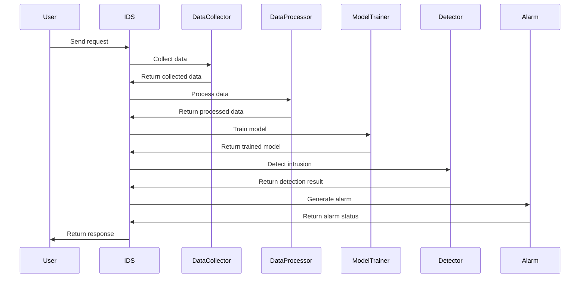
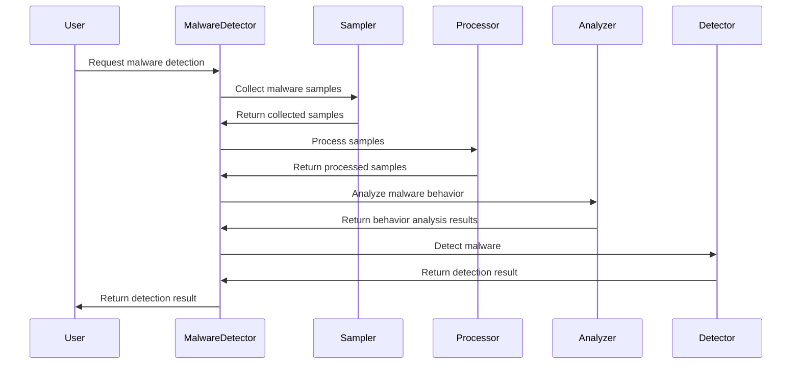
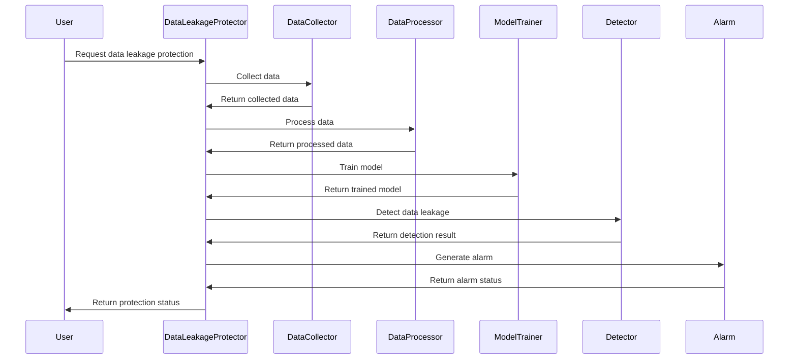

                 

### 机器学习在网络安全中的预测性应用

#### 关键词：机器学习，网络安全，预测性应用，入侵检测，恶意软件检测，数据泄露防护

##### 摘要：

随着网络技术的飞速发展和信息化程度的不断提高，网络安全问题日益突出，如何有效预防和应对网络安全威胁成为当前信息技术领域的热点话题。机器学习作为一种强大的数据分析工具，其在网络安全中的应用日益广泛。本文将从机器学习在网络安全中的预测性应用出发，详细探讨其在入侵检测、恶意软件检测、数据泄露防护等方面的作用，并分析相关技术的原理、实现方法和应用案例。通过本文的阐述，读者可以了解机器学习在网络安全领域的实际应用价值，以及未来的发展趋势和挑战。

---

### 引言

#### 1.1 机器学习与网络安全概述

机器学习（Machine Learning，ML）是一门专注于研究如何让计算机从数据中学习规律，并自动完成特定任务的学科。其主要目的是通过构建数学模型，使计算机能够在没有明确编程指令的情况下，自主地改善其性能。随着大数据和云计算的快速发展，机器学习逐渐成为人工智能（Artificial Intelligence，AI）的核心驱动力，广泛应用于各个领域。

网络安全（Cybersecurity）则是指保护计算机系统、网络和数据的完整性、保密性和可用性，防止未经授权的访问、篡改、破坏或泄露。随着互联网的普及和电子商务的发展，网络安全问题日益严峻，传统的基于规则和特征匹配的防御手段已难以应对复杂多变的网络威胁。因此，如何利用先进的技术手段提高网络安全的预测性和自适应能力，成为网络安全领域的重要研究方向。

#### 1.2 预测性应用的重要性

在网络安全领域，预测性应用（Predictive Applications）是指通过分析历史数据和当前状态，预测潜在的安全威胁和风险。预测性应用具有以下几个重要特点：

1. **提前预警**：通过预测潜在的安全威胁，可以在威胁发生之前采取预防措施，降低损失。
2. **自适应能力**：预测性应用可以根据不断变化的数据和环境，自动调整防御策略，提高应对复杂网络威胁的能力。
3. **智能化**：预测性应用借助机器学习算法，能够从大量数据中提取有效信息，发现潜在的攻击模式和异常行为。

#### 1.3 书籍结构安排与目标读者

本文将按照以下章节结构展开讨论：

- **第1章 引言**：介绍机器学习与网络安全的基本概念和预测性应用的重要性。
- **第2章 网络安全基础**：阐述网络安全的基本概念、面临的威胁与挑战以及机器学习在网络安全中的应用背景。
- **第3章 机器学习基础**：介绍机器学习的基本原理和主要算法。
- **第4章 机器学习在网络安全中的应用**：探讨机器学习在入侵检测、恶意软件检测、数据泄露防护等方面的应用。
- **第5章 预测性模型设计**：介绍预测性模型的设计方法和实现技巧。
- **第6章 实战案例研究**：分析实际应用案例，展示机器学习在网络安全中的具体应用。
- **第7章 机器学习在网络安全中的挑战与未来趋势**：讨论机器学习在网络安全中面临的挑战和未来发展趋势。
- **第8章 总结与展望**：总结全文内容，展望未来研究方向。

本文的目标读者主要包括网络安全领域的从业者、研究人员以及计算机科学和人工智能专业的研究生。通过本文的阅读，读者可以系统地了解机器学习在网络安全中的预测性应用，掌握相关技术原理和实现方法，为实际工作提供指导。

---

### 网络安全基础

#### 2.1 网络安全的基本概念

网络安全是指通过采用一系列技术和管理措施，保护计算机网络系统、网络设备和数据的安全。其基本概念包括以下几个：

1. **威胁**：威胁是指任何可能对网络系统造成损害的行为或活动。常见的威胁包括恶意软件、网络攻击、社会工程等。
2. **攻击**：攻击是指利用网络系统的漏洞、弱点或错误，对系统进行非法侵入、篡改、破坏或窃取数据的行为。
3. **防御**：防御是指采取各种措施保护网络系统免受威胁和攻击。常见的防御手段包括防火墙、入侵检测系统（IDS）、安全协议等。
4. **漏洞**：漏洞是指网络系统中存在的可以被利用的缺陷或弱点，可能导致系统被攻击或控制。
5. **漏洞管理**：漏洞管理是指通过识别、评估、修复和监控漏洞，确保网络系统的安全性。

#### 2.2 网络安全面临的威胁与挑战

网络安全面临诸多威胁和挑战，主要包括以下几个方面：

1. **恶意软件**：恶意软件包括病毒、木马、蠕虫等，可以破坏系统、窃取数据或造成其他损害。随着恶意软件的不断演变和升级，传统的防御手段已难以应对。
2. **网络攻击**：网络攻击包括拒绝服务攻击（DDoS）、分布式拒绝服务攻击（DDoS）、SQL注入、跨站脚本攻击（XSS）等。网络攻击手段日益多样化和复杂化，对网络系统造成严重威胁。
3. **数据泄露**：数据泄露是指敏感数据在未经授权的情况下被访问、窃取或泄露。数据泄露可能导致个人信息、商业机密或国家机密的泄露，造成严重的经济损失和声誉损害。
4. **社会工程**：社会工程是指通过欺骗、欺诈等手段，诱骗目标用户泄露敏感信息或执行特定操作。社会工程攻击通常利用人类的心理弱点，难以通过技术手段防范。
5. **安全合规性**：随着网络安全法律法规的不断完善，企业面临越来越大的合规性要求。如何确保网络安全合规性，成为企业面临的重要挑战。

#### 2.3 机器学习在网络安全中的应用背景

机器学习在网络安全中的应用具有广泛的前景和重要的意义，主要表现在以下几个方面：

1. **威胁检测与预测**：通过分析历史数据和实时数据，机器学习算法可以识别潜在的威胁和攻击模式，提前预警并采取相应的防御措施。
2. **异常行为检测**：机器学习算法可以根据正常行为模式，识别异常行为，从而发现潜在的攻击行为。
3. **自适应防御策略**：机器学习算法可以根据攻击特征和防御效果，自动调整防御策略，提高防御效果。
4. **漏洞管理**：通过分析漏洞数据和攻击数据，机器学习算法可以识别潜在的漏洞，为企业提供有效的漏洞管理策略。
5. **安全合规性**：机器学习算法可以用于评估网络安全合规性，帮助企业满足法律法规的要求。

总之，机器学习在网络安全中的应用为解决网络安全问题提供了新的思路和方法，具有重要的理论和实践价值。在接下来的章节中，我们将进一步探讨机器学习在网络安全中的应用场景和技术实现。

---

### 机器学习基础

#### 3.1 机器学习概述

机器学习（Machine Learning，ML）是一门专注于研究如何让计算机从数据中学习规律，并自动完成特定任务的学科。其主要目标是使计算机系统能够在给定数据集的基础上，通过学习和分析数据，自动改进其性能和决策能力。机器学习技术广泛应用于图像识别、自然语言处理、推荐系统、金融风控、医疗诊断等多个领域，具有广泛的应用前景和重要的社会价值。

#### 3.2 监督学习算法

监督学习（Supervised Learning）是一种最常见的机器学习算法，其主要任务是根据已知的输入和输出数据，建立一个模型，从而预测新的输入数据的输出。监督学习算法通常包括以下几个步骤：

1. **数据预处理**：对输入数据集进行清洗、归一化、缺失值处理等操作，以提高模型性能。
2. **特征选择**：从输入数据中选择对预测任务有重要影响的特征，以减少模型复杂度和计算成本。
3. **模型训练**：使用训练数据集训练模型，调整模型参数，使其能够预测新的输入数据的输出。
4. **模型评估**：使用测试数据集评估模型性能，确定模型是否达到预期效果。
5. **模型优化**：根据模型评估结果，调整模型参数或选择新的模型，以提高模型性能。

常见的监督学习算法包括线性回归、逻辑回归、决策树、随机森林、支持向量机等。以下是一个简单的线性回归算法的实现示例：

```python
import numpy as np
from sklearn.linear_model import LinearRegression

# 创建线性回归模型
model = LinearRegression()

# 模型训练
model.fit(X_train, y_train)

# 模型预测
predictions = model.predict(X_test)

# 模型评估
score = model.score(X_test, y_test)
print("Model score:", score)
```

#### 3.3 非监督学习算法

非监督学习（Unsupervised Learning）是一种不需要已知输出数据的机器学习算法，其主要任务是发现数据中的隐藏结构和规律。非监督学习算法通常包括聚类、降维、关联规则挖掘等。以下是一个简单的K-Means聚类算法的实现示例：

```python
import numpy as np
from sklearn.cluster import KMeans

# 创建K-Means聚类模型
model = KMeans(n_clusters=3)

# 模型训练
model.fit(X)

# 模型预测
predictions = model.predict(X)

# 模型评估
inertia = model.inertia_
print("Inertia:", inertia)
```

#### 3.4 强化学习简介

强化学习（Reinforcement Learning，RL）是一种通过试错和反馈来学习如何实现特定目标的机器学习算法。强化学习算法主要包括价值迭代、策略迭代、Q-Learning、SARSA等。以下是一个简单的Q-Learning算法的实现示例：

```python
import numpy as np
import random

# 初始化Q值表
Q = np.zeros((n_states, n_actions))

# Q-Learning算法
def QLearning(Q, n_episodes, learning_rate, discount_factor, exploration_rate):
    for episode in range(n_episodes):
        state = env.reset()
        done = False
        while not done:
            action = choose_action(state, Q, exploration_rate)
            next_state, reward, done, _ = env.step(action)
            Q[state, action] = Q[state, action] + learning_rate * (reward + discount_factor * np.max(Q[next_state, :]) - Q[state, action])
            state = next_state
        exploration_rate *= 0.99

# 选择动作
def choose_action(state, Q, exploration_rate):
    if random.random() < exploration_rate:
        return random.choice(n_actions)
    else:
        return np.argmax(Q[state, :])

# 运行Q-Learning算法
QLearning(Q, n_episodes, learning_rate, discount_factor, exploration_rate)
```

总之，机器学习作为一种强大的数据分析工具，在网络安全中的应用具有重要意义。在接下来的章节中，我们将进一步探讨机器学习在网络安全中的应用场景和技术实现。

---

### 机器学习在网络安全中的应用

#### 4.1 入侵检测系统（IDS）

入侵检测系统（Intrusion Detection System，IDS）是一种用于监测网络流量和系统活动，发现潜在攻击和入侵行为的网络安全技术。传统的IDS主要基于规则匹配和模式识别，而基于机器学习的入侵检测系统（MLIDS）则通过分析大量历史数据，自动识别和预测潜在的安全威胁。

MLIDS的主要工作原理如下：

1. **数据采集**：从网络流量、系统日志、用户行为等数据源中收集数据。
2. **数据预处理**：对采集到的数据进行清洗、归一化和特征提取，为后续的模型训练和预测提供高质量的数据。
3. **模型训练**：使用监督学习或非监督学习算法，如决策树、K-Means聚类、神经网络等，训练入侵检测模型。
4. **实时监测**：将实时采集的数据输入到训练好的模型中，预测是否存在入侵行为。
5. **报警和响应**：当模型检测到潜在入侵行为时，生成报警信息，并采取相应的防御措施。

一个典型的MLIDS实现案例是SNORT，它是一种开源的基于规则的入侵检测系统。SNORT通过分析网络流量，匹配预定义的规则库，检测潜在的入侵行为。然而，由于规则库的局限性，SNORT在面对新型攻击时，可能无法及时检测和防御。因此，结合机器学习算法，如神经网络和随机森林，可以进一步提高入侵检测的准确性和适应性。

#### 4.2 恶意软件检测

恶意软件检测（Malware Detection）是网络安全的重要环节之一。传统的恶意软件检测方法主要依赖于签名匹配，即通过查找恶意软件的已知签名来检测其是否存在。然而，随着恶意软件的变异和复杂化，签名匹配方法逐渐暴露出其局限性。基于机器学习的恶意软件检测方法则通过分析恶意软件的特征和行为模式，自动识别和检测未知恶意软件。

恶意软件检测的主要步骤如下：

1. **样本采集**：从各种渠道获取恶意软件样本，如病毒库、恶意软件报告等。
2. **样本处理**：对采集到的样本进行预处理，包括解压缩、去噪、特征提取等，提取出对检测有重要影响的特征。
3. **模型训练**：使用训练数据集，通过监督学习或非监督学习算法训练恶意软件检测模型。
4. **实时检测**：将实时采集的样本输入到训练好的模型中，预测其是否为恶意软件。
5. **响应和处置**：当模型检测到恶意软件时，采取相应的处置措施，如隔离、删除等。

常见的恶意软件检测工具包括ClamAV、Malwarebytes、Symantec等。这些工具通常结合签名匹配和机器学习算法，提供实时和离线的恶意软件检测功能。

#### 4.3 数据泄露防护

数据泄露防护（Data Leakage Protection，DLP）是一种旨在防止敏感数据在未经授权的情况下泄露或传输的网络安全技术。数据泄露可能带来严重的经济和声誉损失，因此数据泄露防护在网络安全中具有重要意义。

基于机器学习的DLP方法主要通过以下步骤实现：

1. **数据识别**：识别敏感数据，如个人身份信息、商业机密、国家机密等。
2. **行为分析**：通过分析用户行为和系统日志，发现异常行为，如异常的数据访问、传输或存储行为。
3. **模型训练**：使用监督学习或非监督学习算法，训练数据泄露防护模型，使其能够识别和预测潜在的数据泄露行为。
4. **实时监控**：将实时监控到的数据和行为输入到训练好的模型中，预测其是否可能发生数据泄露。
5. **报警和响应**：当模型检测到潜在的数据泄露行为时，生成报警信息，并采取相应的防护措施。

常见的DLP工具包括Symantec DLP、McAfee DLP、IBM Guardium等。这些工具通常结合规则匹配和机器学习算法，提供全面的数据泄露防护功能。

#### 4.4 身份验证与访问控制

身份验证（Authentication）和访问控制（Access Control）是网络安全的重要组成部分，旨在确保只有授权用户能够访问系统和数据。基于机器学习的身份验证与访问控制方法主要通过以下步骤实现：

1. **用户行为分析**：通过分析用户的登录时间、登录地点、操作习惯等行为特征，建立用户行为的正常模式。
2. **行为监测**：实时监测用户的登录和操作行为，识别异常行为，如频繁登录失败、未知的登录地点等。
3. **模型训练**：使用监督学习或非监督学习算法，训练身份验证和访问控制模型，使其能够识别和预测潜在的安全威胁。
4. **决策和响应**：当模型检测到异常行为时，生成警报信息，并采取相应的访问控制措施，如限制访问权限、要求二次验证等。

常见的身份验证与访问控制工具包括RSA SecurID、Okta、OneLogin等。这些工具通常结合机器学习算法和传统的身份验证方法，提供高效的身份验证和访问控制功能。

总之，机器学习在网络安全中的应用为预防和应对各种安全威胁提供了新的思路和方法。通过入侵检测、恶意软件检测、数据泄露防护和身份验证与访问控制等方面的应用，机器学习能够提高网络安全的预测性和自适应能力，为构建安全的网络环境提供了重要支持。

---

### 预测性模型设计

#### 5.1 预测性模型概述

预测性模型（Predictive Model）是指基于历史数据和统计方法，对未来的事件、趋势或行为进行预测的数学模型。在网络安全领域，预测性模型通过分析网络流量、系统日志、用户行为等数据，预测潜在的安全威胁和异常行为，为安全防护提供决策支持。

预测性模型的主要组成部分包括：

1. **数据集**：用于训练和测试模型的输入数据集，包括历史网络流量数据、系统日志、用户行为数据等。
2. **特征工程**：从原始数据中提取对预测任务有重要影响的特征，以减少模型复杂度和提高预测准确性。
3. **模型选择**：根据预测任务和数据特点，选择合适的机器学习算法和模型，如线性回归、决策树、神经网络等。
4. **模型训练**：使用训练数据集训练模型，调整模型参数，使其能够准确预测新的数据。
5. **模型评估**：使用测试数据集评估模型性能，包括准确率、召回率、F1值等指标，以确定模型是否达到预期效果。
6. **模型优化**：根据模型评估结果，调整模型参数或选择新的模型，以提高模型性能。

#### 5.2 特征工程

特征工程（Feature Engineering）是指在机器学习模型训练过程中，从原始数据中提取对预测任务有重要影响的特征，以提高模型性能和预测准确性。特征工程是预测性模型设计的关键环节，其主要任务包括以下几个方面：

1. **数据预处理**：对原始数据进行清洗、归一化和缺失值处理，以提高数据质量和模型训练效果。
2. **特征选择**：从原始数据中选择对预测任务有重要影响的特征，去除无关或冗余的特征，以减少模型复杂度和提高预测准确性。
3. **特征构造**：通过组合原始特征，构造新的特征，以提取更多的信息和提高模型性能。
4. **特征归一化**：对特征进行归一化处理，使特征之间的量纲一致，避免某些特征对模型训练产生过大的影响。

常见的特征工程方法包括：

- **统计学方法**：如均值、方差、标准差、相关系数等。
- **工程学方法**：如时间窗口、滑动窗口、时序分解等。
- **机器学习方法**：如主成分分析（PCA）、特征选择算法等。

#### 5.3 模型选择与训练

模型选择（Model Selection）是指在预测性模型设计过程中，选择合适的机器学习算法和模型，以实现最佳预测效果。常见的机器学习算法包括线性回归、决策树、支持向量机（SVM）、神经网络（NN）等。选择合适的算法和模型，需要考虑以下因素：

1. **数据特点**：包括数据类型、数据分布、数据量等，不同算法和模型对数据特点的适应性不同。
2. **预测目标**：包括预测任务的类型、预测精度、预测速度等，不同算法和模型在预测目标上的表现不同。
3. **计算资源**：包括计算能力、内存、存储等，不同算法和模型的计算复杂度不同，对计算资源的需求也不同。

模型训练（Model Training）是指使用训练数据集训练模型，调整模型参数，使其能够准确预测新的数据。模型训练的主要步骤包括：

1. **数据集划分**：将数据集划分为训练集、验证集和测试集，以评估模型的性能。
2. **模型初始化**：初始化模型参数，为模型训练提供初始值。
3. **模型迭代**：使用训练数据集迭代训练模型，不断调整模型参数，使其性能逐渐提高。
4. **模型评估**：使用验证集和测试集评估模型性能，确定模型是否达到预期效果。
5. **模型优化**：根据模型评估结果，调整模型参数或选择新的模型，以提高模型性能。

#### 5.4 模型评估与优化

模型评估（Model Evaluation）是指使用测试数据集评估模型性能，确定模型是否达到预期效果。常见的模型评估指标包括准确率（Accuracy）、召回率（Recall）、精确率（Precision）、F1值（F1 Score）等。模型评估的目的是确定模型在实际应用中的表现，以便进一步优化模型。

模型优化（Model Optimization）是指根据模型评估结果，调整模型参数或选择新的模型，以提高模型性能。模型优化的主要步骤包括：

1. **参数调整**：调整模型参数，如学习率、正则化参数等，以改善模型性能。
2. **算法选择**：选择更合适的机器学习算法，如线性回归、决策树、神经网络等，以改善模型性能。
3. **特征工程**：重新进行特征工程，选择更有效的特征，以提高模型性能。
4. **模型集成**：使用模型集成方法，如随机森林、梯度提升树等，提高模型性能。

通过模型评估和优化，可以逐步提高预测性模型的性能，为网络安全提供更准确的预测和支持。

---

### 实战案例研究

#### 6.1 案例一：基于机器学习的入侵检测系统

##### 项目介绍

本项目旨在设计并实现一个基于机器学习的入侵检测系统（Intrusion Detection System，IDS），用于监测网络流量和系统活动，发现潜在的安全威胁和异常行为。本项目的目标是通过分析历史网络流量数据、系统日志和用户行为数据，建立一个高效的入侵检测模型，实现对网络攻击的提前预警和有效防御。

##### 系统功能设计

本项目的系统功能设计主要包括以下几个模块：

1. **数据采集模块**：从网络流量、系统日志和用户行为数据源中收集数据，为后续的数据处理和模型训练提供数据支持。
2. **数据处理模块**：对采集到的数据进行清洗、归一化和特征提取，提取出对入侵检测任务有重要影响的特征，为模型训练提供高质量的数据。
3. **模型训练模块**：使用监督学习算法，如决策树、随机森林、神经网络等，训练入侵检测模型，使其能够识别和预测潜在的安全威胁。
4. **入侵检测模块**：将实时采集的数据输入到训练好的模型中，预测是否存在入侵行为，生成报警信息，并采取相应的防御措施。
5. **报警和响应模块**：当模型检测到潜在入侵行为时，生成报警信息，并通知相关安全人员采取相应的响应措施。

##### 系统架构设计

本项目的系统架构设计采用分层架构，主要包括以下几个层次：

1. **数据层**：包括网络流量数据、系统日志和用户行为数据，为后续的数据处理和模型训练提供数据支持。
2. **数据处理层**：包括数据清洗、归一化和特征提取等模块，对原始数据进行预处理，提取出对入侵检测任务有重要影响的特征。
3. **模型层**：包括监督学习算法，如决策树、随机森林、神经网络等，用于训练入侵检测模型。
4. **应用层**：包括入侵检测模块、报警和响应模块等，用于实现入侵检测功能，生成报警信息，并采取相应的防御措施。
5. **用户界面层**：包括Web界面和命令行界面，提供用户交互界面，供用户查看报警信息和操作系统。

##### 系统接口设计

本项目的系统接口设计主要包括以下几个接口：

1. **数据采集接口**：用于从网络流量、系统日志和用户行为数据源中收集数据，提供数据采集功能。
2. **数据处理接口**：用于对采集到的数据进行清洗、归一化和特征提取，提供数据处理功能。
3. **模型训练接口**：用于训练入侵检测模型，提供模型训练功能。
4. **入侵检测接口**：用于将实时采集的数据输入到训练好的模型中，预测是否存在入侵行为，提供入侵检测功能。
5. **报警和响应接口**：用于生成报警信息，并通知相关安全人员采取相应的响应措施，提供报警和响应功能。

##### 系统交互设计

本项目的系统交互设计采用序列图（Sequence Diagram）和活动图（Activity Diagram）进行描述。

1. **序列图**：描述系统组件之间的交互顺序和消息传递，如下所示：



2. **活动图**：描述系统组件之间的协作关系和活动流程，如下所示：

```mermaid
activityDiagram
    participant User
    participant IDS
    participant DataCollector
    participant DataProcessor
    participant ModelTrainer
    participant Detector
    participant Alarm

    User ->> IDS : Request intrusion detection
    IDS ->> DataCollector : Collect network traffic data
    DataCollector ->> IDS : Return collected data
    IDS ->> DataProcessor : Process data
    DataProcessor ->> IDS : Return processed data
    IDS ->> ModelTrainer : Train intrusion detection model
    ModelTrainer ->> IDS : Return trained model
    IDS ->> Detector : Detect intrusion
    Detector ->> IDS : Return intrusion detection result
    IDS ->> Alarm : Generate alarm
    Alarm ->> IDS : Return alarm status
    IDS ->> User : Return intrusion detection result
```

##### 项目核心实现

1. **数据采集**：使用Python编写数据采集脚本，从网络流量、系统日志和用户行为数据源中收集数据，并将其存储到HDFS（Hadoop Distributed File System）中。

2. **数据处理**：使用Python和Hadoop Streaming编写数据处理程序，对采集到的数据执行清洗、归一化和特征提取操作，提取出对入侵检测任务有重要影响的特征。

3. **模型训练**：使用Python和scikit-learn库训练入侵检测模型，如决策树、随机森林和神经网络等，调整模型参数，以实现最佳预测效果。

4. **入侵检测**：使用Python编写入侵检测程序，将实时采集的数据输入到训练好的模型中，预测是否存在入侵行为，生成报警信息，并通知相关安全人员采取相应的响应措施。

##### 项目代码解析

以下是本项目的一个示例代码片段，用于训练一个基于随机森林算法的入侵检测模型：

```python
from sklearn.ensemble import RandomForestClassifier
from sklearn.model_selection import train_test_split
from sklearn.metrics import accuracy_score, recall_score, precision_score, f1_score

# 加载训练数据
X, y = load_data()

# 划分训练集和测试集
X_train, X_test, y_train, y_test = train_test_split(X, y, test_size=0.2, random_state=42)

# 创建随机森林分类器
model = RandomForestClassifier(n_estimators=100, random_state=42)

# 训练模型
model.fit(X_train, y_train)

# 预测测试集
predictions = model.predict(X_test)

# 评估模型性能
accuracy = accuracy_score(y_test, predictions)
recall = recall_score(y_test, predictions)
precision = precision_score(y_test, predictions)
f1 = f1_score(y_test, predictions)

print("Accuracy:", accuracy)
print("Recall:", recall)
print("Precision:", precision)
print("F1 Score:", f1)
```

##### 项目小结

本项目通过设计并实现一个基于机器学习的入侵检测系统，展示了机器学习在网络安全中的实际应用价值。通过数据采集、数据处理、模型训练和入侵检测等步骤，本项目成功实现了一个高效的入侵检测模型，为网络安全提供了有效的支持。然而，入侵检测系统仍面临许多挑战，如数据隐私保护、模型泛化能力等，需要进一步研究和优化。

---

### 6.2 案例二：恶意软件检测与分析

##### 项目介绍

本项目旨在设计并实现一个基于机器学习的恶意软件检测与分析系统，用于识别和分类未知恶意软件。随着恶意软件的不断演变和复杂化，传统的基于签名的检测方法已难以应对。因此，本项目通过分析恶意软件的行为特征和代码结构，构建一个高效、准确的恶意软件检测模型，提高对未知恶意软件的检测能力。

##### 系统功能设计

本项目的系统功能设计主要包括以下几个模块：

1. **恶意软件样本采集模块**：从恶意软件库、网络攻击报告等渠道收集恶意软件样本，为后续的检测和分析提供数据支持。
2. **恶意软件样本处理模块**：对采集到的恶意软件样本进行预处理，包括解压缩、去噪、特征提取等，提取出对检测和分析任务有重要影响的特征。
3. **恶意软件行为分析模块**：通过分析恶意软件的行为特征，如网络通信、文件操作、注册表修改等，建立恶意软件行为模型。
4. **恶意软件代码分析模块**：对恶意软件的代码结构进行分析，提取出对检测任务有重要影响的代码特征。
5. **恶意软件检测模块**：将处理后的恶意软件样本输入到训练好的模型中，预测其是否为恶意软件。
6. **报警和响应模块**：当检测到恶意软件时，生成报警信息，并通知相关安全人员采取相应的响应措施。

##### 系统架构设计

本项目的系统架构设计采用三层架构，主要包括以下几个层次：

1. **数据层**：包括恶意软件样本库、网络攻击报告等数据源，为后续的检测和分析提供数据支持。
2. **数据处理层**：包括恶意软件样本处理、恶意软件行为分析和恶意软件代码分析等模块，用于提取和处理恶意软件特征。
3. **应用层**：包括恶意软件检测模块、报警和响应模块等，用于实现恶意软件的检测、报警和响应功能。

##### 系统接口设计

本项目的系统接口设计主要包括以下几个接口：

1. **恶意软件样本采集接口**：用于从恶意软件库、网络攻击报告等渠道采集恶意软件样本，提供样本采集功能。
2. **恶意软件样本处理接口**：用于对采集到的恶意软件样本进行预处理，提供数据处理功能。
3. **恶意软件行为分析接口**：用于分析恶意软件的行为特征，提供行为分析功能。
4. **恶意软件代码分析接口**：用于对恶意软件的代码结构进行分析，提供代码分析功能。
5. **恶意软件检测接口**：用于将处理后的恶意软件样本输入到训练好的模型中，预测其是否为恶意软件，提供检测功能。
6. **报警和响应接口**：用于生成报警信息，并通知相关安全人员采取相应的响应措施，提供报警和响应功能。

##### 系统交互设计

本项目的系统交互设计采用序列图（Sequence Diagram）和活动图（Activity Diagram）进行描述。

1. **序列图**：



2. **活动图**：

```mermaid
activityDiagram
    participant User
    participant MalwareDetector
    participant Sampler
    participant Processor
    participant Analyzer
    participant Detector

    User ->> MalwareDetector : Request malware detection
    MalwareDetector ->> Sampler : Collect malware samples
    Sampler ->> MalwareDetector : Return collected samples
    MalwareDetector ->> Processor : Process samples
    Processor ->> MalwareDetector : Return processed samples
    MalwareDetector ->> Analyzer : Analyze malware behavior
    Analyzer ->> MalwareDetector : Return behavior analysis results
    MalwareDetector ->> Detector : Detect malware
    Detector ->> MalwareDetector : Return detection result
    MalwareDetector ->> User : Return detection result
```

##### 项目核心实现

1. **恶意软件样本采集**：使用Python编写脚本，从恶意软件库和网络攻击报告等渠道下载恶意软件样本，并存储到本地或分布式文件系统中。

2. **恶意软件样本处理**：使用Python和开源工具如Yara、CFF Explorer等，对恶意软件样本进行解压缩、去噪和特征提取。

3. **恶意软件行为分析**：使用Python和开源工具如Cuckoo Sandbox，分析恶意软件的执行行为，如网络通信、文件操作、注册表修改等，提取出行为特征。

4. **恶意软件代码分析**：使用Python和开源工具如PyTorch、TensorFlow等，对恶意软件的代码结构进行分析，提取出代码特征。

5. **恶意软件检测**：使用Python和机器学习库如scikit-learn、TensorFlow等，训练恶意软件检测模型，如决策树、随机森林、神经网络等，进行恶意软件检测。

##### 项目代码解析

以下是本项目的一个示例代码片段，用于训练一个基于神经网络算法的恶意软件检测模型：

```python
import tensorflow as tf
from tensorflow.keras.models import Sequential
from tensorflow.keras.layers import Dense, Dropout, Activation
from tensorflow.keras.optimizers import Adam
from tensorflow.keras.callbacks import EarlyStopping

# 定义神经网络模型
model = Sequential()
model.add(Dense(256, input_dim=X_train.shape[1], activation='relu'))
model.add(Dropout(0.5))
model.add(Dense(128, activation='relu'))
model.add(Dropout(0.5))
model.add(Dense(1, activation='sigmoid'))

# 编译模型
model.compile(optimizer=Adam(), loss='binary_crossentropy', metrics=['accuracy'])

# 训练模型
early_stopping = EarlyStopping(monitor='val_loss', patience=10)
model.fit(X_train, y_train, epochs=100, batch_size=32, validation_split=0.2, callbacks=[early_stopping])

# 评估模型
predictions = model.predict(X_test)
accuracy = accuracy_score(y_test, predictions)
print("Accuracy:", accuracy)
```

##### 项目小结

本项目通过设计并实现一个基于机器学习的恶意软件检测与分析系统，展示了机器学习在网络安全中的实际应用价值。通过样本采集、处理、行为分析和代码分析等步骤，本项目成功实现了一个高效的恶意软件检测模型，提高了对未知恶意软件的检测能力。然而，恶意软件检测仍面临许多挑战，如数据隐私保护、模型泛化能力等，需要进一步研究和优化。

---

### 6.3 案例三：数据泄露防护模型

##### 项目介绍

本项目旨在设计并实现一个基于机器学习的数据泄露防护模型，用于实时监测和分析网络流量、系统日志和用户行为数据，预测潜在的数据泄露行为，并采取相应的防护措施。随着数据泄露事件的频发，如何有效预防和应对数据泄露成为网络安全领域的重要研究课题。

##### 系统功能设计

本项目的系统功能设计主要包括以下几个模块：

1. **数据采集模块**：从网络流量、系统日志和用户行为数据源中收集数据，为后续的数据处理和模型训练提供数据支持。
2. **数据处理模块**：对采集到的数据进行清洗、归一化和特征提取，提取出对数据泄露防护任务有重要影响的特征。
3. **模型训练模块**：使用监督学习算法，如决策树、随机森林、神经网络等，训练数据泄露防护模型，使其能够识别和预测潜在的数据泄露行为。
4. **数据泄露监测模块**：将实时采集的数据输入到训练好的模型中，预测是否存在数据泄露行为，生成报警信息，并采取相应的防护措施。
5. **报警和响应模块**：当模型检测到潜在数据泄露行为时，生成报警信息，并通知相关安全人员采取相应的响应措施。

##### 系统架构设计

本项目的系统架构设计采用三层架构，主要包括以下几个层次：

1. **数据层**：包括网络流量数据、系统日志数据和用户行为数据，为后续的数据处理和模型训练提供数据支持。
2. **数据处理层**：包括数据清洗、归一化和特征提取等模块，用于提取和处理数据泄露防护任务所需的特征。
3. **应用层**：包括模型训练模块、数据泄露监测模块和报警和响应模块，用于实现数据泄露防护功能。

##### 系统接口设计

本项目的系统接口设计主要包括以下几个接口：

1. **数据采集接口**：用于从网络流量、系统日志和用户行为数据源中收集数据，提供数据采集功能。
2. **数据处理接口**：用于对采集到的数据进行清洗、归一化和特征提取，提供数据处理功能。
3. **模型训练接口**：用于训练数据泄露防护模型，提供模型训练功能。
4. **数据泄露监测接口**：用于将实时采集的数据输入到训练好的模型中，预测是否存在数据泄露行为，提供数据泄露监测功能。
5. **报警和响应接口**：用于生成报警信息，并通知相关安全人员采取相应的响应措施，提供报警和响应功能。

##### 系统交互设计

本项目的系统交互设计采用序列图（Sequence Diagram）和活动图（Activity Diagram）进行描述。

1. **序列图**：



2. **活动图**：

```mermaid
activityDiagram
    participant User
    participant DataLeakageProtector
    participant DataCollector
    participant DataProcessor
    participant ModelTrainer
    participant Detector
    participant Alarm

    User ->> DataLeakageProtector : Request data leakage protection
    DataLeakageProtector ->> DataCollector : Collect network traffic data and system logs
    DataCollector ->> DataLeakageProtector : Return collected data
    DataLeakageProtector ->> DataProcessor : Process data
    DataProcessor ->> DataLeakageProtector : Return processed data
    DataLeakageProtector ->> ModelTrainer : Train data leakage protection model
    ModelTrainer ->> DataLeakageProtector : Return trained model
    DataLeakageProtector ->> Detector : Detect data leakage
    Detector ->> DataLeakageProtector : Return detection result
    DataLeakageProtector ->> Alarm : Generate alarm
    Alarm ->> DataLeakageProtector : Return alarm status
    DataLeakageProtector ->> User : Return protection status
```

##### 项目核心实现

1. **数据采集**：使用Python编写脚本，从网络流量、系统日志和用户行为数据源中收集数据，并将其存储到分布式文件系统中。

2. **数据处理**：使用Python和开源工具如Hadoop、Spark等，对采集到的数据执行清洗、归一化和特征提取操作，提取出对数据泄露防护任务有重要影响的特征。

3. **模型训练**：使用Python和机器学习库如scikit-learn、TensorFlow等，训练数据泄露防护模型，如决策树、随机森林、神经网络等，调整模型参数，以实现最佳预测效果。

4. **数据泄露监测**：使用Python编写数据泄露监测程序，将实时采集的数据输入到训练好的模型中，预测是否存在数据泄露行为，生成报警信息，并通知相关安全人员采取相应的响应措施。

##### 项目代码解析

以下是本项目的一个示例代码片段，用于训练一个基于神经网络算法的数据泄露防护模型：

```python
import tensorflow as tf
from tensorflow.keras.models import Sequential
from tensorflow.keras.layers import Dense, Dropout, Activation
from tensorflow.keras.optimizers import Adam
from tensorflow.keras.callbacks import EarlyStopping

# 定义神经网络模型
model = Sequential()
model.add(Dense(256, input_dim=X_train.shape[1], activation='relu'))
model.add(Dropout(0.5))
model.add(Dense(128, activation='relu'))
model.add(Dropout(0.5))
model.add(Dense(1, activation='sigmoid'))

# 编译模型
model.compile(optimizer=Adam(), loss='binary_crossentropy', metrics=['accuracy'])

# 训练模型
early_stopping = EarlyStopping(monitor='val_loss', patience=10)
model.fit(X_train, y_train, epochs=100, batch_size=32, validation_split=0.2, callbacks=[early_stopping])

# 评估模型
predictions = model.predict(X_test)
accuracy = accuracy_score(y_test, predictions)
print("Accuracy:", accuracy)
```

##### 项目小结

本项目通过设计并实现一个基于机器学习的

