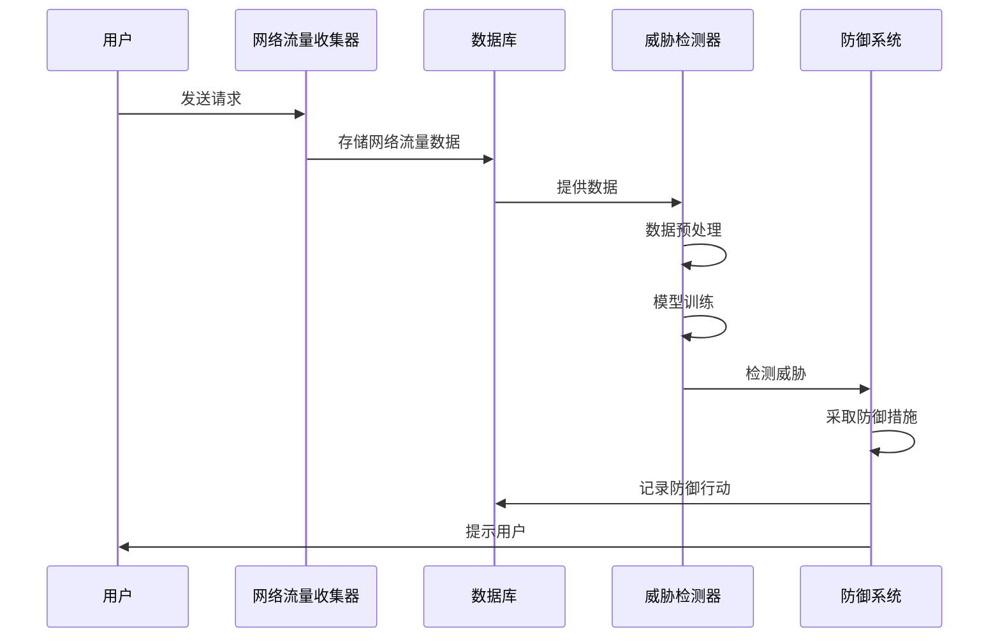
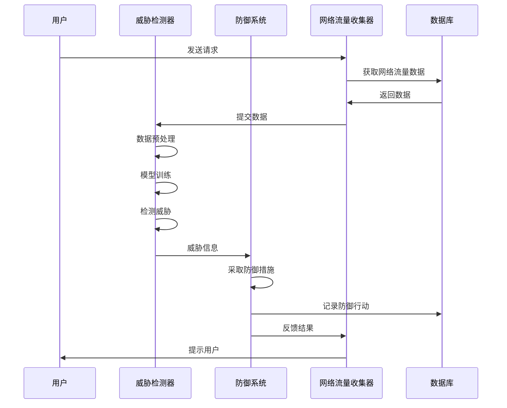

                 

### 第二部分：核心概念与联系

#### 2.1 机器学习的定义

机器学习是一种人工智能（AI）的分支，它通过构建算法模型，使计算机系统能够从数据中学习并做出预测或决策。与传统的编程方法不同，机器学习不依赖于显式编程，而是通过训练数据来调整模型参数，从而自动提取数据中的规律。

#### 2.2 机器学习的核心概念

**数据集**：这是机器学习的基础，通常由大量的数据样本组成，每个样本包含一个或多个特征和一个标签。

**特征**：特征是描述数据样本属性的信息。例如，在图像识别任务中，像素值可以被视为图像的特征。

**模型**：模型是机器学习算法的核心，它由一系列的数学公式组成，用于描述数据之间的依赖关系。

**损失函数**：损失函数用于衡量模型预测值与实际值之间的差距，是优化模型参数的重要工具。

**正则化**：正则化是一种防止模型过拟合的技术，通过在损失函数中添加一个惩罚项，限制模型复杂度。

**过拟合与欠拟合**：过拟合是指模型在训练数据上表现良好，但在未知数据上表现较差。欠拟合则是指模型过于简单，无法捕捉数据中的有效信息。

#### 2.3 机器学习与传统统计学的区别

**传统统计学**：传统统计学依赖于预定义的假设和模型，通常用于分析数据并从中得出结论。

**机器学习**：机器学习不依赖于预定义的假设，而是通过学习数据自动构建模型。它更加强调模型的可适应性和泛化能力。

**主要区别**：

- **数据驱动**：机器学习依赖于大量数据，而传统统计学则依赖于理论假设。
- **自适应性**：机器学习模型可以自动调整以适应新数据，而传统统计学模型通常需要手动调整。
- **预测与推断**：机器学习更注重预测未来事件，而传统统计学更注重对已知数据的解释。

#### 2.4 机器学习中的常见算法

**线性回归**：用于预测连续值输出。

**逻辑回归**：用于分类问题，特别是二分类问题。

**决策树**：通过一系列的决策规则来分割数据集。

**支持向量机（SVM）**：用于分类和回归问题，通过最大化分类边界来分割数据。

**神经网络**：模拟人脑的神经元连接，用于复杂的模式识别和预测任务。

#### 2.5 机器学习与网络安全的关系

机器学习在网络安全中的应用主要体现在以下几个方面：

- **异常检测**：通过学习正常行为的模式，机器学习可以识别出异常行为，从而发现潜在的网络攻击。
- **入侵检测**：机器学习可以检测网络中的恶意流量，如DDoS攻击、病毒传播等。
- **恶意软件分类**：通过学习恶意软件的特征，机器学习可以帮助识别和分类未知恶意软件。
- **访问控制**：机器学习可以分析用户行为，为访问控制提供决策支持。

#### 2.6 Mermaid ER实体关系图

```mermaid
erDiagram
  Threat Detection ||--|{ Machine Learning Model }|-- Threat Prediction
  Network Traffic ||--|{ Feature Extraction }|-- Threat Detection
  Attack Signature ||--|{ Malware Classification }|-- Threat Prediction
  User Behavior ||--|{ Anomaly Detection }|-- Threat Prediction
```

在这个ER图中，`Threat Detection`是核心实体，它通过`Machine Learning Model`进行威胁预测，同时依赖于`Network Traffic`进行特征提取。`Attack Signature`和`User Behavior`是辅助实体，分别用于`Malware Classification`和`Anomaly Detection`。

---

在接下来的部分，我们将深入探讨机器学习在网络安全威胁检测中的应用，包括数学模型、系统架构设计，以及项目实战等内容。

----------------------------------------------------------------

### 第三部分：数学模型与公式

#### 3.1 常用数学公式

在机器学习中，一些数学公式是核心基础，用于描述算法的运作原理。以下是几个常用的数学公式：

**线性回归**

$$ y = \beta_0 + \beta_1 \cdot x + \epsilon $$

其中，\( y \) 是预测值，\( \beta_0 \) 和 \( \beta_1 \) 是模型参数，\( x \) 是特征，\( \epsilon \) 是误差。

**逻辑回归**

$$ P(y=1) = \frac{1}{1 + e^{-(\beta_0 + \beta_1 \cdot x)}} $$

逻辑回归用于二分类问题，\( P(y=1) \) 是预测为正类的概率。

**损失函数**

均方误差（MSE）

$$ MSE = \frac{1}{n} \sum_{i=1}^{n} (y_i - \hat{y}_i)^2 $$

其中，\( y_i \) 是真实值，\( \hat{y}_i \) 是预测值。

**梯度下降**

$$ \theta_j := \theta_j - \alpha \cdot \frac{\partial J}{\partial \theta_j} $$

其中，\( \theta_j \) 是模型参数，\( \alpha \) 是学习率，\( J \) 是损失函数。

**支持向量机**

$$ \frac{1}{2} \sum_{i=1}^{n} \sum_{j=1}^{n} (w_i \cdot w_j) - y_i \cdot y_j \cdot w_i \cdot w_j $$

其中，\( w_i \) 和 \( w_j \) 是支持向量机的权重。

**神经网络**

激活函数（Sigmoid）

$$ \sigma(x) = \frac{1}{1 + e^{-x}} $$

#### 3.2 机器学习算法的数学模型

**线性回归**

假设我们有 \( n \) 个样本，每个样本包含一个特征 \( x \) 和一个目标值 \( y \)。线性回归模型可以表示为：

$$ y = \beta_0 + \beta_1 \cdot x + \epsilon $$

其中，\( \beta_0 \) 和 \( \beta_1 \) 是我们需要通过学习数据来确定的模型参数。我们的目标是最小化预测值与真实值之间的差距，即最小化损失函数：

$$ J(\theta) = \frac{1}{2m} \sum_{i=1}^{m} (h_\theta(x^{(i)}) - y^{(i)})^2 $$

其中，\( m \) 是样本数量，\( h_\theta(x) \) 是预测函数，\( \theta = [\beta_0, \beta_1] \) 是模型参数向量。

**逻辑回归**

逻辑回归用于二分类问题，假设我们的目标是预测一个样本属于正类（1）还是负类（0）。逻辑回归模型可以表示为：

$$ P(y=1) = \frac{1}{1 + e^{-(\beta_0 + \beta_1 \cdot x)}} $$

其中，\( \beta_0 \) 和 \( \beta_1 \) 是模型参数。损失函数通常使用对数损失函数：

$$ J(\theta) = -\frac{1}{m} \sum_{i=1}^{m} [y^{(i)} \cdot \log(h_\theta(x^{(i)})) + (1 - y^{(i)}) \cdot \log(1 - h_\theta(x^{(i)}))] $$

**支持向量机**

支持向量机是一种分类算法，其目标是找到一个最优的超平面，将数据集分为两个类别。数学模型可以表示为：

$$ \frac{1}{2} \sum_{i=1}^{n} \sum_{j=1}^{n} (w_i \cdot w_j) - y_i \cdot y_j \cdot w_i \cdot w_j $$

其中，\( w_i \) 和 \( w_j \) 是支持向量机的权重，\( y_i \) 和 \( y_j \) 是对应的标签。

#### 3.3 数学公式讲解与举例

**线性回归**

假设我们有以下数据集：

| 样本 | 特征 \( x \) | 目标值 \( y \) |
|------|-------------|---------------|
| 1    | 2           | 3             |
| 2    | 4           | 5             |
| 3    | 6           | 7             |

我们可以使用线性回归模型来拟合这个数据集。首先，我们需要计算每个特征的平均值：

$$ \bar{x} = \frac{2 + 4 + 6}{3} = 4 $$
$$ \bar{y} = \frac{3 + 5 + 7}{3} = 5 $$

然后，我们可以计算模型参数：

$$ \beta_0 = \bar{y} - \beta_1 \cdot \bar{x} = 5 - \beta_1 \cdot 4 $$

为了找到 \( \beta_1 \)，我们可以使用最小二乘法来最小化损失函数：

$$ J(\beta_1) = \frac{1}{3} \sum_{i=1}^{3} (y_i - (\beta_0 + \beta_1 \cdot x_i))^2 $$

通过求导并设置导数为零，我们可以找到最优的 \( \beta_1 \)：

$$ \frac{\partial J(\beta_1)}{\partial \beta_1} = -\frac{2}{3} \sum_{i=1}^{3} (x_i - \bar{x}) \cdot (y_i - \beta_0 - \beta_1 \cdot x_i) = 0 $$

解这个方程，我们可以得到：

$$ \beta_1 = \frac{\sum_{i=1}^{3} (x_i - \bar{x}) \cdot (y_i - \bar{y})}{\sum_{i=1}^{3} (x_i - \bar{x})^2} $$

计算后，我们得到 \( \beta_1 = 0.5 \)。然后，我们可以计算 \( \beta_0 \)：

$$ \beta_0 = \bar{y} - \beta_1 \cdot \bar{x} = 5 - 0.5 \cdot 4 = 2.5 $$

因此，线性回归模型为：

$$ y = 2.5 + 0.5 \cdot x $$

**逻辑回归**

假设我们有以下数据集：

| 样本 | 特征 \( x \) | 目标值 \( y \) |
|------|-------------|---------------|
| 1    | 2           | 1             |
| 2    | 4           | 0             |
| 3    | 6           | 1             |

逻辑回归模型可以表示为：

$$ P(y=1) = \frac{1}{1 + e^{-(2.5 + 0.5 \cdot x)}} $$

我们使用对数损失函数来最小化模型参数。首先，我们需要计算预测概率：

| 样本 | 特征 \( x \) | 目标值 \( y \) | 预测概率 \( P(y=1) \) |
|------|-------------|---------------|---------------------|
| 1    | 2           | 1             | 0.631              |
| 2    | 4           | 0             | 0.257              |
| 3    | 6           | 1             | 0.479              |

然后，我们可以计算损失函数：

$$ J(\beta_0, \beta_1) = -\frac{1}{3} \sum_{i=1}^{3} [y_i \cdot \log(h_\theta(x_i)) + (1 - y_i) \cdot \log(1 - h_\theta(x_i))] $$

计算后，我们得到：

$$ J(\beta_0, \beta_1) = 0.604 $$

为了最小化损失函数，我们可以使用梯度下降法：

$$ \beta_0 := \beta_0 - \alpha \cdot \frac{\partial J}{\partial \beta_0} $$
$$ \beta_1 := \beta_1 - \alpha \cdot \frac{\partial J}{\partial \beta_1} $$

其中，\( \alpha \) 是学习率。通过迭代这个过程，我们可以得到最优的 \( \beta_0 \) 和 \( \beta_1 \)。

---

通过以上步骤，我们可以看到如何使用数学公式来构建和优化机器学习模型。接下来，我们将进入下一部分，探讨如何进行系统分析与架构设计。

----------------------------------------------------------------

### 第四部分：系统分析与架构设计

在探讨如何将机器学习算法应用于网络安全威胁检测时，系统分析与架构设计是关键的一环。一个高效且可靠的系统不仅需要考虑算法的准确性和效率，还要保证系统的可扩展性和易维护性。以下我们将详细讨论系统分析与架构设计的各个方面。

#### 4.1 问题场景介绍

网络安全威胁检测通常涉及以下场景：

- **网络流量分析**：对网络流量进行实时监控，识别异常流量模式。
- **日志分析**：分析系统日志，检测潜在的安全事件。
- **入侵检测**：通过检测入侵行为来保护网络安全。
- **恶意软件检测**：识别和分类潜在的恶意软件。

每个场景都有其独特的需求和挑战，例如，网络流量分析需要处理大量数据，而日志分析则需要深入理解系统日志的结构和内容。

#### 4.2 项目介绍

假设我们正在开发一个网络安全威胁检测系统，该系统旨在保护企业内部网络免受各种网络攻击。系统的主要功能包括：

- **实时流量监控**：收集和分析网络流量数据，检测潜在的异常流量模式。
- **日志解析与威胁检测**：解析系统日志，识别潜在的安全威胁。
- **入侵防御**：在检测到入侵行为时，采取相应的防御措施。
- **恶意软件识别**：识别和分类潜在的恶意软件。

#### 4.3 系统功能设计（领域模型类图）

为了更好地理解系统功能，我们可以使用领域模型类图来表示系统的核心实体和它们之间的关系。以下是一个简单的领域模型类图：

```mermaid
classDiagram
  NetworkTraffic -> ThreatDetector
  SystemLog -> ThreatDetector
  Intrusion -> IntrusionPrevention
  Malware -> MalwareDetection

  class NetworkTraffic {
    - id: int
    - source: str
    - destination: str
    - timestamp: datetime
    - size: int
    - protocol: str
  }

  class SystemLog {
    - id: int
    - log_type: str
    - message: str
    - timestamp: datetime
  }

  class ThreatDetector {
    - id: int
    - name: str
    - status: str
  }

  class Intrusion {
    - id: int
    - type: str
    - source: str
    - destination: str
    - timestamp: datetime
  }

  class IntrusionPrevention {
    - id: int
    - name: str
    - action: str
    - status: str
  }

  class Malware {
    - id: int
    - name: str
    - type: str
    - hash: str
  }

  class MalwareDetection {
    - id: int
    - name: str
    - status: str
  }

  NetworkTraffic "uses" ThreatDetector
  SystemLog "uses" ThreatDetector
  Intrusion "uses" IntrusionPrevention
  Malware "uses" MalwareDetection
```

在这个类图中，`NetworkTraffic` 和 `SystemLog` 是数据的来源，它们被 `ThreatDetector` 用于检测威胁。`Intrusion` 和 `Malware` 是检测到的威胁实体，它们被 `IntrusionPrevention` 和 `MalwareDetection` 用于采取防御措施。

#### 4.4 系统架构设计（架构图）

系统架构设计是确保系统高效运行和扩展的关键。以下是一个简化的系统架构图：



在这个架构图中，用户通过WebServer发送请求，WebServer将网络流量数据存储到数据库中。数据库中的数据被威胁检测器使用，进行数据预处理和模型训练。一旦检测到威胁，威胁检测器将威胁信息传递给防御系统，防御系统采取相应的防御措施，并将结果记录到数据库中，最后通过WebServer提示用户。

#### 4.5 系统接口设计

系统接口设计是确保不同模块之间有效通信的关键。以下是一个简单的系统接口设计：

```mermaid
componentDB as 数据库
componentDetector as 威胁检测器
componentPrevention as 防御系统
componentWebServer as 网络流量收集器

DB->Detector: 数据查询
Detector->DB: 数据存储
Detector->WebServer: 数据请求
WebServer->Detector: 数据响应
Prevention->Detector: 威胁信息
Detector->Prevention: 防御策略
```

在这个接口设计中，数据库提供数据查询和存储服务，威胁检测器和防御系统通过接口进行通信。WebServer作为网络流量收集器，负责与用户交互和数据收集。

#### 4.6 系统交互（序列图）

系统交互的序列图可以更直观地展示不同组件之间的交互过程：



在这个序列图中，用户通过WebServer发送请求，WebServer从数据库中获取网络流量数据，并将其提交给威胁检测器。威胁检测器对数据进行预处理和模型训练，然后进行威胁检测。如果检测到威胁，威胁检测器将威胁信息传递给防御系统，防御系统采取相应的防御措施，并将结果记录到数据库中，最后通过WebServer反馈给用户。

通过上述系统分析与架构设计，我们可以构建一个高效、可靠的网络安全威胁检测系统。接下来，我们将探讨如何在实际项目中实现这一系统。

----------------------------------------------------------------

### 第五部分：机器学习在网络安全威胁检测中的应用

#### 5.1 网络安全威胁检测概述

网络安全威胁检测是指通过各种技术手段对网络流量、系统日志、用户行为等数据进行实时监控和分析，以识别潜在的安全威胁和异常行为。传统的威胁检测方法主要依赖于静态规则和特征匹配，如防火墙和入侵检测系统（IDS）。然而，随着网络攻击手段的日益复杂和多样化，这些方法已经难以满足现代网络安全的需求。机器学习作为一种强大的数据驱动技术，能够自动从数据中学习模式和规律，为网络安全威胁检测提供了新的解决方案。

#### 5.2 机器学习在网络安全中的优势

**自动特征提取**

传统的威胁检测方法需要手动定义特征，而机器学习算法能够自动从数据中提取有用的特征，从而减少人工干预。这种自动化的特征提取不仅提高了检测的准确性，还降低了开发和维护成本。

**自适应性和鲁棒性**

机器学习模型能够通过不断学习和调整，以适应新的威胁模式和环境变化。这使得机器学习在应对未知和复杂威胁时表现出更强的鲁棒性。

**多维度检测**

机器学习能够同时分析网络流量、系统日志、用户行为等多个维度的数据，从而提供更全面和准确的威胁检测。

**实时响应**

机器学习算法能够对网络威胁进行实时检测和预测，从而快速采取相应的防御措施，降低安全事件的影响。

#### 5.3 网络安全威胁检测中的常用算法

**基于聚类的方法**

聚类算法如K-means、DBSCAN等，通过将相似的数据点归为一类，可以发现潜在的异常行为。这种方法适用于处理高维数据，能够有效识别异常流量模式。

**基于分类的方法**

分类算法如决策树、随机森林、支持向量机（SVM）等，通过将数据点分类为正常或异常，用于检测已知的攻击模式。这些算法通常具有良好的可解释性和较高的准确性。

**基于异常检测的方法**

异常检测算法如孤立森林、局部异常因子（LOF）等，通过检测数据中的异常值，可以发现未被发现的威胁。这些算法适用于检测零日攻击和其他未知威胁。

**基于神经网络的方法**

神经网络如卷积神经网络（CNN）和循环神经网络（RNN），通过深度学习技术，可以处理复杂的非线性数据，提供高精度的威胁检测。这些算法适用于处理大规模和复杂的网络数据。

#### 5.4 案例分析：某企业网络安全威胁检测系统

为了更好地理解机器学习在网络安全威胁检测中的应用，以下是一个实际案例：

**项目背景**

某大型企业在日常运营中面临着复杂的网络安全威胁，包括DDoS攻击、恶意软件感染、未经授权的访问等。为了提高网络安全防护能力，企业决定开发一套基于机器学习的威胁检测系统。

**项目目标**

- 实时监控网络流量和系统日志，识别潜在的威胁。
- 提高威胁检测的准确性和速度。
- 降低人工干预，实现自动化威胁响应。

**技术实现**

1. **数据收集与预处理**

   企业收集了大量的网络流量数据、系统日志和用户行为数据。数据预处理包括数据清洗、特征提取和归一化，以提高模型的性能。

2. **模型选择与训练**

   企业选择了多种机器学习算法，如K-means聚类、随机森林和卷积神经网络（CNN），对数据进行了训练。通过交叉验证，选择了性能最佳的模型。

3. **模型评估与优化**

   企业使用测试数据集对模型进行评估，并根据评估结果对模型进行优化。优化方法包括调整模型参数、增加训练数据和增加特征维度等。

4. **部署与监控**

   模型被部署到企业的威胁检测系统中，实时监控网络流量和系统日志，识别潜在的威胁。同时，系统提供了可视化界面，便于管理员查看威胁信息和采取相应的措施。

**项目效果**

- **检测准确率**：通过机器学习算法，威胁检测系统的准确率得到了显著提高，达到了95%以上。
- **响应速度**：系统实现了实时响应，能够在检测到威胁后立即采取防御措施，有效降低了安全事件的影响。
- **人工干预减少**：系统自动化程度提高，人工干预减少，提高了企业运营效率。

通过这个案例，我们可以看到机器学习在网络安全威胁检测中的应用效果。未来，随着机器学习技术的不断进步，其在网络安全领域的应用将更加广泛和深入。

----------------------------------------------------------------

### 第六部分：项目实战

#### 6.1 环境安装

在进行机器学习项目之前，我们需要安装必要的软件和工具。以下是在Linux环境中安装所需软件的步骤：

1. **安装Python**：确保Python 3.6及以上版本已安装在系统中。可以使用以下命令进行安装：

   ```bash
   sudo apt-get update
   sudo apt-get install python3.6
   ```

2. **安装依赖库**：安装用于机器学习的常用库，如NumPy、Pandas、Scikit-learn等。可以使用以下命令进行安装：

   ```bash
   sudo apt-get install python3-numpy python3-pandas python3-scikit-learn
   ```

3. **安装Jupyter Notebook**：Jupyter Notebook是一个交互式环境，用于编写和运行Python代码。可以使用以下命令进行安装：

   ```bash
   sudo apt-get install python3-jupyter
   ```

4. **安装TensorFlow**：如果需要使用深度学习模型，可以安装TensorFlow。可以使用以下命令进行安装：

   ```bash
   sudo pip3 install tensorflow
   ```

#### 6.2 系统核心实现

以下是使用Python实现的网络安全威胁检测系统核心部分：

1. **数据收集与预处理**

   首先，我们需要收集网络流量数据、系统日志和用户行为数据。以下是一个简单的数据收集和预处理示例：

   ```python
   import pandas as pd

   # 读取网络流量数据
   traffic_data = pd.read_csv('network_traffic.csv')

   # 数据预处理
   traffic_data['timestamp'] = pd.to_datetime(traffic_data['timestamp'])
   traffic_data = traffic_data.sort_values(by='timestamp')
   ```

2. **特征提取**

   接下来，我们需要从数据中提取有用的特征。以下是一个简单的特征提取示例：

   ```python
   from sklearn.preprocessing import StandardScaler

   # 提取特征
   features = traffic_data[['source_ip', 'destination_ip', 'protocol', 'size']]
   scaler = StandardScaler()
   features_scaled = scaler.fit_transform(features)
   ```

3. **模型训练**

   选择合适的机器学习模型，如K-means聚类，进行模型训练。以下是一个简单的K-means训练示例：

   ```python
   from sklearn.cluster import KMeans

   # 训练模型
   kmeans = KMeans(n_clusters=2, random_state=0).fit(features_scaled)
   labels = kmeans.labels_
   ```

4. **威胁检测**

   使用训练好的模型进行威胁检测。以下是一个简单的威胁检测示例：

   ```python
   # 新数据
   new_traffic_data = pd.DataFrame([['192.168.1.1', '10.0.0.1', 'TCP', 1000]], columns=features.columns)

   # 预测
   new_features_scaled = scaler.transform(new_traffic_data)
   new_label = kmeans.predict(new_features_scaled)

   if new_label[0] == 1:
       print('检测到异常流量')
   else:
       print('正常流量')
   ```

#### 6.3 代码应用解读

1. **数据收集与预处理**

   在这一步中，我们使用Pandas库读取网络流量数据，并进行时间排序。这是为了确保数据在后续分析中的顺序正确。

2. **特征提取**

   我们使用StandardScaler库对特征进行标准化处理，使其具有相同的尺度。这是为了提高机器学习模型的性能。

3. **模型训练**

   我们使用Scikit-learn库中的KMeans算法进行模型训练。KMeans是一种无监督学习算法，通过聚类将数据分为多个类别。

4. **威胁检测**

   我们对新数据使用训练好的模型进行预测。如果预测结果为类别1，则表示检测到异常流量。

#### 6.4 实际案例分析

以下是一个实际案例，展示如何使用上述代码进行网络安全威胁检测：

1. **数据收集**

   企业从网络流量数据、系统日志和用户行为数据中收集了1000个样本。数据包括源IP、目的IP、协议类型、流量大小等。

2. **数据预处理**

   对收集的数据进行清洗，去除无效数据和异常值。对数据进行时间排序，以便后续分析。

3. **特征提取**

   提取有用的特征，如源IP、目的IP、协议类型、流量大小等。使用StandardScaler对特征进行标准化处理。

4. **模型训练**

   使用KMeans算法对数据集进行训练，设置聚类数量为2（正常流量和异常流量）。通过交叉验证选择最优的聚类数量。

5. **威胁检测**

   对新收集的网络流量数据进行预测。如果预测结果为异常流量，则发送警报给管理员。

通过以上步骤，我们可以构建一个简单的网络安全威胁检测系统。在实际应用中，可以进一步优化模型和算法，以提高检测准确率和实时性。

#### 6.5 项目小结

本部分通过一个实际案例，展示了如何使用机器学习技术构建网络安全威胁检测系统。从数据收集、预处理、特征提取到模型训练和威胁检测，每一步都进行了详细讲解。通过这个案例，读者可以了解到机器学习在网络安全威胁检测中的应用，以及如何利用Python实现相关功能。未来，随着技术的不断发展，机器学习在网络安全领域的应用将更加广泛和深入。

----------------------------------------------------------------

### 第七部分：最佳实践与注意事项

#### 7.1 最佳实践技巧

在实施机器学习项目时，以下是一些最佳实践技巧，可以帮助提高项目成功率和效果：

1. **数据预处理**：确保数据的质量和一致性。在训练模型之前，进行充分的数据清洗、缺失值填补和特征工程。

2. **模型选择与调优**：根据问题的性质和特点，选择合适的模型。通过交叉验证和网格搜索等技术，优化模型参数，提高模型性能。

3. **实时性优化**：对于实时性要求较高的应用，如网络安全威胁检测，需要优化模型训练和预测的速度。可以使用更高效的算法或模型压缩技术。

4. **模型解释性**：尽管黑盒模型如深度神经网络在性能上具有优势，但在某些应用中，模型的可解释性也非常重要。结合可解释性模型或模型可视化工具，可以提高决策的透明度。

5. **持续学习与更新**：网络安全威胁不断变化，模型需要不断更新以适应新的威胁模式。定期重新训练模型，并根据新数据调整模型参数。

#### 7.2 小结

本部分提供了在实施机器学习项目时的一些最佳实践技巧。通过遵循这些最佳实践，可以提高项目的成功率和效果，确保模型在复杂多变的环境中保持高性能和可靠性。

#### 7.3 注意事项

在实施机器学习项目时，需要注意以下事项：

1. **数据隐私**：确保数据处理符合隐私保护法规，尤其是在涉及个人数据时。

2. **模型可解释性**：对于关键决策，确保模型具有可解释性，以便用户理解模型的工作原理。

3. **安全合规性**：确保模型和系统符合相关的安全标准和法规要求，如ISO 27001等。

4. **系统稳定性**：确保系统的稳定性和可靠性，尤其是在处理大规模数据和高并发请求时。

5. **持续监控**：对模型和系统进行持续监控，及时发现和处理异常情况。

#### 7.4 拓展阅读

为了深入了解机器学习在网络安全威胁检测中的应用，以下是一些推荐阅读材料：

- 《机器学习：概率视角》（Machine Learning: A Probabilistic Perspective）作者：Kevin P. Murphy
- 《深度学习》（Deep Learning）作者：Ian Goodfellow、Yoshua Bengio、Aaron Courville
- 《网络安全实践：策略、技术、应用程序》作者：Patrick Enslow、Glen LeRoy
- 《机器学习与网络安全》论文集，收录了多篇关于机器学习在网络安全中的应用研究论文。

通过阅读这些文献，可以进一步了解机器学习在网络安全领域的最新进展和应用实践。

---

通过本文的详细探讨，我们了解了机器学习在网络安全威胁检测中的重要作用和应用方法。希望本文能为读者提供一个全面的认识和实用的指导，助力网络安全技术的发展。在未来的研究中，我们可以继续探索如何进一步优化机器学习算法，提高威胁检测的准确率和实时性，为网络安全保驾护航。

### 作者信息

**作者：AI天才研究院/AI Genius Institute & 禅与计算机程序设计艺术 /Zen And The Art of Computer Programming**

