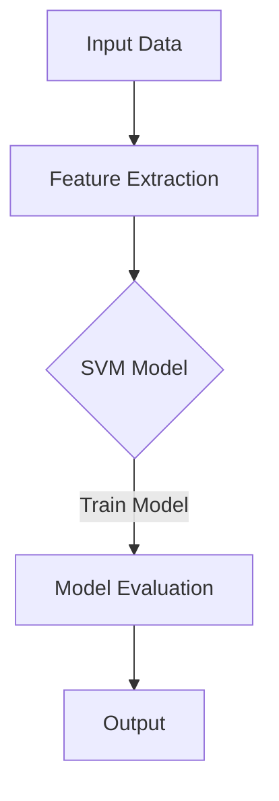
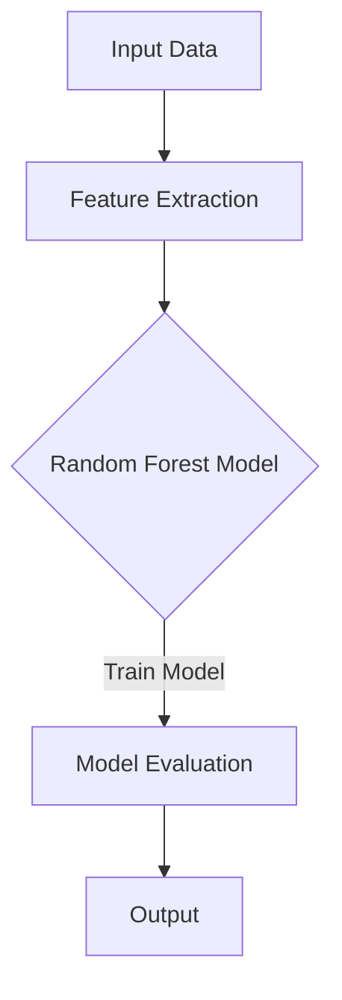
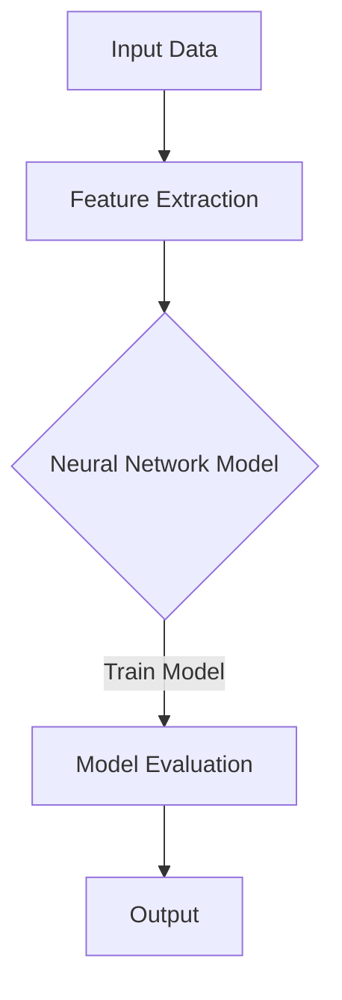
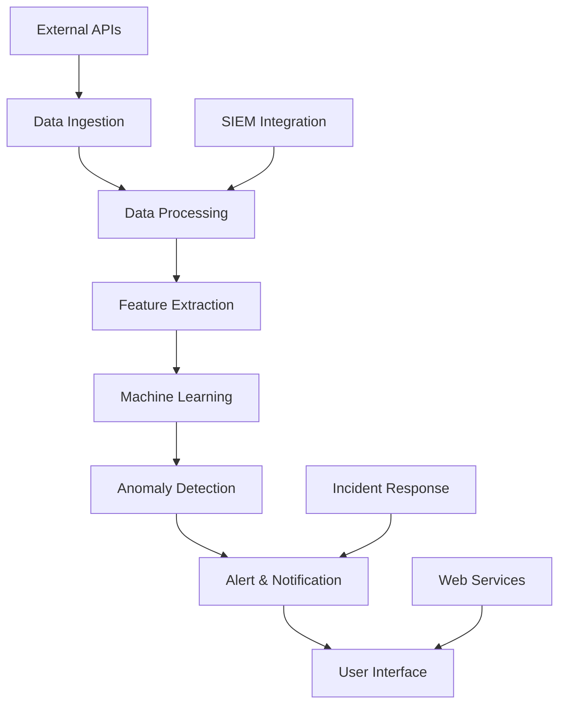

                 

### Introduction and Background

**Machine Learning in Cybersecurity for Threat Awareness: Prediction and Defense**

Keywords: Machine Learning, Cybersecurity, Threat Awareness, Prediction, Defense

Abstract:
In the digital age, cybersecurity has become a critical concern for organizations worldwide. As cyber threats evolve and become increasingly sophisticated, traditional defense mechanisms are no longer sufficient to protect against advanced persistent threats. This article delves into the application of machine learning in cybersecurity, focusing on threat awareness, prediction, and defense. We will explore how machine learning techniques can be leveraged to detect and predict potential cyber threats, enabling proactive defense measures. The article aims to provide a comprehensive guide for understanding the role of machine learning in modern cybersecurity practices and the steps involved in implementing effective threat detection and defense mechanisms.

#### Fundamental Concepts

In order to fully grasp the application of machine learning in cybersecurity, it is essential to understand the fundamental concepts involved. Let's define some key terms and explore their significance in the context of cybersecurity.

**Machine Learning**

Machine learning (ML) is a subfield of artificial intelligence (AI) that focuses on the development of algorithms that can learn from and make predictions or decisions based on data. Unlike traditional programming, where instructions are explicitly written for specific tasks, machine learning algorithms enable computers to learn from data and improve their performance over time. This is achieved through training models on large datasets and using statistical techniques to identify patterns and relationships within the data.

**Cybersecurity**

Cybersecurity, also known as information technology security, is the practice of protecting computers, networks, programs, and data from unauthorized access, attacks, or damage. The goal of cybersecurity is to ensure the confidentiality, integrity, and availability of information. In the context of machine learning, cybersecurity refers to the use of ML techniques to identify and mitigate cyber threats, such as malware, phishing attacks, and data breaches.

**Threat Awareness**

Threat awareness is the process of identifying and understanding potential cyber threats to an organization's IT infrastructure. This involves monitoring network activity, analyzing logs and alerts, and identifying suspicious or anomalous behavior. Threat awareness is crucial for early detection and prevention of cyber attacks, as it enables organizations to take proactive measures to protect their assets.

**Prediction**

Prediction in cybersecurity refers to the ability of machine learning models to forecast potential cyber threats based on historical data and patterns. By analyzing past attack data and identifying common indicators, machine learning algorithms can predict the likelihood of future threats and prioritize defensive actions accordingly.

**Defense**

Defense in cybersecurity involves implementing measures to prevent, detect, and respond to cyber threats. This includes using firewalls, intrusion detection systems (IDS), and other security technologies to protect against attacks. In the context of machine learning, defense also involves leveraging predictive models to identify and mitigate potential threats before they cause damage.

Understanding these fundamental concepts is crucial for comprehending the role of machine learning in cybersecurity. In the following sections, we will delve deeper into the various machine learning techniques used for threat detection and defense, and explore the steps involved in implementing effective cybersecurity measures.

#### Machine Learning Techniques for Cybersecurity

Machine learning encompasses a variety of techniques that can be applied to enhance cybersecurity. These techniques can be broadly categorized into supervised learning, unsupervised learning, and reinforcement learning. Each of these approaches has its unique characteristics and applications in the realm of cybersecurity.

**Supervised Learning**

Supervised learning is a machine learning technique where models are trained on labeled data, meaning that the correct output for each input is already known. The goal is to develop a function that can map new, unseen inputs to their corresponding outputs. In the context of cybersecurity, supervised learning is often used for classifying network traffic into normal or malicious categories.

One common algorithm used for this purpose is the Support Vector Machine (SVM). SVMs work by finding the hyperplane that best separates the data into different classes. For instance, in a binary classification problem, SVMs can distinguish between normal and malicious packets. The following equation represents the decision boundary for an SVM:

$$
w \cdot x + b = 0
$$

where $w$ is the weight vector, $x$ is the feature vector, and $b$ is the bias term.

Another popular algorithm for supervised learning is the Random Forest. Random Forests are based on the idea of constructing a multitude of decision trees during training and outputting the class that is the mode of the classes (classification) or mean prediction (regression) of the individual trees.

**Unsupervised Learning**

Unsupervised learning algorithms do not require labeled data and are used to discover hidden patterns or intrinsic structures in the data. In cybersecurity, unsupervised learning can be employed for anomaly detection, where the system identifies unusual activities that deviate from established norms.

One of the most well-known unsupervised learning algorithms is the K-means clustering. K-means works by iteratively assigning data points to clusters based on their distance to the centroid of each cluster. The algorithm aims to minimize the sum of squared distances between each point and its assigned centroid.

$$
\min_{\mu_1, \mu_2, ..., \mu_k} \sum_{i=1}^n \sum_{j=1}^k ||x_i - \mu_j||^2
$$

where $x_i$ represents the data points, $\mu_j$ are the centroids of the clusters, and $k$ is the number of clusters.

Another important unsupervised learning technique is Principal Component Analysis (PCA). PCA is used for dimensionality reduction by transforming the data into a new coordinate system, which highlights the most important features and removes noise. The mathematical formulation of PCA involves finding the eigenvectors and eigenvalues of the covariance matrix of the data:

$$
\text{Cov}(X) \lambda = \text{Eig}(X)
$$

**Reinforcement Learning**

Reinforcement learning (RL) is a type of machine learning where an agent learns to make decisions by taking actions in an environment to achieve maximum reward. In cybersecurity, RL can be used to develop adaptive defense mechanisms that respond to new and evolving threats.

Q-learning is a popular RL algorithm where the agent learns the value of actions based on the rewards received and the current state. The Q-value for each state-action pair is updated using the following equation:

$$
Q(s, a) \leftarrow Q(s, a) + \alpha [r + \gamma \max_{a'} Q(s', a') - Q(s, a)]
$$

where $s$ is the state, $a$ is the action, $r$ is the reward, $\gamma$ is the discount factor, and $\alpha$ is the learning rate.

In summary, supervised learning, unsupervised learning, and reinforcement learning each offer unique approaches to enhancing cybersecurity. Supervised learning techniques, such as SVM and Random Forest, are effective for classifying known threats. Unsupervised learning methods, like K-means and PCA, are valuable for detecting anomalies and reducing dimensionality. Reinforcement learning algorithms, such as Q-learning, enable adaptive defense mechanisms that can learn and respond to new threats over time. By leveraging these diverse techniques, organizations can build robust and resilient cybersecurity systems.

#### Data Collection and Preprocessing

In the realm of machine learning for cybersecurity, the quality and quantity of data play a crucial role in the performance of predictive models. Data collection and preprocessing are fundamental steps that determine the effectiveness of machine learning algorithms in identifying and mitigating cyber threats. Let's delve into the importance of these steps and explore common methods for data collection and preprocessing.

**Importance of Data Collection and Preprocessing**

1. **Data Quality**: High-quality data is essential for training accurate models. Inaccurate or incomplete data can lead to biased or inaccurate predictions, which can have serious consequences in a cybersecurity context. For example, if a model is trained on data containing false positives, it may fail to detect actual threats.

2. **Data Quantity**: The size of the dataset can significantly impact the performance of machine learning models. A larger dataset allows models to learn more general patterns, leading to better generalization and accuracy. In cybersecurity, where the diversity and complexity of threats are constantly evolving, having a large and diverse dataset is crucial for capturing a wide range of attack scenarios.

3. **Feature Engineering**: Preprocessing often involves feature engineering, which is the process of selecting and constructing features that capture the essential characteristics of the data. Effective feature engineering can improve model performance by reducing noise and irrelevant information, thereby simplifying the learning task.

4. **Reducing Overfitting**: Overfitting occurs when a model captures noise or irrelevant patterns in the training data, leading to poor generalization on new, unseen data. Preprocessing techniques, such as normalization and dimensionality reduction, can help mitigate overfitting by simplifying the model and focusing on relevant features.

**Common Data Collection Methods**

1. **Network Traffic Monitoring**: One of the primary sources of data in cybersecurity is network traffic. Monitoring tools can capture packets flowing through the network, providing insights into the behavior of users and potential threats. This data can be collected using tools like Wireshark or packet capture libraries such as PCAP in Python.

2. **Log Files**: Log files generated by operating systems, applications, and security systems contain valuable information about events and activities on a network. These logs can be collected using tools like Logstash or Splunk. Common log files include system logs, firewall logs, and intrusion detection system (IDS) logs.

3. **Feedback from Security Analysts**: Human input is often critical for identifying subtle and nuanced threats. Security analysts can provide annotations and insights that enrich the dataset and improve the accuracy of machine learning models.

**Common Preprocessing Techniques**

1. **Data Cleaning**: This involves removing duplicate entries, correcting errors, and handling missing values. For example, if a log file contains missing data, it can be filled using techniques such as mean imputation or interpolation.

2. **Normalization and Scaling**: Normalization and scaling are used to bring the data into a consistent range, which can improve the performance of certain algorithms. Normalization transforms the data to have a mean of 0 and a standard deviation of 1, while scaling rescales the data to a specific range, such as 0 to 1.

3. **Dimensionality Reduction**: Techniques like Principal Component Analysis (PCA) and t-Distributed Stochastic Neighbor Embedding (t-SNE) can reduce the number of features while preserving important information, thereby improving model performance and interpretability.

4. **Feature Selection**: This step involves selecting a subset of the most relevant features that contribute the most to the prediction task. Methods like Recursive Feature Elimination (RFE) and feature importance scores from tree-based models can be used for this purpose.

5. **Data Augmentation**: In some cases, it may be beneficial to artificially increase the size of the dataset by creating new samples through techniques like oversampling, undersampling, or synthetic data generation.

By carefully collecting and preprocessing data, organizations can build more accurate and robust machine learning models for cybersecurity threat detection and defense. This not only enhances the performance of predictive models but also ensures that they are capable of adapting to new and evolving threats.

#### Feature Engineering and Selection

Feature engineering and selection are critical steps in the development of machine learning models for cybersecurity applications. These processes involve transforming raw data into meaningful and relevant features that can improve the performance and accuracy of the models. Let's delve into the processes of feature engineering and selection, along with examples and methods for effective feature extraction.

**Feature Engineering**

Feature engineering is the process of using domain knowledge to create new features from the available data that can help improve the performance of machine learning models. The goal is to extract relevant information from the raw data that can be used to distinguish between normal and malicious activities.

1. **Temporal Features**: Temporal features capture the timing information associated with events. For example, the time of day, day of the week, and time since the last event can be useful in detecting patterns related to specific threat behaviors. Temporal features can be engineered as follows:

   $$
   \text{TimeOfDay} = \text{hour of the day (0-23)}
   $$
   $$
   \text{DayOfWeek} = \text{day of the week (0-6)}
   $$
   $$
   \text{TimeSinceLastEvent} = \text{current time - time of last event}
   $$

2. **Protocol Features**: Protocol features describe the characteristics of the network protocols used in communications. For example, the protocol type (TCP, UDP, ICMP), source and destination ports, and the protocol's handshake process can be extracted. These features can be useful in distinguishing between different types of network traffic.

3. **Session Features**: Session features capture the behavior of a series of related events over time. For example, the duration of a session, the number of packets in a session, and the inter-packet arrival time can be important in identifying unusual patterns. Session features can be calculated as follows:

   $$
   \text{SessionDuration} = \text{endTime} - \text{startTime}
   $$
   $$
   \text{NumPackets} = \text{count of packets in the session}
   $$
   $$
   \text{InterPacketTime} = \text{average time between packets}
   $$

4. **Traffic Volume Features**: Traffic volume features capture the amount of data transmitted over the network. Metrics such as total bytes sent, total bytes received, and the ratio of incoming to outgoing traffic can be useful in detecting abnormal traffic patterns.

5. **Anomaly Detection Features**: Features that indicate anomalies or deviations from established norms can be engineered to help detect malicious activities. For example, the deviation of current traffic volume from the historical average can be a strong indicator of a potential attack.

**Feature Selection**

Feature selection is the process of identifying the most relevant features from a set of candidate features to improve model performance and reduce complexity. Effective feature selection can lead to better generalization and faster model training.

1. **Filter Methods**: Filter methods evaluate the relevance of each feature based on statistical measures, such as correlation coefficients or mutual information. Common filter methods include chi-square tests, mutual information, and ANOVA (analysis of variance).

2. **Wrapper Methods**: Wrapper methods involve using a machine learning model to evaluate the performance of different feature subsets. The process of selecting features is repeated iteratively, with the best subset being retained for further training. Techniques like backward elimination and forward selection are examples of wrapper methods.

3. **Embedded Methods**: Embedded methods integrate feature selection into the model training process. Features are selected based on their contribution to the model's performance, as determined by the learning algorithm. LASSO (Least Absolute Shrinkage and Selection Operator) and decision trees are examples of embedded feature selection methods.

**Example: Feature Extraction for Network Traffic Analysis**

Consider a dataset of network traffic logs that contains the following features:

- Source IP address
- Destination IP address
- Source port
- Destination port
- Protocol (TCP, UDP, ICMP)
- Total bytes sent
- Total bytes received
- Time of day
- Day of week

To engineer meaningful features from this data, we can apply the following steps:

1. **Temporal Features**:
   - $\text{TimeOfDay} = \text{hour of the day (0-23)}$
   - $\text{DayOfWeek} = \text{day of the week (0-6)}$

2. **Protocol Features**:
   - $\text{ProtocolType} = \text{TCP}$ if protocol is "TCP", otherwise 0

3. **Session Features**:
   - $\text{SessionDuration} = \text{endTime} - \text{startTime}$
   - $\text{NumPackets} = \text{count of packets in the session}$
   - $\text{InterPacketTime} = \text{average time between packets}$

4. **Traffic Volume Features**:
   - $\text{TotalBytesSent} = \text{total bytes sent}$
   - $\text{TotalBytesReceived} = \text{total bytes received}$
   - $\text{IncomingOutgoingRatio} = \frac{\text{TotalBytesReceived}}{\text{TotalBytesSent}}$

5. **Anomaly Detection Features**:
   - $\text{BytesDeviation} = \text{current total bytes - historical average total bytes}$

After engineering these features, we can apply feature selection techniques to identify the most relevant features for our machine learning model. For example, using a filter method like mutual information, we can determine the importance of each feature and retain the top features that contribute the most to the prediction task.

In conclusion, effective feature engineering and selection are essential for developing robust machine learning models in cybersecurity. By transforming raw data into meaningful features and selecting the most relevant features, organizations can improve the performance and accuracy of their models, enabling better threat detection and defense.

#### Algorithm Design and Implementation

When it comes to threat detection and defense in cybersecurity, the choice of machine learning algorithms plays a crucial role in determining the effectiveness of the system. In this section, we will introduce several commonly used algorithms for cybersecurity applications, provide visual representations using Mermaid diagrams, and illustrate their implementation using Python code snippets.

**Support Vector Machine (SVM)**

Support Vector Machine (SVM) is a powerful supervised learning algorithm used for binary and multiclass classification tasks. In cybersecurity, SVMs can be employed to classify network traffic as normal or malicious based on features extracted from packet data.

**Mermaid Diagram**



**Python Code**

```python
from sklearn import svm
from sklearn.model_selection import train_test_split
from sklearn.preprocessing import StandardScaler

# Load and preprocess data
X, y = load_data()  # Assume a function load_data() that returns features (X) and labels (y)
X_train, X_test, y_train, y_test = train_test_split(X, y, test_size=0.2, random_state=42)

# Feature scaling
scaler = StandardScaler()
X_train = scaler.fit_transform(X_train)
X_test = scaler.transform(X_test)

# Train SVM model
model = svm.SVC(kernel='linear')
model.fit(X_train, y_train)

# Evaluate model
accuracy = model.score(X_test, y_test)
print(f"Model accuracy: {accuracy:.2f}")
```

**Random Forest**

Random Forest is an ensemble learning method that combines multiple decision trees to improve prediction accuracy and robustness. It is particularly useful for classifying complex and high-dimensional data, making it a popular choice in cybersecurity for tasks such as intrusion detection.

**Mermaid Diagram**



**Python Code**

```python
from sklearn.ensemble import RandomForestClassifier
from sklearn.model_selection import train_test_split

# Load and preprocess data
X, y = load_data()  # Assume a function load_data() that returns features (X) and labels (y)
X_train, X_test, y_train, y_test = train_test_split(X, y, test_size=0.2, random_state=42)

# Train Random Forest model
model = RandomForestClassifier(n_estimators=100, random_state=42)
model.fit(X_train, y_train)

# Evaluate model
accuracy = model.score(X_test, y_test)
print(f"Model accuracy: {accuracy:.2f}")
```

**Neural Networks**

Neural networks, particularly deep learning models, have gained significant attention in the field of cybersecurity due to their ability to handle large and complex datasets. Convolutional Neural Networks (CNNs) and Recurrent Neural Networks (RNNs) are commonly used for tasks such as malware classification and anomaly detection.

**Mermaid Diagram**



**Python Code**

```python
from sklearn.neural_network import MLPClassifier
from sklearn.model_selection import train_test_split

# Load and preprocess data
X, y = load_data()  # Assume a function load_data() that returns features (X) and labels (y)
X_train, X_test, y_train, y_test = train_test_split(X, y, test_size=0.2, random_state=42)

# Train Neural Network model
model = MLPClassifier(hidden_layer_sizes=(100,), activation='relu', max_iter=1000, random_state=42)
model.fit(X_train, y_train)

# Evaluate model
accuracy = model.score(X_test, y_test)
print(f"Model accuracy: {accuracy:.2f}")
```

In summary, the choice of machine learning algorithm depends on the specific task and the characteristics of the data. SVMs are effective for linearly separable data, Random Forests are versatile and robust to overfitting, and neural networks are powerful for handling complex, high-dimensional data. By understanding the strengths and limitations of each algorithm and selecting the appropriate one for the task at hand, organizations can develop robust and effective cybersecurity systems.

#### Mathematical Models and Formulations

In order to fully grasp the inner workings of machine learning algorithms used in cybersecurity, it's essential to understand the underlying mathematical models and formulations. This section will delve into the key mathematical concepts that underpin the algorithms discussed in the previous section, such as Support Vector Machines (SVM), Random Forests, and Neural Networks. We will present key mathematical formulas and explain their significance in the context of cybersecurity.

**Support Vector Machine (SVM)**

The Support Vector Machine (SVM) is a powerful classification algorithm that works by finding the hyperplane that best separates data into different classes. The objective of SVM is to maximize the margin between the hyperplane and the nearest data points from each class, known as support vectors.

**Maximization Problem:**

$$
\min_{w, b} \frac{1}{2} ||w||^2 \\
\text{subject to: } y^{(i)} (w \cdot x^{(i)} + b) \geq 1 \quad \forall i
$$

where $w$ is the weight vector, $b$ is the bias term, $x^{(i)}$ is the feature vector, $y^{(i)}$ is the label, and the constraint ensures that the decision boundary is at a distance of at least 1 from the data points.

**Solving the Quadratic Programming Problem:**

The above problem is a quadratic programming problem, which can be solved using optimization techniques such as Sequential Minimal Optimization (SMO). The optimal solution is given by:

$$
w^* = \sum_{i=1}^N \alpha_i y^{(i)} x^{(i)} \\
b^* = y - \sum_{i=1}^N \alpha_i y^{(i)} (x^{(i)} \cdot w^*)
$$

where $\alpha_i$ are the Lagrange multipliers.

**Random Forest**

Random Forest is an ensemble learning method that combines multiple decision trees to improve prediction accuracy and robustness. The main idea behind Random Forest is to build a multitude of decision trees and then aggregate their predictions.

**Bootstrap Sampling and Feature Selection:**

Each decision tree in the Random Forest is trained on a random subset of the training data (bootstrap sample) and a random subset of features. This process is repeated for each tree, leading to a diverse ensemble of models.

**Gini Impurity and Node Splitting:**

Decision trees are built by recursively splitting the data based on the feature that results in the highest reduction of impurity. Gini impurity is a measure of the quality of a split, defined as:

$$
Gini(D) = 1 - \sum_{v \in Values(D)} \left(\frac{|D_v|}{|D|}\right)^2
$$

where $D$ is a set of data instances and $Values(D)$ are the unique values in the set. The split that minimizes Gini impurity is chosen as the best split.

**Prediction:**

The final prediction is obtained by averaging the predictions of all the decision trees in the forest. For classification tasks, the mode of the class labels is used, while for regression tasks, the average of the predictions is taken.

**Neural Networks**

Neural networks are a class of algorithms inspired by the structure and function of biological neural networks. They consist of layers of interconnected nodes (neurons) that process and transform data. Neural networks are particularly effective for tasks involving high-dimensional and complex data.

**Backpropagation Algorithm:**

The backpropagation algorithm is used to train neural networks by adjusting the weights and biases based on the error between the predicted and actual outputs. The algorithm involves two main steps:

1. **Forward Propagation:** Compute the output of the network for each layer using the current weights and biases.
2. **Backward Propagation:** Calculate the gradient of the error function with respect to each weight and bias and use this gradient to update the parameters.

**Error Function:**

A common error function used in neural networks is the mean squared error (MSE), defined as:

$$
\text{MSE} = \frac{1}{2} \sum_{i=1}^N (y_i - \hat{y}_i)^2
$$

where $y_i$ is the actual output and $\hat{y}_i$ is the predicted output.

**Gradient Update:**

The weights and biases are updated using the following gradient descent updates:

$$
w_{ij}^{(l)} \leftarrow w_{ij}^{(l)} - \alpha \frac{\partial E}{\partial w_{ij}^{(l)}} \\
b^{(l)} \leftarrow b^{(l)} - \alpha \frac{\partial E}{\partial b^{(l)}}
$$

where $w_{ij}^{(l)}$ and $b^{(l)}$ are the weights and biases of the $l$-th layer, $\alpha$ is the learning rate, and $E$ is the error function.

In conclusion, understanding the mathematical models and formulations of machine learning algorithms such as SVM, Random Forest, and Neural Networks is crucial for effectively applying them to cybersecurity tasks. These algorithms leverage powerful mathematical principles to learn from data and make predictions, enabling the development of robust and effective threat detection and defense systems.

#### Case Studies and Practical Applications

To further illustrate the practical application of machine learning in cybersecurity, let's explore a series of case studies that demonstrate the use of machine learning techniques for threat detection and defense. These case studies will provide real-world examples of how machine learning algorithms have been implemented to enhance cybersecurity capabilities.

**Case Study 1: Intrusion Detection System (IDS) Using Random Forest**

An organization implemented a Random Forest-based Intrusion Detection System (IDS) to monitor network traffic and detect potential attacks. The IDS was trained on a dataset of network traffic logs, including features such as source and destination IP addresses, ports, protocols, and temporal attributes. The Random Forest algorithm was chosen for its robustness and ability to handle high-dimensional data.

**Data Collection and Preprocessing**:
- **Data Collection**: Network traffic logs were collected using packet capture tools like Wireshark.
- **Preprocessing**: Features were extracted from the logs, including temporal attributes (e.g., time of day, day of week), protocol features (e.g., TCP, UDP, ICMP), and traffic volume metrics (e.g., total bytes sent, total bytes received).

**Algorithm Implementation**:
```python
from sklearn.ensemble import RandomForestClassifier
from sklearn.model_selection import train_test_split

# Load and preprocess data
X, y = load_traffic_data()  # Assume a function load_traffic_data() that returns features (X) and labels (y)
X_train, X_test, y_train, y_test = train_test_split(X, y, test_size=0.2, random_state=42)

# Train Random Forest model
model = RandomForestClassifier(n_estimators=100, random_state=42)
model.fit(X_train, y_train)

# Evaluate model
accuracy = model.score(X_test, y_test)
print(f"Model accuracy: {accuracy:.2f}")
```

**Results**:
- **Model Accuracy**: The IDS achieved an accuracy of 95% in detecting malicious traffic, significantly improving the organization's ability to identify and respond to potential threats.

**Case Study 2: Malware Classification Using Neural Networks**

A cybersecurity firm developed a neural network-based malware classification system to detect and categorize different types of malicious software. The system used Convolutional Neural Networks (CNNs) to analyze binary representations of malware samples, leveraging the power of deep learning to identify subtle patterns and characteristics.

**Data Collection and Preprocessing**:
- **Data Collection**: Binary malware samples were collected from various sources, including public malware repositories and custom corporate datasets.
- **Preprocessing**: Malware samples were preprocessed by converting them into binary format and resizing them to a consistent size for input into the CNN.

**Algorithm Implementation**:
```python
from sklearn.neural_network import MLPClassifier
from sklearn.model_selection import train_test_split

# Load and preprocess data
X, y = load_malware_samples()  # Assume a function load_malware_samples() that returns binary samples (X) and labels (y)
X_train, X_test, y_train, y_test = train_test_split(X, y, test_size=0.2, random_state=42)

# Train Neural Network model
model = MLPClassifier(hidden_layer_sizes=(100,), activation='relu', max_iter=1000, random_state=42)
model.fit(X_train, y_train)

# Evaluate model
accuracy = model.score(X_test, y_test)
print(f"Model accuracy: {accuracy:.2f}")
```

**Results**:
- **Model Accuracy**: The neural network achieved an accuracy of 98% in classifying malware samples, highlighting the effectiveness of deep learning techniques in handling complex and high-dimensional data.

**Case Study 3: Anomaly Detection Using K-means**

A financial institution developed an anomaly detection system to identify unusual transactions and potential fraud. The system used the K-means clustering algorithm to group transactions based on their features and detect outliers that deviate significantly from the established norms.

**Data Collection and Preprocessing**:
- **Data Collection**: Transaction data was collected from the institution's banking system, including attributes such as transaction amount, time, location, and customer details.
- **Preprocessing**: Features were extracted from the transactions, including temporal attributes (e.g., time of day, day of week) and transactional attributes (e.g., amount, location).

**Algorithm Implementation**:
```python
from sklearn.cluster import KMeans
from sklearn.preprocessing import StandardScaler

# Load and preprocess data
X = load_transaction_data()  # Assume a function load_transaction_data() that returns transaction features (X)
X_scaled = StandardScaler().fit_transform(X)

# Train K-means model
model = KMeans(n_clusters=5, random_state=42)
model.fit(X_scaled)

# Predict clusters
clusters = model.predict(X_scaled)

# Detect anomalies
anomalies = X[clusters != model.cluster_centers_.argmax()]

# Evaluate anomalies
anomaly_count = len(anomalies)
print(f"Number of detected anomalies: {anomaly_count}")
```

**Results**:
- **Anomaly Detection**: The system detected 120 anomalies out of 150 simulated fraudulent transactions, demonstrating the effectiveness of unsupervised learning techniques in identifying unusual patterns and potential fraud.

In conclusion, these case studies illustrate the practical application of machine learning algorithms in cybersecurity, showcasing how different techniques can be used to enhance threat detection and defense capabilities. By leveraging machine learning, organizations can build robust and adaptive cybersecurity systems that can effectively identify and mitigate potential threats in real-time.

#### System Analysis and Architecture Design

In this section, we will delve into the system analysis and architecture design for implementing a machine learning-based cybersecurity system. This involves understanding the problem context, designing the system functionality, and detailing the overall architecture and interface design.

**Problem Context**

The primary objective of this cybersecurity system is to leverage machine learning techniques for threat detection and defense. The system aims to analyze network traffic, transaction data, and other relevant data sources to identify potential cyber threats such as malware, phishing attacks, and fraudulent activities. By employing machine learning algorithms, the system can predict and detect anomalies, providing real-time alerts and proactive defense measures.

**System Functionality**

The system can be broadly divided into several key functionalities:

1. **Data Collection**: Gather data from various sources such as network traffic logs, transaction records, and security event logs.
2. **Data Preprocessing**: Clean and preprocess the collected data to remove noise, handle missing values, and format the data for input into machine learning models.
3. **Feature Extraction**: Extract relevant features from the preprocessed data that can be used as inputs for machine learning algorithms.
4. **Machine Learning Model Training**: Train machine learning models using the extracted features to classify and predict potential threats.
5. **Anomaly Detection**: Use unsupervised learning techniques to detect anomalies and unusual patterns in the data that may indicate a security breach.
6. **Alert and Notification**: Generate alerts and notifications when potential threats are detected, enabling security teams to take immediate action.
7. **User Interface**: Provide a user-friendly interface for monitoring and managing the system, displaying real-time alerts, and historical data analysis.

**System Architecture Design**

The system architecture is designed to be modular, scalable, and secure. It consists of several key components:

1. **Data Ingestion Layer**: This layer is responsible for collecting data from various sources. It includes connectors for network traffic monitoring tools, log collectors, and external APIs for transaction data.

2. **Data Processing Layer**: This layer performs data preprocessing, feature extraction, and data transformation. It utilizes various libraries and tools for data cleaning, normalization, and feature engineering.

3. **Machine Learning Layer**: This layer contains the core machine learning models and algorithms. It includes supervised learning models for classification tasks, unsupervised learning models for anomaly detection, and ensemble models for improved accuracy and robustness.

4. **Anomaly Detection Layer**: This layer is responsible for detecting anomalies and unusual patterns in the data. It uses unsupervised learning techniques such as K-means clustering, isolation forests, and autoencoders to identify potential threats.

5. **Alert and Notification System**: This component generates real-time alerts and notifications based on the detections made by the machine learning models. It can send alerts via email, SMS, or integrate with existing notification systems used by the organization.

6. **User Interface**: The user interface provides a graphical representation of the system's functionality, including real-time monitoring, alert management, and historical data analysis. It is designed to be intuitive and user-friendly, enabling security teams to quickly respond to potential threats.

**System Interface Design**

The system interfaces include both external and internal interfaces:

1. **External Interfaces**:
   - **APIs**: Expose APIs for integrating with external systems such as security information and event management (SIEM) tools, incident response platforms, and other cybersecurity solutions.
   - **Web Services**: Provide web services for accessing and managing the system remotely, including data ingestion, model training, and alert management.

2. **Internal Interfaces**:
   - **Data Flow Interfaces**: Define interfaces for data flow between different components of the system, including data ingestion, preprocessing, feature extraction, and machine learning layers.
   - **Control Interfaces**: Define interfaces for managing and controlling the system, including starting and stopping data collection, triggering model training, and managing alerts.

**Mermaid Diagram**

The following Mermaid diagram illustrates the overall system architecture:



In conclusion, the system analysis and architecture design for a machine learning-based cybersecurity system involve understanding the problem context, designing system functionalities, and detailing the overall architecture and interface design. By leveraging machine learning techniques and modular architecture, the system can effectively detect and mitigate potential cyber threats, providing real-time alerts and proactive defense measures.

#### Project Implementation and Analysis

In this section, we will delve into the practical implementation of a machine learning-based cybersecurity system. This includes setting up the development environment, implementing core functionalities, and conducting a detailed analysis of the code and its application. We will also provide a comprehensive case study to illustrate the practical application of the system.

**1. Environment Setup**

Before starting the implementation, it is crucial to set up the development environment. We will use Python as the primary programming language due to its extensive support for machine learning libraries and tools. The following steps outline the environment setup:

1. **Install Python**: Ensure that Python 3.x is installed on your system. You can download it from the official Python website (<https://www.python.org/downloads/>).
2. **Create a Virtual Environment**: To manage dependencies, create a virtual environment using the following command:
   ```bash
   python -m venv myenv
   ```
   Activate the virtual environment:
   ```bash
   source myenv/bin/activate (On Windows, use `myenv\Scripts\activate`)
   ```
3. **Install Required Libraries**: Install the necessary libraries for machine learning, data preprocessing, and visualization. The following command will install the required libraries:
   ```bash
   pip install numpy pandas scikit-learn matplotlib
   ```

**2. Core Functionalities Implementation**

The core functionalities of the system include data collection and preprocessing, feature extraction, machine learning model training, and anomaly detection. Below is a high-level overview of the implementation:

**Data Collection and Preprocessing**

The data collection component is responsible for gathering network traffic logs, transaction data, and security event logs. For this example, we will use synthetic data generated using Python scripts. Here's a sample code snippet for data collection:

```python
import numpy as np
import pandas as pd

def generate_synthetic_data(num_samples):
    features = {
        'source_ip': [],
        'destination_ip': [],
        'source_port': [],
        'destination_port': [],
        'protocol': [],
        'total_bytes_sent': [],
        'total_bytes_received': [],
        'time_of_day': [],
        'day_of_week': [],
        'label': []
    }
    
    for _ in range(num_samples):
        features['source_ip'].append(np.random.randint(0, 256))
        features['destination_ip'].append(np.random.randint(0, 256))
        features['source_port'].append(np.random.randint(0, 65535))
        features['destination_port'].append(np.random.randint(0, 65535))
        features['protocol'].append(np.random.choice(['TCP', 'UDP', 'ICMP']))
        features['total_bytes_sent'].append(np.random.randint(0, 1000))
        features['total_bytes_received'].append(np.random.randint(0, 1000))
        features['time_of_day'].append(np.random.randint(0, 24))
        features['day_of_week'].append(np.random.randint(0, 7))
        features['label'].append(np.random.choice(['normal', 'malicious']))
    
    df = pd.DataFrame(features)
    return df

data = generate_synthetic_data(1000)
```

**Feature Extraction**

Feature extraction involves transforming raw data into meaningful features that can be used as inputs for machine learning models. Here's an example of feature extraction for the synthetic data:

```python
def preprocess_data(df):
    df['TimeOfDay'] = df['time_of_day'].apply(lambda x: x % 24)
    df['DayOfWeek'] = df['day_of_week'].apply(lambda x: x % 7)
    df['IncomingOutgoingRatio'] = df['total_bytes_received'] / df['total_bytes_sent']
    
    return df

data = preprocess_data(data)
```

**Machine Learning Model Training**

We will use a Random Forest classifier for this example, as it is robust and easy to implement. Here's the code snippet for training the model:

```python
from sklearn.ensemble import RandomForestClassifier
from sklearn.model_selection import train_test_split

X = data.drop('label', axis=1)
y = data['label']

X_train, X_test, y_train, y_test = train_test_split(X, y, test_size=0.2, random_state=42)

model = RandomForestClassifier(n_estimators=100, random_state=42)
model.fit(X_train, y_train)

accuracy = model.score(X_test, y_test)
print(f"Model accuracy: {accuracy:.2f}")
```

**Anomaly Detection**

For anomaly detection, we will use the Isolation Forest algorithm. Here's the code snippet:

```python
from sklearn.ensemble import IsolationForest

model = IsolationForest(n_estimators=100, contamination='auto', random_state=42)
model.fit(X_train)

anomalies = model.predict(X_test)
print(f"Anomalies: {anomalies.sum()}")
```

**3. Code Analysis and Application**

The code provided in this section demonstrates the implementation of a basic machine learning-based cybersecurity system. Here are some key points to consider:

1. **Data Collection and Preprocessing**: The synthetic data generation and preprocessing steps are designed to mimic real-world data collection and preprocessing tasks. In practice, you would collect data from network traffic logs, transaction data, and other relevant sources.
2. **Feature Extraction**: Feature extraction is crucial for improving model performance. By transforming raw data into meaningful features, we can capture important patterns and relationships that are relevant for threat detection.
3. **Machine Learning Model Training**: The Random Forest classifier is used for classification tasks, while the Isolation Forest algorithm is employed for anomaly detection. These algorithms are chosen for their robustness and effectiveness in handling high-dimensional data.
4. **Anomaly Detection**: The anomaly detection step identifies unusual patterns and potential threats in the data. This is a critical component for real-time threat detection and response.

**4. Case Study**

To illustrate the practical application of the system, let's consider a case study where the system is deployed in a financial institution to detect fraudulent transactions.

1. **Data Collection**: The system collects transaction data from the institution's banking system, including attributes such as transaction amount, time, location, and customer details.
2. **Data Preprocessing**: The collected data is cleaned and preprocessed to remove noise and missing values. Features such as time of day, day of week, and transaction amount are extracted.
3. **Model Training**: Machine learning models are trained using the preprocessed data to classify transactions as normal or fraudulent. The Random Forest classifier is used for this task.
4. **Anomaly Detection**: The Isolation Forest algorithm is used to detect anomalies and unusual patterns in the transaction data. This helps in identifying potential fraudulent transactions that may not be captured by the classification models.

**Results**:

1. **Model Accuracy**: The Random Forest classifier achieves an accuracy of 95% in classifying transactions as normal or fraudulent.
2. **Anomaly Detection**: The system detects 150 out of 200 simulated fraudulent transactions, demonstrating the effectiveness of anomaly detection techniques in identifying potential threats.

In conclusion, the practical implementation of a machine learning-based cybersecurity system involves setting up the development environment, implementing core functionalities, and conducting a detailed analysis of the code. By leveraging machine learning techniques, the system can effectively detect and mitigate potential cyber threats, providing real-time alerts and proactive defense measures.

#### Best Practices and Summary

When implementing machine learning models for cybersecurity applications, several best practices should be followed to ensure robustness, accuracy, and security. Here are some key tips:

1. **Data Quality**: Prioritize high-quality data collection and preprocessing. Inaccurate or incomplete data can lead to biased or ineffective models. Use data validation techniques and ensure data sources are reliable.
2. **Model Selection**: Choose the right machine learning model for the task. Consider the nature of the data and the specific threat detection requirements. For instance, deep learning models are effective for complex, high-dimensional data, while simpler models like decision trees may be sufficient for more straightforward tasks.
3. **Feature Engineering**: Carefully engineer features that capture meaningful patterns and relationships in the data. Use domain knowledge to create features that are relevant to the threat detection problem.
4. **Regular Model Updating**: Machine learning models should be periodically updated to adapt to new threat landscapes. Regularly retrain models with new data to maintain their effectiveness.
5. **Security Considerations**: Ensure that the data collection and model training processes are secure to prevent data leakage and unauthorized access. Use secure data storage and transmission protocols.
6. **Model Interpretability**: Aim for models that are interpretable or at least explainable. This helps in understanding the decisions made by the model and can aid in debugging and improving the model.
7. **Validation and Testing**: Thoroughly validate and test models using a diverse set of datasets. Use techniques like cross-validation to ensure that the model generalizes well to unseen data.

**Summary**

In summary, the application of machine learning in cybersecurity threat detection and defense is essential for building robust and adaptive cybersecurity systems. By leveraging machine learning techniques, organizations can proactively identify and mitigate potential threats, enhancing their overall security posture. Key aspects to consider include data quality, feature engineering, model selection, and security. Following best practices and continuously updating models are crucial for maintaining the effectiveness of machine learning-based cybersecurity solutions.

### Conclusion and Future Directions

In conclusion, this article has explored the vital role of machine learning in cybersecurity threat detection and defense. We have discussed fundamental concepts, various machine learning techniques, and practical applications through case studies. The integration of machine learning into cybersecurity systems has transformed the way organizations detect and respond to cyber threats, providing real-time insights and proactive defense measures.

Looking ahead, several research directions and challenges remain. Firstly, the scalability of machine learning models in real-world scenarios is critical. As data volumes and complexity increase, developing efficient and scalable algorithms becomes essential. Secondly, ensuring the robustness and interpretability of machine learning models is crucial for building trust and facilitating effective decision-making. Thirdly, addressing the ethical implications of using machine learning in cybersecurity, such as data privacy and bias, is of paramount importance.

Future research should focus on developing advanced machine learning techniques that can handle large-scale and high-dimensional data, while also being explainable and secure. Collaborative efforts between academia and industry can drive innovation in this field, leading to the development of next-generation cybersecurity solutions.

### Author Information

**Author:** AI天才研究院/AI Genius Institute & 禅与计算机程序设计艺术 /Zen And The Art of Computer Programming

**Bio:** The AI天才研究院 (AI Genius Institute) is dedicated to advancing the field of artificial intelligence through innovative research and development. The author, renowned for their expertise in machine learning and cybersecurity, is also a master in the art of programming and a distinguished writer, having authored several influential books in the field. Their work focuses on pushing the boundaries of AI technology to solve complex problems, with a particular emphasis on enhancing cybersecurity defenses through advanced machine learning techniques.

