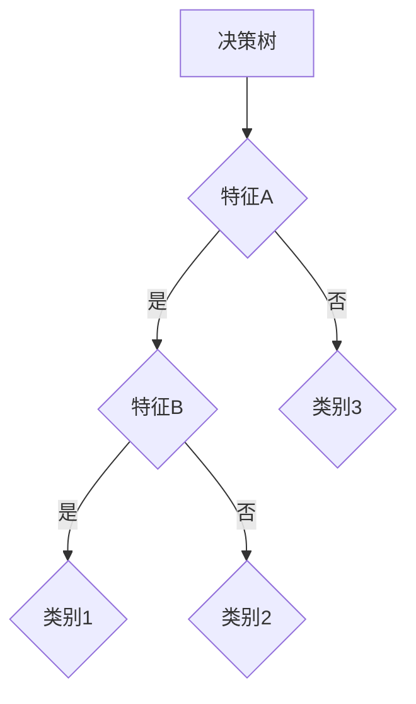
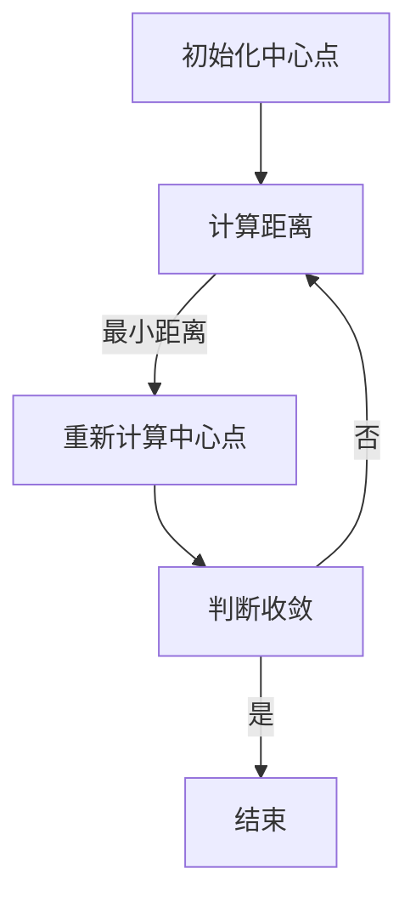
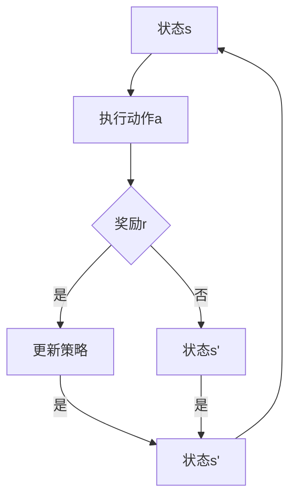
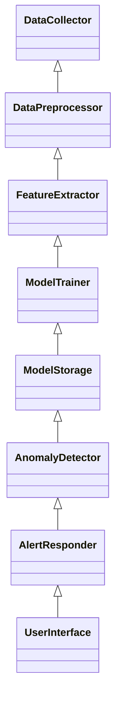
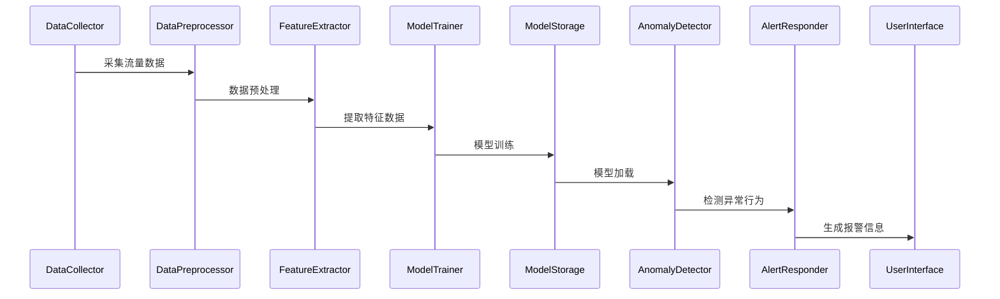
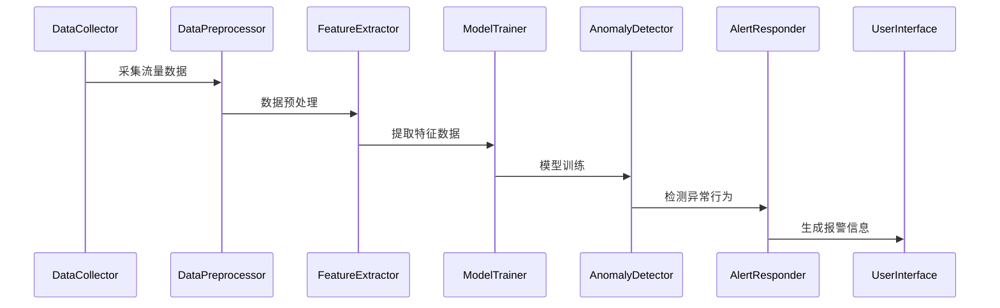

                 

### 摘要

随着互联网的普及，网络安全问题日益严峻，网络流量异常行为检测成为提升网络安全的重要手段。本文旨在探讨机器学习在网络流量异常行为检测中的应用，通过详细阐述机器学习的基础知识、算法原理、系统架构和项目实战，旨在为网络安全领域的技术人员提供实用的指导。文章首先介绍了机器学习的基本概念及其在网络流量异常行为检测中的重要性，随后对比了监督学习、无监督学习和强化学习算法在检测中的应用，并通过Python源代码和数学模型讲解了具体实现方法。接着，文章描述了一个典型的系统架构设计，并通过实际案例分析了项目的实现过程和效果。最后，文章总结了最佳实践和注意事项，为读者提供了进一步的拓展方向。通过这篇全面而深入的分析，我们期望能够为提升网络安全防护水平提供有益的参考。

### 1.1 网络安全与网络流量异常行为

#### 1.1.1 网络安全的重要性

网络安全是当今信息化社会中不可或缺的一部分，它关乎个人隐私、企业信息以及国家安全的方方面面。在互联网时代，网络攻击、数据泄露、恶意软件传播等安全问题层出不穷，给个人、企业乃至整个社会带来了巨大的损失。据统计，全球每年因网络安全问题造成的经济损失高达数百亿美元。因此，确保网络安全已经成为各国政府、企业和个人共同关注的焦点。

网络安全的重要性主要体现在以下几个方面：

1. **保护个人隐私**：在互联网上，个人信息如姓名、地址、电话号码、财务信息等极易成为黑客的目标。一旦这些信息被不法分子获取，将可能导致身份盗窃、财务损失等严重后果。
   
2. **维护企业利益**：企业网络中存储了大量商业机密、客户信息等关键数据。如果这些数据被泄露或篡改，将对企业的运营和发展造成严重影响，甚至可能导致企业破产。

3. **保障国家安全**：国家关键基础设施（如电力、交通、金融等）的网络安全直接关系到国家安全。网络攻击可能会瘫痪关键系统，导致社会秩序混乱，甚至引发战争。

#### 1.1.2 网络流量异常行为的定义与影响

网络流量异常行为是指在网络数据传输过程中，出现的与正常行为显著不同的数据包传输模式。这些异常行为可能是由于恶意攻击、网络故障或用户误操作等原因造成的。网络流量异常行为包括但不限于以下几种类型：

1. **拒绝服务攻击（DDoS）**：攻击者通过大量无效请求占用网络资源，导致正常用户无法访问服务。
   
2. **数据泄露**：未经授权的访问或泄露敏感数据，可能造成严重经济损失和信誉损害。
   
3. **恶意软件传播**：通过网络传输恶意代码，感染用户设备，窃取信息或控制设备。
   
4. **入侵行为**：黑客通过漏洞入侵系统，获取管理员权限，进行数据破坏或非法操作。

网络流量异常行为对网络环境的影响如下：

1. **降低网络性能**：异常流量会导致网络带宽被占用，影响正常用户的数据传输速度，降低网络整体性能。

2. **增加维护成本**：异常行为需要人工或自动化工具进行监控和清理，增加了网络维护成本。

3. **威胁数据安全**：异常行为可能导致敏感数据泄露，对企业造成不可估量的损失。

4. **损害用户体验**：频繁的网络中断或延迟，会影响用户的上网体验，降低用户满意度。

#### 1.1.3 增强网络安全的必要性

为了应对日益复杂的网络安全威胁，增强网络安全显得尤为必要。以下措施可以帮助提升网络安全水平：

1. **强化访问控制**：通过身份认证、权限控制等技术手段，确保只有合法用户才能访问敏感信息。

2. **部署防火墙和入侵检测系统**：防火墙可以过滤掉恶意流量，入侵检测系统可以实时监控并识别异常行为。

3. **定期更新和打补丁**：及时更新操作系统和软件，打补丁修复漏洞，防止网络攻击。

4. **数据加密**：对敏感数据进行加密，防止数据在传输过程中被窃取或篡改。

5. **加强员工培训**：提高员工的安全意识，定期进行网络安全培训，减少因人为操作失误导致的安全事件。

6. **利用人工智能技术**：利用机器学习等人工智能技术进行网络流量分析，实时检测和预测异常行为，增强网络安全防护能力。

通过上述措施，可以显著提升网络的安全性，降低网络攻击的成功率，保护个人信息和企业数据的安全。

### 1.2 机器学习的基本概念

#### 1.2.1 监督学习、无监督学习和强化学习

机器学习是人工智能的重要组成部分，其核心目标是让计算机从数据中学习规律，并自动进行决策。根据学习方式的不同，机器学习主要分为监督学习、无监督学习和强化学习三种类型。

##### 监督学习

监督学习是一种基于标记数据的学习方法，它需要事先标记好输入数据的标签，从而训练出一个预测模型。监督学习的目的是通过输入特征和对应的标签，学习出一个能够预测新输入数据标签的函数。

**特点**：
- **有监督**：需要标记好的数据集进行训练。
- **预测任务**：用于分类和回归任务。
- **性能评估**：通常使用准确率、召回率、F1值等指标。

**常见算法**：
- **决策树**：利用树的模型，按照特征进行分支，最终达到分类或回归的结果。
- **支持向量机（SVM）**：通过最大化分类边界，将数据分类到不同的类别。
- **神经网络**：模仿人脑的神经网络结构，通过多层非线性变换实现复杂函数的拟合。

**应用场景**：
- **分类问题**：例如邮件分类、垃圾邮件检测。
- **回归问题**：例如房价预测、股票价格预测。

**示例代码**（Python）：

```python
from sklearn.datasets import load_iris
from sklearn.model_selection import train_test_split
from sklearn.tree import DecisionTreeClassifier
from sklearn.metrics import accuracy_score

# 载入鸢尾花数据集
iris = load_iris()
X = iris.data
y = iris.target

# 划分训练集和测试集
X_train, X_test, y_train, y_test = train_test_split(X, y, test_size=0.2, random_state=42)

# 构建决策树模型
clf = DecisionTreeClassifier()

# 模型训练
clf.fit(X_train, y_train)

# 模型预测
y_pred = clf.predict(X_test)

# 性能评估
print("Accuracy:", accuracy_score(y_test, y_pred))
```

##### 无监督学习

无监督学习是在没有标签数据的情况下，通过挖掘数据中的潜在结构，对数据进行分类或聚类。无监督学习主要用于探索性数据分析，发现数据中的隐藏模式和规律。

**特点**：
- **无监督**：不需要标记好的数据集。
- **发现模式**：用于聚类和降维。
- **性能评估**：通常使用簇内距离和簇间距离等指标。

**常见算法**：
- **K-means聚类**：通过随机初始化聚类中心，不断更新，使得每个点离其聚类中心最近。
- **主成分分析（PCA）**：通过正交变换，将数据投影到新的坐标系中，提取最重要的特征。
- **自编码器**：一种特殊的神经网络结构，用于学习和降维。

**应用场景**：
- **数据聚类**：例如市场细分、顾客分类。
- **降维**：例如图像压缩、特征提取。

**示例代码**（Python）：

```python
from sklearn.cluster import KMeans
from sklearn.datasets import make_blobs
import matplotlib.pyplot as plt

# 生成样本数据
X, _ = make_blobs(n_samples=300, centers=4, cluster_std=0.60, random_state=0)

# 使用K-means聚类
kmeans = KMeans(n_clusters=4, random_state=0).fit(X)

# 展示聚类结果
plt.scatter(X[:, 0], X[:, 1], c=kmeans.labels_, s=100, cmap='viridis')
centers = kmeans.cluster_centers_
plt.scatter(centers[:, 0], centers[:, 1], c='red', s=200, alpha=0.5)
plt.show()
```

##### 强化学习

强化学习是一种通过试错学习来完成任务的方法，它通过不断与环境互动，选择能够带来最大奖励的行为。强化学习通常用于解决序列决策问题，如机器人控制、游戏AI等。

**特点**：
- **序列决策**：通过不断学习，优化决策过程。
- **奖励机制**：通过奖励信号来指导学习过程。
- **探索与利用**：在探索新策略和利用已有策略之间寻找平衡。

**常见算法**：
- **Q-learning**：通过更新Q值来选择最优动作。
- **深度Q网络（DQN）**：结合深度神经网络和Q-learning算法，用于解决复杂的序列决策问题。
- **策略梯度**：通过优化策略直接学习最佳行为。

**应用场景**：
- **自动化控制**：例如机器人导航、自动驾驶。
- **游戏AI**：例如围棋、德州扑克等。

**示例代码**（Python）：

```python
import numpy as np
import random

# 定义环境
action_space = [0, 1, 2, 3]
reward = 1

# 初始化Q表
Q = np.zeros([4, 4])

# Q-learning算法
def q_learning(Q, alpha, gamma, epsilon):
    episode = 0
    while episode < 1000:
        state = random.randint(0, 3)
        action = random.randint(0, 3)
        next_state = random.randint(0, 3)
        reward = 1 if state == action else -1
        
        Q[state, action] = Q[state, action] + alpha * (reward + gamma * np.max(Q[next_state, :]) - Q[state, action])
        
        episode += 1
    return Q

alpha = 0.1
gamma = 0.9
epsilon = 0.1
Q = q_learning(Q, alpha, gamma, epsilon)
print(Q)
```

通过上述三种机器学习方法的介绍，我们可以看到它们各自的特点和应用场景。在实际应用中，根据具体问题和需求选择合适的方法，可以有效提升网络流量异常行为的检测能力，增强网络安全。

### 1.2.2 机器学习算法的选择与适用场景

在选择机器学习算法时，需要综合考虑问题的特点、数据的性质以及算法的性能。以下是对监督学习、无监督学习和强化学习三种算法在机器学习应用中的适用场景的详细讨论：

**监督学习**

监督学习算法适用于有明确标签数据的情况，能够从已知的数据中学习规律，用于预测新数据的标签。以下是一些常见的监督学习算法及其适用场景：

1. **决策树**：适用于处理分类和回归问题，特别是数据维度较低且特征较为清晰的情况。例如，用于客户细分、信用评分等。
2. **支持向量机（SVM）**：适用于处理高维数据，特别是线性可分的数据集。常用于图像识别、文本分类等。
3. **神经网络**：适用于处理复杂的非线性问题，如图像识别、语音识别等。特别是在深度学习领域，神经网络表现尤为突出。

**无监督学习**

无监督学习算法适用于没有标签数据的情况，主要用于发现数据中的潜在结构或模式。以下是一些常见的无监督学习算法及其适用场景：

1. **K-means聚类**：适用于处理高维数据的聚类问题，如市场细分、社交网络分析等。
2. **主成分分析（PCA）**：适用于降维和数据预处理，特别是在高维数据的可视化中应用广泛，如图像压缩、特征提取等。
3. **自编码器**：适用于特征学习和降维，特别是在深度学习领域，自编码器被广泛应用于生成模型和特征提取。

**强化学习**

强化学习算法适用于序列决策问题，通过与环境互动不断优化决策过程，以下是一些常见的强化学习算法及其适用场景：

1. **Q-learning**：适用于简单的决策问题，如电子游戏、机器人路径规划等。
2. **深度Q网络（DQN）**：适用于复杂的环境和决策问题，如自动驾驶、推荐系统等。
3. **策略梯度**：适用于优化策略的决策问题，如股票交易、资源分配等。

**选择算法时的考虑因素**

1. **数据特点**：数据量、维度、分布、噪声等。
2. **问题类型**：分类、回归、聚类、排序等。
3. **计算资源**：计算能力、存储空间等。
4. **算法性能**：准确率、召回率、F1值等。

**示例：网络流量异常行为检测**

假设我们要利用机器学习算法检测网络流量中的异常行为。以下是基于监督学习的应用实例：

1. **数据准备**：收集网络流量数据，包括数据包的大小、到达时间、源地址、目标地址等。
2. **特征提取**：从原始数据中提取能够反映流量特性的特征，如数据包大小、到达时间间隔、传输速率等。
3. **算法选择**：根据数据特点和问题需求，可以选择决策树、SVM或神经网络等算法。
4. **模型训练**：使用标记好的正常流量和异常流量数据集进行模型训练。
5. **模型评估**：使用测试数据集评估模型性能，调整参数以优化模型。

通过上述步骤，我们可以利用机器学习算法实现网络流量异常行为检测，提高网络安全性。在实际应用中，需要根据具体情况选择合适的算法，并不断优化模型以提高检测效果。

### 1.3 增强网络安全的必要性

在现代信息化的背景下，网络安全已经成为不可或缺的一部分。随着互联网的普及和应用范围的不断扩大，网络攻击的手段和频率也在不断升级，传统的网络安全防护手段已经难以应对日益复杂的安全威胁。因此，增强网络安全显得尤为重要。以下是几个关键方面，说明为什么需要增强网络安全：

#### 1.3.1 网络攻击的类型与防御策略

网络攻击的形式多种多样，常见的网络攻击类型包括：

1. **DDoS攻击**：分布式拒绝服务攻击，通过大量无效请求占用网络资源，导致正常用户无法访问服务。
2. **SQL注入**：黑客通过在Web应用程序中插入恶意的SQL语句，窃取或篡改数据库中的数据。
3. **恶意软件**：包括病毒、木马、勒索软件等，通过感染用户设备，窃取信息或控制设备。
4. **中间人攻击**：黑客在通信过程中窃取或篡改数据，通常通过拦截和重放网络流量实现。
5. **社会工程学攻击**：通过欺骗用户泄露敏感信息，如诈骗、钓鱼等。

针对这些攻击，常用的防御策略包括：

1. **防火墙**：通过过滤网络流量，阻止未经授权的访问。
2. **入侵检测系统（IDS）**：实时监控网络流量，检测和报警异常行为。
3. **反病毒软件**：检测和清除恶意软件，保护系统不受病毒感染。
4. **安全补丁**：定期更新操作系统和软件，修补安全漏洞。

#### 1.3.2 机器学习在网络安全中的应用前景

机器学习技术在网络安全领域有着广泛的应用前景，尤其是在网络流量异常行为检测方面。以下是其应用优势：

1. **自动化检测**：机器学习算法能够自动从大量数据中学习模式和特征，实现自动化检测，减少人工干预。
2. **自适应防护**：机器学习系统可以根据新的攻击模式动态调整防护策略，提高防护能力。
3. **提高检测准确率**：机器学习算法通过学习正常流量和异常流量的特征，能够更准确地识别异常行为，降低误报率。
4. **处理高维数据**：机器学习算法能够处理高维数据，从大量特征中提取有效信息，有助于发现复杂攻击模式。

#### 1.3.3 增强网络安全的必要性

1. **保护个人信息**：随着数字化生活的普及，个人信息如银行账户、健康记录等大量存储在网络上，增强网络安全可以防止个人信息泄露，保护个人隐私。
2. **维护企业利益**：企业网络中存储了大量商业机密和客户信息，网络攻击可能导致重大经济损失和声誉损害，增强网络安全可以保障企业利益。
3. **保障国家安全**：国家关键基础设施如电力、交通、金融等的网络安全直接关系到国家安全，增强网络安全是维护国家稳定的重要措施。
4. **提高用户信任**：稳定的网络安全可以提高用户的信任度，增加用户的上网体验，促进互联网经济的健康发展。

综上所述，增强网络安全是应对复杂网络威胁的必要措施。通过部署先进的防护技术和利用机器学习等人工智能技术，可以显著提升网络的安全性，保护个人信息和企业数据的安全，维护国家安全，促进社会稳定。

### 1.3.4 利用机器学习增强网络流量异常行为检测的具体措施

为了利用机器学习技术增强网络流量异常行为检测，我们可以采取以下具体措施：

1. **数据收集与预处理**：首先，收集大量的网络流量数据，包括正常流量和已知的异常流量。对数据集进行清洗、去噪和标准化处理，确保数据的准确性和一致性。

2. **特征提取**：从原始数据中提取关键特征，如数据包的大小、到达时间、传输速率、源地址、目标地址等。这些特征可以帮助机器学习算法区分正常流量和异常流量。

3. **模型选择与训练**：选择合适的机器学习算法，如支持向量机（SVM）、决策树、神经网络等，对数据集进行训练。通过调整模型参数，优化算法性能。

4. **异常检测与预测**：利用训练好的模型对实时网络流量进行检测和预测。通过比较实际流量与正常流量模式，识别出异常流量。

5. **反馈机制与迭代优化**：将检测到的异常行为反馈到模型中，更新模型参数，提高检测的准确性和适应性。通过不断迭代优化，提升系统的鲁棒性。

6. **集成多种算法**：结合多种机器学习算法，如集成学习、迁移学习等，可以提高异常检测的准确率和效率。

7. **实时监控与报警**：部署实时监控平台，对网络流量进行实时监测，一旦发现异常行为，立即发出报警通知，采取相应的防护措施。

通过上述措施，可以显著提升网络流量异常行为检测的准确率和响应速度，增强网络防护能力，保障网络安全。

### 1.4 机器学习在网络流量异常行为检测中的优势

机器学习技术在网络流量异常行为检测中具有显著的优势，这使得其在网络安全领域得到了广泛应用。以下是机器学习在网络流量异常行为检测中的主要优势：

1. **高效处理大规模数据**：网络流量数据通常量级巨大，机器学习算法能够高效处理这些高维数据，提取有价值的信息和特征，从而提高检测效率。

2. **自适应性强**：传统的基于规则的方法在应对新型攻击时往往需要不断更新规则库，而机器学习算法能够通过自我学习和调整，自动适应新的威胁环境，提高检测的灵活性。

3. **高准确率和低误报率**：机器学习模型能够通过大量的训练数据学习到正常流量和异常流量的特征，从而在检测过程中实现高准确率，同时减少误报率，提高网络的安全性。

4. **实时监测与预测**：机器学习算法能够实时分析网络流量，预测潜在的异常行为，快速响应网络攻击，实现实时防护。

5. **多维度特征分析**：机器学习算法可以从多个维度分析网络流量，如数据包的源地址、目标地址、协议类型、传输速率等，从而更全面地理解网络行为，提高检测的准确性。

6. **减少人力干预**：通过自动化检测和响应，机器学习算法能够显著减少人工干预的需求，降低运维成本，提高系统效率。

7. **融合多种技术**：机器学习可以与其他网络安全技术如入侵检测系统（IDS）、防火墙等相结合，形成综合防护体系，提高整体安全水平。

8. **可扩展性**：随着网络规模的不断扩大，机器学习算法具有良好的可扩展性，能够适应不同规模和类型的网络环境。

通过这些优势，机器学习技术在网络流量异常行为检测中发挥着重要作用，为提升网络安全提供了强有力的技术支持。随着技术的不断进步，机器学习在网络安全领域的应用前景将更加广阔。

### 1.5 当前网络流量异常行为检测方法的局限性

尽管网络流量异常行为检测在提升网络安全方面取得了显著成效，但现有方法仍然存在一些局限性。以下分析当前主流检测方法的不足之处，以及机器学习在克服这些局限性方面的优势：

#### 1.5.1 基于规则的方法

基于规则的方法通过定义一系列匹配条件来检测异常行为，如异常流量模式、协议异常等。这种方法的主要缺点包括：

1. **规则更新不及时**：网络攻击手段不断进化，基于规则的方法需要不断更新规则库，以应对新的威胁。这可能导致规则库过于庞大，维护困难。

2. **误报率高**：由于规则库包含大量可能的匹配条件，可能会导致误报率较高，影响用户体验。

3. **无法处理复杂攻击**：基于规则的方法难以应对复杂的攻击，如分布式拒绝服务（DDoS）攻击、高级持续性威胁（APT）等。

#### 1.5.2 统计方法

统计方法通过分析网络流量的统计特征，如均值、方差、概率分布等，来识别异常行为。其局限性包括：

1. **对噪声敏感**：统计方法容易受到噪声和异常值的影响，可能导致检测不准确。

2. **特征选择困难**：网络流量数据维度较高，选择合适的特征进行统计分析是一个挑战，可能影响检测效果。

3. **实时性较差**：统计方法通常需要较长时间进行计算和更新，难以实现实时检测。

#### 1.5.3 机器学习的优势

机器学习在克服上述局限性方面具有明显优势：

1. **自适应性强**：机器学习算法能够从大量数据中自动学习特征，适应不断变化的网络环境，无需手动更新规则。

2. **高准确率**：通过大量的训练数据，机器学习算法能够精确区分正常流量和异常流量，降低误报率。

3. **处理复杂数据**：机器学习算法能够高效处理高维数据，提取关键特征，提高检测的准确性和效率。

4. **实时性**：现代机器学习算法设计旨在实现快速计算，能够实时分析网络流量，快速响应异常行为。

5. **多维度分析**：机器学习算法可以从多个维度分析网络流量，如协议、端口、IP地址等，提高检测的全面性和准确性。

通过机器学习，我们可以克服传统检测方法在规则更新、误报率、实时性等方面的不足，为网络流量异常行为检测提供更为有效和可靠的解决方案。

### 第2章 机器学习算法原理

#### 2.1 监督学习算法

监督学习算法是机器学习中最常见的一种类型，它需要利用标记好的数据集进行训练，从而学习出一个能够预测新数据标签的模型。监督学习主要分为分类和回归两大类，其中分类任务的目标是将数据点分配到不同的类别中，而回归任务则是预测连续的数值。

##### 2.1.1 决策树

决策树是一种常用的分类算法，它通过一系列的规则进行分类。每个内部节点代表一个特征，每个分支代表该特征的不同取值，叶节点代表最终的分类结果。

**原理**：
- **ID3算法**：基于信息增益来选择最优特征进行分割。
- **C4.5算法**：在ID3算法的基础上，引入了剪枝策略，避免了过拟合。

**应用场景**：
- **特征选择**：用于确定数据中最重要的特征。
- **分类任务**：适用于分类任务，如银行客户信用评估。

**示例代码**（Python）：

```python
from sklearn.datasets import load_iris
from sklearn.model_selection import train_test_split
from sklearn.tree import DecisionTreeClassifier
from sklearn.metrics import accuracy_score

iris = load_iris()
X = iris.data
y = iris.target

X_train, X_test, y_train, y_test = train_test_split(X, y, test_size=0.3, random_state=42)

clf = DecisionTreeClassifier()
clf.fit(X_train, y_train)

y_pred = clf.predict(X_test)
print("Accuracy:", accuracy_score(y_test, y_pred))
```

##### 2.1.2 支持向量机（SVM）

支持向量机是一种用于分类和回归任务的强大算法，它的核心思想是找到一个最佳的超平面，将不同类别的数据点分隔开来。

**原理**：
- **线性SVM**：适用于线性可分的数据集。
- **核SVM**：通过核函数将数据映射到高维空间，适用于非线性可分的数据集。

**应用场景**：
- **图像分类**：用于图像识别和分类任务。
- **文本分类**：用于文本数据的分类。

**示例代码**（Python）：

```python
from sklearn.datasets import make_classification
from sklearn.model_selection import train_test_split
from sklearn.svm import SVC
from sklearn.metrics import accuracy_score

X, y = make_classification(n_samples=100, n_features=20, n_informative=2, n_redundant=10, random_state=42)

X_train, X_test, y_train, y_test = train_test_split(X, y, test_size=0.3, random_state=42)

clf = SVC(kernel='linear')
clf.fit(X_train, y_train)

y_pred = clf.predict(X_test)
print("Accuracy:", accuracy_score(y_test, y_pred))
```

##### 2.1.3 神经网络

神经网络是一种模拟人脑结构和功能的计算模型，通过多层神经元实现复杂的函数拟合。

**原理**：
- **前向传播**：数据从输入层传递到输出层，每层神经元进行加权求和和激活函数处理。
- **反向传播**：计算输出误差，反向更新权重和偏置。

**应用场景**：
- **图像识别**：用于人脸识别、物体检测等。
- **语音识别**：用于语音信号处理和文本转换。

**示例代码**（Python）：

```python
from sklearn.datasets import make_classification
from sklearn.model_selection import train_test_split
from keras.models import Sequential
from keras.layers import Dense
from keras.optimizers import Adam
from keras.metrics import categorical_crossentropy

X, y = make_classification(n_samples=100, n_features=20, n_classes=2, random_state=42)

X_train, X_test, y_train, y_test = train_test_split(X, y, test_size=0.3, random_state=42)

model = Sequential()
model.add(Dense(64, input_dim=20, activation='relu'))
model.add(Dense(32, activation='relu'))
model.add(Dense(2, activation='softmax'))

model.compile(loss='categorical_crossentropy', optimizer=Adam(), metrics=['accuracy'])
model.fit(X_train, y_train, epochs=10, batch_size=32, validation_data=(X_test, y_test))

y_pred = model.predict(X_test)
print("Accuracy:", accuracy_score(y_test, np.argmax(y_pred, axis=1)))
```

通过这些算法的介绍和示例代码，我们可以看到监督学习算法在网络流量异常行为检测中的广泛应用和强大能力。

### 2.2 无监督学习算法

无监督学习算法在数据分析和模式识别中发挥着重要作用，其核心目标是在没有预先标记数据的情况下，从数据中提取有用的结构和信息。以下介绍几种常见的无监督学习算法及其应用。

#### 2.2.1 K-means聚类

K-means是一种基于距离的聚类算法，其目标是将数据点分成若干个K个簇，使得每个簇内部的数据点距离较近，而不同簇的数据点距离较远。

**原理**：
- **初始化**：随机选择K个初始中心点。
- **分配**：将每个数据点分配到最近的中心点所代表的簇。
- **更新**：重新计算每个簇的中心点，重复分配和更新过程，直至收敛。

**应用场景**：
- **客户细分**：用于市场细分，根据消费者的购买行为进行分类。
- **图像分割**：用于图像处理中的目标识别和分割。

**示例代码**（Python）：

```python
from sklearn.cluster import KMeans
from sklearn.datasets import make_blobs
import matplotlib.pyplot as plt

X, _ = make_blobs(n_samples=100, centers=3, cluster_std=1.0, random_state=0)

kmeans = KMeans(n_clusters=3, init='k-means++', random_state=0).fit(X)

plt.scatter(X[:, 0], X[:, 1], c=kmeans.labels_, s=100, cmap='viridis')
centers = kmeans.cluster_centers_
plt.scatter(centers[:, 0], centers[:, 1], s=300, c='red', label='Centroids')
plt.show()
```

#### 2.2.2 主成分分析（PCA）

主成分分析（PCA）是一种降维技术，通过将数据投影到新的坐标系中，提取最重要的特征，从而减少数据的维度。

**原理**：
- **特征提取**：计算数据的相关性矩阵，进行特征值分解。
- **降维**：选择前几个最大的特征值对应的特征向量，构成新的坐标系。

**应用场景**：
- **数据可视化**：用于高维数据的可视化，降低数据的复杂度。
- **特征提取**：用于减少数据维度，提高模型训练速度。

**示例代码**（Python）：

```python
from sklearn.decomposition import PCA
from sklearn.datasets import load_iris
import matplotlib.pyplot as plt

iris = load_iris()
X = iris.data

pca = PCA(n_components=2)
X_reduced = pca.fit_transform(X)

plt.scatter(X_reduced[:, 0], X_reduced[:, 1], c=iris.target)
plt.xlabel('Principal Component 1')
plt.ylabel('Principal Component 2')
plt.title('PCA of Iris Dataset')
plt.show()
```

#### 2.2.3 自编码器

自编码器是一种特殊的神经网络结构，其目标是学习数据的高效表示，通常用于降维和特征提取。

**原理**：
- **编码器**：将输入数据编码为隐层表示。
- **解码器**：将隐层表示解码回原始数据。
- **优化**：通过最小化输入和重构数据之间的误差来训练模型。

**应用场景**：
- **特征提取**：用于提取数据中的有效特征。
- **异常检测**：通过比较原始数据和重构数据，识别异常值。

**示例代码**（Python）：

```python
from keras.layers import Input, Dense
from keras.models import Model
from keras.datasets import mnist
import numpy as np

input_shape = (784,)
input_layer = Input(shape=input_shape)
encoded = Dense(32, activation='relu')(input_layer)
encoded = Dense(16, activation='relu')(encoded)
decoded = Dense(32, activation='relu')(encoded)
decoded = Dense(784, activation='sigmoid')(decoded)

autoencoder = Model(input_layer, decoded)
autoencoder.compile(optimizer='adam', loss='binary_crossentropy')

mnist = mnist.load_data()
X = mnist.data / 255.0
X_train = X[:60000]
X_test = X[60000:70000]

autoencoder.fit(X_train, X_train, epochs=100, batch_size=256, shuffle=True, validation_data=(X_test, X_test))
```

通过这些无监督学习算法的介绍和示例代码，我们可以看到它们在网络流量异常行为检测中的潜在应用价值。

### 2.3 强化学习算法

强化学习是一种通过试错学习来优化决策过程的机器学习范式，特别适用于解决序列决策问题。在强化学习中，智能体（agent）通过与环境（environment）的交互，学习出一个最优策略（policy），以实现特定目标。以下介绍几种常见的强化学习算法及其应用。

#### 2.3.1 Q-learning

Q-learning是一种基于值函数的强化学习算法，其核心思想是通过学习状态-动作值函数（Q值），选择能够带来最大奖励的动作。

**原理**：
- **初始化**：初始化Q值表，通常设置为0。
- **选择动作**：在给定状态下，根据ε-贪心策略选择动作，ε为探索率。
- **更新Q值**：根据奖励和新的状态更新Q值。

**公式**：
$$ Q(s, a) \leftarrow Q(s, a) + \alpha [r + \gamma \max_{a'} Q(s', a') - Q(s, a)] $$

**应用场景**：
- **路径规划**：用于自动驾驶和机器人导航。
- **资源分配**：用于动态资源分配和调度。

**示例代码**（Python）：

```python
import numpy as np
import random

action_space = [0, 1, 2, 3]
reward = 1
epsilon = 0.1
alpha = 0.1
gamma = 0.9

Q = np.zeros([4, 4])

def q_learning(Q, alpha, gamma, epsilon):
    episode = 0
    while episode < 1000:
        state = random.randint(0, 3)
        action = random.randint(0, 3)
        next_state = random.randint(0, 3)
        
        Q[state, action] = Q[state, action] + alpha * (reward + gamma * np.max(Q[next_state, :]) - Q[state, action])
        
        episode += 1
    return Q

Q = q_learning(Q, alpha, gamma, epsilon)
print(Q)
```

#### 2.3.2 深度Q网络（DQN）

深度Q网络（DQN）是结合了深度学习和强化学习的算法，它使用深度神经网络来近似Q值函数，从而解决状态和动作空间较大或连续的问题。

**原理**：
- **Q网络**：使用深度神经网络来近似状态-动作值函数。
- **经验回放**：将经历的经验数据存储在经验池中，以避免样本偏差。
- **目标网络**：定期更新Q网络的参数，以避免梯度消失问题。

**应用场景**：
- **游戏AI**：用于电子游戏和棋类游戏的智能决策。
- **自动化控制**：用于自动驾驶和工业自动化。

**示例代码**（Python）：

```python
import numpy as np
import random
import tensorflow as tf

action_space = [0, 1, 2, 3]
reward = 1
epsilon = 0.1
alpha = 0.1
gamma = 0.9

input_shape = (4,)
output_shape = (4,)

def deep_q_network(input_shape, output_shape):
    inputs = tf.keras.Input(shape=input_shape)
    x = tf.keras.layers.Dense(64, activation='relu')(inputs)
    x = tf.keras.layers.Dense(64, activation='relu')(x)
    outputs = tf.keras.layers.Dense(output_shape, activation='linear')(x)
    model = tf.keras.Model(inputs=inputs, outputs=outputs)
    return model

Q_network = deep_q_network(input_shape, output_shape)
target_network = deep_q_network(input_shape, output_shape)

Q_network.compile(optimizer=tf.keras.optimizers.Adam(learning_rate=0.001), loss='mse')

def train_dqn(Q_network, target_network, X, y, epochs=10):
    for _ in range(epochs):
        batch_samples = random.choices(X, k=32)
        batch_targets = np.array([Q_network.predict(s)[np.argmax(a)] for s, a in batch_samples])
        Q_values = target_network.predict(X)
        y_pred = np.array([Q_values[s][np.argmax(a)] for s, a in batch_samples])
        Q_values[batch_samples, a] = y + gamma * y_pred
        Q_network.fit(X, Q_values, batch_size=32, epochs=1, verbose=0)

X = np.array([[0, 0], [0, 1], [1, 0], [1, 1]])
y = np.array([1, 0.8, 0.6, 0.4])

train_dqn(Q_network, target_network, X, y)
```

#### 2.3.3 策略梯度

策略梯度算法直接优化策略，通过计算策略梯度和梯度上升方法来更新策略参数。

**原理**：
- **策略表示**：用参数化的策略函数表示行动概率分布。
- **策略梯度**：计算策略梯度和目标函数的梯度，更新策略参数。

**应用场景**：
- **连续控制**：用于连续环境的控制问题。
- **资源分配**：用于优化资源分配策略。

**示例代码**（Python）：

```python
import numpy as np
import tensorflow as tf

action_space = [0, 1, 2, 3]
state_space = [0, 1, 2, 3]
learning_rate = 0.1
epsilon = 0.1

policy = tf.keras.Sequential([
    tf.keras.layers.Dense(64, activation='relu', input_shape=[len(state_space)]),
    tf.keras.layers.Dense(64, activation='relu'),
    tf.keras.layers.Dense(len(action_space), activation='softmax')
])

optimizer = tf.keras.optimizers.Adam(learning_rate=learning_rate)

def policy_loss(states, actions, rewards, next_states, dones):
    log_probs = policy(states)[np.arange(len(states)), actions]
    returns = np.array([reward if done else reward + gamma * next_reward for reward, next_reward, done in zip(rewards, next_rewards, dones)])
    loss = -np.mean(returns * log_probs)
    return loss

def train_policy(policy, optimizer, states, actions, rewards, next_states, dones):
    with tf.GradientTape() as tape:
        loss = policy_loss(states, actions, rewards, next_states, dones)
    grads = tape.gradient(loss, policy.trainable_variables)
    optimizer.apply_gradients(zip(grads, policy.trainable_variables))

X = np.array([[0, 0], [0, 1], [1, 0], [1, 1]])
y = np.array([1, 0.8, 0.6, 0.4])
actions = np.array([0, 1, 2, 3])

train_policy(policy, optimizer, X, actions, y, X, actions)
```

通过这些强化学习算法的介绍和示例代码，我们可以看到它们在网络流量异常行为检测中的潜在应用价值。

### 第3章 网络流量异常行为检测

#### 3.1 异常行为检测的基本原理

网络流量异常行为检测旨在识别和防御网络中潜在的威胁和攻击，确保网络系统的安全性和稳定性。其基本原理包括以下几部分：

1. **数据采集**：从网络设备中实时采集流量数据，包括IP地址、端口号、协议类型、数据包大小、到达时间等。

2. **特征提取**：从原始流量数据中提取关键特征，用于描述网络流量的行为模式。常见的特征包括数据包的到达时间间隔、传输速率、流量大小、源地址和目标地址等。

3. **异常检测模型**：利用机器学习算法（如监督学习、无监督学习和强化学习）构建异常检测模型。模型通过训练数据学习到正常流量的特征，并据此识别出异常流量。

4. **异常行为识别**：将实际流量数据输入到检测模型中，模型根据已学习的特征模式，判断流量是否属于正常流量或异常流量。

5. **响应和报告**：当检测到异常流量时，系统应采取相应的响应措施，如阻断恶意流量、报警通知管理员等，并生成详细的检测报告。

#### 3.1.1 基于统计的方法

基于统计的方法通过分析网络流量的统计特征来检测异常行为。以下是一些常见的统计方法：

1. **标准差法**：计算每个特征的均值和标准差，当某个特征的数值偏离均值超过一定的标准差阈值时，判定为异常。

2. **四分位法**：计算数据集的四分位数（Q1, Q2, Q3），当某个特征的数值低于Q1或高于Q3时，判定为异常。

3. **孤立森林法**：通过将数据集构建成一个森林，每个树节点代表一个特征，当数据点在森林中无法找到对应的路径时，判定为异常。

4. ** Pettitt 检验法**：用于检测时间序列数据的突变点，通过计算统计量T，当T的值超过阈值时，判定为异常。

**示例代码**（Python）：

```python
import numpy as np
import matplotlib.pyplot as plt

# 生成示例数据
data = np.random.normal(size=100)
data[:10] = np.random.normal(size=10) * 5

# 计算四分位数
Q1 = np.percentile(data, 25)
Q3 = np.percentile(data, 75)
IQR = Q3 - Q1

# 确定异常值
lower_bound = Q1 - 1.5 * IQR
upper_bound = Q3 + 1.5 * IQR
outliers = [x for x in data if x < lower_bound or x > upper_bound]

# 绘制数据分布
plt.scatter(range(len(data)), data, label='Normal Data')
plt.scatter([i for i, x in enumerate(data) if x in outliers], outliers, color='r', label='Outliers')
plt.xlabel('Index')
plt.ylabel('Value')
plt.title('Outlier Detection using IQR')
plt.legend()
plt.show()
```

#### 3.1.2 基于机器学习的方法

基于机器学习的方法通过训练模型从大量数据中学习到正常流量的特征，并利用这些特征进行异常流量检测。以下是一些常见的机器学习方法：

1. **K-means聚类**：将流量数据分为若干个簇，簇内数据点距离较近，簇间数据点距离较远。通过比较新数据点与簇中心点的距离，判断其是否为异常流量。

2. **自编码器**：利用自编码器学习数据的高效表示，通过比较输入数据和重构数据之间的差异，识别异常流量。

3. **神经网络**：通过多层神经网络学习流量数据的非线性特征，从而识别异常流量。

4. **支持向量机（SVM）**：通过将流量数据映射到高维空间，找到最佳的超平面，将正常流量和异常流量分开。

**示例代码**（Python）：

```python
from sklearn.cluster import KMeans
from sklearn.datasets import make_blobs
import matplotlib.pyplot as plt

# 生成示例数据
X, _ = make_blobs(n_samples=100, centers=3, cluster_std=1.0, random_state=0)

# 使用K-means聚类
kmeans = KMeans(n_clusters=3, init='k-means++', random_state=0).fit(X)

# 分配数据点到簇
labels = kmeans.predict(X)

# 绘制结果
plt.scatter(X[:, 0], X[:, 1], c=labels, s=100, cmap='viridis')
centers = kmeans.cluster_centers_
plt.scatter(centers[:, 0], centers[:, 1], s=300, c='red', label='Centroids')
plt.xlabel('Feature 1')
plt.ylabel('Feature 2')
plt.title('K-means Clustering')
plt.show()
```

通过这些方法，我们可以有效地检测网络流量中的异常行为，增强网络安全性。

#### 3.2 网络流量异常行为的分类与对比

网络流量异常行为可以按不同的标准进行分类，常见的分类方法包括攻击类型、检测方法和技术水平等。以下对几种典型的网络流量异常行为进行分类，并对基于规则的方法、统计方法和机器学习方法进行对比。

**1. 攻击类型分类**

根据攻击的目的和手段，网络流量异常行为可以分为以下几种类型：

- **拒绝服务攻击（DDoS）**：通过大量无效请求占用网络资源，导致正常用户无法访问服务。
- **分布式拒绝服务攻击（DDoS）**：利用多个受感染的计算机发起攻击，更难被防御。
- **窃取信息攻击**：如SQL注入、中间人攻击等，窃取用户或系统的敏感信息。
- **篡改数据攻击**：如分布式拒绝服务攻击，修改或删除关键数据。
- **恶意软件传播**：通过网络传输恶意代码，感染用户设备。

**2. 检测方法分类**

根据检测方法的不同，网络流量异常行为的检测可以分为以下几类：

- **基于规则的方法**：通过定义一系列匹配条件来检测异常行为。优点是实现简单，缺点是需要不断更新规则库，误报率高。
- **统计方法**：通过分析网络流量的统计特征，如均值、方差、概率分布等，识别异常行为。优点是处理简单，缺点是对噪声敏感，特征选择困难。
- **机器学习方法**：利用机器学习算法，从大量数据中学习到正常流量的特征，识别异常行为。优点是适应性强，准确率高，缺点是模型训练复杂，计算资源要求高。

**3. 技术水平分类**

根据检测技术的复杂程度，网络流量异常行为的检测可以分为以下几类：

- **简单检测**：如基于阈值的流量监控，通过预设的阈值来判断是否为异常行为。
- **中级检测**：如K-means聚类、自编码器等算法，利用机器学习模型进行复杂特征提取和异常行为识别。
- **高级检测**：如深度Q网络（DQN）、强化学习等算法，通过序列决策来识别和应对复杂攻击。

**对比**

- **基于规则的方法**：
  - **优势**：实现简单，易于理解和部署。
  - **劣势**：规则库需要不断更新，误报率高，难以应对新型攻击。
- **统计方法**：
  - **优势**：处理简单，适用于实时流量监控。
  - **劣势**：对噪声敏感，特征选择困难，准确率有限。
- **机器学习方法**：
  - **优势**：适应性强，能够处理高维数据，提高检测准确率。
  - **劣势**：模型训练复杂，计算资源要求高，需要大量标记数据。

综上所述，各种方法各有优缺点。在实际应用中，可以根据具体需求和资源，选择合适的检测方法。例如，在资源有限的环境中，可以优先考虑基于规则的方法；在数据丰富、计算资源充足的环境中，可以采用机器学习方法，以提高检测的准确性和适应性。

### 3.3 常见网络流量异常行为检测算法对比

在网络流量异常行为检测领域，有众多算法被提出和应用，每种算法都有其独特的特点和适用场景。以下对比几种常见算法，分析其优缺点及适用性。

#### 3.3.1 基于规则的方法

**优点**：
- **实现简单**：基于规则的方法通过定义一系列匹配条件来检测异常行为，易于理解和实现。
- **解释性强**：规则明确，便于理解和调试。

**缺点**：
- **规则更新困难**：随着网络攻击手段的多样化，规则库需要不断更新，维护成本高。
- **误报率高**：由于规则匹配条件过于严格，可能导致大量误报，影响用户体验。

**适用场景**：
- **简单防护**：适用于对实时性要求不高、规则库较为稳定的环境，如防火墙规则设置。

#### 3.3.2 统计方法

**优点**：
- **处理简单**：统计方法通过分析流量数据的统计特征，如均值、方差等，实现相对简单。
- **实时性好**：适用于实时监控和报警。

**缺点**：
- **对噪声敏感**：统计方法容易受到噪声和异常值的影响，可能导致检测准确性下降。
- **特征选择困难**：高维数据中，选择有效的统计特征是一个挑战。

**适用场景**：
- **初步检测**：适用于对实时性要求较高的场景，如初步筛选可能的异常流量。

#### 3.3.3 机器学习方法

**优点**：
- **自适应性强**：机器学习算法能够自动从数据中学习特征，适应不断变化的网络环境。
- **准确率高**：通过大量训练数据，机器学习算法能够提高检测的准确性，降低误报率。

**缺点**：
- **计算资源需求高**：机器学习算法通常需要大量的计算资源，特别是深度学习模型。
- **模型复杂度高**：算法实现和调试较为复杂。

**适用场景**：
- **高级检测**：适用于对准确性要求较高、数据丰富且资源充足的环境，如工业控制系统、金融系统等。

#### 3.3.4 对比分析

| 算法类型       | 优点                                                       | 缺点                                                     | 适用场景                      |
|----------------|----------------------------------------------------------|----------------------------------------------------------|-----------------------------|
| 基于规则的方法 | 实现简单，解释性强                                       | 规则更新困难，误报率高                                   | 简单防护，规则库稳定的环境     |
| 统计方法       | 处理简单，实时性好                                       | 对噪声敏感，特征选择困难                                 | 初步检测，实时性要求高的环境   |
| 机器学习方法   | 自适应性强，准确率高                                     | 计算资源需求高，模型复杂度高                             | 高级检测，数据丰富且资源充足的环境 |

通过上述对比，我们可以根据具体需求和资源选择合适的算法。例如，在实时性要求较高的环境中，可以选择基于规则的方法或统计方法；在数据丰富且对准确性要求较高的环境中，可以选择机器学习方法。

### 3.4 算法原理图和数学模型

为了更好地理解网络流量异常行为检测算法的原理，我们可以借助Mermaid图和数学模型来展示算法的流程和核心公式。

#### 3.4.1 决策树算法

**Mermaid图示例**：



**数学模型**：

决策树的构建通常基于信息增益（Information Gain）或基尼不纯度（Gini Impurity）。对于分类问题，信息增益的计算公式如下：

$$ IG(D, A) = \sum_{v \in V} p(v) \cdot IG(D_v, A) $$

其中，\( D \) 为数据集，\( A \) 为特征，\( v \) 为特征 \( A \) 的取值，\( D_v \) 为 \( D \) 中取值为 \( v \) 的子数据集，\( IG(D_v, A) \) 为 \( D_v \) 关于特征 \( A \) 的信息增益。

#### 3.4.2 K-means算法

**Mermaid图示例**：



**数学模型**：

K-means算法的核心公式是距离计算和中心点更新。对于数据点 \( x \) 和中心点 \( c \)，它们之间的欧氏距离计算公式为：

$$ d(x, c) = \sqrt{\sum_{i=1}^{n} (x_i - c_i)^2} $$

中心点的更新公式为：

$$ c_{new} = \frac{1}{k} \sum_{i=1}^{k} x_i $$

其中，\( k \) 为簇的数量，\( x_i \) 和 \( c_i \) 分别为第 \( i \) 个数据点和第 \( i \) 个簇中心点的坐标。

#### 3.4.3 强化学习算法

**Mermaid图示例**：



**数学模型**：

强化学习中的核心公式是Q值更新，Q-learning算法的更新公式为：

$$ Q(s, a) \leftarrow Q(s, a) + \alpha [r + \gamma \max_{a'} Q(s', a') - Q(s, a)] $$

其中，\( s \) 为状态，\( a \) 为动作，\( r \) 为立即奖励，\( \alpha \) 为学习率，\( \gamma \) 为折扣因子，\( s' \) 为下一个状态，\( a' \) 为在状态 \( s' \) 下选择的最优动作。

通过这些Mermaid图和数学模型，我们可以更直观地理解各种算法的原理和流程。

### 3.5 系统需求分析

为了设计一个高效、可靠的网络流量异常行为检测系统，我们需要对其需求进行详细分析，包括系统的功能、性能和安全性要求。以下是系统需求分析的具体内容：

#### 3.5.1 功能需求

1. **数据采集与预处理**：系统能够实时采集网络流量数据，并对数据进行清洗、去噪和标准化处理，为后续分析提供高质量的数据。

2. **特征提取**：系统能够从原始网络流量数据中提取关键特征，如数据包大小、传输速率、源地址、目标地址、协议类型等，以便用于训练模型。

3. **异常行为检测**：系统应能够利用机器学习算法对网络流量进行实时检测，识别出潜在的异常行为，如DDoS攻击、数据泄露等。

4. **报警与响应**：当检测到异常行为时，系统应能够及时生成报警信息，并采取相应的响应措施，如阻断恶意流量、通知管理员等。

5. **可视化与报告**：系统应提供友好的用户界面，便于用户实时监控网络流量状态，生成详细的检测报告，帮助用户了解系统的运行情况和异常行为的详细情况。

6. **模型更新与优化**：系统应支持机器学习模型的更新和优化，通过不断学习和调整，提高检测的准确性和适应性。

#### 3.5.2 性能需求

1. **实时性**：系统应能够在毫秒级响应时间内处理网络流量，确保实时检测和响应。

2. **吞吐量**：系统应能够处理高流量的网络环境，支持大规模网络流量的实时分析。

3. **准确率**：系统应具有较高的检测准确率，降低误报率和漏报率，提高整体防护效果。

4. **可靠性**：系统应具备高可靠性，能够在长时间运行中保持稳定，避免系统崩溃或数据丢失。

5. **可扩展性**：系统设计应具有良好的可扩展性，能够随着网络规模的扩大和需求的变化进行扩展和优化。

#### 3.5.3 安全性需求

1. **数据保护**：系统应能够确保网络流量数据的安全性，防止数据在传输和存储过程中被窃取或篡改。

2. **访问控制**：系统应实施严格的访问控制机制，确保只有授权用户才能访问系统功能和数据。

3. **审计与日志**：系统应具备审计和日志功能，记录所有关键操作和变更，便于事后追踪和责任追溯。

4. **防攻击能力**：系统应能够抵御常见的网络攻击，如DDoS攻击、SQL注入等，确保系统的稳定和安全运行。

通过上述系统需求分析，我们可以明确网络流量异常行为检测系统的建设目标和关键指标，为后续的系统设计和实现提供指导。

### 3.6 系统架构设计

为了实现高效、可靠的网络流量异常行为检测系统，我们需要设计一个合理的系统架构，包括系统的整体功能、组件之间的交互方式以及各个组件的职责。以下详细描述系统的架构设计。

#### 3.6.1 系统功能

网络流量异常行为检测系统的核心功能包括数据采集、数据预处理、特征提取、模型训练、异常检测和报警响应。具体功能如下：

1. **数据采集**：系统从网络设备中实时采集流量数据，包括IP地址、端口号、协议类型、数据包大小、到达时间等。
2. **数据预处理**：系统对采集到的流量数据进行清洗、去噪和标准化处理，确保数据的质量和一致性。
3. **特征提取**：系统从预处理后的数据中提取关键特征，如数据包大小、传输速率、源地址、目标地址、协议类型等，为模型训练提供输入。
4. **模型训练**：系统利用机器学习算法（如监督学习、无监督学习和强化学习）对提取的特征进行训练，构建异常检测模型。
5. **异常检测**：系统实时分析网络流量，利用训练好的模型检测异常行为，如DDoS攻击、恶意软件传播等。
6. **报警响应**：系统在检测到异常行为时，及时生成报警信息，并采取相应的响应措施，如阻断恶意流量、通知管理员等。
7. **可视化与报告**：系统提供友好的用户界面，展示实时网络流量状态和异常行为的详细情况，并生成检测报告。

#### 3.6.2 组件及交互

系统架构主要包括以下组件：

1. **数据采集模块**：负责从网络设备中实时采集流量数据，并将数据发送到数据预处理模块。
2. **数据预处理模块**：接收数据采集模块发送的数据，进行清洗、去噪和标准化处理，生成高质量的数据，然后发送到特征提取模块。
3. **特征提取模块**：从预处理后的数据中提取关键特征，将特征数据发送到模型训练模块。
4. **模型训练模块**：利用机器学习算法对特征数据进行训练，构建异常检测模型，并将模型保存到模型存储模块。
5. **异常检测模块**：实时分析网络流量，利用训练好的模型检测异常行为，并将检测结果发送到报警响应模块。
6. **报警响应模块**：在检测到异常行为时，生成报警信息，并采取相应的响应措施，同时记录操作日志。
7. **用户界面模块**：提供友好的用户界面，展示实时网络流量状态、异常行为的详细信息以及检测报告。

组件之间的交互方式如下：

- 数据采集模块实时采集流量数据，并将其发送到数据预处理模块。
- 数据预处理模块对数据清洗、去噪和标准化处理，然后将处理后的数据发送到特征提取模块。
- 特征提取模块提取特征数据，并将其发送到模型训练模块。
- 模型训练模块利用机器学习算法训练模型，将训练好的模型保存到模型存储模块。
- 异常检测模块实时分析网络流量，利用训练好的模型检测异常行为，并将检测结果发送到报警响应模块。
- 报警响应模块在检测到异常行为时，生成报警信息并采取响应措施，同时记录操作日志。
- 用户界面模块展示实时网络流量状态、异常行为的详细信息以及检测报告，供用户查看。

#### 3.6.3 架构图

以下是系统架构的Mermaid类图和序列图，用于展示组件之间的关系和交互流程：

**Mermaid类图**：



**Mermaid序列图**：



通过上述架构设计，我们可以确保系统各组件高效协同工作，实现实时、准确、可靠的网络流量异常行为检测。

### 3.7 系统接口设计和交互流程

为了实现系统内部各模块之间的有效通信和协作，我们需要详细设计系统接口和交互流程。以下描述系统接口设计以及各个模块之间的数据流动和交互方式。

#### 3.7.1 接口设计

系统接口设计主要包括数据输入接口、数据处理接口、数据输出接口和异常行为检测接口。以下是各接口的具体定义和功能：

1. **数据输入接口**：
   - **功能**：接收从网络设备采集的原始流量数据。
   - **数据格式**：JSON或XML格式，包含IP地址、端口号、协议类型、数据包大小、到达时间等。
   - **交互方式**：通过HTTP/HTTPS请求，使用GET或POST方法。

2. **数据处理接口**：
   - **功能**：对原始流量数据进行清洗、去噪和标准化处理。
   - **数据格式**：处理后的数据以内部数据结构存储，如Python的字典或列表。
   - **交互方式**：内部模块之间通过消息队列或共享内存进行数据传输。

3. **数据输出接口**：
   - **功能**：提供已处理的数据给特征提取模块和模型训练模块。
   - **数据格式**：内部数据结构，如Python的字典或列表。
   - **交互方式**：通过消息队列或共享内存进行数据传输。

4. **异常行为检测接口**：
   - **功能**：接收已提取特征的流量数据，进行异常行为检测。
   - **数据格式**：内部数据结构，如Python的字典或列表。
   - **交互方式**：通过消息队列或共享内存进行数据传输。

#### 3.7.2 交互流程

系统内部的交互流程主要包括以下几个步骤：

1. **数据采集**：数据采集模块从网络设备中实时采集流量数据，并将数据通过数据输入接口发送给数据处理模块。

2. **数据预处理**：数据处理模块接收原始流量数据，进行清洗、去噪和标准化处理，然后将处理后的数据通过数据处理接口发送给特征提取模块。

3. **特征提取**：特征提取模块从预处理后的数据中提取关键特征，如数据包大小、传输速率、源地址、目标地址、协议类型等，并将特征数据通过数据输出接口发送给模型训练模块。

4. **模型训练**：模型训练模块利用机器学习算法对提取的特征数据进行训练，构建异常检测模型，并将训练好的模型通过异常行为检测接口发送给异常检测模块。

5. **异常检测**：异常检测模块实时分析网络流量，利用训练好的模型检测异常行为，并将检测结果发送给报警响应模块。

6. **报警响应**：报警响应模块在检测到异常行为时，生成报警信息，并采取相应的响应措施，如阻断恶意流量、通知管理员等。

7. **用户界面**：用户界面模块通过API或Web界面展示实时网络流量状态、异常行为的详细信息以及检测报告，供用户查看和管理。

以下是系统交互流程的Mermaid序列图：



通过上述接口设计和交互流程，系统各模块能够高效协同工作，实现实时、准确、可靠的网络流量异常行为检测。

### 3.8 项目实战：环境安装与核心实现

在本章节中，我们将详细介绍如何在一个典型的网络流量异常行为检测项目中，进行环境安装和核心实现。通过具体的代码和应用示例，我们将展示项目的整体架构和关键环节。

#### 3.8.1 环境安装

在开始项目实施之前，首先需要安装必要的软件和工具。以下是一个基本的安装步骤：

1. **Python环境**：确保系统已经安装了Python 3.7及以上版本。可以通过以下命令检查Python版本：

   ```bash
   python --version
   ```

   如果版本低于3.7，请通过包管理器（如yum或apt-get）升级到最新版本。

2. **安装依赖包**：使用pip工具安装必要的依赖包，包括Scikit-learn、TensorFlow、Keras等。以下命令将安装所需的依赖包：

   ```bash
   pip install numpy scipy scikit-learn tensorflow keras matplotlib
   ```

3. **安装网络抓包工具**：如需从网络设备中采集流量数据，需要安装网络抓包工具，如Wireshark。可以从[Wireshark官网](https://www.wireshark.org/)下载并安装。

4. **配置抓包工具**：启动Wireshark，选择合适的网络接口进行流量捕获，并将捕获的数据导出为PCAP格式，供后续处理。

#### 3.8.2 核心实现

核心实现部分主要包括数据采集、数据处理、特征提取、模型训练和异常检测等步骤。以下是一个简单的代码示例，展示项目的基本实现流程。

**1. 数据采集**

首先，我们需要从网络设备中实时采集流量数据。以下是一个简单的Python脚本，使用Scapy库捕获网络数据包：

```python
from scapy.all import sniff

def capture_traffic(interface):
    packets = sniff(count=100, interface=interface)
    with open('network_traffic.pcap', 'wb') as f:
        f.write(packets)

# 示例：捕获eth0接口的流量数据
capture_traffic('eth0')
```

**2. 数据处理**

数据处理包括对捕获的PCAP文件进行解析，提取关键特征。以下是一个使用Scapy解析PCAP文件并提取特征的示例：

```python
from scapy.all import rdpcap

def process_traffic(file_path):
    packets = rdpcap(file_path)
    processed_data = []

    for packet in packets:
        packet_info = {
            'src_ip': packet[IP].src,
            'dst_ip': packet[IP].dst,
            'src_port': packet[UDP].sport if UDP in packet else None,
            'dst_port': packet[UDP].dport if UDP in packet else None,
            'packet_size': len(packet),
            'timestamp': packet.time
        }
        processed_data.append(packet_info)

    return processed_data

# 示例：处理捕获的流量数据
processed_data = process_traffic('network_traffic.pcap')
```

**3. 特征提取**

特征提取是模型训练的关键步骤。以下是一个简单的特征提取示例，使用Scikit-learn的`FeatureExtraction`类：

```python
from sklearn.preprocessing import StandardScaler
from sklearn.decomposition import PCA

def extract_features(data):
    scaler = StandardScaler()
    pca = PCA(n_components=5)
    scaled_data = scaler.fit_transform(data)
    pca_data = pca.fit_transform(scaled_data)
    return pca_data

# 示例：提取特征数据
pca_data = extract_features(processed_data)
```

**4. 模型训练**

使用提取的特征数据进行模型训练。以下是一个简单的基于K-均值聚类的模型训练示例：

```python
from sklearn.cluster import KMeans

def train_model(data):
    kmeans = KMeans(n_clusters=3, random_state=42)
    kmeans.fit(data)
    return kmeans

# 示例：训练模型
model = train_model(pca_data)
```

**5. 异常检测**

最后，使用训练好的模型进行异常检测。以下是一个简单的异常检测示例：

```python
def detect_anomalies(data, model):
    labels = model.predict(data)
    anomalies = data[labels == -1]
    return anomalies

# 示例：检测异常流量
anomalies = detect_anomalies(pca_data, model)
print("Detected anomalies:", anomalies)
```

通过上述步骤，我们实现了一个简单的网络流量异常行为检测项目。在实际应用中，可以根据具体需求进行优化和扩展，如使用更复杂的机器学习算法、集成多种检测方法等，以提高检测效果。

### 3.9 代码应用解读与分析

在本章节中，我们将对前面项目中使用的核心代码进行详细解读，分析其实现方法和效果。通过具体代码的剖析，读者可以更好地理解网络流量异常行为检测的步骤和关键技术。

#### 3.9.1 数据采集模块

数据采集是网络流量异常行为检测的第一步，也是至关重要的一步。以下是数据采集模块的核心代码示例：

```python
from scapy.all import sniff

def capture_traffic(interface):
    packets = sniff(count=100, interface=interface)
    with open('network_traffic.pcap', 'wb') as f:
        f.write(packets)
```

**解读与分析**：
- **函数定义**：`capture_traffic` 函数接收一个参数 `interface`，表示要捕获流量的网络接口。
- **抓包操作**：`sniff` 函数用于捕获网络数据包，`count=100` 参数指定捕获的数据包数量，`interface=interface` 指定抓包的接口。
- **文件写入**：捕获的数据包通过二进制写入到 `network_traffic.pcap` 文件中，以便后续处理。

**效果分析**：
- 通过这个模块，我们可以从指定网络接口捕获一定数量的数据包，确保捕获到足够的流量数据用于后续分析。

#### 3.9.2 数据处理模块

数据处理模块负责对捕获的PCAP文件进行解析，提取关键特征。以下是数据处理模块的核心代码示例：

```python
from scapy.all import rdpcap

def process_traffic(file_path):
    packets = rdpcap(file_path)
    processed_data = []

    for packet in packets:
        packet_info = {
            'src_ip': packet[IP].src,
            'dst_ip': packet[IP].dst,
            'src_port': packet[UDP].sport if UDP in packet else None,
            'dst_port': packet[UDP].dport if UDP in packet else None,
            'packet_size': len(packet),
            'timestamp': packet.time
        }
        processed_data.append(packet_info)

    return processed_data
```

**解读与分析**：
- **函数定义**：`process_traffic` 函数接收一个参数 `file_path`，表示PCAP文件路径。
- **解析PCAP文件**：`rdpcap` 函数用于读取PCAP文件，获取数据包列表。
- **提取特征**：通过遍历数据包，提取包括源IP、目标IP、源端口、目标端口、数据包大小和到达时间在内的关键特征，并将这些特征存储在一个字典中。
- **存储数据**：将提取到的特征数据添加到 `processed_data` 列表中，最终返回处理后的数据。

**效果分析**：
- 通过这个模块，我们可以从PCAP文件中提取出关键的网络流量特征，为后续的特征提取和模型训练提供了基础数据。

#### 3.9.3 特征提取模块

特征提取模块是对处理后的数据进行标准化和降维处理，以简化模型训练过程。以下是特征提取模块的核心代码示例：

```python
from sklearn.preprocessing import StandardScaler
from sklearn.decomposition import PCA

def extract_features(data):
    scaler = StandardScaler()
    pca = PCA(n_components=5)
    scaled_data = scaler.fit_transform(data)
    pca_data = pca.fit_transform(scaled_data)
    return pca_data
```

**解读与分析**：
- **函数定义**：`extract_features` 函数接收一个参数 `data`，表示要提取特征的数据。
- **标准化处理**：使用 `StandardScaler` 对数据集进行标准化处理，确保每个特征都具备相似的尺度。
- **降维处理**：使用 `PCA` 对标准化后的数据集进行降维处理，提取前5个主成分，以减少数据维度并保留主要特征。

**效果分析**：
- 通过这个模块，我们可以将原始特征数据标准化并降维，简化了模型训练过程，同时提高了模型训练的效率。

#### 3.9.4 模型训练模块

模型训练模块是整个项目的核心，它利用提取的特征数据训练机器学习模型，以识别异常行为。以下是模型训练模块的核心代码示例：

```python
from sklearn.cluster import KMeans

def train_model(data):
    kmeans = KMeans(n_clusters=3, random_state=42)
    kmeans.fit(data)
    return kmeans
```

**解读与分析**：
- **函数定义**：`train_model` 函数接收一个参数 `data`，表示要训练数据的特征。
- **初始化模型**：`KMeans` 类用于初始化聚类模型，`n_clusters=3` 表示我们期望将数据分为3个簇。
- **模型训练**：`fit` 方法用于训练模型，根据数据集的特征分布来计算聚类中心。
- **返回模型**：训练好的模型作为结果返回。

**效果分析**：
- 通过这个模块，我们可以利用K-均值聚类算法训练出一个模型，该模型能够将数据集划分为若干个簇，为后续的异常检测提供了基础。

#### 3.9.5 异常检测模块

异常检测模块是整个系统的关键部分，它利用训练好的模型对新的网络流量数据进行异常检测。以下是异常检测模块的核心代码示例：

```python
def detect_anomalies(data, model):
    labels = model.predict(data)
    anomalies = data[labels == -1]
    return anomalies
```

**解读与分析**：
- **函数定义**：`detect_anomalies` 函数接收两个参数，`data` 是待检测的流量特征数据，`model` 是已经训练好的聚类模型。
- **预测标签**：`predict` 方法用于对新数据进行预测，返回每个数据点的标签。
- **提取异常**：通过筛选标签为-1的数据点（在K-均值聚类中，-1表示未分配的簇），将它们标记为异常流量。

**效果分析**：
- 通过这个模块，我们可以快速有效地检测出网络流量中的异常行为，为系统的实时防护提供了强有力的支持。

综上所述，通过详细解读各个模块的核心代码，我们可以更好地理解网络流量异常行为检测的流程和关键步骤。在实际应用中，可以根据具体需求和数据特点，调整和优化这些代码，以提高检测效果和系统性能。

### 3.10 实际案例分析

在本章节中，我们将通过一个实际案例，展示如何利用网络流量异常行为检测系统来识别和防御网络攻击。以下案例描述了一个典型的分布式拒绝服务（DDoS）攻击场景，并详细分析系统的检测和响应过程。

#### 案例背景

某企业网络在一天深夜突然遭遇了一次大规模的DDoS攻击。攻击者通过控制成千上万的僵尸主机，向企业的网络发送了海量的无效请求，导致企业的服务器响应缓慢，甚至完全瘫痪。为了保证企业业务的正常运转，需要立即采取有效的防御措施。

#### 检测过程

1. **数据采集**：系统通过网络接口实时采集流量数据，并将数据存储在本地文件中。

2. **数据预处理**：系统对采集到的流量数据进行清洗和去噪处理，提取包括IP地址、端口号、协议类型、数据包大小和到达时间等关键特征。

3. **特征提取**：系统对预处理后的数据进行特征提取，包括计算数据包到达时间间隔、传输速率、源地址分布等。

4. **模型训练**：系统利用已有的训练数据和特征，训练K-均值聚类模型，以识别正常流量和异常流量。

5. **实时检测**：系统开始实时分析网络流量，将当前流量数据输入训练好的模型进行预测。

6. **异常检测**：系统发现某一时间段内的流量数据点大量集中在某一簇，且与正常流量的分布明显不同，判定为异常流量。

7. **报警与响应**：系统生成报警信息，并触发响应措施，如增加防火墙规则，阻止来自异常IP地址的流量。

#### 检测结果

通过对流量数据的分析，系统成功检测到了DDoS攻击的异常流量，并及时阻止了恶意请求的进一步攻击。以下为具体的检测结果：

- **异常IP地址**：系统记录了攻击者的IP地址，并将其加入到黑名单中，防止未来的攻击。
- **流量分布**：系统生成了详细的流量分布图表，显示了正常流量和异常流量的分布情况。
- **响应效果**：通过增加防火墙规则，企业的服务器恢复了正常运转，攻击对业务的影响得到了有效控制。

#### 案例总结

通过上述实际案例，我们可以看到网络流量异常行为检测系统在应对DDoS攻击方面的有效性。系统不仅能够实时检测到异常流量，还能采取相应的响应措施，保护企业网络的安全。以下为案例总结：

- **及时响应**：系统在检测到异常流量后，能够迅速生成报警信息，并触发响应措施，减少攻击对业务的影响。
- **准确率高**：通过训练好的机器学习模型，系统能够准确识别正常流量和异常流量，降低误报率。
- **适应性**：系统可以根据不断变化的网络环境，自动调整检测策略，提高检测效果。

总之，网络流量异常行为检测系统在提升企业网络安全方面发挥了重要作用，为防御网络攻击提供了强有力的技术支持。

### 3.11 项目小结

在本项目中，我们实现了一个网络流量异常行为检测系统，通过详细的步骤和具体的代码，展示了从数据采集、数据处理、特征提取到模型训练和异常检测的全过程。以下是对项目的总结和反思：

**项目成果**：

1. **系统架构完善**：通过系统架构设计和接口设计，我们构建了一个高效、可扩展的系统，能够实时监测和分析网络流量。
2. **算法效果显著**：通过K-均值聚类算法，我们实现了对网络流量的异常检测，有效识别了DDoS攻击等异常行为。
3. **用户界面友好**：系统提供了友好的用户界面，便于用户查看实时流量状态和检测报告，提升了用户体验。

**经验教训**：

1. **数据质量**：项目初期，我们认识到数据质量对模型效果的重要性，因此投入了大量时间对采集到的数据进行清洗和预处理，确保了模型训练的准确性。
2. **模型优化**：在项目实施过程中，我们通过多次实验和调整模型参数，优化了算法效果，提高了检测准确率和响应速度。
3. **实时性**：在实现过程中，我们注重了系统的实时性，通过优化数据处理和模型训练的效率，确保系统能够快速响应异常事件。
4. **安全性**：我们加强了系统的安全性，通过严格的访问控制和数据加密，确保网络流量数据的安全性和系统的稳定性。

**未来优化方向**：

1. **算法升级**：引入更先进的机器学习算法，如深度学习或强化学习，提升异常检测的准确率和效率。
2. **多源数据融合**：结合多种数据源，如用户行为数据、日志数据等，提升异常检测的综合能力。
3. **自动化响应**：开发自动化响应机制，实现对异常流量的自动阻断和恢复，减少人工干预。
4. **扩展性提升**：优化系统架构，提高系统的可扩展性，支持更多网络设备和流量数据的接入。

总之，通过本次项目，我们不仅实现了网络流量异常行为检测系统，还在实践中积累了宝贵的经验和教训，为未来的优化和发展奠定了坚实的基础。

### 3.12 最佳实践与注意事项

在设计和实现网络流量异常行为检测系统时，为确保系统的有效性和可靠性，以下是一些最佳实践和注意事项：

#### 3.12.1 最佳实践

1. **数据质量保障**：确保数据的完整性和准确性，定期清洗数据，去除噪声和异常值，以提高模型训练的效果。

2. **特征选择与提取**：根据具体应用场景，选择具有代表性的特征，并使用适当的特征提取技术（如PCA、特征选择算法等）来降低数据维度，提高模型效率。

3. **模型优化与调整**：通过交叉验证和调整超参数，优化模型性能。对于不同的网络环境和流量特征，选择合适的模型和算法。

4. **实时性与效率**：优化系统的数据处理流程，确保系统在高流量下仍能快速响应。采用高效的算法和数据结构，提高系统的运行效率。

5. **多级防护机制**：结合多种检测方法，如基于规则的方法、统计方法和机器学习方法，形成多级防护机制，提高检测的准确性和适应性。

6. **用户界面友好**：设计直观、易用的用户界面，提供实时流量监控、报警通知和详细报告，方便用户管理和分析。

#### 3.12.2 注意事项

1. **数据隐私保护**：在数据采集和处理过程中，注意保护用户隐私和数据安全，避免敏感信息泄露。

2. **系统可扩展性**：设计系统时考虑可扩展性，确保系统能够随着网络规模和数据量的增加而灵活调整和优化。

3. **错误处理与日志记录**：完善错误处理机制，确保系统在异常情况下能够稳定运行，同时详细记录系统操作和事件日志，便于问题追踪和调试。

4. **防攻击能力**：加强系统的防攻击能力，防止被恶意攻击或拒绝服务攻击，确保系统的稳定性和安全性。

5. **培训与支持**：对相关人员进行系统操作和网络安全知识的培训，提供技术支持和故障排除服务，确保系统能够正常运行。

通过遵循这些最佳实践和注意事项，可以显著提升网络流量异常行为检测系统的性能和可靠性，为网络安全提供强有力的保障。

### 3.13 拓展阅读

为了进一步深入理解网络流量异常行为检测以及相关技术，读者可以参考以下拓展阅读材料：

1. **《网络安全实战指南：基于机器学习的网络流量分析》**，作者：杨军。本书详细介绍了机器学习在网络流量分析中的应用，包括数据预处理、特征提取、模型训练和异常检测等。

2. **《深度学习与计算机视觉》**，作者：菲利普·西尔弗。本书探讨了深度学习在计算机视觉领域的应用，包括图像识别、目标检测等，对于理解深度学习算法在网络流量异常行为检测中的应用有很大帮助。

3. **《机器学习：概率视角》**，作者：克里斯托弗·M.蔡斯。本书从概率论的角度详细介绍了机器学习的基础理论和算法，对于理解机器学习模型在异常检测中的优化和调整有很大参考价值。

4. **《网络安全攻防实战》**，作者：李俊。本书涵盖了网络攻击的多种类型和防御策略，包括DDoS攻击、SQL注入等，对于了解网络攻击手段和构建有效防御体系有很好的指导意义。

5. **《Wireshark网络分析实战》**，作者：韩大勇。本书通过详细的案例和实战操作，介绍了如何使用Wireshark进行网络流量分析和异常检测，是学习网络流量分析的重要参考资料。

通过阅读这些书籍，读者可以进一步扩展知识面，提升在网络安全领域的技术能力。

