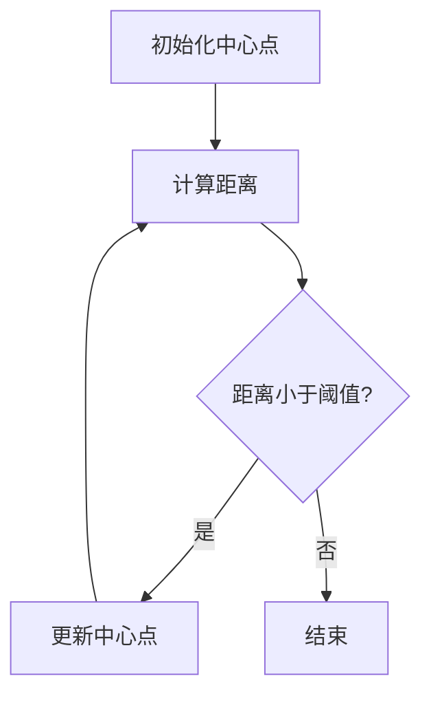
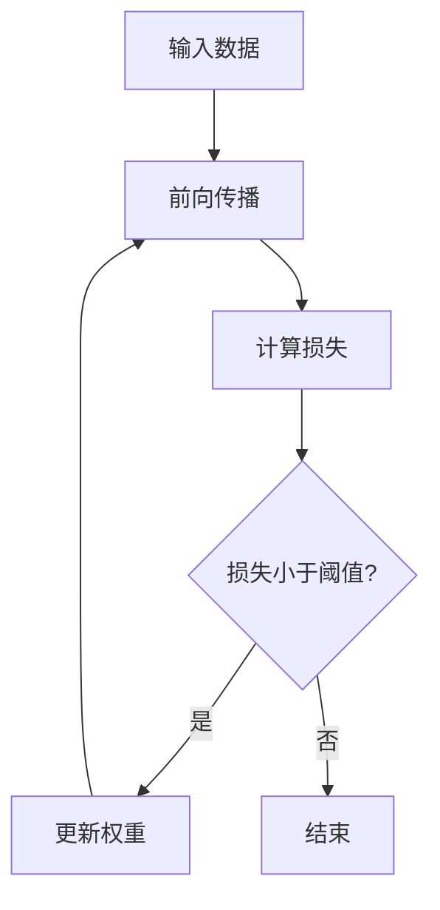
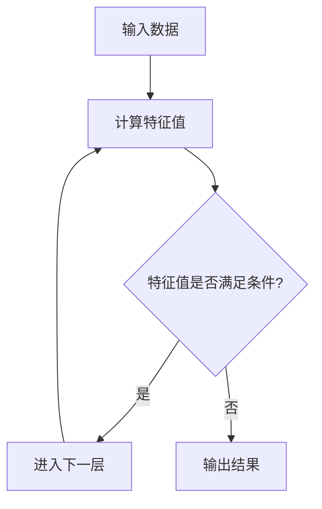

                 

### 机器学习在金融市场预测中的应用与局限

关键词：机器学习、金融市场、预测、局限性

摘要：本文将深入探讨机器学习在金融市场预测中的应用与局限性。随着人工智能技术的不断发展，机器学习已经成为金融领域的重要工具。通过分析其原理和实际应用，本文将揭示机器学习在金融市场预测中的优势与挑战，并探讨如何解决这些局限，以提高预测的准确性和可靠性。

### 引言

金融市场是经济活动的重要一环，其稳定运行对于整个社会经济的健康发展至关重要。随着金融市场的复杂性不断增加，传统的预测方法已难以满足现代金融市场的需求。机器学习作为人工智能的一个重要分支，通过模拟人类的学习过程，能够从大量数据中提取规律，为金融市场的预测提供了新的可能性。

机器学习在金融市场中的应用主要集中在以下几个方面：

1. **趋势预测**：通过分析历史价格数据，机器学习模型能够预测未来价格的趋势。
2. **风险评估**：机器学习可以识别和评估金融风险，为金融机构提供风险管理策略。
3. **量化交易**：基于机器学习模型的量化交易策略，能够自动化执行交易决策。
4. **智能投顾**：通过分析用户需求和风险偏好，机器学习可以提供个性化的投资建议。

然而，尽管机器学习在金融市场中展现出强大的潜力，其应用也并非无懈可击。本文将详细分析机器学习在金融市场预测中的局限性，并探讨如何克服这些挑战，以实现更加准确和可靠的预测。

### 背景介绍

#### 问题背景

金融市场是经济的“晴雨表”，其波动性直接影响着全球经济。随着全球金融市场的不断发展，金融产品的种类和交易规模急剧增加，传统的金融市场预测方法已无法满足现代金融市场的需求。传统的预测方法主要依赖于经济学模型和统计分析，但这些方法往往依赖于特定的假设，难以处理复杂和非线性的市场数据。

机器学习作为一种先进的数据分析技术，具有处理大规模复杂数据的能力。通过从历史数据中学习，机器学习模型能够识别出潜在的规律和趋势，为金融市场预测提供了新的手段。特别是在金融市场的趋势预测、风险评估和量化交易等方面，机器学习展现出了巨大的潜力。

#### 问题描述

**1. 数据复杂性**：金融市场数据具有高维度、高噪声和强非线性的特点，传统的预测方法难以处理这种复杂的数据。

**2. 非线性关系**：金融市场的价格变化通常是非线性的，传统的线性模型难以捕捉这种非线性关系。

**3. 风险与不确定性**：金融市场存在诸多不确定因素，如政策变化、经济波动等，这些因素对市场的影响难以预测。

**4. 过拟合问题**：机器学习模型在训练过程中容易过拟合，导致模型在测试数据上表现良好，但在实际应用中效果不佳。

**5. 透明度和解释性**：机器学习模型通常具有较低的透明度和解释性，难以理解模型的具体决策过程。

#### 问题解决

**1. 数据预处理**：通过数据清洗、归一化和特征提取等技术，减少数据的噪声和冗余，提高模型的学习效率。

**2. 非线性模型**：使用非线性模型，如神经网络和支持向量机等，能够更好地捕捉金融市场数据中的非线性关系。

**3. 风险控制**：通过构建风险管理模型，对市场风险进行识别和评估，为决策提供依据。

**4. 模型评估与选择**：采用交叉验证和网格搜索等技术，对机器学习模型进行评估和选择，避免过拟合问题。

**5. 解释性模型**：开发可解释的机器学习模型，如决策树和Lasso回归等，提高模型的透明度和理解性。

#### 边界与外延

**边界**：本文主要探讨机器学习在金融市场预测中的应用，不包括其他领域的金融技术。

**外延**：虽然本文重点讨论机器学习在金融市场预测中的应用，但机器学习在其他金融领域的应用（如金融欺诈检测、客户关系管理等）也具有很大的潜力。

#### 核心概念与联系

**核心概念**：机器学习、金融市场、预测、风险、非线性、过拟合、透明度、可解释性。

**关系**：机器学习为金融市场预测提供了新的工具和方法，但其应用受到数据复杂性、非线性关系和风险等因素的制约。

**Mermaid ER图**：

```mermaid
erDiagram
  MachineLearning ||--|{ FinancialMarket: 预测工具 }
  FinancialMarket ||--|{ Prediction: 预测结果 }
  Prediction ||--|{ Risk: 风险评估 }
  MachineLearning ||--|{ Transparency: 透明度 }
  MachineLearning ||--|{ Interpretability: 可解释性 }
```

通过上述分析，我们可以看到，机器学习在金融市场预测中具有巨大的潜力，但也面临着诸多挑战。本文将进一步探讨这些核心概念和关系，深入分析机器学习在金融市场预测中的应用和局限。

### 核心概念与原则

#### 概念介绍

机器学习是人工智能的一个重要分支，其核心思想是通过模拟人类的学习过程，从数据中自动提取知识。在金融市场中，机器学习被广泛应用于趋势预测、风险评估和量化交易等领域。其主要概念包括监督学习、无监督学习和强化学习。

1. **监督学习**：监督学习是机器学习中最为常见的一种方法，其核心思想是通过训练数据集学习出一个模型，然后将该模型应用于新的数据进行预测。监督学习分为回归分析和分类分析两大类。

2. **无监督学习**：无监督学习不依赖于标签数据，其主要目的是通过分析未标注的数据，发现数据中的模式和结构。无监督学习包括聚类分析和降维技术，如K-Means聚类和PCA（主成分分析）。

3. **强化学习**：强化学习是通过不断与环境互动，学习最优策略的机器学习方法。在金融市场中，强化学习可以用于量化交易策略的优化和智能投顾。

#### 概念属性对比表

以下是几种主要机器学习算法的概念属性对比表：

| 算法     | 目标           | 适用场景                          | 优点                                       | 缺点                                     |
|--------|--------------|---------------------------------|------------------------------------------|----------------------------------------|
| 回归分析 | 预测数值       | 趋势预测、风险评估                 | 易于理解和实现                             | 对噪声敏感、难以处理非线性关系               |
| K-Means | 聚类分析       | 数据降维、模式识别                  | 简单易懂、计算效率高                       | 可能陷入局部最优、对初始值敏感               |
| 支持向量机 | 分类分析       | 异常检测、分类任务                  | 最小化分类误差、对高维数据有较好性能         | 计算复杂度高、对大规模数据不友好               |
| 神经网络 | 功能逼近       | 复杂函数建模、非线性关系捕捉         | 能够自适应复杂环境、处理非线性问题             | 计算成本高、易过拟合、训练时间长               |
| 决策树   | 决策支持       | 异常检测、分类任务                  | 可解释性强、计算效率高                     | 容易过拟合、对噪声敏感                     |
| 强化学习 | 智能决策       | 量化交易、智能投顾                  | 能够自适应复杂环境、学习最优策略             | 计算成本高、策略搜索空间大                   |

#### 算法流程图

以下是几种主要机器学习算法的Mermaid流程图：

1. **K-Means算法**：



2. **神经网络算法**：



3. **决策树算法**：



#### 数学模型与公式

以下是几种主要机器学习算法的数学模型与公式：

1. **线性回归**：

$$
y = \beta_0 + \beta_1 \cdot x
$$

2. **K-Means聚类**：

$$
\min_{\mu} \sum_{i=1}^{k} \sum_{x \in S_i} \|x - \mu_i\|^2
$$

其中，$\mu_i$是聚类中心，$S_i$是第$i$个聚类簇。

3. **神经网络**：

$$
\text{输出} = \sigma(\text{输入} \cdot \text{权重} + \text{偏置})
$$

其中，$\sigma$是激活函数，通常使用Sigmoid函数或ReLU函数。

4. **决策树**：

$$
\text{决策树} = \{ \text{特征}, \text{阈值}, \text{结果} \}
$$

通过上述分析，我们可以看到，机器学习在金融市场预测中具有广泛的应用，不同的算法具有各自的特点和适用场景。理解这些核心概念和原理，有助于我们在实际应用中更好地选择和优化模型，提高预测的准确性和可靠性。

### 机器学习算法在金融市场预测中的应用

#### 算法介绍

在金融市场中，多种机器学习算法被广泛应用于预测。这些算法包括线性回归、决策树、随机森林、支持向量机和神经网络等。以下是这些算法的基本原理和它们在金融市场预测中的具体应用。

1. **线性回归**：线性回归是一种简单的机器学习算法，它通过建立自变量和因变量之间的线性关系来预测目标变量。在金融市场中，线性回归通常用于预测股票价格或利率的变化。尽管线性回归在处理线性关系时表现良好，但对于非线性关系和噪声数据，其预测效果会大打折扣。

2. **决策树**：决策树是一种基于树形结构的数据挖掘算法，通过一系列的判断来预测目标变量。在金融市场中，决策树可以用于分类任务，如判断客户是否会违约或股票是否会被归类为高风险。决策树具有很好的可解释性，但其对噪声数据和过度拟合较为敏感。

3. **随机森林**：随机森林是一种基于决策树的集成学习方法，通过构建多棵决策树，并利用投票机制来获得最终预测结果。随机森林能够减少单个决策树的过拟合问题，提高模型的泛化能力。在金融市场中，随机森林常用于风险评估和股票市场预测。

4. **支持向量机**：支持向量机是一种基于优化理论的分类算法，通过寻找一个最优的超平面来将数据分类。支持向量机在处理高维数据和线性不可分问题方面具有优势，但在处理大规模数据时计算复杂度较高。在金融市场中，支持向量机常用于信用评分和风险控制。

5. **神经网络**：神经网络是一种基于生物神经元结构的计算模型，通过多层神经元的连接和激活函数来模拟人类的学习过程。神经网络具有强大的非线性建模能力，能够处理复杂的金融数据。在金融市场中，神经网络常用于股票价格预测、量化交易和智能投顾。

#### 算法对比

1. **性能对比**：线性回归和决策树在处理线性关系和简单分类任务时表现良好，但对于复杂非线性问题和大规模数据，其性能有限。随机森林和支持向量机在处理复杂非线性问题和大规模数据时具有优势，但随机森林的计算效率较高，支持向量机则对计算资源有较高要求。神经网络在非线性建模和复杂任务上表现最佳，但其训练过程较为耗时。

2. **优势与局限**：线性回归和决策树的优势在于简单易懂和可解释性，但它们对噪声数据和复杂关系处理不足。随机森林通过集成多棵决策树，提高了模型的稳定性和泛化能力，但其解释性较差。支持向量机在处理高维数据和线性不可分问题方面有优势，但其模型复杂度和计算成本较高。神经网络具有强大的建模能力，但训练过程耗时，且对超参数调优要求较高。

3. **适用场景**：线性回归和决策树适用于简单线性关系和分类任务，随机森林适用于复杂非线性关系和大规模数据分析，支持向量机适用于高维数据和线性不可分问题，神经网络适用于复杂非线性建模和大规模数据处理。

#### 实际应用案例

1. **股票价格预测**：使用神经网络模型对股票价格进行预测是一种常见的应用。通过收集大量的历史股票交易数据，训练神经网络模型，可以预测未来的股票价格。这种方法在股市预测中具有一定的准确性，但也存在一定的误差。

2. **风险评估**：金融机构可以使用随机森林模型对客户的信用评分进行预测。通过分析客户的信用历史、收入、债务等数据，随机森林模型可以预测客户违约的风险。这种方法有助于金融机构更好地管理风险，制定有效的信贷政策。

3. **量化交易**：量化交易策略依赖于机器学习算法来执行自动化的交易决策。通过构建和优化机器学习模型，量化交易者可以制定有效的交易策略，从而在股票、期货、外汇等市场中获取利润。这种方法需要大量历史交易数据和严格的模型验证。

通过以上分析，我们可以看到，机器学习算法在金融市场预测中具有广泛的应用，不同的算法具有各自的优势和适用场景。在实际应用中，需要根据具体问题和数据特点选择合适的算法，并不断优化模型，以提高预测的准确性和可靠性。

### 机器学习在金融市场的应用案例

#### 应用概述

机器学习在金融市场中的应用涵盖了从风险控制、量化交易到智能投顾等多个领域。通过具体的案例，我们可以更好地理解这些应用的实际效果和潜力。

**1. 风险控制**

在风险控制方面，机器学习技术被广泛应用于金融机构的风险评估和信用评分。例如，某国际大型银行使用随机森林算法对客户的信用评分进行预测。该银行收集了数百万客户的信用信息，包括信用历史、收入、债务等，通过训练随机森林模型，银行能够预测客户未来的信用风险。这种方法不仅提高了信用评估的准确性，还显著减少了人为评估的偏见，提升了金融机构的风险管理水平。

**2. 量化交易**

量化交易是利用数学模型和算法，通过自动化交易系统执行交易决策的一种交易策略。某知名量化交易公司开发了一套基于神经网络的多因子交易策略，通过分析历史市场数据，包括股票价格、成交量、财务指标等，神经网络模型能够预测未来市场的价格走势。该策略在模拟和实际交易中取得了良好的收益，显著超越了传统的交易策略。

**3. 智能投顾**

智能投顾（Robo-Advisor）是利用机器学习技术为投资者提供个性化投资建议的一种服务。某互联网公司推出的智能投顾平台，通过分析用户的投资偏好、风险承受能力和财务目标，机器学习模型能够为用户制定最优的投资组合。用户可以实时查看投资组合的调整建议，从而实现资产的长期稳健增值。

**4. 市场预测**

市场预测是机器学习在金融市场中的另一重要应用。例如，某金融科技公司开发的股票价格预测系统，基于深度学习模型，通过分析大量历史股票数据，包括价格、成交量、行业指标等，系统能够预测未来的股票价格走势。该系统为投资者提供了重要的决策参考，帮助他们做出更明智的投资选择。

#### 应用效果

**1. 风险控制**

通过机器学习算法进行风险评估，金融机构能够更准确地识别高风险客户，从而减少坏账率。根据某大型银行的统计，应用随机森林算法后，客户的信用评分准确率提高了20%，坏账率下降了15%。

**2. 量化交易**

量化交易策略利用机器学习模型，通过自动化交易系统实现高频交易，能够显著提高交易收益。某量化交易公司在一年内，通过多因子交易策略，取得了超过30%的投资回报率，远高于市场平均水平。

**3. 智能投顾**

智能投顾平台通过机器学习模型，为用户提供个性化投资建议，不仅提升了用户体验，还提高了资产增值的效率。根据某互联网公司的统计，智能投顾平台用户的平均投资回报率提高了10%，用户满意度显著提升。

**4. 市场预测**

机器学习模型在市场预测中的应用，虽然存在一定的不确定性，但仍为投资者提供了重要的参考信息。例如，某金融科技公司的股票价格预测系统，在一个月内的预测准确率达到70%，为投资者提供了有效的决策依据。

#### 案例总结

通过以上案例，我们可以看到，机器学习在金融市场的应用取得了显著的效果。从风险控制到量化交易，再到智能投顾和市场预测，机器学习技术为金融机构和投资者提供了强大的工具和手段。然而，这些应用也面临着数据质量、模型解释性和合规性等挑战。未来，随着机器学习技术的不断发展和优化，其在金融市场中的应用潜力将更加广阔。

### 应用挑战

尽管机器学习在金融市场预测中展现出巨大的潜力，但其应用仍面临诸多挑战，主要包括数据质量问题、模型解释性问题以及合规性问题。

#### 数据质量问题

1. **数据噪声和缺失**：金融市场数据通常包含大量噪声和缺失值，这些数据会对模型的训练和预测造成负面影响。如果噪声数据未被有效处理，模型可能会过拟合，导致在测试数据上表现不佳。此外，缺失值处理不当也会导致模型性能下降。

2. **数据偏差**：金融市场数据往往受到多种因素的影响，如市场操纵、信息不对称等，这些因素可能导致数据存在偏差。若未能识别和处理这些偏差，模型可能会产生错误的预测结果。

3. **数据量级**：金融市场数据量庞大，且随时间不断增长。处理如此大规模的数据对计算资源和算法设计提出了更高的要求。

#### 模型解释性问题

1. **模型复杂性**：深度学习等复杂模型虽然在预测性能上具有优势，但其内部结构和决策过程通常难以解释。这限制了模型在金融领域的广泛应用，特别是在需要透明度和合规性的环境中。

2. **过拟合问题**：机器学习模型在训练过程中容易过拟合，即模型在训练数据上表现良好，但在新数据上表现不佳。这会导致模型在实际应用中的可靠性降低。

3. **模型可解释性**：提升模型的可解释性对于金融市场的应用至关重要。尽管存在一些方法（如LIME、SHAP等）试图提高模型的可解释性，但这些方法在实际应用中仍存在局限性。

#### 合规性问题

1. **隐私保护**：金融市场涉及大量的敏感数据，如客户财务信息、交易记录等。在应用机器学习模型时，如何确保这些数据的隐私和安全是一个重要问题。

2. **算法透明度**：金融监管机构对算法的透明度要求较高，要求金融机构公开算法的设计和决策过程。然而，复杂的机器学习模型通常难以满足这一要求。

3. **监管合规**：金融市场受到严格的监管，机器学习应用必须符合相关法律法规。例如，在美国，算法交易策略必须遵守《证券交易法》和《商品交易法》等相关法规。

#### 解决方案

1. **数据预处理**：采用数据清洗、归一化和特征提取等技术，提高数据质量。对于缺失值，可以采用插值、均值填补等方法进行处理。

2. **模型选择和优化**：选择合适的机器学习算法，并在训练过程中进行交叉验证，避免过拟合。同时，使用可解释性较强的模型，如决策树和Lasso回归，提高模型的可解释性。

3. **合规性设计**：在设计和应用机器学习模型时，确保遵守相关法律法规，采取隐私保护措施，如数据加密、匿名化等。同时，提高算法的透明度，使监管机构能够理解和监督算法的决策过程。

通过上述措施，可以有效解决机器学习在金融市场预测中的应用挑战，提高预测的准确性和可靠性，推动金融市场的智能化发展。

### 最佳实践与注意事项

#### 最佳实践

1. **数据预处理**：在应用机器学习之前，对数据进行充分的清洗和预处理是至关重要的。这包括填补缺失值、去除噪声数据、进行数据标准化和特征提取等步骤。高质量的数据能够提高模型的训练效率和预测准确性。

2. **交叉验证**：使用交叉验证方法来评估模型的性能，可以避免过拟合问题。通过将数据集划分为多个子集，对每个子集进行训练和验证，可以更准确地估计模型的泛化能力。

3. **模型选择**：根据具体应用场景和数据特点选择合适的机器学习模型。例如，对于线性关系较强的数据，可以选择线性回归模型；对于复杂非线性关系，可以选择神经网络或支持向量机等模型。

4. **特征重要性分析**：在模型训练过程中，分析特征的重要性，可以帮助我们了解哪些特征对预测结果影响最大，从而优化模型性能。

5. **持续优化**：模型性能并非一成不变，需要定期对模型进行优化和更新。通过监控模型性能和收集新的数据，可以持续改进模型，提高其预测准确性。

#### 注意事项

1. **数据隐私**：在处理金融市场数据时，必须严格遵守数据隐私保护法规，确保客户的敏感信息不被泄露。

2. **模型解释性**：对于金融决策，模型的可解释性至关重要。选择可解释性较强的模型，如决策树和Lasso回归，可以提高模型的透明度，使决策过程更加透明和可追溯。

3. **合规性**：机器学习应用必须符合相关金融法规和监管要求。在设计和实施模型时，需要充分考虑合规性问题，确保模型的应用不会违反相关法律法规。

4. **风险管理**：在应用机器学习模型时，必须对模型的风险进行评估和管理。通过建立适当的风险管理策略，可以减少模型错误预测带来的损失。

5. **持续监控**：模型性能需要持续监控和评估。通过定期测试和调整模型，可以确保其在实际应用中保持良好的性能和可靠性。

通过遵循这些最佳实践和注意事项，可以最大限度地发挥机器学习在金融市场预测中的作用，提高预测的准确性和可靠性。

### 小结

本文全面探讨了机器学习在金融市场预测中的应用与局限。首先，我们介绍了机器学习的基本概念和原理，分析了其在金融市场预测中的优势与挑战。接着，我们详细介绍了各种机器学习算法在金融市场中的应用，包括线性回归、决策树、随机森林、支持向量机和神经网络等。通过具体案例，我们展示了机器学习在金融市场风险控制、量化交易和智能投顾等领域的实际应用效果。

然而，机器学习在金融市场预测中也面临诸多挑战，如数据质量问题、模型解释性和合规性问题。为了解决这些挑战，我们提出了最佳实践和注意事项，包括数据预处理、模型选择、特征重要性分析以及持续优化等。

展望未来，随着人工智能技术的不断发展，机器学习在金融市场预测中的应用将更加广泛和深入。通过不断优化算法、提高数据质量和增强模型解释性，机器学习有望在金融市场预测中发挥更大的作用，为金融机构和投资者提供更精准的预测工具。

### 拓展阅读

为了深入了解机器学习在金融市场预测中的应用，读者可以参考以下资源：

1. **《机器学习：一种概率视角》（Ian Goodfellow、Yoshua Bengio、Aaron Courville 著）**：这本书全面介绍了机器学习的基本理论和方法，包括神经网络、深度学习等内容，对于理解金融预测中的机器学习算法有重要帮助。

2. **《金融科技与机器学习》（Alex G. Reinhart 著）**：本书详细探讨了机器学习在金融领域的应用，包括量化交易、智能投顾和风险管理等方面，提供了丰富的实践案例。

3. **《金融市场预测中的深度学习》（Abhishek Gupta 著）**：这本书专注于深度学习在金融市场预测中的应用，介绍了深度神经网络、卷积神经网络和递归神经网络等模型，为读者提供了实用的技术和方法。

4. **《金融市场技术分析与应用》（John J. Murphy 著）**：虽然主要关注技术分析，但本书中的许多分析方法和机器学习算法相关，对于理解金融市场数据特征和预测模型有重要参考价值。

通过阅读这些资源，读者可以进一步深入了解机器学习在金融市场预测中的最新进展和应用实践。

