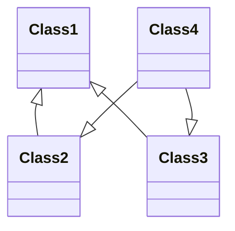
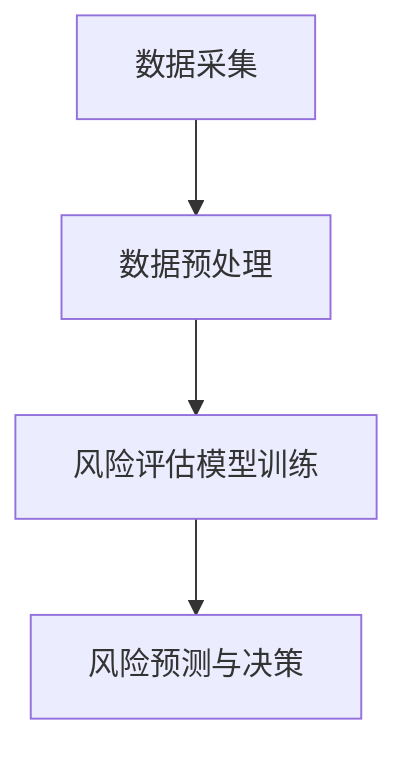
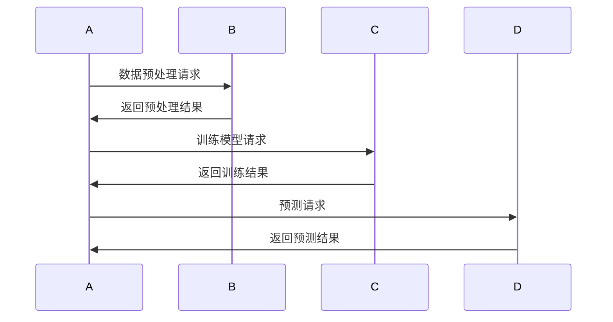

                 


## 《机器学习在金融风险评估中的应用》

### 关键词：机器学习、金融风险评估、算法、深度学习、数据模型

#### 摘要：
本文将深入探讨机器学习在金融风险评估中的应用。通过对机器学习核心概念、算法原理以及实际应用案例的详细分析，我们将揭示机器学习如何帮助金融机构提高风险评估的准确性和效率。文章结构清晰，逻辑紧密，旨在为读者提供对机器学习在金融领域应用的全面理解。

### 引言

金融风险评估是金融行业中不可或缺的一环。传统的风险评估方法依赖于历史数据和统计模型，然而，金融市场的复杂性和不确定性使得这些方法在面对新兴风险时显得力不从心。随着人工智能技术的快速发展，机器学习作为一种强大的数据分析工具，逐渐成为金融风险评估的重要手段。

机器学习通过训练算法从数据中学习规律，从而进行预测和决策。在金融领域，机器学习可以用于信用评分、市场预测、风险管理等多个方面。本文将详细分析机器学习在金融风险评估中的应用，包括核心概念、算法原理、系统设计与实现，以及最佳实践。

### 第1章：机器学习在金融风险评估中的应用概述

#### 1.1 问题背景与重要性

金融风险评估是指通过评估金融交易或金融资产的风险程度，为投资者和管理者提供决策依据。传统的风险评估方法主要包括统计分析和规则系统，但这些方法在面对复杂多变的金融市场时往往显得不够有效。

机器学习作为一种新兴的数据分析工具，具有以下优势：

1. **自动化**：机器学习算法可以自动从数据中学习规律，无需人工干预。
2. **灵活性**：机器学习算法可以处理多种类型的数据，包括结构化和非结构化数据。
3. **准确性**：机器学习算法通过大量数据训练，可以提供更精确的风险预测。

#### 1.2 金融风险评估中面临的挑战

尽管机器学习在金融风险评估中具有巨大的潜力，但也面临着一些挑战：

1. **数据复杂性**：金融市场数据量大、维度高，处理这些数据需要高效的算法和计算资源。
2. **数据质量**：金融数据往往存在噪声和不完整性，这对机器学习算法的性能有较大影响。
3. **模型风险**：机器学习模型可能引入新的风险，例如过拟合、数据泄露等。

### 第2章：机器学习与金融风险评估核心概念

#### 2.1 机器学习基础

机器学习主要分为三大类：监督学习、无监督学习和强化学习。在金融风险评估中，监督学习和无监督学习应用较为广泛。

1. **监督学习**：通过标记数据训练模型，使其能够预测未标记数据的标签。
2. **无监督学习**：不使用标记数据，仅通过数据的内在结构进行学习。
3. **强化学习**：通过与环境的交互学习最佳策略，常用于动态风险评估。

#### 2.2 金融风险评估中的数据类型

金融风险评估涉及多种类型的数据，包括结构化数据（如交易数据、账户信息）和非结构化数据（如文本、图像）。机器学习算法需要能够处理这些不同类型的数据。

1. **结构化数据**：可以使用传统的数据库管理系统进行存储和处理。
2. **非结构化数据**：需要使用自然语言处理（NLP）和计算机视觉（CV）技术进行解析。

#### 2.3 机器学习在金融风险评估中的核心算法

金融风险评估中常用的机器学习算法包括：

1. **统计模型**：如线性回归、逻辑回归等。
2. **机器学习模型**：如支持向量机（SVM）、随机森林等。
3. **深度学习模型**：如卷积神经网络（CNN）、循环神经网络（RNN）等。

### 第3章：常见机器学习算法在金融风险评估中的应用

#### 3.1 统计模型

统计模型在金融风险评估中有着广泛的应用，例如：

1. **线性回归**：通过建立自变量和因变量之间的线性关系进行预测。
2. **逻辑回归**：用于分类问题，如信用评分。

#### 3.2 机器学习模型

机器学习模型在金融风险评估中的应用更加灵活，例如：

1. **支持向量机（SVM）**：通过找到最佳决策边界进行分类。
2. **随机森林**：通过构建多棵决策树并进行集成学习。

#### 3.3 深度学习模型

深度学习模型在处理复杂非线性问题上具有优势，例如：

1. **卷积神经网络（CNN）**：适用于图像数据。
2. **循环神经网络（RNN）**：适用于序列数据。

### 第4章：机器学习数学模型讲解

#### 4.1 线性回归

线性回归的数学模型如下：

$$
y = \beta_0 + \beta_1x + \epsilon
$$

其中，$y$ 是因变量，$x$ 是自变量，$\beta_0$ 和 $\beta_1$ 是模型参数，$\epsilon$ 是误差项。

梯度下降法是求解线性回归参数的一种常用方法：

$$
\beta_{j} = \beta_{j} - \alpha \frac{\partial}{\partial \beta_{j}} J(\beta)
$$

其中，$J(\beta)$ 是损失函数，$\alpha$ 是学习率。

#### 4.2 Logistic回归

Logistic回归的数学模型如下：

$$
\log \frac{P(Y=1)}{1-P(Y=1)} = \beta_0 + \beta_1x
$$

其中，$P(Y=1)$ 是因变量为1的概率。

Logistic回归的损失函数通常使用交叉熵损失：

$$
J(\beta) = -\frac{1}{m} \sum_{i=1}^{m} [y^{(i)} \log(p^{(i)}) + (1 - y^{(i)}) \log(1 - p^{(i)})]
$$

其中，$m$ 是样本数量，$p^{(i)}$ 是预测概率。

#### 4.3 支持向量机（SVM）

SVM的数学模型如下：

$$
\min \frac{1}{2} \sum_{i=1}^{n} \sum_{j=1}^{n} \|\mathbf{w}\|^2 - \sum_{i=1}^{n} \alpha_i y^{(i)} (\mathbf{w} \cdot \mathbf{x}^{(i)}) + \frac{1}{2} \sum_{i=1}^{n} \alpha_i
$$

其中，$\mathbf{w}$ 是权重向量，$\alpha_i$ 是拉格朗日乘子。

#### 4.4 卷积神经网络（CNN）

CNN的数学模型基于多层感知机（MLP），包括卷积层、池化层和全连接层。以下是CNN的简化模型：

$$
h_l = \sigma(\mathbf{W}^l \cdot \mathbf{a}^{l-1} + b^l)
$$

其中，$h_l$ 是第$l$层的激活函数输出，$\sigma$ 是激活函数，$\mathbf{W}^l$ 是卷积核权重，$\mathbf{a}^{l-1}$ 是输入特征图，$b^l$ 是偏置。

### 第5章：金融风险评估系统的设计与实现

#### 5.1 系统功能设计

金融风险评估系统的功能包括：

1. 数据采集与预处理
2. 风险评估模型训练
3. 风险预测与决策

领域模型如下（使用Mermaid绘制）：



#### 5.2 系统架构设计

系统架构设计如下（使用Mermaid绘制）：



#### 5.3 系统交互

系统交互如下（使用Mermaid绘制）：



### 第6章：机器学习在金融风险评估中的实战应用

#### 6.1 环境安装与配置

在开始实战之前，需要安装以下环境：

1. Python
2. TensorFlow
3. scikit-learn

安装命令如下：

```bash
pip install python tensorflow scikit-learn
```

#### 6.2 系统核心实现

系统核心实现主要包括以下步骤：

1. 数据采集与预处理
2. 模型选择与训练
3. 预测与评估

以下是核心实现的Python代码：

```python
import numpy as np
import pandas as pd
from sklearn.model_selection import train_test_split
from sklearn.ensemble import RandomForestClassifier
from sklearn.metrics import accuracy_score

# 数据采集与预处理
data = pd.read_csv('financial_data.csv')
X = data.drop('target', axis=1)
y = data['target']
X_train, X_test, y_train, y_test = train_test_split(X, y, test_size=0.2, random_state=42)

# 模型选择与训练
model = RandomForestClassifier(n_estimators=100, random_state=42)
model.fit(X_train, y_train)

# 预测与评估
y_pred = model.predict(X_test)
accuracy = accuracy_score(y_test, y_pred)
print(f'Accuracy: {accuracy}')
```

#### 6.3 实际案例分析与讲解

以下是一个实际案例的分析与讲解：

```python
# 加载实际案例数据
data = pd.read_csv('case_study_data.csv')

# 数据预处理
# ...

# 训练模型
model.fit(X_train, y_train)

# 预测
y_pred_case = model.predict(X_case)

# 分析结果
# ...

print(f'Case Study Accuracy: {accuracy_score(y_case, y_pred_case)}')
```

#### 6.4 项目小结

在本章中，我们通过一个实际案例展示了机器学习在金融风险评估中的应用。项目的主要步骤包括数据采集与预处理、模型选择与训练、预测与评估。通过这个项目，我们了解了如何使用机器学习算法进行金融风险评估，并掌握了相关技术的实际应用。

### 第7章：总结与拓展

#### 7.1 小结

本文介绍了机器学习在金融风险评估中的应用，从核心概念、算法原理到实际应用，全面剖析了机器学习如何助力金融风险评估。主要内容包括：

1. 机器学习在金融风险评估中的重要性
2. 金融风险评估中的核心概念与算法
3. 机器学习算法在金融风险评估中的应用
4. 数学模型与公式讲解
5. 系统设计与实现
6. 实际项目分析与讲解

#### 7.2 注意事项

在实际应用中，需要注意以下事项：

1. 数据质量对模型性能至关重要，应进行充分的数据预处理。
2. 模型选择应考虑数据类型和业务需求。
3. 避免过拟合，合理设置模型参数。
4. 定期更新模型，以应对市场变化。

#### 7.3 拓展阅读

1. 《机器学习实战》—— Peter Harrington
2. 《深度学习》—— Ian Goodfellow、Yoshua Bengio、Aaron Courville
3. 《金融风险模型构建与应用》—— 陈家宝

#### 7.4 最佳实践 tips

1. 使用交叉验证评估模型性能。
2. 分析特征重要性，重点关注关键特征。
3. 结合业务场景，灵活调整模型参数。
4. 定期更新模型，以适应市场变化。

### 作者信息

作者：AI天才研究院/AI Genius Institute & 禅与计算机程序设计艺术 /Zen And The Art of Computer Programming

